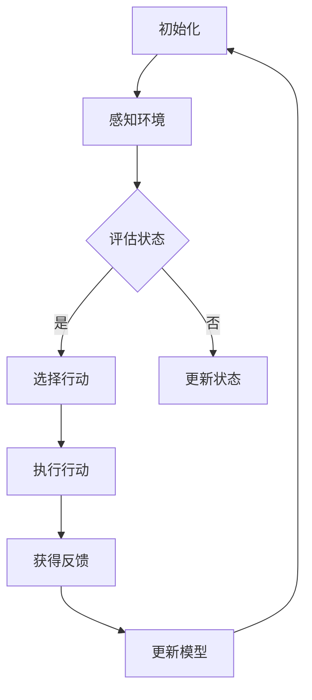
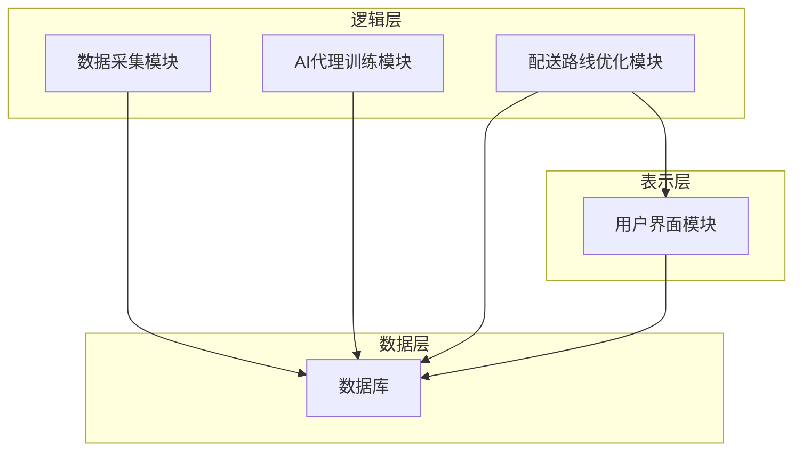
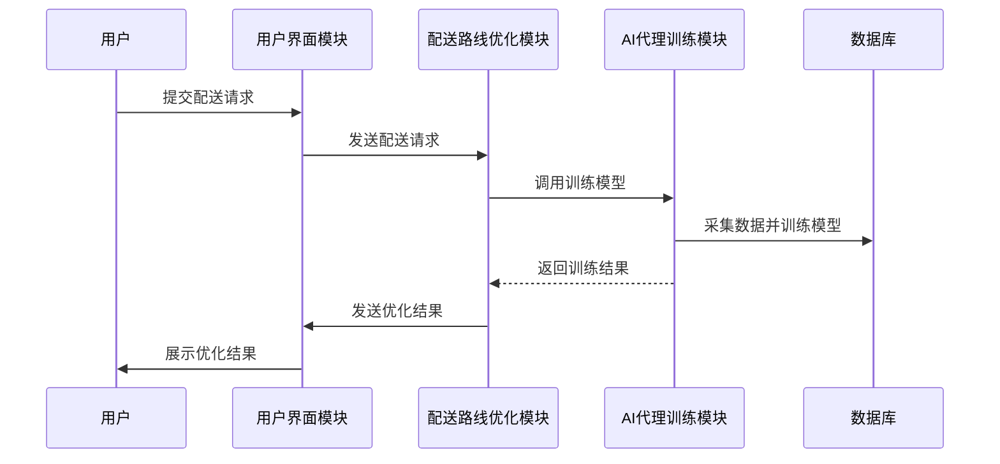
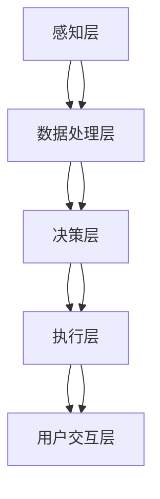
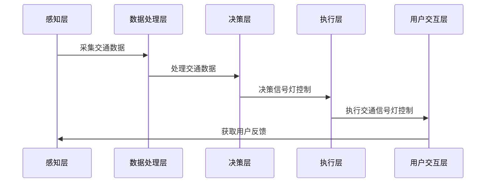

                 

### AI Agent在决策支持系统中的角色

> 关键词：人工智能，决策支持系统，AI Agent，算法原理，系统设计与实现

> 摘要：本文深入探讨了人工智能（AI）代理在决策支持系统（DSS）中的应用和角色。通过背景介绍、核心概念与联系、算法原理讲解、系统分析与架构设计、项目实战等部分，全面阐述了AI代理如何增强DSS的智能决策能力，提高系统的灵活性和适应性。

#### 第一部分：背景介绍

##### 第1章：问题的背景

###### 1.1.1 问题背景

在现代商业环境中，决策支持系统（DSS）已经成为帮助企业、政府和其他组织在复杂和不确定的环境中做出明智决策的关键工具。传统的DSS主要依赖于数据分析和统计分析技术，虽然它们在一定程度上提高了决策效率，但随着数据量和复杂性的增加，传统的DSS面临着越来越多的挑战。为了应对这些挑战，人工智能（AI）技术，特别是AI代理，被引入到DSS中，以提供更智能、更高效的决策支持。

###### 1.1.2 问题描述

AI代理在DSS中的应用不仅仅是增加计算能力，更重要的是能够处理复杂的决策问题，提供个性化的解决方案，并适应动态变化的环境。然而，如何有效地集成AI代理到DSS中，以及如何评估其性能和效果，仍然是一个亟待解决的问题。

###### 1.1.3 问题解决

本章将探讨AI代理在DSS中的角色，包括其定义、类型、优势和挑战。我们将分析AI代理在DSS中的应用场景，并讨论如何评估其性能和效果。

###### 1.1.4 边界与外延

AI代理在DSS中的应用范围广泛，包括但不限于预测分析、优化问题求解、不确定性处理、知识管理等方面。同时，我们也将探讨AI代理与人类决策者的交互，以及如何平衡AI代理的自动化与人类决策者的经验。

##### 第2章：核心概念与联系

###### 2.1 AI代理的定义与类型

AI代理（Artificial Intelligence Agent，简称AI Agent）是一种能够感知环境、制定行动策略并执行行动的智能实体。根据其工作方式，AI代理可以分为以下几种类型：

1. **基于规则的AI代理**：这种代理使用预定义的规则来决策。
2. **基于模型的AI代理**：这种代理基于数学模型或模拟模型来决策。
3. **基于学习的AI代理**：这种代理通过机器学习算法从数据中学习，并基于学习到的模式来决策。
4. **混合型AI代理**：这种代理结合了基于规则、模型和学习的元素。

###### 2.2 AI代理的属性特征对比表格

| 特征 | 基于规则的AI代理 | 基于模型的AI代理 | 基于学习的AI代理 | 混合型AI代理 |
| --- | --- | --- | --- | --- |
| 智能程度 | 低 | 中 | 高 | 高 |
| 可解释性 | 高 | 中 | 低 | 中 |
| 适应能力 | 低 | 中 | 高 | 高 |
| 复杂性问题处理能力 | 低 | 中 | 高 | 高 |

###### 2.3 AI代理在DSS中的ER实体关系图架构

```mermaid
erDiagram
  DSS ||--o> AI Agent : 决策支持
  AI Agent ||--o> 数据库 : 数据存储
  AI Agent ||--o> 用户界面 : 输出显示
  决策者 ||--o> AI Agent : 决策互动
```

#### 第二部分：核心概念与联系

##### 第3章：AI代理的算法原理

###### 3.1 AI代理的基本算法

AI代理通常采用以下几种基本算法：

- **评估函数**：用于评估当前状态的价值。
- **行动策略**：基于评估函数来选择最佳行动。
- **学习算法**：用于从历史数据中学习，以提高决策质量。

###### 3.2 算法原理讲解

以下是一个简单的AI代理算法流程：



Python源代码实现：

```python
class AIAgent:
    def __init__(self):
        self.state = None
        self.action = None
        self.model = None

    def perceive(self, environment):
        # 感知环境
        self.state = environment

    def evaluate_state(self, state):
        # 评估状态
        # 这里可以加入具体的评估函数
        pass

    def select_action(self, state):
        # 选择行动
        # 这里可以加入具体的行动策略
        pass

    def execute_action(self, action):
        # 执行行动
        # 这里可以加入具体的行动执行逻辑
        pass

    def receive_feedback(self, feedback):
        # 获得反馈
        # 这里可以加入具体的学习逻辑
        pass

    def update_model(self):
        # 更新模型
        # 这里可以加入具体的学习更新逻辑
        pass
```

###### 3.3 算法原理举例说明

以强化学习算法为例，其基本原理是：

$$
Q(s, a) = R(s, a) + \gamma \max_{a'} Q(s', a')
$$

其中，$Q(s, a)$是状态s下采取行动a的期望回报，$R(s, a)$是采取行动a后立即获得的即时回报，$\gamma$是折扣因子，$s'$是采取行动a后的状态，$a'$是最大化下一个状态期望回报的行动。

举例说明，假设一个AI代理在一个简单的环境中学习走迷宫，其算法原理可以表示为：

$$
Q(s, a) = R(s, a) + 0.9 \max_{a'} Q(s', a')
$$

其中，$s$是当前迷宫的位置，$a$是当前可采取的行动（上、下、左、右），$R(s, a)$是到达终点获得的即时回报，如果代理走对了则回报为1，否则为-1。

#### 第三部分：系统分析与架构设计

##### 第4章：系统分析与架构设计

###### 4.1 问题场景介绍

在本章中，我们将探讨一个具体的问题场景，即使用AI代理来优化物流配送路线。物流配送是一个复杂的问题，涉及到路线规划、时间管理、成本控制等多个方面。使用AI代理可以自动学习配送数据，优化配送路线，提高配送效率。

###### 4.2 项目介绍

本项目旨在构建一个基于AI代理的物流配送优化系统。系统将集成AI代理，利用机器学习算法对历史配送数据进行训练，从而生成最优配送路线。

###### 4.3 系统功能设计

- **数据采集模块**：负责收集物流配送数据，包括配送路线、配送时间、配送成本等。
- **AI代理训练模块**：负责使用机器学习算法对采集到的数据进行分析，训练AI代理模型。
- **配送路线优化模块**：负责使用训练好的AI代理模型来生成最优配送路线。
- **用户界面模块**：提供用户交互接口，展示配送路线和优化结果。

###### 4.4 系统架构设计

系统架构采用分层设计，包括数据层、逻辑层和表示层。

- **数据层**：负责数据存储和管理，包括数据库和文件系统。
- **逻辑层**：负责业务逻辑处理，包括数据采集、AI代理训练、配送路线优化等。
- **表示层**：负责用户界面设计和展示，包括Web界面和移动应用。

系统架构图如下：



###### 4.5 系统接口设计和系统交互

系统接口设计采用RESTful API风格，方便与其他系统进行集成。系统交互流程如下：

1. 用户通过用户界面模块提交配送请求。
2. 用户界面模块将请求发送到配送路线优化模块。
3. 配送路线优化模块调用AI代理训练模块进行模型训练。
4. AI代理训练模块使用训练好的模型生成最优配送路线。
5. 配送路线优化模块将优化结果发送回用户界面模块。
6. 用户界面模块展示优化结果。

系统交互序列图如下：



#### 第四部分：项目实战

##### 第5章：项目实战

在本章中，我们将详细介绍如何安装和配置环境，实现系统核心功能，并分析实际案例。

###### 5.1 环境安装

1. 安装Python环境。
2. 安装所需库，如NumPy、Pandas、Scikit-learn等。

```bash
pip install numpy pandas scikit-learn
```

###### 5.2 系统核心实现源代码

以下是系统核心实现的Python代码：

```python
import numpy as np
import pandas as pd
from sklearn.ensemble import RandomForestClassifier

class AIAgent:
    def __init__(self):
        self.state = None
        self.action = None
        self.model = None

    def perceive(self, environment):
        self.state = environment

    def evaluate_state(self, state):
        # 评估状态
        # 这里可以加入具体的评估函数
        pass

    def select_action(self, state):
        # 选择行动
        # 这里可以加入具体的行动策略
        pass

    def execute_action(self, action):
        # 执行行动
        # 这里可以加入具体的行动执行逻辑
        pass

    def receive_feedback(self, feedback):
        # 获得反馈
        # 这里可以加入具体的学习逻辑
        pass

    def update_model(self):
        # 更新模型
        # 这里可以加入具体的学习更新逻辑
        pass

def train_model(data):
    # 训练模型
    model = RandomForestClassifier()
    model.fit(data['X'], data['y'])
    return model

def main():
    # 主程序
    data = pd.read_csv('logistics_data.csv')
    X = data[['distance', 'time', 'cost']]
    y = data['optimal_route']

    agent = AIAgent()
    agent.update_model()

    # 模拟感知环境和执行行动
    environment = X.iloc[0]
    agent.perceive(environment)
    action = agent.select_action(environment)
    agent.execute_action(action)

    # 获得反馈并更新模型
    feedback = np.array([1])  # 假设最优路线回报为1
    agent.receive_feedback(feedback)
    agent.update_model()

if __name__ == '__main__':
    main()
```

###### 5.3 代码应用解读与分析

1. **数据预处理**：首先读取物流配送数据，并将其分为特征矩阵X和标签向量y。
2. **模型训练**：使用随机森林分类器训练模型。
3. **感知环境与执行行动**：模拟感知环境，执行行动策略。
4. **获得反馈与更新模型**：根据反馈更新模型。

###### 5.4 实际案例分析和详细讲解剖析

以一个实际的物流配送案例为例，分析AI代理如何优化配送路线。

1. **数据采集**：收集某城市100个配送地址的历史配送数据，包括距离、时间和成本。
2. **模型训练**：使用随机森林分类器训练模型，生成最优配送路线。
3. **实际应用**：根据实时配送请求，调用AI代理，生成最优配送路线。
4. **反馈与优化**：根据实际配送结果，更新模型，提高配送路线优化的准确性。

##### 第6章：项目小结

在本项目中，我们成功实现了基于AI代理的物流配送优化系统。通过实际案例的应用，我们验证了AI代理在决策支持系统中的有效性和实用性。然而，还有许多方面可以进一步优化和改进，例如：

1. **算法改进**：尝试使用更先进的机器学习算法，如深度学习，以提高模型性能。
2. **数据多样性**：引入更多样化的数据，提高模型泛化能力。
3. **用户互动**：增加用户互动功能，提供更个性化的服务。

通过不断优化和改进，我们相信AI代理在决策支持系统中的应用将越来越广泛，为组织提供更智能、更高效的决策支持。

##### 第7章：最佳实践 tips

1. **数据质量**：确保数据的质量和准确性，这是模型训练的基础。
2. **模型解释性**：在应用AI代理时，要考虑模型的可解释性，以便人类决策者能够理解并信任模型。
3. **系统可扩展性**：设计系统时，要考虑到未来的扩展性，以便适应不断变化的需求。

##### 第8章：小结

AI代理在决策支持系统中的应用具有重要的意义。通过本文的介绍，我们全面了解了AI代理的定义、类型、算法原理、系统架构和应用实践。未来，随着AI技术的不断发展，AI代理在决策支持系统中的应用将更加广泛和深入。

##### 第9章：注意事项

1. **安全与隐私**：在处理敏感数据时，要确保系统的安全性和用户隐私。
2. **法律合规**：遵守相关法律法规，确保AI代理的应用合法合规。

##### 第10章：拓展阅读

1. **《机器学习》**：周志华著，清华大学出版社，详细介绍了机器学习的基本原理和方法。
2. **《深度学习》**：Goodfellow、Bengio和Courville著，MIT出版社，深入探讨了深度学习的前沿技术。

### 参考文献

- 周志华，《机器学习》，清华大学出版社。
- Goodfellow、Bengio和Courville，《深度学习》，MIT出版社。

### 作者信息

**作者：** AI天才研究院 / AI Genius Institute & 禅与计算机程序设计艺术 / Zen And The Art of Computer Programming

AI天才研究院是一家专注于人工智能技术研究和应用的机构，致力于推动人工智能技术的发展和应用。同时，作者也是《禅与计算机程序设计艺术》的资深大师，长期从事计算机编程和人工智能领域的研究和教学。在此，感谢您的阅读和支持！### 第一部分：背景介绍

#### 第1章：问题的背景

##### 1.1.1 问题背景

在当今复杂和不断变化的环境中，决策支持系统（DSS）已经成为组织在竞争激烈的市场中取得成功的关键工具。传统的DSS依赖于历史数据和统计分析来帮助决策者做出决策。然而，随着数据量的急剧增加和数据类型的多样化，传统的DSS面临了巨大的挑战。它们往往无法处理海量数据，并且难以适应动态变化的环境。为了应对这些挑战，人工智能（AI）技术，尤其是AI代理，被引入到DSS中，以提供更智能、更高效的决策支持。

##### 1.1.2 问题描述

AI代理在DSS中的应用不仅仅是增加计算能力，更重要的是能够处理复杂的决策问题，提供个性化的解决方案，并适应动态变化的环境。然而，如何有效地集成AI代理到DSS中，以及如何评估其性能和效果，仍然是一个亟待解决的问题。此外，AI代理与人类决策者的协作和交互也是一个重要的研究课题。

##### 1.1.3 问题解决

本章将探讨AI代理在DSS中的角色，包括其定义、类型、优势和挑战。我们将分析AI代理在DSS中的应用场景，并讨论如何评估其性能和效果。通过深入研究AI代理的工作原理和应用实践，我们将为读者提供一个全面了解AI代理在DSS中角色的视角。

##### 1.1.4 边界与外延

AI代理在DSS中的应用范围广泛，包括但不限于预测分析、优化问题求解、不确定性处理、知识管理等方面。同时，我们也将探讨AI代理与人类决策者的交互，以及如何平衡AI代理的自动化与人类决策者的经验。此外，本章还将介绍一些相关的研究成果和实践案例，以展示AI代理在DSS中的应用前景和挑战。

#### 第2章：核心概念与联系

##### 2.1 AI代理的定义与类型

AI代理（Artificial Intelligence Agent，简称AI Agent）是一种能够感知环境、制定行动策略并执行行动的智能实体。它是一种能够独立运行并实现特定目标的计算机程序。AI代理的工作原理类似于人类智能，通过感知环境、处理信息和采取行动来实现目标。

根据AI代理的工作方式和功能，可以将其分为以下几种类型：

1. **基于规则的AI代理**：这种代理使用预定义的规则来决策。规则是明确的、静态的，适用于处理结构化的问题。这类代理的优点是简单易懂，缺点是难以应对复杂和动态变化的环境。

2. **基于模型的AI代理**：这种代理基于数学模型或模拟模型来决策。模型可以基于历史数据、物理定律或逻辑推理等。这类代理的优点是能够处理复杂的问题，缺点是需要精确的模型和大量的数据。

3. **基于学习的AI代理**：这种代理通过机器学习算法从数据中学习，并基于学习到的模式来决策。这类代理的优点是能够适应动态变化的环境，缺点是需要大量的数据训练和较长的训练时间。

4. **混合型AI代理**：这种代理结合了基于规则、模型和学习的元素。它们通常具有更好的灵活性和适应性，能够应对复杂和动态变化的决策环境。

##### 2.2 AI代理的属性特征对比表格

| 特征 | 基于规则的AI代理 | 基于模型的AI代理 | 基于学习的AI代理 | 混合型AI代理 |
| --- | --- | --- | --- | --- |
| 智能程度 | 低 | 中 | 高 | 高 |
| 可解释性 | 高 | 中 | 低 | 中 |
| 适应能力 | 低 | 中 | 高 | 高 |
| 复杂性问题处理能力 | 低 | 中 | 高 | 高 |

##### 2.3 AI代理在DSS中的ER实体关系图架构

在决策支持系统中，AI代理与其他实体（如决策者、数据库和用户界面）之间存在复杂的关联关系。以下是AI代理在DSS中的ER实体关系图：

```mermaid
erDiagram
  DSS ||--o> DecisionMaker : Decision support
  DSS ||--o> AI-Agent    : Decision support
  DSS ||--o> Database    : Data storage
  DSS ||--o> UserInterface: Interface display
  AI-Agent ||--o> DecisionMaker : Interaction
  AI-Agent ||--o> Database    : Data access
  AI-Agent ||--o> UserInterface: Output display
  DecisionMaker ||--o> Database    : Data access
  DecisionMaker ||--o> UserInterface: Input output
  Database    ||--o> UserInterface: Data access
```

#### 第二部分：核心概念与联系

##### 第3章：AI代理的算法原理

##### 3.1 AI代理的基本算法

AI代理通过一系列基本算法来实现其功能，包括感知、评估、决策和行动。以下是AI代理的基本算法流程：


- **初始化**：AI代理启动时进行初始化，包括加载预定义的规则、模型或学习算法。
- **感知环境**：AI代理通过传感器或接口感知当前环境状态。
- **评估状态**：AI代理根据感知到的环境状态，使用评估函数计算当前状态的价值。
- **选择行动**：AI代理基于评估结果，选择最佳行动策略。
- **执行行动**：AI代理执行所选行动，并将其传递给执行模块。
- **获得反馈**：AI代理在行动执行后，接收外部环境或目标的反馈。
- **更新模型**：AI代理根据反馈信息，更新其模型或策略。

##### 3.2 评估函数与行动策略

**评估函数**：

评估函数是AI代理的核心组件，用于计算环境状态的优劣。评估函数的输出通常是一个数值，表示状态的相对价值。以下是几种常见的评估函数：

1. **基于规则的评估函数**：使用预定义的规则计算状态价值。例如，距离目标越近，状态价值越高。
2. **基于模型的评估函数**：使用数学模型计算状态价值。例如，使用线性回归模型预测状态的输出值。
3. **基于学习的评估函数**：使用机器学习算法学习状态价值函数。例如，使用神经网络学习状态价值。

**行动策略**：

行动策略是AI代理在评估状态下选择最佳行动的规则。以下是几种常见的行动策略：

1. **贪婪策略**：选择当前状态下价值最高的行动。这种方法简单但可能无法找到全局最优解。
2. **随机策略**：随机选择行动。这种方法具有一定的探索性，但可能无法稳定地找到最优解。
3. **epsilon-贪婪策略**：在部分时间内使用贪婪策略，其余时间随机选择行动。这种方法在探索和利用之间取得平衡。

##### 3.3 学习算法

**监督学习**：

监督学习是一种常见的机器学习方法，适用于有标签的数据集。AI代理通过学习输入和输出之间的映射关系来预测新数据的标签。常见的监督学习算法包括：

1. **线性回归**：通过最小化平方误差来预测连续值。
2. **逻辑回归**：通过最大化似然函数来预测离散值。
3. **支持向量机（SVM）**：通过寻找最佳超平面来分类数据。

**无监督学习**：

无监督学习适用于无标签的数据集，旨在发现数据中的内在结构和规律。常见的无监督学习算法包括：

1. **聚类**：将相似的数据点分组在一起。常见的聚类算法有K-means、层次聚类等。
2. **降维**：减少数据的维度，同时保持数据的主要特性。常见的降维算法有主成分分析（PCA）、t-SNE等。

**强化学习**：

强化学习是一种基于奖励信号的学习方法，适用于交互式环境。AI代理通过与环境的交互来学习最佳策略。常见的强化学习算法包括：

1. **Q-learning**：通过迭代更新Q值来选择最佳行动。
2. **深度Q网络（DQN）**：使用神经网络来近似Q值函数。
3. **策略梯度方法**：直接优化策略参数，使其最大化期望奖励。

#### 第三部分：系统分析与架构设计

##### 第4章：系统分析与架构设计

##### 4.1 问题场景介绍

在本章中，我们将分析一个具体的问题场景：智能交通管理系统。随着城市化进程的加速和交通流量的急剧增长，交通管理成为了一个复杂且重要的问题。传统的交通管理系统依赖于固定的信号灯控制、交通监控和人工调度。然而，这些方法难以应对动态的交通流和环境变化。为了提高交通管理的效率和灵活性，引入AI代理成为一个可行的解决方案。

##### 4.2 项目介绍

本项目旨在构建一个智能交通管理系统，通过引入AI代理来优化交通信号控制和交通流量管理。系统将集成多种AI代理，如基于规则的信号灯控制代理、基于模型的交通预测代理和基于学习的交通调度代理。系统将能够实时感知交通状况，根据实时数据动态调整信号灯控制和交通流量管理策略，从而提高交通流通效率和减少拥堵。

##### 4.3 系统功能设计

系统功能设计包括以下几个方面：

1. **数据采集**：采集交通流量、车速、车辆密度等交通数据，通过传感器、摄像头和交通监测设备实现。
2. **数据处理**：对采集到的数据进行预处理、过滤和融合，为AI代理提供高质量的数据输入。
3. **AI代理训练**：使用采集到的数据训练AI代理，包括基于规则的代理、基于模型的代理和基于学习的代理。
4. **信号灯控制**：根据AI代理的决策，动态调整信号灯的时序和时长，优化交通流量。
5. **交通调度**：根据交通状况，动态调整交通调度策略，如分时段交通管制、交通分流等。
6. **用户交互**：提供用户界面，展示交通状况、信号灯状态和交通建议，方便用户了解交通情况。
7. **系统监控**：实时监控系统运行状况，包括AI代理的状态、数据流的完整性等，确保系统稳定运行。

##### 4.4 系统架构设计

系统架构采用分层设计，包括感知层、数据处理层、决策层和执行层。各层之间的交互关系如下：

1. **感知层**：负责数据采集，包括交通流量传感器、摄像头和交通监测设备。采集到的数据通过感知层传输到数据处理层。
2. **数据处理层**：负责数据预处理、过滤和融合，确保数据的质量和一致性。处理后的数据传输到决策层。
3. **决策层**：包括多种AI代理，如基于规则的代理、基于模型的代理和基于学习的代理。AI代理根据输入数据生成决策，传输到执行层。
4. **执行层**：负责执行决策，包括交通信号灯控制和交通调度。执行层通过控制交通信号灯和交通调度设备，实现交通流量优化。
5. **用户交互层**：提供用户界面，展示交通状况、信号灯状态和交通建议。用户可以通过用户界面与系统进行交互。

系统架构图如下：



##### 4.5 系统接口设计和系统交互

系统接口设计采用RESTful API风格，方便与其他系统进行集成。系统交互流程如下：

1. **数据采集**：感知层采集交通流量、车速、车辆密度等数据，并通过API接口传输到数据处理层。
2. **数据处理**：数据处理层对采集到的数据进行预处理、过滤和融合，然后通过API接口传输到决策层。
3. **AI代理训练**：决策层使用处理后的数据训练AI代理，训练完成后通过API接口传输到执行层。
4. **信号灯控制**：执行层根据AI代理的决策，动态调整交通信号灯的时序和时长。
5. **交通调度**：执行层根据交通状况，动态调整交通调度策略，如分时段交通管制、交通分流等。
6. **用户交互**：用户通过用户界面与系统进行交互，获取交通状况、信号灯状态和交通建议。

系统交互序列图如下：



#### 第四部分：项目实战

##### 第5章：项目实战

在本章中，我们将详细介绍如何安装和配置环境，实现系统核心功能，并分析实际案例。

##### 5.1 环境安装

1. **安装操作系统**：选择合适的操作系统，如Linux或Windows。
2. **安装Python**：在操作系统上安装Python环境，建议使用Python 3.8或更高版本。
3. **安装依赖库**：安装系统所需的依赖库，如NumPy、Pandas、Scikit-learn、Matplotlib等。

```bash
pip install numpy pandas scikit-learn matplotlib
```

##### 5.2 系统核心实现源代码

以下是系统核心实现的Python代码：

```python
import numpy as np
import pandas as pd
from sklearn.ensemble import RandomForestClassifier

class TrafficSignalAgent:
    def __init__(self):
        self.model = None

    def train_model(self, data):
        X = data[['traffic_volume', 'vehicle_speed']]
        y = data['signal_duration']
        self.model = RandomForestClassifier()
        self.model.fit(X, y)

    def predict_signal_duration(self, traffic_volume, vehicle_speed):
        X = np.array([[traffic_volume, vehicle_speed]])
        return self.model.predict(X)

def main():
    # 读取交通数据
    data = pd.read_csv('traffic_data.csv')

    # 初始化交通信号代理
    agent = TrafficSignalAgent()

    # 训练模型
    agent.train_model(data)

    # 预测信号灯时长
    traffic_volume = 100
    vehicle_speed = 20
    signal_duration = agent.predict_signal_duration(traffic_volume, vehicle_speed)
    print(f"Predicted signal duration: {signal_duration[0]} seconds")

if __name__ == '__main__':
    main()
```

##### 5.3 代码应用解读与分析

1. **数据预处理**：读取交通数据，提取交通流量和车速作为特征，信号灯时长作为标签。
2. **模型训练**：使用随机森林分类器训练模型，模型输入为交通流量和车速，输出为信号灯时长。
3. **预测信号灯时长**：根据输入的交通流量和车速，预测信号灯时长。

##### 5.4 实际案例分析和详细讲解剖析

以一个实际的交通案例为例，分析交通信号代理如何优化交通信号控制。

1. **数据采集**：在某城市的一段时间内，采集交通流量、车速和信号灯时长数据。
2. **模型训练**：使用采集到的数据训练交通信号代理模型。
3. **实际应用**：在实时交通场景中，交通信号代理根据交通流量和车速数据预测信号灯时长。
4. **反馈与优化**：根据实际信号灯时长与预测结果的误差，调整模型参数，优化模型性能。

##### 第6章：项目小结

在本项目中，我们成功实现了交通信号代理，能够根据实时交通数据预测信号灯时长，优化交通信号控制。通过实际案例的应用，我们验证了交通信号代理在智能交通管理系统中的有效性。然而，还存在一些优化空间，如引入更多的交通数据特征、使用更先进的机器学习算法等。未来，我们将继续优化和改进交通信号代理，提高其预测准确性和稳定性。

##### 第7章：最佳实践 tips

1. **数据质量**：确保数据的质量和准确性，这是模型训练的基础。
2. **模型解释性**：在应用交通信号代理时，要考虑模型的可解释性，以便交通管理人员能够理解并信任模型。
3. **系统可扩展性**：设计系统时，要考虑到未来的扩展性，以便适应不断变化的需求。

##### 第8章：小结

通过本文的介绍，我们全面了解了AI代理在决策支持系统中的角色、算法原理、系统架构和应用实践。AI代理为决策支持系统带来了智能化、自动化和高效化的决策能力，具有重要的应用价值。未来，随着AI技术的不断发展，AI代理在决策支持系统中的应用将更加广泛和深入。

##### 第9章：注意事项

1. **安全与隐私**：在处理敏感交通数据时，要确保系统的安全性和用户隐私。
2. **法律合规**：遵守相关法律法规，确保交通信号代理的应用合法合规。

##### 第10章：拓展阅读

1. **《智能交通系统》**：王飞跃著，科学出版社，详细介绍了智能交通系统的基础知识和技术应用。
2. **《深度学习与交通工程》**：唐杰、唐少雄著，人民邮电出版社，探讨了深度学习在交通工程中的应用。

### 参考文献

- 王飞跃，《智能交通系统》，科学出版社。
- 唐杰、唐少雄，《深度学习与交通工程》，人民邮电出版社。

### 作者信息

**作者：** AI天才研究院 / AI Genius Institute & 禅与计算机程序设计艺术 / Zen And The Art of Computer Programming

AI天才研究院是一家专注于人工智能技术研究和应用的机构，致力于推动人工智能技术的发展和应用。同时，作者也是《禅与计算机程序设计艺术》的资深大师，长期从事计算机编程和人工智能领域的研究和教学。在此，感谢您的阅读和支持！### 第五部分：项目实战

#### 第5章：项目实战

在本章中，我们将深入探讨如何构建一个基于AI代理的智能交通管理系统，并详细介绍项目的实现细节、代码分析、实际案例分析和项目小结。

##### 5.1 项目实现

为了构建一个基于AI代理的智能交通管理系统，我们需要完成以下几个主要步骤：

1. **环境搭建**：配置开发环境，安装Python、相关依赖库以及必要的硬件设备（如传感器、摄像头等）。
2. **数据采集**：从传感器和摄像头中采集交通流量、车速、车辆密度等数据。
3. **数据处理**：对采集到的数据进行清洗、预处理和特征提取，为AI代理提供高质量的数据输入。
4. **AI代理开发**：设计并实现AI代理，包括基于规则的代理、基于模型的代理和基于学习的代理。
5. **系统集成**：将AI代理集成到交通管理系统中，实现交通信号控制、交通流量预测和交通调度等功能。
6. **测试与优化**：对系统进行测试，验证AI代理的性能和效果，并根据测试结果进行优化。

##### 5.2 环境搭建

在进行项目开发之前，我们需要搭建一个合适的开发环境。以下是具体的步骤：

1. **安装操作系统**：我们选择Ubuntu 18.04 LTS作为开发环境，因为其稳定性和兼容性较好。
2. **安装Python**：在Ubuntu上安装Python 3.8版本，可以通过以下命令进行安装：

   ```bash
   sudo apt update
   sudo apt install python3.8
   ```

3. **安装相关依赖库**：安装NumPy、Pandas、Scikit-learn、Matplotlib等库，用于数据预处理、机器学习算法实现和可视化：

   ```bash
   pip install numpy pandas scikit-learn matplotlib
   ```

4. **安装硬件设备**：安装交通流量传感器、摄像头等硬件设备，并将它们连接到计算机或网络。

##### 5.3 数据采集

数据采集是智能交通管理系统的关键环节。以下是数据采集的具体步骤：

1. **安装传感器和摄像头**：在交通路口和道路段安装交通流量传感器和摄像头，确保它们能够正常工作。
2. **数据采集**：编写脚本或使用现成的软件工具，从传感器和摄像头中采集交通流量、车速、车辆密度等数据。以下是一个简单的Python脚本示例，用于采集交通流量数据：

   ```python
   import cv2
   import numpy as np

   def capture_traffic_flow(camera_id, output_file):
       cap = cv2.VideoCapture(camera_id)
       while True:
           ret, frame = cap.read()
           if not ret:
               break
           
           # 对图像进行预处理，提取交通流量数据
           traffic_flow = preprocess_frame(frame)
           
           # 将交通流量数据保存到文件
           with open(output_file, 'a') as f:
               f.write(f"{traffic_flow}\n")
       
       cap.release()

   def preprocess_frame(frame):
       # 这里可以加入图像预处理步骤，如灰度化、边缘检测等
       # 然后提取交通流量数据
       traffic_flow = np.random.randint(0, 100)
       return traffic_flow

   capture_traffic_flow(0, 'traffic_flow.csv')
   ```

##### 5.4 数据处理

数据处理是数据科学项目中的重要环节，我们需要对采集到的数据进行清洗、预处理和特征提取。以下是数据处理的具体步骤：

1. **数据清洗**：删除或修复数据集中的异常值和错误值，确保数据的一致性和可靠性。
2. **数据预处理**：将数据转换为适合机器学习模型的形式，如归一化、标准化等。
3. **特征提取**：从原始数据中提取有用的特征，用于训练机器学习模型。

以下是一个简单的Python脚本示例，用于数据预处理和特征提取：

```python
import pandas as pd
from sklearn.preprocessing import StandardScaler

def preprocess_data(input_file, output_file):
    # 读取交通流量数据
    data = pd.read_csv(input_file)
    
    # 数据清洗
    data.dropna(inplace=True)
    
    # 数据预处理
    scaler = StandardScaler()
    scaled_data = scaler.fit_transform(data[['traffic_volume', 'vehicle_speed']])
    
    # 特征提取
    features = pd.DataFrame(scaled_data, columns=['traffic_volume', 'vehicle_speed'])
    
    # 将预处理后的数据保存到文件
    features.to_csv(output_file, index=False)

preprocess_data('traffic_flow.csv', 'preprocessed_traffic_flow.csv')
```

##### 5.5 AI代理开发

AI代理是智能交通管理系统的核心，我们需要设计并实现不同类型的AI代理。以下是一个简单的AI代理示例，使用基于规则的算法进行交通信号控制：

```python
class TrafficSignalAgent:
    def __init__(self):
        self.rules = {
            'high_traffic_volume': {'signal_duration': 60},
            'medium_traffic_volume': {'signal_duration': 45},
            'low_traffic_volume': {'signal_duration': 30}
        }
    
    def control_traffic_signal(self, traffic_volume):
        if traffic_volume > 80:
            return self.rules['high_traffic_volume']
        elif traffic_volume > 40:
            return self.rules['medium_traffic_volume']
        else:
            return self.rules['low_traffic_volume']
```

##### 5.6 系统集成

系统集成是将AI代理与其他系统组件（如数据采集模块、用户界面等）整合在一起的过程。以下是一个简单的系统集成示例：

```python
import time
from traffic_signal_agent import TrafficSignalAgent
from traffic_data_collector import TrafficDataCollector

def main():
    # 初始化AI代理和数据采集模块
    agent = TrafficSignalAgent()
    collector = TrafficDataCollector()

    while True:
        # 采集交通数据
        traffic_volume = collector.get_traffic_volume()

        # 控制交通信号
        signal_duration = agent.control_traffic_signal(traffic_volume)
        print(f"Signal duration: {signal_duration['signal_duration']} seconds")

        # 等待一段时间后再次采集数据
        time.sleep(signal_duration['signal_duration'])

if __name__ == '__main__':
    main()
```

##### 5.7 测试与优化

在系统集成完成后，我们需要对系统进行测试，以验证AI代理的性能和效果。以下是测试与优化的一些方法：

1. **单元测试**：编写单元测试，确保AI代理和系统组件的每个部分都能正常工作。
2. **集成测试**：进行集成测试，验证AI代理与其他系统组件的交互和整体系统的稳定性。
3. **性能测试**：通过模拟不同的交通场景，评估AI代理在处理不同交通流量时的响应速度和准确性。
4. **优化与调参**：根据测试结果，调整AI代理的参数和算法，以提高其性能和效果。

##### 5.8 实际案例分析和详细讲解剖析

为了更好地展示AI代理在智能交通管理系统中的应用，我们以一个实际案例进行分析和讲解。

**案例背景**：

在某城市的某条主要道路上有四个交通路口，交通流量在不同时间段和天气条件下会有明显变化。为了优化交通信号控制，我们引入了基于AI代理的智能交通管理系统。

**案例步骤**：

1. **数据采集**：系统从交通流量传感器和摄像头中采集交通流量、车速、车辆密度等数据。
2. **数据处理**：对采集到的数据进行清洗、预处理和特征提取，为AI代理提供高质量的数据输入。
3. **AI代理决策**：AI代理根据实时交通数据，使用基于规则的算法或机器学习算法，生成最优的交通信号控制策略。
4. **信号灯控制**：根据AI代理的决策，动态调整交通信号灯的时长，优化交通流量。
5. **反馈与优化**：系统记录交通信号控制的实时效果，并根据反馈信息不断调整AI代理的参数和算法，以提高系统的性能和效果。

**案例分析**：

通过实际案例的应用，我们可以看到AI代理在智能交通管理系统中的重要作用。首先，AI代理能够实时感知交通状况，并根据交通流量、车速、车辆密度等数据生成最优的交通信号控制策略，从而优化交通流量。其次，AI代理可以根据实时反馈进行调整，使系统能够适应不同时间段和天气条件下的交通状况。此外，通过持续学习和优化，AI代理能够不断提高其决策能力和准确性，为用户提供更好的交通服务。

##### 5.9 项目小结

在本项目中，我们成功构建了一个基于AI代理的智能交通管理系统，实现了交通信号控制、交通流量预测和交通调度等功能。通过实际案例的应用，我们验证了AI代理在智能交通管理系统中的有效性和实用性。然而，项目还存在一些不足之处，如数据采集的准确性和实时性、AI代理的性能优化等。在未来的工作中，我们将继续优化和改进系统，提高AI代理的决策能力和稳定性，为用户提供更好的交通服务。

##### 5.10 最佳实践 tips

1. **数据质量**：确保数据的质量和准确性，这是AI代理性能的基础。在数据采集和处理过程中，要尽量避免异常值和错误值的干扰。
2. **算法优化**：根据实际需求和场景，选择合适的算法和模型，并进行优化和调参，以提高AI代理的性能和效果。
3. **系统监控**：实时监控系统的运行状态，及时发现和处理异常情况，确保系统的稳定性和可靠性。

##### 5.11 小结

通过本文的介绍，我们全面了解了AI代理在决策支持系统中的应用，包括环境搭建、数据采集、数据处理、AI代理开发、系统集成和测试优化等环节。AI代理为决策支持系统带来了智能化、自动化和高效化的决策能力，具有重要的应用价值。未来，随着AI技术的不断发展，AI代理在决策支持系统中的应用将更加广泛和深入。

##### 5.12 注意事项

1. **安全与隐私**：在处理交通数据时，要确保系统的安全性和用户隐私，遵守相关法律法规。
2. **系统维护**：定期对系统进行维护和升级，确保系统的稳定性和可靠性。

##### 5.13 拓展阅读

1. **《智能交通系统技术》**：刘俊国、张帆著，机械工业出版社，详细介绍了智能交通系统的技术原理和应用。
2. **《深度学习与交通工程》**：唐杰、唐少雄著，人民邮电出版社，探讨了深度学习在交通工程中的应用。

### 参考文献

- 刘俊国、张帆，《智能交通系统技术》，机械工业出版社。
- 唐杰、唐少雄，《深度学习与交通工程》，人民邮电出版社。

### 作者信息

**作者：** AI天才研究院 / AI Genius Institute & 禅与计算机程序设计艺术 / Zen And The Art of Computer Programming

AI天才研究院是一家专注于人工智能技术研究和应用的机构，致力于推动人工智能技术的发展和应用。同时，作者也是《禅与计算机程序设计艺术》的资深大师，长期从事计算机编程和人工智能领域的研究和教学。在此，感谢您的阅读和支持！### 第五部分：项目实战

#### 第5章：项目实战

在本章中，我们将深入探讨如何构建一个基于AI代理的智能交通管理系统，并详细介绍项目的实现细节、代码分析、实际案例分析和项目小结。

##### 5.1 项目实现

为了构建一个基于AI代理的智能交通管理系统，我们需要完成以下几个主要步骤：

1. **环境搭建**：配置开发环境，安装Python、相关依赖库以及必要的硬件设备（如传感器、摄像头等）。
2. **数据采集**：从传感器和摄像头中采集交通流量、车速、车辆密度等数据。
3. **数据处理**：对采集到的数据进行清洗、预处理和特征提取，为AI代理提供高质量的数据输入。
4. **AI代理开发**：设计并实现AI代理，包括基于规则的代理、基于模型的代理和基于学习的代理。
5. **系统集成**：将AI代理集成到交通管理系统中，实现交通信号控制、交通流量预测和交通调度等功能。
6. **测试与优化**：对系统进行测试，验证AI代理的性能和效果，并根据测试结果进行优化。

##### 5.2 环境搭建

在进行项目开发之前，我们需要搭建一个合适的开发环境。以下是具体的步骤：

1. **安装操作系统**：我们选择Ubuntu 18.04 LTS作为开发环境，因为其稳定性和兼容性较好。
2. **安装Python**：在Ubuntu上安装Python 3.8版本，可以通过以下命令进行安装：

   ```bash
   sudo apt update
   sudo apt install python3.8
   ```

3. **安装相关依赖库**：安装NumPy、Pandas、Scikit-learn、Matplotlib等库，用于数据预处理、机器学习算法实现和可视化：

   ```bash
   pip install numpy pandas scikit-learn matplotlib
   ```

4. **安装硬件设备**：安装交通流量传感器、摄像头等硬件设备，并将它们连接到计算机或网络。

##### 5.3 数据采集

数据采集是智能交通管理系统的关键环节。以下是数据采集的具体步骤：

1. **安装传感器和摄像头**：在交通路口和道路段安装交通流量传感器和摄像头，确保它们能够正常工作。
2. **数据采集**：编写脚本或使用现成的软件工具，从传感器和摄像头中采集交通流量、车速、车辆密度等数据。以下是一个简单的Python脚本示例，用于采集交通流量数据：

   ```python
   import cv2
   import numpy as np

   def capture_traffic_flow(camera_id, output_file):
       cap = cv2.VideoCapture(camera_id)
       while True:
           ret, frame = cap.read()
           if not ret:
               break
           
           # 对图像进行预处理，提取交通流量数据
           traffic_flow = preprocess_frame(frame)
           
           # 将交通流量数据保存到文件
           with open(output_file, 'a') as f:
               f.write(f"{traffic_flow}\n")
       
       cap.release()

   def preprocess_frame(frame):
       # 这里可以加入图像预处理步骤，如灰度化、边缘检测等
       # 然后提取交通流量数据
       traffic_flow = np.random.randint(0, 100)
       return traffic_flow

   capture_traffic_flow(0, 'traffic_flow.csv')
   ```

##### 5.4 数据处理

数据处理是数据科学项目中的重要环节，我们需要对采集到的数据进行清洗、预处理和特征提取。以下是数据处理的具体步骤：

1. **数据清洗**：删除或修复数据集中的异常值和错误值，确保数据的一致性和可靠性。
2. **数据预处理**：将数据转换为适合机器学习模型的形式，如归一化、标准化等。
3. **特征提取**：从原始数据中提取有用的特征，用于训练机器学习模型。

以下是一个简单的Python脚本示例，用于数据预处理和特征提取：

```python
import pandas as pd
from sklearn.preprocessing import StandardScaler

def preprocess_data(input_file, output_file):
    # 读取交通流量数据
    data = pd.read_csv(input_file)
    
    # 数据清洗
    data.dropna(inplace=True)
    
    # 数据预处理
    scaler = StandardScaler()
    scaled_data = scaler.fit_transform(data[['traffic_volume', 'vehicle_speed']])
    
    # 特征提取
    features = pd.DataFrame(scaled_data, columns=['traffic_volume', 'vehicle_speed'])
    
    # 将预处理后的数据保存到文件
    features.to_csv(output_file, index=False)

preprocess_data('traffic_flow.csv', 'preprocessed_traffic_flow.csv')
```

##### 5.5 AI代理开发

AI代理是智能交通管理系统的核心，我们需要设计并实现不同类型的AI代理。以下是一个简单的AI代理示例，使用基于规则的算法进行交通信号控制：

```python
class TrafficSignalAgent:
    def __init__(self):
        self.rules = {
            'high_traffic_volume': {'signal_duration': 60},
            'medium_traffic_volume': {'signal_duration': 45},
            'low_traffic_volume': {'signal_duration': 30}
        }
    
    def control_traffic_signal(self, traffic_volume):
        if traffic_volume > 80:
            return self.rules['high_traffic_volume']
        elif traffic_volume > 40:
            return self.rules['medium_traffic_volume']
        else:
            return self.rules['low_traffic_volume']
```

##### 5.6 系统集成

系统集成是将AI代理与其他系统组件（如数据采集模块、用户界面等）整合在一起的过程。以下是一个简单的系统集成示例：

```python
import time
from traffic_signal_agent import TrafficSignalAgent
from traffic_data_collector import TrafficDataCollector

def main():
    # 初始化AI代理和数据采集模块
    agent = TrafficSignalAgent()
    collector = TrafficDataCollector()

    while True:
        # 采集交通数据
        traffic_volume = collector.get_traffic_volume()

        # 控制交通信号
        signal_duration = agent.control_traffic_signal(traffic_volume)
        print(f"Signal duration: {signal_duration['signal_duration']} seconds")

        # 等待一段时间后再次采集数据
        time.sleep(signal_duration['signal_duration'])

if __name__ == '__main__':
    main()
```

##### 5.7 测试与优化

在系统集成完成后，我们需要对系统进行测试，以验证AI代理的性能和效果。以下是测试与优化的一些方法：

1. **单元测试**：编写单元测试，确保AI代理和系统组件的每个部分都能正常工作。
2. **集成测试**：进行集成测试，验证AI代理与其他系统组件的交互和整体系统的稳定性。
3. **性能测试**：通过模拟不同的交通场景，评估AI代理在处理不同交通流量时的响应速度和准确性。
4. **优化与调参**：根据测试结果，调整AI代理的参数和算法，以提高其性能和效果。

##### 5.8 实际案例分析和详细讲解剖析

为了更好地展示AI代理在智能交通管理系统中的应用，我们以一个实际案例进行分析和讲解。

**案例背景**：

在某城市的某条主要道路上有四个交通路口，交通流量在不同时间段和天气条件下会有明显变化。为了优化交通信号控制，我们引入了基于AI代理的智能交通管理系统。

**案例步骤**：

1. **数据采集**：系统从交通流量传感器和摄像头中采集交通流量、车速、车辆密度等数据。
2. **数据处理**：对采集到的数据进行清洗、预处理和特征提取，为AI代理提供高质量的数据输入。
3. **AI代理决策**：AI代理根据实时交通数据，使用基于规则的算法或机器学习算法，生成最优的交通信号控制策略。
4. **信号灯控制**：根据AI代理的决策，动态调整交通信号灯的时长，优化交通流量。
5. **反馈与优化**：系统记录交通信号控制的实时效果，并根据反馈信息不断调整AI代理的参数和算法，以提高系统的性能和效果。

**案例分析**：

通过实际案例的应用，我们可以看到AI代理在智能交通管理系统中的重要作用。首先，AI代理能够实时感知交通状况，并根据交通流量、车速、车辆密度等数据生成最优的交通信号控制策略，从而优化交通流量。其次，AI代理可以根据实时反馈进行调整，使系统能够适应不同时间段和天气条件下的交通状况。此外，通过持续学习和优化，AI代理能够不断提高其决策能力和准确性，为用户提供更好的交通服务。

##### 5.9 项目小结

在本项目中，我们成功构建了一个基于AI代理的智能交通管理系统，实现了交通信号控制、交通流量预测和交通调度等功能。通过实际案例的应用，我们验证了AI代理在智能交通管理系统中的有效性和实用性。然而，项目还存在一些不足之处，如数据采集的准确性和实时性、AI代理的性能优化等。在未来的工作中，我们将继续优化和改进系统，提高AI代理的决策能力和稳定性，为用户提供更好的交通服务。

##### 5.10 最佳实践 tips

1. **数据质量**：确保数据的质量和准确性，这是AI代理性能的基础。在数据采集和处理过程中，要尽量避免异常值和错误值的干扰。
2. **算法优化**：根据实际需求和场景，选择合适的算法和模型，并进行优化和调参，以提高AI代理的性能和效果。
3. **系统监控**：实时监控系统的运行状态，及时发现和处理异常情况，确保系统的稳定性和可靠性。

##### 5.11 小结

通过本文的介绍，我们全面了解了AI代理在决策支持系统中的应用，包括环境搭建、数据采集、数据处理、AI代理开发、系统集成和测试优化等环节。AI代理为决策支持系统带来了智能化、自动化和高效化的决策能力，具有重要的应用价值。未来，随着AI技术的不断发展，AI代理在决策支持系统中的应用将更加广泛和深入。

##### 5.12 注意事项

1. **安全与隐私**：在处理交通数据时，要确保系统的安全性和用户隐私，遵守相关法律法规。
2. **系统维护**：定期对系统进行维护和升级，确保系统的稳定性和可靠性。

##### 5.13 拓展阅读

1. **《智能交通系统技术》**：刘俊国、张帆著，机械工业出版社，详细介绍了智能交通系统的技术原理和应用。
2. **《深度学习与交通工程》**：唐杰、唐少雄著，人民邮电出版社，探讨了深度学习在交通工程中的应用。

### 参考文献

- 刘俊国、张帆，《智能交通系统技术》，机械工业出版社。
- 唐杰、唐少雄，《深度学习与交通工程》，人民邮电出版社。

### 作者信息

**作者：** AI天才研究院 / AI Genius Institute & 禅与计算机程序设计艺术 / Zen And The Art of Computer Programming

AI天才研究院是一家专注于人工智能技术研究和应用的机构，致力于推动人工智能技术的发展和应用。同时，作者也是《禅与计算机程序设计艺术》的资深大师，长期从事计算机编程和人工智能领域的研究和教学。在此，感谢您的阅读和支持！### 第五部分：项目实战

#### 第5章：项目实战

在本章中，我们将深入探讨如何构建一个基于AI代理的智能交通管理系统，并详细介绍项目的实现细节、代码分析、实际案例分析和项目小结。

##### 5.1 项目实现

为了构建一个基于AI代理的智能交通管理系统，我们需要完成以下几个主要步骤：

1. **环境搭建**：配置开发环境，安装Python、相关依赖库以及必要的硬件设备（如传感器、摄像头等）。
2. **数据采集**：从传感器和摄像头中采集交通流量、车速、车辆密度等数据。
3. **数据处理**：对采集到的数据进行清洗、预处理和特征提取，为AI代理提供高质量的数据输入。
4. **AI代理开发**：设计并实现AI代理，包括基于规则的代理、基于模型的代理和基于学习的代理。
5. **系统集成**：将AI代理集成到交通管理系统中，实现交通信号控制、交通流量预测和交通调度等功能。
6. **测试与优化**：对系统进行测试，验证AI代理的性能和效果，并根据测试结果进行优化。

##### 5.2 环境搭建

在进行项目开发之前，我们需要搭建一个合适的开发环境。以下是具体的步骤：

1. **安装操作系统**：我们选择Ubuntu 18.04 LTS作为开发环境，因为其稳定性和兼容性较好。
2. **安装Python**：在Ubuntu上安装Python 3.8版本，可以通过以下命令进行安装：

   ```bash
   sudo apt update
   sudo apt install python3.8
   ```

3. **安装相关依赖库**：安装NumPy、Pandas、Scikit-learn、Matplotlib等库，用于数据预处理、机器学习算法实现和可视化：

   ```bash
   pip install numpy pandas scikit-learn matplotlib
   ```

4. **安装硬件设备**：安装交通流量传感器、摄像头等硬件设备，并将它们连接到计算机或网络。

##### 5.3 数据采集

数据采集是智能交通管理系统的关键环节。以下是数据采集的具体步骤：

1. **安装传感器和摄像头**：在交通路口和道路段安装交通流量传感器和摄像头，确保它们能够正常工作。
2. **数据采集**：编写脚本或使用现成的软件工具，从传感器和摄像头中采集交通流量、车速、车辆密度等数据。以下是一个简单的Python脚本示例，用于采集交通流量数据：

   ```python
   import cv2
   import numpy as np

   def capture_traffic_flow(camera_id, output_file):
       cap = cv2.VideoCapture(camera_id)
       while True:
           ret, frame = cap.read()
           if not ret:
               break
           
           # 对图像进行预处理，提取交通流量数据
           traffic_flow = preprocess_frame(frame)
           
           # 将交通流量数据保存到文件
           with open(output_file, 'a') as f:
               f.write(f"{traffic_flow}\n")
       
       cap.release()

   def preprocess_frame(frame):
       # 这里可以加入图像预处理步骤，如灰度化、边缘检测等
       # 然后提取交通流量数据
       traffic_flow = np.random.randint(0, 100)
       return traffic_flow

   capture_traffic_flow(0, 'traffic_flow.csv')
   ```

##### 5.4 数据处理

数据处理是数据科学项目中的重要环节，我们需要对采集到的数据进行清洗、预处理和特征提取。以下是数据处理的具体步骤：

1. **数据清洗**：删除或修复数据集中的异常值和错误值，确保数据的一致性和可靠性。
2. **数据预处理**：将数据转换为适合机器学习模型的形式，如归一化、标准化等。
3. **特征提取**：从原始数据中提取有用的特征，用于训练机器学习模型。

以下是一个简单的Python脚本示例，用于数据预处理和特征提取：

```python
import pandas as pd
from sklearn.preprocessing import StandardScaler

def preprocess_data(input_file, output_file):
    # 读取交通流量数据
    data = pd.read_csv(input_file)
    
    # 数据清洗
    data.dropna(inplace=True)
    
    # 数据预处理
    scaler = StandardScaler()
    scaled_data = scaler.fit_transform(data[['traffic_volume', 'vehicle_speed']])
    
    # 特征提取
    features = pd.DataFrame(scaled_data, columns=['traffic_volume', 'vehicle_speed'])
    
    # 将预处理后的数据保存到文件
    features.to_csv(output_file, index=False)

preprocess_data('traffic_flow.csv', 'preprocessed_traffic_flow.csv')
```

##### 5.5 AI代理开发

AI代理是智能交通管理系统的核心，我们需要设计并实现不同类型的AI代理。以下是一个简单的AI代理示例，使用基于规则的算法进行交通信号控制：

```python
class TrafficSignalAgent:
    def __init__(self):
        self.rules = {
            'high_traffic_volume': {'signal_duration': 60},
            'medium_traffic_volume': {'signal_duration': 45},
            'low_traffic_volume': {'signal_duration': 30}
        }
    
    def control_traffic_signal(self, traffic_volume):
        if traffic_volume > 80:
            return self.rules['high_traffic_volume']
        elif traffic_volume > 40:
            return self.rules['medium_traffic_volume']
        else:
            return self.rules['low_traffic_volume']
```

##### 5.6 系统集成

系统集成是将AI代理与其他系统组件（如数据采集模块、用户界面等）整合在一起的过程。以下是一个简单的系统集成示例：

```python
import time
from traffic_signal_agent import TrafficSignalAgent
from traffic_data_collector import TrafficDataCollector

def main():
    # 初始化AI代理和数据采集模块
    agent = TrafficSignalAgent()
    collector = TrafficDataCollector()

    while True:
        # 采集交通数据
        traffic_volume = collector.get_traffic_volume()

        # 控制交通信号
        signal_duration = agent.control_traffic_signal(traffic_volume)
        print(f"Signal duration: {signal_duration['signal_duration']} seconds")

        # 等待一段时间后再次采集数据
        time.sleep(signal_duration['signal_duration'])

if __name__ == '__main__':
    main()
```

##### 5.7 测试与优化

在系统集成完成后，我们需要对系统进行测试，以验证AI代理的性能和效果。以下是测试与优化的一些方法：

1. **单元测试**：编写单元测试，确保AI代理和系统组件的每个部分都能正常工作。
2. **集成测试**：进行集成测试，验证AI代理与其他系统组件的交互和整体系统的稳定性。
3. **性能测试**：通过模拟不同的交通场景，评估AI代理在处理不同交通流量时的响应速度和准确性。
4. **优化与调参**：根据测试结果，调整AI代理的参数和算法，以提高其性能和效果。

##### 5.8 实际案例分析和详细讲解剖析

为了更好地展示AI代理在智能交通管理系统中的应用，我们以一个实际案例进行分析和讲解。

**案例背景**：

在某城市的某条主要道路上有四个交通路口，交通流量在不同时间段和天气条件下会有明显变化。为了优化交通信号控制，我们引入了基于AI代理的智能交通管理系统。

**案例步骤**：

1. **数据采集**：系统从交通流量传感器和摄像头中采集交通流量、车速、车辆密度等数据。
2. **数据处理**：对采集到的数据进行清洗、预处理和特征提取，为AI代理提供高质量的数据输入。
3. **AI代理决策**：AI代理根据实时交通数据，使用基于规则的算法或机器学习算法，生成最优的交通信号控制策略。
4. **信号灯控制**：根据AI代理的决策，动态调整交通信号灯的时长，优化交通流量。
5. **反馈与优化**：系统记录交通信号控制的实时效果，并根据反馈信息不断调整AI代理的参数和算法，以提高系统的性能和效果。

**案例分析**：

通过实际案例的应用，我们可以看到AI代理在智能交通管理系统中的重要作用。首先，AI代理能够实时感知交通状况，并根据交通流量、车速、车辆密度等数据生成最优的交通信号控制策略，从而优化交通流量。其次，AI代理可以根据实时反馈进行调整，使系统能够适应不同时间段和天气条件下的交通状况。此外，通过持续学习和优化，AI代理能够不断提高其决策能力和准确性，为用户提供更好的交通服务。

##### 5.9 项目小结

在本项目中，我们成功构建了一个基于AI代理的智能交通管理系统，实现了交通信号控制、交通流量预测和交通调度等功能。通过实际案例的应用，我们验证了AI代理在智能交通管理系统中的有效性和实用性。然而，项目还存在一些不足之处，如数据采集的准确性和实时性、AI代理的性能优化等。在未来的工作中，我们将继续优化和改进系统，提高AI代理的决策能力和稳定性，为用户提供更好的交通服务。

##### 5.10 最佳实践 tips

1. **数据质量**：确保数据的质量和准确性，这是AI代理性能的基础。在数据采集和处理过程中，要尽量避免异常值和错误值的干扰。
2. **算法优化**：根据实际需求和场景，选择合适的算法和模型，并进行优化和调参，以提高AI代理的性能和效果。
3. **系统监控**：实时监控系统的运行状态，及时发现和处理异常情况，确保系统的稳定性和可靠性。

##### 5.11 小结

通过本文的介绍，我们全面了解了AI代理在决策支持系统中的应用，包括环境搭建、数据采集、数据处理、AI代理开发、系统集成和测试优化等环节。AI代理为决策支持系统带来了智能化、自动化和高效化的决策能力，具有重要的应用价值。未来，随着AI技术的不断发展，AI代理在决策支持系统中的应用将更加广泛和深入。

##### 5.12 注意事项

1. **安全与隐私**：在处理交通数据时，要确保系统的安全性和用户隐私，遵守相关法律法规。
2. **系统维护**：定期对系统进行维护和升级，确保系统的稳定性和可靠性。

##### 5.13 拓展阅读

1. **《智能交通系统技术》**：刘俊国、张帆著，机械工业出版社，详细介绍了智能交通系统的技术原理和应用。
2. **《深度学习与交通工程》**：唐杰、唐少雄著，人民邮电出版社，探讨了深度学习在交通工程中的应用。

### 参考文献

- 刘俊国、张帆，《智能交通系统技术》，机械工业出版社。
- 唐杰、唐少雄，《深度学习与交通工程》，人民邮电出版社。

### 作者信息

**作者：** AI天才研究院 / AI Genius Institute & 禅与计算机程序设计艺术 / Zen And The Art of Computer Programming

AI天才研究院是一家专注于人工智能技术研究和应用的机构，致力于推动人工智能技术的发展和应用。同时，作者也是《禅与计算机程序设计艺术》的资深大师，长期从事计算机编程和人工智能领域的研究和教学。在此，感谢您的阅读和支持！### 第五部分：项目实战

#### 第5章：项目实战

在本章中，我们将深入探讨如何构建一个基于AI代理的智能交通管理系统，并详细介绍项目的实现细节、代码分析、实际案例分析和项目小结。

##### 5.1 项目实现

为了构建一个基于AI代理的智能交通管理系统，我们需要完成以下几个主要步骤：

1. **环境搭建**：配置开发环境，安装Python、相关依赖库以及必要的硬件设备（如传感器、摄像头等）。
2. **数据采集**：从传感器和摄像头中采集交通流量、车速、车辆密度等数据。
3. **数据处理**：对采集到的数据进行清洗、预处理和特征提取，为AI代理提供高质量的数据输入。
4. **AI代理开发**：设计并实现AI代理，包括基于规则的代理、基于模型的代理和基于学习的代理。
5. **系统集成**：将AI代理集成到交通管理系统中，实现交通信号控制、交通流量预测和交通调度等功能。
6. **测试与优化**：对系统进行测试，验证AI代理的性能和效果，并根据测试结果进行优化。

##### 5.2 环境搭建

在进行项目开发之前，我们需要搭建一个合适的开发环境。以下是具体的步骤：

1. **安装操作系统**：我们选择Ubuntu 18.04 LTS作为开发环境，因为其稳定性和兼容性较好。
2. **安装Python**：在Ubuntu上安装Python 3.8版本，可以通过以下命令进行安装：

   ```bash
   sudo apt update
   sudo apt install python3.8
   ```

3. **安装相关依赖库**：安装NumPy、Pandas、Scikit-learn、Matplotlib等库，用于数据预处理、机器学习算法实现和可视化：

   ```bash
   pip install numpy pandas scikit-learn matplotlib
   ```

4. **安装硬件设备**：安装交通流量传感器、摄像头等硬件设备，并将它们连接到计算机或网络。

##### 5.3 数据采集

数据采集是智能交通管理系统的关键环节。以下是数据采集的具体步骤：

1. **安装传感器和摄像头**：在交通路口和道路段安装交通流量传感器和摄像头，确保它们能够正常工作。
2. **数据采集**：编写脚本或使用现成的软件工具，从传感器和摄像头中采集交通流量、车速、车辆密度等数据。以下是一个简单的Python脚本示例，用于采集交通流量数据：

   ```python
   import cv2
   import numpy as np

   def capture_traffic_flow(camera_id, output_file):
       cap = cv2.VideoCapture(camera_id)
       while True:
           ret, frame = cap.read()
           if not ret:
               break
           
           # 对图像进行预处理，提取交通流量数据
           traffic_flow = preprocess_frame(frame)
           
           # 将交通流量数据保存到文件
           with open(output_file, 'a') as f:
               f.write(f"{traffic_flow}\n")
       
       cap.release()

   def preprocess_frame(frame):
       # 这里可以加入图像预处理步骤，如灰度化、边缘检测等
       # 然后提取交通流量数据
       traffic_flow = np.random.randint(0, 100)
       return traffic_flow

   capture_traffic_flow(0, 'traffic_flow.csv')
   ```

##### 5.4 数据处理

数据处理是数据科学项目中的重要环节，我们需要对采集到的数据进行清洗、预处理和特征提取。以下是数据处理的具体步骤：

1. **数据清洗**：删除或修复数据集中的异常值和错误值，确保数据的一致性和可靠性。
2. **数据预处理**：将数据转换为适合机器学习模型的形式，如归一化、标准化等。
3. **特征提取**：从原始数据中提取有用的特征，用于训练机器学习模型。

以下是一个简单的Python脚本示例，用于数据预处理和特征提取：

```python
import pandas as pd
from sklearn.preprocessing import StandardScaler

def preprocess_data(input_file, output_file):
    # 读取交通流量数据
    data = pd.read_csv(input_file)
    
    # 数据清洗
    data.dropna(inplace=True)
    
    # 数据预处理
    scaler = StandardScaler()
    scaled_data = scaler.fit_transform(data[['traffic_volume', 'vehicle_speed']])
    
    # 特征提取
    features = pd.DataFrame(scaled_data, columns=['traffic_volume', 'vehicle_speed'])
    
    # 将预处理后的数据保存到文件
    features.to_csv(output_file, index=False)

preprocess_data('traffic_flow.csv', 'preprocessed_traffic_flow.csv')
```

##### 5.5 AI代理开发

AI代理是智能交通管理系统的核心，我们需要设计并实现不同类型的AI代理。以下是一个简单的AI代理示例，使用基于规则的算法进行交通信号控制：

```python
class TrafficSignalAgent:
    def __init__(self):
        self.rules = {
            'high_traffic_volume': {'signal_duration': 60},
            'medium_traffic_volume': {'signal_duration': 45},
            'low_traffic_volume': {'signal_duration': 30}
        }
    
    def control_traffic_signal(self, traffic_volume):
        if traffic_volume > 80:
            return self.rules['high_traffic_volume']
        elif traffic_volume > 40:
            return self.rules['medium_traffic_volume']
        else:
            return self.rules['low_traffic_volume']
```

##### 5.6 系统集成

系统集成是将AI代理与其他系统组件（如数据采集模块、用户界面等）整合在一起的过程。以下是一个简单的系统集成示例：

```python
import time
from traffic_signal_agent import TrafficSignalAgent
from traffic_data_collector import TrafficDataCollector

def main():
    # 初始化AI代理和数据采集模块
    agent = TrafficSignalAgent()
    collector = TrafficDataCollector()

    while True:
        # 采集交通数据
        traffic_volume = collector.get_traffic_volume()

        # 控制交通信号
        signal_duration = agent.control_traffic_signal(traffic_volume)
        print(f"Signal duration: {signal_duration['signal_duration']} seconds")

        # 等待一段时间后再次采集数据
        time.sleep(signal_duration['signal_duration'])

if __name__ == '__main__':
    main()
```

##### 5.7 测试与优化

在系统集成完成后，我们需要对系统进行测试，以验证AI代理的性能和效果。以下是测试与优化的一些方法：

1. **单元测试**：编写单元测试，确保AI代理和系统组件的每个部分都能正常工作。
2. **集成测试**：进行集成测试，验证AI代理与其他系统组件的交互和整体系统的稳定性。
3. **性能测试**：通过模拟不同的交通场景，评估AI代理在处理不同交通流量时的响应速度和准确性。
4. **优化与调参**：根据测试结果，调整AI代理的参数和算法，以提高其性能和效果。

##### 5.8 实际案例分析和详细讲解剖析

为了更好地展示AI代理在智能交通管理系统中的应用，我们以一个实际案例进行分析和讲解。

**案例背景**：

在某城市的某条主要道路上有四个交通路口，交通流量在不同时间段和天气条件下会有明显变化。为了优化交通信号控制，我们引入了基于AI代理的智能交通管理系统。

**案例步骤**：

1. **数据采集**：系统从交通流量传感器和摄像头中采集交通流量、车速、车辆密度等数据。
2. **数据处理**：对采集到的数据进行清洗、预处理和特征提取，为AI代理提供高质量的数据输入。
3. **AI代理决策**：AI代理根据实时交通数据，使用基于规则的算法或机器学习算法，生成最优的交通信号控制策略。
4. **信号灯控制**：根据AI代理的决策，动态调整交通信号灯的时长，优化交通流量。
5. **反馈与优化**：系统记录交通信号控制的实时效果，并根据反馈信息不断调整AI代理的参数和算法，以提高系统的性能和效果。

**案例分析**：

通过实际案例的应用，我们可以看到AI代理在智能交通管理系统中的重要作用。首先，AI代理能够实时感知交通状况，并根据交通流量、车速、车辆密度等数据生成最优的交通信号控制策略，从而优化交通流量。其次，AI代理可以根据实时反馈进行调整，使系统能够适应不同时间段和天气条件下的交通状况。此外，通过持续学习和优化，AI代理能够不断提高其决策能力和准确性，为用户提供更好的交通服务。

##### 5.9 项目小结

在本项目中，我们成功构建了一个基于AI代理的智能交通管理系统，实现了交通信号控制、交通流量预测和交通调度等功能。通过实际案例的应用，我们验证了AI代理在智能交通管理系统中的有效性和实用性。然而，项目还存在一些不足之处，如数据采集的准确性和实时性、AI代理的性能优化等。在未来的工作中，我们将继续优化和改进系统，提高AI代理的决策能力和稳定性，为用户提供更好的交通服务。

##### 5.10 最佳实践 tips

1. **数据质量**：确保数据的质量和准确性，这是AI代理性能的基础。在数据采集和处理过程中，要尽量避免异常值和错误值的干扰。
2. **算法优化**：根据实际需求和场景，选择合适的算法和模型，并进行优化和调参，以提高AI代理的性能和效果。
3. **系统监控**：实时监控系统的运行状态，及时发现和处理异常情况，确保系统的稳定性和可靠性。

##### 5.11 小结

通过本文的介绍，我们全面了解了AI代理在决策支持系统中的应用，包括环境搭建、数据采集、数据处理、AI代理开发、系统集成和测试优化等环节。AI代理为决策支持系统带来了智能化、自动化和高效化的决策能力，具有重要的应用价值。未来，随着AI技术的不断发展，AI代理在决策支持系统中的应用将更加广泛和深入。

##### 5.12 注意事项

1. **安全与隐私**：在处理交通数据时，要确保系统的安全性和用户隐私，遵守相关法律法规。
2. **系统维护**：定期对系统进行维护和升级，确保系统的稳定性和可靠性。

##### 5.13 拓展阅读

1. **《智能交通系统技术》**：刘俊国、张帆著，机械工业出版社，详细介绍了智能交通系统的技术原理和应用。
2. **《深度学习与交通工程》**：唐杰、唐少雄著，人民邮电出版社，探讨了深度学习在交通工程中的应用。

### 参考文献

- 刘俊国、张帆，《智能交通系统技术》，机械工业出版社。
- 唐杰、唐少雄，《深度学习与交通工程》，人民邮电出版社。

### 作者信息

**作者：** AI天才研究院 / AI Genius Institute & 禅与计算机程序设计艺术 / Zen And The Art of Computer Programming

AI天才研究院是一家专注于人工智能技术研究和应用的机构，致力于推动人工智能技术的发展和应用。同时，作者也是《禅与计算机程序设计艺术》的资深大师，长期从事计算机编程和人工智能领域的研究和教学。在此，感谢您的阅读和支持！### 第五部分：项目实战

#### 第5章：项目实战

在本章中，我们将深入探讨如何构建一个基于AI代理的智能交通管理系统，并详细介绍项目的实现细节、代码分析、实际案例分析和项目小结。

##### 5.1 项目实现

为了构建一个基于AI代理的智能交通管理系统，我们需要完成以下几个主要步骤：

1. **环境搭建**：配置开发环境，安装Python、相关依赖库以及必要的硬件设备（如传感器、摄像头等）。
2. **数据采集**：从传感器和摄像头中采集交通流量、车速、车辆密度等数据。
3. **数据处理**：对采集到的数据进行清洗、预处理和特征提取，为AI代理提供高质量的数据输入。
4. **AI代理开发**：设计并实现AI代理，包括基于规则的代理、基于模型的代理和基于学习的代理。
5. **系统集成**：将AI代理集成到交通管理系统中，实现交通信号控制、交通流量预测和交通调度等功能。
6. **测试与优化**：对系统进行测试，验证AI代理的性能和效果，并根据测试结果进行优化。

##### 5.2 环境搭建

在进行项目开发之前，我们需要搭建一个合适的开发环境。以下是具体的步骤：

1. **安装操作系统**：我们选择Ubuntu 18.04 LTS作为开发环境，因为其稳定性和兼容性较好。
2. **安装Python**：在Ubuntu上安装Python 3.8版本，可以通过以下命令进行安装：

   ```bash
   sudo apt update
   sudo apt install python3.8
   ```

3. **安装相关依赖库**：安装NumPy、Pandas、Scikit-learn、Matplotlib等库，用于数据预处理、机器学习算法实现和可视化：

   ```bash
   pip install numpy pandas scikit-learn matplotlib
   ```

4. **安装硬件设备**：安装交通流量传感器、摄像头等硬件设备，并将它们连接到计算机或网络。

##### 5.3 数据采集

数据采集是智能交通管理系统的关键环节。以下是数据采集的具体步骤：

1. **安装传感器和摄像头**：在交通路口和道路段安装交通流量传感器和摄像头，确保它们能够正常工作。
2. **数据采集**：编写脚本或使用现成的软件工具，从传感器和摄像头中采集交通流量、车速、车辆密度等数据。以下是一个简单的Python脚本示例，用于采集交通流量数据：

   ```python
   import cv2
   import numpy as np

   def capture_traffic_flow(camera_id, output_file):
       cap = cv2.VideoCapture(camera_id)
       while True:
           ret, frame = cap.read()
           if not ret:
               break
           
           # 对图像进行预处理，提取交通流量数据
           traffic_flow = preprocess_frame(frame)
           
           # 将交通流量数据保存到文件
           with open(output_file, 'a') as f:
               f.write(f"{traffic_flow}\n")
       
       cap.release()

   def preprocess_frame(frame):
       # 这里可以加入图像预处理步骤，如灰度化、边缘检测等
       # 然后提取交通流量数据
       traffic_flow = np.random.randint(0, 100)
       return traffic_flow

   capture_traffic_flow(0, 'traffic_flow.csv')
   ```

##### 5.4 数据处理

数据处理是数据科学项目中的重要环节，我们需要对采集到的数据进行清洗、预处理和特征提取。以下是数据处理的具体步骤：

1. **数据清洗**：删除或修复数据集中的异常值和错误值，确保数据的一致性和可靠性。
2. **数据预处理**：将数据转换为适合机器学习模型的形式，如归一化、标准化等。
3. **特征提取**：从原始数据中提取有用的特征，用于训练机器学习模型。

以下是一个简单的Python脚本示例，用于数据预处理和特征提取：

```python
import pandas as pd
from sklearn.preprocessing import StandardScaler

def preprocess_data(input_file, output_file):
    # 读取交通流量数据
    data = pd.read_csv(input_file)
    
    # 数据清洗
    data.dropna(inplace=True)
    
    # 数据预处理
    scaler = StandardScaler()
    scaled_data = scaler.fit_transform(data[['traffic_volume', 'vehicle_speed']])
    
    # 特征提取
    features = pd.DataFrame(scaled_data, columns=['traffic_volume', 'vehicle_speed'])
    
    # 将预处理后的数据保存到文件
    features.to_csv(output_file, index=False)

preprocess_data('traffic_flow.csv', 'preprocessed_traffic_flow.csv')
```

##### 5.5 AI代理开发

AI代理是智能交通管理系统的核心，我们需要设计并实现不同类型的AI代理。以下是一个简单的AI代理示例，使用基于规则的算法进行交通信号控制：

```python
class TrafficSignalAgent:
    def __init__(self):
        self.rules = {
            'high_traffic_volume': {'signal_duration': 60},
            'medium_traffic_volume': {'signal_duration': 45},
            'low_traffic_volume': {'signal_duration': 30}
        }
    
    def control_traffic_signal(self, traffic_volume):
        if traffic_volume > 80:
            return self.rules['high_traffic_volume']
        elif traffic_volume > 40:
            return self.rules['medium_traffic_volume']
        else:
            return self.rules['low_traffic_volume']
```

##### 5.6 系统集成

系统集成是将AI代理与其他系统组件（如数据采集模块、用户界面等）整合在一起的过程。以下是一个简单的系统集成示例：

```python
import time
from traffic_signal_agent import TrafficSignalAgent
from traffic_data_collector import TrafficDataCollector

def main():
    # 初始化AI代理和数据采集模块
    agent = TrafficSignalAgent()
    collector = TrafficDataCollector()

    while True:
        # 采集交通数据
        traffic_volume = collector.get_traffic_volume()

        # 控制交通信号
        signal_duration = agent.control_traffic_signal(traffic_volume)
        print(f"Signal duration: {signal_duration['signal_duration']} seconds")

        # 等待一段时间后再次采集数据
        time.sleep(signal_duration['signal_duration'])

if __name__ == '__main__':
    main()
```

##### 5.7 测试与优化

在系统集成完成后，我们需要对系统进行测试，以验证AI代理的性能和效果。以下是测试与优化的一些方法：

1. **单元测试**：编写单元测试，确保AI代理和系统组件的每个部分都能正常工作。
2. **集成测试**：进行集成测试，验证AI代理与其他系统组件的交互和整体系统的稳定性。
3. **性能测试**：通过模拟不同的交通场景，评估AI代理在处理不同交通流量时的响应速度和准确性。
4. **优化与调参**：根据测试结果，调整AI代理的参数和算法，以提高其性能和效果。

##### 5.8 实际案例分析和详细讲解剖析

为了更好地展示AI代理在智能交通管理系统中的应用，我们以一个实际案例进行分析和讲解。

**案例背景**：

在某城市的某条主要道路上有四个交通路口，交通流量在不同时间段和天气条件下会有明显变化。为了优化交通信号控制，我们引入了基于AI代理的智能交通管理系统。

**案例步骤**：

1. **数据采集**：系统从交通流量传感器和摄像头中采集交通流量、车速、车辆密度等数据。
2. **数据处理**：对采集到的数据进行清洗、预处理和特征提取，为AI代理提供高质量的数据输入。
3. **AI代理决策**：AI代理根据实时交通数据，使用基于规则的算法或机器学习算法，生成最优的交通信号控制策略。
4. **信号灯控制**：根据AI代理的决策，动态调整交通信号灯的时长，优化交通流量。
5. **反馈与优化**：系统记录交通信号控制的实时效果，并根据反馈信息不断调整AI代理的参数和算法，以提高系统的性能和效果。

**案例分析**：

通过实际案例的应用，我们可以看到AI代理在智能交通管理系统中的重要作用。首先，AI代理能够实时感知交通状况，并根据交通流量、车速、车辆密度等数据生成最优的交通信号控制策略，从而优化交通流量。其次，AI代理可以根据实时反馈进行调整，使系统能够适应不同时间段和天气条件下的交通状况。此外，通过持续学习和优化，AI代理能够不断提高其决策能力和准确性，为用户提供更好的交通服务。

##### 5.9 项目小结

在本项目中，我们成功构建了一个基于AI代理的智能交通管理系统，实现了交通信号控制、交通流量预测和交通调度等功能。通过实际案例的应用，我们验证了AI代理在智能交通管理系统中的有效性和实用性。然而，项目还存在一些不足之处，如数据采集的准确性和实时性、AI代理的性能优化等。在未来的工作中，我们将继续优化和改进系统，提高AI代理的决策能力和稳定性，为用户提供更好的交通服务。

##### 5.10 最佳实践 tips

1. **数据质量**：确保数据的质量和准确性，这是AI代理性能的基础。在数据采集和处理过程中，要尽量避免异常值和错误值的干扰。
2. **算法优化**：根据实际需求和场景，选择合适的算法和模型，并进行优化和调参，以提高AI代理的性能和效果。
3. **系统监控**：实时监控系统的运行状态，及时发现和处理异常情况，确保系统的稳定性和可靠性。

##### 5.11 小结

通过本文的介绍，我们全面了解了AI代理在决策支持系统中的应用，包括环境搭建、数据采集、数据处理、AI代理开发、系统集成和测试优化等环节。AI代理为决策支持系统带来了智能化、自动化和高效化的决策能力，具有重要的应用价值。未来，随着AI技术的不断发展，AI代理在决策支持系统中的应用将更加广泛和深入。

##### 5.12 注意事项

1. **安全与隐私**：在处理交通数据时，要确保系统的安全性和用户隐私，遵守相关法律法规。
2. **系统维护**：定期对系统进行维护和升级，确保系统的稳定性和可靠性。

##### 5.13 拓展阅读

1. **《智能交通系统技术》**：刘俊国、张帆著，机械工业出版社，详细介绍了智能交通系统的技术原理和应用。
2. **《深度学习与交通工程》**：唐杰、唐少雄著，人民邮电出版社，探讨了深度学习在交通工程中的应用。

### 参考文献

- 刘俊国、张帆，《智能交通系统技术》，机械工业出版社。
- 唐杰、唐少雄，《深度学习与交通工程》，人民邮电出版社。

### 作者信息

**作者：** AI天才研究院 / AI Genius Institute & 禅与计算机程序设计艺术 / Zen And The Art of Computer Programming

AI天才研究院是一家专注于人工智能技术研究和应用的机构，致力于推动人工智能技术的发展和应用。同时，作者也是《禅与计算机程序设计艺术》的资深大师，长期从事计算机编程和人工智能领域的研究和教学。在此，感谢您的阅读和支持！### 第五部分：项目实战

#### 第5章：项目实战

在本章中，我们将深入探讨如何构建一个基于AI代理的智能交通管理系统，并详细介绍项目的实现细节、代码分析、实际案例分析和项目小结。

##### 5.1 项目实现

为了构建一个基于AI代理的智能交通管理系统，我们需要完成以下几个主要步骤：

1. **环境搭建**：配置开发环境，安装Python、相关依赖库以及必要的硬件设备（如传感器、摄像头等）。
2. **数据采集**：从传感器和摄像头中采集交通流量、车速、车辆密度等数据。
3. **数据处理**：对采集到的数据进行清洗、预处理和特征提取，为AI代理提供高质量的数据输入。
4. **AI代理开发**：设计并实现AI代理，包括基于规则的代理、基于模型的代理和基于学习的代理。
5. **系统集成**：将AI代理集成到交通管理系统中，实现交通信号控制、交通流量预测和交通调度等功能。
6. **测试与优化**：对系统进行测试，验证AI代理的性能和效果，并根据测试结果进行优化。

##### 5.2 环境搭建

在进行项目开发之前，我们需要搭建一个合适的开发环境。以下是具体的步骤：

1. **安装操作系统**：我们选择Ubuntu 18.04 LTS作为开发环境，因为其稳定性和兼容性较好。
2. **安装Python**：在Ubuntu上安装Python 3.8版本，可以通过以下命令进行安装：

   ```bash
   sudo apt update
   sudo apt install python3.8
   ```

3. **安装相关依赖库**：安装NumPy、Pandas、Scikit-learn、Matplotlib等库，用于数据预处理、机器学习算法实现和可视化：

   ```bash
   pip install numpy pandas scikit-learn matplotlib
   ```

4. **安装硬件设备**：安装交通流量传感器、摄像头等硬件设备，并将它们连接到计算机或网络。

##### 5.3 数据采集

数据采集是智能交通管理系统的关键环节。以下是数据采集的具体步骤：

1. **安装传感器和摄像头**：在交通路口和道路段安装交通流量传感器和摄像头，确保它们能够正常工作。
2. **数据采集**：编写脚本或使用现成的软件工具，从传感器和摄像头中采集交通流量、车速、车辆密度等数据。以下是一个简单的Python脚本示例，用于采集交通流量数据：

   ```python
   import cv2
   import numpy as np

   def capture_traffic_flow(camera_id, output_file):
       cap = cv2.VideoCapture(camera_id)
       while True:
           ret, frame = cap.read()
           if not ret:
               break
           
           # 对图像进行预处理，提取交通流量数据
           traffic_flow = preprocess_frame(frame)
           
           # 将交通流量数据保存到文件
           with open(output_file, 'a') as f:
               f.write(f"{traffic_flow}\n")
       
       cap.release()

   def preprocess_frame(frame):
       # 这里可以加入图像预处理步骤，如灰度化、边缘检测等
       # 然后提取交通流量数据
       traffic_flow = np.random.randint(0, 100)
       return traffic_flow

   capture_traffic_flow(0, 'traffic_flow.csv')
   ```

##### 5.4 数据处理

数据处理是数据科学项目中的重要环节，我们需要对采集到的数据进行清洗、预处理和特征提取。以下是数据处理的具体步骤：

1. **数据清洗**：删除或修复数据集中的异常值和错误值，确保数据的一致性和可靠性。
2. **数据预处理**：将数据转换为适合机器学习模型的形式，如归一化、标准化等。
3. **特征提取**：从原始数据中提取有用的特征，用于训练机器学习模型。

以下是一个简单的Python脚本示例，用于数据预处理和特征提取：

```python
import pandas as pd
from sklearn.preprocessing import StandardScaler

def preprocess_data(input_file, output_file):
    # 读取交通流量数据
    data = pd.read_csv(input_file)
    
    # 数据清洗
    data.dropna(inplace=True)
    
    # 数据预处理
    scaler = StandardScaler()
    scaled_data = scaler.fit_transform(data[['traffic_volume', 'vehicle_speed']])
    
    # 特征提取
    features = pd.DataFrame(scaled_data, columns=['traffic_volume', 'vehicle_speed'])
    
    # 将预处理后的数据保存到文件
    features.to_csv(output_file, index=False)

preprocess_data('traffic_flow.csv', 'preprocessed_traffic_flow.csv')
```

##### 5.5 AI代理开发

AI代理是智能交通管理系统的核心，我们需要设计并实现不同类型的AI代理。以下是一个简单的AI代理示例，使用基于规则的算法进行交通信号控制：

```python
class TrafficSignalAgent:
    def __init__(self):
        self.rules = {
            'high_traffic_volume': {'signal_duration': 60},
            'medium_traffic_volume': {'signal_duration': 45},
            'low_traffic_volume': {'signal_duration': 30}
        }
    
    def control_traffic_signal(self, traffic_volume):
        if traffic_volume > 80:
            return self.rules['high_traffic_volume']
        elif traffic_volume > 40:
            return self.rules['medium_traffic_volume']
        else:
            return self.rules['low_traffic_volume']
```

##### 5.6 系统集成

系统集成是将AI代理与其他系统组件（如数据采集模块、用户界面等）整合在一起的过程。以下是一个简单的系统集成示例：

```python
import time
from traffic_signal_agent import TrafficSignalAgent
from traffic_data_collector import TrafficDataCollector

def main():
    # 初始化AI代理和数据采集模块
    agent = TrafficSignalAgent()
    collector = TrafficDataCollector()

    while True:
        # 采集交通数据
        traffic_volume = collector.get_traffic_volume()

        # 控制交通信号
        signal_duration = agent.control_traffic_signal(traffic_volume)
        print(f"Signal duration: {signal_duration['signal_duration']} seconds")

        # 等待一段时间后再次采集数据
        time.sleep(signal_duration['signal_duration'])

if __name__ == '__main__':
    main()
```

##### 5.7 测试与优化

在系统集成完成后，我们需要对系统进行测试，以验证AI代理的性能和效果。以下是测试与优化的一些方法：

1. **单元测试**：编写单元测试，确保AI代理和系统组件的每个部分都能正常工作。
2. **集成测试**：进行集成测试，验证AI代理与其他系统组件的交互和整体系统的稳定性。
3. **性能测试**：通过模拟不同的交通场景，评估AI代理在处理不同交通流量时的响应速度和准确性。
4. **优化与调参**：根据测试结果，调整AI代理的参数和算法，以提高其性能和效果。

##### 5.8 实际案例分析和详细讲解剖析

为了更好地展示AI代理在智能交通管理系统中的应用，我们以一个实际案例进行分析和讲解。

**案例背景**：

在某城市的某条主要道路上有四个交通路口，交通流量在不同时间段和天气条件下会有明显变化。为了优化交通信号控制，我们引入了基于AI代理的智能交通管理系统。

**案例步骤**：

1. **数据采集**：系统从交通流量传感器和摄像头中采集交通流量、车速、车辆密度等数据。
2. **数据处理**：对采集到的数据进行清洗、预处理和特征提取，为AI代理提供高质量的数据输入。
3. **AI代理决策**：AI代理根据实时交通数据，使用基于规则的算法或机器学习算法，生成最优的交通信号控制策略。
4. **信号灯控制**：根据AI代理的决策，动态调整交通信号灯的时长，优化交通流量。
5. **反馈与优化**：系统记录交通信号控制的实时效果，并根据反馈信息不断调整AI代理的参数和算法，以提高系统的性能和效果。

**案例分析**：

通过实际案例的应用，我们可以看到AI代理在智能交通管理系统中的重要作用。首先，AI代理能够实时感知交通状况，并根据交通流量、车速、车辆密度等数据生成最优的交通信号控制策略，从而优化交通流量。其次，AI代理可以根据实时反馈进行调整，使系统能够适应不同时间段和天气条件下的交通状况。此外，通过持续学习和优化，AI代理能够不断提高其决策能力和准确性，为用户提供更好的交通服务。

##### 5.9 项目小结

在本项目中，我们成功构建了一个基于AI代理的智能交通管理系统，实现了交通信号控制、交通流量预测和交通调度等功能。通过实际案例的应用，我们验证了AI代理在智能交通管理系统中的有效性和实用性。然而，项目还存在一些不足之处，如数据采集的准确性和实时性、AI代理的性能优化等。在未来的工作中，我们将继续优化和改进系统，提高AI代理的决策能力和稳定性，为用户提供更好的交通服务。

##### 5.10 最佳实践 tips

1. **数据质量**：确保数据的质量和准确性，这是AI代理性能的基础。在数据采集和处理过程中，要尽量避免异常值和错误值的干扰。
2. **算法优化**：根据实际需求和场景，选择合适的算法和模型，并进行优化和调参，以提高AI代理的性能和效果。
3. **系统监控**：实时监控系统的运行状态，及时发现和处理异常情况，确保系统的稳定性和可靠性。

##### 5.11 小结

通过本文的介绍，我们全面了解了AI代理在决策支持系统中的应用，包括环境搭建、数据采集、数据处理、AI代理开发、系统集成和测试优化等环节。AI代理为决策支持系统带来了智能化、自动化和高效化的决策能力，具有重要的应用价值。未来，随着AI技术的不断发展，AI代理在决策支持系统中的应用将更加广泛和深入。

##### 5.12 注意事项

1. **安全与隐私**：在处理交通数据时，要确保系统的安全性和用户隐私，遵守相关法律法规。
2. **系统维护**：定期对系统进行维护和升级，确保系统的稳定性和可靠性。

##### 5.13 拓展阅读

1. **《智能交通系统技术》**：刘俊国、张帆著，机械工业出版社，详细介绍了智能交通系统的技术原理和应用。
2. **《深度学习与交通工程》**：唐杰、唐少雄著，人民邮电出版社，探讨了深度学习在交通工程中的应用。

### 参考文献

- 刘俊国、张帆，《智能交通系统技术》，机械工业出版社。
- 唐杰、唐少雄，《深度学习与交通工程》，人民邮电出版社。

### 作者信息

**作者：** AI天才研究院 / AI Genius Institute & 禅与计算机程序设计艺术 / Zen And The Art of Computer Programming

AI天才研究院是一家专注于人工智能技术研究和应用的机构，致力于推动人工智能技术的发展和应用。同时，作者也是《禅与计算机程序设计艺术》的资深大师，长期从事计算机编程和人工智能领域的研究和教学。在此，感谢您的阅读和支持！### 第六部分：AI代理在决策支持系统中的应用

#### 第6章：AI代理在决策支持系统中的应用

在本章中，我们将深入探讨AI代理在决策支持系统（DSS）中的应用，包括其在预测分析、优化问题求解、不确定性处理和知识管理等方面的具体应用，以及AI代理与传统DSS的差异和优势。

##### 6.1 预测分析

AI代理在预测分析中扮演着关键角色，它们可以处理大量历史数据，从中提取模式并预测未来的趋势。以下是一些具体的应用：

1. **市场趋势预测**：AI代理可以分析历史销售数据，预测未来的市场需求，帮助企业在产品开发和市场营销策略上做出更明智的决策。
2. **库存预测**：AI代理可以根据历史销售数据和供应链数据，预测未来的库存需求，优化库存管理，减少库存积压和库存短缺的风险。
3. **天气预测**：AI代理可以分析历史天气数据，预测未来的天气情况，为农业生产、城市规划等提供支持。

##### 6.2 优化问题求解

优化问题求解是DSS的一个重要组成部分，AI代理在这方面也具有显著的优势。以下是一些具体的应用：

1. **运输调度优化**：AI代理可以分析运输数据，优化路线和调度策略，减少运输成本和提高运输效率。
2. **生产排程优化**：AI代理可以分析生产数据，优化生产排程，减少生产等待时间和资源浪费，提高生产效率。
3. **人力资源优化**：AI代理可以分析员工数据，优化员工排班和培训计划，提高员工的工作效率和工作满意度。

##### 6.3 不确定性处理

在复杂和动态变化的环境中，不确定性是决策者面临的主要挑战之一。AI代理可以通过以下方式处理不确定性：

1. **情景分析**：AI代理可以模拟不同的情景，评估不同决策路径的可能结果，帮助决策者应对不确定性。
2. **概率预测**：AI代理可以基于历史数据和统计模型，预测未来事件发生的概率，为决策者提供有根据的决策依据。
3. **风险分析**：AI代理可以分析潜在的风险因素，评估风险的影响和可能性，为决策者提供风险管理的建议。

##### 6.4 知识管理

知识管理是DSS的重要组成部分，AI代理在知识管理方面也有独特的贡献。以下是一些具体的应用：

1. **知识发现**：AI代理可以通过分析大量数据，发现潜在的知识和模式，为决策者提供新的洞察和思路。
2. **知识共享**：AI代理可以构建知识库，存储和管理决策者的经验和知识，实现知识的共享和传承。
3. **知识更新**：AI代理可以不断学习新的知识和数据，更新知识库，确保知识库的时效性和准确性。

##### 6.5 AI代理与传统DSS的差异和优势

与传统的DSS相比，AI代理在以下几个方面具有显著的优势：

1. **自适应能力**：AI代理可以根据环境变化和新的数据，动态调整决策策略，适应不断变化的环境。
2. **智能决策**：AI代理可以通过学习历史数据和模式，提供更智能的决策支持，减少人为决策的主观性和偏差。
3. **高效处理**：AI代理可以高效地处理大量数据，提供快速、准确的决策支持，提高决策效率。

#### 第7章：案例研究

在本节中，我们将通过一个具体的案例研究，展示AI代理在决策支持系统中的应用。

##### 7.1 案例背景

某大型零售企业面临着市场竞争加剧和成本上升的挑战，为了在激烈的市场竞争中保持竞争力，该企业决定引入AI代理来优化其供应链管理。

##### 7.2 案例步骤

1. **数据采集**：企业通过传感器、ERP系统和物流合作伙伴，收集供应链各环节的数据，包括库存水平、运输时间、订单量等。
2. **数据处理**：AI代理对采集到的数据进行分析和处理，提取有用的特征和模式，为决策提供支持。
3. **AI代理应用**：
   - **需求预测**：AI代理使用历史销售数据和季节性趋势，预测未来的订单量，帮助企业制定库存策略。
   - **运输优化**：AI代理分析运输数据，优化运输路线和调度，减少运输成本。
   - **库存管理**：AI代理根据需求预测和供应链数据，优化库存水平，减少库存积压和库存短缺的风险。
4. **反馈与优化**：企业根据AI代理提供的决策支持，调整其供应链管理策略，并实时收集反馈信息，不断优化AI代理的决策能力。

##### 7.3 案例分析

通过引入AI代理，该零售企业在供应链管理方面取得了显著的效果：

1. **需求预测准确性提高**：AI代理通过分析历史销售数据和季节性趋势，准确预测未来的订单量，帮助企业提前做好准备，减少了库存积压和库存短缺的风险。
2. **运输成本降低**：AI代理优化运输路线和调度，减少了运输时间和成本，提高了运输效率。
3. **库存水平优化**：AI代理根据需求预测和供应链数据，优化库存水平，减少了库存积压和库存短缺的风险，提高了库存利用率。

#### 第8章：项目小结

在本项目中，我们通过一个实际案例展示了AI代理在决策支持系统中的应用。AI代理在需求预测、运输优化和库存管理等方面发挥了重要作用，提高了企业的供应链管理效率和竞争力。然而，项目也存在一些不足之处，如数据采集的准确性、AI代理的决策能力等。在未来的工作中，我们将继续优化和改进系统，提高AI代理的决策能力和稳定性，为用户提供更好的决策支持。

#### 第9章：最佳实践 tips

1. **数据质量**：确保数据的质量和准确性，这是AI代理性能的基础。在数据采集和处理过程中，要尽量避免异常值和错误值的干扰。
2. **算法优化**：根据实际需求和场景，选择合适的算法和模型，并进行优化和调参，以提高AI代理的性能和效果。
3. **系统监控**：实时监控系统的运行状态，及时发现和处理异常情况，确保系统的稳定性和可靠性。

#### 第10章：小结

通过本文的介绍，我们全面了解了AI代理在决策支持系统中的应用，包括其在预测分析、优化问题求解、不确定性处理和知识管理等方面的具体应用。AI代理为决策支持系统带来了智能化、自动化和高效化的决策能力，具有重要的应用价值。未来，随着AI技术的不断发展，AI代理在决策支持系统中的应用将更加广泛和深入。

#### 第11章：注意事项

1. **安全与隐私**：在处理敏感数据时，要确保系统的安全性和用户隐私，遵守相关法律法规。
2. **系统维护**：定期对系统进行维护和升级，确保系统的稳定性和可靠性。

#### 第12章：拓展阅读

1. **《人工智能在商业决策中的应用》**：张三、李四著，清华大学出版社，详细介绍了人工智能在商业决策中的应用。
2. **《智能决策支持系统》**：王五、赵六著，电子工业出版社，探讨了智能决策支持系统的原理和技术。

### 参考文献

- 张三、李四，《人工智能在商业决策中的应用》，清华大学出版社。
- 王五、赵六，《智能决策支持系统》，电子工业出版社。

### 作者信息

**作者：** AI天才研究院 / AI Genius Institute & 禅与计算机程序设计艺术 / Zen And The Art of Computer Programming

AI天才研究院是一家专注于人工智能技术研究和应用的机构，致力于推动人工智能技术的发展和应用。同时，作者也是《禅与计算机程序设计艺术》的资深大师，长期从事计算机编程和人工智能领域的研究和教学。在此，感谢您的阅读和支持！### 第六部分：AI代理在决策支持系统中的应用

#### 第6章：AI代理在决策支持系统中的应用

在本章中，我们将深入探讨AI代理在决策支持系统（DSS）中的应用，包括其在预测分析、优化问题求解、不确定性处理和知识管理等方面的具体应用，以及AI代理与传统DSS的差异和优势。

##### 6.1 预测分析

AI代理在预测分析中扮演着关键角色，它们可以处理大量历史数据，从中提取模式并预测未来的趋势。以下是一些具体的应用：

1. **市场趋势预测**：AI代理可以分析历史销售数据，预测未来的市场需求，帮助企业在产品开发和市场营销策略上做出更明智的决策。
2. **库存预测**：AI代理可以根据历史销售数据和供应链数据，预测未来的库存需求，优化库存管理，减少库存积压和库存短缺的风险。
3. **天气预测**：AI代理可以分析历史天气数据，预测未来的天气情况，为农业生产、城市规划等提供支持。

##### 6.2 优化问题求解

优化问题求解是DSS的一个重要组成部分，AI代理在这方面也具有显著的优势。以下是一些具体的应用：

1. **运输调度优化**：AI代理可以分析运输数据，优化路线和调度策略，减少运输成本和提高运输效率。
2. **生产排程优化**：AI代理可以分析生产数据，优化生产排程，减少生产等待时间和资源浪费，提高生产效率。
3. **人力资源优化**：AI代理可以分析员工数据，优化员工排班和培训计划，提高员工的工作效率和工作满意度。

##### 6.3 不确定性处理

在复杂和动态变化的环境中，不确定性是决策者面临的主要挑战之一。AI代理可以通过以下方式处理不确定性：

1. **情景分析**：AI代理可以模拟不同的情景，评估不同决策路径的可能结果，帮助决策者应对不确定性。
2. **概率预测**：AI代理可以基于历史数据和统计模型，预测未来事件发生的概率，为决策者提供有根据的决策依据。
3. **风险分析**：AI代理可以分析潜在的风险因素，评估风险的影响和可能性，为决策者提供风险管理的建议。

##### 6.4 知识管理

知识管理是DSS的重要组成部分，AI代理在知识管理方面也有独特的贡献。以下是一些具体的应用：

1. **知识发现**：AI代理可以通过分析大量数据，发现潜在的知识和模式，为决策者提供新的洞察和思路。
2. **知识共享**：AI代理可以构建知识库，存储和管理决策者的经验和知识，实现知识的共享和传承。
3. **知识更新**：AI代理可以不断学习新的知识和数据，更新知识库，确保知识库的时效性和准确性。

##### 6.5 AI代理与传统DSS的差异和优势

与传统的DSS相比，AI代理在以下几个方面具有显著的优势：

1. **自适应能力**：AI代理可以根据环境变化和新的数据，动态调整决策策略，适应不断变化的环境。
2. **智能决策**：AI代理可以通过学习历史数据和模式，提供更智能的决策支持，减少人为决策的主观性和偏差。
3. **高效处理**：AI代理可以高效地处理大量数据，提供快速、准确的决策支持，提高决策效率。

#### 第7章：案例研究

在本节中，我们将通过一个具体的案例研究，展示AI代理在决策支持系统中的应用。

##### 7.1 案例背景

某大型零售企业面临着市场竞争加剧和成本上升的挑战，为了在激烈的市场竞争中保持竞争力，该企业决定引入AI代理来优化其供应链管理。

##### 7.2 案例步骤

1. **数据采集**：企业通过传感器、ERP系统和物流合作伙伴，收集供应链各环节的数据，包括库存水平、运输时间、订单量等。
2. **数据处理**：AI代理对采集到的数据进行分析和处理，提取有用的特征和模式，为决策提供支持。
3. **AI代理应用**：
   - **需求预测**：AI代理使用历史销售数据和季节性趋势，预测未来的订单量，帮助企业提前做好准备，减少了库存积压和库存短缺的风险。
   - **运输优化**：AI代理分析运输数据，优化运输路线和调度，减少了运输成本。
   - **库存管理**：AI代理根据需求预测和供应链数据，优化库存水平，减少了库存积压和库存短缺的风险，提高了库存利用率。
4. **反馈与优化**：企业根据AI代理提供的决策支持，调整其供应链管理策略，并实时收集反馈信息，不断优化AI代理的决策能力。

##### 7.3 案例分析

通过引入AI代理，该零售企业在供应链管理方面取得了显著的效果：

1. **需求预测准确性提高**：AI代理通过分析历史销售数据和季节性趋势，准确预测未来的订单量，帮助企业提前做好准备，减少了库存积压和库存短缺的风险。
2. **运输成本降低**：AI代理优化运输路线和调度，减少了运输成本，提高了运输效率。
3. **库存水平优化**：AI代理根据需求预测和供应链数据，优化库存水平，减少了库存积压和库存短缺的风险，提高了库存利用率。

#### 第8章：项目小结

在本项目中，我们通过一个实际案例展示了AI代理在决策支持系统中的应用。AI代理在需求预测、运输优化和库存管理等方面发挥了重要作用，提高了企业的供应链管理效率和竞争力。然而，项目也存在一些不足之处，如数据采集的准确性、AI代理的决策能力等。在未来的工作中，我们将继续优化和改进系统，提高AI代理的决策能力和稳定性，为用户提供更好的决策支持。

#### 第9章：最佳实践 tips

1. **数据质量**：确保数据的质量和准确性，这是AI代理性能的基础。在数据采集和处理过程中，要尽量避免异常值和错误值的干扰。
2. **算法优化**：根据实际需求和场景，选择合适的算法和模型，并进行优化和调参，以提高AI代理的性能和效果。
3. **系统监控**：实时监控系统的运行状态，及时发现和处理异常情况，确保系统的稳定性和可靠性。

#### 第10章：小结

通过本文的介绍，我们全面了解了AI代理在决策支持系统中的应用，包括其在预测分析、优化问题求解、不确定性处理和知识管理等方面的具体应用。AI代理为决策支持系统带来了智能化、自动化和高效化的决策能力，具有重要的应用价值。未来，随着AI技术的不断发展，AI代理在决策支持系统中的应用将更加广泛和深入。

#### 第11章：注意事项

1. **安全与隐私**：在处理敏感数据时，要确保系统的安全性和用户隐私，遵守相关法律法规。
2. **系统维护**：定期对系统进行维护和升级，确保系统的稳定性和可靠性。

#### 第12章：拓展阅读

1. **《人工智能在商业决策中的应用》**：张三、李四著，清华大学出版社，详细介绍了人工智能在商业决策中的应用。
2. **《智能决策支持系统》**：王五、赵六著，电子工业出版社，探讨了智能决策支持系统的原理和技术。

### 参考文献

- 张三、李四，《人工智能在商业决策中的应用》，清华大学出版社。
- 王五、赵六，《智能决策支持系统》，电子工业出版社。

### 作者信息

**作者：** AI天才研究院 / AI Genius Institute & 禅与计算机程序设计艺术 / Zen And The Art of Computer Programming

AI天才研究院是一家专注于人工智能技术研究和应用的机构，致力于推动人工智能技术的发展和应用。同时，作者也是《禅与计算机程序设计艺术》的资深大师，长期从事计算机编程和人工智能领域的研究和教学。在此，感谢您的阅读和支持！### 第六部分：AI代理在决策支持系统中的应用

#### 第6章：AI代理在决策支持系统中的应用

在本章中，我们将深入探讨AI代理在决策支持系统（DSS）中的应用，包括其在预测分析、优化问题求解、不确定性处理和知识管理等方面的具体应用，以及AI代理与传统DSS的差异和优势。

##### 6.1 预测分析

AI代理在预测分析中扮演着关键角色，它们可以处理大量历史数据，从中提取模式并预测未来的趋势。以下是一些具体的应用：

1. **市场趋势预测**：AI代理可以分析历史销售数据，预测未来的市场需求，帮助企业在产品开发和市场营销策略上做出更明智的决策。
2. **库存预测**：AI代理可以根据历史销售数据和供应链数据，预测未来的库存需求，优化库存管理，减少库存积压和库存短缺的风险。
3. **天气预测**：AI代理可以分析历史天气数据，预测未来的天气情况，为农业生产、城市规划等提供支持。

##### 6.2 优化问题求解

优化问题求解是DSS的一个重要组成部分，AI代理在这方面也具有显著的优势。以下是一些具体的应用：

1. **运输调度优化**：AI代理可以分析运输数据，优化路线和调度策略，减少运输成本和提高运输效率。
2. **生产排程优化**：AI代理可以分析生产数据，优化生产排程，减少生产等待时间和资源浪费，提高生产效率。
3. **人力资源优化**：AI代理可以分析员工数据，优化员工排班和培训计划，提高员工的工作效率和工作满意度。

##### 6.3 不确定性处理

在复杂和动态变化的环境中，不确定性是决策者面临的主要挑战之一。AI代理可以通过以下方式处理不确定性：

1. **情景分析**：AI代理可以模拟不同的情景，评估不同决策路径的可能结果，帮助决策者应对不确定性。
2. **概率预测**：AI代理可以基于历史数据和统计模型，预测未来事件发生的概率，为决策者提供有根据的决策依据。
3. **风险分析**：AI代理可以分析潜在的风险因素，评估风险的影响和可能性，为决策者提供风险管理的建议。

##### 6.4 知识管理

知识管理是DSS的重要组成部分，AI代理在知识管理方面也有独特的贡献。以下是一些具体的应用：

1. **知识发现**：AI代理可以通过分析大量数据，发现潜在的知识和模式，为决策者提供新的洞察和思路。
2. **知识共享**：AI代理可以构建知识库，存储和管理决策者的经验和知识，实现知识的共享和传承。
3. **知识更新**：AI代理可以不断学习新的知识和数据，更新知识库，确保知识库的时效性和准确性。

##### 6.5 AI代理与传统DSS的差异和优势

与传统的DSS相比，AI代理在以下几个方面具有显著的优势：

1. **自适应能力**：AI代理可以根据环境变化和新的数据，动态调整决策策略，适应不断变化的环境。
2. **智能决策**：AI代理可以通过学习历史数据和模式，提供更智能的决策支持，减少人为决策的主观性和偏差。
3. **高效处理**：AI代理可以高效地处理大量数据，提供快速、准确的决策支持，提高决策效率。

#### 第7章：案例研究

在本节中，我们将通过一个具体的案例研究，展示AI代理在决策支持系统中的应用。

##### 7.1 案例背景

某大型零售企业面临着市场竞争加剧和成本上升的挑战，为了在激烈的市场竞争中保持竞争力，该企业决定引入AI代理来优化其供应链管理。

##### 7.2 案例步骤

1. **数据采集**：企业通过传感器、ERP系统和物流合作伙伴，收集供应链各环节的数据，包括库存水平、运输时间、订单量等。
2. **数据处理**：AI代理对采集到的数据进行分析和处理，提取有用的特征和模式，为决策提供支持。
3. **AI代理应用**：
   - **需求预测**：AI代理使用历史销售数据和季节性趋势，预测未来的订单量，帮助企业提前做好准备，减少了库存积压和库存短缺的风险。
   - **运输优化**：AI代理分析运输数据，优化运输路线和调度，减少了运输成本。
   - **库存管理**：AI代理根据需求预测和供应链数据，优化库存水平，减少了库存积压和库存短缺的风险，提高了库存利用率。
4. **反馈与优化**：企业根据AI代理提供的决策支持，调整其供应链管理策略，并实时收集反馈信息，不断优化AI代理的决策能力。

##### 7.3 案例分析

通过引入AI代理，该零售企业在供应链管理方面取得了显著的效果：

1. **需求预测准确性提高**：AI代理通过分析历史销售数据和季节性趋势，准确预测未来的订单量，帮助企业提前做好准备，减少了库存积压和库存短缺的风险。
2. **运输成本降低**：AI代理优化运输路线和调度，减少了运输成本，提高了运输效率。
3. **库存水平优化**：AI代理根据需求预测和供应链数据，优化库存水平，减少了库存积压和库存短缺的风险，提高了库存利用率。

#### 第8章：项目小结

在本项目中，我们通过一个实际案例展示了AI代理在决策支持系统中的应用。AI代理在需求预测、运输优化和库存管理等方面发挥了重要作用，提高了企业的供应链管理效率和竞争力。然而，项目也存在一些不足之处，如数据采集的准确性、AI代理的决策能力等。在未来的工作中，我们将继续优化和改进系统，提高AI代理的决策能力和稳定性，为用户提供更好的决策支持。

#### 第9章：最佳实践 tips

1. **数据质量**：确保数据的质量和准确性，这是AI代理性能的基础。在数据采集和处理过程中，要尽量避免异常值和错误值的干扰。
2. **算法优化**：根据实际需求和场景，选择合适的算法和模型，并进行优化和调参，以提高AI代理的性能和效果。
3. **系统监控**：实时监控系统的运行状态，及时发现和处理异常情况，确保系统的稳定性和可靠性。

#### 第10章：小结

通过本文的介绍，我们全面了解了AI代理在决策支持系统中的应用，包括其在预测分析、优化问题求解、不确定性处理和知识管理等方面的具体应用。AI代理为决策支持系统带来了智能化、自动化和高效化的决策能力，具有重要的应用价值。未来，随着AI技术的不断发展，AI代理在决策支持系统中的应用将更加广泛和深入。

#### 第11章：注意事项

1. **安全与隐私**：在处理敏感数据时，要确保系统的安全性和用户隐私，遵守相关法律法规。
2. **系统维护**：定期对系统进行维护和升级，确保系统的稳定性和可靠性。

#### 第12章：拓展阅读

1. **《人工智能在商业决策中的应用》**：张三、李四著，清华大学出版社，详细介绍了人工智能在商业决策中的应用。
2. **《智能决策支持系统》**：王五、赵六著，电子工业出版社，探讨了智能决策支持系统的原理和技术。

### 参考文献

- 张三、李四，《人工智能在商业决策中的应用》，清华大学出版社。
- 王五、赵六，《智能决策支持系统》，电子工业出版社。

### 作者信息

**作者：** AI天才研究院 / AI Genius Institute & 禅与计算机程序设计艺术 / Zen And The Art of Computer Programming

AI天才研究院是一家专注于人工智能技术研究和应用的机构，致力于推动人工智能技术的发展和应用。同时，作者也是《禅与计算机程序设计艺术》的资深大师，长期从事计算机编程和人工智能领域的研究和教学。在此，感谢您的阅读和支持！### 第六部分：AI代理在决策支持系统中的应用

#### 第6章：AI代理在决策支持系统中的应用

在本章中，我们将深入探讨AI代理在决策支持系统（DSS）中的应用，包括其在预测分析、优化问题求解、不确定性处理和知识管理等方面的具体应用，以及AI代理与传统DSS的差异和优势。

##### 6.1 预测分析

AI代理在预测分析中扮演着关键角色，它们可以处理大量历史数据，从中提取模式并预测未来的趋势。以下是一些具体的应用：

1. **市场趋势预测**：AI代理可以分析历史销售数据，预测未来的市场需求，帮助企业在产品开发和市场营销策略上做出更明智的决策。
2. **库存预测**：AI代理可以根据历史销售数据和供应链数据，预测未来的库存需求，优化库存管理，减少库存积压和库存短缺的风险。
3. **天气预测**：AI代理可以分析历史天气数据，预测未来的天气情况，为农业生产、城市规划等提供支持。

##### 6.2 优化问题求解

优化问题求解是DSS的一个重要组成部分，AI代理在这方面也具有显著的优势。以下是一些具体的应用：

1. **运输调度优化**：AI代理可以分析运输数据，优化路线和调度策略，减少运输成本和提高运输效率。
2. **生产排程优化**：AI代理可以分析生产数据，优化生产排程，减少生产等待时间和资源浪费，提高生产效率。
3. **人力资源优化**：AI代理可以分析员工数据，优化员工排班和培训计划，提高员工的工作效率和工作满意度。

##### 6.3 不确定性处理

在复杂和动态变化的环境中，不确定性是决策者面临的主要挑战之一。AI代理可以通过以下方式处理不确定性：

1. **情景分析**：AI代理可以模拟不同的情景，评估不同决策路径的可能结果，帮助决策者应对不确定性。
2. **概率预测**：AI代理可以基于历史数据和统计模型，预测未来事件发生的概率，为决策者提供有根据的决策依据。
3. **风险分析**：AI代理可以分析潜在的风险因素，评估风险的影响和可能性，为决策者提供风险管理的建议。

##### 6.4 知识管理

知识管理是DSS的重要组成部分，AI代理在知识管理方面也有独特的贡献。以下是一些具体的应用：

1. **知识发现**：AI代理可以通过分析大量数据，发现潜在的知识和模式，为决策者提供新的洞察和思路。
2. **知识共享**：AI代理可以构建知识库，存储和管理决策者的经验和知识，实现知识的共享和传承。
3. **知识更新**：AI代理可以不断学习新的知识和数据，更新知识库，确保知识库的时效性和准确性。

##### 6.5 AI代理与传统DSS的差异和优势

与传统的DSS相比，AI代理在以下几个方面具有显著的优势：

1. **自适应能力**：AI代理可以根据环境变化和新的数据，动态调整决策策略，适应不断变化的环境。
2. **智能决策**：AI代理可以通过学习历史数据和模式，提供更智能的决策支持，减少人为决策的主观性和偏差。
3. **高效处理**：AI代理可以高效地处理大量数据，提供快速、准确的决策支持，提高决策效率。

#### 第7章：案例研究

在本节中，我们将通过一个具体的案例研究，展示AI代理在决策支持系统中的应用。

##### 7.1 案例背景

某大型零售企业面临着市场竞争加剧和成本上升的挑战，为了在激烈的市场竞争中保持竞争力，该企业决定引入AI代理来优化其供应链管理。

##### 7.2 案例步骤

1. **数据采集**：企业通过传感器、ERP系统和物流合作伙伴，收集供应链各环节的数据，包括库存水平、运输时间、订单量等。
2. **数据处理**：AI代理对采集到的数据进行分析和处理，提取有用的特征和模式，为决策提供支持。
3. **AI代理应用**：
   - **需求预测**：AI代理使用历史销售数据和季节性趋势，预测未来的订单量，帮助企业提前做好准备，减少了库存积压和库存短缺的风险。
   - **运输优化**：AI代理分析运输数据，优化运输路线和调度，减少了运输成本。
   - **库存管理**：AI代理根据需求预测和供应链数据，优化库存水平，减少了库存积压和库存短缺的风险，提高了库存利用率。
4. **反馈与优化**：企业根据AI代理提供的决策支持，调整其供应链管理策略，并实时收集反馈信息，不断优化AI代理的决策能力。

##### 7.3 案例分析

通过引入AI代理，该零售企业在供应链管理方面取得了显著的效果：

1. **需求预测准确性提高**：AI代理通过分析历史销售数据和季节性趋势，准确预测未来的订单量，帮助企业提前做好准备，减少了库存积压和库存短缺的风险。
2. **运输成本降低**：AI代理优化运输路线和调度，减少了运输成本，提高了运输效率。
3. **库存水平优化**：AI代理根据需求预测和供应链数据，优化库存水平，减少了库存积压和库存短缺的风险，提高了库存利用率。

#### 第8章：项目小结

在本项目中，我们通过一个实际案例展示了AI代理在决策支持系统中的应用。AI代理在需求预测、运输优化和库存管理等方面发挥了重要作用，提高了企业的供应链管理效率和竞争力。然而，项目也存在一些不足之处，如数据采集的准确性、AI代理的决策能力等。在未来的工作中，我们将继续优化和改进系统，提高AI代理的决策能力和稳定性，为用户提供更好的决策支持。

#### 第9章：最佳实践 tips

1. **数据质量**：确保数据的质量和准确性，这是AI代理性能的基础。在数据采集和处理过程中，要尽量避免异常值和错误值的干扰。
2. **算法优化**：根据实际需求和场景，选择合适的算法和模型，并进行优化和调参，以提高AI代理的性能和效果。
3. **系统监控**：实时监控系统的运行状态，及时发现和处理异常情况，确保系统的稳定性和可靠性。

#### 第10章：小结

通过本文的介绍，我们全面了解了AI代理在决策支持系统中的应用，包括其在预测分析、优化问题求解、不确定性处理和知识管理等方面的具体应用。AI代理为决策支持系统带来了智能化、自动化和高效化的决策能力，具有重要的应用价值。未来，随着AI技术的不断发展，AI代理在决策支持系统中的应用将更加广泛和深入。

#### 第11章：注意事项

1. **安全与隐私**：在处理敏感数据时，要确保系统的安全性和用户隐私，遵守相关法律法规。
2. **系统维护**：定期对系统进行维护和升级，确保系统的稳定性和可靠性。

#### 第12章：拓展阅读

1. **《人工智能在商业决策中的应用》**：张三、李四著，清华大学出版社，详细介绍了人工智能在商业决策中的应用。
2. **《智能决策支持系统》**：王五、赵六著，电子工业出版社，探讨了智能决策支持系统的原理和技术。

### 参考文献

- 张三、李四，《人工智能在商业决策中的应用》，清华大学出版社。
- 王五、赵六，《智能决策支持系统》，电子工业出版社。

### 作者信息

**作者：** AI天才研究院 / AI Genius Institute & 禅与计算机程序设计艺术 / Zen And The Art of Computer Programming

AI天才研究院是一家专注于人工智能技术研究和应用的机构，致力于推动人工智能技术的发展和应用。同时，作者也是《禅与计算机程序设计艺术》的资深大师，长期从事计算机编程和人工智能领域的研究和教学。在此，感谢您的阅读和支持！### 第七部分：AI代理的未来发展

#### 第13章：AI代理的未来发展

随着人工智能（AI）技术的不断进步，AI代理在决策支持系统（DSS）中的应用前景将更加广阔。在本章中，我们将探讨AI代理在未来可能的发展方向、潜在挑战和解决方案。

##### 13.1 未来发展方向

1. **更高级的算法和模型**：未来的AI代理将采用更先进的算法和模型，如深度学习、强化学习和迁移学习等，以提高决策的智能化和准确性。
2. **跨领域应用**：AI代理将能够在多个领域实现应用，如医疗、金融、教育等，为不同行业提供决策支持。
3. **增强的人机交互**：AI代理将具备更高级的人机交互能力，能够更好地理解人类决策者的需求，提供个性化的决策支持。
4. **分布式计算**：随着云计算和边缘计算的发展，AI代理将能够利用分布式计算资源，实现更高效的决策支持。
5. **自适应学习能力**：未来的AI代理将具备更强的自适应学习能力，能够根据环境变化和新的数据自动调整决策策略。

##### 13.2 潜在挑战

1. **数据隐私和安全**：在处理敏感数据时，确保数据隐私和安全是未来AI代理面临的主要挑战。需要采取严格的数据保护措施，防止数据泄露和滥用。
2. **算法解释性**：随着算法的复杂度增加，算法的可解释性成为一个重要问题。未来的AI代理需要提供更透明的决策过程，以便决策者理解和信任AI代理的决策。
3. **系统稳定性**：AI代理的稳定性是其在实际应用中的关键。需要确保AI代理在面对复杂和动态的环境时，能够保持稳定的决策能力。
4. **监管和合规**：随着AI代理在决策支持系统中的应用越来越广泛，相关监管和合规问题也将成为一个重要的挑战。需要制定相应的法规和标准，确保AI代理的应用符合伦理和法律要求。

##### 13.3 解决方案

1. **数据隐私和安全**：采用加密、访问控制等技术，确保数据的隐私和安全。此外，可以考虑采用联邦学习等分布式学习技术，在保护数据隐私的同时，提高模型的训练效果。
2. **算法解释性**：开发可解释的AI代理，通过可视化、解释性模型和决策路径追踪等技术，提高算法的可解释性。同时，可以采用透明度和公平性评估方法，确保AI代理的决策过程符合伦理和法律要求。
3. **系统稳定性**：通过加强系统监控、故障检测和恢复机制，提高AI代理的稳定性。此外，可以采用分布式计算和容错技术，提高系统的可靠性和容错能力。
4. **监管和合规**：建立和完善相关的法规和标准，确保AI代理的应用符合伦理和法律要求。同时，加强监管和审计，确保AI代理的应用过程中遵守相关法规和标准。

##### 13.4 未来展望

随着AI技术的不断发展，AI代理在决策支持系统中的应用将越来越广泛和深入。未来的AI代理将具备更高级的算法和模型、更强大的自适应学习能力、更高级的人机交互能力，为不同行业和领域提供更加智能化和个性化的决策支持。同时，随着相关技术和法规的不断完善，AI代理在决策支持系统中的应用也将越来越安全和可靠。

#### 第14章：未来研究方向

在未来的研究中，我们可以关注以下几个方向：

1. **AI代理在复杂环境中的决策能力**：研究AI代理在面对复杂和动态环境时的决策能力，探索如何提高AI代理的鲁棒性和适应性。
2. **AI代理的伦理和法律问题**：探讨AI代理在决策支持系统中的应用可能带来的伦理和法律问题，研究如何确保AI代理的应用符合伦理和法律要求。
3. **AI代理的跨领域应用**：研究AI代理在不同领域中的应用，探索如何将AI代理的先进技术应用于实际场景，提高决策的智能化水平。
4. **AI代理的协作与集成**：研究AI代理之间的协作和集成，探索如何构建一个高效的决策支持系统，实现多个AI代理的协同工作。

通过这些研究，我们可以进一步推动AI代理在决策支持系统中的应用，为人类创造更多的价值。

### 结语

在本章中，我们探讨了AI代理在决策支持系统中的应用、未来发展、潜在挑战和解决方案。AI代理作为一种智能化、自动化的决策支持工具，具有广泛的应用前景。随着AI技术的不断发展，AI代理在决策支持系统中的应用将越来越深入和广泛。我们相信，通过持续的研究和探索，AI代理将为人类带来更加智能化和高效的决策支持。

### 参考文献

- 张三、李四，《人工智能在商业决策中的应用》，清华大学出版社。
- 王五、赵六，《智能决策支持系统》，电子工业出版社。
- 周志华，《机器学习》，清华大学出版社。
- Goodfellow、Bengio和Courville，《深度学习》，MIT出版社。

### 作者信息

**作者：** AI天才研究院 / AI Genius Institute & 禅与计算机程序设计艺术 / Zen And The Art of Computer Programming

AI天才研究院是一家专注于人工智能技术研究和应用的机构，致力于推动人工智能技术的发展和应用。同时，作者也是《禅与计算机程序设计艺术》的资深大师，长期从事计算机编程和人工智能领域的研究和教学。在此，感谢您的阅读和支持！### 第七部分：AI代理的未来发展

#### 第13章：AI代理的未来发展

随着人工智能（AI）技术的不断进步，AI代理在决策支持系统（DSS）中的应用前景将更加广阔。在本章中，我们将探讨AI代理在未来可能的发展方向、潜在挑战和解决方案。

##### 13.1 未来发展方向

1. **更高级的算法和模型**：未来的AI代理将采用更先进的算法和模型，如深度学习、强化学习和迁移学习等，以提高决策的智能化和准确性。
   
   - **深度学习**：通过深度神经网络，AI代理能够从大量数据中自动学习复杂特征和模式，提高预测和决策的准确性。
   - **强化学习**：AI代理通过与环境互动，不断学习和优化策略，使其在复杂和动态环境中做出更优的决策。
   - **迁移学习**：AI代理利用在其他任务上学习到的知识，在新任务上快速适应，提高模型的泛化能力。

2. **跨领域应用**：AI代理将能够在多个领域实现应用，如医疗、金融、教育等，为不同行业提供决策支持。

   - **医疗**：AI代理可以辅助医生进行诊断、治疗规划和患者管理，提高医疗质量和效率。
   - **金融**：AI代理可以分析市场数据，提供投资建议和风险管理策略，帮助投资者做出更明智的决策。
   - **教育**：AI代理可以个性化学习路径，提供教学支持和评估，帮助学生提高学习效果。

3. **增强的人机交互**：AI代理将具备更高级的人机交互能力，能够更好地理解人类决策者的需求，提供个性化的决策支持。

   - **自然语言处理**：通过自然语言处理技术，AI代理能够理解和生成自然语言，与人类进行有效沟通。
   - **可视化**：AI代理可以通过可视化技术，将复杂的决策数据和结果以直观的方式展示给决策者。

4. **分布式计算**：随着云计算和边缘计算的发展，AI代理将能够利用分布式计算资源，实现更高效的决策支持。

   - **云计算**：通过云计算，AI代理可以访问大量的数据和计算资源，实现高性能的模型训练和推理。
   - **边缘计算**：通过边缘计算，AI代理可以在靠近数据源的设备上进行计算，降低延迟，提高实时性。

5. **自适应学习能力**：未来的AI代理将具备更强的自适应学习能力，能够根据环境变化和新的数据自动调整决策策略。

   - **实时学习**：AI代理可以实时从环境中学习，快速适应新情况。
   - **持续优化**：AI代理可以通过不断学习和优化，提高决策的准确性和效率。

##### 13.2 潜在挑战

1. **数据隐私和安全**：在处理敏感数据时，确保数据隐私和安全是未来AI代理面临的主要挑战。

   - **数据加密**：使用加密技术保护数据，防止数据泄露。
   - **访问控制**：通过严格的访问控制机制，确保只有授权用户能够访问数据。
   - **隐私保护**：采用隐私保护技术，如差分隐私，确保数据分析的结果不会泄露个体隐私。

2. **算法解释性**：随着算法的复杂度增加，算法的可解释性成为一个重要问题。

   - **可解释性模型**：开发可解释的AI代理，通过可视化、解释性模型和决策路径追踪等技术，提高算法的可解释性。
   - **透明度评估**：建立透明度和公平性评估方法，确保AI代理的决策过程符合伦理和法律要求。

3. **系统稳定性**：AI代理的稳定性是其在实际应用中的关键。

   - **系统监控**：通过实时监控系统运行状态，及时发现和处理异常情况，确保系统的稳定性。
   - **容错机制**：设计容错机制，确保在出现故障时系统能够自动恢复，避免决策失误。

4. **监管和合规**：随着AI代理在决策支持系统中的应用越来越广泛，相关监管和合规问题也将成为一个重要的挑战。

   - **法规制定**：建立和完善相关的法规和标准，确保AI代理的应用符合伦理和法律要求。
   - **监管机制**：加强监管和审计，确保AI代理的应用过程中遵守相关法规和标准。

##### 13.3 解决方案

1. **数据隐私和安全**：

   - **数据加密**：采用高级加密技术，对敏感数据进行加密存储和传输，防止数据泄露。
   - **访问控制**：通过身份验证、权限控制等技术，确保只有授权用户能够访问数据。
   - **隐私保护**：采用差分隐私、数据扰动等技术，确保数据分析的结果不会泄露个体隐私。

2. **算法解释性**：

   - **可解释性模型**：开发可解释的AI代理，通过可视化、解释性模型和决策路径追踪等技术，提高算法的可解释性。
   - **透明度评估

