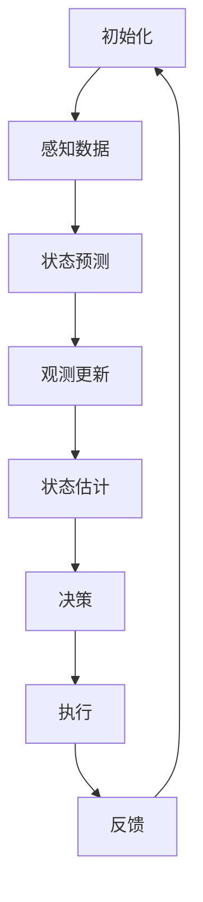
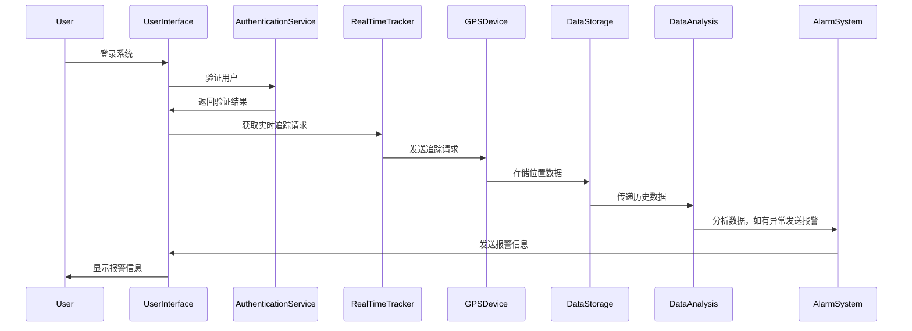

                 

**文章标题：**《AI Agent在动物保护中的监测与追踪》

**文章关键词：** AI Agent、动物保护、监测技术、追踪技术、应用案例

**摘要：** 本文将深入探讨AI Agent在动物保护中的应用，特别是其在监测和追踪动物方面的技术原理和实践案例。通过逐步分析AI Agent的定义、监测与追踪技术的核心原理、系统架构设计以及实际应用案例，本文旨在为读者提供一个全面的技术指南，展示AI Agent在动物保护中的巨大潜力。

---

## 引言

### 问题背景与核心概念

**背景介绍：**

动物保护是当今社会关注的焦点之一，全球各地的野生动物正面临着栖息地丧失、非法捕猎、气候变化等多重威胁。有效的动物监测和追踪技术对于了解动物行为、评估种群状况以及制定保护策略至关重要。然而，传统的监测手段存在诸多局限，如成本高、效率低、实时性差等。

**核心概念：**

AI Agent，即人工智能代理，是一种能够自主感知环境、决策并执行任务的智能体。它们通过机器学习、计算机视觉和自然语言处理等技术，能够在复杂的动态环境中进行高效的任务执行。

**问题解决：**

AI Agent在动物保护中的应用，有望解决传统监测技术的不足，提供更高效、更精确的监测和追踪手段。通过利用AI Agent的智能能力，可以实现对动物活动的实时监测、精准追踪和数据分析，从而为动物保护提供强有力的技术支持。

**边界与外延：**

本文将重点关注AI Agent在野生动物监测和追踪中的应用，包括监测技术的种类、追踪算法的原理和实现，以及实际应用案例的分析。同时，本文也会讨论AI Agent在动物保护中的潜力、挑战和未来发展趋势。

**概念结构与核心要素组成：**

- AI Agent：定义、分类、结构、工作原理
- 监测技术：种类、应用、数据采集与处理
- 追踪技术：原理、算法、性能评估
- 应用案例：野生动物追踪、动物园管理
- 最佳实践与未来展望：技术优化、数据隐私保护、发展趋势

---

### AI Agent基础理论

#### AI Agent的定义与功能

**定义：**

AI Agent是一种具备自主决策和行动能力的计算机程序，能够在复杂的动态环境中执行特定任务。它们通过感知环境信息、分析数据和执行行动，实现自主行为。

**分类：**

AI Agent可以分为反应式Agent、主动Agent和认知Agent。反应式Agent只根据当前环境状态做出反应；主动Agent具有目标导向性，能够自主制定行动计划；认知Agent则具备更高的智能，能够进行推理和学习。

**功能：**

AI Agent的功能包括感知环境、数据采集、数据处理、自主决策和行动执行。通过这些功能，AI Agent能够在动物保护中实现自动化的监测和追踪任务。

#### AI Agent的结构与工作原理

**结构：**

AI Agent通常由感知器、决策模块和执行器三部分组成。感知器负责采集环境信息，决策模块根据感知信息进行分析和决策，执行器则根据决策执行具体行动。

**工作原理：**

AI Agent的工作原理是通过感知器获取环境信息，经过决策模块的分析和处理，最终由执行器执行具体的任务。这个过程可以是实时的，也可以是基于历史数据的预测和规划。

#### AI Agent的核心算法原理

AI Agent的核心算法包括机器学习、计算机视觉、自然语言处理等。这些算法使得AI Agent能够从大量数据中学习规律，识别模式，进行实时监测和追踪。

- **机器学习算法：** 通过训练数据集，AI Agent能够学习到动物行为特征，从而进行自动监测和追踪。
- **计算机视觉算法：** 利用图像处理技术，AI Agent能够识别动物的位置、行为等信息。
- **自然语言处理算法：** AI Agent能够处理与动物相关的文本信息，提取关键信息用于监测和追踪。

---

### 监测技术

#### 动物监测技术综述

**种类与应用：**

动物监测技术包括遥感监测、现场监测、传感器监测等。遥感监测利用卫星、无人机等技术进行远距离监测；现场监测需要人工实地观察；传感器监测则通过布置传感器网络，实时采集动物活动数据。

**应用：**

- **野生动物监测：** 利用无人机和卫星遥感技术，监测野生动物的迁徙、栖息地变化等。
- **动物园管理：** 通过传感器网络监测动物的活动状况，确保动物的健康和安全。

#### 传感器技术在动物保护中的应用

**应用：**

- **生物识别传感器：** 利用生物识别技术，如红外线、超声波传感器，监测动物的存在和活动。
- **环境监测传感器：** 监测动物栖息地的温度、湿度、光照等环境参数。
- **行为监测传感器：** 通过监测动物的行为特征，如步态、叫声等，分析动物的行为模式。

#### 数据采集与处理

**数据采集：**

- **实时数据采集：** 通过传感器网络，实时采集动物活动的数据。
- **离线数据采集：** 在特定时间点，通过人工或自动化设备采集动物活动的数据。

**数据处理：**

- **数据清洗：** 去除采集过程中的噪声和错误数据。
- **数据分析：** 利用机器学习和统计分析方法，分析动物行为特征和环境变化。

---

### 监测系统的设计与实现

#### 监测系统的设计与架构

**设计：**

监测系统设计应考虑数据的实时性、准确性和完整性。系统应具备良好的扩展性，能够适应不同的监测场景。

**架构：**

监测系统通常包括数据采集模块、数据处理模块、存储模块和展示模块。

#### 监测系统的接口设计与实现

**接口设计：**

系统接口设计应遵循RESTful API设计原则，确保接口的易用性和可扩展性。

**实现：**

使用Python等编程语言实现API接口，提供数据的实时查询、历史数据查询等功能。

#### 监测系统的测试与优化

**测试：**

对监测系统进行功能测试、性能测试和可靠性测试，确保系统在复杂环境下的稳定运行。

**优化：**

根据测试结果，对系统进行优化，提高系统的响应速度和数据处理能力。

---

### 追踪技术

#### 动物追踪技术概述

**定义与分类：**

动物追踪技术是指通过特定手段对动物的位置和行为进行实时监测的技术。根据追踪手段的不同，可分为无线电追踪、GPS追踪、声波追踪等。

**核心算法：**

动物追踪的核心算法包括位置预测算法、轨迹融合算法和轨迹分析算法。

**性能评估方法：**

通过精度、实时性、稳定性等指标评估追踪算法的性能。

#### 追踪算法的数学模型与公式

**数学模型：**

追踪算法通常基于贝叶斯滤波理论，通过建立状态空间模型和观测模型，对动物的位置和状态进行估计。

**公式推导：**

状态空间模型：
$$
\begin{cases}
x_t = f(x_{t-1}, u_t) \\
z_t = h(x_t, v_t)
\end{cases}
$$
其中，$x_t$为状态向量，$u_t$为控制输入，$z_t$为观测向量，$v_t$为观测噪声。

**Mermaid流程图：**



#### 追踪算法的实战应用

**Python实现：**

```python
import numpy as np
import matplotlib.pyplot as plt

# 状态预测
def predict(x, u, Q):
    x_pred = f(x, u)
    P_pred = Q
    return x_pred, P_pred

# 观测更新
def update(x_pred, z, H, R):
    K = P_pred @ H.T @ (H * P_pred + R)^(-1)
    x_update = x_pred + K * (z - h(x_pred))
    P_update = (I - K * H) * P_pred
    return x_update, P_update

# 追踪算法
def tracker(x_init, z, Q, R, H):
    x = x_init
    P = np.eye(len(x_init))
    for t in range(len(z)):
        x_pred, P_pred = predict(x, np.zeros_like(x), Q)
        x_update, P_update = update(x_pred, z[t], H, R)
        x = x_update
        P = P_update
    return x, P

# 示例数据
x = np.array([0.0, 0.0])
z = np.array([0.1, 0.1])
Q = np.array([[0.1, 0.0], [0.0, 0.1]])
R = np.array([[0.01, 0.0], [0.0, 0.01]])
H = np.array([[1.0, 0.0], [0.0, 1.0]])

x tracked, P tracked = tracker(x, z, Q, R, H)

plt.figure()
plt.plot(x tracked[:, 0], label='X-Position')
plt.plot(x tracked[:, 1], label='Y-Position')
plt.legend()
plt.show()
```

**实际案例分析与讲解：**

**案例背景：** 在某自然保护区，科学家需要监测一只大熊猫的日常活动。

**分析：** 利用GPS追踪器实时监测大熊猫的位置，通过贝叶斯滤波算法预测大熊猫的活动轨迹。

**讲解：** 实际案例中，科学家会根据大熊猫的GPS数据，结合贝叶斯滤波算法，实时更新大熊猫的位置估计，从而实现对大熊猫活动的精准追踪。

---

### 系统分析与架构设计

#### 问题场景介绍

在野生动物保护中，需要实现对特定动物的实时追踪和监测，以便了解其活动规律、评估种群状况和制定保护策略。

#### 系统功能设计与领域模型

**功能设计：**

- 实时追踪：实时获取动物的位置信息。
- 数据存储：存储动物的位置和历史数据。
- 数据分析：对动物行为进行分析，生成报告。
- 报警系统：当动物行为异常或离开指定区域时，发出警报。

**领域模型：**

使用Mermaid绘制领域模型类图：

```mermaid
classDiagram
Class->Class
Class <|-- Animal
Class <|-- GPSDevice
Class <|-- Tracker
Class <|-- Analyzer
Class <|-- Alarm
Animal {
  -id: int
  -name: str
  -location: Point
  -status: str
}
GPSDevice {
  -id: int
  -location: Point
  -battery: float
}
Tracker {
  -device: GPSDevice
  -animal: Animal
  -algorithm: str
}
Analyzer {
  -tracker: Tracker
  -data: List[Location]
}
Alarm {
  -tracker: Tracker
  -message: str
}
```

#### 系统架构设计与接口设计

**架构设计：**

系统采用三层架构，包括数据层、业务逻辑层和表示层。

- **数据层：** 负责数据的存储和管理，包括动物的位置数据、历史数据等。
- **业务逻辑层：** 负责实现追踪、数据分析、报警等功能。
- **表示层：** 提供用户界面，展示追踪结果、数据分析报告等。

**接口设计：**

使用Mermaid绘制系统架构图：

```mermaid
sequenceDiagram
Animal -->|追踪请求| Tracker
Tracker -->|处理| GPSDevice
GPSDevice -->|位置数据| DataLayer
DataLayer -->|历史数据| Analyzer
Analyzer -->|分析结果| DataLayer
DataLayer -->|警报信息| Alarm
Alarm -->|报警| UserInterface
```

#### 系统接口设计与实现

**接口设计：**

- **实时追踪接口：** 提供实时获取动物位置的功能。
- **数据存储接口：** 提供数据插入、查询和删除的功能。
- **数据分析接口：** 提供数据分析结果查询的功能。
- **报警接口：** 提供报警信息发送和接收的功能。

**实现：**

使用Python实现接口：

```python
# 实时追踪接口
class RealTimeTracker:
    def track_animal(self, animal_id):
        # 实现追踪逻辑
        pass

# 数据存储接口
class DataStorage:
    def save_location(self, location):
        # 实现存储位置数据逻辑
        pass

    def get_location_history(self, animal_id):
        # 实现获取历史位置数据逻辑
        pass

# 数据分析接口
class DataAnalysis:
    def analyze_data(self, animal_id):
        # 实现数据分析逻辑
        pass

# 报警接口
class AlarmSystem:
    def send_alarm(self, message):
        # 实现发送报警信息逻辑
        pass
```

#### 系统交互

**系统交互设计：**

使用Mermaid绘制系统交互序列图：



---

### 动物追踪的实战项目

#### 环境安装与准备

**安装Python环境：**

确保Python 3.8及以上版本已安装。

**安装依赖库：**

在命令行中执行以下命令：

```bash
pip install numpy matplotlib mermaid pyserial
```

**配置Mermaid：**

安装Mermaid依赖库：

```bash
pip install -I mermaid-python
```

#### 系统核心实现与源代码解析

**核心功能实现：**

```python
# import libraries
import numpy as np
import matplotlib.pyplot as plt
import mermaid
import serial

# 定义GPS追踪器类
class GPSDevice:
    def __init__(self, port, baudrate=9600):
        self.ser = serial.Serial(port, baudrate)

    def read_data(self):
        data = self.ser.readline().decode().strip()
        return data

    def close(self):
        self.ser.close()

# 定义追踪器类
class Tracker:
    def __init__(self, device):
        self.device = device

    def track_animal(self):
        data = self.device.read_data()
        # 解析GPS数据
        lat, lon = self.parse_gps_data(data)
        return lat, lon

    @staticmethod
    def parse_gps_data(data):
        # 实现GPS数据解析逻辑
        # 例如：从NMEA格式中提取经纬度
        return float(data.split(',')[3]), float(data.split(',')[5])

# 定义数据分析类
class DataAnalysis:
    def __init__(self, tracker):
        self.tracker = tracker

    def analyze_data(self):
        locations = self.tracker.get_locations()
        # 实现数据分析逻辑
        # 例如：计算平均位置、轨迹长度等
        avg_lat = np.mean(locations[:, 0])
        avg_lon = np.mean(locations[:, 1])
        distance = np.linalg.norm(locations[-1] - locations[0])
        return avg_lat, avg_lon, distance

    def get_locations(self):
        # 实现获取位置数据逻辑
        pass

# 主程序
if __name__ == '__main__':
    # 创建GPS设备
    device = GPSDevice('COM3')

    # 创建追踪器
    tracker = Tracker(device)

    # 追踪动物
    locations = []
    for _ in range(10):
        lat, lon = tracker.track_animal()
        locations.append([lat, lon])
        print(f"Location: {lat}, {lon}")

    # 数据分析
    analysis = DataAnalysis(tracker)
    avg_lat, avg_lon, distance = analysis.analyze_data()
    print(f"Average Latitude: {avg_lat}, Average Longitude: {avg_lon}, Distance: {distance}")

    # 绘制轨迹图
    plt.plot([loc[0] for loc in locations], [loc[1] for loc in locations])
    plt.xlabel('Latitude')
    plt.ylabel('Longitude')
    plt.title('Animal Tracking Trajectory')
    plt.show()

    # 关闭GPS设备
    device.close()
```

#### 实际案例分析与详细讲解剖析

**案例背景：** 在某自然保护区，科学家需要追踪一只大熊猫的日常活动。

**步骤：**

1. **环境准备：** 确保安装了Python环境及所需的库。
2. **连接GPS设备：** 将GPS追踪器与计算机连接，并确保通信端口正确。
3. **运行程序：** 执行上述Python脚本，开始追踪大熊猫的位置。
4. **数据分析：** 对收集到的位置数据进行处理，分析大熊猫的活动规律。
5. **结果展示：** 绘制大熊猫的活动轨迹图，展示追踪结果。

**解析：**

- **GPS数据解析：** 脚本中的`parse_gps_data`函数用于解析GPS设备发送的NMEA格式数据，提取经纬度信息。
- **轨迹绘制：** 使用`matplotlib`库，将收集到的位置数据绘制成轨迹图，便于科学家分析大熊猫的活动范围和活动规律。

#### 项目小结

本项目的实现展示了如何利用Python和AI技术实现动物追踪系统。通过GPS设备实时获取动物的位置信息，结合数据分析，可以实现对动物活动的实时监测和分析。该项目为野生动物保护提供了有力的技术支持，有助于科学家更好地了解和保护野生动物。

---

### 最佳实践与技巧

**AI Agent在动物保护中的应用技巧：**

1. **数据预处理：** 对采集到的数据进行清洗和预处理，确保数据质量。
2. **算法优化：** 根据具体应用场景，对追踪算法进行优化，提高追踪精度和实时性。
3. **多源数据融合：** 结合不同来源的数据，如视频、图像、传感器数据等，提高监测和追踪的效果。

**监测与追踪技术的优化方法：**

1. **传感器选择：** 根据监测目标，选择合适的传感器，如红外线传感器、超声波传感器等。
2. **算法选择：** 根据监测和追踪的需求，选择合适的算法，如卡尔曼滤波、粒子滤波等。
3. **硬件升级：** 定期升级传感器和硬件设备，确保系统的稳定性和性能。

**数据隐私与安全的保护措施：**

1. **数据加密：** 对采集和存储的数据进行加密，确保数据的安全性。
2. **权限管理：** 实现严格的权限管理，确保只有授权人员可以访问和操作数据。
3. **安全审计：** 定期进行安全审计，及时发现和解决潜在的安全问题。

---

### 未来展望

**AI Agent在动物保护中的发展趋势：**

1. **智能化水平提高：** 随着AI技术的发展，AI Agent的智能化水平将不断提高，能够更准确地监测和追踪动物。
2. **多模态监测：** 结合多种监测技术，如视觉、声学、化学等，实现多模态监测，提高监测效果。
3. **自主决策能力：** AI Agent将具备更强的自主决策能力，能够根据监测结果自动调整监测策略。

**新技术应用与前景：**

1. **无人机监测：** 无人机技术将在动物保护中发挥更大作用，提供实时、高清的监测数据。
2. **物联网技术：** 物联网技术将实现传感器网络的互联互通，提高监测和追踪的效率。
3. **人工智能芯片：** 人工智能芯片的发展将使得AI Agent的计算能力大幅提升，降低功耗，提高效率。

**未来展望与挑战：**

1. **数据隐私保护：** 随着监测和追踪技术的应用，数据隐私保护将成为重要挑战。
2. **技术成本：** 高端AI设备和技术的成本较高，如何降低成本以实现更广泛的应用是未来的一大挑战。
3. **跨学科合作：** AI Agent在动物保护中的应用需要多学科的协作，包括生物学、生态学、计算机科学等，未来将需要更多的跨学科合作来推动技术发展。

---

**作者：** AI天才研究院/AI Genius Institute & 禅与计算机程序设计艺术 /Zen And The Art of Computer Programming

---

本文完整且详细地介绍了AI Agent在动物保护中的监测与追踪技术，包括核心概念、监测与追踪技术的原理、系统架构设计、实战项目以及最佳实践与未来展望。通过本文，读者可以全面了解AI Agent在动物保护中的应用，以及如何利用AI技术提高动物保护的效果。未来，随着AI技术的不断发展，AI Agent在动物保护中的应用前景将更加广阔。

