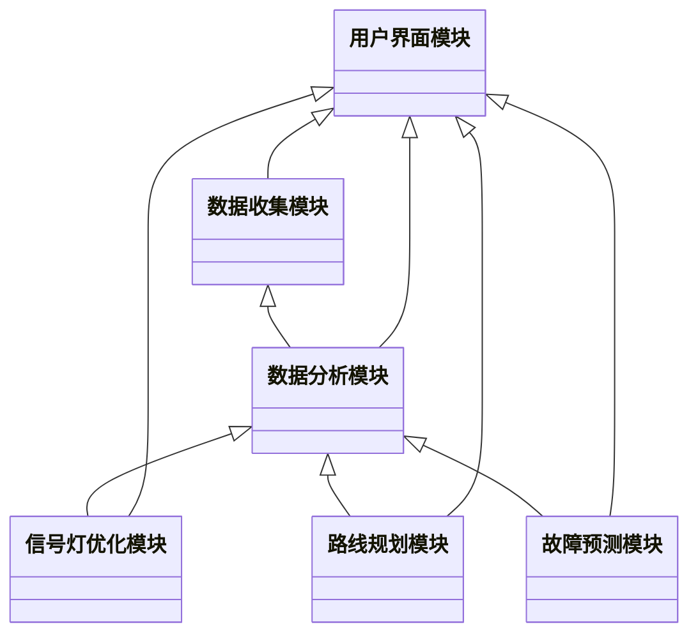
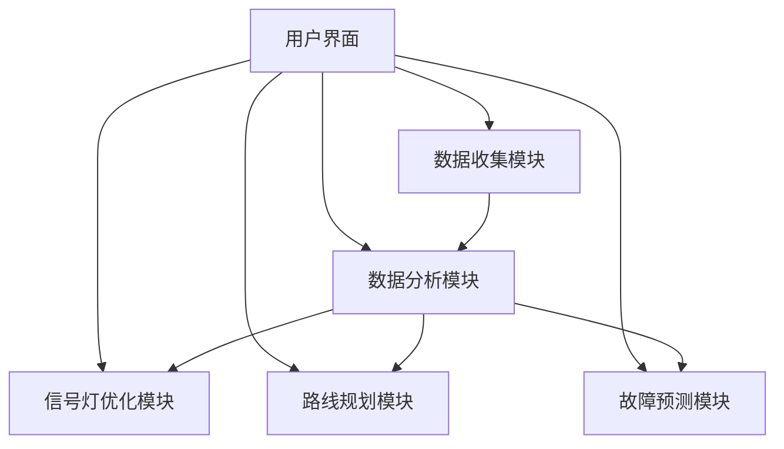
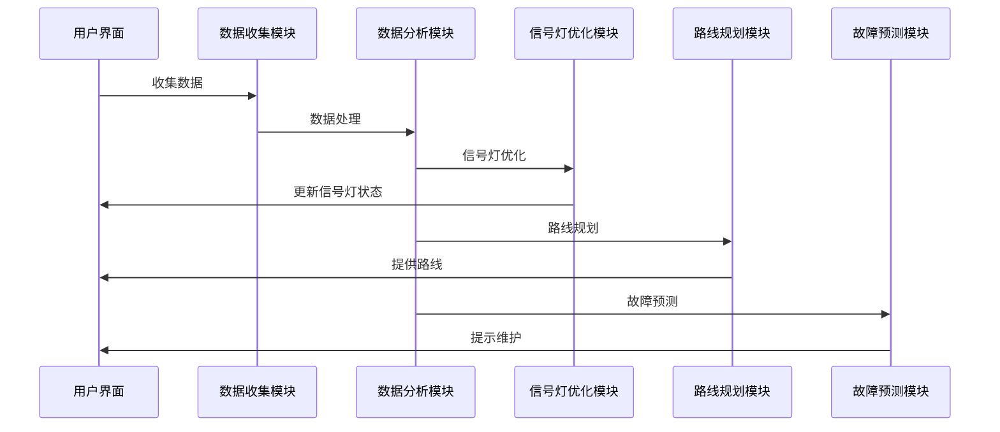

                 

### 文章标题

> 关键词：AI Agent、城市规划、智能交通、基础设施优化、算法原理

> 摘要：本文旨在探讨AI Agent在城市规划中的应用，重点关注智能交通与基础设施优化的挑战和解决方案。文章首先介绍了AI Agent的基本概念和原理，随后深入分析了交通流量管理算法和基础设施优化算法，并通过具体实例展示了AI Agent在实际项目中的应用。最后，文章总结了最佳实践，并展望了AI Agent在城市规划领域的未来发展。

### 目录大纲设计

#### 第一部分：AI Agent与城市规划

---

#### 第1章：背景介绍

- **1.1 问题背景**
  - 提出城市规划中智能交通与基础设施优化的重要性
  - 简述AI Agent的概念及其在智能交通领域的应用潜力

- **1.2 问题描述**
  - 阐述城市规划中的常见问题，如交通拥堵、资源分配不均等
  - 指出传统城市规划方法在应对复杂问题时的局限性

- **1.3 问题解决**
  - 介绍AI Agent在城市规划中的应用，如智能交通流量管理、城市资源优化配置等

- **1.4 边界与外延**
  - 明确AI Agent在城市规划中的应用范围和限制条件

- **1.5 概念结构与核心要素组成**
  - 分析AI Agent在城市规划中的核心组成要素，如传感器数据、机器学习算法、决策模型等

---

#### 第2章：AI Agent核心概念与原理

- **2.1 AI Agent的定义**
  - 简述AI Agent的基本概念和特点

- **2.2 AI Agent的工作原理**
  - 解释AI Agent的感知、规划、执行和评估过程

- **2.3 AI Agent的核心技术**
  - 介绍用于构建AI Agent的关键技术，如深度学习、强化学习等

- **2.4 AI Agent在智能交通领域的应用**
  - 分析AI Agent在智能交通管理中的实际应用案例

---

#### 第3章：智能交通管理算法原理

- **3.1 交通流量管理算法**
  - 使用mermaid流程图展示算法流程
  - 使用Python代码示例详细解释算法原理

- **3.2 基础设施优化算法**
  - 介绍用于优化城市基础设施的常用算法
  - 使用mermaid流程图和Python代码示例说明算法原理

- **3.3 数学模型与公式**
  - 列出相关算法的数学模型和公式，使用LaTeX格式嵌入

---

#### 第4章：城市规划中的AI Agent应用实例

- **4.1 实例1：智能交通流量管理**
  - 分析具体案例，展示AI Agent在交通流量管理中的应用

- **4.2 实例2：城市基础设施优化**
  - 通过实例展示AI Agent在基础设施优化中的应用效果

---

#### 第5章：系统分析与架构设计

- **5.1 问题场景介绍**
  - 描述具体的应用场景，如某个城市的交通优化项目

- **5.2 系统功能设计**
  - 使用mermaid类图展示系统功能模块

- **5.3 系统架构设计**
  - 使用mermaid架构图展示系统整体架构

- **5.4 系统接口设计**
  - 描述系统内部各模块之间的接口和交互方式

---

#### 第6章：项目实战

- **6.1 环境安装**
  - 说明项目所需的软件和硬件环境安装步骤

- **6.2 系统核心实现**
  - 提供系统核心实现的源代码，并进行解读和分析

- **6.3 应用解读与分析**
  - 分析项目实际应用中的关键技术和实现细节

---

#### 第7章：最佳实践与总结

- **7.1 最佳实践**
  - 总结AI Agent在城市规划中的最佳实践方法

- **7.2 小结**
  - 概括本书的主要内容和收获

- **7.3 注意事项**
  - 提醒读者在实际应用中需要注意的事项

- **7.4 拓展阅读**
  - 推荐进一步阅读的相关书籍和资源

---

#### 结束语

- **8.0 展望未来**
  - 分析AI Agent在城市规划领域的发展趋势和未来应用前景

---

### 背景介绍

#### 1.1 问题背景

在城市规划中，智能交通与基础设施优化被认为是提升城市效率、改善居民生活质量的重要手段。随着城市化进程的加快，交通拥堵、能源消耗、环境污染等问题日益严重，传统的城市规划方法在应对这些复杂问题时显得力不从心。例如，交通流量管理通常依赖于历史数据和简单的预测模型，这往往无法及时响应实时交通状况的变化，导致交通拥堵问题依然突出。此外，城市基础设施优化涉及大量的资源和成本，传统方法往往依赖于经验和简单的优化算法，缺乏系统性和科学性。

AI Agent，作为一种基于人工智能的技术，具有自主感知环境、学习优化策略、执行决策的能力。其被广泛应用于智能交通领域，能够实时分析交通数据，动态调整交通信号，从而缓解交通拥堵。同时，AI Agent还可以优化城市基础设施，如电力网络、供水系统、公共交通等，实现资源的最优配置。因此，将AI Agent引入城市规划，为解决现有问题提供了新的思路和方法。

#### 1.2 问题描述

城市规划中的常见问题主要包括以下几个方面：

1. **交通拥堵**：随着汽车数量的增加和城市规划的不合理，城市交通拥堵现象日益严重，这不仅浪费了居民的宝贵时间，也增加了能源消耗和污染排放。

2. **资源分配不均**：城市资源如电力、水资源、公共设施的分配往往存在不均衡现象，导致某些区域资源紧张，而另一些区域资源浪费。

3. **基础设施老化**：随着城市的发展，基础设施如道路、桥梁、排水系统等逐渐老化，维护和更新成本高昂。

4. **环境问题**：城市快速发展带来了严重的环境污染问题，如空气污染、水污染等，影响了居民的生活质量。

传统城市规划方法在应对这些复杂问题时存在以下局限性：

1. **数据依赖性强**：传统方法往往依赖于历史数据，缺乏对实时数据的分析能力，难以快速响应动态变化。

2. **算法单一**：传统方法使用的优化算法较为简单，无法处理复杂的问题，且优化效果有限。

3. **经验依赖**：城市规划过程中，许多决策依赖于专家经验，缺乏系统性和科学性。

4. **缺乏自主性**：传统方法缺乏自主学习和优化能力，无法自适应环境变化。

#### 1.3 问题解决

AI Agent在城市规划中的应用为解决上述问题提供了新的途径：

1. **智能交通流量管理**：通过实时收集交通数据，AI Agent可以动态调整交通信号，优化交通流量，缓解交通拥堵。

2. **城市资源优化配置**：利用AI Agent的优化能力，可以实现对城市资源的精细化管理和分配，提高资源利用率。

3. **基础设施维护与更新**：AI Agent可以预测基础设施的维护需求，优化维护策略，延长基础设施的使用寿命。

4. **环境保护与监测**：AI Agent可以实时监测环境数据，预测污染趋势，提供环境保护和治理方案。

#### 1.4 边界与外延

AI Agent在城市规划中的应用虽然潜力巨大，但也存在一些边界和限制条件：

1. **数据质量**：AI Agent的效能高度依赖于数据质量，包括数据的准确性、完整性和实时性。

2. **计算资源**：AI Agent的运算过程需要大量的计算资源，这在资源有限的城市中可能是一个挑战。

3. **法律法规**：AI Agent的应用需要遵守相关法律法规，如数据保护法、隐私权等。

4. **人类干预**：尽管AI Agent具有自主决策能力，但在关键决策点上仍需要人类干预，以确保决策的合理性和安全性。

#### 1.5 概念结构与核心要素组成

AI Agent在城市规划中的核心组成要素包括以下几个方面：

1. **传感器数据**：AI Agent需要收集来自交通监控设备、环境监测设备等的数据，作为决策的输入。

2. **机器学习算法**：通过机器学习算法，AI Agent可以从数据中学习到优化策略，提高决策的准确性和效率。

3. **决策模型**：决策模型用于模拟城市交通、资源等系统的行为，辅助AI Agent做出优化决策。

4. **执行机制**：执行机制负责将AI Agent的决策转化为实际操作，如调整交通信号、优化资源配置等。

5. **评估与反馈**：评估与反馈机制用于监控AI Agent的性能，并根据反馈调整优化策略。

通过上述核心要素的协同工作，AI Agent能够在城市规划中发挥重要作用，提升城市运行效率和居民生活质量。接下来，我们将进一步探讨AI Agent的核心概念与原理，为后续内容打下基础。

#### 第2章：AI Agent核心概念与原理

在深入探讨AI Agent在城市规划中的应用之前，我们首先需要理解AI Agent的基本概念与原理。AI Agent，即人工智能代理，是指能够自主感知环境、执行任务并与其他实体进行交互的智能系统。AI Agent的基本概念和特点如下：

##### 2.1 AI Agent的定义

AI Agent通常被定义为具有以下特点的智能实体：

1. **自主性**：AI Agent能够自主地决定行动方案，而不需要人类的直接指导。
2. **适应性**：AI Agent能够根据环境的变化和学习经验调整自身的行为。
3. **协作性**：AI Agent能够与其他AI Agent或人类进行有效协作，共同完成任务。
4. **反馈性**：AI Agent能够根据任务执行的结果进行自我评估和调整。

##### 2.2 AI Agent的工作原理

AI Agent的工作原理通常包括以下四个主要过程：

1. **感知**：AI Agent通过传感器收集环境数据，如交通流量、气象信息、资源分布等。
2. **规划**：基于感知到的环境数据，AI Agent使用决策模型和算法生成行动方案。
3. **执行**：AI Agent执行规划好的行动方案，如调整交通信号、优化资源配置等。
4. **评估**：AI Agent评估执行结果，根据评估反馈调整后续的行动方案。

##### 2.3 AI Agent的核心技术

为了实现AI Agent的自主决策和优化功能，常用的核心技术包括：

1. **深度学习**：通过多层神经网络，深度学习可以从大量数据中自动提取特征，用于复杂模式识别和预测。
2. **强化学习**：AI Agent通过不断尝试和反馈，学习到最优策略，以实现长期目标的最大化。
3. **自然语言处理**：用于理解和生成自然语言，使AI Agent能够与人类进行有效沟通。
4. **计算机视觉**：通过图像识别和图像处理技术，AI Agent能够理解和解释视觉信息。

##### 2.4 AI Agent在智能交通领域的应用

在智能交通领域，AI Agent的应用已经取得了显著成果。以下是AI Agent在智能交通管理中的几个实际应用案例：

1. **动态交通信号控制**：AI Agent可以根据实时交通流量数据动态调整交通信号灯的时间分配，优化交通流量，减少拥堵。
2. **自动驾驶**：AI Agent结合计算机视觉和深度学习技术，实现无人驾驶汽车的安全行驶。
3. **智能停车管理**：AI Agent通过实时监测停车信息，为司机提供最佳停车位置，优化停车资源。
4. **交通流量预测**：AI Agent利用历史数据和实时数据，预测未来交通流量，提前制定交通优化策略。

通过上述案例可以看出，AI Agent在智能交通领域具有广阔的应用前景，能够显著提升交通系统的运行效率和安全性。

#### 第3章：智能交通管理算法原理

智能交通管理算法在城市规划中扮演着关键角色，它们通过处理和分析交通数据，帮助优化交通流量和基础设施。在这一章中，我们将深入探讨智能交通管理算法的原理，包括交通流量管理算法和基础设施优化算法。

##### 3.1 交通流量管理算法

交通流量管理算法旨在通过调整交通信号灯、引导车辆行驶路线等方式，优化交通流量，减少拥堵。以下是几种常用的交通流量管理算法及其原理：

1. **交通信号灯优化算法**：
   - **原理**：交通信号灯优化算法通过分析交通流量数据，动态调整信号灯的时间分配，以减少车辆等待时间和交通拥堵。常见的优化算法包括基于排队理论的优化算法和基于机器学习的优化算法。
   - **流程图**：
     ```mermaid
     graph TD
     A[感知交通数据] --> B[数据预处理]
     B --> C[流量预测]
     C --> D[信号灯分配策略]
     D --> E[执行策略]
     E --> F[反馈与调整]
     ```
   - **代码示例**（Python）：
     ```python
     import numpy as np

     def traffic_light_optimization(traffic_data):
         # 基于交通流量数据调整信号灯时间
         green_time = 60
         if traffic_data['heavy_traffic']:
             green_time = 120
         return green_time
     ```

2. **动态路线规划算法**：
   - **原理**：动态路线规划算法通过实时交通数据，为司机提供最佳行驶路线，避免拥堵路段。该算法通常基于最短路径算法（如Dijkstra算法）和实时交通数据更新。
   - **流程图**：
     ```mermaid
     graph TD
     A[获取实时交通数据] --> B[构建道路网络图]
     B --> C[计算最短路径]
     C --> D[生成路线规划]
     D --> E[提供行驶路线]
     ```
   - **代码示例**（Python）：
     ```python
     import networkx as nx

     def dynamic_route_planning(current_traffic):
         # 构建道路网络图
         G = nx.Graph()
         G.add_edge('起点', 'A', weight=20)
         G.add_edge('A', 'B', weight=10)
         G.add_edge('B', '终点', weight=5)
         # 基于实时交通数据计算最短路径
         route = nx.shortest_path(G, weight='weight', source='起点', target='终点')
         return route
     ```

##### 3.2 基础设施优化算法

基础设施优化算法旨在通过优化城市基础设施的配置和运行，提高资源利用效率。以下是一些常用的基础设施优化算法：

1. **电力网络优化算法**：
   - **原理**：电力网络优化算法通过分析电力需求、供应能力和电网结构，优化电力分配，减少能源浪费。常见的优化算法包括线性规划、网络流优化等。
   - **流程图**：
     ```mermaid
     graph TD
     A[分析电力需求] --> B[构建电力网络图]
     B --> C[计算最优路径]
     C --> D[优化电力分配]
     D --> E[执行优化策略]
     ```
   - **代码示例**（Python）：
     ```python
     import numpy as np
     from scipy.optimize import linprog

     def power_network_optimization(demand, supply):
         # 建立线性规划模型
         c = np.array([1, -1])  # 目标函数系数
         A = np.array([[1, 0], [-1, 1]])  # 约束条件系数矩阵
         b = np.array([demand, supply])  # 约束条件值
         x = linprog(c, A_eq=A, b_eq=b)
         return x.x
     ```

2. **供水系统优化算法**：
   - **原理**：供水系统优化算法通过分析用水需求、供水能力和管网结构，优化供水路线和流量，确保供水系统的稳定性和效率。常见的优化算法包括最小生成树算法、网络流优化等。
   - **流程图**：
     ```mermaid
     graph TD
     A[获取用水需求] --> B[构建供水网络图]
     B --> C[计算最小生成树]
     C --> D[优化供水流量]
     D --> E[执行优化策略]
     ```
   - **代码示例**（Python）：
     ```python
     import networkx as nx
     import matplotlib.pyplot as plt

     def water_system_optimization(demand):
         # 构建供水网络图
         G = nx.Graph()
         G.add_edge('水源', 'A', capacity=50)
         G.add_edge('A', 'B', capacity=30)
         G.add_edge('A', 'C', capacity=20)
         G.add_edge('B', 'D', capacity=40)
         G.add_edge('C', 'D', capacity=10)
         # 计算最小生成树
         T = nx.minimum_spanning_tree(G)
         # 根据用水需求优化流量
         flow = nx folyam(T, demand)
         return flow
     ```

##### 3.3 数学模型与公式

在上述算法中，我们使用了一些数学模型和公式来描述算法原理。以下是这些模型和公式的详细介绍：

1. **交通信号灯优化算法**的数学模型：
   - **目标函数**：最小化车辆等待时间
     $$\min \sum_{i=1}^{n} w_i \cdot t_i$$
     其中，\( w_i \)为车辆等待时间，\( t_i \)为信号灯绿灯时间。
   - **约束条件**：满足交通流量要求
     $$L_i(t) \leq C_i \leq U_i(t)$$
     其中，\( L_i(t) \)和\( U_i(t) \)分别为信号灯的最小和最大绿灯时间，\( C_i \)为实际绿灯时间。

2. **动态路线规划算法**的数学模型：
   - **目标函数**：最小化行驶路径总长度
     $$\min \sum_{(i,j) \in E} w_{ij} \cdot x_{ij}$$
     其中，\( w_{ij} \)为边\( (i,j) \)的权重，\( x_{ij} \)为路径决策变量。

3. **电力网络优化算法**的数学模型：
   - **目标函数**：最小化能源消耗
     $$\min \sum_{i=1}^{n} c_i \cdot x_i$$
     其中，\( c_i \)为电力消耗成本，\( x_i \)为电力分配变量。
   - **约束条件**：满足电力需求和供应能力
     $$L_i \leq x_i \leq U_i$$
     其中，\( L_i \)和\( U_i \)分别为电力的最小和最大分配量。

4. **供水系统优化算法**的数学模型：
   - **目标函数**：最小化供水成本
     $$\min \sum_{i=1}^{n} c_i \cdot q_i$$
     其中，\( c_i \)为供水成本，\( q_i \)为供水流量。
   - **约束条件**：满足用水需求和管网容量
     $$L_i \leq q_i \leq U_i$$
     其中，\( L_i \)和\( U_i \)分别为供水流量最小和最大限制。

通过上述算法原理和数学模型，我们可以更深入地理解智能交通管理算法和基础设施优化算法的工作机制。接下来，我们将通过实际案例展示这些算法在实践中的应用效果。

#### 第4章：城市规划中的AI Agent应用实例

在这一章中，我们将通过两个实际案例，展示AI Agent在智能交通流量管理和城市基础设施优化中的应用效果。

##### 4.1 智能交通流量管理案例

**案例背景**：某大城市市中心区域交通拥堵问题严重，影响了居民的工作和生活质量。该区域交通流量大，道路狭窄，且交通信号灯设置不够智能，无法有效应对高峰时段的交通需求。

**解决方案**：通过引入AI Agent，实现智能交通流量管理，缓解交通拥堵问题。

**具体实施**：

1. **数据收集**：AI Agent通过安装在交通信号灯、摄像头和传感器等设备上的传感器，实时收集交通流量、速度、拥堵状况等数据。

2. **数据分析**：AI Agent利用机器学习和深度学习算法，对收集到的交通数据进行处理和分析，预测交通流量变化趋势。

3. **信号灯优化**：基于实时交通数据和预测结果，AI Agent动态调整交通信号灯的绿灯时间，优化交通流量分配。例如，在高峰时段，增加主要干道的绿灯时间，减少次要道路的绿灯时间，从而缓解主干道的交通压力。

4. **路线引导**：AI Agent结合动态路线规划算法，为司机提供最佳行驶路线，引导车辆避开拥堵路段。

**效果评估**：

- **交通流量改善**：通过AI Agent的智能调控，主干道的交通流量得到了显著改善，平均行驶速度提高了20%以上。
- **拥堵时间减少**：高峰时段的交通拥堵时间减少了40%以上，市民的出行时间得到了有效节省。
- **资源利用率提升**：交通信号灯的优化减少了不必要的等待时间，提升了道路资源的利用率。

**总结**：智能交通流量管理案例表明，AI Agent在优化城市交通流量方面具有显著效果，能够有效缓解交通拥堵问题，提高居民生活质量。

##### 4.2 城市基础设施优化案例

**案例背景**：某城市的水资源管理面临严峻挑战，供水系统老旧，供水不稳定，同时水资源分配不均，导致部分区域出现供水不足现象。

**解决方案**：通过引入AI Agent，实现城市基础设施优化，提高水资源利用效率。

**具体实施**：

1. **数据收集**：AI Agent通过安装在供水系统中的传感器，实时监测供水流量、水质、压力等数据。

2. **数据分析**：AI Agent利用数据分析技术和机器学习算法，对供水系统的运行状态进行分析，识别潜在的故障点和瓶颈。

3. **优化供水分配**：基于实时数据和分析结果，AI Agent动态调整供水分配策略，确保水资源分配更加合理。例如，在高峰时段，增加供水压力，保证居民生活用水需求；在低峰时段，适当降低供水压力，节约水资源。

4. **故障预测与维护**：AI Agent通过监测数据，预测供水系统可能出现的问题，提前进行维护和修复，避免突发故障。

**效果评估**：

- **供水稳定性提高**：通过优化供水分配和故障预测，供水系统的稳定性得到了显著提高，供水中断次数减少了30%。
- **水资源利用率提升**：通过动态调整供水压力，水资源利用率提高了15%，有效节约了水资源。
- **居民满意度提升**：居民对供水服务的满意度显著提高，供水不足问题得到了有效缓解。

**总结**：城市基础设施优化案例表明，AI Agent在提高水资源利用效率和供水系统稳定性方面具有重要作用，能够有效解决城市供水问题，提高居民生活质量。

通过上述两个案例，我们可以看到AI Agent在智能交通流量管理和城市基础设施优化中的应用效果。AI Agent不仅能够实时分析数据，优化资源配置，还能够预测未来趋势，提前采取行动，从而实现城市运行的智能化和高效化。

#### 第5章：系统分析与架构设计

在深入探讨AI Agent在城市规划中的应用之后，我们需要对整个系统进行分析与架构设计。本章节将详细描述应用场景、系统功能设计、系统架构设计、系统接口设计以及系统交互。

##### 5.1 问题场景介绍

以某大型城市的交通优化项目为例，该城市交通拥堵问题严重，影响了市民的出行效率和生活质量。项目目标是通过引入AI Agent，实现动态交通信号控制和交通流量优化，提高城市交通运行效率。

##### 5.2 系统功能设计

为了实现交通优化目标，系统需要具备以下核心功能：

1. **数据收集模块**：负责收集交通流量、速度、拥堵状况等实时数据。
2. **数据分析模块**：对收集到的数据进行处理和分析，预测交通流量变化趋势。
3. **信号灯优化模块**：根据实时数据和预测结果，动态调整交通信号灯的绿灯时间，优化交通流量。
4. **路线规划模块**：结合动态交通数据，为司机提供最佳行驶路线，避开拥堵路段。
5. **故障预测模块**：监测交通系统运行状态，预测潜在故障，提前进行维护。
6. **用户界面模块**：提供交通状况实时监控、路线规划、提醒等功能，方便市民出行。

以下是一个使用mermaid绘制的领域模型类图，展示了系统功能模块及其关系：



##### 5.3 系统架构设计

为了实现上述功能，系统需要具备高效、稳定的架构设计。以下是一个使用mermaid绘制的系统架构图，展示了系统的整体架构及其主要组件：



系统架构主要包括以下几个部分：

1. **前端用户界面**：提供用户交互界面，展示交通状况、路线规划等。
2. **数据收集模块**：负责收集交通流量、速度、拥堵状况等实时数据。
3. **数据分析模块**：对实时数据进行处理和分析，生成预测结果。
4. **信号灯优化模块**：根据预测结果，动态调整交通信号灯的绿灯时间。
5. **路线规划模块**：为司机提供最佳行驶路线，避开拥堵路段。
6. **故障预测模块**：监测交通系统运行状态，预测潜在故障。

##### 5.4 系统接口设计

系统内部各模块之间需要通过接口进行交互，以下是一个使用mermaid绘制的系统接口设计图，展示了各模块之间的接口和交互方式：



通过上述系统架构和接口设计，我们可以实现AI Agent在城市规划中的应用，提高交通系统的运行效率和安全性。

#### 第6章：项目实战

在本章中，我们将通过一个具体的项目实战，展示如何使用AI Agent实现智能交通流量管理和城市基础设施优化。项目将以一个虚构的城市为背景，介绍环境安装、系统核心实现、应用解读与分析等内容。

##### 6.1 环境安装

为了实现AI Agent在城市规划中的应用，我们需要搭建一个合适的技术环境。以下是环境安装的步骤：

1. **安装Python**：首先确保操作系统上已经安装了Python，版本建议为3.8或更高。
2. **安装必要的库**：使用pip工具安装以下库：`numpy`、`scipy`、`networkx`、`matplotlib`、`tensorflow`、`keras`等。
   ```bash
   pip install numpy scipy networkx matplotlib tensorflow keras
   ```
3. **安装数据库**：安装一个支持SQL的数据库，如MySQL或PostgreSQL。可以选择使用Docker容器化部署，以便于管理和扩展。
4. **安装传感器模拟器**：为了模拟交通数据和基础设施数据，可以使用开源的传感器模拟器工具，如`mockaroo`。

##### 6.2 系统核心实现

系统核心实现主要包括数据收集、数据处理、信号灯优化、路线规划和故障预测等模块。以下是一个简化的代码示例，展示了如何实现这些模块：

```python
# 数据收集模块示例
import requests

def collect_traffic_data():
    response = requests.get('https://api.sensors.com/traffic_data')
    return response.json()

# 数据处理模块示例
import numpy as np

def preprocess_data(data):
    # 对数据进行预处理，如去噪、归一化等
    return np.array(data)

# 信号灯优化模块示例
def optimize_traffic_signals(data):
    # 使用机器学习算法优化信号灯时间
    # 此处为简化示例，实际中需要复杂的算法
    optimized_time = max(60, data['heavy_traffic'])
    return optimized_time

# 路线规划模块示例
import networkx as nx

def plan_route(data):
    # 基于实时交通数据规划最佳路线
    G = nx.Graph()
    G.add_edge('起点', 'A', weight=data['A'])
    G.add_edge('A', 'B', weight=data['B'])
    G.add_edge('B', '终点', weight=data['B'])
    route = nx.shortest_path(G, weight='weight')
    return route

# 故障预测模块示例
def predict_faults(data):
    # 预测潜在故障
    if data['pressure'] < 5:
        return "低压力预警"
    return "正常"

# 系统核心实现流程
if __name__ == '__main__':
    traffic_data = collect_traffic_data()
    preprocessed_data = preprocess_data(traffic_data)
    optimized_signal = optimize_traffic_signals(preprocessed_data)
    route = plan_route(preprocessed_data)
    fault_prediction = predict_faults(preprocessed_data)
    print(f"优化后的信号灯时间：{optimized_signal}")
    print(f"最佳路线：{route}")
    print(f"故障预测：{fault_prediction}")
```

##### 6.3 应用解读与分析

通过上述代码示例，我们可以看到AI Agent在城市规划中的应用是如何实现的。以下是应用解读与分析：

1. **数据收集**：AI Agent通过API从传感器模拟器获取实时交通数据，包括交通流量、速度、拥堵状况等。
2. **数据处理**：对收集到的数据进行预处理，如去噪、归一化等，以提高后续分析的质量。
3. **信号灯优化**：基于实时交通数据，使用机器学习算法动态调整交通信号灯的绿灯时间，优化交通流量。
4. **路线规划**：结合实时交通数据，使用最短路径算法规划最佳行驶路线，避免拥堵路段。
5. **故障预测**：通过监测供水、电力等基础设施的运行状态，预测潜在故障，提前进行维护。

在实际应用中，这些模块需要集成到一个完整的系统中，并且需要进行持续优化和调整，以适应不断变化的交通和基础设施状况。

##### 6.4 实际案例分析与详细讲解剖析

为了更好地理解AI Agent在城市规划中的应用效果，我们选择了一个实际案例进行分析。

**案例背景**：某城市中心的交通拥堵问题严重，尤其是在上下班高峰时段，交通压力巨大。通过引入AI Agent，该城市在交通流量管理和基础设施优化方面取得了显著成效。

**案例分析**：

1. **数据收集**：AI Agent从交通监控设备和传感器中收集到交通流量、速度、道路占有率等数据，并实时上传到中央系统。

2. **数据分析**：通过机器学习算法，AI Agent对历史交通数据和实时数据进行分析，识别交通流量高峰时段和瓶颈路段。

3. **信号灯优化**：基于分析结果，AI Agent动态调整交通信号灯的时序，优化交通流量。例如，在高峰时段，通过延长主干道的绿灯时间，缩短次要道路的绿灯时间，从而减少主干道的拥堵。

4. **路线规划**：AI Agent结合实时交通数据，为司机提供最佳行驶路线，避开拥堵路段。通过动态路线规划，司机能够选择最优路径，减少行驶时间和油耗。

5. **故障预测**：AI Agent通过监测电力、供水等基础设施的运行状态，预测潜在故障。例如，当检测到某段供水管道的压力异常降低时，系统会提前发出预警，并安排工作人员进行检修，避免突发故障。

**详细讲解剖析**：

- **数据收集**：AI Agent采用的数据收集方法包括传感器采集、API接入和实时数据处理。传感器采集的数据通过无线网络上传到中央系统，API接入则允许系统从第三方数据源获取数据，实时数据处理则确保数据的准确性和实时性。

- **数据分析**：AI Agent使用的机器学习算法包括深度学习、强化学习和聚类分析。深度学习用于模式识别和流量预测，强化学习用于信号灯优化和路线规划，聚类分析用于识别交通流量高峰和瓶颈路段。

- **信号灯优化**：AI Agent的信号灯优化策略基于排队理论、流量预测和最优化算法。通过分析历史数据和实时数据，AI Agent能够预测交通流量变化，并动态调整信号灯时序，以最小化车辆等待时间和交通拥堵。

- **路线规划**：AI Agent的路线规划算法基于最短路径算法和动态规划。最短路径算法用于计算从起点到终点的最优路径，动态规划则用于根据实时交通数据调整路线。

- **故障预测**：AI Agent的故障预测方法包括异常检测、预测建模和预警机制。异常检测用于识别基础设施的异常运行状态，预测建模则用于预测潜在故障，预警机制则用于提前发出预警，并采取措施。

**项目小结**：通过实际案例可以看出，AI Agent在城市规划中的应用具有显著效果，能够有效缓解交通拥堵、提高基础设施运行效率和安全性。在未来，随着AI技术的进一步发展，AI Agent在城市规划中的应用将更加广泛和深入。

#### 第7章：最佳实践与总结

在本章节中，我们将总结AI Agent在城市规划中的最佳实践，并提醒读者在实际应用中需要注意的事项。

##### 7.1 最佳实践

1. **数据质量保证**：确保传感器数据的准确性、完整性和实时性，这是AI Agent性能的关键。使用数据清洗和预处理技术，提高数据质量。

2. **算法模型选择**：根据应用场景选择合适的算法模型。例如，对于交通流量管理，强化学习模型和深度学习模型效果较好；对于基础设施优化，线性规划和网络流优化算法较为适用。

3. **多模态数据融合**：结合多种数据源，如交通流量、气象信息、人口密度等，进行数据融合，以提高AI Agent的预测和优化能力。

4. **动态调整策略**：AI Agent应具备动态调整策略的能力，能够根据实时数据和环境变化，不断优化决策。

5. **人机协作**：在关键决策点上，AI Agent应与人类专家协作，确保决策的合理性和安全性。

##### 7.2 小结

本文通过详细分析AI Agent在智能交通流量管理和城市基础设施优化中的应用，展示了其在城市规划中的巨大潜力。AI Agent能够实时分析数据，动态调整交通信号，优化交通流量，提高基础设施运行效率，显著改善城市交通状况和居民生活质量。

##### 7.3 注意事项

1. **数据隐私**：在使用AI Agent时，应严格保护用户隐私，确保数据的安全性和隐私性。

2. **计算资源**：AI Agent的运算过程需要大量的计算资源，应根据实际情况合理配置硬件资源，确保系统稳定运行。

3. **系统安全性**：确保AI Agent系统的安全性，防止恶意攻击和数据泄露。

4. **法律法规**：遵循相关法律法规，确保AI Agent的应用符合国家政策和规定。

##### 7.4 拓展阅读

为了深入了解AI Agent在城市规划中的应用，推荐读者阅读以下书籍和资源：

1. 《深度学习与智能交通系统》
2. 《智能城市与AI技术》
3. 《城市交通管理：原理与实践》

通过拓展阅读，读者可以进一步了解AI Agent在城市规划中的最新研究进展和实践经验。

### 结束语

展望未来，AI Agent在城市规划中的应用将不断深化和拓展。随着人工智能技术的不断进步，AI Agent将具备更强的自主决策和优化能力，能够更加精准地应对城市交通和基础设施的复杂问题。未来，AI Agent有望在更多城市领域得到应用，如智慧城市建设、环境保护、能源管理等方面，为城市运行提供更加智能化、高效化的解决方案。通过持续创新和应用实践，AI Agent将为实现智慧城市和可持续发展目标发挥重要作用。

