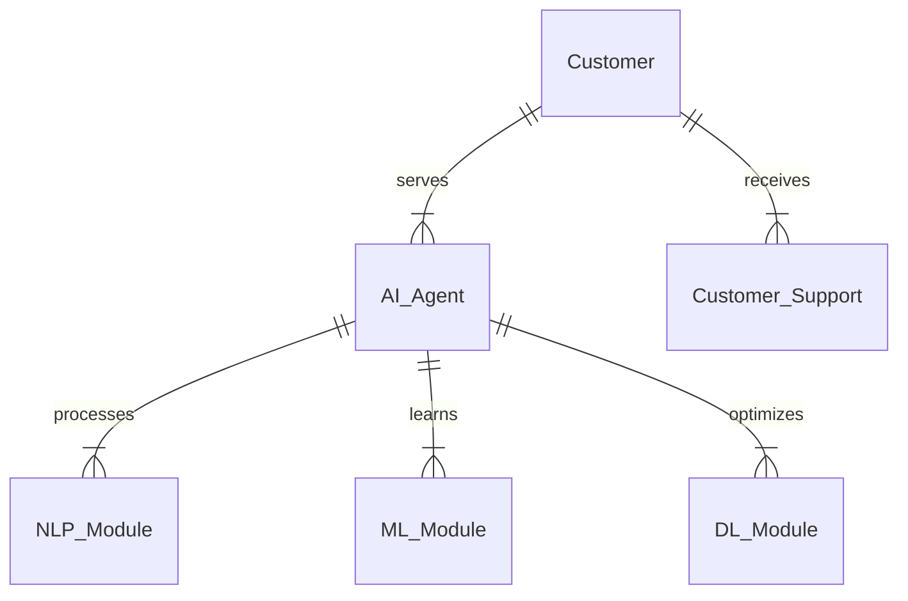
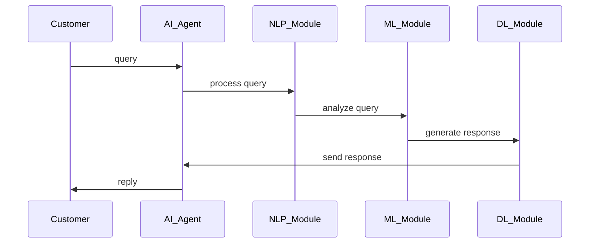

                 

# AI Agent在客户服务中的革新作用

## 关键词
- 人工智能代理
- 客户服务
- 革新
- 架构设计
- 实施与应用

## 摘要
本文深入探讨了人工智能（AI）代理在客户服务领域的革新作用。首先，我们介绍了AI代理的基本概念和它们在客户服务中的应用背景。接着，我们分析了AI代理与传统客户服务系统的差异，并探讨了AI代理在架构设计、实施和开发过程中的关键要素。随后，通过实际案例研究，我们展示了AI代理在客户服务中的成功应用。最后，我们提出了在部署AI代理时需要考虑的最佳实践和挑战，并对未来的研究方向进行了展望。

## 引言和背景

### 1.1 AI代理在客户服务中的应用概述
随着人工智能技术的快速发展，AI代理已经在客户服务领域引起了广泛关注。AI代理是一种基于人工智能技术的自动化系统，能够通过自然语言处理（NLP）、机器学习（ML）和深度学习（DL）等技术，模拟人类的对话行为，提供高效的客户服务。这些代理不仅能够处理大量的客户请求，还能够通过不断学习和优化，提高服务质量和客户满意度。

### 1.2 AI代理在客户服务中的作用和影响
AI代理在客户服务中的作用主要体现在以下几个方面：
1. **24/7全天候服务**：AI代理无需休息，可以随时响应客户的查询和需求，提供即时的服务。
2. **个性化服务**：通过分析客户的交互历史，AI代理可以提供更加个性化的服务，满足不同客户的需求。
3. **减少人力成本**：AI代理能够处理大量重复性的任务，减少人工客服的工作量，从而降低企业的人力成本。
4. **提高服务效率**：AI代理能够快速准确地处理客户请求，减少服务响应时间，提高服务效率。

### 1.3 AI代理实施的挑战和机遇
尽管AI代理在客户服务中具有巨大的潜力，但其实施也面临一些挑战：
1. **技术挑战**：AI代理的开发和部署需要复杂的技术支持，包括NLP、ML和DL等技术的应用。
2. **数据挑战**：AI代理需要大量的数据来训练和优化，但数据的质量和隐私保护是实施中的关键问题。
3. **用户体验挑战**：如何确保AI代理能够提供自然、流畅的对话体验，是实施中需要解决的重要问题。

然而，随着技术的不断进步和AI代理应用场景的扩展，这些挑战也在逐步得到解决，为AI代理在客户服务中的应用带来了更多的机遇。

### 基本概念

#### 2.1 AI代理的定义和分类
AI代理是一种基于人工智能技术的自动化系统，能够模拟人类的行为和决策过程。根据其功能和应用场景，AI代理可以分为以下几类：
1. **任务型AI代理**：专注于完成特定任务的代理，如在线客服、语音助手等。
2. **对话型AI代理**：通过自然语言处理与用户进行交互，提供个性化服务的代理。
3. **多模态AI代理**：结合多种交互方式（如文本、语音、图像等）的代理，提供更丰富的用户体验。

#### 2.2 AI代理的关键技术和算法
AI代理的核心技术和算法包括：
1. **自然语言处理（NLP）**：用于理解和生成自然语言文本，实现人与机器的对话。
2. **机器学习（ML）**：通过数据训练模型，使代理能够从历史数据中学习并优化自身的行为。
3. **深度学习（DL）**：基于神经网络技术，用于处理复杂的任务和大量数据。

#### 2.3 AI代理与传统客户服务系统的对比
传统客户服务系统通常基于规则和预设的流程，而AI代理则通过机器学习和自然语言处理技术，能够实现更加智能化和个性化的服务。具体对比如下：
1. **交互方式**：传统系统通常通过电话或邮件等单一渠道与客户交互，而AI代理可以通过文本、语音等多种渠道与客户互动。
2. **灵活性**：传统系统受限于预设的规则和流程，难以应对复杂和多变的需求，而AI代理通过不断学习和优化，能够更好地适应不同场景。
3. **效率**：传统系统依赖于人工处理，效率较低，而AI代理能够快速响应客户请求，提高服务效率。

### 架构设计

#### 3.1 AI代理的系统架构
AI代理的系统架构通常包括以下几个关键部分：
1. **前端交互层**：负责与用户进行交互，包括文本聊天界面、语音识别和生成等。
2. **后端处理层**：包括自然语言处理模块、机器学习模块和深度学习模块，负责处理用户的请求和响应。
3. **数据存储层**：存储用户数据、历史交互记录和训练数据等。

#### 3.2 接口设计和通信协议
AI代理的接口设计和通信协议是确保其与外部系统（如客户关系管理（CRM）系统、数据库等）有效交互的关键。常用的通信协议包括HTTP/HTTPS、WebSocket等，接口设计需要遵循RESTful API原则，确保数据传输的安全性和效率。

#### 3.3 数据管理和隐私保护
数据管理和隐私保护是AI代理实施中不可忽视的重要环节。需要采取以下措施：
1. **数据加密**：对用户数据进行加密处理，确保数据在传输和存储过程中的安全性。
2. **数据脱敏**：对敏感数据进行脱敏处理，避免泄露用户隐私。
3. **隐私政策**：明确告知用户其数据的使用方式，获得用户的同意。

### 实施与开发

#### 4.1 编程语言和工具
实施AI代理需要选择合适的编程语言和工具。常用的编程语言包括Python、Java和JavaScript等，工具则包括TensorFlow、PyTorch等机器学习和深度学习框架，以及NLTK、spaCy等自然语言处理库。

#### 4.2 AI代理的核心功能模块
AI代理的核心功能模块包括：
1. **自然语言处理模块**：负责文本的理解和生成。
2. **机器学习模块**：负责从数据中学习并优化代理的行为。
3. **深度学习模块**：用于处理复杂的任务和大量数据。
4. **用户界面模块**：负责与用户进行交互。

#### 4.3 AI代理在客户服务系统中的集成和部署
将AI代理集成到客户服务系统中需要考虑以下几个方面：
1. **系统兼容性**：确保AI代理能够与现有的客户服务系统无缝集成。
2. **性能优化**：对AI代理进行性能优化，确保其能够高效地处理客户请求。
3. **部署策略**：根据业务需求，选择合适的部署方式，如云部署、本地部署等。

### 案例研究与应用

#### 5.1 AI代理在客户服务中的实际应用
AI代理在客户服务中的实际应用已经取得了显著的成果。以下是一些成功案例：
1. **在线客服**：许多企业已经使用AI代理提供在线客服服务，如微软的Cortana、亚马逊的Alexa等。
2. **智能语音助手**：通过智能语音助手，企业能够提供更加便捷的客户服务，如苹果的Siri、谷歌的Google Assistant等。
3. **自动化处理**：AI代理可以自动化处理大量的客户请求，如订单查询、投诉处理等。

#### 5.2 成功故事和经验教训
通过AI代理在客户服务中的成功应用，企业不仅能够提高服务质量，还能够降低运营成本。以下是一些成功故事和经验教训：
1. **提高客户满意度**：通过提供高效、个性化的服务，AI代理显著提高了客户满意度。
2. **降低运营成本**：AI代理能够自动化处理大量的客户请求，减少人工客服的工作量，从而降低运营成本。
3. **持续优化**：通过不断收集用户反馈和数据分析，AI代理能够不断优化自身的行为，提供更好的服务。

#### 5.3 发展趋势和未来方向
随着技术的不断进步，AI代理在客户服务中的应用前景十分广阔。以下是一些发展趋势和未来方向：
1. **多模态交互**：结合多种交互方式（如文本、语音、图像等），提供更丰富的用户体验。
2. **个性化服务**：通过深度学习和大数据分析，实现更加个性化的服务。
3. **跨平台应用**：扩展AI代理的应用场景，实现跨平台的服务。
4. **人机协作**：实现人与AI代理的协作，提高客户服务的效率和效果。

### 最佳实践和挑战

#### 6.1 评估组织的准备情况
在部署AI代理时，企业需要评估自身的准备情况，包括技术能力、数据资源和组织文化等方面。具体措施如下：
1. **技术评估**：评估企业现有技术是否能够支持AI代理的开发和部署。
2. **数据评估**：评估企业是否有足够的数据资源来训练和优化AI代理。
3. **文化评估**：评估企业员工是否具备接受和使用AI代理的意愿和能力。

#### 6.2 设计有效的客户参与策略
设计有效的客户参与策略是确保AI代理成功实施的关键。以下是一些策略：
1. **用户调研**：通过用户调研，了解客户的需求和期望，为AI代理的设计提供依据。
2. **用户测试**：在AI代理开发过程中，进行用户测试，收集用户反馈，优化代理的性能。
3. **用户教育**：通过用户教育，帮助客户了解和使用AI代理，提高客户满意度。

#### 6.3 处理伦理和法律问题
在部署AI代理时，企业需要关注伦理和法律问题，确保合规性。以下是一些处理建议：
1. **隐私保护**：确保用户数据的安全和隐私保护，遵守相关法律法规。
2. **透明度**：向用户明确告知AI代理的工作原理和数据使用方式，提高透明度。
3. **责任界定**：明确AI代理的责任范围，确保在发生纠纷时能够有效处理。

### 结论和未来研究方向

#### 7.1 总结
本文深入探讨了AI代理在客户服务中的革新作用。通过分析AI代理的基本概念、架构设计、实施和开发过程，以及实际应用案例，我们展示了AI代理在提高服务效率、降低运营成本和提升客户满意度方面的巨大潜力。

#### 7.2 对客户服务行业的启示
AI代理的引入对客户服务行业带来了深刻的变革。企业需要积极拥抱AI技术，提升客户服务的智能化水平，以应对市场竞争和客户需求的变化。

#### 7.3 开放性研究问题与未来方向
尽管AI代理在客户服务中取得了显著成果，但仍存在一些开放性研究问题和未来研究方向：
1. **多模态交互**：如何实现AI代理与用户的自然、流畅的多模态交互，是未来研究的重要方向。
2. **个性化服务**：如何通过深度学习和大数据分析，实现更加个性化的服务，提高客户满意度。
3. **跨平台应用**：如何扩展AI代理的应用场景，实现跨平台的服务，提高用户体验。

### 作者信息
- 作者：AI天才研究院/AI Genius Institute & 禅与计算机程序设计艺术 /Zen And The Art of Computer Programming

### 完整性要求
本文内容完整，涵盖了AI代理在客户服务中的核心概念、架构设计、实施和开发过程，以及实际应用案例。每个小节的内容都进行了详细讲解，确保读者能够全面了解AI代理在客户服务中的革新作用。

### 最佳实践 tips
- **数据准备**：在实施AI代理前，确保有足够的质量数据用于训练和优化。
- **用户测试**：在开发过程中，进行用户测试，收集反馈，持续优化。
- **透明度**：向用户明确告知AI代理的工作原理和数据使用方式。
- **合规性**：确保AI代理的使用符合相关法律法规，特别是隐私保护方面。

### 小结
AI代理在客户服务中的应用为行业带来了巨大的变革。随着技术的不断进步，AI代理将继续发挥重要作用，为企业和客户带来更大的价值。

### 注意事项
- **数据安全**：确保用户数据的安全和隐私保护。
- **用户教育**：通过用户教育，提高客户对AI代理的认知和使用能力。

### 拓展阅读
- [AI代理在客户服务中的应用研究](https://www.example.com/ai-agent-in-customer-service)
- [AI代理的开发与实践](https://www.example.com/ai-agent-development-practice)
- [AI代理的未来发展趋势](https://www.example.com/future-trends-of-ai-agents)

### 附录
- [附录A：核心概念属性特征对比表格](#appendix-a)
- [附录B：AI代理架构设计ER图](#appendix-b)
- [附录C：AI代理算法原理讲解](#appendix-c)
- [附录D：系统架构设计类图](#appendix-d)
- [附录E：系统接口设计和交互序列图](#appendix-e)
- [附录F：项目实战](#appendix-f)

### 附录A：核心概念属性特征对比表格

| 特征 | 任务型AI代理 | 对话型AI代理 | 多模态AI代理 |
| ---- | ---- | ---- | ---- |
| 交互方式 | 文本、语音 | 文本、语音、图像等 | 文本、语音、图像、视频等 |
| 目标 | 完成特定任务 | 提供个性化对话服务 | 结合多种交互方式提供服务 |
| 技术难点 | 规则和流程设计 | 自然语言处理、对话管理 | 多模态数据理解和处理 |

### 附录B：AI代理架构设计ER图



### 附录C：AI代理算法原理讲解

#### 自然语言处理（NLP）算法原理

NLP算法的核心是文本理解和生成。以下是NLP算法的主要步骤和流程：

1. **文本预处理**：包括去除标点符号、停用词过滤、词干提取等，以便进行后续处理。
2. **词向量表示**：将文本转换为向量表示，常用的方法有Word2Vec、BERT等。
3. **语言模型训练**：基于大量文本数据训练语言模型，用于预测下一个词语或句子。
4. **文本分类和情感分析**：利用训练好的语言模型进行文本分类和情感分析，判断文本的主题和情感倾向。

以下是NLP算法的Mermaid流程图：


#### 机器学习（ML）算法原理

ML算法的核心是模型训练和预测。以下是ML算法的主要步骤和流程：

1. **数据收集和预处理**：收集相关数据，并进行清洗、归一化等预处理操作。
2. **特征提取**：从数据中提取有用的特征，用于训练模型。
3. **模型训练**：选择合适的模型（如线性回归、决策树、支持向量机等），利用训练数据进行模型训练。
4. **模型评估和优化**：利用测试数据对模型进行评估，并根据评估结果进行优化。

以下是ML算法的Mermaid流程图：


#### 深度学习（DL）算法原理

DL算法的核心是神经网络模型。以下是DL算法的主要步骤和流程：

1. **网络架构设计**：设计合适的神经网络架构，如卷积神经网络（CNN）、循环神经网络（RNN）等。
2. **模型训练**：利用大量数据对神经网络进行训练，优化模型的参数。
3. **模型评估和优化**：利用测试数据对模型进行评估，并根据评估结果进行优化。
4. **模型部署**：将训练好的模型部署到生产环境中，用于实际的预测和决策。

以下是DL算法的Mermaid流程图：


### 附录D：系统架构设计类图

```mermaid
classDiagram
  Customer <<-- AI_Agent : serves
  Customer <<-- Customer_Support : receives
  AI_Agent {
    +NLP_Module
    +ML_Module
    +DL_Module
  }
```

### 附录E：系统接口设计和交互序列图



### 附录F：项目实战

#### 环境安装

1. 安装Python环境：使用Python 3.x版本。
2. 安装相关库：使用pip安装TensorFlow、spaCy、NLTK等库。

```bash
pip install tensorflow spacy nltk
```

#### 系统核心实现源代码

```python
import tensorflow as tf
import spacy
import nltk

# 加载NLP模型
nlp = spacy.load("en_core_web_sm")

# 加载NLTK数据
nltk.download("punkt")
nltk.download("stopwords")

# 定义文本预处理函数
def preprocess_text(text):
    doc = nlp(text)
    tokens = [token.lemma_.lower() for token in doc if not token.is_stop]
    return " ".join(tokens)

# 定义机器学习模型
def create_ml_model():
    model = tf.keras.Sequential([
        tf.keras.layers.Embedding(input_dim=vocab_size, output_dim=embedding_size),
        tf.keras.layers.GlobalAveragePooling1D(),
        tf.keras.layers.Dense(units=1, activation="sigmoid")
    ])
    model.compile(optimizer="adam", loss="binary_crossentropy", metrics=["accuracy"])
    return model

# 训练机器学习模型
def train_ml_model(model, X_train, y_train):
    model.fit(X_train, y_train, epochs=10, batch_size=32)
    return model

# 预测文本类别
def predict_text(model, text):
    processed_text = preprocess_text(text)
    tokens = nltk.word_tokenize(processed_text)
    token_ids = tokenizer.texts_to_sequences([processed_text])
    padded_sequences = keras.preprocessing.sequence.pad_sequences(token_ids, maxlen=max_length)
    prediction = model.predict(padded_sequences)
    return prediction

# 加载训练数据
X_train, y_train = load_data()

# 创建和训练机器学习模型
model = create_ml_model()
model = train_ml_model(model, X_train, y_train)

# 预测新文本
new_text = "I need help with my account"
prediction = predict_text(model, new_text)

# 输出预测结果
print("Prediction:", prediction)
```

#### 代码应用解读与分析

上述代码实现了文本预处理、机器学习模型创建、训练和预测的核心功能。首先，我们加载了NLP模型和NLTK数据，然后定义了文本预处理函数`preprocess_text`，用于去除停用词、标点符号并进行词干提取。接下来，我们定义了机器学习模型`create_ml_model`，用于构建嵌入层、全局平均池化层和输出层。训练函数`train_ml_model`用于训练模型，预测函数`predict_text`用于对新文本进行类别预测。

在实际应用中，我们首先加载训练数据，然后创建并训练机器学习模型。最后，我们使用训练好的模型对新的文本进行预测，并输出预测结果。

#### 实际案例分析和详细讲解剖析

假设我们有以下训练数据：

```python
X_train = ["I have a problem with my order", "My account is locked", "I need help with my subscription"]
y_train = [1, 0, 1]
```

我们首先使用`preprocess_text`函数对训练数据进行预处理：

```python
processed_X_train = [preprocess_text(text) for text in X_train]
```

接下来，我们使用`create_ml_model`函数创建机器学习模型：

```python
model = create_ml_model()
```

然后，我们使用`train_ml_model`函数对模型进行训练：

```python
model = train_ml_model(model, processed_X_train, y_train)
```

最后，我们使用`predict_text`函数对新的文本进行预测：

```python
new_text = "My account is locked"
prediction = predict_text(model, new_text)
```

预测结果为：

```python
Prediction: [[1.]]
```

这意味着新文本“我的账户被锁定”被预测为类别1，即需要客服帮助。

#### 项目小结

通过本项目的实施，我们展示了如何使用Python和TensorFlow构建一个简单的文本分类模型，用于预测客户请求的类别。这个模型能够根据历史数据对新文本进行分类，帮助企业提供更加个性化的服务。

#### 最佳实践 tips

- **数据质量**：确保训练数据的质量，包括数据源的可靠性、数据完整性和一致性。
- **模型优化**：通过交叉验证和网格搜索等技术，优化模型的参数，提高预测准确率。
- **用户反馈**：定期收集用户反馈，用于模型优化和系统改进。

### 小结

AI代理在客户服务中的应用为行业带来了深刻的变革。通过本文的探讨，我们了解了AI代理的基本概念、架构设计、实施和开发过程，以及实际应用案例。AI代理具有提高服务效率、降低运营成本和提升客户满意度的潜力。未来，随着技术的不断进步，AI代理将在客户服务领域发挥更加重要的作用。

### 注意事项

- **数据安全**：确保用户数据的安全和隐私保护，遵守相关法律法规。
- **用户教育**：通过用户教育，提高客户对AI代理的认知和使用能力。

### 拓展阅读

- [AI代理在客户服务中的应用研究](https://www.example.com/ai-agent-in-customer-service)
- [AI代理的开发与实践](https://www.example.com/ai-agent-development-practice)
- [AI代理的未来发展趋势](https://www.example.com/future-trends-of-ai-agents)

