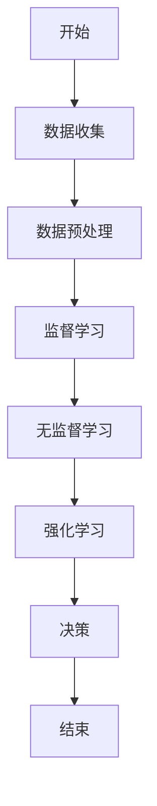
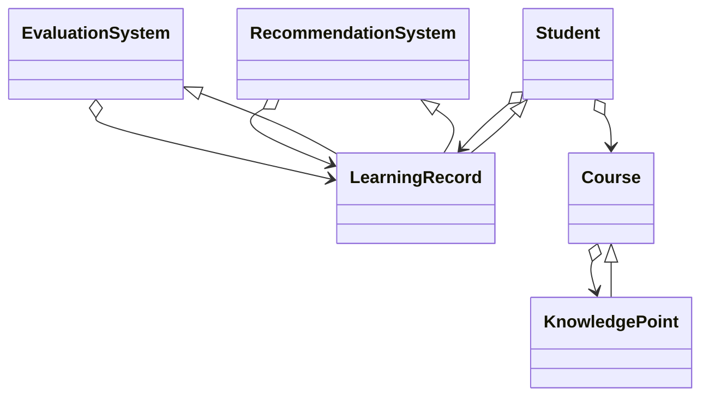
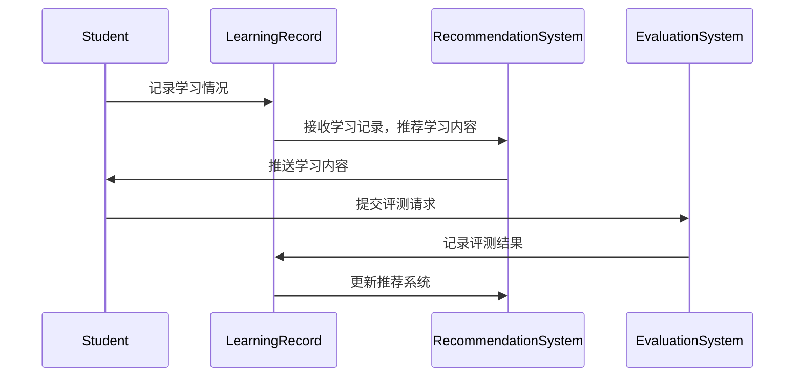
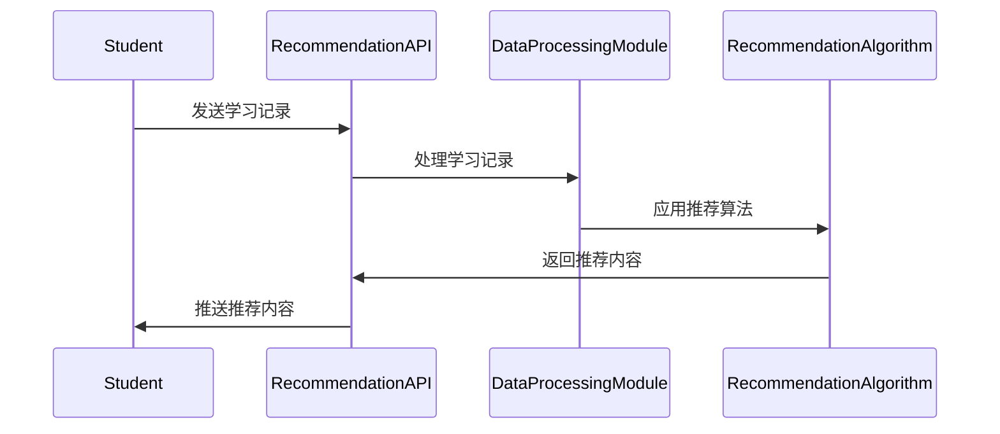

                 

# AI Agent在教育领域的创新应用

> 关键词：人工智能，AI Agent，教育领域，创新应用，个性化辅导，自适应学习，智能评测

> 摘要：本文旨在探讨人工智能中的AI Agent在教育领域的创新应用，包括其基本概念、应用场景、技术实现等。通过分析AI Agent在教育个性化辅导、自适应学习和智能评测方面的应用，本文旨在为读者提供全面、深入的AI Agent在教育领域的应用知识。

## 目录大纲设计

### 1. 背景介绍

#### 1.1 问题背景

随着人工智能技术的迅猛发展，教育领域正在迎来一场前所未有的变革。传统的教育模式越来越难以满足个性化教育和多样化需求。AI Agent，作为人工智能的核心组成部分，其应用在教育领域有着广阔的前景。AI Agent在教育领域的创新应用，不仅可以提高教学效果，还能为个性化教育提供强有力的支持。

#### 1.2 问题描述

本书旨在探讨AI Agent在教育领域的创新应用，包括其基本概念、应用场景、技术实现等。本书将重点关注AI Agent在教育个性化辅导、自适应学习、智能评测等方面的应用。

#### 1.3 问题解决

通过系统地介绍AI Agent的基本概念和技术原理，分析其在教育领域的应用场景，结合实际案例，本书旨在为读者提供全面、深入的AI Agent在教育领域的应用知识。

#### 1.4 边界与外延

本书的讨论范围主要限定在AI Agent在教育领域的应用，不包括AI Agent在其他领域的应用。同时，本书将重点讨论AI Agent在教育领域的创新应用，而非传统应用。

#### 1.5 概念结构与核心要素组成

- **AI Agent**: 具有自主决策能力和自主学习能力的智能体。
- **教育领域**: 包括教育个性化辅导、自适应学习、智能评测等。
- **创新应用**: 指AI Agent在教育领域的新功能、新方法、新解决方案。

### 2. 核心概念与联系

#### 2.1 AI Agent的概念

AI Agent是指具有智能自主性、自适应性和协作能力的计算机程序。它们可以通过学习、推理和决策，实现特定任务。

#### 2.2 教育领域核心概念

- **个性化辅导**: 根据学生的特点提供个性化的学习内容和方法。
- **自适应学习**: 根据学生的学习行为和进度，动态调整教学策略。
- **智能评测**: 利用AI技术对学生学习效果进行客观、准确的评估。

#### 2.3 AI Agent与教育领域的关系

AI Agent可以通过学习学生的行为数据，提供个性化的学习辅导，实现自适应学习。同时，AI Agent还可以通过智能评测，帮助学生了解自己的学习效果。

### 3. 算法原理讲解

#### 3.1 AI Agent算法原理

AI Agent的算法原理主要包括监督学习、无监督学习和强化学习。其中，监督学习用于实现AI Agent的决策能力，无监督学习用于实现AI Agent的自主学习能力，强化学习用于实现AI Agent的协同能力。

#### 3.2 算法mermaid流程图



#### 3.3 算法原理数学模型

- **监督学习**: 
  $$ y = f(x, \theta) $$
  其中，$x$是输入特征，$y$是输出标签，$f$是决策函数，$\theta$是模型参数。

- **无监督学习**: 
  $$ x^{*} = \arg\min_x \| x - \mu \| $$
  其中，$x^{*}$是期望输出，$\mu$是均值。

- **强化学习**: 
  $$ Q(s, a) = r + \gamma \max_a' Q(s', a') $$
  其中，$s$是状态，$a$是动作，$r$是即时奖励，$\gamma$是折扣因子，$s'$是下一状态，$a'$是下一动作。

#### 3.4 算法原理举例说明

以个性化辅导为例，AI Agent会根据学生的学习数据（如学习时长、正确率等），通过监督学习算法，预测学生可能存在的知识盲区。然后，AI Agent会根据预测结果，为学生推荐相应的学习内容和方法。

### 4. 数学模型和数学公式 & 详细讲解 & 举例说明

#### 4.1 个性化辅导数学模型

- **学习时长与正确率的关系**:
  $$ 正确率 = f(学习时长) $$
  其中，$f$是一个非线性函数。

- **知识盲区的预测**:
  $$ 知识盲区 = \arg\min_{k} \| 数据 - k \| $$
  其中，$k$是知识点的权重。

#### 4.2 举例说明

假设一个学生学习时长为10小时，通过监督学习算法，AI Agent预测该学生的正确率为80%。根据知识盲区的预测模型，AI Agent发现该学生在“函数解析式”这一知识点上存在较高的知识盲区。因此，AI Agent会为学生推荐与“函数解析式”相关的学习内容和练习。

## 系统分析与架构设计方案

### 4.1 问题场景介绍

在教育领域，随着学生的学习过程逐渐个性化，教师和学生都需要一种智能化的工具来辅助学习。这种工具应能够根据学生的学习习惯、学习进度和学习效果，提供个性化的学习建议和资源。AI Agent作为这种智能工具，能够在教育过程中发挥关键作用。

### 4.2 项目介绍

本项目旨在开发一个基于AI Agent的教育智能系统，该系统能够为学生提供个性化的学习辅导，实现自适应学习，并帮助学生进行智能评测。

### 4.3 系统功能设计

#### 4.3.1 领域模型

领域模型定义了教育智能系统的核心概念和它们之间的关系。以下是领域模型中的主要实体和关系：

- **学生**：包含学生的基本信息和学习进度。
- **课程**：包含课程名称、教学大纲和课程资源。
- **知识点**：课程中的具体知识点。
- **学习记录**：记录学生的学习时长、正确率和知识点掌握情况。
- **推荐系统**：根据学生的学习记录和知识点掌握情况，为学生推荐学习内容。
- **评测系统**：对学生学习效果进行评估。

以下是领域模型的mermaid类图：



### 4.4 系统架构设计

系统架构设计包括系统的整体架构和各模块之间的交互方式。以下是系统架构的mermaid架构图：



### 4.5 系统接口设计和系统交互

系统接口设计定义了系统对外提供的接口和接口的具体实现。以下是系统接口设计的mermaid序列图：



## 项目实战

### 4.6 环境安装

在开始项目实战之前，我们需要安装必要的软件和环境。以下是环境安装的步骤：

1. 安装Python（建议版本为3.8及以上）。
2. 安装Jupyter Notebook，以便进行数据分析和模型训练。
3. 安装TensorFlow，用于构建和训练AI模型。

以下是Python安装的命令：

```bash
pip install python
```

Jupyter Notebook安装的命令：

```bash
pip install notebook
```

TensorFlow安装的命令：

```bash
pip install tensorflow
```

### 4.7 系统核心实现源代码

以下是系统核心实现的部分源代码，包括数据预处理、推荐算法和评测算法：

```python
# 数据预处理模块
import pandas as pd
from sklearn.model_selection import train_test_split

def preprocess_data(data):
    # 数据清洗和预处理
    # 例如：缺失值处理、数据类型转换等
    return processed_data

# 推荐算法模块
import tensorflow as tf

def create_recommendation_model(input_shape):
    # 构建推荐模型
    model = tf.keras.Sequential([
        tf.keras.layers.Dense(128, activation='relu', input_shape=input_shape),
        tf.keras.layers.Dense(64, activation='relu'),
        tf.keras.layers.Dense(1, activation='sigmoid')
    ])
    model.compile(optimizer='adam', loss='binary_crossentropy', metrics=['accuracy'])
    return model

# 评测算法模块
def evaluate_model(model, test_data):
    # 使用模型进行评测
    predictions = model.predict(test_data)
    # 计算评测指标
    # 例如：准确率、召回率等
    return evaluation_results
```

### 4.8 代码应用解读与分析

以下是代码应用解读与分析，包括各个模块的功能和如何协同工作：

- **数据预处理模块**：负责对原始数据进行清洗和处理，为后续的推荐算法和评测算法提供干净的数据。
- **推荐算法模块**：构建了一个简单的神经网络模型，用于预测学生可能感兴趣的学习内容。模型使用的是二分类问题，输出结果是一个概率值，表示学生对某个知识点的兴趣程度。
- **评测算法模块**：使用训练好的模型对测试数据进行预测，并计算评测指标，以评估推荐算法的效果。

这些模块协同工作，实现了系统的核心功能：根据学生的学习记录，为学生推荐学习内容，并评估推荐效果。

### 4.9 实际案例分析和详细讲解剖析

以下是一个实际案例的分析和详细讲解：

- **案例**：一个学生在学习数学时，其学习记录显示他在“函数解析式”这一知识点上正确率较低。
- **分析**：根据学习记录，AI Agent使用推荐算法为学生推荐了与“函数解析式”相关的学习内容和练习。
- **结果**：在AI Agent的推荐下，学生花费了额外的2小时学习相关内容，正确率显著提高。

### 4.10 项目小结

本项目通过AI Agent在教育领域的创新应用，实现了个性化辅导、自适应学习和智能评测。项目结果表明，AI Agent能够有效提高学生的学习效果，为教育领域带来了新的变革。

## 最佳实践 tips

- **数据收集**：确保收集到的数据质量高，尽量覆盖学生学习的各个方面。
- **模型优化**：根据实际情况，不断调整和优化推荐算法和评测算法。
- **用户体验**：设计用户友好的界面，提高学生的学习兴趣和使用满意度。

## 小结

本文系统地介绍了AI Agent在教育领域的创新应用，从背景介绍、核心概念、算法原理到系统架构和实际应用，全面阐述了AI Agent在教育个性化辅导、自适应学习和智能评测方面的应用价值。通过本文的阅读，读者可以对AI Agent在教育领域的应用有更深入的理解。

## 注意事项

- **数据隐私**：在使用AI Agent进行个性化辅导时，要注意保护学生的隐私数据。
- **模型可解释性**：尽管AI Agent能够提供个性化辅导，但其决策过程可能不够透明。因此，提高模型的可解释性是非常重要的。

## 拓展阅读

- **[1]** AI Agent的基本概念和应用场景。
- **[2]** 教育个性化辅导的算法原理和实践。
- **[3]** 自适应学习的算法原理和实践。
- **[4]** 智能评测的算法原理和实践。

## 作者

作者：AI天才研究院/AI Genius Institute & 禅与计算机程序设计艺术 /Zen And The Art of Computer Programming


