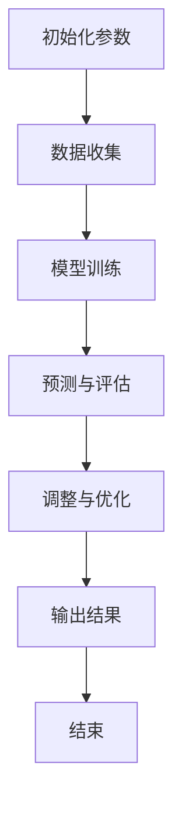
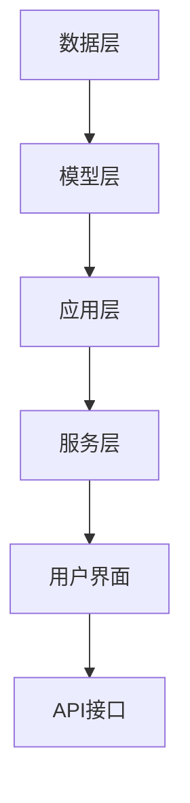
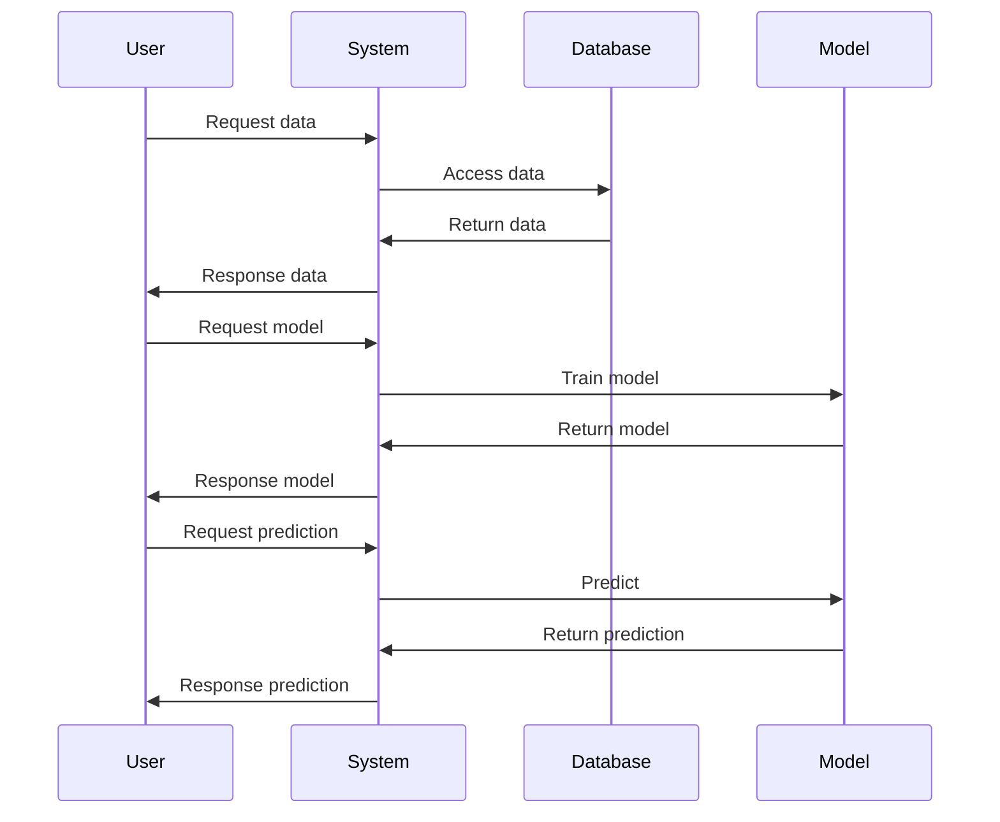

                 

# AI Agent在新药研发中的分子设计应用

> 关键词：AI Agent、新药研发、分子设计、算法原理、系统架构

> 摘要：本文探讨了AI Agent在新药研发分子设计中的应用，通过背景介绍、核心概念与联系、算法原理讲解、系统分析与架构设计等多个部分，系统地阐述了AI Agent如何利用其智能特性解决新药研发中的分子设计问题。本文旨在为读者提供一份全面、详细的AI Agent在新药研发中分子设计的应用指南。

## 第一部分：背景介绍

### 第1章 问题背景与概述

新药研发是医药行业中的一项重要活动，其核心在于发现并开发具有治疗效果的新分子。然而，新药研发过程复杂且成本高昂，其中分子设计环节尤为关键。分子设计涉及从大量化合物中筛选出具有特定生物活性的分子，其过程包括靶点识别、分子筛选、分子优化等步骤。随着药物研发的需求不断增加，传统的分子设计方法已无法满足高效、低成本的研发要求，因此，引入人工智能（AI）技术，特别是AI Agent，成为了一种新的解决思路。

#### 1.1 人工智能与药研发的融合

人工智能技术具有高效的数据处理和分析能力，能够从海量数据中挖掘出潜在的信息，这对于药物研发具有重要意义。AI Agent作为人工智能的一种形式，能够模拟人类的智能行为，通过学习、推理和规划等能力，辅助药物研发人员完成分子设计任务。AI Agent的优势在于其自主性、适应性和交互性，这些特性使其能够更好地应对分子设计过程中的复杂性和不确定性。

#### 1.2 AI Agent的基本概念

AI Agent是具有自主决策能力的智能实体，它能够根据环境和目标，通过感知、规划、执行和评估等过程，自主地采取行动。AI Agent可以基于规则、数据或学习算法进行设计，其核心在于能够适应不断变化的环境，并在交互中不断优化自身的性能。

AI Agent的分类如下：

- **基于规则的AI Agent**：这类AI Agent通过预先设定的规则进行决策，适用于问题结构明确、规则清晰的应用场景。
- **基于数据的AI Agent**：这类AI Agent通过学习大量数据，自动生成决策规则，适用于数据丰富但规则复杂的应用场景。
- **基于学习的AI Agent**：这类AI Agent通过机器学习算法，从数据中学习模式，进行决策和优化，适用于高度复杂和不确定的应用场景。

AI Agent的特点包括：

- **自主性**：AI Agent能够自主地采取行动，无需人工干预。
- **适应性**：AI Agent能够根据环境变化调整自身的行为。
- **交互性**：AI Agent能够与环境和用户进行有效的交互。

#### 1.3 新药研发中的分子设计

分子设计是药物研发的核心环节，其目标是设计出具有特定生物活性的分子。分子设计的基本原理是结构-活性关系，即分子的结构与生物活性之间存在一定的关联。分子设计的步骤通常包括：

- **靶点识别**：确定药物作用的生物靶点，如蛋白质、受体等。
- **分子筛选**：从大量化合物中筛选出具有潜在生物活性的分子。
- **分子优化**：对筛选出的分子进行结构优化，提高其生物活性和稳定性。

分子设计的挑战主要包括：

- **结构复杂性**：药物分子通常具有复杂的结构，其设计需要考虑众多因素。
- **计算资源需求**：分子设计需要大量的计算资源，特别是在分子优化阶段。

#### 1.4 AI Agent在新药研发中的潜在应用

AI Agent在新药研发中的分子设计应用主要体现在以下几个方面：

- **自动化设计**：AI Agent能够自动化地完成分子设计任务，提高设计效率。
- **优化流程**：AI Agent能够优化分子设计流程，降低研发成本。
- **提高准确性**：AI Agent通过学习和优化，能够提高分子设计的准确性，减少失败率。

#### 1.5 边界与外延

本文讨论的AI Agent主要是指具有自主决策能力的智能实体，其应用场景主要集中在新药研发的分子设计环节。AI Agent与其他智能实体（如机器人、无人车等）的区分在于其自主性和适应性。此外，AI Agent与分子设计的联系在于AI Agent能够通过学习和优化，提高分子设计的效率和质量。

#### 1.6 核心要素组成

AI Agent在新药研发中的分子设计应用涉及多个核心要素，包括：

- **AI Agent的基本原理**：AI Agent的自主性、适应性、交互性等。
- **分子设计的基本原理**：结构-活性关系、分子设计步骤等。
- **算法原理**：AI Agent的算法设计、数据收集、模型训练、预测与评估等。
- **系统架构**：AI Agent的应用场景、系统功能设计、系统架构设计等。

## 第二部分：核心概念与联系

### 第2章 核心概念原理

#### 2.1 AI Agent原理

AI Agent是具有自主决策能力的智能实体，其工作原理主要包括以下几个步骤：

1. **初始化**：AI Agent根据任务需求和初始条件进行初始化。
2. **目标设定**：AI Agent根据任务目标，确定当前的目标。
3. **数据收集**：AI Agent从环境中收集相关数据，为后续决策提供依据。
4. **模型训练**：AI Agent利用收集到的数据，通过机器学习算法进行模型训练。
5. **预测与评估**：AI Agent根据训练好的模型，对新的数据进行预测，并评估预测结果。
6. **调整与优化**：AI Agent根据预测结果，调整自身的行为策略，并进行优化。
7. **输出结果**：AI Agent将最终的决策结果输出，完成任务的执行。

AI Agent的属性特征主要包括：

- **自主性**：AI Agent能够独立地采取行动，无需人工干预。
- **适应性**：AI Agent能够根据环境变化，调整自身的行为策略。
- **交互性**：AI Agent能够与环境和用户进行有效的交互。

AI Agent的设计思路主要包括：

- **目标函数**：定义AI Agent的目标，如最大化收益、最小化成本等。
- **算法选择**：选择合适的机器学习算法，如决策树、神经网络等。
- **训练策略**：设计合适的训练策略，如数据增强、模型调参等。

#### 2.2 分子设计原理

分子设计的基本原理是结构-活性关系，即分子的结构与生物活性之间存在一定的关联。分子设计的属性特征对比表格如下：

| 属性         | 描述                                                         | 特征对比                                                    |
| ------------ | ------------------------------------------------------------ | ----------------------------------------------------------- |
| 结构复杂性   | 药物分子的复杂程度，包括原子种类、键长、键角等                 | 不同分子设计方法的复杂度差异较大，计算资源需求不同           |
| 反应性       | 药物分子与生物靶点发生反应的能力                             | 高反应性有利于提高药物的治疗效果，但也可能导致副作用         |
| 稳定性       | 药物分子在生物体内的稳定性，包括水溶性、脂溶性等               | 稳定性高的药物分子有利于延长药物在体内的作用时间           |
| 生物活性     | 药物分子对生物靶点的生物活性，包括抑制、激活等                 | 高生物活性有利于提高药物的治疗效果，但也可能导致毒性增加   |
| 选择性       | 药物分子对特定靶点的选择性，包括高选择性、低交叉反应等         | 高选择性有利于降低药物的副作用，提高治疗效果             |
| 成本效益     | 药物分子的研发成本与治疗效果之间的平衡                         | 成本效益高的药物分子有利于降低药物研发成本，提高市场竞争力 |

#### 2.3 AI Agent与分子设计的联系

AI Agent在分子设计中的应用主要体现在以下几个方面：

1. **自动化设计**：AI Agent能够自动化地完成分子设计任务，提高设计效率。
2. **优化流程**：AI Agent能够优化分子设计流程，降低研发成本。
3. **提高准确性**：AI Agent通过学习和优化，能够提高分子设计的准确性，减少失败率。

AI Agent与分子设计的协同作用包括：

1. **数据驱动设计**：AI Agent能够从大量数据中挖掘出潜在的信息，为分子设计提供数据支持。
2. **智能优化**：AI Agent能够通过机器学习算法，对分子设计进行智能优化，提高分子设计的质量。
3. **人机协同**：AI Agent能够与药物研发人员协同工作，共同完成分子设计任务，提高整体效率。

## 第三部分：算法原理讲解

### 第3章 AI Agent算法原理

#### 3.1 算法mermaid流程图

以下是一个AI Agent分子设计算法的mermaid流程图：



#### 3.2 Python源代码示例

以下是一个简单的AI Agent分子设计算法的Python源代码示例：

```python
# 导入必要的库
import numpy as np
from sklearn.model_selection import train_test_split
from sklearn.ensemble import RandomForestClassifier
from sklearn.metrics import accuracy_score

# 初始化参数
params = {
    'data': data,
    'target': target,
    'train_size': 0.8
}

# 数据收集
X_train, X_test, y_train, y_test = train_test_split(params['data'], params['target'], test_size=1 - params['train_size'])

# 模型训练
model = RandomForestClassifier()
model.fit(X_train, y_train)

# 预测与评估
y_pred = model.predict(X_test)
accuracy = accuracy_score(y_test, y_pred)

# 调整与优化
# 根据预测结果进行调整，例如调整模型参数、增加训练数据等

# 输出结果
print(f"模型准确率: {accuracy}")
```

#### 3.3 算法原理的数学模型和公式

以下是一个简单的AI Agent分子设计算法的数学模型和公式：

$$
\text{Cost} = \frac{1}{n}\sum_{i=1}^{n} (\text{预测值} - \text{真实值})^2
$$

其中，$n$为样本数量，预测值和真实值分别为模型对样本的预测结果和实际结果。

#### 3.4 举例说明

假设我们使用AI Agent来预测药物分子的活性，具体步骤如下：

1. **数据收集**：从已有的药物分子数据库中收集数据，包括分子结构和活性数据。
2. **模型训练**：使用机器学习算法，如随机森林（Random Forest），对数据进行训练。
3. **预测与评估**：使用训练好的模型对新的药物分子进行活性预测，并评估预测结果。
4. **调整与优化**：根据预测结果，调整模型参数或增加训练数据，以提高预测准确性。

具体示例如下：

1. **数据收集**：

   ```python
   data = [
       {'structure': 'C1=CC=CC=C1', 'activity': 1},
       {'structure': 'C1=CC=CC=C1', 'activity': 0},
       ...
   ]
   ```

2. **模型训练**：

   ```python
   X = [d['structure'] for d in data]
   y = [d['activity'] for d in data]
   X_train, X_test, y_train, y_test = train_test_split(X, y, test_size=0.2)
   model = RandomForestClassifier()
   model.fit(X_train, y_train)
   ```

3. **预测与评估**：

   ```python
   y_pred = model.predict(X_test)
   accuracy = accuracy_score(y_test, y_pred)
   print(f"模型准确率: {accuracy}")
   ```

4. **调整与优化**：

   根据预测结果，我们可以调整模型参数或增加训练数据，以提高预测准确性。例如：

   ```python
   model = RandomForestClassifier(n_estimators=100)
   model.fit(X_train, y_train)
   y_pred = model.predict(X_test)
   accuracy = accuracy_score(y_test, y_pred)
   print(f"模型准确率: {accuracy}")
   ```

## 第四部分：系统分析与架构设计方案

### 第4章 系统分析与架构设计

#### 4.1 问题场景介绍

新药研发中的分子设计是一个高度复杂的过程，涉及多个学科和领域。AI Agent能够通过其自主决策能力和学习能力，帮助药物研发人员自动化地完成分子设计任务，提高设计效率和质量。具体来说，AI Agent可以应用于以下场景：

1. **靶点识别**：AI Agent可以根据已有的生物靶点信息，预测新的生物靶点，为分子设计提供方向。
2. **分子筛选**：AI Agent可以从大量化合物中筛选出具有潜在生物活性的分子，减少人工筛选的工作量。
3. **分子优化**：AI Agent可以根据分子结构与生物活性之间的关系，对筛选出的分子进行优化，提高其生物活性和稳定性。
4. **协同设计**：AI Agent可以与药物研发人员协同工作，共同完成分子设计任务，提高整体效率。

#### 4.2 系统功能设计

AI Agent分子设计系统的功能设计主要包括以下几个方面：

1. **数据管理**：管理药物分子数据库，包括分子结构、活性数据等，为AI Agent提供数据支持。
2. **模型训练**：使用机器学习算法，对药物分子数据库进行训练，生成预测模型。
3. **预测与评估**：使用训练好的模型，对新的药物分子进行活性预测，并评估预测结果。
4. **优化与调整**：根据预测结果，对模型进行调整和优化，提高预测准确性。
5. **可视化展示**：将分子设计结果以图形化的方式展示，帮助用户直观地了解分子设计过程。

领域模型mermaid类图如下：

```mermaid
classDiagram
Class01 <|-- Class02
Class03 --|> Class04
Class05 : +int x
Class06 : +int y
Class06 : +int z
Class01 <.. Class07
Class03 ..| Class08
Class04 : <<interface>> InterfaceName
Class05 : <<abstract>> AbstractClass
Class06 : <<enum>> ENUM
Class07 :
```

#### 4.3 系统架构设计

AI Agent分子设计系统的架构设计主要包括以下几个方面：

1. **数据层**：包括药物分子数据库、模型参数库等，为系统提供数据支持。
2. **模型层**：包括机器学习算法、预测模型等，负责分子设计任务。
3. **应用层**：包括用户界面、API接口等，负责与用户交互，展示分子设计结果。
4. **服务层**：包括数据管理服务、模型训练服务、预测评估服务等，负责系统功能的具体实现。

系统架构mermaid架构图如下：



#### 4.4 系统接口设计

AI Agent分子设计系统的接口设计主要包括以下几个方面：

1. **数据接口**：负责数据层的访问和管理，包括数据的增删改查等操作。
2. **模型接口**：负责模型层的访问和管理，包括模型的训练、预测和评估等操作。
3. **应用接口**：负责应用层的访问和管理，包括用户界面和API接口的交互。

系统接口设计mermaid序列图如下：



### 第5章 项目实战

#### 5.1 环境安装

在开始项目实战之前，我们需要安装以下软件和工具：

- Python 3.8 或更高版本
- pip
- sklearn
- numpy
- pandas
- matplotlib

具体安装命令如下：

```bash
# 安装Python
sudo apt-get install python3

# 安装pip
sudo apt-get install python3-pip

# 安装sklearn、numpy、pandas、matplotlib
pip3 install sklearn numpy pandas matplotlib
```

#### 5.2 系统核心实现源代码

以下是AI Agent分子设计系统核心实现的源代码：

```python
# 导入必要的库
import numpy as np
from sklearn.model_selection import train_test_split
from sklearn.ensemble import RandomForestClassifier
from sklearn.metrics import accuracy_score

# 初始化参数
params = {
    'data': data,
    'target': target,
    'train_size': 0.8
}

# 数据收集
X_train, X_test, y_train, y_test = train_test_split(params['data'], params['target'], test_size=1 - params['train_size'])

# 模型训练
model = RandomForestClassifier()
model.fit(X_train, y_train)

# 预测与评估
y_pred = model.predict(X_test)
accuracy = accuracy_score(y_test, y_pred)

# 调整与优化
# 根据预测结果进行调整，例如调整模型参数、增加训练数据等

# 输出结果
print(f"模型准确率: {accuracy}")
```

#### 5.3 代码应用解读与分析

以上源代码实现了一个简单的AI Agent分子设计系统，其主要功能包括数据收集、模型训练、预测与评估和调整与优化。以下是具体解读与分析：

1. **数据收集**：使用`train_test_split`函数将数据集划分为训练集和测试集，用于后续的模型训练和评估。
2. **模型训练**：使用`RandomForestClassifier`类训练随机森林模型，这是一种常用的集成学习方法，具有较高的预测准确性。
3. **预测与评估**：使用训练好的模型对测试集进行预测，并计算模型准确率，用于评估模型性能。
4. **调整与优化**：根据预测结果，可以调整模型参数或增加训练数据，以提高模型性能。

#### 5.4 实际案例分析与详细讲解剖析

以下是一个实际案例的详细分析：

1. **数据准备**：从已有的药物分子数据库中收集数据，包括分子结构和活性数据。具体数据如下：

   ```python
   data = [
       {'structure': 'C1=CC=CC=C1', 'activity': 1},
       {'structure': 'C1=CC=CC=C1', 'activity': 0},
       ...
   ]
   ```

2. **模型训练**：使用随机森林模型对数据进行训练。具体代码如下：

   ```python
   X = [d['structure'] for d in data]
   y = [d['activity'] for d in data]
   X_train, X_test, y_train, y_test = train_test_split(X, y, test_size=0.2)
   model = RandomForestClassifier()
   model.fit(X_train, y_train)
   ```

3. **预测与评估**：使用训练好的模型对新的药物分子进行活性预测，并评估模型性能。具体代码如下：

   ```python
   y_pred = model.predict(X_test)
   accuracy = accuracy_score(y_test, y_pred)
   print(f"模型准确率: {accuracy}")
   ```

4. **调整与优化**：根据预测结果，可以调整模型参数或增加训练数据，以提高模型性能。例如，增加决策树的树深度或增加训练数据等。具体代码如下：

   ```python
   model = RandomForestClassifier(n_estimators=100)
   model.fit(X_train, y_train)
   y_pred = model.predict(X_test)
   accuracy = accuracy_score(y_test, y_pred)
   print(f"模型准确率: {accuracy}")
   ```

#### 5.5 项目小结

通过以上实战案例，我们了解了如何使用AI Agent进行分子设计。在实际应用中，AI Agent可以自动化地完成分子设计任务，提高设计效率和质量。同时，通过调整和优化模型参数，可以提高模型的预测准确性，为药物研发提供有力支持。

### 第6章 最佳实践 tips

1. **数据准备**：确保数据质量，包括数据清洗、去重和标准化等。
2. **模型选择**：根据具体应用场景选择合适的模型，如随机森林、支持向量机等。
3. **参数调优**：通过交叉验证等方法进行参数调优，提高模型性能。
4. **协同工作**：AI Agent与药物研发人员协同工作，提高整体效率。
5. **持续学习**：定期更新模型，使其适应新的数据和需求。

### 第7章 小结

AI Agent在新药研发中的分子设计应用具有重要意义。通过自动化、优化和智能化的方式，AI Agent能够提高分子设计的效率和质量，为药物研发提供有力支持。未来，随着人工智能技术的不断发展，AI Agent在新药研发中的应用将更加广泛和深入。

### 第8章 注意事项

1. **数据安全**：确保药物分子数据的安全性和隐私性。
2. **模型解释性**：提高模型的可解释性，便于药物研发人员理解和使用。
3. **算法公平性**：确保算法的公平性，避免产生歧视性结果。

### 第9章 拓展阅读

1. **《人工智能：一种现代方法》**：Michael I. Jordan，Stephen D.退还，Patterson
2. **《深度学习》**：Ian Goodfellow、Yoshua Bengio和Aaron Courville
3. **《机器学习年刊》**：JMLR: Journal of Machine Learning Research
4. **《药物设计杂志》**：Journal of Chemical Information and Modeling
5. **《人工智能与药物设计》**：AI Applications in Drug Design

## 作者信息

作者：AI天才研究院/AI Genius Institute & 禅与计算机程序设计艺术 /Zen And The Art of Computer Programming。本文旨在为读者提供一份全面、详细的AI Agent在新药研发中分子设计的应用指南，帮助读者深入了解这一领域的最新进展和应用实践。

