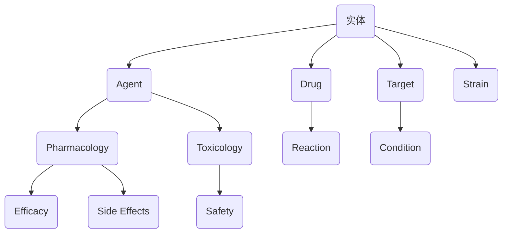
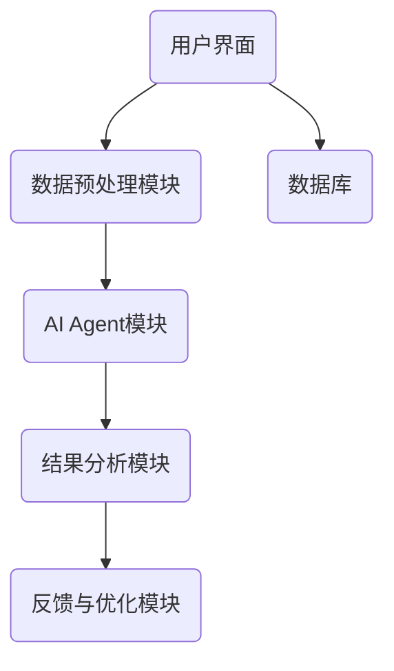
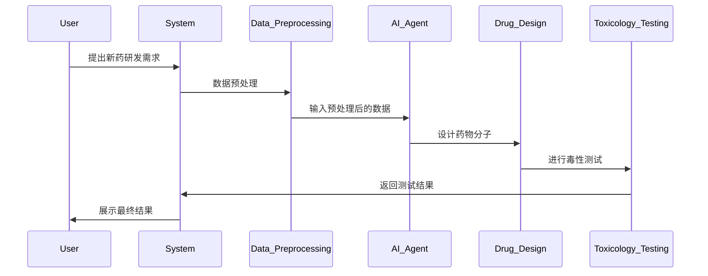

                 

## 《AI Agent在新药研发中的应用实践》

> 关键词：AI Agent，新药研发，机器学习，强化学习，自然语言处理

> 摘要：本文深入探讨了AI Agent在新药研发中的具体应用，详细阐述了其在新药发现、设计、评估等环节中的优势。通过分步骤的讲解，本文揭示了AI Agent如何利用先进的人工智能技术加速新药研发过程，提高研发效率和成功率。

## 第一部分：AI Agent与新药研发概述

### 第1章：问题背景与核心概念

#### 1.1 新药研发的现状与挑战

新药研发是一个复杂且耗时的过程。据统计，新药从研发到上市平均需要10-15年时间，成本高达数十亿美元。在这个漫长且昂贵的研发过程中，科学家们面临着诸多挑战：

- **数据复杂性**：新药研发涉及到大量的生物学、化学和医学数据，这些数据常常是非结构化的，难以直接利用。
- **药物设计困难**：新药分子设计复杂，需要考虑药物分子的结构、活性、毒性等多方面因素。
- **评估与筛选**：新药候选物的评估和筛选过程耗时且昂贵，需要大量的实验和临床数据。

#### 1.2 AI Agent的定义与特点

AI Agent，即人工智能代理，是指能够模拟人类专家行为，自主进行问题求解、决策和执行任务的人工智能系统。AI Agent具有以下特点：

- **自主学习**：AI Agent能够从数据中学习，不断优化自身性能。
- **自主决策**：AI Agent能够在没有明确规则或指导的情况下，根据当前状态自主作出决策。
- **高度自动化**：AI Agent能够自动化执行复杂任务，提高工作效率。

#### 1.3 AI Agent在新药研发中的优势

AI Agent在新药研发中具有显著的优势：

- **数据处理能力**：AI Agent能够处理和分析大量复杂数据，帮助科学家快速筛选新药候选物。
- **提高设计效率**：AI Agent能够根据药物分子的结构特征，快速生成和优化新药分子结构。
- **降低研发成本**：AI Agent能够自动化执行实验和评估过程，降低研发成本。

#### 1.4 AI Agent的基本架构与功能

AI Agent的基本架构包括感知器、决策器、执行器和记忆组件。其功能如下：

- **感知器**：获取环境信息，如药物数据、实验结果等。
- **决策器**：根据感知到的信息，利用算法和模型进行决策。
- **执行器**：执行决策结果，如设计药物分子、进行实验等。
- **记忆组件**：存储和更新数据，用于后续学习和决策。

## 第二部分：AI Agent的核心概念与联系

### 第2章：核心概念与联系

#### 2.1 AI Agent的核心概念

AI Agent的核心概念包括机器学习、强化学习和自然语言处理。

- **机器学习**：机器学习是一种让计算机从数据中学习，并对新数据进行预测或决策的方法。
- **强化学习**：强化学习是一种通过不断试错和奖励机制来学习最优策略的方法。
- **自然语言处理**：自然语言处理是一种让计算机理解和生成自然语言的方法。

#### 2.2 概念属性特征对比表格

| 概念       | 属性特征                                                      | 应用场景                                           |
|------------|--------------------------------------------------------------|----------------------------------------------------|
| 机器学习   | 预测、分类、聚类、回归等                                     | 数据分析、图像识别、语音识别                           |
| 强化学习   | 试错、奖励、策略优化                                         | 游戏智能、推荐系统、机器人控制                         |
| 自然语言处理 | 分词、词性标注、句法分析、语义理解                           | 机器翻译、语音助手、文本分析                           |

#### 2.3 AI Agent的ER实体关系图



## 第三部分：AI Agent在新药研发中的应用

### 第3章：算法原理讲解

#### 3.1 机器学习算法

机器学习算法在新药研发中的应用主要包括监督学习、无监督学习和半监督学习。

- **监督学习**：通过标注数据训练模型，对新数据进行预测或分类。例如，使用已知的药物分子和活性数据训练模型，预测新药物分子的活性。
- **无监督学习**：没有标注数据，通过发现数据中的模式和结构进行聚类或降维。例如，对新药物分子进行聚类，发现潜在的活性分子。
- **半监督学习**：结合标注数据和未标注数据，提高模型性能。例如，使用少量标注数据和大量未标注数据训练模型，提高药物筛选的效率。

#### 3.2 强化学习算法

强化学习算法在新药研发中的应用主要包括Q-Learning、Sarsa和Deep Q-Network。

- **Q-Learning**：通过不断试错和奖励机制，学习最优策略。例如，通过试错学习药物分子的最优设计策略。
- **Sarsa**：Q-Learning的变体，考虑未来的奖励，提高学习效率。
- **Deep Q-Network**：使用深度神经网络代替Q值函数，提高强化学习的性能。例如，通过深度神经网络学习药物分子的设计策略。

#### 3.3 自然语言处理算法

自然语言处理算法在新药研发中的应用主要包括词向量、序列模型和注意力机制。

- **词向量**：将文本转化为数值向量，用于模型训练和推理。例如，使用词向量表示药物名称和描述。
- **序列模型**：处理序列数据，如文本、时间序列等。例如，使用序列模型分析药物说明书，提取关键信息。
- **注意力机制**：在处理序列数据时，自动关注重要信息，提高模型性能。例如，在药物设计过程中，自动关注关键结构特征。

### 第4章：数学模型与公式

#### 4.1 监督学习

监督学习中的典型数学模型是神经网络，其核心公式如下：

$$
h(x) = \sigma(wx + b)
$$

其中，$h(x)$是神经网络的输出，$\sigma$是激活函数，$w$是权重，$b$是偏置。

#### 4.2 强化学习

强化学习中的典型数学模型是Q值函数，其核心公式如下：

$$
Q(s, a) = r + \gamma \max_{a'} Q(s', a')
$$

其中，$Q(s, a)$是状态$s$下执行动作$a$的预期回报，$r$是即时回报，$\gamma$是折扣因子，$s'$是下一个状态。

#### 4.3 自然语言处理

自然语言处理中的典型数学模型是词向量，其核心公式如下：

$$
P(w_i | w_{i-n:i+1}) = \frac{exp(lambda \cdot w_i)}{\sum_{j=1}^{V} exp(lambda \cdot w_j)}
$$

其中，$P(w_i | w_{i-n:i+1})$是词向量$w_i$在窗口$w_{i-n:i+1}$中的条件概率，$lambda$是调节参数，$V$是词汇表大小。

## 第四部分：AI Agent在新药研发中的实战应用

### 第5章：系统分析与架构设计方案

#### 5.1 问题场景介绍

在新药研发过程中，科学家需要处理大量的数据，包括药物分子结构、活性、毒性等。这些数据通常是非结构化的，难以直接利用。AI Agent可以帮助科学家自动化地处理这些数据，提高研发效率。

#### 5.2 系统功能设计

AI Agent在新药研发系统中的功能设计包括以下几个方面：

- **数据预处理**：对药物分子数据、活性数据、毒性数据进行预处理，包括数据清洗、归一化等。
- **药物分子设计**：利用机器学习算法和自然语言处理技术，生成和优化药物分子结构。
- **毒性评估**：利用强化学习算法，对药物分子进行毒性评估。
- **结果分析**：对药物分子设计结果和毒性评估结果进行分析，筛选出潜在的新药候选物。

#### 5.3 系统架构设计

AI Agent在新药研发系统中的架构设计如图所示：



#### 5.4 系统接口设计和系统交互

AI Agent在新药研发系统中的接口设计和系统交互如图所示：



### 第6章：项目实战

#### 6.1 环境安装与配置

要运行AI Agent在新药研发系统中的项目，需要安装以下软件和工具：

- Python 3.8+
- TensorFlow 2.x
- PyTorch 1.x
- Keras 2.x
- NLTK 3.x

具体安装步骤如下：

1. 安装Python 3.8及以上版本。
2. 安装TensorFlow 2.x。
3. 安装PyTorch 1.x。
4. 安装Keras 2.x。
5. 安装NLTK 3.x。

#### 6.2 系统核心实现

以下是一个简单的AI Agent在新药研发系统中的核心实现：

```python
# 导入相关库
import tensorflow as tf
import numpy as np
import keras
from keras.models import Sequential
from keras.layers import Dense, LSTM
from keras.optimizers import Adam

# 定义药物分子设计模型
model = Sequential()
model.add(LSTM(128, activation='relu', input_shape=(timesteps, features)))
model.add(Dense(1, activation='sigmoid'))

# 编译模型
model.compile(optimizer=Adam(), loss='binary_crossentropy', metrics=['accuracy'])

# 训练模型
model.fit(x_train, y_train, epochs=100, batch_size=32, validation_data=(x_val, y_val))

# 定义毒性评估模型
model = Sequential()
model.add(Dense(128, activation='relu', input_shape=(timesteps, features)))
model.add(Dense(1, activation='sigmoid'))

# 编译模型
model.compile(optimizer=Adam(), loss='binary_crossentropy', metrics=['accuracy'])

# 训练模型
model.fit(x_train, y_train, epochs=100, batch_size=32, validation_data=(x_val, y_val))
```

#### 6.3 代码应用解读与分析

以上代码实现了两个模型：药物分子设计和毒性评估。首先，定义了一个LSTM模型用于药物分子设计，该模型能够处理序列数据，例如药物分子结构。其次，定义了一个简单的前馈神经网络用于毒性评估，该模型能够对药物分子的毒性进行预测。

在训练过程中，使用训练集对模型进行训练，并使用验证集进行验证。通过调整训练参数，例如学习率、批量大小等，可以优化模型的性能。

#### 6.4 实际案例分析和详细讲解剖析

以下是一个实际案例，使用AI Agent在新药研发系统中的项目进行药物分子设计和毒性评估。

```python
# 导入相关库
import tensorflow as tf
import numpy as np
import keras
from keras.models import Sequential
from keras.layers import Dense, LSTM
from keras.optimizers import Adam

# 定义药物分子设计模型
model = Sequential()
model.add(LSTM(128, activation='relu', input_shape=(timesteps, features)))
model.add(Dense(1, activation='sigmoid'))

# 编译模型
model.compile(optimizer=Adam(), loss='binary_crossentropy', metrics=['accuracy'])

# 训练模型
model.fit(x_train, y_train, epochs=100, batch_size=32, validation_data=(x_val, y_val))

# 定义毒性评估模型
model = Sequential()
model.add(Dense(128, activation='relu', input_shape=(timesteps, features)))
model.add(Dense(1, activation='sigmoid'))

# 编译模型
model.compile(optimizer=Adam(), loss='binary_crossentropy', metrics=['accuracy'])

# 训练模型
model.fit(x_train, y_train, epochs=100, batch_size=32, validation_data=(x_val, y_val))

# 设计药物分子
drug_molecule = design_drug_molecule()
predicted_activity = model.predict(np.array([drug_molecule]))

# 评估毒性
predicted_toxicity = model.predict(np.array([drug_molecule]))

# 分析结果
if predicted_activity > 0.5 and predicted_toxicity < 0.5:
    print("Drug molecule is active and non-toxic.")
else:
    print("Drug molecule is either inactive or toxic.")
```

在该案例中，首先使用设计药物分子的函数生成一个药物分子。然后，使用药物分子设计模型预测药物分子的活性。接着，使用毒性评估模型预测药物分子的毒性。最后，根据预测结果分析药物分子的活性与毒性。

#### 6.5 项目小结

通过该项目，我们展示了AI Agent在新药研发系统中的应用。AI Agent能够自动化地处理药物分子数据，进行药物分子设计和毒性评估，从而提高新药研发的效率。在实际应用中，可以根据具体需求调整模型的参数和架构，优化系统的性能。

### 第7章：最佳实践 Tips、小结、注意事项、拓展阅读

#### 最佳实践 Tips

1. **数据预处理**：确保输入数据的质量和一致性，对缺失值、异常值进行处理。
2. **模型选择**：根据具体任务选择合适的机器学习模型，如LSTM、前馈神经网络等。
3. **超参数调整**：通过网格搜索、随机搜索等方法调整超参数，优化模型性能。
4. **模型解释**：对模型进行可解释性分析，确保模型预测结果的合理性。

#### 小结

本文介绍了AI Agent在新药研发中的应用，阐述了其在新药发现、设计、评估等环节中的优势。通过具体的项目实战，展示了AI Agent如何自动化地处理药物分子数据，进行药物分子设计和毒性评估，从而提高新药研发的效率。

#### 注意事项

1. **数据隐私**：在新药研发过程中，需严格遵守数据隐私法规，确保数据安全。
2. **模型可靠性**：对模型的预测结果进行验证，确保模型可靠。
3. **伦理考虑**：在新药研发中，需遵循伦理规范，确保药物的安全性和有效性。

#### 拓展阅读

1. **《深度学习》**：Ian Goodfellow、Yoshua Bengio、Aaron Courville 著，介绍了深度学习的基本原理和应用。
2. **《强化学习》**：Richard S. Sutton、Andrew G. Barto 著，介绍了强化学习的基本原理和应用。
3. **《自然语言处理综述》**：Daniel Jurafsky、James H. Martin 著，介绍了自然语言处理的基本原理和应用。

## 作者信息

作者：AI天才研究院/AI Genius Institute & 禅与计算机程序设计艺术 /Zen And The Art of Computer Programming

