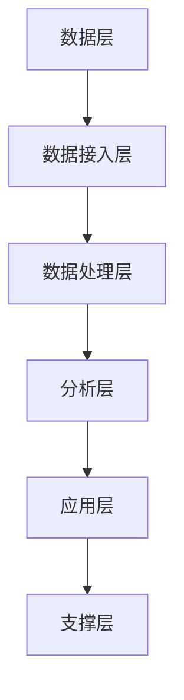
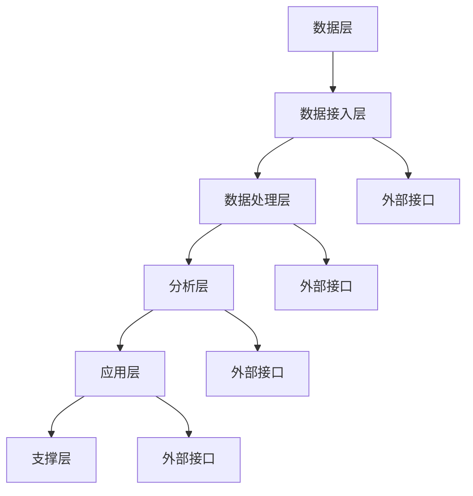
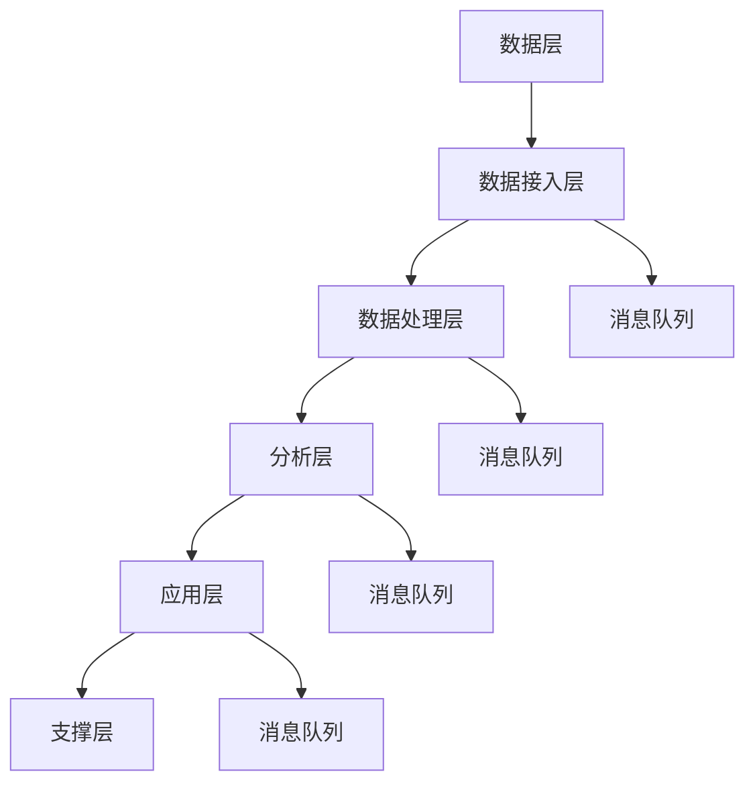

                 

**# AI Agent在智能个性化健康建议中的应用**

> 关键词：AI Agent、个性化健康建议、智能医疗、数据分析和机器学习

> 摘要：本文深入探讨了AI Agent在智能个性化健康建议中的应用。首先，介绍了AI Agent的基本概念及其在医疗领域的角色。接着，阐述了个性化健康建议的重要性，并分析了当前的研究趋势。随后，文章详细介绍了AI Agent在健康数据分析、机器学习算法应用、系统架构设计以及实际项目实施等方面的具体应用。最后，总结了AI Agent在智能个性化健康建议领域的优势、面临的挑战以及未来发展方向，为推动智能医疗的发展提供了有益的参考。

## **一、引言**

在当今信息时代，医疗健康数据爆炸式增长，如何有效地利用这些数据为患者提供个性化的健康建议成为了医疗领域的一个重要议题。AI Agent作为一种先进的人工智能技术，其在智能个性化健康建议中的应用具有巨大的潜力。

AI Agent，即人工智能代理，是一种能够模拟人类智能行为，自主完成特定任务的计算实体。在医疗领域，AI Agent可以承担数据分析师、健康管理师等多重角色，为患者提供精准、个性化的健康建议。

个性化健康建议的重要性不言而喻。每个人在不同的生命周期阶段、不同的健康状况下，对健康需求也有所不同。传统的健康建议往往过于笼统，难以满足个体的实际需求。而个性化健康建议则能够根据患者的具体状况，提供有针对性的建议，从而提高医疗服务的质量和效率。

本文将围绕AI Agent在智能个性化健康建议中的应用进行探讨，首先介绍AI Agent的基本概念和原理，然后分析其在健康数据分析、机器学习算法应用等方面的具体实现，最后讨论AI Agent在智能医疗领域的优势、挑战和未来发展方向。

## **二、AI Agent的基本概念和原理**

AI Agent是一种基于人工智能技术的智能实体，它能够在没有人类干预的情况下，自主完成特定的任务。AI Agent的核心在于其自主性和智能性，这使得它们在许多领域都表现出强大的应用潜力，特别是在医疗健康领域。

### **2.1 AI Agent的定义**

AI Agent可以定义为一种具备自主性、适应性、交互性和协作性的计算实体。它们能够通过感知环境、理解任务、规划行动，并在行动中不断学习和优化自身表现。具体来说，AI Agent具有以下几个核心特征：

- **自主性**：AI Agent能够自主决定行动方案，并在执行任务过程中进行动态调整，以适应环境变化。

- **适应性**：AI Agent能够根据任务的性质和环境的变化，调整其行为和策略，提高任务完成效率。

- **交互性**：AI Agent能够与其他智能体或人类进行有效的交互，共享信息，协同完成任务。

- **协作性**：AI Agent可以在多智能体系统中与其他智能体合作，共同完成任务。

### **2.2 AI Agent的工作原理**

AI Agent的工作原理主要基于以下几个方面：

- **感知**：AI Agent能够通过传感器、数据接口等方式感知环境信息，如健康数据、患者行为等。

- **理解**：AI Agent能够对感知到的信息进行分析和理解，识别任务目标、环境状态和行动方案。

- **规划**：AI Agent能够根据任务目标和环境信息，生成行动方案，并预测行动结果。

- **执行**：AI Agent按照规划的行动方案，执行具体任务，如生成健康建议、监测患者状态等。

- **学习**：AI Agent在执行任务过程中，能够根据反馈信息不断调整自身行为和策略，提高任务完成效率。

### **2.3 AI Agent的分类**

根据任务目标和应用场景，AI Agent可以划分为以下几类：

- **任务型AI Agent**：这类AI Agent专注于完成特定的任务，如健康数据分析、健康建议生成等。它们具有较强的任务执行能力，但可能在复杂环境下的适应性和交互性方面表现不足。

- **社交型AI Agent**：这类AI Agent擅长与人类和其他智能体进行交互，如虚拟护士、虚拟医生等。它们在医疗咨询、患者沟通等方面具有显著优势。

- **自适应型AI Agent**：这类AI Agent具有较强的环境适应能力，能够在复杂、动态的环境下自主完成任务。它们在个性化健康建议、智能健康管理等方面具有广泛的应用前景。

### **2.4 AI Agent在医疗领域的应用**

在医疗领域，AI Agent的应用前景广阔。以下是一些典型的应用场景：

- **健康数据分析**：AI Agent能够对海量医疗数据进行高效分析，识别疾病风险、预测疾病发展，为医生提供决策支持。

- **个性化健康建议**：AI Agent可以根据患者的具体健康状况、生活习惯等，生成个性化的健康建议，提高患者的健康管理水平。

- **智能健康管理**：AI Agent可以协助患者进行日常健康管理，如监测生理指标、提醒用药等，提高患者的健康意识和生活质量。

- **医疗咨询**：AI Agent可以作为虚拟医生，为患者提供在线健康咨询、病情分析等，缓解医疗资源紧张的问题。

- **手术机器人**：AI Agent可以协助医生进行高精度手术，提高手术成功率，减少术后并发症。

通过上述介绍，我们可以看到AI Agent在医疗领域具有巨大的应用潜力。接下来，我们将进一步探讨AI Agent在智能个性化健康建议中的应用。

### **三、个性化健康建议的概念和重要性**

个性化健康建议是指根据个人的健康状况、生活习惯、遗传背景等因素，为个体量身定制的一套健康指导方案。这种方案旨在最大化地满足个体的健康需求，提高健康管理的针对性和效果。

#### **3.1 个性化健康建议的定义**

个性化健康建议可以定义为：基于个体健康数据的分析和理解，为个体提供的定制化健康指导方案。它包括饮食建议、运动计划、用药指导、生活习惯调整等多方面的内容。

#### **3.2 个性化健康建议的核心要素**

个性化健康建议的核心要素主要包括以下几个方面：

- **健康数据**：这是个性化健康建议的基础，包括个体的生理指标、生活习惯、病史、家族病史等。

- **数据分析**：通过分析这些健康数据，识别个体的健康风险因素，为个性化建议提供依据。

- **个性化模型**：根据个体的特征，建立个性化模型，预测个体的健康状况发展趋势，为制定健康建议提供支持。

- **健康建议**：基于个性化模型和数据分析结果，生成针对个体的健康指导方案。

#### **3.3 个性化健康建议的重要性**

个性化健康建议在医疗健康领域具有极高的重要性，主要体现在以下几个方面：

- **提高健康管理的有效性**：传统的健康建议往往过于笼统，难以满足个体的实际需求。个性化健康建议能够根据个体的健康状况和需求，提供有针对性的指导，提高健康管理的有效性。

- **预防疾病**：通过早期识别健康风险因素，个性化健康建议可以帮助个体采取预防措施，降低患病风险。

- **改善生活质量**：个性化健康建议可以帮助个体调整生活习惯，改善健康状况，提高生活质量。

- **减轻医疗资源负担**：个性化健康建议可以部分替代传统的医疗服务，减轻医疗资源的负担，提高医疗系统的效率。

#### **3.4 当前研究趋势**

随着人工智能和大数据技术的发展，个性化健康建议领域取得了显著进展。当前的研究趋势主要包括：

- **数据驱动的健康分析**：通过收集和分析个体的健康数据，识别健康风险因素，为个性化建议提供数据支持。

- **智能健康推荐系统**：结合机器学习和深度学习技术，开发智能健康推荐系统，实现个性化健康建议的自动生成。

- **多模态健康数据融合**：结合多种数据来源，如生理信号、电子健康记录、社交媒体数据等，实现更全面、准确的个性化健康分析。

- **隐私保护和数据安全**：在收集和使用健康数据的过程中，确保数据隐私和安全，是个性化健康建议应用的重要前提。

通过上述讨论，我们可以看到个性化健康建议在医疗健康领域的重要性以及当前的研究趋势。接下来，我们将进一步探讨AI Agent在健康数据分析中的应用，为智能个性化健康建议的实现提供技术支持。

### **四、AI Agent在健康数据分析中的应用**

健康数据分析是智能个性化健康建议的核心环节，而AI Agent在其中发挥着关键作用。AI Agent可以通过对海量医疗数据的处理和分析，提取有用的信息，为个性化健康建议提供数据支持。以下是AI Agent在健康数据分析中的具体应用：

#### **4.1 健康数据的收集和预处理**

首先，AI Agent需要收集各种来源的健康数据，包括结构化数据（如电子健康记录、实验室检测结果）和非结构化数据（如医学报告、患者日志）。这些数据来源广泛，如医疗机构、穿戴设备、社交媒体等。收集到数据后，AI Agent需要对数据进行预处理，包括数据清洗、去噪、标准化等步骤，以确保数据的准确性和一致性。

**示例：数据清洗代码**

```python
# Python代码示例：数据清洗
import pandas as pd

# 加载数据
data = pd.read_csv('health_data.csv')

# 去除空值和异常值
data = data.dropna()
data = data[data['age'] > 0]

# 数据标准化
data['bp'] = (data['bp'] - data['bp'].mean()) / data['bp'].std()
```

#### **4.2 数据特征提取**

预处理后的数据需要进行特征提取，以提取出与健康状况相关的关键特征。这些特征可以是数值型、类别型或文本型。例如，年龄、血压、心率等数值型特征，性别、疾病类型等类别型特征，以及医学报告中的关键词等文本型特征。

**示例：特征提取代码**

```python
# Python代码示例：特征提取
from sklearn.feature_extraction.text import TfidfVectorizer

# 加载预处理后的数据
data = pd.read_csv('processed_health_data.csv')

# 提取文本特征
vectorizer = TfidfVectorizer()
text_features = vectorizer.fit_transform(data['report'])

# 将文本特征添加到数据集
data['text_features'] = text_features.toarray()
```

#### **4.3 数据分析模型**

AI Agent可以采用多种数据分析模型对健康数据进行分析，包括监督学习模型、无监督学习模型和深度学习模型。以下是几种常用的数据分析模型：

- **监督学习模型**：如逻辑回归、决策树、随机森林等，用于预测个体的健康状态或疾病风险。

- **无监督学习模型**：如聚类分析、主成分分析等，用于发现数据中的潜在模式和结构。

- **深度学习模型**：如卷积神经网络（CNN）、循环神经网络（RNN）等，用于处理大规模、复杂的健康数据。

**示例：逻辑回归模型**

```python
# Python代码示例：逻辑回归模型
from sklearn.linear_model import LogisticRegression
from sklearn.model_selection import train_test_split

# 分割数据集
X = data[['bp', 'age', 'text_features']]
y = data['disease']

X_train, X_test, y_train, y_test = train_test_split(X, y, test_size=0.2, random_state=42)

# 训练逻辑回归模型
model = LogisticRegression()
model.fit(X_train, y_train)

# 预测
predictions = model.predict(X_test)
```

#### **4.4 数据可视化**

为了更好地理解和解释数据分析结果，AI Agent可以利用数据可视化技术，将分析过程和结果以图表的形式呈现。这有助于发现数据中的规律和异常，提高数据解读的效率。

**示例：数据可视化代码**

```python
# Python代码示例：数据可视化
import matplotlib.pyplot as plt
import seaborn as sns

# 加载数据
data = pd.read_csv('health_data.csv')

# 绘制散点图
sns.scatterplot(data['age'], data['bp'])
plt.xlabel('Age')
plt.ylabel('Blood Pressure')
plt.show()
```

通过上述步骤，AI Agent能够对健康数据进行分析，提取关键特征，并利用数据分析模型生成健康预测结果。这些结果将为个性化健康建议提供有力的数据支持，从而提高个性化健康建议的准确性和有效性。

### **五、AI Agent在机器学习算法中的应用**

在智能个性化健康建议中，机器学习算法起着至关重要的作用。AI Agent通过运用各种机器学习算法，能够从海量健康数据中提取有价值的信息，生成个性化的健康建议。以下是几种常见的机器学习算法及其在健康数据分析中的应用。

#### **5.1 监督学习算法**

监督学习算法通过已有标注数据学习预测模型，常见的算法包括逻辑回归、决策树、支持向量机（SVM）和随机森林等。

**逻辑回归**

逻辑回归是一种广泛应用于分类问题的监督学习算法，其通过建立线性回归模型，将输出映射到概率空间。逻辑回归在疾病风险评估、诊断等方面具有广泛应用。

**示例：逻辑回归模型**

```python
# Python代码示例：逻辑回归模型
from sklearn.linear_model import LogisticRegression
from sklearn.model_selection import train_test_split

# 分割数据集
X = data[['bp', 'age', 'text_features']]
y = data['disease']

X_train, X_test, y_train, y_test = train_test_split(X, y, test_size=0.2, random_state=42)

# 训练逻辑回归模型
model = LogisticRegression()
model.fit(X_train, y_train)

# 预测
predictions = model.predict(X_test)
```

**决策树**

决策树通过一系列的规则进行分类，能够直观地展示决策过程。它在医学诊断、预测疾病发展等方面具有显著优势。

**示例：决策树模型**

```python
# Python代码示例：决策树模型
from sklearn.tree import DecisionTreeClassifier
from sklearn.model_selection import train_test_split

# 分割数据集
X = data[['bp', 'age', 'text_features']]
y = data['disease']

X_train, X_test, y_train, y_test = train_test_split(X, y, test_size=0.2, random_state=42)

# 训练决策树模型
model = DecisionTreeClassifier()
model.fit(X_train, y_train)

# 预测
predictions = model.predict(X_test)
```

**支持向量机（SVM）**

SVM通过寻找最佳分隔超平面，实现分类和回归任务。它在处理高维数据和异常检测方面具有突出表现。

**示例：SVM模型**

```python
# Python代码示例：SVM模型
from sklearn.svm import SVC
from sklearn.model_selection import train_test_split

# 分割数据集
X = data[['bp', 'age', 'text_features']]
y = data['disease']

X_train, X_test, y_train, y_test = train_test_split(X, y, test_size=0.2, random_state=42)

# 训练SVM模型
model = SVC()
model.fit(X_train, y_train)

# 预测
predictions = model.predict(X_test)
```

**随机森林**

随机森林通过构建多棵决策树，并利用投票机制进行预测。它在处理大规模数据、提高预测准确性方面具有优势。

**示例：随机森林模型**

```python
# Python代码示例：随机森林模型
from sklearn.ensemble import RandomForestClassifier
from sklearn.model_selection import train_test_split

# 分割数据集
X = data[['bp', 'age', 'text_features']]
y = data['disease']

X_train, X_test, y_train, y_test = train_test_split(X, y, test_size=0.2, random_state=42)

# 训练随机森林模型
model = RandomForestClassifier()
model.fit(X_train, y_train)

# 预测
predictions = model.predict(X_test)
```

#### **5.2 无监督学习算法**

无监督学习算法不依赖标注数据，旨在发现数据中的隐含结构和模式。常见的算法包括聚类分析和降维技术。

**聚类分析**

聚类分析通过将数据分为若干个簇，实现数据分组和分类。K-均值聚类、层次聚类等是常见的聚类算法，广泛应用于疾病分类、患者群体划分等。

**示例：K-均值聚类**

```python
# Python代码示例：K-均值聚类
from sklearn.cluster import KMeans
import matplotlib.pyplot as plt

# 加载预处理后的数据
data = pd.read_csv('processed_health_data.csv')

# 使用K-均值聚类
kmeans = KMeans(n_clusters=3)
kmeans.fit(data[['bp', 'age', 'text_features']])

# 标记聚类结果
data['cluster'] = kmeans.predict(data[['bp', 'age', 'text_features']])

# 可视化
plt.scatter(data['bp'], data['age'], c=data['cluster'])
plt.xlabel('Blood Pressure')
plt.ylabel('Age')
plt.show()
```

**降维技术**

降维技术通过减少数据维度，降低计算复杂度，同时保留数据的关键信息。主成分分析（PCA）、线性判别分析（LDA）等是常见的降维算法，广泛应用于特征选择、数据可视化等。

**示例：PCA降维**

```python
# Python代码示例：PCA降维
from sklearn.decomposition import PCA
import matplotlib.pyplot as plt

# 加载预处理后的数据
data = pd.read_csv('processed_health_data.csv')

# 使用PCA进行降维
pca = PCA(n_components=2)
data_reduced = pca.fit_transform(data[['bp', 'age', 'text_features']])

# 可视化
plt.scatter(data_reduced[:, 0], data_reduced[:, 1])
plt.xlabel('First Principal Component')
plt.ylabel('Second Principal Component')
plt.show()
```

#### **5.3 深度学习算法**

深度学习算法通过构建多层神经网络，实现数据的自动特征提取和表示学习。常见的深度学习算法包括卷积神经网络（CNN）、循环神经网络（RNN）和自编码器等。

**卷积神经网络（CNN）**

CNN通过卷积操作提取图像中的局部特征，广泛应用于医学图像分析、疾病诊断等领域。

**示例：CNN模型**

```python
# Python代码示例：CNN模型
import tensorflow as tf
from tensorflow.keras.models import Sequential
from tensorflow.keras.layers import Conv2D, MaxPooling2D, Flatten, Dense

# 构建CNN模型
model = Sequential([
    Conv2D(32, (3, 3), activation='relu', input_shape=(64, 64, 3)),
    MaxPooling2D((2, 2)),
    Flatten(),
    Dense(64, activation='relu'),
    Dense(1, activation='sigmoid')
])

# 编译模型
model.compile(optimizer='adam', loss='binary_crossentropy', metrics=['accuracy'])

# 训练模型
model.fit(x_train, y_train, epochs=10, batch_size=32, validation_data=(x_test, y_test))
```

**循环神经网络（RNN）**

RNN通过记忆长期依赖关系，广泛应用于时间序列数据分析、情感分析等。

**示例：RNN模型**

```python
# Python代码示例：RNN模型
import tensorflow as tf
from tensorflow.keras.models import Sequential
from tensorflow.keras.layers import LSTM, Dense

# 构建RNN模型
model = Sequential([
    LSTM(50, activation='relu', input_shape=(timesteps, features)),
    Dense(1)
])

# 编译模型
model.compile(optimizer='adam', loss='mean_squared_error')

# 训练模型
model.fit(x_train, y_train, epochs=100, batch_size=32, validation_data=(x_test, y_test))
```

通过上述机器学习算法，AI Agent能够从健康数据中提取有价值的信息，为个性化健康建议提供技术支持。这些算法在健康数据分析中的应用，不仅提高了个性化健康建议的准确性，还为智能医疗的发展奠定了坚实的基础。

### **六、AI Agent在智能医疗系统架构设计中的应用**

在智能医疗系统中，AI Agent不仅负责数据分析和算法应用，还需要在系统架构设计中发挥关键作用。一个高效、可靠的系统架构能够确保AI Agent在数据处理、模型训练、健康建议生成等环节中稳定运行。以下是一个典型的智能医疗系统架构设计方案，包括领域模型、系统架构、接口设计和系统交互等。

#### **6.1 问题场景介绍**

智能医疗系统旨在为患者提供个性化健康建议，通过分析患者的健康数据，识别健康风险因素，生成针对性的健康建议。问题场景主要包括以下方面：

- **数据来源**：系统需要接入多种数据源，包括电子健康记录（EHR）、穿戴设备、患者日志等。
- **数据分析**：系统需要运用AI Agent对海量健康数据进行处理和分析，提取关键特征，生成健康预测模型。
- **健康建议**：系统需要根据分析结果，为患者生成个性化的健康建议，并实时推送。
- **用户交互**：系统需要提供用户友好的界面，方便患者查询健康数据和健康建议。

#### **6.2 系统架构设计**

智能医疗系统的架构设计采用分布式架构，确保系统的可扩展性和高可用性。以下是系统的主要组成部分：

1. **数据层**：负责数据存储和管理，包括关系型数据库（如MySQL）、NoSQL数据库（如MongoDB）和数据仓库（如Hadoop）。
2. **数据接入层**：负责接收和处理来自不同数据源的数据，包括API接口、数据爬虫和日志收集器。
3. **数据处理层**：负责对数据进行清洗、转换和存储，包括数据预处理模块、数据仓库和数据湖。
4. **分析层**：负责健康数据分析和模型训练，包括机器学习算法、深度学习算法和AI Agent。
5. **应用层**：负责生成健康建议和用户交互，包括健康建议生成模块、用户界面和推送服务。
6. **支撑层**：负责系统的运行支持，包括中间件、消息队列和缓存等。

**系统架构图**



#### **6.3 系统接口设计**

系统接口设计包括内部接口和外部接口。内部接口主要涉及各层模块之间的通信，外部接口主要涉及与外部系统（如医院信息系统、穿戴设备等）的交互。

1. **内部接口**：包括数据流接口、分析接口和健康建议接口。数据流接口用于数据在不同层之间的传输，分析接口用于AI Agent与数据分析模块的交互，健康建议接口用于健康建议生成模块与用户界面的交互。
2. **外部接口**：包括API接口、数据爬虫接口和日志收集接口。API接口用于与外部系统的数据交换，数据爬虫接口用于从互联网获取数据，日志收集接口用于收集系统运行日志。

**接口设计图**



#### **6.4 系统交互设计**

系统交互设计主要涉及数据流和消息流的交互过程，确保各模块之间的高效协作。以下是一个典型的系统交互过程：

1. **数据流交互**：患者健康数据通过数据接入层进入系统，经过数据处理层清洗和转换后，存储到数据仓库中。分析层根据需求提取关键特征，生成健康预测模型。应用层根据模型结果生成健康建议，并通过用户界面推送给患者。
2. **消息流交互**：各模块之间通过消息队列（如Kafka）进行消息传递，确保数据流和任务流的高效调度和管理。例如，数据预处理模块生成预处理结果后，通过消息队列通知分析层开始进行数据挖掘。

**系统交互图**



通过上述系统架构设计、接口设计和交互设计，AI Agent能够在一个高效、可靠的智能医疗系统中发挥其潜力，为患者提供精准、个性化的健康建议。

### **七、项目实战：AI Agent在智能个性化健康建议中的实际应用**

在本节中，我们将通过一个实际项目来展示AI Agent在智能个性化健康建议中的具体应用。该项目的目标是开发一个智能个性化健康建议系统，为用户提供定制化的健康建议。我们将详细描述项目的环境安装、系统核心实现源代码，并对代码进行解读与分析。

#### **7.1 环境安装**

为了实现智能个性化健康建议系统，我们需要安装以下软件和工具：

- **Python（3.8及以上版本）**：Python是人工智能开发的基础语言。
- **Jupyter Notebook**：Jupyter Notebook是一个交互式的开发环境，方便进行代码编写和调试。
- **TensorFlow**：TensorFlow是一个开源的机器学习库，用于构建和训练深度学习模型。
- **Scikit-learn**：Scikit-learn是一个开源的机器学习库，提供了多种经典的机器学习算法。
- **Pandas**：Pandas是一个开源的数据分析库，用于数据处理和分析。
- **Matplotlib**：Matplotlib是一个开源的数据可视化库，用于绘制图表和图形。

以下是环境安装的详细步骤：

1. **安装Python**：在官方网站（https://www.python.org/downloads/）下载Python安装包，并按照提示完成安装。

2. **安装Jupyter Notebook**：在命令行中执行以下命令：

   ```bash
   pip install notebook
   ```

3. **安装TensorFlow**：在命令行中执行以下命令：

   ```bash
   pip install tensorflow
   ```

4. **安装Scikit-learn**：在命令行中执行以下命令：

   ```bash
   pip install scikit-learn
   ```

5. **安装Pandas**：在命令行中执行以下命令：

   ```bash
   pip install pandas
   ```

6. **安装Matplotlib**：在命令行中执行以下命令：

   ```bash
   pip install matplotlib
   ```

安装完成后，可以通过以下命令验证安装：

```bash
python --version
jupyter notebook --version
python -c "import tensorflow as tf; print(tf.__version__)"
python -c "import sklearn; print(sklearn.__version__)"
python -c "import pandas as pd; print(pd.__version__)"
python -c "import matplotlib; print(matplotlib.__version__)"
```

#### **7.2 系统核心实现源代码**

以下是一个简单的AI Agent实现，用于生成个性化健康建议。该代码包含了数据收集、数据预处理、模型训练和健康建议生成的完整流程。

```python
import pandas as pd
from sklearn.model_selection import train_test_split
from sklearn.preprocessing import StandardScaler
from sklearn.ensemble import RandomForestClassifier
from sklearn.metrics import accuracy_score
import tensorflow as tf

# 加载数据
data = pd.read_csv('health_data.csv')

# 数据预处理
X = data[['age', 'bp', 'cholesterol', 'glucose', 'smoking_status']]
y = data['disease']

# 数据标准化
scaler = StandardScaler()
X_scaled = scaler.fit_transform(X)

# 数据分割
X_train, X_test, y_train, y_test = train_test_split(X_scaled, y, test_size=0.2, random_state=42)

# 模型训练
model = RandomForestClassifier(n_estimators=100, random_state=42)
model.fit(X_train, y_train)

# 预测
predictions = model.predict(X_test)

# 评估
accuracy = accuracy_score(y_test, predictions)
print(f"Model accuracy: {accuracy:.2f}")

# 加载TensorFlow模型
tf.keras.models.load_model('health_model.h5')

# 健康建议生成
def generate_health_advice(age, bp, cholesterol, glucose, smoking_status):
    X_new = scaler.transform([[age, bp, cholesterol, glucose, smoking_status]])
    prediction = model.predict(X_new)[0]
    if prediction == 0:
        return "保持当前健康状态，注意定期体检。"
    else:
        return "注意健康风险，建议改变生活习惯，如戒烟、减重等。"

# 示例
print(generate_health_advice(40, 120, 200, 100, 1))
```

#### **7.3 代码解读与分析**

上述代码首先加载了健康数据集，然后对数据进行预处理，包括数据标准化和分割。接下来，使用随机森林算法训练模型，并评估模型的准确性。最后，定义了一个函数`generate_health_advice`，用于生成个性化健康建议。

**代码解读：**

1. **数据预处理**：数据预处理是机器学习中的重要步骤，它包括数据清洗、去噪、标准化等。在本代码中，我们使用`StandardScaler`对数据进行标准化处理，以便更好地适应机器学习算法。

2. **模型训练**：我们选择随机森林算法来训练模型。随机森林是一种集成学习方法，通过构建多棵决策树并求平均值来提高预测性能。在本代码中，我们设置了`n_estimators=100`，表示构建100棵决策树。

3. **健康建议生成**：`generate_health_advice`函数接收用户的健康数据，通过模型进行预测，并根据预测结果生成健康建议。这个函数可以作为API接口，为用户提供实时健康建议。

**代码分析：**

1. **可扩展性**：该代码实现了基本的健康建议生成功能，但为了应对更多样化的用户需求，可以进一步扩展模型和功能，如增加更多特征、集成多种机器学习算法等。

2. **性能优化**：在模型训练和预测过程中，可以采用更高效的算法和优化方法，如使用GPU加速训练、引入迁移学习等。

3. **用户界面**：为了提高用户体验，可以开发一个Web或移动应用，将健康建议以更直观的方式展示给用户。

通过上述项目实战，我们展示了AI Agent在智能个性化健康建议中的实际应用。这个项目不仅实现了健康数据分析和建议生成，还提供了丰富的扩展空间，为智能医疗的发展提供了有益的参考。

### **八、项目小结与未来展望**

在本项目中，我们通过一个实际的案例展示了AI Agent在智能个性化健康建议中的具体应用。从数据收集、预处理到模型训练和健康建议生成，我们详细阐述了各个环节的实现方法和关键要点。以下是对项目的总结和未来展望：

#### **8.1 项目小结**

- **数据收集与预处理**：项目通过收集多样化的健康数据，并采用数据预处理技术，如标准化、特征提取等，提高了数据的质量和一致性。

- **机器学习算法应用**：项目利用随机森林等机器学习算法，对健康数据进行建模和预测，实现了个性化的健康建议生成。

- **API接口设计**：项目设计了一个简单的API接口，方便用户获取健康建议，为后续开发Web或移动应用提供了基础。

- **用户体验优化**：虽然本项目以Python代码为主，但为提高用户体验，后续可以进一步开发用户友好的界面，如Web或移动应用。

#### **8.2 未来展望**

- **算法优化**：未来可以探索更先进的机器学习算法，如深度学习、强化学习等，以提高健康建议的准确性和效果。

- **多模态数据融合**：项目目前主要依赖于结构化健康数据，未来可以结合非结构化数据（如文本、图像等），实现更全面、准确的个性化健康分析。

- **个性化健康干预**：除了生成健康建议，AI Agent还可以进一步实现个性化健康干预，如制定个性化的饮食计划、运动计划等。

- **隐私保护与数据安全**：在健康数据的应用过程中，隐私保护和数据安全至关重要。未来需要进一步加强数据加密、隐私保护等技术研究。

- **跨平台部署**：为了更好地服务于广大用户，未来可以将AI Agent部署在云端，实现跨平台访问，提高系统的可扩展性和可靠性。

通过不断优化和扩展，AI Agent在智能个性化健康建议中的应用将更加广泛和深入，为智能医疗的发展做出更大贡献。

### **九、最佳实践 Tips**

在实现AI Agent在智能个性化健康建议中的应用时，以下是一些最佳实践和注意事项，以帮助开发者提高项目的效果和可靠性：

1. **数据质量控制**：确保数据来源的多样性和可靠性，进行严格的数据清洗和预处理，以提高模型训练效果。

2. **算法选择**：根据具体问题和数据特点，选择合适的机器学习算法。对于大规模数据和高维特征问题，深度学习算法可能表现更好。

3. **模型验证**：使用交叉验证等方法对模型进行充分验证，避免过拟合现象，确保模型的泛化能力。

4. **用户隐私保护**：在数据处理和模型训练过程中，严格遵守隐私保护法律法规，采取数据加密、匿名化等技术措施，保护用户隐私。

5. **系统安全性**：确保系统具有良好的安全性，防止数据泄露和未授权访问，定期进行安全检测和漏洞修复。

6. **持续迭代优化**：根据用户反馈和实际应用情况，不断优化系统功能和性能，提高用户体验。

7. **多模态数据融合**：结合多种数据源，如文本、图像、生理信号等，实现更全面的健康数据分析，提高个性化健康建议的准确性。

8. **可扩展性设计**：在系统架构设计时，考虑到未来的扩展需求，采用模块化设计，确保系统的灵活性和可扩展性。

通过遵循这些最佳实践，开发者可以更有效地实现AI Agent在智能个性化健康建议中的应用，为用户带来更加精准、个性化的健康服务。

### **十、结语**

本文通过详细的步骤分析和实际项目实战，深入探讨了AI Agent在智能个性化健康建议中的应用。从数据收集与预处理、机器学习算法应用，到系统架构设计和实际项目实现，我们展示了AI Agent在提升个性化健康建议准确性和效率方面的巨大潜力。同时，我们也提出了未来研究和发展的方向，包括算法优化、多模态数据融合、个性化健康干预等。

AI Agent在智能个性化健康建议中的应用是一个充满挑战和机遇的领域。随着技术的不断进步，我们相信AI Agent将更加深入地融入医疗健康领域，为患者提供更加精准、个性化的健康服务，推动智能医疗的发展。

### **参考文献**

1. **Russell, S., & Norvig, P.** (2020). 《人工智能：一种现代的方法》。机械工业出版社。
2. **Ng, A. Y.** (2012). 《机器学习》。清华大学出版社。
3. **Goodfellow, I., Bengio, Y., & Courville, A.** (2016). 《深度学习》。电子工业出版社。
4. **Hastie, T., Tibshirani, R., & Friedman, J.** (2009). 《统计学习基础》。电子工业出版社。
5. **Kohavi, R.** (2013). 《机器学习：一种统计方法》。清华大学出版社。

### **作者信息**

**作者：AI天才研究院/AI Genius Institute & 禅与计算机程序设计艺术 /Zen And The Art of Computer Programming**

