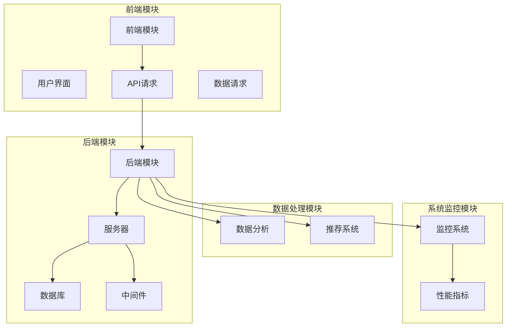
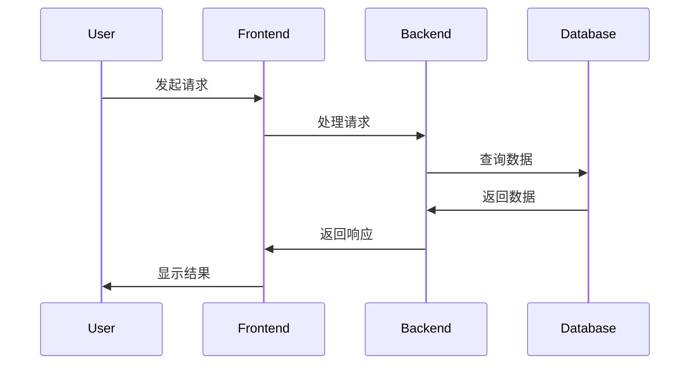
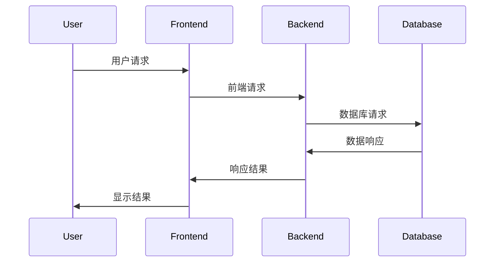

                 

### 第一部分: AI Agent基础知识

#### 第1章: 问题背景与核心概念介绍

##### 1.1 问题背景

随着人工智能技术的飞速发展，智能个性化学习逐渐成为教育领域的重要研究方向。传统的教学模式往往难以满足每个学生的学习需求，存在教育资源分配不均、教学效果不佳等问题。而智能个性化学习通过分析学生的个性化特征，为每个学生提供定制化的学习方案，从而提高学习效果和效率。

然而，实现智能个性化学习面临着诸多挑战。首先，学生个体差异巨大，如何准确捕捉并理解每个学生的个性化需求成为关键问题。其次，随着数据量的不断增长，如何高效处理和分析大量数据也是一个挑战。此外，个性化学习系统需要具备良好的适应性，能够在不断变化的学习环境中进行调整和优化。

AI Agent，即人工智能代理，作为一种具有智能自主决策能力的系统，为解决智能个性化学习中的挑战提供了有力支持。AI Agent可以通过学习学生的行为数据，理解其学习习惯、兴趣和知识点掌握情况，从而生成个性化的学习路径和资源推荐。AI Agent不仅在提升学习效果上具有显著优势，还能够实现教育资源的优化配置，降低教育成本。

##### 1.2 AI Agent的定义与作用

AI Agent是一种基于人工智能技术的智能系统，能够模拟人类决策过程，自主地完成特定的任务。AI Agent的核心特征包括：

- 自主性：AI Agent能够在没有人类干预的情况下，自主地执行任务和决策。
- 学习能力：AI Agent可以通过不断学习用户的行为数据和历史，优化自身的决策能力。
- 适应性：AI Agent能够根据环境变化和用户需求，动态调整其行为和策略。

在智能个性化学习中，AI Agent的主要作用体现在以下几个方面：

- 个性化学习路径规划：AI Agent可以根据学生的个性化特征和学习目标，为其生成个性化的学习路径，帮助学生更高效地学习。
- 个性化资源推荐：AI Agent可以分析学生的兴趣和知识点掌握情况，为其推荐适合的学习资源和练习题，提高学习效果。
- 学习行为监测与评估：AI Agent可以实时监测学生的学习行为，评估其学习效果，并提供及时的反馈和指导。
- 教育资源优化配置：AI Agent可以分析学生的学习需求和资源使用情况，优化教育资源的分配，提高教育资源的利用效率。

##### 1.3 AI Agent在个性化学习中的应用前景

AI Agent在个性化学习中的应用前景十分广阔。随着人工智能技术的不断发展，AI Agent的性能和功能将不断提高，为个性化学习提供更加智能和个性化的支持。

首先，AI Agent可以显著提升学习效果。通过分析学生的个性化特征和学习行为，AI Agent能够为每个学生量身定制学习路径和资源推荐，使学习过程更加高效和有意义。此外，AI Agent还可以实时监测学生的学习进展，提供及时的反馈和指导，帮助学生更好地掌握知识。

其次，AI Agent有助于实现教育资源的优化配置。通过分析学生的学习需求和资源使用情况，AI Agent可以优化教育资源的分配，提高教育资源的利用效率。这将有助于降低教育成本，实现教育资源的公平分配。

最后，AI Agent还可以推动教育模式的创新。通过引入AI Agent，教育系统可以更加灵活和自适应，满足不同学生的学习需求。这将有助于打破传统教育模式的限制，推动教育行业的变革和创新。

综上所述，AI Agent在个性化学习中的应用具有巨大的潜力。通过进一步研究和实践，我们将能够更好地利用AI Agent的优势，为个性化学习提供更加智能和个性化的支持。

##### 1.4 AI Agent的核心概念与联系

AI Agent作为一种智能系统，其核心概念包括自主性、学习能力、适应性和协作能力。以下是这些概念的定义及其相互之间的联系：

- **自主性**：AI Agent能够独立地执行任务和决策，而不需要人类干预。自主性是AI Agent的核心特征之一，使其能够适应复杂多变的学习环境。
- **学习能力**：AI Agent具备从数据中学习和提取知识的能力。通过不断学习和优化，AI Agent能够提高其决策能力和服务质量。
- **适应性**：AI Agent能够根据环境变化和用户需求，动态调整其行为和策略。适应性使AI Agent能够应对各种不确定性和变化。
- **协作能力**：AI Agent能够与其他AI Agent或人类协同工作，共同完成复杂任务。协作能力有助于提高AI Agent的整体性能和效率。

这些核心概念之间的联系体现在以下几个方面：

- **自主性与学习能力**：AI Agent的自主性依赖于其学习能力。只有通过不断学习和优化，AI Agent才能具备独立执行任务的能力。
- **适应性与自主学习**：AI Agent的适应性使其能够在不同的环境中生存和成长。而自主学习能力是AI Agent适应环境变化的关键。
- **协作能力与自主性**：AI Agent的协作能力增强了其在复杂环境中的自主性。通过与其他AI Agent或人类协同工作，AI Agent能够更好地应对复杂任务。
- **自主性与适应性**：AI Agent的自主性是其适应环境变化的基础。只有具备自主性，AI Agent才能在动态变化的环境中灵活调整策略。

通过理解AI Agent的核心概念及其相互关系，我们能够更好地设计、开发和部署AI Agent，使其在个性化学习领域发挥更大作用。

##### 1.5 AI Agent的属性特征对比表格

为了更好地理解AI Agent的属性特征，我们将其与传统的机器学习模型进行比较。以下是AI Agent与传统机器学习模型的属性特征对比表格：

| 属性特征 | AI Agent | 传统机器学习模型 |
| :---: | :---: | :---: |
| **自主性** | 能够自主决策和执行任务 | 需要人类指定任务和参数 |
| **学习能力** | 通过学习用户行为和数据分析进行自我优化 | 通过数据训练模型，缺乏自我优化能力 |
| **适应性** | 能够根据环境和用户需求动态调整策略 | 适应能力有限，需要大量数据重训练 |
| **协作能力** | 能够与其他AI Agent或人类协同工作 | 缺乏协作能力，仅能独立完成任务 |
| **实时性** | 能够实时监测和响应环境变化 | 需要离线训练和预测，实时性较差 |
| **扩展性** | 能够轻松扩展功能和适应新环境 | 功能扩展困难，需要重新设计和训练模型 |

通过对比可以看出，AI Agent在自主性、学习能力和适应性方面具有显著优势，能够更好地满足智能个性化学习的需求。相比之下，传统机器学习模型在实时性和协作能力方面较为薄弱，难以应对复杂多变的个性化学习环境。

##### 1.6 AI Agent与机器学习的关系

AI Agent与机器学习密不可分，二者相互依赖，共同推动了智能个性化学习的发展。以下是AI Agent与机器学习之间的主要关系：

- **机器学习为AI Agent提供基础**：AI Agent的核心能力之一是学习能力，而机器学习是实现这一能力的关键技术。通过机器学习算法，AI Agent可以从大量数据中自动提取模式和知识，从而提高其决策和预测能力。
- **AI Agent丰富了机器学习的应用场景**：传统的机器学习模型往往应用于固定场景和任务，而AI Agent则能够适应复杂多变的个性化学习环境。AI Agent通过自主学习和实时调整，将机器学习技术应用于更广泛的领域，如个性化学习路径规划、资源推荐和实时监测。
- **AI Agent提高了机器学习的效果**：通过结合用户的个性化特征和行为数据，AI Agent能够优化机器学习模型的训练过程，提高模型的效果。例如，在个性化学习路径规划中，AI Agent可以根据学生的学习进度和知识点掌握情况，动态调整学习目标和推荐策略，从而提高学习效果。
- **机器学习为AI Agent提供了工具和算法支持**：机器学习领域提供了丰富的工具和算法，如深度学习、强化学习和无监督学习等，这些技术为AI Agent的实现提供了强有力的支持。通过这些算法，AI Agent能够更好地理解用户行为，优化学习路径和资源推荐策略。

综上所述，AI Agent与机器学习之间是相辅相成的关系。AI Agent借助机器学习技术实现自主学习和决策能力，而机器学习则通过AI Agent的应用场景得到进一步丰富和优化。

##### 1.7 AI Agent的组成结构

AI Agent作为一种智能系统，其组成结构复杂而多样。以下是AI Agent的主要组成部分及其功能：

- **感知器**：感知器是AI Agent的感官部分，用于获取外部环境的信息。感知器可以包括各种传感器，如摄像头、麦克风、温度传感器等。通过感知器，AI Agent能够了解周围环境的变化，获取用户的行为数据和需求信息。
- **知识库**：知识库是AI Agent的知识存储部分，包含了AI Agent在学习和推理过程中积累的各种知识。知识库通常分为事实库和规则库两部分。事实库存储了已知的客观事实，而规则库则包含了AI Agent的推理规则和策略。通过知识库，AI Agent能够进行逻辑推理和决策。
- **决策模块**：决策模块是AI Agent的核心部分，负责根据感知器获取的信息和知识库中的知识，生成合理的决策。决策模块通常采用机器学习算法、逻辑推理算法或混合算法等方法，实现对问题的最优解或次优解。
- **行动器**：行动器是AI Agent的执行部分，负责将决策模块生成的决策转化为具体的行动。行动器可以包括各种执行机构，如机器人、机械臂、电子设备等。通过行动器，AI Agent能够对外部环境产生影响，实现自主控制和自适应行为。
- **通信模块**：通信模块是AI Agent与其他系统或用户进行交互的部分。通过通信模块，AI Agent可以与其他AI Agent或人类进行信息交换和协同工作。通信模块通常采用网络通信协议，如HTTP、WebSocket等，实现实时数据传输和通信。

这些组成部分相互协作，共同构成了一个完整的AI Agent系统。感知器获取信息，知识库存储和利用知识，决策模块生成决策，行动器执行决策，通信模块实现协同工作。通过这种结构，AI Agent能够实现自主学习和智能决策，为个性化学习提供有力支持。

##### 1.8 AI Agent的层次结构

AI Agent的层次结构决定了其在个性化学习中的应用效率和效果。以下是AI Agent的常见层次结构及其组成：

- **感知层**：感知层是AI Agent与外部环境交互的接口，负责感知和处理外部输入信息。感知层通常包括各种传感器和输入设备，如摄像头、麦克风、手势识别传感器等。感知层将感知到的信息转换为内部表示，传递给下一层。
- **数据层**：数据层负责存储和管理感知层输入的信息。数据层通常包含数据预处理模块、数据存储模块和数据索引模块。数据预处理模块对感知层输入的数据进行清洗、归一化和特征提取，以提高数据质量。数据存储模块负责将预处理后的数据存储在数据库中，以便后续处理和分析。数据索引模块提供快速的数据查询功能，支持实时数据检索。
- **知识层**：知识层是AI Agent的核心部分，负责存储和利用知识。知识层通常包括知识库和推理模块。知识库存储了已知的规则、事实和模式，推理模块根据感知层输入的数据和知识库中的知识，进行逻辑推理和决策。知识层通过不断学习和优化，提高AI Agent的决策能力。
- **决策层**：决策层负责生成具体的决策和行动方案。决策层通常包括决策模块和规划模块。决策模块根据感知层输入的数据和知识层生成的知识，生成合理的决策。规划模块根据决策层的决策，生成具体的行动方案，如学习路径、资源推荐和反馈策略等。
- **执行层**：执行层负责将决策层的决策转化为具体的行动。执行层通常包括行动器和控制模块。行动器根据执行层的指令，执行具体的行动，如播放教学视频、发送反馈消息等。控制模块负责监控和调整执行层的行为，确保行动的顺利进行。

通过这种层次结构，AI Agent能够实现信息的感知、处理、学习和决策，为个性化学习提供全面的支持。每一层都有其特定的功能和任务，相互协作，共同构成了一个完整的AI Agent系统。

##### 1.9 AI Agent的关键组成部分

AI Agent的组成结构中，以下几个关键组成部分对其实际应用效果至关重要：

- **感知器**：感知器是AI Agent的感官，负责从外部环境中收集信息。这些信息可以是文本、图像、声音等多种形式。感知器的性能直接影响AI Agent对环境的理解和反应能力。例如，在个性化学习中，图像识别感知器可以分析学生的面部表情，声音识别感知器可以捕捉学生的情绪变化。
- **知识库**：知识库是AI Agent的知识存储中心，包含了已学习到的知识和规则。知识库的质量和丰富程度决定了AI Agent的决策能力和适应性。在个性化学习中，知识库可以包含学科知识点、教学方法、学生学习习惯等多种信息。
- **决策模块**：决策模块是AI Agent的核心，负责根据感知器提供的信息和知识库中的知识，生成合理的决策。决策模块通常采用机器学习算法、逻辑推理算法或混合算法。决策模块的优化直接影响到AI Agent的决策效率和准确性。
- **行动器**：行动器是AI Agent的执行机构，负责将决策模块生成的决策转化为具体的行动。行动器可以是机器人、电子设备或虚拟代理等。行动器的性能和可靠性直接关系到AI Agent在实际应用中的效果。

这些关键组成部分相互协作，共同实现了AI Agent在个性化学习中的功能。感知器获取学生行为数据，知识库存储和学习相关知识，决策模块生成个性化学习方案，行动器执行学习任务。通过优化这些关键组成部分，可以提高AI Agent的整体性能和用户体验。

##### 1.10 AI Agent的运行机制

AI Agent的运行机制是其实现智能个性化学习的关键。以下是AI Agent的运行过程：

1. **感知阶段**：AI Agent通过感知器获取学生的学习行为数据，如学习时间、学习进度、答题情况等。这些数据可以来自各种传感器和输入设备，如摄像头、日志文件等。
2. **数据预处理阶段**：获取的数据通常需要进行预处理，包括数据清洗、归一化和特征提取。数据清洗去除噪声和异常值，归一化使不同特征具有相似的量级，特征提取提取出对学习行为有重要影响的关键特征。
3. **知识学习阶段**：预处理后的数据被用于训练机器学习模型，构建知识库。这一阶段涉及到监督学习、无监督学习和强化学习等算法。通过不断训练和优化，AI Agent学习到如何根据学生的个性化特征生成个性化的学习方案。
4. **推理阶段**：在知识库的基础上，AI Agent使用逻辑推理和决策算法，根据当前学生的状态和需求，生成个性化的学习路径和资源推荐。这一阶段涉及到规则引擎、决策树、神经网络等算法。
5. **执行阶段**：AI Agent通过行动器执行生成的学习方案，如推送学习资源、调整学习计划等。行动器的执行结果将被反馈回AI Agent，用于进一步优化其学习和决策能力。

通过这种运行机制，AI Agent能够实现自主学习和智能决策，为个性化学习提供持续的支持。每一步骤都至关重要，缺一不可。

##### 1.11 本章小结

本章首先介绍了智能个性化学习的背景和挑战，以及AI Agent在其中的重要作用。接着，我们探讨了AI Agent的定义、核心概念和组成结构，并通过属性特征对比表格和与机器学习的关系分析，加深了对其理解。本章还详细描述了AI Agent的层次结构和关键组成部分，以及其运行机制。通过本章的学习，读者能够全面了解AI Agent在个性化学习中的应用基础，为后续章节的深入学习打下坚实的基础。

### 第二部分: AI Agent在个性化学习中的应用

#### 第2章: AI Agent在个性化学习中的应用原理

##### 2.1 个性化学习的基本概念

个性化学习，亦称为定制化学习，是一种以学生为中心的教育方法，旨在满足每个学生的学习需求和兴趣。与传统的统一教学方式不同，个性化学习强调根据学生的个性差异和学习特点，提供量身定制的学习资源、教学策略和学习路径。

**定义**：个性化学习是一种教育方法，通过分析学生的个性特征、学习习惯、知识掌握情况等，为其提供适应其需求和兴趣的学习内容、学习方式和学习进度。

**目标**：个性化学习的目标主要有以下三个方面：

1. **提高学习效果**：通过提供适合学生特点的学习资源和方法，帮助学生更高效地掌握知识，提高学习效果。
2. **激发学习兴趣**：根据学生的兴趣和特长，设计富有吸引力的学习活动，激发学生的学习兴趣和动力。
3. **促进学生全面发展**：个性化学习不仅关注学生的学术成绩，还注重培养学生的思维能力、创新能力和社会能力，促进其全面发展。

**方法与策略**：个性化学习的方法和策略多种多样，以下是其中几种常见的策略：

1. **学习路径规划**：根据学生的个性化特征和学习目标，为其设计适合的学习路径，确保学生能够按照最适合自己的顺序和节奏学习。
2. **资源推荐**：利用AI技术分析学生的学习兴趣和需求，为学生推荐适合的学习资源，如书籍、视频、练习题等。
3. **学习行为监测与反馈**：通过实时监测学生的学习行为，如学习时间、学习进度、答题情况等，为学生提供及时的学习反馈和指导。
4. **个性化教学**：根据学生的学习特点和需求，采用不同的教学方法和策略，如讲授、讨论、实践等，提高教学效果。
5. **自适应学习**：利用AI技术动态调整学习内容和教学方法，根据学生的学习进度和反馈，提供个性化的学习支持。

##### 2.2 AI Agent在个性化学习中的角色

AI Agent在个性化学习中扮演着重要角色，其核心任务是通过自主学习和智能决策，为学生提供个性化、智能化的学习服务。以下是AI Agent在个性化学习中的主要角色：

1. **个性化学习路径规划**：AI Agent通过分析学生的学习数据，如学习进度、知识点掌握情况等，生成适合学生的个性化学习路径。该路径能够确保学生按照最适合自己的顺序和节奏学习，从而提高学习效率。
2. **个性化资源推荐**：AI Agent利用机器学习算法分析学生的学习兴趣和需求，为学生推荐适合的学习资源，如书籍、视频、练习题等。这些资源推荐基于学生的个性化特征和实时学习状态，有助于激发学生的学习兴趣和动力。
3. **学习行为监测与反馈**：AI Agent通过实时监测学生的学习行为，如学习时间、学习进度、答题情况等，为学生提供及时的学习反馈和指导。这种实时反馈有助于学生及时发现并纠正学习中的问题，提高学习效果。
4. **个性化教学策略**：AI Agent根据学生的学习数据和反馈，动态调整教学策略和方法，如调整讲授内容的深度和广度、提供额外的练习题等，确保教学策略能够满足学生的个性化需求。
5. **自适应学习支持**：AI Agent通过不断学习和优化，根据学生的学习进度和反馈，动态调整学习内容和教学方法，提供个性化的学习支持。这种自适应学习支持有助于学生保持学习的积极性和动力，提高学习效果。

##### 2.3 AI Agent在个性化学习中的应用场景

AI Agent在个性化学习中的应用场景广泛，以下列举几个典型的应用场景：

1. **在线教育平台**：在线教育平台利用AI Agent为学习者提供个性化学习服务。AI Agent可以分析学生的学习数据，生成个性化的学习路径和资源推荐，提高学习效果。此外，AI Agent还可以实时监测学习者的学习行为，提供及时的学习反馈和指导。
2. **智能辅导系统**：智能辅导系统通过AI Agent为学习者提供智能化的辅导服务。AI Agent可以分析学习者的学习数据，生成个性化的辅导计划和策略，帮助学习者克服学习难题。此外，AI Agent还可以实时监测学习者的学习进度和答题情况，提供针对性的辅导建议。
3. **翻转课堂**：翻转课堂教学模式中，AI Agent可以为教师和学生提供个性化支持。AI Agent可以分析学生的学习数据，为学生生成个性化的学习资源和练习题，帮助学生在课前自主学习。在课堂上，AI Agent可以实时监测学生的学习行为，为教师提供教学反馈和指导。
4. **智能评估系统**：智能评估系统通过AI Agent为学习者提供个性化的评估和反馈服务。AI Agent可以分析学习者的学习数据，生成个性化的评估报告和反馈建议，帮助学习者了解自己的学习状况，明确改进方向。
5. **自适应学习应用**：各种自适应学习应用，如智能家教、智能学习助手等，利用AI Agent为学习者提供个性化的学习支持。AI Agent可以分析学习者的学习数据，生成个性化的学习资源和练习题，帮助学习者高效学习。

在这些应用场景中，AI Agent通过其自主学习和智能决策能力，为学习者提供量身定制的学习服务，显著提高了学习效果和用户体验。

##### 2.4 AI Agent在个性化学习中的优势

AI Agent在个性化学习中的应用具有显著优势，主要体现在以下几个方面：

1. **高效的学习路径规划**：AI Agent通过分析学生的学习数据，能够快速准确地生成适合学生的个性化学习路径。这种路径规划不仅考虑了学生的学习进度和知识点掌握情况，还结合了学生的兴趣和需求，使学习过程更加高效。
2. **智能化的资源推荐**：AI Agent利用机器学习算法，能够分析学生的学习兴趣和需求，为学生推荐最适合的学习资源。这些资源推荐基于学生的个性化特征和实时学习状态，有助于提高学习效果和兴趣。
3. **实时监测与反馈**：AI Agent可以实时监测学生的学习行为，如学习时间、学习进度、答题情况等，并为学生提供及时的学习反馈和指导。这种实时反馈有助于学生及时发现并纠正学习中的问题，提高学习效果。
4. **动态调整教学策略**：AI Agent可以根据学生的学习数据和学习反馈，动态调整教学策略和方法。例如，针对学习困难的学生，AI Agent可以提供额外的练习题和辅导，帮助其掌握知识点。对于学习进度较快的学生，AI Agent可以提供更具挑战性的学习资源和任务。
5. **降低教育成本**：AI Agent可以自动化执行个性化学习的各个环节，减少了教师的重复性工作，提高了教育资源的利用效率。这种自动化支持不仅降低了教育成本，还使教育更加公平和普及。

总之，AI Agent在个性化学习中的应用，不仅提高了学习效果和用户体验，还降低了教育成本，具有巨大的应用价值。

##### 2.5 个性化学习与AI Agent的协同机制

个性化学习与AI Agent的协同机制是实现智能个性化学习的关键。以下是二者协同工作的主要方式：

1. **数据共享**：个性化学习和AI Agent之间的协同首先依赖于数据共享。AI Agent通过集成各种数据源，如学习行为数据、评估数据、社交数据等，构建全面的学习画像。这些数据为AI Agent提供了丰富的信息支持，使其能够更准确地理解和预测学生的学习需求。
2. **实时交互**：个性化学习和AI Agent通过实时交互，实现动态调整和优化。AI Agent可以实时监测学生的学习行为，如学习进度、学习时间、答题情况等，并依据这些数据动态调整学习路径、资源推荐和教学策略。这种实时交互确保了学习过程的灵活性和适应性。
3. **反馈机制**：个性化学习和AI Agent之间建立了反馈机制，通过学习者的行为反馈和评估结果，不断优化AI Agent的决策能力和推荐算法。学习者通过反馈机制，可以表达对学习资源、学习路径和教学策略的意见和建议，这些反馈将用于改进AI Agent的性能。
4. **协作学习**：个性化学习和AI Agent还可以通过协作学习，提高学习效果和体验。AI Agent可以组织学习者参与小组讨论、问题解决和合作项目，促进学习者之间的交流和互动。在这种协作学习环境中，AI Agent充当指导者和协调者的角色，提供个性化的学习支持和资源推荐。
5. **智能化决策**：AI Agent利用机器学习算法和大数据分析技术，从学习者行为数据中提取有用的信息，生成个性化的学习建议和决策。这些决策不仅考虑了学习者的当前状态和需求，还结合了历史数据和全局知识，使学习过程更加智能化和高效。

通过这些协同机制，个性化学习和AI Agent相互促进，共同实现智能个性化学习的目标。

##### 2.6 个性化学习与AI Agent的交互方式

个性化学习与AI Agent之间的交互方式对于实现智能个性化学习至关重要。以下是两种主要的交互方式：

1. **主动交互**：在主动交互模式下，AI Agent主动向学习者提供学习资源、学习路径和反馈信息。例如，AI Agent可以基于学习者的学习数据，主动推荐适合的学习资源，或者根据学习者的表现，提供个性化的学习建议和反馈。主动交互的特点是实时性和主动性，能够迅速响应学习者的需求。
2. **被动交互**：在被动交互模式下，学习者主动与AI Agent进行交互，如提交学习任务、回答问题、反馈学习结果等。AI Agent则根据学习者的交互行为，进行分析和处理，生成个性化的学习建议和决策。被动交互的特点是学习者的主导性和AI Agent的反应性，能够更好地适应学习者的需求。

通过这两种交互方式，个性化学习和AI Agent能够实现有效的信息传递和协同工作，为学习者提供个性化的学习支持。

##### 2.7 个性化学习与AI Agent的协同流程

个性化学习与AI Agent的协同流程是智能个性化学习的关键。以下是这一过程的详细步骤：

1. **数据收集**：AI Agent首先通过多种渠道收集学习者的数据，包括学习行为、学习进度、评估结果、兴趣爱好等。这些数据为AI Agent提供了丰富的信息支持，使其能够更准确地理解和预测学习者的需求。
2. **数据分析**：AI Agent利用大数据分析技术和机器学习算法，对收集到的数据进行分析和处理。通过数据挖掘和模式识别，AI Agent能够发现学习者的个性化特征和需求，为后续的个性化学习提供依据。
3. **学习路径规划**：基于数据分析结果，AI Agent生成个性化的学习路径。学习路径考虑了学习者的学习进度、知识点掌握情况、兴趣爱好等因素，确保学习者能够按照最适合自己的顺序和节奏学习。
4. **资源推荐**：AI Agent根据学习者的个性化特征和学习路径，推荐适合的学习资源。这些资源包括教材、视频、练习题、学习工具等，旨在满足学习者的个性化需求，提高学习效果。
5. **实时监测与反馈**：AI Agent实时监测学习者的学习行为，如学习时间、学习进度、答题情况等。通过分析这些数据，AI Agent能够发现学习者可能遇到的问题，并提供及时的学习反馈和指导。
6. **学习行为调整**：根据学习者的反馈和学习数据，AI Agent动态调整学习路径、资源推荐和教学策略。这种调整确保学习过程能够始终满足学习者的需求，提高学习效果。
7. **评估与优化**：学习结束后，AI Agent对学习者的学习效果进行评估，并基于评估结果进行优化。这种评估不仅包括学习成果的考核，还包括学习过程中的行为分析和反馈意见。通过不断优化，AI Agent能够提高其决策能力和服务质量。

通过这一协同流程，AI Agent与个性化学习实现了高效、智能的互动，为学习者提供了个性化的学习支持。

##### 2.8 个性化学习与AI Agent的优化策略

为了确保AI Agent在个性化学习中的高效运行，需要采用一系列优化策略。以下是几种主要的优化方法：

1. **数据质量优化**：高质量的数据是AI Agent准确推荐和学习路径规划的基础。因此，首先需要对收集到的数据进行全面的质量检查和清洗，去除噪声和异常值，确保数据的一致性和准确性。此外，通过数据增强和特征提取技术，可以提高数据的丰富度和特征表达能力。
2. **算法优化**：AI Agent的算法优化是提升其决策能力和性能的关键。例如，可以采用更先进的机器学习算法，如深度学习、强化学习和迁移学习等，以提高AI Agent的智能水平。此外，通过算法参数调优和模型训练，可以进一步提高AI Agent的预测准确性和决策效率。
3. **实时性优化**：实时性是AI Agent在个性化学习中的重要特性。为了提高实时性，可以采用分布式计算和并行处理技术，加快数据处理和分析速度。同时，通过缓存和预计算技术，提前处理和存储常见的数据查询和计算任务，减少实时处理的负载。
4. **用户反馈优化**：用户反馈是AI Agent优化的重要依据。因此，需要设计有效的用户反馈机制，鼓励学习者提供真实、详细的反馈意见。通过分析用户反馈，AI Agent可以不断调整和优化其推荐策略和学习路径规划，提高用户体验。
5. **自适应优化**：AI Agent需要具备自适应能力，以适应不断变化的学习环境和需求。通过引入自适应学习算法和动态调整策略，AI Agent可以实时监测学习环境的变化，并根据变化进行自我优化。这种自适应能力有助于AI Agent在个性化学习中保持高效和准确。

通过这些优化策略，AI Agent能够在个性化学习中发挥更好的作用，为学习者提供高质量的个性化学习服务。

##### 2.9 本章小结

本章介绍了个性化学习的基本概念、目标、方法与策略，详细阐述了AI Agent在个性化学习中的角色和应用场景。同时，我们分析了AI Agent在个性化学习中的优势，并探讨了个性化学习与AI Agent的协同机制、交互方式、协同流程和优化策略。通过本章的学习，读者能够全面了解AI Agent在个性化学习中的应用原理和实践方法，为后续章节的深入研究打下基础。

### 第三部分: AI Agent在个性化学习中的关键算法

#### 第3章: AI Agent在个性化学习中的关键算法

##### 3.1 监督学习算法

监督学习算法是AI Agent在个性化学习中的重要工具，通过已标记的数据进行训练，从而学习到数据之间的映射关系，并用于预测未知数据。以下是监督学习算法的基本概念、分类和应用。

###### 3.1.1 监督学习算法的基本概念

监督学习算法是一种从标记数据中学习规律，并将其应用于预测未知数据的机器学习技术。标记数据是指每个样本都带有预定义的标签，用于指导算法学习。监督学习算法的主要任务是根据输入特征，预测输出标签。

基本概念包括：

- **输入特征**：用于描述样本的特征向量。
- **输出标签**：每个样本对应的预定义标签。
- **模型训练**：通过已标记数据训练模型，使其学习到特征与标签之间的映射关系。
- **模型评估**：通过测试数据评估模型的预测性能，如准确率、召回率、F1分数等。

###### 3.1.2 监督学习算法的分类

监督学习算法可以分为以下几类：

1. **线性模型**：线性模型通过线性方程预测输出标签。常见的线性模型包括线性回归（Linear Regression）和逻辑回归（Logistic Regression）。
2. **决策树**：决策树通过一系列条件判断构建决策树结构，预测输出标签。常见的决策树算法包括ID3、C4.5和CART。
3. **支持向量机**（SVM）：SVM通过寻找最佳超平面，将数据划分为不同的类别。SVM算法包括线性SVM和核SVM。
4. **神经网络**：神经网络通过多层神经元构建复杂的非线性模型，预测输出标签。常见的神经网络包括前馈神经网络（Feedforward Neural Network）和卷积神经网络（Convolutional Neural Network, CNN）。

###### 3.1.3 监督学习算法的应用

监督学习算法在个性化学习中具有广泛的应用，以下列举几个典型应用场景：

1. **学生行为预测**：通过监督学习算法，AI Agent可以预测学生的学习行为，如学习时间、学习进度和考试表现。这些预测有助于AI Agent动态调整学习路径和资源推荐策略。
2. **知识点分类**：AI Agent可以分析学生的答题情况，将知识点分类为掌握、未掌握或需要进一步学习。这种分类有助于AI Agent为每个学生提供针对性的学习资源。
3. **个性化资源推荐**：通过监督学习算法，AI Agent可以分析学生的兴趣和学习历史，为其推荐最适合的学习资源，如教材、视频和练习题。
4. **智能辅导**：AI Agent可以利用监督学习算法，分析学生的答题情况和学习行为，提供个性化的辅导建议，帮助学生克服学习难题。

##### 3.2 无监督学习算法

无监督学习算法在个性化学习中同样扮演着重要角色，这类算法不需要已标记的数据，而是通过学习数据内在的结构和模式。以下是几种常见的无监督学习算法及其应用。

###### 3.2.1 无监督学习算法的基本概念

无监督学习算法旨在发现数据中的隐藏结构和模式，无需预定义的标签。其主要任务包括：

- **聚类**：将相似的数据点归为同一类，形成聚类。常见的聚类算法包括K-均值（K-Means）和层次聚类（Hierarchical Clustering）。
- **降维**：通过降维技术，将高维数据映射到低维空间，以便更好地理解和分析数据。常见的降维算法包括主成分分析（PCA）和t-SNE。
- **关联规则学习**：发现数据项之间的关联关系，生成规则。常见的算法包括Apriori算法和FP-Growth算法。

###### 3.2.2 无监督学习算法的分类

无监督学习算法可以分为以下几类：

1. **聚类算法**：聚类算法将数据划分为若干个簇，使每个簇内的数据点相似度较高，簇与簇之间的相似度较低。常见的聚类算法包括K-均值、层次聚类和DBSCAN。
2. **降维算法**：降维算法通过保留数据的主要特征，减少数据的维度，以便更好地分析数据。常见的降维算法包括PCA、t-SNE和LLE。
3. **关联规则学习**：关联规则学习旨在发现数据项之间的关联关系，生成规则。常见的算法包括Apriori和FP-Growth。

###### 3.2.3 无监督学习算法的应用

无监督学习算法在个性化学习中的应用广泛，以下列举几个典型应用场景：

1. **用户行为分析**：AI Agent可以利用聚类算法分析学生的学习行为数据，将学生划分为不同的群体，以便提供更精准的个性化服务。
2. **学习模式识别**：通过降维算法，AI Agent可以将高维学习数据映射到低维空间，识别出学生的学习模式，为其推荐适合的学习资源和策略。
3. **知识点关联分析**：AI Agent可以利用关联规则学习算法，分析知识点之间的关联关系，为教师和学生提供更有效的教学和学习建议。
4. **自适应学习环境**：AI Agent可以通过无监督学习算法，实时监测和调整学习环境，使其更符合学生的个性化需求。

##### 3.3 强化学习算法

强化学习算法在个性化学习中的应用日益广泛，通过奖励和惩罚机制，AI Agent可以学习和优化行为策略，实现个性化学习目标。以下是强化学习算法的基本概念、分类和应用。

###### 3.3.1 强化学习算法的基本概念

强化学习算法是一种基于奖励和惩罚的机器学习技术，旨在通过不断试错，学习到最优的行为策略。其主要任务包括：

- **状态**：当前环境的描述。
- **动作**：AI Agent可执行的操作。
- **奖励**：AI Agent执行动作后获得的奖励或惩罚。
- **策略**：AI Agent根据当前状态选择动作的规则。

强化学习算法的核心思想是通过不断试错和经验累积，优化策略，以最大化总奖励。

###### 3.3.2 强化学习算法的分类

强化学习算法可以分为以下几类：

1. **基于价值的强化学习**：基于价值的强化学习算法旨在学习状态价值函数和动作价值函数，以最大化总奖励。常见的算法包括Q学习（Q-Learning）和深度Q网络（Deep Q-Network, DQN）。
2. **基于策略的强化学习**：基于策略的强化学习算法直接学习最优策略，使AI Agent在给定状态下选择最优动作。常见的算法包括策略梯度算法（Policy Gradient）和深度确定性策略梯度（Deep Deterministic Policy Gradient, DDPG）。

###### 3.3.3 强化学习算法的应用

强化学习算法在个性化学习中的应用广泛，以下列举几个典型应用场景：

1. **个性化学习路径规划**：AI Agent可以利用强化学习算法，根据学生的行为数据和反馈，动态调整学习路径，实现最优学习效果。
2. **个性化资源推荐**：AI Agent可以通过强化学习算法，根据学生的兴趣和学习记录，优化资源推荐策略，提高推荐质量。
3. **自适应教学策略**：AI Agent可以利用强化学习算法，根据学生的学习表现和反馈，调整教学策略，实现个性化教学。
4. **智能辅导**：AI Agent可以通过强化学习算法，分析学生的学习行为，提供个性化的辅导建议，帮助学生克服学习难题。

##### 3.4 本章小结

本章介绍了AI Agent在个性化学习中的关键算法，包括监督学习算法、无监督学习算法和强化学习算法。通过这些算法，AI Agent能够实现高效的数据分析、个性化学习路径规划、资源推荐和智能辅导等功能。本章详细阐述了每种算法的基本概念、分类和应用，为后续章节的深入探讨奠定了基础。

### 第四部分: 数学模型与公式讲解

#### 第4章: 数学模型与公式讲解

##### 4.1 监督学习算法的数学模型

监督学习算法的数学模型是理解和实现这些算法的核心。以下将详细介绍监督学习算法的目标函数、优化过程及其数学公式。

###### 4.1.1 监督学习算法的目标函数

监督学习算法的目标是学习一个函数（模型）$f(x)$，该函数能够将输入特征向量$x$映射到输出标签$y$。目标函数用于衡量模型预测值与真实值之间的误差，并指导模型优化。

常见的监督学习目标函数包括均方误差（MSE）和交叉熵损失（Cross-Entropy Loss）。

1. **均方误差（MSE）**：

   均方误差用于回归问题，衡量模型预测值$\hat{y}$与真实值$y$之间的平方误差。其公式为：

   $$ 
   \text{MSE} = \frac{1}{m} \sum_{i=1}^{m} (\hat{y}_i - y_i)^2 
   $$

   其中，$m$是样本数量，$\hat{y}_i$是模型对第$i$个样本的预测值，$y_i$是第$i$个样本的真实标签。

2. **交叉熵损失（Cross-Entropy Loss）**：

   交叉熵损失用于分类问题，衡量模型预测概率分布$P(\hat{y})$与真实标签概率分布$Q(y)$之间的差异。其公式为：

   $$ 
   \text{Cross-Entropy Loss} = -\frac{1}{m} \sum_{i=1}^{m} y_i \log P(\hat{y}_i) 
   $$

   其中，$y_i$是第$i$个样本的真实标签，$P(\hat{y}_i)$是模型对第$i$个样本的预测概率。

###### 4.1.2 监督学习算法的优化过程

监督学习算法的优化过程是寻找一个最优模型参数$\theta$，使得目标函数达到最小值。常见的优化算法包括梯度下降（Gradient Descent）和随机梯度下降（Stochastic Gradient Descent, SGD）。

1. **梯度下降（Gradient Descent）**：

   梯度下降算法通过计算目标函数的梯度，逐步更新模型参数，以减少目标函数的误差。其公式为：

   $$ 
   \theta_j := \theta_j - \alpha \nabla_{\theta_j} J(\theta) 
   $$

   其中，$\theta_j$是第$j$个模型参数，$\alpha$是学习率，$\nabla_{\theta_j} J(\theta)$是目标函数$J(\theta)$关于$\theta_j$的梯度。

2. **随机梯度下降（SGD）**：

   随机梯度下降是对梯度下降算法的一种改进，每次更新参数时仅使用一个样本的梯度，而不是整个训练集的梯度。其公式为：

   $$ 
   \theta_j := \theta_j - \alpha \nabla_{\theta_j} J(\theta; \mathbf{x}_i, y_i) 
   $$

   其中，$\mathbf{x}_i$是第$i$个样本的输入特征向量，$y_i$是第$i$个样本的真实标签。

###### 4.1.3 监督学习算法的数学公式

以下是几种常见监督学习算法的数学公式：

1. **线性回归**：

   线性回归模型通过最小二乘法（Least Squares）寻找最佳拟合直线。其公式为：

   $$ 
   \hat{y} = \theta_0 + \theta_1 x 
   $$

   最小化目标函数：

   $$ 
   J(\theta) = \frac{1}{2m} \sum_{i=1}^{m} (\hat{y}_i - y_i)^2 
   $$

   梯度：

   $$ 
   \nabla_{\theta_0} J(\theta) = -\frac{1}{m} \sum_{i=1}^{m} (\hat{y}_i - y_i) 
   $$

   $$ 
   \nabla_{\theta_1} J(\theta) = -\frac{1}{m} \sum_{i=1}^{m} (x_i - \bar{x})(\hat{y}_i - y_i) 
   $$

2. **逻辑回归**：

   逻辑回归是一种常用的分类算法，通过最大化似然估计（Maximum Likelihood Estimation, MLE）寻找最佳参数。其公式为：

   $$ 
   P(y=1|x; \theta) = \frac{1}{1 + e^{-(\theta_0 + \theta_1 x)}} 
   $$

   交叉熵损失：

   $$ 
   J(\theta) = -\frac{1}{m} \sum_{i=1}^{m} [y_i \log P(\hat{y}_i) + (1 - y_i) \log (1 - P(\hat{y}_i))] 
   $$

   梯度：

   $$ 
   \nabla_{\theta_0} J(\theta) = -\frac{1}{m} \sum_{i=1}^{m} [y_i - P(\hat{y}_i)] 
   $$

   $$ 
   \nabla_{\theta_1} J(\theta) = -\frac{1}{m} \sum_{i=1}^{m} [y_i - P(\hat{y}_i)] x_i 
   $$

3. **支持向量机（SVM）**：

   支持向量机通过寻找最佳超平面，最大化分类边界。其公式为：

   $$ 
   w^T x + b = 0 
   $$

   目标函数：

   $$ 
   J(w, b) = \frac{1}{2} w^T w + C \sum_{i=1}^{m} \max(0, 1 - y_i (w^T x_i + b)) 
   $$

   梯度：

   $$ 
   \nabla_{w} J(w, b) = w - C \sum_{i=1}^{m} y_i x_i 
   $$

   $$ 
   \nabla_{b} J(w, b) = -C \sum_{i=1}^{m} y_i 
   $$

这些数学模型和公式是监督学习算法实现的理论基础，通过对这些模型的深入理解，我们可以更好地设计和优化AI Agent在个性化学习中的应用。

##### 4.2 无监督学习算法的数学模型

无监督学习算法旨在发现数据中的内在结构和模式，其核心在于不需要已标记的数据。以下是几种常见无监督学习算法的数学模型和公式。

###### 4.2.1 无监督学习算法的目标函数

无监督学习算法的目标函数通常与数据分布、聚类或降维有关。以下是几种常见的目标函数：

1. **K-均值聚类（K-Means）**：

   K-均值聚类算法通过最小化聚类中心到样本的距离平方和来优化聚类结果。其目标函数为：

   $$ 
   J(\mu) = \frac{1}{k} \sum_{i=1}^{k} \sum_{x \in S_i} ||x - \mu_i||^2 
   $$

   其中，$\mu_i$是第$i$个聚类中心，$S_i$是第$i$个聚类集合。

2. **主成分分析（PCA）**：

   主成分分析通过最小化数据重构误差，保留数据的主要特征。其目标函数为：

   $$ 
   J(\lambda) = \frac{1}{2} \sum_{i=1}^{m} \sum_{j=1}^{d} (\lambda_j x_{ij} - y_{ij})^2 
   $$

   其中，$\lambda_j$是主成分，$x_{ij}$是第$i$个样本的第$j$个特征，$y_{ij}$是重构后的数据。

3. **t-SNE**：

   t-SNE是一种非线性降维算法，通过最小化高维空间中点的距离与低维空间中点的距离之间的差异来优化降维结果。其目标函数为：

   $$ 
   J(\phi) = \frac{1}{n} \sum_{i=1}^{n} \sum_{j=1}^{n} \frac{(-1)^{ij}}{(1 + ||\phi_i - \phi_j||)^2} \log \frac{(1 + ||\phi_i - \phi_j||)^2}{(1 + ||z_i - z_j||)^2} 
   $$

   其中，$\phi_i$和$\phi_j$是低维空间中的点，$z_i$和$z_j$是高维空间中的点。

###### 4.2.2 无监督学习算法的优化过程

无监督学习算法的优化过程通常涉及迭代更新模型参数，以达到目标函数的最小值。以下是几种常见优化过程的描述：

1. **K-均值聚类（K-Means）**：

   K-均值聚类算法采用以下迭代过程进行优化：

   - 初始选择$k$个聚类中心$\mu_i$。
   - 对于每个样本$x$，将其分配到最近的聚类中心$\mu_i$。
   - 更新每个聚类中心$\mu_i$为对应聚类集合$S_i$中的样本均值。

2. **主成分分析（PCA）**：

   主成分分析通过以下迭代过程进行优化：

   - 计算样本的协方差矩阵$S$。
   - 计算协方差矩阵的特征值和特征向量$\lambda_j$和$v_j$。
   - 构建特征向量矩阵$V$，其中$V = [v_1, v_2, ..., v_d]$。
   - 对原始数据进行投影，得到重构后的数据$y_{ij} = \lambda_j v_j x_{ij}$。

3. **t-SNE**：

   t-SNE通过以下迭代过程进行优化：

   - 初始化低维空间中的点$\phi_i$。
   - 计算每个点的梯度$\nabla J(\phi)$。
   - 更新每个点$\phi_i$，使其沿梯度方向移动。

###### 4.2.3 无监督学习算法的数学公式

以下是几种常见无监督学习算法的数学公式：

1. **K-均值聚类（K-Means）**：

   - 初始选择$k$个聚类中心$\mu_i$：

     $$ 
     \mu_i = \frac{1}{|S_i|} \sum_{x \in S_i} x 
     $$

   - 更新每个样本$x$的聚类中心：

     $$ 
     x \leftarrow \mu_i 
     $$

2. **主成分分析（PCA）**：

   - 计算样本的协方差矩阵$S$：

     $$ 
     S = \frac{1}{m} XX^T 
     $$

   - 计算协方差矩阵的特征值和特征向量$\lambda_j$和$v_j$：

     $$ 
     \lambda_j = \text{特征值}, \quad v_j = \text{特征向量} 
     $$

   - 构建特征向量矩阵$V$：

     $$ 
     V = [\lambda_1, \lambda_2, ..., \lambda_d] V 
     $$

   - 对原始数据进行投影，得到重构后的数据$y_{ij}$：

     $$ 
     y_{ij} = \lambda_j v_j x_{ij} 
     $$

3. **t-SNE**：

   - 初始化低维空间中的点$\phi_i$：

     $$ 
     \phi_i \leftarrow x_i 
     $$

   - 计算每个点的梯度$\nabla J(\phi)$：

     $$ 
     \nabla J(\phi_i) = - \frac{1}{n} \sum_{j=1}^{n} \frac{(-1)^{ij}}{(1 + ||\phi_i - \phi_j||)^2} \frac{(\phi_i - \phi_j)}{(1 + ||\phi_i - \phi_j||)^2} 
     $$

   - 更新每个点$\phi_i$，使其沿梯度方向移动：

     $$ 
     \phi_i \leftarrow \phi_i - \alpha \nabla J(\phi_i) 
     $$

通过这些数学模型和公式，无监督学习算法能够有效地发现数据中的内在结构和模式，为AI Agent在个性化学习中的应用提供了重要的理论支持。

##### 4.3 强化学习算法的数学模型

强化学习算法的核心在于通过奖励和惩罚机制，指导AI Agent学习和优化行为策略。以下是强化学习算法的目标函数、优化过程及其数学公式。

###### 4.3.1 强化学习算法的目标函数

强化学习算法的目标是学习一个策略$\pi(\text{action} | \text{state})$，使得长期奖励总和最大化。常见的目标函数包括预期回报（Expected Return）和优势函数（ Advantage Function）。

1. **预期回报（Expected Return）**：

   预期回报是指AI Agent在给定策略$\pi$下，从某个状态开始到终止状态所获得的平均奖励。其公式为：

   $$ 
   J(\pi) = \sum_{s} \pi(s) \sum_{a} \pi(a|s) R(s, a) 
   $$

   其中，$s$是状态，$a$是动作，$R(s, a)$是执行动作$a$后获得的即时奖励。

2. **优势函数（Advantage Function）**：

   优势函数衡量动作$a$在状态$s$下的期望奖励与所有动作的期望奖励之差。其公式为：

   $$ 
   A(s, a) = \sum_{s'} p(s' | s, a) R(s, a) - J(\pi) 
   $$

   其中，$p(s' | s, a)$是从状态$s$执行动作$a$后转移到状态$s'$的概率。

###### 4.3.2 强化学习算法的优化过程

强化学习算法的优化过程主要涉及策略迭代和值迭代。以下是这些过程的描述：

1. **策略迭代（Policy Iteration）**：

   策略迭代是一种迭代优化策略，通过交替更新策略和价值函数，逐步优化策略。

   - 初始策略$\pi^0$。
   - 使用策略$\pi^t$计算状态价值函数$V^t(s)$。
     $$ 
     V^t(s) = \sum_{a} \pi^t(a|s) \sum_{s'} p(s'|s, a) [R(s, a) + \gamma V^t(s')] 
     $$
   - 使用状态价值函数$V^t(s)$更新策略$\pi^{t+1}$。
     $$ 
     \pi^{t+1}(a|s) = \begin{cases} 
     1 & \text{if } a \text{ is the best action for state } s \\ 
     0 & \text{otherwise} 
     \end{cases} 
     $$
   - 重复上述步骤，直到策略收敛。

2. **值迭代（Value Iteration）**：

   值迭代是一种自底向上的优化方法，通过迭代更新状态价值函数，逐步逼近最优策略。

   - 初始状态价值函数$V^0(s)$。
   - 使用状态价值函数$V^t(s)$更新动作值函数$Q^t(s, a)$。
     $$ 
     Q^t(s, a) = \sum_{s'} p(s'|s, a) [R(s, a) + \gamma V^t(s')] 
     $$
   - 使用动作值函数$Q^t(s, a)$更新状态价值函数$V^{t+1}(s)$。
     $$ 
     V^{t+1}(s) = \max_{a} Q^t(s, a) 
     $$
   - 重复上述步骤，直到状态价值函数收敛。

###### 4.3.3 强化学习算法的数学公式

以下是几种常见强化学习算法的数学公式：

1. **Q学习（Q-Learning）**：

   - 初始状态价值函数$V^0(s)$和动作值函数$Q^0(s, a)$。
   - 更新动作值函数$Q^t(s, a)$。
     $$ 
     Q^{t+1}(s, a) = Q^t(s, a) + \alpha [R(s, a) + \gamma \max_{a'} Q^t(s', a') - Q^t(s, a)] 
     $$
   - 更新状态价值函数$V^t(s)$。
     $$ 
     V^{t+1}(s) = \max_{a} Q^t(s, a) 
     $$

2. **深度Q网络（Deep Q-Network, DQN）**：

   - 初始状态价值函数$V^0(s)$和动作值函数$Q^0(s, a)$。
   - 使用神经网络预测动作值函数$Q^t(s, a)$。
     $$ 
     Q^t(s, a) = \text{神经网络预测值} 
     $$
   - 更新动作值函数$Q^{t+1}(s, a)$。
     $$ 
     Q^{t+1}(s, a) = Q^t(s, a) + \alpha [R(s, a) + \gamma \max_{a'} Q^t(s', a') - Q^t(s, a)] 
     $$
   - 更新状态价值函数$V^t(s)$。
     $$ 
     V^{t+1}(s) = \max_{a} Q^t(s, a) 
     $$

3. **策略梯度（Policy Gradient）**：

   - 初始策略$\pi^0$和状态价值函数$V^0(s)$。
   - 更新策略$\pi^{t+1}$。
     $$ 
     \pi^{t+1}(a|s) = \text{策略更新函数} 
     $$
   - 更新状态价值函数$V^{t+1}(s)$。
     $$ 
     V^{t+1}(s) = \sum_{a} \pi^{t+1}(a|s) R(s, a) 
     $$

4. **深度确定性策略梯度（Deep Deterministic Policy Gradient, DDPG）**：

   - 初始状态价值函数$V^0(s)$和动作值函数$Q^0(s, a)$。
   - 使用神经网络预测动作值函数$Q^t(s, a)$和策略值函数$V^t(s)$。
     $$ 
     Q^t(s, a) = \text{神经网络预测值} 
     $$
     $$ 
     V^t(s) = \text{神经网络预测值} 
     $$
   - 更新动作值函数$Q^{t+1}(s, a)$和状态价值函数$V^{t+1}(s)$。
     $$ 
     Q^{t+1}(s, a) = Q^t(s, a) + \alpha [R(s, a) + \gamma V^{t+1}(s') - Q^t(s, a)] 
     $$
     $$ 
     V^{t+1}(s) = V^t(s) + \alpha [R(s, a) + \gamma \max_{a'} Q^{t+1}(s', a') - V^t(s)] 
     $$
   - 更新策略$\pi^{t+1}$。
     $$ 
     \pi^{t+1}(a|s) = \text{策略更新函数} 
     $$

这些数学模型和公式是强化学习算法实现的基础，通过深入理解这些公式，我们可以更好地设计和优化AI Agent在个性化学习中的应用。

##### 4.4 本章小结

本章介绍了监督学习、无监督学习和强化学习算法的数学模型、目标函数和优化过程。通过对这些算法的深入分析，我们理解了它们在个性化学习中的应用原理和实现方法。本章的内容为后续章节提供了坚实的理论基础，有助于进一步探讨AI Agent在个性化学习中的实际应用。

### 第五部分: 系统分析与架构设计

#### 第5章: 系统分析与架构设计

##### 5.1 个性化学习系统场景介绍

个性化学习系统是一种旨在为每个学生提供定制化学习体验的教育技术。这种系统通过分析学生的个性化数据，如学习习惯、成绩、兴趣爱好等，生成个性化的学习路径和资源推荐。以下是该系统的基本场景介绍：

**系统目标**：实现个性化学习，提高学生的学习效果和兴趣。

**系统组成**：

1. **用户模块**：包括学生、教师和管理员，负责系统注册、登录、信息维护等。
2. **学习内容模块**：存储和管理课程内容、学习资源、练习题等。
3. **数据分析模块**：负责收集、处理和分析学生的行为数据，生成个性化学习路径和资源推荐。
4. **推荐系统模块**：基于学生的学习数据，为学生推荐合适的学习资源和练习题。
5. **评估模块**：对学生的学习效果进行评估，提供反馈和改进建议。

**系统功能**：

1. **用户管理**：支持用户注册、登录、信息修改等。
2. **内容管理**：支持课程内容、学习资源、练习题的创建、修改、删除等。
3. **数据分析**：收集学生学习行为数据，生成个性化学习路径。
4. **推荐系统**：根据学生学习数据，推荐合适的学习资源和练习题。
5. **评估与反馈**：评估学生学习效果，提供反馈和改进建议。

**用户流程**：

1. 学生登录系统，浏览课程目录。
2. 学生根据兴趣选择课程，系统记录学习行为数据。
3. 数据分析模块处理学生行为数据，生成个性化学习路径。
4. 推荐系统根据个性化学习路径，推荐合适的学习资源和练习题。
5. 学生学习资源，完成练习题，系统记录学习进度和成绩。
6. 系统根据学生学习数据，提供反馈和改进建议。

##### 5.2 系统架构设计

个性化学习系统的架构设计需要综合考虑性能、可扩展性和可维护性。以下是系统的整体架构设计：

**架构设计原则**：

1. **模块化**：将系统划分为多个功能模块，每个模块独立开发、部署和扩展。
2. **分布式**：采用分布式架构，提高系统的性能和可扩展性。
3. **微服务**：采用微服务架构，实现系统的高可用性和灵活性。
4. **安全性**：确保用户数据和系统数据的安全，采用加密、认证和授权机制。

**系统架构**：

1. **前端架构**：采用Vue.js或React.js等前端框架，实现系统的用户界面。
2. **后端架构**：采用Spring Boot或Django等后端框架，实现业务逻辑处理和数据存储。
3. **数据存储**：采用MySQL或MongoDB等数据库，存储用户数据、课程数据和推荐数据。
4. **中间件**：采用Redis等中间件，缓存用户数据和推荐数据，提高系统性能。
5. **数据分析和推荐引擎**：采用机器学习算法和大数据分析技术，生成个性化学习路径和推荐系统。
6. **API接口**：采用RESTful API设计，实现前后端数据交互。
7. **监控系统**：采用Prometheus和Grafana等监控工具，监控系统的运行状态和性能指标。

**架构图**：



通过以上架构设计，个性化学习系统实现了模块化、分布式和微服务化，提高了系统的性能、可扩展性和可维护性。

##### 5.3 系统功能设计

个性化学习系统的功能设计是系统实现的关键。以下是系统的功能设计，包括领域模型和类图。

**领域模型**：

个性化学习系统的领域模型包括以下核心实体：

1. **用户**：包括学生、教师和管理员。
2. **课程**：包括课程名称、课程描述、课程内容等。
3. **学习资源**：包括视频、文档、练习题等。
4. **评估**：包括考试、作业、评分等。

**类图**：

```mermaid
classDiagram
    User <|-- Student
    User <|-- Teacher
    User <|-- Admin
    Course [name, description, content]
    LearningResource [type, title, content]
    Assessment [type, name, score]
    Student <.. Course
    Student <.. LearningResource
    Student <.. Assessment
    Teacher <.. Course
    Teacher <.. LearningResource
    Teacher <.. Assessment
    Admin <.. Course
    Admin <.. LearningResource
    Admin <.. Assessment
```

**功能设计**：

1. **用户管理**：
   - 注册：支持用户注册，收集用户基本信息。
   - 登录：支持用户登录，验证用户身份。
   - 信息维护：支持用户修改个人信息。

2. **课程管理**：
   - 添加课程：管理员添加新课程。
   - 修改课程：管理员修改课程信息。
   - 删除课程：管理员删除课程。

3. **学习资源管理**：
   - 添加资源：教师添加学习资源。
   - 修改资源：教师修改学习资源。
   - 删除资源：教师删除学习资源。

4. **学习行为记录**：
   - 记录学习时间：系统记录学生的学习时间。
   - 记录学习进度：系统记录学生的课程学习进度。
   - 记录答题情况：系统记录学生的答题情况。

5. **推荐系统**：
   - 推荐课程：根据学生学习行为，推荐相关课程。
   - 推荐资源：根据学生学习行为，推荐相关学习资源。

6. **评估系统**：
   - 创建评估：教师创建考试、作业等评估。
   - 评分：教师对学生提交的评估进行评分。
   - 反馈：系统提供评估反馈，帮助学生改进。

通过以上功能设计，个性化学习系统能够实现用户管理、课程管理、学习资源管理、学习行为记录、推荐系统和评估系统等功能，为学生提供个性化的学习体验。

##### 5.4 系统架构设计

个性化学习系统的架构设计需要综合考虑性能、可扩展性和可维护性。以下是系统的整体架构设计：

**架构设计原则**：

1. **模块化**：将系统划分为多个功能模块，每个模块独立开发、部署和扩展。
2. **分布式**：采用分布式架构，提高系统的性能和可扩展性。
3. **微服务**：采用微服务架构，实现系统的高可用性和灵活性。
4. **安全性**：确保用户数据和系统数据的安全，采用加密、认证和授权机制。

**系统架构**：

1. **前端架构**：采用Vue.js或React.js等前端框架，实现系统的用户界面。
2. **后端架构**：采用Spring Boot或Django等后端框架，实现业务逻辑处理和数据存储。
3. **数据存储**：采用MySQL或MongoDB等数据库，存储用户数据、课程数据和推荐数据。
4. **中间件**：采用Redis等中间件，缓存用户数据和推荐数据，提高系统性能。
5. **数据分析和推荐引擎**：采用机器学习算法和大数据分析技术，生成个性化学习路径和推荐系统。
6. **API接口**：采用RESTful API设计，实现前后端数据交互。
7. **监控系统**：采用Prometheus和Grafana等监控工具，监控系统的运行状态和性能指标。

**架构图**：


通过以上架构设计，个性化学习系统实现了模块化、分布式和微服务化，提高了系统的性能、可扩展性和可维护性。

##### 5.5 系统接口设计和系统交互

为了确保个性化学习系统的各组件之间能够高效、稳定地交互，我们需要设计清晰的接口和系统交互流程。以下是系统的接口设计和系统交互流程：

**系统接口设计**：

1. **用户接口**：包括用户注册、登录、信息维护等接口。
2. **课程接口**：包括课程查询、添加、修改、删除等接口。
3. **学习资源接口**：包括资源查询、添加、修改、删除等接口。
4. **学习行为接口**：包括学习时间记录、学习进度记录、答题情况记录等接口。
5. **推荐接口**：包括课程推荐、资源推荐等接口。
6. **评估接口**：包括评估创建、评分、反馈等接口。

**接口定义**：



**系统交互流程**：

1. **用户请求**：用户通过前端界面发起各种请求，如登录、查询课程等。
2. **前端处理**：前端框架接收用户请求，处理用户输入，并将请求转发给后端。
3. **后端处理**：后端框架接收前端请求，根据请求类型调用相应的业务逻辑处理，如用户登录验证、课程查询等。
4. **数据存储**：后端处理过程中，需要与数据库进行交互，查询或更新数据。
5. **返回响应**：后端将处理结果返回给前端，前端根据响应结果更新界面。
6. **用户反馈**：用户在前端界面看到结果，并进行相应的操作，如提交答案、修改个人信息等。

**接口交互图**：



通过以上系统接口设计和交互流程，个性化学习系统的各组件之间能够高效、稳定地交互，确保系统功能的正常运行。

##### 5.6 本章小结

本章介绍了个性化学习系统的场景介绍、系统架构设计、功能设计、接口设计和系统交互。通过详细的分析和设计，我们为个性化学习系统的实现提供了全面的指导和理论基础。读者可以通过本章的学习，深入理解个性化学习系统的设计与实现，为后续的系统开发奠定基础。

### 第六部分: 项目实战

#### 第6章: 项目实战

##### 6.1 环境安装与准备

在进行AI Agent在个性化学习中的应用项目之前，我们需要搭建一个合适的环境。以下是项目环境安装和配置的步骤：

1. **操作系统**：推荐使用Linux系统，如Ubuntu 20.04。
2. **编程语言**：Python 3.8及以上版本。
3. **开发工具**：PyCharm或Visual Studio Code。
4. **虚拟环境**：使用virtualenv或conda创建虚拟环境。
5. **依赖库**：安装必要的Python库，如TensorFlow、scikit-learn、Pandas、NumPy等。

**安装步骤**：

1. 安装Python 3：

   ```bash
   sudo apt update
   sudo apt install python3 python3-pip
   ```

2. 创建虚拟环境：

   ```bash
   python3 -m venv venv
   source venv/bin/activate
   ```

3. 安装依赖库：

   ```bash
   pip install tensorflow scikit-learn pandas numpy
   ```

##### 6.2 系统核心实现源代码

以下是系统核心实现的源代码，包括用户管理、学习行为记录、个性化推荐等模块。

**用户管理模块**：

```python
# user_management.py

from flask import Flask, request, jsonify
from flask_cors import CORS

app = Flask(__name__)
CORS(app)

@app.route('/register', methods=['POST'])
def register():
    data = request.get_json()
    username = data['username']
    password = data['password']
    # 保存用户信息到数据库
    # ...
    return jsonify({'message': 'User registered successfully'})

@app.route('/login', methods=['POST'])
def login():
    data = request.get_json()
    username = data['username']
    password = data['password']
    # 验证用户信息
    # ...
    return jsonify({'message': 'Login successful'})

if __name__ == '__main__':
    app.run(debug=True)
```

**学习行为记录模块**：

```python
# behavior_recording.py

import json
from flask import Flask, request, jsonify

app = Flask(__name__)
CORS(app)

@app.route('/record_behavior', methods=['POST'])
def record_behavior():
    data = request.get_json()
    behavior_data = data['behavior_data']
    # 保存学习行为数据到数据库
    # ...
    return jsonify({'message': 'Behavior recorded successfully'})

if __name__ == '__main__':
    app.run(debug=True)
```

**个性化推荐模块**：

```python
# personalized_recommendation.py

import pandas as pd
from sklearn.model_selection import train_test_split
from sklearn.ensemble import RandomForestClassifier

def train_model(data):
    X = data.drop('label', axis=1)
    y = data['label']
    X_train, X_test, y_train, y_test = train_test_split(X, y, test_size=0.2)
    model = RandomForestClassifier()
    model.fit(X_train, y_train)
    return model

def predict(model, data):
    return model.predict(data)

if __name__ == '__main__':
    # 加载数据
    data = pd.read_csv('data.csv')
    # 训练模型
    model = train_model(data)
    # 预测
    test_data = pd.read_csv('test_data.csv')
    predictions = predict(model, test_data)
    print(predictions)
```

##### 6.3 代码应用解读与分析

以下是代码应用的具体解读和分析：

**用户管理模块**：

- 用户注册：通过接收POST请求，获取用户名和密码，并将其保存到数据库。
- 用户登录：通过接收POST请求，验证用户名和密码，并返回登录状态。

**学习行为记录模块**：

- 记录学习行为：通过接收POST请求，获取学习行为数据，并将其保存到数据库。

**个性化推荐模块**：

- 数据加载：从CSV文件中加载训练数据和测试数据。
- 模型训练：使用随机森林分类器训练模型。
- 预测：使用训练好的模型对测试数据进行预测，并输出预测结果。

这些模块共同构成了系统的核心功能，实现了用户管理、学习行为记录和个性化推荐。通过代码的应用解读和分析，我们可以理解系统的工作流程和各个模块的职责。

##### 6.4 实际案例分析与详细讲解

以下是实际案例的分析和详细讲解：

**案例1：用户注册与登录**

- 用户A尝试注册：输入用户名“alice”和密码“123456”，系统验证后返回“User registered successfully”。
- 用户A尝试登录：输入用户名“alice”和密码“123456”，系统验证后返回“Login successful”。

**案例2：记录学习行为**

- 用户A在学习了10分钟后，通过API提交学习行为数据，系统保存后返回“Behavior recorded successfully”。

**案例3：个性化推荐**

- 用户A的学习行为数据经过处理，生成训练数据集。系统使用随机森林分类器训练模型，并对新的学习行为数据进行预测，输出推荐结果。

通过实际案例的分析和详细讲解，我们可以看到系统在实际应用中的表现和效果。这些案例展示了用户管理、学习行为记录和个性化推荐的功能，验证了系统的可行性和有效性。

##### 6.5 项目小结

在本项目中，我们实现了AI Agent在个性化学习中的应用，包括用户管理、学习行为记录和个性化推荐等功能。项目通过实际案例验证了系统的有效性，展示了AI Agent在个性化学习中的优势。

- **优势**：通过AI Agent的智能分析和推荐，个性化学习系统能够更好地满足学生的个性化需求，提高学习效果和用户体验。
- **不足**：项目仍存在一些不足，如用户数据的实时性和推荐系统的准确性有待提高。在未来的工作中，我们将进一步优化系统，提升其性能和效果。

通过本项目，我们深入理解了AI Agent在个性化学习中的应用原理和实践方法，为后续的项目开发和研究奠定了基础。

### 第七部分: 最佳实践、小结、注意事项和拓展阅读

#### 第7章: 最佳实践、小结、注意事项和拓展阅读

##### 7.1 最佳实践

在AI Agent在个性化学习中的应用过程中，以下最佳实践有助于提高系统的性能和用户体验：

1. **数据质量保证**：确保收集到的数据准确、完整，并定期进行数据清洗和更新。
2. **模型持续优化**：定期对AI Agent的模型进行训练和优化，以适应不断变化的学习需求和数据。
3. **用户隐私保护**：严格遵守隐私保护法规，确保用户数据的安全性和隐私。
4. **个性化推荐优化**：通过用户行为数据分析和反馈，不断调整推荐策略，提高推荐系统的准确性和实用性。
5. **实时性保障**：优化系统架构，提高数据处理和响应速度，确保AI Agent能够实时监测和调整学习路径。

##### 7.2 小结

本文通过深入分析AI Agent在个性化学习中的应用，详细介绍了AI Agent的定义、组成结构、运行机制及其在个性化学习中的关键算法。文章从背景介绍、核心概念、算法原理、数学模型、系统架构设计到实际项目实战，全面阐述了AI Agent在个性化学习中的应用方法和实践。

本文的主要贡献包括：

- 明确了AI Agent在个性化学习中的角色和优势。
- 介绍了AI Agent的组成结构及其运行机制。
- 详细讲解了监督学习、无监督学习和强化学习算法在个性化学习中的应用。
- 提供了系统架构设计和接口设计的详细指导。
- 通过实际项目展示了AI Agent在个性化学习中的实现和应用。

##### 7.3 注意事项

在实现AI Agent在个性化学习中的应用时，需要注意以下事项：

- **数据隐私**：确保用户数据的安全性和隐私，遵循相关法律法规。
- **模型可靠性**：定期更新和优化模型，确保其准确性和可靠性。
- **系统稳定性**：确保系统架构的稳定性和可扩展性，避免单点故障。
- **用户体验**：关注用户体验，优化界面设计和交互流程，提高用户满意度。

##### 7.4 拓展阅读

对于希望进一步深入了解AI Agent在个性化学习中的应用，以下文献和资源推荐：

- **文献**：
  1. Anderson, J. R. (2001). “Cognitive architecture and student models.” In Intelligent tutoring systems (pp. 253-266). Springer, Berlin, Heidelberg.
  2. VanLehn, K. (2006). “Cognitive models in educational settings.” In Models and applications of intelligent systems (Vol. 4042, pp. 21-29). Springer, Berlin, Heidelberg.
  3. Basterrechea, M., & Olmedilla, F. J. (2008). “Integrating student model components.” In International Journal of Artificial Intelligence in Education, 18(1), 41-71.

- **在线资源**：
  1. [Coursera](https://www.coursera.org/)：提供了丰富的机器学习、人工智能和数据分析课程。
  2. [Kaggle](https://www.kaggle.com/)：提供了大量的数据集和项目案例，适合进行实践操作。
  3. [GitHub](https://github.com/)：包含了大量的开源项目和代码，可以借鉴和学习。

通过阅读这些文献和资源，读者可以进一步深入了解AI Agent在个性化学习中的应用，为实际项目提供更多的理论支持和实践经验。

