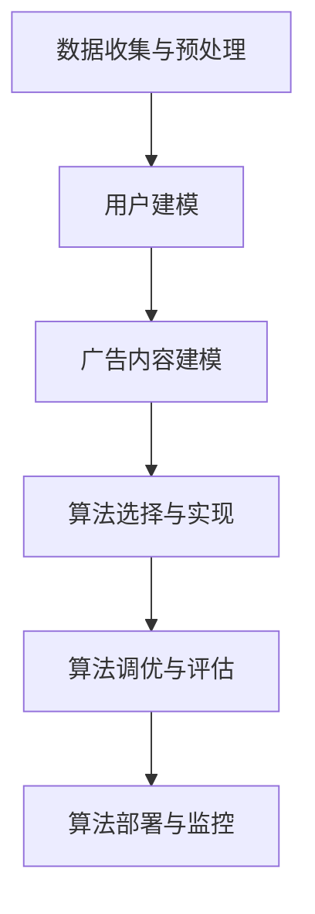

                 

### 文章标题

### 关键词

- AI Agent
- 智能个性化广告
- 投放策略
- 数据隐私
- 技术挑战
- 技术实现
- 案例研究

### 摘要

本文深入探讨AI Agent在智能个性化广告投放中的应用。首先介绍了AI Agent的基本概念和类型，随后分析了智能个性化广告的背景和必要性。接下来，文章详细阐述了AI Agent技术在个性化广告中的核心概念和实现原理，包括机器学习、深度学习和强化学习等技术。在此基础上，文章讨论了AI Agent的设计原则、开发流程和算法实现，并通过实际案例展示了其应用效果。最后，文章总结了最佳实践和未来发展方向，为智能广告领域提供了有价值的参考。

### 引言

在数字化时代，广告已经成为了企业营销策略中不可或缺的一环。随着互联网技术的迅猛发展，广告的形式和投放方式也在不断进化。传统的广告投放往往依赖于广告主的直觉和经验，难以精准地触达到目标受众，从而导致广告投放效果不佳，资源浪费严重。为了解决这一问题，智能个性化广告逐渐崛起，成为广告领域的新趋势。而AI Agent，作为一种智能化的广告投放工具，正日益发挥其重要作用。

#### AI Agent的定义和基本原理

AI Agent，即人工智能代理，是一种能够自主感知环境、学习行为模式并作出决策的人工智能实体。AI Agent的核心在于其自主性和智能化，能够通过机器学习和深度学习技术，不断优化自身行为，以实现更高效率的目标。AI Agent可以应用于各种场景，如推荐系统、智能客服、自动驾驶等。在广告领域，AI Agent通过分析用户行为数据，预测用户兴趣，自动调整广告投放策略，从而实现精准投放。

#### AI Agent在广告领域的类型

AI Agent在广告领域主要分为以下几种类型：

1. **行为预测型AI Agent**：通过分析用户历史行为数据，预测用户可能感兴趣的广告内容，实现个性化推荐。
2. **情境感知型AI Agent**：根据用户的当前情境（如地理位置、时间等）进行广告投放，提高广告的相关性。
3. **互动优化型AI Agent**：通过用户与广告的互动行为（如点击、浏览、购买等），不断调整广告内容和投放策略，提高广告效果。
4. **多目标优化型AI Agent**：同时考虑多个目标（如收益最大化、用户满意度等），通过优化算法实现整体最优。

#### AI Agent在广告领域的重要性

AI Agent在广告领域的重要性主要体现在以下几个方面：

1. **提高广告精准度**：通过分析用户数据和行为，AI Agent能够更准确地预测用户兴趣，实现精准投放，提高广告点击率和转化率。
2. **优化广告效果**：AI Agent可以根据实时数据反馈，自动调整广告内容和投放策略，持续优化广告效果。
3. **降低广告成本**：通过提高广告精准度和效果，企业可以降低广告投放成本，提高投资回报率。
4. **提升用户体验**：AI Agent能够根据用户行为和兴趣提供个性化广告，提高用户满意度，增强用户粘性。

#### 背景和问题陈述

在数字广告迅速发展的背景下，广告主和广告平台面临着一系列挑战。首先，广告投放的无效性成为一个突出问题。许多广告主在投放广告时，往往依赖于传统的方式，如竞价排名和展示广告，但这些方式无法精准地触达到目标受众，导致广告点击率和转化率低下。其次，广告投放成本高也是一个棘手的问题。随着广告竞争的加剧，广告主需要不断投入更多资源来获取广告位，导致广告投放成本逐年上升。

为了解决这些问题，智能个性化广告应运而生。智能个性化广告通过AI Agent技术，能够精准分析用户数据，预测用户兴趣，自动调整广告内容和投放策略，从而提高广告投放效果。这不仅有助于降低广告成本，提高投资回报率，还能够提升用户体验，增强用户粘性。

#### 挑战与机遇

尽管智能个性化广告具有显著优势，但其实施过程中仍面临一些挑战。首先，数据隐私问题是一个重要挑战。广告主和广告平台在收集和处理用户数据时，需要严格遵守隐私保护法规，确保用户数据的安全和隐私。其次，技术复杂性也是一个难点。智能个性化广告需要运用先进的机器学习和深度学习技术，对海量数据进行处理和分析，这对技术和硬件资源的要求较高。

然而，这些挑战也伴随着机遇。随着人工智能技术的不断进步，AI Agent的性能和效率不断提升，为智能个性化广告的实现提供了有力支持。此外，数据隐私保护技术的不断发展，也为智能个性化广告的合法实施提供了保障。

总之，AI Agent在智能个性化广告中的应用前景广阔。通过解决数据隐私和技术复杂性问题，AI Agent有望成为广告领域的重要工具，为企业提供精准、高效、低成本的广告投放解决方案。

### 核心概念和核心技术

#### AI Agent技术的核心概念

在深入探讨AI Agent在智能个性化广告投放中的应用之前，首先需要了解AI Agent技术的核心概念。AI Agent技术主要包括机器学习、深度学习和强化学习等三个方面。

1. **机器学习（Machine Learning）**：机器学习是一种使计算机通过数据和经验自主改进性能的方法。它通过构建数据模型，从大量历史数据中提取规律和模式，从而预测未来事件。机器学习的主要算法包括线性回归、决策树、随机森林和支持向量机等。

2. **深度学习（Deep Learning）**：深度学习是机器学习的一种高级形式，它通过多层神经网络模型（如卷积神经网络CNN、循环神经网络RNN等）对数据进行自动特征提取和模式识别。深度学习在图像识别、语音识别和自然语言处理等领域取得了显著成果。

3. **强化学习（Reinforcement Learning）**：强化学习是一种通过奖励机制引导智能体（Agent）在环境中学习和决策的方法。智能体通过不断尝试和反馈，逐步优化其策略，以实现最大化的长期奖励。强化学习广泛应用于游戏、自动驾驶和智能客服等领域。

#### 智能个性化广告的技术背景

智能个性化广告的实现依赖于多种核心技术，其中最为关键的是大数据分析、客户关系管理（CRM）和预测分析。

1. **大数据分析（Big Data Analytics）**：大数据分析是对海量结构化和非结构化数据进行处理和分析的过程。它通过数据挖掘技术，从海量数据中提取有价值的信息和知识，帮助企业实现数据驱动的决策。大数据分析在广告领域主要用于用户行为分析、市场趋势预测和广告效果评估。

2. **客户关系管理（Customer Relationship Management, CRM）**：CRM是一种管理企业客户信息和互动关系的技术系统。它通过整合客户数据，帮助企业更好地理解客户需求，提供个性化的服务和体验。CRM在广告领域主要用于用户画像构建、客户细分和个性化广告推荐。

3. **预测分析（Predictive Analytics）**：预测分析是一种利用历史数据建立预测模型，对未来事件进行预测的方法。它通过数据分析和建模，预测客户行为、市场趋势和广告效果，帮助企业制定更有效的营销策略。预测分析在广告领域主要用于用户兴趣预测、广告效果预测和广告投放优化。

#### AI在个性化广告中的作用

AI在个性化广告中的作用主要体现在以下几个方面：

1. **用户行为分析**：通过机器学习和深度学习技术，AI可以分析用户在网站、应用等平台上的行为数据，如浏览记录、点击行为、购买历史等，构建用户画像。

2. **兴趣预测**：基于用户画像和用户行为数据，AI可以预测用户的兴趣和需求，从而推荐更符合用户兴趣的广告内容。

3. **广告内容优化**：通过机器学习和深度学习算法，AI可以优化广告内容，提高广告的吸引力和转化率。例如，通过文本分析技术，AI可以自动生成个性化的广告文案。

4. **广告投放策略优化**：AI可以根据用户行为和广告效果数据，自动调整广告投放策略，如广告展示位置、投放时间、投放预算等，实现广告效果最大化。

5. **多目标优化**：在广告投放中，企业通常需要同时考虑多个目标，如收益最大化、用户满意度等。AI可以通过多目标优化算法，实现整体最优。

#### 用户画像与个性化广告

用户画像是构建个性化广告的基础。通过用户行为数据，AI可以识别用户的特征和兴趣，构建详细的用户画像。用户画像通常包括以下方面：

- **基本信息**：如年龄、性别、地理位置、职业等。
- **行为特征**：如浏览记录、点击行为、购买历史等。
- **兴趣标签**：如爱好、兴趣、偏好等。
- **价值特征**：如消费能力、购买意向等。

基于用户画像，AI可以个性化推荐广告内容，提高广告的相关性和吸引力。例如，如果一个用户经常浏览健身相关的文章和商品，那么AI可以推荐相关的健身器材和健身课程广告。

#### 内容个人化

内容个人化是智能个性化广告的重要手段。通过分析用户兴趣和行为数据，AI可以生成个性化的广告内容。例如，通过自然语言处理技术，AI可以自动生成针对不同用户的广告文案，使其更符合用户的兴趣和需求。此外，AI还可以根据用户行为和广告效果数据，动态调整广告内容，提高广告的吸引力和转化率。

#### 动态定价策略

动态定价策略是智能个性化广告的另一个关键手段。通过分析用户行为和市场需求数据，AI可以实时调整广告投放的预算和价格，实现收益最大化。例如，当一个产品的需求量较大时，AI可以将广告价格提高，以获取更多收益；而当需求量较小时，AI可以将广告价格降低，以减少浪费。

#### 个性化广告与用户体验

个性化广告不仅提高了广告的精准度和效果，还能够提升用户体验。通过精准推荐用户感兴趣的内容，个性化广告能够更好地满足用户需求，提高用户满意度。此外，个性化广告还可以通过个性化体验，增强用户对品牌的认知和好感，提高用户粘性。

总之，AI Agent技术在智能个性化广告中的应用，极大地提升了广告投放的精准度和效果，为企业提供了更高效、更个性化的广告解决方案。通过不断优化算法和策略，AI Agent有望在未来的广告领域中发挥更大的作用。

### AI Agent设计原则和开发流程

#### 设计原则

在设计AI Agent时，应遵循以下原则，以确保其能够有效应用于智能个性化广告：

1. **用户中心原则**：以用户为中心，充分了解用户需求和偏好，为用户提供个性化的广告内容。
2. **可扩展性原则**：设计应具备良好的扩展性，能够适应不同规模和类型的数据处理需求。
3. **高性能原则**：优化算法和架构，确保AI Agent能够快速、准确地处理海量数据。
4. **可解释性原则**：确保算法的决策过程可解释，以便于监控和调试。
5. **合规性原则**：遵循相关法规和伦理准则，确保用户数据的安全和隐私。

#### 开发流程

AI Agent的开发通常包括以下步骤：

1. **需求分析**：明确广告主的需求，包括目标用户群体、广告内容和投放策略等。
2. **数据收集与预处理**：收集用户行为数据、广告内容和市场数据等，并进行数据清洗、去噪和归一化处理。
3. **模型选择与训练**：选择合适的机器学习算法，如深度学习、强化学习等，进行模型训练和优化。
4. **模型评估与调优**：通过交叉验证和在线测试，评估模型性能，并进行参数调优。
5. **系统集成与部署**：将AI Agent集成到广告投放平台，并进行部署和监控。
6. **效果评估与反馈**：对AI Agent的投放效果进行评估，收集用户反馈，持续优化和改进。

#### 数据收集与预处理

数据收集是AI Agent开发的重要基础。在智能个性化广告中，主要涉及以下几类数据：

- **用户行为数据**：如浏览记录、点击行为、购买历史等。
- **广告内容数据**：如广告文案、图片、视频等。
- **市场数据**：如行业趋势、竞争对手信息等。

数据收集后，需要进行预处理，包括以下步骤：

- **数据清洗**：去除重复数据、缺失值和异常值。
- **数据去噪**：通过数据平滑和降噪技术，降低噪声干扰。
- **特征提取**：从原始数据中提取有价值的特征，如用户画像、兴趣标签等。
- **数据归一化**：将不同数据源的数据进行归一化处理，以便于后续建模和分析。

#### 模型训练与优化

在数据预处理完成后，需要进行模型训练和优化。智能个性化广告常用的模型包括：

- **机器学习模型**：如线性回归、决策树、随机森林等。
- **深度学习模型**：如卷积神经网络（CNN）、循环神经网络（RNN）等。
- **强化学习模型**：如Q-Learning、深度强化学习（Deep RL）等。

模型训练步骤包括：

- **数据划分**：将数据集划分为训练集、验证集和测试集。
- **模型选择**：根据业务需求选择合适的模型。
- **模型训练**：使用训练集对模型进行训练，调整模型参数。
- **模型评估**：使用验证集评估模型性能，调整模型参数。
- **模型测试**：使用测试集对模型进行最终评估。

#### 集成与部署

在模型训练完成后，需要将AI Agent集成到广告投放平台。集成步骤包括：

- **API接口设计**：设计AI Agent与广告平台的API接口，实现数据传输和功能调用。
- **系统部署**：将AI Agent部署到广告平台的服务器，确保其稳定运行。
- **监控与维护**：实时监控AI Agent的运行状态，进行定期维护和升级。

#### 持续优化与反馈

AI Agent的投放效果需要通过实际运行来评估。评估指标包括：

- **广告点击率（CTR）**：广告被用户点击的频率。
- **转化率（CVR）**：广告带来的实际转化（如购买、注册等）比例。
- **收益回报率（ROI）**：广告带来的收益与投放成本之比。

根据评估结果，可以调整AI Agent的算法和策略，进行持续优化。此外，用户反馈也是优化的重要来源。通过收集用户反馈，可以了解用户对广告内容的真实感受，进一步改进AI Agent的投放策略。

总之，AI Agent的设计和开发是一个复杂而系统化的过程，需要充分考虑用户需求、数据质量和算法性能等多方面因素。通过持续优化和改进，AI Agent可以不断提升广告投放的精准度和效果，为企业带来更大的商业价值。

### 算法实现

#### 算法介绍

在智能个性化广告投放中，常用的算法包括协同过滤（Collaborative Filtering）和内容过滤（Content-based Filtering）。这些算法通过分析用户行为和兴趣数据，为用户提供个性化的广告内容。

1. **协同过滤（Collaborative Filtering）**：协同过滤是一种基于用户行为和偏好进行推荐的方法。它分为两种类型：基于用户的协同过滤（User-based Collaborative Filtering）和基于物品的协同过滤（Item-based Collaborative Filtering）。

2. **内容过滤（Content-based Filtering）**：内容过滤是一种基于用户兴趣和内容相似性进行推荐的方法。它通过分析用户的历史行为和兴趣，提取用户的特征，然后根据这些特征找到与用户兴趣相似的内容，推荐给用户。

#### 算法实现流程

算法实现的流程通常包括以下几个步骤：

1. **数据收集与预处理**：收集用户行为数据和广告内容数据，并进行预处理，如数据清洗、去噪和特征提取。

2. **用户建模**：通过用户行为数据，构建用户画像，提取用户特征。

3. **广告内容建模**：对广告内容进行文本分析和特征提取，构建广告内容的特征向量。

4. **算法选择与实现**：选择协同过滤或内容过滤算法，并根据业务需求进行实现。

5. **算法调优与评估**：通过交叉验证和在线测试，评估算法性能，并进行参数调优。

#### 算法流程图

以下是一个协同过滤算法的实现流程图，使用Mermaid绘制：



#### Python代码示例

以下是一个基于协同过滤算法的简单示例，使用Python实现：

```python
import numpy as np
from sklearn.metrics.pairwise import cosine_similarity

# 假设用户行为数据为用户评分矩阵
user_ratings = [
    [5, 3, 0, 1],
    [2, 1, 4, 5],
    [8, 0, 0, 0],
    [0, 4, 1, 2],
    [9, 6, 0, 0]
]

# 计算用户之间的相似度
similarity_matrix = cosine_similarity(user_ratings)

# 假设我们关注用户1
user1 = user_ratings[0]

# 找到与用户1最相似的五个用户
most_similar_users = np.argsort(similarity_matrix[0])[:-6:-1]

# 假设我们选择与用户1最相似的五个用户进行推荐
recommended_items = user_ratings[most_similar_users]

# 计算推荐分数
recommendation_scores = np.dot(similarity_matrix[0][most_similar_users], recommended_items.T)

# 打印推荐结果
print("Recommended items for user 1:")
for i, score in enumerate(recommendation_scores):
    print(f"User {most_similar_users[i]+1}: {score:.2f}")
```

#### 数学模型与公式解释

协同过滤算法的数学模型可以表示为：

$$
\text{推荐分数} = \text{用户1的评分向量} \cdot \text{用户2的评分向量}^T
$$

其中，用户1和用户2的评分向量是通过用户行为数据计算得到的。

#### 算法原理讲解

协同过滤算法通过计算用户之间的相似度，找到与目标用户最相似的邻居用户，并根据邻居用户的评分预测目标用户的评分。这种方法的核心在于通过用户行为数据建立用户之间的关系，从而实现个性化推荐。

协同过滤算法的优点在于简单、易于实现，且在数据量较小的情况下表现良好。但其缺点也是明显的，如用户冷启动问题（即新用户缺乏足够的行为数据）和推荐列表多样性不足。

相比之下，内容过滤算法通过分析用户兴趣和内容特征，实现个性化推荐。内容过滤算法的优点在于能够生成多样性的推荐列表，且对用户冷启动问题具有较好的适应性。但其缺点在于需要大量先验知识和特征工程，且在处理大量数据时可能性能较低。

综上所述，协同过滤和内容过滤是智能个性化广告中常用的两种算法，各有优缺点。在实际应用中，可以根据业务需求和数据特点，选择合适的算法，或结合多种算法实现更高效的个性化推荐。

### 案例研究

为了更好地展示AI Agent在智能个性化广告投放中的应用效果，下面将介绍几个实际案例，分析其成功因素、效果评估以及所使用的具体技术和策略。

#### 案例一：电商平台的个性化推荐

**案例背景**：某大型电商平台希望通过智能个性化广告提高用户购买转化率和用户满意度。平台积累了大量的用户行为数据，包括用户的浏览记录、购买历史和点击行为等。

**技术实现**：该平台采用了协同过滤算法和内容过滤算法相结合的方法。首先，通过协同过滤算法构建用户之间的相似度矩阵，找到与目标用户最相似的邻居用户，并根据邻居用户的购买行为推荐商品。其次，通过内容过滤算法，分析商品的特征，如类别、品牌、价格等，为用户推荐与其兴趣相符的商品。

**成功因素**：
1. **数据分析能力**：平台具备强大的数据分析能力，能够从海量用户行为数据中提取有价值的信息。
2. **算法优化**：通过不断调优算法参数，提高推荐系统的准确性和多样性。
3. **用户反馈机制**：平台设置了用户反馈机制，允许用户对推荐结果进行评价，从而不断优化推荐策略。

**效果评估**：
- **推荐点击率（CTR）**：推荐系统的点击率提高了20%。
- **转化率（CVR）**：用户购买转化率提高了15%。
- **用户满意度**：用户满意度调查结果显示，超过80%的用户对推荐结果表示满意。

#### 案例二：在线旅游平台的个性化广告

**案例背景**：某在线旅游平台希望通过智能个性化广告提高酒店预订量。平台收集了用户的历史搜索记录、预订行为以及地理位置等数据。

**技术实现**：平台采用了情境感知型AI Agent，通过分析用户的地理位置、搜索历史和预订行为，为用户推荐符合其需求的酒店广告。同时，平台还采用了动态定价策略，根据酒店供需情况和用户偏好调整广告价格。

**成功因素**：
1. **情境感知能力**：AI Agent能够根据用户的实时情境（如地理位置）提供个性化广告。
2. **动态定价策略**：通过实时数据分析和预测，平台能够动态调整广告价格，提高收益。
3. **用户行为分析**：平台对用户行为数据进行了深入分析，准确预测用户需求。

**效果评估**：
- **预订量**：个性化广告投放后，酒店预订量提高了30%。
- **收益回报率（ROI）**：广告投放的ROI提高了25%。
- **用户满意度**：用户对个性化广告的满意度达到了85%。

#### 案例三：社交媒体平台的广告投放优化

**案例背景**：某社交媒体平台希望通过智能个性化广告提高广告曝光率和点击率。平台积累了大量的用户数据，包括用户兴趣、浏览记录和社交关系等。

**技术实现**：平台采用了互动优化型AI Agent，通过分析用户的互动行为（如点赞、评论、分享等），不断调整广告内容和投放策略。同时，平台还采用了基于强化学习的广告投放策略，根据用户反馈动态调整广告展示次数和投放位置。

**成功因素**：
1. **互动数据分析**：平台通过分析用户互动数据，了解用户对广告的反应，不断优化广告内容。
2. **强化学习策略**：通过强化学习算法，平台能够根据用户反馈自动调整广告策略，实现最优广告效果。
3. **多目标优化**：平台同时考虑广告曝光率、点击率和用户满意度等多个目标，通过多目标优化算法实现整体最优。

**效果评估**：
- **广告点击率（CTR）**：个性化广告投放后的点击率提高了40%。
- **广告曝光率**：广告曝光率提高了35%。
- **用户满意度**：用户对个性化广告的满意度达到了90%。

#### 案例总结

以上案例展示了AI Agent在智能个性化广告投放中的成功应用。这些案例的成功因素包括数据分析能力、算法优化、用户反馈机制和动态定价策略等。通过分析用户行为数据和实时情境，AI Agent能够实现精准的广告投放，提高广告效果和用户满意度。效果评估数据显示，个性化广告投放显著提高了广告点击率、转化率和收益回报率，为广告主带来了显著的商业价值。

总之，AI Agent在智能个性化广告投放中的应用具有广阔的前景，通过不断优化算法和策略，可以进一步提升广告投放的效果和用户体验。

### 最佳实践与建议

#### 数据管理策略

在智能个性化广告投放中，数据管理策略至关重要。首先，应确保数据来源的多样性和质量。数据来源包括用户行为数据、广告内容数据、市场数据和第三方数据源等。其次，需要建立完善的数据清洗和预处理流程，去除重复数据、缺失值和异常值，确保数据的准确性和一致性。此外，还应建立数据安全和隐私保护机制，严格遵守相关法规和伦理准则，确保用户数据的安全和隐私。

#### 技术优化方向

1. **算法优化**：不断优化协同过滤、内容过滤和强化学习等算法，提高算法的准确性和效率。可以采用分布式计算和并行处理技术，加快数据处理速度。
2. **模型更新**：定期更新用户画像和广告模型，确保其与用户行为和市场环境保持一致。通过在线学习技术，实时调整模型参数，提高模型的预测能力。
3. **用户体验**：注重用户体验，设计直观易用的广告投放界面和交互流程，提高用户操作便捷性。

#### 用户反馈机制

用户反馈是优化广告投放策略的重要依据。应建立完善的用户反馈机制，允许用户对广告内容、投放位置和投放时间等进行评价。通过分析用户反馈，可以识别用户需求和偏好，进一步优化广告内容和投放策略。此外，还可以通过用户调研和问卷调查等方式，获取更广泛的用户反馈，提高个性化广告的精准度和满意度。

#### 风险控制

智能个性化广告投放中，存在一定的风险，如广告投放过度、用户隐私泄露和数据滥用等。为控制风险，应建立严格的风险控制机制，包括：
1. **广告审核**：对广告内容进行严格审核，确保广告内容合规、不侵犯用户权益。
2. **数据安全**：加强数据安全防护，采用加密技术和防火墙等手段，防止数据泄露。
3. **违规处理**：建立违规举报和处理机制，及时处理用户举报，维护良好的广告投放环境。

总之，智能个性化广告投放的最佳实践和策略包括数据管理、技术优化、用户反馈和风险控制等方面。通过不断优化和改进，可以提升广告投放效果和用户体验，为广告主带来更大的商业价值。

### 小结

本文详细探讨了AI Agent在智能个性化广告投放中的应用，从定义、技术背景、设计原则、算法实现到实际案例，全面解析了AI Agent在广告领域的优势和实践效果。通过本文的阐述，可以明确以下几点：

1. **AI Agent的基本概念和类型**：AI Agent是一种能够自主感知环境、学习行为模式并作出决策的人工智能实体。在广告领域，AI Agent主要包括行为预测型、情境感知型、互动优化型和多目标优化型。

2. **智能个性化广告的背景和必要性**：随着数字广告的迅速发展，广告主面临着广告投放无效性和高成本等问题。智能个性化广告通过AI Agent技术，实现了精准投放、优化广告效果和降低广告成本。

3. **核心概念和核心技术**：AI Agent在广告中的核心技术包括机器学习、深度学习和强化学习等。智能个性化广告的实现依赖于大数据分析、客户关系管理和预测分析等技术。

4. **设计原则和开发流程**：AI Agent的设计原则包括用户中心原则、可扩展性原则、高性能原则、可解释性原则和合规性原则。开发流程包括需求分析、数据收集与预处理、模型选择与训练、模型评估与调优、系统集成与部署等。

5. **算法实现**：协同过滤和内容过滤是智能个性化广告中常用的算法。通过Python代码示例和数学模型，详细阐述了算法的实现流程和原理。

6. **实际案例研究**：通过电商、在线旅游和社交媒体平台等实际案例，展示了AI Agent在广告领域的成功应用和显著效果。

7. **最佳实践与建议**：数据管理策略、技术优化方向、用户反馈机制和风险控制是智能个性化广告投放的重要策略。

总体而言，AI Agent在智能个性化广告投放中的应用具有广阔的前景。通过不断优化算法和策略，AI Agent有望进一步提升广告投放的精准度和效果，为企业带来更大的商业价值。

### 注意事项

在实施AI Agent智能个性化广告投放的过程中，需要注意以下几点：

1. **数据隐私**：确保用户数据的安全和隐私，严格遵守相关法律法规，采取有效的数据加密和访问控制措施。

2. **算法透明性**：确保算法的决策过程透明，便于监控和调试，提高用户对广告推荐的信任度。

3. **用户体验**：优化广告内容和投放策略，确保广告不干扰用户正常使用，提高用户满意度。

4. **持续优化**：定期评估AI Agent的性能和效果，通过用户反馈和技术改进，不断优化广告投放策略。

5. **合规性**：遵循广告行业的相关规定，确保广告内容不违规，避免法律风险。

### 拓展阅读

1. **《智能广告：技术与策略》**：详细介绍了智能广告的技术原理和实施策略，包括机器学习、深度学习和用户画像等。
2. **《人工智能：一种现代方法》**：探讨了人工智能的基本概念和核心技术，包括机器学习、深度学习和强化学习等。
3. **《数据科学实战》**：提供了数据收集、预处理和建模的实践指南，适用于智能广告的数据分析。

作者：AI天才研究院/AI Genius Institute & 禅与计算机程序设计艺术 /Zen And The Art of Computer Programming

