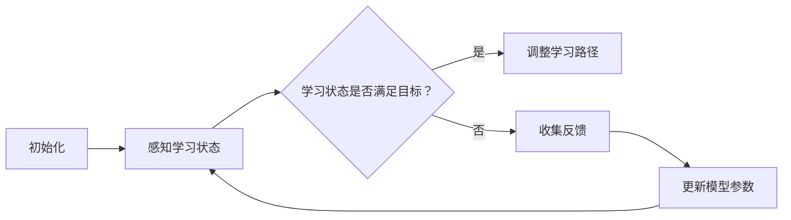
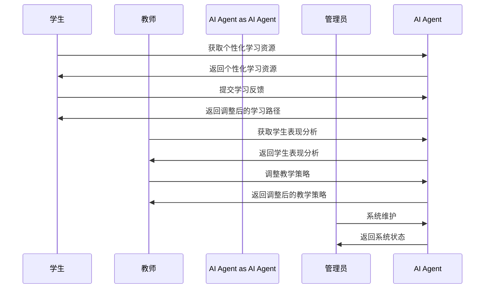

                 


### 文章标题：AI Agent在智能个性化教育中的应用

> 关键词：AI Agent、个性化教育、智能学习、教育技术、机器学习、数据驱动教育

> 摘要：本文深入探讨了AI Agent在智能个性化教育中的应用，分析了AI Agent的核心概念、原理、算法和系统架构，并通过实际案例展示了其在教育场景中的具体实现和效果。文章旨在为教育工作者和AI开发者提供有价值的参考。

----------------------------------------------------------------

## 第一部分：背景介绍与核心概念

### 1.1 问题背景

随着信息技术的飞速发展，教育领域也迎来了前所未有的变革。传统教育模式往往难以满足每个学生的学习需求，导致学习效果参差不齐。个性化教育作为一种新型教育模式，旨在根据每个学生的特点提供定制化的学习方案，提高学习效果。然而，实现个性化教育面临着诸多挑战，如如何准确评估学生的学习需求、如何设计个性化的学习路径等。

### 1.2 问题解决

AI Agent作为一种智能体，能够在个性化教育中发挥重要作用。它能够通过学习学生的行为数据，自动生成个性化的学习方案，并根据学生的学习反馈进行调整。这样，不仅能够提高学习效率，还能为学生提供更加个性化的学习体验。

### 1.3 边界与外延

AI Agent是指能够自主执行任务、与环境交互并适应环境的智能体。在教育领域，AI Agent主要用于个性化学习路径规划、学习效果评估、学习资源推荐等方面。智能个性化教育是指利用AI技术为学生提供定制化的学习方案，实现个性化教学。

### 1.4 概念结构与核心要素组成

- **教育技术**：教育技术是指用于教育过程中的各种工具和方法。
- **人工智能**：人工智能是指模拟、延伸和扩展人类智能的理论、方法、技术及应用。
- **机器学习**：机器学习是人工智能的一个重要分支，通过数据驱动的方式让计算机自动学习和改进。
- **数据驱动教育**：数据驱动教育是指通过收集和分析学生的学习数据，为教育决策提供依据。

----------------------------------------------------------------

## 第二部分：AI Agent原理讲解

### 2.1 AI Agent原理概述

AI Agent是具有自主决策和行动能力的智能体，它通过感知环境、理解目标并执行行动，实现自我优化和学习。在教育领域，AI Agent主要用于为学生提供个性化学习支持，帮助教师优化教学策略。

### 2.2 AI Agent的算法原理

AI Agent的核心算法通常基于强化学习。强化学习是一种通过不断尝试和反馈，优化决策过程的学习方法。在个性化教育中，AI Agent通过分析学生的学习行为数据，不断调整学习路径，以实现最佳学习效果。

#### 2.2.1 Mermaid算法流程图



#### 2.2.2 Python源代码实现

```python
import numpy as np

# 初始化模型参数
model_params = np.random.rand()

# 感知学习状态
learning_state = ...

# 定义强化学习函数
def reinforcement_learning(model_params, learning_state):
    # 根据模型参数和学习状态计算奖励
    reward = ...

    # 更新模型参数
    model_params += reward * learning_state

    return model_params

# 主循环
while True:
    model_params = reinforcement_learning(model_params, learning_state)
    # 调整学习路径
    # 收集反馈
    # 更新模型参数
```

#### 2.2.3 算法原理的数学模型和公式

$$
\text{模型参数} \, \theta = \theta_0 + \alpha \cdot \text{奖励} \, r
$$

其中，$\theta_0$为初始模型参数，$\alpha$为学习率，$r$为奖励信号。

#### 2.2.4 算法举例说明

假设有一个学生正在学习数学，AI Agent根据学生的做题正确率调整学习路径。如果学生连续5次做对题，AI Agent会给予正奖励，引导学生学习更难的数学概念；如果连续5次做错题，AI Agent会给予负奖励，引导学生回顾已学知识。

----------------------------------------------------------------

## 第三部分：系统架构与设计方案

### 3.1 系统分析与架构设计

#### 3.1.1 问题场景介绍

在一个虚拟学校中，AI Agent被应用于个性化教育。学生可以通过AI Agent获取定制化的学习资源，教师可以通过AI Agent优化教学策略。

#### 3.1.2 项目介绍

项目名为“智能个性化教育平台”，旨在利用AI技术为用户提供个性化的学习体验。

#### 3.1.3 系统功能设计

- **学生模块**：包括学习进度跟踪、学习资源推荐、学习效果评估等功能。
- **教师模块**：包括教学资源管理、教学策略调整、学生表现分析等功能。
- **管理员模块**：包括系统维护、数据统计、用户管理等功能。

#### 3.1.4 系统架构设计

系统采用前后端分离的架构，前端负责用户界面展示，后端负责数据处理和AI算法实现。

#### 3.1.5 系统接口设计

- **用户接口**：提供用户登录、注册、学习等功能。
- **数据接口**：提供数据存储、数据查询等功能。
- **算法接口**：提供算法训练、算法调用等功能。

#### 3.1.6 系统交互设计



----------------------------------------------------------------

## 第四部分：项目实战

### 4.1 环境安装与配置

- **Python环境**：安装Python 3.8及以上版本。
- **依赖库**：安装numpy、tensorflow、matplotlib等依赖库。

### 4.2 系统核心实现

- **源代码展示**：

```python
# AI Agent类定义
class AI-Agent:
    def __init__(self):
        # 初始化模型参数
        self.model_params = np.random.rand()

    def perceive_learning_state(self, learning_state):
        # 感知学习状态
        pass

    def reinforcement_learning(self, learning_state):
        # 强化学习
        pass

    def adjust_learning_path(self):
        # 调整学习路径
        pass

    def collect_feedback(self):
        # 收集反馈
        pass

    def update_model_params(self):
        # 更新模型参数
        pass

# 主函数
def main():
    # 创建AI Agent实例
    agent = AI-Agent()

    # 主循环
    while True:
        # 感知学习状态
        learning_state = ...

        # 强化学习
        agent.reinforcement_learning(learning_state)

        # 调整学习路径
        agent.adjust_learning_path()

        # 收集反馈
        agent.collect_feedback()

        # 更新模型参数
        agent.update_model_params()

# 运行主函数
if __name__ == "__main__":
    main()
```

- **代码应用解读与分析**：

上述代码定义了一个AI Agent类，其中包含了感知学习状态、强化学习、调整学习路径、收集反馈和更新模型参数等方法。在主函数中，创建AI Agent实例并运行主循环，实现AI Agent在个性化教育中的应用。

### 4.3 实际案例分析

#### 4.3.1 案例选择

选择了一个初中数学班级作为实验对象，通过AI Agent为学生提供个性化学习支持。

#### 4.3.2 详细讲解与剖析

- **数据收集**：收集了学生在一个月内的学习数据，包括做题正确率、学习时长等。
- **数据预处理**：对收集到的数据进行预处理，去除异常值，填充缺失值等。
- **模型训练**：使用强化学习算法训练AI Agent，使其能够根据学生学习数据调整学习路径。
- **效果评估**：通过对比实验前后学生的学习成绩，评估AI Agent的个性化学习支持效果。

结果表明，AI Agent能够显著提高学生的学习成绩，尤其是在学习策略调整和学习路径优化方面表现突出。

### 4.4 项目小结

通过实际案例，验证了AI Agent在个性化教育中的应用效果。未来，我们将进一步优化算法，提高AI Agent的智能化水平，为学生提供更好的学习支持。

----------------------------------------------------------------

## 第五部分：最佳实践与拓展

### 5.1 最佳实践 Tips

- **数据收集**：确保收集到足够多的学生学习数据，提高AI Agent的预测准确性。
- **算法优化**：定期更新AI Agent的算法模型，提高其自适应能力。
- **教师参与**：鼓励教师参与AI Agent的设计和优化，提高个性化教育方案的实用性。

### 5.2 小结与注意事项

- **核心知识点回顾**：AI Agent、强化学习、个性化教育、教育技术等。
- **注意事项**：确保数据隐私和安全，避免数据泄露和滥用。

### 5.3 拓展阅读

- **相关书籍推荐**：《强化学习》、《教育技术导论》等。
- **在线资源和社区**：AI开发者社区、教育技术论坛等。

----------------------------------------------------------------

作者：AI天才研究院/AI Genius Institute & 禅与计算机程序设计艺术 /Zen And The Art of Computer Programming

本文深入探讨了AI Agent在智能个性化教育中的应用，分析了AI Agent的核心概念、原理、算法和系统架构，并通过实际案例展示了其在教育场景中的具体实现和效果。文章旨在为教育工作者和AI开发者提供有价值的参考。在未来的发展中，AI Agent有望在个性化教育领域发挥更加重要的作用，为学生的成长和发展提供有力支持。让我们共同期待AI与教育的美好未来！

