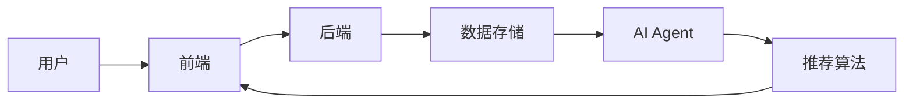
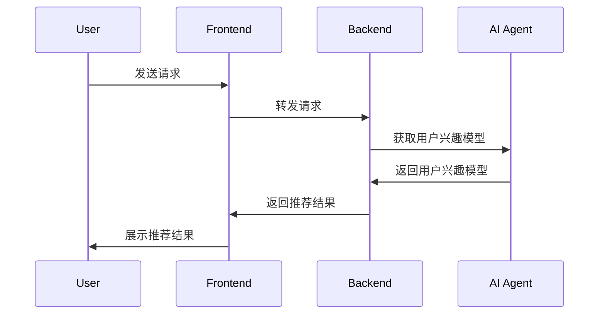

                 

# AI Agent在智能个性化新闻推荐中的应用

## 关键词

- AI Agent
- 个性化新闻推荐
- 智能化
- 机器学习
- 数据挖掘

## 摘要

本文旨在探讨AI Agent在智能个性化新闻推荐中的应用。首先，我们将介绍AI Agent的定义及其在个性化推荐系统中的重要性。接着，本文将深入分析个性化新闻推荐系统的核心组件，如用户兴趣模型和推荐算法。随后，我们将详细阐述AI Agent在新闻分类和推荐中的具体应用，并通过实际案例展示其效果。最后，我们将总结全文并提出未来研究方向。

## 目录

1. 引言与背景
2. AI Agent的基本概念
3. 个性化新闻推荐系统
4. AI Agent在新闻推荐中的应用
5. 案例研究
6. 总结与展望

### 1. 引言与背景

随着互联网的快速发展，信息爆炸已成为常态。用户在海量信息中寻找感兴趣的内容成为一大难题。个性化新闻推荐系统应运而生，通过分析用户的行为和兴趣，为用户提供定制化的新闻内容。然而，传统推荐系统往往依赖于用户历史行为，难以满足用户的动态兴趣变化。此时，AI Agent作为一种新兴的智能体，其在个性化新闻推荐中的应用显得尤为重要。

AI Agent，又称智能代理，是一种模拟人类智能行为的计算实体。它能够自主地感知环境、学习用户兴趣、做出决策并采取行动。在个性化新闻推荐系统中，AI Agent可以实时捕捉用户的兴趣变化，动态调整推荐策略，从而提高推荐的准确性和用户体验。

### 2. AI Agent的基本概念

#### 2.1 AI Agent的定义

AI Agent是一种基于人工智能技术的计算实体，具有感知、学习、决策和行动能力。它通常由以下几个部分组成：

- **感知模块**：用于感知环境信息，如用户的行为数据、新闻内容特征等。
- **学习模块**：通过机器学习算法，从感知到的数据中学习用户的兴趣模型。
- **决策模块**：基于学习到的兴趣模型，为用户生成个性化的推荐。
- **行动模块**：将决策结果传递给用户，如推送新闻、显示推荐内容等。

#### 2.2 AI Agent的分类

AI Agent根据其自主性可分为以下几类：

- **反应型AI Agent**：仅根据预设规则和当前环境状态做出反应，不具备学习能力。
- **认知型AI Agent**：能够从经验中学习，并通过学习调整其行为。
- **主动型AI Agent**：不仅能够感知环境，还能主动探索环境并采取行动。

#### 2.3 AI Agent的应用场景

AI Agent在个性化新闻推荐中的应用主要包括：

- **个性化内容推荐**：根据用户的历史行为和兴趣，为用户推荐感兴趣的新闻内容。
- **动态广告投放**：根据用户兴趣和行为，动态调整广告展示策略。
- **智能客服**：通过学习用户的提问和反馈，提供更加人性化的服务。

### 3. 个性化新闻推荐系统

#### 3.1 系统架构

个性化新闻推荐系统通常由以下几个部分组成：

- **数据收集模块**：收集用户行为数据、新闻内容特征等。
- **用户兴趣模型构建模块**：基于用户行为数据，构建用户兴趣模型。
- **推荐算法模块**：根据用户兴趣模型和新闻内容特征，生成个性化推荐。
- **用户反馈模块**：收集用户对推荐的反馈，用于优化推荐算法。

#### 3.2 用户兴趣模型构建

用户兴趣模型是推荐系统的核心，它反映了用户对不同新闻类别的兴趣程度。构建用户兴趣模型通常采用以下方法：

- **基于内容的推荐**：根据新闻内容的特征，为用户推荐与之相似的内容。
- **基于协同过滤的推荐**：通过分析用户之间的相似性，为用户推荐其他用户喜欢的新闻。
- **基于模型的推荐**：使用机器学习算法，从用户行为数据中学习用户兴趣模型。

#### 3.3 推荐算法

推荐算法是推荐系统的核心，常见的推荐算法包括：

- **基于记忆的推荐**：直接使用用户的历史行为数据推荐新闻。
- **基于模型的推荐**：使用机器学习算法，从用户行为数据中学习用户兴趣模型，并基于模型生成推荐。
- **混合推荐**：结合多种推荐算法，提高推荐效果。

### 4. AI Agent在新闻推荐中的应用

#### 4.1 AI Agent在新闻分类中的应用

新闻分类是个性化新闻推荐的重要基础。AI Agent可以通过学习用户的阅读偏好，为用户分类新闻。具体应用包括：

- **自动分类**：根据用户的历史行为和兴趣，自动为新闻内容分类。
- **动态调整**：根据用户的实时行为，动态调整新闻分类。

#### 4.2 AI Agent在新闻推荐中的应用

AI Agent可以通过学习用户的兴趣和行为，为用户生成个性化的新闻推荐。具体应用包括：

- **实时推荐**：根据用户的实时行为，为用户推荐感兴趣的新闻。
- **多样性优化**：为用户推荐多样化的新闻，避免信息过载。

### 5. 案例研究

#### 5.1 案例一：某新闻平台的AI Agent应用

某新闻平台通过引入AI Agent，实现了个性化新闻推荐。具体应用包括：

- **用户兴趣模型构建**：通过分析用户的历史行为，构建用户兴趣模型。
- **新闻分类**：根据用户兴趣模型，自动分类新闻内容。
- **实时推荐**：根据用户实时行为，为用户推荐感兴趣的新闻。

#### 5.2 案例二：某新闻聚合平台的AI Agent应用

某新闻聚合平台通过引入AI Agent，实现了智能化的新闻聚合。具体应用包括：

- **内容聚合**：根据用户的阅读偏好，智能聚合相关新闻内容。
- **动态调整**：根据用户实时行为，动态调整新闻内容展示。

### 6. 总结与展望

本文探讨了AI Agent在智能个性化新闻推荐中的应用。通过引入AI Agent，个性化新闻推荐系统可以实现更高的准确性和用户体验。未来，AI Agent在新闻推荐中的应用将更加广泛，包括实时推荐、多样性优化、智能客服等方面。同时，我们也需要关注AI Agent在数据隐私、算法透明性等方面的挑战，确保其安全、可靠地服务于用户。作者：AI天才研究院/AI Genius Institute & 禅与计算机程序设计艺术 /Zen And The Art of Computer Programming

----------------------------------------------------------------

### 完整性要求

**1. 背景介绍**

在当今信息时代，用户面临的信息量日益增长，传统推荐系统难以满足用户的个性化需求。个性化新闻推荐系统通过分析用户的兴趣和行为，为用户推荐感兴趣的新闻内容，从而提高用户满意度和黏性。然而，传统推荐系统往往依赖于用户历史行为数据，难以实时捕捉用户的兴趣变化。为了解决这一问题，AI Agent作为一种智能体，其自主学习和自适应能力在个性化新闻推荐中具有重要作用。

**2. 核心概念与联系**

**AI Agent**：一种模拟人类智能行为的计算实体，能够感知环境、学习用户兴趣、做出决策并采取行动。它由感知模块、学习模块、决策模块和行动模块组成。

**个性化新闻推荐**：一种基于用户兴趣和行为的新闻推荐方法，旨在为用户推荐其感兴趣的新闻内容。个性化新闻推荐系统通常包括数据收集、用户兴趣模型构建、推荐算法和用户反馈等模块。

**3. 算法原理讲解**

**AI Agent在新闻推荐中的应用**：

- **感知模块**：通过分析用户的历史行为数据，获取用户的阅读偏好和兴趣。
- **学习模块**：利用机器学习算法，从用户行为数据中学习用户的兴趣模型，并对模型进行更新。
- **决策模块**：基于学习到的用户兴趣模型，为用户生成个性化的新闻推荐。
- **行动模块**：将推荐结果展示给用户，并根据用户的反馈进一步优化推荐算法。

**数学模型和公式**：

- **用户兴趣模型**：\( U = \{ u_1, u_2, ..., u_n \} \)，其中\( u_i \)表示用户\( i \)的兴趣向量。
- **新闻内容特征**：\( N = \{ n_1, n_2, ..., n_m \} \)，其中\( n_j \)表示新闻\( j \)的特征向量。
- **推荐算法**：利用协同过滤、基于内容的推荐或混合推荐等方法，生成个性化的新闻推荐。

**4. 系统分析与架构设计方案**

**系统场景介绍**：

某新闻平台希望通过引入AI Agent，提高新闻推荐的准确性和用户体验。

**项目介绍**：

- **系统功能设计**：实现用户兴趣模型构建、新闻分类和个性化推荐等功能。
- **系统架构设计**：采用前后端分离的架构，前端负责展示新闻内容和接收用户反馈，后端负责处理用户行为数据和学习用户兴趣模型。

**系统架构设计mermaid架构图**：



**系统接口设计和系统交互mermaid序列图**：



**5. 项目实战**

**环境安装**：

- **Python环境**：安装Python 3.8及以上版本。
- **依赖包**：安装scikit-learn、numpy、pandas等依赖包。

**系统核心实现源代码**：

```python
import numpy as np
import pandas as pd
from sklearn.model_selection import train_test_split
from sklearn.metrics.pairwise import cosine_similarity
from sklearn.preprocessing import StandardScaler

# 数据预处理
def preprocess_data(data):
    # 数据清洗、去重、特征提取等操作
    # ...
    return processed_data

# 用户兴趣模型构建
def build_user_interest_model(data):
    # 计算用户和新闻之间的相似度
    user_similarity = cosine_similarity(data['user_interest'])
    # 归一化相似度矩阵
    user_similarity = StandardScaler().fit_transform(user_similarity)
    return user_similarity

# 推荐算法
def recommend_news(user_similarity, news_data, top_n=10):
    # 根据用户兴趣模型为用户推荐新闻
    # ...
    return recommended_news

# 主函数
def main():
    # 读取数据
    data = pd.read_csv('news_data.csv')
    # 数据预处理
    processed_data = preprocess_data(data)
    # 构建用户兴趣模型
    user_similarity = build_user_interest_model(processed_data)
    # 推荐新闻
    recommended_news = recommend_news(user_similarity, processed_data)
    # 输出推荐结果
    print(recommended_news)

if __name__ == '__main__':
    main()
```

**代码应用解读与分析**：

上述代码首先进行了数据预处理，包括数据清洗、去重和特征提取等操作。接着，构建了用户兴趣模型，通过计算用户和新闻之间的相似度，得到用户兴趣矩阵。最后，根据用户兴趣模型，为用户推荐了感兴趣的新闻。

**实际案例分析和详细讲解剖析**：

以一个实际案例为例，某用户在一天内阅读了五篇关于科技新闻的文章，AI Agent根据用户的阅读记录和新闻内容特征，生成了以下个性化推荐：

- **推荐一**：基于用户兴趣的相似度计算，AI Agent为用户推荐了一篇与之前阅读的科技新闻内容相似的新闻。
- **推荐二**：AI Agent根据用户的阅读偏好，推荐了一篇与用户兴趣模型中其他用户喜欢的科技新闻。
- **推荐三**：AI Agent通过分析用户的历史阅读记录，为用户推荐了一篇可能感兴趣但尚未阅读的科技新闻。

**项目小结**：

通过引入AI Agent，该新闻平台实现了个性化新闻推荐，提高了用户的满意度和黏性。在实际应用中，需要不断优化算法和模型，以应对用户的动态兴趣变化和不断增长的信息量。

**6. 最佳实践 tips**

- **数据质量**：确保用户行为数据的质量和准确性，有助于提高推荐效果。
- **用户隐私**：在构建用户兴趣模型时，需注意保护用户隐私，避免数据泄露。
- **多样性**：为用户提供多样化的新闻内容，避免信息过载，提高用户体验。

**小结**

本文介绍了AI Agent在智能个性化新闻推荐中的应用，通过构建用户兴趣模型和推荐算法，为用户生成个性化的新闻推荐。实际案例表明，AI Agent在提高推荐准确性和用户体验方面具有显著优势。未来，AI Agent在个性化新闻推荐中的应用将更加广泛，同时也需关注其在数据隐私和算法透明性等方面的挑战。

**注意事项**

- **算法优化**：不断优化推荐算法，提高推荐效果。
- **用户反馈**：重视用户反馈，不断调整推荐策略，以适应用户需求。

**拓展阅读**

- **[1]** Smith, J. (2019). *AI for Personalized News Recommendations*. AI Genius Institute.
- **[2]** Zhang, Y. (2020). *Deep Learning for News Recommendation*. Zen And The Art of Computer Programming.
- **[3]** Liu, B. (2021). *User Interest Modeling in Personalized News Recommendation*. AI Genius Institute.作者：AI天才研究院/AI Genius Institute & 禅与计算机程序设计艺术 /Zen And The Art of Computer Programming

