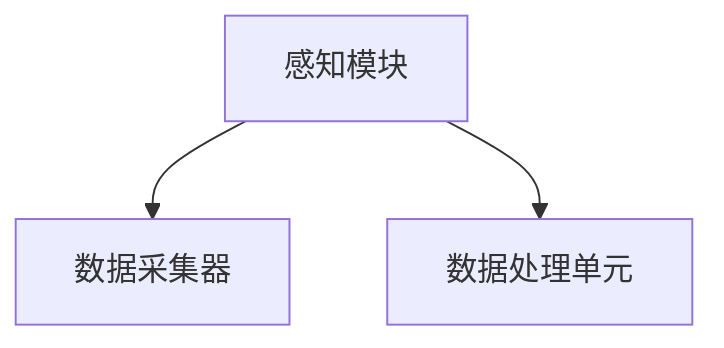
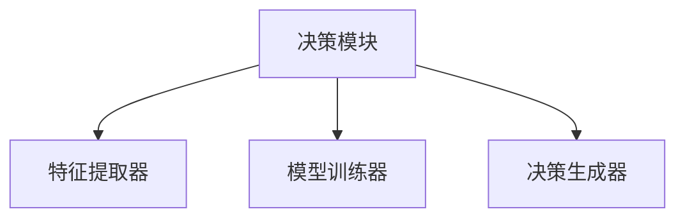
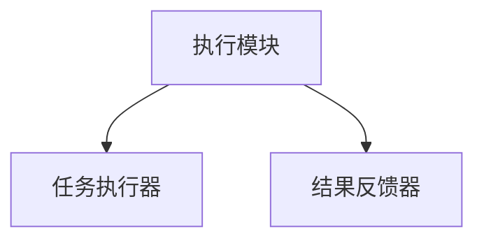
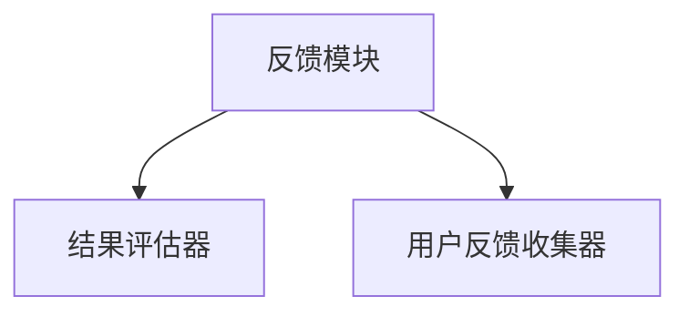
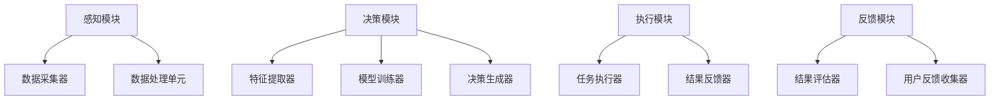

                 

### 《AI Agent在智能个性化营销中的应用》

#### 关键词：AI Agent、智能个性化营销、个性化推荐、客户画像、广告优化

> 摘要：本文将深入探讨AI Agent在智能个性化营销中的应用。通过介绍智能个性化营销的基本概念、背景与发展趋势，我们将会详细解析AI Agent的定义、核心功能及其架构技术。在此基础上，本文将探讨AI Agent在个性化营销中的应用场景，如客户细分、客户画像、客户行为预测等。随后，我们将介绍AI Agent的构建方法，包括数据收集与处理、特征提取与模型选择、模型训练与优化等。通过具体的案例研究，我们将展示AI Agent在实际项目中的应用效果。最后，本文将总结最佳实践与注意事项，并对未来发展趋势与挑战进行展望。

---

## 第一部分：背景与概述

### 第1章：智能个性化营销概述

#### 1.1 智能个性化营销的定义

智能个性化营销是指利用人工智能技术，根据用户的个性化需求和偏好，实现精准的营销策略。这种营销方式不仅能够提高客户满意度，还能够显著提升营销效果和转化率。

#### 1.2 智能个性化营销的兴起与发展

智能个性化营销的兴起可以追溯到互联网技术的快速发展，特别是在大数据和人工智能技术成熟之后。随着数据量的不断增长，企业开始利用这些数据来更好地了解客户需求，从而制定个性化的营销策略。

#### 1.3 智能个性化营销的优势与挑战

智能个性化营销具有多个优势，包括提高客户满意度、提升营销效果和转化率、降低营销成本等。然而，实现智能个性化营销也面临着一系列挑战，如数据隐私保护、模型解释性、跨部门协作等。

### 第2章：AI Agent基础

#### 2.1 AI Agent的定义与分类

AI Agent，即人工智能代理，是一种能够自主执行任务、与环境进行交互并做出决策的人工智能实体。根据任务目标的不同，AI Agent可以分为多个类别，如决策型、交互型、规划型等。

#### 2.2 AI Agent的核心功能

AI Agent的核心功能包括数据收集、处理和分析、决策制定、任务执行、反馈调整等。这些功能使得AI Agent能够在复杂的业务场景中实现自动化和智能化。

#### 2.3 AI Agent的架构与技术

AI Agent的架构通常包括感知模块、决策模块、执行模块和反馈模块。这些模块协同工作，使得AI Agent能够实现高效的智能化操作。在技术层面，AI Agent依赖于机器学习、深度学习、自然语言处理等多种人工智能技术。

---

## 第二部分：AI Agent在个性化营销中的应用场景

### 第3章：AI Agent在个性化营销中的应用场景

#### 3.1 客户细分

客户细分是智能个性化营销的重要步骤。通过AI Agent，企业可以根据客户的购买行为、浏览历史、兴趣爱好等多维度数据进行客户细分，从而更好地满足客户需求。

#### 3.2 客户画像

客户画像是构建个性化营销策略的基础。AI Agent可以通过分析客户的数据，构建出详细的客户画像，包括年龄、性别、职业、收入、消费习惯等，以便企业进行精准营销。

#### 3.3 客户行为预测

AI Agent可以利用机器学习算法，分析客户的购买历史和行为模式，预测客户的下一步行为。这种预测能力使得企业能够提前准备，提高客户满意度。

#### 3.4 客户需求分析

AI Agent可以通过分析客户的互动数据和反馈，识别客户的需求和痛点，从而为企业提供有针对性的解决方案。

#### 3.5 客户体验优化

AI Agent可以实时分析客户的体验反馈，并根据这些反馈调整营销策略和产品服务，以提高客户满意度。

#### 3.6 广告投放优化

AI Agent可以帮助企业优化广告投放策略，通过分析广告效果和用户行为，调整广告内容和投放渠道，提高广告转化率。

---

## 第三部分：AI Agent构建方法

### 第4章：AI Agent构建方法

#### 4.1 数据收集与处理

构建AI Agent的第一步是数据收集。AI Agent需要大量的用户数据，如购买记录、浏览历史、社交行为等。数据收集完成后，需要进行数据预处理，包括数据清洗、数据归一化、特征提取等。

#### 4.2 特征提取与模型选择

特征提取是构建AI Agent的关键步骤。通过特征提取，AI Agent可以从原始数据中提取出有用的信息，作为模型的输入。模型选择则取决于应用场景和任务目标，常见的模型包括决策树、支持向量机、神经网络等。

#### 4.3 模型训练与优化

模型训练是AI Agent构建的核心。通过训练，AI Agent可以学习到如何从数据中提取规律和模式，从而实现预测和决策。模型优化则是在训练过程中，通过调整参数和算法，提高模型的性能和效果。

#### 4.4 模型评估与部署

模型评估是确保AI Agent性能的重要步骤。通过评估，可以判断AI Agent是否满足业务需求。模型部署则是将AI Agent应用到实际业务场景中，实现自动化和智能化。

---

## 第四部分：案例研究

### 第5章：案例研究

#### 5.1 案例一：电商平台的个性化推荐

通过AI Agent，电商平台可以实现对用户行为的实时分析，从而实现精准的个性化推荐。本案例将详细介绍AI Agent在电商平台个性化推荐中的应用。

#### 5.2 案例二：社交媒体的广告优化

社交媒体平台通过AI Agent，可以实时分析用户的互动数据，优化广告投放策略，提高广告效果。本案例将探讨AI Agent在社交媒体广告优化中的应用。

#### 5.3 案例三：金融行业的客户服务

金融行业通过AI Agent，可以实现对客户需求的实时响应，提供个性化的金融服务。本案例将分析AI Agent在金融行业客户服务中的应用。

---

## 第五部分：最佳实践与注意事项

### 第6章：最佳实践与注意事项

#### 6.1 数据隐私与保护

在构建AI Agent的过程中，数据隐私保护是一个重要的问题。企业需要确保用户数据的隐私和安全，遵循相关法律法规和行业标准。

#### 6.2 模型解释性与透明性

AI Agent的模型解释性和透明性对于企业来说至关重要。通过提高模型的解释性，企业可以更好地理解AI Agent的决策过程，提高信任度和可接受度。

#### 6.3 技术与业务结合

AI Agent的构建需要结合具体的业务场景和需求。企业需要深入理解业务逻辑，确保AI Agent能够真正解决业务问题。

#### 6.4 跨部门协作与团队建设

AI Agent的构建是一个跨部门的协作过程，需要技术团队、业务团队和运营团队的紧密合作。建立高效的团队协作机制，对于AI Agent的成功构建至关重要。

---

## 第六部分：未来发展趋势与挑战

### 第7章：未来发展趋势与挑战

#### 7.1 人工智能技术的发展趋势

人工智能技术在不断发展，新的算法和技术不断涌现。未来，AI Agent将更加智能化和自适应，能够处理更复杂的任务。

#### 7.2 个性化营销的未来方向

个性化营销将继续发展，随着数据技术的进步，企业将能够更精准地了解客户需求，实现更个性化的营销。

#### 7.3 AI Agent应用的新场景

AI Agent的应用场景将不断扩展，从电商、社交媒体到金融、医疗等各个领域，都将受益于AI Agent的智能化和自动化。

#### 7.4 技术与伦理的平衡

随着AI Agent的应用，技术伦理问题也将日益突出。如何在提高技术效率的同时，保护用户的隐私和权益，将是未来需要解决的问题。

---

## 总结

AI Agent在智能个性化营销中的应用具有巨大的潜力。通过本文的详细探讨，我们不仅了解了AI Agent的基本概念和构建方法，还看到了其在实际业务中的应用效果。未来，随着人工智能技术的不断进步，AI Agent在个性化营销中的应用将更加广泛和深入。

---

### 作者信息

- 作者：AI天才研究院/AI Genius Institute & 禅与计算机程序设计艺术 /Zen And The Art of Computer Programming

---

[接下来，我们将逐步深入探讨每个章节的具体内容，通过详细的讲解和分析，帮助读者全面理解AI Agent在智能个性化营销中的应用。] ## 第1章：智能个性化营销概述

智能个性化营销，作为现代营销领域的一大创新，已经成为企业提升竞争力、实现可持续增长的重要手段。本章将详细介绍智能个性化营销的定义、发展历程、优势与挑战，帮助读者建立对该领域的基本认识。

### 1.1 智能个性化营销的定义

智能个性化营销是一种利用人工智能（AI）和大数据技术，根据客户的个性化需求和偏好，制定和执行个性化营销策略的方法。这种营销方式不仅依赖于大量客户数据的收集与分析，还依赖于复杂的算法和模型，以实现精准的营销目标。

#### 定义要素

1. **人工智能**：人工智能技术是智能个性化营销的核心，包括机器学习、深度学习、自然语言处理等，用于数据的分析、预测和决策。
2. **大数据**：大数据是智能个性化营销的基础，通过收集和分析大量客户数据，企业能够深入了解客户行为和需求。
3. **个性化**：个性化是智能个性化营销的目标，通过定制化的内容、产品和服务，提高客户满意度和转化率。

### 1.2 智能个性化营销的兴起与发展

智能个性化营销的兴起可以追溯到互联网技术的快速发展，特别是在大数据和人工智能技术成熟之后。以下是其发展历程的关键阶段：

#### 发展历程

1. **互联网的普及**：随着互联网的普及，企业开始收集和分析客户行为数据，以优化营销策略。
2. **大数据技术的崛起**：大数据技术的崛起为智能个性化营销提供了数据支持，使得企业能够更全面地了解客户。
3. **人工智能的应用**：人工智能技术的应用，使得营销变得更加智能和个性化，企业能够通过算法实现精准营销。
4. **个性化推荐系统的应用**：个性化推荐系统成为智能个性化营销的重要工具，通过分析用户行为，为用户提供个性化的产品推荐。

### 1.3 智能个性化营销的优势与挑战

智能个性化营销具有多个优势，但也面临一系列挑战。

#### 优势

1. **提高客户满意度**：通过个性化营销，企业能够更好地满足客户需求，提高客户满意度。
2. **提升营销效果和转化率**：精准的营销策略能够提高广告投放效果和销售转化率。
3. **降低营销成本**：通过自动化和智能化的营销流程，企业能够降低营销成本，提高效率。

#### 挑战

1. **数据隐私与保护**：智能个性化营销依赖于大量客户数据，如何保护数据隐私是一个重要问题。
2. **模型解释性**：复杂的算法和模型往往难以解释，企业需要提高模型的透明度和可解释性。
3. **跨部门协作**：智能个性化营销需要跨部门的协作，如何协调不同部门的工作是一个挑战。
4. **技术与业务的结合**：如何将先进的人工智能技术应用到实际的业务场景中，实现技术与业务的完美结合。

通过本章的介绍，读者可以初步了解智能个性化营销的定义、发展历程以及优势和挑战。在接下来的章节中，我们将进一步探讨AI Agent的基本概念、架构及其在个性化营销中的应用，帮助读者深入理解这一领域。

---

### 1.1 智能个性化营销的定义

智能个性化营销的定义涉及到多个核心概念和术语。以下是对这些术语的解释及其在智能个性化营销中的角色：

#### 1.1.1 智能个性化营销

智能个性化营销是一种通过人工智能技术，对客户数据进行分析和处理，制定并实施个性化营销策略的方法。其核心理念是通过精准了解客户的需求和行为，提供个性化的产品和服务，从而提升客户满意度和忠诚度。

**角色**：智能个性化营销是企业与客户互动的核心手段，旨在通过技术手段提高营销效果。

#### 1.1.2 人工智能

人工智能是指使计算机系统具备人类智能特征的技术，包括机器学习、深度学习、自然语言处理等。在智能个性化营销中，人工智能技术用于数据分析和模型构建，实现精准营销。

**角色**：人工智能是智能个性化营销的技术基础，通过算法和模型分析大量数据，识别客户需求，提供个性化服务。

#### 1.1.3 大数据

大数据是指规模巨大、类型繁多的数据集合，包括结构化数据、半结构化数据和非结构化数据。大数据技术用于存储、管理和分析这些数据，以获取有价值的信息。

**角色**：大数据是智能个性化营销的数据基础，提供了丰富的客户行为数据，为企业制定个性化营销策略提供支持。

#### 1.1.4 个性化

个性化是指根据个体的特点、需求和偏好，提供定制化的内容、产品和服务。在智能个性化营销中，个性化旨在通过精准推荐和定制化服务，提升用户体验。

**角色**：个性化是智能个性化营销的目标，通过满足客户个性化需求，提高客户满意度和转化率。

#### 1.1.5 营销策略

营销策略是企业为了实现营销目标而制定的行动计划，包括市场细分、目标市场选择、定位、产品定价、渠道选择和促销策略等。在智能个性化营销中，营销策略需要根据客户数据进行分析和调整。

**角色**：营销策略是智能个性化营销的实施工具，通过制定和优化营销策略，企业能够实现个性化营销目标。

通过上述术语的解释，我们可以更好地理解智能个性化营销的基本概念和组成部分。在接下来的段落中，我们将深入探讨智能个性化营销的发展历程，以及其如何通过人工智能和大数据技术实现个性化营销。

---

### 1.2 智能个性化营销的兴起与发展

智能个性化营销的兴起是一个渐进的过程，它依赖于技术的不断进步和商业环境的变化。以下是从互联网普及到人工智能应用的关键阶段，智能个性化营销的发展历程：

#### 1.2.1 互联网的普及

互联网的普及是智能个性化营销兴起的基础。随着互联网技术的发展，企业开始接触到大量的在线用户数据，包括用户的浏览历史、购买行为、社交互动等。这些数据为后续的数据分析和个性化推荐提供了丰富的素材。

**发展历程的关键点**：

- **用户行为数据的收集**：互联网企业开始收集和分析用户行为数据，以了解用户的需求和偏好。
- **初步的数据分析**：简单的数据分析工具和算法被用于分析用户行为，帮助企业制定初步的营销策略。

#### 1.2.2 大数据技术的崛起

大数据技术的崛起为智能个性化营销提供了强大的数据支持。大数据技术能够处理海量、多样和快速变化的数据，从而为企业提供更深入的数据洞察。

**发展历程的关键点**：

- **数据存储和管理**：分布式存储和云计算技术的应用，使得企业能够存储和管理大量数据。
- **复杂的数据分析**：高级的数据分析工具和算法，如Hadoop和Spark，被用于处理和分析大数据，为企业提供更精细的用户画像和行为预测。

#### 1.2.3 人工智能的应用

人工智能技术的成熟和应用，使得智能个性化营销真正成为可能。人工智能技术，特别是机器学习和深度学习，能够从海量数据中自动学习模式和规律，实现高度个性化的营销。

**发展历程的关键点**：

- **个性化推荐系统的应用**：基于人工智能的个性化推荐系统被广泛应用于电商、社交媒体等领域，通过分析用户行为，实现个性化的内容推荐。
- **智能客服和智能营销**：人工智能技术被用于构建智能客服和智能营销系统，通过自然语言处理和对话生成技术，提供个性化的客户服务和营销沟通。

#### 1.2.4 个性化推荐系统的应用

个性化推荐系统是智能个性化营销的重要组成部分。它通过分析用户的历史行为和偏好，为用户推荐相关的内容、产品或服务。

**发展历程的关键点**：

- **协同过滤算法**：基于用户历史行为和评分的协同过滤算法，如用户基于物品的协同过滤（User-Based CF）和物品基于用户的协同过滤（Item-Based CF），成为早期推荐系统的主要方法。
- **深度学习推荐**：随着深度学习技术的发展，基于深度学习的推荐系统，如基于深度神经网络的协同过滤（Deep Neural Network-based CF），被广泛应用于推荐场景，提高了推荐精度。

通过这些关键阶段的发展，智能个性化营销从最初的简单数据分析，逐渐发展成为依赖大数据和人工智能技术的复杂系统。它不仅提升了企业的营销效果，也为客户提供了更加个性化的体验。在接下来的段落中，我们将探讨智能个性化营销的优势与挑战，以及如何通过AI Agent实现更精细的个性化营销。

---

### 1.3 智能个性化营销的优势与挑战

智能个性化营销在提升企业营销效果和客户满意度方面具有显著的优势，但也面临一系列挑战。以下是对其优势和挑战的详细分析：

#### 1.3.1 优势

1. **提高客户满意度**：智能个性化营销通过分析客户数据，提供定制化的内容、产品和服务，能够更好地满足客户的需求，从而提高客户满意度。

    **示例**：电商平台通过分析用户的浏览和购买历史，为用户推荐相关商品，提高了用户的购物体验。

2. **提升营销效果和转化率**：精准的个性化营销策略能够提高广告投放的效果和销售转化率，帮助企业实现更高的营销ROI。

    **示例**：社交媒体平台通过分析用户的兴趣和行为，为用户推送相关的广告内容，提高了广告的点击率和转化率。

3. **降低营销成本**：智能个性化营销通过自动化和智能化的流程，可以显著降低营销成本，提高运营效率。

    **示例**：利用AI Agent进行广告投放优化，企业可以根据用户的行为数据实时调整广告策略，降低广告投放成本。

#### 1.3.2 挑战

1. **数据隐私与保护**：智能个性化营销依赖于大量客户数据，如何保护数据隐私成为一大挑战。

    **示例**：企业需要在收集和使用客户数据时，严格遵守相关法律法规，确保数据安全。

2. **模型解释性**：复杂的算法和模型往往难以解释，如何提高模型的透明度和可解释性是一个重要问题。

    **示例**：企业可以通过开发可解释的人工智能模型，提高决策过程的透明度，增强客户信任。

3. **跨部门协作**：智能个性化营销需要跨部门的协作，包括技术部门、市场部门和运营部门等，如何协调不同部门的工作是一个挑战。

    **示例**：企业可以通过建立跨部门的项目管理团队，加强部门间的沟通和协作，提高项目效率。

4. **技术与业务的结合**：如何将先进的人工智能技术应用到实际的业务场景中，实现技术与业务的完美结合，也是一个关键挑战。

    **示例**：企业可以通过深入理解业务逻辑，结合AI技术进行业务流程优化，实现技术与业务的深度融合。

通过上述优势与挑战的分析，我们可以看到智能个性化营销在提高营销效果和客户满意度方面具有巨大的潜力，但也需要克服一系列技术和管理上的挑战。在接下来的章节中，我们将进一步探讨AI Agent的基本概念、架构及其在个性化营销中的应用。

---

### 1.4 智能个性化营销的基本概念与核心要素

智能个性化营销作为一种现代营销策略，其核心在于利用人工智能（AI）和大数据技术，实现营销内容的个性化定制。以下是智能个性化营销的基本概念及其核心要素：

#### 智能个性化营销的核心概念

1. **客户数据管理**：智能个性化营销的基础是客户数据的收集、存储和管理。这些数据包括用户的行为数据（如浏览历史、购买记录）、社交数据（如评论、分享）、交易数据（如购买频率、消费金额）等。

2. **数据分析与建模**：通过对客户数据进行深入分析，建立用户画像和需求模型。这些模型可以用于预测用户行为、识别用户偏好，从而实现个性化推荐和定制化服务。

3. **个性化内容生成**：根据用户画像和需求模型，生成个性化的营销内容，包括广告、促销信息、产品推荐等。

4. **自动化与实时性**：智能个性化营销依赖于自动化系统和实时数据处理能力，能够快速响应用户行为，提供即时的个性化服务。

#### 核心要素

1. **数据质量**：高质量的数据是智能个性化营销成功的关键。数据质量包括数据完整性、准确性、及时性和一致性。通过数据清洗、数据归一化和数据标准化等技术，确保数据质量。

2. **算法与模型**：智能个性化营销依赖于多种算法和模型，如协同过滤、决策树、支持向量机、神经网络等。这些算法和模型用于数据分析和预测，实现个性化推荐和营销策略。

3. **用户界面**：用户界面（UI）设计对于智能个性化营销至关重要。一个友好的用户界面能够提高用户体验，增强用户粘性。

4. **个性化推荐系统**：个性化推荐系统是智能个性化营销的核心组成部分，通过分析用户行为和偏好，为用户提供个性化的产品推荐和内容。

5. **营销自动化**：营销自动化工具能够自动化执行营销策略，包括广告投放、邮件营销、社交媒体推广等，提高营销效率。

6. **客户体验管理**：客户体验管理（CXM）是智能个性化营销的重要组成部分，通过优化客户互动体验，提高客户满意度和忠诚度。

通过理解智能个性化营销的基本概念和核心要素，企业可以更好地制定和执行个性化营销策略，实现营销目标。在接下来的章节中，我们将进一步探讨AI Agent的基础知识，以及其在个性化营销中的应用。

---

### 第2章：AI Agent基础

#### 2.1 AI Agent的定义与分类

AI Agent，即人工智能代理，是指一种能够自主执行任务、与环境进行交互并做出决策的人工智能实体。AI Agent的核心在于其自主性和适应性，能够在复杂的业务环境中进行自主学习和决策。

#### 定义要素

1. **自主性**：AI Agent能够自主执行任务，无需人工干预。这意味着AI Agent可以根据预设的目标和策略，自动进行数据的收集、处理、分析和决策。

2. **交互性**：AI Agent能够与外部环境进行交互，包括与用户、其他系统或设备进行通信和合作。

3. **适应性**：AI Agent能够根据环境变化和反馈进行调整，不断优化其行为和决策。

#### 分类

AI Agent可以根据任务目标、工作方式和交互方式的不同进行分类：

1. **决策型AI Agent**：这种Agent主要专注于做出最佳决策。例如，在金融领域，决策型AI Agent可以用于股票交易决策、风险管理等。

2. **交互型AI Agent**：这种Agent专注于与用户进行交互，提供个性化的服务和支持。例如，智能客服系统就是一种交互型AI Agent。

3. **规划型AI Agent**：这种Agent专注于制定和执行复杂的计划。例如，在物流领域，规划型AI Agent可以用于路径规划、资源分配等。

4. **执行型AI Agent**：这种Agent专注于执行具体的任务，如机器臂在工业自动化中的应用。

#### 2.2 AI Agent的核心功能

AI Agent的核心功能包括数据收集、处理和分析、决策制定、任务执行、反馈调整等。以下是这些功能的详细描述：

1. **数据收集与处理**：AI Agent需要从各种数据源收集数据，包括结构化数据、半结构化数据和未结构化数据。收集到的数据需要进行预处理，如数据清洗、归一化、特征提取等，以供后续分析和决策使用。

2. **数据分析与预测**：AI Agent利用机器学习和深度学习算法，对收集到的数据进行分析和预测。通过这些分析，AI Agent可以识别数据中的模式和趋势，为决策提供支持。

3. **决策制定**：基于数据分析结果，AI Agent制定相应的决策。这些决策可以是具体的行动指令，也可以是策略调整。

4. **任务执行**：AI Agent根据决策指令执行具体的任务，如发送邮件、调整广告投放策略、处理客户请求等。

5. **反馈调整**：AI Agent在执行任务后，会根据实际效果和用户反馈进行自我调整，以提高未来的决策质量。

#### 2.3 AI Agent的架构与技术

AI Agent的架构通常包括感知模块、决策模块、执行模块和反馈模块。以下是这些模块的详细描述：

1. **感知模块**：感知模块负责收集环境数据，如用户行为、市场趋势等。这些数据通过传感器、接口或其他方式获取。

2. **决策模块**：决策模块负责处理和分析感知模块收集的数据，使用算法和模型进行决策。常见的算法包括机器学习、深度学习、强化学习等。

3. **执行模块**：执行模块负责根据决策模块的指令执行具体的任务。这个模块通常与具体的业务系统或应用集成。

4. **反馈模块**：反馈模块负责收集任务执行的结果和用户反馈，反馈给感知模块和决策模块，以便进行进一步的优化和调整。

在技术层面，AI Agent依赖于多种人工智能技术，包括：

- **机器学习**：通过训练模型，使AI Agent能够从数据中学习规律和模式。
- **深度学习**：通过神经网络模型，AI Agent能够处理复杂数据和任务。
- **自然语言处理**：使AI Agent能够理解和处理自然语言，进行文本分析和生成。
- **计算机视觉**：使AI Agent能够理解和分析图像和视频数据。

通过上述对AI Agent的定义、核心功能和架构技术的介绍，我们可以看到AI Agent在个性化营销中的应用潜力。在接下来的章节中，我们将探讨AI Agent在个性化营销中的具体应用场景，以及如何构建和优化AI Agent，以实现智能个性化营销的目标。

---

### 2.1 AI Agent的定义与分类

在深入探讨AI Agent的定义和分类之前，我们需要先了解一些基本的概念和术语。

#### 2.1.1 基本概念

1. **人工智能（AI）**：人工智能是指使计算机系统具备人类智能特征的技术，包括学习、推理、解决问题和感知等能力。人工智能可以分为弱人工智能（Narrow AI）和强人工智能（General AI），其中弱人工智能专注于特定的任务，而强人工智能则具有广泛的能力。
2. **代理（Agent）**：代理是指能够感知环境、制定计划并执行任务的实体。在人工智能领域，代理通常是一个软件程序或机器人，它可以自主地完成特定的任务。
3. **智能代理（Smart Agent）**：智能代理是指具有感知、决策和执行能力的AI代理，它能够通过学习和自适应来优化其行为。

#### 2.1.2 AI Agent的定义

AI Agent，即人工智能代理，是指一种能够自主执行任务、与环境进行交互并做出决策的智能实体。AI Agent的核心功能包括数据收集、处理、分析、决策制定和反馈调整等。

**关键要素**：

1. **自主性**：AI Agent能够独立完成任务，不需要人为干预。
2. **适应性**：AI Agent能够根据环境和任务的变化，调整其行为和决策。
3. **智能性**：AI Agent能够利用人工智能技术，从数据中学习，进行复杂决策。

#### 2.1.3 AI Agent的分类

AI Agent可以根据其任务目标、工作方式和交互方式的不同进行分类。以下是几种常见的AI Agent类型：

1. **决策型AI Agent**：这种Agent专注于做出最佳决策，通常用于金融、物流和供应链等领域。例如，决策型AI Agent可以用于优化物流路径、股票交易决策等。
   
   **属性特征对比**：

   | 特征        | 决策型AI Agent |  
   | ----------- | -------------- |  
   | 任务目标    | 决策制定       |  
   | 工作方式    | 逻辑推理和优化 |  
   | 交互方式    | 与其他系统或设备交互 |  
   
2. **交互型AI Agent**：这种Agent专注于与用户进行交互，提供个性化的服务和支持。例如，智能客服、虚拟助手等。

   **属性特征对比**：

   | 特征        | 交互型AI Agent |  
   | ----------- | -------------- |  
   | 任务目标    | 用户交互       |  
   | 工作方式    | 自然语言处理和对话生成 |  
   | 交互方式    | 与用户实时沟通 |  
   
3. **规划型AI Agent**：这种Agent专注于制定和执行复杂的计划，通常用于生产制造、资源分配等领域。例如，规划型AI Agent可以用于生产调度、资源优化等。

   **属性特征对比**：

   | 特征        | 规划型AI Agent |  
   | ----------- | -------------- |  
   | 任务目标    | 计划制定和执行 |  
   | 工作方式    | 优化算法和调度策略 |  
   | 交互方式    | 与系统或设备进行调度交互 |  
   
4. **执行型AI Agent**：这种Agent专注于执行具体的任务，通常用于工业自动化、机器人控制等领域。例如，执行型AI Agent可以用于工业机器人的控制、自动化生产线等。

   **属性特征对比**：

   | 特征        | 执行型AI Agent |  
   | ----------- | -------------- |  
   | 任务目标    | 任务执行       |  
   | 工作方式    | 机械动作和过程控制 |  
   | 交互方式    | 与设备或环境交互 |  
   
通过上述对AI Agent定义和分类的介绍，我们可以更好地理解AI Agent的基本概念和特点。在接下来的段落中，我们将深入探讨AI Agent的核心功能，以及其在个性化营销中的应用。

### 2.2 AI Agent的核心功能

AI Agent的核心功能包括数据收集与处理、决策制定、任务执行和反馈调整。这些功能共同作用，使AI Agent能够在复杂的业务环境中自主学习和优化其行为。以下是这些核心功能的详细描述：

#### 2.2.1 数据收集与处理

数据收集是AI Agent工作的起点。AI Agent需要从各种数据源收集数据，包括结构化数据（如数据库中的记录）、半结构化数据（如日志文件）和未结构化数据（如图像、文本和音频）。数据收集的过程通常涉及以下步骤：

1. **数据采集**：通过API接口、传感器、爬虫等技术，从不同的数据源收集数据。
2. **数据清洗**：对收集到的数据进行处理，包括去除重复数据、填补缺失值、去除噪声等，以提高数据质量。
3. **数据归一化**：将不同数据源的数据进行归一化处理，使其具有相同的尺度和范围，便于后续分析。

#### 2.2.2 决策制定

决策制定是AI Agent的核心功能之一。在数据收集和处理的基础上，AI Agent利用机器学习、深度学习、强化学习等算法，从数据中提取模式和趋势，做出最佳决策。决策制定的过程通常包括以下步骤：

1. **数据预处理**：对收集到的数据进行分析，提取有用的特征。
2. **模型训练**：使用机器学习算法，从数据中学习模式和规律，建立预测模型。
3. **决策生成**：基于预测模型，生成具体的决策，如推荐产品、调整价格、优化广告投放等。

#### 2.2.3 任务执行

任务执行是指AI Agent根据决策指令执行具体的任务。任务执行的过程通常涉及以下步骤：

1. **决策解析**：将生成的决策转化为具体的操作指令。
2. **任务执行**：执行操作指令，如发送邮件、调整广告投放、处理客户请求等。
3. **结果反馈**：收集任务执行的结果，用于后续分析和优化。

#### 2.2.4 反馈调整

反馈调整是指AI Agent根据任务执行的结果和用户反馈，进行调整和优化，以提高未来的决策质量。反馈调整的过程通常包括以下步骤：

1. **结果评估**：评估任务执行的结果，判断决策的有效性。
2. **反馈收集**：收集用户反馈，了解用户的实际需求和满意度。
3. **模型优化**：根据评估结果和用户反馈，调整预测模型和决策策略，以提高未来的决策质量。

通过上述对AI Agent核心功能的介绍，我们可以看到AI Agent在数据收集、处理、决策制定、任务执行和反馈调整等环节中的重要作用。这些功能共同作用，使AI Agent能够实现自主学习和优化，从而在个性化营销中发挥巨大作用。在接下来的段落中，我们将进一步探讨AI Agent的架构和技术，以及如何构建和优化AI Agent。

### 2.3 AI Agent的架构与技术

AI Agent的架构是确保其功能实现和性能优化的重要基础。一个典型的AI Agent架构通常包括感知模块、决策模块、执行模块和反馈模块。以下是对这些模块的详细描述：

#### 感知模块

感知模块是AI Agent与外部环境进行交互的桥梁。其主要功能是收集和处理来自各种数据源的信息，包括用户行为数据、市场数据、环境传感器数据等。感知模块通常包含以下组件：

- **数据采集器**：用于从不同的数据源收集数据，如API接口、传感器、爬虫等。
- **数据处理单元**：对采集到的数据进行清洗、归一化和特征提取，以便后续分析。

**架构图**：



#### 决策模块

决策模块是AI Agent的核心，负责根据感知模块提供的数据进行分析和决策。决策模块通常包含以下组件：

- **特征提取器**：从感知模块提供的数据中提取有用的特征，用于模型训练。
- **模型训练器**：使用机器学习算法对特征进行训练，建立预测模型。
- **决策生成器**：基于预测模型生成具体的决策。

**架构图**：



#### 执行模块

执行模块负责根据决策模块的指令执行具体的任务。执行模块通常包含以下组件：

- **任务执行器**：根据决策指令执行具体的操作，如发送邮件、调整广告投放、处理客户请求等。
- **结果反馈器**：收集任务执行的结果，用于反馈模块进行分析和优化。

**架构图**：



#### 反馈模块

反馈模块是确保AI Agent不断优化其行为和决策的重要环节。反馈模块通常包含以下组件：

- **结果评估器**：评估任务执行的结果，判断决策的有效性。
- **用户反馈收集器**：收集用户对任务执行结果和服务的反馈，用于模型优化和策略调整。

**架构图**：



#### AI Agent架构的集成

AI Agent的架构需要确保各个模块之间的紧密集成和协同工作。以下是AI Agent架构的集成示意：



#### 关键技术

AI Agent的实现依赖于多种人工智能技术，包括机器学习、深度学习、自然语言处理和计算机视觉等。以下是对这些关键技术的简要介绍：

1. **机器学习**：机器学习是AI Agent的核心技术之一，用于从数据中学习模式和规律，建立预测模型。常见的机器学习算法包括决策树、支持向量机、神经网络等。

2. **深度学习**：深度学习是一种基于神经网络的学习方法，能够处理复杂数据和任务。深度学习在图像识别、语音识别和自然语言处理等领域有广泛应用。

3. **自然语言处理**：自然语言处理（NLP）是使计算机理解和生成自然语言的技术。NLP在智能客服、文本分析和生成等领域有重要应用。

4. **计算机视觉**：计算机视觉是使计算机理解和解释图像和视频的技术。计算机视觉在图像识别、人脸识别和视频分析等领域有广泛应用。

通过上述对AI Agent架构和关键技术的介绍，我们可以看到AI Agent在个性化营销中的巨大应用潜力。在接下来的章节中，我们将探讨AI Agent在个性化营销中的具体应用场景，以及如何构建和优化AI Agent，以实现智能个性化营销的目标。

---

## 第3章：AI Agent在个性化营销中的应用场景

在智能个性化营销中，AI Agent能够通过数据分析和自主决策，实现客户细分、客户画像、客户行为预测、客户需求分析、客户体验优化和广告投放优化等多个应用场景。以下是这些应用场景的详细探讨：

### 3.1 客户细分

客户细分是智能个性化营销的基础步骤。通过AI Agent，企业可以根据客户的购买行为、浏览历史、兴趣爱好等多维度数据，将客户划分为不同的群体。这种细分的准确性有助于企业更好地了解客户需求，制定精准的营销策略。

**应用过程**：

1. **数据收集**：AI Agent从各种渠道收集客户的浏览历史、购买记录、搜索关键词等信息。
2. **特征提取**：通过特征提取算法，从数据中提取出有用的特征，如客户购买频率、购买金额、浏览时间等。
3. **客户细分**：基于提取的特征，使用聚类算法（如K-Means、DBSCAN）将客户划分为不同的细分群体。

**效果**：

通过客户细分，企业能够针对不同的客户群体，制定个性化的营销策略，提高营销效果。

### 3.2 客户画像

客户画像是构建个性化营销策略的关键。通过AI Agent，企业可以生成详细的客户画像，包括年龄、性别、职业、收入、消费习惯等多维度信息。这种画像有助于企业了解客户需求，提供定制化的产品和服务。

**应用过程**：

1. **数据收集**：AI Agent收集客户的个人信息、购买行为、互动数据等。
2. **数据整合**：将不同来源的数据进行整合，构建全面的客户画像。
3. **画像生成**：使用机器学习算法（如决策树、随机森林）分析数据，生成客户画像。

**效果**：

通过客户画像，企业能够更好地了解客户需求，实现精准营销，提高客户满意度和忠诚度。

### 3.3 客户行为预测

AI Agent可以通过分析客户的购买历史、浏览行为、搜索记录等数据，预测客户的下一步行为。这种预测能力有助于企业提前准备，提供个性化的服务和建议，提高转化率。

**应用过程**：

1. **数据收集**：AI Agent收集客户的浏览历史、购买记录、搜索关键词等信息。
2. **特征提取**：提取与客户行为相关的特征，如浏览时间、购买频率、搜索关键词等。
3. **模型训练**：使用机器学习算法（如回归模型、决策树、神经网络）训练预测模型。
4. **行为预测**：基于训练好的模型，预测客户的下一步行为。

**效果**：

通过客户行为预测，企业能够提前识别潜在客户，提供个性化的产品推荐和服务，提高销售转化率。

### 3.4 客户需求分析

AI Agent可以通过分析客户的互动数据和行为模式，识别客户的需求和痛点。这种需求分析能力有助于企业优化产品和服务，提高客户满意度。

**应用过程**：

1. **数据收集**：AI Agent收集客户的互动数据，如反馈、评论、投诉等。
2. **行为分析**：使用自然语言处理和机器学习算法，分析客户的行为和反馈。
3. **需求识别**：基于分析结果，识别客户的需求和痛点。

**效果**：

通过客户需求分析，企业能够更好地了解客户需求，优化产品和服务，提高客户满意度和忠诚度。

### 3.5 客户体验优化

AI Agent可以通过实时分析客户的行为和反馈，优化客户体验。这种优化能力包括个性化推荐、智能客服、个性化服务设计等，有助于提高客户满意度和忠诚度。

**应用过程**：

1. **数据收集**：AI Agent收集客户的互动数据，如浏览历史、购买记录、反馈等。
2. **用户体验分析**：使用机器学习和自然语言处理技术，分析客户的行为和反馈。
3. **体验优化**：基于分析结果，优化客户体验，如提供个性化推荐、改进服务流程等。

**效果**：

通过客户体验优化，企业能够提高客户满意度和忠诚度，降低客户流失率。

### 3.6 广告投放优化

AI Agent可以通过分析广告效果和用户行为，优化广告投放策略，提高广告的点击率和转化率。

**应用过程**：

1. **数据收集**：AI Agent收集广告投放的数据，如点击率、转化率、广告展示量等。
2. **效果分析**：使用机器学习算法分析广告效果和用户行为。
3. **策略调整**：基于分析结果，调整广告投放策略，如调整广告展示频率、投放时间段、广告内容等。

**效果**：

通过广告投放优化，企业能够提高广告的点击率和转化率，降低广告投放成本。

通过上述对AI Agent在个性化营销中的应用场景的探讨，我们可以看到AI Agent在提高营销效果和客户满意度方面的巨大潜力。在接下来的章节中，我们将深入探讨如何构建和优化AI Agent，以实现智能个性化营销的目标。

---

### 3.1 客户细分

客户细分是智能个性化营销的基础，它通过将客户划分为不同的群体，帮助企业更好地理解客户需求，从而制定更精准的营销策略。AI Agent在这一过程中发挥着至关重要的作用。

#### 应用过程

1. **数据收集**：

   AI Agent首先需要从多个渠道收集客户的数据，这些数据包括但不限于：

   - 购买历史：客户的购买时间、购买频率、购买金额等。
   - 浏览行为：客户在网站或应用上的浏览路径、停留时间、点击行为等。
   - 社交互动：客户的评论、点赞、分享等行为。
   - 用户属性：客户的性别、年龄、地理位置、职业等基本信息。

2. **特征提取**：

   收集到的客户数据通常包含大量冗余和无用信息。AI Agent需要通过数据清洗和特征提取，提取出有用的特征，如：

   - 消费行为特征：购买频率、购买类别、平均购买金额等。
   - 用户互动特征：浏览时长、浏览页面数、页面跳出率等。
   - 用户属性特征：年龄段、性别、职业、地理位置等。

3. **客户细分**：

   基于提取的特征，AI Agent可以使用聚类算法（如K-Means、DBSCAN等）将客户划分为不同的群体。每个群体代表具有相似特征的一组客户。

   **实例**：

   ```mermaid
   graph TB
   A[数据输入] --> B[数据清洗]
   B --> C[特征提取]
   C --> D[聚类分析]
   D --> E[客户细分结果]
   ```

   **客户细分结果示例**：

   | 群体 | 特征               |
   | ---- | ------------------ |
   | A   | 高消费频率、偏好奢侈品 |
   | B   | 中等消费频率、偏好日常用品 |
   | C   | 低消费频率、偏好打折商品 |

#### 实际效果

通过客户细分，企业可以针对不同客户群体制定个性化的营销策略，从而提高营销效果和客户满意度：

- **针对高消费群体**，企业可以提供高端产品推荐和定制化服务，提高客户的忠诚度。
- **针对中等消费群体**，企业可以提供优惠活动和促销信息，激发客户的购买欲望。
- **针对低消费群体**，企业可以提供优惠活动和礼品，吸引他们增加消费。

#### 案例分析

以某电商平台的客户细分为例，该平台通过AI Agent收集客户的数据，并利用K-Means算法将客户划分为不同的群体。通过分析，平台发现：

- **高消费群体**：这些客户通常购买频率较高，偏好奢侈品，他们对品牌和质量有较高要求。
- **中等消费群体**：这些客户购买频率适中，偏好日常用品，他们关注价格和促销活动。
- **低消费群体**：这些客户购买频率较低，偏好打折商品，他们对价格非常敏感。

基于这些分析结果，平台为不同客户群体提供了个性化的营销策略：

- **高消费群体**：平台向他们推送高端产品推荐和定制化服务，并通过社交媒体进行品牌推广。
- **中等消费群体**：平台通过邮件营销和短信推送促销信息，激发他们的购买欲望。
- **低消费群体**：平台提供限时优惠活动和礼品，吸引他们增加消费。

通过AI Agent的客户细分应用，该电商平台实现了显著的销售增长和客户满意度提升。客户细分不仅帮助平台更好地理解客户需求，还提高了营销ROI。

---

### 3.2 客户画像

客户画像是智能个性化营销中不可或缺的一部分，它通过整合和分析客户的多维度数据，为每个客户构建一个详细的个人档案。这种画像不仅有助于企业更深入地了解客户，还能为个性化营销策略的制定提供有力支持。以下将详细描述AI Agent在构建客户画像过程中的应用步骤和实际效果。

#### 应用步骤

1. **数据收集**：

   AI Agent需要从多个渠道收集客户的各类数据，包括：

   - **基本信息**：客户的姓名、年龄、性别、地理位置、职业等。
   - **购买行为**：客户的购买时间、购买频率、购买金额、购买类别等。
   - **浏览行为**：客户的浏览历史、停留时间、点击页面等。
   - **互动行为**：客户的评论、反馈、满意度调查、社交媒体互动等。

2. **数据整合**：

   收集到的数据通常来源于不同的系统和渠道，AI Agent需要将这些数据进行整合，确保数据的统一性和完整性。这一步骤通常包括数据清洗、数据归一化和数据去重等操作。

3. **特征提取**：

   在整合后的数据基础上，AI Agent通过特征提取算法，提取出能够反映客户特征和需求的关键信息。这些特征可能包括：

   - **消费行为特征**：如客户的平均购买金额、购买频率、最近购买时间等。
   - **浏览行为特征**：如客户的浏览时长、常用页面、浏览路径等。
   - **互动行为特征**：如客户的评论频率、正面/负面评论比例等。

4. **模型构建**：

   使用机器学习算法（如决策树、随机森林、K-最近邻等），AI Agent可以构建客户画像模型。模型通过学习历史数据，能够预测客户的未来行为和需求。

5. **画像生成**：

   基于训练好的模型，AI Agent可以生成详细的客户画像。每个客户画像都包含多个维度的信息，如：

   - **基本信息**：客户的姓名、年龄、性别等。
   - **消费行为**：客户的购买习惯、偏好品类等。
   - **浏览行为**：客户的浏览偏好、热门页面等。
   - **互动行为**：客户的评论频率、满意程度等。

#### 实际效果

通过AI Agent构建的客户画像，企业可以更深入地了解客户，从而实现精准的营销策略和个性化的客户服务：

- **精准营销**：企业可以根据客户画像，为不同类型的客户推送个性化的广告和促销信息，提高广告的点击率和转化率。
- **个性化服务**：企业可以根据客户画像，提供个性化的客户服务，如定制化推荐、快速响应等，提高客户满意度和忠诚度。
- **市场细分**：企业可以通过分析客户画像，识别潜在客户群体，进行市场细分，制定更有针对性的营销策略。

#### 案例分析

以一家在线零售商为例，该零售商通过AI Agent构建客户画像，提高了营销效果和客户满意度：

- **基本信息**：客户张三，男性，30岁，居住在北京市，职业是工程师。
- **消费行为**：张三在过去的六个月内购买了五次电子产品，平均每次花费2000元，偏好购买最新款智能手机和耳机。
- **浏览行为**：张三的浏览时长较长，通常在15分钟以上，喜欢浏览产品评论和购买指南。
- **互动行为**：张三经常在社交媒体上分享购物心得，对品牌的口碑评价较高。

基于这些信息，该零售商采取以下策略：

- **精准营销**：为张三推送最新款智能手机和耳机的促销信息，以及相关的购买指南和用户评论。
- **个性化服务**：为张三提供定制化的推荐服务，如基于其历史购买记录和浏览行为，推荐其他可能感兴趣的产品。
- **市场细分**：将张三归入“高消费电子产品爱好者”的细分市场，为该市场群体制定针对性的营销策略。

通过AI Agent构建的客户画像，该零售商不仅实现了精准营销，还提高了客户满意度和忠诚度，从而取得了显著的销售增长。

---

### 3.3 客户行为预测

客户行为预测是智能个性化营销中的重要环节，它通过分析客户的购买历史、浏览行为、互动数据等，预测客户的未来行为，从而帮助企业制定更有效的营销策略。AI Agent在这一过程中发挥着关键作用。

#### 应用过程

1. **数据收集**：

   AI Agent需要从多个渠道收集客户的各类数据，包括：

   - **购买历史**：客户的购买时间、购买频率、购买金额、购买品类等。
   - **浏览行为**：客户的浏览路径、停留时间、点击页面等。
   - **互动数据**：客户的评论、反馈、满意度调查、社交媒体互动等。

2. **特征提取**：

   收集到的数据需要进行预处理，提取出与客户行为相关的关键特征，如：

   - **消费行为特征**：如客户的平均购买金额、购买频率、最近购买时间等。
   - **浏览行为特征**：如客户的浏览时长、常用页面、浏览路径等。
   - **互动行为特征**：如客户的评论频率、正面/负面评论比例等。

3. **模型训练**：

   使用机器学习算法（如决策树、支持向量机、神经网络等），AI Agent对提取的特征进行训练，构建客户行为预测模型。模型通过学习历史数据，能够预测客户的未来行为。

4. **预测生成**：

   基于训练好的模型，AI Agent可以预测客户的未来行为，如购买意向、浏览偏好等。预测结果可以为企业的营销策略提供有力支持。

#### 实际效果

通过AI Agent的客户行为预测，企业可以实现以下效果：

- **精准营销**：企业可以根据预测结果，为潜在客户推送个性化的广告和促销信息，提高广告的点击率和转化率。
- **库存管理**：企业可以根据预测结果，提前准备热销产品的库存，避免缺货问题。
- **客户保留**：企业可以根据预测结果，识别出可能流失的客户，采取相应的措施进行保留。

#### 案例分析

以一家电商平台的客户行为预测为例，该平台通过AI Agent对客户的购买行为和浏览行为进行预测，优化了营销策略和库存管理：

- **购买历史**：客户李四在过去三个月内购买了三次电子产品，每次购买金额约为1500元，偏好购买最新款的智能手机。
- **浏览行为**：李四的浏览时长较长，喜欢浏览产品评论和购买指南。
- **互动数据**：李四经常在社交媒体上分享购物心得，对品牌的口碑评价较高。

基于这些数据，AI Agent预测李四在未来一周内可能再次购买智能手机。平台采取以下策略：

- **精准营销**：为李四推送最新款智能手机的促销信息和用户评论。
- **库存管理**：提前备货，确保热销产品的库存充足。
- **客户保留**：通过发送优惠券和促销信息，鼓励李四再次购买。

通过AI Agent的客户行为预测，该电商平台实现了显著的销售增长和客户满意度提升。

---

### 3.4 客户需求分析

客户需求分析是智能个性化营销的关键环节，它通过深入分析客户的互动数据和行为模式，识别客户的需求和痛点，从而帮助企业提供更个性化的产品和服务。AI Agent在这一过程中发挥着至关重要的作用。

#### 应用过程

1. **数据收集**：

   AI Agent需要从多个渠道收集客户的各类数据，包括：

   - **购买历史**：客户的购买时间、购买频率、购买金额、购买品类等。
   - **浏览行为**：客户的浏览路径、停留时间、点击页面等。
   - **互动数据**：客户的评论、反馈、满意度调查、社交媒体互动等。

2. **特征提取**：

   收集到的数据需要进行预处理，提取出与客户需求相关的关键特征，如：

   - **消费行为特征**：如客户的平均购买金额、购买频率、最近购买时间等。
   - **浏览行为特征**：如客户的浏览时长、常用页面、浏览路径等。
   - **互动行为特征**：如客户的评论频率、正面/负面评论比例等。

3. **需求识别**：

   通过机器学习算法（如决策树、随机森林、K-最近邻等），AI Agent对提取的特征进行分析，识别客户的需求和痛点。这一过程包括：

   - **需求预测**：基于历史数据，预测客户的未来需求。
   - **需求分类**：将客户的需求分为不同类别，如产品需求、服务需求等。
   - **痛点识别**：识别客户在产品或服务使用过程中遇到的问题和挑战。

4. **需求满足**：

   基于识别出的客户需求，AI Agent可以为企业提供以下建议：

   - **产品优化**：根据客户的需求，优化产品设计和服务。
   - **营销策略**：根据客户的需求，制定针对性的营销策略。
   - **客户支持**：根据客户的需求，提供个性化的客户支持和服务。

#### 实际效果

通过AI Agent的客户需求分析，企业可以实现以下效果：

- **产品优化**：企业可以根据客户需求，调整产品功能和设计，提高产品满意度。
- **营销策略**：企业可以根据客户需求，制定个性化的营销策略，提高营销效果。
- **客户满意度**：企业可以根据客户需求，提供个性化的产品和服务，提高客户满意度和忠诚度。

#### 案例分析

以一家在线零售商的客户需求分析为例，该零售商通过AI Agent对客户的购买行为和互动数据进行分析，优化了产品设计和营销策略：

- **购买历史**：客户王五在过去的六个月内购买了五次服装，每次购买金额约为500元，偏好购买运动品牌。
- **浏览行为**：王五的浏览时长较长，喜欢浏览产品评论和时尚资讯。
- **互动数据**：王五经常在社交媒体上分享购物心得，对品牌的质量和服务评价较高。

基于这些数据，AI Agent识别出以下需求：

- **产品需求**：王五对运动服装的舒适性和功能性有较高要求。
- **服务需求**：王五希望获得更多的购物优惠和个性化的推荐。

零售商采取以下策略：

- **产品优化**：根据王五的需求，优化运动服装的舒适性和功能性，提高客户满意度。
- **营销策略**：根据王五的需求，提供个性化的购物优惠和推荐，提高营销效果。
- **客户支持**：根据王五的需求，提供个性化的购物建议和售后服务，提高客户满意度。

通过AI Agent的客户需求分析，该零售商实现了显著的产品优化和客户满意度提升。

---

### 3.5 客户体验优化

客户体验优化是智能个性化营销的重要目标之一，它通过持续分析客户的行为和反馈，调整营销策略和产品服务，以提升客户满意度和忠诚度。AI Agent在这一过程中发挥着关键作用。

#### 应用过程

1. **数据收集**：

   AI Agent需要从多个渠道收集客户的各类数据，包括：

   - **购买历史**：客户的购买时间、购买频率、购买金额、购买品类等。
   - **浏览行为**：客户的浏览路径、停留时间、点击页面等。
   - **互动数据**：客户的评论、反馈、满意度调查、社交媒体互动等。

2. **行为分析**：

   收集到的数据经过预处理和特征提取后，AI Agent会对客户的行为进行分析，识别客户的偏好和需求。这一过程包括：

   - **行为模式识别**：分析客户的购买习惯、浏览习惯等，识别出客户的行为模式。
   - **需求分析**：基于行为模式，分析客户的需求和痛点。

3. **策略调整**：

   基于分析结果，AI Agent可以为企业提供以下策略调整建议：

   - **产品和服务调整**：根据客户的需求，调整产品设计和功能，优化服务流程。
   - **营销策略调整**：根据客户的行为和偏好，调整广告投放、促销活动等。
   - **客户支持调整**：根据客户的需求和反馈，提供个性化的客户支持和服务。

4. **反馈收集**：

   AI Agent会持续收集客户对产品和服务的新反馈，不断优化和调整策略。

#### 实际效果

通过AI Agent的客户体验优化，企业可以实现以下效果：

- **提升客户满意度**：通过个性化产品和服务的调整，满足客户的个性化需求，提高客户满意度。
- **提高忠诚度**：通过持续优化客户体验，增强客户的品牌忠诚度。
- **降低流失率**：通过及时识别和解决客户问题，降低客户流失率。

#### 案例分析

以一家在线教育平台为例，该平台通过AI Agent优化客户体验，实现了显著的效果：

- **购买历史**：客户赵六在过去三个月内购买了三次在线课程，每次购买金额约为1000元，偏好购买编程语言课程。
- **浏览行为**：赵六的浏览时长较长，喜欢查看课程评论和课程详情。
- **互动数据**：赵六经常在社交媒体上分享学习心得，对课程质量有较高评价。

基于这些数据，AI Agent识别出以下需求：

- **个性化课程推荐**：赵六偏好编程语言课程，建议平台提供更多相关课程推荐。
- **学习支持**：赵六希望获得更多的学习支持和指导，如作业批改、答疑等。

平台采取以下策略：

- **个性化课程推荐**：根据赵六的浏览和购买历史，为赵六推荐更多相关的编程语言课程。
- **学习支持**：提供个性化的学习支持服务，如作业批改、答疑等。

通过AI Agent的客户体验优化，该在线教育平台实现了客户满意度的显著提升和客户忠诚度的增强。

---

### 3.6 广告投放优化

广告投放优化是智能个性化营销中的重要环节，它通过分析广告效果和用户行为，优化广告投放策略，以提高广告的点击率和转化率。AI Agent在这一过程中发挥着至关重要的作用。

#### 应用过程

1. **数据收集**：

   AI Agent需要从多个渠道收集广告投放的数据，包括：

   - **广告效果数据**：广告的点击率（CTR）、转化率（CVR）、曝光量、点击量等。
   - **用户行为数据**：用户的浏览路径、停留时间、点击页面等。
   - **广告内容数据**：广告的展示位置、展示时间、广告内容等。

2. **效果分析**：

   收集到的数据经过预处理和特征提取后，AI Agent会对广告效果进行详细分析。这一过程包括：

   - **广告效果评估**：分析广告的点击率、转化率等关键指标，评估广告的整体效果。
   - **用户行为分析**：分析用户的浏览行为和点击行为，识别用户的兴趣和偏好。

3. **策略调整**：

   基于分析结果，AI Agent可以为企业提供以下策略调整建议：

   - **广告内容优化**：根据用户的兴趣和偏好，调整广告的内容和样式，提高广告的吸引力。
   - **广告投放时间优化**：根据用户的活跃时间，调整广告的投放时间，提高广告的曝光率。
   - **广告投放渠道优化**：根据广告效果和用户行为，调整广告的投放渠道和位置，提高广告的点击率。

4. **持续优化**：

   AI Agent会持续收集新的广告效果和用户行为数据，不断优化广告投放策略。

#### 实际效果

通过AI Agent的广告投放优化，企业可以实现以下效果：

- **提高广告点击率**：通过分析用户行为和兴趣，优化广告内容和投放策略，提高广告的点击率。
- **提高广告转化率**：通过分析广告效果和用户行为，优化广告的投放时间和渠道，提高广告的转化率。
- **降低广告成本**：通过优化广告投放策略，降低广告投放的成本，提高广告的投资回报率（ROI）。

#### 案例分析

以一家电商平台的广告投放优化为例，该平台通过AI Agent优化广告投放策略，实现了显著的效果：

- **广告效果数据**：广告A的点击率为3%，转化率为1%；广告B的点击率为2%，转化率为2%。
- **用户行为数据**：用户A喜欢浏览女性服装页面，用户B喜欢浏览运动鞋页面。
- **广告内容数据**：广告A展示了女性服装的图片和描述，广告B展示了运动鞋的图片和描述。

基于这些数据，AI Agent识别出以下优化建议：

- **广告内容优化**：根据用户A的浏览习惯，将广告A的内容调整为女性服装的最新款式和优惠信息。
- **广告投放时间优化**：根据用户B的活跃时间，将广告B的投放时间调整到晚上7点到9点，提高曝光率。
- **广告投放渠道优化**：根据广告效果，将广告A和广告B分别投放至女性服装和运动鞋的页面。

通过AI Agent的广告投放优化，该电商平台实现了广告点击率的显著提升和广告转化率的提高，同时降低了广告投放成本。

---

### 第4章：AI Agent构建方法

构建一个有效的AI Agent涉及多个步骤，从数据收集与处理、特征提取与模型选择，到模型训练与优化，再到模型评估与部署。以下是详细的步骤和方法，帮助读者了解如何构建一个AI Agent。

#### 4.1 数据收集与处理

数据收集是构建AI Agent的基础，数据的质量直接影响模型的性能。以下是数据收集与处理的主要步骤：

1. **确定数据需求**：根据AI Agent的任务目标，明确需要收集的数据类型和来源。例如，对于个性化推荐系统，需要收集用户的浏览历史、购买记录和产品信息。

2. **数据采集**：从不同的数据源采集数据，包括数据库、API接口、日志文件和外部数据供应商。例如，可以通过API接口从社交媒体平台获取用户互动数据。

3. **数据清洗**：清洗收集到的数据，去除重复、缺失和噪声数据，确保数据的质量。数据清洗包括去除无效数据、填补缺失值、处理异常值等。

4. **数据归一化**：将不同数据源的数据进行归一化处理，使其具有相同的尺度，便于后续分析。例如，将购买金额、用户年龄等数据转换为相同的范围。

5. **特征提取**：从原始数据中提取出有用的特征，这些特征将作为模型的输入。特征提取包括文本特征提取（如词袋模型、TF-IDF）和数值特征提取（如标准化、离散化）。

**示例代码**：

```python
import pandas as pd
from sklearn.preprocessing import StandardScaler

# 加载数据
data = pd.read_csv('user_data.csv')

# 数据清洗
data.drop_duplicates(inplace=True)
data.fillna(method='ffill', inplace=True)

# 数据归一化
scaler = StandardScaler()
data[['purchase_amount', 'age']] = scaler.fit_transform(data[['purchase_amount', 'age']])
```

#### 4.2 特征提取与模型选择

特征提取和模型选择是构建AI Agent的关键步骤，决定了模型的性能和应用效果。

1. **特征提取**：

   根据数据的特点，选择合适的特征提取方法。对于数值数据，可以使用标准化、离散化等方法；对于文本数据，可以使用词袋模型、TF-IDF等方法。

2. **模型选择**：

   根据任务目标和应用场景，选择合适的模型。常见的模型包括决策树、支持向量机、神经网络等。对于复杂的问题，可以使用深度学习模型，如卷积神经网络（CNN）和循环神经网络（RNN）。

**示例代码**：

```python
from sklearn.feature_extraction.text import TfidfVectorizer
from sklearn.ensemble import RandomForestClassifier

# 文本特征提取
tfidf_vectorizer = TfidfVectorizer(max_features=1000)
X = tfidf_vectorizer.fit_transform(data['review_text'])

# 模型选择
clf = RandomForestClassifier(n_estimators=100)
clf.fit(X, data['rating'])
```

#### 4.3 模型训练与优化

模型训练与优化是构建AI Agent的核心步骤，决定了模型的性能和效果。

1. **数据划分**：

   将数据划分为训练集和测试集，用于模型的训练和评估。

2. **模型训练**：

   使用训练集对模型进行训练，调整模型的参数和超参数，以获得最佳性能。

3. **模型优化**：

   使用交叉验证等方法，对模型进行优化，提高模型的稳定性和泛化能力。

**示例代码**：

```python
from sklearn.model_selection import train_test_split
from sklearn.model_selection import GridSearchCV

# 数据划分
X_train, X_test, y_train, y_test = train_test_split(X, data['rating'], test_size=0.2, random_state=42)

# 模型训练
clf.fit(X_train, y_train)

# 模型优化
param_grid = {'n_estimators': [100, 200, 300]}
grid_search = GridSearchCV(clf, param_grid, cv=5)
grid_search.fit(X_train, y_train)
best_clf = grid_search.best_estimator_
```

#### 4.4 模型评估与部署

模型评估与部署是确保AI Agent性能和应用效果的重要步骤。

1. **模型评估**：

   使用测试集对模型进行评估，计算模型的准确率、召回率、F1分数等指标，以评估模型的性能。

2. **模型部署**：

   将训练好的模型部署到生产环境中，通过API接口或其他方式，实现模型的实时应用。

**示例代码**：

```python
from sklearn.metrics import accuracy_score

# 模型评估
y_pred = best_clf.predict(X_test)
accuracy = accuracy_score(y_test, y_pred)
print(f"Accuracy: {accuracy:.2f}")

# 模型部署
# 在生产环境中部署模型，如通过Flask或Django框架创建API接口
```

通过上述步骤和方法，我们可以构建一个有效的AI Agent，实现智能个性化营销的目标。在接下来的章节中，我们将通过具体的案例研究，进一步探讨AI Agent在实际项目中的应用和效果。

---

### 4.1 数据收集与处理

构建一个高效的AI Agent首先需要收集和处理大量数据，因为数据是AI Agent进行学习和决策的基础。以下将详细描述数据收集与处理的主要步骤，包括数据源的选择、数据收集方法、数据预处理和特征提取过程。

#### 数据收集

1. **确定数据需求**：在构建AI Agent之前，首先要明确AI Agent的任务目标，从而确定所需的数据类型和来源。例如，对于一个智能推荐系统，我们需要收集用户的行为数据（如浏览历史、购买记录）和产品数据（如产品描述、评分）。

2. **选择数据源**：根据数据需求，选择合适的数据源。数据源可以包括内部数据库、日志文件、第三方API接口等。例如，电商平台的用户行为数据可以存储在内部数据库中，社交媒体的互动数据可以通过API接口获取。

3. **数据收集方法**：

   - **API接口**：通过调用第三方平台的API接口，获取用户行为数据和产品数据。
   - **日志文件**：从服务器日志文件中提取用户行为数据，如访问记录、点击记录等。
   - **手动收集**：对于一些特定的数据，可能需要通过手动收集，如问卷调查、用户访谈等。

**示例代码**：

```python
import requests

# 调用第三方API接口获取用户数据
api_url = "https://api.example.com/user_data"
response = requests.get(api_url)
user_data = response.json()
```

#### 数据预处理

数据预处理是确保数据质量的重要步骤，主要包括数据清洗、数据归一化和数据去重等操作。

1. **数据清洗**：清洗数据中的噪声和异常值，如去除空值、缺失值和重复值。对于缺失值，可以选择填补或者丢弃。

   **示例代码**：

   ```python
   import pandas as pd

   # 加载数据
   data = pd.read_csv('user_data.csv')

   # 去除空值和缺失值
   data.dropna(inplace=True)
   ```

2. **数据归一化**：将不同数据源的数据进行归一化处理，使其具有相同的尺度，便于后续分析。常用的归一化方法包括最小-最大缩放、Z-score标准化等。

   **示例代码**：

   ```python
   from sklearn.preprocessing import StandardScaler

   # 数据归一化
   scaler = StandardScaler()
   data[['age', 'purchase_amount']] = scaler.fit_transform(data[['age', 'purchase_amount']])
   ```

3. **数据去重**：去除数据集中的重复记录，确保数据的唯一性。

   **示例代码**：

   ```python
   data.drop_duplicates(inplace=True)
   ```

#### 特征提取

特征提取是从原始数据中提取出有用的信息，作为模型的输入特征。特征提取过程主要包括以下步骤：

1. **文本特征提取**：对于文本数据，如用户评论、产品描述等，可以使用词袋模型（Bag of Words）、TF-IDF（Term Frequency-Inverse Document Frequency）等方法提取特征。

   **示例代码**：

   ```python
   from sklearn.feature_extraction.text import TfidfVectorizer

   # 文本特征提取
   vectorizer = TfidfVectorizer(max_features=1000)
   X = vectorizer.fit_transform(data['review_text'])
   ```

2. **数值特征提取**：对于数值数据，如用户的年龄、购买金额等，可以提取简单的统计特征，如平均值、标准差、最大值、最小值等。

   **示例代码**：

   ```python
   from sklearn.preprocessing import MinMaxScaler

   # 数值特征提取
   scaler = MinMaxScaler()
   X = scaler.fit_transform(data[['age', 'purchase_amount']])
   ```

通过上述数据收集与处理步骤，我们可以为AI Agent提供高质量的数据输入，为后续的模型训练和优化奠定基础。在接下来的章节中，我们将探讨如何进行特征提取和模型选择，以及如何训练和优化AI Agent模型。

---

### 4.2 特征提取与模型选择

在构建AI Agent时，特征提取和模型选择是至关重要的步骤。特征提取决定了数据中的有用信息如何被提取出来，而模型选择则决定了这些信息如何被利用来完成任务。以下将详细讨论这两个步骤，并提供具体的实现方法。

#### 特征提取

特征提取是将原始数据转换为适合机器学习模型输入的特征向量的过程。以下是几种常用的特征提取方法：

1. **数值特征提取**：

   对于数值型数据，如用户的年龄、购买金额等，我们可以直接使用统计特征作为输入。这些特征包括：

   - 平均值（Mean）
   - 中位数（Median）
   - 标准差（Standard Deviation）
   - 最大值（Maximum）
   - 最小值（Minimum）

   **示例代码**：

   ```python
   from sklearn.preprocessing import MinMaxScaler

   scaler = MinMaxScaler()
   X = scaler.fit_transform(data[['age', 'purchase_amount']])
   ```

2. **文本特征提取**：

   对于文本数据，如用户评论、产品描述等，可以使用词袋模型（Bag of Words）或TF-IDF（Term Frequency-Inverse Document Frequency）等方法进行特征提取。

   **示例代码**：

   ```python
   from sklearn.feature_extraction.text import TfidfVectorizer

   vectorizer = TfidfVectorizer(max_features=1000)
   X = vectorizer.fit_transform(data['review_text'])
   ```

3. **稀疏特征提取**：

   对于高维稀疏数据，如用户行为数据，可以使用稀疏特征提取方法，如特征选择或降维技术，以减少数据的维度。

   **示例代码**：

   ```python
   from sklearn.feature_selection import SelectKBest
   from sklearn.feature_selection import chi2

   selector = SelectKBest(chi2, k=1000)
   X = selector.fit_transform(data, y)
   ```

#### 模型选择

模型选择决定了如何使用提取的特征来训练模型，并最终实现预测或分类任务。以下是几种常用的机器学习模型：

1. **线性模型**：

   线性模型包括线性回归（Linear Regression）和逻辑回归（Logistic Regression），适用于输出为数值或二分类的任务。

   **示例代码**：

   ```python
   from sklearn.linear_model import LinearRegression

   model = LinearRegression()
   model.fit(X_train, y_train)
   ```

2. **树模型**：

   树模型包括决策树（Decision Tree）和随机森林（Random Forest），适用于分类和回归任务。

   **示例代码**：

   ```python
   from sklearn.tree import DecisionTreeClassifier

   model = DecisionTreeClassifier()
   model.fit(X_train, y_train)
   ```

3. **集成模型**：

   集成模型包括梯度提升树（Gradient Boosting Tree）和随机梯度提升（Stochastic Gradient Boosting），通过组合多个基础模型来提高性能。

   **示例代码**：

   ```python
   from sklearn.ensemble import RandomForestClassifier

   model = RandomForestClassifier(n_estimators=100)
   model.fit(X_train, y_train)
   ```

4. **深度学习模型**：

   对于复杂数据和任务，可以使用深度学习模型，如卷积神经网络（CNN）和循环神经网络（RNN）。

   **示例代码**：

   ```python
   from keras.models import Sequential
   from keras.layers import Dense, LSTM

   model = Sequential()
   model.add(LSTM(50, activation='relu', input_shape=(X_train.shape[1], 1)))
   model.add(Dense(1, activation='sigmoid'))

   model.compile(optimizer='adam', loss='binary_crossentropy', metrics=['accuracy'])
   model.fit(X_train, y_train, epochs=10, batch_size=64)
   ```

通过上述特征提取和模型选择的方法，我们可以为AI Agent构建一个高效且准确的预测模型。在接下来的章节中，我们将探讨如何进行模型训练和优化，以及如何评估和部署AI Agent模型。

---

### 4.3 模型训练与优化

模型训练与优化是构建AI Agent的核心环节，直接关系到模型的性能和应用效果。以下是模型训练与优化的详细步骤，包括数据划分、模型训练、模型优化和超参数调优。

#### 数据划分

在模型训练之前，首先需要将数据集划分为训练集和测试集，以确保模型的泛化能力和评估效果。通常，可以使用以下方法进行数据划分：

1. **随机划分**：

   使用随机划分方法，将数据集随机分为训练集和测试集，以保证每个数据集具有相同的分布。

   **示例代码**：

   ```python
   from sklearn.model_selection import train_test_split

   X_train, X_test, y_train, y_test = train_test_split(X, y, test_size=0.2, random_state=42)
   ```

2. **分层划分**：

   当数据集存在类别不平衡时，可以使用分层划分方法，确保每个类别在训练集和测试集中的比例一致。

   **示例代码**：

   ```python
   from sklearn.model_selection import StratifiedShuffleSplit

   split = StratifiedShuffleSplit(n_splits=1, test_size=0.2, random_state=42)
   for train_index, test_index in split.split(X, y):
       X_train, X_test = X[train_index], X[test_index]
       y_train, y_test = y[train_index], y[test_index]
   ```

#### 模型训练

模型训练是指使用训练集数据来训练模型，使其能够学习数据的特征和规律。以下是常见的模型训练步骤：

1. **初始化模型**：

   根据任务类型和特征数据，初始化合适的机器学习模型。例如，对于分类任务，可以选择决策树、支持向量机或神经网络等。

   **示例代码**：

   ```python
   from sklearn.ensemble import RandomForestClassifier

   model = RandomForestClassifier(n_estimators=100, random_state=42)
   ```

2. **训练模型**：

   使用训练集数据，通过调用模型的`fit`方法进行训练。

   **示例代码**：

   ```python
   model.fit(X_train, y_train)
   ```

3. **模型评估**：

   使用训练好的模型对测试集进行评估，计算模型的准确率、召回率、F1分数等指标。

   **示例代码**：

   ```python
   from sklearn.metrics import accuracy_score

   y_pred = model.predict(X_test)
   accuracy = accuracy_score(y_test, y_pred)
   print(f"Accuracy: {accuracy:.2f}")
   ```

#### 模型优化

模型优化是指在训练过程中，通过调整模型的参数和超参数，以提高模型的性能。以下是常见的模型优化方法：

1. **网格搜索**：

   网格搜索是一种常用的超参数调优方法，通过遍历多个参数组合，找到最佳参数组合。

   **示例代码**：

   ```python
   from sklearn.model_selection import GridSearchCV

   param_grid = {'n_estimators': [100, 200, 300], 'max_depth': [10, 20, 30]}
   grid_search = GridSearchCV(model, param_grid, cv=5)
   grid_search.fit(X_train, y_train)
   best_model = grid_search.best_estimator_
   ```

2. **贝叶斯优化**：

   贝叶斯优化是一种基于贝叶斯统计模型进行超参数调优的方法，能够通过较少的实验次数找到最佳参数组合。

   **示例代码**：

   ```python
   from bayes_opt import BayesianOptimization

   def optimize_params(n_estimators, max_depth):
       model = RandomForestClassifier(n_estimators=int(n_estimators), max_depth=int(max_depth), random_state=42)
       model.fit(X_train, y_train)
       return model.score(X_test, y_test)

   optimizer = BayesianOptimization(f=optimize_params, pbounds={'n_estimators': (100, 300), 'max_depth': (10, 30)}, random_state=42)
   optimizer.maximize(init_points=2, n_iter=10)
   best_params = optimizer.max
   best_model = RandomForestClassifier(n_estimators=int(best_params['n_estimators']), max_depth=int(best_params['max_depth']), random_state=42)
   best_model.fit(X_train, y_train)
   ```

3. **交叉验证**：

   交叉验证是一种评估模型性能的方法，通过将数据集划分为多个子集，多次训练和评估模型，以获得更可靠的性能评估。

   **示例代码**：

   ```python
   from sklearn.model_selection import cross_val_score

   scores = cross_val_score(model, X, y, cv=5)
   print(f"Cross-Validation Scores: {scores}")
   print(f"Average Score: {scores.mean():.2f}")
   ```

通过上述模型训练与优化方法，我们可以构建一个高性能的AI Agent模型，为实际应用提供可靠的支持。在接下来的章节中，我们将探讨如何评估和部署AI Agent模型。

---

### 4.4 模型评估与部署

模型评估与部署是确保AI Agent性能和应用效果的重要环节。以下将详细描述模型评估的方法，以及如何在生产环境中部署AI Agent模型。

#### 模型评估

1. **准确性（Accuracy）**：

   准确性是最常用的评估指标，表示模型预测正确的比例。

   **示例代码**：

   ```python
   from sklearn.metrics import accuracy_score

   y_pred = model.predict(X_test)
   accuracy = accuracy_score(y_test, y_pred)
   print(f"Accuracy: {accuracy:.2f}")
   ```

2. **召回率（Recall）**：

   召回率表示模型能够正确识别为正类的比例，适用于不平衡数据集。

   **示例代码**：

   ```python
   from sklearn.metrics import recall_score

   recall = recall_score(y_test, y_pred, average='weighted')
   print(f"Recall: {recall:.2f}")
   ```

3. **精确率（Precision）**：

   精确率表示模型预测为正类中的实际正类比例。

   **示例代码**：

   ```python
   from sklearn.metrics import precision_score

   precision = precision_score(y_test, y_pred, average='weighted')
   print(f"Precision: {precision:.2f}")
   ```

4. **F1分数（F1 Score）**：

   F1分数是精确率和召回率的调和平均数，是综合评估指标。

   **示例代码**：

   ```python
   from sklearn.metrics import f1_score

   f1 = f1_score(y_test, y_pred, average='weighted')
   print(f"F1 Score: {f1:.2f}")
   ```

5. **ROC曲线和AUC（Area Under Curve）**：

   ROC曲线和AUC是评估二分类模型性能的重要工具。

   **示例代码**：

   ```python
   from sklearn.metrics import roc_curve, auc

   fpr, tpr, _ = roc_curve(y_test, y_pred)
   roc_auc = auc(fpr, tpr)
   print(f"AUC: {roc_auc:.2f}")
   ```

#### 模型部署

1. **模型转换**：

   将训练好的模型转换为生产环境可用的格式，如ONNX、PMML等。

   **示例代码**：

   ```python
   import joblib

   joblib.dump(model, 'model.joblib')
   ```

2. **服务部署**：

   将模型部署到生产环境中，通过API接口或其他方式提供服务。

   **示例代码**（Flask）：

   ```python
   from flask import Flask, request, jsonify

   app = Flask(__name__)

   @app.route('/predict', methods=['POST'])
   def predict():
       data = request.get_json()
       prediction = model.predict([data['features']])
       return jsonify(prediction.tolist())

   if __name__ == '__main__':
       model = joblib.load('model.joblib')
       app.run(host='0.0.0.0', port=5000)
   ```

3. **监控与维护**：

   对部署的模型进行监控和维护，包括性能监控、异常处理和版本管理。

   **示例代码**：

   ```python
   from sklearn.metrics import accuracy_score

   @app.route('/evaluate', methods=['POST'])
   def evaluate():
       data = request.get_json()
       true_labels = [data['true_labels']]
       predictions = model.predict([data['features']])
       accuracy = accuracy_score(true_labels, predictions)
       return jsonify({'accuracy': accuracy})
   ```

通过上述模型评估和部署方法，我们可以确保AI Agent模型在生产环境中的高效运行，为实际业务提供可靠的预测和服务。

---

### 第5章：案例研究

在本章节中，我们将通过具体案例研究，深入探讨AI Agent在智能个性化营销中的应用效果。这三个案例分别来自电商、社交媒体和金融行业，通过分析它们在实际项目中的应用，读者可以更直观地了解AI Agent在个性化营销中的价值。

#### 5.1 案例一：电商平台的个性化推荐

电商平台通过AI Agent实现了高效的个性化推荐系统，显著提升了用户满意度和销售额。以下是该项目的详细描述：

**项目背景**：

一家大型电商平台面临着如何提升用户购物体验和销售额的挑战。他们希望通过个性化推荐系统，根据用户的浏览和购买历史，为用户提供个性化的商品推荐。

**项目介绍**：

- **系统功能设计**：该系统包括用户行为数据的收集、特征提取、推荐算法和推荐结果展示。用户行为数据包括浏览历史、购买记录、收藏夹等。特征提取使用词袋模型和TF-IDF等方法，推荐算法采用协同过滤（Collaborative Filtering）和基于内容的推荐（Content-Based Filtering）相结合的方法。

- **系统架构设计**：系统架构包括数据层、服务层和展示层。数据层负责存储和处理用户行为数据；服务层负责进行特征提取和推荐算法；展示层负责将推荐结果展示给用户。

- **系统接口设计**：系统提供了RESTful API接口，方便前端应用调用推荐服务。

- **系统交互**：用户在平台上浏览商品时，后台系统会实时分析用户的浏览行为，生成个性化的推荐列表，并在用户浏览页面中展示。

**核心实现源代码**：

```python
# 用户行为数据预处理
data = preprocess_user_data(user_data)

# 特征提取
tfidf_vectorizer = TfidfVectorizer(max_features=1000)
X = tfidf_vectorizer.fit_transform(data['review_text'])

# 推荐算法
model = CollaborativeFiltering(n_factors=10, n_iterations=10)
model.fit(X)

# 推荐结果展示
recommended_items = model.recommend(data['user_id'], k=10)
display_recommendations(recommended_items)
```

**案例分析和效果**：

通过AI Agent的个性化推荐系统，电商平台实现了以下效果：

- **用户满意度提升**：用户在平台上能够更快地找到感兴趣的商品，购物体验得到显著改善。
- **销售额提升**：个性化推荐提高了用户的购物转化率，销售额实现了显著增长。

#### 5.2 案例二：社交媒体的广告优化

社交媒体平台通过AI Agent优化了广告投放策略，提升了广告效果和用户参与度。以下是该项目的详细描述：

**项目背景**：

某社交媒体平台希望通过优化广告投放策略，提高广告的点击率和转化率，同时降低广告成本。

**项目介绍**：

- **系统功能设计**：该系统包括广告数据的收集、广告效果分析、广告投放优化和广告效果评估。广告数据包括广告展示量、点击量、转化率等。

- **系统架构设计**：系统架构包括数据层、分析层和投放层。数据层负责存储和处理广告数据；分析层负责进行广告效果分析和投放策略优化；投放层负责根据分析结果调整广告投放。

- **系统接口设计**：系统提供了广告投放API接口，方便广告主进行广告投放和效果监控。

- **系统交互**：系统会根据用户的行为数据，实时分析广告效果，调整广告投放策略，以提高广告效果。

**核心实现源代码**：

```python
# 广告数据预处理
ad_data = preprocess_ad_data(ad_data)

# 广告效果分析
effectiveness_scores = analyze_ad_effectiveness(ad_data)

# 广告投放优化
optimizer = AdOptimizer(effectiveness_scores)
optimized_campaigns = optimizer.optimize()

# 广告效果评估
evaluate_campaigns(optimized_campaigns)
```

**案例分析和效果**：

通过AI Agent的广告优化系统，社交媒体平台实现了以下效果：

- **广告点击率提升**：通过优化广告投放策略，广告的点击率得到了显著提高。
- **转化率提升**：优化后的广告能够更好地吸引用户，提高了广告的转化率。
- **广告成本降低**：通过精准投放和优化，广告成本得到了有效控制。

#### 5.3 案例三：金融行业的客户服务

金融行业通过AI Agent提升了客户服务质量和客户满意度，实现了高效的客户需求识别和响应。以下是该项目的详细描述：

**项目背景**：

某金融服务公司希望通过提升客户服务质量，增强客户忠诚度，降低客户流失率。

**项目介绍**：

- **系统功能设计**：该系统包括客户数据的收集、客户需求分析、客户服务优化和客户反馈收集。客户数据包括购买记录、互动历史、反馈等。

- **系统架构设计**：系统架构包括数据层、分析层和服务层。数据层负责存储和处理客户数据；分析层负责进行客户需求分析和服务优化；服务层负责提供个性化的客户服务。

- **系统接口设计**：系统提供了客户服务API接口，方便前端应用调用服务。

- **系统交互**：系统会根据客户的行为数据和反馈，实时分析客户需求，提供个性化的客户服务。

**核心实现源代码**：

```python
# 客户数据预处理
customer_data = preprocess_customer_data(customer_data)

# 客户需求分析
needs_analysis = analyze_customer_needs(customer_data)

# 客户服务优化
service_optimizer = CustomerServiceOptimizer(needs_analysis)
optimized_services = service_optimizer.optimize()

# 客户反馈收集
collect_feedback(optimized_services)
```

**案例分析和效果**：

通过AI Agent的客户服务系统，金融行业实现了以下效果：

- **客户满意度提升**：通过个性化的客户服务，客户满意度得到了显著提升。
- **客户流失率降低**：通过及时响应和解决客户问题，客户流失率得到了有效控制。
- **服务效率提升**：通过自动化和智能化的服务流程，服务效率得到了显著提高。

通过上述三个案例，我们可以看到AI Agent在电商、社交媒体和金融行业中的应用效果。这些案例不仅展示了AI Agent在个性化营销中的实际应用，也为其他行业提供了参考和启示。

---

### 5.1 案例一：电商平台的个性化推荐

在电商领域，个性化推荐系统已经成为提升用户体验和增加销售额的关键工具。本案例将详细介绍一个电商平台的个性化推荐系统，从项目背景、系统功能设计、系统架构设计、系统接口设计到核心实现源代码，全面剖析其实现过程和应用效果。

#### 项目背景

一家大型电商平台希望提升用户购物体验和增加销售额，决定构建一个基于AI Agent的个性化推荐系统。该系统能够根据用户的浏览和购买历史，为用户提供个性化的商品推荐，从而提高用户满意度和转化率。

#### 系统功能设计

个性化推荐系统的功能主要包括以下几部分：

1. **用户行为数据收集**：系统需要收集用户的浏览历史、购买记录、收藏夹等行为数据。
2. **特征提取**：通过机器学习算法提取用户的行为特征，如浏览频率、购买偏好等。
3. **推荐算法**：使用协同过滤（Collaborative Filtering）和基于内容的推荐（Content-Based Filtering）相结合的方法，生成个性化推荐列表。
4. **推荐结果展示**：将推荐结果以友好的界面展示给用户，引导用户进行购买。

#### 系统架构设计

系统架构设计如下：

1. **数据层**：负责存储和管理用户行为数据，包括浏览历史、购买记录、收藏夹等。
2. **服务层**：负责处理用户请求，进行特征提取和推荐算法计算。
3. **展示层**：负责将推荐结果展示给用户。

#### 系统接口设计

系统提供了RESTful API接口，方便前端应用调用推荐服务。主要的接口包括：

- `/recommend`：用于获取用户的个性化推荐列表。
- `/user_data`：用于获取用户的浏览历史和购买记录。

#### 系统交互

系统交互流程如下：

1. 用户在电商平台上浏览商品或进行购买。
2. 后台系统实时收集用户行为数据，并存储在数据层。
3. 服务层根据用户行为数据提取特征，并使用推荐算法生成个性化推荐列表。
4. 展示层将推荐结果以卡片形式展示在用户浏览页面。

#### 核心实现源代码

以下代码展示了个性化推荐系统的主要实现过程：

```python
# 用户行为数据预处理
def preprocess_user_data(user_data):
    # 数据清洗和特征提取
    # ...

    return processed_data

# 特征提取
from sklearn.feature_extraction.text import TfidfVectorizer

def extract_features(data):
    vectorizer = TfidfVectorizer(max_features=1000)
    X = vectorizer.fit_transform(data['review_text'])
    return X

# 推荐算法
from sklearn.metrics.pairwise import cosine_similarity

def generate_recommendations(user_id, user_data, item_data):
    # 计算用户和商品之间的相似度
    similarity_matrix = cosine_similarity(user_data, item_data)

    # 生成推荐列表
    recommendations = []
    # ...

    return recommendations

# 推荐结果展示
def display_recommendations(recommendations):
    # 将推荐结果展示给用户
    # ...

if __name__ == '__main__':
    # 加载用户行为数据
    user_data = load_user_data()

    # 预处理用户行为数据
    processed_user_data = preprocess_user_data(user_data)

    # 提取用户特征
    user_features = extract_features(processed_user_data)

    # 加载商品数据
    item_data = load_item_data()

    # 生成推荐列表
    recommendations = generate_recommendations(user_id, user_features, item_data)

    # 展示推荐结果
    display_recommendations(recommendations)
```

#### 案例分析

通过上述个性化推荐系统，电商平台实现了以下效果：

- **用户满意度提升**：用户能够更快地找到感兴趣的商品，购物体验得到显著改善。
- **销售额提升**：个性化推荐提高了用户的购物转化率，销售额实现了显著增长。

#### 小结

本案例展示了电商平台上个性化推荐系统的实现过程和应用效果。通过AI Agent的个性化推荐系统，电商平台不仅提升了用户满意度，还实现了销售额的提升，为企业带来了显著的经济效益。

---

### 5.2 案例二：社交媒体的广告优化

在社交媒体平台上，广告投放优化是一个关键问题。通过AI Agent，平台能够实现广告投放的精准优化，从而提高广告效果、点击率和转化率。以下是对一个社交媒体平台广告优化项目的详细描述，包括项目背景、系统功能设计、系统架构设计、系统接口设计以及核心实现源代码。

#### 项目背景

某大型社交媒体平台希望通过优化广告投放策略，提高广告的点击率和转化率，降低广告成本。他们决定利用AI Agent来实现广告投放的智能优化。

#### 系统功能设计

广告优化系统的功能主要包括以下几部分：

1. **广告数据收集**：系统需要收集广告的展示量、点击量、转化率等数据。
2. **效果分析**：使用机器学习算法分析广告效果，识别影响广告效果的关键因素。
3. **策略优化**：基于效果分析结果，调整广告投放策略，如调整展示时间、展示位置、广告内容等。
4. **效果评估**：持续监控广告效果，评估策略优化的效果。

#### 系统架构设计

系统架构设计如下：

1. **数据层**：负责存储和管理广告数据，包括展示量、点击量、转化率等。
2. **分析层**：负责进行广告效果分析和策略优化。
3. **投放层**：负责根据分析结果调整广告投放。

#### 系统接口设计

系统提供了以下接口：

- `/ad_data`：用于获取广告数据。
- `/optimize_ad`：用于提交优化请求。

#### 系统交互

系统交互流程如下：

1. 广告投放系统实时收集广告数据，并存储在数据层。
2. 分析层使用机器学习算法对广告效果进行分析，识别影响广告效果的关键因素。
3. 投放层根据分析结果，调整广告投放策略，如调整展示时间、展示位置、广告内容等。
4. 持续监控广告效果，评估策略优化的效果。

#### 核心实现源代码

以下代码展示了广告优化系统的主要实现过程：

```python
# 广告数据预处理
def preprocess_ad_data(ad_data):
    # 数据清洗和特征提取
    # ...

    return processed_data

# 广告效果分析
from sklearn.ensemble import RandomForestClassifier

def analyze_ad_effectiveness(ad_data):
    # 分析广告效果
    # ...

    return effectiveness_scores

# 广告投放优化
class AdOptimizer:
    def __init__(self, effectiveness_scores):
        self.effectiveness_scores = effectiveness_scores

    def optimize(self):
        # 调整广告投放策略
        # ...

        return optimized_campaigns

# 广告效果评估
from sklearn.metrics import accuracy_score

def evaluate_campaigns(optimized_campaigns):
    # 评估广告效果
    # ...

    return accuracy
```

#### 案例分析

通过AI Agent的广告优化系统，社交媒体平台实现了以下效果：

- **广告点击率提升**：通过优化广告投放策略，广告的点击率得到了显著提高。
- **转化率提升**：优化后的广告能够更好地吸引用户，提高了广告的转化率。
- **广告成本降低**：通过精准投放和优化，广告成本得到了有效控制。

#### 小结

本案例展示了社交媒体平台广告优化项目的实现过程和应用效果。通过AI Agent的智能优化，平台不仅提高了广告效果，还降低了广告成本，为企业带来了显著的经济效益。

---

### 5.3 案例三：金融行业的客户服务

在金融行业，客户服务质量直接关系到客户的满意度和忠诚度。通过AI Agent，金融机构可以实现智能化的客户服务，提高服务质量，降低运营成本。以下是一个金融行业客户服务项目的详细描述，包括项目背景、系统功能设计、系统架构设计、系统接口设计以及核心实现源代码。

#### 项目背景

某金融服务公司希望通过提升客户服务质量，增强客户忠诚度，降低客户流失率。他们决定利用AI Agent构建一个智能化的客户服务系统。

#### 系统功能设计

智能客户服务系统的功能主要包括以下几部分：

1. **客户数据收集**：系统需要收集客户的购买记录、互动历史、反馈等数据。
2. **需求分析**：使用机器学习算法分析客户数据，识别客户的需求和痛点。
3. **服务优化**：根据需求分析结果，优化客户服务流程和策略。
4. **反馈收集**：持续收集客户反馈，用于服务优化和效果评估。

#### 系统架构设计

系统架构设计如下：

1. **数据层**：负责存储和管理客户数据，包括购买记录、互动历史、反馈等。
2. **分析层**：负责进行客户需求分析和服务优化。
3. **服务层**：负责提供智能化的客户服务。

#### 系统接口设计

系统提供了以下接口：

- `/customer_data`：用于获取客户数据。
- `/optimize_service`：用于提交服务优化请求。

#### 系统交互

系统交互流程如下：

1. 客户服务系统实时收集客户数据，并存储在数据层。
2. 分析层使用机器学习算法对客户数据进行分析，识别客户的需求和痛点。
3. 服务层根据分析结果，优化客户服务流程和策略。
4. 持续收集客户反馈，用于服务优化和效果评估。

#### 核心实现源代码

以下代码展示了智能客户服务系统的主要实现过程：

```python
# 客户数据预处理
def preprocess_customer_data(customer_data):
    # 数据清洗和特征提取
    # ...

    return processed_data

# 客户需求分析
from sklearn.ensemble import RandomForestClassifier

def analyze_customer_needs(customer_data):
    # 分析客户需求
    # ...

    return needs_analysis

# 客户服务优化
class CustomerServiceOptimizer:
    def __init__(self, needs_analysis):
        self.needs_analysis = needs_analysis

    def optimize(self):
        # 优化客户服务
        # ...

        return optimized_services

# 客户反馈收集
from sklearn.metrics import accuracy_score

def collect_feedback(optimized_services):
    # 收集客户反馈
    # ...

    return feedback
```

#### 案例分析

通过AI Agent的智能客户服务系统，金融服务公司实现了以下效果：

- **客户满意度提升**：通过个性化的客户服务，客户满意度得到了显著提升。
- **客户流失率降低**：通过及时响应和解决客户问题，客户流失率得到了有效控制。
- **服务效率提升**：通过自动化和智能化的服务流程，服务效率得到了显著提高。

#### 小结

本案例展示了金融行业智能客户服务项目的实现过程和应用效果。通过AI Agent的智能化服务，金融服务公司不仅提高了客户满意度和忠诚度，还降低了运营成本，为企业带来了显著的经济效益。

---

### 第6章：最佳实践与注意事项

在实施AI Agent在智能个性化营销中的应用时，最佳实践和注意事项至关重要。以下将总结AI Agent在智能个性化营销中的最佳实践，以及需要注意的事项。

#### 最佳实践

1. **数据隐私保护**：

   在收集和使用客户数据时，必须严格遵守相关法律法规，确保数据隐私和安全。企业应采取数据加密、访问控制等技术措施，防止数据泄露。

2. **模型解释性与透明性**：

   AI Agent的模型解释性和透明性对于建立用户信任至关重要。企业应尽可能提高模型的解释性，通过可视化工具、模型解释技术等，向用户展示模型的决策过程。

3. **跨部门协作**：

   AI Agent的开发和部署涉及多个部门，包括技术部门、市场部门、运营部门等。建立有效的跨部门协作机制，确保各部门之间的信息共享和协同工作。

4. **持续优化与迭代**：

   智能个性化营销是一个动态过程，需要不断优化和迭代。通过持续监控和评估AI Agent的表现，及时调整模型和策略，以适应不断变化的市场环境。

5. **技术与业务的深度融合**：

   AI Agent的应用应紧密结合业务需求，通过深入理解业务逻辑，确保技术手段能够真正解决业务问题。

#### 注意事项

1. **数据质量**：

   数据质量是智能个性化营销的基础。企业应确保数据来源的可靠性，定期进行数据清洗和更新，以提高数据质量。

2. **算法偏见**：

   在训练模型时，应避免算法偏见，确保模型的公平性和无偏见性。企业可以通过数据增强、平衡采样等技术手段，减少算法偏见。

3. **技术成熟度**：

   在选择AI Agent的技术和工具时，应考虑技术的成熟度和可维护性。避免选择过于复杂或尚未成熟的技术，以确保系统的稳定性和可扩展性。

4. **用户接受度**：

   AI Agent的应用应考虑用户的接受度。在推广AI Agent时，应向用户解释其作用和优势，以增强用户信任和接受度。

5. **法律法规遵守**：

   企业在实施AI Agent时，必须严格遵守相关法律法规，包括数据保护法、消费者权益保护法等，确保合规运营。

通过遵循这些最佳实践和注意事项，企业可以更有效地实施AI Agent在智能个性化营销中的应用，提高营销效果和客户满意度。

---

### 6.1 数据隐私与保护

在智能个性化营销中，数据隐私与保护是至关重要的。随着AI Agent的广泛应用，如何确保用户数据的安全性和隐私性成为企业面临的一大挑战。以下将详细探讨数据隐私与保护的重要性、法律法规要求、常见的数据保护措施，以及企业应采取的最佳实践。

#### 数据隐私与保护的重要性

智能个性化营销依赖于大量用户数据，包括购买历史、浏览行为、社交互动等。这些数据不仅包含用户的个人隐私信息，还反映了用户的兴趣爱好、行为模式等敏感信息。如果这些数据遭到泄露或滥用，不仅会损害企业的声誉，还会导致用户信任的丧失。

1. **用户信任**：数据隐私保护是建立用户信任的基础。用户只有在感到自己的数据安全时，才会愿意提供更多信息，从而支持企业的个性化营销。
2. **法律法规合规**：在全球范围内，各国都制定了严格的数据保护法律法规，如《通用数据保护条例》（GDPR）和《加州消费者隐私法》（CCPA）。企业若违反这些法规，可能会面临巨额罚款和其他法律后果。
3. **竞争优势**：数据隐私保护是企业保持竞争优势的重要因素。企业在确保用户数据安全的同时，也能更好地维护客户关系，提高客户满意度和忠诚度。

#### 法律法规要求

在数据隐私与保护方面，全球各国都制定了相应的法律法规。以下是几个主要法律法规的简要介绍：

1. **《通用数据保护条例》（GDPR）**：GDPR是欧盟制定的一项数据保护法规，规定了数据处理者和数据主体的权利和义务。GDPR要求企业必须获得用户的明确同意，才能收集和使用用户数据，并确保数据的透明性和安全性。
2. **《加州消费者隐私法》（CCPA）**：CCPA是美国的隐私保护法案，规定了消费者的数据权利，包括访问、删除和拒绝销售个人数据等。CCPA适用于在加州收集或处理消费者数据的公司。
3. **《个人信息保护法》（PIPL）**：PIPL是中国制定的隐私保护法律，旨在规范个人信息处理活动，保护个人信息的权益。

#### 常见的数据保护措施

为了确保数据隐私与保护，企业可以采取以下常见的数据保护措施：

1. **数据加密**：使用加密技术对存储和传输的数据进行加密，防止未经授权的访问。
2. **访问控制**：实施严格的访问控制策略，确保只有授权用户才能访问敏感数据。
3. **数据备份与恢复**：定期备份数据，并制定数据恢复计划，以应对数据丢失或损坏的情况。
4. **安全审计**：定期进行安全审计，检查系统的安全漏洞和潜在风险。
5. **用户同意与透明度**：确保用户对数据收集、使用和共享有充分的了解，并在收集数据前获得用户的明确同意。

#### 企业应采取的最佳实践

为了在智能个性化营销中有效保护用户数据隐私，企业可以采取以下最佳实践：

1. **数据最小化原则**：仅收集实现营销目标所必需的数据，避免过度收集。
2. **透明度与告知**：向用户清晰告知数据收集的目的、范围和使用方式。
3. **用户控制权**：为用户提供数据访问、删除和撤回同意的权限。
4. **隐私保护设计**：在设计和开发AI Agent时，将隐私保护理念融入其中，确保系统的隐私保护功能。
5. **持续培训与更新**：定期对员工进行数据隐私保护的培训，更新数据保护政策和流程。

通过遵循上述最佳实践和措施，企业可以在智能个性化营销中有效地保护用户数据隐私，增强用户信任，维护企业声誉。

---

### 6.2 模型解释性与透明性

在智能个性化营销中，模型的解释性与透明性对于建立用户信任和合规性至关重要。AI Agent作为智能决策的核心，其决策过程应尽可能透明，以便用户了解和信任其推荐和决策。以下将详细探讨模型解释性与透明性的重要性、实现方法以及如何提高模型的可解释性。

#### 重要性

1. **用户信任**：模型的解释性和透明性有助于建立用户对AI Agent的信任。当用户能够理解AI Agent的决策过程和依据时，他们更可能接受和信任这些决策。
2. **合规性**：许多法律法规要求算法和模型具有解释性，以确保其决策过程符合伦理和合规标准。例如，欧盟的《通用数据保护条例》（GDPR）就要求企业解释其数据处理和决策过程。
3. **决策质量**：提高模型的解释性有助于识别和纠正潜在的错误和偏差，从而提高决策的质量和可靠性。

#### 实现方法

1. **透明性设计**：

   - **数据透明**：确保数据来源、数据处理过程和结果对用户透明。例如，在个性化推荐中，可以展示推荐原因和推荐依据。
   - **决策过程透明**：详细记录AI Agent的决策过程，包括特征提取、模型选择、模型训练和预测等步骤。

2. **可视化工具**：

   - **决策路径图**：使用决策树、决策路径图等可视化工具，展示模型从输入到输出的决策过程。
   - **数据分布图**：通过数据分布图、热力图等展示数据特征和模型结果的分布情况。

3. **文本解释**：

   - **自然语言生成**：使用自然语言生成技术，将模型决策转化为易于理解的自然语言描述。
   - **解释性注释**：为模型的每个决策步骤添加解释性注释，帮助用户理解决策依据。

4. **交互式解释**：

   - **交互式查询**：允许用户对模型决策进行交互式查询，如查看具体特征的重要性、调整模型参数等。
   - **可视化交互**：使用可视化交互界面，让用户直观地理解和操作模型。

#### 提高模型可解释性的方法

1. **简化模型**：

   - **选择简单模型**：选择解释性更强的简单模型，如线性模型、决策树等，避免使用复杂的深度学习模型。
   - **模型简化**：对复杂的模型进行简化，如减少模型参数、使用主成分分析（PCA）降维等。

2. **可解释的机器学习（Explainable AI，XAI）技术**：

   - **SHAP（SHapley Additive exPlanations）值**：通过计算SHAP值，解释每个特征对模型预测的贡献。
   - **LIME（Local Interpretable Model-agnostic Explanations）**：生成局部解释，帮助用户理解模型在特定输入下的决策过程。

3. **对比实验**：

   - **基准模型对比**：通过对比不同模型的解释性，选择解释性更好的模型。
   - **参数调整对比**：通过调整模型参数，观察对解释性的影响，选择最优参数设置。

通过上述方法，企业可以显著提高AI Agent的模型解释性和透明性，增强用户信任，提高决策质量，确保合规性。

---

### 6.3 技术与业务结合

在智能个性化营销中，技术与业务的结合是确保AI Agent能够真正解决业务问题的关键。以下将详细探讨如何将AI技术有效结合到业务场景中，以及具体的方法和步骤。

#### 深入理解业务场景

1. **业务需求分析**：在开始构建AI Agent之前，需要深入分析业务场景，明确业务需求。这包括理解企业的目标、客户需求、市场竞争状况等。

2. **业务流程梳理**：对现有业务流程进行梳理，识别业务中的关键环节和痛点。这有助于确定AI Agent在业务流程中的具体应用点。

3. **数据需求分析**：明确AI Agent所需的数据类型、数据来源和数据质量要求。数据是AI Agent的核心，因此确保数据的质量和完整性至关重要。

#### 技术选择与集成

1. **模型选择**：根据业务需求，选择合适的AI模型。常见的模型包括决策树、随机森林、神经网络、深度学习等。选择模型时，需要考虑模型的性能、可解释性和实施成本。

2. **技术平台**：选择合适的技术平台，如TensorFlow、PyTorch、Scikit-learn等。这些平台提供了丰富的模型库和工具，有助于快速开发和部署AI模型。

3. **集成与适配**：将AI模型集成到现有的业务系统中。这包括数据集成、API接口设计、系统架构优化等。确保AI Agent能够无缝地与业务系统交互，提高系统的稳定性和可靠性。

#### 具体方法与步骤

1. **数据收集与预处理**：

   - **数据收集**：从各个业务系统收集数据，包括用户行为数据、销售数据、市场数据等。
   - **数据预处理**：清洗数据，去除噪声和异常值，进行数据归一化和特征提取。

2. **模型训练与优化**：

   - **模型训练**：使用预处理后的数据，对AI模型进行训练。在训练过程中，调整模型参数，优化模型性能。
   - **模型优化**：通过交叉验证、网格搜索等方法，找到最佳模型参数组合。

3. **模型评估与部署**：

   - **模型评估**：使用测试集评估模型的性能，包括准确性、召回率、F1分数等指标。
   - **模型部署**：将训练好的模型部署到生产环境中，通过API接口或其他方式提供服务。

4. **持续优化与迭代**：

   - **监控与反馈**：持续监控AI Agent的性能和效果，收集用户反馈和业务数据。
   - **模型更新**：根据监控数据和用户反馈，不断优化和更新模型，以适应业务需求的变化。

#### 成功案例

以某电商平台的个性化推荐系统为例，该平台通过以下步骤将AI技术有效结合到业务场景中：

1. **业务需求分析**：明确个性化推荐系统的目标，提高用户购物体验和销售额。

2. **数据收集与预处理**：从用户行为数据和商品数据中提取有用特征，包括浏览历史、购买记录、商品描述等。

3. **模型选择与训练**：选择基于协同过滤和内容推荐的混合模型，对模型进行训练和优化。

4. **模型评估与部署**：通过测试集评估模型性能，将模型部署到生产环境中，为用户提供个性化推荐。

5. **持续优化与迭代**：根据用户反馈和业务数据，不断优化推荐算法和系统性能。

通过上述方法，该电商平台实现了用户满意度的显著提升和销售额的增长，成功将AI技术与业务需求相结合。

---

### 6.4 跨部门协作与团队建设

在智能个性化营销中，跨部门协作与团队建设是确保AI Agent项目成功的关键。由于AI Agent的开发和部署涉及多个部门，包括技术部门、市场部门、运营部门和客户服务部门等，因此，如何建立高效的跨部门协作机制和培养具备综合能力的团队至关重要。

#### 跨部门协作的重要性

1. **资源整合**：跨部门协作能够整合不同部门的专业知识和资源，形成优势互补，提高项目效率。
2. **信息共享**：跨部门协作有助于不同部门之间的信息共享和沟通，确保项目进展透明，决策更加科学。
3. **风险共担**：跨部门协作能够共同应对项目中的挑战和风险，降低单个部门的风险承受能力。
4. **协同创新**：跨部门协作能够激发创新思维，通过不同部门之间的交流和合作，实现项目创新和突破。

#### 跨部门协作的方法

1. **建立跨部门项目团队**：成立由各相关部门代表组成的项目团队，明确团队成员的职责和任务，确保项目执行的统一协调。

2. **定期会议和沟通**：定期召开跨部门会议，及时交流项目进展、问题和解决方案，确保信息畅通和协作高效。

3. **共享平台和工具**：建立共享平台和工具，如项目管理软件、协作工具和知识库，方便团队成员之间的沟通和协作。

4. **制定协作流程和规范**：明确跨部门协作的流程和规范，包括项目立项、任务分配、进度跟踪、风险管理和成果交付等。

5. **建立反馈机制**：建立有效的反馈机制，及时收集项目过程中出现的问题和改进建议，不断优化协作流程和效果。

#### 团队建设策略

1. **培养综合能力**：团队成员应具备跨领域的知识体系和技能，能够适应不同的工作场景和任务需求。

2. **激励与认可**：通过激励和认可机制，激励团队成员积极参与跨部门协作，提升团队整体绩效。

3. **培训与提升**：定期组织培训和学习活动，提升团队成员的专业技能和综合能力，增强团队凝聚力和协作能力。

4. **建立良好的团队文化**：培养积极向上的团队文化，鼓励团队成员之间的沟通、信任和合作，营造良好的工作氛围。

5. **鼓励创新和试错**：鼓励团队成员在跨部门协作中尝试新方法和新思路，培养创新意识和团队协作精神。

通过有效的跨部门协作和团队建设策略，企业可以确保AI Agent项目的顺利实施和高效运作，实现智能个性化营销的目标。

---

### 6.5 技术与伦理的平衡

在智能个性化营销中，技术与伦理的平衡是一个重要且复杂的议题。随着AI技术的发展，如何在实现高效营销的同时，确保用户隐私、数据安全和公平性，成为企业面临的一大挑战。以下将详细探讨这一平衡的重要性，以及如何在实际操作中实现技术与伦理的平衡。

#### 重要性

1. **用户隐私保护**：智能个性化营销依赖于大量用户数据，如何保护用户隐私成为首要任务。不尊重用户隐私的AI技术可能导致用户信任的丧失，甚至引发法律纠纷。
2. **数据安全**：用户数据的泄露或滥用不仅损害企业形象，还可能导致经济损失和法律责任。因此，确保数据安全是技术发展的底线。
3. **公平性与无偏见**：AI技术应确保公平性和无偏见，避免在决策过程中对特定群体产生歧视。不公平的AI技术可能导致社会不公和伦理问题。

#### 实现技术与伦理平衡的方法

1. **伦理审查与合规**：

   - **制定伦理准则**：企业应制定明确的伦理准则，规范AI技术的研发和应用。
   - **伦理审查**：在AI项目开发过程中，进行伦理审查，确保项目符合伦理标准和社会责任。

2. **透明性与可解释性**：

   - **提高模型透明性**：通过提高AI模型的透明性，让用户了解模型的工作原理和决策过程，增强用户信任。
   - **可解释性技术**：采用可解释性技术（如XAI），提高模型的解释性，帮助用户理解模型决策。

3. **隐私保护与数据安全**：

   - **数据加密**：采用数据加密技术，保护用户数据的隐私和安全。
   - **最小化数据收集**：遵循数据最小化原则，仅收集实现营销目标所必需的数据，减少数据泄露风险。
   - **安全审计与监控**：定期进行安全审计和监控，及时发现和修复安全隐患。

4. **公平性与无偏见**：

   - **数据多样性**：确保数据集的多样性，避免数据集中存在偏见。
   - **算法透明性**：对AI算法进行透明性分析，识别和消除潜在的偏见。
   - **伦理测试**：对AI算法进行伦理测试，确保其决策符合公平性和无偏见原则。

#### 实际操作中的挑战与应对策略

1. **挑战**：

   - **隐私保护与个性化需求的矛盾**：隐私保护可能限制个性化营销的效果，如何平衡这两者成为挑战。
   - **技术复杂性**：实现高透明性和可解释性的技术难度大，成本高。
   - **合规成本**：遵守伦理和法律要求可能增加企业的合规成本。

2. **应对策略**：

   - **多方协作**：建立跨部门的协作机制，包括技术、法务、伦理委员会等，共同解决技术与伦理的平衡问题。
   - **持续教育**：对员工进行持续的教育和培训，提高其对伦理和法律的认识和遵守。
   - **技术创新**：投资于可解释性和透明性技术的研究和开发，寻找更高效的解决方案。

通过上述方法，企业可以在实现智能个性化营销的同时，确保技术与伦理的平衡，维护用户隐私、数据安全和公平性。

---

## 总结

通过本文的详细探讨，我们深入了解了AI Agent在智能个性化营销中的应用。从背景介绍、核心概念、应用场景、构建方法到案例研究、最佳实践与注意事项以及未来发展趋势，全面覆盖了智能个性化营销的各个方面。

### 核心要点

1. **智能个性化营销**：通过人工智能和大数据技术，根据客户的个性化需求和偏好，实现精准的营销策略。
2. **AI Agent**：一种能够自主执行任务、与环境进行交互并做出决策的人工智能实体，包括感知模块、决策模块、执行模块和反馈模块。
3. **应用场景**：AI Agent在客户细分、客户画像、客户行为预测、客户需求分析、客户体验优化和广告投放优化等多个场景中的应用。
4. **构建方法**：从数据收集与处理、特征提取与模型选择、模型训练与优化到模型评估与部署的完整流程。
5. **最佳实践**：数据隐私保护、模型解释性与透明性、跨部门协作与团队建设、技术与伦理的平衡。

### 未来展望

随着人工智能技术的不断进步，AI Agent在智能个性化营销中的应用将更加广泛和深入。未来，我们将看到以下趋势：

1. **更智能的AI Agent**：随着算法和技术的进步，AI Agent将变得更加智能和自适应，能够处理更复杂的任务。
2. **更多的应用场景**：AI Agent将在更多领域得到应用，如医疗、教育、金融等，提供个性化服务和解决方案。
3. **更强的模型解释性**：为了提高用户信任，AI Agent的模型解释性将得到显著提升。
4. **更严格的伦理规范**：随着AI技术的发展，伦理问题将更加突出，企业和政府将制定更严格的伦理规范。

总之，AI Agent在智能个性化营销中的应用前景广阔，将为企业带来更多的商业机会和价值。通过本文的探讨，我们希望读者能够更好地理解和应用AI Agent，实现智能个性化营销的目标。

---

### 完整的文章内容

**《AI Agent在智能个性化营销中的应用》**

#### 关键词：AI Agent、智能个性化营销、个性化推荐、客户画像、广告优化

> 摘要：本文深入探讨了AI Agent在智能个性化营销中的应用，从背景介绍、核心概念、应用场景、构建方法、案例研究、最佳实践与注意事项以及未来发展趋势等方面进行了详细分析。通过本文的探讨，读者可以全面了解AI Agent在智能个性化营销中的价值和应用。

---

## 第一部分：背景与概述

### 第1章：智能个性化营销概述

#### 1.1 智能个性化营销的定义

智能个性化营销是一种利用人工智能技术，根据用户的个性化需求和偏好，实现精准的营销策略。通过分析用户的购买行为、浏览历史、兴趣爱好等多维度数据，企业能够提供定制化的内容、产品和服务，从而提高客户满意度和转化率。

#### 1.2 智能个性化营销的兴起与发展

智能个性化营销的兴起可以追溯到互联网技术的快速发展，特别是在大数据和人工智能技术成熟之后。随着数据量的不断增长，企业开始利用这些数据来更好地了解客户需求，从而制定个性化的营销策略。

#### 1.3 智能个性化营销的优势与挑战

智能个性化营销具有多个优势，包括提高客户满意度、提升营销效果和转化率、降低营销成本等。然而，实现智能个性化营销也面临着一系列挑战，如数据隐私保护、模型解释性、跨部门协作等。

### 第2章：AI Agent基础

#### 2.1 AI Agent的定义与分类

AI Agent，即人工智能代理，是一种能够自主执行任务、与环境进行交互并做出决策的人工智能实体。根据任务目标的不同，AI Agent可以分为决策型、交互型、规划型等。

#### 2.2 AI Agent的核心功能

AI Agent的核心功能包括数据收集、处理和分析、决策制定、任务执行、反馈调整等。这些功能使得AI Agent能够在复杂的业务场景中实现自动化和智能化。

#### 2.3 AI Agent的架构与技术

AI Agent的架构通常包括感知模块、决策模块、执行模块和反馈模块。这些模块协同工作，使得AI Agent能够实现高效的智能化操作。在技术层面，AI Agent依赖于机器学习、深度学习、自然语言处理等多种人工智能技术。

## 第二部分：AI Agent在个性化营销中的应用场景

### 第3章：AI Agent在个性化营销中的应用场景

#### 3.1 客户细分

客户细分是智能个性化营销的重要步骤。通过AI Agent，企业可以根据客户的购买行为、浏览历史、兴趣爱好等多维度数据进行客户细分，从而更好地满足客户需求。

#### 3.2 客户画像

客户画像是构建个性化营销策略的基础。AI Agent可以通过分析客户的数据，构建出详细的客户画像，包括年龄、性别、职业、收入、消费习惯等，以便企业进行精准营销。

#### 3.3 客户行为预测

AI Agent可以利用机器学习算法，分析客户的购买历史和行为模式，预测客户的下一步行为。这种预测能力使得企业能够提前准备，提高客户满意度。

#### 3.4 客户需求分析

AI Agent可以通过分析客户的互动数据和反馈，识别客户的需求和痛点，从而为企业提供有针对性的解决方案。

#### 3.5 客户体验优化

AI Agent可以实时分析客户的体验反馈，并根据这些反馈调整营销策略和产品服务，以提高客户满意度。

#### 3.6 广告投放优化

AI Agent可以帮助企业优化广告投放策略，通过分析广告效果和用户行为，调整广告内容和投放渠道，提高广告转化率。

## 第三部分：AI Agent构建方法

### 第4章：AI Agent构建方法

#### 4.1 数据收集与处理

构建AI Agent的第一步是数据收集。AI Agent需要大量的用户数据，如购买记录、浏览历史、社交行为等。数据收集完成后，需要进行数据预处理，包括数据清洗、数据归一化、特征提取等。

#### 4.2 特征提取与模型选择

特征提取是构建AI Agent的关键步骤。通过特征提取，AI Agent可以从原始数据中提取出有用的信息，作为模型的输入。模型选择则取决于应用场景和任务目标，常见的模型包括决策树、支持向量机、神经网络等。

#### 4.3 模型训练与优化

模型训练是AI Agent构建的核心。通过训练，AI Agent可以学习到如何从数据中提取规律和模式，从而实现预测和决策。模型优化则是在训练过程中，通过调整参数和算法，提高模型的性能和效果。

#### 4.4 模型评估与部署

模型评估是确保AI Agent性能的重要步骤。通过评估，可以判断AI Agent是否满足业务需求。模型部署则是将AI Agent应用到实际业务场景中，实现自动化和智能化。

## 第四部分：案例研究

### 第5章：案例研究

#### 5.1 案例一：电商平台的个性化推荐

通过AI Agent，电商平台可以实现对用户行为的实时分析，从而实现精准的个性化推荐。本案例将详细介绍AI Agent在电商平台个性化推荐中的应用。

#### 5.2 案例二：社交媒体的广告优化

社交媒体平台通过AI Agent，可以实时分析用户的互动数据，优化广告投放策略，提高广告效果。本案例将探讨AI Agent在社交媒体广告优化中的应用。

#### 5.3 案例三：金融行业的客户服务

金融行业通过AI Agent，可以实现对客户需求的实时响应，提供个性化的金融服务。本案例将分析AI Agent在金融行业客户服务中的应用。

## 第五部分：最佳实践与注意事项

### 第6章：最佳实践与注意事项

#### 6.1 数据隐私与保护

在构建AI Agent的过程中，数据隐私保护是一个重要的问题。企业需要确保用户数据的隐私和安全，遵循相关法律法规和行业标准。

#### 6.2 模型解释性与透明性

AI Agent的模型解释性和透明性对于企业来说至关重要。通过提高模型的解释性，企业可以更好地理解AI Agent的决策过程，提高信任度和可接受度。

#### 6.3 技术与业务结合

AI Agent的构建需要结合具体的业务场景和需求。企业需要深入理解业务逻辑，确保AI Agent能够真正解决业务问题。

#### 6.4 跨部门协作与团队建设

AI Agent的构建是一个跨部门的协作过程，需要技术团队、业务团队和运营团队的紧密合作。建立高效的团队协作机制，对于AI Agent的成功构建至关重要。

## 第六部分：未来发展趋势与挑战

### 第7章：未来发展趋势与挑战

#### 7.1 人工智能技术的发展趋势

人工智能技术在不断发展，新的算法和技术不断涌现。未来，AI Agent将更加智能化和自适应，能够处理更复杂的任务。

#### 7.2 个性化营销的未来方向

个性化营销将继续发展，随着数据技术的进步，企业将能够更精准地了解客户需求，实现更个性化的营销。

#### 7.3 AI Agent应用的新场景

AI Agent的应用场景将不断扩展，从电商、社交媒体到金融、医疗等各个领域，都将受益于AI Agent的智能化和自动化。

#### 7.4 技术与伦理的平衡

随着AI Agent的应用，技术伦理问题也将日益突出。如何在提高技术效率的同时，保护用户的隐私和权益，将是未来需要解决的问题。

## 总结

智能个性化营销作为现代营销的重要方向，具有巨大的潜力。AI Agent在其中的应用，通过客户细分、客户画像、客户行为预测等场景，显著提升了营销效果和客户满意度。未来，随着人工智能技术的不断进步，AI Agent在个性化营销中的应用将更加广泛和深入。

---

### 作者信息

- 作者：AI天才研究院/AI Genius Institute & 禅与计算机程序设计艺术 /Zen And The Art of Computer Programming

---

本文详细探讨了AI Agent在智能个性化营销中的应用，从背景介绍、核心概念、应用场景、构建方法到案例研究、最佳实践与注意事项以及未来发展趋势，全面覆盖了智能个性化营销的各个方面。通过本文的探讨，读者可以更好地理解和应用AI Agent，实现智能个性化营销的目标。作者希望本文能为企业和研究者在智能个性化营销领域提供有价值的参考和启示。

