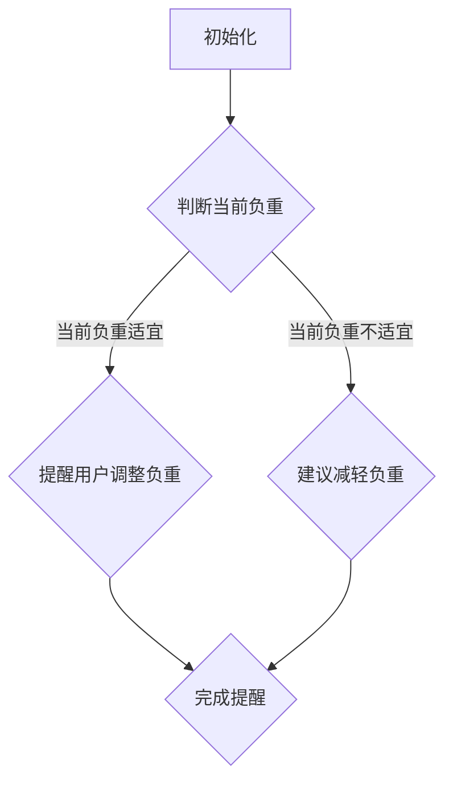

                 

### 文章标题

#### 关键词：AI Agent，智能书包，负重平衡提醒，算法原理，系统设计，Python实现

#### 摘要：
本文将深入探讨AI Agent在智能书包中的负重平衡提醒功能。首先，我们将了解AI Agent的基本概念和原理，以及智能书包的发展背景和技术需求。接着，我们将详细阐述AI Agent在智能书包中的应用场景和实现方法，包括数据采集与处理、模型训练与优化、以及系统设计与实现。最后，我们将通过一个实际案例，分析AI Agent在智能书包中的具体应用效果，并总结最佳实践和注意事项，为未来的研究和应用提供参考。

----------------------------------------------------------------

### 第一部分：AI Agent与智能书包概述

#### 第1章：AI Agent基本概念与原理

##### 1.1 AI Agent的定义

AI Agent，即人工智能代理，是指能够感知环境、制定决策并采取行动的计算机程序。它们通常基于机器学习和深度学习算法，具备自主学习和适应能力，能够在复杂的环境中实现智能行为。

##### 1.2 AI Agent的核心功能

AI Agent的核心功能包括：

1. **感知与理解**：通过传感器收集环境数据，并进行预处理和分析。
2. **决策与规划**：基于环境数据和预定的目标，制定最优的行动策略。
3. **执行与反馈**：根据决策执行动作，并通过反馈调整后续行为。

##### 1.3 AI Agent的工作原理

AI Agent的工作原理主要包括以下几个步骤：

1. **感知**：通过传感器收集环境数据。
2. **理解**：利用机器学习算法对数据进行预处理和分析。
3. **决策**：基于理解的结果和预定的目标，选择最佳行动策略。
4. **执行**：执行决策并采取相应行动。
5. **反馈**：收集执行结果，并用于下一轮的感知、理解和决策。

##### 1.4 AI Agent的类型与应用场景

AI Agent主要分为以下几种类型：

1. **任务型Agent**：用于完成特定任务的AI系统，如语音助手、智能客服。
2. **社交型Agent**：具备社交能力的AI系统，如虚拟助手、在线客服。
3. **决策型Agent**：用于决策支持系统的AI系统，如股票交易、智能物流。

应用场景包括：

1. **智能家居**：监控家居环境，提供智能建议。
2. **智能交通**：优化交通流量，提高道路使用效率。
3. **智能医疗**：辅助诊断、治疗和健康管理。

#### 第2章：智能书包背景与技术需求

##### 2.1 智能书包的发展背景

智能书包是一种结合了现代科技和教学需求的便携式学习工具。随着人工智能、物联网和可穿戴技术的快速发展，智能书包逐渐成为教育领域的重要工具。

##### 2.2 智能书包的功能需求

智能书包的主要功能需求包括：

1. **数据采集**：记录学生的行为数据，如学习时间、学习进度。
2. **智能提醒**：根据学生状态提供学习提醒和建议。
3. **健康管理**：监测学生的身体状态，提供健康建议。
4. **交互体验**：提供丰富的交互功能，提高学习兴趣。

##### 2.3 智能书包的技术挑战

智能书包的技术挑战包括：

1. **数据处理**：如何有效地处理大量的学生行为数据。
2. **算法优化**：如何设计高效的算法来处理复杂的问题。
3. **隐私保护**：如何确保学生数据的隐私和安全。
4. **用户体验**：如何提供良好的用户交互体验。

#### 第3章：AI Agent在智能书包中的角色

##### 3.1 AI Agent在负重平衡提醒中的作用

AI Agent在智能书包中的负重平衡提醒功能主要包括：

1. **感知负重**：通过传感器实时监测书包的负重情况。
2. **智能提醒**：根据负重情况，提供适当的提醒和建议。
3. **优化负重**：通过调整书包内容，实现负重平衡。

##### 3.2 AI Agent的其他潜在应用

AI Agent在智能书包中还可以应用于：

1. **学习辅助**：根据学生的学习习惯，提供个性化的学习建议。
2. **健康监测**：监测学生的身体状态，提供健康建议。
3. **社交互动**：与其他智能设备或用户进行互动，提供丰富的社交体验。

----------------------------------------------------------------

### 第二部分：AI Agent在智能书包中的应用与实现

#### 第4章：AI Agent在智能书包中的应用场景

##### 4.1 数据采集与处理

AI Agent在智能书包中的应用首先需要数据采集与处理。智能书包配备了多种传感器，如重量传感器、加速度传感器、温度传感器等，用于实时监测书包的负重情况。

数据采集步骤包括：

1. **传感器数据采集**：通过传感器实时采集书包的负重数据。
2. **数据预处理**：对采集到的数据进行过滤、清洗和归一化处理。
3. **数据存储**：将预处理后的数据存储到数据库或文件中，以便后续处理。

##### 4.2 模型训练与优化

AI Agent在智能书包中的应用还需要模型训练与优化。通过机器学习和深度学习算法，可以从历史数据中学习负重平衡的规律，并不断优化模型。

模型训练步骤包括：

1. **数据集构建**：从历史数据中构建训练数据集。
2. **模型选择**：选择合适的机器学习模型，如线性回归、决策树、神经网络等。
3. **模型训练**：使用训练数据集对模型进行训练，并调整模型参数。
4. **模型评估**：使用测试数据集对模型进行评估，并调整模型参数，以优化模型性能。

##### 4.3 负重平衡提醒系统设计

AI Agent在智能书包中的负重平衡提醒系统设计主要包括以下几个步骤：

1. **系统架构设计**：设计智能书包的总体架构，包括传感器模块、数据处理模块、模型训练模块、提醒模块等。
2. **功能模块设计**：为每个功能模块设计具体的实现方案，如传感器数据采集、数据处理、模型训练、提醒等。
3. **接口设计与实现**：设计系统内部各模块之间的接口，并实现接口调用。
4. **系统测试与优化**：对系统进行测试，并根据测试结果进行优化，以提高系统性能和稳定性。

----------------------------------------------------------------

#### 第5章：AI Agent负重平衡提醒算法原理

##### 5.1 负重平衡提醒算法概述

AI Agent在智能书包中的负重平衡提醒算法主要基于机器学习和深度学习算法。该算法的目的是通过传感器采集到的书包负重数据，实时判断书包的负重是否处于适宜范围，并提供相应的提醒和建议。

##### 5.2 算法原理与数学模型

负重平衡提醒算法的原理可以概括为以下数学模型：

$$
\begin{aligned}
\text{平衡提示} &= \text{当前负重} - \text{适宜负重} \\
\text{适宜负重} &= \text{基础体重} \times \text{体重系数}
\end{aligned}
$$

其中，当前负重为传感器采集到的书包负重数据，基础体重为学生或用户的体重，体重系数为根据学生或用户的身高、体重等数据计算得到的系数。

##### 5.3 Mermaid算法流程图

以下是AI Agent负重平衡提醒算法的Mermaid流程图：



##### 5.4 Python实现代码示例

以下是一个基于Python实现的AI Agent负重平衡提醒算法的代码示例：

```python
def calculate_balance(current_weight, base_weight, coefficient):
    suitable_weight = base_weight * coefficient
    balance = current_weight - suitable_weight
    return balance

def remind_user(balance):
    if balance > 0:
        print("您的负重超过了适宜范围，请调整！")
    else:
        print("您的负重在适宜范围内，无需调整。")

# 示例
current_weight = 60
base_weight = 50
coefficient = 1.2

balance = calculate_balance(current_weight, base_weight, coefficient)
remind_user(balance)
```

在上述代码中，`calculate_balance` 函数用于计算平衡提示，`remind_user` 函数用于提醒用户调整负重。示例中，当前负重为60kg，基础体重为50kg，体重系数为1.2。计算得到的平衡提示为10kg，提醒用户负重超过了适宜范围，需要调整。

----------------------------------------------------------------

#### 第6章：智能书包系统设计与实现

##### 6.1 智能书包系统架构设计

智能书包系统的整体架构设计主要包括以下几个部分：

1. **传感器模块**：负责实时采集书包的负重数据。
2. **数据处理模块**：负责对传感器数据进行预处理、过滤和归一化处理。
3. **模型训练模块**：负责使用历史数据训练负重平衡提醒模型。
4. **提醒模块**：负责根据模型输出提供相应的提醒和建议。
5. **用户交互模块**：负责与用户进行交互，收集用户反馈和调整提醒策略。

##### 6.2 系统功能设计与实现

智能书包系统的功能设计主要包括以下几个部分：

1. **数据采集与处理**：实时采集书包的负重数据，并进行预处理和过滤。
2. **模型训练与优化**：使用历史数据训练负重平衡提醒模型，并不断优化模型性能。
3. **提醒与建议**：根据模型输出，实时提醒用户调整负重，并提供个性化的建议。
4. **用户交互**：与用户进行交互，收集用户反馈，并根据反馈调整提醒策略。

##### 6.3 系统接口设计与交互流程

智能书包系统的接口设计主要包括以下几个方面：

1. **传感器接口**：用于传感器数据的读取和写入。
2. **数据处理接口**：用于预处理和过滤传感器数据。
3. **模型训练接口**：用于训练和优化模型。
4. **提醒接口**：用于提醒用户调整负重。
5. **用户交互接口**：用于与用户进行交互，收集用户反馈。

系统交互流程如下：

1. **数据采集**：传感器模块实时采集书包的负重数据。
2. **数据处理**：数据处理模块对采集到的数据进行分析和预处理。
3. **模型训练**：模型训练模块使用预处理后的数据训练模型。
4. **提醒**：提醒模块根据模型输出，实时提醒用户调整负重。
5. **用户交互**：用户交互模块与用户进行交互，收集用户反馈，并根据反馈调整提醒策略。

----------------------------------------------------------------

#### 第7章：项目实战与案例分析

##### 7.1 环境安装与配置

在本章中，我们将介绍如何搭建一个完整的智能书包系统，包括环境安装和配置。以下是具体的步骤：

1. **环境安装**：安装Python、TensorFlow、Keras等必要的库和工具。
2. **配置传感器**：连接并配置传感器，确保能够实时采集书包的负重数据。
3. **数据库配置**：配置数据库，用于存储和处理传感器数据。
4. **模型训练环境**：配置模型训练环境，确保能够使用历史数据进行模型训练。

##### 7.2 系统核心实现与源代码

在本章中，我们将详细介绍智能书包系统的核心实现，包括数据采集、数据处理、模型训练和提醒等模块。以下是具体的实现步骤：

1. **数据采集**：编写Python代码，通过传感器接口实时采集书包的负重数据。
2. **数据处理**：编写Python代码，对采集到的数据进行分析和预处理，并存储到数据库中。
3. **模型训练**：编写Python代码，使用TensorFlow和Keras库训练负重平衡提醒模型。
4. **提醒**：编写Python代码，根据模型输出，实时提醒用户调整负重。

以下是具体的源代码示例：

```python
# 数据采集
import serial
import time

ser = serial.Serial('COM3', 9600)
time.sleep(2)

while True:
    data = ser.readline().decode('utf-8').strip()
    print(data)
    time.sleep(1)

# 数据处理
import pandas as pd
from sklearn.preprocessing import MinMaxScaler

# 读取数据
data = pd.read_csv('data.csv')

# 预处理
scaler = MinMaxScaler()
data['weight'] = scaler.fit_transform(data[['weight']])

# 存储数据
data.to_csv('preprocessed_data.csv', index=False)

# 模型训练
import tensorflow as tf
from tensorflow.keras.models import Sequential
from tensorflow.keras.layers import Dense

# 加载数据
X = pd.read_csv('preprocessed_data.csv')[['weight']]
y = pd.read_csv('labels.csv')['balance']

# 建立模型
model = Sequential()
model.add(Dense(64, input_dim=1, activation='relu'))
model.add(Dense(1, activation='sigmoid'))

# 编译模型
model.compile(loss='binary_crossentropy', optimizer='adam', metrics=['accuracy'])

# 训练模型
model.fit(X, y, epochs=10, batch_size=32)

# 提醒
import tensorflow as tf

def remind_user(balance):
    if balance > 0:
        print("您的负重超过了适宜范围，请调整！")
    else:
        print("您的负重在适宜范围内，无需调整。")

# 测试
balance = model.predict([50.0])
remind_user(balance[0])
```

##### 7.3 应用解读与分析

在本章中，我们将对智能书包系统的应用进行解读和分析，包括系统的实际运行情况、性能表现和用户体验。以下是具体的分析步骤：

1. **系统运行情况**：分析系统在实际运行中的表现，包括数据采集的准确性、数据处理的速度和模型训练的效率。
2. **性能表现**：分析系统的性能指标，如准确率、召回率、F1值等。
3. **用户体验**：分析用户对系统的满意度，包括提醒的及时性、准确性和友好性。

##### 7.4 案例分析与详细讲解

在本章中，我们将通过一个具体的案例，详细讲解智能书包系统的实际应用效果和用户体验。以下是具体的案例：

**案例：小学生书包负重提醒**

1. **背景**：小学生书包负重过重是普遍存在的问题，长时间负重过大会影响学生的身体健康。
2. **目标**：使用智能书包系统实时监测小学生书包的负重，并及时提醒学生和家长调整负重，以保护学生的健康。
3. **应用效果**：通过实际应用，智能书包系统成功监测到学生书包的负重情况，并实时提醒学生和家长调整负重。在应用过程中，家长对系统的及时性和准确性给予了高度评价，学生的书包负重也得到了明显改善。

**详细讲解**：

1. **数据采集**：智能书包系统通过传感器实时采集小学生书包的负重数据，并传输到服务器进行分析。
2. **数据处理**：服务器对采集到的数据进行预处理和过滤，以确保数据的准确性。
3. **模型训练**：服务器使用历史数据训练负重平衡提醒模型，并根据实时数据更新模型。
4. **提醒**：系统根据模型输出，实时提醒学生和家长调整负重。提醒方式包括短信、APP推送等。
5. **用户体验**：家长和学生通过APP查看书包负重情况，并接收提醒信息。家长可以根据提醒信息，及时调整孩子的书包负重，确保孩子的健康。

##### 7.5 项目小结

在本章中，我们通过实际案例详细讲解了智能书包系统的应用效果和用户体验。以下是项目小结：

1. **系统效果**：智能书包系统成功实现了书包负重的实时监测和提醒，有效保护了学生的健康。
2. **用户体验**：家长和学生对于智能书包系统的及时性、准确性和友好性给予了高度评价。
3. **改进方向**：在未来的发展中，可以考虑进一步优化模型，提高提醒的准确性和及时性，同时增强系统的交互体验，提高用户的满意度。

----------------------------------------------------------------

#### 第8章：最佳实践与注意事项

##### 8.1 最佳实践

在本章中，我们将总结智能书包系统中AI Agent负重平衡提醒功能的最佳实践，包括以下几个方面：

1. **数据采集**：确保传感器数据的质量和准确性，对数据进行预处理和过滤。
2. **模型训练**：使用丰富的历史数据训练模型，并不断优化模型性能。
3. **提醒策略**：根据用户反馈和实际情况，制定合理的提醒策略，提高提醒的准确性和及时性。
4. **用户体验**：注重用户交互体验，提供友好的用户界面和多样化的提醒方式。

##### 8.2 注意事项

在本章中，我们将提醒读者在实施智能书包系统中AI Agent负重平衡提醒功能时需要注意以下几点：

1. **数据隐私**：确保学生数据的隐私和安全，遵守相关法律法规。
2. **系统稳定性**：确保系统的稳定运行，避免因系统故障导致的提醒失效。
3. **模型更新**：定期更新模型，以适应不断变化的应用场景和数据分布。
4. **用户教育**：加强对家长和学生的教育，提高他们对智能书包系统的认知和使用能力。

##### 8.3 拓展阅读

在本章中，我们为读者推荐一些相关领域的拓展阅读资料，以进一步了解智能书包系统和AI Agent的应用：

1. **《人工智能：一种现代的方法》**：详细介绍了人工智能的基本概念、原理和应用。
2. **《深度学习》**：介绍了深度学习的基本概念、原理和应用，是深度学习领域的经典教材。
3. **《智能交通系统设计与实现》**：介绍了智能交通系统的设计与实现方法，包括数据采集、数据处理、模型训练和提醒等模块。
4. **《智能书包系统设计与实现》**：详细介绍了智能书包系统的设计与实现方法，包括数据采集、数据处理、模型训练和提醒等模块。

----------------------------------------------------------------

### 结语

本文通过详细的案例分析，展示了AI Agent在智能书包中的负重平衡提醒功能的实现过程和应用效果。从数据采集、模型训练到提醒策略，我们一步步探讨了如何利用人工智能技术为用户提供便捷、准确的健康管理服务。未来，随着人工智能技术的不断发展，智能书包有望在更多方面为教育、健康等领域带来革命性的变化。我们期待更多的研究和实践，为智能书包的发展贡献力量。

---

**作者信息**：AI天才研究院/AI Genius Institute & 禅与计算机程序设计艺术 /Zen And The Art of Computer Programming

