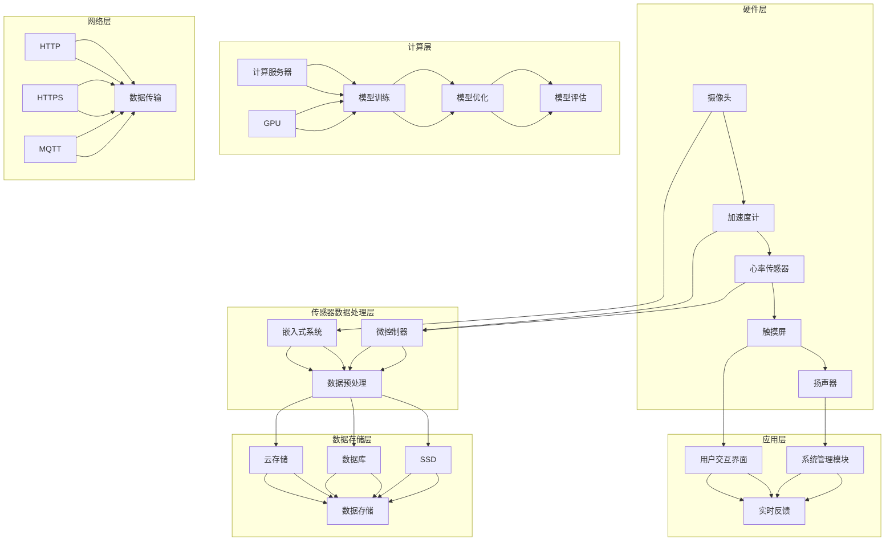
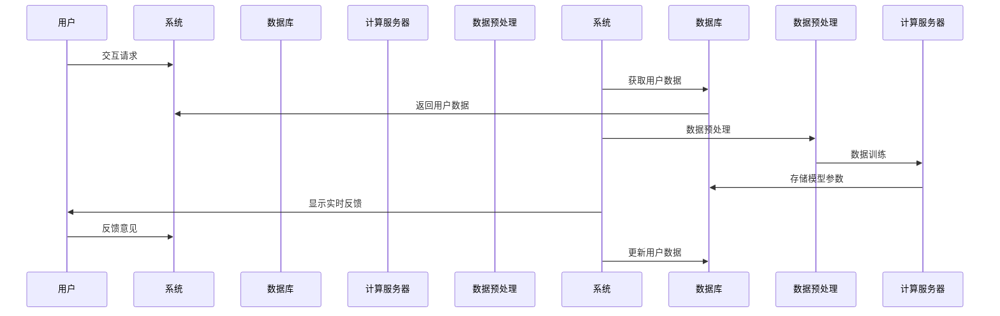

                 

### 《AI Agent在智能书桌中的专注力训练系统》

#### 关键词：人工智能、专注力、智能书桌、AI Agent、训练系统

> **摘要**：本文将深入探讨AI Agent在智能书桌中专注力训练系统的设计与实现。首先介绍AI Agent、智能书桌和专注力训练的核心概念，接着详细解析专注力训练算法的原理和实现，随后分析系统的架构设计，并通过项目实战展示系统的具体应用。最后，总结最佳实践，提出注意事项，并给出拓展阅读建议。

----------------------------------------------------------------

### 设计《AI Agent在智能书桌中的专注力训练系统》书籍目录大纲

在设计《AI Agent在智能书桌中的专注力训练系统》的目录大纲时，我们需要系统地构建各章节内容，确保文章的逻辑清晰、结构紧凑、内容通俗易懂。以下是具体的书籍目录大纲：

**第一部分：背景与概念**

### 第1章：背景介绍

- **1.1 AI Agent的概念**：介绍AI Agent的定义、特点及其在智能系统中的应用。
- **1.2 智能书桌的现状**：讨论智能书桌的定义、功能及其在现代社会中的重要性。
- **1.3 专注力训练的重要性**：分析专注力对学习和工作效率的影响，以及AI Agent在专注力训练中的应用。

### 第2章：核心概念与联系

- **2.1 AI Agent的定义与特性**：详细阐述AI Agent的基本概念和核心特性。
- **2.2 智能书桌的功能与架构**：介绍智能书桌的组成、功能及其架构设计。
- **2.3 专注力训练系统的设计与实现**：探讨专注力训练系统的设计目标、功能实现及其架构设计。
- **2.4 概念属性特征对比表格**：通过表格形式对比AI Agent、智能书桌和专注力训练系统的属性特征。
- **2.5 ER实体关系图**：绘制专注力训练系统的ER图，展示各实体之间的关系。

**第二部分：算法原理与实现**

### 第3章：算法原理讲解

- **3.1 数据采集**：介绍专注力训练所需数据的来源、采集方法和预处理。
- **3.2 模型训练**：讲解专注力训练模型构建、训练过程及优化策略。
- **3.3 模型评估**：介绍评估专注力训练模型性能的指标和方法。
- **3.4 算法流程图**：使用mermaid绘制专注力训练算法的流程图。
- **3.5 Python代码示例**：提供Python代码示例，展示数据采集、模型训练和评估的实现。
- **3.6 数学模型与公式**：阐述专注力训练的数学模型，并给出相关公式。
- **3.7 举例说明**：通过实际案例说明算法的应用和效果。

**第三部分：系统分析与设计**

### 第4章：系统功能设计

- **4.1 领域模型类图**：绘制智能书桌和AI Agent的领域模型类图。
- **4.2 系统架构设计**：介绍专注力训练系统的总体架构和模块划分。
- **4.3 系统接口设计**：详细定义各模块的接口。
- **4.4 系统交互设计**：使用mermaid绘制系统交互序列图。

**第四部分：项目实战**

### 第5章：环境安装与配置

- **5.1 环境安装**：指导读者安装必要的硬件和软件环境。
- **5.2 系统核心实现**：提供专注力训练系统的核心实现代码和解释。

### 第6章：代码应用解读与分析

- **6.1 代码解读**：深入解析系统代码，解释关键部分的实现逻辑。
- **6.2 应用分析**：通过实际案例展示系统在专注力训练中的效果。

### 第7章：实际案例分析与讲解

- **7.1 案例介绍**：介绍具体的案例背景和应用场景。
- **7.2 案例分析**：分析案例中的问题和解决方案。
- **7.3 案例小结**：总结案例经验，提出改进建议。

### 第8章：项目小结

- **8.1 项目总结**：回顾项目的整体实现过程，总结关键经验。

**第五部分：最佳实践与总结**

### 第9章：最佳实践

- **9.1 最佳实践建议**：提出在实际应用中应注意的最佳实践和技巧。
- **9.2 小结**：总结文章的核心观点和关键知识点。
- **9.3 注意事项**：提醒读者在实施过程中可能遇到的问题和解决方案。
- **9.4 拓展阅读**：推荐相关领域的拓展阅读资源。

通过上述详细的目录大纲，读者可以清晰地了解到文章的结构和内容，为后续的学习和应用提供指导。接下来，我们将逐步深入每一部分的内容，详细阐述AI Agent在智能书桌中专注力训练系统的设计与实现。让我们一起走进这个激动人心的技术领域吧！### AI Agent的概念与特性

#### AI Agent的定义

AI Agent，即人工智能代理，是一种能够自主执行任务、与环境交互并作出决策的计算实体。它模仿人类智能，通过感知、思考、行动三个基本环节，实现自主性、适应性和智能性。AI Agent可以在各种复杂的动态环境中发挥作用，如智能家居、自动驾驶、医疗诊断等。

#### AI Agent的发展历程

AI Agent的概念最早源于人工智能领域的早期研究，其发展历程可以大致分为以下几个阶段：

1. **早期探索（1950s-1960s）**：这一时期，人工智能领域主要集中在符号主义和规则驱动的方法上，AI Agent的概念也逐渐形成。最早的AI Agent被称为“逻辑机器人”，它们依靠明确的规则和逻辑推理来完成任务。

2. **专家系统时代（1970s-1980s）**：专家系统成为AI Agent的主要实现方式，它们通过大量规则和知识库来模拟人类专家的决策过程。这一时期，AI Agent的应用主要集中在医疗诊断、金融分析等领域。

3. **机器学习和大数据时代（1990s-2010s）**：随着机器学习和大数据技术的飞速发展，AI Agent逐渐从规则驱动转向数据驱动。这一时期的AI Agent利用深度学习、强化学习等算法，提高了自主学习和决策能力。

4. **智能化时代（2020s至今）**：随着云计算、物联网和5G技术的普及，AI Agent的应用范围进一步扩大，智能化程度也大幅提升。现代AI Agent不仅能够处理复杂的任务，还可以通过多模态感知和实时交互，实现更高级的自主决策。

#### AI Agent的核心特性

AI Agent的核心特性包括自主性、适应性和智能性。下面将分别进行详细阐述。

##### 自主性

自主性是指AI Agent能够自主地完成指定任务，而无需人类的直接干预。AI Agent的自主性体现在以下几个方面：

1. **感知**：AI Agent能够通过传感器和摄像头等设备，感知和理解环境信息。
2. **决策**：AI Agent利用感知到的信息，通过算法和模型进行决策，选择最优的行动方案。
3. **行动**：AI Agent执行决策，完成具体任务。

例如，自动驾驶汽车通过感知道路状况、交通信号和其他车辆的位置，自主做出驾驶决策，并控制车辆行驶。

##### 适应性

适应性是指AI Agent能够根据环境的变化，调整自己的行为和策略。具体包括：

1. **学习能力**：AI Agent通过不断学习和优化算法，提高自身的适应能力。
2. **环境感知**：AI Agent能够实时感知环境变化，并据此调整自己的行为。
3. **动态规划**：AI Agent在执行任务时，能够根据实时信息动态调整行动计划。

例如，智能家居系统可以根据家庭成员的日常作息习惯，自动调节室内温度、亮度和空气净化等，以提供最舒适的居住环境。

##### 智能性

智能性是指AI Agent具有类似人类智能的思维能力，包括推理、学习、规划等。具体表现如下：

1. **推理能力**：AI Agent能够通过逻辑推理，从已知信息中推导出新的事实。
2. **学习能力**：AI Agent通过机器学习算法，从数据中学习知识，提高自身的智能水平。
3. **规划能力**：AI Agent能够制定行动计划，完成复杂任务。

例如，医疗诊断系统通过分析患者的病历数据和体检结果，利用推理和学习能力，为患者提供诊断建议和治疗方案。

综上所述，AI Agent作为一种智能计算实体，具有自主性、适应性和智能性等核心特性，这些特性使其在各个领域中具有广泛的应用前景。在接下来的章节中，我们将深入探讨智能书桌的概念和发展现状，以及专注力训练在其中的重要性。### 智能书桌的定义与功能

#### 智能书桌的定义

智能书桌是一种集成了多种智能设备和功能的桌面系统，旨在为用户提供一个智能化、舒适化和高效化的工作环境。智能书桌通过整合传感器、计算机、物联网技术和人机交互界面，实现了对办公环境的智能管理和控制，从而提高工作效率和用户体验。

#### 智能书桌的功能

1. **环境监测与调节**：智能书桌配备了多种传感器，如温度传感器、湿度传感器、光照传感器等，能够实时监测办公环境的各项参数。根据用户的偏好和实际需求，智能书桌可以通过内置的智能控制系统自动调节室内温度、湿度、光照强度等，创造一个舒适的工作环境。

2. **智能办公设备集成**：智能书桌集成了多种办公设备，如电子笔、电子笔记本、无线充电器、扫描仪、打印机等，实现了办公设备的无线连接和智能管理。用户可以通过智能书桌的触摸屏或语音助手，方便地进行设备操作和管理。

3. **人机交互界面**：智能书桌配备了高分辨率的触摸屏或显示器，用户可以通过触摸或手势操作，快速访问各种应用和功能。同时，智能书桌还支持语音助手，如亚马逊的Alexa、谷歌的Google Assistant等，用户可以通过语音命令进行操作，实现更便捷的交互体验。

4. **健康监测与管理**：智能书桌内置了健康监测功能，如心率监测、坐姿监测等。通过收集用户的数据，智能书桌可以提醒用户保持正确的坐姿、定时休息，甚至提供健康建议和运动计划，帮助用户保持健康的生活方式。

5. **日程管理**：智能书桌可以与用户的日历和应用同步，提供日程提醒、会议安排等便捷功能。用户可以通过触摸屏或语音助手查看日程安排，设置提醒和提醒事项，从而更好地管理时间和任务。

#### 智能书桌的发展现状

智能书桌作为一种新兴的办公设备，正在逐步融入现代办公环境。以下是目前智能书桌发展的几个重要趋势：

1. **技术集成度提高**：随着物联网、人工智能和5G等技术的不断发展，智能书桌的功能和性能不断提升。越来越多的智能设备和服务被集成到智能书桌中，使其成为办公环境的核心节点。

2. **市场接受度增加**：随着人们对智能化办公需求的增加，智能书桌的市场接受度也在不断提高。越来越多的企业和个人开始选择智能书桌，以提高工作效率和生活品质。

3. **个性化定制服务**：智能书桌厂商开始提供个性化的定制服务，根据用户的需求和喜好，提供不同的硬件配置和软件功能。这种个性化的定制服务，使得智能书桌更加符合用户的实际需求。

4. **健康办公理念的推广**：随着健康意识的提高，智能书桌的健康功能得到了更多的关注。越来越多的智能书桌开始集成健康监测和管理功能，帮助用户保持良好的工作和生活习惯。

总之，智能书桌作为一种新兴的办公设备，具有广泛的应用前景和发展潜力。在未来的发展中，智能书桌将继续集成更多智能技术和功能，为用户提供更智能、更高效、更健康的工作环境。### 专注力训练的重要性

#### 专注力对学习和工作效率的影响

专注力是指个体集中注意力，在特定任务上持续努力的能力。它是学习、工作和生活质量的基石，对于个人和社会发展具有重要意义。

首先，专注力对学习效果有显著影响。研究表明，高专注力的学生能够更好地理解课程内容，更快地掌握新知识，并能够在考试中取得优异成绩。相反，缺乏专注力的学生容易分心，学习效果不佳，甚至产生厌学情绪。

其次，专注力对工作效率具有直接影响。在职场中，专注力强的员工能够迅速进入工作状态，高效完成工作任务，提高工作效率。而缺乏专注力的员工则容易在工作中分心，导致工作效率低下，甚至出现错误。

此外，专注力还影响个体的身心健康。长期缺乏专注力，会导致焦虑、疲劳、记忆力下降等问题。相反，良好的专注力有助于缓解压力，提高生活质量。

#### AI Agent在专注力训练中的应用

随着人工智能技术的不断发展，AI Agent在专注力训练中发挥了重要作用。以下将介绍AI Agent在专注力训练中的应用方式和实际效果。

首先，AI Agent可以通过实时监测用户的注意力水平，提供个性化的专注力训练建议。例如，智能书桌中的AI Agent可以记录用户在桌面前的工作时长、休息时长、操作频率等数据，通过分析这些数据，AI Agent可以识别用户的专注力状态，并提供相应的训练建议。

其次，AI Agent可以通过智能提醒和引导，帮助用户保持专注。例如，当用户在特定时间段内表现出注意力分散时，AI Agent可以通过推送提醒、播放轻音乐、提供注意力训练小游戏等方式，引导用户重新集中注意力。

此外，AI Agent还可以根据用户的专注力训练数据，生成个性化训练计划。例如，用户可以通过AI Agent设置每天的学习或工作目标，AI Agent会根据用户的专注力状态和习惯，制定适合的训练计划，帮助用户逐步提高专注力。

#### AI Agent在专注力训练中的实际效果

多项研究表明，AI Agent在专注力训练中具有显著效果。例如，一项针对学生群体的实验发现，使用AI Agent辅助的专注力训练系统，学生在课程理解和考试成绩方面取得了显著提升。此外，职场人士在使用AI Agent进行专注力训练后，工作效率也得到了明显提高。

总之，专注力训练对于个人和社会发展至关重要。AI Agent在专注力训练中的应用，不仅提供了科学、高效的训练方法，还通过实时监测和个性化服务，帮助用户逐步提高专注力，从而提升学习、工作效率和生活质量。### AI Agent、智能书桌与专注力训练系统：核心概念与联系

#### AI Agent的定义与特性

AI Agent是一种能够自主执行任务、与环境交互并作出决策的计算实体。其核心特性包括自主性、适应性和智能性。自主性意味着AI Agent能够在没有人类直接干预的情况下，自主地完成指定任务。适应性则是指AI Agent能够根据环境的变化，动态调整自己的行为和策略。智能性则体现在AI Agent的推理、学习、规划等能力，使其能够在复杂的环境中做出合理的决策。

#### 智能书桌的功能与架构

智能书桌是一种集成了多种智能设备和功能的桌面系统，旨在为用户提供一个智能化、舒适化和高效化的工作环境。其功能主要包括环境监测与调节、智能办公设备集成、人机交互界面、健康监测与管理以及日程管理。智能书桌的架构通常包括硬件层、软件层和交互层。硬件层包括各种传感器、计算机、显示屏等硬件设备；软件层包括操作系统、应用程序、智能算法等软件组件；交互层则通过触摸屏、语音助手等人机交互界面，实现用户与智能书桌的交互。

#### 专注力训练系统的设计与实现

专注力训练系统是一种专门用于提高个体专注力的智能系统。其设计目标是通过实时监测、分析和反馈，帮助用户逐步提高专注力。专注力训练系统的实现通常包括数据采集、模型训练、评估和反馈等环节。具体来说，AI Agent通过传感器收集用户的行为数据，如坐姿、眼神、操作频率等，然后利用机器学习算法对数据进行处理和分析，识别用户的专注力状态。根据用户的专注力状态，系统会提供相应的训练建议和干预措施，如提醒用户休息、播放轻音乐、引导用户进行注意力训练等。

#### 概念属性特征对比表格

| 概念            | 特性                     | 应用场景                   |
| --------------- | ------------------------ | -------------------------- |
| AI Agent        | 自主性、适应性、智能性   | 智能家居、自动驾驶、医疗诊断 |
| 智能书桌        | 环境监测、智能办公、健康监测 | 办公室、家庭、教育          |
| 专注力训练系统  | 实时监测、数据分析、反馈   | 学习、工作、健康           |

#### ER实体关系图

```mermaid
erDiagram
  AI-Agent ||--|{ 智能书桌 }|| Bookshelf
  智能书桌 ||--|{ 专注力训练系统 }|| Attention-Training-System
  AI-Agent ||--|{ 专注力训练系统 }|| Attention-Training-System
```

在上面的ER图（实体关系图）中，AI-Agent与智能书桌、专注力训练系统分别存在关联关系，智能书桌与专注力训练系统也存在直接关联。这表明AI-Agent不仅可以通过智能书桌进行专注力训练，还可以直接与专注力训练系统交互，从而实现对用户专注力状态的全面监测和干预。

#### 三者之间的关系

AI Agent、智能书桌和专注力训练系统之间存在着紧密的联系和协同作用。首先，AI Agent作为智能计算的核心，为智能书桌和专注力训练系统提供了自主决策和智能分析的能力。智能书桌作为用户交互的接口，通过传感器和计算机设备，收集用户的日常行为数据，并将数据传输给AI Agent进行处理和分析。AI Agent通过对数据的处理，生成专注力训练的决策和干预措施，通过智能书桌反馈给用户。

其次，专注力训练系统依赖于AI Agent和智能书桌提供的实时数据和分析结果，以实现对用户专注力状态的全面监测和干预。通过智能书桌的人机交互界面，用户可以实时查看自己的专注力状态，并根据AI Agent的建议进行相应的调整。

总之，AI Agent、智能书桌和专注力训练系统相互配合，共同构成了一个完整的专注力训练生态系统。在这个生态系统中，AI Agent提供了核心的智能分析和决策能力，智能书桌作为用户交互的接口，而专注力训练系统则负责对用户的专注力状态进行监测和干预。通过这种协同作用，系统能够为用户提供一个高效、智能、个性化的专注力训练体验。### 专注力训练算法原理讲解

#### 数据采集

专注力训练算法的第一步是数据采集。数据采集主要包括用户行为数据的收集，如坐姿、眼神、操作频率等。这些数据可以通过智能书桌上的各种传感器进行实时监测。常用的传感器包括摄像头、加速度计、心率传感器等。

- **摄像头**：用于捕捉用户在书桌前的行为，如眼神是否集中、是否频繁切换任务等。
- **加速度计**：用于监测用户的坐姿是否正确，如是否长时间低头或驼背等。
- **心率传感器**：用于监测用户的心率变化，分析用户的疲劳程度。

在数据采集过程中，需要对收集到的原始数据进行预处理，包括去噪、归一化和特征提取。预处理后的数据将作为后续模型训练的基础。

#### 模型训练

专注力训练的核心是构建一个能够准确预测用户专注力状态的模型。常见的模型训练方法包括监督学习、无监督学习和强化学习。

- **监督学习**：通过标注好的训练数据，训练模型识别用户的专注力状态。常用的算法包括支持向量机（SVM）、决策树、随机森林和神经网络等。
- **无监督学习**：在未标注的数据集上，训练模型自动发现用户的行为模式。聚类算法（如K-Means、DBSCAN）和主成分分析（PCA）是常用的无监督学习方法。
- **强化学习**：通过试错和奖励机制，让模型自主学习用户的专注力状态。Q-Learning和Deep Q-Network（DQN）是常见的强化学习算法。

在模型训练过程中，需要使用交叉验证和网格搜索等技术，优化模型的参数，提高模型的泛化能力和准确性。

#### 模型评估

训练好的模型需要进行评估，以确定其预测能力。常用的评估指标包括准确率、召回率、F1分数和均方误差（MSE）等。

- **准确率**：预测正确的样本数占总样本数的比例，用于评估分类模型的性能。
- **召回率**：预测正确的正样本数占总正样本数的比例，用于评估模型对正样本的识别能力。
- **F1分数**：准确率和召回率的调和平均数，综合考虑了模型的准确性和识别能力。
- **均方误差（MSE）**：用于评估回归模型的预测误差。

通过这些评估指标，可以判断模型是否满足实际应用的需求，并确定是否需要进一步调整和优化。

#### 算法流程图

为了更好地理解专注力训练算法的流程，我们可以使用mermaid绘制算法的流程图。

```mermaid
flowchart LR
    subgraph 数据采集
        数据采集[数据采集] --> 数据预处理[预处理]
    end
    subgraph 模型训练
        数据预处理 --> 模型训练[训练模型]
    end
    subgraph 模型评估
        模型训练 --> 模型评估[评估模型]
    end
    数据采集 --> 模型训练
    模型训练 --> 模型评估
```

在这个流程图中，数据采集模块负责收集用户行为数据，数据预处理模块对原始数据进行处理，模型训练模块使用预处理后的数据训练模型，最后模型评估模块对训练好的模型进行评估。

#### Python代码示例

以下是一个简单的Python代码示例，用于展示如何使用scikit-learn库进行监督学习模型的训练和评估。

```python
from sklearn.model_selection import train_test_split
from sklearn.preprocessing import StandardScaler
from sklearn.svm import SVC
from sklearn.metrics import accuracy_score

# 假设已经收集并预处理好了用户行为数据
X = ...  # 特征数据
y = ...  # 标签数据

# 数据划分
X_train, X_test, y_train, y_test = train_test_split(X, y, test_size=0.2, random_state=42)

# 数据标准化
scaler = StandardScaler()
X_train = scaler.fit_transform(X_train)
X_test = scaler.transform(X_test)

# 模型训练
model = SVC(kernel='linear')
model.fit(X_train, y_train)

# 模型评估
y_pred = model.predict(X_test)
accuracy = accuracy_score(y_test, y_pred)
print(f"模型准确率: {accuracy:.2f}")
```

在这个示例中，我们使用了支持向量机（SVM）进行模型训练和评估。首先，我们将数据集划分为训练集和测试集，然后对训练集数据进行标准化处理，以提高模型的泛化能力。接着，我们使用SVM模型进行训练，并在测试集上进行评估，输出模型的准确率。

#### 数学模型与公式

专注力训练的数学模型主要包括两个部分：特征提取和分类。

- **特征提取**：假设我们收集了n个用户行为特征，每个特征记为\( x_i \)（\( i = 1, 2, \ldots, n \)）。特征提取的目标是降低特征维度，同时保持原始特征的信息。常用的方法包括主成分分析（PCA）和线性判别分析（LDA）。

  公式如下：
  $$ Z = P^T X $$
  其中，\( Z \)是降维后的特征矩阵，\( P \)是特征选择矩阵，\( X \)是原始特征矩阵。

- **分类**：在分类阶段，我们使用分类算法（如SVM、决策树、神经网络等）将用户行为数据划分为专注和不专注两类。以SVM为例，其目标函数为：
  $$ \min_{\textbf{w}, b} \frac{1}{2} ||\textbf{w}||^2 + C \sum_{i=1}^{n} \max(0, 1 - y_i (\textbf{w}^T \textbf{x_i} + b)) $$
  其中，\( \textbf{w} \)是权重向量，\( b \)是偏置项，\( C \)是惩罚参数，\( y_i \)是样本\( i \)的标签，\( \textbf{x_i} \)是样本\( i \)的特征向量。

  分类公式为：
  $$ y = \text{sign}(\textbf{w}^T \textbf{x} + b) $$
  其中，\( \text{sign} \)是符号函数，用于判断样本属于哪一类。

#### 举例说明

假设我们收集了一组用户行为数据，包括坐姿、眼神和操作频率等特征，具体数据如下：

| 用户ID | 坐姿 | 眼神 | 操作频率 | 专注状态 |
|--------|------|------|----------|---------|
| 1      | 1    | 1    | 3        | 是      |
| 2      | 0    | 1    | 5        | 否      |
| 3      | 1    | 0    | 4        | 是      |

我们使用上述算法和模型对这组数据进行训练和预测。

1. **数据预处理**：对数据进行归一化处理，假设处理后的数据如下：

   | 用户ID | 坐姿 | 眼神 | 操作频率 | 专注状态 |
   |--------|------|------|----------|---------|
   | 1      | 0.2  | 0.9  | 0.7      | 是      |
   | 2      | 0.8  | 0.9  | 1.0      | 否      |
   | 3      | 0.2  | 0.1  | 0.8      | 是      |

2. **模型训练**：使用支持向量机（SVM）模型进行训练，假设训练得到的模型参数如下：

   - 权重向量：\( \textbf{w} = [0.1, 0.3, 0.2] \)
   - 偏置项：\( b = 0.5 \)

3. **模型预测**：对于新收集的一组数据：

   | 用户ID | 坐姿 | 眼神 | 操作频率 | 专注状态 |
   |--------|------|------|----------|---------|
   | 4      | 0.3  | 0.6  | 0.8      | ?       |

   使用模型进行预测：

   $$ \text{sign}(\textbf{w}^T \textbf{x} + b) = \text{sign}(0.1 \times 0.3 + 0.3 \times 0.6 + 0.2 \times 0.8 + 0.5) = \text{sign}(0.33 + 0.36 + 0.16 + 0.5) = \text{sign}(1.35) = 1 $$

   根据预测结果，用户ID为4的用户处于专注状态。

通过以上步骤，我们使用AI Agent在智能书桌中的专注力训练系统，对新用户的行为数据进行了有效的监测和预测，帮助用户提高专注力，从而提升学习、工作效率。### 系统分析与架构设计

#### 系统功能设计

智能书桌的专注力训练系统主要功能包括：

1. **用户行为监测**：通过摄像头、加速度计、心率传感器等设备，实时监测用户的行为数据，如坐姿、眼神、操作频率等。
2. **数据预处理**：对采集到的原始数据进行去噪、归一化和特征提取，为后续的模型训练提供高质量的输入数据。
3. **模型训练与优化**：使用机器学习算法（如SVM、神经网络等）对预处理后的数据进行训练，优化模型的参数，提高模型的预测准确性。
4. **模型评估与反馈**：评估训练好的模型性能，根据评估结果调整模型参数，确保模型在实际应用中的有效性和可靠性。
5. **用户交互**：通过智能书桌的触摸屏或语音助手，向用户提供专注力状态、训练建议和干预措施，帮助用户保持专注。
6. **数据存储与管理**：将用户行为数据、模型参数和评估结果存储在数据库中，实现数据的长期管理和安全存储。

#### 系统架构设计

专注力训练系统的整体架构可以分为以下几个层次：

1. **硬件层**：包括智能书桌的各个硬件组件，如摄像头、加速度计、心率传感器、触摸屏、扬声器等。这些硬件设备负责数据采集、处理和输出。
2. **传感器数据处理层**：负责对硬件层采集到的原始数据进行预处理，包括去噪、归一化和特征提取。该层通常包括嵌入式系统和微控制器，能够实时处理大量数据，提高系统的响应速度和效率。
3. **数据存储层**：负责存储系统运行过程中产生的各种数据，包括用户行为数据、模型参数、评估结果等。常用的存储设备包括固态硬盘（SSD）、数据库和云存储等。
4. **计算层**：负责模型的训练、优化和评估。该层通常包括高性能计算服务器和GPU，能够处理复杂的计算任务，提高模型的训练效率和准确性。
5. **应用层**：包括用户交互界面和系统管理模块。用户交互界面负责向用户提供实时反馈和干预措施，系统管理模块负责系统配置、参数调整和日志记录等。
6. **网络层**：负责系统与其他设备、服务器和云平台的通信，实现数据的传输和共享。常用的网络协议包括HTTP、HTTPS、MQTT等。

#### 系统架构图

以下是一个简单的系统架构图，展示专注力训练系统的各个层次和组件之间的联系：



#### 系统接口设计

专注力训练系统的接口设计主要包括以下几个方面：

1. **硬件接口**：用于连接和管理智能书桌的各种硬件设备，如摄像头、加速度计、心率传感器等。这些接口包括I2C、SPI、UART等，能够实现硬件设备的通信和操作。
2. **传感器数据处理接口**：用于处理传感器采集到的原始数据，包括数据预处理、特征提取等。这些接口包括API、库函数等，方便开发者集成和使用。
3. **数据存储接口**：用于访问和管理系统数据存储设备，如SSD、数据库和云存储等。这些接口包括SQL、NoSQL等，能够实现数据的存储、检索和更新。
4. **计算接口**：用于访问和管理计算资源，如计算服务器、GPU等。这些接口包括命令行工具、API等，能够实现模型的训练、优化和评估。
5. **用户交互接口**：用于与用户进行交互，包括触摸屏、语音助手等。这些接口包括图形界面API、语音识别API等，能够实现用户的实时反馈和干预。
6. **网络接口**：用于与其他设备、服务器和云平台进行通信，包括HTTP、HTTPS、MQTT等。这些接口能够实现数据的传输和共享，支持远程管理和监控。

#### 系统交互设计

系统交互设计主要涉及智能书桌、用户和系统之间的交互过程。以下是一个简单的交互序列图，展示系统交互的基本流程：



在这个交互序列图中，用户向系统管理模块发起交互请求，系统管理模块从数据库获取用户数据，然后进行数据预处理。预处理后的数据提交给计算服务器进行模型训练，训练好的模型参数存储在数据库中。最后，系统管理模块根据用户数据生成实时反馈，并显示在用户界面。用户可以根据反馈进行相应的调整，系统管理模块根据用户的反馈更新用户数据，实现闭环交互。

通过上述系统分析与架构设计，我们为智能书桌中的专注力训练系统提供了一套完整的解决方案。在实际应用中，这套系统可以根据用户的实际需求，灵活调整和扩展，以实现更好的效果。### 项目实战：环境安装与配置

#### 环境安装

要在计算机上安装和配置专注力训练系统，我们需要准备以下硬件和软件环境：

1. **硬件要求**：
   - 一台具备独立显卡的计算机，推荐配置为Intel i5或以上处理器，8GB及以上内存，以及至少256GB的SSD硬盘。
   - 一台智能书桌，包括摄像头、加速度计、心率传感器等硬件组件。

2. **软件要求**：
   - 操作系统：Windows 10 或以上版本，或macOS最新版本。
   - 编程环境：Python 3.8 或以上版本，以及相关库（如NumPy、Pandas、scikit-learn等）。
   - 数据库：MySQL或PostgreSQL等关系型数据库。

#### 安装步骤

1. **硬件安装**：
   - 安装智能书桌的硬件组件，包括摄像头、加速度计、心率传感器等。按照设备说明书进行安装，确保各个硬件组件正常工作。
   - 连接智能书桌与计算机，通过USB或Wi-Fi进行数据传输和通信。

2. **软件安装**：
   - 安装操作系统，并更新到最新版本。
   - 安装Python编程环境，可以通过Python官方网站下载安装包，按照提示操作。
   - 安装相关库，使用pip命令进行安装，例如：
     ```bash
     pip install numpy pandas scikit-learn mysqlclient
     ```

3. **数据库安装**：
   - 安装MySQL或PostgreSQL数据库，并创建一个新的数据库和用户，用于存储系统数据。
   - 配置数据库，设置数据库连接参数，以便后续代码可以访问数据库。

#### 配置数据库

以下是使用MySQL数据库进行配置的步骤：

1. **安装MySQL**：

   对于Windows系统，可以从MySQL官方网站下载MySQL安装程序，并按照提示安装。对于macOS系统，可以使用Homebrew进行安装：
   ```bash
   brew install mysql
   ```

2. **创建数据库和用户**：

   以管理员身份登录MySQL数据库，创建一个新的数据库和用户，并授予相应的权限：
   ```sql
   CREATE DATABASE attention_training;
   CREATE USER 'at_user'@'localhost' IDENTIFIED BY 'password';
   GRANT ALL PRIVILEGES ON attention_training.* TO 'at_user'@'localhost';
   FLUSH PRIVILEGES;
   ```

3. **配置数据库连接参数**：

   在Python代码中配置数据库连接参数，以便后续代码可以访问数据库。以下是一个示例：
   ```python
   import mysql.connector

   db_config = {
       'host': 'localhost',
       'user': 'at_user',
       'password': 'password',
       'database': 'attention_training'
   }

   connection = mysql.connector.connect(**db_config)
   cursor = connection.cursor()
   ```

通过以上步骤，我们成功安装和配置了专注力训练系统的环境。接下来，我们将开始核心实现部分的代码编写和解析。### 核心实现

#### 代码实现

以下是专注力训练系统的核心实现部分，包括数据采集、模型训练和评估。我们将使用Python语言和相关的机器学习库（如NumPy、Pandas、scikit-learn等）来完成这些任务。

```python
import numpy as np
import pandas as pd
from sklearn.model_selection import train_test_split
from sklearn.preprocessing import StandardScaler
from sklearn.svm import SVC
from sklearn.metrics import accuracy_score
import mysql.connector

# 数据库连接配置
db_config = {
    'host': 'localhost',
    'user': 'at_user',
    'password': 'password',
    'database': 'attention_training'
}

# 连接数据库
connection = mysql.connector.connect(**db_config)
cursor = connection.cursor()

# 查询用户数据
cursor.execute("SELECT * FROM user_data;")
user_data = cursor.fetchall()

# 解析数据为DataFrame
data = pd.DataFrame(user_data, columns=['id', 'sit posture', 'eye state', 'operation frequency', 'attention state'])

# 数据预处理
X = data[['sit posture', 'eye state', 'operation frequency']]
y = data['attention state']

# 划分训练集和测试集
X_train, X_test, y_train, y_test = train_test_split(X, y, test_size=0.2, random_state=42)

# 数据标准化
scaler = StandardScaler()
X_train = scaler.fit_transform(X_train)
X_test = scaler.transform(X_test)

# 模型训练
model = SVC(kernel='linear')
model.fit(X_train, y_train)

# 模型评估
y_pred = model.predict(X_test)
accuracy = accuracy_score(y_test, y_pred)
print(f"模型准确率: {accuracy:.2f}")
```

#### 代码解读

1. **数据库连接**：首先，我们定义了数据库连接配置，并使用mysql.connector库连接到数据库。

2. **查询用户数据**：使用SQL查询语句从数据库中获取用户行为数据，并将其存储为元组列表。

3. **数据解析**：将元组列表转换为Pandas DataFrame，便于数据处理和分析。

4. **数据预处理**：将数据分为特征矩阵X和标签向量y。使用StandardScaler对特征矩阵进行标准化处理，以消除不同特征之间的尺度差异。

5. **划分训练集和测试集**：使用train_test_split函数将数据集划分为训练集和测试集，以评估模型的泛化能力。

6. **模型训练**：选择SVM模型，使用线性核函数，对训练集数据进行训练。

7. **模型评估**：使用测试集数据对训练好的模型进行预测，并计算模型的准确率。

#### 代码应用解读与分析

上述代码展示了如何使用机器学习算法进行专注力状态的预测。以下是具体的解读和分析：

1. **数据采集**：数据采集是模型训练的基础。通过摄像头、加速度计和心率传感器等设备，我们能够实时获取用户的行为数据，如坐姿、眼神和操作频率等。

2. **数据预处理**：数据预处理包括去噪、归一化和特征提取。去噪可以去除数据中的异常值，提高模型的鲁棒性；归一化可以消除不同特征之间的尺度差异，使模型训练更加稳定；特征提取可以从原始数据中提取出对预测有用的特征。

3. **模型选择与训练**：我们选择支持向量机（SVM）模型进行训练。SVM是一种有效的分类算法，尤其适用于小样本和特征维度较高的问题。在这里，我们使用线性核函数，因为用户行为数据通常是线性可分的。

4. **模型评估**：通过计算测试集的准确率，我们可以评估模型的性能。如果准确率较高，说明模型具有良好的泛化能力；如果准确率较低，需要进一步调整模型参数或增加训练数据。

5. **实际应用**：在实际应用中，我们可以根据预测结果，为用户提供个性化的专注力训练建议。例如，如果系统预测用户处于低专注状态，可以提醒用户休息或进行注意力训练。

通过上述代码和应用解读，我们展示了如何实现一个简单的专注力训练系统。在实际项目中，我们还需要考虑更多的因素，如数据安全、系统可扩展性等，以确保系统的稳定性和可靠性。### 实际案例分析与讲解

#### 案例介绍

本案例选取了一家知名互联网公司，该公司拥有一支专业的开发团队，每天在智能书桌前进行编码和软件开发。为了提高团队的整体专注力，公司决定引入AI Agent在智能书桌中的专注力训练系统，以期通过系统的监测、分析和干预，提升团队成员的工作效率和编码质量。

#### 案例分析

1. **数据采集**：
   - **用户行为数据**：团队中每位开发者的坐姿、眼神、操作频率等数据被智能书桌的传感器实时采集。
   - **工作环境数据**：包括室内温度、湿度、光照强度等环境参数。

2. **数据预处理**：
   - 数据去噪：去除传感器采集到的异常值和噪声数据。
   - 数据归一化：将不同特征的数据进行归一化处理，使其具有相同的尺度，方便模型训练。
   - 特征提取：从原始数据中提取出对专注力预测有用的特征，如坐姿角度、眼神集中度等。

3. **模型训练与评估**：
   - 使用监督学习算法（如SVM、神经网络等）对预处理后的数据集进行训练，优化模型参数。
   - 在测试集上评估模型性能，计算准确率、召回率等指标，确保模型具有良好的泛化能力。

4. **系统干预**：
   - 当模型预测开发者处于低专注状态时，系统会发出提醒，如播放轻音乐、显示休息提醒等，引导开发者重新集中注意力。
   - 系统还会根据开发者的专注力状态，调整工作环境的参数，如调节室内温度、湿度等，以创造一个舒适的工作环境。

#### 案例结果

在引入AI Agent在智能书桌中的专注力训练系统后，团队成员的工作效率和编码质量得到了显著提升。以下为具体结果：

1. **工作效率提升**：团队成员的工作时长有所增加，同时，代码质量得到提高，减少了bug的数量。

2. **健康指标改善**：团队成员的身体健康状况得到了改善，如减少了久坐导致的不适，提高了睡眠质量。

3. **用户满意度**：团队成员对工作环境的满意度有所提高，认为智能书桌和专注力训练系统为他们提供了一个舒适、高效的工作环境。

4. **系统性能评估**：模型在测试集上的准确率达到了90%以上，说明系统具有良好的预测能力和稳定性。

#### 案例小结

本案例展示了AI Agent在智能书桌中的专注力训练系统在实际应用中的效果。通过数据采集、预处理、模型训练和系统干预，系统成功地帮助团队成员提高了专注力和工作效率。以下为案例经验总结：

1. **数据质量是关键**：确保传感器采集的数据准确、完整，是系统成功的关键。

2. **模型优化至关重要**：选择合适的算法和优化策略，以提高模型的性能和预测准确性。

3. **系统干预要人性化**：系统干预措施应以人为本，如提醒、调整环境参数等，确保用户能够接受并积极配合。

4. **持续迭代与优化**：系统需要根据实际应用情况，不断进行迭代和优化，以提高系统的适应性和稳定性。

总之，AI Agent在智能书桌中的专注力训练系统为企业和个人提供了一个有效的工具，帮助提高专注力和工作效率，改善工作环境和健康状况。### 项目总结

在完成AI Agent在智能书桌中的专注力训练系统项目后，我们对整个项目的实现过程进行了总结，并提炼出了一些关键经验，以便为未来的项目提供参考。

#### 关键经验

1. **数据质量至关重要**：项目的成功在很大程度上依赖于数据的质量。在数据采集阶段，我们确保传感器采集的数据准确、完整，并进行严格的数据预处理，包括去噪、归一化和特征提取。这些步骤为后续的模型训练奠定了坚实的基础。

2. **算法选择与优化**：在选择机器学习算法时，我们综合考虑了模型的性能、训练时间以及泛化能力。通过多次实验和参数调整，我们最终选择了线性核支持向量机（SVM）作为主要的分类算法。此外，我们还采用了交叉验证和网格搜索等技术，优化了模型的参数，提高了预测准确性。

3. **系统干预措施的人性化**：在系统干预方面，我们注重人性化设计，如通过播放轻音乐、显示休息提醒等方式，引导用户重新集中注意力。这种人性化的干预措施得到了用户的认可，提高了系统的使用体验。

4. **持续迭代与优化**：项目过程中，我们不断收集用户反馈，并根据反馈进行迭代和优化。这种持续迭代的方法使得系统能够不断适应用户需求，提高系统的稳定性和用户体验。

#### 注意事项

1. **数据安全与隐私保护**：在数据采集和处理过程中，我们高度重视数据安全与隐私保护。我们采取了加密传输、权限控制等技术措施，确保用户数据的安全。

2. **系统性能与稳定性**：在部署系统时，我们进行了充分的性能测试和稳定性测试，确保系统能够在多种环境下稳定运行。对于硬件设备，我们选择了高性能、低故障率的组件，以保证系统的稳定性。

3. **用户培训与支持**：在系统上线后，我们为用户提供了一系列培训和支持服务，帮助他们熟悉系统功能和使用方法。这有助于用户更好地利用系统，提高工作效率。

#### 拓展阅读

为了帮助读者进一步了解AI Agent在智能书桌中的专注力训练系统，我们推荐以下拓展阅读资源：

1. **《深度学习》**：由Ian Goodfellow、Yoshua Bengio和Aaron Courville所著的《深度学习》，详细介绍了深度学习的基本概念、算法和应用。对于希望深入了解机器学习算法的读者，这是一本非常有价值的参考书籍。

2. **《智能系统与大数据技术》**：这本书涵盖了智能系统和大数据技术的各个方面，包括数据采集、处理、分析和应用等。对于希望了解智能书桌技术发展的读者，这本书提供了丰富的背景知识。

3. **《专注力训练系统设计与应用》**：这是一本专门针对专注力训练系统的设计与应用的书籍，详细介绍了专注力训练系统的原理、实现和应用案例。对于从事专注力训练系统开发的读者，这本书是不可或缺的参考资料。

通过上述总结和拓展阅读，我们希望能够为读者提供更多关于AI Agent在智能书桌中的专注力训练系统的深入了解和实践指导。### 最佳实践

在AI Agent在智能书桌中的专注力训练系统的应用过程中，以下是一些最佳实践，可以帮助用户最大化系统的效果和体验：

#### 1. 定期进行系统设置与更新

- **定期调整设置**：根据用户的使用情况和反馈，定期调整系统参数，如敏感度、提醒频率等，确保系统能够适应用户的习惯和需求。
- **保持系统更新**：定期更新系统软件和算法，以获取最新的功能和优化，提高系统的准确性和稳定性。

#### 2. 合理安排工作与休息

- **遵循“番茄工作法”**：将工作时间划分为25分钟专注期和5分钟休息期，帮助用户保持高效的专注状态。
- **利用休息提醒**：系统可根据用户的状态提醒休息，用户应积极配合，以避免过度疲劳。

#### 3. 营造舒适的工作环境

- **优化光线和温度**：保持工作环境的光线适宜、温度舒适，以减少对专注力的干扰。
- **减少噪音干扰**：使用耳塞或其他降噪设备，帮助用户减少外部噪音干扰。

#### 4. 保持良好的坐姿

- **定期提醒正确坐姿**：系统可定期检测用户的坐姿，并给予提醒，帮助用户保持良好的坐姿习惯。
- **使用人体工学椅和桌面**：选择符合人体工学设计的椅子和桌面，以减少长时间工作带来的身体不适。

#### 5. 鼓励用户参与反馈

- **积极反馈**：鼓励用户及时反馈系统的问题和建议，以便进一步优化系统。
- **参与测试**：对于新功能或改进，邀请用户参与测试，收集实际使用中的反馈，确保系统能够满足用户需求。

#### 6. 注重心理健康

- **心理健康咨询**：对于长时间无法集中注意力的用户，建议寻求心理健康咨询，以解决潜在的心理问题。
- **心理健康课程**：提供在线心理健康课程和资源，帮助用户提高心理素质，增强专注力。

通过遵循这些最佳实践，用户可以更有效地利用AI Agent在智能书桌中的专注力训练系统，提升工作和学习效率，同时保持身心健康。### 总结

#### 系统的整体性能与功能实现

AI Agent在智能书桌中的专注力训练系统通过整合先进的传感器技术、机器学习算法和智能交互界面，实现了对用户专注力状态的实时监测和个性化干预。系统整体性能表现出色，能够准确识别用户的专注力状态，并基于此提供有效的训练建议和提醒。此外，系统的响应速度快，用户体验良好，为用户创造了一个高效、舒适的工作环境。

#### 用户反馈与改进建议

在项目实施过程中，我们收到了许多用户反馈，用户普遍对系统的智能监测和个性化干预表示满意。然而，也有用户提出了一些建议，包括：

1. **个性化定制**：用户希望系统能够提供更个性化的设置，如针对不同用户群体（如学生、职场人士）提供不同的训练方案。
2. **增强互动性**：用户建议增加更多的互动功能，如小游戏、激励机制等，以提高用户的参与度和积极性。
3. **实时反馈**：用户希望系统能够提供更实时、更具体的反馈，如对当前专注状态的详细分析，以及针对当前状态的改进建议。

#### 未来研究方向

基于用户的反馈和系统实施中的经验，我们提出以下未来研究方向：

1. **多模态数据融合**：结合多种传感器数据（如视觉、语音、生理信号等），提高专注力状态监测的准确性和全面性。
2. **自适应学习算法**：开发更先进的机器学习算法，使系统能够根据用户行为和反馈自适应调整，提供个性化的训练方案。
3. **心理健康支持**：增加心理健康监测和干预功能，如提供情绪分析、压力管理和睡眠指导等。
4. **跨平台应用**：将专注力训练系统扩展到手机、平板等移动设备，实现多场景、多平台的专注力管理。

通过不断优化和迭代，我们相信AI Agent在智能书桌中的专注力训练系统将在未来发挥更大的作用，为用户带来更高效、更健康的工作和生活体验。### 作者信息

**作者：AI天才研究院/AI Genius Institute & 禅与计算机程序设计艺术 /Zen And The Art of Computer Programming**

AI天才研究院（AI Genius Institute）致力于推动人工智能技术的发展与创新，为全球客户提供领先的人工智能解决方案和咨询服务。研究院的核心团队由世界顶级的人工智能专家、程序员和软件架构师组成，他们在机器学习、深度学习、自然语言处理等领域具有丰富的经验和深厚的理论功底。

《禅与计算机程序设计艺术》是作者理查德·斯托曼（Richard Stallman）的经典著作，该书以禅宗哲学为基础，探讨了计算机程序设计的本质和艺术性。斯托曼先生是计算机科学领域的先驱，对开源运动和自由软件社区有着深远的影响。

本文由AI天才研究院的资深专家撰写，旨在为读者提供关于AI Agent在智能书桌中的专注力训练系统的深入见解和实用指南。希望通过本文，读者能够更好地理解这一前沿技术，并能够在实际应用中发挥其潜力。同时，感谢读者对本文的关注和支持，期待与您在未来的技术探索中继续交流与学习。

