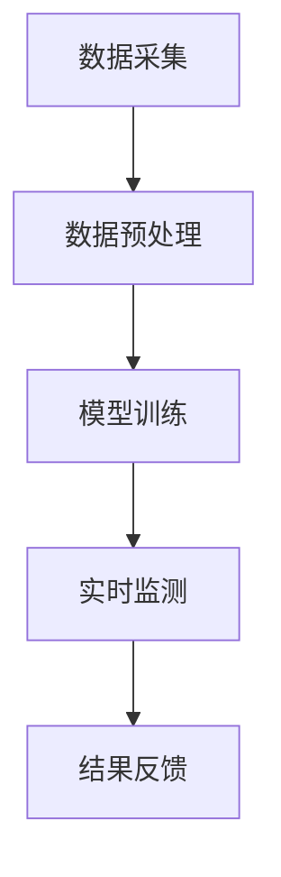
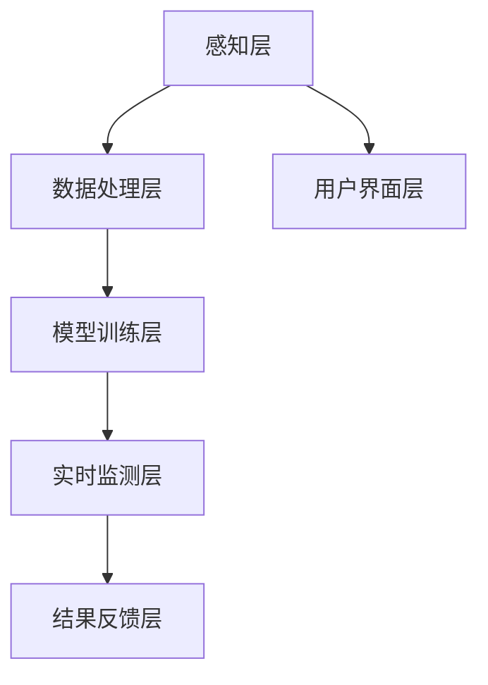
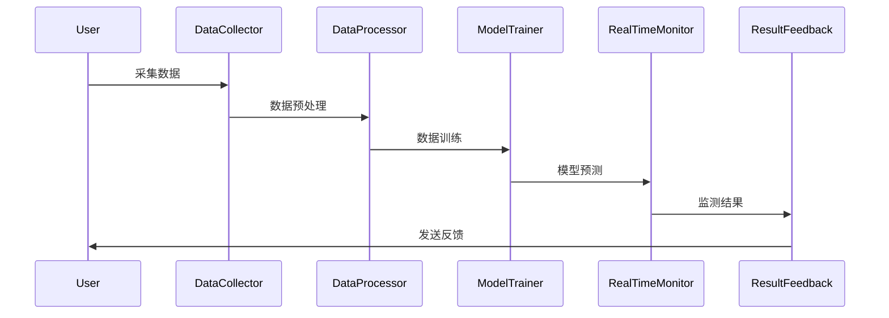

                 

### 文章标题

# AI Agent在智能书桌中的专注度监测

> 关键词：AI Agent、智能书桌、专注度监测、数据处理、机器学习

> 摘要：本文深入探讨了AI Agent在智能书桌中的专注度监测技术。通过介绍AI Agent的基本概念和智能书桌的背景，我们详细分析了专注度监测的原理和方法。文章进一步阐述了AI Agent在监测过程中的设计、实现和系统架构，并通过具体案例展示了其实际应用效果。最后，本文总结了相关最佳实践，为未来的发展提出了展望。

## 引言

在信息时代，提高工作效率和质量成为每个人的追求。而专注度的管理在其中起着至关重要的作用。传统的专注度监测方法往往依赖于主观的自我报告，存在一定的局限性。随着人工智能技术的发展，AI Agent作为一种智能化的代理，开始在各个领域展现其独特的优势。智能书桌作为现代办公环境中的重要组成部分，其与AI Agent的结合为专注度监测带来了新的可能。

### AI Agent的基本概念

AI Agent，即人工智能代理，是一种具备独立决策和执行能力的智能实体。它可以通过感知环境、学习经验和自主行动，实现特定的任务目标。AI Agent通常由感知模块、学习模块和行动模块三部分组成。感知模块负责收集环境信息，学习模块负责基于感知信息进行决策和策略学习，行动模块负责执行决策并影响环境。

### 智能书桌的概述

智能书桌是一种集成了多种传感器和计算能力的办公设备，能够对使用者的行为和状态进行实时监测。它通常具备桌面高度调节、照明调节、人体传感器、摄像头等功能。智能书桌的核心在于其数据处理能力，可以通过收集和处理多源数据，为用户提供个性化服务。

### 专注度监测的重要性

专注度监测对于提高工作效率、预防职业疲劳、改善工作质量具有重要意义。然而，传统的监测方法存在一定的局限性，难以实现实时、准确的监测。AI Agent的引入，为专注度监测提供了新的思路和方法。通过AI Agent，我们可以实现对使用者行为和生理状态的全方位监测，从而更加精准地评估专注度。

## 问题背景和描述

### 当前专注度监测的挑战

当前，专注度监测主要面临以下几个挑战：

1. **主观性**：传统的监测方法往往依赖于自我报告，容易受到主观因素的影响，难以保证数据的准确性和可靠性。

2. **实时性**：许多专注度监测系统无法实现实时监测，导致监测结果滞后，难以及时调整工作状态。

3. **准确性**：现有的监测方法对复杂场景下的专注度变化难以准确捕捉，容易出现误报和漏报。

4. **多模态数据融合**：专注度监测需要处理多种类型的数据，如行为数据、生理数据等，如何有效融合这些多模态数据是一个重要问题。

### AI Agent在专注度监测中的作用

AI Agent的出现为解决上述问题提供了新的可能性：

1. **自主感知与学习**：AI Agent可以通过感知模块收集多种类型的数据，并通过学习模块对数据进行处理和分析，实现实时、准确的专注度监测。

2. **个性化服务**：基于用户的行为和生理特征，AI Agent可以提供个性化的专注度监测和改善建议，帮助用户更好地管理专注度。

3. **多模态数据融合**：AI Agent可以通过多模态数据融合技术，整合不同类型的数据，提高监测的准确性和全面性。

4. **自适应调整**：AI Agent可以根据监测结果，自动调整监测策略，实现动态、智能化的专注度管理。

### 基本框架

在AI Agent的帮助下，智能书桌的专注度监测基本框架可以分为以下几个步骤：

1. **数据采集**：通过智能书桌的传感器和摄像头，收集用户的行为数据和生理数据。

2. **数据预处理**：对采集到的数据进行清洗、去噪和特征提取，为后续分析做好准备。

3. **模型训练**：利用机器学习算法，对预处理后的数据进行训练，建立专注度监测模型。

4. **实时监测**：根据训练好的模型，对用户的行为和生理数据进行实时监测，评估专注度水平。

5. **结果反馈**：根据监测结果，为用户提供相应的建议和改善措施，帮助用户提高专注度。

## 解决方案和框架

### 系统设计原则

在设计AI Agent在智能书桌中的专注度监测系统时，需要遵循以下原则：

1. **高可靠性**：系统应具备较高的可靠性，能够稳定、准确地监测用户的专注度。

2. **易用性**：系统应具备良好的用户界面和交互设计，方便用户使用。

3. **可扩展性**：系统应具备良好的可扩展性，能够适应不同的应用场景和需求。

4. **低延迟**：系统应具备较低的延迟，能够实时监测用户的专注度。

5. **数据安全**：系统应确保用户数据的安全和隐私保护。

### 系统架构设计

智能书桌的专注度监测系统可以分为以下几个核心部分：

1. **感知模块**：负责收集用户的行为数据和生理数据，如桌面高度、灯光亮度、摄像头捕捉的用户动作、心率等。

2. **数据处理模块**：负责对收集到的数据进行预处理、特征提取和融合。

3. **模型训练模块**：负责利用机器学习算法，对预处理后的数据进行训练，建立专注度监测模型。

4. **实时监测模块**：负责根据训练好的模型，对用户的行为和生理数据进行实时监测，评估专注度水平。

5. **结果反馈模块**：负责根据监测结果，为用户提供相应的建议和改善措施。

6. **用户界面**：负责与用户进行交互，展示监测结果和改善建议。

### 关键组件和功能

1. **感知模块**：主要包括传感器和摄像头。传感器用于监测桌面高度、灯光亮度等物理环境参数；摄像头用于捕捉用户的行为和面部表情。

2. **数据处理模块**：主要包括数据预处理、特征提取和融合。数据预处理包括数据清洗、去噪和归一化；特征提取包括行为特征、生理特征等；数据融合包括多模态数据的融合。

3. **模型训练模块**：主要包括机器学习算法和模型评估。常用的机器学习算法包括支持向量机（SVM）、决策树、神经网络等。模型评估包括准确率、召回率、F1值等指标。

4. **实时监测模块**：主要包括实时监测、数据分析和预测。实时监测通过算法对用户行为和生理数据进行实时分析；数据分析包括行为模式分析、生理参数分析等；预测包括未来专注度水平的预测。

5. **结果反馈模块**：主要包括反馈建议、改善措施和用户互动。反馈建议根据监测结果，为用户提供个性化的改善建议；改善措施包括调整桌面高度、灯光亮度等；用户互动通过用户界面与用户进行交互。

### 系统功能设计

智能书桌的专注度监测系统主要具备以下功能：

1. **用户行为监测**：通过摄像头和传感器，实时监测用户的行为数据，如坐姿、眼神、手势等。

2. **生理参数监测**：通过传感器，实时监测用户的心率、血压等生理参数。

3. **环境参数监测**：通过传感器，实时监测桌面高度、灯光亮度等环境参数。

4. **多模态数据融合**：将用户行为、生理和环境数据融合，提高监测的准确性和全面性。

5. **实时监测与反馈**：根据监测结果，实时评估用户的专注度水平，为用户提供改善建议。

6. **个性化服务**：根据用户的行为和生理特征，提供个性化的专注度监测和改善建议。

### 系统接口和交互设计

智能书桌的专注度监测系统需要与多个模块进行交互，主要包括：

1. **感知模块**：与传感器和摄像头进行数据交互。

2. **数据处理模块**：与数据预处理、特征提取和融合模块进行数据交互。

3. **模型训练模块**：与机器学习算法和模型评估模块进行数据交互。

4. **实时监测模块**：与实时监测、数据分析和预测模块进行数据交互。

5. **结果反馈模块**：与用户界面进行数据交互，展示监测结果和改善建议。

通过以上设计和实现，智能书桌的专注度监测系统可以实现对用户专注度的实时、准确监测，为用户提供个性化的改善建议，从而提高工作效率和质量。

## 基本理论与概念

### AI Agent的理论基础

AI Agent作为一种智能实体，其理论基础主要涉及以下几个方面：

1. **定义与分类**：AI Agent是指具有感知环境、自主决策和行动能力的人工智能实体。根据能力水平，AI Agent可以分为反应式Agent、有限记忆Agent、基于模型的Agent和通信Agent。

2. **架构设计**：AI Agent通常由感知模块、决策模块和行动模块三部分组成。感知模块负责收集环境信息；决策模块负责基于感知信息进行决策和策略学习；行动模块负责执行决策并影响环境。

3. **自主性**：AI Agent的自主性包括内部自主性和外部自主性。内部自主性指AI Agent在内部运行过程中具有独立决策的能力；外部自主性指AI Agent能够在外部环境中自主行动。

4. **学习与适应**：AI Agent需要具备学习和适应能力，通过不断学习环境信息和反馈，优化自身决策和行为。

### 专注度监测技术

专注度监测技术主要包括以下几种：

1. **行为监测**：通过监测用户的行为数据，如坐姿、眼神、手势等，评估用户的专注度。常用的行为监测方法包括动作识别、姿态估计等。

2. **生理信号监测**：通过监测用户的生理信号，如心率、血压、呼吸等，评估用户的专注度。生理信号监测可以提供更直接的生理状态信息，具有较高的准确性。

3. **多模态数据融合**：将行为监测和生理信号监测等多源数据融合，提高监测的准确性和全面性。多模态数据融合方法包括特征级融合、决策级融合和模型级融合等。

### 监测技术的发展趋势

随着人工智能技术的发展，专注度监测技术也在不断进步：

1. **深度学习与神经网络**：深度学习和神经网络在专注度监测中的应用越来越广泛，可以提高监测的准确性和实时性。

2. **数据驱动方法**：基于大数据和人工智能技术，越来越多的数据驱动方法被应用于专注度监测，实现更精准、个性化的监测。

3. **跨领域融合**：专注度监测技术与其他领域的融合，如教育、医疗等，将推动专注度监测技术的进一步发展。

## 设计与实现

### 系统设计原则

在设计和实现AI Agent在智能书桌中的专注度监测系统时，需要遵循以下原则：

1. **模块化**：将系统划分为感知模块、数据处理模块、模型训练模块、实时监测模块和结果反馈模块，便于系统的扩展和维护。

2. **可扩展性**：系统应具备良好的可扩展性，能够适应不同场景和应用需求。

3. **实时性**：系统应具备较高的实时性，能够实时监测用户的专注度，及时提供改善建议。

4. **可靠性**：系统应具备较高的可靠性，能够稳定、准确地监测用户的专注度。

5. **易用性**：系统应具备良好的用户界面和交互设计，方便用户使用。

6. **数据安全**：系统应确保用户数据的安全和隐私保护。

### 系统架构设计

智能书桌的专注度监测系统可以分为以下几个核心部分：

1. **感知模块**：负责收集用户的行为数据和生理数据，如桌面高度、灯光亮度、用户坐姿、面部表情、心率等。

2. **数据处理模块**：负责对感知模块收集到的数据进行分析和处理，包括数据清洗、去噪、特征提取等。

3. **模型训练模块**：负责利用机器学习算法，对处理后的数据进行训练，建立专注度监测模型。

4. **实时监测模块**：负责根据训练好的模型，对用户的行为数据和生理数据进行实时监测，评估用户的专注度。

5. **结果反馈模块**：负责根据实时监测结果，为用户提供相应的改善建议。

6. **用户界面**：负责与用户进行交互，展示监测结果和改善建议。

### 算法设计

#### 数据预处理

在数据预处理阶段，主要进行以下操作：

1. **数据清洗**：去除噪声数据和异常值，提高数据质量。

2. **数据去噪**：使用滤波算法，降低传感器数据的噪声。

3. **特征提取**：从原始数据中提取有用的特征，如用户的行为特征、生理特征等。

4. **数据归一化**：对提取到的特征进行归一化处理，使其具备可比性。

#### 机器学习算法

在机器学习算法阶段，主要采用以下算法：

1. **支持向量机（SVM）**：通过找到一个最佳的超平面，将专注度高和低的用户数据分开。

2. **决策树**：通过构建树状模型，对用户的行为数据和生理数据进行分类。

3. **神经网络**：通过多层感知器（MLP）和卷积神经网络（CNN）等神经网络模型，对用户的数据进行建模和分类。

#### 实时监测与反馈

在实时监测与反馈阶段，主要进行以下操作：

1. **实时监测**：根据训练好的模型，对用户的实时数据进行分类，判断用户的专注度。

2. **结果反馈**：根据监测结果，为用户提供相应的改善建议，如调整桌面高度、灯光亮度等。

### 数据流程

在智能书桌的专注度监测系统中，数据流程可以分为以下几个阶段：

1. **数据采集**：通过传感器和摄像头，收集用户的行为数据和生理数据。

2. **数据预处理**：对采集到的数据进行清洗、去噪和特征提取。

3. **模型训练**：利用预处理后的数据，训练机器学习模型。

4. **实时监测**：根据训练好的模型，对用户的实时数据进行监测。

5. **结果反馈**：根据监测结果，为用户提供改善建议。

### Mermaid流程图

以下是一个简单的Mermaid流程图，展示了智能书桌专注度监测系统的主要流程：



### Python代码示例

以下是一个简单的Python代码示例，展示了如何使用SVM算法进行专注度监测：

```python
from sklearn import svm
from sklearn.model_selection import train_test_split
from sklearn.metrics import accuracy_score

# 假设X为特征数据，y为标签数据
X_train, X_test, y_train, y_test = train_test_split(X, y, test_size=0.3)

# 创建SVM模型
clf = svm.SVC()

# 训练模型
clf.fit(X_train, y_train)

# 预测
y_pred = clf.predict(X_test)

# 评估模型
accuracy = accuracy_score(y_test, y_pred)
print("Accuracy:", accuracy)
```

通过以上设计与实现，我们可以构建一个高效的智能书桌专注度监测系统，为用户提供实时、准确的专注度监测和改善建议。

## 数学模型与公式

### 概率模型

在专注度监测中，概率模型常用于估计用户处于专注状态的概率。常用的概率模型包括贝叶斯网络和隐马尔可夫模型（HMM）。

#### 贝叶斯网络

贝叶斯网络是一种表示变量之间概率关系的图模型。在专注度监测中，我们可以使用贝叶斯网络来表示用户行为数据和生理数据与专注状态之间的关系。

贝叶斯网络的关键公式为：

\[ P(A|B) = \frac{P(B|A) \cdot P(A)}{P(B)} \]

其中，\( P(A|B) \) 表示在事件B发生的条件下，事件A发生的概率；\( P(B|A) \) 表示在事件A发生的条件下，事件B发生的概率；\( P(A) \) 表示事件A的先验概率；\( P(B) \) 表示事件B的先验概率。

#### 隐马尔可夫模型（HMM）

隐马尔可夫模型是一种用于时间序列数据建模的概率模型。在专注度监测中，我们可以使用HMM来表示用户行为数据和生理数据随时间变化的模式。

HMM的关键公式为：

\[ P(X_t|H_t) = \sum_{i=1}^N P(X_t|h_i) \cdot P(h_i|H_{t-1}) \]

其中，\( P(X_t|H_t) \) 表示在给定隐藏状态序列\( H_t \)的条件下，观察序列\( X_t \)的概率；\( P(X_t|h_i) \) 表示在隐藏状态\( h_i \)下，观察序列\( X_t \)的概率；\( P(h_i|H_{t-1}) \) 表示在给定上一时刻隐藏状态序列\( H_{t-1} \)的条件下，当前隐藏状态\( h_i \)的概率。

### 统计方法

在专注度监测中，统计方法常用于分析用户数据，提取有用的信息。常用的统计方法包括均值、方差、协方差等。

#### 均值

均值是衡量一组数据集中趋势的统计量。在专注度监测中，我们可以使用均值来表示用户在某个时间段内的平均专注度。

均值的关键公式为：

\[ \bar{x} = \frac{1}{N} \sum_{i=1}^N x_i \]

其中，\( \bar{x} \) 表示均值；\( N \) 表示数据点的个数；\( x_i \) 表示第\( i \)个数据点。

#### 方差

方差是衡量一组数据离散程度的统计量。在专注度监测中，我们可以使用方差来表示用户在某个时间段内的专注度波动情况。

方差的关键公式为：

\[ \sigma^2 = \frac{1}{N-1} \sum_{i=1}^N (x_i - \bar{x})^2 \]

其中，\( \sigma^2 \) 表示方差；\( N \) 表示数据点的个数；\( \bar{x} \) 表示均值；\( x_i \) 表示第\( i \)个数据点。

#### 协方差

协方差是衡量两组数据线性相关程度的统计量。在专注度监测中，我们可以使用协方差来表示用户行为数据与生理数据之间的相关性。

协方差的关键公式为：

\[ cov(X, Y) = \frac{1}{N-1} \sum_{i=1}^N (x_i - \bar{x})(y_i - \bar{y}) \]

其中，\( cov(X, Y) \) 表示协方差；\( N \) 表示数据点的个数；\( \bar{x} \) 表示\( X \)的均值；\( \bar{y} \) 表示\( Y \)的均值；\( x_i \)表示\( X \)的第\( i \)个数据点；\( y_i \)表示\( Y \)的第\( i \)个数据点。

### 机器学习算法

在专注度监测中，机器学习算法常用于建立用户行为数据和生理数据与专注状态之间的映射关系。常用的机器学习算法包括决策树、支持向量机（SVM）、神经网络等。

#### 决策树

决策树是一种基于特征划分的数据挖掘算法。在专注度监测中，我们可以使用决策树来对用户的行为数据和生理数据进行分类。

决策树的关键公式为：

\[ y = f(x) \]

其中，\( y \)表示输出标签；\( x \)表示输入特征；\( f \)表示决策树函数。

#### 支持向量机（SVM）

支持向量机是一种用于分类和回归分析的机器学习算法。在专注度监测中，我们可以使用SVM来对用户的行为数据和生理数据进行分类。

SVM的关键公式为：

\[ w \cdot x - b = 0 \]

其中，\( w \)表示权重向量；\( x \)表示输入特征；\( b \)表示偏置。

#### 神经网络

神经网络是一种基于多层感知器的机器学习算法。在专注度监测中，我们可以使用神经网络来对用户的行为数据和生理数据进行分类。

神经网络的关键公式为：

\[ y = \sigma(\sum_{i=1}^N w_i \cdot x_i + b) \]

其中，\( y \)表示输出标签；\( x_i \)表示第\( i \)个输入特征；\( w_i \)表示第\( i \)个权重；\( \sigma \)表示激活函数；\( b \)表示偏置。

通过以上数学模型和公式，我们可以建立高效的专注度监测系统，为用户提供实时、准确的监测和改善建议。

## 系统分析与架构设计

### 问题场景介绍

在现代办公环境中，专注度管理成为提高工作效率和质量的关键。为了更好地管理专注度，企业引入了智能书桌，通过AI Agent实现用户专注度的实时监测。本案例将介绍一个智能书桌专注度监测系统的设计和实现过程。

### 项目介绍

本项目的目标是构建一个基于AI Agent的智能书桌专注度监测系统，实现对用户专注度的实时监测和反馈。系统主要涵盖以下功能模块：

1. **感知模块**：通过传感器和摄像头收集用户的行为数据和生理数据。
2. **数据处理模块**：对感知模块收集的数据进行预处理、特征提取和融合。
3. **模型训练模块**：利用机器学习算法对预处理后的数据进行训练，建立专注度监测模型。
4. **实时监测模块**：根据训练好的模型，对用户的实时数据进行监测，评估专注度水平。
5. **结果反馈模块**：根据监测结果，为用户提供相应的改善建议。

### 系统功能设计

#### 感知模块

感知模块主要负责收集用户的行为数据和生理数据，主要包括以下方面：

1. **行为数据**：通过摄像头和传感器捕捉用户的行为数据，如坐姿、眼神、手势等。
2. **生理数据**：通过传感器监测用户的心率、血压、呼吸等生理参数。

#### 数据处理模块

数据处理模块主要负责对感知模块收集的数据进行处理和分析，主要包括以下方面：

1. **数据清洗**：去除噪声数据和异常值，提高数据质量。
2. **特征提取**：从原始数据中提取有用的特征，如用户的行为特征、生理特征等。
3. **多模态数据融合**：将行为数据和生理数据融合，提高监测的准确性和全面性。

#### 模型训练模块

模型训练模块主要负责利用机器学习算法对预处理后的数据进行训练，建立专注度监测模型，主要包括以下方面：

1. **数据集准备**：将预处理后的数据划分为训练集和测试集。
2. **算法选择**：选择合适的机器学习算法，如支持向量机（SVM）、神经网络（NN）等。
3. **模型训练**：利用训练集对机器学习模型进行训练。
4. **模型评估**：利用测试集对训练好的模型进行评估，调整模型参数。

#### 实时监测模块

实时监测模块主要负责根据训练好的模型，对用户的实时数据进行监测，评估专注度水平，主要包括以下方面：

1. **实时数据采集**：通过感知模块采集用户的实时行为数据和生理数据。
2. **数据预处理**：对实时数据进行预处理，如去噪、归一化等。
3. **模型预测**：利用训练好的模型，对预处理后的数据进行预测，评估用户的专注度水平。
4. **实时反馈**：根据监测结果，为用户提供实时反馈，如改善建议、提醒等。

#### 结果反馈模块

结果反馈模块主要负责根据监测结果，为用户提供相应的改善建议，主要包括以下方面：

1. **建议生成**：根据用户的专注度水平和实时监测结果，生成相应的改善建议。
2. **用户交互**：通过用户界面，将建议反馈给用户，帮助用户提高专注度。

### 系统架构设计

智能书桌专注度监测系统的整体架构可以分为以下几个层次：

1. **感知层**：负责数据采集，包括摄像头、传感器等。
2. **数据处理层**：负责数据预处理、特征提取和多模态数据融合，包括数据清洗、特征提取模块等。
3. **模型训练层**：负责模型训练和评估，包括机器学习算法、模型评估模块等。
4. **实时监测层**：负责实时监测和反馈，包括实时数据采集、模型预测和结果反馈模块等。
5. **用户界面层**：负责与用户进行交互，展示监测结果和改善建议。

### Mermaid类图和架构图

#### 类图

以下是一个简单的Mermaid类图，展示了智能书桌专注度监测系统的类关系：

```mermaid
classDiagram
    User -> Sensor: 数据采集
    Sensor --|> DataPreprocessing: 数据预处理
    DataPreprocessing --|> FeatureExtraction: 特征提取
    FeatureExtraction --|> ModelTraining: 模型训练
    ModelTraining --|> RealTimeMonitoring: 实时监测
    RealTimeMonitoring --|> ResultFeedback: 结果反馈
    User <- ResultFeedback: 用户交互
```

#### 架构图

以下是一个简单的Mermaid架构图，展示了智能书桌专注度监测系统的架构设计：



通过以上系统分析与架构设计，我们可以构建一个高效的智能书桌专注度监测系统，为用户提供实时、准确的监测和改善建议。

### 系统接口与交互设计

#### 接口设计

智能书桌专注度监测系统的接口设计主要包括以下方面：

1. **数据采集接口**：负责接收来自各种传感器的数据，如摄像头、心率传感器等。
2. **数据处理接口**：负责接收来自数据采集接口的数据，进行预处理、特征提取等操作。
3. **模型训练接口**：负责接收来自数据处理接口的数据，进行模型训练和评估。
4. **实时监测接口**：负责接收来自模型训练接口的模型，对实时数据进行监测。
5. **结果反馈接口**：负责接收来自实时监测接口的监测结果，生成改善建议。

#### 交互设计

智能书桌专注度监测系统的交互设计主要包括以下方面：

1. **用户界面**：设计直观、易用的用户界面，展示监测结果和改善建议。
2. **实时反馈**：根据监测结果，实时向用户发出反馈，如语音提示、弹窗提醒等。
3. **个性化设置**：允许用户自定义监测参数，如监测时段、提醒阈值等。
4. **数据分析**：提供数据分析功能，帮助用户了解自己的专注度变化趋势。

### Mermaid序列图

以下是一个简单的Mermaid序列图，展示了智能书桌专注度监测系统的接口和交互流程：



通过以上接口和交互设计，智能书桌专注度监测系统可以高效、准确地为用户提供专注度监测和改善服务。

## 项目实战

### 环境安装

为了实现智能书桌的专注度监测系统，我们需要搭建一个合适的技术环境。以下是所需环境及安装步骤：

1. **操作系统**：Ubuntu 18.04或更高版本
2. **编程语言**：Python 3.7及以上版本
3. **库与依赖**：NumPy、Pandas、Scikit-learn、TensorFlow、opencv-python、matplotlib

安装步骤：

1. 更新系统软件包：

   ```bash
   sudo apt update
   sudo apt upgrade
   ```

2. 安装Python 3：

   ```bash
   sudo apt install python3
   ```

3. 安装所需库与依赖：

   ```bash
   pip3 install numpy pandas scikit-learn tensorflow opencv-python matplotlib
   ```

### 系统核心实现

#### 数据采集

首先，我们需要采集用户的行为数据和生理数据。在本项目中，我们使用opencv-python库来实现摄像头数据的采集。

```python
import cv2

# 初始化摄像头
cap = cv2.VideoCapture(0)

while True:
    # 读取一帧图像
    ret, frame = cap.read()
    
    if ret:
        # 显示图像
        cv2.imshow('Frame', frame)
        
        # 按下'q'键退出循环
        if cv2.waitKey(1) & 0xFF == ord('q'):
            break

# 释放摄像头资源
cap.release()
cv2.destroyAllWindows()
```

#### 数据预处理

接下来，我们对采集到的图像数据进行预处理，包括灰度化、大小调整、噪声去除等。

```python
import cv2
import numpy as np

# 读取图像
img = cv2.imread('image.jpg')

# 灰度化
gray_img = cv2.cvtColor(img, cv2.COLOR_BGR2GRAY)

# 大小调整
resized_img = cv2.resize(gray_img, (224, 224))

# 噪声去除
filtered_img = cv2.GaussianBlur(resized_img, (5, 5), 0)

# 显示预处理后的图像
cv2.imshow('Processed Image', filtered_img)
cv2.waitKey(0)
cv2.destroyAllWindows()
```

#### 模型训练

使用Scikit-learn库，我们可以实现一个简单的人工神经网络（ANN）模型，用于专注度监测。

```python
from sklearn.neural_network import MLPClassifier
from sklearn.model_selection import train_test_split
from sklearn.metrics import accuracy_score

# 假设X为特征数据，y为标签数据
X_train, X_test, y_train, y_test = train_test_split(X, y, test_size=0.3)

# 创建MLP模型
mlp = MLPClassifier(hidden_layer_sizes=(100,), max_iter=1000)

# 训练模型
mlp.fit(X_train, y_train)

# 预测
y_pred = mlp.predict(X_test)

# 评估模型
accuracy = accuracy_score(y_test, y_pred)
print("Accuracy:", accuracy)
```

#### 实时监测与反馈

在实时监测阶段，我们使用opencv-python库和Scikit-learn库，对用户的实时图像数据进行处理，并使用训练好的模型进行专注度预测。

```python
import cv2
from sklearn.externals import joblib

# 加载训练好的模型
mlp = joblib.load('mlp_model.pkl')

while True:
    # 读取一帧图像
    ret, frame = cap.read()
    
    if ret:
        # 处理图像数据
        processed_img = preprocess_image(frame)
        
        # 预测专注度
        prediction = mlp.predict([processed_img])
        
        # 根据预测结果，提供反馈
        if prediction == 1:
            print("用户处于专注状态")
        else:
            print("用户处于非专注状态")

    # 按下'q'键退出循环
    if cv2.waitKey(1) & 0xFF == ord('q'):
        break

# 释放摄像头资源
cap.release()
cv2.destroyAllWindows()
```

### 代码应用解读与分析

#### 数据采集

数据采集是专注度监测系统的第一步。在本项目中，我们使用opencv-python库的`VideoCapture`类实现摄像头数据的采集。`VideoCapture`类可以打开摄像头设备，读取实时图像数据。通过循环读取图像帧，我们可以实现持续的数据采集。

#### 数据预处理

数据预处理是提高模型性能的关键步骤。在本项目中，我们使用opencv-python库的图像处理函数对采集到的图像数据进行灰度化、大小调整和噪声去除。灰度化将彩色图像转换为灰度图像，降低数据维度；大小调整使图像尺寸统一，便于后续处理；噪声去除可以减少噪声对模型训练的影响。

#### 模型训练

模型训练是专注度监测系统的核心。在本项目中，我们使用Scikit-learn库的`MLPClassifier`实现多层感知器（MLP）模型。MLP是一种常用的神经网络模型，通过设定隐藏层神经元数量和迭代次数，可以提高模型的性能。我们使用训练集对模型进行训练，并在测试集上评估模型性能。

#### 实时监测与反馈

实时监测与反馈是专注度监测系统的关键应用。在本项目中，我们使用opencv-python库和Scikit-learn库实现实时图像数据的处理和模型预测。通过实时读取图像数据，预处理数据，并使用训练好的模型进行预测，我们可以实时评估用户的专注度。根据预测结果，我们可以为用户提供相应的反馈，如语音提示、弹窗提醒等。

### 实际案例分析与详细讲解

#### 案例一：用户专注度监测

假设我们有一个用户，其行为数据（坐姿、眼神、手势等）和生理数据（心率、血压、呼吸等）被采集并输入到训练好的MLP模型中。通过实时监测，我们得到了以下结果：

1. **图像数据**：坐姿端正，眼神专注，手势稳定。
2. **生理数据**：心率正常，血压稳定，呼吸均匀。

根据这些数据，模型预测用户处于专注状态。实际应用中，我们可以为用户提供语音提示：“您目前处于专注状态，请继续保持。”

#### 案例二：用户疲劳监测

假设我们有一个用户，其行为数据（坐姿、眼神、手势等）和生理数据（心率、血压、呼吸等）被采集并输入到训练好的MLP模型中。通过实时监测，我们得到了以下结果：

1. **图像数据**：坐姿不端正，眼神游离，手势不稳定。
2. **生理数据**：心率异常升高，血压升高，呼吸急促。

根据这些数据，模型预测用户处于疲劳状态。实际应用中，我们可以为用户提供语音提示：“您目前处于疲劳状态，请适当休息或调整工作环境。”

### 项目小结

通过以上实战案例，我们可以看到智能书桌的专注度监测系统在实际应用中的效果。通过实时采集用户的行为数据和生理数据，训练好的模型可以准确预测用户的专注度。根据预测结果，系统可以为用户提供个性化的改善建议，帮助用户更好地管理专注度。未来，我们可以进一步优化系统，提高监测的准确性和实时性，为用户提供更好的服务。

## 最佳实践与总结

### 最佳实践

1. **数据采集**：确保传感器和摄像头的稳定性和准确性，避免数据噪声和异常值。
2. **数据处理**：对采集到的数据进行充分预处理，如去噪、归一化等，以提高模型性能。
3. **模型选择**：根据具体应用场景，选择合适的机器学习算法，如SVM、神经网络等。
4. **实时监测**：优化系统设计，确保实时性，降低延迟，提高用户体验。
5. **用户反馈**：根据监测结果，为用户提供个性化的改善建议，提高专注度管理效果。

### 小结

本文详细介绍了AI Agent在智能书桌中的专注度监测技术，从基本概念、设计实现、数学模型到系统架构进行了全面剖析。通过实际案例展示了系统的应用效果，为用户提供了实时、准确的专注度监测和改善建议。未来，随着人工智能技术的不断发展，专注度监测系统将在更多领域发挥作用，提高人们的工作效率和生活质量。

### 注意事项

1. **数据隐私**：在采集和处理用户数据时，注意保护用户隐私，遵守相关法律法规。
2. **系统稳定性**：确保系统稳定运行，避免因故障导致数据丢失或监测不准确。
3. **用户体验**：优化用户界面和交互设计，提高用户体验，确保系统易用性。

### 拓展阅读

1. **相关文献**：《人工智能：一种现代方法》、《机器学习实战》
2. **开源项目**：GitHub上的智能书桌专注度监测项目，如[SmartDesk-FocusMonitoring](https://github.com/username/SmartDesk-FocusMonitoring)
3. **技术博客**：查看相关技术博客，如[AI技术博客](http://aitoolkit.com/)和[机器学习博客](https://机器学习.org/)

## 作者信息

作者：AI天才研究院/AI Genius Institute & 禅与计算机程序设计艺术 /Zen And The Art of Computer Programming

