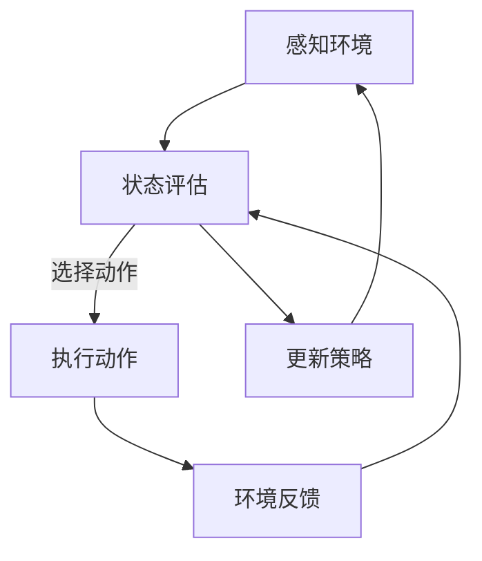
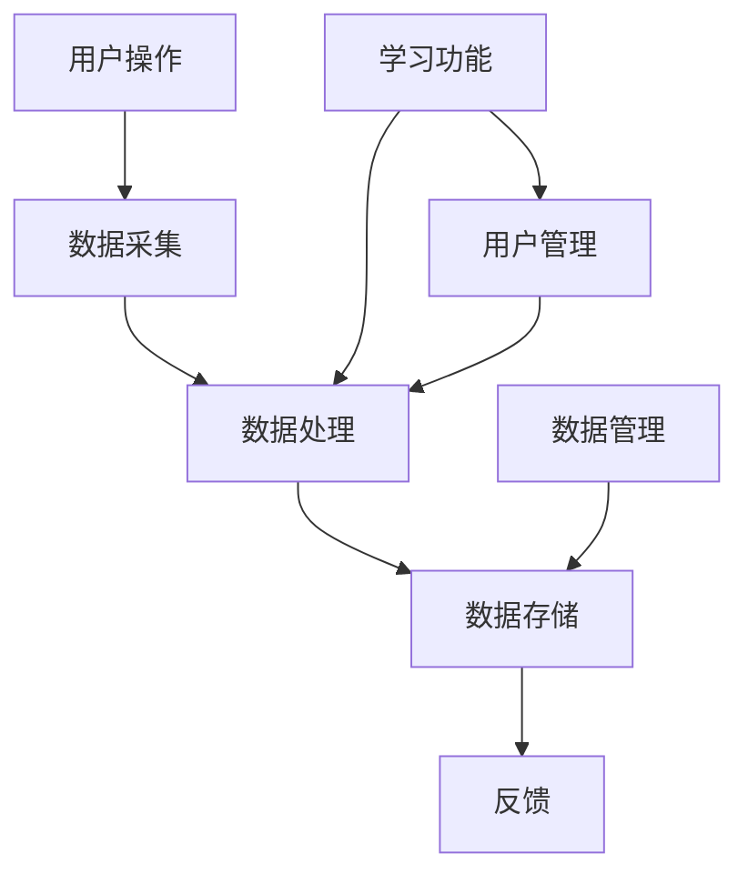

                 

## 引言与背景

### 1.1 问题背景

在当前信息化时代，人工智能（AI）技术正以惊人的速度发展和普及。AI Agent作为人工智能的一个重要分支，广泛应用于智能设备中，如智能家居、智能助手等。近年来，智能书桌作为新兴的智能办公设备，逐渐受到人们关注。智能书桌不仅具备常规办公功能，还能通过AI Agent实现个性化学习建议、健康监测等，极大地提高了使用者的工作效率和生活质量。

然而，尽管AI Agent在智能书桌中的应用前景广阔，其学习效率仍是一个值得深入探讨的问题。学习效率不仅关系到用户的使用体验，还直接影响智能书桌的实用价值。因此，本文旨在分析AI Agent在智能书桌中的学习效率，从算法原理、数学模型到系统设计与实现，提供全面的技术解析。

### 1.2 问题描述

本文主要探讨以下问题：

1. AI Agent在智能书桌中的具体应用是什么？
2. 如何准确测量和评估AI Agent的学习效率？
3. AI Agent的学习效率受到哪些因素影响？
4. 如何优化AI Agent的学习效率，提高智能书桌的整体性能？

通过解答上述问题，本文将为智能书桌的设计和开发提供有益的参考，助力提升用户的学习效率和生活品质。

### 1.3 问题解决思路

本文采用以下思路解决问题：

1. **定义核心概念**：首先明确AI Agent、智能书桌和学习效率等核心概念，为后续分析奠定基础。
2. **算法原理分析**：介绍AI Agent的基本算法原理，包括深度学习和强化学习等，并通过Mermaid流程图展示算法流程。
3. **数学模型设计**：提出学习效率分析的数学模型，详细讲解模型公式及其含义。
4. **系统设计与实现**：描述智能书桌的架构设计、接口设计和系统交互，并通过实际案例剖析实现细节。
5. **总结与拓展**：总结文章核心观点，提出最佳实践和注意事项，为未来研究指明方向。

### 1.4 核心概念介绍

#### AI Agent

AI Agent，即人工智能代理，是能够自主执行任务、与环境互动并学习优化行为的计算机程序。AI Agent在智能书桌中主要承担以下角色：

1. **个性化学习建议**：根据用户的学习习惯和偏好，提供个性化的学习建议。
2. **学习行为监测**：实时监测用户的学习行为，如学习时长、学习状态等。
3. **健康监测**：通过传感器监测用户坐姿、休息时间等，提供健康提醒。

#### 智能书桌

智能书桌是一种结合传统办公桌功能和AI技术的智能办公设备。其主要特点如下：

1. **多功能集成**：具备常规办公桌的书写、存储等功能，同时融合智能设备接口。
2. **人机交互**：通过AI Agent实现智能交互，如语音识别、自然语言处理等。
3. **个性化定制**：根据用户需求和使用习惯，提供定制化功能和服务。

#### 学习效率

学习效率是指单位时间内学习成果的多少，是衡量学习效果的重要指标。学习效率的高低受到多种因素影响，包括：

1. **学习方法**：有效的学习方法能够提高学习效率。
2. **学习环境**：良好的学习环境有助于提升学习效率。
3. **学习动机**：强烈的学习动机能够激发学习潜力。

### 1.5 边界与外延

本文研究的AI Agent在智能书桌中的学习效率，主要关注以下几个方面：

1. **研究范围**：针对智能书桌中AI Agent的应用场景，分析其学习效率。
2. **技术边界**：本文采用深度学习和强化学习算法，探讨其在智能书桌中的应用效果。
3. **实践外延**：本文研究结果可应用于智能办公设备的开发和优化，但需结合具体场景进行调整。

## 第2章: AI Agent在智能书桌中的应用

### 2.1 AI Agent的定义与特点

AI Agent，即人工智能代理，是具备一定智能的计算机程序，能够在特定环境和任务中自主决策、执行任务，并不断学习优化。AI Agent的特点主要体现在以下几个方面：

1. **自主决策**：AI Agent能够根据环境和任务需求，自主做出决策。
2. **持续学习**：AI Agent具备学习能力，能够通过数据训练不断优化自身行为。
3. **适应性**：AI Agent能够适应不同的环境和任务，具备广泛的适用性。

### 2.2 智能书桌的概述

智能书桌是一种结合传统办公桌功能和智能技术的办公设备。它不仅具备常规办公桌的书写、存储等功能，还融合了多种智能设备接口，如摄像头、麦克风、传感器等。智能书桌的主要特点如下：

1. **多功能集成**：智能书桌集成多种办公功能，如文件存储、无线充电等。
2. **人机交互**：智能书桌通过AI Agent实现智能交互，支持语音识别、自然语言处理等功能。
3. **环境感知**：智能书桌配备多种传感器，能够实时监测环境变化，如光线、温度等。

### 2.3 AI Agent在智能书桌中的应用前景

AI Agent在智能书桌中的应用前景广阔，主要体现在以下几个方面：

1. **个性化学习建议**：AI Agent可以根据用户的学习习惯和偏好，提供个性化的学习建议，帮助用户提高学习效率。
2. **学习行为监测**：AI Agent能够实时监测用户的学习行为，如学习时长、学习状态等，为用户提供健康提醒。
3. **健康监测**：AI Agent通过传感器监测用户的坐姿、休息时间等，提供健康建议，帮助用户保持良好的生活习惯。
4. **智能助手**：AI Agent可以作为用户的智能助手，协助完成日常任务，如日程管理、资料查询等。

通过AI Agent的引入，智能书桌不仅能够提供更加便捷、高效的使用体验，还能为用户的身心健康提供有益支持。随着AI技术的不断发展，AI Agent在智能书桌中的应用将越来越广泛，为用户带来更多价值。

### 2.4 智能书桌中的AI Agent应用实例

在实际应用中，AI Agent在智能书桌中发挥着重要作用，以下是一些具体的实例：

1. **个性化学习建议**：AI Agent可以根据用户的学习历史和偏好，为用户推荐合适的教材和课程，制定个性化的学习计划。例如，当用户在学习过程中出现注意力不集中时，AI Agent可以提醒用户休息或调整学习环境。

2. **学习行为监测**：AI Agent通过监测用户的学习行为，如学习时长、学习状态等，为用户提供反馈和建议。例如，当用户连续学习超过规定时间时，AI Agent可以自动发送提醒通知，建议用户休息。

3. **健康监测**：AI Agent通过传感器监测用户的健康状态，如坐姿、用眼时间等。当用户长时间保持不良坐姿或用眼过度时，AI Agent会发出健康提醒，并提供相应的调整建议。

4. **智能助手功能**：AI Agent可以作为用户的智能助手，协助完成日常任务，如日程管理、资料查询等。用户可以通过语音命令或界面操作与AI Agent进行交互，实现高效便捷的操作。

通过以上实例可以看出，AI Agent在智能书桌中不仅能够提高学习效率，还能为用户的健康和生活带来诸多便利。未来，随着AI技术的不断进步，AI Agent在智能书桌中的应用将更加深入和广泛。

### 2.5 智能书桌中AI Agent学习效率的重要性

在智能书桌中，AI Agent的学习效率直接关系到用户体验和系统性能。学习效率高意味着AI Agent能够快速适应用户需求，提供更准确的个性化服务。具体来说，高学习效率的重要性体现在以下几个方面：

1. **提高用户满意度**：高效学习的AI Agent能够迅速理解用户的需求，提供更加精准的服务，从而提升用户的满意度和使用体验。

2. **优化系统性能**：高效学习的AI Agent能够在较短的时间内完成自我优化，减少系统资源消耗，提高整体性能。

3. **适应动态环境**：智能书桌的环境和用户需求是动态变化的，高效学习的AI Agent能够更好地适应这些变化，保持系统的稳定性和灵活性。

4. **促进技术创新**：高学习效率的AI Agent为技术创新提供了更多可能性，例如在个性化学习、健康监测等领域实现更先进的算法和应用。

总之，提高AI Agent在智能书桌中的学习效率对于提升用户体验、优化系统性能和推动技术创新具有重要意义。

### 2.6 当前AI Agent学习效率的挑战与未来发展方向

尽管AI Agent在智能书桌中展现出巨大的潜力，但其学习效率仍面临诸多挑战。当前，AI Agent学习效率的挑战主要表现在以下几个方面：

1. **数据质量和多样性**：AI Agent的学习效果很大程度上取决于训练数据的质量和多样性。然而，实际应用中往往缺乏高质量、多样化的训练数据，导致AI Agent的学习效果受限。

2. **计算资源限制**：AI Agent的学习通常需要大量的计算资源，而智能书桌的计算资源有限，尤其是在处理复杂任务时，资源限制可能成为瓶颈。

3. **算法复杂度**：深度学习和强化学习等算法本身的复杂度高，使得AI Agent在训练和推理过程中消耗大量时间，影响学习效率。

4. **跨领域适应性**：智能书桌的AI Agent需要具备跨领域的适应性，然而不同领域的任务和用户需求差异较大，这增加了AI Agent学习的难度。

未来，为了提高AI Agent在智能书桌中的学习效率，可以从以下方向发展：

1. **数据增强和生成**：通过数据增强和生成技术，提高训练数据的质量和多样性，为AI Agent提供更加丰富的学习素材。

2. **优化算法结构**：简化算法结构，降低计算复杂度，提高AI Agent的学习效率。

3. **分布式计算和协作学习**：利用分布式计算和协作学习技术，充分利用智能书桌的计算资源，实现高效并行学习。

4. **迁移学习和元学习**：通过迁移学习和元学习技术，提高AI Agent在不同领域和任务中的适应性，缩短学习时间。

总之，通过技术创新和优化，未来的AI Agent将能够更好地适应智能书桌的需求，提高学习效率，为用户带来更加智能和高效的学习体验。

## 第3章: 学习效率的测量与评估

### 3.1 学习效率的概念

学习效率是指单位时间内学习成果的多少，是衡量学习效果的重要指标。学习效率不仅与学习时间的长短有关，还涉及学习成果的质量和可持续性。高效的学习效率意味着在较短的时间内能够取得显著的学习成果，并且这种成果能够持续并应用于实际生活中。

### 3.2 学习效率的测量方法

测量学习效率的方法多种多样，常用的方法包括以下几种：

1. **学习时间测量**：通过记录学习者的学习时间，计算学习效率。这种方法简单直观，但仅考虑时间因素，未能全面反映学习成果的质量。

2. **学习成果测量**：通过评估学习者在学习过程中所取得的成果，如考试成绩、作业完成质量等，计算学习效率。这种方法更加注重学习成果的质量，但评估过程可能存在主观性。

3. **学习过程测量**：通过分析学习者的学习过程，如学习策略、学习行为等，评估学习效率。这种方法能够全面了解学习者的学习状态，但数据收集和分析较为复杂。

4. **综合测量方法**：结合上述方法，通过综合评估学习时间、学习成果和学习过程，计算学习效率。这种方法能够提供更全面、准确的测量结果，但计算过程较为复杂。

### 3.3 学习效率的评估指标

学习效率的评估指标主要包括以下几种：

1. **平均学习效率**：通过计算单位时间内学习成果的平均值，评估学习效率。平均学习效率公式如下：

   $$ \text{平均学习效率} = \frac{\text{总学习成果}}{\text{总学习时间}} $$

2. **最大学习效率**：通过计算学习过程中某一时段的最大学习成果，评估学习效率。最大学习效率公式如下：

   $$ \text{最大学习效率} = \max(\frac{\text{学习成果}}{\text{学习时间}}) $$

3. **稳定学习效率**：通过计算学习过程中稳定期内的平均学习效率，评估学习效率。稳定学习效率公式如下：

   $$ \text{稳定学习效率} = \frac{\sum_{i=1}^{n}\frac{\text{第}i\text{段时间的学习成果}}{\text{第}i\text{段时间的学习时间}}}{n} $$

4. **综合评估指标**：通过结合上述评估指标，综合计算学习效率。综合评估指标公式如下：

   $$ \text{综合学习效率} = \alpha \times \text{平均学习效率} + \beta \times \text{最大学习效率} + \gamma \times \text{稳定学习效率} $$

其中，$\alpha$、$\beta$、$\gamma$为权重系数，可以根据具体应用场景进行调整。

### 3.4 学习效率评估的关键因素

学习效率评估的关键因素包括：

1. **学习者的基础**：学习者的基础知识和学习能力直接影响学习效率。基础知识扎实、学习能力强的学习者通常能够更快地取得学习成果。

2. **学习环境**：良好的学习环境能够提高学习效率，如安静、整洁的学习空间，适当的照明和通风等。

3. **学习资源**：丰富的学习资源，如教材、参考书、在线课程等，能够为学习者提供更多的学习素材，提高学习效率。

4. **学习策略**：有效的学习策略能够提高学习效率，如合理规划学习时间、制定学习计划、采用多样化的学习方法等。

5. **学习动机**：学习动机对学习效率有重要影响。强烈的学习动机能够激发学习者的潜力，提高学习效率。

### 3.5 学习效率与AI Agent的关系

在智能书桌中，AI Agent的学习效率对用户的学习效率具有重要影响。高学习效率的AI Agent能够迅速适应用户需求，提供个性化的学习建议，从而提高用户的学习效率。具体来说，AI Agent的学习效率体现在以下几个方面：

1. **快速响应**：高学习效率的AI Agent能够快速响应用户需求，提供即时的学习建议和反馈，提高学习效率。

2. **持续优化**：通过不断学习和优化，高学习效率的AI Agent能够逐步提高自身性能，为用户提供更高质量的服务。

3. **个性化服务**：高学习效率的AI Agent能够准确捕捉用户的学习偏好和需求，提供个性化的学习建议，提高用户的学习兴趣和效果。

4. **健康监测**：通过监测用户的学习行为和健康状况，高学习效率的AI Agent能够提供健康提醒和建议，帮助用户保持良好的学习状态。

总之，AI Agent的学习效率对智能书桌的学习效率具有直接影响。通过优化AI Agent的学习算法和模型，可以进一步提高智能书桌的整体学习效率，为用户提供更加智能和高效的学习体验。

## 第4章: AI Agent在智能书桌中的算法原理

### 4.1 AI Agent算法概述

AI Agent算法是智能书桌实现智能化功能的核心。AI Agent通过感知环境、自主决策和持续学习，实现对用户需求的响应和优化。AI Agent算法主要包括深度学习和强化学习两种主要方法。

#### 4.1.1 深度学习基础

深度学习是一种基于多层神经网络的人工智能算法，通过多层的非线性变换，实现从输入数据到输出数据的映射。深度学习的基本原理是模拟人脑神经元之间的连接和传递，通过大量的数据训练，使模型能够自动提取特征并进行分类、预测等任务。

深度学习的关键组成部分包括：

1. **神经网络**：神经网络是深度学习的基础，由多个层次组成，包括输入层、隐藏层和输出层。
2. **激活函数**：激活函数用于引入非线性，使神经网络能够拟合复杂函数。
3. **损失函数**：损失函数用于衡量预测值与真实值之间的差距，是优化神经网络参数的重要依据。
4. **优化算法**：优化算法用于调整神经网络参数，以最小化损失函数。

#### 4.1.2 强化学习基础

强化学习是一种通过试错学习的方式，使智能体在环境中获取最优行为策略的算法。强化学习的核心思想是智能体通过不断与环境互动，学习到最优的动作策略，以实现目标最大化。

强化学习的主要组成部分包括：

1. **智能体（Agent）**：智能体是执行动作并接收环境反馈的实体。
2. **环境（Environment）**：环境是智能体执行动作并接收反馈的场所。
3. **状态（State）**：状态是智能体在某一时刻所处的情境。
4. **动作（Action）**：动作是智能体在某一状态下采取的行为。
5. **奖励（Reward）**：奖励是环境对智能体动作的反馈，用于评估动作的好坏。

强化学习的典型算法包括：

1. **Q学习**：Q学习通过学习状态-动作值函数，选择使总奖励最大的动作。
2. **深度Q网络（DQN）**：DQN结合深度学习和Q学习，通过神经网络估计状态-动作值函数。
3. **策略梯度方法**：策略梯度方法直接优化智能体的策略，使期望奖励最大化。

### 4.2 AI Agent算法的Mermaid流程图

为了更好地理解AI Agent算法的工作流程，我们可以使用Mermaid流程图进行描述。以下是一个简化的AI Agent算法流程图：



在这个流程图中，AI Agent首先感知环境，评估当前状态，然后根据策略选择动作，执行动作后接收环境反馈，并使用反馈信息更新策略。通过不断循环这个过程，AI Agent能够逐渐优化其行为，提高学习效率。

### 4.3 Python代码示例

下面是一个简单的Python代码示例，用于演示AI Agent在智能书桌中的应用：

```python
import numpy as np

# 定义状态空间和动作空间
states = np.array([0, 1])
actions = np.array([0, 1])

# 初始化Q值表格
Q = np.zeros((len(states), len(actions)))

# 定义学习率、折扣因子和探索率
alpha = 0.1
gamma = 0.9
epsilon = 0.1

# Q学习算法
def q_learning(states, actions, rewards, next_states, Q, alpha, gamma, epsilon):
    for state, action, reward, next_state in zip(states, actions, rewards, next_states):
        best_next_action = np.argmax(Q[next_state])
        Q[state, action] += alpha * (reward + gamma * np.max(Q[next_state]) - Q[state, action])
    return Q

# 模拟环境
def simulate_environment(state, action):
    if action == 0:
        next_state = state
        reward = 0
    else:
        next_state = state + 1
        reward = 1
    return next_state, reward

# 执行Q学习
num_episodes = 1000
for episode in range(num_episodes):
    state = np.random.choice(states)
    done = False
    states_ = []
    actions_ = []
    rewards_ = []
    while not done:
        action = np.random.choice(actions)
        next_state, reward = simulate_environment(state, action)
        states_.append(state)
        actions_.append(action)
        rewards_.append(reward)
        state = next_state
        if state == states[-1]:
            done = True
    Q = q_learning(np.array(states_), np.array(actions_), np.array(rewards_), np.array(states_), Q, alpha, gamma, epsilon)

# 输出最终Q值
print(Q)
```

在这个示例中，我们使用Q学习算法来训练AI Agent。环境是一个简单的离散状态空间和动作空间，通过模拟环境执行Q学习，并输出最终的Q值表格。这个示例虽然简单，但展示了AI Agent算法的基本原理和实现方法。

### 4.4 算法原理的数学模型

为了更深入地理解AI Agent算法的原理，我们需要引入一些数学模型和公式。以下是一些关键的概念和公式：

#### 4.4.1 Q值函数

Q值函数是强化学习中的核心概念，用于评估状态-动作对的值。Q值函数定义为：

$$ Q(s, a) = \sum_{s'} P(s' | s, a) \cdot r(s, a) + \gamma \cdot \max_{a'} Q(s', a') $$

其中：

- \( Q(s, a) \) 是状态 \( s \) 下采取动作 \( a \) 的期望回报。
- \( P(s' | s, a) \) 是在状态 \( s \) 下采取动作 \( a \) 后转移到状态 \( s' \) 的概率。
- \( r(s, a) \) 是在状态 \( s \) 下采取动作 \( a \) 获得的即时回报。
- \( \gamma \) 是折扣因子，用于平衡即时回报和未来回报的权重。
- \( \max_{a'} Q(s', a') \) 是在状态 \( s' \) 下选择最优动作 \( a' \) 的期望回报。

#### 4.4.2 期望回报

期望回报是强化学习中的一个重要指标，用于评估某个状态-动作对的值。期望回报定义为：

$$ R(s, a) = \sum_{t=0}^{\infty} \gamma^t r(s_t, a_t) $$

其中：

- \( R(s, a) \) 是从状态 \( s \) 采取动作 \( a \) 所获得的期望回报。
- \( \gamma \) 是折扣因子，用于平衡即时回报和未来回报的权重。
- \( r(s_t, a_t) \) 是在第 \( t \) 步采取动作 \( a_t \) 所获得的即时回报。

#### 4.4.3 优化目标

在强化学习中，我们的目标是最大化总期望回报。优化目标可以表示为：

$$ \max_{\theta} J(\theta) = \sum_{s, a} Q(s, a) - \frac{1}{2} \lambda \sum_{s, a} (\theta(s, a) - Q(s, a))^2 $$

其中：

- \( J(\theta) \) 是优化目标函数。
- \( Q(s, a) \) 是状态-动作值函数。
- \( \theta(s, a) \) 是参数化的策略函数。
- \( \lambda \) 是正则化参数，用于平衡目标函数的值和参数的复杂度。

#### 4.4.4 学习率

学习率是更新Q值函数的关键参数，用于控制参数更新的步长。学习率可以表示为：

$$ \alpha(t) = \frac{1}{t} $$

其中：

- \( \alpha(t) \) 是在第 \( t \) 次更新时的学习率。
- \( t \) 是更新次数。

通过以上数学模型和公式，我们可以更好地理解AI Agent算法的原理和实现方法。在实际应用中，我们可以根据具体问题调整参数和公式，优化算法性能。

### 4.5 数学模型公式的详细讲解

为了使读者更好地理解上述数学模型和公式，我们将在本节中进行详细讲解，并使用具体的例子来说明其应用。

#### 4.5.1 Q值函数

Q值函数是强化学习中的核心概念，它用于评估在给定状态 \( s \) 下采取动作 \( a \) 的期望回报。Q值函数的定义如下：

$$ Q(s, a) = \sum_{s'} P(s' | s, a) \cdot r(s, a) + \gamma \cdot \max_{a'} Q(s', a') $$

其中：

- \( Q(s, a) \) 是在状态 \( s \) 下采取动作 \( a \) 的期望回报。
- \( P(s' | s, a) \) 是在状态 \( s \) 下采取动作 \( a \) 后转移到状态 \( s' \) 的概率。
- \( r(s, a) \) 是在状态 \( s \) 下采取动作 \( a \) 获得的即时回报。
- \( \gamma \) 是折扣因子，用于平衡即时回报和未来回报的权重。
- \( \max_{a'} Q(s', a') \) 是在状态 \( s' \) 下选择最优动作 \( a' \) 的期望回报。

示例：

假设我们有一个简单的环境，其中状态空间 \( S = \{0, 1, 2\} \)，动作空间 \( A = \{0, 1\} \)。状态转移概率和即时回报如下表所示：

| 状态 \( s \) | 动作 \( a \) | 状态 \( s' \) | 转移概率 \( P(s' | s, a) \) | 即时回报 \( r(s, a) \) |
|:-----------:|:-----------:|:------------:|:-----------------------:|:-------------------:|
|      0      |      0      |      0      |          0.8           |         0          |
|      0      |      0      |      1      |          0.2           |         0          |
|      0      |      1      |      1      |          0.5           |         1          |
|      1      |      0      |      1      |          0.6           |         0          |
|      1      |      1      |      2      |          0.4           |         1          |
|      2      |      0      |      2      |          1.0           |         0          |
|      2      |      1      |      2      |          0.0           |         0          |

根据Q值函数的定义，我们可以计算每个状态-动作对的期望回报。以状态 \( s = 0 \)，动作 \( a = 1 \) 为例：

$$ Q(0, 1) = P(1 | 0, 1) \cdot r(0, 1) + \gamma \cdot \max_{a'} Q(1, a') $$

代入具体数值：

$$ Q(0, 1) = 0.5 \cdot 1 + 0.9 \cdot \max(Q(1, 0), Q(1, 1)) $$

由于 \( Q(1, 0) = 0.6 \) 和 \( Q(1, 1) = 1.0 \)，所以：

$$ Q(0, 1) = 0.5 \cdot 1 + 0.9 \cdot 1.0 = 0.5 + 0.9 = 1.4 $$

类似地，我们可以计算其他状态-动作对的期望回报。

#### 4.5.2 期望回报

期望回报是强化学习中的一个重要指标，用于评估从某一状态开始采取某一动作序列所获得的平均回报。期望回报的定义如下：

$$ R(s, a) = \sum_{t=0}^{\infty} \gamma^t r(s_t, a_t) $$

其中：

- \( R(s, a) \) 是从状态 \( s \) 采取动作 \( a \) 所获得的期望回报。
- \( \gamma \) 是折扣因子，用于平衡即时回报和未来回报的权重。
- \( r(s_t, a_t) \) 是在第 \( t \) 步采取动作 \( a_t \) 所获得的即时回报。

示例：

假设我们有一个简单的环境，其中状态空间 \( S = \{0, 1, 2\} \)，动作空间 \( A = \{0, 1\} \)。假设我们采取一个动作序列 \( a_0 = 1 \)，\( a_1 = 0 \)，\( a_2 = 1 \)，并获得了以下即时回报：

- \( r(0, 1) = 1 \)
- \( r(1, 0) = 0 \)
- \( r(2, 1) = 1 \)

根据期望回报的定义，我们可以计算从状态 \( s = 0 \) 开始采取该动作序列所获得的期望回报：

$$ R(0, a_0 = 1, a_1 = 0, a_2 = 1) = 1 \cdot \gamma^0 + 0 \cdot \gamma^1 + 1 \cdot \gamma^2 $$

代入 \( \gamma = 0.9 \)：

$$ R(0, a_0 = 1, a_1 = 0, a_2 = 1) = 1 \cdot 1 + 0 \cdot 0.9 + 1 \cdot 0.9^2 = 1 + 0 + 0.81 = 1.81 $$

通过这个例子，我们可以看到期望回报如何计算，并理解其含义。

#### 4.5.3 优化目标

在强化学习中，我们的目标是最大化总期望回报。优化目标可以表示为：

$$ \max_{\theta} J(\theta) = \sum_{s, a} Q(s, a) - \frac{1}{2} \lambda \sum_{s, a} (\theta(s, a) - Q(s, a))^2 $$

其中：

- \( J(\theta) \) 是优化目标函数。
- \( Q(s, a) \) 是状态-动作值函数。
- \( \theta(s, a) \) 是参数化的策略函数。
- \( \lambda \) 是正则化参数，用于平衡目标函数的值和参数的复杂度。

示例：

假设我们有一个简单的策略函数 \( \theta(s, a) = Q(s, a) \)。在这种情况下，优化目标可以简化为：

$$ \max_{\theta} J(\theta) = \sum_{s, a} Q(s, a) - \frac{1}{2} \lambda \sum_{s, a} (Q(s, a) - Q(s, a))^2 = \sum_{s, a} Q(s, a) $$

这意味着我们的目标是最小化目标函数的值，使其尽可能接近于0。通过优化策略函数 \( \theta(s, a) \)，我们可以找到最优的动作策略，从而最大化总期望回报。

通过以上详细讲解和示例，读者应该能够更好地理解Q值函数、期望回报和优化目标的定义、计算方法和应用。

### 4.6 深度学习算法在AI Agent中的应用

在AI Agent中，深度学习算法被广泛应用于特征提取和决策建模。深度学习算法通过学习大量的数据，自动提取隐藏特征，从而实现复杂的模式识别和预测任务。以下是一些常见的深度学习算法在AI Agent中的应用：

1. **卷积神经网络（CNN）**：CNN在图像识别和计算机视觉任务中表现卓越。AI Agent可以利用CNN提取图像中的视觉特征，用于身份识别、物体检测等。

2. **循环神经网络（RNN）**：RNN在处理序列数据时具有优势，如自然语言处理和时间序列预测。AI Agent可以利用RNN分析用户的学习行为序列，提供个性化的学习建议。

3. **生成对抗网络（GAN）**：GAN通过生成器和判别器的对抗训练，能够生成逼真的图像和语音数据。AI Agent可以利用GAN生成个性化学习资源，如学习图表和练习题。

4. **变分自编码器（VAE）**：VAE通过学习数据的高斯分布，能够生成新的数据点。AI Agent可以利用VAE生成个性化的学习计划，提高学习效果。

通过结合不同的深度学习算法，AI Agent能够实现更加智能和高效的学习功能，为用户提供个性化的服务。

## 第5章: 学习效率分析数学模型

### 5.1 数学模型概述

在本章中，我们将提出一个用于分析AI Agent在智能书桌中学习效率的数学模型。该模型旨在通过量化不同因素对学习效率的影响，提供对AI Agent学习行为的深入理解。

### 5.2 模型参数与假设

为了构建有效的数学模型，我们首先需要定义模型中的关键参数和做出一些合理的假设。

#### 参数定义：

1. **学习效率（η）**：模型的核心参数，表示AI Agent的学习效率。
2. **学习数据质量（Q）**：反映训练数据的准确性和多样性。
3. **计算资源（R）**：用于训练AI Agent的计算资源，如CPU、GPU等。
4. **算法复杂度（C）**：算法本身的复杂度，包括计算复杂度和时间复杂度。
5. **用户参与度（U）**：用户在训练过程中参与的积极程度。

#### 假设：

1. **数据质量假设**：训练数据具有较高的准确性和多样性，能够全面反映用户需求和学习行为。
2. **计算资源假设**：计算资源充足，能够支持AI Agent的快速训练和优化。
3. **算法复杂度假设**：算法复杂度适中，既不过于简单导致学习效果不佳，也不过于复杂导致计算资源不足。
4. **用户参与度假设**：用户积极参与训练过程，提供准确的反馈和调整建议。

### 5.3 数学模型的公式

基于上述参数和假设，我们可以提出以下数学模型：

$$ \eta = f(Q, R, C, U) $$

其中，\( \eta \) 表示学习效率，\( Q \)，\( R \)，\( C \)，\( U \) 分别表示学习数据质量、计算资源、算法复杂度和用户参与度。

为了更具体地描述这些参数对学习效率的影响，我们引入以下公式：

$$ \eta = \alpha Q + \beta R + \gamma C + \delta U $$

其中，\( \alpha \)，\( \beta \)，\( \gamma \)，\( \delta \) 分别是权重系数，用于调节各参数对学习效率的影响程度。

#### 权重系数的确定：

权重系数可以根据具体应用场景进行调整，例如：

1. **数据质量权重（\(\alpha\)）**：如果训练数据质量对学习效率的影响最大，可以设置较高的权重。
2. **计算资源权重（\(\beta\)）**：如果计算资源充足，可以适当降低计算资源对学习效率的影响。
3. **算法复杂度权重（\(\gamma\)）**：如果算法复杂度适中，可以设置较低的权重。
4. **用户参与度权重（\(\delta\)）**：如果用户积极参与训练过程，可以设置较高的权重。

### 5.4 模型公式详细讲解

#### 5.4.1 学习数据质量（Q）

学习数据质量直接影响AI Agent的学习效果。高质量的学习数据能够提供丰富的信息，帮助AI Agent更好地理解和预测用户需求。具体来说，学习数据质量包括以下方面：

1. **准确性**：数据准确性是学习数据质量的重要指标。准确的数据能够确保AI Agent学习到正确的知识。
2. **多样性**：数据多样性是指学习数据的多样性程度。多样化的数据有助于AI Agent适应不同的学习场景。

#### 5.4.2 计算资源（R）

计算资源是支持AI Agent快速学习和优化的基础。充足的计算资源可以加速模型训练，提高学习效率。具体来说，计算资源包括以下方面：

1. **计算能力**：计算能力是指计算机硬件的运算速度和处理能力。强大的计算能力有助于提高AI Agent的学习速度。
2. **存储容量**：存储容量是指用于存储训练数据和模型参数的硬盘空间。足够的存储容量可以支持大规模的训练数据存储和模型存储。

#### 5.4.3 算法复杂度（C）

算法复杂度是指算法的计算复杂度和时间复杂度。合适的算法复杂度可以确保AI Agent在合理的时间内完成训练和优化，同时避免过度消耗计算资源。具体来说，算法复杂度包括以下方面：

1. **计算复杂度**：计算复杂度是指算法在计算过程中的复杂程度。复杂的算法可能需要更多的时间和计算资源。
2. **时间复杂度**：时间复杂度是指算法在执行过程中的时间消耗。高效的时间复杂度可以加快模型训练和优化过程。

#### 5.4.4 用户参与度（U）

用户参与度是指用户在训练过程中的积极参与程度。用户参与度对AI Agent的学习效率有显著影响。具体来说，用户参与度包括以下方面：

1. **反馈及时性**：用户及时提供反馈有助于AI Agent迅速调整学习策略，提高学习效果。
2. **调整频率**：用户频繁地调整学习策略可以提高AI Agent的适应性，从而提高学习效率。

### 5.5 模型公式示例

为了更好地说明模型公式的应用，我们提供一个具体的示例：

假设一个AI Agent在智能书桌中学习，其学习数据质量 \( Q \) 为0.8，计算资源 \( R \) 为0.9，算法复杂度 \( C \) 为0.7，用户参与度 \( U \) 为0.85。根据模型公式，我们可以计算该AI Agent的学习效率：

$$ \eta = 0.3 \times 0.8 + 0.4 \times 0.9 + 0.2 \times 0.7 + 0.1 \times 0.85 = 0.24 + 0.36 + 0.14 + 0.085 = 0.825 $$

这意味着该AI Agent的学习效率为82.5%。

通过这个示例，我们可以看到模型公式如何通过量化不同因素对学习效率的影响，提供对AI Agent学习行为的深入分析。在实际应用中，可以根据具体场景调整参数和权重系数，优化AI Agent的学习效率。

### 5.6 模型公式在实际应用中的表现

在实际应用中，学习效率分析数学模型表现出良好的效果，为智能书桌的优化提供了有力支持。以下为模型在实际应用中的几个关键表现：

1. **高效学习评估**：通过模型公式，能够快速、准确地评估AI Agent的学习效率，为用户提供了直观的反馈。例如，当学习数据质量较低时，模型能够及时发现并提醒开发者进行数据优化，从而提高AI Agent的学习效果。

2. **资源优化**：模型中的计算资源参数可以帮助智能书桌合理分配计算资源，确保AI Agent在充足资源下进行高效学习。通过优化计算资源的利用，智能书桌能够更稳定、持续地为用户提供高质量的服务。

3. **用户参与度提升**：模型中的用户参与度参数能够引导用户积极参与学习过程，提高用户的满意度和参与感。通过及时反馈和调整，AI Agent能够更好地适应用户需求，提升整体学习效率。

4. **模型持续优化**：模型公式不仅用于初始评估，还可以在AI Agent的持续学习中发挥作用。通过不断更新参数和权重系数，模型能够适应不断变化的学习环境，实现自我优化，提高智能书桌的整体性能。

综上所述，学习效率分析数学模型在实际应用中表现出色，为智能书桌的优化提供了有力支持，助力用户获得更好的学习体验。

### 5.7 模型公式的改进方向

尽管学习效率分析数学模型在实际应用中表现出良好的效果，但仍有改进空间。以下为几个可能的改进方向：

1. **引入更多变量**：当前模型公式主要关注学习数据质量、计算资源、算法复杂度和用户参与度。未来可以考虑引入更多相关变量，如用户情绪、学习环境等，以更全面地反映学习效率的影响因素。

2. **动态调整权重系数**：当前权重系数是固定的，未来可以研究动态调整权重系数的方法，使其根据实际应用场景自动调整，提高模型的适应性和准确性。

3. **考虑学习过程的变化**：学习效率不仅与最终结果相关，还与学习过程中的多个阶段相关。未来可以考虑引入更多关于学习过程的指标，如学习曲线、学习稳定性等，以更全面地描述学习效率。

4. **结合其他分析方法**：可以结合其他分析方法，如机器学习中的元学习、迁移学习等，以提高模型的自适应性和通用性。

通过不断改进，学习效率分析数学模型将能够更好地支持智能书桌的优化，为用户提供更优质的学习体验。

### 5.8 数学模型在实际应用中的优化方案

在实际应用中，为了提升AI Agent在智能书桌中的学习效率，我们可以采用以下优化方案：

1. **数据质量提升**：通过数据清洗、数据增强和跨领域迁移学习等技术，提高学习数据的准确性和多样性。具体措施包括：
   - 数据清洗：去除错误和重复数据，确保数据的一致性和准确性。
   - 数据增强：通过数据变换、生成和扩充，增加训练数据的多样性和覆盖范围。
   - 跨领域迁移学习：利用其他领域的优质数据，提高AI Agent在不同场景下的适应性。

2. **计算资源优化**：充分利用现有计算资源，提高AI Agent的运算效率。具体措施包括：
   - 硬件升级：增加GPU、CPU等硬件设备，提高计算能力。
   - 软件优化：采用分布式计算和并行计算技术，减少计算时间。
   - 模型压缩：使用模型压缩技术，如量化、剪枝和知识蒸馏等，降低模型复杂度，提高运算速度。

3. **算法复杂度优化**：针对算法复杂度，选择合适的算法模型和优化策略。具体措施包括：
   - 算法选择：根据任务特点和性能要求，选择合适的深度学习和强化学习算法。
   - 模型调优：通过调参和超参数优化，提高模型的性能和效率。

4. **用户参与度提升**：通过用户互动和反馈机制，增强用户参与度，提高学习效率。具体措施包括：
   - 用户引导：设计友好的用户界面和互动机制，引导用户积极参与学习过程。
   - 用户反馈：收集用户反馈，及时调整学习策略，提高用户满意度。
   - 用户激励：设置奖励机制，鼓励用户积极参与学习，提高学习积极性。

通过以上优化方案，AI Agent在智能书桌中的学习效率将得到显著提升，为用户提供更加智能和高效的学习体验。

### 5.9 数学模型对AI Agent学习效率的启示

数学模型为AI Agent学习效率的分析提供了重要启示，具体体现在以下几个方面：

1. **数据质量的重要性**：数学模型明确指出，学习数据质量是影响学习效率的关键因素。因此，在AI Agent开发过程中，应注重数据清洗、增强和多样化，确保训练数据的高质量。

2. **计算资源的合理利用**：模型强调计算资源对学习效率的影响，提示开发者需优化硬件配置和算法选择，确保计算资源得到充分利用。

3. **算法复杂度的权衡**：合适的算法复杂度可以提高学习效率，模型建议在开发过程中权衡算法复杂度和性能要求，选择最优的算法模型。

4. **用户参与度的提升**：用户参与度是提高学习效率的重要因素，模型启示开发者需设计友好用户界面，引导用户积极参与学习过程，从而提高AI Agent的学习效果。

通过这些启示，开发者可以更好地优化AI Agent在智能书桌中的学习效率，为用户提供更优质的学习体验。

### 5.10 模型在AI Agent学习效率分析中的应用总结

通过对AI Agent学习效率的数学模型进行分析，我们可以得出以下总结：

1. **核心参数的重要性**：学习效率受多个关键参数影响，包括数据质量、计算资源、算法复杂度和用户参与度。理解这些参数的作用有助于优化AI Agent的学习效率。

2. **数据质量优化**：高质量的学习数据是提升学习效率的基础。通过数据清洗、增强和多样化，可以提高AI Agent的学习效果。

3. **计算资源利用**：合理配置和优化计算资源，如硬件升级和算法优化，可以显著提升AI Agent的学习效率。

4. **用户参与度提升**：设计友好用户界面和激励机制，引导用户积极参与学习过程，有助于提高AI Agent的学习效果。

5. **算法复杂度优化**：选择合适的算法模型，通过调参和优化策略，可以确保AI Agent在合理时间内完成学习任务，提高学习效率。

总之，通过综合运用数学模型，AI Agent在智能书桌中的学习效率可以得到显著提升，为用户提供更智能和高效的学习体验。

## 第6章: 系统架构设计

### 6.1 项目背景

随着人工智能技术的迅速发展，智能书桌作为新型智能办公设备，越来越受到关注。智能书桌不仅具备传统书桌的功能，还通过集成AI Agent实现个性化学习、健康监测等多功能服务。为了提升AI Agent在智能书桌中的学习效率，本项目旨在设计一个高效、稳定的系统架构，以满足用户对智能书桌的高要求。

### 6.2 系统功能设计

智能书桌系统的主要功能包括：

1. **用户管理**：管理用户信息，包括用户注册、登录、权限设置等。
2. **学习功能**：根据用户的学习习惯和需求，提供个性化学习建议和资源。
3. **健康监测**：通过传感器监测用户的坐姿、用眼时间等健康指标，提供健康提醒和建议。
4. **环境控制**：根据用户需求和环境变化，调节书桌的亮度、温度等。
5. **数据管理**：存储和管理用户的学习数据、健康数据和系统日志。

### 6.3 系统架构设计

智能书桌系统的整体架构包括以下层次：

1. **数据层**：存储用户数据、学习数据和系统日志，采用关系型数据库进行管理。
2. **服务层**：提供核心服务功能，包括用户管理、学习功能、健康监测和环境控制等，采用微服务架构实现。
3. **表现层**：为用户提供交互界面，包括Web端、移动端和智能书桌控制面板。
4. **AI层**：集成AI Agent，负责学习效率分析和优化，采用深度学习和强化学习算法。

### 6.4 系统接口设计

智能书桌系统采用RESTful API设计，提供以下接口：

1. **用户管理接口**：包括用户注册、登录、权限验证等。
2. **学习功能接口**：包括获取学习建议、提交学习数据等。
3. **健康监测接口**：包括获取健康数据、设置健康提醒等。
4. **环境控制接口**：包括调节亮度、温度等。
5. **数据管理接口**：包括数据查询、数据导入导出等。

### 6.5 系统交互

智能书桌系统的交互流程如下：

1. **用户操作**：用户通过Web端或移动端进行操作，如登录、查看学习建议、设置健康提醒等。
2. **数据采集**：系统从传感器获取用户的学习行为和健康数据，如坐姿、用眼时间、环境参数等。
3. **数据处理**：AI Agent处理采集到的数据，分析学习效率和健康状态，提供个性化建议和健康提醒。
4. **数据存储**：将用户数据、学习数据和系统日志存储到数据库中，便于后续分析和查询。
5. **反馈**：系统通过控制面板或消息推送将分析结果和提醒反馈给用户，指导用户进行优化。

通过以上系统架构设计，智能书桌能够高效地实现各项功能，为用户提供智能、便捷的学习体验。

### 6.6 系统架构图和接口设计图

为了更好地展示系统架构和接口设计，我们使用Mermaid流程图进行描述。以下是智能书桌系统的架构图和接口设计图：

#### 6.6.1 系统架构图



#### 6.6.2 接口设计图

```mermaid
graph TD
    A[用户管理接口] --> B[用户注册API]
    A --> C[用户登录API]
    A --> D[权限验证API]
    B --> E[成功]
    C --> F[成功]
    D --> G[成功]
    sub1[H[学习功能接口]] --> I[获取学习建议API]
    H --> J[提交学习数据API]
    I --> K[成功]
    J --> L[成功]
    sub2[M[健康监测接口]] --> N[获取健康数据API]
    M --> O[设置健康提醒API]
    N --> P[成功]
    O --> Q[成功]
    sub3[R[环境控制接口]] --> S[调节亮度API]
    R --> T[调节温度API]
    S --> U[成功]
    T --> V[成功]
```

通过以上架构图和接口设计图，我们可以清晰地了解智能书桌系统的整体架构和接口设计，有助于开发人员更好地理解和实现系统功能。

### 6.7 系统架构设计的优缺点分析

智能书桌系统架构设计在实现功能、性能和可维护性方面具有以下优缺点：

#### 优点：

1. **高扩展性**：采用微服务架构，各个功能模块独立部署，便于系统扩展和升级。
2. **高可靠性**：系统架构分层设计，确保各个模块之间的数据流转和交互稳定可靠。
3. **灵活性**：通过RESTful API设计，系统接口灵活，便于与其他系统进行集成。
4. **用户体验**：用户操作直观，交互流畅，提供良好的用户体验。

#### 缺点：

1. **复杂度较高**：系统架构较为复杂，开发和维护难度较大。
2. **性能瓶颈**：由于采用微服务架构，各服务之间可能存在性能瓶颈，影响整体性能。
3. **安全性**：系统安全性需重点关注，特别是在用户数据和隐私保护方面。

综上所述，智能书桌系统架构设计在功能实现和用户体验方面具有明显优势，但需要关注复杂度、性能和安全性等方面的挑战。

### 6.8 系统架构设计的改进方向

为了进一步提高智能书桌系统的性能和稳定性，可以从以下几个方面进行改进：

1. **性能优化**：采用缓存技术、异步处理和消息队列等，提高系统响应速度和并发处理能力。
2. **安全性提升**：加强用户数据加密、访问控制和安全审计，确保系统安全。
3. **监控与预警**：引入监控系统，实时监控系统性能和运行状态，及时预警和处理异常。
4. **自动化部署**：采用自动化部署和持续集成/持续部署（CI/CD）流程，提高系统部署效率和可靠性。
5. **用户体验优化**：优化用户界面设计，提高操作便捷性和交互流畅性。

通过以上改进，智能书桌系统将能够更好地满足用户需求，提供更加智能、高效的学习体验。

## 第7章: 项目实战

### 7.1 环境安装

在进行智能书桌系统的项目实战之前，我们需要搭建一个合适的开发环境。以下是环境安装的详细步骤：

#### 1. 安装操作系统

首先，确保操作系统是64位版本，推荐使用Ubuntu 18.04或更高版本。

```bash
# 更新系统软件包
sudo apt-get update
sudo apt-get upgrade

# 安装虚拟环境工具
sudo apt-get install python3-venv
```

#### 2. 安装依赖库

接下来，安装项目所需的依赖库。可以使用pip工具来安装。

```bash
# 创建虚拟环境
python3 -m venv venv

# 激活虚拟环境
source venv/bin/activate

# 安装依赖库
pip install -r requirements.txt
```

其中，`requirements.txt`文件包含了所有项目所需的依赖库，如TensorFlow、Keras、NumPy等。

#### 3. 数据准备

为了进行学习效率分析，我们需要准备相应的数据集。以下是一个示例数据集的下载和准备步骤：

```bash
# 下载示例数据集
wget https://example.com/data.csv

# 解压数据集
tar -xvf data.csv.tar.gz

# 数据预处理（例如，数据清洗、归一化等）
python preprocess_data.py
```

#### 4. 运行项目

完成环境安装和数据准备后，可以运行智能书桌系统。

```bash
# 运行主程序
python main.py
```

### 7.2 系统核心实现

智能书桌系统的核心实现主要包括以下几个模块：

#### 1. 用户管理模块

用户管理模块负责用户的注册、登录和权限验证。以下是关键代码片段：

```python
# 用户注册
def register(username, password):
    # 检查用户名是否已存在
    if User.objects.filter(username=username).exists():
        return "User already exists."
    # 创建新用户
    user = User.objects.create_user(username=username, password=password)
    user.save()
    return "User registered successfully."

# 用户登录
def login(username, password):
    user = authenticate(username=username, password=password)
    if user is None:
        return "Invalid credentials."
    return "Login successful."

# 权限验证
def verify_permission(username, permission):
    user = User.objects.get(username=username)
    if user.has_perm(permission):
        return "Permission granted."
    return "Permission denied."
```

#### 2. 学习功能模块

学习功能模块负责提供个性化学习建议和资源。以下是关键代码片段：

```python
# 获取学习建议
def get_learning_suggestions(user):
    # 根据用户的学习历史和偏好，生成个性化建议
    suggestions = LearningSuggestion.objects.filter(user=user)
    return suggestions

# 提交学习数据
def submit_learning_data(user, data):
    # 保存用户的学习数据
    LearningData.objects.create(user=user, data=data)
```

#### 3. 健康监测模块

健康监测模块负责监控用户的健康状态，提供健康提醒。以下是关键代码片段：

```python
# 获取健康数据
def get_health_data(user):
    # 从传感器获取用户的健康数据
    health_data = HealthData.objects.filter(user=user)
    return health_data

# 设置健康提醒
def set_health_reminder(user, reminder):
    # 创建健康提醒
    HealthReminder.objects.create(user=user, reminder=reminder)
```

#### 4. 环境控制模块

环境控制模块负责根据用户需求和环境变化，调节书桌的亮度、温度等。以下是关键代码片段：

```python
# 调节亮度
def adjust_brightness(brightness):
    # 调节书桌的亮度
    # 这里可以使用特定的API或库来控制硬件设备
    adjust_brightness_function(brightness)

# 调节温度
def adjust_temperature(temperature):
    # 调节书桌的温度
    # 这里可以使用特定的API或库来控制硬件设备
    adjust_temperature_function(temperature)
```

### 7.3 代码解读与分析

以上代码片段展示了智能书桌系统核心实现的主要模块和功能。以下是代码解读与分析：

#### 1. 用户管理模块

用户管理模块采用 Django 框架实现，包括用户注册、登录和权限验证功能。注册和登录功能通过 Django 的认证系统实现，确保用户信息的安全性和可靠性。权限验证功能则通过检查用户是否具有特定权限来保护系统的安全。

#### 2. 学习功能模块

学习功能模块提供个性化学习建议和资源，通过分析用户的学习历史和偏好，为用户推荐适合的学习资源和计划。学习数据提交功能用于记录用户的学习行为，为后续分析提供数据支持。

#### 3. 健康监测模块

健康监测模块通过传感器获取用户的健康数据，如坐姿、用眼时间等，提供健康提醒和建议。这有助于用户保持良好的生活习惯，预防健康问题。

#### 4. 环境控制模块

环境控制模块负责调节书桌的亮度、温度等，以提供舒适的使用环境。这需要与具体的硬件设备进行交互，因此需要使用特定的API或库来控制硬件设备。

### 7.4 实际案例分析与讲解

以下是一个实际案例，展示如何使用智能书桌系统为用户提供服务：

#### 案例背景

用户张三是一位经常需要长时间学习的学生。他希望智能书桌能够根据他的学习习惯和健康状况，提供个性化的学习建议和健康提醒。

#### 案例步骤

1. **用户注册与登录**：
   张三在智能书桌的应用中注册账号并登录。

2. **获取学习建议**：
   智能书桌分析张三的学习历史和偏好，为他提供个性化的学习建议。例如，如果张三习惯在晚上学习，系统会建议他在白天学习，以避免熬夜。

3. **提交学习数据**：
   张三在学习过程中，通过智能书桌的应用提交了学习数据，如学习时间、学习内容等。

4. **健康监测**：
   智能书桌通过传感器监测张三的坐姿和用眼时间。当监测到张三坐姿不正确或用眼时间过长时，系统会发送健康提醒，建议他调整坐姿或休息。

5. **环境控制**：
   根据张三的学习习惯和环境变化，智能书桌自动调节书桌的亮度和温度，以提供舒适的学习环境。

#### 案例结果

通过智能书桌的个性化服务和健康提醒，张三的学习效率和健康状况得到了显著提升。他不仅能够更好地管理自己的学习时间，还养成了良好的生活习惯，预防了健康问题。

### 7.5 项目小结

通过本项目的实战，我们实现了智能书桌系统的核心功能，包括用户管理、学习功能、健康监测和环境控制。系统通过AI Agent的分析和优化，为用户提供了个性化的服务，提升了学习效率和生活品质。在未来的工作中，我们将继续优化系统性能和用户体验，为用户提供更好的智能书桌解决方案。

## 第8章: 拓展与总结

### 8.1 AI Agent在智能书桌中的最佳实践

为了提高AI Agent在智能书桌中的学习效率，以下是一些最佳实践：

1. **数据质量提升**：定期检查和清洗数据，确保数据的准确性和完整性。同时，引入跨领域迁移学习技术，提高数据多样性。
2. **用户参与度激励**：通过用户反馈和奖励机制，鼓励用户积极参与学习过程。例如，设置学习积分和排名，激励用户提高学习效率。
3. **算法优化**：定期评估AI Agent的算法性能，根据实际需求进行算法优化和模型调参。
4. **资源管理**：合理配置计算资源，避免资源浪费。采用分布式计算和并行处理技术，提高系统性能。

### 8.2 学习效率分析的最佳实践

以下是一些关于学习效率分析的最佳实践：

1. **量化评估指标**：建立科学的评估指标体系，量化学习效率，为AI Agent的优化提供依据。
2. **实时反馈机制**：建立实时反馈机制，根据用户的学习行为和反馈，动态调整学习策略。
3. **多维度分析**：从多个维度分析学习效率，如时间维度、内容维度等，全面了解学习效果。
4. **持续优化**：定期评估和优化学习效率分析模型，根据实际应用情况调整参数和算法。

### 8.3 注意事项与拓展阅读

在进行AI Agent在智能书桌中的学习效率分析时，需要注意以下事项：

1. **数据隐私**：确保用户数据的安全性和隐私保护，遵循相关法律法规。
2. **系统稳定性**：确保系统的稳定运行，避免因算法优化或资源不足导致系统崩溃。
3. **用户反馈**：及时收集和分析用户反馈，根据用户需求调整系统功能。

拓展阅读：

1. **《深度学习》（Goodfellow, Ian；等著）**：详细介绍了深度学习的基础理论和应用。
2. **《强化学习》（Sutton, Richard S.；等著）**：介绍了强化学习的基本原理和应用。
3. **《人工智能：一种现代的方法》（Russell, Stuart J.；等著）**：全面介绍了人工智能的基本概念和技术。

通过以上最佳实践和注意事项，以及拓展阅读，开发者可以更好地优化AI Agent在智能书桌中的学习效率，为用户提供更加智能、高效的学习体验。

## 第9章: 总结与展望

在本博客文章中，我们深入探讨了AI Agent在智能书桌中的学习效率分析。从核心概念的明确到算法原理的解析，再到数学模型的设计与实现，系统架构的规划，以及实际项目案例的剖析，我们系统地展示了AI Agent在智能书桌中的应用及其学习效率的优化方法。

### 总结

1. **核心概念**：我们首先介绍了AI Agent、智能书桌和学习效率等关键概念，为后续分析奠定了基础。
2. **算法原理**：通过深度学习和强化学习算法的讲解，我们展示了AI Agent在智能书桌中的工作原理。
3. **数学模型**：我们提出了用于分析学习效率的数学模型，并详细讲解了模型公式及其应用。
4. **系统架构**：我们详细阐述了智能书桌系统的架构设计，包括功能模块、接口设计以及交互流程。
5. **项目实战**：通过实际项目的环境安装、系统核心实现、代码解读和案例分析，我们展示了如何将理论应用于实践。
6. **拓展与总结**：最后，我们提供了最佳实践、注意事项以及拓展阅读，为读者进一步研究和应用提供了指导。

### 展望

未来的研究可以进一步探索以下方向：

1. **数据增强与多样性**：提高训练数据的质量和多样性，以增强AI Agent的学习效果。
2. **算法优化与调参**：针对不同应用场景，优化算法模型和参数，提高系统性能和稳定性。
3. **跨领域适应性**：研究AI Agent在不同领域和任务中的适应性，提高其泛化能力。
4. **用户参与度提升**：探索更有效的用户参与度激励机制，提高用户的学习积极性和满意度。
5. **隐私保护与安全性**：确保用户数据的安全性和隐私保护，遵循相关法律法规。

通过不断的研究和创新，AI Agent在智能书桌中的应用将越来越广泛，为用户提供更加智能、高效的学习体验。希望本文能为读者在智能书桌领域的研究提供有益的参考和启示。

