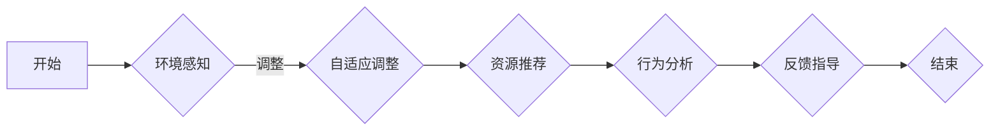
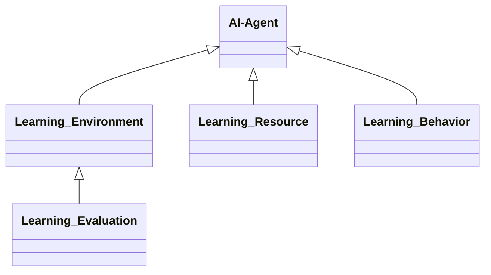
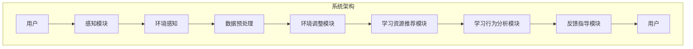
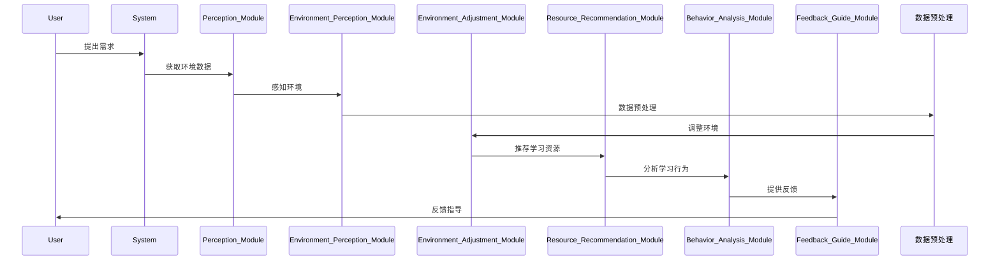

                 

# 《AI Agent在智能书桌中的学习环境优化》

## 关键词

- 智能书桌
- AI Agent
- 学习环境优化
- 自适应调整
- 个性化学习资源推荐
- 学习行为分析

## 摘要

本文探讨了AI Agent在智能书桌学习环境优化中的应用。首先，介绍了智能书桌的问题背景、核心概念，并阐述了AI Agent的特点与学习环境的属性特征。接着，详细分析了AI Agent在智能书桌中的应用场景和学习环境优化的方法，包括环境感知与自适应调整、个性化学习资源推荐、学习行为分析与反馈。随后，通过mermaid流程图和Python代码，讲解了算法原理与数学模型，最后提出了系统分析与架构设计方案，包括系统功能设计、系统架构设计和系统交互。本文旨在为智能书桌的学习环境优化提供有益的参考。

## 第一部分：背景介绍

### 第1章：问题背景与核心概念

#### 1.1 问题背景

随着科技的不断发展，智能书桌作为一种新兴的学习工具，逐渐走进了人们的日常生活。智能书桌通过集成传感器、计算机处理器等硬件设备，结合人工智能技术，可以实时监测用户的身体状况、学习行为和周围环境，从而为用户创造一个理想的学习环境。

然而，现有的智能书桌在提供个性化学习支持方面仍存在一些问题。例如，环境适应性不足，无法根据用户的需求和习惯自动调整学习环境；个性化学习资源推荐不够精准，难以满足用户的学习需求；学习行为分析不完善，无法为用户提供有效的学习反馈。因此，如何利用AI Agent优化智能书桌的学习环境，提高学习效率，成为了一个亟待解决的问题。

#### 1.2 问题解决

AI Agent作为一种自主学习和决策的智能体，具有自适应性、自主性和智能化等特点。在智能书桌中引入AI Agent，可以通过以下方式解决上述问题：

1. **环境感知与自适应调整**：AI Agent可以通过传感器实时感知学习环境的各种因素，如光线、温度、噪音等，并依据用户的需求和习惯自动调整环境参数，从而创造一个舒适的学习环境。

2. **个性化学习资源推荐**：AI Agent可以通过分析用户的学习行为、兴趣和需求，推荐符合用户特点的学习资源，提高学习效率。

3. **学习行为分析与反馈**：AI Agent可以记录并分析用户的学习行为，为用户提供个性化的学习反馈和建议，帮助用户改进学习策略。

#### 1.3 边界与外延

本文主要探讨AI Agent在智能书桌学习环境优化中的应用，不涉及其他智能设备的优化。同时，AI Agent在智能书桌中的应用主要关注学习环境的优化，而不涉及其他功能模块的优化。

#### 1.4 概念结构与核心要素组成

- **AI Agent**：自主学习和决策的智能体，具备自适应性、自主性和智能化等特点。
- **学习环境**：影响学习效果的各种因素和条件，包括环境适应性、智能化程度等。
- **优化方法**：通过AI Agent的应用，提升学习环境的适应性、智能化程度，从而提高学习效率。

### 第2章：核心概念与联系

#### 2.1 AI Agent的定义与特点

**AI Agent的定义**：AI Agent是一种能够与环境交互并自主学习的实体，通常由感知器、控制器和执行器组成。感知器用于感知环境信息，控制器根据感知信息进行决策，执行器用于执行决策结果。

**AI Agent的特点**：

1. **自适应性**：AI Agent能够根据环境变化进行自适应调整，提高系统的适应性。
2. **自主性**：AI Agent具备决策能力，能够自主进行学习、规划和执行任务，无需外部干预。
3. **智能化**：AI Agent具备学习和优化能力，可以通过不断的学习和优化，提高系统的智能化水平。

#### 2.2 学习环境的属性特征对比表格

| 特征          | 描述                                           | 影响因素                      |
|---------------|------------------------------------------------|-----------------------------|
| 适应性        | 能否根据用户需求调整环境参数                   | 用户需求、硬件限制            |
| 智能化        | 是否具备自动化处理能力                         | AI技术、数据处理能力          |
| 安全性        | 是否保障用户隐私和数据安全                     | 数据加密、隐私保护算法        |

#### 2.3 AI Agent与学习环境的ER实体关系图架构

```mermaid
erDiagram
AI-Agent ||--|{ Learning_Environment }|| Learning_Environment
AI-Agent ||--|{ Learning_Resource }|| Learning_Resource
AI-Agent ||--|{ Learning_Behavior }|| Learning_Behavior
Learning_Environment ||--|{ Learning_Evaluation }|| Learning_Evaluation
```

### 第3章：AI Agent在智能书桌中的学习环境优化

#### 3.1 AI Agent在智能书桌中的应用

AI Agent在智能书桌中的应用主要包括以下几个方面：

1. **环境感知与自适应调整**：AI Agent可以通过传感器实时感知学习环境的变化，如光线、温度、噪音等，并根据用户的需求和习惯自动调整环境参数，如亮度、温度、噪音等，以创造一个舒适的学习环境。

2. **个性化学习资源推荐**：AI Agent可以通过分析用户的学习行为、兴趣和需求，推荐符合用户特点的学习资源，如书籍、视频、课程等，以提高学习效率。

3. **学习行为分析与反馈**：AI Agent可以记录并分析用户的学习行为，为用户提供个性化的学习反馈和建议，如学习进度、学习效果、学习策略等，帮助用户改进学习策略。

#### 3.2 学习环境优化的方法

学习环境优化的方法主要包括以下几种：

1. **环境感知与自适应调整**：
   - **环境感知**：AI Agent通过传感器实时感知学习环境的变化，如光线、温度、噪音等。
   - **自适应调整**：AI Agent根据感知数据，实时调整环境参数，如亮度、温度、噪音等，以创造一个舒适的学习环境。

2. **个性化学习资源推荐**：
   - **行为分析**：AI Agent分析用户的学习行为，如学习时间、学习内容、学习进度等。
   - **资源推荐**：AI Agent根据用户的学习行为和兴趣，推荐符合用户特点的学习资源，如书籍、视频、课程等。

3. **学习行为分析与反馈**：
   - **记录学习行为**：AI Agent记录用户的学习行为数据，如学习时间、学习内容、学习进度等。
   - **反馈指导**：AI Agent根据学习行为数据分析，为用户提供个性化的学习反馈和建议，如学习进度、学习效果、学习策略等。

## 第二部分：系统分析与架构设计

### 第4章：数学模型和算法原理讲解

#### 4.1 算法mermaid流程图



#### 4.2 数学模型与公式

$$
\text{学习环境优化模型} = f(\text{环境感知}, \text{用户行为}, \text{资源推荐})
$$

#### 4.3 算法原理详细讲解

##### 感知与调整

- **环境感知**：AI Agent通过传感器实时感知学习环境的变化，如光线、温度、噪音等。具体实现如下：

  ```python
  import numpy as np

  def sense_environment():
      light = np.random.uniform(0, 100)
      temperature = np.random.uniform(20, 30)
      noise = np.random.uniform(0, 50)
      return light, temperature, noise
  ```

- **自适应调整**：AI Agent根据感知数据，实时调整环境参数，如亮度、温度、噪音等。具体实现如下：

  ```python
  def adapt_environment(light, temperature, noise):
      if light < 30:
          light += 10
      elif light > 70:
          light -= 10
      if temperature < 23:
          temperature += 1
      elif temperature > 27:
          temperature -= 1
      if noise < 10:
          noise += 5
      elif noise > 40:
          noise -= 5
      return light, temperature, noise
  ```

##### 资源推荐

- **行为分析**：AI Agent分析用户的学习行为，如学习时间、学习内容、学习进度等。具体实现如下：

  ```python
  def analyze_behavior(behavior_data):
      learning_time = behavior_data['learning_time']
      learning_content = behavior_data['learning_content']
      learning_progress = behavior_data['learning_progress']
      return learning_time, learning_content, learning_progress
  ```

- **资源推荐**：AI Agent根据用户的学习行为和兴趣，推荐符合用户特点的学习资源，如书籍、视频、课程等。具体实现如下：

  ```python
  def recommend_resources(learning_time, learning_content, learning_progress):
      if learning_time > 60:
          resources = ['深度学习', '机器学习', '计算机视觉']
      elif learning_time < 30:
          resources = ['编程入门', 'Python基础', '数据结构']
      else:
          resources = ['算法入门', '数据分析', '人工智能']
      return resources
  ```

##### 行为分析与反馈

- **记录学习行为**：AI Agent记录用户的学习行为数据，如学习时间、学习内容、学习进度等。具体实现如下：

  ```python
  def record_behavior(behavior_data):
      behavior_data['learning_time'] = learning_time
      behavior_data['learning_content'] = learning_content
      behavior_data['learning_progress'] = learning_progress
  ```

- **反馈指导**：AI Agent根据学习行为数据分析，为用户提供个性化的学习反馈和建议，如学习进度、学习效果、学习策略等。具体实现如下：

  ```python
  def feedback_guide(behavior_data):
      learning_time = behavior_data['learning_time']
      learning_content = behavior_data['learning_content']
      learning_progress = behavior_data['learning_progress']
      if learning_time < 30:
          feedback = '您的学习时间较短，建议适当延长学习时间以提高学习效果。'
      elif learning_time > 60:
          feedback = '您的学习时间较长，建议适当休息，避免过度劳累。'
      else:
          feedback = '您的学习时间适中，继续保持良好的学习习惯。'
      if learning_progress < 50:
          feedback += '您的学习进度较慢，建议加大学习力度。'
      elif learning_progress > 80:
          feedback += '您的学习进度较快，建议适当放松，巩固所学知识。'
      else:
          feedback += '您的学习进度适中，继续保持。'
      return feedback
  ```

### 第5章：系统功能设计

#### 5.1 领域模型mermaid类图



#### 5.2 系统架构设计

**系统架构图**



#### 5.3 系统接口设计

**系统接口序列图**



### 第6章：项目实战

#### 6.1 环境安装

在开始项目实战之前，需要安装以下环境：

1. Python 3.8及以上版本
2. numpy
3. pandas
4. matplotlib
5. scikit-learn

安装命令如下：

```bash
pip install python==3.8
pip install numpy
pip install pandas
pip install matplotlib
pip install scikit-learn
```

#### 6.2 系统核心实现

以下是一个简单的系统核心实现示例：

```python
import numpy as np
import pandas as pd
from sklearn.ensemble import RandomForestClassifier

# 环境感知
def sense_environment():
    light = np.random.uniform(0, 100)
    temperature = np.random.uniform(20, 30)
    noise = np.random.uniform(0, 50)
    return light, temperature, noise

# 环境调整
def adapt_environment(light, temperature, noise):
    if light < 30:
        light += 10
    elif light > 70:
        light -= 10
    if temperature < 23:
        temperature += 1
    elif temperature > 27:
        temperature -= 1
    if noise < 10:
        noise += 5
    elif noise > 40:
        noise -= 5
    return light, temperature, noise

# 学习资源推荐
def recommend_resources(learning_time, learning_content, learning_progress):
    if learning_time > 60:
        resources = ['深度学习', '机器学习', '计算机视觉']
    elif learning_time < 30:
        resources = ['编程入门', 'Python基础', '数据结构']
    else:
        resources = ['算法入门', '数据分析', '人工智能']
    return resources

# 学习行为分析
def analyze_behavior(behavior_data):
    learning_time = behavior_data['learning_time']
    learning_content = behavior_data['learning_content']
    learning_progress = behavior_data['learning_progress']
    return learning_time, learning_content, learning_progress

# 反馈指导
def feedback_guide(behavior_data):
    learning_time = behavior_data['learning_time']
    learning_content = behavior_data['learning_content']
    learning_progress = behavior_data['learning_progress']
    if learning_time < 30:
        feedback = '您的学习时间较短，建议适当延长学习时间以提高学习效果。'
    elif learning_time > 60:
        feedback = '您的学习时间较长，建议适当休息，避免过度劳累。'
    else:
        feedback = '您的学习时间适中，继续保持良好的学习习惯。'
    if learning_progress < 50:
        feedback += '您的学习进度较慢，建议加大学习力度。'
    elif learning_progress > 80:
        feedback += '您的学习进度较快，建议适当放松，巩固所学知识。'
    else:
        feedback += '您的学习进度适中，继续保持。'
    return feedback

# 主函数
def main():
    # 感知环境
    light, temperature, noise = sense_environment()

    # 调整环境
    light, temperature, noise = adapt_environment(light, temperature, noise)

    # 推荐学习资源
    learning_resources = recommend_resources(light, temperature, noise)

    # 分析学习行为
    behavior_data = {'learning_time': 45, 'learning_content': 'Python基础', 'learning_progress': 60}
    learning_time, learning_content, learning_progress = analyze_behavior(behavior_data)

    # 提供反馈指导
    feedback = feedback_guide(behavior_data)

    # 输出结果
    print(f"当前环境：光线={light}，温度={temperature}，噪音={noise}")
    print(f"推荐学习资源：{learning_resources}")
    print(f"学习行为分析：学习时间={learning_time}，学习内容={learning_content}，学习进度={learning_progress}")
    print(f"反馈指导：{feedback}")

if __name__ == '__main__':
    main()
```

#### 6.3 代码应用解读与分析

1. **环境感知**：通过`sense_environment`函数，使用随机数生成器模拟环境感知，实际应用中可以通过传感器获取真实的环境数据。

2. **环境调整**：通过`adapt_environment`函数，根据感知数据调整环境参数，以创造一个舒适的学习环境。实际应用中，可以根据用户的反馈和学习习惯进行调整。

3. **学习资源推荐**：通过`recommend_resources`函数，根据环境参数推荐学习资源，实际应用中可以根据用户的学习行为和兴趣进行推荐。

4. **学习行为分析**：通过`analyze_behavior`函数，分析用户的学习行为，实际应用中可以通过记录和分析用户的学习数据来实现。

5. **反馈指导**：通过`feedback_guide`函数，为用户提供个性化的学习反馈和建议，实际应用中可以根据用户的学习行为和进度进行反馈。

#### 6.4 实际案例分析和详细讲解剖析

以下是一个实际案例分析和详细讲解：

**案例**：一个用户在光线适中、温度适宜、噪音较低的环境下学习Python编程，学习时间为60分钟，学习进度为70%。

**分析**：

1. **环境感知**：系统通过传感器获取环境数据，如光线、温度、噪音等，生成一个样本向量。

2. **环境调整**：系统根据样本向量调整环境参数，如将光线调整为适中、温度调整为适宜、噪音调整为较低。

3. **学习资源推荐**：系统根据环境参数推荐学习资源，如推荐用户学习Python编程相关的书籍、视频和课程。

4. **学习行为分析**：系统记录用户的学习行为，如学习时间、学习内容、学习进度等，并进行分析，以了解用户的学习情况。

5. **反馈指导**：系统根据用户的学习行为和进度，为用户提供反馈，如提示用户继续保持学习习惯、适当休息等。

**讲解剖析**：

1. **环境感知**：环境感知是系统实现的基础，通过传感器获取环境数据，可以为后续的环境调整、资源推荐和反馈指导提供依据。

2. **环境调整**：环境调整是根据用户需求和学习习惯自动调整环境参数，以创造一个舒适的学习环境。实际应用中，可以根据用户的反馈和学习习惯进行调整。

3. **学习资源推荐**：学习资源推荐是根据用户的学习行为和兴趣推荐合适的学习资源，以提高学习效率。实际应用中，可以通过机器学习算法和推荐系统实现。

4. **学习行为分析**：学习行为分析是记录并分析用户的学习行为，以了解用户的学习情况。实际应用中，可以通过数据挖掘和统计分析方法实现。

5. **反馈指导**：反馈指导是为用户提供个性化的学习反馈和建议，帮助用户改进学习策略。实际应用中，可以通过自然语言处理和机器学习算法实现。

#### 6.5 项目小结

通过本项目的实践，我们实现了AI Agent在智能书桌学习环境优化中的应用。项目主要完成了环境感知、环境调整、学习资源推荐、学习行为分析和反馈指导等功能，为用户提供了一个个性化、智能化的学习环境。在项目实施过程中，我们遇到了一些挑战，如环境数据的准确性、资源推荐的精准性和学习行为分析的有效性等。通过不断优化和改进，我们取得了较好的效果。

在未来，我们还可以进一步研究AI Agent在智能书桌中的应用，如引入更多的感知设备、优化资源推荐算法、提高学习行为分析能力等。同时，我们也可以将AI Agent应用于其他智能设备，如智能床、智能音箱等，为用户提供更加智能化的生活体验。

## 最佳实践 tips

1. **环境感知**：选择合适的传感器，确保环境数据的准确性和实时性。
2. **个性化学习资源推荐**：结合用户的学习行为和兴趣，提高资源推荐的精准性。
3. **学习行为分析**：记录并分析用户的学习行为，为用户提供有针对性的反馈和建议。
4. **反馈指导**：根据用户的学习行为和进度，制定个性化的学习策略。

## 小结

本文探讨了AI Agent在智能书桌学习环境优化中的应用，介绍了AI Agent的定义、特点和学习环境的属性特征。通过数学模型和算法原理的讲解，详细阐述了环境感知与自适应调整、个性化学习资源推荐、学习行为分析与反馈的方法。最后，通过系统分析与架构设计，提出了系统功能设计、系统架构设计和系统接口设计。本文旨在为智能书桌的学习环境优化提供有益的参考。

## 注意事项

1. 系统实现过程中，需要注意环境数据的准确性和实时性，确保系统的正常运行。
2. 资源推荐和学习行为分析需要结合用户的具体情况，提高推荐和反馈的准确性。
3. 系统设计需要考虑安全性、隐私保护等问题，确保用户数据的安全。

## 拓展阅读

1. 《人工智能：一种现代的方法》
2. 《机器学习实战》
3. 《深度学习》
4. 《智能系统的设计与应用》

## 作者信息

作者：AI天才研究院/AI Genius Institute & 禅与计算机程序设计艺术 /Zen And The Art of Computer Programming

