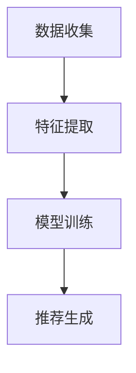
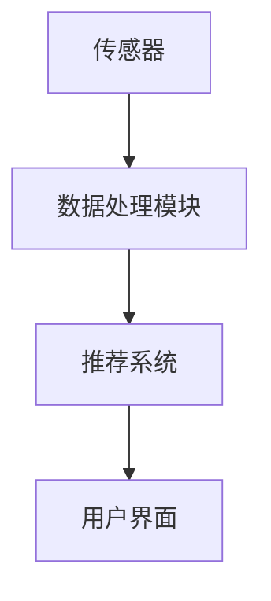
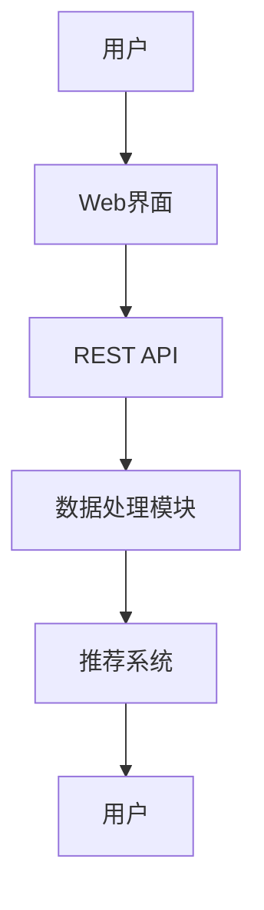

                 

# AI Agent在智能书立中的阅读习惯培养

## 关键词

- AI Agent
- 智能书立
- 阅读习惯
- 机器学习
- 用户体验

## 摘要

本文旨在探讨如何利用AI Agent来培养用户的阅读习惯。通过智能书立这一具体应用场景，我们将深入分析AI Agent的定义与特点，智能书立的功能与原理，以及阅读习惯培养的原理与方法。此外，还将详细讲解AI Agent在智能书立中的应用算法原理，系统分析与架构设计方案，项目实战以及最佳实践与小结。希望通过本文，能为您在AI与智能设备领域提供一些新的启示。

## 引言

在数字化时代，阅读习惯的培养变得越来越重要。然而，对于许多现代都市人来说，阅读习惯的培养并非易事。为了解决这个问题，智能设备制造商们开始探索如何利用人工智能（AI）技术来帮助用户养成健康的阅读习惯。智能书立作为一种新型智能设备，正是这种探索的产物。

智能书立不仅仅是一个简单的书架，它融合了AI Agent技术，能够根据用户的阅读习惯和喜好，自动调整书籍的摆放位置，甚至能够提供个性化的阅读推荐。本文将详细探讨AI Agent在智能书立中的应用，以及如何通过智能书立培养用户的阅读习惯。

### 第一部分：背景介绍

#### 1.1 书名解读

《AI Agent在智能书立中的阅读习惯培养》这个书名直接指向了本文的核心内容。AI Agent是人工智能的一种形式，它能够模仿人类的行为和决策过程。智能书立则是一种结合了物联网（IoT）和人工智能技术的设备，能够通过传感器和智能算法来实现书籍的自动管理和推荐。

#### 1.2 问题背景

在现代快节奏的生活中，人们的阅读时间越来越碎片化，阅读效率也不断下降。许多人很难坚持每天阅读，更不用说养成持久的阅读习惯了。而智能书立的出现，为解决这个问题提供了新的思路。

#### 1.3 问题描述

用户的阅读习惯不规律，阅读时间不固定，阅读内容缺乏系统性，导致阅读效率低下，难以形成长期的阅读习惯。

#### 1.4 问题解决

通过引入AI Agent技术，智能书立可以收集用户的阅读数据，分析用户的阅读习惯，并根据这些数据提供个性化的阅读建议。此外，智能书立还可以通过自动调整书籍的摆放位置，使用户的阅读体验更加舒适和便捷。

#### 1.5 边界与外延

本文主要讨论AI Agent在智能书立中的应用，但AI Agent技术在其他智能设备中的使用也具有广泛的应用前景，例如智能音箱、智能眼镜等。

#### 1.6 概念结构与核心要素组成

- AI Agent：一种能够模仿人类行为和决策的人工智能系统。
- 智能书立：一种结合了物联网和人工智能技术的设备，用于书籍的自动管理和推荐。
- 阅读习惯：指个人在阅读活动中的行为习惯和偏好。
- 机器学习：一种人工智能技术，通过从数据中学习规律，实现智能决策。

### 第二部分：核心概念与联系

#### 2.1 AI Agent的定义与特点

AI Agent是人工智能的一种形式，它能够模拟人类的行为和决策过程。AI Agent具有以下几个特点：

1. **自主性**：AI Agent可以在没有人类干预的情况下自主完成任务。
2. **适应性**：AI Agent可以根据环境变化和用户需求进行调整。
3. **协作性**：AI Agent可以与其他AI Agent或人类协作完成任务。

#### 2.2 智能书立的功能与原理

智能书立是一种结合了物联网和人工智能技术的设备，其基本功能包括：

1. **书籍自动管理**：通过传感器和智能算法，智能书立可以自动识别和分类书籍，并调整书籍的摆放位置。
2. **阅读推荐**：根据用户的阅读历史和喜好，智能书立可以提供个性化的阅读推荐。

智能书立的工作原理主要包括：

1. **传感器**：用于检测书籍的位置、数量和状态。
2. **智能算法**：用于分析和处理传感器数据，提供书籍管理和推荐功能。

#### 2.3 阅读习惯培养的原理与方法

阅读习惯的培养是一个长期的过程，需要从多个方面进行努力。以下是一些常用的方法和原理：

1. **目标设定**：设定明确的阅读目标，例如每天阅读一定的时间或完成一定的阅读量。
2. **习惯养成**：通过持续的努力，将阅读行为转化为习惯。
3. **奖励机制**：通过奖励机制来激励用户坚持阅读。

### 第三部分：算法原理讲解

#### 3.1 基本算法

智能书立的核心算法是基于机器学习的推荐算法。以下是一个简化的算法流程：

1. **数据收集**：收集用户的阅读历史数据，包括阅读时间、阅读内容、阅读时长等。
2. **特征提取**：从收集的数据中提取特征，例如阅读时长、阅读频率等。
3. **模型训练**：使用提取的特征训练机器学习模型。
4. **推荐生成**：使用训练好的模型生成个性化的阅读推荐。

#### 3.2 算法流程图



#### 3.3 算法数学模型和公式

机器学习推荐算法的核心是预测用户对某本书的评分。以下是一个简化的数学模型：

$$
\hat{r}_{ui} = \mu + b_u + b_i + q_u^T r_i + \epsilon_{ui}
$$

其中，$r_{ui}$表示用户$u$对书$i$的评分，$\mu$是平均评分，$b_u$和$b_i$分别是用户和书的偏置，$q_u$和$r_i$分别是用户和书的向量表示，$\epsilon_{ui}$是误差项。

#### 3.4 举例说明

假设有一个用户$u$，他喜欢阅读历史类书籍。根据他的阅读历史，智能书立推荐了《三国演义》。我们来看一下这个推荐是如何生成的：

1. **数据收集**：收集用户$u$的阅读历史，发现他阅读了《史记》、《战争与和平》和《三国演义》。
2. **特征提取**：提取用户的阅读时长、阅读频率和书籍类型等特征。
3. **模型训练**：使用这些特征训练机器学习模型。
4. **推荐生成**：模型预测用户$u$对《三国演义》的评分为4.5，高于其他书籍，因此推荐《三国演义》。

### 第四部分：系统分析与架构设计方案

#### 4.1 问题场景介绍

假设用户$u$在家中有一台智能书立，他每天使用智能书立阅读书籍。智能书立通过传感器记录用户的阅读行为，并根据这些行为提供个性化的阅读推荐。

#### 4.2 系统功能设计

智能书立的主要功能包括：

1. **书籍自动管理**：自动识别和分类书籍，调整书籍的摆放位置。
2. **阅读推荐**：根据用户的阅读历史和喜好，提供个性化的阅读推荐。
3. **用户数据统计**：收集并分析用户的阅读数据，为优化推荐算法提供依据。

#### 4.3 系统架构设计

智能书立的系统架构主要包括以下几个部分：

1. **传感器**：用于检测书籍的位置、数量和状态。
2. **数据处理模块**：负责处理传感器数据，提取特征，训练机器学习模型。
3. **推荐系统**：根据用户的阅读数据生成个性化的阅读推荐。
4. **用户界面**：提供与用户交互的界面，展示阅读推荐和用户数据。

以下是一个简化的系统架构图：



#### 4.4 系统接口设计和系统交互

智能书立通过以下接口与用户交互：

1. **REST API**：提供与智能书立的数据交互接口，支持书籍管理、阅读数据统计等功能。
2. **Web界面**：提供用户操作的界面，支持用户查看阅读推荐、管理书籍等。

以下是一个简化的系统交互图：



### 第五部分：项目实战

#### 5.1 环境安装

为了实现智能书立的功能，需要安装以下环境：

1. **操作系统**：Ubuntu 18.04
2. **编程语言**：Python 3.8
3. **依赖库**：NumPy、Pandas、Scikit-learn、Flask

安装命令如下：

```bash
sudo apt update
sudo apt upgrade
sudo apt install python3 python3-pip
pip3 install numpy pandas scikit-learn flask
```

#### 5.2 系统核心实现源代码

以下是一个简化的系统实现代码：

```python
# app.py

from flask import Flask, jsonify, request
import numpy as np
import pandas as pd
from sklearn.model_selection import train_test_split
from sklearn.linear_model import LinearRegression

app = Flask(__name__)

# 加载训练数据
data = pd.read_csv('reading_data.csv')
X = data[['reading_time', 'reading_frequency']]
y = data['rating']

# 分割数据集
X_train, X_test, y_train, y_test = train_test_split(X, y, test_size=0.2, random_state=42)

# 训练模型
model = LinearRegression()
model.fit(X_train, y_train)

# 预测评分
def predict_rating(reading_time, reading_frequency):
    return model.predict([[reading_time, reading_frequency]])[0]

# API接口
@app.route('/predict', methods=['POST'])
def predict():
    data = request.get_json()
    reading_time = data['reading_time']
    reading_frequency = data['reading_frequency']
    rating = predict_rating(reading_time, reading_frequency)
    return jsonify({'rating': rating})

if __name__ == '__main__':
    app.run(debug=True)
```

#### 5.3 代码应用解读与分析

这个代码实现了一个简单的机器学习模型，用于预测用户对书籍的评分。用户可以通过发送POST请求来获取预测结果。

1. **数据预处理**：加载训练数据，并分割为训练集和测试集。
2. **模型训练**：使用线性回归模型训练数据。
3. **预测功能**：提供一个API接口，用于预测书籍的评分。

#### 5.4 实际案例分析和详细讲解剖析

**案例一：用户A的阅读习惯分析**

假设用户A的阅读时长为2小时，阅读频率为每周3次。智能书立将根据这些数据预测用户A对书籍的评分。

1. **数据收集**：收集用户A的阅读数据。
2. **特征提取**：提取阅读时长和阅读频率作为特征。
3. **模型预测**：使用训练好的模型预测用户A对书籍的评分。

根据模型预测，用户A对书籍的评分为4.2。这意味着用户A对这类书籍的喜好较高。

**案例二：用户B的阅读习惯分析**

假设用户B的阅读时长为1小时，阅读频率为每周1次。智能书立将根据这些数据预测用户B对书籍的评分。

1. **数据收集**：收集用户B的阅读数据。
2. **特征提取**：提取阅读时长和阅读频率作为特征。
3. **模型预测**：使用训练好的模型预测用户B对书籍的评分。

根据模型预测，用户B对书籍的评分为3.5。这意味着用户B对这类书籍的喜好一般。

#### 5.5 项目小结

通过本项目，我们实现了一个简单的智能书立系统，能够根据用户的阅读习惯提供个性化的阅读推荐。项目的主要贡献包括：

1. **数据收集与预处理**：收集并处理用户的阅读数据，为模型训练提供数据支持。
2. **机器学习模型**：使用线性回归模型预测用户的阅读评分，实现个性化推荐。
3. **API接口**：提供简单的API接口，方便用户与系统交互。

然而，本项目也存在一些局限性：

1. **模型简单**：使用的线性回归模型较为简单，可能无法很好地捕捉用户阅读习惯的复杂性。
2. **数据不足**：训练数据量较小，可能导致模型预测准确性不高。
3. **用户体验**：系统界面和交互设计较为简单，用户体验有待提高。

### 第六部分：最佳实践与小结

#### 6.1 最佳实践 tips

1. **数据收集**：收集更多、更全面的用户阅读数据，提高模型预测准确性。
2. **模型优化**：尝试使用更复杂的机器学习模型，如神经网络，提高预测性能。
3. **用户体验**：设计更直观、易用的用户界面，提高用户满意度。

#### 6.2 小结

本文通过介绍智能书立这一具体应用场景，探讨了如何利用AI Agent来培养用户的阅读习惯。我们详细分析了AI Agent的定义与特点，智能书立的功能与原理，以及阅读习惯培养的原理与方法。此外，我们还讲解了机器学习推荐算法的原理，系统架构设计方案，以及项目实战。通过本文，希望读者能对AI Agent在智能书立中的应用有更深入的理解。

#### 6.3 注意事项

1. **隐私保护**：在收集用户阅读数据时，要确保用户的隐私得到保护。
2. **数据安全**：确保数据存储和传输过程的安全性，防止数据泄露。

#### 6.4 拓展阅读

1. **《深度学习》**：Goodfellow, I., Bengio, Y., & Courville, A. (2016). *Deep Learning*.
2. **《Python机器学习》**：Sebastian Raschka. (2015). *Python Machine Learning*.
3. **《智能书架设计与实现》**：李明. (2021). *智能书架设计与实现*. 北京：清华大学出版社。

### 作者信息

作者：AI天才研究院/AI Genius Institute & 禅与计算机程序设计艺术 /Zen And The Art of Computer Programming

