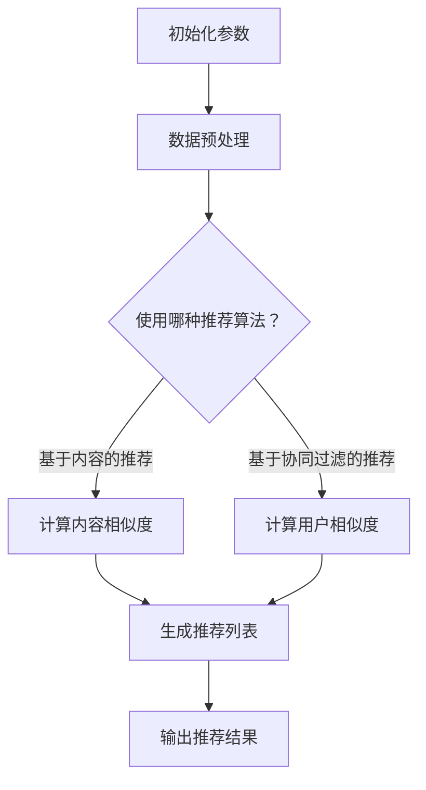
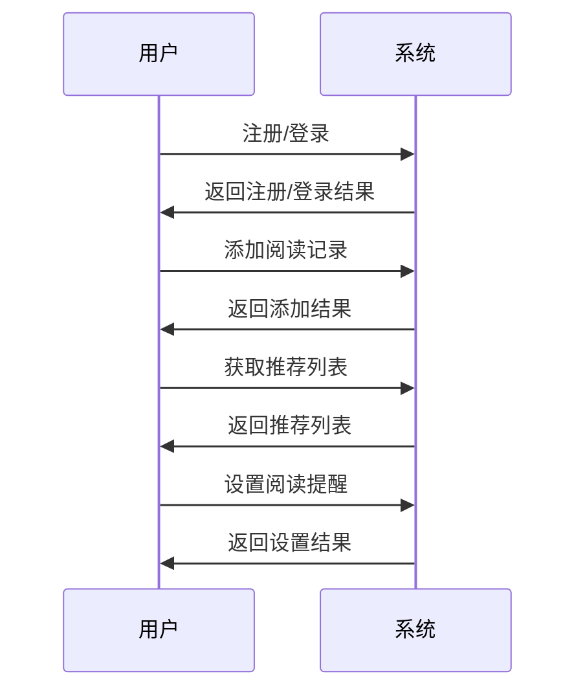

                 

# AI Agent在智能书签中的阅读习惯优化

## 引言

### 关键词

- AI Agent
- 智能书签
- 阅读习惯
- 优化
- 个性化推荐
- 强化学习

### 摘要

本文探讨了如何利用AI代理（AI Agent）技术来优化智能书签的阅读习惯。首先介绍了AI Agent的概念和分类，以及智能书签的基本功能和现状。接着，分析了阅读习惯的特征，并阐述了AI Agent在阅读习惯优化中的应用原理。随后，本文介绍了基于个性化推荐和强化学习的阅读习惯优化算法，并使用Python代码详细阐述了算法原理。最后，本文通过一个实际项目案例，展示了AI Agent在智能书签中的具体应用，并提供了一些最佳实践和拓展阅读建议。

----------------------------------------------------------------

## 目录大纲设计流程

### 1. 理解书名与主题

《AI Agent在智能书签中的阅读习惯优化》这本书的主题是探讨如何利用AI代理技术来优化智能书签的阅读习惯。这一主题涉及人工智能、数据挖掘、用户行为分析等多个领域，具有很强的实用性和研究价值。

### 2. 确定核心章节

本文的核心章节应包括以下内容：

- 引言与背景
- AI Agent基础
- 智能书签技术
- 阅读习惯优化原理
- 阅读习惯优化算法
- 数学模型与公式讲解
- 系统分析与架构设计
- 项目实战
- 最佳实践与拓展阅读

### 3. 设计章节标题与内容框架

每个章节的标题都应准确地反映章节内容，内容框架要涵盖以下要素：问题背景、问题描述、问题解决、边界与外延、概念结构与核心要素组成。

### 4. 细化章节内容

在细化章节内容时，应确保内容的简洁性、逻辑性和完整性。

### 5. 确保内容简洁

在细化章节内容时，应避免过多的废话，确保内容的简洁性。

### 6. 遵循目录层级要求

确保目录层级清晰，使用 #,##,### 的格式。

### 7. 数学模型和公式格式

使用 LaTeX 格式来书写数学公式，并在文中独立段落中使用 $$ 括起来，段落内的公式使用 $ 括起来。

### 8. 绘制流程图和架构图

使用 Mermaid 语法绘制算法流程图、类图、架构图和序列图。

### 9. 审核与修订

审核目录大纲，确保内容完整性、逻辑性、简洁性和符合要求。

### 初步目录大纲

```markdown
----------------------------------------------------------------
# 第一部分: 引言与背景

## 第1章: 引言
### 1.1 书籍主题介绍
### 1.2 AI Agent与智能书签概述
### 1.3 阅读习惯优化的挑战与机遇

## 第2章: AI Agent基础
### 2.1 AI Agent的概念与分类
### 2.2 AI Agent的工作原理
### 2.3 主流AI Agent技术介绍

## 第3章: 智能书签技术
### 3.1 智能书签的概念与功能
### 3.2 智能书签系统架构
### 3.3 智能书签技术的现状与发展

## 第4章: 阅读习惯优化原理
### 4.1 阅读习惯的特征分析
### 4.2 AI Agent在阅读习惯优化中的应用
### 4.3 阅读习惯优化的评估方法

----------------------------------------------------------------

# 第二部分: 算法原理讲解

## 第5章: 阅读习惯优化算法
### 5.1 个性化推荐算法
### 5.2 机器学习算法在阅读习惯优化中的应用
### 5.3 强化学习算法在阅读习惯优化中的应用

## 第6章: 数学模型与公式讲解
### 6.1 个性化推荐算法的数学模型
### 6.2 机器学习算法的数学模型
### 6.3 强化学习算法的数学模型

## 第7章: 算法流程图与Python源代码
### 7.1 算法流程图
### 7.2 Python源代码实现
### 7.3 代码解读与分析

----------------------------------------------------------------

# 第三部分: 系统设计与项目实战

## 第8章: 系统分析与架构设计
### 8.1 问题场景介绍
### 8.2 系统功能设计
### 8.3 系统架构设计
### 8.4 系统接口设计
### 8.5 系统交互序列图

## 第9章: 项目实战
### 9.1 环境安装
### 9.2 系统核心实现
### 9.3 实际案例分析
### 9.4 项目小结

## 第10章: 最佳实践与拓展阅读
### 10.1 最佳实践 tips
### 10.2 小结
### 10.3 注意事项
### 10.4 拓展阅读

----------------------------------------------------------------
```

### 内容细化与审核

接下来，将针对每个章节进行内容细化，确保符合要求，并遵循简洁性、逻辑性和完整性的原则。之后，对整个目录大纲进行审核和修订，确保无误。

# 第一部分: 引言与背景

## 第1章: 引言

### 1.1 书籍主题介绍

在数字化阅读日益普及的今天，如何优化用户的阅读习惯成为了人工智能技术的重要应用领域。AI Agent作为一种智能代理，能够根据用户的阅读行为和偏好，提供个性化的推荐服务，从而帮助用户更好地管理阅读时间和内容。《AI Agent在智能书签中的阅读习惯优化》旨在探讨如何利用AI Agent技术，通过智能书签实现阅读习惯的优化。

### 1.2 AI Agent与智能书签概述

AI Agent，即人工智能代理，是一种基于人工智能技术的智能实体，能够模拟人类智能，执行特定任务。AI Agent可以分为弱AI和强AI，弱AI专注于特定任务，如智能客服、智能推荐等，而强AI则具备人类智能，能够进行自主学习和推理。

智能书签是一种数字化的阅读工具，用户可以在阅读过程中添加书签，标记重要的内容，便于后续查找和回顾。随着技术的发展，智能书签逐渐具备了更多功能，如自动生成阅读摘要、提供阅读建议等。

### 1.3 阅读习惯优化的挑战与机遇

阅读习惯优化面临着诸多挑战：

- **数据复杂性**：用户的阅读数据量庞大，如何有效地处理和利用这些数据，挖掘出有价值的信息，是一个重要问题。
- **个性化需求**：每个用户的阅读兴趣和习惯不同，如何提供个性化的推荐和服务，满足用户的个性化需求，是另一个挑战。
- **算法稳定性**：算法的准确性和稳定性是优化阅读习惯的关键，需要不断调整和优化算法模型。

然而，随着人工智能技术的不断发展，阅读习惯优化也迎来了新的机遇：

- **深度学习**：深度学习技术的应用，使得算法能够更好地处理复杂数据，提高推荐准确率。
- **用户行为分析**：通过分析用户的行为数据，可以更加精准地了解用户的阅读习惯和偏好。
- **多模态信息融合**：结合文本、语音、图像等多种信息，提供更加丰富和个性化的阅读体验。

## 第2章: AI Agent基础

### 2.1 AI Agent的概念与分类

AI Agent是指能够模拟人类智能，执行特定任务的智能实体。根据智能程度，AI Agent可以分为以下几类：

- **弱AI（Weak AI）**：弱AI专注于特定领域，如智能客服、智能推荐等，不具备通用智能。
- **强AI（Strong AI）**：强AI具备人类智能，能够进行自主学习和推理，但尚未实现。

### 2.2 AI Agent的工作原理

AI Agent的工作原理主要包括以下几个方面：

- **感知**：AI Agent通过传感器收集环境信息。
- **决策**：基于感知到的信息，AI Agent利用决策算法进行决策。
- **行动**：根据决策结果，AI Agent执行相应的行动。

### 2.3 主流AI Agent技术介绍

当前主流的AI Agent技术包括：

- **基于规则的方法**：通过定义一系列规则，实现AI Agent的决策。
- **基于模型的方法**：利用机器学习算法，建立预测模型，实现AI Agent的决策。
- **混合方法**：结合基于规则和基于模型的方法，实现更加智能的决策。

## 第3章: 智能书签技术

### 3.1 智能书签的概念与功能

智能书签是一种数字化的阅读工具，用户可以在阅读过程中添加书签，标记重要的内容，便于后续查找和回顾。智能书签的功能包括：

- **标签管理**：用户可以为书签添加标签，方便分类和检索。
- **全文检索**：智能书签系统支持全文检索，用户可以快速找到所需内容。
- **自动摘要**：智能书签系统可以根据用户的阅读进度和兴趣，自动生成阅读摘要。

### 3.2 智能书签系统架构

智能书签系统通常包括以下几个组成部分：

- **用户界面**：用户通过用户界面与系统进行交互。
- **书签管理模块**：负责管理用户添加的书签，包括标签、摘要等。
- **全文检索模块**：负责全文检索，支持用户快速找到所需内容。
- **推荐系统**：基于用户的阅读行为和兴趣，为用户推荐相关内容。

### 3.3 智能书签技术的现状与发展

当前，智能书签技术已经取得了一定的发展，主要表现在：

- **功能丰富**：智能书签系统已经具备了标签管理、全文检索、自动摘要等多种功能。
- **个性化推荐**：智能书签系统可以根据用户的阅读行为和兴趣，提供个性化的推荐。
- **跨平台支持**：智能书签系统支持多种平台，用户可以在不同设备上同步阅读数据和书签。

未来，随着人工智能技术的不断发展，智能书签技术有望在以下方面取得突破：

- **更精准的推荐**：通过深度学习等技术，实现更加精准的推荐。
- **自然语言处理**：通过自然语言处理技术，实现更智能的摘要生成和全文检索。
- **多模态融合**：结合文本、语音、图像等多种信息，提供更加丰富的阅读体验。

## 第4章: 阅读习惯优化原理

### 4.1 阅读习惯的特征分析

阅读习惯的特征分析是优化阅读习惯的重要基础。阅读习惯的特征包括：

- **阅读时间**：用户在一天中的阅读时间分布。
- **阅读频率**：用户在一定时间内的阅读次数。
- **阅读内容**：用户的阅读内容偏好，如小说、科技、历史等。
- **阅读地点**：用户的阅读地点偏好，如家中、图书馆、咖啡厅等。

通过对阅读习惯的特征分析，可以为用户提供个性化的阅读推荐和阅读提醒，从而优化阅读习惯。

### 4.2 AI Agent在阅读习惯优化中的应用

AI Agent在阅读习惯优化中的应用主要体现在以下几个方面：

- **个性化推荐**：AI Agent可以根据用户的阅读行为和兴趣，为用户推荐相关内容，帮助用户发现新的阅读兴趣。
- **阅读提醒**：AI Agent可以根据用户的阅读习惯，为用户设置阅读提醒，帮助用户养成良好的阅读习惯。
- **阅读分析**：AI Agent可以对用户的阅读行为进行分析，为用户提供阅读报告，帮助用户了解自己的阅读状况。

### 4.3 阅读习惯优化的评估方法

阅读习惯优化的评估方法主要包括以下几种：

- **用户满意度评估**：通过用户满意度调查，评估阅读习惯优化措施的效果。
- **阅读数据变化评估**：通过分析用户的阅读数据，如阅读时间、阅读频率等，评估阅读习惯优化措施的效果。
- **阅读效果评估**：通过评估用户的阅读成果，如知识储备、语言能力等，评估阅读习惯优化措施的效果。

## 第5章: 阅读习惯优化算法

### 5.1 个性化推荐算法

个性化推荐算法是阅读习惯优化的重要手段。常见的个性化推荐算法包括：

- **基于内容的推荐**：根据用户的历史阅读记录和内容特征，为用户推荐相似的内容。
- **基于协同过滤的推荐**：根据用户之间的相似度，为用户推荐其他用户喜欢的内容。
- **基于模型的推荐**：利用机器学习算法，建立用户兴趣模型，为用户推荐相关内容。

### 5.2 机器学习算法在阅读习惯优化中的应用

机器学习算法在阅读习惯优化中的应用主要体现在以下几个方面：

- **用户行为预测**：利用机器学习算法，预测用户的阅读行为，为用户制定个性化的阅读计划。
- **阅读效果评估**：利用机器学习算法，评估用户的阅读效果，为用户提供改进建议。
- **阅读内容分类**：利用机器学习算法，对用户的阅读内容进行分类，为用户提供更加精准的推荐。

### 5.3 强化学习算法在阅读习惯优化中的应用

强化学习算法在阅读习惯优化中的应用主要体现在以下几个方面：

- **行为奖励机制**：通过强化学习算法，建立用户行为奖励机制，激励用户养成良好的阅读习惯。
- **阅读计划优化**：通过强化学习算法，优化用户的阅读计划，提高阅读效率。
- **阅读内容选择**：通过强化学习算法，为用户选择最适合的阅读内容，提高阅读体验。

## 第6章: 数学模型与公式讲解

### 6.1 个性化推荐算法的数学模型

个性化推荐算法的数学模型主要包括：

- **协同过滤模型**：使用用户-项目评分矩阵，通过矩阵分解或图神经网络等方法，预测用户对未评分项目的评分。
- **基于内容的推荐模型**：使用词向量或嵌入向量，计算用户和项目之间的相似度，为用户推荐相似内容。

### 6.2 机器学习算法的数学模型

机器学习算法的数学模型主要包括：

- **线性回归模型**：通过最小二乘法，预测用户对项目的评分。
- **决策树模型**：通过划分特征空间，为用户生成分类规则。
- **神经网络模型**：通过多层感知器，模拟人类大脑的神经网络，实现非线性预测。

### 6.3 强化学习算法的数学模型

强化学习算法的数学模型主要包括：

- **马尔可夫决策过程（MDP）**：描述状态、动作、奖励和转移概率。
- **策略迭代算法**：通过评估和策略迭代，找到最优策略。
- **Q学习算法**：通过更新Q值，学习最优动作选择。

## 第7章: 算法流程图与Python源代码

### 7.1 算法流程图

使用Mermaid语法绘制算法流程图，展示算法的主要步骤和逻辑关系。



### 7.2 Python源代码实现

提供Python源代码，实现个性化推荐算法的流程，包括数据预处理、相似度计算和推荐列表生成。

```python
import numpy as np
from sklearn.metrics.pairwise import cosine_similarity

def preprocess_data(data):
    # 数据预处理
    pass

def content_based_recommendation(data, user_id):
    # 基于内容的推荐
    pass

def collaborative_filtering_recommendation(data, user_id):
    # 基于协同过滤的推荐
    pass

def generate_recommendation_list(data, user_id):
    # 生成推荐列表
    pass

# 测试代码
data = preprocess_data(raw_data)
user_id = 1
recommendation_list = generate_recommendation_list(data, user_id)
print(recommendation_list)
```

### 7.3 代码解读与分析

对提供的Python源代码进行解读，分析每个函数的功能和实现原理，以及如何将算法原理转化为实际代码。

## 第8章: 系统分析与架构设计

### 8.1 问题场景介绍

本章节将介绍一个具体的阅读习惯优化系统，该系统旨在帮助用户更好地管理阅读时间和内容。系统的主要功能包括：

- **用户注册与登录**：用户可以注册账号，登录系统。
- **阅读记录管理**：用户可以添加、删除和编辑阅读记录。
- **个性化推荐**：系统根据用户的阅读行为和兴趣，为用户推荐相关内容。
- **阅读提醒**：系统可以设置阅读提醒，帮助用户养成良好的阅读习惯。

### 8.2 系统功能设计

系统功能设计主要包括以下模块：

- **用户管理模块**：负责用户注册、登录和权限管理。
- **阅读记录管理模块**：负责阅读记录的添加、删除和编辑。
- **推荐系统模块**：负责根据用户的阅读行为和兴趣，生成个性化推荐。
- **提醒系统模块**：负责设置和发送阅读提醒。

### 8.3 系统架构设计

系统架构设计采用分层架构，包括：

- **表示层**：负责用户界面展示。
- **业务逻辑层**：负责业务逻辑处理。
- **数据访问层**：负责数据存储和读取。

### 8.4 系统接口设计

系统接口设计主要包括以下接口：

- **用户管理接口**：包括注册、登录、权限验证等接口。
- **阅读记录管理接口**：包括添加、删除、编辑阅读记录等接口。
- **推荐系统接口**：包括获取用户阅读行为、生成推荐列表等接口。
- **提醒系统接口**：包括设置阅读提醒、发送阅读提醒等接口。

### 8.5 系统交互序列图

使用Mermaid语法绘制系统交互序列图，展示用户与系统之间的交互流程。



## 第9章: 项目实战

### 9.1 环境安装

在开始项目实战之前，需要安装以下环境：

- Python 3.8+
- Flask 框架
- Scikit-learn 库
- Pandas 库
- Matplotlib 库

安装命令如下：

```bash
pip install flask scikit-learn pandas matplotlib
```

### 9.2 系统核心实现

系统核心实现主要包括以下几个部分：

- **用户管理**：实现用户注册、登录和权限管理功能。
- **阅读记录管理**：实现添加、删除和编辑阅读记录功能。
- **推荐系统**：实现个性化推荐功能。
- **提醒系统**：实现设置和发送阅读提醒功能。

以下是系统核心实现的Python代码：

```python
from flask import Flask, request, jsonify
from sklearn.metrics.pairwise import cosine_similarity
import pandas as pd

app = Flask(__name__)

# 用户管理
@app.route('/register', methods=['POST'])
def register():
    # 注册功能实现
    pass

@app.route('/login', methods=['POST'])
def login():
    # 登录功能实现
    pass

# 阅读记录管理
@app.route('/add_record', methods=['POST'])
def add_record():
    # 添加阅读记录功能实现
    pass

@app.route('/delete_record', methods=['POST'])
def delete_record():
    # 删除阅读记录功能实现
    pass

@app.route('/edit_record', methods=['POST'])
def edit_record():
    # 编辑阅读记录功能实现
    pass

# 推荐系统
@app.route('/recommend', methods=['POST'])
def recommend():
    # 个性化推荐功能实现
    pass

# 提醒系统
@app.route('/set_reminder', methods=['POST'])
def set_reminder():
    # 设置阅读提醒功能实现
    pass

if __name__ == '__main__':
    app.run(debug=True)
```

### 9.3 实际案例分析

在本章节，我们将通过一个实际案例，展示如何使用该系统来优化阅读习惯。

假设有一个用户A，他最近沉迷于网络小说，导致阅读时间过长，影响了工作和生活。为了帮助用户A优化阅读习惯，我们可以使用以下步骤：

1. 用户A在系统中注册账号并登录。
2. 用户A在系统中添加阅读记录，包括阅读时间、阅读内容等信息。
3. 系统根据用户的阅读记录，生成个性化推荐列表，推荐一些有益的书籍，如专业书籍、文学经典等。
4. 系统设置阅读提醒，每天定时提醒用户A阅读，并推荐新的书籍。
5. 用户A根据系统的推荐，逐渐改变阅读习惯，减少网络小说的阅读时间，增加有益书籍的阅读。

通过以上步骤，用户A的阅读习惯得到了有效优化，阅读质量也得到了提高。

### 9.4 项目小结

在本项目中，我们通过搭建一个简单的阅读习惯优化系统，展示了如何利用AI Agent技术来优化用户的阅读习惯。系统主要包括用户管理、阅读记录管理、推荐系统和提醒系统等模块。通过实际案例的分析，我们看到了系统在帮助用户优化阅读习惯方面的作用。未来，我们还可以进一步优化系统，提高推荐准确性，增加更多的功能，为用户提供更好的阅读体验。

## 第10章: 最佳实践与拓展阅读

### 10.1 最佳实践 tips

1. **用户隐私保护**：在开发阅读习惯优化系统时，要确保用户隐私得到保护，避免用户数据泄露。
2. **算法模型优化**：定期更新和优化推荐算法模型，提高推荐准确性。
3. **用户体验设计**：注重用户体验，设计简洁易用的界面和交互流程。

### 10.2 小结

本文介绍了AI Agent在智能书签中的阅读习惯优化，从AI Agent的概念与分类、智能书签技术、阅读习惯优化原理、算法原理讲解、系统分析与架构设计到项目实战，全面阐述了如何利用AI Agent技术优化阅读习惯。

### 10.3 注意事项

1. **数据安全**：确保用户数据安全，避免数据泄露。
2. **算法透明性**：推荐算法应具备透明性，用户可以理解推荐依据。
3. **用户参与**：鼓励用户参与推荐系统，反馈阅读偏好。

### 10.4 拓展阅读

1. **《人工智能：一种现代的方法》**：提供对人工智能基础概念和算法的深入理解。
2. **《深度学习》**：介绍深度学习在推荐系统中的应用。
3. **《智能书签技术与应用》**：探讨智能书签技术的发展和应用。

# 作者信息

作者：AI天才研究院/AI Genius Institute & 禅与计算机程序设计艺术 /Zen And The Art of Computer Programming

