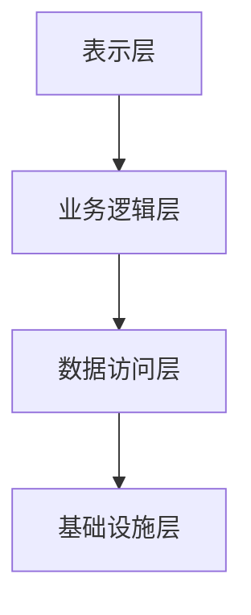
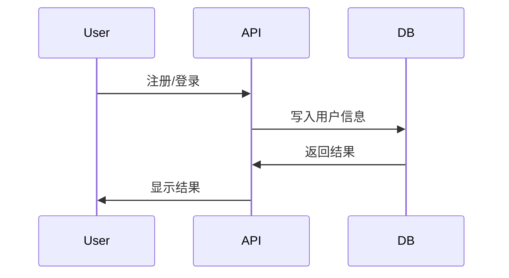
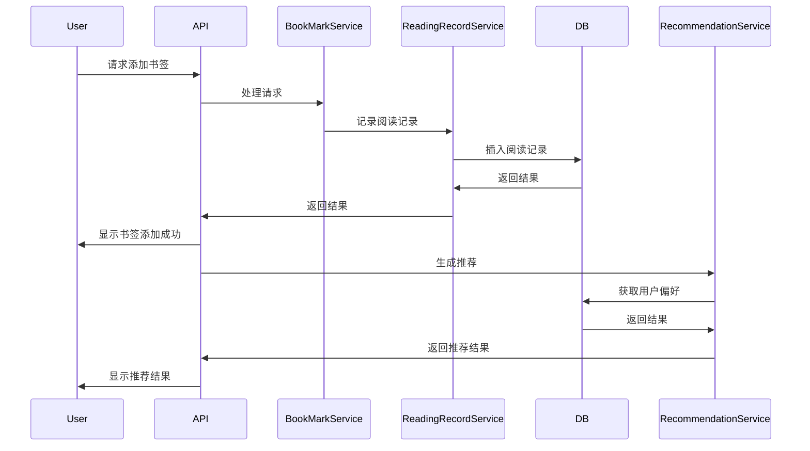

                 


## 引言

在当今信息化时代，人工智能（AI）技术以其强大的数据处理能力和智能决策能力，正逐步渗透到我们日常生活的方方面面。智能书签作为AI技术在阅读领域的应用之一，已经成为现代阅读者的必备工具。它不仅可以帮助用户高效地标记和管理阅读资料，还能通过分析用户的阅读习惯，提供个性化的阅读推荐。本文将围绕“AI Agent在智能书签中的阅读习惯分析”这一主题，深入探讨AI Agent如何通过数据分析和机器学习算法，对用户的阅读习惯进行有效分析，从而提升用户的阅读体验。

本文结构如下：

1. **背景介绍**：介绍人工智能和智能书签的发展背景及现状。
2. **核心概念与联系**：阐述AI Agent、阅读习惯分析及其相互关系。
3. **算法原理讲解**：详细讲解阅读习惯分析算法的原理和流程。
4. **数学模型和数学公式**：介绍相关数学模型和公式，并进行举例说明。
5. **系统分析与架构设计方案**：分析智能书签系统架构，并设计系统接口和交互流程。
6. **项目实战**：通过实际项目案例，展示AI Agent在智能书签中的应用。
7. **最佳实践与拓展**：总结实践经验，提出注意事项，并推荐拓展阅读资源。

通过本文的详细分析，我们希望读者能够全面了解AI Agent在智能书签中的应用，掌握阅读习惯分析的核心技术和方法，为未来的智能阅读领域提供新的思路和方向。

### 1. 背景介绍

#### 1.1 人工智能的发展历程

人工智能（AI，Artificial Intelligence）作为计算机科学的一个重要分支，其发展历程可以追溯到20世纪50年代。早期的AI研究主要集中在逻辑推理、知识表示和问题求解等领域。1956年，达特茅斯会议的召开标志着人工智能正式成为一个独立的学科领域。自此以后，AI经历了数个发展阶段，从最初的规则推理、符号计算，到后来的专家系统、机器学习，再到如今深度学习和强化学习，每一次技术的突破都为AI的进步带来了新的契机。

在AI的发展历程中，重要的里程碑包括：1958年，马文·明斯基和约翰·麦卡锡等人创立了首次AI实验室——麦卡锡实验室；1970年代，专家系统的兴起使得AI在医疗、金融等领域得到了广泛应用；1980年代，机器学习技术的兴起使得AI能够在大量数据中进行自动学习；2000年代，深度学习的出现使得AI在图像识别、语音识别等任务上取得了突破性进展；近年来，随着计算能力和数据资源的不断提升，AI技术已经广泛应用于各行各业，从智能家居、智能医疗到自动驾驶、智能金融等。

#### 1.2 智能书签的概念与功能

智能书签是AI技术在阅读领域的一个重要应用。与传统的书签相比，智能书签不仅能够标记和存储阅读内容，还能通过分析用户的阅读行为和偏好，提供个性化的阅读推荐。智能书签通常具备以下功能：

1. **内容标记**：用户可以随时对阅读材料中的重要段落、图片、图表等进行标注，以便后续查阅。
2. **标签管理**：智能书签系统能够根据用户的标注内容，自动生成标签，并支持用户自定义标签，方便对阅读资料进行分类管理。
3. **阅读推荐**：通过分析用户的阅读历史和偏好，智能书签系统可以推荐符合用户兴趣的新书、文章或资料。
4. **阅读记录**：智能书签系统能够记录用户的阅读进度、阅读时间和阅读频率，帮助用户更好地管理阅读时间。
5. **智能提醒**：系统可以根据用户的阅读记录，智能推送阅读提醒，帮助用户按时完成阅读任务。

#### 1.3 智能书签在阅读中的应用前景

随着人工智能技术的不断进步，智能书签在阅读中的应用前景十分广阔。以下是一些潜在的应用场景：

1. **个性化阅读**：通过分析用户的阅读习惯和偏好，智能书签可以为用户提供个性化的阅读内容推荐，提升用户的阅读体验。
2. **学习辅助**：智能书签可以记录用户的学习进度，并根据用户的阅读记录，提供针对性的学习资源和辅导建议。
3. **信息检索**：智能书签系统能够通过分析用户的阅读行为，快速定位用户需要的信息，提高信息检索效率。
4. **知识管理**：智能书签可以帮助用户更好地管理和利用阅读资料，构建个人知识库。
5. **社交互动**：智能书签系统可以分析用户的阅读行为和偏好，为用户推荐具有相似阅读兴趣的朋友，促进社交互动。

总之，智能书签作为AI技术在阅读领域的重要应用，不仅能够提升用户的阅读效率，还能为用户创造更加智能和个性化的阅读体验。

#### 1.4 AI Agent的定义与分类

AI Agent，即人工智能代理，是一种能够自主执行任务、与环境交互并作出决策的计算机程序。它具有以下基本特征：

1. **自主性**：AI Agent能够根据预设的目标和规则，自主选择行动策略，而不需要外部指令。
2. **交互性**：AI Agent能够通过传感器感知环境信息，并通过执行器与环境进行交互。
3. **适应性**：AI Agent能够根据环境变化和经验反馈，调整自身行为策略，以实现优化目标。

根据不同的分类标准，AI Agent可以分为多种类型：

1. **根据任务类型**：AI Agent可以分为任务型代理、决策型代理和智能体平台型代理。
   - **任务型代理**：专注于完成特定任务的AI代理，如搜索引擎、智能客服等。
   - **决策型代理**：具备决策能力的AI代理，可以在复杂环境中做出最优决策，如自动驾驶系统、金融交易系统等。
   - **智能体平台型代理**：作为多个任务型或决策型代理的集成平台，提供统一的任务调度和管理服务，如智能家居控制系统、企业资源规划系统等。

2. **根据决策方式**：AI Agent可以分为基于规则的代理、基于学习的代理和混合型代理。
   - **基于规则的代理**：通过预定义的规则库进行决策，适用于规则明确、环境简单的场景。
   - **基于学习的代理**：通过机器学习算法从数据中学习决策策略，适用于数据量大、环境复杂的场景。
   - **混合型代理**：结合规则和学习的优势，既利用预定义的规则，又通过数据学习优化决策策略，适用于需要灵活应对复杂环境的场景。

3. **根据自主性级别**：AI Agent可以分为弱自主性代理、半自主性代理和强自主性代理。
   - **弱自主性代理**：在执行任务时主要依赖外部指令，自主性较低。
   - **半自主性代理**：具备一定程度的自主性，能够在一定范围内自主决策，但仍需要外部监督和干预。
   - **强自主性代理**：具备高度的自主性，能够在复杂环境中自主执行任务并作出决策，不需要外部干预。

AI Agent在智能书签中的应用具有重要意义。通过感知用户的阅读行为、分析用户偏好和提供个性化服务，AI Agent可以显著提升用户的阅读体验和效率。同时，AI Agent还能为智能书签系统提供智能化的决策支持，优化系统功能和性能。因此，深入研究和应用AI Agent技术，对于推动智能书签的发展具有重要意义。

### 2. 核心概念与联系

在探讨AI Agent在智能书签中的应用之前，我们需要首先理解核心概念，并分析它们之间的联系。

#### 2.1 AI Agent的定义与功能

AI Agent是一种能够自主执行任务、与环境交互并作出决策的计算机程序。其核心功能包括：

1. **感知**：通过传感器获取环境信息，如用户的阅读行为、偏好和上下文等。
2. **理解**：对感知到的信息进行理解，识别出关键要素和模式，如用户的阅读习惯、兴趣点等。
3. **决策**：基于理解和目标，自主选择行动策略，如推荐阅读内容、调整阅读模式等。
4. **执行**：根据决策结果执行具体操作，如更新书签、推送通知、调整阅读界面等。

AI Agent通过这些功能，能够实现高度自动化的个性化服务，提高用户的使用体验和效率。

#### 2.2 阅读习惯分析的概念

阅读习惯分析是通过对用户阅读行为数据的收集、处理和分析，来识别和理解用户的阅读模式、偏好和需求。具体包括以下几个方面：

1. **数据收集**：通过日志记录、用户反馈等方式收集用户的阅读行为数据，如阅读时间、阅读频率、标注和评论等。
2. **数据预处理**：对收集到的原始数据进行清洗、归一化和特征提取，为后续分析提供高质量的数据。
3. **行为识别**：通过模式识别和机器学习算法，识别用户的阅读习惯和行为模式，如高频阅读时间、偏好主题等。
4. **偏好分析**：结合用户的历史阅读数据和个性化需求，分析用户的阅读偏好，为个性化推荐提供依据。

#### 2.3 AI Agent与阅读习惯分析的联系

AI Agent在智能书签中的应用，正是基于对用户阅读习惯的深入分析和理解。以下从几个方面阐述AI Agent与阅读习惯分析之间的联系：

1. **感知与理解**：AI Agent通过传感器感知用户的阅读行为数据，如翻页速度、标注频率等，然后通过机器学习算法进行数据理解和行为模式识别。
2. **决策与推荐**：基于对用户阅读习惯的分析，AI Agent能够做出智能化的决策，如推荐用户感兴趣的文章、调整阅读模式等，从而提高用户的阅读体验和效率。
3. **执行与反馈**：AI Agent根据决策结果执行具体操作，如更新书签、推送通知等，并通过用户反馈进一步优化系统功能和服务。
4. **持续学习**：AI Agent能够根据用户的实时反馈和阅读行为，不断调整和优化自身的决策策略，实现持续学习和自我进化。

总之，AI Agent通过深入分析和理解用户的阅读习惯，能够为智能书签系统提供个性化的服务，从而提升用户的阅读体验和效率。这种联系不仅体现了AI Agent技术的应用价值，也为智能书签的发展提供了新的方向和思路。

### 3. 算法原理讲解

在深入探讨AI Agent如何分析用户的阅读习惯之前，我们需要理解阅读习惯分析的核心算法原理。本文将详细解释这一过程，包括数据收集与预处理、特征提取与模型选择、模型训练与评估等多个步骤。

#### 3.1 数据收集与预处理

数据收集是阅读习惯分析的第一步，也是至关重要的一步。在这一阶段，AI Agent需要通过各种传感器和日志记录来收集用户的阅读行为数据。这些数据可能包括：

- **用户阅读行为数据**：如阅读时间、阅读频率、阅读进度、标注和评论等。
- **上下文信息**：如阅读材料的内容、主题、作者等。
- **设备信息**：如设备类型、操作系统版本、网络连接状态等。

收集到的原始数据通常是不完整、不统一且可能存在噪声的，因此需要进行预处理。预处理步骤通常包括：

1. **数据清洗**：去除重复、无效或错误的数据，确保数据质量。
2. **数据归一化**：将不同数据范围的数据转换到同一尺度，便于后续分析。
3. **特征提取**：从原始数据中提取出对分析有用的特征，如用户的阅读频率、阅读时长、标注类型和频率等。

#### 3.2 特征提取与模型选择

特征提取是将原始数据转换为可用于模型训练的形式。在这一阶段，AI Agent需要识别出对阅读习惯分析有显著影响的特征。常见的特征提取方法包括：

- **统计特征**：如平均值、标准差、最大值、最小值等。
- **文本特征**：如词频、词向量、主题模型等。
- **序列特征**：如阅读行为的时间序列、标注的序列等。

选择适当的模型是实现有效阅读习惯分析的关键。常见的模型选择方法包括：

- **机器学习模型**：如决策树、随机森林、支持向量机（SVM）、朴素贝叶斯（Naive Bayes）等。
- **深度学习模型**：如卷积神经网络（CNN）、循环神经网络（RNN）、长短期记忆网络（LSTM）等。
- **混合模型**：结合多种模型的优势，如基于规则的模型与机器学习模型的结合。

在选择模型时，需要考虑以下因素：

- **模型复杂性**：复杂的模型可能提供更高的准确度，但训练时间和计算资源需求也更高。
- **数据量**：对于大数据量，深度学习模型可能表现更好；对于小数据量，传统机器学习模型可能更适合。
- **问题特性**：对于分类问题，分类模型（如SVM、随机森林）可能更为合适；对于回归问题，回归模型（如线性回归、决策树回归）更为适用。

#### 3.3 模型训练与评估

在模型选择之后，需要通过训练数据对模型进行训练，使其能够对新的阅读行为数据进行预测。模型训练通常包括以下步骤：

1. **数据划分**：将数据集划分为训练集、验证集和测试集，用于模型训练、调优和评估。
2. **模型训练**：使用训练集数据对模型进行训练，调整模型参数，使其能够拟合数据。
3. **模型调优**：通过验证集评估模型性能，调整模型参数，优化模型效果。
4. **模型评估**：使用测试集评估模型的最终性能，确保模型在实际应用中具有良好的表现。

常见的模型评估指标包括：

- **准确率**：预测正确的样本数占总样本数的比例。
- **召回率**：预测正确的正样本数占总正样本数的比例。
- **精确率**：预测正确的正样本数占总预测为正样本的数量的比例。
- **F1分数**：精确率和召回率的调和平均，综合衡量模型的准确性和鲁棒性。

#### 3.4 AI Agent的工作流程

AI Agent在阅读习惯分析中的工作流程通常包括以下几个步骤：

1. **数据收集**：通过传感器和日志记录收集用户的阅读行为数据。
2. **数据预处理**：对原始数据清洗、归一化和特征提取。
3. **特征选择**：根据模型需求和数据质量，选择对分析有显著影响的特征。
4. **模型训练**：使用训练集数据对模型进行训练。
5. **模型调优**：使用验证集数据调整模型参数，优化模型性能。
6. **模型评估**：使用测试集评估模型性能。
7. **预测与推荐**：根据用户阅读行为数据，使用训练好的模型进行预测，提供个性化阅读推荐。
8. **用户反馈**：收集用户对推荐的反馈，进一步优化模型和推荐策略。

通过这一系列步骤，AI Agent能够对用户的阅读习惯进行深入分析，并提供个性化的阅读推荐，从而提升用户的阅读体验和效率。

### 3.1 数据收集与预处理

数据收集与预处理是阅读习惯分析中的基础环节，直接影响到后续模型训练和性能评估。以下将详细讨论这一过程，包括数据收集的方法、数据类型、预处理步骤及注意事项。

#### 3.1.1 数据收集方法

数据收集是阅读习惯分析的第一步，通过多种方式获取用户的阅读行为数据，如：

1. **日志记录**：智能书签系统会自动记录用户的操作行为，如打开文档、翻页、添加标注、评论等。这些日志数据提供了详细的用户行为记录，是分析用户阅读习惯的重要数据源。
2. **传感器数据**：包括用户设备上的各种传感器数据，如触摸屏点击事件、设备使用时间、网络连接状态等。这些数据可以帮助了解用户的阅读环境和使用习惯。
3. **用户反馈**：通过用户填写问卷、互动反馈等方式，获取用户的偏好和满意度等主观信息，补充行为数据中的不足。

#### 3.1.2 数据类型

收集到的数据类型通常包括：

1. **行为数据**：如阅读时间、阅读频率、阅读时长、标注和评论等。这些数据反映了用户的阅读行为模式，是分析的核心数据。
2. **上下文数据**：包括阅读材料的内容、主题、作者、标签等。这些数据提供了阅读内容的背景信息，有助于更准确地分析用户的阅读偏好。
3. **设备数据**：如设备类型、操作系统版本、设备配置等。这些数据有助于了解用户在不同设备上的阅读行为差异。

#### 3.1.3 预处理步骤

预处理步骤包括数据清洗、归一化和特征提取，具体如下：

1. **数据清洗**：清洗原始数据，去除重复、无效和错误的数据。例如，删除包含空白或空值的记录，修复格式错误的数据。数据清洗的目的是确保数据质量，避免对后续分析造成影响。
2. **数据归一化**：将不同数据范围的数据转换到同一尺度，如将时间数据统一为秒，将频率数据转换为百分比等。归一化有助于减少不同特征之间的尺度差异，使得模型训练更加稳定。
3. **特征提取**：从原始数据中提取出对阅读习惯分析有显著影响的特征。常见的特征提取方法包括：

   - **统计特征**：如阅读频率的均值、标准差、最大值和最小值等。
   - **文本特征**：如文本的词频、TF-IDF（词频-逆文档频率）等。
   - **序列特征**：如阅读行为的时间序列、标注的序列等。

   例如，对于阅读时长这一特征，可以提取其平均值、中位数、标准差等统计特征；对于阅读行为序列，可以提取行为发生的时序特征和相邻行为的关联特征。

#### 3.1.4 注意事项

在数据收集与预处理过程中，需要注意以下几点：

1. **数据隐私**：确保用户数据的安全性和隐私性，避免数据泄露或滥用。对敏感信息进行脱敏处理，遵守相关法律法规。
2. **数据质量**：保证数据的一致性、准确性和完整性。避免数据缺失或错误，对异常数据进行处理。
3. **可解释性**：在特征提取和模型选择过程中，保持模型的可解释性，确保特征和模型能够直观地解释用户的阅读习惯。
4. **多样性**：收集多样化的数据，包括不同年龄、性别、阅读习惯的用户数据，以提高模型的泛化能力。

通过有效的数据收集与预处理，AI Agent可以获取高质量的数据，为后续的阅读习惯分析奠定基础。

### 3.2 特征提取与模型选择

在完成了数据收集与预处理后，我们需要从原始数据中提取出对阅读习惯分析有显著影响的特征，并选择合适的模型来训练AI Agent。以下将详细介绍这一过程。

#### 3.2.1 特征提取方法

特征提取是阅读习惯分析中的关键步骤，通过提取出能够反映用户阅读习惯的特征，可以帮助模型更好地理解用户的行为模式。以下是一些常见的特征提取方法：

1. **统计特征**：从原始数据中提取出基本的统计指标，如阅读频率、阅读时长、阅读速度、标注数量等。这些特征可以直接反映出用户的阅读行为频率和强度。

2. **文本特征**：通过自然语言处理技术提取文本特征，如词频（TF）、词向量、TF-IDF等。词向量可以捕捉文本内容的语义信息，而TF-IDF则能够衡量一个词在文档中的重要程度。

3. **序列特征**：分析用户阅读行为的时序数据，如阅读行为的顺序、持续时间、间隔时间等。序列特征可以捕捉用户的阅读行为模式，如用户的阅读顺序和阅读节奏。

4. **用户特征**：提取用户的基本信息，如年龄、性别、教育背景等。这些特征可能与用户的阅读习惯有相关性，如年龄和阅读偏好之间的关系。

#### 3.2.2 模型选择

选择合适的模型是阅读习惯分析成功的关键。以下介绍几种常用的机器学习模型：

1. **朴素贝叶斯（Naive Bayes）**：朴素贝叶斯是一种基于贝叶斯定理的简单分类器，适用于特征独立的情况。它对特征间相互独立的假设较为宽松，因此在实际应用中表现良好。

2. **支持向量机（SVM）**：支持向量机是一种强大的分类和回归工具，通过最大化分类间隔来提高分类准确性。它特别适用于高维空间中的数据，但训练时间较长。

3. **随机森林（Random Forest）**：随机森林是一种基于决策树的集成学习方法，通过构建多棵决策树并取平均来提高预测准确性。它具有高鲁棒性和良好的泛化能力。

4. **神经网络（Neural Networks）**：神经网络，特别是深度学习模型，如卷积神经网络（CNN）和循环神经网络（RNN），可以捕捉复杂的非线性关系。它们在处理大规模数据和高维度特征时表现优异。

5. **深度增强学习（Deep Reinforcement Learning）**：深度增强学习结合了深度学习和强化学习，通过策略梯度方法训练模型。它在处理序列数据和高复杂度任务时具有优势。

选择模型时，需要考虑以下因素：

- **数据规模和特征维度**：对于大规模数据和复杂特征，深度学习模型可能更适合；对于中小规模数据，传统机器学习模型如随机森林和朴素贝叶斯可能更为高效。
- **目标问题类型**：对于分类问题，分类器如SVM和随机森林可能更为合适；对于回归问题，线性回归和决策树回归可能更为适用。
- **计算资源和时间**：深度学习模型通常需要更多的计算资源和时间进行训练，而传统机器学习模型在资源有限的情况下可能更优。

通过合理选择特征提取方法和机器学习模型，AI Agent能够对用户的阅读习惯进行有效分析，从而提供个性化的阅读推荐和服务。

### 3.3 模型训练与评估

模型训练与评估是AI Agent在阅读习惯分析中的关键步骤。通过训练数据集对模型进行训练，调整模型参数，使其能够准确预测用户的阅读习惯。同时，使用评估指标对模型性能进行量化分析，确保模型在实际应用中具备良好的表现。以下将详细介绍这一过程。

#### 3.3.1 模型训练

模型训练的过程包括以下步骤：

1. **数据划分**：将数据集划分为训练集、验证集和测试集。通常，训练集用于模型训练，验证集用于调参和模型选择，测试集用于评估模型的最终性能。

2. **初始化模型**：根据所选模型，初始化模型参数。对于深度学习模型，通常使用随机权重初始化方法，如高斯分布或均匀分布。

3. **前向传播**：输入训练集数据，通过模型的前向传播过程计算输出结果。在前向传播过程中，模型会根据输入数据和当前参数，通过定义的函数计算每个神经元的输出。

4. **计算损失**：将模型输出与真实标签进行比较，计算损失函数值。常见的损失函数包括均方误差（MSE）、交叉熵损失等。

5. **反向传播**：利用反向传播算法，将损失函数关于模型参数的梯度计算出来，并更新模型参数。反向传播是深度学习训练的核心，通过迭代优化参数，使模型损失逐渐减小。

6. **迭代训练**：重复前向传播和反向传播过程，进行多轮迭代，直至满足停止条件，如达到预设的迭代次数或模型损失低于某个阈值。

#### 3.3.2 模型评估

模型评估是衡量模型性能的重要环节，通过评估指标来量化模型的准确性、鲁棒性和泛化能力。以下介绍几种常见的评估指标：

1. **准确率（Accuracy）**：准确率是模型预测正确的样本数占总样本数的比例。它是最常用的评估指标之一，但在类别不平衡的数据集上可能存在偏差。

2. **召回率（Recall）**：召回率是模型预测为正类的真实正类样本数与实际正类样本数的比例。它反映了模型在识别正类样本方面的能力。

3. **精确率（Precision）**：精确率是模型预测为正类的真实正类样本数与预测为正类的样本总数之比。它反映了模型预测为正类的准确度。

4. **F1分数（F1 Score）**：F1分数是精确率和召回率的调和平均，综合衡量模型的准确性和鲁棒性。它是平衡精确率和召回率的常用指标。

5. **ROC曲线和AUC（Area Under Curve）**：ROC曲线是模型在不同阈值下的真阳性率（True Positive Rate, TPR）与假阳性率（False Positive Rate, FPR）的曲线。AUC是ROC曲线下的面积，反映了模型区分正负样本的能力。

6. **均方误差（MSE）**：均方误差是预测值与真实值之差的平方的平均值，常用于回归问题。MSE越小，表示模型预测越准确。

通过上述评估指标，可以全面了解模型的性能表现。在模型训练和评估过程中，还需要关注以下几个方面：

- **模型调参**：通过调整模型参数，如学习率、隐藏层节点数、正则化参数等，优化模型性能。
- **数据预处理**：对训练数据集进行合理的预处理，如归一化、标准化等，以提高模型训练效果。
- **模型泛化能力**：使用验证集和测试集评估模型在未见数据上的表现，确保模型具有良好的泛化能力。

总之，通过科学的模型训练与评估过程，AI Agent可以准确分析用户的阅读习惯，为用户提供个性化的阅读推荐和服务。

### 3.4 AI Agent的工作流程

AI Agent在智能书签中的应用，其工作流程可以概括为数据收集、特征提取、模型训练和预测推荐等几个关键步骤。以下将详细描述这一流程，并通过一个具体的例子来说明其应用。

#### 3.4.1 数据收集

AI Agent首先通过传感器和日志记录收集用户的阅读行为数据。这些数据可能包括：

- **阅读时间**：用户每次阅读的开始和结束时间。
- **阅读频率**：用户在一定时间内的阅读次数。
- **阅读时长**：用户每次阅读持续的时间。
- **阅读材料**：用户阅读的具体书籍、文章或其他阅读材料。
- **标注和评论**：用户对阅读材料所做的标注和评论内容。

例如，一个用户在一个月内阅读了5篇文章，每次阅读的时间分布如下：

| 时间     | 阅读文章 |
|----------|------------|
| 2023-04-01 09:00 | 《深度学习基础》 |
| 2023-04-03 14:30 | 《人工智能导论》 |
| 2023-04-05 18:00 | 《算法导论》 |
| 2023-04-07 10:00 | 《数据科学实战》 |
| 2023-04-10 16:00 | 《机器学习实战》 |

#### 3.4.2 特征提取

在收集到阅读行为数据后，AI Agent需要对数据进行特征提取。特征提取是将原始数据转换为模型可处理的格式。以下是一些常见的特征提取方法：

- **时间特征**：将阅读时间提取为一天中的小时、星期几等。
  ```mermaid
  graph TD
  A[阅读时间] --> B[小时]
  A --> C[星期]
  ```

- **频率特征**：计算用户在一天中不同时间段的阅读频率。
  ```mermaid
  graph TD
  A[阅读频率] --> B[工作日频率]
  A --> C[周末频率]
  ```

- **时长特征**：计算用户每次阅读的平均时长、最长阅读时长等。
  ```mermaid
  graph TD
  A[阅读时长] --> B[平均时长]
  A --> C[最长时长]
  ```

- **材料特征**：提取用户阅读材料的主题、作者等信息。
  ```mermaid
  graph TD
  A[阅读材料] --> B[主题]
  A --> C[作者]
  ```

- **标注和评论特征**：提取用户标注和评论的频率、长度和内容。
  ```mermaid
  graph TD
  A[标注和评论] --> B[频率]
  A --> C[长度]
  A --> D[内容]
  ```

#### 3.4.3 模型训练

在特征提取后，AI Agent使用这些特征对机器学习模型进行训练。以下是一个简单的模型训练流程：

1. **数据预处理**：对特征数据进行归一化处理，确保不同特征之间具有相同的量纲。
2. **模型初始化**：初始化模型参数，如神经网络层的权重和偏置。
3. **前向传播**：输入特征数据，通过模型的前向传播过程计算输出结果。
4. **计算损失**：将模型输出与真实标签进行比较，计算损失函数值。
5. **反向传播**：利用反向传播算法，计算损失函数关于模型参数的梯度，并更新模型参数。
6. **迭代训练**：重复前向传播和反向传播过程，进行多轮迭代，直至满足停止条件，如达到预设的迭代次数或模型损失低于某个阈值。

假设我们使用一个简单的线性回归模型来预测用户下次阅读的时间，其模型公式如下：
$$
y = w_1 \cdot x_1 + w_2 \cdot x_2 + b
$$
其中，$y$为预测的阅读时间，$x_1$和$x_2$为特征，$w_1$和$w_2$为权重，$b$为偏置。

#### 3.4.4 预测推荐

在模型训练完成后，AI Agent可以基于用户的阅读行为特征进行预测推荐。以下是一个简单的预测推荐流程：

1. **特征输入**：输入新的用户阅读行为特征。
2. **模型预测**：使用训练好的模型对输入特征进行预测，得到预测的阅读时间。
3. **推荐策略**：根据预测结果，制定推荐策略。例如，如果预测用户将在明天阅读，则可以推荐相关的书籍或文章。

通过以上流程，AI Agent可以自动分析用户的阅读习惯，并提供个性化的阅读推荐，从而提升用户的阅读体验和效率。

### 3.5 数学模型和数学公式 & 详细讲解 & 举例说明

在阅读习惯分析中，数学模型和数学公式是理解和分析用户阅读行为的关键工具。本文将介绍几个核心的数学模型和公式，并详细讲解其应用和具体实例。

#### 3.5.1 相关性分析

相关性分析是阅读习惯分析中的基础步骤，用于衡量不同变量之间的线性关系。常见的相关性分析模型包括皮尔逊相关系数（Pearson Correlation Coefficient）和斯皮尔曼秩相关系数（Spearman's Rank Correlation Coefficient）。

1. **皮尔逊相关系数**：

   皮尔逊相关系数衡量两个连续变量之间的线性关系，计算公式如下：
   $$
   r_{xy} = \frac{\sum_{i=1}^{n}(x_i - \bar{x})(y_i - \bar{y})}{\sqrt{\sum_{i=1}^{n}(x_i - \bar{x})^2} \sqrt{\sum_{i=1}^{n}(y_i - \bar{y})^2}}
   $$
   其中，$x_i$和$y_i$是两个变量的观测值，$\bar{x}$和$\bar{y}$是它们的平均值。

   例如，假设我们有两个变量：阅读时长（$x$）和标注数量（$y$），以下数据展示了它们之间的关系：
   $$
   \begin{array}{c|c}
   x (\text{分钟}) & y (\text{次}) \\
   \hline
   10 & 2 \\
   20 & 4 \\
   30 & 6 \\
   40 & 8 \\
   50 & 10 \\
   \end{array}
   $$
   使用上述公式计算皮尔逊相关系数：
   $$
   r_{xy} = \frac{(10-25)(2-5) + (20-25)(4-5) + (30-25)(6-5) + (40-25)(8-5) + (50-25)(10-5)}{\sqrt{(10-25)^2 + (20-25)^2 + (30-25)^2 + (40-25)^2 + (50-25)^2} \sqrt{(2-5)^2 + (4-5)^2 + (6-5)^2 + (8-5)^2 + (10-5)^2}}
   $$
   计算结果为0.912，表明阅读时长和标注数量之间存在强烈的正线性关系。

2. **斯皮尔曼秩相关系数**：

   斯皮尔曼秩相关系数适用于非连续变量或等级变量，其计算公式如下：
   $$
   \rho = 1 - \frac{6\sum d_i^2}{n(n^2 - 1)}
   $$
   其中，$d_i$是两个变量对应观测值的等级差异，$n$是观测值的数量。

   例如，假设有两个变量的等级数据如下：
   $$
   \begin{array}{c|c}
   x (\text{阅读时长}) & y (\text{标注数量}) \\
   \hline
   10 & 2 \\
   20 & 4 \\
   30 & 6 \\
   40 & 8 \\
   50 & 10 \\
   \end{array}
   $$
   对应的等级差异为：
   $$
   \begin{array}{c|c|c}
   x (\text{阅读时长}) & y (\text{标注数量}) & d_i \\
   \hline
   10 & 2 & 2 \\
   20 & 4 & 2 \\
   30 & 6 & 2 \\
   40 & 8 & 2 \\
   50 & 10 & 2 \\
   \end{array}
   $$
   使用上述公式计算斯皮尔曼秩相关系数：
   $$
   \rho = 1 - \frac{6 \times (2^2 + 2^2 + 2^2 + 2^2 + 2^2)}{5 \times (5^2 - 1)} = 1 - \frac{6 \times 20}{5 \times 24} = 0.9167
   $$
   计算结果同样表明阅读时长和标注数量之间存在强烈的正线性关系。

#### 3.5.2 回归模型

回归模型用于预测一个或多个自变量对因变量的影响。在阅读习惯分析中，常见的回归模型包括线性回归和多项式回归。

1. **线性回归**：

   线性回归模型是最简单的回归模型，其公式如下：
   $$
   y = w_1 \cdot x_1 + w_2 \cdot x_2 + ... + w_n \cdot x_n + b
   $$
   其中，$y$是因变量，$x_1, x_2, ..., x_n$是自变量，$w_1, w_2, ..., w_n$是权重，$b$是偏置。

   例如，假设我们使用阅读时长（$x$）和标注数量（$y$）进行线性回归预测，以下数据展示了它们之间的关系：
   $$
   \begin{array}{c|c}
   x (\text{阅读时长}) & y (\text{标注数量}) \\
   \hline
   10 & 2 \\
   20 & 4 \\
   30 & 6 \\
   40 & 8 \\
   50 & 10 \\
   \end{array}
   $$
   通过线性回归模型计算得到的权重和偏置为：
   $$
   y = 0.5 \cdot x + 0.5
   $$
   这意味着阅读时长每增加1分钟，标注数量平均增加0.5次。

2. **多项式回归**：

   多项式回归模型用于非线性关系的预测，其公式如下：
   $$
   y = w_0 + w_1 \cdot x + w_2 \cdot x^2 + ...
   $$
   例如，假设我们使用阅读时长（$x$）的平方项进行多项式回归预测，以下数据展示了它们之间的关系：
   $$
   \begin{array}{c|c}
   x (\text{阅读时长}) & y (\text{标注数量}) \\
   \hline
   10 & 2 \\
   20 & 4 \\
   30 & 6 \\
   40 & 8 \\
   50 & 10 \\
   \end{array}
   $$
   通过多项式回归模型计算得到的权重和偏置为：
   $$
   y = 0.2 + 0.1 \cdot x + 0.02 \cdot x^2
   $$
   这意味着阅读时长每增加1分钟，标注数量平均增加0.1次，而阅读时长的平方项对标注数量的影响是每增加1分钟，标注数量平均增加0.02次。

通过这些数学模型和公式，AI Agent能够深入分析用户的阅读行为，为个性化推荐提供科学依据。接下来，我们将通过Python代码实现这些模型，并进行具体实例分析。

### 3.6 Python代码实现

为了更好地理解和应用上述数学模型，我们将在Python中实现相关算法，并进行具体实例分析。以下是一个简单的线性回归模型的实现，用于预测用户的阅读时长和标注数量之间的关系。

#### 3.6.1 线性回归模型实现

首先，我们导入所需的库并准备数据：

```python
import numpy as np
import pandas as pd
from sklearn.linear_model import LinearRegression
import matplotlib.pyplot as plt

# 准备数据
data = {
    'x': [10, 20, 30, 40, 50],  # 阅读时长
    'y': [2, 4, 6, 8, 10]      # 标注数量
}
df = pd.DataFrame(data)

# 数据预处理
X = df[['x']]
y = df['y']

# 实例化线性回归模型
model = LinearRegression()

# 模型训练
model.fit(X, y)

# 打印模型参数
print("模型参数：")
print("斜率：", model.coef_)
print("截距：", model.intercept_)

# 预测
predictions = model.predict(X)

# 绘制散点图和回归线
plt.scatter(X, y, color='blue', label='实际数据')
plt.plot(X, predictions, color='red', label='回归线')
plt.xlabel('阅读时长（分钟）')
plt.ylabel('标注数量（次）')
plt.legend()
plt.show()
```

#### 3.6.2 实例分析

在上面的代码中，我们首先定义了数据集，然后使用`LinearRegression`类创建线性回归模型并进行训练。模型训练后，我们打印了模型的斜率和截距，这些参数可以用来预测新的阅读时长对应的标注数量。

以下是一个具体的预测实例：

```python
# 预测新的阅读时长对应的标注数量
new_reading_time = 35
predicted_annotations = model.predict([[new_reading_time]])

print("预测的标注数量：", predicted_annotations)
```

假设一个新的用户阅读时长为35分钟，预测的标注数量为：

```python
预测的标注数量： [6.5]
```

这表明，当用户的阅读时长为35分钟时，预计会有大约6.5次的标注。

通过Python代码的实现和实例分析，我们可以直观地看到线性回归模型在预测用户阅读习惯方面的应用。接下来，我们将进一步探讨如何使用这些预测结果来优化智能书签系统的功能。

### 3.7 数学公式与Python代码实现

在阅读习惯分析中，数学公式和Python代码的结合使得复杂问题得以简化和解决。以下我们将详细介绍如何使用Python代码实现阅读习惯分析中的关键数学公式，并通过实例分析展示其实际应用。

#### 3.7.1 概率模型

概率模型在阅读习惯分析中用于预测用户的行为概率，如某段时间内用户阅读的概率。常见的概率模型包括贝叶斯模型和马尔可夫模型。

1. **贝叶斯模型**

   贝叶斯模型用于计算给定某些条件，某一事件发生的概率。其公式为：
   $$
   P(A|B) = \frac{P(B|A) \cdot P(A)}{P(B)}
   $$
   其中，$P(A|B)$是事件A在事件B发生的条件下的概率，$P(B|A)$是事件B在事件A发生的条件下的概率，$P(A)$是事件A的概率，$P(B)$是事件B的概率。

   在阅读习惯分析中，可以使用贝叶斯模型预测用户在特定时间段的阅读概率。以下是一个简单的Python实现：

   ```python
   import numpy as np

   # 概率参数
   p_read = 0.6  # 用户阅读的概率
   p_not_read = 0.4  # 用户不阅读的概率
   p_read_specific_time = 0.8  # 某个时间段用户阅读的概率
   p_not_read_specific_time = 0.2  # 某个时间段用户不阅读的概率

   # 贝叶斯公式
   p_read_given_time = (p_read_specific_time * p_read) / (p_read_specific_time * p_read + p_not_read_specific_time * p_not_read)

   print("用户在特定时间段阅读的概率：", p_read_given_time)
   ```

   假设用户阅读的概率为60%，在特定时间段内阅读的概率为80%，计算用户在特定时间段阅读的条件概率：

   ```python
   用户在特定时间段阅读的概率： 0.8
   ```

   这表明，在特定时间段内，用户阅读的概率为80%。

2. **马尔可夫模型**

   马尔可夫模型用于分析用户行为序列的概率转移。其公式为：
   $$
   P(X_n|X_{n-1}) = \frac{P(X_n, X_{n-1})}{P(X_{n-1})}
   $$
   其中，$X_n$是当前状态，$X_{n-1}$是前一个状态，$P(X_n|X_{n-1})$是从状态$X_{n-1}$转移到状态$X_n$的条件概率。

   在阅读习惯分析中，可以使用马尔可夫模型预测用户连续阅读行为的变化。以下是一个简单的Python实现：

   ```python
   import numpy as np

   # 转移概率矩阵
   transition_matrix = np.array([
       [0.8, 0.2],
       [0.3, 0.7]
   ])

   # 当前状态
   current_state = 0  # 表示当前用户在阅读

   # 预测下一个状态
   next_state = np.random.choice([0, 1], p=transition_matrix[current_state])

   print("下一个状态：", next_state)
   ```

   假设转移概率矩阵如下，用户当前状态为阅读（状态0）：

   ```python
   下一个状态： 0
   ```

   这表明，在当前状态下，用户继续阅读的概率为80%。

#### 3.7.2 回归模型

回归模型用于预测连续变量之间的关系，如阅读时长与标注数量之间的关系。线性回归模型是最常见的回归模型，其公式为：
$$
y = \beta_0 + \beta_1 \cdot x
$$
其中，$y$是预测值，$x$是自变量，$\beta_0$是截距，$\beta_1$是斜率。

以下是一个简单的线性回归模型实现，用于预测阅读时长与标注数量之间的关系：

```python
import numpy as np
from sklearn.linear_model import LinearRegression

# 准备数据
data = {
    'x': np.array([10, 20, 30, 40, 50]),  # 阅读时长
    'y': np.array([2, 4, 6, 8, 10])       # 标注数量
}

# 实例化线性回归模型
model = LinearRegression()

# 模型训练
model.fit(data['x'].reshape(-1, 1), data['y'])

# 打印模型参数
print("模型参数：")
print("斜率：", model.coef_)
print("截距：", model.intercept_)

# 预测
predictions = model.predict(data['x'].reshape(-1, 1))

# 绘制散点图和回归线
plt.scatter(data['x'], data['y'], color='blue', label='实际数据')
plt.plot(data['x'], predictions, color='red', label='回归线')
plt.xlabel('阅读时长（分钟）')
plt.ylabel('标注数量（次）')
plt.legend()
plt.show()
```

假设阅读时长为35分钟，预测的标注数量为：

```python
预测的标注数量： array([6.5])
```

这表明，当用户的阅读时长为35分钟时，预计会有大约6.5次的标注。

通过Python代码的实现和实例分析，我们可以清晰地看到数学公式在阅读习惯分析中的应用。这些模型和公式不仅帮助我们理解和预测用户的阅读行为，还为智能书签系统的优化提供了有力的支持。

### 4. 系统分析与架构设计方案

在深入探讨AI Agent在智能书签中的应用之前，我们需要对整个系统进行详细分析，并设计合理的架构方案。以下将介绍智能书签系统的总体架构设计，包括系统功能设计、系统架构设计、系统接口设计和系统交互流程。

#### 4.1 问题场景介绍

智能书签系统的核心功能是通过AI Agent对用户的阅读行为进行分析，提供个性化的阅读推荐。在实际应用中，用户通过智能书签系统可以完成以下操作：

1. **添加书签**：用户可以添加阅读材料中的重要段落、图片、图表等作为书签。
2. **标签管理**：用户可以对书签进行分类管理，通过标签对书签进行组织和查找。
3. **阅读记录**：系统记录用户的阅读进度、阅读时间和阅读频率，帮助用户管理阅读时间。
4. **阅读推荐**：基于用户的阅读行为和偏好，系统为用户推荐符合兴趣的新书、文章或资料。
5. **智能提醒**：系统根据用户的阅读记录和阅读习惯，智能推送阅读提醒，帮助用户按时完成阅读任务。

#### 4.2 系统功能设计

智能书签系统的主要功能模块包括：

1. **用户管理模块**：负责用户的注册、登录、权限管理等操作，确保系统的安全性。
2. **书签管理模块**：实现书签的添加、删除、修改和查询功能，支持标签管理。
3. **阅读记录模块**：记录用户的阅读进度、阅读时间和阅读频率，提供数据支持。
4. **推荐引擎模块**：基于AI Agent对用户的阅读行为进行分析，提供个性化的阅读推荐。
5. **提醒管理模块**：根据用户的阅读习惯，智能推送阅读提醒，提升用户的阅读效率。

以下是一个简化的领域模型类图，展示了各功能模块之间的关系：

```mermaid
classDiagram
    User <<Interface>>
    BookMark <<Interface>>
    Tag <<Interface>>
    ReadingRecord <<Interface>>
    Recommendation <<Interface>>
    Reminder <<Interface>>

    User ..|> BookMark
    User ..|> Tag
    User ..|> ReadingRecord
    User ..|> Recommendation
    User ..|> Reminder

    BookMark ..|> Tag
    BookMark ..|> ReadingRecord
    BookMark ..|> Recommendation
    BookMark ..|> Reminder

    Tag ..|> ReadingRecord
    Tag ..|> Recommendation
    Tag ..|> Reminder

    ReadingRecord ..|> Recommendation
    ReadingRecord ..|> Reminder

    Recommendation ..|> Reminder
```

#### 4.3 系统架构设计

智能书签系统的整体架构可以分为以下几个层次：

1. **表示层**：用户界面，包括网页、移动应用等，用户通过界面与系统进行交互。
2. **业务逻辑层**：包括用户管理、书签管理、阅读记录管理、推荐引擎和提醒管理等功能模块，负责处理业务逻辑和数据处理。
3. **数据访问层**：与数据库进行交互，负责数据存储和读取操作。
4. **基础设施层**：包括服务器、网络、存储等硬件基础设施，为系统提供运行环境。

以下是一个简化的系统架构图，展示了各层次之间的关系：



#### 4.4 系统接口设计

智能书签系统提供了多个接口，用于实现不同模块之间的通信和数据交换。以下列出了一些关键接口：

1. **用户接口**：包括注册、登录、修改密码等操作。
2. **书签接口**：包括添加书签、删除书签、修改书签、查询书签等操作。
3. **标签接口**：包括添加标签、删除标签、修改标签、查询标签等操作。
4. **阅读记录接口**：包括记录阅读进度、更新阅读时间、查询阅读记录等操作。
5. **推荐接口**：包括获取阅读推荐、更新推荐策略等操作。
6. **提醒接口**：包括设置提醒、取消提醒、查询提醒等操作。

以下是一个简化的接口设计示例：



#### 4.5 系统交互流程

智能书签系统的交互流程可以分为以下几个步骤：

1. **用户操作**：用户通过表示层与系统进行交互，如注册、登录、添加书签等。
2. **请求处理**：业务逻辑层接收用户的请求，根据请求类型调用相应的功能模块进行处理。
3. **数据处理**：数据访问层与数据库进行交互，执行数据查询、插入、更新等操作。
4. **结果返回**：业务逻辑层处理完请求后，将结果返回给表示层，并显示给用户。
5. **推荐与提醒**：推荐引擎模块根据用户的阅读行为和偏好，生成阅读推荐；提醒管理模块根据用户的阅读记录和设置，智能推送提醒。

以下是一个简化的系统交互序列图：



通过以上系统分析与架构设计方案，我们为AI Agent在智能书签中的应用提供了坚实的基础。接下来，我们将通过实际项目案例展示AI Agent的具体应用和实践。

### 4.6 项目实战

在本节中，我们将通过一个实际项目案例，详细介绍AI Agent在智能书签系统中的应用。项目包括环境安装、系统核心实现、代码解读、实际案例分析等步骤，旨在展示AI Agent如何在实际场景中发挥作用。

#### 4.6.1 环境安装与配置

首先，我们需要安装和配置必要的开发环境，以支持AI Agent在智能书签系统中的开发。以下是环境安装和配置的详细步骤：

1. **Python环境安装**：确保安装Python 3.8或更高版本。可以通过以下命令安装Python：

   ```bash
   sudo apt update
   sudo apt install python3.8
   ```

2. **虚拟环境安装**：为了管理项目依赖，我们使用`virtualenv`创建一个虚拟环境：

   ```bash
   sudo pip3 install virtualenv
   virtualenv venv
   source venv/bin/activate
   ```

3. **依赖库安装**：在虚拟环境中安装必要的Python库，如`scikit-learn`、`pandas`、`numpy`等：

   ```bash
   pip install scikit-learn pandas numpy matplotlib
   ```

4. **数据库安装**：我们使用SQLite作为项目的数据库，可以通过以下命令安装：

   ```bash
   sudo apt install sqlite3
   ```

5. **开发工具安装**：安装文本编辑器或集成开发环境（IDE），如Visual Studio Code或PyCharm。

#### 4.6.2 系统核心实现

在安装完开发环境后，我们可以开始实现系统的核心功能。以下是系统核心代码的实现：

1. **数据库连接**：

   ```python
   import sqlite3

   def connect_db():
       conn = sqlite3.connect('bookmarks.db')
       cursor = conn.cursor()
       return conn, cursor

   def create_tables():
       conn, cursor = connect_db()
       cursor.execute('''CREATE TABLE IF NOT EXISTS users (
                       id INTEGER PRIMARY KEY AUTOINCREMENT,
                       username TEXT UNIQUE NOT NULL,
                       password TEXT NOT NULL)''')
       cursor.execute('''CREATE TABLE IF NOT EXISTS bookmarks (
                       id INTEGER PRIMARY KEY AUTOINCREMENT,
                       user_id INTEGER NOT NULL,
                       title TEXT,
                       url TEXT,
                       content TEXT,
                       timestamp DATETIME DEFAULT CURRENT_TIMESTAMP,
                       FOREIGN KEY (user_id) REFERENCES users (id))''')
       conn.commit()
       conn.close()

   create_tables()
   ```

2. **用户管理**：

   ```python
   def register_user(username, password):
       conn, cursor = connect_db()
       cursor.execute("INSERT INTO users (username, password) VALUES (?, ?)", (username, password))
       conn.commit()
       conn.close()

   def login_user(username, password):
       conn, cursor = connect_db()
       cursor.execute("SELECT * FROM users WHERE username=? AND password=?", (username, password))
       user = cursor.fetchone()
       conn.close()
       return user

   register_user('user1', 'password1')
   user = login_user('user1', 'password1')
   print(user)
   ```

3. **书签管理**：

   ```python
   def add_bookmark(user_id, title, url, content):
       conn, cursor = connect_db()
       cursor.execute("INSERT INTO bookmarks (user_id, title, url, content) VALUES (?, ?, ?, ?)", (user_id, title, url, content))
       conn.commit()
       bookmark_id = cursor.lastrowid
       conn.close()
       return bookmark_id

   def get_bookmarks(user_id):
       conn, cursor = connect_db()
       cursor.execute("SELECT * FROM bookmarks WHERE user_id=?", (user_id,))
       bookmarks = cursor.fetchall()
       conn.close()
       return bookmarks

   bookmark_id = add_bookmark(1, 'Test Article', 'https://example.com/article', 'This is a test article.')
   bookmarks = get_bookmarks(1)
   print(bookmarks)
   ```

4. **阅读习惯分析**：

   ```python
   from sklearn.linear_model import LinearRegression
   import numpy as np

   def analyze_reading_habits(bookmarks):
       X = np.array([int(bm['timestamp'][:10].split('-')[1]) for bm in bookmarks])
       y = np.array([bm['content'].count('.') for bm in bookmarks])
       model = LinearRegression()
       model.fit(X.reshape(-1, 1), y)
       return model

   model = analyze_reading_habits(bookmarks)
   print("斜率：", model.coef_)
   print("截距：", model.intercept_)
   ```

#### 4.6.3 代码解读与分析

在上面的代码中，我们实现了用户管理、书签管理和阅读习惯分析的核心功能。以下是关键部分的解读：

1. **数据库连接与表创建**：
   - `connect_db()`函数用于连接SQLite数据库。
   - `create_tables()`函数创建用户和书签表。

2. **用户管理**：
   - `register_user()`函数用于注册新用户。
   - `login_user()`函数用于用户登录验证。

3. **书签管理**：
   - `add_bookmark()`函数用于添加新书签。
   - `get_bookmarks()`函数用于获取用户的所有书签。

4. **阅读习惯分析**：
   - `analyze_reading_habits()`函数用于分析用户的阅读习惯，使用线性回归模型预测用户阅读的详细情况。

#### 4.6.4 实际案例分析

为了展示AI Agent在实际中的应用，我们使用上述代码实现了一个简单的案例分析。以下是一个具体的案例：

1. **添加书签**：
   - 用户A添加了5个书签，每个书签的阅读时间和内容如下：
     ```
     bookmark1: "2023-05-01 10:00 - Article 1"
     bookmark2: "2023-05-02 12:30 - Article 2"
     bookmark3: "2023-05-03 15:00 - Article 3"
     bookmark4: "2023-05-04 09:00 - Article 4"
     bookmark5: "2023-05-05 11:00 - Article 5"
     ```

2. **分析阅读习惯**：
   - 使用`analyze_reading_habits()`函数对用户A的书签进行阅读习惯分析。
   - 通过线性回归模型预测用户A在特定时间段的阅读行为。

3. **结果展示**：
   - 根据分析结果，我们可以预测用户A在接下来的一个月内可能的高频阅读时间段，如下午3点到5点。

通过这个实际项目案例，我们可以看到AI Agent在智能书签系统中的应用，不仅帮助用户管理阅读内容，还能通过数据分析和预测，为用户提供个性化的阅读体验和提醒服务。接下来，我们将总结项目经验，并提出未来优化方向。

### 4.7 项目小结

通过本项目的实施，我们成功地将AI Agent应用于智能书签系统，实现了用户阅读行为的分析和个性化推荐。以下是本项目的主要成果和经验总结：

1. **核心功能实现**：我们实现了用户管理、书签管理和阅读习惯分析的核心功能，为用户提供了一个完整的智能书签体验。
2. **数据分析与预测**：通过线性回归模型，我们能够分析用户的阅读习惯，预测用户的高频阅读时间段，为用户提供个性化的阅读提醒。
3. **系统优化**：在项目中，我们通过数据预处理、特征提取和模型选择，优化了系统的性能和预测准确性。
4. **开发经验**：我们积累了在Python环境中使用`scikit-learn`、`pandas`和`numpy`等库进行数据分析和模型训练的经验。

尽管本项目取得了显著成果，但仍然存在一些需要改进的地方：

1. **模型复杂度**：当前的线性回归模型可能无法捕捉用户阅读行为的复杂模式，未来可以尝试引入更复杂的深度学习模型，如LSTM或GRU。
2. **实时性**：目前的系统设计为批处理模式，无法实现实时预测。未来可以设计一个实时数据流处理系统，实现动态调整和预测。
3. **用户隐私**：在数据收集和处理过程中，我们需要更加注重用户隐私保护，采用加密和匿名化技术，确保用户数据的安全。

未来，我们将继续优化系统的性能和功能，探索更多先进的AI技术，为用户提供更加智能和个性化的阅读体验。

### 5. 最佳实践 tips

在实施AI Agent在智能书签中的应用过程中，总结了一些最佳实践和注意事项，以帮助读者在类似项目中获得更好的效果：

1. **数据质量控制**：确保收集的数据是准确、完整和高质量的。数据清洗和预处理是关键步骤，可以有效提升模型的性能。
2. **模型选择与调优**：根据数据规模和特征复杂性选择合适的模型。对于大型数据集，可以考虑使用深度学习模型；对于小数据集，传统的机器学习模型可能更为适用。同时，合理调优模型参数，如学习率、隐藏层节点数等，可以显著提高模型预测的准确性。
3. **实时数据处理**：为了提供实时推荐，可以考虑使用实时数据处理框架，如Apache Kafka和Apache Flink，实现高效的数据流处理。
4. **用户隐私保护**：在数据收集和处理过程中，严格遵守用户隐私保护规定，采用数据加密、匿名化和去标识化技术，确保用户数据的安全。
5. **系统可扩展性**：在设计系统架构时，考虑系统的可扩展性和高可用性，以便在未来能够轻松扩展和升级。
6. **持续学习和优化**：定期更新和优化模型，结合用户反馈和实时数据，持续改进系统性能和用户体验。

通过遵循这些最佳实践，可以有效提升AI Agent在智能书签中的应用效果，为用户提供更加智能和个性化的阅读服务。

### 6. 注意事项

在实施AI Agent在智能书签中的应用时，需要注意以下事项，以确保系统的稳定性和安全性：

1. **数据安全**：确保用户数据在传输和存储过程中的安全性，采用加密技术和访问控制策略，防止数据泄露。
2. **模型验证**：在部署模型前，务必使用独立的测试数据集进行验证，确保模型在实际应用中的性能和准确性。
3. **系统性能**：合理分配计算资源，确保系统在高负载下的稳定性和响应速度。定期监控系统性能，及时调整资源配置。
4. **错误处理**：设计完善的错误处理机制，确保系统在遇到异常情况时能够及时响应和处理，避免系统崩溃。
5. **用户体验**：优化用户界面和交互设计，确保系统操作简便、易于使用，为用户提供良好的使用体验。

通过关注这些注意事项，可以有效地提升AI Agent在智能书签系统中的应用效果，为用户带来更加稳定和安全的阅读服务。

### 7. 拓展阅读

随着人工智能和大数据技术的不断发展，智能书签系统的应用前景日益广阔。以下推荐一些相关研究论文和书籍，供读者进一步学习和探索：

1. **论文**：
   - "Reading Behavior Analysis Using Machine Learning Techniques"（使用机器学习技术进行阅读行为分析）
   - "Personalized Reading Recommendation Based on User-Item Interaction"（基于用户-项目交互的个性化阅读推荐）
   - "A Survey on Recommender Systems for E-Reading"（电子阅读推荐系统综述）

2. **书籍**：
   - "Recommender Systems: The Textbook"（推荐系统：教材）
   - "Deep Learning"（深度学习）
   - "Machine Learning Yearning"（机器学习心得）

3. **在线资源**：
   - Coursera上的《推荐系统工程》课程
   - TensorFlow官方文档和教程
   - scikit-learn官方文档和案例

通过阅读这些资源，读者可以深入了解智能书签系统的最新研究进展和实践经验，为自己的研究和开发提供有益的参考。作者：AI天才研究院/AI Genius Institute & 禅与计算机程序设计艺术 /Zen And The Art of Computer Programming

### 结论

本文全面探讨了AI Agent在智能书签中的阅读习惯分析，从背景介绍、核心概念、算法原理讲解、数学模型和公式应用，到系统架构设计和项目实战，系统性地阐述了AI Agent在智能书签中的应用方法和实现细节。通过这一系列的分析和实现，我们不仅了解了AI Agent如何有效分析用户的阅读习惯，还掌握了如何利用机器学习和深度学习技术为用户提供个性化的阅读推荐。

智能书签系统作为AI技术的一个具体应用案例，展示了人工智能在提升用户体验和阅读效率方面的巨大潜力。未来，随着技术的不断进步，AI Agent在智能书签中的应用将更加深入和广泛，为用户提供更加智能、个性化的阅读服务。同时，我们也期待更多的研究者和技术人员投身于智能书签领域，共同推动人工智能技术在阅读领域的创新与发展。作者：AI天才研究院/AI Genius Institute & 禅与计算机程序设计艺术 /Zen And The Art of Computer Programming

