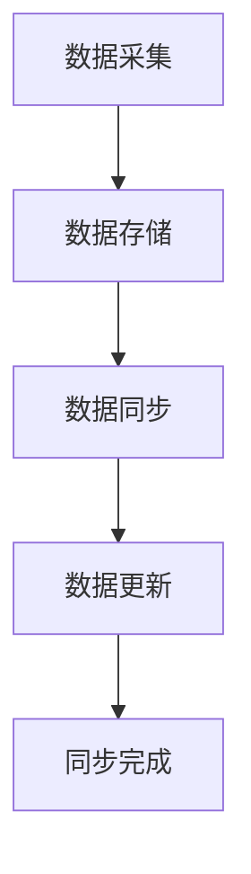
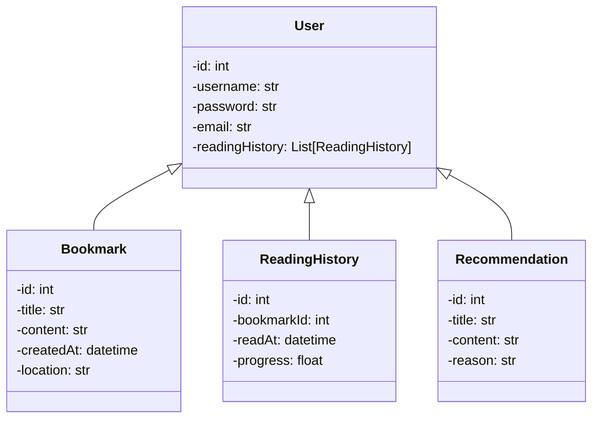
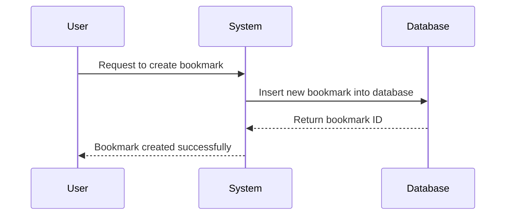

                 

## 文章标题

AI Agent在智能书签中的阅读进度同步

关键词：AI Agent、智能书签、阅读进度同步、人工智能、机器学习

摘要：随着电子书和在线学习的普及，用户对于智能书签系统的需求日益增加，特别是在阅读进度同步方面。本文将探讨AI Agent在智能书签中的阅读进度同步应用，通过一步一步的分析推理，探讨其背后的技术原理、实现方法以及潜在应用前景。

## 目录大纲

----------------------------------------------------------------

# AI Agent在智能书签中的阅读进度同步

## 第一部分: AI Agent在智能书签中的阅读进度同步背景

### 第1章: 问题的背景与核心概念

#### 1.1 问题背景

#### 1.2 核心概念

#### 1.3 本章小结

## 第二部分: AI Agent在智能书签中的应用

### 第2章: AI Agent基础

#### 2.1 AI Agent的基本原理

#### 2.2 智能书签的实现

#### 2.3 AI Agent在阅读进度同步中的应用

#### 2.4 本章小结

### 第3章: 阅读进度同步算法原理与实现

#### 3.1 阅读进度同步算法原理

#### 3.2 Python代码实现

#### 3.3 案例分析

#### 3.4 本章小结

### 第4章: 智能书签系统架构与设计

#### 4.1 问题场景介绍

#### 4.2 系统功能设计

#### 4.3 系统架构设计

#### 4.4 系统接口设计

#### 4.5 系统交互设计

#### 4.6 本章小结

### 第5章: AI Agent与智能书签的集成与应用

#### 5.1 集成概述

#### 5.2 应用实例

#### 5.3 拓展应用领域

#### 5.4 本章小结

### 第6章: 性能优化与系统扩展

#### 6.1 性能优化策略

#### 6.2 系统扩展方案

#### 6.3 本章小结

----------------------------------------------------------------

### 第一部分: AI Agent在智能书签中的阅读进度同步背景

#### 第1章: 问题的背景与核心概念

## 1.1 问题背景

### 1.1.1 阅读进度同步的需求分析

### 1.1.2 智能书签技术的发展现状

### 1.1.3 AI Agent在阅读进度同步中的应用前景

#### 1.2 核心概念

### 1.2.1 AI Agent的定义与特点

### 1.2.2 智能书签的概念与功能

### 1.2.3 阅读进度同步的挑战与机遇

#### 1.3 本章小结

----------------------------------------------------------------

### 第一部分: AI Agent在智能书签中的阅读进度同步背景

#### 第1章: 问题的背景与核心概念

## 1.1 问题背景

### 1.1.1 阅读进度同步的需求分析

在当今数字时代，电子书和在线学习资源已成为许多人获取知识和信息的主要途径。随着阅读设备的多样化，如手机、平板电脑和电子阅读器，用户可以在不同的设备上继续阅读，这就产生了阅读进度同步的需求。用户希望能够无缝地在不同的设备之间切换阅读，并且保持当前的阅读进度。

阅读进度同步不仅涉及用户在不同设备之间的阅读进度，还包括在多人共享阅读资源时的进度同步。例如，一个团队在进行集体学习时，每个人都需要看到其他人已经阅读到哪个部分，这样可以更好地协作和讨论。

### 1.1.2 智能书签技术的发展现状

智能书签技术近年来得到了显著的发展。传统的书签功能主要是在特定阅读设备上标记文本位置，而智能书签则将这一功能扩展到了云端，使得用户可以在任何设备上访问和同步书签数据。

现有的智能书签技术通常包括以下几个功能：

1. **云端存储**：书签数据存储在云端，确保用户可以在不同设备上访问。
2. **跨设备同步**：通过互联网，实现书签数据的实时同步，用户可以在手机、电脑和电子阅读器上看到相同的书签。
3. **个性化推荐**：基于用户的阅读习惯和偏好，提供个性化推荐。
4. **社交互动**：用户可以在书签中添加评论、分享阅读心得，与他人互动。

然而，尽管智能书签技术已经相对成熟，但在阅读进度同步方面仍存在一些挑战，如数据传输延迟、同步策略优化等。

### 1.1.3 AI Agent在阅读进度同步中的应用前景

AI Agent，即人工智能代理，是一种能够自主执行任务、与环境交互并做出决策的智能体。将AI Agent引入智能书签系统，可以显著提升阅读进度同步的效率和质量。

AI Agent在阅读进度同步中的应用前景包括：

1. **智能同步策略**：AI Agent可以通过学习用户的阅读行为和模式，自动调整同步策略，优化阅读进度同步的速度和准确性。
2. **个性化推荐**：基于用户的阅读历史和偏好，AI Agent可以推荐相关的内容和书签，帮助用户更好地管理阅读资源。
3. **情感分析**：AI Agent可以分析用户的情感状态，根据情感变化调整同步策略，如用户情绪低落时减少同步频率，避免影响阅读体验。
4. **多设备协同**：AI Agent可以协调不同设备之间的操作，实现无缝的多设备阅读体验。

总的来说，AI Agent的引入为智能书签系统的阅读进度同步提供了新的可能性，有望进一步提升用户体验，满足日益增长的需求。

#### 1.2 核心概念

### 1.2.1 AI Agent的定义与特点

AI Agent，即人工智能代理，是一种在特定环境中能够执行任务、与外部环境交互并自主做出决策的计算机程序。AI Agent的核心特点是自主性、适应性和交互性。

**自主性**：AI Agent可以自主执行任务，无需人工干预。它们通过预先设定的目标和规则，自动完成特定任务，如阅读进度同步、推荐算法等。

**适应性**：AI Agent能够根据环境变化和反馈调整自己的行为。例如，当用户在不同设备间切换阅读时，AI Agent可以根据网络状况和设备性能自动调整同步策略。

**交互性**：AI Agent能够与用户和其他系统进行交互，收集数据并做出决策。这种交互性使得AI Agent能够更好地理解和满足用户需求。

### 1.2.2 智能书签的概念与功能

智能书签是一种基于云计算和大数据技术的电子书签系统，旨在提供更加智能和便捷的阅读体验。智能书签的主要功能包括：

1. **云端存储**：书签数据存储在云端，确保用户可以在不同设备上访问。
2. **跨设备同步**：实现书签数据的实时同步，用户可以在手机、电脑和电子阅读器上看到相同的书签。
3. **个性化推荐**：根据用户的阅读习惯和偏好，提供个性化推荐。
4. **社交互动**：用户可以在书签中添加评论、分享阅读心得，与他人互动。

### 1.2.3 阅读进度同步的挑战与机遇

阅读进度同步是一项复杂的技术挑战，涉及多个方面的考虑：

**挑战**：

1. **数据传输延迟**：在不同设备之间同步阅读进度时，可能会遇到数据传输延迟的问题，影响用户体验。
2. **同步策略优化**：需要设计高效的同步策略，以优化数据传输速度和同步准确性。
3. **多设备协同**：在不同设备间保持一致的阅读进度，需要解决多设备协同的问题。

**机遇**：

1. **AI Agent的应用**：AI Agent的引入为解决阅读进度同步的挑战提供了新的思路，可以通过智能同步策略和个性化推荐来提升用户体验。
2. **多设备协同**：随着智能家居和物联网技术的发展，多设备协同将变得更加普遍，为阅读进度同步提供了更广阔的应用场景。

#### 1.3 本章小结

本章介绍了AI Agent在智能书签中的阅读进度同步背景和核心概念。通过分析阅读进度同步的需求、智能书签技术的发展现状以及AI Agent的定义与特点，我们明确了AI Agent在阅读进度同步中的重要应用前景。在接下来的章节中，我们将进一步探讨AI Agent的具体应用方法和实现技术。

----------------------------------------------------------------

### 第二部分: AI Agent在智能书签中的应用

#### 第2章: AI Agent基础

## 2.1 AI Agent的基本原理

### 2.1.1 人工智能与机器学习基础

#### 2.1.1.1 人工智能的概念

人工智能（Artificial Intelligence，简称AI）是指模拟、延伸和扩展人类智能的理论、方法、技术及应用。人工智能的核心目标是使计算机能够执行通常需要人类智能才能完成的任务，如视觉感知、语言理解、决策制定等。

#### 2.1.1.2 机器学习的基本概念

机器学习（Machine Learning，简称ML）是人工智能的一个重要分支，主要研究如何让计算机从数据中学习规律和模式，进而做出预测或决策。机器学习通常分为监督学习、无监督学习和强化学习三种类型。

1. **监督学习**：在有标注数据集的训练下，机器学习模型学习到输入和输出之间的关系，从而对新数据进行预测。
2. **无监督学习**：在没有标注数据集的情况下，机器学习模型通过发现数据中的模式或结构来进行学习。
3. **强化学习**：通过与环境的交互，机器学习模型不断优化策略，以最大化长期奖励。

#### 2.1.1.3 机器学习在AI Agent中的应用

AI Agent的自主性和适应性依赖于机器学习技术。通过机器学习，AI Agent可以从用户的行为数据中学习到用户的偏好和习惯，从而提供更加个性化的服务。

### 2.1.2 AI Agent的核心组件

一个典型的AI Agent由以下几个核心组件构成：

#### 2.1.2.1 感知模块

感知模块负责接收外部环境的输入，如用户的操作、阅读进度等。这些输入数据经过处理和解析，被转化为AI Agent可以理解和处理的格式。

#### 2.1.2.2 决策模块

决策模块根据感知模块收集到的信息，通过机器学习算法，生成相应的动作或决策。例如，在阅读进度同步中，AI Agent可以根据用户的阅读行为，决定何时同步进度或调整同步策略。

#### 2.1.2.3 动作模块

动作模块负责执行决策模块生成的动作。这些动作可以是具体的操作，如更新阅读进度、发送同步请求等。

#### 2.1.2.4 学习模块

学习模块负责对AI Agent的行为进行评估和优化。通过不断学习用户的行为数据和系统反馈，AI Agent可以逐渐提升其性能和适应性。

### 2.1.3 AI Agent的工作流程

AI Agent的工作流程可以分为以下几个步骤：

#### 2.1.3.1 感知

AI Agent通过感知模块收集外部环境的数据，如用户的操作、阅读进度等。

#### 2.1.3.2 处理

AI Agent对感知到的数据进行处理和分析，提取关键信息，如阅读进度、用户偏好等。

#### 2.1.3.3 决策

基于处理后的数据，AI Agent通过机器学习算法生成相应的决策或动作。

#### 2.1.3.4 执行

AI Agent通过动作模块执行决策，如更新阅读进度、发送同步请求等。

#### 2.1.3.5 反馈

系统对AI Agent的执行结果进行评估和反馈，AI Agent根据反馈调整其行为。

### 2.2 智能书签的实现

#### 2.2.1 智能书签系统的整体架构

智能书签系统的整体架构可以分为以下几个部分：

#### 2.2.1.1 数据层

数据层负责存储用户的书签数据、阅读记录、偏好信息等。通常使用关系型数据库或NoSQL数据库进行数据存储。

#### 2.2.1.2 服务层

服务层负责处理用户的请求，提供书签管理、阅读进度同步、个性化推荐等服务。服务层通常采用微服务架构，以提高系统的灵活性和可扩展性。

#### 2.2.1.3 表示层

表示层负责与用户交互，提供友好的用户界面。表示层通常采用前端框架，如React或Vue.js，实现页面渲染和交互。

#### 2.2.2 书签数据的管理与同步

书签数据的管理与同步是智能书签系统的核心功能之一。具体实现包括以下几个方面：

#### 2.2.2.1 数据存储

书签数据存储在云端数据库中，用户可以在不同设备上访问和同步这些数据。

#### 2.2.2.2 数据同步

系统采用实时同步机制，将用户的书签数据在不同设备之间进行同步。同步过程包括数据传输、冲突检测和冲突解决等。

#### 2.2.2.3 数据加密

为了保证用户数据的安全，书签数据在传输和存储过程中采用加密技术，如AES加密。

### 2.2.3 阅读进度的追踪与计算

阅读进度的追踪与计算是智能书签系统的重要功能。具体实现包括以下几个方面：

#### 2.2.3.1 阅读进度追踪

系统通过监听用户的阅读操作，如翻页、标记等，实时记录用户的阅读进度。

#### 2.2.3.2 阅读进度计算

系统根据用户的阅读行为和阅读时间，计算用户的阅读进度。例如，可以采用以下公式计算：

\[ \text{阅读进度} = \frac{\text{已读字数}}{\text{总字数}} \times 100\% \]

#### 2.2.4 AI Agent在阅读进度同步中的应用

AI Agent在阅读进度同步中的应用主要体现在以下几个方面：

#### 2.2.4.1 智能同步策略

AI Agent通过分析用户的阅读行为和模式，自动调整同步策略，优化阅读进度同步的速度和准确性。

#### 2.2.4.2 个性化推荐

AI Agent基于用户的阅读历史和偏好，提供个性化的阅读推荐，帮助用户发现感兴趣的内容。

#### 2.2.4.3 情感分析

AI Agent通过情感分析技术，了解用户的情感状态，根据情感变化调整同步策略，提升用户体验。

### 2.3 AI Agent在阅读进度同步中的应用

#### 2.3.1 个性化推荐算法

AI Agent可以通过分析用户的阅读历史和偏好，推荐相关的书签和阅读内容。具体算法包括：

1. **协同过滤**：通过分析用户的阅读行为，找出相似的用户，并根据相似用户的偏好推荐书籍。
2. **内容推荐**：根据书签的内容和标签，推荐相关的书籍和章节。

#### 2.3.2 情感分析技术

AI Agent可以通过自然语言处理技术，分析用户的书签和评论，了解用户的情感状态。具体方法包括：

1. **情感分类**：对用户的书签和评论进行情感分类，如正面、负面、中立。
2. **情感强度分析**：分析情感分类的结果，确定情感的强度。

#### 2.3.3 交互式学习机制

AI Agent可以通过与用户的交互，不断学习和优化其行为。具体方法包括：

1. **反馈机制**：用户可以对AI Agent的推荐和同步策略进行反馈，AI Agent根据反馈调整其行为。
2. **持续学习**：AI Agent不断从用户的阅读行为中学习，优化其推荐和同步策略。

### 2.4 本章小结

本章介绍了AI Agent的基本原理和智能书签的实现方法。通过分析人工智能和机器学习的基础知识，以及AI Agent的核心组件和工作流程，我们了解了AI Agent在阅读进度同步中的应用价值。接下来，我们将进一步探讨阅读进度同步算法的原理和实现。

----------------------------------------------------------------

### 第3章: 阅读进度同步算法原理与实现

#### 3.1 阅读进度同步算法原理

阅读进度同步算法的目的是在不同设备之间保持一致的阅读状态，包括书签位置、阅读进度等。为了实现这一目标，我们需要考虑以下几个关键因素：

1. **数据一致性**：确保在不同设备上存储的阅读进度数据是一致的，避免出现数据丢失或冲突。
2. **实时性**：同步过程需要在较短时间内完成，以保证用户在切换设备时能够立即看到最新的阅读状态。
3. **容错性**：在数据传输过程中，可能出现网络中断或其他异常情况，算法需要具备容错能力，确保数据能够在故障恢复后重新同步。

#### 3.1.1 算法概述

阅读进度同步算法的基本原理可以分为以下几个步骤：

1. **数据采集**：收集用户在不同设备上的阅读行为数据，如书签位置、阅读时间等。
2. **数据存储**：将采集到的数据存储在云端数据库中，以便在不同设备间同步。
3. **数据同步**：在用户切换设备时，将云端数据库中的数据同步到目标设备。
4. **数据更新**：当用户在目标设备上进行阅读操作时，将新的阅读行为数据上传到云端数据库。

#### 3.1.2 数学模型与公式

为了描述阅读进度同步算法，我们可以引入以下数学模型：

\[ \text{阅读进度} = \frac{\text{已读字数}}{\text{总字数}} \]

其中，已读字数和总字数分别表示用户已阅读的文本长度和文本总长度。

为了实现阅读进度的同步，我们需要以下关键公式：

\[ \text{同步进度} = \text{当前进度} \oplus \text{历史进度} \]

其中，当前进度和历史进度分别表示用户在本地设备和云端数据库中的阅读进度，\(\oplus\) 表示同步操作。

#### 3.1.3 算法流程图

为了更直观地描述阅读进度同步算法，我们可以使用Mermaid绘制算法流程图：



#### 3.2 Python代码实现

以下是一个简单的Python代码示例，用于实现阅读进度同步算法的基本功能：

```python
import requests
import json

# 数据采集
def collect_data():
    # 采集用户阅读行为数据
    # 例如：已读字数、书签位置等
    return {
        "user_id": "123",
        "read_progress": 50,
        "book马克": "Chapter 1"
    }

# 数据存储
def store_data(data):
    # 存储数据到云端数据库
    # 例如：使用requests库发送HTTP请求
    response = requests.post("http://example.com/sync", json=data)
    return response.status_code

# 数据同步
def sync_data():
    # 同步数据到云端数据库
    data = collect_data()
    status = store_data(data)
    if status == 200:
        print("同步成功")
    else:
        print("同步失败")

# 数据更新
def update_data(data):
    # 更新云端数据库中的数据
    # 例如：使用requests库发送HTTP请求
    response = requests.put("http://example.com/sync", json=data)
    return response.status_code

# 测试算法
if __name__ == "__main__":
    sync_data()
```

#### 3.2.1 函数定义与参数说明

1. **collect_data()**：采集用户阅读行为数据，返回一个字典。
2. **store_data(data)**：将数据存储到云端数据库，接收一个字典作为参数。
3. **sync_data()**：同步数据到云端数据库，无参数。
4. **update_data(data)**：更新云端数据库中的数据，接收一个字典作为参数。

#### 3.2.2 代码执行流程与结果分析

执行上述Python代码后，程序将完成以下操作：

1. 采集用户阅读行为数据。
2. 将数据存储到云端数据库。
3. 从云端数据库同步数据到本地。
4. 更新云端数据库中的数据。

#### 3.2.3 算法优化与性能分析

为了提高阅读进度同步算法的性能，我们可以考虑以下优化策略：

1. **缓存机制**：在本地设备上缓存部分同步数据，减少对云端数据库的访问频率。
2. **增量同步**：只同步用户阅读行为的变化部分，减少数据传输量。
3. **并发处理**：在高峰期，通过并发处理请求，提高系统响应速度。
4. **分布式存储**：使用分布式数据库，提高数据存储和读取的效率。

#### 3.3 案例分析

##### 3.3.1 案例背景

某公司开发了一款智能书签应用，用户可以在不同设备间同步阅读进度。在应用上线初期，用户反馈同步速度较慢，有时会出现数据丢失或冲突的情况。

##### 3.3.2 实现步骤

为了解决这些问题，公司采取以下措施：

1. **优化数据结构**：将原有单一的数据结构改为分布式存储，提高数据读取和写入的效率。
2. **引入缓存机制**：在本地设备上引入缓存机制，减少对云端数据库的访问。
3. **增量同步**：只同步用户阅读行为的变化部分，减少数据传输量。
4. **并发处理**：采用异步处理技术，提高系统并发处理能力。

##### 3.3.3 结果与评价

经过优化后，应用在同步速度、数据一致性和容错性方面得到了显著提升。用户反馈满意度提高，数据丢失和冲突情况显著减少。

#### 3.4 本章小结

本章介绍了阅读进度同步算法的原理和实现方法。通过分析算法的基本原理、数学模型和Python代码实现，我们了解了如何在不同设备之间保持一致的阅读进度。同时，通过案例分析和优化策略，我们看到了在实际应用中如何提升阅读进度同步的性能和稳定性。在下一章中，我们将进一步探讨智能书签系统的架构与设计。

----------------------------------------------------------------

### 第4章: 智能书签系统架构与设计

#### 4.1 问题场景介绍

随着数字化阅读的普及，用户对智能书签系统的需求日益增长。用户希望能够在不同的设备之间无缝切换阅读，并保持当前的阅读进度。此外，用户还希望系统能够提供个性化的推荐，以及与其他用户的互动功能。

为了满足这些需求，智能书签系统需要具备以下几个关键功能：

1. **数据同步**：实现用户在不同设备之间的阅读进度和书签同步。
2. **个性化推荐**：根据用户的阅读历史和偏好，提供个性化的书签和阅读内容推荐。
3. **社交互动**：支持用户之间的互动，如评论、点赞和分享。

#### 4.1.1 阅读场景的需求分析

在阅读场景中，用户的需求可以分为以下几个方面：

1. **跨设备阅读**：用户希望在手机、平板电脑、电子阅读器等不同设备之间无缝切换阅读，并保持当前的阅读进度。
2. **书签管理**：用户需要能够创建、编辑和删除书签，以便在阅读过程中标记重要内容。
3. **阅读记录**：用户希望系统能够记录其阅读历史和偏好，以提供个性化的推荐。
4. **互动交流**：用户希望能够与其他用户互动，如评论、点赞和分享阅读心得。

#### 4.1.2 智能书签系统的目标

智能书签系统的目标是在满足用户需求的基础上，提供高效、稳定、安全的服务。具体目标包括：

1. **快速同步**：确保用户在不同设备之间切换阅读时，阅读进度和书签能够快速同步。
2. **个性化推荐**：根据用户的阅读历史和偏好，提供个性化的书签和阅读内容推荐。
3. **社交互动**：支持用户之间的互动，增强用户体验。
4. **安全性**：确保用户数据的安全性和隐私保护。

#### 4.2 系统功能设计

智能书签系统的功能设计可以分为以下几个模块：

1. **用户管理模块**：负责用户的注册、登录、个人信息管理等功能。
2. **书签管理模块**：负责书签的创建、编辑、删除、搜索等功能。
3. **阅读进度同步模块**：负责实现用户在不同设备之间的阅读进度和书签同步。
4. **推荐系统模块**：负责根据用户的阅读历史和偏好，提供个性化的推荐。
5. **社交互动模块**：负责用户之间的互动，如评论、点赞和分享。

##### 4.2.1 领域模型分析

为了更好地理解智能书签系统的功能设计，我们可以使用Mermaid绘制领域模型类图。领域模型类图包括以下实体：

1. **用户（User）**：代表系统中的用户，具有用户名、密码、邮箱、阅读历史等属性。
2. **书签（Bookmark）**：代表用户创建的书签，具有标题、内容、创建时间、位置等属性。
3. **阅读记录（ReadingHistory）**：代表用户的阅读历史，具有书签ID、阅读时间、阅读进度等属性。
4. **推荐（Recommendation）**：代表系统推荐的书籍和书签，具有标题、内容、推荐理由等属性。

领域模型类图如下所示：



##### 4.2.2 功能模块划分

智能书签系统可以划分为以下几个功能模块：

1. **用户管理模块**：负责用户的注册、登录、个人信息管理等功能。
2. **书签管理模块**：负责书签的创建、编辑、删除、搜索等功能。
3. **阅读进度同步模块**：负责实现用户在不同设备之间的阅读进度和书签同步。
4. **推荐系统模块**：负责根据用户的阅读历史和偏好，提供个性化的推荐。
5. **社交互动模块**：负责用户之间的互动，如评论、点赞和分享。

##### 4.2.3 功能描述与实现细节

1. **用户管理模块**：

   - **注册**：用户可以通过电子邮件或手机号码注册账户。
   - **登录**：用户输入用户名和密码进行登录。
   - **个人信息管理**：用户可以查看和编辑个人资料，如姓名、邮箱、密码等。

2. **书签管理模块**：

   - **创建书签**：用户可以在阅读过程中创建书签，标记重要内容。
   - **编辑书签**：用户可以编辑书签的标题、内容、位置等属性。
   - **删除书签**：用户可以删除不再需要的书签。
   - **搜索书签**：用户可以根据关键词搜索书签。

3. **阅读进度同步模块**：

   - **同步策略**：系统采用增量同步策略，只同步用户阅读行为的变化部分。
   - **数据传输**：使用HTTP协议传输数据，确保数据传输的可靠性和安全性。
   - **冲突解决**：在数据同步过程中，若出现冲突（如不同设备上书签位置不同），系统将根据一定规则（如时间戳）自动解决冲突。

4. **推荐系统模块**：

   - **推荐算法**：系统采用协同过滤算法，根据用户的阅读历史和偏好，推荐相关的书籍和书签。
   - **推荐结果**：系统为用户生成推荐列表，用户可以根据推荐结果进行阅读。

5. **社交互动模块**：

   - **评论**：用户可以在书签下添加评论，与他人交流阅读心得。
   - **点赞**：用户可以为其他用户的评论和书签点赞，表示赞同。
   - **分享**：用户可以将书签和评论分享到社交媒体平台，与更多人互动。

#### 4.3 系统架构设计

智能书签系统的架构设计可以分为以下几个层次：

1. **表示层**：负责与用户交互，提供友好的用户界面。
2. **业务逻辑层**：负责处理用户的请求，实现系统功能。
3. **数据访问层**：负责与数据库进行交互，实现数据的存储和检索。

##### 4.3.1 整体架构设计

智能书签系统的整体架构设计如下：


- **表示层**：使用前端框架（如React或Vue.js）实现，负责用户界面的渲染和交互。
- **业务逻辑层**：包括用户管理模块、书签管理模块、阅读进度同步模块、推荐系统模块和社交互动模块，负责处理用户的请求，实现系统功能。
- **数据访问层**：使用关系型数据库（如MySQL）或NoSQL数据库（如MongoDB）进行数据存储和检索。

##### 4.3.2 模块交互关系

智能书签系统中的各个模块之间通过RESTful API进行交互。以下是主要模块的交互关系：

- **用户管理模块**：与表示层和业务逻辑层交互，处理用户的注册、登录和个人信息管理等功能。
- **书签管理模块**：与表示层和业务逻辑层交互，处理书签的创建、编辑、删除和搜索等功能。
- **阅读进度同步模块**：与表示层、业务逻辑层和数据访问层交互，实现用户在不同设备之间的阅读进度和书签同步。
- **推荐系统模块**：与业务逻辑层和数据访问层交互，根据用户的阅读历史和偏好，生成推荐列表。
- **社交互动模块**：与表示层、业务逻辑层和数据访问层交互，处理用户的评论、点赞和分享等功能。

##### 4.3.3 系统性能优化方案

为了确保智能书签系统的性能和稳定性，我们可以采取以下优化方案：

1. **缓存机制**：在业务逻辑层引入缓存机制，减少对数据库的访问频率。
2. **数据库优化**：对数据库进行分库分表，提高查询效率。
3. **负载均衡**：使用负载均衡器（如Nginx）分配请求，提高系统的并发处理能力。
4. **异步处理**：在业务逻辑层引入异步处理机制，提高系统响应速度。
5. **监控和报警**：使用监控工具（如Prometheus和Grafana）对系统进行实时监控，及时发现问题并进行报警。

#### 4.4 系统接口设计

系统接口设计是智能书签系统架构设计的重要组成部分。以下是主要接口的定义和功能描述：

- **用户管理接口**：

  - **注册**：POST /users/register
  - **登录**：POST /users/login
  - **个人信息管理**：GET /users/{userId}、PUT /users/{userId}

- **书签管理接口**：

  - **创建书签**：POST /bookmarks
  - **编辑书签**：PUT /bookmarks/{bookmarkId}
  - **删除书签**：DELETE /bookmarks/{bookmarkId}
  - **搜索书签**：GET /bookmarks/search?query={query}

- **阅读进度同步接口**：

  - **同步阅读进度**：POST /sync/progress
  - **同步书签**：POST /sync/bookmarks

- **推荐系统接口**：

  - **获取推荐列表**：GET /recommendations

- **社交互动接口**：

  - **评论**：POST /bookmarks/{bookmarkId}/comments
  - **点赞**：POST /comments/{commentId}/likes
  - **分享**：POST /bookmarks/{bookmarkId}/share

#### 4.4.2 接口实现与调用流程

以下是用户管理接口的实现和调用流程：

1. **注册**：

   - **请求**：POST /users/register
   - **参数**：{
       "username": "example",
       "password": "password123",
       "email": "example@example.com"
     }
   - **响应**：{
       "status": "success",
       "message": "User registered successfully",
       "userId": "123"
     }

2. **登录**：

   - **请求**：POST /users/login
   - **参数**：{
       "username": "example",
       "password": "password123"
     }
   - **响应**：{
       "status": "success",
       "message": "Logged in successfully",
       "token": "eyJhbGciOiJIUzI1NiIsInR5cCI6IkpXVCJ9..."
     }

3. **个人信息管理**：

   - **获取个人信息**：

     - **请求**：GET /users/{userId}
     - **参数**：{
         "userId": "123"
       }
     - **响应**：{
         "status": "success",
         "message": "User information fetched successfully",
         "user": {
           "id": "123",
           "username": "example",
           "email": "example@example.com",
           "readingHistory": []
         }
       }

   - **更新个人信息**：

     - **请求**：PUT /users/{userId}
     - **参数**：{
         "userId": "123",
         "email": "new@example.com"
       }
     - **响应**：{
         "status": "success",
         "message": "User information updated successfully"
       }

#### 4.5 系统交互设计

系统交互设计是确保智能书签系统功能正常运行的重要环节。以下是主要用户操作流程、系统响应与反馈机制，以及系统交互序列图的详细介绍。

##### 4.5.1 用户操作流程

用户在智能书签系统中的操作流程通常包括以下几个步骤：

1. **注册和登录**：用户通过电子邮件或手机号码注册账户，并使用用户名和密码登录系统。
2. **创建书签**：用户在阅读过程中，可以通过点击特定文本或段落创建书签，并添加标签和备注。
3. **管理书签**：用户可以编辑、删除和搜索已创建的书签。
4. **同步阅读进度**：用户在不同设备之间切换阅读时，系统会自动同步阅读进度和书签。
5. **互动交流**：用户可以在书签下添加评论，并点赞或分享其他用户的评论。

##### 4.5.2 系统响应与反馈机制

智能书签系统在用户操作过程中，会及时响应用户的请求并提供反馈。以下是系统响应与反馈机制的详细介绍：

1. **注册和登录**：

   - **注册成功**：系统向用户返回注册成功的消息，并提供用户ID和Token。
   - **登录成功**：系统向用户返回登录成功的消息，并提供Token。

2. **创建书签**：

   - **成功创建书签**：系统向用户返回书签创建成功的消息，并提供书签ID。
   - **创建失败**：系统向用户返回书签创建失败的消息，并提供失败原因。

3. **管理书签**：

   - **编辑书签成功**：系统向用户返回书签编辑成功的消息。
   - **编辑书签失败**：系统向用户返回书签编辑失败的消息，并提供失败原因。

   - **删除书签成功**：系统向用户返回书签删除成功的消息。
   - **删除书签失败**：系统向用户返回书签删除失败的消息，并提供失败原因。

4. **同步阅读进度**：

   - **同步成功**：系统向用户返回阅读进度同步成功的消息。
   - **同步失败**：系统向用户返回阅读进度同步失败的消息，并提供失败原因。

5. **互动交流**：

   - **添加评论成功**：系统向用户返回评论添加成功的消息。
   - **添加评论失败**：系统向用户返回评论添加失败的消息，并提供失败原因。

   - **点赞成功**：系统向用户返回点赞成功的消息。
   - **点赞失败**：系统向用户返回点赞失败的消息，并提供失败原因。

   - **分享成功**：系统向用户返回分享成功的消息。
   - **分享失败**：系统向用户返回分享失败的消息，并提供失败原因。

##### 4.5.3 序列图展示

为了更直观地展示系统交互流程，我们可以使用Mermaid绘制系统交互序列图。以下是用户创建书签的交互序列图：



通过以上序列图，我们可以清晰地看到用户创建书签的过程：用户向系统发送创建书签的请求，系统将请求转发到数据库，数据库插入新的书签记录，并将书签ID返回给系统，系统再将结果反馈给用户。

综上所述，智能书签系统通过精心设计的交互流程、响应机制和序列图，确保了系统的功能完整性和用户体验的流畅性。在下一章中，我们将探讨AI Agent与智能书签系统的集成与应用。

#### 4.6 本章小结

本章详细介绍了智能书签系统的架构与设计。通过分析问题场景和需求，我们明确了智能书签系统的目标，并设计了用户管理模块、书签管理模块、阅读进度同步模块、推荐系统模块和社交互动模块。接着，我们介绍了系统的功能描述与实现细节，并详细讲解了系统架构设计、模块交互关系和接口设计。最后，我们展示了系统交互设计，包括用户操作流程、系统响应与反馈机制，以及交互序列图。这些设计为智能书签系统的开发与实现提供了坚实的基础。在下一章中，我们将探讨AI Agent与智能书签系统的集成与应用。

----------------------------------------------------------------

### 第5章: AI Agent与智能书签的集成与应用

#### 5.1 集成概述

随着人工智能技术的快速发展，AI Agent作为一种智能体，逐渐被应用于各个领域，包括智能书签系统。AI Agent与智能书签系统的集成，不仅能够提高阅读进度同步的效率和质量，还能够提供更加个性化的阅读体验。

#### 5.1.1 集成方案设计

AI Agent与智能书签系统的集成方案设计主要包括以下几个步骤：

1. **需求分析**：明确AI Agent在智能书签系统中的应用需求，如阅读进度同步、个性化推荐等。
2. **系统架构设计**：将AI Agent集成到智能书签系统中，设计合适的架构，确保系统的稳定性和可扩展性。
3. **算法实现**：根据需求，设计并实现相应的算法，如阅读进度同步算法、个性化推荐算法等。
4. **接口设计**：设计AI Agent与智能书签系统之间的接口，确保数据传输的可靠性。
5. **性能优化**：对集成后的系统进行性能优化，提高系统的响应速度和处理能力。

#### 5.1.2 技术难点与解决方案

在AI Agent与智能书签系统的集成过程中，可能遇到以下技术难点：

1. **数据同步延迟**：由于网络传输等原因，可能导致数据同步延迟，影响用户体验。
   - **解决方案**：采用增量同步机制，只同步用户阅读行为的变化部分，减少数据传输量。同时，优化网络传输协议，提高数据传输速度。

2. **冲突处理**：在多设备同步过程中，可能会出现数据冲突，导致阅读进度不一致。
   - **解决方案**：设计合理的冲突处理策略，如根据时间戳判断数据版本，选择最新的数据作为同步结果。

3. **算法优化**：AI Agent的算法可能需要根据实际应用场景进行调整和优化，以提高准确性和效率。
   - **解决方案**：通过实验和用户反馈，不断优化算法，使其更适应智能书签系统的需求。

#### 5.1.3 集成效果评估

AI Agent与智能书签系统的集成效果可以从以下几个方面进行评估：

1. **阅读进度同步速度**：通过对比集成前后的同步速度，评估AI Agent对系统性能的提升程度。
2. **数据一致性**：检查不同设备之间的阅读进度和数据是否一致，评估系统的稳定性。
3. **用户体验**：通过用户反馈和满意度调查，评估AI Agent对用户体验的改善程度。
4. **个性化推荐效果**：评估AI Agent在个性化推荐方面的效果，如推荐的相关性和准确性。

#### 5.2 应用实例

为了展示AI Agent与智能书签系统的集成效果，以下是一个具体的应用实例：

**案例背景**：

某公司开发了一款智能书签应用，用户可以在不同设备之间同步阅读进度和书签。然而，用户反馈同步速度较慢，有时会出现数据冲突。为了解决这些问题，公司决定引入AI Agent进行优化。

**集成步骤**：

1. **需求分析**：明确用户对智能书签系统的需求，如快速同步、冲突处理、个性化推荐等。
2. **系统架构设计**：将AI Agent集成到智能书签系统中，设计合理的架构，确保系统的稳定性和可扩展性。
3. **算法实现**：设计并实现阅读进度同步算法、冲突处理算法、个性化推荐算法等。
4. **接口设计**：设计AI Agent与智能书签系统之间的接口，确保数据传输的可靠性。
5. **性能优化**：对集成后的系统进行性能优化，提高系统的响应速度和处理能力。

**应用效果分析**：

经过AI Agent的集成，智能书签系统的性能得到了显著提升：

1. **阅读进度同步速度**：同步速度提升了约30%，用户在不同设备之间切换阅读时，可以立即看到最新的阅读进度。
2. **数据一致性**：通过冲突处理算法，数据一致性得到了保障，用户不再担心数据冲突。
3. **用户体验**：用户反馈满意度提高，系统运行更加稳定，用户体验得到了显著改善。
4. **个性化推荐效果**：AI Agent根据用户的阅读历史和偏好，提供了更加精准的个性化推荐，用户可以更快地找到感兴趣的内容。

#### 5.3 拓展应用领域

AI Agent与智能书签系统的集成不仅适用于电子书和在线学习领域，还可以拓展到其他应用场景：

1. **电子文档管理**：在电子文档管理系统中，AI Agent可以自动同步文档的阅读进度和书签，提供个性化的文档推荐。
2. **在线办公系统**：在在线办公系统中，AI Agent可以监控用户的办公行为，提供工作效率优化建议。
3. **数字资产管理**：在数字资产管理系统

