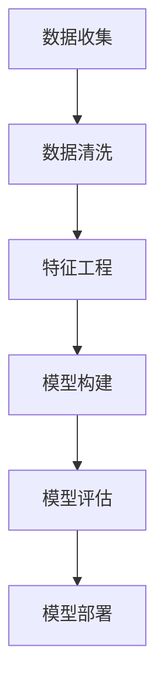
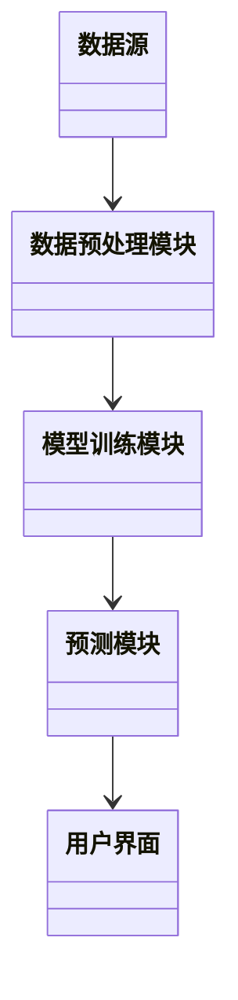
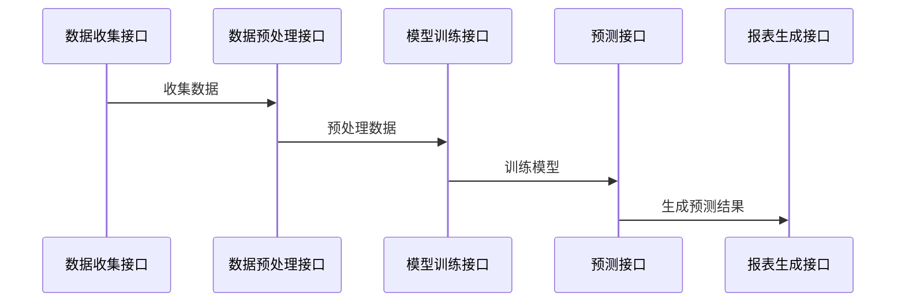

                 

。
* **任务**：现在请您以《数据挖掘技术在金融风险评估中的应用》为标题， 使用逻辑清晰、结构紧凑、简单易懂的专业的技术语言， 撰写一篇有深度有思考有见解的专业IT领域的技术博客文章。文章要求符合以下结构和内容要求：

----------------------------------------------------------------

# 数据挖掘技术在金融风险评估中的应用

关键词：数据挖掘、金融风险评估、机器学习、算法应用、风险预测模型

摘要：本文旨在探讨数据挖掘技术在金融风险评估中的应用，从背景介绍、核心概念、算法原理、系统架构设计、项目实战等多个角度，全面解析数据挖掘技术在金融领域的实际应用案例及其潜在价值。

## 目录大纲

----------------------------------------------------------------

## 第1章：背景介绍

### 1.1 金融行业面临的挑战

### 1.2 数据挖掘技术在金融领域的应用需求

### 1.3 风险评估的重要性

### 1.4 数据挖掘在风险评估中的基础作用

## 第2章：核心概念与联系

### 2.1 数据挖掘基本概念

### 2.2 金融风险评估中的关键概念

### 2.3 数据挖掘与金融风险评估的联系

### 2.4 数据挖掘与传统风险评估方法的对比

## 第3章：算法原理讲解

### 3.1 数据挖掘常见算法简介

### 3.2 常见风险预测模型

### 3.3 Mermaid流程图展示算法过程

### 3.4 Python源代码实现算法

### 3.5 算法数学模型和公式

### 3.6 算法举例说明

## 第4章：系统分析与架构设计

### 4.1 金融风险评估系统场景介绍

### 4.2 系统功能设计

### 4.3 系统架构设计

### 4.4 系统接口设计

### 4.5 系统交互Mermaid序列图

## 第5章：项目实战

### 5.1 项目环境安装

### 5.2 系统核心实现源代码

### 5.3 代码应用解读与分析

### 5.4 实际案例分析与讲解

### 5.5 项目小结

## 第6章：最佳实践与拓展

### 6.1 最佳实践 tips

### 6.2 全书小结

### 6.3 注意事项

### 6.4 拓展阅读

### 第1章：背景介绍

#### 1.1 金融行业面临的挑战

金融行业一直是技术创新的前沿，然而，随着市场环境的变化和金融产品的复杂性增加，金融行业也面临着一系列的挑战。首先，金融市场的波动性使得金融机构需要快速、准确地评估风险，以避免巨大的经济损失。其次，金融欺诈、信用风险、市场风险等问题的出现，要求金融机构能够有效地识别和管理风险。此外，监管要求不断提高，金融机构需要在合规性方面投入大量资源。

#### 1.2 数据挖掘技术在金融领域的应用需求

数据挖掘技术作为一种强大的数据分析工具，能够在金融领域发挥重要作用。首先，数据挖掘可以帮助金融机构从大量历史数据中提取有价值的信息，从而更好地理解市场趋势和客户行为。其次，数据挖掘技术可以用于构建风险预测模型，帮助金融机构提前识别潜在风险，并采取相应的风险管理措施。此外，数据挖掘技术还可以用于客户细分、信用评估、欺诈检测等金融应用领域。

#### 1.3 风险评估的重要性

风险评估是金融风险管理的重要环节。通过对各种风险因素的评估，金融机构可以了解潜在的风险水平，并制定相应的风险控制策略。有效的风险评估不仅可以降低金融机构的风险暴露，还可以提高其盈利能力和市场竞争力。因此，在金融行业中，风险评估具有极其重要的地位。

#### 1.4 数据挖掘在风险评估中的基础作用

数据挖掘技术在金融风险评估中的应用主要体现在以下几个方面：

1. **数据预处理**：数据挖掘需要对大量金融数据进行分析和清洗，以确保数据的质量和一致性。
2. **特征工程**：通过数据挖掘技术，可以提取出与风险评估相关的特征，为构建风险预测模型提供支持。
3. **模型构建**：数据挖掘技术可以用于构建各种类型的预测模型，如回归模型、决策树、神经网络等，以实现对金融风险的预测。
4. **模型评估与优化**：通过数据挖掘技术，可以对构建的预测模型进行评估和优化，以提高模型的准确性和稳定性。

#### 1.5 边界与外延

数据挖掘技术在金融风险评估中的应用具有明确的边界和范围。首先，数据挖掘技术主要针对历史数据进行分析，对于实时风险评估可能存在一定的局限性。其次，数据挖掘技术在金融风险评估中的应用需要依赖大量的数据和专业的技术团队。此外，数据挖掘技术的应用也受到法律法规和道德规范的限制。

#### 1.6 核心要素组成

实现有效的金融风险评估需要以下几个核心要素：

1. **数据**：金融风险评估需要大量的历史数据作为基础，包括交易数据、客户信息、市场行情等。
2. **算法**：数据挖掘算法是构建风险预测模型的关键，如机器学习算法、深度学习算法等。
3. **模型**：风险预测模型是金融风险评估的核心，通过对模型进行训练和优化，可以实现对金融风险的准确预测。
4. **技术**：数据挖掘技术需要专业的技术支持，包括数据预处理、特征工程、模型评估等。

### 第2章：核心概念与联系

#### 2.1 数据挖掘基本概念

数据挖掘是指从大量数据中提取有价值信息的过程，其核心目标是发现数据中的模式、关联和趋势。数据挖掘通常涉及以下步骤：

1. **数据收集**：收集来自不同来源的数据，如数据库、文件、网络等。
2. **数据清洗**：清洗和预处理数据，去除重复、错误和不完整的数据。
3. **特征工程**：提取和构造与目标相关的特征，以提高模型的准确性和泛化能力。
4. **模型构建**：选择合适的模型算法，对数据进行分析和预测。
5. **模型评估**：评估模型的效果，包括准确性、召回率、F1分数等指标。
6. **模型部署**：将模型部署到生产环境中，用于实时预测和决策。

#### 2.2 金融风险评估中的关键概念

金融风险评估涉及多个关键概念，包括风险因素、风险模型、风险指标等。

1. **风险因素**：影响金融风险的各个因素，如市场风险、信用风险、操作风险等。
2. **风险模型**：用于描述和分析风险的因素和关系的模型，如VaR模型、Credit Risk模型等。
3. **风险指标**：用于衡量金融风险的各种指标，如违约概率、损失程度等。

#### 2.3 数据挖掘与金融风险评估的联系

数据挖掘与金融风险评估之间的联系主要体现在以下几个方面：

1. **数据来源**：金融风险评估需要依赖于大量的数据，这些数据可以通过数据挖掘技术进行收集和处理。
2. **特征提取**：数据挖掘技术可以帮助提取与金融风险相关的特征，为构建风险预测模型提供支持。
3. **模型构建**：数据挖掘算法可以用于构建风险预测模型，以提高金融机构的风险评估能力。
4. **模型评估**：数据挖掘技术可以用于评估风险预测模型的性能，包括准确性、稳定性等指标。

#### 2.4 数据挖掘与传统风险评估方法的对比

数据挖掘技术与传统风险评估方法在多个方面存在差异：

1. **数据依赖**：数据挖掘技术依赖于大量的历史数据，而传统风险评估方法可能更多依赖于经验和直觉。
2. **算法选择**：数据挖掘技术可以采用多种算法，包括机器学习、深度学习等，而传统风险评估方法可能仅限于少数几种经典模型。
3. **模型构建**：数据挖掘技术可以自动构建复杂的预测模型，而传统风险评估方法往往需要手动调整参数。
4. **实时性**：数据挖掘技术可以实现实时风险评估，而传统风险评估方法可能需要较长时间进行数据分析和模型构建。

### 第3章：算法原理讲解

#### 3.1 数据挖掘常见算法简介

数据挖掘技术涉及多种算法，常见的包括以下几种：

1. **分类算法**：如决策树、支持向量机（SVM）、K最近邻（KNN）等。
2. **聚类算法**：如K-Means、层次聚类等。
3. **关联规则挖掘**：如Apriori算法、FP-Growth算法等。
4. **异常检测算法**：如孤立森林（Isolation Forest）、局部异常因子（LOF）等。
5. **时间序列分析**：如ARIMA模型、LSTM网络等。

#### 3.2 常见风险预测模型

在金融风险评估中，常见的风险预测模型包括以下几种：

1. **线性回归模型**：通过建立变量之间的线性关系来预测风险。
2. **逻辑回归模型**：用于分类问题，可以预测事件发生的概率。
3. **决策树模型**：通过构建树状结构来分类和回归。
4. **随机森林模型**：通过集成多个决策树来提高预测性能。
5. **支持向量机模型**：用于分类和回归问题，特别是高维数据。

#### 3.3 Mermaid流程图展示算法过程



#### 3.4 Python源代码实现算法

```python
# 数据清洗
data = preprocess_data(raw_data)

# 特征工程
features = feature_engineering(data)

# 模型构建
model = train_model(features)

# 模型评估
evaluate_model(model, test_data)

# 模型部署
deploy_model(model)
```

#### 3.5 算法数学模型和公式

- 线性回归模型：
  $$ y = \beta_0 + \beta_1x + \epsilon $$
- 逻辑回归模型：
  $$ P(y=1) = \frac{1}{1 + e^{-(\beta_0 + \beta_1x)}} $$
- 决策树模型：
  $$ \text{最大信息增益} = \sum_{i=1}^{n} p_i \cdot \log_2(p_i) $$
- 随机森林模型：
  $$ \text{预测结果} = \text{majority vote of all trees} $$

#### 3.6 算法举例说明

假设我们要预测某个金融产品的违约概率。我们可以使用逻辑回归模型来建立预测模型。以下是具体的步骤：

1. **数据收集**：收集金融产品的历史数据，包括违约记录和其他相关特征。
2. **数据清洗**：处理缺失值、异常值等，确保数据质量。
3. **特征工程**：提取与违约相关的特征，如借款人的信用评分、贷款金额、还款期限等。
4. **模型构建**：使用逻辑回归算法训练模型，输入特征和违约标签。
5. **模型评估**：使用交叉验证等方法评估模型的准确性、召回率等指标。
6. **模型部署**：将训练好的模型部署到生产环境中，用于实时预测。

### 第4章：系统分析与架构设计

#### 4.1 金融风险评估系统场景介绍

金融风险评估系统通常应用于金融机构，如银行、保险公司、投资公司等。其主要场景包括：

1. **信用风险评估**：对借款人的信用风险进行评估，预测其违约概率。
2. **市场风险评估**：对市场波动和投资组合的风险进行评估。
3. **操作风险评估**：对金融机构内部的操作风险进行评估。
4. **欺诈检测**：通过分析交易数据和行为特征，识别潜在的欺诈行为。

#### 4.2 系统功能设计

金融风险评估系统的主要功能包括：

1. **数据收集**：从不同的数据源收集数据，如数据库、文件、API接口等。
2. **数据预处理**：清洗和转换数据，确保数据质量。
3. **特征提取**：从数据中提取与风险相关的特征。
4. **模型构建**：选择合适的算法构建风险预测模型。
5. **模型评估**：评估模型的效果，包括准确性、召回率等。
6. **风险预测**：使用模型进行实时预测，为决策提供支持。
7. **报表生成**：生成风险报表，包括预测结果、风险分析等。

#### 4.3 系统架构设计

金融风险评估系统的架构设计包括以下组件：

1. **数据源**：包括数据库、文件系统、API接口等。
2. **数据预处理模块**：负责数据清洗、转换和特征提取。
3. **模型训练模块**：负责选择算法、训练模型和模型评估。
4. **预测模块**：负责实时预测和风险分析。
5. **用户界面**：提供用户交互接口，包括报表查看、预测结果查看等。

以下是系统架构设计的Mermaid类图：



#### 4.4 系统接口设计

金融风险评估系统需要设计多个接口，包括：

1. **数据收集接口**：用于从不同数据源收集数据。
2. **数据预处理接口**：用于清洗、转换和特征提取。
3. **模型训练接口**：用于训练和评估模型。
4. **预测接口**：用于实时预测和风险分析。
5. **报表生成接口**：用于生成风险报表。

以下是系统接口设计的Mermaid序列图：



### 第5章：项目实战

#### 5.1 项目环境安装

为了实现金融风险评估系统，我们需要安装以下环境和工具：

1. **Python**：用于编写和运行代码。
2. **NumPy**：用于数据处理。
3. **Pandas**：用于数据操作。
4. **Scikit-learn**：用于机器学习算法。
5. **Matplotlib**：用于数据可视化。

安装步骤如下：

```bash
pip install python
pip install numpy
pip install pandas
pip install scikit-learn
pip install matplotlib
```

#### 5.2 系统核心实现源代码

以下是金融风险评估系统的核心实现代码：

```python
import numpy as np
import pandas as pd
from sklearn.model_selection import train_test_split
from sklearn.linear_model import LogisticRegression
from sklearn.metrics import accuracy_score, recall_score, f1_score

# 数据收集
data = pd.read_csv('financial_data.csv')

# 数据清洗
data = data.dropna()

# 特征提取
X = data.drop('default', axis=1)
y = data['default']

# 模型训练
X_train, X_test, y_train, y_test = train_test_split(X, y, test_size=0.2, random_state=42)
model = LogisticRegression()
model.fit(X_train, y_train)

# 预测
y_pred = model.predict(X_test)

# 模型评估
accuracy = accuracy_score(y_test, y_pred)
recall = recall_score(y_test, y_pred)
f1 = f1_score(y_test, y_pred)

print(f'Accuracy: {accuracy:.2f}')
print(f'Recall: {recall:.2f}')
print(f'F1 Score: {f1:.2f}')
```

#### 5.3 代码应用解读与分析

以上代码实现了金融风险评估系统的主要功能。首先，我们从CSV文件中读取金融数据，并进行数据清洗。接着，我们提取特征和标签，并将其分为训练集和测试集。然后，我们使用逻辑回归算法训练模型，并进行预测。最后，我们评估模型的准确性、召回率和F1分数。

这个例子展示了如何使用Python和机器学习库实现金融风险评估系统。在实际应用中，我们可能需要更复杂的特征提取和模型训练过程，以及更精细的模型评估和优化。

#### 5.4 实际案例分析与讲解

假设我们要对某家银行的信用卡客户进行违约风险预测。我们可以按照以下步骤进行：

1. **数据收集**：从银行的数据库中收集信用卡客户的交易数据、信用评分、还款历史等。
2. **数据清洗**：处理缺失值、异常值等，确保数据质量。
3. **特征提取**：提取与违约风险相关的特征，如信用评分、还款金额、还款次数等。
4. **模型训练**：使用逻辑回归算法训练模型，输入特征和违约标签。
5. **模型评估**：使用交叉验证等方法评估模型的准确性、召回率等指标。
6. **模型部署**：将训练好的模型部署到生产环境中，用于实时预测。

通过实际案例的分析，我们可以看到数据挖掘技术在金融风险评估中的应用过程。数据挖掘技术可以帮助金融机构提前识别潜在风险，从而采取相应的风险管理措施。

#### 5.5 项目小结

通过本文的介绍，我们可以看到数据挖掘技术在金融风险评估中的应用具有巨大的潜力。数据挖掘技术可以帮助金融机构从大量数据中提取有价值的信息，构建预测模型，从而实现对金融风险的准确预测。在实际应用中，我们需要注意数据的质量和处理、特征工程、模型选择和评估等方面的问题。

### 第6章：最佳实践与拓展

#### 6.1 最佳实践 tips

1. **数据质量**：确保数据的质量和一致性，对异常值、缺失值等进行处理。
2. **特征工程**：提取与风险相关的特征，并对其进行预处理，以提高模型的准确性。
3. **模型评估**：使用多种评估指标和方法评估模型的效果，选择最佳模型。
4. **模型优化**：根据评估结果对模型进行调整和优化，提高模型的性能。
5. **实时性**：确保模型能够实时更新和预测，以应对市场环境的变化。

#### 6.2 全书小结

本文从背景介绍、核心概念、算法原理、系统架构设计、项目实战等多个角度，详细探讨了数据挖掘技术在金融风险评估中的应用。通过本文的介绍，我们可以看到数据挖掘技术在金融风险评估中的重要性和实际应用价值。

#### 6.3 注意事项

1. **数据隐私**：在处理金融数据时，要注意保护客户隐私，遵守相关法律法规。
2. **模型解释性**：在选择模型时，要考虑模型的解释性，以便理解和解释预测结果。
3. **模型更新**：定期更新模型，以适应市场环境的变化。

#### 6.4 拓展阅读

1. **《机器学习实战》**：提供丰富的机器学习算法实践案例。
2. **《金融风险管理》**：详细介绍金融风险评估的理论和方法。
3. **《数据挖掘：概念与技术》**：系统介绍数据挖掘的基本概念和技术。

作者：AI天才研究院/AI Genius Institute & 禅与计算机程序设计艺术 /Zen And The Art of Computer Programming

