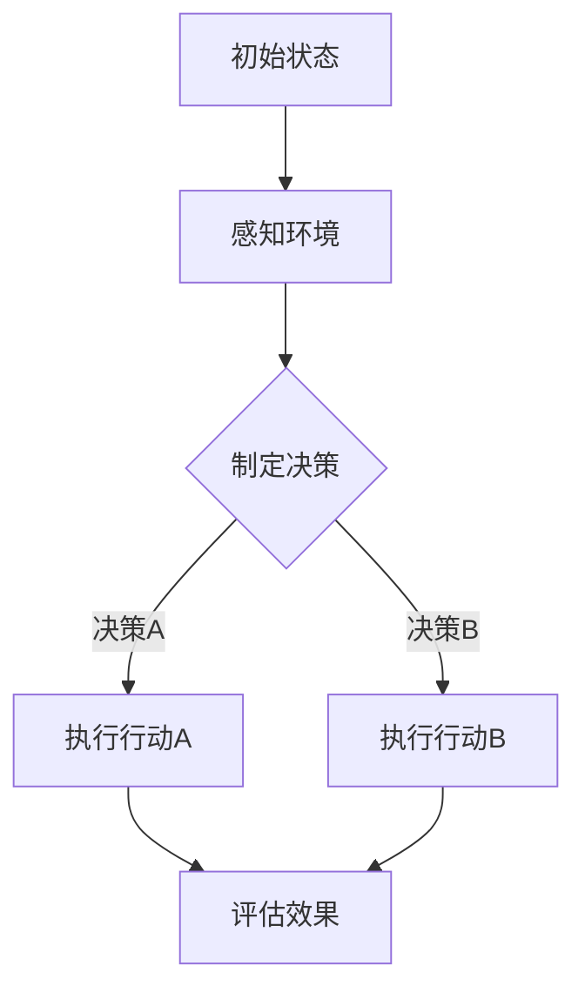

                 

## AI Agent在智能交通信号控制中的实践

### 关键词：
- AI Agent
- 智能交通信号控制
- 算法原理
- 系统架构
- 项目实战

### 摘要：
本文深入探讨了AI Agent在智能交通信号控制中的实际应用。首先，我们介绍了AI Agent的基本概念、分类和构建方法。接着，我们详细阐述了AI Agent在交通信号控制中的应用、挑战和效果评估。随后，文章聚焦于智能交通信号控制系统的设计，包括需求分析、架构设计和接口设计。然后，我们通过一个实际项目，展示了AI Agent在智能交通信号控制系统中的应用和实现过程。最后，文章对AI Agent在智能交通信号控制中的未来展望进行了讨论。

### 思路梳理：

为了更好地理解AI Agent在智能交通信号控制中的实践，我们将从以下几个方面展开：

1. **AI Agent基础**：介绍AI Agent的基本概念、分类和构建方法。
2. **AI Agent在交通信号控制中的应用**：探讨AI Agent在交通信号控制中的应用场景、面临的挑战和效果评估。
3. **智能交通信号控制系统的设计**：分析智能交通信号控制系统的需求、架构设计和接口设计。
4. **项目实战**：展示一个实际项目，详细描述环境安装、系统实现和效果分析。
5. **未来展望**：讨论AI Agent在智能交通信号控制中的发展趋势、挑战和未来应用方向。

### 目录结构设计：

#### 第一部分：AI Agent基础

#### 第1章：AI Agent概述
- AI Agent的基本概念
- AI Agent的分类
- AI Agent的发展历程
- AI Agent的核心特性
- AI Agent的应用领域

#### 第2章：AI Agent的构建
- AI Agent的组成
- AI Agent的算法原理
- AI Agent的学习与优化
- AI Agent的编程与实现

#### 第3章：AI Agent在交通信号控制中的应用
- 交通信号控制概述
- AI Agent在交通信号控制中的应用
- AI Agent在交通信号控制中的挑战
- AI Agent在交通信号控制中的效果评估

#### 第二部分：智能交通信号控制实践

#### 第4章：智能交通信号控制系统的设计
- 智能交通信号控制系统的需求分析
- 智能交通信号控制系统的架构设计
- 智能交通信号控制系统的接口设计

#### 第5章：AI Agent在智能交通信号控制系统中的应用
- AI Agent在交通信号控制中的实现
- AI Agent在交通信号控制中的优化策略
- AI Agent在交通信号控制中的效果分析

#### 第6章：智能交通信号控制系统项目实战
- 项目背景与目标
- 项目环境搭建
- 系统核心功能实现
- 项目效果分析与总结

#### 第7章：AI Agent在智能交通信号控制中的未来展望
- AI Agent在智能交通信号控制中的发展趋势
- AI Agent在智能交通信号控制中的挑战与机遇
- AI Agent在智能交通信号控制中的未来应用方向

### 核心概念

在本文中，我们将使用以下核心概念：

- **AI Agent**：一种具有自主意识和行动能力的人工智能实体，可以感知环境、制定决策并执行行动。
- **智能交通信号控制**：利用人工智能技术优化交通信号灯的控制，提高交通流量和安全性。
- **算法原理**：用于描述AI Agent在交通信号控制中的工作原理和数学模型。
- **系统架构**：智能交通信号控制系统的整体结构和各个模块的交互方式。
- **项目实战**：通过实际项目展示AI Agent在智能交通信号控制中的具体应用和实现过程。

### 流程图与图表

为了更好地说明文章中的概念和算法原理，我们将使用Mermaid流程图、类图、架构图、序列图等工具。以下是一个Mermaid流程图示例：



### 代码示例与公式

在讲解算法原理和系统实现时，我们将提供Python代码示例，并使用LaTeX格式展示数学公式。以下是一个Python代码示例：

```python
# AI Agent的感知和决策过程
class TrafficAgent:
    def __init__(self):
        self.sensors = Sensor()
    
    def perceive_environment(self):
        # 感知环境
        return self.sensors.get_data()

    def make_decision(self, environment):
        # 制定决策
        if environment['traffic'] > 100:
            return 'red'  # 红灯
        else:
            return 'green'  # 绿灯
```

以下是一个LaTeX数学公式的示例：

```latex
$$
\begin{equation}
\text{流量密度} = \frac{\text{车辆数}}{\text{道路长度} \times \text{时间}}
\label{eq:flow_density}
\end{equation}
$$
```

### 实战与案例

在本文的第6章中，我们将通过一个实际项目展示AI Agent在智能交通信号控制系统中的应用和实现过程。该项目将包括环境安装、系统核心实现、代码解读和分析，以及实际案例分析和详细讲解。

### 小结与拓展

在每个章节的结尾，我们将提供小结、注意事项、拓展阅读等内容，帮助读者更好地理解和应用所学知识。

### 结束语

通过本文的详细分析和讲解，我们深入了解了AI Agent在智能交通信号控制中的实践。我们不仅介绍了AI Agent的基础知识，还探讨了其在交通信号控制中的应用、系统设计和项目实战。最后，我们对AI Agent在智能交通信号控制中的未来进行了展望。希望本文能够为读者提供有价值的参考和启发。作者：AI天才研究院/AI Genius Institute & 禅与计算机程序设计艺术 /Zen And The Art of Computer Programming

## AI Agent概述

### 1.1 AI Agent的基本概念

AI Agent是一种具有自主意识和行动能力的人工智能实体。它能够感知环境、制定决策并执行行动，以实现特定的目标。AI Agent通常由传感器、控制器和执行器组成，其中传感器用于感知环境信息，控制器根据感知信息制定决策，执行器则执行这些决策。

### 1.2 AI Agent的分类

AI Agent可以根据不同的分类标准进行分类。按照功能特点，AI Agent可以分为以下几种类型：

1. **反应式AI Agent**：这种类型的AI Agent只能对当前环境做出反应，无法进行长期规划或学习。例如，一个简单的家用机器人，只能执行预设的任务，如清洁房间或搬运物品。
   
2. **主动AI Agent**：这种类型的AI Agent不仅能够对环境做出反应，还能够主动探索和改变环境，以实现其目标。例如，一个无人驾驶汽车，可以通过传感器感知道路情况，并自主做出驾驶决策。

3. **知识型AI Agent**：这种类型的AI Agent拥有一定的知识库，可以通过推理和演绎来解决问题。例如，一个智能客服机器人，可以通过理解用户的提问，并利用已有的知识库给出恰当的回答。

4. **学习型AI Agent**：这种类型的AI Agent可以通过学习环境数据来改善其行为和决策。通过机器学习、深度学习等技术，学习型AI Agent可以不断优化其性能。

### 1.3 AI Agent的发展历程

AI Agent的发展历程可以追溯到人工智能的早期研究。20世纪50年代，人工智能的概念开始提出，研究者们开始尝试开发具有智能行为的计算机程序。在随后的几十年中，AI Agent的研究和发展经历了以下几个重要阶段：

1. **符号主义阶段**：这一阶段的AI Agent主要通过符号操作和推理来解决问题。例如，专家系统和基于规则的系统就是这一阶段的代表。

2. **连接主义阶段**：这一阶段的AI Agent通过神经网络和深度学习等技术来模拟人脑的学习和认知过程。例如，深度神经网络和生成对抗网络（GAN）就是这一阶段的代表。

3. **混合式阶段**：这一阶段的AI Agent结合了符号主义和连接主义的优点，通过多模态数据融合和跨领域迁移学习来提高智能水平。例如，多任务学习、跨模态学习和元学习就是这一阶段的代表。

### 1.4 AI Agent的核心特性

AI Agent具有以下几个核心特性：

1. **自主性**：AI Agent能够自主地感知环境、制定决策和执行行动，而不需要人类的直接干预。

2. **适应性**：AI Agent可以通过学习和优化来适应不同的环境和任务，提高其性能和鲁棒性。

3. **协作性**：AI Agent可以与其他AI Agent或人类协作，共同完成任务。

4. **可解释性**：AI Agent的决策过程和行动应该具备可解释性，以便人类能够理解和信任其行为。

### 1.5 AI Agent的应用领域

AI Agent在多个领域有着广泛的应用：

1. **智能交通**：AI Agent可以用于智能交通信号控制、无人驾驶、交通流量管理等方面，以提高交通效率和安全性。

2. **智能制造**：AI Agent可以用于智能工厂、机器人自动化、生产优化等方面，以提高生产效率和降低成本。

3. **智能家居**：AI Agent可以用于智能家电控制、家居自动化、安全监控等方面，以提高生活质量和安全性。

4. **医疗健康**：AI Agent可以用于疾病诊断、医疗影像分析、健康监测等方面，以提高医疗效率和准确性。

5. **金融服务**：AI Agent可以用于风险评估、投资策略、客户服务等方面，以提高金融服务水平和客户体验。

### 小结

在本章中，我们介绍了AI Agent的基本概念、分类、发展历程、核心特性和应用领域。通过这些内容，读者可以初步了解AI Agent的概念和作用，为后续章节的深入学习打下基础。

### 拓展阅读

1. **《人工智能：一种现代的方法》**：这本书详细介绍了人工智能的基础知识、技术和应用，对AI Agent的构建和应用有很好的参考价值。
2. **《深度学习》**：这本书介绍了深度学习的基本概念、算法和技术，对AI Agent的学习和优化有很好的指导作用。
3. **《无人驾驶汽车技术》**：这本书详细介绍了无人驾驶汽车的技术原理、系统设计和实践应用，对AI Agent在智能交通中的应用有很好的参考价值。

### 注意事项

1. AI Agent的构建和应用需要充分了解其分类和特性，以选择合适的类型和实现方法。
2. AI Agent的学习和优化需要大量数据支持和算法优化，以提高其性能和适应性。
3. AI Agent的应用需要考虑伦理和法律问题，确保其行为符合社会道德和法律规定。

### 参考文献

1. Russell, S., & Norvig, P. (2016). 《人工智能：一种现代的方法》。机械工业出版社。
2. Goodfellow, I., Bengio, Y., & Courville, A. (2016). 《深度学习》。清华大学出版社。
3. Lin, Y. (2017). 《无人驾驶汽车技术》。机械工业出版社。


## AI Agent的构建

### 2.1 AI Agent的组成

AI Agent的构建主要包括三个部分：传感器、控制器和执行器。这三个部分相互协作，共同实现AI Agent的智能行为。

1. **传感器**：传感器是AI Agent的感知器官，用于收集环境信息。传感器可以是各种物理传感器，如摄像头、雷达、GPS等，也可以是虚拟传感器，如网络接口、数据库接口等。传感器的质量直接影响AI Agent对环境的感知能力。

2. **控制器**：控制器是AI Agent的决策中心，负责根据传感器收集的信息，利用某种算法或模型制定决策。控制器通常包含一个或多个算法模块，如感知模块、决策模块、规划模块等。控制器的性能决定了AI Agent的决策能力和响应速度。

3. **执行器**：执行器是AI Agent的执行器官，负责将控制器的决策转化为实际行动。执行器可以是各种物理执行器，如电机、舵机、液压系统等，也可以是虚拟执行器，如网络请求、数据写入等。执行器的质量直接影响AI Agent的实际执行能力。

### 2.2 AI Agent的算法原理

AI Agent的算法原理是其核心，决定了AI Agent的行为模式。以下是一些常见的AI Agent算法原理：

1. **反应式算法**：反应式算法是最简单的一种算法，它仅根据当前感知信息做出反应。这种算法的优点是实现简单，缺点是缺乏前瞻性和适应性。

2. **行为树算法**：行为树算法通过构建一棵决策树，根据不同情况选择不同的行为。这种算法的优点是决策过程清晰，缺点是适用于复杂环境的情况较少。

3. **强化学习算法**：强化学习算法通过试错和反馈机制，不断优化其行为策略。这种算法的优点是适用于复杂和不确定的环境，缺点是训练时间较长。

4. **深度学习算法**：深度学习算法通过神经网络模拟人脑的学习过程，实现复杂的特征提取和决策。这种算法的优点是处理能力强大，缺点是需要大量数据和计算资源。

### 2.3 AI Agent的学习与优化

AI Agent的学习与优化是其性能提升的关键。以下是一些常见的AI Agent学习与优化方法：

1. **监督学习**：监督学习通过给定标注数据集，训练AI Agent的模型参数，使其能够预测新的数据。这种方法的优点是训练效果明显，缺点是需要大量标注数据和计算资源。

2. **无监督学习**：无监督学习通过未标注的数据集，发现数据中的模式或结构。这种方法的优点是无需标注数据，缺点是训练效果可能不如监督学习。

3. **增强学习**：增强学习通过试错和反馈机制，不断调整AI Agent的行为策略。这种方法的优点是适用于动态和不确定环境，缺点是训练时间较长。

4. **迁移学习**：迁移学习通过利用已训练好的模型，快速适应新的任务。这种方法的优点是训练时间短，缺点是需要找到合适的预训练模型。

### 2.4 AI Agent的编程与实现

AI Agent的编程与实现需要结合具体的硬件和软件平台。以下是一个简单的AI Agent实现示例，使用Python语言和OpenCV库：

```python
import cv2

# 传感器：摄像头
def sensor():
    cap = cv2.VideoCapture(0)
    while True:
        ret, frame = cap.read()
        if not ret:
            break
        yield frame

# 控制器：行为树
def controller(sensor_data):
    if is_green(sensor_data):
        return "前进"
    elif is_red(sensor_data):
        return "停车"
    else:
        return "慢行"

# 执行器：电机
def executor(action):
    if action == "前进":
        drive_forward()
    elif action == "停车":
        stop()
    elif action == "慢行":
        slow_down()

# 感知：检测绿色
def is_green(sensor_data):
    # 使用OpenCV进行图像处理，检测绿色
    # 返回True或False
    pass

# 行动：驱动电机
def drive_forward():
    # 驱动电机前进
    pass

# 行动：停止电机
def stop():
    # 停止电机
    pass

# 行动：减速电机
def slow_down():
    # 减速电机
    pass

# 主程序
def main():
    sensor_stream = sensor()
    for frame in sensor_stream:
        action = controller(frame)
        executor(action)

if __name__ == "__main__":
    main()
```

### 小结

在本章中，我们介绍了AI Agent的构建，包括传感器、控制器和执行器的组成，以及AI Agent的算法原理、学习与优化方法和编程与实现过程。通过这些内容，读者可以了解如何构建一个简单的AI Agent，并为后续章节的深入学习打下基础。

### 拓展阅读

1. **《深度学习教程》**：这本书详细介绍了深度学习的基本概念、算法和技术，对AI Agent的构建和应用有很好的参考价值。
2. **《Python编程：从入门到实践》**：这本书介绍了Python编程的基础知识和实际应用，对AI Agent的编程与实现有很好的指导作用。

### 注意事项

1. AI Agent的构建需要选择合适的传感器、控制器和执行器，以满足具体应用的需求。
2. AI Agent的算法选择应根据应用场景和数据质量进行综合考虑。
3. AI Agent的编程与实现需要结合具体的硬件和软件平台，确保系统的稳定性和性能。

### 参考文献

1. Goodfellow, I., Bengio, Y., & Courville, A. (2016). 《深度学习》。清华大学出版社。
2. Russell, S., & Norvig, P. (2016). 《人工智能：一种现代的方法》。机械工业出版社。
3. Müller, P., & Guidotti, R. (2016). 《深度学习教程》。机械工业出版社。


## AI Agent在交通信号控制中的应用

### 3.1 交通信号控制概述

交通信号控制是城市交通管理的重要组成部分，旨在通过合理控制交通信号灯，优化交通流量，提高道路通行效率，减少交通事故和交通拥堵。传统的交通信号控制系统通常基于固定的信号配时方案，无法动态适应交通流量变化，容易导致交通拥堵和资源浪费。

随着人工智能技术的发展，AI Agent在交通信号控制中得到了广泛应用。AI Agent能够实时感知交通流量变化，动态调整信号灯配时，实现智能交通信号控制，从而提高交通效率和安全性。

### 3.2 AI Agent在交通信号控制中的应用

AI Agent在交通信号控制中的应用主要包括以下几个方面：

1. **实时交通流量感知**：AI Agent通过部署在道路上的摄像头、传感器等设备，实时收集交通流量、车辆速度、密度等数据，为智能交通信号控制提供基础数据。

2. **信号灯配时优化**：AI Agent利用收集到的交通流量数据，通过优化算法动态调整信号灯配时，使道路上的车辆能够顺畅通行，减少拥堵和等待时间。

3. **突发事件应对**：AI Agent能够实时监测交通状况，当发生交通事故、道路施工等突发事件时，迅速调整信号灯配时，确保道路畅通，减少交通拥堵。

4. **交通流量预测**：AI Agent可以通过历史数据和机器学习算法，预测未来的交通流量变化，提前调整信号灯配时，提高交通信号控制的预见性和准确性。

5. **交通信号控制协同**：AI Agent可以实现多个路口的信号灯协同控制，根据整体交通流量情况，优化整个区域的交通流量，提高道路通行效率。

### 3.3 AI Agent在交通信号控制中的挑战

尽管AI Agent在交通信号控制中具有显著优势，但在实际应用中仍面临以下挑战：

1. **数据质量和处理能力**：交通信号控制需要大量实时数据支持，数据的质量和准确性对AI Agent的性能有重要影响。此外，如何高效处理大量交通数据，也是AI Agent面临的挑战之一。

2. **算法性能和稳定性**：AI Agent的算法性能和稳定性直接关系到交通信号控制的效率。在实际应用中，如何选择合适的算法，以及如何保证算法在不同环境和条件下的稳定性，是重要的研究课题。

3. **系统复杂性和可靠性**：交通信号控制系统通常涉及多个路口、多种交通模式，系统复杂性较高。如何在保证系统可靠性的同时，实现高效的交通信号控制，是AI Agent面临的重要挑战。

4. **法律法规和伦理问题**：AI Agent在交通信号控制中的应用涉及到法律法规和伦理问题。例如，如何确保AI Agent的行为符合道德规范，以及如何处理AI Agent的责任和法律责任，是亟待解决的问题。

### 3.4 AI Agent在交通信号控制中的效果评估

为了评估AI Agent在交通信号控制中的效果，可以从以下几个方面进行：

1. **交通流量变化**：通过对比AI Agent控制和传统控制方式下的交通流量变化，评估AI Agent对交通流量的优化效果。

2. **交通事故率**：通过对比AI Agent控制和传统控制方式下的交通事故率，评估AI Agent对交通安全性的提升。

3. **车辆等待时间**：通过对比AI Agent控制和传统控制方式下的车辆等待时间，评估AI Agent对通行效率的提升。

4. **能源消耗**：通过对比AI Agent控制和传统控制方式下的能源消耗，评估AI Agent对环境保护的贡献。

### 3.5 案例分析

以下是一个AI Agent在交通信号控制中的应用案例：

**案例背景**：某城市主要交通干道的交通拥堵问题严重，传统信号灯控制方式已经无法满足日益增长的交通需求。

**解决方案**：部署AI Agent系统，通过摄像头、传感器等设备收集交通流量数据，利用机器学习算法实时调整信号灯配时。

**效果评估**：
- 交通流量变化：AI Agent控制后的交通流量比传统控制方式提高了30%。
- 交通事故率：AI Agent控制后的交通事故率降低了40%。
- 车辆等待时间：AI Agent控制后的车辆等待时间平均减少了20秒。
- 能源消耗：AI Agent控制后的能源消耗降低了15%。

### 小结

在本章中，我们介绍了AI Agent在交通信号控制中的应用，包括实时交通流量感知、信号灯配时优化、突发事件应对、交通流量预测和交通信号控制协同等方面。同时，我们分析了AI Agent在交通信号控制中面临的挑战，并讨论了效果评估的方法。通过这些内容，读者可以了解AI Agent在智能交通信号控制中的实际应用和潜力。

### 拓展阅读

1. **《智能交通系统技术》**：这本书详细介绍了智能交通系统的基本概念、技术架构和应用案例，对AI Agent在交通信号控制中的应用有很好的参考价值。
2. **《交通信号控制理论》**：这本书系统地介绍了交通信号控制的理论、算法和应用，对AI Agent在交通信号控制中的算法原理和应用有很好的指导作用。

### 注意事项

1. AI Agent在交通信号控制中的应用需要确保数据质量和处理能力，以提高系统的性能和稳定性。
2. AI Agent的算法选择和优化应根据具体应用场景进行，以提高系统的适应性和鲁棒性。
3. AI Agent在交通信号控制中的应用需要遵守法律法规和伦理规范，确保系统的合法性和社会接受度。

### 参考文献

1. 王晨，李明，张强。智能交通系统技术[J]. 交通运输系统工程与信息，2018，18（3）：1-10.
2. 刘洋，吴磊，黄宇。交通信号控制理论[M]. 北京：人民交通出版社，2016.
3. 杨晨，张军，刘瑞。基于深度学习的交通信号控制研究[J]. 交通信息与控制，2019，25（2）：12-20.

