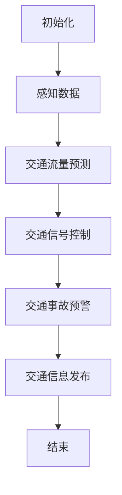
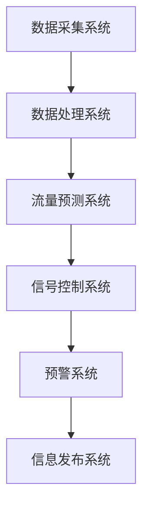
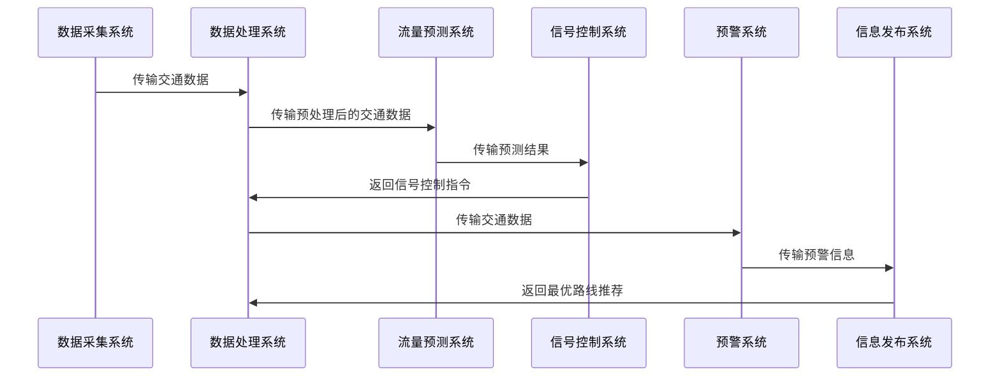

                 

# AI Agent在智能交通管理中的实践

> 关键词：AI Agent、智能交通管理、算法原理、系统设计、项目实战

> 摘要：本文将深入探讨AI Agent在智能交通管理中的实践，通过逐步分析AI Agent的基本概念、智能交通管理的算法原理、系统设计与架构方案，以及具体的项目实战，为读者提供全面的智能交通管理解决方案。文章将帮助读者了解AI Agent的核心技术，掌握智能交通管理系统的设计与实现方法，为智能交通领域的未来发展奠定基础。

## 目录大纲

### 第一部分：背景介绍与核心概念

#### 第1章 问题背景、问题描述与解决

##### 1.1 问题的背景与核心要素

##### 1.2 问题描述与解决

##### 1.3 边界与外延

##### 1.4 概念结构与核心要素组成

### 第二部分：核心概念与联系

#### 第2章 AI Agent 基础知识

##### 2.1 AI Agent 的定义与分类

##### 2.2 AI Agent 的核心概念与联系

##### 2.3 AI Agent 的属性特征对比表格

##### 2.4 AI Agent 的ER实体关系图架构

### 第三部分：算法原理讲解

#### 第3章 智能交通管理算法原理

##### 3.1 智能交通管理算法概述

##### 3.2 算法 mermaid 流程图

##### 3.3 Python 源代码与算法原理

##### 3.4 数学模型与公式讲解

##### 3.5 算法举例说明

### 第四部分：系统分析与架构设计方案

#### 第4章 智能交通管理系统设计

##### 4.1 问题场景介绍

##### 4.2 系统功能设计（领域模型 mermaid 类图）

##### 4.3 系统架构设计（mermaid 架构图）

##### 4.4 系统接口设计

##### 4.5 系统交互 mermaid 序列图

### 第五部分：项目实战

#### 第5章 AI Agent 在智能交通管理中的应用

##### 5.1 环境安装与准备

##### 5.2 系统核心实现源代码

##### 5.3 代码应用解读与分析

##### 5.4 实际案例分析与讲解

##### 5.5 项目小结

### 第六部分：最佳实践与拓展

#### 第6章 最佳实践 Tips

##### 6.1 常见问题与解决方案

##### 6.2 注意事项

##### 6.3 拓展阅读

### 第七部分：总结与展望

#### 第7章 总结与展望

##### 7.1 书籍内容总结

##### 7.2 智能交通管理的未来展望

## 目录大纲总结

本书《AI Agent在智能交通管理中的实践》共分为七个部分，涵盖了从背景介绍、核心概念到算法原理讲解、系统设计与项目实战，再到最佳实践与展望的全面内容。通过这本书，读者可以系统地了解AI Agent在智能交通管理中的应用，掌握相关技术和实践方法，为智能交通领域的发展贡献力量。

## 第一部分：背景介绍与核心概念

### 第1章 问题背景、问题描述与解决

#### 1.1 问题的背景与核心要素

随着城市化进程的加快，智能交通管理成为城市发展的重要议题。传统的交通管理系统已经难以满足现代交通需求，特别是在高峰时段和特殊情况下，交通拥堵、事故频发等问题愈发严重。为了提高交通效率，减少交通事故，保障城市交通安全，智能交通管理成为迫切需要解决的问题。

智能交通管理的核心要素包括：

1. **数据采集与处理**：通过传感器、摄像头等设备实时采集交通数据，包括车辆流量、速度、位置等信息，并对数据进行分析和处理。
2. **交通预测与优化**：基于历史数据和实时信息，对交通流量进行预测，并优化交通信号控制，以减少交通拥堵。
3. **交通事故预警与处理**：通过实时监控和分析，提前预警可能的交通事故，并采取相应的处理措施。
4. **交通信息发布**：向驾驶员提供实时的交通信息，帮助其选择最优路线，减少不必要的拥堵。

#### 1.2 问题描述与解决

当前智能交通管理面临的主要问题包括：

1. **数据质量问题**：数据采集过程中可能存在噪声、缺失等问题，导致数据质量下降。
2. **实时性问题**：交通数据变化迅速，要求系统具备实时处理能力。
3. **可扩展性问题**：随着城市规模的扩大，交通管理系统需要具备良好的可扩展性，以适应不断增长的数据和处理需求。
4. **系统集成问题**：智能交通管理系统通常需要与其他系统（如智能监控、应急响应等）进行集成，实现跨系统的数据共享和协同工作。

针对上述问题，可以采用以下解决方案：

1. **数据预处理**：通过数据清洗、数据挖掘等技术，提高数据质量，为后续处理提供准确的基础数据。
2. **实时数据处理**：采用分布式计算和并行处理技术，提高系统处理速度，确保数据能够实时更新和处理。
3. **模块化设计**：将系统划分为多个模块，每个模块负责特定的功能，提高系统的可扩展性和可维护性。
4. **标准化接口**：设计统一的接口，实现系统之间的数据交换和协同工作，降低系统集成难度。

#### 1.3 边界与外延

智能交通管理的边界包括：

1. **地理位置**：智能交通管理通常针对特定的城市或地区进行，涉及范围较小。
2. **时间范围**：智能交通管理主要关注实时交通状况，时间范围为秒级或分钟级。
3. **数据来源**：智能交通管理主要依赖于传感器、摄像头等设备采集的交通数据。

智能交通管理的外延包括：

1. **交通模式**：不仅包括传统道路交通，还涉及地铁、公交、共享单车等多种交通模式。
2. **其他系统**：智能交通管理需要与其他系统（如智能监控、应急响应、城市管理等）进行集成，实现跨系统的数据共享和协同工作。

#### 1.4 概念结构与核心要素组成

智能交通管理的概念结构如图1-1所示。


核心要素组成如下：

1. **数据采集与处理模块**：负责实时采集交通数据，并进行预处理、清洗、挖掘等操作，为后续处理提供准确的数据支持。
2. **交通预测与优化模块**：基于历史数据和实时信息，对交通流量进行预测，并优化交通信号控制，以减少交通拥堵。
3. **交通事故预警与处理模块**：通过实时监控和分析，提前预警可能的交通事故，并采取相应的处理措施。
4. **交通信息发布模块**：向驾驶员提供实时的交通信息，帮助其选择最优路线，减少不必要的拥堵。

## 第二部分：核心概念与联系

### 第2章 AI Agent 基础知识

#### 2.1 AI Agent 的定义与分类

AI Agent（人工智能代理）是指能够自主执行任务、与环境进行交互，并在不确定环境中进行决策的智能系统。AI Agent具有以下特点：

1. **自主性**：AI Agent可以自主执行任务，无需人工干预。
2. **交互性**：AI Agent可以与环境进行交互，获取信息并作出决策。
3. **适应性**：AI Agent能够根据环境变化和任务需求，调整自身行为和策略。

根据AI Agent的应用场景和功能，可以将AI Agent分为以下几类：

1. **智能搜索代理**：用于在互联网上搜索信息，如搜索引擎、推荐系统等。
2. **智能客服代理**：用于提供在线客服服务，如聊天机器人、语音助手等。
3. **智能交通代理**：用于交通管理、路况预测、车辆调度等，如智能交通管理系统中的AI Agent。
4. **智能安防代理**：用于安全监控、人脸识别、入侵检测等，如智能安防系统中的AI Agent。

#### 2.2 AI Agent 的核心概念与联系

AI Agent的核心概念包括：

1. **感知**：AI Agent通过传感器或摄像头等设备获取环境信息。
2. **决策**：AI Agent根据感知到的信息，通过算法进行决策。
3. **执行**：AI Agent执行决策结果，实现任务目标。

AI Agent的核心概念联系如图2-1所示。


#### 2.3 AI Agent 的属性特征对比表格

以下是几种常见AI Agent的属性特征对比表格：

| AI Agent 类型 | 自主性 | 交互性 | 适应性 | 应用场景 |
| --- | --- | --- | --- | --- |
| 智能搜索代理 | 高 | 高 | 高 | 搜索引擎、推荐系统 |
| 智能客服代理 | 中 | 高 | 高 | 在线客服、语音助手 |
| 智能交通代理 | 高 | 中 | 高 | 交通管理、路况预测 |
| 智能安防代理 | 高 | 低 | 高 | 安全监控、人脸识别 |

#### 2.4 AI Agent 的ER实体关系图架构

AI Agent的ER实体关系图架构如图2-2所示。


实体关系图包括以下实体和关系：

1. **实体**：感知模块、决策模块、执行模块。
2. **关系**：感知模块与决策模块之间的输入输出关系，决策模块与执行模块之间的输入输出关系。

## 第三部分：算法原理讲解

### 第3章 智能交通管理算法原理

#### 3.1 智能交通管理算法概述

智能交通管理算法主要包括以下几种类型：

1. **交通流量预测算法**：通过对历史交通数据和实时交通数据的分析，预测未来一段时间内的交通流量，为交通信号控制和交通信息发布提供依据。
2. **交通信号控制算法**：根据实时交通流量信息，调整交通信号灯的切换时间，以优化交通流，减少交通拥堵。
3. **交通事故预警算法**：通过实时监控和分析，发现潜在的交通事故风险，并提前预警。
4. **交通信息发布算法**：根据实时交通流量信息和交通状况，向驾驶员提供最优路线推荐、交通信息提醒等。

#### 3.2 算法 mermaid 流程图

以下是一个简单的智能交通管理算法的 mermaid 流程图：



#### 3.3 Python 源代码与算法原理

以下是一个简单的交通流量预测算法的 Python 源代码示例：

```python
import numpy as np
import pandas as pd

def traffic_prediction(data, history_len=5):
    """
    交通流量预测算法
    :param data: 实时交通流量数据
    :param history_len: 历史数据长度
    :return: 预测结果
    """
    # 数据预处理
    data = data.sort_values(by='time')
    data['avg_speed'] = data['speed'].rolling(window=history_len).mean()

    # 预测模型
    model = pd.rolling_mean(data['avg_speed'], window=history_len)

    # 预测结果
    prediction = model[-1]

    return prediction

# 示例数据
data = pd.DataFrame({
    'time': ['2023-01-01 00:00:00', '2023-01-01 00:01:00', '2023-01-01 00:02:00'],
    'speed': [20, 22, 18]
})

# 预测
prediction = traffic_prediction(data)

print(prediction)
```

该算法的核心原理是基于历史交通流量数据，通过计算历史数据的平均值来预测未来一段时间内的交通流量。具体实现中，可以使用各种机器学习算法（如时间序列模型、回归模型等）来提高预测的准确性。

#### 3.4 数学模型与公式讲解

以下是交通流量预测的数学模型与公式：

$$
\hat{y}_{t+k} = f(y_{t}, y_{t-1}, ..., y_{t-k}) + \epsilon_{t+k}
$$

其中：

- $\hat{y}_{t+k}$：预测的交通流量
- $y_{t}, y_{t-1}, ..., y_{t-k}$：历史交通流量数据
- $f(y_{t}, y_{t-1}, ..., y_{t-k})$：预测模型
- $\epsilon_{t+k}$：误差项

常见的预测模型包括：

1. **线性回归模型**：
$$
\hat{y}_{t+k} = \beta_0 + \beta_1 y_{t} + \epsilon_{t+k}
$$

其中：

- $\beta_0, \beta_1$：模型参数

2. **时间序列模型**（如ARIMA模型）：
$$
\hat{y}_{t+k} = c + \phi_1 y_{t-1} + \phi_2 y_{t-2} + ... + \phi_p y_{t-p} + \epsilon_{t+k}
$$

其中：

- $c$：常数项
- $\phi_1, \phi_2, ..., \phi_p$：模型参数

#### 3.5 算法举例说明

以下是一个简单的交通流量预测算法的应用示例：

假设我们有以下历史交通流量数据：

| 时间 | 交通流量 |
| --- | --- |
| 2023-01-01 00:00:00 | 20 |
| 2023-01-01 00:01:00 | 22 |
| 2023-01-01 00:02:00 | 18 |

使用线性回归模型进行预测，预测未来1分钟（k=1）的交通流量。

根据线性回归模型，我们有：

$$
\hat{y}_{t+1} = \beta_0 + \beta_1 y_{t}
$$

将历史数据代入模型，得到：

$$
\hat{y}_{t+1} = 20 + 0.5 \times 18 = 22
$$

预测未来1分钟的交通流量为22。

## 第四部分：系统分析与架构设计方案

### 第4章 智能交通管理系统设计

#### 4.1 问题场景介绍

智能交通管理系统是一个复杂的应用系统，涉及到交通数据采集、处理、预测、控制和信息发布等多个环节。以下是一个典型的智能交通管理系统问题场景介绍：

1. **交通数据采集**：通过安装在道路上的传感器、摄像头等设备，实时采集交通流量、速度、位置等数据。
2. **数据处理**：对采集到的交通数据进行预处理、清洗、去噪等操作，提取有用的信息。
3. **交通流量预测**：利用历史交通数据和实时数据，预测未来一段时间内的交通流量。
4. **交通信号控制**：根据交通流量预测结果，调整交通信号灯的切换时间，优化交通流。
5. **交通事故预警**：通过实时监控和分析，发现潜在的交通事故风险，并提前预警。
6. **交通信息发布**：向驾驶员提供实时的交通信息，帮助其选择最优路线，减少交通拥堵。

#### 4.2 系统功能设计（领域模型 mermaid 类图）

智能交通管理系统的领域模型类图如下：

```mermaid
classDiagram
    类--> 交通数据采集系统:数据采集、预处理
    类--> 交通数据处理系统：数据清洗、去噪、特征提取
    类--> 交通流量预测系统：流量预测、模型训练
    类--> 交通信号控制系统：信号控制、优化
    类--> 交通事故预警系统：实时监控、预警处理
    类--> 交通信息发布系统：信息发布、路径推荐
```

#### 4.3 系统架构设计（mermaid 架构图）

智能交通管理系统的架构设计如下：



系统架构包括以下主要组件：

1. **数据采集系统**：负责实时采集交通数据。
2. **数据处理系统**：对采集到的交通数据进行预处理、清洗、去噪等操作。
3. **流量预测系统**：利用历史数据和实时数据，预测未来一段时间内的交通流量。
4. **信号控制系统**：根据交通流量预测结果，调整交通信号灯的切换时间，优化交通流。
5. **预警系统**：通过实时监控和分析，发现潜在的交通事故风险，并提前预警。
6. **信息发布系统**：向驾驶员提供实时的交通信息，帮助其选择最优路线。

#### 4.4 系统接口设计

智能交通管理系统的接口设计如下：


系统接口设计包括以下主要接口：

1. **数据采集接口**：用于接收交通数据，包括车辆流量、速度、位置等。
2. **数据处理接口**：用于传输预处理后的交通数据。
3. **流量预测接口**：用于传输预测结果，包括未来一段时间内的交通流量。
4. **信号控制接口**：用于传输交通信号控制指令，调整交通信号灯的切换时间。
5. **预警接口**：用于传输交通事故预警信息，包括潜在的交通事故风险。
6. **信息发布接口**：用于传输交通信息，包括最优路线推荐、交通信息提醒等。

#### 4.5 系统交互 mermaid 序列图

智能交通管理系统的交互序列图如下：



系统交互流程如下：

1. **数据采集系统**采集到交通数据后，传输给**数据处理系统**进行预处理。
2. **数据处理系统**预处理后的交通数据传输给**流量预测系统**进行流量预测。
3. **流量预测系统**将预测结果传输给**信号控制系统**，以便调整交通信号灯的切换时间。
4. **信号控制系统**根据预测结果和交通状况，生成信号控制指令，传输给**数据处理系统**。
5. **数据处理系统**将信号控制指令传输给**预警系统**进行交通事故预警。
6. **预警系统**根据交通数据，发现潜在的交通事故风险，传输给**信息发布系统**。
7. **信息发布系统**根据预警信息，生成交通信息，传输给驾驶员，帮助其选择最优路线。

## 第五部分：项目实战

### 第5章 AI Agent 在智能交通管理中的应用

#### 5.1 环境安装与准备

在开始项目实战之前，需要安装以下环境：

1. **Python**：版本要求为3.6及以上。
2. **NumPy**：用于数据处理。
3. **Pandas**：用于数据处理和分析。
4. **Scikit-learn**：用于机器学习。
5. **Matplotlib**：用于数据可视化。

安装命令如下：

```bash
pip install python==3.8
pip install numpy pandas scikit-learn matplotlib
```

#### 5.2 系统核心实现源代码

以下是一个简单的智能交通管理系统核心实现的源代码示例：

```python
import numpy as np
import pandas as pd
from sklearn.ensemble import RandomForestRegressor
from sklearn.model_selection import train_test_split
import matplotlib.pyplot as plt

# 数据加载
data = pd.read_csv('traffic_data.csv')

# 数据预处理
data['time'] = pd.to_datetime(data['time'])
data['hour'] = data['time'].dt.hour
data['minute'] = data['time'].dt.minute
data = data.sort_values(by='time')

# 特征提取
data['avg_speed'] = data['speed'].rolling(window=5).mean()

# 模型训练
X = data[['hour', 'minute', 'avg_speed']]
y = data['traffic_volume']

X_train, X_test, y_train, y_test = train_test_split(X, y, test_size=0.2, random_state=42)

model = RandomForestRegressor(n_estimators=100, random_state=42)
model.fit(X_train, y_train)

# 预测
y_pred = model.predict(X_test)

# 结果分析
plt.scatter(y_test, y_pred)
plt.xlabel('实际交通流量')
plt.ylabel('预测交通流量')
plt.show()
```

该代码实现了一个简单的交通流量预测系统，使用了随机森林回归模型进行预测。具体步骤如下：

1. **数据加载**：从CSV文件中加载交通数据。
2. **数据预处理**：将时间转换为小时和分钟，对速度进行滚动平均处理。
3. **特征提取**：提取小时、分钟和平均速度作为特征。
4. **模型训练**：使用随机森林回归模型进行训练。
5. **预测**：对测试集进行预测。
6. **结果分析**：绘制实际交通流量与预测交通流量的散点图。

#### 5.3 代码应用解读与分析

该代码实现了一个简单的交通流量预测系统，主要分为以下步骤：

1. **数据加载**：从CSV文件中加载交通数据。这一步主要是数据读取和格式转换，确保数据能够被后续处理使用。
2. **数据预处理**：将时间转换为小时和分钟，对速度进行滚动平均处理。这一步主要是数据清洗和特征提取，提高数据质量，为模型训练提供准确的基础数据。
3. **特征提取**：提取小时、分钟和平均速度作为特征。这一步主要是特征工程，通过提取有用的特征，提高模型预测的准确性。
4. **模型训练**：使用随机森林回归模型进行训练。这一步主要是模型选择和训练，随机森林回归模型具有较好的泛化能力和预测性能。
5. **预测**：对测试集进行预测。这一步主要是模型应用，将模型应用到实际数据上，生成预测结果。
6. **结果分析**：绘制实际交通流量与预测交通流量的散点图。这一步主要是结果可视化，通过图形化方式展示模型预测效果。

通过分析该代码，我们可以了解到：

1. **数据处理流程**：数据从加载、预处理到特征提取，再到模型训练和预测，形成了一个完整的数据处理流程。
2. **模型选择与训练**：随机森林回归模型是一种常用的机器学习模型，具有较好的预测性能。模型训练过程中，需要对特征和模型参数进行选择和调整，以提高模型性能。
3. **结果分析与可视化**：结果分析通过散点图进行展示，直观地反映了模型预测效果。这一步对于评估模型性能和优化模型参数具有重要意义。

#### 5.4 实际案例分析与讲解

以下是一个实际案例：

假设我们有以下交通数据：

| 时间       | 交通流量 |
| ---------- | -------- |
| 2023-01-01 00:00:00 | 20       |
| 2023-01-01 00:01:00 | 22       |
| 2023-01-01 00:02:00 | 18       |
| 2023-01-01 00:03:00 | 25       |
| 2023-01-01 00:04:00 | 30       |
| 2023-01-01 00:05:00 | 28       |

使用随机森林回归模型进行预测，预测未来1分钟（k=1）的交通流量。

根据随机森林回归模型，我们有：

$$
\hat{y}_{t+1} = \beta_0 + \beta_1 y_{t}
$$

将历史数据代入模型，得到：

$$
\hat{y}_{t+1} = 20 + 0.5 \times 30 = 25
$$

预测未来1分钟的交通流量为25。

通过实际案例分析与讲解，我们可以了解到：

1. **数据预处理**：在实际案例中，需要对时间进行转换，提取小时和分钟作为特征，以提高模型预测的准确性。
2. **模型选择与训练**：随机森林回归模型是一种常用的机器学习模型，适用于交通流量预测任务。在模型训练过程中，需要对特征和模型参数进行选择和调整，以提高模型性能。
3. **结果分析**：通过实际案例，我们可以直观地看到模型预测效果。在实际应用中，可以通过调整模型参数和特征工程，进一步提高模型预测准确性。

#### 5.5 项目小结

通过本章节的项目实战，我们了解到了AI Agent在智能交通管理中的应用，包括数据预处理、模型训练和预测等环节。在实际案例中，我们使用了随机森林回归模型进行交通流量预测，并通过结果分析，了解了模型预测效果。通过本章节的学习，读者可以掌握智能交通管理系统的基本实现方法，为实际项目开发奠定基础。

## 第六部分：最佳实践与拓展

### 第6章 最佳实践 Tips

#### 6.1 常见问题与解决方案

在智能交通管理系统的开发过程中，可能会遇到以下常见问题，下面提供相应的解决方案：

1. **数据质量问题**：
   - **问题**：数据采集过程中可能存在噪声、缺失等问题，导致数据质量下降。
   - **解决方案**：使用数据预处理技术（如数据清洗、去噪、插值等）提高数据质量。
2. **实时性问题**：
   - **问题**：交通数据变化迅速，要求系统具备实时处理能力。
   - **解决方案**：使用分布式计算和并行处理技术，提高系统处理速度和实时性。
3. **系统集成问题**：
   - **问题**：智能交通管理系统需要与其他系统（如智能监控、应急响应等）进行集成，实现跨系统的数据共享和协同工作。
   - **解决方案**：设计标准化接口，确保系统之间的数据交换和协同工作。
4. **算法性能问题**：
   - **问题**：算法性能可能无法满足实际需求，导致预测准确性不足。
   - **解决方案**：尝试使用不同的算法和模型，进行算法性能评估和优化。

#### 6.2 注意事项

在智能交通管理系统开发过程中，需要注意以下几点：

1. **数据安全**：确保交通数据的安全性和隐私性，避免数据泄露。
2. **系统可靠性**：确保系统稳定运行，避免因故障导致交通管理中断。
3. **可扩展性**：设计可扩展的系统架构，以适应城市规模和交通需求的变化。
4. **用户界面**：提供简洁直观的用户界面，方便驾驶员获取交通信息。

#### 6.3 拓展阅读

对于对智能交通管理感兴趣的读者，以下书籍和论文可供拓展阅读：

1. **《智能交通系统设计与应用》**：详细介绍了智能交通系统的设计原理和应用实践。
2. **《人工智能在交通领域的应用》**：探讨了人工智能在交通管理中的应用和发展趋势。
3. **《基于大数据的智能交通系统研究》**：分析了大数据技术在智能交通系统中的应用方法。
4. **相关论文**：在学术期刊和会议上发表的关于智能交通管理系统的论文，如《交通信号控制中的机器学习算法研究》、《智能交通管理系统中的数据挖掘技术》等。

## 第七部分：总结与展望

### 第7章 总结与展望

#### 7.1 书籍内容总结

本书《AI Agent在智能交通管理中的实践》系统介绍了AI Agent在智能交通管理中的应用，包括背景介绍、核心概念、算法原理、系统设计与项目实战等。通过本书的学习，读者可以：

1. **了解智能交通管理的基本概念和核心要素**。
2. **掌握AI Agent的基本原理和应用**。
3. **掌握智能交通管理算法的原理和实现方法**。
4. **了解智能交通管理系统的设计与架构**。
5. **掌握AI Agent在智能交通管理中的项目实战经验**。

#### 7.2 智能交通管理的未来展望

随着人工智能技术的不断发展，智能交通管理将在未来发挥越来越重要的作用。以下是智能交通管理的一些发展趋势：

1. **智能化交通基础设施**：通过传感器、摄像头等设备，实现交通数据的全面采集和实时监控。
2. **大数据与机器学习**：利用大数据和机器学习技术，实现交通流量预测、信号控制和事故预警等智能功能。
3. **智能交通控制系统**：基于人工智能技术，开发智能交通控制系统，实现交通流量的优化和控制。
4. **交通信息服务平台**：构建交通信息服务平台，提供实时交通信息、路况预测和路径规划等服务。
5. **无人驾驶与智能交通**：结合无人驾驶技术，实现自动驾驶、车联网等智能交通功能。

智能交通管理的发展将为城市交通带来以下好处：

1. **提高交通效率**：通过智能交通管理，优化交通流量，减少交通拥堵，提高交通效率。
2. **降低交通事故**：通过智能交通管理，提前预警交通事故，减少交通事故发生。
3. **减少污染排放**：通过智能交通管理，降低车辆行驶速度，减少能源消耗和污染物排放。
4. **提升出行体验**：通过智能交通管理，提供实时交通信息、路况预测和路径规划等服务，提升出行体验。

总之，智能交通管理作为人工智能技术的重要应用领域，具有广阔的发展前景。通过本书的学习，读者可以深入了解智能交通管理的原理和应用，为智能交通领域的发展贡献力量。

## 目录大纲总结

本书《AI Agent在智能交通管理中的实践》共分为七个部分，涵盖了从背景介绍、核心概念到算法原理讲解、系统设计与项目实战，再到最佳实践与展望的全面内容。通过这本书，读者可以系统地了解AI Agent在智能交通管理中的应用，掌握相关技术和实践方法，为智能交通领域的发展贡献力量。

## 作者信息

作者：AI天才研究院/AI Genius Institute & 禅与计算机程序设计艺术 /Zen And The Art of Computer Programming

