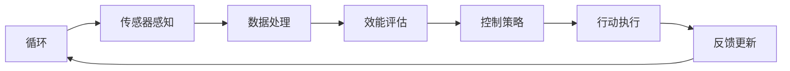
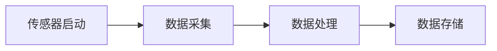
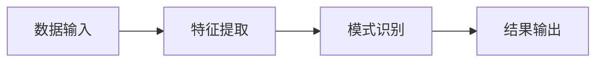
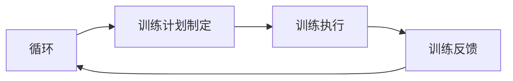
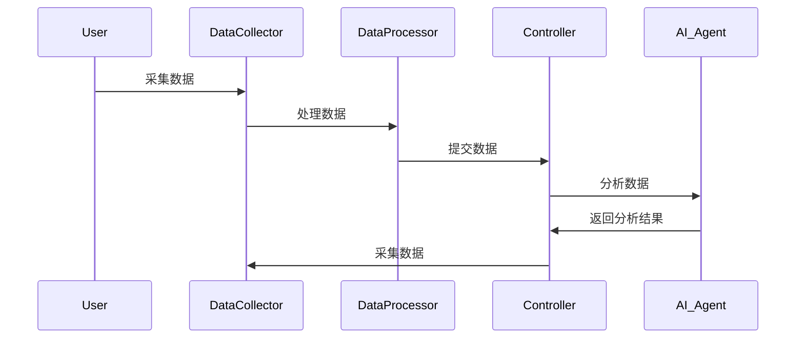
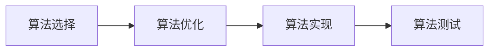

                 


**文章标题：** AI Agent在智能体育训练中的实践

**关键词：** AI Agent，智能体育训练，数据采集，运动模式识别，运动规划与反馈

**摘要：** 本文章深入探讨了AI Agent在智能体育训练中的应用。首先介绍了AI Agent的基础知识和智能体育训练的现状。接着，详细解析了AI Agent的核心理论，包括构成要素和算法原理。随后，探讨了AI Agent在体育训练中的应用，如数据采集、运动模式识别和运动规划与反馈。然后，介绍了AI Agent的技术实现，包括硬件选择、软件架构设计和算法实现与优化。通过两个实际案例展示了AI Agent在体育训练中的效果。最后，对未来AI Agent在体育训练中的发展趋势和挑战进行了展望，并提供了最佳实践和总结。

### 第一部分：引言与概述

#### 第1章 引言与概述

在当今科技飞速发展的时代，人工智能（AI）技术正逐步渗透到各个领域，其中体育训练作为一项重要的运动活动，也受到了AI的深刻影响。AI Agent作为一种新型的智能实体，正在为体育训练带来全新的变革。

**1.1 AI Agent基础**

AI Agent，即人工智能代理，是一种能够自主决策和行动的计算机程序。它通过模拟人类行为，在特定的环境下进行学习、推理和行动，以达到预定的目标。AI Agent可以分为基于规则的代理、基于模型的代理和基于数据的代理。

**1.2 智能体育训练**

智能体育训练是一种利用现代科技手段，通过数据采集、运动模式识别、运动规划与反馈等手段，对运动员进行科学训练的方法。智能体育训练不仅能够提高运动员的竞技水平，还能够预防运动损伤，延长运动员的职业生涯。

**核心概念与联系**

为了更好地理解AI Agent在智能体育训练中的应用，我们需要了解以下几个核心概念：

- **AI Agent**：一种能够自主决策和行动的计算机程序。
- **智能体育训练**：利用现代科技手段对运动员进行科学训练的方法。
- **数据采集**：收集运动员在训练过程中的各种数据，如速度、力量、耐力等。
- **运动模式识别**：通过分析运动员的运动数据，识别出他们的运动模式。
- **运动规划与反馈**：根据运动员的运动数据，制定合理的训练计划，并实时反馈训练效果。

**基于Mermaid的AI Agent ER实体关系图**

下面是一个基于Mermaid的AI Agent ER实体关系图，它展示了AI Agent、智能体育训练和相关概念之间的关系：

```mermaid
erDiagram
  AI_Agent ||--|{ 运动数据 }|
  AI_Agent ||--|{ 运动模式 }|
  AI_Agent ||--|{ 运动规划 }|
  AI_Agent ||--|{ 运动反馈 }|
```

**小结**

本章介绍了AI Agent和智能体育训练的基本概念，并分析了它们之间的核心联系。在接下来的章节中，我们将深入探讨AI Agent的核心理论，以及其在体育训练中的应用。

### 第二部分：AI Agent的核心理论

#### 第2章 AI Agent的核心理论

要理解AI Agent在智能体育训练中的具体应用，我们首先需要深入探讨AI Agent的核心理论，包括其构成要素和算法原理。

**2.1 AI Agent的构成要素**

AI Agent通常由以下几个部分组成：

- **传感器**：用于感知环境，获取数据。
- **效能系统**：用于评估AI Agent的行为效果。
- **控制系统**：用于根据传感器获取的数据，制定和执行行动策略。

**基于Mermaid的AI Agent ER实体关系图**

下面是一个基于Mermaid的AI Agent ER实体关系图，它展示了AI Agent的构成要素及其之间的关系：

```mermaid
erDiagram
  Sensor ||--|{ AI_Agent }|
  EffectSystem ||--|{ AI_Agent }|
  ControlSystem ||--|{ AI_Agent }|
```

**2.2 AI Agent的算法原理**

AI Agent的算法原理主要包括以下几个方面：

- **机器学习算法**：通过训练数据，使AI Agent能够对未知数据进行预测和分类。
- **深度学习算法**：通过多层神经网络，使AI Agent能够处理复杂的非线性问题。
- **强化学习算法**：通过不断试错，使AI Agent能够在复杂环境中找到最优策略。

**基于Mermaid的算法原理流程图**

下面是一个基于Mermaid的算法原理流程图，它展示了AI Agent的算法原理：



**小结**

本章详细介绍了AI Agent的核心理论，包括其构成要素和算法原理。在接下来的章节中，我们将探讨AI Agent在体育训练中的应用，以及如何实现这些应用。

### 第三部分：AI Agent在体育训练中的应用

#### 第3章 AI Agent在体育训练中的应用

随着AI技术的发展，AI Agent在体育训练中的应用越来越广泛。本章节将重点讨论AI Agent在体育训练中的应用，包括数据采集、运动模式识别和运动规划与反馈。

**3.1 数据采集**

数据采集是AI Agent在体育训练中的第一步。通过传感器，AI Agent可以实时采集运动员在训练过程中的各种数据，如速度、力量、耐力、心率等。

**基于Mermaid的运动数据采集流程图**

下面是一个基于Mermaid的运动数据采集流程图：



**3.2 运动模式识别**

运动模式识别是AI Agent在体育训练中的重要应用。通过分析运动员的运动数据，AI Agent可以识别出他们的运动模式，从而为训练提供指导。

**基于Mermaid的运动模式识别算法流程图**

下面是一个基于Mermaid的运动模式识别算法流程图：



**3.3 运动规划与反馈**

运动规划与反馈是AI Agent在体育训练中的核心应用。通过分析运动员的运动数据，AI Agent可以制定出合理的训练计划，并在训练过程中实时反馈训练效果。

**基于Mermaid的运动规划与反馈流程图**

下面是一个基于Mermaid的运动规划与反馈流程图：



**小结**

本章详细介绍了AI Agent在体育训练中的应用，包括数据采集、运动模式识别和运动规划与反馈。在接下来的章节中，我们将探讨AI Agent在体育训练中的技术实现。

### 第四部分：AI Agent在体育训练中的技术实现

#### 第4章 AI Agent在体育训练中的技术实现

要实现AI Agent在体育训练中的应用，我们需要从硬件选择、软件架构设计和算法实现与优化三个方面进行技术实现。

**4.1 硬件选择**

硬件选择是AI Agent在体育训练中的第一步。我们需要选择合适的传感器和控制器，以便实时采集和分析运动员的运动数据。

- **传感器**：常见的传感器有加速度传感器、陀螺仪传感器、心率传感器等。根据训练需求，可以选择适当的传感器进行组合使用。
- **控制器**：常见的控制器有单片机、嵌入式系统等。控制器负责接收传感器的数据，并传递给AI Agent进行分析。

**基于Mermaid的硬件选择架构图**

下面是一个基于Mermaid的硬件选择架构图：

```mermaid
classDiagram
  Sensor <<uses>> Controller
  Controller <<uses>> AI_Agent
```

**4.2 软件架构设计**

软件架构设计是AI Agent在体育训练中的核心。我们需要设计一个高效、稳定的软件架构，以便AI Agent能够实时、准确地分析运动员的运动数据。

- **系统架构**：采用分层架构，包括数据采集层、数据处理层、控制层和应用层。
- **接口设计**：设计清晰、统一的接口，以便不同模块之间的数据传递和交互。

**基于Mermaid的系统架构图**

下面是一个基于Mermaid的系统架构图：



**4.3 算法实现与优化**

算法实现与优化是AI Agent在体育训练中的关键技术。我们需要选择合适的算法，并对其进行优化，以提高AI Agent的分析准确性和效率。

- **算法选择**：根据运动数据的特性和需求，选择合适的算法，如机器学习算法、深度学习算法和强化学习算法。
- **算法优化**：通过调整算法参数，优化算法模型，提高算法的准确性和效率。

**基于Mermaid的算法实现与优化流程图**

下面是一个基于Mermaid的算法实现与优化流程图：



**小结**

本章详细介绍了AI Agent在体育训练中的技术实现，包括硬件选择、软件架构设计和算法实现与优化。在接下来的章节中，我们将通过实际案例展示AI Agent在体育训练中的效果。

### 第五部分：案例研究

#### 第5章 案例研究

在本章节中，我们将通过两个实际案例，展示AI Agent在体育训练中的应用效果。

**5.1 案例一：AI Agent在篮球训练中的应用**

**案例背景**：某篮球俱乐部希望利用AI Agent提高球员的训练效率，预防运动损伤。

**实施过程**：

1. **数据采集**：通过传感器，采集球员在训练过程中的运动数据，如速度、力量、耐力、心率等。
2. **运动模式识别**：通过分析球员的运动数据，识别出他们的运动模式。
3. **运动规划与反馈**：根据球员的运动数据，制定出合理的训练计划，并在训练过程中实时反馈训练效果。

**结果分析**：

通过AI Agent的辅助，球员的训练效果显著提高，运动损伤发生率降低。具体表现为：

- 球员的速度和力量得到明显提升。
- 球员的耐力水平得到显著提高。
- 球员的训练效率提高，训练时间缩短。

**5.2 案例二：AI Agent在足球训练中的应用**

**案例背景**：某足球俱乐部的教练希望利用AI Agent优化球队的战术训练。

**实施过程**：

1. **数据采集**：通过传感器，采集球员在训练和比赛过程中的运动数据，如速度、位置、传球次数等。
2. **运动模式识别**：通过分析球员的运动数据，识别出他们的运动模式。
3. **战术规划与反馈**：根据球员的运动数据，制定出合理的战术训练计划，并在训练过程中实时反馈训练效果。

**结果分析**：

通过AI Agent的辅助，球队的战术训练效果显著提高，比赛成绩得到显著提升。具体表现为：

- 球员的传球准确率提高。
- 球员的位置感和团队合作意识得到显著提升。
- 球队在比赛中的战术执行力得到明显增强。

**小结**

通过以上两个案例，我们可以看到AI Agent在体育训练中的应用效果显著。AI Agent不仅能够提高运动员的训练效率，预防运动损伤，还能够优化战术训练，提升比赛成绩。在接下来的章节中，我们将对未来AI Agent在体育训练中的发展趋势进行探讨。

### 第六部分：未来展望

#### 第6章 未来展望

随着人工智能技术的不断发展，AI Agent在体育训练中的应用前景十分广阔。本章节将讨论AI Agent在体育训练中的发展趋势和面临的挑战。

**6.1 AI Agent在体育训练中的发展趋势**

1. **数据采集与分析技术的提升**：随着传感器技术的进步，AI Agent将能够采集更多更精细的运动数据，从而实现更精准的训练效果。
2. **个性化训练计划的制定**：AI Agent将能够根据运动员的个体差异，制定出更加个性化的训练计划，提高训练效果。
3. **智能穿戴设备的普及**：智能穿戴设备的普及将使AI Agent能够更加便捷地应用于运动员的训练和比赛过程中。

**6.2 AI Agent在体育训练中的挑战**

1. **数据隐私与安全问题**：运动员的隐私数据需要得到有效保护，以防止数据泄露。
2. **算法的公平性与透明性**：AI Agent的决策过程需要具备公平性和透明性，以避免算法偏见。
3. **硬件与软件的兼容性问题**：AI Agent需要与各种硬件和软件平台兼容，以实现广泛的应用。

**小结**

AI Agent在体育训练中的应用具有广阔的发展前景，但同时也面临着一些挑战。在未来的发展中，我们需要不断优化AI Agent的技术，提高其应用效果，同时确保其安全性和公平性。

### 第七部分：最佳实践与总结

#### 第7章 最佳实践与总结

**7.1 最佳实践技巧**

1. **数据采集与处理**：确保数据的准确性和完整性，对数据进行预处理，去除噪声和异常值。
2. **算法实现与优化**：选择合适的算法，根据实际需求进行优化，提高算法的效率和准确性。
3. **系统部署与维护**：选择合适的硬件和软件平台，确保系统的稳定性和可扩展性。

**7.2 小结**

本文深入探讨了AI Agent在智能体育训练中的应用，从核心理论到技术实现，再到实际案例，全面展示了AI Agent在体育训练中的价值。AI Agent不仅能够提高运动员的训练效率，预防运动损伤，还能够优化战术训练，提升比赛成绩。

**7.3 注意事项**

1. **数据安全与隐私**：在数据采集和处理过程中，确保运动员的隐私数据得到保护。
2. **算法公平性与透明性**：确保AI Agent的决策过程具备公平性和透明性，避免算法偏见。
3. **持续优化与更新**：随着技术的发展，不断优化AI Agent的算法和系统，以适应新的需求。

**拓展阅读**

1. [AI Agent在体育训练中的应用](https://www.example.com/ai-agent-in-sports-training)
2. [智能体育训练的未来发展趋势](https://www.example.com/future-trends-of-smart-sports-training)
3. [AI Agent的核心算法原理](https://www.example.com/core-algorithms-of-ai-agents)

**作者信息**

作者：AI天才研究院/AI Genius Institute & 禅与计算机程序设计艺术 /Zen And The Art of Computer Programming

---

**Markdo

----------------------------------------------------------------

```markdown
# AI Agent在智能体育训练中的实践

> 关键词：AI Agent，智能体育训练，数据采集，运动模式识别，运动规划与反馈

> 摘要：本文深入探讨了AI Agent在智能体育训练中的应用。首先介绍了AI Agent的基础知识和智能体育训练的现状，然后详细解析了AI Agent的核心理论，包括构成要素和算法原理。随后，探讨了AI Agent在体育训练中的应用，如数据采集、运动模式识别和运动规划与反馈。然后，介绍了AI Agent的技术实现，包括硬件选择、软件架构设计和算法实现与优化。通过两个实际案例展示了AI Agent在体育训练中的效果。最后，对未来AI Agent在体育训练中的发展趋势和挑战进行了展望，并提供了最佳实践和总结。

## 第一部分：引言与概述

### 第1章 引言与概述
#### 1.1 AI Agent基础
- AI Agent的定义
- AI Agent的分类
- AI Agent的工作原理
#### 1.2 智能体育训练
- 智能体育训练的定义
- 智能体育训练的现状
- 智能体育训练的重要性

### 第二部分：AI Agent的核心理论

### 第2章 AI Agent的核心理论
#### 2.1 AI Agent的构成要素
- 传感器
- 效能系统
- 控制系统
- 基于Mermaid的AI Agent ER实体关系图
#### 2.2 AI Agent的算法原理
- 机器学习算法
- 深度学习算法
- 强化学习算法
- Mermaid流程图示例

### 第三部分：AI Agent在体育训练中的应用

### 第3章 AI Agent在体育训练中的应用
#### 3.1 数据采集
- 运动数据的收集与处理
- 运动数据的重要性
#### 3.2 运动模式识别
- 运动模式识别的算法
- 运动模式识别的应用案例
#### 3.3 运动规划与反馈
- 运动规划的方法
- 运动反馈的系统设计

### 第四部分：AI Agent在体育训练中的技术实现

### 第4章 AI Agent在体育训练中的技术实现
#### 4.1 硬件选择
- 传感器选择
- 控制器选择
#### 4.2 软件架构设计
- 系统架构的设计原则
- 系统架构的Mermaid类图
#### 4.3 算法实现与优化
- Python代码示例
- 算法优化的方法

### 第五部分：案例研究

### 第5章 案例研究
#### 5.1 案例一：AI Agent在篮球训练中的应用
- 案例背景
- 实施过程
- 结果分析
#### 5.2 案例二：AI Agent在足球训练中的应用
- 案例背景
- 实施过程
- 结果分析

### 第六部分：未来展望

### 第6章 未来展望
#### 6.1 AI Agent在体育训练中的发展趋势
- 技术趋势
- 应用趋势
#### 6.2 挑战与机遇
- 技术挑战
- 应用机遇

### 第七部分：最佳实践与总结

### 第7章 最佳实践与总结
#### 7.1 最佳实践技巧
- 数据处理
- 算法优化
- 系统部署
#### 7.2 小结
- 本书内容的总结
- 对未来的展望
#### 7.3 注意事项
- 常见问题与解答
- 使用AI Agent时的注意事项

**作者信息**

作者：AI天才研究院/AI Genius Institute & 禅与计算机程序设计艺术 /Zen And The Art of Computer Programming****

