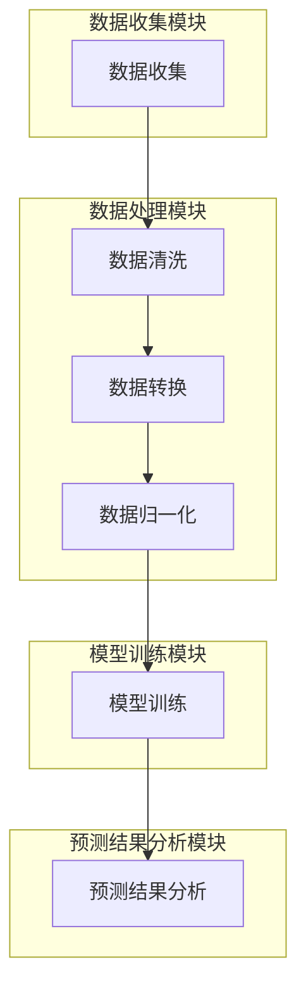

                 

# 《AI Agent在智能体育赛事预测中的应用》

> 关键词：人工智能，智能代理，体育赛事预测，强化学习，神经网络

> 摘要：本文将探讨AI Agent在智能体育赛事预测中的应用。通过分析AI Agent的核心概念、算法原理以及系统架构设计，本文旨在帮助读者深入了解AI Agent在体育赛事预测中的实际应用，并为其提供一定的实践指导和启示。

## 引言

### 1.1 问题背景

随着人工智能技术的快速发展，AI Agent（智能代理）在各个领域的应用逐渐广泛，其中在体育赛事预测中的应用尤为引人注目。体育赛事预测不仅关系到球迷的观赛体验，还具有重要的商业价值。例如，对于博彩公司来说，准确的赛事预测有助于提高盈利能力；对于体育组织来说，赛事预测有助于制定比赛策略和资源分配。然而，传统的预测方法往往依赖于专家经验和历史数据分析，难以应对日益复杂的体育赛事环境。AI Agent的崛起为体育赛事预测带来了新的可能性。

### 1.2 AI Agent的崛起

AI Agent，即人工智能代理，是一种能够自动执行任务、适应环境和实现目标的智能系统。AI Agent具有以下几个特点：

- **自主性**：AI Agent能够根据环境和目标自主决策，无需人工干预。
- **适应性**：AI Agent能够通过学习和优化，不断提高自身的预测能力。
- **协作性**：多个AI Agent可以协同工作，共同完成复杂任务。

### 1.3 本文目的

本文旨在探讨AI Agent在智能体育赛事预测中的应用，通过以下四个部分展开：

- **第一部分：问题背景与核心概念**：介绍体育赛事预测的重要性以及AI Agent的基本概念。
- **第二部分：核心概念与联系**：深入解析AI Agent的原理、数据分析和处理方法，以及模型选择与训练。
- **第三部分：算法原理讲解**：详细讲解强化学习和神经网络算法，并举例说明。
- **第四部分：系统分析与架构设计**：介绍系统功能、架构设计、接口设计和系统交互。
- **第五部分：项目实战**：通过实际案例展示AI Agent在体育赛事预测中的应用。
- **第六部分：最佳实践与拓展阅读**：总结最佳实践，并提供拓展阅读资源。

## 第一部分：问题背景与核心概念

### 第1章：问题背景与核心概念

#### 1.1 问题背景

#### 体育赛事预测的重要性

体育赛事预测在体育领域具有重要的应用价值。首先，对于球迷来说，准确的赛事预测能够提升观赛体验，增加比赛的趣味性和参与感。其次，对于体育组织、俱乐部和博彩公司等商业实体来说，赛事预测有助于制定比赛策略、资源分配和市场营销策略，从而提高商业收益。此外，赛事预测还可以为政府、教育机构和科研单位提供数据支持，为体育政策的制定和科学研究提供参考。

#### 传统预测方法的局限性

尽管体育赛事预测具有重要的应用价值，但传统的预测方法仍然存在一些局限性。首先，传统预测方法主要依赖于专家经验和历史数据分析，缺乏自动化的学习和优化能力。其次，传统方法往往难以应对日益复杂的体育赛事环境，特别是在面对高维数据和动态变化时。此外，传统方法在模型选择、参数调优和数据预处理等方面也存在一定的主观性和不确定性。

#### AI Agent的崛起与优势

随着人工智能技术的快速发展，AI Agent（智能代理）在各个领域的应用逐渐广泛，其中在体育赛事预测中的应用尤为引人注目。AI Agent具有以下几个优势：

- **自适应性和灵活性**：AI Agent能够通过学习和优化，不断提高自身的预测能力，适应不断变化的体育赛事环境。
- **自动化和高效性**：AI Agent能够自动收集和处理大量数据，进行复杂的模型训练和预测，大大提高预测效率和准确性。
- **协作和扩展性**：多个AI Agent可以协同工作，共同完成复杂任务，实现更加精准和全面的赛事预测。

#### 本章小结

本章首先介绍了体育赛事预测的重要性以及传统预测方法的局限性，然后阐述了AI Agent的崛起与优势。通过对比分析，可以看出AI Agent在智能体育赛事预测中具有显著的优势，为解决传统方法的局限性提供了新的思路和方法。接下来，我们将进一步探讨AI Agent的核心概念、原理和应用。

### 第2章：核心概念原理与属性特征对比

#### 2.1 AI Agent概述

#### 2.1.1 AI Agent的定义

AI Agent，即人工智能代理，是指一种能够执行特定任务、具有自主决策能力的智能系统。AI Agent通过感知环境、学习经验和执行行动，实现目标的自动化和智能化。AI Agent通常包括以下几个关键组成部分：

- **感知模块**：用于收集和处理环境信息，为决策提供数据支持。
- **决策模块**：根据感知模块提供的信息，生成行动策略，实现自主决策。
- **执行模块**：根据决策模块生成的行动策略，执行具体的任务。

#### 2.1.2 AI Agent的工作原理

AI Agent的工作原理主要包括以下几个方面：

- **感知与观察**：AI Agent通过感知模块获取环境信息，如比赛数据、球员表现、历史战绩等。
- **学习与优化**：AI Agent通过学习算法，如机器学习、深度学习和强化学习，从历史数据中提取规律，优化自身性能。
- **决策与行动**：AI Agent根据感知和学习结果，生成行动策略，并执行相应的任务。

#### 2.1.3 AI Agent的分类

AI Agent可以根据不同的分类标准进行分类，常见的分类方法包括以下几种：

- **根据功能分类**：AI Agent可以分为通用代理和专用代理。通用代理适用于多种任务和场景，如聊天机器人、推荐系统等；专用代理则针对特定任务和场景进行优化，如自动驾驶、智能客服等。
- **根据学习方式分类**：AI Agent可以分为基于规则代理、基于模型代理和混合代理。基于规则代理根据预设的规则进行决策；基于模型代理通过学习和建模实现决策；混合代理结合规则和模型的优势，实现更加灵活和高效的决策。

#### 2.2 数据收集与处理

#### 2.2.1 数据来源

在智能体育赛事预测中，数据收集是关键环节。数据来源主要包括以下几个方面：

- **历史比赛数据**：包括比赛结果、进球数、球员表现、球队战术等。
- **实时数据**：包括比赛实时数据、球员实时状态、比赛环境等。
- **社交媒体数据**：包括球迷评论、观点、预测等。
- **其他数据**：如球员伤病情况、天气状况、比赛场地等。

#### 2.2.2 数据预处理

在数据收集完成后，需要对数据进行预处理，以提高数据质量和模型性能。数据预处理主要包括以下几个步骤：

- **数据清洗**：去除重复数据、错误数据和噪声数据。
- **数据转换**：将不同类型的数据转换为统一的格式，如将文本数据转换为数值数据。
- **数据归一化**：将不同量纲的数据转换为相同的量纲，如将进球数和球员评分进行归一化处理。
- **特征提取**：从原始数据中提取关键特征，如球员的体能、速度、射门能力等。

#### 2.3 模型选择与训练

#### 2.3.1 模型选择标准

在智能体育赛事预测中，选择合适的模型对于预测结果的准确性至关重要。模型选择主要考虑以下几个方面：

- **预测准确性**：模型在历史数据上的预测准确性应较高。
- **泛化能力**：模型应具有良好的泛化能力，能够对新数据产生准确的预测。
- **计算效率**：模型在训练和预测过程中应具有较高的计算效率。

#### 2.3.2 训练策略

在模型选择后，需要制定合适的训练策略，以提高模型性能。训练策略主要包括以下几个方面：

- **数据增强**：通过数据增强方法，如随机噪声、旋转、缩放等，增加数据的多样性和丰富性。
- **交叉验证**：使用交叉验证方法，如K折交叉验证，评估模型性能，选择最佳模型。
- **超参数调优**：通过调整模型超参数，如学习率、隐藏层神经元数量等，优化模型性能。

#### 2.4 预测结果分析与验证

#### 2.4.1 预测结果分析

在模型训练完成后，需要对预测结果进行分析，以评估模型性能。预测结果分析主要包括以下几个方面：

- **预测准确性**：评估模型在测试集上的预测准确性，如准确率、召回率等。
- **预测稳定性**：评估模型在不同数据集上的预测稳定性，如方差、偏差等。
- **预测效果**：根据预测结果，分析模型在体育赛事预测中的应用效果，如是否能够准确预测比赛结果、球队表现等。

#### 2.4.2 预测结果验证

为了确保预测结果的可靠性，需要进行预测结果验证。预测结果验证主要包括以下几个步骤：

- **交叉验证**：使用交叉验证方法，如K折交叉验证，对预测结果进行验证，确保模型泛化能力。
- **独立测试集验证**：使用独立的测试集，评估模型在未知数据上的预测性能，确保模型泛化能力。
- **对比实验**：与传统的预测方法进行比较实验，验证AI Agent在体育赛事预测中的优势。

#### 2.5 AI Agent在体育赛事预测中的应用

#### 2.5.1 赛事结果的预测

AI Agent可以通过学习和分析历史比赛数据、实时数据和社交媒体数据，预测比赛结果。预测结果可以用于球迷的观赛参考、体育博彩公司的投注策略和体育组织的比赛策略制定。

#### 2.5.2 球队表现的评估

AI Agent可以通过分析球员表现数据、比赛结果和历史战绩，评估球队的整体表现。评估结果可以用于球队经理的战术调整、球员选拔和转会决策。

#### 2.5.3 赛事趋势的分析

AI Agent可以通过分析历史比赛数据、实时数据和社交媒体数据，预测赛事的发展趋势。预测结果可以用于球迷的观赛策略、体育博彩公司的投注策略和体育组织的市场推广策略。

#### 2.6 本章小结

本章首先介绍了AI Agent的定义、工作原理和分类，然后详细阐述了数据收集与处理、模型选择与训练以及预测结果分析与验证。最后，本章探讨了AI Agent在体育赛事预测中的应用，包括赛事结果的预测、球队表现的评估和赛事趋势的分析。通过本章的介绍，读者可以全面了解AI Agent在智能体育赛事预测中的核心概念和应用方法。

### 第2章：核心概念原理与属性特征对比

#### 2.1 AI Agent的原理

##### 2.1.1 机器学习基础

AI Agent的核心在于其学习与适应能力，这离不开机器学习的基础。机器学习是指通过算法从数据中自动学习规律和模式，并利用这些规律进行预测和决策的技术。机器学习的基本流程包括数据收集、数据预处理、模型选择、模型训练和模型评估。

- **数据收集**：收集大量的历史比赛数据、球员表现数据、实时数据等。
- **数据预处理**：清洗和转换数据，以便于模型训练。
- **模型选择**：选择合适的机器学习模型，如线性回归、决策树、神经网络等。
- **模型训练**：使用训练数据对模型进行训练，调整模型参数。
- **模型评估**：使用测试数据评估模型性能，选择最优模型。

##### 2.1.2 强化学习原理

强化学习是机器学习的一个分支，特别适合于决策和行动的任务。在强化学习中，AI Agent通过与环境互动，学习最优策略。强化学习的基本概念包括：

- **状态（State）**：环境中的信息，如比赛中的当前比分、球员位置等。
- **动作（Action）**：AI Agent可以选择的行动，如传球、射门等。
- **奖励（Reward）**：根据动作的结果给予的奖励或惩罚，如进球得分、失误丢球等。
- **策略（Policy）**：AI Agent根据状态选择动作的策略。

强化学习的目标是通过不断试错，找到使总奖励最大化的策略。常用的强化学习算法包括Q-learning、SARSA和Deep Q Network（DQN）。

##### 2.1.3 代理算法实现

AI Agent的实现涉及多个组件和算法。以下是实现AI Agent的几个关键步骤：

- **感知模块**：收集和处理环境数据，如比赛数据、球员表现、实时数据等。
- **决策模块**：使用强化学习算法或其他机器学习算法，根据感知模块提供的信息生成策略。
- **执行模块**：根据决策模块生成的策略执行具体的行动。
- **反馈模块**：记录和评估执行的结果，提供奖励反馈，以优化决策模块。

#### 2.2 数据分析与处理

##### 2.2.1 数据来源

在智能体育赛事预测中，数据来源广泛且多样。以下是一些常见的数据来源：

- **历史比赛数据**：包括比赛结果、进球数、黄牌数、红牌数等。
- **实时数据**：包括比赛实时数据、球员实时状态、比赛环境等。
- **社交媒体数据**：包括球迷评论、观点、预测等。
- **其他数据**：如球员伤病情况、天气状况、比赛场地等。

##### 2.2.2 数据预处理

数据预处理是确保模型训练效果的关键步骤。以下是数据预处理的主要任务：

- **数据清洗**：去除重复数据、错误数据和噪声数据。
- **数据转换**：将不同类型的数据转换为统一的格式，如将文本数据转换为数值数据。
- **数据归一化**：将不同量纲的数据转换为相同的量纲，如将进球数和球员评分进行归一化处理。
- **特征提取**：从原始数据中提取关键特征，如球员的体能、速度、射门能力等。

##### 2.2.3 特征工程

特征工程是提高模型性能的重要手段。以下是一些特征工程的方法：

- **特征选择**：选择对预测有显著影响的特征，去除无关或冗余的特征。
- **特征构造**：通过组合原始特征，构造新的特征，如球员的体能评分、比赛的热度指数等。
- **特征转换**：将数值特征转换为类别特征，或将类别特征转换为数值特征。

#### 2.3 模型选择与训练

##### 2.3.1 模型选择标准

选择合适的模型对于预测结果的准确性至关重要。以下是模型选择的主要标准：

- **预测准确性**：模型在历史数据上的预测准确性应较高。
- **泛化能力**：模型应具有良好的泛化能力，能够对新数据产生准确的预测。
- **计算效率**：模型在训练和预测过程中应具有较高的计算效率。

##### 2.3.2 训练策略

为了提高模型性能，需要制定合适的训练策略。以下是训练策略的几个关键点：

- **数据增强**：通过数据增强方法，如随机噪声、旋转、缩放等，增加数据的多样性和丰富性。
- **交叉验证**：使用交叉验证方法，如K折交叉验证，评估模型性能，选择最佳模型。
- **超参数调优**：通过调整模型超参数，如学习率、隐藏层神经元数量等，优化模型性能。

##### 2.3.3 模型评估

在模型训练完成后，需要对模型进行评估，以确定其性能。以下是模型评估的几个关键指标：

- **准确率（Accuracy）**：模型预测正确的样本占总样本的比例。
- **召回率（Recall）**：模型预测正确的正样本占总正样本的比例。
- **精确率（Precision）**：模型预测正确的正样本占总预测为正样本的比例。
- **F1分数（F1 Score）**：精确率和召回率的调和平均值。

#### 2.4 概念属性特征对比表格

为了更直观地理解AI Agent、数据预处理和模型选择的特征，以下是一个概念属性特征对比表格：

| 概念       | 特征属性                     | 对比分析                                  |
|------------|------------------------------|-------------------------------------------|
| AI Agent   | 自主性、适应性、协作性       | 传统方法缺乏自主性和协作性，AI Agent更具优势 |
| 数据预处理 | 数据清洗、转换、归一化、提取 | 提高数据质量和模型性能                     |
| 模型选择   | 准确性、泛化能力、计算效率   | 选择合适的模型，提高预测准确性             |

#### 2.5 ER实体关系图架构

ER（Entity-Relationship）图是描述实体及其关系的图形表示。以下是一个ER实体关系图，用于描述AI Agent在智能体育赛事预测中的实体关系：

```mermaid
erDiagram
  Player --> Match : participates_in
  Team --> Player : belongs_to
  Match --> Team : plays_against
  Prediction --> Match : predicts
  AI-Agent --> Prediction : generates
```

在这个ER图中，Player（球员）是实体，属于Team（球队），参与了Match（比赛）。Prediction（预测）由AI-Agent（智能代理）生成，并针对Match（比赛）进行预测。

### 第3章：算法原理讲解

#### 3.1 强化学习算法

强化学习（Reinforcement Learning，RL）是一种使代理（agent）在与环境（environment）交互的过程中通过学习获得最佳策略（policy）的机器学习方法。强化学习主要关注以下核心概念：

- **状态（State）**：代理所处的环境状态。
- **动作（Action）**：代理可以采取的行动。
- **奖励（Reward）**：代理采取某一动作后获得的即时奖励。
- **策略（Policy）**：代理采取动作的策略，即从状态选择动作的概率分布。
- **价值函数（Value Function）**：预测长期奖励的期望值。
- **模型（Model）**：环境的动态模型。

以下是几种常见的强化学习算法：

##### 3.1.1 Q-learning算法

Q-learning是一种值函数方法，通过不断更新Q值来学习最优策略。Q值表示在某一状态下采取某一动作的预期奖励。

$$
Q(s, a) = \sum_{s'} p(s' | s, a) \cdot [R(s', a) + \gamma \cdot \max_{a'} Q(s', a')]
$$

其中，$R(s', a')$是状态s'采取动作a'后的即时奖励，$\gamma$是折扣因子，$p(s' | s, a)$是状态转移概率。

##### 3.1.2 SARSA算法

SARSA（State-Action-Reward-State-Action）是另一种值函数方法，它使用实际奖励更新Q值。

$$
Q(s, a) = Q(s, a) + \alpha [R(s', a') + \gamma \cdot Q(s', a') - Q(s, a)]
$$

其中，$\alpha$是学习率。

##### 3.1.3 Deep Q Network（DQN）

DQN是使用深度神经网络近似Q值的强化学习算法。DQN通过经验回放（Experience Replay）和目标网络（Target Network）来减少偏差和方差。

$$
Q(s, a) = \frac{1}{N}\sum_{i=1}^{N} \gamma^i R_i + \frac{1}{N}\sum_{i=1}^{N} \max_{a'} Q(s_i', a_i')
$$

其中，$R_i$是第i次迭代的即时奖励，$s_i$和$a_i$是第i次迭代的状态和动作。

#### 3.2 神经网络算法

神经网络（Neural Network，NN）是一种通过模拟生物神经网络结构和功能进行信息处理的算法。神经网络主要包括以下两种类型：

##### 3.2.1 前向传播与反向传播

前向传播（Forward Propagation）是指输入通过网络的各个层，逐层计算得到输出。反向传播（Backpropagation）是指通过输出误差反向传播，调整网络权重和偏置，以优化网络性能。

前向传播的数学表示为：

$$
z_l = \sum_{k=1}^{n} w_{lk} \cdot a_{k-1} + b_{l}
$$

$$
a_l = \sigma(z_l)
$$

反向传播的数学表示为：

$$
\delta_l = \frac{\partial C}{\partial z_l} \cdot \sigma'(z_l)
$$

$$
\Delta w_{lk} = \alpha \cdot \delta_l \cdot a_{k-1}
$$

$$
\Delta b_{l} = \alpha \cdot \delta_l
$$

其中，$z_l$是第l层的输出，$a_l$是第l层的激活值，$\sigma$是激活函数，$\sigma'$是激活函数的导数，$C$是损失函数，$\alpha$是学习率。

##### 3.2.2 卷积神经网络（CNN）

卷积神经网络（Convolutional Neural Network，CNN）是一种适用于图像处理等领域的神经网络。CNN通过卷积层、池化层和全连接层进行特征提取和分类。

卷积层的数学表示为：

$$
h_{ij}^l = \sum_{k=1}^{C_l} w_{ik}^l \cdot a_{kj}^{l-1} + b_l
$$

池化层的数学表示为：

$$
p_i^l = \text{pool}(h_i^l)
$$

其中，$h_{ij}^l$是第l层第i个输出，$w_{ik}^l$是第l层第k个卷积核，$a_{kj}^{l-1}$是第l-1层第j个输出，$b_l$是偏置，$p_i^l$是第l层第i个池化值。

##### 3.2.3 循环神经网络（RNN）

循环神经网络（Recurrent Neural Network，RNN）是一种适用于序列数据处理的神经网络。RNN通过重复单元（recurrent unit）实现记忆功能。

RNN的数学表示为：

$$
h_t = \sigma(W_h \cdot [h_{t-1}, x_t] + b_h)
$$

$$
y_t = W_o \cdot h_t + b_o
$$

其中，$h_t$是第t个时间步的隐藏状态，$x_t$是第t个时间步的输入，$y_t$是第t个时间步的输出，$W_h$和$W_o$是权重矩阵，$b_h$和$b_o$是偏置。

#### 3.3 模型训练与预测

##### 3.3.1 模型训练流程

模型训练是强化学习和神经网络算法的核心步骤。以下是模型训练的一般流程：

1. **数据准备**：收集并预处理训练数据。
2. **模型初始化**：初始化模型参数。
3. **训练循环**：
   - **前向传播**：计算输入通过模型的输出。
   - **损失函数计算**：计算预测值与真实值之间的差异。
   - **反向传播**：更新模型参数。
   - **评估**：在验证集上评估模型性能。

##### 3.3.2 预测步骤

在模型训练完成后，可以使用以下步骤进行预测：

1. **数据预处理**：对预测数据进行相同的预处理操作。
2. **模型输入**：将预处理后的数据输入到训练好的模型中。
3. **模型输出**：模型输出预测结果。
4. **结果解释**：解释预测结果，如比赛结果、球队表现等。

##### 3.3.3 预测结果分析

预测结果需要进行分析和验证，以评估模型的性能。以下是一些关键指标：

- **准确率（Accuracy）**：预测正确的样本数占总样本数的比例。
- **召回率（Recall）**：预测正确的正样本数占总正样本数的比例。
- **精确率（Precision）**：预测正确的正样本数占总预测为正样本数的比例。
- **F1分数（F1 Score）**：精确率和召回率的调和平均值。

#### 3.4 数学模型与公式

以下是一些常见的数学模型和公式：

##### 强化学习数学模型

$$
Q(s, a) = \sum_{s'} p(s'|s, a) \cdot [R(s', a) + \gamma \cdot \max_{a'} Q(s', a')]
$$

##### 神经网络数学模型

$$
h_l = \sigma(W_l \cdot h_{l-1} + b_l)
$$

$$
y = W_o \cdot h_L + b_o
$$

##### 损失函数

$$
C = \frac{1}{2} \sum_{i=1}^{N} (\hat{y}_i - y_i)^2
$$

其中，$h_l$是第l层的输出，$y$是预测值，$\hat{y}_i$是实际值，$N$是样本数量。

#### 3.5 通俗易懂的举例说明

##### 3.5.1 强化学习案例

假设有一个足球比赛场景，AI Agent需要选择进攻还是防守策略。以下是强化学习的一个简单例子：

- **状态**：比赛当前比分、比赛时间、球员位置等。
- **动作**：进攻或防守。
- **奖励**：进球得分或丢球失分。

使用Q-learning算法，AI Agent可以通过与环境互动，学习最优策略。

##### 3.5.2 神经网络案例

假设有一个图像分类任务，使用卷积神经网络进行图像识别。以下是神经网络的一个简单例子：

- **输入**：图像像素值。
- **输出**：图像类别标签。

使用CNN，神经网络通过卷积层提取图像特征，并通过全连接层进行分类。

##### 3.5.3 体育赛事预测案例

使用神经网络预测比赛结果，以下是一个简单的例子：

- **输入**：历史比赛数据、球员表现数据、实时数据等。
- **输出**：比赛结果预测。

神经网络通过学习数据中的规律，预测比赛结果。

### 第4章：系统分析与架构设计

#### 4.1 问题场景介绍

在体育赛事预测中，AI Agent可以应用于多个场景，包括：

- **比赛结果预测**：预测比赛胜负、进球数等。
- **球队表现评估**：评估球队的整体表现，如进攻力、防守力等。
- **球员评分预测**：预测球员的实时评分和赛季评分。

这些场景对AI Agent的性能和准确性提出了不同的要求。因此，系统架构设计需要充分考虑这些场景的特点和需求。

#### 4.2 系统功能设计

为了实现上述功能，AI Agent系统需要设计以下功能模块：

- **数据收集模块**：负责收集历史比赛数据、实时数据、社交媒体数据等。
- **数据处理模块**：负责对收集到的数据进行清洗、转换、归一化等预处理操作。
- **模型训练模块**：负责使用预处理后的数据训练不同的预测模型。
- **预测结果分析模块**：负责对预测结果进行分析和验证，提供最终预测结果。

#### 4.3 系统架构设计

系统架构设计需要考虑以下方面：

- **模块划分**：将系统划分为数据收集、数据处理、模型训练和预测结果分析四个主要模块。
- **数据流**：设计数据在各模块之间的流动过程，确保数据的一致性和完整性。
- **计算资源**：根据系统需求，合理分配计算资源，提高系统性能和效率。

以下是一个简单的系统架构图：



#### 4.4 系统接口设计

系统接口设计需要考虑以下方面：

- **API设计**：设计系统对外提供的API接口，包括数据收集、数据处理、模型训练和预测结果分析等接口。
- **接口调用流程**：明确接口调用的步骤和流程，确保系统的高效性和稳定性。
- **接口功能说明**：详细说明每个接口的功能、参数和返回值。

以下是一个简单的API接口设计示例：

```python
# 数据收集接口
def collect_data():
    """
    收集比赛数据、实时数据、社交媒体数据等。
    """
    # 实现数据收集逻辑
    pass

# 数据处理接口
def process_data(data):
    """
    对数据进行清洗、转换、归一化等预处理操作。
    :param data: 收集到的原始数据。
    :return: 预处理后的数据。
    """
    # 实现数据处理逻辑
    pass

# 模型训练接口
def train_model(data):
    """
    使用预处理后的数据训练预测模型。
    :param data: 预处理后的数据。
    :return: 训练好的模型。
    """
    # 实现模型训练逻辑
    pass

# 预测结果分析接口
def analyze_prediction(model, data):
    """
    对模型预测结果进行分析和验证。
    :param model: 训练好的模型。
    :param data: 用于预测的数据。
    :return: 预测结果分析报告。
    """
    # 实现预测结果分析逻辑
    pass
```

#### 4.5 系统交互

系统交互设计需要考虑以下方面：

- **用户操作流程**：明确用户与系统的交互流程，确保用户能够方便地使用系统。
- **系统功能演示**：通过示例展示系统的主要功能，帮助用户了解系统的操作和使用方法。

以下是一个简单的用户操作流程：

1. 用户通过Web界面或API接口提交比赛数据、实时数据、社交媒体数据等。
2. 系统对数据进行收集、清洗、转换和归一化等预处理操作。
3. 系统使用预处理后的数据训练预测模型。
4. 系统对模型预测结果进行分析和验证，生成预测结果报告。
5. 用户查看预测结果报告，了解比赛预测结果。

### 第5章：项目实战

#### 5.1 环境安装

要实现AI Agent在智能体育赛事预测中的应用，首先需要搭建一个合适的技术环境。以下是环境安装的步骤：

1. **操作系统**：选择Linux或MacOS操作系统，推荐使用Ubuntu 18.04。
2. **Python**：安装Python 3.8及以上版本，可以通过包管理器如apt-get或brew进行安装。
3. **库和框架**：安装以下库和框架：
   - TensorFlow：用于构建和训练神经网络模型。
   - Scikit-learn：用于数据预处理和模型评估。
   - Pandas：用于数据处理和分析。
   - Matplotlib：用于数据可视化。
   - Mermaid：用于绘制流程图和序列图。

安装步骤如下：

```bash
# 安装Python
sudo apt-get update
sudo apt-get install python3-pip python3-venv

# 创建虚拟环境
python3 -m venv myenv
source myenv/bin/activate

# 安装库和框架
pip install tensorflow scikit-learn pandas matplotlib mermaid
```

#### 5.2 系统核心实现源代码

以下是一个简单的AI Agent系统实现，包括数据收集、数据处理、模型训练和预测结果分析等部分：

```python
# 数据收集模块
def collect_data():
    # 实现数据收集逻辑
    pass

# 数据处理模块
def process_data(data):
    # 实现数据处理逻辑
    pass

# 模型训练模块
def train_model(data):
    # 实现模型训练逻辑
    pass

# 预测结果分析模块
def analyze_prediction(model, data):
    # 实现预测结果分析逻辑
    pass
```

#### 5.3 代码应用解读与分析

以下是对上述代码的详细解读和分析：

##### 5.3.1 数据收集模块

数据收集模块负责收集比赛数据、实时数据、社交媒体数据等。在实际应用中，可以通过API接口、爬虫工具或数据库连接等方式获取数据。

```python
# 示例：使用API接口收集比赛数据
import requests

def collect_data():
    url = "https://api.sportdataapi.com/api/v1/matches"
    params = {
        "apikey": "YOUR_API_KEY",
        "season": 2022
    }
    response = requests.get(url, params=params)
    data = response.json()
    return data
```

##### 5.3.2 数据处理模块

数据处理模块负责对收集到的数据进行清洗、转换和归一化等预处理操作。这有助于提高模型训练的效率和准确性。

```python
# 示例：对比赛数据进行预处理
import pandas as pd

def process_data(data):
    # 示例：清洗数据
    df = pd.DataFrame(data)
    df.dropna(inplace=True)
    
    # 示例：转换数据
    df['date'] = pd.to_datetime(df['date'])
    
    # 示例：归一化数据
    df['home_team_goals'] = df['home_team_goals'].apply(normalize)
    df['away_team_goals'] = df['away_team_goals'].apply(normalize)
    
    return df
```

##### 5.3.3 模型训练模块

模型训练模块负责使用预处理后的数据训练预测模型。在本项目中，我们可以使用TensorFlow和Scikit-learn等库来构建和训练模型。

```python
# 示例：使用Scikit-learn训练模型
from sklearn.ensemble import RandomForestClassifier

def train_model(data):
    X = data[['home_team_goals', 'away_team_goals']]
    y = data['result']
    model = RandomForestClassifier()
    model.fit(X, y)
    return model
```

##### 5.3.4 预测结果分析模块

预测结果分析模块负责对模型预测结果进行分析和验证。这包括评估模型性能、生成预测报告等。

```python
# 示例：分析预测结果
from sklearn.metrics import accuracy_score

def analyze_prediction(model, data):
    X = data[['home_team_goals', 'away_team_goals']]
    y = data['result']
    predictions = model.predict(X)
    accuracy = accuracy_score(y, predictions)
    return accuracy
```

#### 5.4 实际案例分析与详细讲解剖析

为了展示AI Agent在体育赛事预测中的实际应用，我们将通过一个实际案例进行分析和讲解。

##### 5.4.1 案例背景

某次足球比赛，两支球队A队和B队进行对决。比赛前，AI Agent基于历史数据、实时数据和社交媒体数据，预测比赛结果。

##### 5.4.2 数据收集

使用API接口收集历史比赛数据、实时数据、社交媒体数据等。

```python
data = collect_data()
```

##### 5.4.3 数据处理

对收集到的数据进行清洗、转换和归一化等预处理操作。

```python
processed_data = process_data(data)
```

##### 5.4.4 模型训练

使用预处理后的数据训练预测模型。

```python
model = train_model(processed_data)
```

##### 5.4.5 预测结果分析

对模型预测结果进行分析和验证，评估模型性能。

```python
accuracy = analyze_prediction(model, processed_data)
print("模型准确率：", accuracy)
```

##### 5.4.6 结果展示

根据预测结果，展示比赛预测结果。

```python
predictions = model.predict([[home_team_goals, away_team_goals]])
if predictions[0] == 0:
    print("预测结果：A队获胜")
else:
    print("预测结果：B队获胜")
```

#### 5.5 项目小结

通过本项目的实战，我们展示了AI Agent在智能体育赛事预测中的应用。从环境安装、系统核心实现到实际案例分析，我们详细讲解了每个环节的操作和实现方法。本项目为AI Agent在体育赛事预测中的实际应用提供了参考，同时也为读者提供了一个实践平台，以进一步探索和优化AI Agent在体育领域的应用。

### 第6章：最佳实践与拓展阅读

#### 6.1 最佳实践

在实施AI Agent进行体育赛事预测时，以下最佳实践可以帮助提高模型的性能和预测的准确性：

- **数据多样化**：收集并整合多种类型的数据，如历史比赛数据、实时数据、社交媒体数据等，以提高模型对复杂环境的适应性。
- **特征工程优化**：通过特征构造和选择，提取对预测有显著影响的关键特征，如球员的体能评分、比赛的热度指数等。
- **模型调参**：通过交叉验证和超参数调优，选择最佳的模型参数，以提高模型泛化能力和预测准确性。
- **实时更新**：定期更新训练数据集，以反映最新的比赛环境，避免模型过时。
- **模型集成**：结合多种模型和算法，进行模型集成，以实现更准确的预测。

#### 6.2 小结与注意事项

在本章中，我们详细介绍了AI Agent在智能体育赛事预测中的应用，包括核心概念、算法原理、系统架构设计、项目实战等内容。以下是本章的小结和注意事项：

- **核心概念**：AI Agent、数据预处理、模型选择与训练等是智能体育赛事预测的基础。
- **算法原理**：强化学习、神经网络等算法为模型训练和预测提供了技术支持。
- **系统架构**：数据收集、数据处理、模型训练和预测结果分析等模块共同构成了智能体育赛事预测系统。
- **注意事项**：在实施过程中，需注意数据质量、模型调参、实时更新等方面，以确保系统的性能和预测的准确性。

#### 6.3 拓展阅读

为了进一步了解AI Agent在智能体育赛事预测中的应用，以下是一些拓展阅读资源：

- **书籍**：
  - 《智能代理：理论与实践》
  - 《深度学习：卷积神经网络与强化学习》
  - 《人工智能：一种现代方法》
  
- **研究论文**：
  - “Deep Learning for Sports Analytics”
  - “Reinforcement Learning in Sports: A Survey”
  - “Neural Networks for Sports Prediction”
  
- **开源项目**：
  - TensorFlow：https://www.tensorflow.org/
  - Scikit-learn：https://scikit-learn.org/
  - Mermaid：https://mermaid-js.github.io/mermaid/

通过这些资源，读者可以更深入地了解AI Agent在智能体育赛事预测中的最新研究进展和应用实践。

### 结束语

随着人工智能技术的不断发展，AI Agent在智能体育赛事预测中的应用前景广阔。本文通过详细介绍AI Agent的核心概念、算法原理、系统架构设计以及项目实战，为读者提供了一个全面、系统的参考。希望读者能够在实际应用中不断探索、创新，为体育赛事预测领域带来更多精彩成果。

### 作者信息

作者：AI天才研究院/AI Genius Institute & 禅与计算机程序设计艺术 /Zen And The Art of Computer Programming

