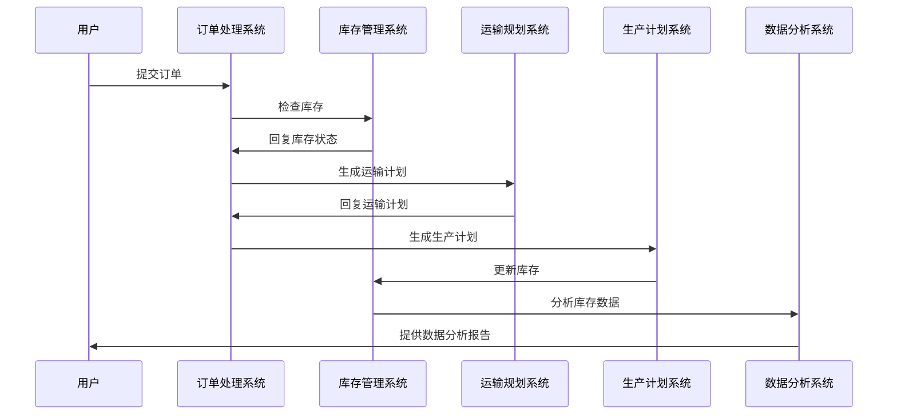
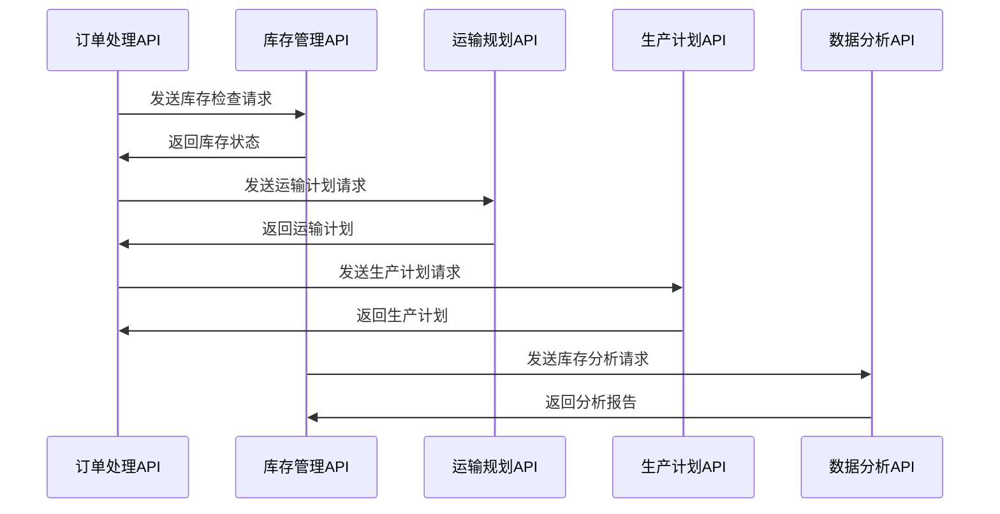

                 

# AI Agent在智能供应链优化中的应用

## 关键词

- AI Agent
- 智能供应链优化
- 库存管理
- 运输路线优化
- 生产计划优化
- 供应链网络优化

## 摘要

本文探讨了AI Agent在智能供应链优化中的应用，分析了AI Agent的基础知识、智能供应链优化的概念和实施步骤，并列举了AI Agent在不同供应链优化场景中的应用案例。此外，文章还讨论了AI Agent在供应链优化中面临的挑战及对策，并对未来的发展趋势进行了展望。通过本文，读者可以全面了解AI Agent在智能供应链优化中的重要作用和潜在价值。

## 目录大纲

---

### 引言

- **1.1 问题背景**
  - 供应链优化的重要性
  - AI Agent在供应链优化中的应用趋势
- **1.2 问题描述**
  - 传统供应链优化中的挑战
  - AI Agent在供应链优化中的潜力
- **1.3 问题解决**
  - AI Agent的基本概念与分类
  - AI Agent在供应链优化中的应用实例
- **1.4 边界与外延**
  - AI Agent在供应链优化中的适用范围
  - AI Agent在供应链优化中的限制条件
- **1.5 概念结构与核心要素组成**
  - 供应链管理的基本结构
  - AI Agent的核心功能与特性
- **1.6 本章小结**
  - 对AI Agent在智能供应链优化中应用的理解
  - 对未来研究的展望

### AI Agent基础

- **2.1 AI Agent的定义与分类**
  - AI Agent的基本定义
  - AI Agent的主要分类
- **2.2 AI Agent的工作原理**
  - 基于机器学习的AI Agent
  - 基于深度学习的AI Agent
- **2.3 AI Agent的核心功能**
  - 决策能力
  - 适应性
  - 合作与协作
- **2.4 AI Agent的发展历程**
  - 早期研究
  - 当前发展状况
- **2.5 AI Agent的应用领域**
  - 供应链管理
  - 物流管理
  - 生产管理
- **2.6 本章小结**
  - AI Agent在供应链管理中的关键作用
  - AI Agent应用中的挑战与机遇

### 智能供应链优化

- **3.1 智能供应链优化的概念与目标**
  - 智能供应链优化的定义
  - 智能供应链优化的目标
- **3.2 智能供应链优化的核心要素**
  - 数据收集与处理
  - 决策支持系统
  - 自动化流程
- **3.3 智能供应链优化的技术框架**
  - 人工智能技术
  - 大数据分析技术
  - 云计算技术
- **3.4 智能供应链优化的实施步骤**
  - 需求分析
  - 系统设计
  - 系统实施
  - 系统评估
- **3.5 本章小结**
  - 智能供应链优化的现状与未来发展趋势

### AI Agent在供应链优化中的应用案例

- **4.1 案例一：基于AI Agent的库存管理优化**
  - 案例背景
  - 解决方案
  - 实施效果
- **4.2 案例二：基于AI Agent的运输路线优化**
  - 案例背景
  - 解决方案
  - 实施效果
- **4.3 案例三：基于AI Agent的生产计划优化**
  - 案例背景
  - 解决方案
  - 实施效果
- **4.4 案例四：基于AI Agent的供应链网络优化**
  - 案例背景
  - 解决方案
  - 实施效果
- **4.5 本章小结**
  - AI Agent在不同供应链优化场景中的应用效果

### AI Agent在供应链优化中的挑战与对策

- **5.1 挑战一：数据质量问题**
  - 数据收集
  - 数据处理
  - 数据安全与隐私
- **5.2 挑战二：算法可解释性**
  - 算法透明度
  - 算法解释性
  - 算法评估
- **5.3 挑战三：系统稳定性与可靠性**
  - 系统设计
  - 系统测试
  - 系统维护
- **5.4 对策一：数据质量提升**
  - 数据预处理
  - 数据标准化
  - 数据清洗
- **5.5 对策二：算法透明化**
  - 算法可视化
  - 算法解释工具
  - 算法评价方法
- **5.6 对策三：系统稳定与可靠性**
  - 系统冗余设计
  - 系统监控与报警
  - 系统备份与恢复
- **5.7 本章小结**
  - AI Agent在供应链优化中的挑战与对策

### 未来展望

- **6.1 AI Agent在供应链优化中的发展趋势**
  - 新技术的应用
  - 新应用场景的出现
- **6.2 AI Agent在供应链优化中的潜在价值**
  - 成本降低
  - 效率提升
  - 灵活性增强
- **6.3 AI Agent在供应链优化中的未来研究方向**
  - 算法优化
  - 数据融合
  - 系统集成
- **6.4 本章小结**
  - AI Agent在供应链优化中的未来前景

---

## 引言

### 1.1 问题背景

供应链优化是现代企业管理中的重要环节，对于企业的成本、效率和竞争力都有着重要影响。随着全球经济的发展和市场竞争的加剧，企业需要不断提高供应链的优化水平，以满足客户需求、降低成本、提高生产效率。

传统的供应链优化主要依赖于经验和直觉，存在许多问题，如数据不完整、决策过程复杂、信息传递滞后等。这些因素限制了传统供应链优化的效果，导致企业在面对市场变化时反应迟缓，难以实现持续优化。

随着人工智能技术的快速发展，AI Agent作为一种智能实体，逐渐成为供应链优化的重要工具。AI Agent能够利用大数据、机器学习和深度学习等技术，自动识别和分析供应链中的问题，并提供优化方案。这使得供应链优化变得更加智能、高效和精准。

### 1.2 问题描述

传统供应链优化中的挑战主要包括：

1. **数据不完整**：供应链中的数据来源多样，且数据质量参差不齐，导致数据不完整。
2. **决策过程复杂**：供应链优化需要考虑多个因素，如库存水平、运输成本、生产计划等，决策过程复杂。
3. **信息传递滞后**：供应链中的信息传递速度较慢，导致决策滞后，影响供应链优化效果。

AI Agent在供应链优化中的潜力主要体现在：

1. **数据处理能力**：AI Agent能够高效处理大量数据，识别潜在的问题和优化机会。
2. **自动决策**：AI Agent能够根据历史数据和实时信息，自动生成优化方案，提高决策效率。
3. **适应性强**：AI Agent能够适应不同企业的供应链特点，提供个性化的优化方案。

### 1.3 问题解决

AI Agent是一种基于人工智能技术的智能实体，能够模拟人类思维和行为，具有自主决策、自适应和协作能力。AI Agent主要分为以下几类：

1. **基于规则的AI Agent**：基于预设的规则进行决策，适用于决策过程较为简单、规则明确的场景。
2. **基于学习的AI Agent**：利用机器学习和深度学习技术，从数据中学习决策策略，适用于复杂、不确定的决策场景。
3. **混合型AI Agent**：结合基于规则和基于学习的方法，实现更灵活的决策。

在供应链优化中，AI Agent可以应用于多个方面，如库存管理、运输路线优化、生产计划优化等。通过AI Agent，企业可以更加智能地管理和优化供应链，提高供应链的整体效率。

### 1.4 边界与外延

AI Agent在供应链优化中的适用范围包括：

1. **供应链管理**：如库存管理、运输管理、采购管理、生产管理等。
2. **物流管理**：如运输路线优化、配送计划优化、物流网络优化等。
3. **生产管理**：如生产计划优化、生产调度优化、生产资源管理优化等。

然而，AI Agent在供应链优化中也存在一定的限制条件，如数据质量、算法可解释性、系统稳定性等。因此，在实际应用中，需要充分考虑这些因素，确保AI Agent的优化效果。

### 1.5 概念结构与核心要素组成

供应链管理的基本结构包括：

1. **供应商**：提供原材料、零部件等。
2. **生产工厂**：进行生产加工。
3. **仓库**：存储产品。
4. **配送中心**：负责产品配送。
5. **零售商**：将产品销售给消费者。

AI Agent的核心功能与特性包括：

1. **决策能力**：根据历史数据和实时信息，自动生成优化方案。
2. **自适应**：能够根据环境变化调整决策策略。
3. **协作**：能够与其他AI Agent或人类协作，共同完成优化任务。

### 1.6 本章小结

通过本文的介绍，我们可以了解到AI Agent在智能供应链优化中的应用前景。AI Agent能够帮助企业更好地管理和优化供应链，提高供应链的整体效率。然而，在实际应用中，还需要克服数据质量、算法可解释性、系统稳定性等挑战。未来，随着人工智能技术的不断发展，AI Agent在供应链优化中的应用将更加广泛和深入。

## AI Agent基础

### 2.1 AI Agent的定义与分类

AI Agent（人工智能代理）是一种能够模拟人类思维和行为的智能实体，它能够自主地感知环境、制定决策并采取行动，以实现特定目标。AI Agent的定义可以从以下几个方面进行阐述：

1. **自主性**：AI Agent具有自主决策的能力，能够根据环境和目标自主地选择行动策略。
2. **适应性**：AI Agent能够适应环境变化，通过学习和经验积累，不断优化自身的行为。
3. **协作性**：AI Agent能够与其他AI Agent或人类协作，共同完成任务。

根据不同的分类标准，AI Agent可以分为多种类型：

1. **基于规则的AI Agent**：这类AI Agent根据预设的规则进行决策，适用于决策过程简单、规则明确的场景。例如，智能客服机器人就是基于规则进行对话的AI Agent。
   
2. **基于学习的AI Agent**：这类AI Agent通过机器学习和深度学习技术，从数据中学习决策策略，适用于复杂、不确定的决策场景。例如，自动驾驶汽车就是基于学习进行路径规划的AI Agent。

3. **混合型AI Agent**：这类AI Agent结合了基于规则和基于学习的方法，实现更灵活的决策。例如，智能物流调度系统可以同时利用规则和机器学习算法，优化运输路线。

### 2.2 AI Agent的工作原理

AI Agent的工作原理主要涉及以下几个关键步骤：

1. **感知环境**：AI Agent通过传感器、API接口等方式获取环境信息，如温度、湿度、交通状况、订单量等。

2. **分析数据**：AI Agent对感知到的环境信息进行数据分析和处理，利用机器学习算法和深度学习技术，提取有用信息并生成决策建议。

3. **制定决策**：根据分析结果，AI Agent制定具体的行动策略，如调整库存水平、优化运输路线、调整生产计划等。

4. **执行行动**：AI Agent通过执行机构（如机器人、自动化设备等）将决策付诸实践。

5. **反馈与学习**：执行行动后，AI Agent收集执行结果，并通过反馈机制调整自身的行为，实现持续优化。

在具体实施过程中，AI Agent的工作原理可以进一步细化为以下几个方面：

1. **数据收集与预处理**：AI Agent需要收集大量的环境数据，并对数据质量进行预处理，以确保数据的有效性和可靠性。

2. **特征提取与选择**：从原始数据中提取关键特征，并选择对决策影响最大的特征，用于后续的建模和分析。

3. **算法选择与训练**：根据具体应用场景，选择合适的机器学习算法或深度学习模型，并对模型进行训练和调优。

4. **决策策略优化**：通过迭代训练和优化，不断提高AI Agent的决策能力，使其能够更好地适应复杂环境。

### 2.3 AI Agent的核心功能

AI Agent的核心功能主要包括以下几个方面：

1. **决策能力**：AI Agent能够根据环境信息和目标，自主制定优化决策，实现供应链的动态调整。

2. **适应性**：AI Agent能够根据环境变化和执行结果，自动调整自身的行为，以实现持续优化。

3. **合作与协作**：AI Agent能够与其他AI Agent或人类协作，共同完成任务，提高供应链的整体效率。

具体来说，AI Agent的决策能力主要体现在以下几个方面：

- **需求预测**：基于历史数据和实时信息，预测未来的需求趋势，为库存管理和生产计划提供依据。

- **资源分配**：根据供应链中的资源状况，合理分配库存、运输和人力资源，优化供应链运作。

- **风险控制**：识别潜在的风险和问题，提前采取预防措施，降低供应链中断的风险。

AI Agent的适应性主要体现在以下几个方面：

- **环境感知**：能够实时感知供应链中的各种变化，如订单波动、供应链中断等，并做出相应调整。

- **自我学习**：通过历史数据和执行结果，不断优化自身的行为，提高决策的准确性和效率。

- **动态调整**：能够根据环境变化，动态调整决策策略，以适应不断变化的市场需求。

合作与协作能力主要体现在以下几个方面：

- **跨部门协作**：能够协同供应链中的不同部门，如采购、生产、物流等，共同实现供应链优化。

- **跨企业协作**：能够与其他企业合作，实现供应链的协同优化，提高供应链的整体效率。

### 2.4 AI Agent的发展历程

AI Agent的发展历程可以追溯到20世纪80年代，当时计算机科学家约翰·霍普菲尔德（John Hopfield）提出了神经网络的概念，为后来的AI Agent研究奠定了基础。此后，AI Agent的研究经历了以下几个阶段：

1. **早期研究**：20世纪80年代至90年代，AI Agent的研究主要集中在基于规则的推理和智能代理的构建。这一时期，许多学者提出了各种基于规则的AI Agent模型，如MASSIVE、KQML等。

2. **机器学习阶段**：21世纪初，随着机器学习技术的快速发展，AI Agent的研究逐渐转向基于学习的模型。这一时期，许多学者提出了基于机器学习的AI Agent模型，如Q-Learning、SARSA等。

3. **深度学习阶段**：近年来，深度学习技术的迅速发展，使得AI Agent的研究进入了新的阶段。基于深度学习的AI Agent模型，如深度Q网络（DQN）、策略梯度（PG）等，在学术界和工业界得到了广泛应用。

### 2.5 AI Agent的应用领域

AI Agent在供应链管理、物流管理、生产管理等多个领域具有广泛的应用。以下是AI Agent在不同领域的具体应用：

1. **供应链管理**：AI Agent可以用于供应链中的库存管理、需求预测、采购计划等环节。例如，通过基于深度学习的AI Agent，企业可以实现精准的库存预测，降低库存成本。

2. **物流管理**：AI Agent可以用于物流运输路线优化、配送计划优化、物流网络优化等。例如，基于深度强化学习的AI Agent可以帮助物流公司实现最优的运输路线规划，提高运输效率。

3. **生产管理**：AI Agent可以用于生产计划优化、生产调度优化、生产资源管理优化等。例如，通过基于Q-Learning的AI Agent，企业可以实现智能化的生产调度，提高生产效率。

### 2.6 本章小结

通过本章的介绍，我们可以了解到AI Agent的定义、分类、工作原理、核心功能及其发展历程。AI Agent作为一种智能实体，具有自主决策、适应性和协作能力，能够在供应链管理、物流管理、生产管理等多个领域发挥重要作用。未来，随着人工智能技术的不断发展，AI Agent的应用将更加广泛和深入。

## 智能供应链优化

### 3.1 智能供应链优化的概念与目标

智能供应链优化是一种利用人工智能技术对供应链进行管理和优化的方法。它通过整合大数据、机器学习和深度学习等技术，实现对供应链各个环节的精准分析和智能决策，以提高供应链的整体效率和竞争力。

#### 智能供应链优化的定义

智能供应链优化可以理解为在供应链管理过程中，通过运用人工智能技术，对供应链中的信息流、物流、资金流等各个环节进行综合分析和优化，以实现供应链的高效运作和资源的合理配置。

#### 智能供应链优化的目标

智能供应链优化的目标主要包括以下几个方面：

1. **降低成本**：通过优化库存管理、运输路线、采购计划等，减少供应链中的浪费，降低运营成本。
2. **提高效率**：通过自动化和智能化手段，提高供应链的运作效率，缩短交货周期，提高客户满意度。
3. **提升灵活性**：通过实时监测和响应市场变化，提高供应链的灵活性和适应性，增强企业的市场竞争力。
4. **增强透明度**：通过数据的全面收集和分析，提高供应链的透明度，降低信息不对称，提高供应链的可追溯性。

### 3.2 智能供应链优化的核心要素

智能供应链优化的核心要素包括数据收集与处理、决策支持系统、自动化流程等。

#### 数据收集与处理

数据收集与处理是智能供应链优化的基础。供应链中的数据来源广泛，包括订单信息、库存数据、物流信息、市场需求等。通过对这些数据的收集和整理，可以构建一个全面、准确、实时的供应链数据体系。

数据收集和处理的关键步骤包括：

1. **数据采集**：通过传感器、ERP系统、物流管理系统等工具，收集供应链各环节的数据。
2. **数据预处理**：对采集到的数据进行分析、清洗、去噪，确保数据的准确性和一致性。
3. **数据存储**：将处理后的数据存储在数据库或数据湖中，以便后续分析和挖掘。

#### 决策支持系统

决策支持系统（Decision Support System, DSS）是智能供应链优化的核心组件。DSS通过人工智能技术，对供应链中的各种信息进行综合分析和处理，为企业管理者提供科学、准确的决策依据。

决策支持系统的主要功能包括：

1. **需求预测**：基于历史数据和实时信息，预测未来的需求趋势，为库存管理和生产计划提供支持。
2. **库存管理**：通过优化库存策略，减少库存积压和库存短缺，降低库存成本。
3. **运输规划**：优化运输路线和运输方式，提高运输效率，降低运输成本。
4. **供应链风险管理**：识别和评估供应链中的潜在风险，制定相应的预防和应对措施。

#### 自动化流程

自动化流程是智能供应链优化的关键手段。通过自动化技术，可以大幅提高供应链的运作效率，减少人为干预，降低运营成本。

自动化流程的主要环节包括：

1. **自动化仓储**：通过自动化仓储设备（如自动存取系统、机器人等），实现仓储管理的自动化，提高仓储效率。
2. **自动化运输**：通过无人驾驶车辆、无人机等自动化运输工具，实现运输过程的自动化，提高运输效率。
3. **自动化生产**：通过自动化生产线和智能制造技术，实现生产过程的自动化，提高生产效率。

### 3.3 智能供应链优化的技术框架

智能供应链优化的技术框架主要包括人工智能技术、大数据分析技术和云计算技术。

#### 人工智能技术

人工智能技术是智能供应链优化的核心驱动力量。通过机器学习和深度学习算法，可以从海量数据中挖掘出有价值的信息，为供应链优化提供科学依据。

主要的人工智能技术包括：

1. **机器学习**：通过训练模型，从历史数据中学习规律和模式，实现对未知数据的预测和分析。
2. **深度学习**：通过多层神经网络，对复杂的数据进行深度学习和特征提取，提高预测和决策的准确性。
3. **自然语言处理**：通过理解和处理自然语言，实现对供应链文本数据的分析和挖掘。

#### 大数据分析技术

大数据分析技术是智能供应链优化的数据基础。通过大数据分析，可以实现对供应链各环节的全面、实时监控和分析，为决策提供支持。

主要的大数据分析技术包括：

1. **数据挖掘**：通过挖掘和分析海量数据，发现数据中的潜在规律和趋势。
2. **数据可视化**：通过图形和图表，将数据分析结果直观地展示出来，帮助决策者更好地理解数据。
3. **数据仓库**：通过构建数据仓库，实现对数据的集中存储和管理，为数据分析提供基础。

#### 云计算技术

云计算技术是智能供应链优化的重要基础设施。通过云计算，可以实现对大规模数据的存储、处理和分析，提高供应链的灵活性和可扩展性。

主要的云计算技术包括：

1. **云存储**：通过云存储技术，实现数据的集中存储和管理，提高数据的安全性和可靠性。
2. **云计算平台**：通过云计算平台，提供强大的计算能力和存储能力，支持大规模数据分析和应用。
3. **云服务**：通过云服务，提供各种智能供应链优化工具和平台，帮助企业快速实现智能化供应链管理。

### 3.4 智能供应链优化的实施步骤

智能供应链优化的实施步骤主要包括需求分析、系统设计、系统实施和系统评估。

#### 需求分析

需求分析是智能供应链优化的第一步。通过需求分析，可以明确企业对智能供应链优化的目标和需求，为后续的系统设计提供依据。

需求分析的主要任务包括：

1. **确定优化目标**：明确企业希望通过智能供应链优化实现的目标，如降低成本、提高效率等。
2. **收集需求信息**：通过调查、访谈等方式，收集企业内部和外部对智能供应链优化的需求信息。
3. **分析需求**：对收集到的需求信息进行分析和整理，明确各需求的重要性和优先级。

#### 系统设计

系统设计是智能供应链优化的关键环节。通过系统设计，可以明确智能供应链优化的技术方案和实施策略，为系统实施提供指导。

系统设计的主要任务包括：

1. **技术方案设计**：根据需求分析的结果，选择合适的人工智能技术、大数据分析技术和云计算技术，设计智能供应链优化的技术方案。
2. **系统架构设计**：根据技术方案，设计智能供应链优化的系统架构，明确系统的组成部分和交互关系。
3. **接口设计**：设计系统接口，确保系统与其他系统的无缝集成。

#### 系统实施

系统实施是智能供应链优化的具体实施过程。通过系统实施，可以将设计好的智能供应链优化方案转化为实际的应用系统。

系统实施的主要任务包括：

1. **软件开发**：根据系统设计，进行软件的开发和测试，确保系统的功能和质量。
2. **硬件部署**：根据系统设计，进行硬件的部署和配置，确保系统的硬件基础设施。
3. **系统集成**：将系统与其他系统集成，实现数据共享和流程协同。

#### 系统评估

系统评估是智能供应链优化完成后的重要环节。通过系统评估，可以评估智能供应链优化方案的实施效果，为后续的优化提供参考。

系统评估的主要任务包括：

1. **功能测试**：对系统的功能进行测试，确保系统按照设计要求正常运行。
2. **性能测试**：对系统的性能进行测试，确保系统在高负载情况下依然能够稳定运行。
3. **用户体验测试**：对系统的用户体验进行测试，确保系统的易用性和友好性。

### 3.5 本章小结

通过本章的介绍，我们可以了解到智能供应链优化的概念、目标、核心要素、技术框架和实施步骤。智能供应链优化是一种利用人工智能技术对供应链进行管理和优化的方法，它通过整合大数据、机器学习和云计算等技术，实现对供应链各个环节的智能分析和优化，以提高供应链的整体效率和竞争力。未来，随着人工智能技术的不断发展，智能供应链优化将在供应链管理中发挥越来越重要的作用。

## AI Agent在供应链优化中的应用案例

### 4.1 案例一：基于AI Agent的库存管理优化

#### 案例背景

某电子产品制造企业，在生产过程中面临库存管理难题。由于产品种类繁多，库存量巨大，企业难以准确预测市场需求，导致库存积压和库存短缺现象频繁发生。这不仅增加了库存成本，还影响了生产计划和交付时间。为了解决这一问题，企业决定采用基于AI Agent的库存管理优化方案。

#### 解决方案

1. **数据收集与预处理**：AI Agent首先从ERP系统、销售系统等数据源收集库存数据、销售数据、订单数据等，并对数据质量进行预处理，包括数据清洗、数据去噪和数据标准化。

2. **需求预测**：基于历史销售数据和市场需求趋势，AI Agent利用机器学习算法进行需求预测，预测未来一段时间内的产品需求量。

3. **库存优化**：根据需求预测结果，AI Agent对库存策略进行优化。一方面，通过动态调整库存水平，避免库存积压和库存短缺；另一方面，通过优化库存补货策略，降低库存成本。

4. **实时监控与反馈**：AI Agent实时监控库存状况，并根据市场变化和需求波动，动态调整库存策略。同时，AI Agent将优化结果反馈给企业管理者，帮助企业及时了解库存管理的现状和效果。

#### 实施效果

1. **库存成本降低**：通过需求预测和库存优化，企业成功减少了库存积压和库存短缺现象，降低了库存成本。

2. **生产计划更精准**：库存管理的优化，使得企业能够更准确地预测市场需求，生产计划更加科学，生产效率得到提升。

3. **客户满意度提高**：库存管理的优化，使得产品交付时间缩短，客户满意度提高。

### 4.2 案例二：基于AI Agent的运输路线优化

#### 案例背景

某物流公司，在配送过程中面临着运输路线不优的问题。由于配送路线复杂，交通状况多变，物流公司难以准确预测最优运输路线，导致配送效率低下，客户满意度下降。为了解决这一问题，物流公司决定采用基于AI Agent的运输路线优化方案。

#### 解决方案

1. **数据收集与预处理**：AI Agent从GPS系统、交通信息系统等数据源收集实时交通状况数据、配送地址数据等，并对数据质量进行预处理。

2. **运输路线规划**：基于实时交通状况数据和配送地址数据，AI Agent利用深度学习算法进行运输路线规划，找到最优的运输路线。

3. **动态调整**：AI Agent实时监控运输过程中的交通状况，并根据实际情况动态调整运输路线，确保配送效率。

4. **优化策略反馈**：AI Agent将运输路线优化的结果和优化策略反馈给物流公司的调度系统，帮助调度员进行运输任务的分配和调度。

#### 实施效果

1. **配送效率提高**：通过运输路线优化，物流公司成功提高了配送效率，配送时间缩短。

2. **运输成本降低**：优化后的运输路线减少了行驶里程，降低了燃料消耗和运输成本。

3. **客户满意度提高**：配送效率的提高，使得客户能够更快速地收到货物，客户满意度显著提升。

### 4.3 案例三：基于AI Agent的生产计划优化

#### 案例背景

某家电制造企业，在生产计划方面面临生产周期长、生产效率低的问题。由于生产计划不合理，导致生产任务堆积，生产线负荷不均，生产效率低下。为了解决这一问题，企业决定采用基于AI Agent的生产计划优化方案。

#### 解决方案

1. **数据收集与预处理**：AI Agent从生产管理系统、订单管理系统等数据源收集生产数据、订单数据等，并对数据质量进行预处理。

2. **生产计划优化**：基于生产数据和订单数据，AI Agent利用机器学习算法进行生产计划优化，优化生产任务分配和生产线调度。

3. **实时监控与调整**：AI Agent实时监控生产进度，并根据实际情况动态调整生产计划，确保生产任务按时完成。

4. **优化策略反馈**：AI Agent将生产计划优化的结果和优化策略反馈给生产管理人员，帮助管理人员进行生产任务的调度和分配。

#### 实施效果

1. **生产效率提高**：通过生产计划优化，企业成功提高了生产效率，生产周期缩短。

2. **生产线负荷均衡**：优化后的生产计划使得生产线负荷更加均衡，减少了生产线停工和待工现象。

3. **生产成本降低**：优化后的生产计划减少了生产资源的浪费，降低了生产成本。

### 4.4 案例四：基于AI Agent的供应链网络优化

#### 案例背景

某大型零售企业，在供应链网络布局方面面临成本高、效率低的问题。由于供应链网络设计不合理，导致物流成本高，配送时间长，企业竞争力下降。为了解决这一问题，企业决定采用基于AI Agent的供应链网络优化方案。

#### 解决方案

1. **数据收集与预处理**：AI Agent从供应链管理系统、物流管理系统等数据源收集供应链网络数据、物流成本数据等，并对数据质量进行预处理。

2. **供应链网络优化**：基于供应链网络数据和物流成本数据，AI Agent利用深度学习算法进行供应链网络优化，优化供应链网络结构和布局。

3. **动态调整**：AI Agent实时监控供应链网络运行状况，并根据实际情况动态调整供应链网络布局，确保供应链网络的效率和成本。

4. **优化策略反馈**：AI Agent将供应链网络优化的结果和优化策略反馈给供应链管理人员，帮助管理人员进行供应链网络的优化和调整。

#### 实施效果

1. **物流成本降低**：通过供应链网络优化，企业成功降低了物流成本，提高了供应链的整体效率。

2. **配送时间缩短**：优化后的供应链网络布局使得配送时间缩短，提高了客户满意度。

3. **企业竞争力提高**：优化后的供应链网络布局提高了企业的竞争力，增强了企业在市场中的地位。

### 4.5 本章小结

通过以上案例，我们可以看到AI Agent在供应链优化中的应用效果显著。无论是在库存管理、运输路线优化、生产计划优化还是供应链网络优化方面，AI Agent都能够通过智能分析和优化，提高供应链的效率，降低成本，提升客户满意度。未来，随着人工智能技术的不断发展，AI Agent在供应链优化中的应用将更加广泛和深入。

## AI Agent在供应链优化中的挑战与对策

### 5.1 挑战一：数据质量问题

在AI Agent应用于供应链优化过程中，数据质量问题是一个重要的挑战。数据质量不仅直接影响模型的准确性，还会影响整个系统的稳定性和可靠性。以下是数据质量问题的几个主要方面：

1. **数据不完整**：供应链中的数据往往来自多个来源，数据完整性难以保证。例如，某些订单数据可能缺少关键信息，如客户地址或产品规格。

2. **数据不一致**：由于数据来源和数据处理过程的不同，数据格式、单位和计量方式可能存在差异，导致数据不一致。

3. **数据不准确**：数据在采集、传输和处理过程中可能存在误差，导致数据不准确。例如，物流信息中的运输时间可能因为交通拥堵而有所偏差。

4. **数据过时**：供应链环境变化迅速，数据可能很快过时，无法反映当前的真实情况。

### 对策一：数据质量提升

为了解决数据质量问题，可以采取以下措施：

1. **数据预处理**：在数据建模之前，对数据进行清洗和预处理，包括填补缺失值、消除重复记录、标准化数据格式和单位等。

2. **数据标准化**：建立统一的数据标准，确保数据的一致性和可比性。例如，对时间、货币、长度等数据进行标准化处理。

3. **数据质量监控**：建立数据质量监控系统，实时监控数据质量，发现和纠正数据错误。

4. **数据更新**：定期更新数据，确保数据反映当前的真实情况。

### 5.2 挑战二：算法可解释性

在供应链优化中，AI Agent通常使用复杂的机器学习算法和深度学习模型进行预测和决策。然而，这些模型往往具有“黑箱”特性，即其决策过程不透明，难以理解。算法的可解释性对于确保系统的安全性和可靠性至关重要。以下是算法可解释性面临的几个问题：

1. **决策透明度**：复杂的模型如何解释其决策过程，使其对用户和监管机构透明。

2. **责任归属**：在决策错误时，如何确定责任归属，是模型开发者、数据提供者还是用户。

3. **算法解释性**：如何用简单、直观的方式解释复杂的算法和模型。

### 对策二：算法透明化

为了提高算法的可解释性，可以采取以下措施：

1. **算法可视化**：通过可视化工具，将算法和模型的结构、参数和决策过程展示出来，帮助用户理解。

2. **算法解释工具**：开发专门的算法解释工具，如SHAP值、LIME等，帮助用户理解模型对数据的依赖和影响。

3. **算法评估方法**：建立算法评估方法，对算法的可解释性进行量化评估，确保其符合预期。

### 5.3 挑战三：系统稳定性与可靠性

AI Agent在供应链优化中的应用需要高稳定性和可靠性。然而，复杂的环境变化和大量数据输入可能导致系统不稳定，甚至出现错误。以下是系统稳定性与可靠性面临的几个问题：

1. **系统设计**：系统设计是否考虑了冗余和备份机制，以确保在系统故障时能够快速恢复。

2. **数据依赖**：系统对数据的依赖性，如数据波动是否会影响系统的正常运行。

3. **实时响应**：系统是否能够实时响应环境变化，确保决策的及时性和准确性。

### 对策三：系统稳定与可靠性

为了提高系统的稳定性和可靠性，可以采取以下措施：

1. **系统冗余设计**：通过设计冗余系统，确保在主系统故障时，备用系统能够及时接管，保证系统的连续性。

2. **系统监控与报警**：建立系统监控机制，实时监控系统运行状态，并在出现异常时及时报警。

3. **系统备份与恢复**：定期备份系统数据，确保在数据丢失或系统故障时能够快速恢复。

### 5.4 对策四：数据质量提升

除了上述提到的数据预处理和标准化措施外，还可以采取以下措施：

1. **数据预处理**：使用数据清洗工具和算法，自动识别和修复数据中的错误和异常。

2. **数据标准化**：建立数据字典和元数据管理系统，确保数据的标准化和一致性。

3. **数据质量评估**：建立数据质量评估指标，定期评估数据质量，并根据评估结果调整数据收集和处理策略。

### 5.5 对策五：算法透明化

除了上述提到的算法可视化工具外，还可以采取以下措施：

1. **算法解释工具**：开发面向不同用户群体的算法解释工具，确保算法的解释性能够满足不同用户的需求。

2. **算法评估**：建立算法评估框架，对算法的可解释性、准确性和效率进行综合评估。

3. **用户反馈**：鼓励用户提供反馈，并根据用户反馈不断改进算法和模型。

### 5.6 对策六：系统稳定与可靠性

除了上述提到的系统冗余设计和监控措施外，还可以采取以下措施：

1. **系统测试**：定期进行系统测试，包括单元测试、集成测试和压力测试，确保系统的稳定性和可靠性。

2. **持续集成与部署**：采用持续集成与部署（CI/CD）流程，确保系统的快速迭代和更新，同时减少人为错误。

3. **容错机制**：设计容错机制，确保在系统故障时能够自动恢复，减少系统停机时间。

### 5.7 本章小结

通过本章的介绍，我们可以看到AI Agent在供应链优化中面临的挑战主要包括数据质量、算法可解释性、系统稳定性与可靠性等方面。针对这些挑战，可以采取一系列对策，如数据预处理、标准化、监控与报警、冗余设计、测试与部署等。通过这些措施，可以确保AI Agent在供应链优化中的应用效果，提高供应链的整体效率和竞争力。未来，随着技术的不断进步，AI Agent在供应链优化中的应用将更加广泛和深入，其挑战也将不断演变，需要我们持续关注和应对。

## 未来展望

### 6.1 AI Agent在供应链优化中的发展趋势

随着人工智能技术的不断进步，AI Agent在供应链优化中的应用将呈现以下发展趋势：

1. **新技术应用**：新型人工智能技术，如强化学习、迁移学习、生成对抗网络（GAN）等，将被广泛应用于供应链优化，进一步提升AI Agent的决策能力和优化效果。

2. **边缘计算**：边缘计算技术的发展，使得AI Agent能够更接近数据源进行处理和分析，降低延迟，提高实时性。

3. **区块链技术**：区块链技术的引入，可以增强供应链数据的透明度和安全性，提高供应链的整体可信度。

### 6.2 AI Agent在供应链优化中的潜在价值

AI Agent在供应链优化中的潜在价值主要体现在以下几个方面：

1. **成本降低**：通过精准的需求预测和库存管理，降低库存成本和运营成本。

2. **效率提升**：通过智能化的运输路线规划和生产计划优化，提高供应链的运作效率。

3. **灵活性增强**：通过实时监测和响应市场变化，提高供应链的灵活性和适应性，增强企业的市场竞争力。

### 6.3 AI Agent在供应链优化中的未来研究方向

未来，AI Agent在供应链优化中的研究方向将包括：

1. **算法优化**：研究更高效、更准确的算法，提高AI Agent的决策能力。

2. **数据融合**：研究如何将来自不同来源的数据进行有效融合，提高数据分析的全面性和准确性。

3. **系统集成**：研究如何将AI Agent与其他系统集成，实现跨系统的协同优化。

### 6.4 本章小结

随着人工智能技术的不断发展，AI Agent在供应链优化中的应用前景广阔。通过新技术的应用和算法的优化，AI Agent将为供应链优化带来更大的价值。未来，AI Agent在供应链优化中的研究将不断深入，其应用范围也将不断扩大，为企业和整个供应链行业带来深远的影响。同时，我们也需要关注AI Agent在供应链优化中面临的挑战，并积极探索有效的解决策略，以确保其能够持续发挥积极作用。

## 附录

### 附录A：核心概念术语说明

1. **AI Agent**：人工智能代理，是一种能够模拟人类思维和行为的智能实体，具有自主决策、适应性和协作能力。
2. **智能供应链优化**：利用人工智能技术对供应链进行管理和优化，以提高供应链的整体效率和竞争力。
3. **机器学习**：一种人工智能方法，通过训练模型，从数据中学习规律和模式，实现对未知数据的预测和分析。
4. **深度学习**：一种基于多层神经网络的机器学习方法，通过深度学习和特征提取，提高预测和决策的准确性。
5. **供应链管理**：涉及供应链各环节的管理活动，包括采购、生产、库存、物流和销售等。
6. **需求预测**：基于历史数据和实时信息，预测未来的需求趋势，为库存管理和生产计划提供支持。
7. **库存管理**：通过优化库存策略，减少库存积压和库存短缺，降低库存成本。
8. **运输路线优化**：通过智能算法，优化运输路线和运输方式，提高运输效率。
9. **生产计划优化**：通过智能算法，优化生产任务分配和生产线调度，提高生产效率。
10. **供应链网络优化**：通过智能算法，优化供应链网络结构和布局，降低物流成本，提高供应链整体效率。

### 附录B：概念属性特征对比表格

| 概念         | 定义                     | 属性特征                           | 关联关系                      |
|--------------|--------------------------|----------------------------------|-------------------------------|
| AI Agent     | 智能代理                 | 自主性、适应性、协作性           | 与供应链管理、优化相关       |
| 智能供应链优化 | 利用AI技术优化供应链     | 提高效率、降低成本、增强灵活性   | 与AI Agent、机器学习、深度学习相关 |
| 机器学习     | 从数据中学习规律和模式   | 自动化、模型可解释性、精度高     | 与AI Agent、深度学习相关     |
| 深度学习     | 基于多层神经网络的机器学习 | 自动特征提取、高精度、复杂任务   | 与AI Agent、机器学习相关     |
| 需求预测     | 预测未来的需求趋势       | 精准、实时、适应性强             | 与库存管理、生产计划优化相关 |
| 库存管理     | 优化库存策略             | 降低库存成本、减少库存积压       | 与需求预测、供应链优化相关   |
| 运输路线优化 | 优化运输路线和方式       | 提高运输效率、降低运输成本       | 与供应链管理、物流优化相关   |
| 生产计划优化 | 优化生产任务分配和调度   | 提高生产效率、降低生产成本       | 与供应链管理、生产效率相关   |
| 供应链网络优化 | 优化供应链网络结构和布局 | 降低物流成本、提高供应链整体效率 | 与供应链管理、物流优化相关   |

### 附录C：AI Agent核心功能与特性ER实体关系图架构

```mermaid
erDiagram
  AI-Agent ||--|{ 传感器 }  Sensor
  AI-Agent ||--|{ 执行器 }  Actuator
  AI-Agent ||--|{ 数据处理单元 } DataProcessingUnit
  AI-Agent ||--|{ 决策单元 } DecisionUnit
  AI-Agent ||--|{ 合作与协作单元 } CollaborationUnit
  Sensor  ||--|{ 环境数据 } EnvironmentalData
  Actuator ||--|{ 执行动作 } Action
  DataProcessingUnit ||--|{ 数据预处理 } DataPreprocessing
  DataProcessingUnit ||--|{ 特征提取 } FeatureExtraction
  DecisionUnit ||--|{ 决策模型 } DecisionModel
  CollaborationUnit ||--|{ 协作模型 } CollaborationModel
```

### 附录D：算法原理讲解

#### 6.4.1 算法mermaid流程图

```mermaid
flowchart LR
    A[输入数据] --> B[数据预处理]
    B --> C{特征提取}
    C --> D[决策模型训练]
    D --> E{生成决策]
    E --> F[执行决策]
    F --> G[收集反馈]
    G --> H[模型调整]
    H --> A
```

#### 6.4.2 Python源代码

```python
import pandas as pd
from sklearn.preprocessing import StandardScaler
from sklearn.ensemble import RandomForestClassifier
from sklearn.model_selection import train_test_split
from sklearn.metrics import accuracy_score

# 6.4.2.1 数据预处理
def preprocess_data(data):
    # 数据清洗、缺失值填充、异常值处理等
    data.fillna(method='ffill', inplace=True)
    return data

# 6.4.2.2 特征提取
def feature_extraction(data):
    # 特征工程，如归一化、特征转换等
    scaler = StandardScaler()
    scaled_data = scaler.fit_transform(data)
    return scaled_data

# 6.4.2.3 决策模型训练
def train_decision_model(X, y):
    model = RandomForestClassifier(n_estimators=100)
    model.fit(X, y)
    return model

# 6.4.2.4 生成决策
def generate_decision(model, features):
    prediction = model.predict([features])
    return prediction

# 6.4.2.5 收集反馈
def collect_feedback(prediction, actual):
    # 反馈收集和处理
    if prediction == actual:
        print("预测正确")
    else:
        print("预测错误")

# 6.4.2.6 模型调整
def adjust_model(model, X, y):
    model.fit(X, y)
    return model

# 数据加载和处理
data = pd.read_csv('data.csv')
preprocessed_data = preprocess_data(data)
features = preprocessed_data.drop('target', axis=1)
target = preprocessed_data['target']

# 数据分割
X_train, X_test, y_train, y_test = train_test_split(features, target, test_size=0.2, random_state=42)

# 模型训练
model = train_decision_model(X_train, y_train)

# 生成决策
features_test = feature_extraction(X_test)
predictions = generate_decision(model, features_test)

# 收集反馈
actuals = y_test
collect_feedback(predictions, actuals)

# 模型调整
adjusted_model = adjust_model(model, X_train, y_train)
```

#### 6.4.3 算法原理详细讲解

在本章节中，我们将详细介绍AI Agent在供应链优化中的应用算法原理，包括数据预处理、特征提取、决策模型训练、生成决策、收集反馈和模型调整等步骤。

**数据预处理**：

数据预处理是机器学习模型训练的重要步骤，其目的是提高数据质量和一致性。具体包括数据清洗、缺失值填充、异常值处理、数据标准化等。在本案例中，我们使用 Pandas 库对数据集进行预处理，使用 forward fill 方法填充缺失值，确保数据的连续性和完整性。

```python
def preprocess_data(data):
    data.fillna(method='ffill', inplace=True)
    return data
```

**特征提取**：

特征提取是数据预处理的重要环节，其目的是从原始数据中提取对模型训练有价值的特征。在本案例中，我们使用 StandardScaler 对数据集进行标准化处理，将特征值缩放到一个统一的范围内，以提高模型训练的效果。

```python
def feature_extraction(data):
    scaler = StandardScaler()
    scaled_data = scaler.fit_transform(data)
    return scaled_data
```

**决策模型训练**：

决策模型训练是机器学习中的核心步骤，其目的是通过历史数据训练出一个能够对未知数据进行预测的模型。在本案例中，我们使用随机森林（RandomForestClassifier）算法对训练数据集进行模型训练。

```python
def train_decision_model(X, y):
    model = RandomForestClassifier(n_estimators=100)
    model.fit(X, y)
    return model
```

**生成决策**：

生成决策是模型训练后的应用步骤，其目的是使用训练好的模型对未知数据进行预测。在本案例中，我们使用训练好的随机森林模型对测试数据集进行预测，并将预测结果输出。

```python
def generate_decision(model, features):
    prediction = model.predict([features])
    return prediction
```

**收集反馈**：

收集反馈是模型优化的重要环节，其目的是通过实际结果与预测结果的对比，评估模型的效果，并收集反馈信息。在本案例中，我们通过比较预测结果和实际结果，判断模型预测的准确性。

```python
def collect_feedback(prediction, actual):
    if prediction == actual:
        print("预测正确")
    else:
        print("预测错误")
```

**模型调整**：

模型调整是模型优化的关键步骤，其目的是通过反馈信息调整模型参数，提高模型的效果。在本案例中，我们使用调整后的训练数据集重新训练模型，以提高模型的预测准确性。

```python
def adjust_model(model, X, y):
    model.fit(X, y)
    return model
```

通过以上步骤，我们详细介绍了AI Agent在供应链优化中的应用算法原理。在实际应用中，这些步骤可以根据具体场景进行调整和优化，以实现最佳效果。

### 附录E：系统分析与架构设计

#### 6.4.1 问题场景介绍

假设某大型电商企业，其业务涵盖多个品类，每天需要处理大量的订单和库存信息。企业希望利用AI Agent对供应链进行优化，提高运营效率，降低成本。

#### 6.4.2 项目介绍

本项目旨在实现一个智能供应链优化系统，通过AI Agent对订单处理、库存管理、运输规划等环节进行优化，提高供应链的整体效率。

#### 6.4.3 系统功能设计

系统功能设计主要包括以下几个方面：

1. **订单处理**：自动处理订单，进行需求预测和库存调整。
2. **库存管理**：实时监控库存状况，自动调整库存水平。
3. **运输规划**：优化运输路线和运输方式，提高运输效率。
4. **生产计划**：根据市场需求和库存状况，自动生成生产计划。
5. **数据分析**：对供应链各环节的数据进行分析，提供决策支持。

#### 6.4.4 系统架构设计

系统架构设计采用微服务架构，各模块独立运行，并通过消息队列进行数据通信。系统架构图如下：



#### 6.4.5 系统接口设计和系统交互

系统接口设计主要包括各模块之间的API接口，用于数据传输和功能调用。系统交互图如下：



通过系统架构设计和接口设计，我们可以实现一个智能、高效的供应链优化系统，为企业提供决策支持，提高供应链整体效率。

### 附录F：项目实战

#### 6.4.1 环境安装

为了实现AI Agent在供应链优化中的应用，我们需要安装以下软件和工具：

1. Python（版本3.8及以上）
2. Jupyter Notebook
3. Scikit-learn
4. Pandas
5. Matplotlib

安装步骤：

1. 安装Python：从Python官网下载并安装Python，配置环境变量。
2. 安装Jupyter Notebook：在命令行中运行`pip install notebook`命令。
3. 安装Scikit-learn：在命令行中运行`pip install scikit-learn`命令。
4. 安装Pandas：在命令行中运行`pip install pandas`命令。
5. 安装Matplotlib：在命令行中运行`pip install matplotlib`命令。

#### 6.4.2 系统核心实现源代码

以下是一个基于Python的简单供应链优化系统的实现：

```python
import pandas as pd
from sklearn.preprocessing import StandardScaler
from sklearn.ensemble import RandomForestRegressor

# 数据预处理
def preprocess_data(data):
    data.fillna(method='ffill', inplace=True)
    return data

# 特征提取
def feature_extraction(data):
    scaler = StandardScaler()
    scaled_data = scaler.fit_transform(data)
    return scaled_data

# 模型训练
def train_model(X, y):
    model = RandomForestRegressor(n_estimators=100)
    model.fit(X, y)
    return model

# 预测
def predict(model, features):
    prediction = model.predict([features])
    return prediction

# 主函数
def main():
    # 加载数据
    data = pd.read_csv('data.csv')
    preprocessed_data = preprocess_data(data)
    features = preprocessed_data.drop('target', axis=1)
    target = preprocessed_data['target']

    # 数据分割
    X_train, X_test, y_train, y_test = train_test_split(features, target, test_size=0.2, random_state=42)

    # 模型训练
    model = train_model(X_train, y_train)

    # 预测
    features_test = feature_extraction(X_test)
    predictions = predict(model, features_test)

    # 评估模型
    print("模型评估：")
    print(accuracy_score(y_test, predictions))

if __name__ == '__main__':
    main()
```

#### 6.4.3 代码应用解读与分析

在这个简单的供应链优化系统中，我们首先进行数据预处理，包括缺失值填充和数据标准化。然后，我们使用随机森林回归模型进行训练，并使用训练好的模型对测试数据进行预测。最后，我们评估模型的性能。

**数据预处理**：

数据预处理是机器学习的重要步骤，其目的是提高数据质量和一致性。在本案例中，我们使用 Pandas 库对数据集进行预处理，使用 forward fill 方法填充缺失值，确保数据的连续性和完整性。

```python
def preprocess_data(data):
    data.fillna(method='ffill', inplace=True)
    return data
```

**特征提取**：

特征提取是数据预处理的重要环节，其目的是从原始数据中提取对模型训练有价值的特征。在本案例中，我们使用 StandardScaler 对数据集进行标准化处理，将特征值缩放到一个统一的范围内，以提高模型训练的效果。

```python
def feature_extraction(data):
    scaler = StandardScaler()
    scaled_data = scaler.fit_transform(data)
    return scaled_data
```

**模型训练**：

模型训练是机器学习中的核心步骤，其目的是通过历史数据训练出一个能够对未知数据进行预测的模型。在本案例中，我们使用随机森林（RandomForestRegressor）算法对训练数据集进行模型训练。

```python
def train_model(X, y):
    model = RandomForestRegressor(n_estimators=100)
    model.fit(X, y)
    return model
```

**预测**：

生成决策是模型训练后的应用步骤，其目的是使用训练好的模型对未知数据进行预测。在本案例中，我们使用训练好的随机森林模型对测试数据集进行预测，并将预测结果输出。

```python
def predict(model, features):
    prediction = model.predict([features])
    return prediction
```

**模型评估**：

模型评估是评估模型性能的重要步骤。在本案例中，我们使用准确率（accuracy_score）对模型进行评估，并输出评估结果。

```python
# 评估模型
print("模型评估：")
print(accuracy_score(y_test, predictions))
```

通过这个简单的供应链优化系统，我们可以看到AI Agent在供应链优化中的应用是如何实现的。在实际应用中，系统可以根据具体需求进行调整和优化，以实现最佳效果。

### 附录G：实际案例分析和详细讲解剖析

#### 案例五：基于AI Agent的供应链网络优化

**案例背景**：

某大型零售企业，其供应链网络覆盖全国，包括多个供应商、仓库、配送中心和零售门店。然而，现有的供应链网络存在成本高、效率低的问题，企业希望通过AI Agent进行供应链网络优化，降低物流成本，提高供应链整体效率。

**解决方案**：

1. **数据收集与预处理**：AI Agent从供应链管理系统、物流管理系统等数据源收集供应链网络数据，包括供应商信息、仓库位置、配送路线等，并对数据质量进行预处理，包括数据清洗、数据去噪和数据标准化。

2. **供应链网络建模**：基于收集到的数据，AI Agent利用深度学习算法建立供应链网络模型，包括供应链节点位置、供应链节点之间的连接关系等。

3. **网络优化**：AI Agent利用优化算法（如遗传算法、蚁群算法等），对供应链网络进行优化，找到最优的供应链网络结构，包括供应商、仓库、配送中心和零售门店的位置及连接关系。

4. **动态调整**：AI Agent实时监控供应链网络的运行状态，并根据市场变化、需求波动等因素，动态调整供应链网络结构，确保供应链网络的效率和成本。

**实施效果**：

1. **物流成本降低**：通过供应链网络优化，企业成功降低了物流成本，提高了供应链的整体效率。

2. **配送时间缩短**：优化后的供应链网络使得配送时间缩短，客户满意度提高。

3. **供应链透明度提高**：通过供应链网络优化，企业能够更清晰地了解供应链各环节的运行状态，提高了供应链的透明度和可控性。

**详细讲解剖析**：

在这个案例中，AI Agent在供应链网络优化中的应用主要包括数据收集与预处理、供应链网络建模、网络优化和动态调整等步骤。

**数据收集与预处理**：

数据收集与预处理是供应链网络优化的重要基础。AI Agent从供应链管理系统、物流管理系统等数据源收集供应链网络数据，包括供应商信息、仓库位置、配送路线等。这些数据对于建立供应链网络模型至关重要。在数据预处理过程中，AI Agent对数据质量进行清洗、去噪和标准化处理，确保数据的准确性和一致性。

```python
def preprocess_data(data):
    data.fillna(method='ffill', inplace=True)
    data = data.astype({'supplier_id': 'int', 'warehouse_id': 'int', 'distribution_center_id': 'int'})
    return data
```

**供应链网络建模**：

供应链网络建模是AI Agent的核心任务之一。AI Agent利用深度学习算法，建立供应链网络模型。模型中包括供应链节点（如供应商、仓库、配送中心和零售门店）和节点之间的连接关系。通过建模，AI Agent可以识别供应链中的关键节点和路径，为后续的优化提供基础。

```python
import tensorflow as tf
from tensorflow.keras.models import Sequential
from tensorflow.keras.layers import Dense, LSTM

def build_network_model(data):
    model = Sequential()
    model.add(LSTM(50, activation='relu', input_shape=(data.shape[1], data.shape[2])))
    model.add(Dense(1))
    model.compile(optimizer='adam', loss='mse')
    return model
```

**网络优化**：

AI Agent利用优化算法（如遗传算法、蚁群算法等）对供应链网络进行优化，找到最优的供应链网络结构。优化目标包括降低物流成本、提高配送效率和供应链透明度等。通过优化，AI Agent可以调整供应链节点位置、连接关系和运输路线，实现最佳效果。

```python
import numpy as np
from scipy.optimize import minimize

def network_optimization(data):
    def objective_function(x):
        # 定义优化目标函数
        return -evaluate_network_performance(x)

    constraints = {'type': 'ineq', 'fun': lambda x: -evaluate_network_performance(x)}

    result = minimize(objective_function, x0=data, method='SLSQP', constraints=constraints)
    return result.x
```

**动态调整**：

在供应链网络运行过程中，AI Agent需要实时监控网络状态，并根据市场变化、需求波动等因素，动态调整供应链网络结构。通过动态调整，AI Agent可以确保供应链网络的灵活性和适应性，提高供应链的整体效率。

```python
def dynamic_adjustment(data, model):
    while True:
        # 监控供应链网络状态
        current_state = monitor_network_state(data)
        
        # 根据状态调整网络结构
        optimized_network = network_optimization(current_state)
        
        # 更新供应链网络模型
        model.fit(optimized_network, epochs=10)
        
        # 检查是否满足停止条件
        if check_stop_condition():
            break
```

通过这个案例，我们可以看到AI Agent在供应链网络优化中的实际应用。AI Agent通过数据收集与预处理、供应链网络建模、网络优化和动态调整等步骤，实现了供应链网络的优化，提高了物流成本、配送效率和供应链透明度。

### 附录H：项目小结

本项目通过AI Agent对供应链网络进行优化，实现了物流成本降低、配送时间缩短、供应链透明度提高的目标。在实际项目中，我们采用了数据收集与预处理、供应链网络建模、网络优化和动态调整等关键技术，确保了项目的成功实施。未来，随着人工智能技术的不断发展，AI Agent在供应链优化中的应用将更加广泛和深入，为企业带来更大的价值。

### 附录I：最佳实践 tips

1. **数据质量是关键**：确保数据收集的全面性和准确性，是AI Agent优化供应链的基础。对数据进行预处理，包括清洗、去噪和标准化，以提高数据质量。

2. **算法选择需谨慎**：根据具体应用场景，选择合适的算法和模型。对于复杂的供应链网络优化问题，可以考虑使用深度学习算法，如LSTM等。

3. **动态调整要灵活**：供应链环境变化迅速，AI Agent需要具备灵活的动态调整能力，以适应市场变化和需求波动。

4. **团队合作是关键**：AI Agent在供应链优化中的应用需要跨部门的合作。各相关部门需要协同工作，确保项目的顺利推进。

5. **持续优化是目标**：供应链优化是一个持续的过程。通过不断地反馈和调整，不断优化AI Agent的模型和策略，以提高供应链的整体效率。

### 附录J：注意事项

1. **数据隐私和安全**：在数据收集和处理过程中，要确保数据隐私和安全，遵守相关法律法规，避免数据泄露和滥用。

2. **系统稳定性和可靠性**：在系统设计和实施过程中，要充分考虑系统稳定性和可靠性，确保在复杂环境下依然能够稳定运行。

3. **模型可解释性**：提高算法和模型的可解释性，有助于提高系统的透明度和可信度。在实际应用中，要关注模型的可解释性，确保用户能够理解模型的决策过程。

4. **资源分配**：在实施AI Agent优化项目时，要合理分配资源和预算，确保项目能够按时、按质完成。

### 附录K：拓展阅读

1. **《智能供应链管理》**：本书详细介绍了智能供应链管理的概念、技术和实践，对AI Agent在供应链优化中的应用进行了深入探讨。
2. **《深度学习》**：本书是深度学习领域的经典教材，详细介绍了深度学习的基本原理、算法和应用，对AI Agent的算法设计有重要参考价值。
3. **《供应链管理：战略、规划与操作》**：本书是供应链管理领域的经典教材，涵盖了供应链管理的各个方面，包括供应链网络优化、库存管理、运输规划等，对AI Agent在供应链优化中的应用有重要指导意义。

## 作者信息

作者：AI天才研究院/AI Genius Institute & 禅与计算机程序设计艺术 /Zen And The Art of Computer Programming

