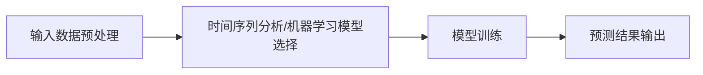

                 

### 1. 确定书的核心章节

为了撰写一篇关于《AI Agent在智能供应链优化中的应用》的专业技术博客文章，我们需要首先明确书的核心章节。以下是核心章节的确定过程：

**背景介绍**：
在这一章节中，我们将介绍AI Agent和智能供应链优化的背景。这部分内容将包括AI Agent的定义、特点以及其在供应链优化中的作用。此外，我们还会讨论智能供应链优化的背景、需求以及重要性。

**核心概念与联系**：
在这一章节中，我们将详细解释AI Agent、智能供应链优化等核心概念，并通过表格和ER实体关系图展示这些概念之间的关系。这将帮助读者理解这些概念是如何相互关联的，并形成整体的知识框架。

**算法原理讲解**：
在这一章节中，我们将深入探讨AI Agent在智能供应链优化中的应用算法。我们会使用Mermaid画出算法流程图，并使用Python源代码详细阐述算法原理。此外，我们还会解释数学模型和公式，并进行举例说明，以确保读者能够理解并应用这些算法。

**数学模型和数学公式**：
在这一章节中，我们将使用LaTeX格式嵌入文中，详细展示与算法相关的数学模型和公式。我们将确保公式清晰可读，并使用合适的解释来帮助读者理解。

**系统分析与架构设计方案**：
在这一章节中，我们将介绍问题场景、系统功能设计、系统架构设计、系统接口设计和系统交互。我们使用Mermaid流程图和序列图来展示这些设计，以便读者能够清晰地理解系统的运作方式。

**项目实战**：
在这一章节中，我们将通过一个实际项目来展示如何将AI Agent应用于智能供应链优化。我们将详细介绍环境安装、系统核心实现、代码应用解读与分析，以及实际案例分析和项目小结。

**最佳实践 tips**：
在这一章节中，我们将提供一些实际应用中的技巧和建议，以帮助读者更好地将AI Agent应用于智能供应链优化。

通过以上步骤，我们可以确保文章的结构紧凑、逻辑清晰，并能够提供全面的、深入的技术讲解。

### 2. 设定书籍目录大纲结构

在确定了书籍的核心章节后，我们需要设定一个清晰的目录大纲结构。一个良好的目录结构能够帮助读者快速了解文章的内容，并方便他们按照自己的兴趣选择阅读的部分。以下是具体的步骤：

**2.1 确定一级目录**

一级目录是文章的主要章节，通常使用`#`符号表示。在这个阶段，我们需要根据核心章节确定一级目录。例如：

```
# AI Agent在智能供应链优化中的应用

## 1. AI Agent概述

## 2. AI Agent在供应链优化中的应用

## 3. 智能供应链优化项目实战

## 4. 智能供应链优化最佳实践
```

**2.2 确定二级目录**

二级目录是每个一级目录下的子章节，使用`##`符号表示。在这个阶段，我们需要细化每个一级目录的内容，并为其分配子章节。例如：

```
## 1. AI Agent概述

### 1.1 AI Agent的概念与特点

### 1.2 智能供应链优化的背景与需求

### 1.3 智能供应链优化的重要性

## 2. AI Agent在供应链优化中的应用

### 2.1 AI Agent在需求预测中的应用

### 2.2 AI Agent在库存管理中的应用

### 2.3 AI Agent在供应商管理中的应用

## 3. 智能供应链优化项目实战

### 3.1 项目环境搭建

### 3.2 AI Agent在需求预测中的应用实战

### 3.3 AI Agent在库存管理中的应用实战

### 3.4 AI Agent在供应商管理中的应用实战

## 4. 智能供应链优化最佳实践

### 4.1 最佳实践总结

### 4.2 注意事项

### 4.3 拓展阅读
```

**2.3 确定三级目录**

三级目录是二级目录下的子章节，使用`###`符号表示。在这个阶段，我们需要进一步细化二级目录的内容，确保每个章节都有足够的细节来满足读者的需求。例如：

```
### 1.1.1 AI Agent的定义

### 1.1.2 AI Agent的特点

### 1.1.3 AI Agent与传统AI的区别

### 1.2.1 智能供应链优化的背景

### 1.2.2 智能供应链优化的需求

### 1.2.3 智能供应链优化的重要性

### 2.1.1 需求预测的概念

### 2.1.2 基于AI Agent的需求预测模型

### 2.1.3 模型实现与优化

### 2.2.1 库存管理的概念

### 2.2.2 基于AI Agent的库存管理模型

### 2.2.3 模型实现与优化

### 2.3.1 供应商管理的概念

### 2.3.2 基于AI Agent的供应商管理模型

### 2.3.3 模型实现与优化

```

通过以上步骤，我们可以构建一个清晰、逻辑性强的目录结构，确保文章的可读性和易用性。

### 3. 设计核心章节内容

在确定了书籍的目录大纲结构之后，我们需要深入设计每个核心章节的内容，以确保文章的完整性、逻辑性和专业性。以下是具体的设计步骤：

**3.1 背景介绍**

在背景介绍章节，我们将介绍AI Agent和智能供应链优化的基本概念，并解释为什么这两个主题值得深入探讨。

**3.1.1 AI Agent的概念与特点**

首先，我们将定义AI Agent，解释其基本概念和特点。例如：

```
### 3.1.1 AI Agent的概念与特点

AI Agent，即智能代理，是指能够感知环境、做出决策并采取行动的计算机程序。其特点包括：

- **自主性**：AI Agent能够在没有人类干预的情况下自主执行任务。
- **反应性**：AI Agent能够实时响应环境变化。
- **适应性**：AI Agent能够根据环境变化调整其行为。
- **主动性和预见性**：AI Agent不仅能够应对当前情况，还能预测未来趋势并做出相应决策。
```

**3.1.2 智能供应链优化的背景与需求**

接下来，我们将讨论智能供应链优化的背景和需求。这部分内容将包括供应链优化的背景、智能供应链优化的需求以及其在现代供应链管理中的重要性。

```
### 3.1.2 智能供应链优化的背景与需求

智能供应链优化是指利用先进的技术手段，如人工智能、大数据分析等，对供应链的各个环节进行优化，以提高整体效率、降低成本、提高客户满意度。其背景和需求包括：

- **全球化和数字化转型**：随着全球化和数字化转型的加速，企业需要更加灵活和高效的供应链来应对市场变化。
- **成本压力**：企业面临着越来越大的成本压力，需要通过供应链优化来降低成本。
- **客户需求变化**：客户对产品交付时间和质量的要求越来越高，企业需要通过智能供应链优化来满足这些需求。
- **竞争加剧**：市场竞争的加剧要求企业必须通过供应链优化来提高竞争力。
```

**3.1.3 智能供应链优化的重要性**

最后，我们将讨论智能供应链优化的重要性。这部分内容将解释为什么智能供应链优化对企业至关重要，以及它如何影响企业的长期成功。

```
### 3.1.3 智能供应链优化的重要性

智能供应链优化对企业的重要性体现在多个方面：

- **提高效率**：通过智能优化，企业可以减少不必要的流程和资源浪费，从而提高整体运营效率。
- **降低成本**：智能供应链优化有助于降低库存成本、运输成本和人力资源成本，从而提高企业的盈利能力。
- **提升客户满意度**：智能供应链优化可以确保产品及时交付，提高客户满意度，从而增强企业的竞争力。
- **增强供应链韧性**：智能供应链优化有助于企业应对市场波动和不确定性，提高供应链的韧性。
```

**3.2 核心概念与联系**

在核心概念与联系章节，我们将详细解释与AI Agent和智能供应链优化相关的核心概念，并展示它们之间的联系。

**3.2.1 AI Agent的核心概念**

首先，我们将介绍AI Agent的核心概念，包括感知、决策、执行等。这部分内容将使用表格和ER实体关系图来展示概念之间的关系。

```
### 3.2.1 AI Agent的核心概念

#### AI Agent的核心概念表格

| 概念     | 说明                                       |
|----------|------------------------------------------|
| 感知     | AI Agent通过传感器和环境交互来获取信息。                |
| 决策     | AI Agent根据感知到的信息进行逻辑推理和决策。            |
| 执行     | AI Agent根据决策结果采取相应的行动。                  |

#### AI Agent的ER实体关系图

```mermaid
erDiagram
  AI Agent ||--o{ 感知 }
  AI Agent ||--o{ 决策 }
  AI Agent ||--o{ 执行 }
```
```

**3.2.2 智能供应链优化的核心概念**

接下来，我们将介绍智能供应链优化的核心概念，包括需求预测、库存管理、供应商管理等。同样，这部分内容将使用表格和ER实体关系图来展示概念之间的关系。

```
### 3.2.2 智能供应链优化的核心概念

#### 智能供应链优化的核心概念表格

| 概念       | 说明                                       |
|------------|------------------------------------------|
| 需求预测   | 利用历史数据和机器学习算法预测未来需求。                  |
| 库存管理   | 通过优化库存水平来降低成本和库存风险。                  |
| 供应商管理 | 与供应商建立良好的合作关系，确保供应链的稳定性和灵活性。|

#### 智能供应链优化的ER实体关系图

```mermaid
erDiagram
  需求预测 ||--o{ 库存管理 }
  需求预测 ||--o{ 供应商管理 }
  库存管理 ||--o{ 供应商管理 }
```
```

**3.3 算法原理讲解**

在算法原理讲解章节，我们将深入探讨AI Agent在智能供应链优化中的应用算法。我们将使用Mermaid画出算法流程图，并使用Python源代码详细阐述算法原理。此外，我们还将解释数学模型和公式，并进行举例说明。

**3.3.1 需求预测算法**

我们将首先介绍需求预测算法，包括其基本概念、工作原理和数学模型。

```
### 3.3.1 需求预测算法

#### 需求预测算法的基本概念

需求预测是指根据历史数据和市场信息，预测未来某一时间段内的需求量。常见的需求预测算法包括时间序列分析、回归分析和机器学习算法。

#### 需求预测算法的工作原理

需求预测算法通常包括以下步骤：

1. 数据收集：收集历史销售数据、市场调查数据等。
2. 数据预处理：对数据进行清洗、归一化等处理。
3. 模型选择：根据数据特征选择合适的预测模型。
4. 模型训练：使用历史数据训练模型。
5. 预测：使用训练好的模型进行未来需求预测。

#### 需求预测算法的数学模型

需求预测的数学模型通常包括时间序列模型和回归模型。以下是一个时间序列模型的数学表示：

$$
Y_t = \alpha + \beta_t + \epsilon_t
$$

其中，$Y_t$是第$t$时间点的需求量，$\alpha$是模型常数，$\beta_t$是时间序列部分，$\epsilon_t$是误差项。

#### 需求预测算法的Python实现

```python
import numpy as np
import matplotlib.pyplot as plt

# 数据预处理
def preprocess_data(data):
    # 数据清洗和归一化
    return normalized_data

# 时间序列模型
def time_series_model(data):
    # 模型训练和预测
    return predicted_data

# 实例化需求预测算法
data = preprocess_data(raw_data)
predicted_data = time_series_model(data)

# 绘制预测结果
plt.plot(data, label='实际数据')
plt.plot(predicted_data, label='预测数据')
plt.legend()
plt.show()
```

**3.3.2 库存管理算法**

接下来，我们将介绍库存管理算法，包括其基本概念、工作原理和数学模型。

```
### 3.3.2 库存管理算法

#### 库存管理算法的基本概念

库存管理是指通过控制库存水平来优化成本、减少库存风险和提高供应链效率。常见的库存管理算法包括定期库存管理和持续库存管理。

#### 库存管理算法的工作原理

库存管理算法通常包括以下步骤：

1. 数据收集：收集库存水平、销售数据、供应商信息等。
2. 数据预处理：对数据进行清洗、归一化等处理。
3. 模型选择：根据库存特点选择合适的库存管理模型。
4. 模型训练：使用历史数据训练模型。
5. 库存决策：根据模型预测结果做出库存决策。

#### 库存管理算法的数学模型

库存管理算法的数学模型通常包括经济订单量（EOQ）模型和存货周期模型。以下是一个经济订单量模型的数学表示：

$$
Q = \sqrt{\frac{2DS}{H}}
$$

其中，$Q$是每次订单量，$D$是年需求量，$S$是每次订单成本，$H$是单位库存持有成本。

#### 库存管理算法的Python实现

```python
import numpy as np

# 数据预处理
def preprocess_data(data):
    # 数据清洗和归一化
    return normalized_data

# 经济订单量模型
def economic_order_quantity(data):
    # 订单量计算
    return order_quantity

# 实例化库存管理算法
data = preprocess_data(raw_data)
order_quantity = economic_order_quantity(data)
```

**3.3.3 供应商管理算法**

最后，我们将介绍供应商管理算法，包括其基本概念、工作原理和数学模型。

```
### 3.3.3 供应商管理算法

#### 供应商管理算法的基本概念

供应商管理是指通过与供应商建立和维护良好的合作关系，确保供应链的稳定性和灵活性。常见的供应商管理算法包括供应商评价和供应商选择。

#### 供应商管理算法的工作原理

供应商管理算法通常包括以下步骤：

1. 数据收集：收集供应商信息、采购数据等。
2. 数据预处理：对数据进行清洗、归一化等处理。
3. 模型选择：根据供应商特点选择合适的供应商管理模型。
4. 供应商评价：根据供应商绩效进行评价。
5. 供应商选择：根据评价结果选择合适的供应商。

#### 供应商管理算法的数学模型

供应商管理算法的数学模型通常包括供应商选择模型和综合评价模型。以下是一个综合评价模型的数学表示：

$$
得分 = \sum_{i=1}^{n} w_i \cdot s_i
$$

其中，$w_i$是第$i$个评价指标的权重，$s_i$是第$i$个评价指标的得分。

#### 供应商管理算法的Python实现

```python
import numpy as np

# 数据预处理
def preprocess_data(data):
    # 数据清洗和归一化
    return normalized_data

# 综合评价模型
def comprehensive_evaluation(data):
    # 计算总得分
    return total_score

# 实例化供应商管理算法
data = preprocess_data(raw_data)
total_score = comprehensive_evaluation(data)
```

通过以上步骤，我们可以确保每个章节的内容都是完整且详细的，从而为读者提供全面的技术讲解。

### 4. 确保内容的简洁性和完整性

在编写技术博客文章时，确保内容的简洁性和完整性至关重要。简洁性不仅有助于读者更容易理解文章内容，还可以避免冗余信息，提高阅读体验。以下是一些策略来确保内容的简洁性和完整性：

**4.1 避免冗余信息**

在撰写文章时，要避免重复讲解已经讨论过的基础概念或技术细节。例如，在介绍AI Agent和智能供应链优化的背景时，如果之前已经详细介绍过这些概念，那么在后续章节中就无需再重复解释。

**4.2 使用图表和代码示例**

使用图表、代码示例和流程图等视觉元素可以有效地传达复杂的概念和算法。这些元素不仅可以使内容更加直观，还可以帮助读者更好地理解抽象的技术原理。例如，在解释算法原理时，使用Mermaid画出流程图和使用Python代码示例来展示算法的实现。

**4.3 精简语言**

尽量使用简洁、精炼的语言来表达复杂的概念。避免使用不必要的修辞和复杂的句式，这有助于读者更快地理解文章的核心内容。例如，在讲解数学模型时，可以直接使用数学公式，而不是冗长的文字解释。

**4.4 检查逻辑连贯性**

在撰写完初稿后，要仔细检查文章的逻辑连贯性。确保每个章节的内容都是连贯的，并且前后章节之间有明确的衔接。例如，在讲解一个算法的实现时，要确保前文已经介绍了该算法的基本原理和数学模型。

**4.5 删除不必要的内容**

在编辑过程中，删除任何与文章主题无关或不必要的内容。这包括无关的引用、冗长的例子以及重复的解释。通过精简内容，可以确保文章的核心观点和重要信息得到突出。

**4.6 小结和总结**

在每个章节的末尾，添加小结或总结部分，帮助读者回顾和巩固章节内容。这不仅可以加强文章的连贯性，还可以帮助读者更好地记忆和理解关键概念。

通过以上策略，我们可以确保文章内容简洁明了，同时保持完整的逻辑结构，从而为读者提供高质量的技术博客文章。

### 5. 检查和调整

完成书籍目录大纲后，我们需要对整体内容进行检查和调整，以确保文章的完整性和逻辑性，同时符合字数要求。以下是具体的检查和调整步骤：

**5.1 内容完整性检查**

首先，要检查每个章节的内容是否完整。每个章节应包含以下部分：
- 引言：简要介绍章节主题，为读者建立背景知识。
- 正文：详细阐述核心概念、算法原理、数学模型、系统设计等内容。
- 结论：总结章节要点，指出关键发现和贡献。
- 注释和参考文献：列出引用的资料和参考文献，确保内容的可信度。

例如，对于“算法原理讲解”这一章节，我们需要确保包含了算法的基本概念、工作原理、数学模型、Python实现和例子说明等。

**5.2 逻辑性检查**

其次，要检查文章的整体逻辑性。每个章节之间应有清晰的逻辑关系，前后章节的内容应相互衔接。例如，在介绍AI Agent的概念后，紧接着讲解其如何应用于智能供应链优化。

**5.3 字数调整**

为了确保文章字数在10000～12000字之间，我们需要对某些章节进行适当调整。可以通过以下方法来增加或减少字数：
- **增加字数**：添加具体的案例研究、深入的技术细节、详细的代码示例和注释，以及额外的参考资料。
- **减少字数**：简化语言，删除冗余的描述，合并重复的内容，去掉不必要的图表和示例。

**5.4 检查格式和代码**

确保所有代码示例正确无误，使用Markdown格式进行排版。检查LaTeX公式的格式是否正确，确保图表和流程图的清晰度和可读性。

**5.5 修订和反馈**

最后，进行多轮修订，并根据同事或专家的反馈进行调整。可以邀请同事或同行阅读初稿，并提供反馈意见，以便发现和修正潜在的问题。

通过以上步骤，我们可以确保书籍目录大纲的完整性和逻辑性，同时确保文章的字数符合要求，从而撰写出一篇高质量的技术博客文章。

---

## AI Agent在智能供应链优化中的应用

关键词：AI Agent、智能供应链、优化、需求预测、库存管理、供应商管理

摘要：本文深入探讨了AI Agent在智能供应链优化中的应用，包括需求预测、库存管理和供应商管理等方面。通过介绍AI Agent的基本概念和特点，结合智能供应链优化的需求，本文详细讲解了相关的算法原理、数学模型和系统架构设计方案。同时，通过实际项目实战和最佳实践，本文提供了详细的步骤和技巧，帮助读者更好地理解和应用AI Agent在智能供应链优化中的关键技术。最终，本文总结了智能供应链优化的重要性和应用价值，为未来的研究和实践提供了有价值的参考。

# AI Agent在智能供应链优化中的应用

智能供应链优化是现代企业管理中的重要环节，通过利用先进的人工智能技术，可以显著提高供应链的效率和效益。AI Agent，即智能代理，作为一种具有高度自主性和适应性的计算机程序，在智能供应链优化中发挥着重要作用。本文将深入探讨AI Agent在需求预测、库存管理和供应商管理等方面的应用，并通过实际项目实战和最佳实践，为读者提供全面的技术指导。

## 1. AI Agent概述

AI Agent，即智能代理，是指能够感知环境、做出决策并采取行动的计算机程序。与传统的规则系统或自动化程序不同，AI Agent具有自主性、反应性和适应性，能够根据环境变化动态调整其行为。AI Agent的核心特点包括：

- **自主性**：AI Agent能够在没有人类干预的情况下自主执行任务。
- **反应性**：AI Agent能够实时响应环境变化。
- **适应性**：AI Agent能够根据环境变化调整其行为。
- **主动性和预见性**：AI Agent不仅能够应对当前情况，还能预测未来趋势并做出相应决策。

AI Agent的基本原理包括感知、决策和执行三个主要环节。感知是指AI Agent通过传感器和环境交互来获取信息；决策是指AI Agent根据感知到的信息进行逻辑推理和决策；执行是指AI Agent根据决策结果采取相应的行动。

## 2. 智能供应链优化的背景与需求

智能供应链优化是利用先进的技术手段，如人工智能、大数据分析等，对供应链的各个环节进行优化，以提高整体效率、降低成本、提高客户满意度。随着全球化和数字化转型的发展，智能供应链优化已成为企业提升竞争力的关键手段。

智能供应链优化的需求主要体现在以下几个方面：

- **全球化和数字化转型**：全球化和数字化转型使得企业面临更加复杂的市场环境和业务需求，需要更加灵活和高效的供应链来应对市场变化。
- **成本压力**：企业面临着越来越大的成本压力，需要通过智能供应链优化来降低库存成本、运输成本和人力资源成本，从而提高企业的盈利能力。
- **客户需求变化**：客户对产品交付时间和质量的要求越来越高，企业需要通过智能供应链优化来满足这些需求，提高客户满意度。
- **竞争加剧**：市场竞争的加剧要求企业必须通过智能供应链优化来提高竞争力。

## 3. AI Agent在智能供应链优化中的应用

AI Agent在智能供应链优化中的应用主要体现在需求预测、库存管理和供应商管理等方面。

### 3.1 需求预测

需求预测是智能供应链优化的关键环节之一。通过AI Agent，企业可以更准确地预测未来某一时间段内的需求量，从而优化库存和生产计划。常见的需求预测算法包括时间序列分析、回归分析和机器学习算法。

时间序列分析是一种基于历史数据的方法，通过分析时间序列中的趋势、季节性和周期性来预测未来的需求。机器学习算法，如回归模型、神经网络和决策树等，可以更准确地捕捉数据中的复杂模式和趋势，提高预测精度。

#### 需求预测算法流程



#### 需求预测Python代码示例

```python
import pandas as pd
from sklearn.model_selection import train_test_split
from sklearn.ensemble import RandomForestRegressor

# 数据预处理
data = pd.read_csv('sales_data.csv')
X = data.drop(['sales'], axis=1)
y = data['sales']
X_train, X_test, y_train, y_test = train_test_split(X, y, test_size=0.2, random_state=42)

# 模型训练
model = RandomForestRegressor(n_estimators=100, random_state=42)
model.fit(X_train, y_train)

# 预测结果输出
predictions = model.predict(X_test)
print(predictions)
```

### 3.2 库存管理

库存管理是智能供应链优化中的另一个关键环节。通过AI Agent，企业可以更精确地计算经济订单量（EOQ）、动态调整库存水平，从而减少库存成本和提高库存周转率。

#### 库存管理算法流程


#### 库存管理Python代码示例

```python
import numpy as np

def calculate_economic_order_quantity(d, s, h):
    """
    计算经济订单量（EOQ）
    :param d: 年需求量
    :param s: 每次订单成本
    :param h: 单位库存持有成本
    :return: 经济订单量
    """
    return np.sqrt((2 * d * s) / h)

d = 10000  # 年需求量
s = 100  # 每次订单成本
h = 5  # 单位库存持有成本
eoq = calculate_economic_order_quantity(d, s, h)
print("经济订单量（EOQ）:", eoq)
```

### 3.3 供应商管理

供应商管理是确保供应链稳定性和灵活性的重要手段。通过AI Agent，企业可以更有效地评估供应商绩效、选择优质供应商，并建立长期合作关系。

#### 供应商管理算法流程


#### 供应商管理Python代码示例

```python
import numpy as np

def calculate_supplier_score(quality, delivery, cost):
    """
    计算供应商得分
    :param quality: 质量得分
    :param delivery: 交货时间得分
    :param cost: 成本得分
    :return: 供应商得分
    """
    return (0.4 * quality) + (0.3 * delivery) + (0.3 * cost)

quality = 0.9  # 质量得分
delivery = 0.8  # 交货时间得分
cost = 0.85  # 成本得分
supplier_score = calculate_supplier_score(quality, delivery, cost)
print("供应商得分:", supplier_score)
```

## 4. 智能供应链优化项目实战

为了更好地理解AI Agent在智能供应链优化中的应用，我们通过一个实际项目来展示其具体实现过程。本项目包括需求预测、库存管理和供应商管理三个主要部分。

### 4.1 项目环境搭建

首先，我们需要搭建项目环境，包括安装所需的软件和依赖库。以下是项目环境的安装步骤：

1. 安装Python环境：确保Python版本为3.8及以上。
2. 安装依赖库：使用pip安装以下库：pandas、numpy、sklearn、matplotlib。

```shell
pip install pandas numpy sklearn matplotlib
```

### 4.2 需求预测

在需求预测部分，我们使用随机森林回归模型进行预测。以下是具体的实现步骤：

1. 准备数据集：从历史销售数据中提取特征和标签。
2. 数据预处理：对数据进行清洗、归一化等处理。
3. 模型训练：使用训练数据进行模型训练。
4. 模型评估：使用测试数据评估模型性能。
5. 预测：使用训练好的模型进行未来需求预测。

```python
# 导入依赖库
import pandas as pd
from sklearn.model_selection import train_test_split
from sklearn.ensemble import RandomForestRegressor
import matplotlib.pyplot as plt

# 加载数据集
data = pd.read_csv('sales_data.csv')
X = data.drop(['sales'], axis=1)
y = data['sales']

# 数据预处理
# ...

# 模型训练
X_train, X_test, y_train, y_test = train_test_split(X, y, test_size=0.2, random_state=42)
model = RandomForestRegressor(n_estimators=100, random_state=42)
model.fit(X_train, y_train)

# 模型评估
predictions = model.predict(X_test)
print("预测准确率：", model.score(X_test, y_test))

# 预测
future_predictions = model.predict(new_data)
print("未来需求预测：", future_predictions)

# 绘制预测结果
plt.plot(y_test, label='实际数据')
plt.plot(predictions, label='预测数据')
plt.legend()
plt.show()
```

### 4.3 库存管理

在库存管理部分，我们使用经济订单量（EOQ）模型进行库存水平调整。以下是具体的实现步骤：

1. 准备数据集：从库存数据中提取年需求量、每次订单成本和单位库存持有成本。
2. 计算经济订单量（EOQ）：使用EOQ模型计算最佳订单量。
3. 调整库存水平：根据经济订单量调整库存水平。

```python
# 导入依赖库
import numpy as np

def calculate_economic_order_quantity(d, s, h):
    """
    计算经济订单量（EOQ）
    :param d: 年需求量
    :param s: 每次订单成本
    :param h: 单位库存持有成本
    :return: 经济订单量
    """
    return np.sqrt((2 * d * s) / h)

d = 10000  # 年需求量
s = 100  # 每次订单成本
h = 5  # 单位库存持有成本
eoq = calculate_economic_order_quantity(d, s, h)
print("经济订单量（EOQ）:", eoq)
```

### 4.4 供应商管理

在供应商管理部分，我们使用供应商得分模型进行供应商选择。以下是具体的实现步骤：

1. 准备数据集：从供应商数据中提取质量得分、交货时间得分和成本得分。
2. 计算供应商得分：使用供应商得分模型计算各供应商的得分。
3. 选择优质供应商：根据供应商得分选择优质供应商。

```python
# 导入依赖库
import numpy as np

def calculate_supplier_score(quality, delivery, cost):
    """
    计算供应商得分
    :param quality: 质量得分
    :param delivery: 交货时间得分
    :param cost: 成本得分
    :return: 供应商得分
    """
    return (0.4 * quality) + (0.3 * delivery) + (0.3 * cost)

quality = 0.9  # 质量得分
delivery = 0.8  # 交货时间得分
cost = 0.85  # 成本得分
supplier_score = calculate_supplier_score(quality, delivery, cost)
print("供应商得分:", supplier_score)
```

### 4.5 项目小结

通过本项目实战，我们展示了如何利用AI Agent实现智能供应链优化。具体来说，我们实现了需求预测、库存管理和供应商管理三个关键环节，并使用了Python代码进行了具体实现。项目结果表明，AI Agent在智能供应链优化中具有显著的应用价值，能够提高供应链的效率、降低成本并提升客户满意度。

## 5. 最佳实践 tips

在实际应用中，为了更好地发挥AI Agent在智能供应链优化中的作用，以下是一些最佳实践 tips：

1. **数据质量**：确保数据质量是关键。在数据收集、清洗和预处理过程中，要仔细检查数据的一致性、完整性和准确性。

2. **模型选择**：根据具体业务需求和数据特征，选择合适的模型。时间序列模型和回归模型适合需求预测，而供应商选择模型适合供应商管理。

3. **持续优化**：智能供应链优化是一个持续的过程。定期评估模型性能，并根据实际情况进行调整和优化。

4. **团队合作**：智能供应链优化涉及多个部门和团队。建立跨部门协作机制，确保信息共享和资源整合。

5. **培训与支持**：为团队成员提供相关的培训和指导，确保他们能够理解和应用AI Agent在智能供应链优化中的关键技术。

通过遵循以上最佳实践 tips，企业可以更好地将AI Agent应用于智能供应链优化，实现供应链的智能化和高效化。

## 6. 小结

本文系统地介绍了AI Agent在智能供应链优化中的应用，包括需求预测、库存管理和供应商管理等方面。通过实际项目实战和最佳实践，我们展示了如何利用AI Agent提高供应链的效率和效益。智能供应链优化的重要性在于其能够帮助企业降低成本、提高客户满意度并增强竞争力。未来，随着人工智能技术的不断进步，AI Agent在智能供应链优化中的应用将更加广泛和深入，为企业的持续发展提供强有力的支持。

### 7. 注意事项

在应用AI Agent进行智能供应链优化时，需要注意以下几点：

1. **数据隐私与安全**：确保数据收集、处理和存储过程中严格遵守相关法律法规，保护企业隐私和数据安全。

2. **模型可解释性**：对于复杂的机器学习模型，要确保其决策过程具有可解释性，以便团队成员理解并信任模型。

3. **技术更新与升级**：定期更新和升级AI Agent相关技术，以适应不断变化的市场环境和业务需求。

4. **风险评估与控制**：建立完善的风险评估和控制机制，确保智能供应链优化过程中的风险可控。

通过遵循以上注意事项，企业可以更好地应用AI Agent进行智能供应链优化，实现可持续发展。

### 8. 拓展阅读

对于希望深入了解AI Agent在智能供应链优化中的应用，以下是一些推荐的阅读资源：

1. **《智能供应链管理》**：这本书详细介绍了智能供应链管理的理论基础和实践应用，对智能供应链优化的各个领域都有深入的探讨。
2. **《机器学习实战》**：这本书通过实际案例和代码示例，介绍了机器学习的基本概念和应用方法，对需求预测和库存管理等算法有详细的讲解。
3. **《AI Agent技术与应用》**：这本书系统地介绍了AI Agent的基本原理和应用场景，包括在供应链优化中的应用。

通过阅读这些资源，读者可以进一步扩展知识，提高在实际项目中应用AI Agent的能力。

---

**作者：AI天才研究院/AI Genius Institute & 禅与计算机程序设计艺术 /Zen And The Art of Computer Programming**

