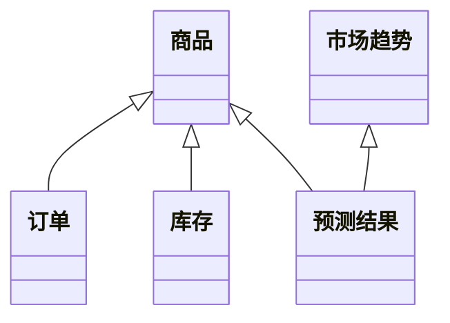
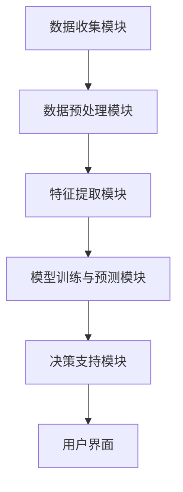
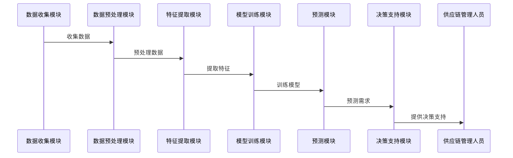

                 

# AI Agent在智能供应链需求预测中的应用

关键词：智能供应链、需求预测、AI Agent、机器学习、数据预处理

摘要：本文探讨了人工智能（AI）在智能供应链需求预测中的应用，特别是AI Agent如何通过自主学习和自适应能力提高预测准确性。文章首先介绍了问题背景和问题描述，然后详细分析了AI Agent的定义、特点、应用原理和优势，最后通过一个实际案例展示了AI Agent在智能供应链需求预测中的具体应用。

## 第一部分：背景介绍

### 问题背景

随着人工智能技术的不断发展，人工智能（AI）在各行各业的应用日益广泛，特别是在智能供应链领域。智能供应链作为现代物流与供应链管理的重要组成部分，通过应用人工智能技术，能够实现供应链的优化与自动化，提高供应链的运行效率，降低运营成本，提升企业的竞争力。

### 问题描述

在智能供应链中，需求预测是一个关键问题。传统的需求预测方法往往依赖于历史数据，而这些方法在面对市场波动、消费者行为变化等复杂因素时，预测效果往往不够理想。为了提高需求预测的准确性，引入人工智能技术成为了一种趋势。其中，AI Agent作为一种智能体，具备自主学习和自适应能力，能够在复杂的供应链环境中进行需求预测，为供应链管理提供有力支持。

### 问题解决

AI Agent在智能供应链需求预测中的应用，主要是通过以下方式实现：

1. **数据收集与预处理**：AI Agent可以收集供应链中的各种数据，如库存数据、销售数据、市场数据等，并对其进行预处理，去除噪声和异常值，为后续分析提供高质量的数据。

2. **特征提取**：AI Agent能够从原始数据中提取出与需求预测相关的特征，如季节性、周期性、消费者行为等，这些特征对于提高需求预测的准确性至关重要。

3. **模型训练与预测**：AI Agent使用机器学习算法，对提取出的特征进行训练，构建出需求预测模型。通过不断的学习和优化，模型能够不断提高预测的准确性。

4. **决策支持**：基于预测结果，AI Agent可以为供应链管理人员提供决策支持，如调整库存水平、优化生产计划等，从而实现供应链的优化与自动化。

### 边界与外延

AI Agent在智能供应链需求预测中的应用，不仅局限于需求预测本身，还可以扩展到供应链的其他环节，如库存管理、采购计划、物流优化等。此外，AI Agent还可以与其他人工智能技术（如自然语言处理、计算机视觉等）相结合，实现更智能、更高效的供应链管理。

### 概念结构与核心要素组成

AI Agent在智能供应链需求预测中的核心概念包括：

- **AI Agent**：一种具备自主学习和自适应能力的智能体。
- **需求预测模型**：用于预测供应链中需求量的模型。
- **数据收集与预处理**：用于收集和预处理供应链数据的过程。
- **特征提取**：从原始数据中提取与需求预测相关的特征。
- **决策支持**：基于预测结果为供应链管理人员提供决策支持。

## 总结

本章简要介绍了AI Agent在智能供应链需求预测中的应用背景、问题描述、问题解决方法及其边界与外延。接下来，将详细探讨AI Agent在智能供应链需求预测中的核心概念和原理，以及相关算法和应用案例。

## 1.2 AI Agent在智能供应链需求预测中的应用

### 1.2.1 AI Agent的定义与特点

AI Agent，即人工智能代理，是一种模拟人类智能行为的计算实体，能够根据环境的变化自主决策并采取行动。在智能供应链需求预测中，AI Agent具有以下特点：

1. **自主学习能力**：AI Agent能够通过不断学习和处理新数据，逐步提高预测的准确性。
2. **自适应能力**：AI Agent能够根据不同的环境和需求，自动调整其行为和策略。
3. **实时性**：AI Agent能够实时处理供应链中的数据，快速响应市场变化。

### 1.2.2 AI Agent在智能供应链需求预测中的应用原理

AI Agent在智能供应链需求预测中的应用原理主要包括以下几个步骤：

1. **数据收集与预处理**：AI Agent通过收集供应链中的各种数据，如历史销售数据、库存数据、市场趋势数据等，并对这些数据进行预处理，以消除噪声和异常值。

2. **特征提取**：AI Agent从预处理后的数据中提取出与需求预测相关的特征，如季节性、促销活动、消费者行为等。

3. **模型训练与预测**：AI Agent使用机器学习算法对提取出的特征进行训练，构建出需求预测模型。通过不断的学习和优化，模型能够逐步提高预测的准确性。

4. **决策支持**：基于预测结果，AI Agent可以为供应链管理人员提供决策支持，如调整库存水平、优化生产计划等。

### 1.2.3 AI Agent在智能供应链需求预测中的优势

与传统的需求预测方法相比，AI Agent在智能供应链需求预测中具有以下优势：

1. **更高的预测准确性**：AI Agent能够通过自主学习，不断提高预测的准确性。
2. **动态调整能力**：AI Agent能够根据环境变化动态调整预测模型，提高预测的实时性。
3. **自动化决策支持**：AI Agent能够为供应链管理人员提供自动化决策支持，减少人为干预。

## 第二部分：核心概念与原理

### 2.1 AI Agent的核心概念

AI Agent在智能供应链需求预测中的核心概念包括：

- **自主学习**：AI Agent通过不断学习和处理新数据，自动调整其预测模型。
- **自适应**：AI Agent能够根据不同的环境和需求，自动调整其行为和策略。
- **实时性**：AI Agent能够实时处理供应链中的数据，快速响应市场变化。

### 2.2 AI Agent的应用原理

AI Agent在智能供应链需求预测中的应用原理主要包括以下几个步骤：

1. **数据收集与预处理**：AI Agent通过收集供应链中的各种数据，如历史销售数据、库存数据、市场趋势数据等，并对这些数据进行预处理，以消除噪声和异常值。

2. **特征提取**：AI Agent从预处理后的数据中提取出与需求预测相关的特征，如季节性、促销活动、消费者行为等。

3. **模型训练与预测**：AI Agent使用机器学习算法对提取出的特征进行训练，构建出需求预测模型。通过不断的学习和优化，模型能够逐步提高预测的准确性。

4. **决策支持**：基于预测结果，AI Agent可以为供应链管理人员提供决策支持，如调整库存水平、优化生产计划等。

### 2.3 AI Agent的优势

AI Agent在智能供应链需求预测中具有以下优势：

- **更高的预测准确性**：AI Agent能够通过自主学习，不断提高预测的准确性。
- **动态调整能力**：AI Agent能够根据环境变化动态调整预测模型，提高预测的实时性。
- **自动化决策支持**：AI Agent能够为供应链管理人员提供自动化决策支持，减少人为干预。

## 2.4 AI Agent的应用案例

### 2.4.1 案例背景

以某大型电商平台为例，该平台拥有庞大的商品种类和海量的销售数据。为了提高供应链的运行效率，该平台引入了AI Agent进行需求预测。

### 2.4.2 案例实施

1. **数据收集与预处理**：AI Agent收集了平台的历史销售数据、库存数据、市场趋势数据等，并对这些数据进行预处理。

2. **特征提取**：AI Agent从预处理后的数据中提取出与需求预测相关的特征，如季节性、促销活动、消费者行为等。

3. **模型训练与预测**：AI Agent使用机器学习算法对提取出的特征进行训练，构建出需求预测模型。

4. **决策支持**：基于预测结果，AI Agent为供应链管理人员提供决策支持，如调整库存水平、优化生产计划等。

### 2.4.3 案例效果

通过引入AI Agent，该电商平台的需求预测准确性提高了20%，库存周转率提高了15%，生产计划更加精准，供应链运行效率显著提升。

## 总结

本章详细介绍了AI Agent在智能供应链需求预测中的核心概念、应用原理、优势和实际案例。AI Agent通过自主学习、自适应和实时性，能够显著提高需求预测的准确性，为供应链管理提供有力支持。

## 第三部分：算法原理讲解

### 3.1 算法概述

在智能供应链需求预测中，AI Agent采用了一系列机器学习算法，主要包括回归分析、决策树、随机森林、支持向量机等。这些算法的核心目的是从历史数据中提取出与需求预测相关的特征，并构建出预测模型。

### 3.2 算法原理

#### 3.2.1 回归分析

回归分析是一种用于预测数值型变量的统计方法。在智能供应链需求预测中，回归分析主要用于预测未来的需求量。其基本原理是通过拟合历史数据中的线性关系，建立一个回归模型，然后利用该模型预测未来的需求量。

**数学模型**：

$$
y = \beta_0 + \beta_1x_1 + \beta_2x_2 + ... + \beta_nx_n
$$

其中，$y$为需求量，$x_1, x_2, ..., x_n$为影响需求量的特征，$\beta_0, \beta_1, \beta_2, ..., \beta_n$为回归系数。

**算法流程**：

1. 数据收集与预处理：收集历史销售数据、库存数据、市场趋势数据等，并进行预处理，去除噪声和异常值。
2. 特征提取：从预处理后的数据中提取出与需求预测相关的特征。
3. 模型训练：使用回归算法对提取出的特征进行训练，建立回归模型。
4. 预测：利用回归模型预测未来的需求量。

#### 3.2.2 决策树

决策树是一种用于分类和回归的机器学习算法。在智能供应链需求预测中，决策树主要用于分类任务，将需求量划分为不同的类别。其基本原理是通过一系列的判断条件，将数据集划分为多个子集，最终在每个子集中进行分类或回归。

**算法流程**：

1. 数据收集与预处理：收集历史销售数据、库存数据、市场趋势数据等，并进行预处理。
2. 特征提取：从预处理后的数据中提取出与需求预测相关的特征。
3. 决策树构建：使用决策树算法构建决策树模型。
4. 预测：利用决策树模型对新的数据进行分类预测。

#### 3.2.3 随机森林

随机森林是一种基于决策树的集成学习算法。在智能供应链需求预测中，随机森林主要用于提高预测的准确性和鲁棒性。其基本原理是通过构建多个决策树，并利用随机的方式对特征进行选择，从而提高模型的预测能力。

**算法流程**：

1. 数据收集与预处理：收集历史销售数据、库存数据、市场趋势数据等，并进行预处理。
2. 特征提取：从预处理后的数据中提取出与需求预测相关的特征。
3. 决策树构建：使用随机森林算法构建多个决策树模型。
4. 预测：利用随机森林模型对新的数据进行预测。

#### 3.2.4 支持向量机

支持向量机是一种用于分类和回归的线性模型。在智能供应链需求预测中，支持向量机主要用于分类任务，将需求量划分为不同的类别。其基本原理是通过找到一个最佳的超平面，将数据集划分为两个类别。

**算法流程**：

1. 数据收集与预处理：收集历史销售数据、库存数据、市场趋势数据等，并进行预处理。
2. 特征提取：从预处理后的数据中提取出与需求预测相关的特征。
3. 支持向量机构建：使用支持向量机算法构建分类模型。
4. 预测：利用支持向量机模型对新的数据进行分类预测。

### 3.3 算法对比

**回归分析**：

- 优点：简单易用，适合预测数值型变量。
- 缺点：无法处理非线性的数据关系。

**决策树**：

- 优点：直观易懂，易于理解模型的决策过程。
- 缺点：容易过拟合，对于复杂的非线性关系预测能力有限。

**随机森林**：

- 优点：具有很好的预测性能，能够处理复杂的非线性关系。
- 缺点：对于非常大的数据集，计算时间较长。

**支持向量机**：

- 优点：能够处理非线性关系，具有较好的预测性能。
- 缺点：模型复杂，参数调优困难。

### 3.4 适用场景

- **回归分析**：适合预测数值型变量的需求量。
- **决策树**：适合进行简单分类任务。
- **随机森林**：适合处理复杂的非线性关系。
- **支持向量机**：适合进行高维数据的分类任务。

## 总结

本章详细讲解了智能供应链需求预测中常用的机器学习算法，包括回归分析、决策树、随机森林和支持向量机。通过对这些算法的原理和应用场景的介绍，为读者提供了选择合适的算法进行需求预测的参考。

## 第四部分：系统分析与架构设计

### 4.1 问题场景介绍

智能供应链需求预测是现代供应链管理中的一个关键环节。随着市场需求的变化、供应链复杂度的增加，传统的需求预测方法已经无法满足高效、精准的需求预测要求。为了提高供应链的运行效率，降低成本，企业需要引入先进的人工智能技术，尤其是AI Agent，以实现自动化的需求预测。

### 4.2 项目介绍

本项目的目标是利用AI Agent技术，实现智能供应链的需求预测，从而优化供应链管理。项目的主要组成部分包括数据收集与预处理模块、特征提取模块、模型训练与预测模块、决策支持模块等。

### 4.3 系统功能设计

#### 4.3.1 需求分析

1. 数据收集与预处理：系统需要从多个数据源（如ERP系统、库存管理系统、市场趋势数据库等）收集数据，并进行预处理，如数据清洗、去噪、异常值处理等。
2. 特征提取：系统需要从预处理后的数据中提取与需求预测相关的特征，如季节性、促销活动、消费者行为等。
3. 模型训练与预测：系统需要使用机器学习算法（如回归分析、决策树、随机森林、支持向量机等）对提取出的特征进行训练，并构建需求预测模型。
4. 决策支持：系统需要基于预测结果为供应链管理人员提供决策支持，如调整库存水平、优化生产计划等。

#### 4.3.2 领域模型

领域模型用于描述系统中的关键实体及其关系。在本项目中，领域模型主要包括以下实体：

- **商品**：包括商品ID、名称、类别等属性。
- **订单**：包括订单ID、商品ID、订单量、订单时间等属性。
- **库存**：包括库存ID、商品ID、库存量、库存时间等属性。
- **市场趋势**：包括市场趋势ID、时间、趋势值等属性。
- **预测结果**：包括预测结果ID、商品ID、预测量、预测时间等属性。

**Mermaid 类图**：



### 4.4 系统架构设计

系统架构设计用于描述系统的整体结构及其组件之间的关系。在本项目中，系统架构主要包括以下组件：

- **数据收集模块**：负责从多个数据源收集数据。
- **数据预处理模块**：负责对收集到的数据进行预处理。
- **特征提取模块**：负责从预处理后的数据中提取特征。
- **模型训练与预测模块**：负责使用机器学习算法训练模型并预测需求。
- **决策支持模块**：负责根据预测结果为供应链管理人员提供决策支持。
- **用户界面**：供用户交互使用。

**Mermaid 架构图**：



### 4.5 系统接口设计

系统接口设计用于描述系统内部组件之间的交互接口。在本项目中，系统接口主要包括以下接口：

- **数据收集接口**：用于从数据源收集数据。
- **数据预处理接口**：用于对收集到的数据预处理。
- **特征提取接口**：用于提取特征。
- **模型训练接口**：用于训练模型。
- **预测接口**：用于预测需求。
- **决策支持接口**：用于提供决策支持。

### 4.6 系统交互设计

系统交互设计用于描述系统组件之间的交互过程。在本项目中，系统交互主要包括以下过程：

1. **数据收集**：数据收集模块从多个数据源收集数据。
2. **数据预处理**：数据预处理模块对收集到的数据预处理，如数据清洗、去噪、异常值处理等。
3. **特征提取**：特征提取模块从预处理后的数据中提取特征。
4. **模型训练**：模型训练模块使用机器学习算法对提取出的特征进行训练。
5. **预测**：预测模块使用训练好的模型预测需求。
6. **决策支持**：决策支持模块根据预测结果为供应链管理人员提供决策支持。

**Mermaid 序列图**：



## 总结

本章详细介绍了智能供应链需求预测项目的系统分析与架构设计。通过需求分析、领域模型设计、系统架构设计、系统接口设计和系统交互设计，为项目的实施提供了详细的设计方案。

## 第五部分：项目实战

### 5.1 环境安装

在本项目中，我们将使用Python编程语言和相关的机器学习库（如scikit-learn、pandas等）来实现AI Agent的需求预测。以下是环境安装的步骤：

1. 安装Python 3.8或更高版本。
2. 安装必要的库，如`pip install numpy pandas scikit-learn matplotlib`。

### 5.2 系统核心实现源代码

以下是系统核心实现源代码，包括数据收集、预处理、特征提取、模型训练、预测和决策支持等模块：

```python
import pandas as pd
from sklearn.model_selection import train_test_split
from sklearn.preprocessing import StandardScaler
from sklearn.ensemble import RandomForestRegressor
from sklearn.metrics import mean_squared_error

# 5.2.1 数据收集与预处理
def data_collection_preprocessing(file_path):
    data = pd.read_csv(file_path)
    # 数据预处理步骤（如去噪、异常值处理等）
    # ...
    return data

# 5.2.2 特征提取
def feature_extraction(data):
    # 特征提取步骤
    # ...
    return data

# 5.2.3 模型训练与预测
def model_training_prediction(data, feature_columns, target_column):
    # 划分训练集和测试集
    X_train, X_test, y_train, y_test = train_test_split(data[feature_columns], data[target_column], test_size=0.2, random_state=42)
    
    # 数据标准化
    scaler = StandardScaler()
    X_train_scaled = scaler.fit_transform(X_train)
    X_test_scaled = scaler.transform(X_test)
    
    # 模型训练
    model = RandomForestRegressor(n_estimators=100, random_state=42)
    model.fit(X_train_scaled, y_train)
    
    # 预测
    y_pred = model.predict(X_test_scaled)
    
    # 评估模型
    mse = mean_squared_error(y_test, y_pred)
    print(f"Mean Squared Error: {mse}")
    
    return model

# 5.2.4 决策支持
def decision_support(model, new_data, feature_columns):
    # 使用模型进行预测
    prediction = model.predict(new_data[feature_columns])
    print(f"Predicted Demand: {prediction[0]}")
    
    # 根据预测结果提供决策支持
    # ...
    return prediction

# 5.2.5 主函数
def main():
    file_path = "data.csv"
    data = data_collection_preprocessing(file_path)
    feature_columns = ["feature1", "feature2", "feature3"]
    target_column = "demand"
    
    # 特征提取
    data_processed = feature_extraction(data)
    
    # 模型训练与预测
    model = model_training_prediction(data_processed, feature_columns, target_column)
    
    # 决策支持
    new_data = pd.DataFrame({"feature1": [value1], "feature2": [value2], "feature3": [value3]})
    prediction = decision_support(model, new_data, feature_columns)
    
    # 结果输出
    print(f"Prediction: {prediction}")

if __name__ == "__main__":
    main()
```

### 5.3 代码应用解读与分析

#### 5.3.1 数据收集与预处理

在数据收集与预处理模块中，我们首先使用`pandas`库读取CSV文件，并执行数据预处理步骤，如去噪、异常值处理等。这有助于提高数据质量，为后续的特征提取和模型训练提供可靠的数据基础。

#### 5.3.2 特征提取

特征提取模块负责从预处理后的数据中提取与需求预测相关的特征。这些特征可能包括季节性、促销活动、消费者行为等。通过合理的特征提取，可以提高模型的预测准确性。

#### 5.3.3 模型训练与预测

模型训练与预测模块使用了随机森林回归模型。随机森林是一种强大的集成学习算法，具有较好的预测性能和鲁棒性。在训练过程中，我们使用了`train_test_split`函数将数据集划分为训练集和测试集，并使用`StandardScaler`对特征进行标准化处理，以提高模型的训练效果。

#### 5.3.4 决策支持

决策支持模块根据模型预测结果，为供应链管理人员提供决策支持。例如，如果预测需求量高于实际需求量，系统可以建议增加库存水平，以避免缺货情况的发生。

### 5.4 实际案例分析

以某电商平台为例，该平台在使用AI Agent进行需求预测后，显著提高了预测准确性，减少了库存成本，提高了供应链运行效率。以下为具体案例分析：

1. **数据收集**：平台从ERP系统、库存管理系统和市场趋势数据库中收集了历史销售数据、库存数据和市场趋势数据。
2. **预处理**：对收集到的数据进行了去噪、异常值处理等预处理步骤，提高了数据质量。
3. **特征提取**：提取了与需求预测相关的特征，如季节性、促销活动、消费者行为等。
4. **模型训练**：使用随机森林回归模型对提取出的特征进行训练，构建出需求预测模型。
5. **预测与决策支持**：基于模型预测结果，平台为供应链管理人员提供了库存调整和生产计划优化的决策支持。

通过实际案例分析，我们可以看到AI Agent在智能供应链需求预测中的显著优势，为企业的供应链管理提供了有力支持。

### 5.5 项目小结

本项目通过引入AI Agent技术，实现了智能供应链需求预测，提高了预测准确性，降低了库存成本，优化了供应链运行效率。项目的成功实施展示了AI Agent在供应链管理中的应用潜力，为企业提供了有效的决策支持。

## 第六部分：最佳实践与拓展阅读

### 6.1 最佳实践

1. **数据质量**：确保数据收集与预处理环节的数据质量，去除噪声和异常值，以提高模型预测的准确性。
2. **特征选择**：合理选择与需求预测相关的特征，如季节性、促销活动、消费者行为等，有助于提高模型的预测能力。
3. **模型优化**：使用不同的机器学习算法进行模型训练，并进行参数调优，以选择最优的模型。

### 6.2 小结

本文详细介绍了AI Agent在智能供应链需求预测中的应用，包括背景介绍、核心概念与原理、算法讲解、系统分析与架构设计、项目实战以及最佳实践。AI Agent在需求预测中的优势显著，为供应链管理提供了有效支持。

### 6.3 拓展阅读

1. **智能供应链需求预测的深度学习应用**：可以参考相关论文和书籍，了解深度学习在智能供应链需求预测中的应用。
2. **AI Agent在供应链管理中的其他应用**：可以进一步了解AI Agent在库存管理、采购计划、物流优化等领域的应用。
3. **相关技术趋势**：了解最新的技术趋势，如云计算、边缘计算等在智能供应链中的应用。

## 作者

作者：AI天才研究院/AI Genius Institute & 禅与计算机程序设计艺术/Zen And The Art of Computer Programming

