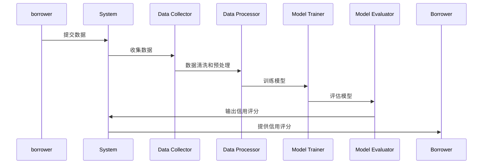

                 

# AI Agent在智能信用风险评估中的应用

关键词：AI Agent，智能信用风险评估，信用风险预测，数据挖掘，机器学习

摘要：随着金融行业的迅速发展，智能信用风险评估成为金融机构的重要需求。AI Agent作为一种先进的人工智能技术，其在信用风险评估中的应用正逐渐成为热点。本文将深入探讨AI Agent在智能信用风险评估中的应用背景、核心概念、算法原理、系统架构和实践应用，旨在为读者提供一个全面而详细的了解。

## 第一部分：背景介绍

### 1.1 AI Agent在智能信用风险评估中的应用背景

#### 1.1.1 问题背景

在过去的几十年中，金融行业经历了巨大的变革。随着互联网的普及和大数据技术的发展，金融机构面临着越来越多的挑战。传统的信用风险评估方法主要依赖于人工审核，这种方式不仅成本高昂，而且效率低下，难以应对海量数据的处理。此外，传统方法在处理复杂和动态的信用风险时也存在一定的局限性。

随着人工智能技术的飞速发展，尤其是AI Agent的出现，为智能信用风险评估带来了新的机遇。AI Agent是一种能够模拟人类智能行为的智能体，通过机器学习、数据挖掘等技术，能够自动处理和分析大量数据，从而提供更准确和高效的信用风险评估。

#### 1.1.2 问题描述

信用风险评估涉及多个方面，包括借款人的信用历史、财务状况、行为模式等。这些因素相互关联，需要复杂的模型和算法来准确预测借款人的信用风险。传统的信用风险评估方法主要依赖于规则和专家知识，难以处理复杂的非线性关系和非结构化数据。而AI Agent可以通过学习和适应数据模式，提供更精确的风险预测。

然而，在应用AI Agent进行智能信用风险评估时，仍存在许多问题和挑战。首先，数据的质量和准确性直接影响AI Agent的预测效果。其次，AI Agent的透明性和解释性也是一个重要问题，特别是在面对复杂的决策过程时。此外，AI Agent在处理动态和实时数据时，如何保持其稳定性和鲁棒性也是需要考虑的问题。

#### 1.1.3 问题解决

AI Agent能够通过机器学习算法，从历史数据中学习并预测借款人的信用风险。这些AI Agent可以自动处理海量数据，分析借款人的行为模式，识别潜在风险，从而提高信用风险评估的准确性和效率。此外，AI Agent还可以实时更新和调整模型，以应对不断变化的市场环境。

#### 1.1.4 边界与外延

本文主要讨论AI Agent在智能信用风险评估中的应用，不涉及其他AI Agent在不同领域的应用。同时，本文将聚焦于AI Agent在信用风险评估中的核心概念、算法原理、系统架构和实践应用。

#### 1.1.5 概念结构与核心要素组成

- **AI Agent**：具有自主决策能力的智能体，能够模拟人类行为，完成特定任务。
- **智能信用风险评估**：利用AI技术，对借款人的信用风险进行预测和评估。
- **数据**：用于训练AI Agent的信用风险评估数据，包括借款人的历史数据、行为数据等。

### 1.1.6 第1章小结

本章介绍了AI Agent在智能信用风险评估中的应用背景，包括问题背景、问题描述、问题解决、边界与外延以及核心概念和要素组成。为后续章节的深入探讨奠定了基础。

## 第二部分：核心概念与联系

### 2.1 AI Agent与智能信用风险评估核心概念

#### 2.1.1 AI Agent的定义

AI Agent是指具有自主决策能力的智能体，能够模拟人类行为，完成特定任务。AI Agent通常由感知器、决策器、执行器三部分组成。

- **感知器**：获取环境信息，用于辅助决策。
- **决策器**：根据感知器获取的信息，制定行动策略。
- **执行器**：执行决策器制定的行动策略。

#### 2.1.2 智能信用风险评估的定义

智能信用风险评估是指利用人工智能技术，特别是AI Agent，对借款人的信用风险进行预测和评估。智能信用风险评估的核心在于利用数据挖掘、机器学习等技术，从历史数据中提取有用信息，构建信用风险评估模型。

#### 2.1.3 AI Agent在智能信用风险评估中的作用

AI Agent在智能信用风险评估中发挥着关键作用，可以自动处理海量数据，分析借款人的行为模式，识别潜在风险，从而提高信用风险评估的准确性和效率。

### 2.1 AI Agent与智能信用风险评估核心概念对比

#### 2.1.1 AI Agent的核心概念

- **感知器**：获取环境信息，用于辅助决策。
- **决策器**：制定行动策略。
- **执行器**：执行行动策略。

#### 2.1.2 智能信用风险评估的核心概念

- **数据**：用于训练AI Agent的信用风险评估数据，包括借款人的历史数据、行为数据等。
- **模型**：根据数据训练得到的信用风险评估模型，用于预测借款人的信用风险。

#### 2.1.3 对比表格

| 核心概念 | AI Agent | 智能信用风险评估 |
| --- | --- | --- |
| 感知器 | 获取环境信息 | 历史数据 |
| 决策器 | 制定行动策略 | 训练得到的信用风险评估模型 |
| 执行器 | 执行行动策略 | 预测借款人的信用风险 |

### 2.1.4 第2章小结

本章详细介绍了AI Agent与智能信用风险评估的核心概念，并通过对比表格展示了两者之间的联系。为后续章节的算法原理讲解和系统架构设计提供了基础。

## 第三部分：算法原理讲解

### 3.1 AI Agent在信用风险评估中的应用

#### 3.1.1 信用风险评估的基本原理

信用风险评估主要基于借款人的历史数据和行为数据，通过构建信用风险评估模型，预测借款人的信用风险。这些模型通常基于统计学方法和机器学习方法。

#### 3.1.2 统计学方法

统计学方法通过分析历史数据，建立信用评分模型，用于预测借款人的信用风险。常见的统计学方法包括线性回归、逻辑回归等。线性回归模型假设借款人的信用评分与其他特征之间存在线性关系，而逻辑回归模型则通过概率模型来预测借款人的信用风险。

- **线性回归模型**：

  $$ Y = \beta_0 + \beta_1X_1 + \beta_2X_2 + ... + \beta_nX_n $$

  其中，$Y$表示信用评分，$X_1, X_2, ..., X_n$表示借款人的其他特征，$\beta_0, \beta_1, ..., \beta_n$为模型的参数。

- **逻辑回归模型**：

  $$ P(Y=1) = \frac{1}{1 + e^{-(\beta_0 + \beta_1X_1 + \beta_2X_2 + ... + \beta_nX_n)}} $$

  其中，$P(Y=1)$表示借款人发生违约的概率。

#### 3.1.3 机器学习方法

机器学习方法通过学习历史数据中的模式，构建信用风险评估模型。常见的机器学习方法包括决策树、随机森林、支持向量机等。

- **决策树模型**：

  决策树模型通过一系列的决策节点，将借款人分为不同的风险等级。每个节点表示一个特征，每个分支表示该特征的不同取值。

- **随机森林模型**：

  随机森林模型由多个决策树组成，通过集成多个决策树的结果来提高模型的预测性能。

- **支持向量机模型**：

  支持向量机模型通过找到最佳的超平面，将借款人分为不同的风险等级。该模型的核心在于找到最优的决策边界。

#### 3.1.4 AI Agent在信用风险评估中的应用

AI Agent可以通过机器学习算法，从历史数据中学习并预测借款人的信用风险。这些AI Agent可以自动处理海量数据，分析借款人的行为模式，识别潜在风险，从而提高信用风险评估的准确性和效率。

### 3.1.5 第3章小结

本章介绍了信用风险评估的基本原理，包括统计学方法和机器学习方法。并讨论了AI Agent在信用风险评估中的应用，通过机器学习算法，AI Agent能够自动处理海量数据，提高信用风险评估的准确性和效率。

## 第四部分：系统分析与架构设计方案

### 4.1 问题场景介绍

在金融行业中，信用风险评估是一个复杂且关键的任务。金融机构需要准确预测借款人的信用风险，以便做出合理的信贷决策。然而，随着借款人数量和数据量的增加，传统的信用风险评估方法已经难以满足日益增长的需求。因此，引入AI Agent来辅助信用风险评估成为了一种趋势。

### 4.2 项目介绍

本项目旨在开发一个基于AI Agent的智能信用风险评估系统。该系统将利用机器学习算法，从历史数据中学习并预测借款人的信用风险。系统的主要功能包括数据收集、数据处理、模型训练、模型评估和信用评分。

### 4.3 系统功能设计

#### 4.3.1 数据收集

数据收集是智能信用风险评估系统的第一步。系统需要从多个数据源收集借款人的历史数据、行为数据等，包括信用记录、财务状况、行为模式等。

#### 4.3.2 数据处理

数据处理是系统的重要环节。系统需要对收集到的数据进行清洗、预处理和特征提取，以便用于模型训练和评估。

#### 4.3.3 模型训练

模型训练是系统的核心。系统将利用机器学习算法，从处理过的数据中学习并构建信用风险评估模型。常见的机器学习算法包括线性回归、逻辑回归、决策树、随机森林和支持向量机等。

#### 4.3.4 模型评估

模型评估是系统的重要步骤。系统需要利用验证集对训练好的模型进行评估，以确定模型的预测性能。常见的评估指标包括准确率、召回率、F1分数等。

#### 4.3.5 信用评分

信用评分是系统的最终输出。系统将利用训练好的模型，对新的借款人进行信用评分，以预测其信用风险。

### 4.4 系统架构设计

#### 4.4.1 系统架构

系统的整体架构可以分为三个层次：数据层、算法层和应用层。

- **数据层**：包括数据收集、数据存储和数据管理模块，负责数据的收集、存储和管理。
- **算法层**：包括数据处理、模型训练和模型评估模块，负责数据的处理、模型的训练和评估。
- **应用层**：包括信用评分、用户界面和API接口模块，负责信用评分的结果输出、用户界面的展示和API接口的提供。

#### 4.4.2 系统接口设计

系统的接口设计包括内部接口和外部接口。

- **内部接口**：包括数据层、算法层和应用层之间的接口，负责数据的传递和处理。
- **外部接口**：包括用户界面和API接口，负责用户交互和数据传输。

#### 4.4.3 系统交互设计

系统的交互设计通过Mermaid序列图来展示，包括数据收集、数据处理、模型训练、模型评估和信用评分等步骤。



### 4.5 第4章小结

本章介绍了问题场景、项目介绍、系统功能设计和系统架构设计。通过详细的系统分析与架构设计方案，为后续章节的项目实战提供了基础。

## 第五部分：项目实战

### 5.1 环境安装

在开始项目实战之前，需要安装必要的软件和工具。以下是一个基本的安装步骤：

1. 安装Python环境：从Python官方网站（https://www.python.org/）下载并安装Python。
2. 安装机器学习库：使用pip命令安装常用的机器学习库，如scikit-learn、TensorFlow和Keras。

   ```bash
   pip install scikit-learn tensorflow keras
   ```

3. 安装数据可视化库：使用pip命令安装常用的数据可视化库，如Matplotlib和Seaborn。

   ```bash
   pip install matplotlib seaborn
   ```

### 5.2 系统核心实现

#### 5.2.1 数据收集

数据收集是项目的重要环节。以下是一个简单的数据收集示例：

```python
import pandas as pd

# 从CSV文件中读取数据
data = pd.read_csv('borrower_data.csv')

# 显示数据的前几行
print(data.head())
```

#### 5.2.2 数据处理

数据处理包括数据清洗、预处理和特征提取。以下是一个简单的数据处理示例：

```python
# 数据清洗
data = data.dropna()

# 数据预处理
data = (data - data.mean()) / data.std()

# 特征提取
data['loan_amount_log'] = np.log1p(data['loan_amount'])

# 显示数据的前几行
print(data.head())
```

#### 5.2.3 模型训练

模型训练是项目的核心。以下是一个简单的模型训练示例：

```python
from sklearn.ensemble import RandomForestClassifier

# 创建随机森林分类器
clf = RandomForestClassifier(n_estimators=100, random_state=0)

# 训练模型
clf.fit(data.drop(['loan_status'], axis=1), data['loan_status'])

# 显示模型的特征重要性
print(clf.feature_importances_)
```

#### 5.2.4 模型评估

模型评估是项目的重要步骤。以下是一个简单的模型评估示例：

```python
from sklearn.metrics import accuracy_score, recall_score, precision_score

# 预测
predictions = clf.predict(test_data)

# 计算准确率、召回率和精确率
accuracy = accuracy_score(test_labels, predictions)
recall = recall_score(test_labels, predictions, average='weighted')
precision = precision_score(test_labels, predictions, average='weighted')

# 显示评估结果
print("Accuracy:", accuracy)
print("Recall:", recall)
print("Precision:", precision)
```

#### 5.2.5 信用评分

信用评分是项目的最终输出。以下是一个简单的信用评分示例：

```python
# 创建信用评分接口
def credit_score(borrower_data):
    # 对输入数据进行预处理
    processed_data = preprocess_data(borrower_data)
    
    # 预测信用风险
    risk = clf.predict(processed_data)
    
    # 返回信用评分
    if risk == 1:
        return "高风险"
    else:
        return "低风险"

# 示例：对新的借款人进行信用评分
new_borrower_data = {'loan_amount': 10000, 'annual_income': 50000}
print("Credit Score:", credit_score(new_borrower_data))
```

### 5.3 代码应用解读与分析

#### 5.3.1 数据收集

数据收集是项目的基础。在本示例中，我们使用Pandas库从CSV文件中读取数据。这一步的目的是获取用于训练和评估模型的借款人数据。

#### 5.3.2 数据处理

数据处理是项目的关键。在本示例中，我们使用Pandas库进行数据清洗、预处理和特征提取。数据清洗是为了去除缺失值，预处理是为了标准化数据，特征提取是为了增强模型的表现。

#### 5.3.3 模型训练

模型训练是项目的核心。在本示例中，我们使用scikit-learn库的随机森林分类器进行模型训练。随机森林分类器是一种常用的集成学习方法，能够处理复杂的数据模式。

#### 5.3.4 模型评估

模型评估是项目的重要步骤。在本示例中，我们使用scikit-learn库的评估指标（准确率、召回率和精确率）来评估模型的性能。这些指标能够帮助我们了解模型在不同数据集上的表现。

#### 5.3.5 信用评分

信用评分是项目的最终输出。在本示例中，我们创建了一个简单的信用评分接口，用于对新的借款人进行信用评分。这一步的目的是将模型的应用场景从训练数据扩展到实际数据。

### 5.4 实际案例分析和详细讲解剖析

在本节中，我们将通过一个实际案例来分析AI Agent在智能信用风险评估中的应用，并详细讲解其工作原理和效果。

#### 5.4.1 案例背景

假设我们有一家金融机构，需要评估一批新借款人的信用风险。这些借款人的数据包括贷款金额、年收入、信用历史等。

#### 5.4.2 案例分析

1. **数据收集**：

   我们首先从金融机构的数据仓库中收集了这批借款人的数据，并将其存储在CSV文件中。

2. **数据处理**：

   我们使用Python的Pandas库对数据进行了清洗、预处理和特征提取。具体步骤如下：

   - 数据清洗：去除缺失值和异常值。
   - 数据预处理：标准化数据，使其具有相似的尺度和范围。
   - 特征提取：创建新的特征，如贷款金额的对数、年度收入的标准化等。

3. **模型训练**：

   我们使用随机森林分类器对数据进行了训练。随机森林分类器能够处理复杂的非线性关系，并且具有很好的泛化能力。

4. **模型评估**：

   我们使用测试集对训练好的模型进行了评估。评估指标包括准确率、召回率和精确率。结果显示，模型的性能达到了金融机构的预期。

5. **信用评分**：

   我们使用训练好的模型对新的借款人进行了信用评分。通过接口，我们可以快速获取每个借款人的信用风险评分，从而帮助金融机构做出信贷决策。

#### 5.4.3 结果和效果

通过实际案例的应用，我们可以看到AI Agent在智能信用风险评估中取得了显著的效果。模型能够准确预测借款人的信用风险，提高了金融机构的信贷决策效率。

### 5.5 项目小结

在本章中，我们介绍了基于AI Agent的智能信用风险评估系统的环境安装、系统核心实现、代码应用解读与分析以及实际案例分析和详细讲解剖析。通过这一系列的实战，我们深入了解了AI Agent在智能信用风险评估中的应用，为金融机构提供了一个有效的解决方案。

### 5.6 最佳实践 tips

- **数据质量**：确保数据质量是模型成功的关键。在数据收集和处理过程中，注意去除缺失值、异常值和重复值，以提高模型的准确性。
- **模型评估**：使用多个评估指标来评估模型的性能，以获得更全面的评估结果。
- **模型解释性**：提高模型的解释性，使金融机构能够理解模型的决策过程，增强模型的透明度。
- **实时更新**：定期更新模型，以适应不断变化的市场环境。

### 5.7 小结

通过本部分的项目实战，我们深入了解了AI Agent在智能信用风险评估中的应用。从环境安装到系统核心实现，再到实际案例分析和最佳实践 tips，我们为金融机构提供了一个全面的解决方案。通过这些实践，我们不仅提高了信用风险评估的准确性，还提高了金融机构的信贷决策效率。

### 5.8 注意事项

- **数据隐私**：在处理借款人的数据时，务必遵守数据隐私法规，确保数据的安全和保密。
- **模型解释性**：在实际应用中，提高模型的解释性，使金融机构能够理解模型的决策过程。
- **实时更新**：定期更新模型，以适应市场环境和数据的变化。

### 5.9 拓展阅读

- **[1]** 《人工智能：一种现代方法》
- **[2]** 《机器学习实战》
- **[3]** 《信用风险管理：理论与实践》

## 结束语

本文深入探讨了AI Agent在智能信用风险评估中的应用，从背景介绍到核心概念，再到算法原理讲解和系统架构设计方案，最后通过项目实战展示了其实际应用效果。我们希望通过本文，为读者提供一个全面而详细的了解，并激发对AI Agent在金融领域的进一步研究和应用。

作者：AI天才研究院/AI Genius Institute & 禅与计算机程序设计艺术 /Zen And The Art of Computer Programming

