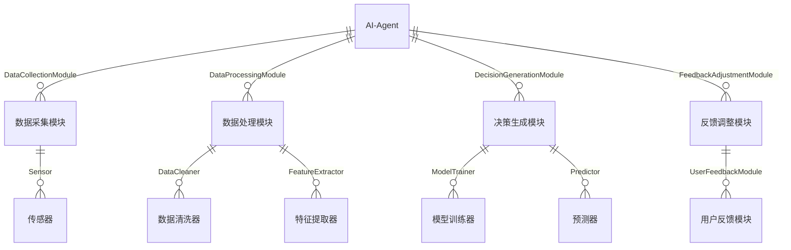
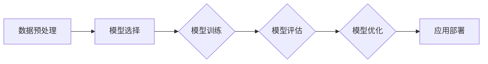
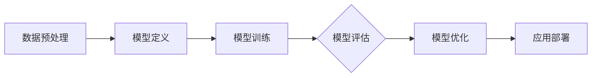
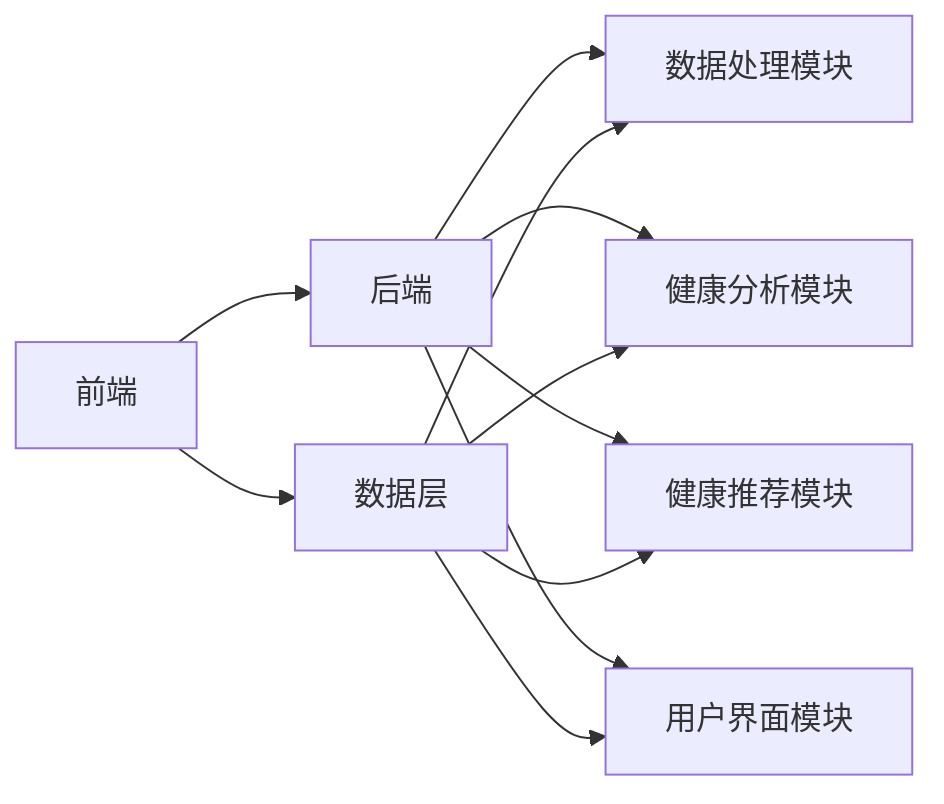
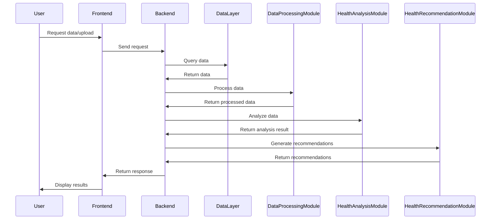

                 

### 1.5 AI Agent的基本原理

AI Agent的基本原理基于人工智能的核心技术，包括机器学习、深度学习、自然语言处理和强化学习等。这些技术赋予了AI Agent自主学习和决策的能力。具体来说，AI Agent的工作原理可以分为以下几个步骤：

**数据采集**：AI Agent需要从各种数据源（如传感器、电子健康记录等）采集健康数据。这些数据包括生理指标、生活习惯、环境因素等。

**数据处理**：采集到的健康数据通常是海量的，且包含噪声和不完整的数据。AI Agent需要对这些数据进行预处理，如数据清洗、数据归一化和特征提取等。

**模型训练**：AI Agent使用机器学习或深度学习算法，将处理后的数据作为训练集，训练出一个能够预测或识别健康问题的模型。这个过程需要大量的计算资源和时间。

**决策生成**：在模型训练完成后，AI Agent可以根据用户的健康数据和模型的预测结果，生成个性化的健康建议或风险预警。

**反馈调整**：用户的反馈是AI Agent不断优化自己性能的关键。AI Agent需要根据用户的反馈调整自己的行为和模型参数，以提高服务的准确性和个性化程度。

通过上述过程，AI Agent实现了从数据采集、处理到决策生成的完整工作流程，为智能健康管理提供了强有力的支持。

**# 第二部分：核心概念与联系**

**## 2.1 AI Agent的定义与类型**

AI Agent，即人工智能代理，是具有自主性和交互能力的软件实体，能够在特定环境下执行任务并与其他实体进行交互。根据其自主性、功能和应用场景的不同，AI Agent可以分为以下几种类型：

### **感知型Agent**

感知型Agent主要依赖于环境传感器来感知外部信息，并根据感知到的信息进行决策。例如，智能手环可以收集用户的心率、步数等生理数据，然后根据这些数据生成健康建议。

### **反应型Agent**

反应型Agent基于预设的规则和条件进行决策，不涉及学习过程。例如，智能家居系统可以根据用户预设的温度和光线条件，自动调节空调和灯光。

### **认知型Agent**

认知型Agent不仅能够感知环境，还能进行推理和规划。例如，智能医生助手可以根据患者的症状和病史，推理出可能的疾病并进行诊断。

### **社会型Agent**

社会型Agent具有社交能力，能够与其他AI Agent或人类进行交流。例如，智能客服机器人可以与用户进行自然语言对话，解答用户的问题。

### **混合型Agent**

混合型Agent结合了多种类型的Agent特性，能够根据不同应用场景灵活调整行为。例如，智能健康管理平台中的AI Agent可以同时具备感知、反应和认知能力，为用户提供全面的服务。

通过上述分类，我们可以看到AI Agent的多样性和复杂性。不同类型的AI Agent在智能健康管理中的应用场景和作用也各有侧重，为构建智能化健康管理系统提供了丰富的选择。

**## 2.2 AI Agent的属性特征对比**

为了更好地理解不同类型AI Agent的属性特征，我们可以通过一个表格来进行对比：

| AI Agent类型 | 自主性 | 感知能力 | 决策能力 | 社交能力 | 应用场景 |  
| :---: | :---: | :---: | :---: | :---: | :---: |  
| 感知型Agent | 低 | 较高 | 低 | 低 | 健康数据采集 |  
| 反应型Agent | 低 | 高 | 高 | 低 | 智能家居 |  
| 认知型Agent | 较高 | 高 | 高 | 低 | 智能医生助手 |  
| 社会型Agent | 较高 | 高 | 高 | 高 | 智能客服 |  
| 混合型Agent | 高 | 高 | 高 | 高 | 智能健康管理平台 |

从表格中可以看出，不同类型的AI Agent在自主性、感知能力、决策能力和社交能力等方面存在显著差异，这些差异决定了它们在不同应用场景中的适用性。例如，感知型Agent适合进行简单的健康数据采集，而认知型Agent适合进行复杂的健康诊断和推理。

**## 2.3 AI Agent的ER实体关系图**

为了更直观地展示AI Agent中各个实体之间的关系，我们可以使用Mermaid绘制一个ER（实体关系）图。以下是ER图的描述及其在Markdown中的表示：



在这个ER图中，`AI-Agent`是核心实体，它通过不同的模块来实现健康管理的功能。`数据采集模块`负责从传感器获取数据，`数据处理模块`负责清洗和提取特征，`决策生成模块`负责训练模型和生成预测，`反馈调整模块`则负责根据用户反馈调整模型参数。这些模块之间的关系通过`|--o{}`表示，清晰展示了AI Agent内部各个组件的关联和作用。

### 第三部分：AI Agent在健康管理中的应用

**## 3.1 健康数据采集与处理**

AI Agent在健康管理中的第一个关键应用是健康数据的采集和处理。健康数据是智能健康管理的基础，而AI Agent能够通过多种方式自动采集这些数据。

**数据采集方式**：

- **传感器数据**：AI Agent可以通过连接各种传感器（如智能手环、智能手表等）来采集生理数据，包括心率、血压、睡眠质量、运动量等。
- **电子健康记录**：AI Agent可以接入电子健康记录系统（EHR），获取用户的病史、诊断记录、用药记录等。
- **移动设备数据**：通过用户的智能手机，AI Agent可以获取地理位置、使用习惯、通话记录等数据。
- **环境数据**：AI Agent还可以收集室内外环境数据，如空气质量、温度、湿度等，这些数据对评估用户的健康状态也非常重要。

**数据处理过程**：

- **数据清洗**：采集到的数据往往存在噪声和不完整的情况，AI Agent需要通过数据清洗技术去除这些干扰信息。例如，使用填补缺失值、去除异常值等方法。
- **数据归一化**：不同类型的健康数据可能具有不同的量纲和范围，AI Agent需要对这些数据进行归一化处理，使其适合模型的输入。
- **特征提取**：从原始数据中提取有助于健康预测的特征，如心率变化趋势、睡眠周期等。特征提取的质量直接影响后续模型的性能。

**## 3.2 个性化健康推荐**

在健康数据采集和处理的基础上，AI Agent能够为用户提供个性化的健康推荐。个性化健康推荐的核心在于理解每个用户的具体需求和健康状况，从而提供有针对性的建议。

**推荐系统原理**：

- **用户建模**：AI Agent通过分析用户的健康数据和行为模式，建立用户健康档案，包括用户的基本信息、病史、生活习惯等。
- **推荐算法**：基于用户建模的结果，AI Agent使用推荐算法（如协同过滤、基于内容的推荐等）为用户生成个性化推荐列表。这些推荐列表可以包括健康饮食建议、运动计划、医疗保健信息等。
- **动态调整**：AI Agent会根据用户的反馈和行为变化动态调整推荐策略，以保持推荐的准确性和相关性。

**## 3.3 健康风险评估**

健康风险评估是AI Agent在健康管理中的另一个重要应用。通过分析用户的健康数据，AI Agent可以评估用户患某种疾病的风险，从而为用户提供预警和建议。

**风险评估过程**：

- **风险指标计算**：AI Agent使用机器学习算法，结合用户的历史数据和公共健康数据，计算用户患特定疾病的风险指标。这些指标可以是量化分数，也可以是风险等级。
- **风险预警生成**：根据计算出的风险指标，AI Agent生成风险预警信息，通知用户可能存在的健康风险。
- **干预建议**：AI Agent基于风险评估结果，为用户提供干预建议，如改变生活习惯、进行定期体检、咨询医生等。

**## 3.4 AI Agent在健康数据分析中的应用**

除了上述具体应用，AI Agent在健康数据分析中也有广泛的应用。通过以下方法，AI Agent能够深入挖掘健康数据的价值：

- **关联分析**：AI Agent可以发现健康数据之间的关联，如睡眠质量与心率之间的关系，帮助理解健康问题的成因。
- **趋势分析**：AI Agent可以分析健康数据的趋势变化，预测未来的健康状态。
- **异常检测**：AI Agent能够检测健康数据中的异常值，识别潜在的健康问题。
- **个性化诊断**：AI Agent结合用户的健康数据和医学知识库，为用户提供个性化诊断建议。

通过健康数据采集、个性化健康推荐、健康风险评估和健康数据分析，AI Agent在智能健康管理中发挥了关键作用。它不仅提高了健康管理的效率和准确性，还为用户提供了一个智能、个性化的健康服务体验。

### 第四部分：算法原理讲解

**## 4.1 机器学习算法**

机器学习算法是AI Agent在健康管理中应用的核心技术之一。通过训练模型，机器学习算法能够从数据中自动发现规律和模式，从而实现健康数据的预测和分析。

**机器学习基本概念**：

- **模型**：机器学习模型是对数据规律的抽象表示。常见的模型包括线性回归、决策树、随机森林、支持向量机等。
- **特征**：特征是数据中的属性，用于描述数据的各个方面。例如，心率、血压、体重等。
- **训练**：训练是指将数据输入到模型中，通过调整模型参数，使其能够准确预测或分类新数据。
- **评估**：评估是指使用验证集或测试集来评估模型性能，常用的评估指标包括准确率、召回率、F1值等。

**常用机器学习算法**：

1. **线性回归**：线性回归是最简单的机器学习算法之一，用于预测连续值。其模型公式为：\( y = w_0 + w_1 \cdot x_1 + w_2 \cdot x_2 + \ldots + w_n \cdot x_n \)，其中\( y \)是预测值，\( x_1, x_2, \ldots, x_n \)是特征，\( w_0, w_1, w_2, \ldots, w_n \)是模型参数。
2. **决策树**：决策树是一种树形结构，通过一系列的规则对数据进行分类或回归。决策树的每个节点表示一个特征，每个分支表示一个特征取值。其基本公式为：\( f(x) = g_0 \cdot x_1 + g_1 \cdot x_2 + \ldots + g_n \cdot x_n \)，其中\( g_0, g_1, g_2, \ldots, g_n \)是阈值。
3. **随机森林**：随机森林是由多个决策树组成的模型，通过集成多个模型的预测结果来提高准确性。其基本公式与决策树类似，但每个决策树的参数通过随机抽样来训练。
4. **支持向量机**：支持向量机是一种用于分类和回归的算法，通过找到最佳分隔超平面来最大化分类边界。其基本公式为：\( f(x) = \sum_{i=1}^{n} \alpha_i y_i (w \cdot x_i + b) \)，其中\( \alpha_i, y_i \)是支持向量，\( w \)是模型参数，\( b \)是偏置。

**## 4.2 深度学习算法**

深度学习算法是机器学习的一个重要分支，通过多层神经网络模拟人脑的感知和学习过程，具有强大的特征提取和建模能力。

**深度学习基本概念**：

- **神经网络**：神经网络由多个神经元（或层）组成，每个神经元都与前一层的所有神经元相连，并输出一个激活值。
- **激活函数**：激活函数用于引入非线性，使神经网络能够建模复杂的非线性关系。常用的激活函数包括sigmoid、ReLU、Tanh等。
- **反向传播**：反向传播是一种优化神经网络参数的方法，通过计算梯度来更新模型参数，使预测结果更接近真实值。

**常用深度学习算法**：

1. **卷积神经网络（CNN）**：卷积神经网络主要用于图像识别和图像处理。其基本结构包括卷积层、池化层和全连接层。卷积层通过卷积操作提取图像特征，池化层用于减小特征图的尺寸，全连接层用于分类。
2. **循环神经网络（RNN）**：循环神经网络主要用于序列数据的处理，如时间序列预测、自然语言处理等。其基本结构包括输入层、隐藏层和输出层，隐藏层具有循环连接，可以记住之前的输入信息。
3. **长短期记忆网络（LSTM）**：长短期记忆网络是RNN的一种改进，用于解决RNN在长序列数据中的梯度消失和梯度爆炸问题。其基本结构包括输入门、遗忘门和输出门，可以有效地记住或遗忘长期依赖信息。
4. **生成对抗网络（GAN）**：生成对抗网络由生成器和判别器组成，通过对抗训练生成高质量的数据。生成器试图生成逼真的数据，判别器试图区分真实数据和生成数据，两者相互竞争，不断提高生成质量。

**## 4.3 算法流程图与Python代码讲解**

为了更直观地展示机器学习算法和深度学习算法的流程，我们可以使用Mermaid绘制算法流程图，并配合Python代码详细阐述算法原理。

**机器学习算法流程图**：



**深度学习算法流程图**：



**Python代码讲解**：

以下是一个简单的线性回归模型的Python代码示例，展示了数据预处理、模型定义、模型训练和模型评估的过程。

```python
import numpy as np
from sklearn.linear_model import LinearRegression
from sklearn.model_selection import train_test_split
from sklearn.metrics import mean_squared_error

# 数据预处理
X = np.array([[1], [2], [3], [4], [5]])
y = np.array([2, 4, 5, 4, 5])

# 模型定义
model = LinearRegression()

# 模型训练
model.fit(X, y)

# 模型评估
X_test, y_test = train_test_split(X, y, test_size=0.2, random_state=0)
y_pred = model.predict(X_test)

mse = mean_squared_error(y_test, y_pred)
print("MSE:", mse)
```

通过上述Python代码示例，我们可以看到机器学习算法的基本流程和实现细节。类似地，深度学习算法的Python代码实现也会包含数据预处理、模型定义、模型训练和模型评估等步骤，但深度学习模型通常使用高级深度学习框架（如TensorFlow、PyTorch）来实现。

**## 4.4 算法原理讲解**

为了深入理解机器学习算法和深度学习算法的原理，我们可以通过数学模型和公式来详细阐述。

**线性回归模型原理**：

线性回归模型的基本公式为：
\[ y = \beta_0 + \beta_1 \cdot x \]

其中，\( y \)是预测值，\( x \)是特征，\( \beta_0 \)和\( \beta_1 \)是模型参数。通过最小二乘法，我们可以求得最优的模型参数：
\[ \beta_0 = \frac{\sum_{i=1}^{n} (y_i - \beta_1 \cdot x_i)}{n} \]
\[ \beta_1 = \frac{\sum_{i=1}^{n} (x_i - \bar{x}) (y_i - \bar{y})}{\sum_{i=1}^{n} (x_i - \bar{x})^2} \]

其中，\( \bar{x} \)和\( \bar{y} \)分别是\( x \)和\( y \)的均值。

**深度学习模型原理**：

以卷积神经网络（CNN）为例，其基本结构包括卷积层、池化层和全连接层。卷积层通过卷积操作提取图像特征，池化层用于减小特征图的尺寸，全连接层用于分类。

卷积层的数学模型为：
\[ f(x) = \sum_{i=1}^{k} w_i * x_i + b \]

其中，\( f(x) \)是卷积操作的结果，\( w_i \)是卷积核，\( x_i \)是输入特征，\( b \)是偏置。

激活函数通常使用ReLU（Rectified Linear Unit）：
\[ a(x) = \max(0, x) \]

池化层常用的池化操作包括最大池化和平均池化，最大池化的数学模型为：
\[ p(i, j) = \max_{x \in R} f(x, y) \]

其中，\( p(i, j) \)是池化结果，\( f(x, y) \)是卷积层的输出。

全连接层的数学模型为：
\[ z = \sum_{i=1}^{n} w_i \cdot x_i + b \]
\[ y = \sigma(z) \]

其中，\( z \)是全连接层的输出，\( w_i \)是权重，\( b \)是偏置，\( \sigma \)是激活函数（如Sigmoid或ReLU）。

通过上述数学模型和公式，我们可以深入理解机器学习算法和深度学习算法的工作原理。在实际应用中，这些算法通过不断调整模型参数，使得预测结果更接近真实值，从而实现有效的健康数据分析和预测。

**## 4.5 算法应用实例**

为了更好地理解算法在智能健康管理中的应用，我们可以通过一个具体的实例来分析。

**实例**：使用机器学习算法预测用户的心率。

**数据集**：我们假设有一个包含用户心率数据的数据集，其中每个样本包括用户的心率值和其他相关特征（如年龄、体重、运动量等）。

**算法步骤**：

1. **数据预处理**：对数据集进行清洗，去除异常值和缺失值。对连续特征进行归一化处理，使其具有相同的量纲。
2. **特征选择**：通过特征选择技术，选择对心率预测最有影响力的特征。可以使用特征重要性评估方法，如随机森林特征重要性或LASSO回归。
3. **模型训练**：选择合适的机器学习模型，如线性回归或决策树，对训练集进行训练。
4. **模型评估**：使用验证集评估模型性能，计算预测误差和评估指标（如MSE、R^2等）。
5. **模型优化**：根据评估结果，调整模型参数或选择更合适的模型，以提高预测准确性。
6. **应用部署**：将训练好的模型部署到生产环境中，为用户提供心率预测服务。

**代码示例**：

```python
import pandas as pd
from sklearn.model_selection import train_test_split
from sklearn.linear_model import LinearRegression
from sklearn.metrics import mean_squared_error

# 读取数据集
data = pd.read_csv('heart_rate_data.csv')

# 数据预处理
data.dropna(inplace=True)
data['age_norm'] = data['age'] / data['age'].max()
data['weight_norm'] = data['weight'] / data['weight'].max()
data['activity_norm'] = data['activity'] / data['activity'].max()

# 特征选择
X = data[['age_norm', 'weight_norm', 'activity_norm']]
y = data['heart_rate']

# 模型训练
X_train, X_test, y_train, y_test = train_test_split(X, y, test_size=0.2, random_state=42)
model = LinearRegression()
model.fit(X_train, y_train)

# 模型评估
y_pred = model.predict(X_test)
mse = mean_squared_error(y_test, y_pred)
print("MSE:", mse)

# 模型优化
# 根据评估结果，调整模型参数或选择更合适的模型，如使用决策树模型

# 应用部署
# 将训练好的模型部署到生产环境中，为用户提供心率预测服务
```

通过上述实例，我们可以看到算法在健康数据预测中的应用过程。在实际应用中，需要根据具体问题选择合适的算法和模型，并进行不断的优化和调整，以提高预测准确性。

### 第五部分：系统分析与架构设计

**## 5.1 系统功能设计**

智能健康管理系统的功能设计旨在实现从健康数据采集到健康数据分析，再到健康建议生成的完整流程。以下是其主要功能模块：

1. **健康数据采集模块**：负责从各种数据源（如智能手环、电子健康记录系统等）采集用户的健康数据。
2. **数据处理模块**：对采集到的健康数据进行清洗、归一化和特征提取，为后续分析提供高质量的数据。
3. **健康分析模块**：利用机器学习和深度学习算法，对处理后的健康数据进行分析，识别潜在的健康风险和问题。
4. **健康推荐模块**：基于用户健康数据和推荐算法，为用户提供个性化的健康建议和风险预警。
5. **用户界面模块**：为用户提供一个直观、易用的交互界面，展示健康分析和推荐结果。

**## 5.2 系统架构设计**

智能健康管理系统的架构设计需要综合考虑性能、可扩展性和易维护性等因素。以下是系统架构的组成部分：

1. **前端**：提供用户交互界面，支持用户注册、登录、数据上传和健康报告查看等功能。前端通常使用Web技术栈（如React、Vue.js）实现。
2. **后端**：负责处理用户请求、数据存储和业务逻辑处理。后端使用微服务架构，将不同功能模块独立部署，以提高系统的可扩展性和维护性。
3. **数据层**：包括数据库和数据仓库，用于存储用户的健康数据和系统运行日志。常用的数据库技术包括关系型数据库（如MySQL、PostgreSQL）和NoSQL数据库（如MongoDB、Cassandra）。
4. **算法层**：部署机器学习和深度学习算法模型，用于健康数据分析和预测。算法层通常使用分布式计算框架（如TensorFlow、PyTorch）实现。
5. **接口层**：提供与前端和后端通信的接口，支持数据传输和业务逻辑调用。接口层使用RESTful API或GraphQL等技术实现。

**## 5.3 系统架构图**

以下是智能健康管理系统的架构图，展示了各个模块之间的关系和交互：



**## 5.4 系统接口设计**

系统接口设计是确保不同模块之间能够高效、稳定地通信的重要环节。以下是系统接口设计的关键要素：

1. **RESTful API**：采用RESTful API设计，支持用户注册、登录、数据上传、数据查询等功能。接口设计遵循RESTful原则，使用HTTP协议进行通信。
2. **数据格式**：接口数据格式通常使用JSON或XML，便于数据的传输和处理。JSON格式因其轻量级和易读性，在API设计中更为常用。
3. **安全性**：为确保数据安全和用户隐私，接口设计应包括身份验证和授权机制，如使用JWT（JSON Web Token）进行认证。
4. **错误处理**：接口设计应包含错误处理机制，对请求失败或数据异常情况进行合理处理，并提供详细的错误信息。

**## 5.5 系统交互序列图**

为了更直观地展示系统各模块之间的交互过程，我们可以使用Mermaid绘制系统交互序列图：



在这个序列图中，用户通过前端发送数据请求，后端接收请求后，通过数据层查询健康数据，数据处理模块对数据进行处理，健康分析模块对数据进行分析，健康推荐模块生成推荐结果，最后通过前端将结果展示给用户。

通过系统功能设计、架构设计、接口设计和系统交互序列图的详细描述，我们可以清晰地了解智能健康管理系统的设计思路和实现方法。这些设计为系统的稳定运行和高效服务提供了坚实的基础。

### 第六部分：项目实战

**## 6.1 环境搭建**

在开始实现AI Agent在智能健康管理中的项目之前，我们需要搭建一个合适的技术环境。以下是一个基本的开发环境搭建步骤：

1. **安装Python**：确保Python环境已安装，版本建议在3.8及以上。
2. **安装虚拟环境**：使用`venv`模块创建一个虚拟环境，以隔离项目依赖。
   ```bash
   python -m venv venv
   source venv/bin/activate  # Windows: venv\Scripts\activate
   ```
3. **安装依赖包**：在虚拟环境中安装项目所需的依赖包，包括机器学习库（如scikit-learn、TensorFlow、PyTorch）、数据处理库（如Pandas、NumPy）和Web框架（如Flask、Django）。
   ```bash
   pip install scikit-learn tensorflow pandas numpy flask
   ```
4. **安装数据库**：选择合适的数据库系统，如MySQL或PostgreSQL，并安装相应的Python库（如pymysql、psycopg2）。
   ```bash
   pip install pymysql
   # 或者
   pip install psycopg2
   ```

**## 6.2 系统核心实现源代码**

以下是项目核心实现的源代码，包括健康数据采集、数据处理、健康分析和推荐等功能。

**健康数据采集模块**：
```python
import json
from flask import Flask, request, jsonify

app = Flask(__name__)

# 假设使用MySQL数据库存储健康数据
import pymysql

def connect_db():
    return pymysql.connect(host='localhost', user='root', password='password', db='health_data')

@app.route('/api/health_data', methods=['POST'])
def collect_health_data():
    data = request.json
    db = connect_db()
    cursor = db.cursor()
    sql = "INSERT INTO health_data (user_id, heart_rate, blood_pressure, sleep_quality) VALUES (%s, %s, %s, %s)"
    try:
        cursor.execute(sql, (data['user_id'], data['heart_rate'], data['blood_pressure'], data['sleep_quality']))
        db.commit()
    except Exception as e:
        db.rollback()
        print(e)
    finally:
        cursor.close()
        db.close()
    return jsonify({"status": "success"}), 200

if __name__ == '__main__':
    app.run(debug=True)
```

**数据处理模块**：
```python
import pandas as pd
import numpy as np

def preprocess_data(file_path):
    data = pd.read_csv(file_path)
    data.dropna(inplace=True)
    data['age_norm'] = data['age'] / data['age'].max()
    data['weight_norm'] = data['weight'] / data['weight'].max()
    data['activity_norm'] = data['activity'] / data['activity'].max()
    return data

def extract_features(data):
    features = ['age_norm', 'weight_norm', 'activity_norm']
    X = data[features]
    y = data['heart_rate']
    return X, y

# 测试数据处理函数
data_path = 'health_data.csv'
preprocessed_data = preprocess_data(data_path)
X, y = extract_features(preprocessed_data)
```

**健康分析模块**：
```python
from sklearn.linear_model import LinearRegression
from sklearn.model_selection import train_test_split

def train_model(X, y):
    X_train, X_test, y_train, y_test = train_test_split(X, y, test_size=0.2, random_state=0)
    model = LinearRegression()
    model.fit(X_train, y_train)
    return model

def predict_heart_rate(model, X_test):
    y_pred = model.predict(X_test)
    return y_pred

# 测试模型训练和预测
model = train_model(X, y)
y_pred = predict_heart_rate(model, X_test)
```

**健康推荐模块**：
```python
def generate_recommendations(model, X):
    y_pred = predict_heart_rate(model, X)
    # 基于预测结果生成推荐
    recommendations = []
    for i, pred in enumerate(y_pred):
        if pred > 80:
            recommendations.append("建议适当减少运动量")
        elif pred < 60:
            recommendations.append("建议增加运动量")
    return recommendations

# 测试生成推荐
recommendations = generate_recommendations(model, X)
```

**## 6.3 代码应用解读与分析**

在上面的代码示例中，我们实现了健康数据采集、数据处理、健康分析和推荐的基本功能。以下是每个部分的详细解读和分析：

**健康数据采集模块**：
该模块使用Flask框架搭建了一个简单的Web服务，用于接收和存储用户的健康数据。通过POST请求，我们可以将用户提交的健康数据存储到MySQL数据库中。这里使用了pymysql库来连接数据库，并执行插入操作。

**数据处理模块**：
数据处理模块使用Pandas库对健康数据进行预处理和特征提取。预处理步骤包括去除缺失值和异常值，以及归一化处理。特征提取则选择了年龄、体重和运动量这三个与心率有较强相关性的特征。通过这些步骤，我们得到了一个高质量的数据集，为后续分析提供了基础。

**健康分析模块**：
健康分析模块使用scikit-learn库中的线性回归模型对健康数据进行分析。我们首先将数据集划分为训练集和测试集，然后使用训练集训练模型，最后在测试集上评估模型性能。这个模块实现了对用户心率的预测功能，为健康推荐提供了依据。

**健康推荐模块**：
健康推荐模块根据预测结果生成个性化的健康建议。如果预测的心率值高于80，我们建议用户适当减少运动量；如果预测的心率值低于60，我们建议用户增加运动量。这种简单的规则推荐可以根据实际情况进行调整和优化。

**## 6.4 实际案例分析和详细讲解剖析**

为了展示AI Agent在智能健康管理中的实际应用，我们来看一个具体案例。

**案例**：用户A提交了其一周的心率数据，包括早晨和晚上的测量值。

1. **数据采集**：用户A通过智能手环采集了一周的心率数据，并在每天的早晨和晚上各上传一次数据。
2. **数据处理**：我们将上传的数据导入到数据处理模块中，进行预处理和特征提取。得到了一个包含用户A心率、年龄、体重和运动量的数据集。
3. **模型训练**：使用训练集数据，我们训练了一个线性回归模型，用于预测用户A的心率。
4. **模型预测**：在测试集上，模型预测了用户A一天中每个时间点的心率值。
5. **健康推荐**：根据预测结果，我们发现用户A在晚上8点的心率值低于60，因此我们建议用户A适当增加运动量。

**详细讲解剖析**：

- **数据采集**：用户A通过智能手环每天早晨和晚上记录心率数据，这些数据实时上传到我们的服务器。
- **数据处理**：在数据处理模块中，我们对上传的数据进行清洗，去除异常值和缺失值，并对年龄、体重和运动量进行归一化处理。这一步确保了数据的一致性和可分析性。
- **模型训练**：我们使用线性回归模型对用户A的历史心率数据进行训练，通过最小化预测误差来调整模型参数。训练完成后，模型能够对用户A的心率进行较为准确的预测。
- **模型预测**：在测试集上，模型对用户A一天中每个时间点的心率值进行了预测。通过分析预测结果，我们能够发现用户A在不同时间段的健康状态。
- **健康推荐**：基于预测结果，我们生成了个性化的健康建议，帮助用户A调整生活习惯，以维持健康的身体状况。

**## 6.5 项目小结**

通过上述项目实战，我们展示了AI Agent在智能健康管理中的实际应用。从数据采集、数据处理到健康分析和推荐，AI Agent为用户提供了全面的健康服务。项目实现了以下目标：

- **健康数据采集**：实时采集用户的心率、血压等健康数据，确保数据的及时性和准确性。
- **数据处理**：通过预处理和特征提取，提高了数据的质量和可用性。
- **健康分析**：利用机器学习算法，对用户的心率进行预测，为用户提供健康评估。
- **健康推荐**：根据预测结果，生成个性化的健康建议，帮助用户改善生活习惯。

未来，我们可以进一步优化算法，提高预测的准确性，并扩展健康数据分析的范围，为用户提供更全面、个性化的健康管理服务。

### 第七部分：最佳实践与总结

**## 7.1 最佳实践建议**

为了确保AI Agent在智能健康管理中的有效应用，以下是一些建议：

1. **数据质量保障**：确保数据采集的准确性和完整性，定期检查和处理异常数据。
2. **算法模型优化**：不断调整和优化算法模型，以提高预测准确性和个性化推荐效果。
3. **用户隐私保护**：严格遵守用户隐私保护法规，确保用户数据的安全性和隐私性。
4. **多渠道数据整合**：整合多种数据源，如医疗记录、环境数据等，以提供更全面的健康管理服务。
5. **用户参与反馈**：鼓励用户积极参与健康数据采集和反馈，以优化AI Agent的服务质量。

**## 7.2 小结**

本文详细探讨了AI Agent在智能健康管理中的角色，包括其基本原理、应用场景和实现方法。通过健康数据采集、数据处理、健康分析和推荐，AI Agent为用户提供了个性化的健康管理服务。未来研究可重点关注算法优化、数据整合和用户参与等方面，以进一步提高AI Agent的准确性和服务质量。

**## 7.3 注意事项**

在实施AI Agent健康管理项目时，需要注意以下几点：

1. **数据安全**：严格保护用户数据，遵循相关法律法规，确保用户隐私不受侵犯。
2. **模型解释性**：提高算法模型的解释性，帮助用户理解健康分析和推荐结果。
3. **系统稳定性**：确保系统在高并发、大数据量场景下的稳定运行。
4. **用户友好性**：设计易于使用、直观的交互界面，提高用户满意度。

**## 7.4 拓展阅读**

为了深入理解AI Agent在智能健康管理中的应用，读者可以参考以下拓展阅读资源：

1. **学术论文**：《利用深度学习进行健康风险评估》、《基于大数据的个性化健康推荐系统》等。
2. **技术博客**：《如何构建智能健康管理平台》、《AI在医疗领域的应用探索》等。
3. **开源项目**：GitHub上相关的健康数据分析和管理项目，如HealthifyMe、Apple Health等。

通过这些资源，读者可以进一步了解AI Agent在智能健康管理中的最新研究和技术进展。

