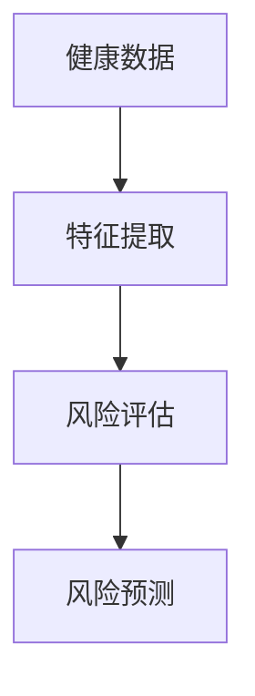

                 

# AI Agent在智能健康风险评估中的角色

## 关键词

- AI Agent
- 智能健康风险评估
- 数据收集与预处理
- 特征提取与选择
- 模型训练与优化

## 摘要

本文深入探讨了AI Agent在智能健康风险评估中的应用。首先，我们介绍了问题背景和核心概念，包括智能健康风险评估的基本概念、数学模型和关键技术。接着，我们详细讲解了AI Agent的定义、特点、与传统智能系统的区别及其发展历程。随后，本文重点阐述了AI Agent在智能健康风险评估中的技术实现，包括数据收集与预处理、特征提取与选择、模型训练与优化、模型评估与验证以及模型部署与应用。最后，我们通过案例研究和最佳实践，总结了AI Agent在智能健康风险评估中的挑战与未来趋势。

## 第一部分: 引言

### 第1章: 问题背景与核心概念

#### 1.1 问题背景

随着全球人口老龄化和慢性疾病的增加，智能健康风险评估变得尤为重要。智能健康风险评估可以帮助医疗机构和个人更好地了解健康状况，提前预防和干预疾病。然而，传统的健康风险评估方法往往依赖于经验规则和手动分析，存在主观性强、效率低下等问题。

#### 1.2 问题描述

智能健康风险评估的核心问题是：如何利用人工智能技术，对大量健康数据进行高效处理和分析，从而准确评估个体的健康状况，提供个性化的健康建议。

#### 1.3 问题解决

为了解决上述问题，我们需要引入AI Agent，它是一种能够自主学习和执行任务的智能系统。AI Agent在智能健康风险评估中具有以下优势：

1. **自动化处理**：AI Agent可以自动化处理大量的健康数据，大大提高了评估效率。
2. **个性化推荐**：AI Agent可以根据个体的健康状况和需求，提供个性化的健康建议。
3. **实时更新**：AI Agent可以实时更新健康状况评估模型，确保评估结果的准确性。

#### 1.4 边界与外延

智能健康风险评估的边界包括数据收集、处理和分析等环节。外延则涉及个体健康状况、疾病预测、健康干预等多个方面。

#### 1.5 概念结构与核心要素组成

智能健康风险评估的概念结构包括以下几个核心要素：

1. **健康数据**：包括个体健康信息、生物指标、生活习惯等。
2. **评估模型**：基于机器学习和数据挖掘技术，对健康数据进行处理和分析。
3. **评估结果**：包括个体健康状况评估、疾病风险预测和健康建议等。

#### 1.6 核心概念与联系

核心概念包括健康数据、评估模型、评估结果和AI Agent。这些概念之间的联系如下：

- 健康数据是评估的基础，AI Agent负责收集和处理数据。
- 评估模型基于数据进行分析，生成评估结果。
- 评估结果用于指导健康干预和个性化建议。

以下是核心概念与联系的Mermaid ER实体关系图：

```mermaid
erDiagram
  HealthData ||--|{ AI Agent } : processes
  AI Agent ||--|{ Assessment Model } : generates
  Assessment Model ||--|{ Assessment Result } : based on
  HealthData ||--|{ Assessment Result } : contributes to
```

### 第2章: AI Agent基础

#### 2.1 AI Agent的定义与类型

AI Agent是一种基于人工智能技术的智能系统，能够自主感知环境、制定决策和执行任务。根据功能和应用场景，AI Agent可以分为以下几种类型：

1. **感知型AI Agent**：负责收集和处理环境信息。
2. **决策型AI Agent**：负责分析数据并制定决策。
3. **执行型AI Agent**：负责执行具体任务。

#### 2.2 AI Agent的核心特点

AI Agent具有以下几个核心特点：

1. **自主性**：AI Agent能够自主感知环境、制定决策和执行任务。
2. **适应性**：AI Agent可以根据环境和任务需求，自主调整行为和策略。
3. **学习能力**：AI Agent能够从数据中学习，不断优化性能。

#### 2.3 AI Agent与传统智能系统的区别

传统智能系统通常依赖于预定义的规则和模型，而AI Agent具有以下区别：

1. **灵活性**：AI Agent能够自主适应环境和任务需求，而传统系统通常缺乏这种灵活性。
2. **自主学习**：AI Agent能够从数据中学习，不断优化性能，而传统系统需要手动调整规则和模型。

#### 2.4 AI Agent的发展历程与现状

AI Agent的发展历程可以分为以下几个阶段：

1. **早期研究**：20世纪50年代至70年代，人工智能领域兴起，研究者开始探讨智能代理的概念。
2. **技术突破**：20世纪80年代至90年代，机器学习和数据挖掘技术取得突破，为AI Agent的发展提供了技术支持。
3. **广泛应用**：21世纪初至今，AI Agent在各个领域得到广泛应用，成为人工智能的重要组成部分。

#### 2.5 AI Agent在智能健康风险评估中的应用潜力

AI Agent在智能健康风险评估中具有巨大应用潜力，主要体现在以下几个方面：

1. **数据挖掘**：AI Agent能够高效处理大量健康数据，挖掘潜在的健康风险因素。
2. **个性化评估**：AI Agent可以根据个体特征和需求，提供个性化的健康评估和干预建议。
3. **实时监控**：AI Agent可以实时监测健康状况，及时预警潜在的健康风险。

### 第3章: 智能健康风险评估原理

#### 3.1 智能健康风险评估的基本概念

智能健康风险评估是一种利用人工智能技术对个体健康状况进行评估的方法。它包括以下几个基本概念：

1. **健康数据**：包括个体健康信息、生物指标、生活习惯等。
2. **评估模型**：基于机器学习和数据挖掘技术，对健康数据进行处理和分析。
3. **评估结果**：包括个体健康状况评估、疾病风险预测和健康建议等。

#### 3.2 智能健康风险评估的数学模型

智能健康风险评估的数学模型主要包括以下几个方面：

1. **特征提取**：通过数据挖掘技术，从健康数据中提取关键特征。
2. **风险评估**：利用机器学习算法，对特征进行分类或回归分析，评估个体的健康状况。
3. **风险预测**：基于风险评估结果，预测个体未来患病风险。

以下是智能健康风险评估的数学模型Mermaid流程图：



#### 3.3 智能健康风险评估的关键技术

智能健康风险评估的关键技术包括：

1. **数据挖掘**：包括关联规则挖掘、分类算法、聚类算法等。
2. **机器学习**：包括支持向量机、决策树、神经网络等。
3. **预测分析**：包括时间序列预测、回归分析、生存分析等。

#### 3.4 智能健康风险评估的应用场景

智能健康风险评估的应用场景包括：

1. **疾病预测**：通过分析健康数据，预测个体未来患病风险。
2. **健康干预**：根据评估结果，提供个性化的健康干预建议。
3. **健康监控**：实时监测个体健康状况，及时发现潜在的健康风险。

### 第4章: AI Agent在智能健康风险评估中的技术实现

#### 4.1 数据收集与预处理

AI Agent在智能健康风险评估中的第一步是数据收集与预处理。数据收集包括以下几个方面：

1. **健康数据**：包括电子病历、体检报告、生活习惯等。
2. **生物指标**：包括血压、血糖、心率等生理指标。

数据预处理包括以下步骤：

1. **数据清洗**：去除无效数据、重复数据和噪声数据。
2. **数据归一化**：将不同量纲的数据进行归一化处理。
3. **特征选择**：选择与评估目标相关的特征。

以下是一个简单的Python代码示例，用于数据清洗和归一化：

```python
import pandas as pd
from sklearn.preprocessing import MinMaxScaler

# 加载数据
data = pd.read_csv('health_data.csv')

# 数据清洗
data = data.dropna()

# 数据归一化
scaler = MinMaxScaler()
data_normalized = scaler.fit_transform(data)
```

#### 4.2 特征提取与选择

特征提取是智能健康风险评估的关键步骤。特征提取的目标是从原始数据中提取有用的信息，以便用于模型训练和评估。

1. **统计特征**：如平均值、标准差、方差等。
2. **文本特征**：如词频、词向量化等。

特征选择的方法包括：

1. **过滤式特征选择**：基于特征的重要性进行选择。
2. **包裹式特征选择**：结合模型训练结果进行特征选择。

以下是一个简单的Python代码示例，用于特征提取和选择：

```python
from sklearn.feature_selection import SelectKBest
from sklearn.feature_selection import f_classif

# 特征提取
X = data[['blood_pressure', 'glucose', 'heart_rate']]
y = data['disease_label']

# 特征选择
selector = SelectKBest(f_classif, k=3)
X_selected = selector.fit_transform(X, y)
```

#### 4.3 模型训练与优化

模型训练是智能健康风险评估的核心步骤。常用的模型训练方法包括：

1. **监督学习**：如支持向量机、决策树、随机森林等。
2. **无监督学习**：如聚类、降维等。

模型优化包括以下几个方面：

1. **超参数调整**：通过交叉验证等方法，调整模型参数。
2. **集成学习**：结合多个模型，提高预测性能。

以下是一个简单的Python代码示例，用于模型训练和优化：

```python
from sklearn.ensemble import RandomForestClassifier
from sklearn.model_selection import GridSearchCV

# 模型训练
model = RandomForestClassifier()

# 模型优化
param_grid = {'n_estimators': [100, 200], 'max_depth': [10, 20]}
grid_search = GridSearchCV(model, param_grid, cv=5)
grid_search.fit(X_selected, y)

# 最优模型
best_model = grid_search.best_estimator_
```

#### 4.4 模型评估与验证

模型评估是智能健康风险评估的重要环节。常用的模型评估方法包括：

1. **准确率**：预测正确的样本数与总样本数的比值。
2. **召回率**：预测正确的正样本数与实际正样本数的比值。
3. **F1分数**：准确率的调和平均值。

模型验证的方法包括：

1. **交叉验证**：将数据集划分为多个子集，依次进行训练和验证。
2. **时间序列验证**：将数据按照时间顺序划分，分别进行训练和验证。

以下是一个简单的Python代码示例，用于模型评估和验证：

```python
from sklearn.metrics import accuracy_score
from sklearn.model_selection import TimeSeriesSplit

# 模型评估
y_pred = best_model.predict(X_selected)

accuracy = accuracy_score(y, y_pred)
print(f"Accuracy: {accuracy}")

# 模型验证
tscv = TimeSeriesSplit(n_splits=5)
for train_index, test_index in tscv.split(X_selected):
    X_train, X_test = X_selected[train_index], X_selected[test_index]
    y_train, y_test = y[train_index], y[test_index]
    
    best_model.fit(X_train, y_train)
    y_pred = best_model.predict(X_test)
    
    accuracy = accuracy_score(y_test, y_pred)
    print(f"Accuracy: {accuracy}")
```

#### 4.5 模型部署与应用

模型部署是将训练好的模型应用到实际场景中的过程。模型部署包括以下几个方面：

1. **模型服务**：将模型部署到服务器或云端，提供在线服务。
2. **系统集成**：将模型集成到医疗信息系统或其他应用系统中。

以下是一个简单的Python代码示例，用于模型部署：

```python
from flask import Flask, request, jsonify

app = Flask(__name__)

@app.route('/predict', methods=['POST'])
def predict():
    data = request.get_json()
    X = scaler.transform([data['features']])
    y_pred = best_model.predict(X)
    return jsonify({'disease_label': y_pred[0]})

if __name__ == '__main__':
    app.run(host='0.0.0.0', port=5000)
```

### 第5章: 案例研究

#### 5.1 案例一：某大型医疗机构智能健康风险评估系统

某大型医疗机构采用AI Agent构建了智能健康风险评估系统，用于为患者提供个性化的健康评估和干预建议。系统主要包括以下几个模块：

1. **数据收集模块**：负责收集患者的电子病历、体检报告和生活习惯等数据。
2. **数据处理模块**：负责对数据进行清洗、归一化和特征提取。
3. **评估模块**：基于机器学习算法，对患者数据进行评估，预测患者未来患病风险。
4. **推荐模块**：根据评估结果，为患者提供个性化的健康干预建议。

系统采用Flask框架搭建，使用Python编程语言。通过API接口，将模型部署到云端，提供在线服务。

#### 5.2 案例二：某健康科技公司智能健康风险评估平台

某健康科技公司开发了一款智能健康风险评估平台，旨在为个人用户提供全面的健康评估和干预建议。平台主要包括以下几个功能：

1. **健康数据收集**：通过移动应用和网站，收集用户的生活习惯、运动数据等。
2. **健康风险评估**：基于机器学习算法，对用户数据进行评估，预测未来患病风险。
3. **健康干预建议**：根据评估结果，为用户提供个性化的健康干预建议。
4. **健康报告生成**：生成详细的健康报告，供用户查看。

平台采用React框架搭建，使用JavaScript编程语言。通过API接口，将模型部署到云端，提供在线服务。

#### 5.3 案例三：某智能健康风险评估创业公司

某智能健康风险评估创业公司专注于开发智能健康风险评估解决方案，为客户提供定制化的健康风险评估服务。公司主要包括以下几个业务模块：

1. **数据收集与处理**：为客户提供数据收集和处理服务，确保数据质量。
2. **评估模型开发**：基于客户的业务需求，开发个性化的评估模型。
3. **健康干预建议**：根据评估结果，为客户提供专业的健康干预建议。
4. **培训与支持**：为客户提供技术培训和支持服务，确保系统正常运行。

公司采用Java编程语言，结合Spring Boot框架，搭建系统架构。通过API接口，将模型部署到云端，提供在线服务。

### 第6章: 挑战与未来趋势

#### 6.1 智能健康风险评估面临的挑战

智能健康风险评估在发展过程中面临以下几个挑战：

1. **数据隐私与安全**：健康数据涉及个人隐私，如何确保数据安全和隐私保护是一个重要问题。
2. **算法透明性与可解释性**：传统的黑箱模型难以解释，如何提高算法的透明性和可解释性是一个挑战。
3. **数据质量和可靠性**：健康数据的准确性和可靠性直接影响评估结果的准确性。

#### 6.2 AI Agent技术的未来发展

AI Agent技术在智能健康风险评估领域具有广阔的发展前景，未来的发展方向包括：

1. **模型解释性**：通过开发可解释的AI模型，提高评估结果的透明性和可解释性。
2. **多模态数据融合**：结合不同类型的数据，如医疗影像、生物信号等，提高评估的准确性。
3. **个性化推荐**：通过深度学习和强化学习技术，为用户提供更个性化的健康建议。

#### 6.3 智能健康风险评估的应用前景

智能健康风险评估在医疗、健康、保险等领域具有广泛的应用前景，未来的发展趋势包括：

1. **远程健康监测**：通过物联网技术和AI Agent，实现远程健康监测和预警。
2. **个性化健康管理**：基于个体健康数据，提供个性化的健康管理服务。
3. **智慧医疗**：通过AI Agent，实现智慧医疗诊断、治疗和康复。

#### 6.4 智能健康风险评估的政策与法规

智能健康风险评估的发展离不开政策与法规的支持，未来的政策与法规将包括：

1. **数据隐私保护**：制定相关法规，确保健康数据的隐私和安全。
2. **算法监管**：加强对AI算法的监管，确保评估结果的公平性和准确性。
3. **行业标准**：制定统一的智能健康风险评估标准和规范，促进行业健康发展。

### 第7章: 最佳实践与小结

#### 7.1 最佳实践 tips

为了确保智能健康风险评估的效果，以下是一些最佳实践：

1. **数据质量控制**：确保数据的准确性和完整性，去除噪声数据和异常值。
2. **特征选择**：选择与评估目标高度相关的特征，提高模型的预测性能。
3. **模型解释性**：开发可解释的AI模型，提高评估结果的透明度和可信度。
4. **个性化推荐**：结合个体特征和需求，提供个性化的健康建议。

#### 7.2 注意事项

在实施智能健康风险评估时，需要注意以下几点：

1. **数据隐私**：确保健康数据的隐私和安全，遵循相关法律法规。
2. **算法公平性**：避免算法偏见，确保评估结果的公平性。
3. **模型更新**：定期更新评估模型，确保评估结果的准确性。

#### 7.3 拓展阅读

以下是一些相关的拓展阅读资料：

1. **《智能健康风险评估技术与应用》**：详细介绍智能健康风险评估的技术原理和应用案例。
2. **《深度学习与医疗大数据》**：探讨深度学习技术在医疗大数据分析中的应用。
3. **《人工智能在医疗领域的应用与发展》**：分析人工智能在医疗领域的应用前景和发展趋势。

## 作者信息

作者：AI天才研究院/AI Genius Institute & 禅与计算机程序设计艺术 /Zen And The Art of Computer Programming

---

本文详细介绍了AI Agent在智能健康风险评估中的应用，包括问题背景、核心概念、原理讲解、技术实现、应用案例、挑战与未来趋势以及最佳实践等。通过本文的阅读，读者可以全面了解智能健康风险评估的相关知识，为实际应用提供指导。

