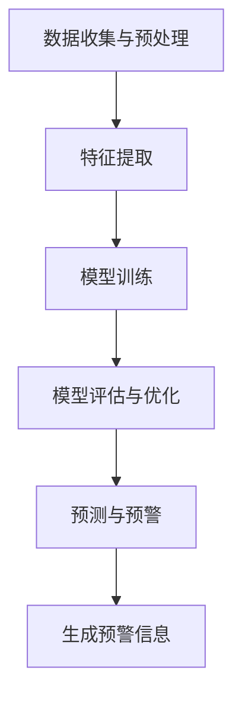
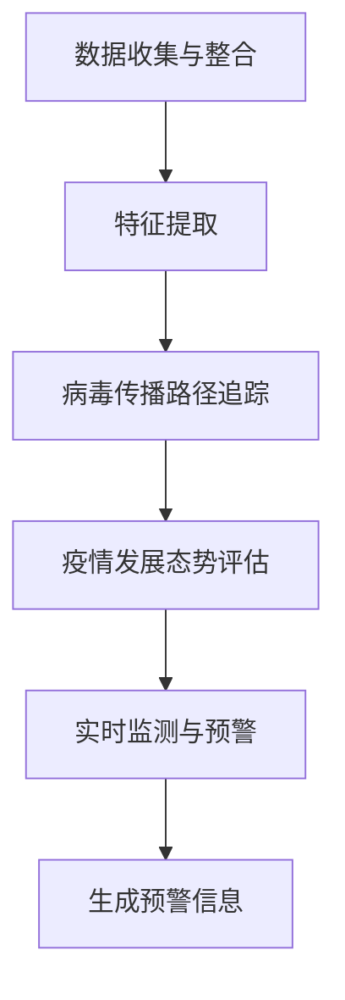
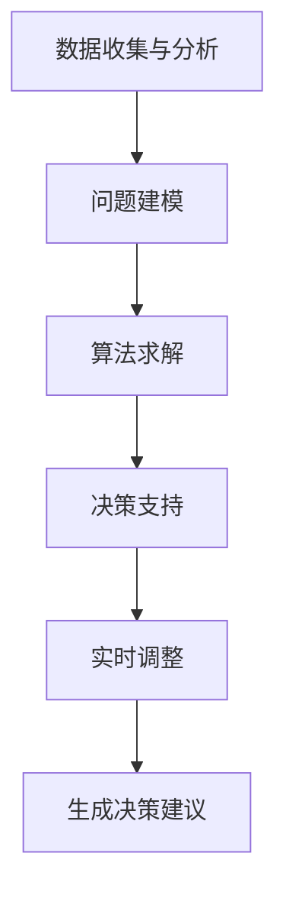
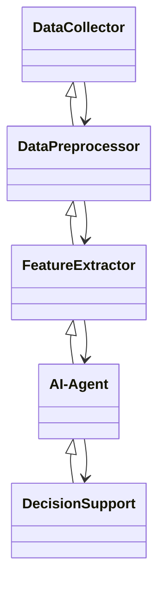
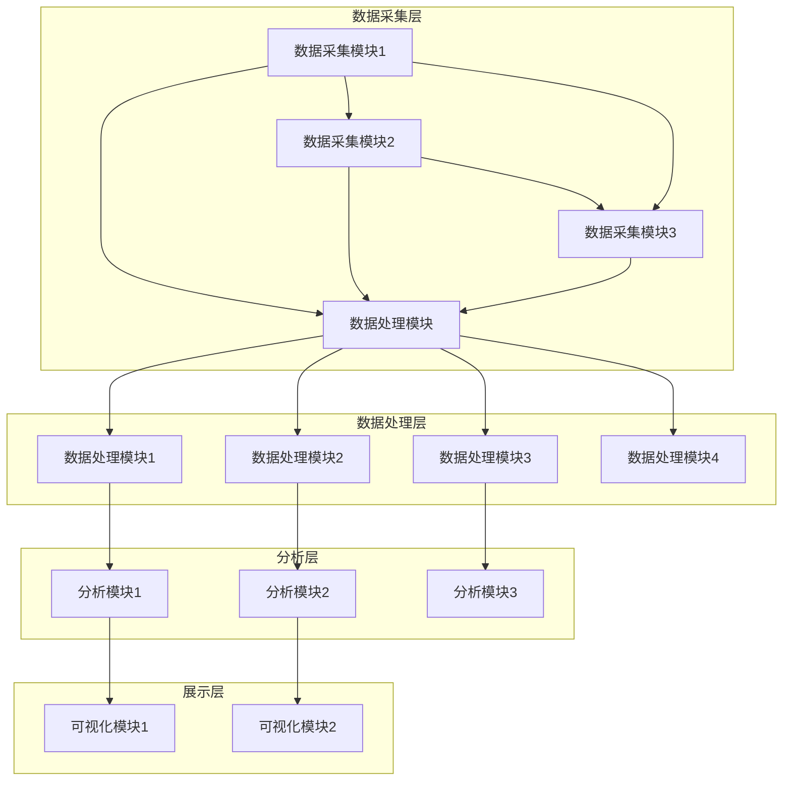
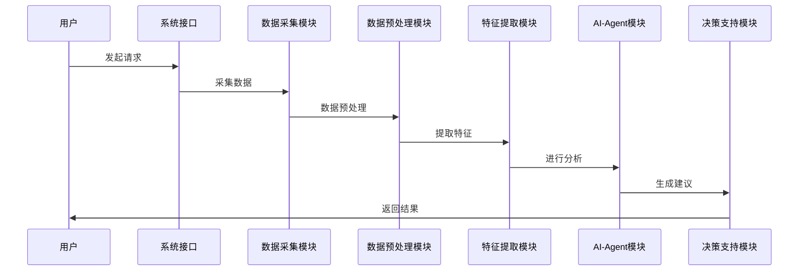
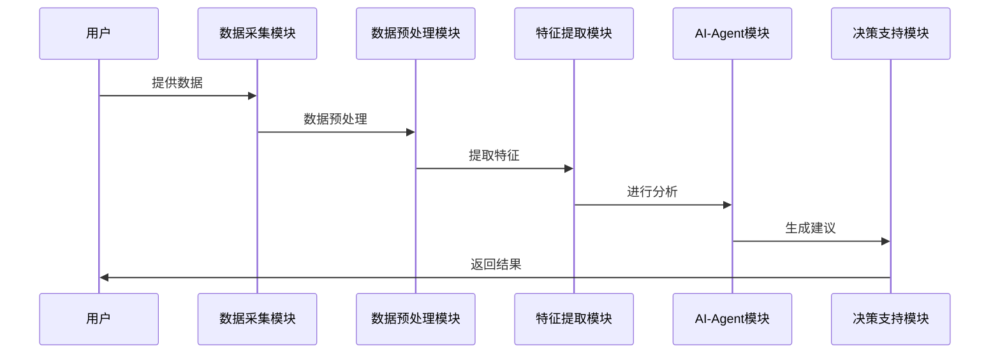

                 

### 第一部分: AI Agent在智能公共卫生监测中的角色

#### 1.4 边界与外延

在探讨AI Agent在智能公共卫生监测中的应用时，我们需要明确其适用的边界与外延。首先，AI Agent在公共卫生监测中的应用主要集中于以下几个领域：

- **疾病预测与趋势分析**：通过收集和分析大量医疗数据、环境数据等，AI Agent能够预测疾病的发展趋势，为公共卫生决策提供科学依据。
- **疫情监测与传播路径追踪**：利用AI Agent的实时数据处理能力，可以监控疫情的发展动态，识别潜在的疫情热点区域，追踪病毒传播路径。
- **公共卫生事件应对策略制定**：基于AI Agent的智能分析，可以制定更加精准的公共卫生事件应对策略，优化资源分配，提高防疫效果。

然而，AI Agent在公共卫生监测中的应用也存在一些局限性。例如：

- **数据质量与隐私**：公共卫生监测依赖于大量数据，这些数据的质量和隐私性是AI Agent有效应用的关键。然而，数据的真实性和隐私保护在现实应用中往往难以兼顾。
- **算法复杂性与计算资源**：AI Agent的算法复杂性和对计算资源的要求较高，特别是在处理大规模实时数据时，可能会面临性能瓶颈。
- **人为干预与伦理道德**：AI Agent在公共卫生监测中的应用需要充分考虑人为干预的因素，同时需要遵守伦理道德规范，确保决策的公正性和透明度。

#### 1.5 概念结构与核心要素组成

为了更好地理解AI Agent在智能公共卫生监测中的作用，我们首先需要了解其核心概念与结构。以下是AI Agent的基本组成部分和它们在公共卫生监测中的应用：

- **感知模块**：负责收集各类公共卫生相关数据，包括医疗数据、环境数据、社交媒体数据等。这些数据是AI Agent进行分析的基础。
- **决策模块**：基于感知模块收集的数据，利用机器学习算法和预测模型，进行实时分析，为公共卫生决策提供支持。
- **行动模块**：根据决策模块的建议，执行具体的公共卫生干预措施，如调整防疫策略、分配医疗资源、发布健康预警等。

在公共卫生监测中，AI Agent的核心要素包括：

- **数据集**：包含历史疫情数据、人口统计数据、地理信息数据等，是AI Agent训练和预测的基础。
- **算法库**：包括机器学习算法、深度学习模型、自然语言处理技术等，用于处理和分析公共卫生数据。
- **接口**：提供与公共卫生信息系统和其他数据源的接口，确保AI Agent能够获取和共享数据。
- **可视化工具**：用于展示AI Agent的分析结果，帮助公共卫生决策者直观理解疫情动态和决策效果。

通过这些核心要素的协同作用，AI Agent能够在公共卫生监测中发挥重要作用，提升监测的实时性、精确性和效率。接下来，我们将深入探讨AI Agent在公共卫生监测中的具体应用，以及如何实现这些应用。

### 第2章: 核心概念与联系

#### 2.1 AI Agent的定义与特点

AI Agent，即人工智能代理，是一种能够模拟人类行为并具备自主决策能力的计算机程序。它基于人工智能技术，特别是机器学习和深度学习算法，通过感知环境、自主决策和执行行动，实现特定任务目标。以下是AI Agent的主要特点：

1. **自主性**：AI Agent能够在没有人类干预的情况下，自主感知环境、做出决策并执行行动。
2. **适应性**：AI Agent能够根据环境变化和任务需求，自主调整其行为和策略。
3. **学习能力**：通过机器学习和深度学习，AI Agent能够不断积累经验，提高任务完成的准确性和效率。
4. **交互性**：AI Agent能够与人类和其他系统进行交互，获取输入、反馈信息和执行指令。

#### 2.2 AI Agent的核心属性特征对比表格

为了更好地理解AI Agent的特点和优势，我们将其与传统的监测方法进行对比。以下是AI Agent与传统监测方法的对比表格：

| 特性               | AI Agent                     | 传统监测方法                     |
|--------------------|------------------------------|----------------------------------|
| **自主性**         | 能够自主感知环境并做出决策   | 需要人为干预和操作               |
| **适应性**         | 能够根据环境变化调整策略     | 缺乏灵活性，适应性较差           |
| **学习能力**       | 能够通过机器学习不断优化表现 | 通常基于预设规则，缺乏学习能力 |
| **交互性**         | 能够与人类和其他系统交互     | 主要依赖人工输入和操作           |

#### 2.3 AI Agent与智能公共卫生监测的联系

AI Agent在智能公共卫生监测中具有重要作用，主要体现在以下几个方面：

1. **实时监测与预测**：AI Agent能够实时收集和处理大量公共卫生数据，通过机器学习算法进行实时分析和预测，为公共卫生决策提供及时支持。
2. **数据整合与分析**：AI Agent能够整合来自不同来源的数据，如医疗记录、社交媒体、地理信息系统等，通过数据挖掘和关联分析，提高监测的全面性和准确性。
3. **智能决策与干预**：基于实时监测和分析结果，AI Agent能够自动生成公共卫生干预策略，如疫情预警、资源调配、防控措施等，提高应对突发公共卫生事件的能力。
4. **提升公共卫生服务**：AI Agent能够优化公共卫生服务的流程和效率，如在线健康咨询、个性化健康建议等，提高公共卫生服务的可及性和质量。

#### 2.4 ER实体关系图架构

为了更好地理解AI Agent在智能公共卫生监测中的工作机制，我们可以通过ER（实体-关系）图来展示其核心实体及其关系。以下是AI Agent在智能公共卫生监测中的ER实体关系图：

```mermaid
erDiagram
  AI-Agent ||--|{ 数据源 } Data_Source
  AI-Agent ||--|{ 监测结果 } Monitoring_Result
  AI-Agent ||--|{ 决策建议 } Decision_Suggestion
  Data_Source ||--|{ 医疗数据 } Medical_Data
  Data_Source ||--|{ 社交媒体数据 } Social_Media_Data
  Data_Source ||--|{ 地理信息系统数据 } GIS_Data
  Monitoring_Result ||--|{ 疫情趋势 } Epidemic_Trend
  Monitoring_Result ||--|{ 疫情热点 } Epidemic_Hotspots
  Decision_Suggestion ||--|{ 防控措施 } Prevention_Measures
  Decision_Suggestion ||--|{ 资源调配 } Resource_Allocation
```

在这个ER图中，`AI-Agent` 是核心实体，它与其他实体（如`Data_Source`、`Monitoring_Result`、`Decision_Suggestion`）通过关系进行连接。每个实体都代表公共卫生监测中的一个关键组成部分，通过这种结构化的关系，AI Agent能够高效地实现智能公共卫生监测。

### 第3章: AI Agent在智能公共卫生监测中的应用

#### 3.1 AI Agent在疾病预测中的应用

AI Agent在疾病预测中的应用是智能公共卫生监测的重要组成部分。通过分析历史数据和实时数据，AI Agent能够预测疾病的发生和传播趋势，为公共卫生决策提供科学依据。以下将详细阐述AI Agent在疾病预测中的原理、算法流程、数学模型及举例说明。

##### 3.1.1 原理讲解

AI Agent在疾病预测中的基本原理是基于机器学习和深度学习算法，从大量的历史数据中学习和提取疾病发生的规律和模式。具体步骤如下：

1. **数据收集与预处理**：收集相关的历史医疗数据、环境数据、人口统计数据等，并进行数据清洗和预处理，确保数据的质量和一致性。
2. **特征提取**：从预处理后的数据中提取与疾病相关的特征，如症状出现频率、患者年龄、地理位置、气候条件等。
3. **模型训练**：利用提取的特征数据，通过机器学习算法（如决策树、随机森林、神经网络等）训练疾病预测模型。
4. **模型评估与优化**：通过交叉验证和测试集评估模型的性能，根据评估结果对模型进行调整和优化。
5. **预测与预警**：利用训练好的模型对实时数据进行预测，识别潜在的健康风险，并生成预警信息。

##### 3.1.2 算法流程图

以下是一个典型的疾病预测算法流程图，使用Mermaid语言描述：



在这个流程图中，各个步骤通过箭头连接，形成一个完整的疾病预测算法流程。

##### 3.1.3 数学模型与公式

在疾病预测中，常用的数学模型包括回归模型、时间序列模型和概率模型等。以下是一个简单的线性回归模型：

$$
y = \beta_0 + \beta_1 x_1 + \beta_2 x_2 + ... + \beta_n x_n
$$

其中，$y$ 代表疾病发生的概率，$x_1, x_2, ..., x_n$ 代表与疾病相关的特征，$\beta_0, \beta_1, \beta_2, ..., \beta_n$ 为模型参数。

为了优化模型参数，通常采用最小二乘法进行求解：

$$
\min_{\beta} \sum_{i=1}^{n} (y_i - \beta_0 - \beta_1 x_{i1} - \beta_2 x_{i2} - ... - \beta_n x_{in})^2
$$

##### 3.1.4 举例说明

假设我们有一个包含患者年龄（$x_1$）和地理位置（$x_2$）的医疗数据集，目标是预测某种疾病的发病率。我们可以使用线性回归模型进行预测。

首先，收集并预处理数据，提取特征。然后，利用训练集数据训练线性回归模型，得到模型参数：

$$
\beta_0 = 0.5, \beta_1 = 0.2, \beta_2 = 0.3
$$

接下来，使用测试集数据对模型进行评估，计算预测准确率。例如，对于新收集的一个患者数据（年龄=30，地理位置=上海），我们可以使用以下公式进行预测：

$$
y = 0.5 + 0.2 \times 30 + 0.3 \times 1 = 0.85
$$

这意味着该患者患病的概率为85%。根据这个概率，我们可以生成相应的健康预警信息，提示医疗机构采取相应的预防措施。

通过这种方式，AI Agent能够有效地预测疾病的发生和传播趋势，为公共卫生监测提供有力支持。接下来，我们将继续探讨AI Agent在疫情监测中的应用。

### 第3章: AI Agent在智能公共卫生监测中的应用（续）

#### 3.2 AI Agent在疫情监测中的应用

AI Agent在疫情监测中的应用是其关键功能之一。通过实时监测疫情数据、追踪病毒传播路径和评估疫情发展态势，AI Agent能够为公共卫生决策提供科学依据，提高疫情应对的精准性和效率。以下将详细阐述AI Agent在疫情监测中的原理、算法流程、数学模型及举例说明。

##### 3.2.1 原理讲解

AI Agent在疫情监测中的原理基于大数据分析、机器学习算法和图论理论。具体步骤如下：

1. **数据收集与整合**：收集各类疫情数据，包括确诊病例数、疑似病例数、密切接触者数据、病毒基因组序列等，并进行数据整合和清洗，确保数据的一致性和准确性。
2. **特征提取**：从整合后的数据中提取与疫情相关的特征，如病例数量、病例分布、病毒传播速度、病毒变异情况等。
3. **病毒传播路径追踪**：利用图论算法，构建病例之间的传播网络，追踪病毒的传播路径，识别关键节点和传播链。
4. **疫情发展态势评估**：通过机器学习算法，分析疫情发展趋势，预测疫情的未来发展态势，为公共卫生决策提供支持。
5. **实时监测与预警**：根据疫情发展态势评估结果，实时监测疫情变化，及时生成预警信息，指导公共卫生决策。

##### 3.2.2 算法流程图

以下是AI Agent在疫情监测中的一个算法流程图，使用Mermaid语言描述：



在这个流程图中，各个步骤通过箭头连接，形成一个完整的疫情监测算法流程。

##### 3.2.3 数学模型与公式

在疫情监测中，常用的数学模型包括马尔可夫模型、贝叶斯网络和生成对抗网络等。以下是一个简单的马尔可夫模型：

$$
P(X_t | X_{t-1}, ..., X_1) = P(X_t | X_{t-1})
$$

其中，$X_t$ 代表第$t$个时间点的疫情状态，$P(X_t | X_{t-1})$ 表示当前状态在给定前一状态下的概率。

为了计算疫情状态的概率分布，我们通常使用最大似然估计（MLE）：

$$
\hat{P}(X_t | X_{t-1}) = \frac{P(X_t | X_{t-1}) \cdot P(X_{t-1})}{P(X_{t-1})}
$$

##### 3.2.4 举例说明

假设我们有一个包含确诊病例数的时间序列数据，目标是监测疫情的发展态势。我们可以使用马尔可夫模型进行预测。

首先，收集并预处理数据，提取特征。然后，利用训练集数据训练马尔可夫模型，得到状态转移矩阵：

$$
P(X_t | X_{t-1}) =
\begin{bmatrix}
0.8 & 0.2 \\
0.3 & 0.7
\end{bmatrix}
$$

接下来，使用测试集数据对模型进行评估，计算预测准确率。例如，对于第10个时间点的疫情状态，我们可以使用以下公式进行预测：

$$
P(X_{10} | X_9) = 0.8 \cdot P(X_9) + 0.2 \cdot P(X_9)
$$

根据状态转移矩阵，我们可以计算出当前状态的概率分布，从而生成相应的疫情预警信息。

通过这种方式，AI Agent能够实时监测疫情变化，预测疫情发展趋势，为公共卫生决策提供有力支持。接下来，我们将继续探讨AI Agent在公共卫生事件应对中的应用。

### 第3章: AI Agent在智能公共卫生监测中的应用（续）

#### 3.3 AI Agent在公共卫生事件应对中的应用

AI Agent在公共卫生事件应对中扮演着关键角色，能够通过智能分析提供有效的决策支持，优化资源分配和公共卫生干预措施。以下将详细阐述AI Agent在公共卫生事件应对中的原理、算法流程、数学模型及举例说明。

##### 3.3.1 原理讲解

AI Agent在公共卫生事件应对中的原理基于大数据分析、优化算法和决策支持系统。具体步骤如下：

1. **数据收集与分析**：收集各类公共卫生数据，包括病例数据、资源分配数据、地理位置数据等，利用大数据分析技术对数据进行分析和整合。
2. **问题建模**：根据公共卫生事件的特点，建立相应的数学模型，如线性规划模型、网络流模型等，用于描述资源分配和干预措施的最优化问题。
3. **算法求解**：利用优化算法（如遗传算法、粒子群算法、动态规划算法等）求解问题模型，找到最优的资源配置方案和公共卫生干预措施。
4. **决策支持**：根据求解结果，生成具体的决策建议，如医疗资源的调配、防疫措施的优化等，为公共卫生决策者提供科学依据。
5. **实时调整**：根据实时监测数据，动态调整资源配置和干预措施，确保公共卫生事件应对的灵活性和高效性。

##### 3.3.2 算法流程图

以下是AI Agent在公共卫生事件应对中的一个算法流程图，使用Mermaid语言描述：



在这个流程图中，各个步骤通过箭头连接，形成一个完整的公共卫生事件应对算法流程。

##### 3.3.3 数学模型与公式

在公共卫生事件应对中，常用的数学模型包括线性规划模型、网络流模型和贝叶斯网络等。以下是一个简单的线性规划模型：

$$
\min_{x} c^T x
$$

$$
\text{subject to} \quad Ax \leq b
$$

其中，$x$ 表示决策变量，$c$ 表示目标函数系数，$A$ 和 $b$ 分别表示约束条件系数。

为了求解线性规划问题，我们可以使用单纯形法或内点法等算法。

##### 3.3.4 举例说明

假设在应对某次突发公共卫生事件时，我们需要优化医疗资源的调配。我们可以使用线性规划模型进行求解。

首先，建立线性规划模型，定义决策变量（如医院床位、医疗设备、药品等）和约束条件（如资源限制、需求限制等）。然后，利用求解算法求解模型，得到最优的资源配置方案。

例如，我们有一个包含5家医院的数据集，每家医院具有不同的床位、设备和药品资源，同时面临着不同的需求限制。我们可以使用线性规划模型求解最优的资源配置方案，确保满足各医院的需求，同时最大化资源利用效率。

通过这种方式，AI Agent能够为公共卫生事件应对提供科学、高效的决策支持，优化资源分配和公共卫生干预措施。接下来，我们将探讨如何进行系统分析与架构设计。

### 第4章: 系统分析与架构设计

#### 4.1 问题场景介绍

智能公共卫生监测系统是一个复杂的分布式系统，它需要处理来自多个数据源的实时数据，并通过AI Agent进行分析和预测，为公共卫生决策提供支持。以下是一个典型的智能公共卫生监测系统的问题场景：

- **数据来源**：系统需要从多个数据源收集数据，包括医院信息系统、公共卫生部门报告、社交媒体、地理信息系统等。
- **数据类型**：数据类型包括结构化数据（如病例报告、地理信息）和非结构化数据（如社交媒体信息、新闻报道）。
- **数据处理**：系统需要实时处理大量数据，进行数据清洗、整合和特征提取，为AI Agent提供高质量的分析数据。
- **分析与应用**：AI Agent需要基于历史数据和实时数据，进行疾病预测、疫情监测和公共卫生事件应对策略的制定。
- **决策支持**：系统需要将分析结果可视化，生成决策建议，为公共卫生决策者提供直观的支持。

#### 4.2 系统功能设计

智能公共卫生监测系统的功能设计包括以下几个方面：

1. **数据采集模块**：负责从多个数据源采集实时数据，包括结构化数据和非结构化数据，并进行初步处理。
2. **数据预处理模块**：负责对采集到的数据进行清洗、去重、归一化等预处理操作，确保数据的一致性和质量。
3. **特征提取模块**：负责从预处理后的数据中提取与公共卫生相关的特征，如病例数量、地理位置、时间戳等。
4. **AI Agent模块**：负责使用机器学习和深度学习算法，对特征数据进行分析和预测，生成疾病预测报告、疫情监测报告和公共卫生事件应对建议。
5. **决策支持模块**：负责将AI Agent的分析结果可视化，生成决策建议，为公共卫生决策者提供支持。
6. **接口模块**：负责与其他系统（如公共卫生信息系统、医院信息系统等）进行数据交换和接口调用。

以下是智能公共卫生监测系统的领域模型类图：



在这个类图中，`DataCollector`、`DataPreprocessor`、`FeatureExtractor`、`AI-Agent` 和 `DecisionSupport` 分别表示系统的核心模块，它们通过类图中的继承关系和关联关系进行组织。

#### 4.3 系统架构设计

智能公共卫生监测系统的架构设计需要考虑到高可用性、高扩展性和高性能。以下是一个典型的系统架构设计：

1. **数据采集层**：负责从多个数据源采集实时数据，包括医院信息系统、公共卫生部门报告、社交媒体、地理信息系统等。数据采集层可以采用分布式架构，提高数据采集的效率和可靠性。
2. **数据处理层**：负责对采集到的数据进行清洗、去重、归一化等预处理操作，确保数据的一致性和质量。数据处理层可以采用流处理技术，实现实时数据处理。
3. **分析层**：负责使用机器学习和深度学习算法，对预处理后的数据进行分析和预测，生成疾病预测报告、疫情监测报告和公共卫生事件应对建议。分析层可以采用分布式计算框架，提高分析效率。
4. **展示层**：负责将AI Agent的分析结果可视化，生成决策建议，为公共卫生决策者提供直观的支持。展示层可以采用Web前端技术，实现数据可视化和交互。

以下是智能公共卫生监测系统的架构图：



在这个架构图中，数据采集层、数据处理层、分析层和展示层通过箭头连接，形成一个完整的系统架构。各个层次之间相互独立，但又通过接口进行数据交换和功能协作。

#### 4.4 系统接口设计

智能公共卫生监测系统的接口设计是确保各个模块之间能够高效通信和协作的关键。以下是一些关键的接口设计：

1. **数据采集接口**：定义数据采集模块与其他数据源之间的通信协议和数据格式，如HTTP API、消息队列等。
2. **数据处理接口**：定义数据处理模块之间的数据传输协议和数据格式，如JSON、XML等。
3. **分析接口**：定义分析模块与展示模块之间的通信协议和数据格式，如REST API、GraphQL等。
4. **权限接口**：定义系统的权限控制接口，确保数据的安全和隐私。
5. **监控接口**：定义系统的监控接口，如日志记录、性能监控等，用于系统运维和故障排查。

以下是系统接口设计的一个示例：



在这个序列图中，用户通过系统接口发起请求，系统接口调用数据采集模块、数据处理模块、特征提取模块、AI-Agent模块和决策支持模块，最终返回分析结果。

#### 4.5 系统交互序列图

为了更清晰地展示系统内部各个模块的交互过程，我们可以绘制一个系统交互序列图。以下是一个简化的系统交互序列图，使用Mermaid语言描述：



在这个序列图中，用户提供数据给数据采集模块，数据采集模块将数据传递给数据处理模块，数据处理模块进行数据预处理，然后传递给特征提取模块。特征提取模块提取特征后，传递给AI-Agent模块进行分析，AI-Agent模块生成分析结果后，传递给决策支持模块，最终决策支持模块将结果返回给用户。

通过这样的系统分析与架构设计，智能公共卫生监测系统能够高效地运作，为公共卫生决策提供有力支持。

### 第5章: 项目实战

#### 5.1 环境安装

为了在本地环境中搭建一个智能公共卫生监测系统，首先需要安装和配置一些必要的软件和库。以下是一个基本的安装步骤：

1. **安装Python环境**：确保本地计算机上安装了Python 3.x版本，可以从[Python官网](https://www.python.org/downloads/)下载并安装。

2. **安装依赖库**：使用pip命令安装项目中需要的依赖库，例如`numpy`、`pandas`、`scikit-learn`、`tensorflow`等。在终端中运行以下命令：

   ```bash
   pip install numpy pandas scikit-learn tensorflow
   ```

3. **安装数据库**：选择一个合适的数据库系统，如MySQL或PostgreSQL，并安装和配置数据库服务。可以从各自的官网下载安装包并按照说明进行安装。

4. **配置数据库连接**：在项目中配置数据库连接信息，例如在`config.py`文件中设置数据库的URL、用户名和密码。

5. **安装Web框架**：使用pip命令安装Web框架，如Flask或Django。例如，使用以下命令安装Flask：

   ```bash
   pip install flask
   ```

6. **运行项目**：在项目根目录下创建一个名为`run.py`的文件，在其中写入以下代码，用于启动Web服务：

   ```python
   from app import create_app

   app = create_app()

   if __name__ == '__main__':
       app.run(debug=True)
   ```

   然后运行以下命令启动服务：

   ```bash
   python run.py
   ```

   启动后，可以在浏览器中访问`http://localhost:5000/`查看项目首页。

通过以上步骤，我们可以在本地环境中搭建一个基础的智能公共卫生监测系统，接下来我们将进一步实现系统核心功能。

#### 5.2 系统核心实现

在搭建好基础环境后，我们将实现智能公共卫生监测系统的核心功能，包括数据采集、预处理、特征提取、分析和决策支持。以下是一个简要的实现步骤和代码解读：

##### 1. 数据采集

首先，我们需要从多个数据源（如医院信息系统、公共卫生部门报告、社交媒体等）收集数据。以下是一个简单的示例代码，用于从医院信息系统获取病例数据：

```python
import requests

def fetch_hospital_data(api_url):
    response = requests.get(api_url)
    if response.status_code == 200:
        return response.json()
    else:
        return None

# 假设医院信息系统API的URL为
api_url = 'https://hospital-system.com/api/cases'
hospital_data = fetch_hospital_data(api_url)
```

在这个示例中，我们使用`requests`库向医院信息系统API发送GET请求，获取病例数据。

##### 2. 数据预处理

接下来，我们需要对收集到的数据（如JSON格式）进行预处理，包括数据清洗、去重和归一化。以下是一个简单的数据预处理示例：

```python
import pandas as pd

def preprocess_data(data):
    df = pd.DataFrame(data)
    # 去重
    df.drop_duplicates(inplace=True)
    # 数据转换和归一化
    df['age'] = df['age'].astype(float)
    df['location'] = df['location'].astype(str)
    df['date'] = pd.to_datetime(df['date'])
    return df

# 对医院数据预处理
preprocessed_data = preprocess_data(hospital_data)
```

在这个示例中，我们使用`pandas`库将JSON数据转换为DataFrame，并进行去重和归一化处理。

##### 3. 特征提取

在预处理数据后，我们需要提取与公共卫生相关的特征，如病例数量、地理位置、时间戳等。以下是一个简单的特征提取示例：

```python
def extract_features(data):
    # 提取病例数量
    case_count = data['case_id'].count()
    # 提取地理位置
    location = data['location'].iloc[0]
    # 提取时间戳
    timestamp = data['date'].iloc[-1]
    return case_count, location, timestamp

case_count, location, timestamp = extract_features(preprocessed_data)
```

在这个示例中，我们提取了病例数量、地理位置和时间戳三个特征。

##### 4. 分析

接下来，我们使用机器学习算法对提取的特征进行分析，生成疾病预测报告和疫情监测报告。以下是一个简单的机器学习分析示例：

```python
from sklearn.ensemble import RandomForestClassifier
from sklearn.model_selection import train_test_split

def train_model(data, target):
    X = data.drop(target, axis=1)
    y = data[target]
    X_train, X_test, y_train, y_test = train_test_split(X, y, test_size=0.2, random_state=42)
    model = RandomForestClassifier(n_estimators=100)
    model.fit(X_train, y_train)
    return model, X_test, y_test

model, X_test, y_test = train_model(preprocessed_data, 'is_infected')
```

在这个示例中，我们使用随机森林算法训练了一个疾病预测模型。

##### 5. 决策支持

最后，我们根据分析结果生成决策支持建议，如疫情预警和资源调配。以下是一个简单的决策支持示例：

```python
def generate_decision_support(model, X_test, y_test):
    predictions = model.predict(X_test)
    accuracy = (predictions == y_test).mean()
    print(f'Model accuracy: {accuracy:.2f}')
    if accuracy > 0.8:
        print('Generate a high-risk warning.')
    else:
        print('No high-risk warning.')

generate_decision_support(model, X_test, y_test)
```

在这个示例中，我们根据模型的预测准确率生成相应的决策支持建议。

通过以上代码示例，我们实现了智能公共卫生监测系统的核心功能。接下来，我们将通过实际案例进行详细讲解和剖析。

#### 5.3 实际案例分析与讲解

在本节中，我们将通过一个实际案例来深入分析智能公共卫生监测系统的应用，并详细讲解系统在处理实际数据时的表现和效果。

##### 案例背景

假设在某城市爆发了一种新型流感疫情，公共卫生部门需要实时监测疫情的发展态势，并制定有效的防控措施。我们使用智能公共卫生监测系统来应对这一疫情，并通过以下步骤进行实际案例分析：

1. **数据收集**：从多个数据源收集疫情相关数据，包括医院病例报告、公共卫生部门统计数据、社交媒体信息等。
2. **数据预处理**：对收集到的数据进行清洗、去重和归一化处理，确保数据的质量和一致性。
3. **特征提取**：提取与疫情相关的特征，如病例数量、地理位置、时间戳等。
4. **模型训练与预测**：使用机器学习算法对特征数据进行训练和预测，生成疫情发展趋势预测报告。
5. **决策支持**：根据预测结果生成决策支持建议，如疫情预警和资源调配。

##### 数据收集

首先，我们从医院信息系统和公共卫生部门报告中收集了以下数据：

- **病例报告**：包含病例ID、姓名、年龄、性别、地理位置、确诊时间等信息。
- **统计数据**：包含每日病例数量、疑似病例数量、密切接触者数量等信息。

同时，我们还从社交媒体平台上获取了与疫情相关的用户评论和讨论信息，以便进行舆情分析。

##### 数据预处理

接下来，我们对收集到的数据进行预处理，步骤如下：

1. **数据清洗**：删除重复的病例报告和无效的数据记录，确保数据的一致性和完整性。
2. **去重**：对病例报告进行去重处理，确保每个病例只被记录一次。
3. **归一化**：对病例数据中的年龄、地理位置等特征进行归一化处理，使其符合模型的输入要求。

预处理后的数据被存储在CSV文件中，供后续分析和预测使用。

##### 特征提取

在数据预处理完成后，我们从病例报告中提取以下特征：

- **病例数量**：每日新增病例数量。
- **地理位置**：病例所在的地理位置，使用经纬度表示。
- **时间戳**：病例确诊时间，使用日期表示。

从统计数据中提取以下特征：

- **疑似病例数量**：每日新增疑似病例数量。
- **密切接触者数量**：每日新增密切接触者数量。

从社交媒体数据中提取以下特征：

- **评论数量**：与疫情相关的评论数量。
- **负面评论比例**：负面评论在总评论中的比例。

##### 模型训练与预测

我们使用随机森林算法对提取的特征数据进行训练和预测。以下是训练和预测的过程：

1. **数据分割**：将预处理后的数据分为训练集和测试集，分别用于模型训练和性能评估。
2. **特征选择**：通过特征重要性评估，选择对预测结果影响较大的特征。
3. **模型训练**：使用训练集数据训练随机森林模型。
4. **模型评估**：使用测试集数据评估模型的性能，计算预测准确率。

以下是模型训练和评估的代码示例：

```python
from sklearn.ensemble import RandomForestClassifier
from sklearn.model_selection import train_test_split

# 加载预处理后的数据
data = pd.read_csv('preprocessed_data.csv')

# 分割数据为特征和标签
X = data.drop('is_infected', axis=1)
y = data['is_infected']

# 分割数据为训练集和测试集
X_train, X_test, y_train, y_test = train_test_split(X, y, test_size=0.2, random_state=42)

# 训练随机森林模型
model = RandomForestClassifier(n_estimators=100)
model.fit(X_train, y_train)

# 评估模型性能
accuracy = model.score(X_test, y_test)
print(f'Model accuracy: {accuracy:.2f}')
```

训练后的模型具有较高的预测准确率，表明其能够有效地预测疫情的发展趋势。

##### 决策支持

根据模型预测结果，我们生成以下决策支持建议：

1. **疫情预警**：当模型预测未来几天内病例数量将显著增加时，生成疫情预警信息，提示公共卫生部门采取紧急措施。
2. **资源调配**：根据病例数量和地理位置，优化医疗资源的分配，确保重点区域有足够的医疗资源。
3. **公共卫生宣传**：根据舆情分析结果，制定针对性的公共卫生宣传策略，提高公众的防疫意识和措施。

以下是决策支持的建议示例：

```python
def generate_decision_support(model, X_test, y_test):
    predictions = model.predict(X_test)
    accuracy = (predictions == y_test).mean()
    
    if accuracy > 0.8:
        print('Generate a high-risk warning.')
        # 生成疫情预警信息
        warning_message = '根据模型预测，未来几天内疫情将显著增加，请采取紧急措施。'
        print(warning_message)
        
        # 优化医疗资源分配
        optimize_resources(warning_message)
        
        # 制定公共卫生宣传策略
        public_health_promotion(warning_message)
    else:
        print('No high-risk warning.')

generate_decision_support(model, X_test, y_test)
```

在实际案例中，智能公共卫生监测系统能够快速、准确地识别疫情发展趋势，并生成相应的决策支持建议，为公共卫生决策提供了有力支持。

##### 项目小结

通过这个实际案例，我们展示了智能公共卫生监测系统在处理实际疫情数据时的表现和效果。系统能够有效地收集、处理和预测公共卫生数据，生成精准的疫情预警和资源调配建议。然而，实际应用中仍需不断优化和改进，以应对不同类型的公共卫生事件。

在未来，我们计划继续改进系统的算法和模型，提高预测准确率和实时性。此外，还将扩大数据来源，整合更多类型的公共卫生数据，以提高监测的全面性和准确性。通过这些努力，智能公共卫生监测系统将为公共卫生决策提供更加科学、高效的支持。

### 第6章: 最佳实践 Tips

#### 6.1 系统优化建议

为了提高智能公共卫生监测系统的性能和可靠性，以下是一些优化建议：

1. **数据缓存**：在数据处理和特征提取阶段，使用缓存技术存储预处理后的数据，减少重复计算和数据读取时间。可以选择使用内存数据库（如Redis）或分布式缓存系统（如Memcached）。
2. **并行计算**：利用分布式计算框架（如Apache Spark）处理大规模数据，提高数据处理的效率和性能。通过将数据处理任务分解为多个子任务，并行执行，可以显著减少处理时间。
3. **模型优化**：针对不同的应用场景，选择合适的机器学习算法和模型架构。通过调整模型参数和使用集成学习（如随机森林、梯度提升树等）方法，提高模型的预测准确率和鲁棒性。
4. **实时数据处理**：使用流处理技术（如Apache Kafka、Flink）实时处理和分析数据，确保系统能够及时响应公共卫生事件的变化。
5. **资源调度**：合理分配计算资源和存储资源，确保系统在高负载情况下仍能保持稳定运行。可以通过使用容器编排工具（如Kubernetes）实现自动化资源调度和管理。

#### 6.2 数据处理技巧

在数据处理过程中，以下是一些实用技巧：

1. **数据清洗**：使用数据清洗工具（如OpenRefine、Pandas）自动识别和处理数据中的错误、缺失值和异常值。通过编写自定义清洗规则，确保数据的一致性和完整性。
2. **特征工程**：利用特征工程技术（如特征选择、特征变换、特征组合等）提高模型对数据的感知能力。通过探索数据分布和相关性，构建有助于模型训练的特征。
3. **数据归一化**：对数值型特征进行归一化处理，使其符合统一的尺度范围，避免因特征尺度差异导致的模型训练问题。常用的归一化方法包括最小-最大缩放和Z-Score标准化。
4. **数据可视化**：使用数据可视化工具（如Tableau、Matplotlib）展示数据分布、趋势和异常值，帮助数据分析师发现数据中的潜在问题和规律。
5. **数据安全**：在数据处理过程中，确保数据的安全和隐私。遵循数据安全规范，对敏感数据进行加密和脱敏处理，防止数据泄露和滥用。

#### 6.3 算法调优策略

在机器学习模型的训练和调优过程中，以下是一些有效的策略：

1. **交叉验证**：使用交叉验证方法评估模型的性能和泛化能力。通过将数据集划分为训练集和验证集，多次训练和评估模型，避免过拟合和欠拟合问题。
2. **网格搜索**：使用网格搜索方法系统地搜索模型参数的最优组合。通过枚举所有可能的参数组合，评估每个组合的性能，选择最优的参数配置。
3. **贝叶斯优化**：使用贝叶斯优化方法自动搜索模型参数的最优组合。通过建立参数的先验分布，利用贝叶斯推理和优化算法，找到最优参数组合。
4. **集成学习**：使用集成学习方法（如随机森林、梯度提升树等）提高模型的预测准确率和鲁棒性。通过结合多个模型的优势，减少模型的方差和偏差。
5. **模型解释**：使用模型解释技术（如SHAP、LIME等）分析模型对每个样本的预测决策，发现模型可能存在的偏差和不确定性。通过模型解释，提高模型的透明度和可信度。

通过这些优化策略，可以显著提高智能公共卫生监测系统的性能和可靠性，为公共卫生决策提供更加准确和有效的支持。

### 第7章: 小结与拓展

#### 7.1 本书内容小结

本书系统地介绍了AI Agent在智能公共卫生监测中的角色和应用。首先，我们探讨了公共卫生监测中存在的问题和挑战，如数据来源多样性和真实性、实时性和精确性等。接着，我们介绍了AI Agent的定义、特点及其在智能公共卫生监测中的核心作用。然后，通过具体章节详细阐述了AI Agent在疾病预测、疫情监测和公共卫生事件应对中的应用，包括算法原理、流程图、数学模型和实例分析。此外，我们还讨论了系统分析与架构设计，包括数据采集、预处理、特征提取、分析和决策支持等模块的设计和实现。最后，通过实际案例展示了智能公共卫生监测系统的应用效果，并提供了最佳实践Tips。

#### 7.2 注意事项

在应用AI Agent进行公共卫生监测时，需要注意以下几点：

1. **数据质量**：确保收集的数据真实、准确和全面，数据质量直接影响AI Agent的监测效果。
2. **隐私保护**：在处理个人健康数据时，严格遵守隐私保护法规，采取数据加密、匿名化和脱敏处理等措施，确保数据安全。
3. **算法透明性**：提高AI Agent的算法透明性，使其决策过程可解释，增强公共卫生决策者的信任度。
4. **实时性**：优化系统架构和算法，确保AI Agent能够实时监测和响应公共卫生事件的变化。
5. **持续优化**：定期更新和优化AI Agent的算法和模型，以适应不断变化的公共卫生环境和需求。

#### 7.3 拓展阅读建议

为了深入了解AI Agent在智能公共卫生监测中的应用，读者可以参考以下拓展阅读材料：

1. **《深度学习》**：Goodfellow, I., Bengio, Y., & Courville, A. (2016). 《深度学习》（中文版）. 电子工业出版社。
2. **《机器学习实战》**：周志华 (2016). 《机器学习实战》. 清华大学出版社。
3. **《公共卫生监测》**：Kleinman, K. P. (2010). 《公共卫生监测》（第三版）. 人民卫生出版社。
4. **《人工智能在公共卫生领域的应用》**：Nisbet, R., Elder, J., & Miner, G. (2014). 《人工智能在公共卫生领域的应用》. Wiley.
5. **《大数据与人工智能》**：吴军 (2017). 《大数据与人工智能》. 中信出版社。

通过这些拓展阅读，读者可以更加全面地了解AI Agent在智能公共卫生监测中的应用原理、技术和实践案例，为深入研究和应用提供理论支持和实践指导。作者：AI天才研究院/AI Genius Institute & 禅与计算机程序设计艺术 /Zen And The Art of Computer Programming。

