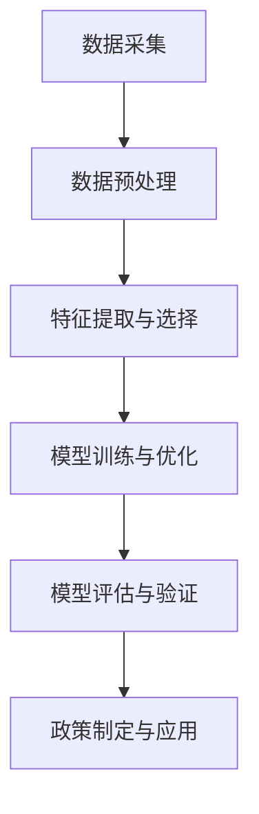

                 

### 《AI Agent在智能公共政策制定中的应用》

> 关键词：AI Agent、智能公共政策、算法、数学模型、系统架构、项目实战

> 摘要：本文将探讨AI Agent在智能公共政策制定中的应用。通过分析AI Agent的基本原理、公共政策制定的流程和目标，结合实际案例分析，本文将详细阐述AI Agent如何通过算法原理、数学模型和系统架构设计，优化公共政策制定过程，提高政策效果。

### 第一部分：问题背景与核心概念

#### 第1章：问题背景

##### 1.1 公共政策制定的需求与挑战

公共政策是国家或政府为了解决社会问题、实现社会目标而制定的一系列规则和措施。随着社会问题的日益复杂化和多元化，公共政策制定的需求日益增长。然而，传统的公共政策制定方法存在一定的局限性，面临诸多挑战：

- **公共政策定义与作用**：公共政策是国家或政府制定的一系列规则和措施，旨在解决社会问题、实现社会目标。
- **智能公共政策的需求**：社会问题的复杂化和多元化要求公共政策更加智能和灵活。
- **传统方法**：传统公共政策制定方法主要依靠专家经验、民意调查和政策评估，存在一定局限性。
- **传统方法面临的挑战**：数据不足、分析能力有限、政策实施效果评估困难等。

##### 1.2 AI Agent在公共政策制定中的应用潜力

AI Agent，即人工智能代理，是一种能够自主决策、执行任务并适应环境变化的人工智能系统。AI Agent在公共政策制定中具有以下应用潜力：

- **AI Agent的定义与特点**：AI Agent具有自主决策、自主学习和自主执行任务的能力。
- **AI Agent在公共政策制定中的应用**：AI Agent可以通过大数据分析、智能决策和自适应调整，提高公共政策制定的科学性和有效性。
- **AI Agent与传统方法比较**：AI Agent具有更强的数据分析能力、更高效的决策机制和更灵活的适应能力，能够弥补传统方法的不足。

#### 第2章：核心概念与联系

##### 2.1 AI Agent基本原理

AI Agent的基本原理包括：

- **构成要素**：感知模块、决策模块和执行模块。
- **工作机制**：感知环境信息、分析决策、执行行动。
- **分类**：基于任务类型、功能特点和应用场景进行分类。

##### 2.2 公共政策制定的原理

公共政策制定的原理包括：

- **定义与特点**：公共政策制定是一个复杂的决策过程，涉及目标设定、方案设计、实施评估等多个环节。
- **流程**：政策需求分析、政策方案设计、政策实施与调整、政策评估与反馈。
- **目标与原则**：实现社会公共利益、公平、公正和可持续发展。

##### 2.3 AI Agent与公共政策的联系

AI Agent与公共政策的联系在于：

- **AI Agent在公共政策制定中的作用**：AI Agent可以通过大数据分析、智能决策和自适应调整，提高公共政策制定的科学性和有效性。
- **AI Agent与公共政策制定的融合**：AI Agent可以嵌入公共政策制定的各个环节，实现智能化、自动化和高效化的政策制定过程。

### 第二部分：AI Agent应用案例分析

#### 第3章：AI Agent应用案例分析

##### 3.1 案例一：智能交通管理

**3.1.1 案例背景**

随着城市化进程的加快，交通问题日益严重。智能交通管理成为解决交通拥堵、提高交通效率的重要手段。

**3.1.2 AI Agent在交通管理中的应用**

AI Agent可以通过以下方式应用于智能交通管理：

- **实时交通数据采集与分析**：AI Agent可以实时采集交通数据，分析交通流量、车速、道路状况等信息。
- **智能信号控制**：AI Agent可以根据实时交通数据，自适应调整交通信号灯，提高交通效率。
- **智能路况预测**：AI Agent可以基于历史数据和实时数据，预测交通流量和拥堵情况，为交通管理部门提供决策支持。

**3.1.3 案例效果分析**

智能交通管理案例的效果分析包括：

- **交通效率提高**：通过智能信号控制和路况预测，交通效率显著提高，拥堵时间缩短。
- **交通事故减少**：智能交通管理有助于降低交通事故发生率，提高道路安全性。
- **环境影响减小**：通过优化交通流量，减少车辆排放，降低环境污染。

##### 3.2 案例二：智能城市规划

**3.2.1 案例背景**

智能城市规划是城市化发展的重要方向，旨在提高城市规划的科学性和可持续性。

**3.2.2 AI Agent在城市规划中的应用**

AI Agent可以通过以下方式应用于智能城市规划：

- **数据分析与预测**：AI Agent可以分析城市人口、经济、交通等数据，预测城市发展趋势。
- **智能方案设计**：AI Agent可以根据预测结果，设计智能、高效的城市规划方案。
- **自适应调整**：AI Agent可以根据城市发展的实际情况，动态调整城市规划方案。

**3.2.3 案例效果分析**

智能城市规划案例的效果分析包括：

- **城市规划科学性提高**：通过数据分析与预测，智能城市规划更加科学、合理。
- **可持续发展能力增强**：智能城市规划有助于提高城市可持续发展能力，实现经济、社会、环境的协调发展。
- **城市居民生活质量提高**：智能城市规划有助于提高城市居民的生活质量，满足居民日益增长的需求。

### 第三部分：智能公共政策制定的算法原理

#### 第4章：智能公共政策制定的算法原理

##### 4.1 算法原理概述

智能公共政策制定的算法原理包括：

- **关键算法**：大数据分析、机器学习、深度学习等。
- **基本原理与步骤**：数据采集与预处理、特征提取与选择、模型训练与优化、模型评估与验证。

##### 4.2 算法流程图

算法流程图如下：

#### 4.2.1 算法流程图解释

- **数据采集**：收集与公共政策相关的数据，包括历史数据、实时数据和外部数据。
- **数据预处理**：对采集到的数据进行清洗、去噪、归一化等处理，为后续分析做准备。
- **特征提取与选择**：从预处理后的数据中提取与公共政策相关的特征，选择最重要的特征进行建模。
- **模型训练与优化**：使用机器学习或深度学习算法，对提取的特征进行训练，优化模型参数。
- **模型评估与验证**：对训练好的模型进行评估和验证，确保模型的准确性和可靠性。
- **政策制定与应用**：根据评估和验证结果，制定智能公共政策，并在实际应用中不断调整和优化。

#### 第5章：数学模型与公式

##### 5.1 数学模型概述

智能公共政策制定的数学模型包括：

- **公共政策效果评估模型**：用于评估公共政策的实施效果。
- **AI Agent决策模型**：用于模拟AI Agent在公共政策制定中的决策过程。

##### 5.2 公式讲解

**5.2.1 公共政策效果评估公式**

$$
E = f(P, C)
$$

- **E**：公共政策效果
- **P**：政策实施力度
- **C**：政策实施成本

**5.2.2 AI Agent决策模型公式**

$$
D = g(A, S)
$$

- **D**：AI Agent的决策结果
- **A**：AI Agent的感知信息
- **S**：AI Agent的状态信息

#### 第6章：系统架构设计

##### 6.1 问题场景介绍

智能公共政策制定的问题场景包括：

- **数据采集与处理**：需要从多个渠道采集与公共政策相关的数据，并进行预处理。
- **特征提取与选择**：需要从预处理后的数据中提取与公共政策相关的特征，并选择最重要的特征进行建模。
- **模型训练与优化**：需要使用机器学习或深度学习算法对提取的特征进行训练，优化模型参数。
- **模型评估与验证**：需要评估和验证训练好的模型，确保模型的准确性和可靠性。
- **政策制定与应用**：需要根据评估和验证结果，制定智能公共政策，并在实际应用中不断调整和优化。

##### 6.2 系统架构设计

智能公共政策制定的系统架构设计包括：

- **数据采集模块**：负责从多个渠道采集与公共政策相关的数据。
- **数据预处理模块**：负责对采集到的数据进行清洗、去噪、归一化等处理。
- **特征提取与选择模块**：负责从预处理后的数据中提取与公共政策相关的特征，并选择最重要的特征进行建模。
- **模型训练与优化模块**：负责使用机器学习或深度学习算法对提取的特征进行训练，优化模型参数。
- **模型评估与验证模块**：负责评估和验证训练好的模型，确保模型的准确性和可靠性。
- **政策制定与应用模块**：负责根据评估和验证结果，制定智能公共政策，并在实际应用中不断调整和优化。

##### 6.3 系统接口设计与交互

智能公共政策制定的系统接口设计与交互包括：

- **数据采集接口**：用于接收外部数据源的数据。
- **数据预处理接口**：用于对采集到的数据进行清洗、去噪、归一化等处理。
- **特征提取与选择接口**：用于从预处理后的数据中提取与公共政策相关的特征，并选择最重要的特征进行建模。
- **模型训练与优化接口**：用于使用机器学习或深度学习算法对提取的特征进行训练，优化模型参数。
- **模型评估与验证接口**：用于评估和验证训练好的模型，确保模型的准确性和可靠性。
- **政策制定与应用接口**：用于根据评估和验证结果，制定智能公共政策，并在实际应用中不断调整和优化。

### 第四部分：项目实战

#### 第7章：项目实战

##### 7.1 环境安装

在开始项目实战之前，我们需要安装相关的环境和工具：

- **Python环境**：Python是智能公共政策制定的关键工具，我们需要安装Python环境。
- **数据分析工具**：包括Pandas、NumPy等常用数据分析工具。
- **机器学习库**：包括scikit-learn、TensorFlow等机器学习库。
- **深度学习库**：包括Keras、PyTorch等深度学习库。

##### 7.2 系统核心实现

智能公共政策制定的系统核心实现包括：

- **数据采集与预处理**：使用Pandas进行数据采集与预处理。
- **特征提取与选择**：使用scikit-learn进行特征提取与选择。
- **模型训练与优化**：使用scikit-learn和TensorFlow进行模型训练与优化。
- **模型评估与验证**：使用scikit-learn进行模型评估与验证。
- **政策制定与应用**：根据评估和验证结果，制定智能公共政策，并在实际应用中不断调整和优化。

##### 7.3 实际案例分析

我们将以智能交通管理为例，进行实际案例分析：

- **案例背景**：分析城市交通拥堵情况。
- **数据采集与预处理**：采集交通流量、车速、道路状况等数据，并进行预处理。
- **特征提取与选择**：提取与交通管理相关的特征，如交通流量、车速、道路状况等。
- **模型训练与优化**：使用机器学习算法训练交通流量预测模型，并优化模型参数。
- **模型评估与验证**：评估交通流量预测模型的准确性和可靠性。
- **政策制定与应用**：根据评估结果，制定智能交通管理政策，如自适应信号控制、交通流量调节等。

##### 7.4 项目小结

智能公共政策制定项目小结包括：

- **项目总结**：总结项目的主要成果和经验教训。
- **不足与改进**：分析项目的不足之处，并提出改进措施。

### 第五部分：最佳实践与拓展阅读

#### 第8章：最佳实践与拓展阅读

##### 8.1 最佳实践

智能公共政策制定的最佳实践包括：

- **数据质量保证**：确保数据来源的可靠性、数据的准确性和完整性。
- **模型优化与调整**：根据评估结果，不断优化和调整模型参数，提高模型性能。
- **政策实施与反馈**：及时收集政策实施过程中的数据，进行评估和反馈，以调整和优化政策。

##### 8.2 拓展阅读

智能公共政策制定的拓展阅读包括：

- **推荐阅读书籍**：《大数据时代》、《深度学习》等。
- **学术论文与报告**：关于智能公共政策制定的研究论文和报告。
- **网络资源与课程**：在线课程、专业网站和论坛等。

### 结束语

本文介绍了AI Agent在智能公共政策制定中的应用。通过分析AI Agent的基本原理、公共政策制定的流程和目标，结合实际案例分析，本文详细阐述了AI Agent如何通过算法原理、数学模型和系统架构设计，优化公共政策制定过程，提高政策效果。希望本文对读者在智能公共政策制定领域的研究和实践有所启发。

### 作者信息

作者：AI天才研究院/AI Genius Institute & 禅与计算机程序设计艺术 /Zen And The Art of Computer Programming

