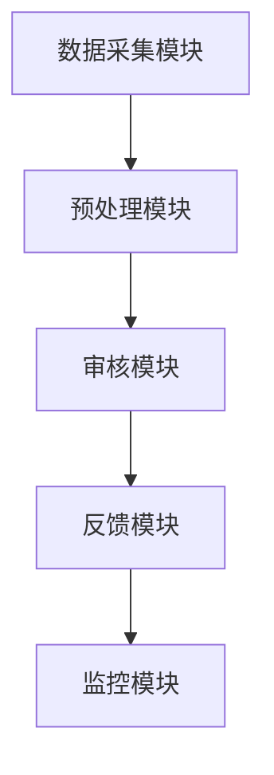

                 


## AI Agent在智能内容审核中的应用

> 关键词：AI Agent，智能内容审核，强化学习，深度学习，自然语言处理

> 摘要：
本篇文章旨在探讨AI Agent在智能内容审核中的应用，通过详细阐述AI Agent的基本概念、核心技术原理、实现步骤以及优化策略，展示其在解决智能内容审核挑战中的重要作用。文章还结合实际案例分析，提供了最佳实践建议，为行业人士提供了有价值的参考。

## 第一部分：AI Agent基础知识与应用环境

### 第1章：AI Agent概述

#### 1.1 AI Agent的基本概念

**定义**：AI Agent，即人工智能代理，是能够自主感知环境、制定决策并执行行动的智能实体。它基于机器学习和人工智能技术，通过不断学习和优化，以实现特定的目标。

**特点**：
- **自主性**：能够自主感知和决策，不受人为干预。
- **适应性**：能够根据环境变化和学习经验不断优化自身行为。
- **灵活性**：能够应对不同的任务和环境。

**分类**：根据应用场景和任务，AI Agent可以分为以下几类：
- **任务型Agent**：针对特定任务进行设计和优化，如搜索引擎、智能客服等。
- **社交型Agent**：具备社交能力，能在人与机器、机器与机器之间进行交互，如聊天机器人、社交网络平台等。
- **自主型Agent**：在无人干预的情况下自主完成任务，如无人机、自动驾驶汽车等。

#### 1.2 智能内容审核背景与挑战

**定义**：智能内容审核是指利用人工智能技术对网络内容进行自动化分类、识别和过滤，以屏蔽不良信息、保护用户权益。

**重要性**：
- **保障网络环境**：过滤有害信息，维护网络环境的健康和秩序。
- **提升用户体验**：提高信息质量和检索效率，提升用户满意度。
- **合规性**：符合相关法律法规和平台政策要求。

**挑战**：
- **海量数据**：互联网内容爆炸式增长，审核任务量巨大。
- **复杂性**：内容形式多样，涉及文字、图片、音频和视频等多种类型。
- **实时性**：需要快速响应，确保内容审核的实时性和高效性。

#### 1.3 AI Agent在智能内容审核中的应用

**角色**：AI Agent在智能内容审核中担任关键角色，包括：
- **内容分类**：根据内容特征进行分类，如广告、色情、暴力等。
- **内容识别**：识别和过滤不良信息，如恶意评论、违规内容等。
- **用户行为分析**：分析用户行为，提供个性化推荐和内容推送。

**优势与局限性**：
- **优势**：
  - **高效性**：能够处理海量数据，实现快速审核。
  - **准确性**：通过机器学习算法，提高审核准确性。
  - **灵活性**：适应不同类型的内容审核需求。
- **局限性**：
  - **数据依赖**：需要大量高质量数据进行训练。
  - **算法偏见**：可能因算法偏见而导致误判。
  - **实时性挑战**：在处理实时数据时，可能存在延迟。

#### 1.4 智能内容审核系统架构

**设计原则**：
- **模块化**：将系统功能模块化，便于维护和扩展。
- **分布式**：采用分布式架构，提高系统性能和可扩展性。
- **可扩展性**：支持系统规模的动态扩展。

**系统模块分解**：
- **数据采集模块**：负责收集各类网络内容。
- **预处理模块**：对采集到的内容进行清洗和预处理。
- **审核模块**：利用AI Agent进行内容审核。
- **反馈模块**：收集用户反馈，用于模型优化和算法改进。
- **监控模块**：实时监控系统运行状态，确保系统稳定可靠。

#### 1.5 本章小结

本章节介绍了AI Agent的基本概念、智能内容审核的背景与挑战，以及AI Agent在智能内容审核中的应用。通过对AI Agent的深入了解，读者可以更好地理解其在智能内容审核中的重要作用。

----------------------------------------------------------------

## 第二部分：AI Agent核心技术原理与实现

### 第2章：AI Agent核心技术原理

#### 2.1 强化学习原理

**强化学习的基本概念**

强化学习（Reinforcement Learning）是一种机器学习范式，主要研究智能体（Agent）在未知环境中如何通过学习获得最优策略，从而实现目标。其核心思想是通过试错（trial-and-error）和奖励机制（reward signal）来引导智能体学习。

**强化学习的特点**

- **交互性**：智能体需要与环境进行交互，通过感知环境状态、执行动作、获取奖励，不断调整自身策略。
- **适应性**：智能体能够根据环境变化和学习经验不断调整策略，以实现长期目标。
- **灵活性**：能够应对不同的任务和环境，具有广泛的适用性。

**强化学习的主要算法**

1. **值函数方法**：基于值函数的方法包括Q学习（Q-Learning）和深度Q网络（Deep Q-Network，DQN）。Q学习通过学习状态-动作值函数（Q值）来指导智能体的决策。DQN则使用深度神经网络来近似Q值函数，提高学习效率和准确性。

2. **策略梯度方法**：策略梯度方法直接优化智能体的策略，包括策略梯度（Policy Gradient）和演员-评论家（Actor-Critic）方法。策略梯度方法通过估计策略梯度来更新策略参数。演员-评论家方法则通过分别估计动作价值和策略值来优化智能体行为。

3. **基于模型的方法**：基于模型的方法包括模型预测（Model-Based Methods）和模型自由（Model-Free Methods）。模型预测方法通过建立环境模型，预测未来状态和奖励，从而指导智能体决策。模型自由方法则仅依赖于经验数据进行决策。

#### 2.2 深度学习在AI Agent中的应用

**深度学习基础**

深度学习（Deep Learning）是机器学习的一个分支，通过构建深度神经网络（Deep Neural Networks，DNN）来模拟人脑的神经元结构和功能，实现复杂的特征提取和模式识别。

**卷积神经网络（CNN）**

卷积神经网络（Convolutional Neural Network，CNN）是深度学习的一个重要分支，广泛应用于图像处理、计算机视觉等领域。CNN通过卷积层、池化层和全连接层等结构，实现对图像的层次化特征提取。

**循环神经网络（RNN）与长短期记忆网络（LSTM）**

循环神经网络（Recurrent Neural Network，RNN）是处理序列数据的常用网络结构。RNN通过记忆单元（Memory Unit）来保存输入序列的历史信息，实现对序列数据的建模。长短期记忆网络（Long Short-Term Memory，LSTM）是RNN的一种改进，通过引入门控机制（Gate Mechanism）来有效避免梯度消失和梯度爆炸问题，提高了对长序列数据的建模能力。

**自然语言处理（NLP）与语义分析**

自然语言处理（Natural Language Processing，NLP）是深度学习在语言领域的重要应用，旨在使计算机能够理解、生成和处理自然语言。语义分析（Semantic Analysis）是NLP的一个核心任务，通过理解文本的语义含义，实现对文本内容的深入分析。

**NLP基础**

NLP的基础技术包括词向量表示（Word Embedding）、词性标注（Part-of-Speech Tagging）、命名实体识别（Named Entity Recognition，NER）等。词向量表示将词汇映射到高维空间，为后续的语义分析提供输入。词性标注和命名实体识别则用于提取文本中的语法结构和实体信息。

**语义分析技术**

语义分析技术主要包括情感分析（Sentiment Analysis）、文本分类（Text Classification）、机器翻译（Machine Translation）等。情感分析通过判断文本的情感倾向，实现对用户情感的理解。文本分类通过将文本划分为不同的类别，实现对文本内容的分类。机器翻译则通过将一种语言的文本翻译成另一种语言，实现跨语言的沟通。

**NLP在智能内容审核中的应用**

NLP在智能内容审核中发挥着重要作用，通过对文本的语义分析，实现对内容的理解和分类。具体应用包括：

1. **恶意评论检测**：通过分析评论的语义，识别其中的恶意言论和侮辱性词汇，实现恶意评论的过滤。
2. **广告识别**：通过分析文本的语义和结构，识别其中的广告内容，实现广告的屏蔽。
3. **内容分类**：通过对文本进行语义分析，将其归类到不同的类别，实现内容的有序组织和推荐。

#### 2.3 AI Agent的决策过程

**决策理论**

决策理论是研究决策过程和决策方法的科学。在智能内容审核中，决策理论为AI Agent提供了决策框架和方法。

**AI Agent的决策过程**

1. **环境建模**：对环境进行建模，包括状态空间、动作空间和奖励机制。
2. **策略学习**：通过学习环境模型，获取最优策略。常用的方法包括Q学习、策略梯度方法和基于模型的方法。
3. **决策执行**：根据当前状态和策略，执行相应动作。
4. **反馈调整**：根据执行结果和奖励，调整策略和参数，实现决策优化。

#### 2.4 本章小结

本章介绍了AI Agent的核心技术原理，包括强化学习、深度学习、自然语言处理和决策理论。通过对这些技术的深入理解，读者可以更好地掌握AI Agent的工作原理和应用方法。

----------------------------------------------------------------

## 第三部分：AI Agent在智能内容审核中的实现与应用

### 第3章：智能内容审核系统设计与实现

#### 3.1 智能内容审核系统需求分析

**系统需求概述**

智能内容审核系统的需求主要包括：

1. **内容采集**：系统需要能够从各种来源采集网络内容，包括文本、图片、音频和视频等。
2. **内容预处理**：对采集到的内容进行清洗、去重和格式转换，为后续的审核提供统一的数据格式。
3. **内容审核**：利用AI Agent对内容进行自动分类、识别和过滤，屏蔽不良信息。
4. **用户反馈**：收集用户对审核结果的反馈，用于模型优化和算法改进。
5. **实时监控**：监控系统运行状态，确保系统稳定可靠。

**功能需求分析**

智能内容审核系统的功能需求主要包括：

1. **内容分类**：根据内容特征，将内容分为广告、色情、暴力、恶意评论等类别。
2. **内容识别**：识别和过滤不良信息，如恶意评论、违规内容等。
3. **用户行为分析**：分析用户行为，提供个性化推荐和内容推送。
4. **数据可视化**：通过图表和报表，展示系统运行状态和审核效果。
5. **接口管理**：提供RESTful API接口，方便与其他系统进行集成。

#### 3.2 系统架构设计

**系统架构设计原则**

智能内容审核系统的架构设计应遵循以下原则：

1. **模块化**：将系统功能模块化，便于维护和扩展。
2. **分布式**：采用分布式架构，提高系统性能和可扩展性。
3. **高可用性**：通过冗余设计和故障转移，提高系统可用性。
4. **安全性**：确保数据安全和系统安全，防止数据泄露和攻击。

**系统模块设计**

智能内容审核系统包括以下主要模块：

1. **数据采集模块**：负责从各种来源采集网络内容。
2. **预处理模块**：对采集到的内容进行清洗、去重和格式转换。
3. **审核模块**：利用AI Agent对内容进行自动分类、识别和过滤。
4. **反馈模块**：收集用户反馈，用于模型优化和算法改进。
5. **监控模块**：实时监控系统运行状态，确保系统稳定可靠。

**系统架构设计**

智能内容审核系统的整体架构设计如图3-1所示。



#### 3.3 AI Agent实现步骤

**数据预处理**

数据预处理是AI Agent实现的第一步，主要包括以下任务：

1. **数据清洗**：去除重复数据、噪声数据和缺失数据，提高数据质量。
2. **数据去重**：通过哈希函数或关键词匹配，去除重复内容。
3. **数据格式转换**：将不同类型的数据转换为统一的格式，如将图片转换为像素矩阵，将文本转换为词向量。

**模型训练**

模型训练是AI Agent实现的核心步骤，主要包括以下任务：

1. **数据分割**：将数据集分为训练集、验证集和测试集。
2. **特征提取**：通过深度学习模型提取文本、图片、音频等数据的高层次特征。
3. **模型选择**：根据任务需求和数据特点，选择合适的深度学习模型，如卷积神经网络（CNN）或循环神经网络（RNN）。
4. **训练过程**：使用训练集对模型进行训练，通过优化损失函数和调整模型参数，提高模型性能。

**模型评估**

模型评估是AI Agent实现的重要环节，主要包括以下任务：

1. **指标计算**：计算模型的准确率、召回率、F1值等指标，评估模型性能。
2. **交叉验证**：使用交叉验证方法，评估模型在未知数据上的泛化能力。
3. **错误分析**：分析模型预测错误的案例，找出问题所在，为模型优化提供参考。

**模型部署**

模型部署是将训练好的模型应用于实际场景的过程，主要包括以下任务：

1. **模型导出**：将训练好的模型导出为可部署的格式，如TensorFlow Lite或ONNX。
2. **模型部署**：将模型部署到服务器或移动设备上，实现实时内容审核。
3. **性能优化**：通过压缩模型、降低精度等方法，提高模型在低资源环境下的运行效率。

#### 3.4 实际案例分析

**案例一：社交媒体内容审核**

社交媒体平台需要对用户发布的帖子、评论等进行内容审核，以屏蔽不良信息和违规内容。通过引入AI Agent，可以实现以下功能：

1. **恶意评论检测**：利用AI Agent对评论进行语义分析，识别其中的恶意言论和侮辱性词汇。
2. **广告识别**：通过分析文本的语义和结构，识别其中的广告内容，实现广告的屏蔽。
3. **内容分类**：根据评论的内容和形式，将其归类到不同的类别，如娱乐、科技、体育等。

**案例二：电子商务平台内容审核**

电子商务平台需要对用户发布的商品评论、商家宣传内容等进行内容审核，以维护平台声誉和用户体验。通过引入AI Agent，可以实现以下功能：

1. **恶意评论过滤**：利用AI Agent对评论进行语义分析，识别其中的恶意言论和虚假评论。
2. **广告内容检测**：通过分析文本的语义和结构，识别其中的广告内容，防止虚假宣传。
3. **用户行为分析**：分析用户的行为和评论内容，为平台提供个性化推荐和内容推送。

#### 3.5 系统接口设计与实现

**接口设计原则**

系统接口设计应遵循以下原则：

1. **简洁性**：接口设计应简洁明了，易于使用和扩展。
2. **规范性**：接口设计应符合相关规范和标准，提高接口的可维护性。
3. **灵活性**：接口设计应支持不同类型的请求和响应，提高系统的适应性。

**接口实现方法**

系统接口实现主要包括以下方法：

1. **HTTP RESTful API**：使用HTTP协议和RESTful架构设计接口，实现数据传输和功能调用。
2. **数据格式**：采用JSON或XML等数据格式，实现数据的结构化和可读性。
3. **身份验证**：使用身份验证机制，如OAuth 2.0，确保接口调用的安全性和可靠性。

#### 3.6 本章小结

本章介绍了智能内容审核系统的需求分析、系统架构设计和实现步骤，并结合实际案例分析，展示了AI Agent在智能内容审核中的应用。通过本章的学习，读者可以全面了解智能内容审核系统的设计与实现过程。

----------------------------------------------------------------

## 第四部分：AI Agent在智能内容审核中的优化与未来趋势

### 第4章：AI Agent在智能内容审核中的优化策略

#### 4.1 优化目标与方法

**优化目标**

智能内容审核系统的优化目标主要包括：

1. **准确性**：提高内容审核的准确性，降低误判率和漏判率。
2. **实时性**：提高内容审核的速度，缩短审核时间，实现实时审核。
3. **鲁棒性**：提高系统的鲁棒性，降低环境变化对审核效果的影响。
4. **可扩展性**：支持系统的动态扩展，适应不同规模的内容审核需求。

**优化方法**

为了实现优化目标，可以采用以下方法：

1. **算法优化**：通过改进算法模型，提高内容审核的准确性和实时性。例如，采用更先进的深度学习模型，如Transformer等。
2. **数据增强**：通过增加数据量、丰富数据种类和来源，提高模型的鲁棒性和泛化能力。
3. **模型压缩**：通过模型压缩技术，降低模型参数规模和计算复杂度，提高模型在低资源环境下的运行效率。
4. **动态调整**：根据系统运行状态和用户反馈，动态调整模型参数和审核策略，实现实时优化。

#### 4.2 实时更新与动态调整

**实时更新机制**

实时更新机制是指系统在运行过程中，持续接收用户反馈和新数据，对模型进行在线学习和调整，以提高审核效果。具体方法包括：

1. **增量学习**：利用增量学习技术，仅对新增数据或变化数据进行学习，提高更新效率。
2. **在线学习**：利用在线学习技术，实时更新模型参数，实现模型的持续优化。
3. **分布式学习**：利用分布式学习技术，将学习任务分布在多个计算节点上，提高学习效率和系统吞吐量。

**动态调整策略**

动态调整策略是指根据系统运行状态和用户反馈，实时调整模型参数和审核策略，以适应环境变化。具体方法包括：

1. **自适应调整**：根据用户反馈和系统运行状态，自适应调整模型参数，实现审核效果的优化。
2. **反馈闭环**：建立反馈闭环机制，将用户反馈和审核结果纳入模型学习过程，实现模型的自我优化。
3. **策略迭代**：采用迭代优化方法，逐步调整审核策略，实现最优审核效果。

#### 4.3 数据质量与模型稳定性

**数据质量管理**

数据质量是智能内容审核系统的重要基础。为了确保数据质量，可以采用以下方法：

1. **数据清洗**：对采集到的数据进行清洗和预处理，去除噪声数据和异常值。
2. **数据标注**：对数据进行高质量标注，提高标注数据的准确性和一致性。
3. **数据平衡**：确保训练数据集的平衡性，避免数据偏差对模型性能的影响。

**模型稳定性分析**

模型稳定性是指模型在不同环境下的鲁棒性和泛化能力。为了提高模型稳定性，可以采用以下方法：

1. **模型测试**：采用多种测试方法，如交叉验证、压力测试等，评估模型在不同环境下的性能。
2. **模型监控**：实时监控模型运行状态，及时发现和解决模型异常。
3. **模型更新**：根据模型监控结果，定期更新模型，提高模型稳定性。

#### 4.4 本章小结

本章介绍了AI Agent在智能内容审核中的优化策略，包括优化目标、实时更新与动态调整、数据质量管理和模型稳定性分析。通过本章的学习，读者可以了解如何优化智能内容审核系统，提高其准确性和实时性。

----------------------------------------------------------------

## 第五部分：AI Agent在智能内容审核中的应用实践与最佳实践

### 第5章：AI Agent在智能内容审核中的应用实践

#### 5.1 环境配置与准备

**环境配置**

要实现AI Agent在智能内容审核中的应用，首先需要配置相应的开发环境。以下是配置步骤：

1. **安装Python**：确保系统已安装Python 3.7及以上版本。
2. **安装TensorFlow**：通过pip命令安装TensorFlow库，如`pip install tensorflow`。
3. **安装其他依赖库**：根据项目需求，安装其他必要的库，如NumPy、Pandas等。

**数据准备**

为了训练AI Agent，需要准备足够的数据。以下是数据准备步骤：

1. **数据采集**：从网络或数据库中采集文本、图片、音频等数据。
2. **数据清洗**：去除重复数据和噪声数据，确保数据质量。
3. **数据标注**：对数据进行分类标注，为模型训练提供标注数据。

#### 5.2 系统核心实现源代码

以下是智能内容审核系统的核心实现代码，包括数据预处理、模型训练和模型部署：

```python
# 数据预处理
def preprocess_data(data):
    # 数据清洗和格式转换
    pass

# 模型训练
def train_model(data):
    # 模型配置和训练
    pass

# 模型部署
def deploy_model(model):
    # 模型导出和部署
    pass

# 主函数
if __name__ == "__main__":
    # 数据准备
    data = load_data()
    clean_data = preprocess_data(data)
    
    # 模型训练
    model = train_model(clean_data)
    
    # 模型部署
    deploy_model(model)
```

#### 5.3 代码应用解读与分析

**代码解读**

上述代码实现了智能内容审核系统的核心功能，包括数据预处理、模型训练和模型部署。具体解读如下：

1. **数据预处理**：通过`preprocess_data`函数对采集到的数据进行清洗和格式转换，确保数据质量。
2. **模型训练**：通过`train_model`函数配置模型，使用训练数据对模型进行训练，提高模型性能。
3. **模型部署**：通过`deploy_model`函数将训练好的模型导出和部署，实现实时内容审核。

**分析**

1. **数据预处理**：数据预处理是模型训练的重要环节，直接影响模型性能。通过数据清洗和格式转换，可以去除噪声数据和异常值，提高数据质量。
2. **模型训练**：模型训练是智能内容审核的核心，通过选择合适的模型和训练方法，可以提高模型性能和准确性。
3. **模型部署**：模型部署是将训练好的模型应用到实际场景的过程，通过部署策略和部署方法，可以确保模型在实时场景中的高效运行。

#### 5.4 实际案例分析和详细讲解剖析

**案例一：社交媒体内容审核**

社交媒体平台需要对用户发布的帖子、评论等进行内容审核，以屏蔽不良信息和违规内容。以下是对该案例的分析和讲解：

1. **数据采集**：从社交媒体平台采集用户发布的帖子、评论等数据。
2. **数据预处理**：对采集到的数据进行清洗和格式转换，去除噪声数据和异常值。
3. **模型训练**：使用预处理后的数据对模型进行训练，提高模型性能。
4. **模型部署**：将训练好的模型部署到社交媒体平台，实现实时内容审核。
5. **用户反馈**：收集用户对审核结果的反馈，用于模型优化和算法改进。

**讲解剖析**

1. **数据采集**：社交媒体平台的数据量巨大，通过高效的采集方法，如爬虫技术，可以快速获取用户数据。
2. **数据预处理**：数据预处理是确保模型性能的关键，通过对数据进行清洗和格式转换，可以提高数据质量。
3. **模型训练**：选择合适的模型和训练方法，可以提高模型性能。在实际应用中，可以采用多模型融合的方法，提高分类准确率。
4. **模型部署**：通过将模型部署到社交媒体平台，可以实现实时内容审核，确保平台内容的健康和秩序。
5. **用户反馈**：用户反馈是模型优化的关键，通过收集用户对审核结果的反馈，可以及时调整模型参数和审核策略，提高审核效果。

**案例二：电子商务平台内容审核**

电子商务平台需要对用户发布的商品评论、商家宣传内容等进行内容审核，以维护平台声誉和用户体验。以下是对该案例的分析和讲解：

1. **数据采集**：从电子商务平台采集用户发布的商品评论、商家宣传内容等数据。
2. **数据预处理**：对采集到的数据进行清洗和格式转换，去除噪声数据和异常值。
3. **模型训练**：使用预处理后的数据对模型进行训练，提高模型性能。
4. **模型部署**：将训练好的模型部署到电子商务平台，实现实时内容审核。
5. **用户反馈**：收集用户对审核结果的反馈，用于模型优化和算法改进。

**讲解剖析**

1. **数据采集**：电子商务平台的数据量较大，通过高效的采集方法，如爬虫技术，可以快速获取用户数据。
2. **数据预处理**：数据预处理是确保模型性能的关键，通过对数据进行清洗和格式转换，可以提高数据质量。
3. **模型训练**：选择合适的模型和训练方法，可以提高模型性能。在实际应用中，可以采用多模型融合的方法，提高分类准确率。
4. **模型部署**：通过将模型部署到电子商务平台，可以实现实时内容审核，确保平台内容的健康和秩序。
5. **用户反馈**：用户反馈是模型优化的关键，通过收集用户对审核结果的反馈，可以及时调整模型参数和审核策略，提高审核效果。

#### 5.5 项目小结

通过实际案例分析，展示了AI Agent在智能内容审核中的应用。在实际项目中，需要结合具体场景和需求，选择合适的算法和模型，进行数据预处理和模型训练，并实时部署和优化模型。通过用户反馈和持续优化，可以提高智能内容审核系统的性能和准确性。

#### 5.6 最佳实践 tips、小结、注意事项、拓展阅读等内容

**最佳实践 tips**

1. **数据质量是关键**：确保数据质量，去除噪声数据和异常值，提高模型性能。
2. **选择合适的模型**：根据任务需求和数据特点，选择合适的深度学习模型，如CNN、RNN等。
3. **多模型融合**：采用多模型融合的方法，提高分类准确率。
4. **实时优化**：根据用户反馈和系统运行状态，实时调整模型参数和审核策略，提高审核效果。

**小结**

本章节通过实际案例分析，展示了AI Agent在智能内容审核中的应用实践。在实际项目中，需要结合具体场景和需求，进行数据预处理、模型训练和部署，并持续优化模型和审核策略。

**注意事项**

1. **数据安全和隐私保护**：在采集和处理数据时，要注意数据安全和隐私保护，遵守相关法律法规。
2. **模型泛化能力**：提高模型的泛化能力，避免模型过度拟合。
3. **实时性能**：优化模型和算法，提高实时性能，确保系统的高效运行。

**拓展阅读**

1. 《深度学习》（Goodfellow, I., Bengio, Y., & Courville, A.）
2. 《自然语言处理综论》（Jurafsky, D., & Martin, J. H.）
3. 《强化学习》（Sutton, R. S., & Barto, A. G.）

作者：AI天才研究院/AI Genius Institute & 禅与计算机程序设计艺术 /Zen And The Art of Computer Programming

----------------------------------------------------------------

通过以上内容，本文系统地介绍了AI Agent在智能内容审核中的应用，从基础知识到实际应用，再到优化策略，为读者提供了全面的技术解读和实践指导。希望本文能够为从事智能内容审核的从业人员提供有益的参考，推动智能内容审核技术的发展。

