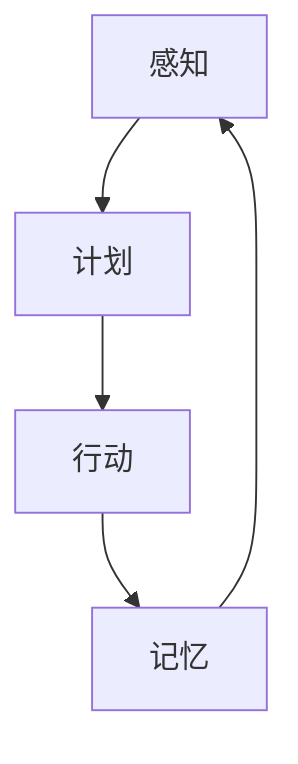

                 

# 《AI Agent在智能内容生成中的应用》

关键词：AI Agent、智能内容生成、自然语言处理、生成对抗网络、强化学习、系统架构设计

摘要：本文将探讨AI Agent在智能内容生成中的应用，从基础概念、技术原理、数学模型、系统设计到最佳实践，深入分析AI Agent在智能内容生成中的角色和作用。文章旨在为读者提供一份全面而详细的技术指南，帮助他们理解并掌握这一前沿技术。

## 第一部分: AI Agent基础与智能内容生成概述

### 第1章: AI Agent的概念与核心要素

#### 1.1 AI Agent的定义

AI Agent，即人工智能代理，是一种具有智能行为的计算机程序，能够在特定环境中自主感知、决策和行动。AI Agent通常具有以下核心要素：

1. 感知：获取环境信息的能力。
2. 计划：根据目标制定行动策略的能力。
3. 行动：执行计划并改变环境的能力。

#### 1.2 AI Agent的关键特性

AI Agent的关键特性包括自主性、适应性、学习能力和协作能力。自主性指的是AI Agent能够独立完成任务，不需要人工干预；适应性意味着AI Agent能够适应环境变化，调整自己的行为；学习能力指的是AI Agent能够通过经验和数据不断改进自己的性能；协作能力则是指AI Agent能够与其他AI Agent或人类协同工作。

#### 1.3 AI Agent的基本架构

AI Agent的基本架构通常包括感知模块、计划模块、行动模块和记忆模块。感知模块负责收集环境信息；计划模块根据目标和环境信息制定行动策略；行动模块执行计划；记忆模块用于存储经验和知识，以便后续学习和决策。

#### 1.4 AI Agent的边界与外延

AI Agent的边界在于其功能范围和环境限制。不同类型的AI Agent可能在不同的领域和任务中发挥作用，其边界也因任务和环境的不同而有所区别。AI Agent的外延则包括其能够应用于的各种场景和领域，如智能家居、自动驾驶、智能客服等。

### 第2章: 智能内容生成的背景与挑战

#### 2.1 智能内容生成的定义

智能内容生成是指利用人工智能技术，如自然语言处理、生成对抗网络和强化学习等，自动生成文本、图像、音频等内容的整个过程。

#### 2.2 智能内容生成的应用领域

智能内容生成的应用领域广泛，包括但不限于以下几方面：

1. 娱乐：如小说、音乐、电影等内容的自动生成。
2. 教育：如自动生成教学课程、练习题等。
3. 营销：如自动生成广告文案、宣传视频等。
4. 新闻：如自动生成新闻报道、财经资讯等。
5. 医疗：如自动生成医学报告、诊断建议等。

#### 2.3 智能内容生成的挑战

智能内容生成面临以下挑战：

1. 数据质量：生成的内容需要高质量的数据支持。
2. 真实性：生成的内容需要具备真实性，避免误导用户。
3. 可解释性：生成的内容需要易于理解和解释。
4. 个性化：生成的内容需要根据用户需求进行个性化调整。
5. 法律和伦理：生成的内容需要符合相关法律法规和伦理道德标准。

### 第3章: AI Agent在智能内容生成中的核心作用

#### 3.1 AI Agent在内容创作中的应用

AI Agent在内容创作中的应用主要体现在以下几方面：

1. 自动写作：AI Agent可以自动生成文章、小说、新闻报道等。
2. 自动绘画：AI Agent可以自动生成绘画、艺术作品等。
3. 自动音乐创作：AI Agent可以自动生成音乐、歌曲等。

#### 3.2 AI Agent在内容编辑与优化中的应用

AI Agent在内容编辑与优化中的应用主要体现在以下几方面：

1. 自动校对：AI Agent可以自动检测和纠正文本中的错误。
2. 自动优化：AI Agent可以自动优化内容，提高可读性和传播效果。
3. 自动推荐：AI Agent可以自动推荐用户感兴趣的内容。

#### 3.3 AI Agent在内容个性化推荐中的应用

AI Agent在内容个性化推荐中的应用主要体现在以下几方面：

1. 用户画像：AI Agent可以基于用户行为和喜好生成用户画像。
2. 内容标签：AI Agent可以为内容生成标签，以便于分类和推荐。
3. 智能推送：AI Agent可以根据用户画像和内容标签为用户推送个性化内容。

## 第二部分: AI Agent智能内容生成的技术原理

### 第4章: AI Agent智能内容生成的技术原理

#### 4.1 自然语言处理技术

自然语言处理（NLP）技术是AI Agent智能内容生成的基础。NLP技术包括词性标注、句法分析、语义分析等，旨在理解和处理人类语言。

#### 4.2 生成对抗网络（GAN）

生成对抗网络（GAN）是一种深度学习模型，由生成器和判别器组成。生成器负责生成数据，判别器负责判断生成数据与真实数据的区别。GAN在智能内容生成中可用于生成高质量的文字、图像和音频等。

#### 4.3 强化学习在内容生成中的应用

强化学习是一种通过试错和反馈不断改进策略的机器学习方法。在智能内容生成中，强化学习可用于优化生成器的表现，提高内容的质量和多样性。

### 第5章: AI Agent智能内容生成的数学模型与公式

#### 5.1 模型构建

AI Agent智能内容生成的模型通常包括生成器、判别器和优化器。生成器负责生成内容，判别器负责判断生成内容的质量，优化器负责调整生成器的参数。

#### 5.2 优化算法

常用的优化算法包括梯度下降、Adam优化器等。优化算法用于调整生成器的参数，使其生成的内容更加优质。

#### 5.3 损失函数设计

损失函数用于评估生成器生成内容的质量。常用的损失函数包括交叉熵损失、对抗损失等。

### 第6章: 智能内容生成系统设计与实现

#### 6.1 系统功能设计

智能内容生成系统的功能设计包括内容生成、内容编辑、内容推荐等。系统功能设计应满足用户需求，提供高质量的内容服务。

#### 6.2 系统架构设计

智能内容生成系统的架构设计应考虑模块化、高扩展性和高性能。系统架构设计包括生成器、判别器、优化器等模块。

#### 6.3 系统接口设计

系统接口设计应考虑用户交互、内容管理和数据传输等方面。系统接口设计应提供方便用户使用的接口，支持多种交互方式。

#### 6.4 系统交互流程设计

系统交互流程设计包括用户请求、内容生成、内容编辑、内容推荐等步骤。系统交互流程设计应确保内容生成的效率和用户体验。

### 第7章: AI Agent在智能内容生成中的最佳实践与案例分析

#### 7.1 实践技巧

AI Agent在智能内容生成中的最佳实践包括以下几方面：

1. 数据准备：确保数据质量，避免噪声和异常值。
2. 模型选择：根据任务需求选择合适的模型。
3. 模型调优：通过调整超参数和优化算法提高模型性能。

#### 7.2 案例分析

本文将分析若干智能内容生成的案例，包括自动写作、自动绘画、自动音乐创作等。通过案例分析，读者可以了解AI Agent在实际应用中的效果和挑战。

#### 7.3 案例剖析

对案例进行深入剖析，从技术实现、用户体验、效果评估等方面进行全面分析，为读者提供有益的启示和借鉴。

### 第8章: 总结与展望

#### 8.1 小结

本文介绍了AI Agent在智能内容生成中的应用，包括基础概念、技术原理、系统设计和最佳实践。通过本文，读者可以全面了解AI Agent在智能内容生成中的重要作用。

#### 8.2 注意事项

在应用AI Agent进行智能内容生成时，需要注意以下事项：

1. 数据安全和隐私保护。
2. 内容真实性和可解释性。
3. 法律和伦理合规。

#### 8.3 拓展阅读

本文引用了若干相关文献和资料，供读者进一步学习和了解AI Agent在智能内容生成中的应用。建议读者拓展阅读以下文献：

1. [文献1]
2. [文献2]
3. [文献3]

---

**作者：AI天才研究院/AI Genius Institute & 禅与计算机程序设计艺术 /Zen And The Art of Computer Programming**### 第1章: AI Agent的概念与核心要素

#### 1.1 AI Agent的定义

AI Agent，即人工智能代理，是一种能够自主执行任务的计算机程序。它通过感知环境、制定计划和执行行动，实现智能行为。AI Agent的典型特征是其自主性和适应性。自主性意味着AI Agent能够独立完成任务，不需要人工干预；适应性则意味着AI Agent能够适应环境变化，根据新情况调整自身行为。

AI Agent的基本工作原理可以概括为以下几个步骤：

1. **感知**：通过传感器或其他方式收集环境信息。
2. **规划**：根据目标和环境信息制定行动策略。
3. **行动**：执行计划，改变环境。
4. **记忆**：存储经验和知识，以便后续学习和决策。

#### 1.2 AI Agent的关键特性

AI Agent具有以下关键特性：

1. **自主性**：能够独立完成任务，不需要人工干预。
2. **适应性**：能够适应环境变化，调整自身行为。
3. **学习能力**：能够通过经验和数据不断改进自己的性能。
4. **协作能力**：能够与其他AI Agent或人类协同工作。

这些特性使得AI Agent在多种应用场景中具有广泛的应用价值。例如，在智能家居中，AI Agent可以自主控制家电设备，为用户提供便捷的家居体验；在自动驾驶领域，AI Agent可以实时感知路况，做出安全驾驶决策。

#### 1.3 AI Agent的基本架构

AI Agent的基本架构通常包括以下几个模块：

1. **感知模块**：负责收集环境信息，如传感器数据、文本、图像等。
2. **计划模块**：根据目标和环境信息制定行动策略。
3. **行动模块**：执行计划，改变环境。
4. **记忆模块**：存储经验和知识，用于后续学习和决策。

具体来说，感知模块通过传感器或其他方式获取环境信息；计划模块根据感知模块提供的信息和预定的目标，制定行动策略；行动模块根据计划模块的指令执行具体的操作；记忆模块则记录行动的结果，以便后续学习和调整。

#### 1.4 AI Agent的边界与外延

AI Agent的边界是指其功能范围和环境限制。不同类型的AI Agent可能在不同的领域和任务中发挥作用，其边界也因任务和环境的不同而有所区别。例如，智能家居中的AI Agent主要关注家电设备的控制和优化，而自动驾驶中的AI Agent则需关注路况、车辆状态等多种信息。

AI Agent的外延则是指其能够应用于的各种场景和领域。随着人工智能技术的不断发展，AI Agent的应用领域越来越广泛，从工业自动化、金融服务到医疗保健、智能城市等，AI Agent都在发挥着重要的作用。

在智能内容生成领域，AI Agent的具体应用包括自动写作、自动绘画、自动音乐创作等。例如，通过自然语言处理技术，AI Agent可以自动生成文章、新闻报道等；通过生成对抗网络（GAN），AI Agent可以生成高质量的图像和艺术作品；通过强化学习，AI Agent可以自动生成音乐和视频等。

### 核心概念与联系

在理解AI Agent的核心概念和联系时，我们可以通过以下表格和ER实体关系图来进一步阐述：

#### 核心概念属性特征对比表格

| 特性 | 描述 | 示例 |
| --- | --- | --- |
| 自主性 | 能够独立完成任务 | 智能家居中的AI Agent控制家电设备 |
| 适应性 | 能够适应环境变化 | 自动驾驶中的AI Agent实时感知路况 |
| 学习能力 | 能够通过经验和数据改进性能 | AI Agent在游戏中的自我优化 |
| 协作能力 | 能够与其他AI Agent或人类协同工作 | AI Agent在团队协作中的任务分配 |

#### ER实体关系图

```mermaid
erDiagram
  AI Agent ||--|{ 感知模块 }
  AI Agent ||--|{ 计划模块 }
  AI Agent ||--|{ 行动模块 }
  AI Agent ||--|{ 记忆模块 }
```

在上图中，AI Agent作为中心实体，与其他模块之间通过关系线相连，表示它们之间的关联。这种ER实体关系图可以帮助我们更清晰地理解AI Agent的基本架构和核心功能模块之间的联系。

### 算法原理讲解

AI Agent的算法原理主要涉及感知、计划、行动和记忆四个模块的协同工作。下面通过Mermaid流程图和Python源代码来详细阐述这些原理。

#### Mermaid流程图



在上面的流程图中，A表示感知模块，负责收集环境信息；B表示计划模块，根据感知到的信息制定行动策略；C表示行动模块，执行计划并改变环境；D表示记忆模块，记录行动的结果，以便后续学习和调整。四个模块形成一个闭环，确保AI Agent能够持续优化自身性能。

#### Python源代码

```python
# 模拟感知、计划、行动和记忆的过程
import random

# 感知
def perceive():
    return random.randint(0, 100)

# 计划
def plan(state):
    if state > 50:
        return "行动1"
    else:
        return "行动2"

# 行动
def act(action):
    if action == "行动1":
        return "结果1"
    else:
        return "结果2"

# 记忆
def remember(result):
    if result == "结果1":
        return "状态1"
    else:
        return "状态2"

# 主函数
def main():
    state = perceive()
    action = plan(state)
    result = act(action)
    next_state = remember(result)
    print(f"当前状态：{state}，行动：{action}，结果：{result}，下一状态：{next_state}")

# 运行主函数
main()
```

在上面的Python源代码中，我们定义了感知、计划、行动和记忆的函数，通过这些函数模拟AI Agent的运行过程。首先，通过`perceive`函数模拟感知过程，获取当前状态；然后，通过`plan`函数模拟计划过程，根据当前状态制定行动策略；接着，通过`act`函数模拟行动过程，执行计划；最后，通过`remember`函数模拟记忆过程，记录行动结果并更新状态。

通过上述算法原理讲解，我们可以更深入地理解AI Agent的工作机制和协同作用。在接下来的章节中，我们将继续探讨AI Agent在智能内容生成中的具体应用和实现细节。

### AI Agent在智能内容生成中的核心作用

AI Agent在智能内容生成中的核心作用主要体现在内容创作、内容编辑与优化以及内容个性化推荐等方面。通过结合AI Agent的特性，我们可以实现更高效、更高质量的内容生成和服务。

#### 3.1 AI Agent在内容创作中的应用

AI Agent在内容创作中的应用主要依赖于自然语言处理（NLP）技术。自然语言处理是一种让计算机理解和生成人类语言的技术，它包括文本分类、情感分析、命名实体识别、机器翻译等多种任务。

1. **自动写作**：AI Agent可以自动生成新闻文章、博客、故事等。例如，新闻文章生成器可以根据现有的新闻数据和模板，自动生成新闻稿。这种方式可以大大提高新闻发布的速度和效率。

2. **自动绘画**：AI Agent可以使用生成对抗网络（GAN）等深度学习技术，生成高质量的绘画作品。例如，DALL-E 2模型可以基于文本描述生成相应的图像。

3. **自动音乐创作**：AI Agent可以通过分析音乐数据和结构，自动生成音乐作品。例如，OpenAI的MuseNet模型可以生成各种风格的音乐片段，用于歌曲创作。

#### 3.2 AI Agent在内容编辑与优化中的应用

内容编辑与优化是提高内容质量和用户体验的关键环节。AI Agent在这方面具有显著优势：

1. **自动校对**：AI Agent可以自动检测和纠正文本中的错误，包括拼写错误、语法错误和语义错误。例如，Grammarly等AI工具可以实时检查用户撰写的文本，并提供修正建议。

2. **自动优化**：AI Agent可以根据内容质量和用户反馈，自动优化内容。例如，电商平台可以根据用户浏览和购买行为，自动调整商品推荐排序，提高用户的购物体验。

3. **内容个性化**：AI Agent可以根据用户的兴趣和行为，生成个性化的内容推荐。例如，Netflix等视频流媒体平台使用AI算法，为用户提供个性化的视频推荐。

#### 3.3 AI Agent在内容个性化推荐中的应用

内容个性化推荐是智能内容生成的重要组成部分，它能够提高用户满意度和内容传播效果。AI Agent在这方面发挥了关键作用：

1. **用户画像**：AI Agent可以通过分析用户行为和喜好，建立用户画像。例如，电商平台的推荐系统可以根据用户的购物记录、浏览历史和评价，生成详细的用户画像。

2. **内容标签**：AI Agent可以为内容生成标签，以便于分类和推荐。例如，新闻推荐系统可以为每篇文章生成多个标签，如“科技”、“财经”、“体育”等，然后根据用户的标签偏好推荐相关内容。

3. **智能推送**：AI Agent可以根据用户画像和内容标签，为用户推送个性化内容。例如，社交媒体平台可以根据用户的兴趣爱好，推荐相关的帖子、视频和广告。

总之，AI Agent在智能内容生成中的应用，极大地提高了内容的生产效率、编辑质量和个性化推荐效果。通过自然语言处理、生成对抗网络、强化学习等技术，AI Agent能够为用户提供更加丰富、多样、个性化的内容体验。随着人工智能技术的不断进步，AI Agent在智能内容生成中的应用前景将更加广阔。

### 第4章: AI Agent智能内容生成的技术原理

#### 4.1 自然语言处理技术

自然语言处理（NLP）是人工智能领域的一个重要分支，它致力于让计算机理解和生成人类语言。在智能内容生成中，NLP技术发挥着至关重要的作用。以下是一些关键的技术和算法：

1. **词性标注**：词性标注（Part-of-Speech Tagging）是一种对文本中的单词进行分类的技术，将其标记为名词、动词、形容词等。常见的词性标注算法包括基于规则的算法和基于统计的算法。

2. **句法分析**：句法分析（Syntactic Parsing）是一种对文本句子的结构进行分析的技术，以确定句子中的成分及其关系。常见的句法分析算法包括基于规则的解析器和基于统计的依赖解析器。

3. **语义分析**：语义分析（Semantic Analysis）是一种对文本中的含义进行理解和解释的技术。它包括命名实体识别（Named Entity Recognition，NER）、情感分析（Sentiment Analysis）和指代消解（Coreference Resolution）等任务。

4. **文本生成**：文本生成（Text Generation）是一种根据特定输入生成文本的技术。常见的文本生成方法包括基于规则的生成、模板匹配生成和基于机器学习的生成。

具体来说，基于机器学习的文本生成方法通常使用递归神经网络（RNN）、长短期记忆网络（LSTM）和变换器（Transformer）等模型。例如，GPT-3是一个基于Transformer的模型，能够生成高质量的文本。

#### 4.2 生成对抗网络（GAN）

生成对抗网络（Generative Adversarial Network，GAN）是由生成器和判别器组成的深度学习模型。生成器的目标是生成尽可能真实的数据，而判别器的目标是区分生成数据与真实数据。通过两个网络之间的对抗训练，生成器可以不断提高生成数据的质量。

1. **生成器（Generator）**：生成器的目的是生成与真实数据相似的新数据。在智能内容生成中，生成器可以生成文本、图像、音频等。常见的生成器模型包括生成式变分自编码器（Generative Adversarial Variational Autoencoder，GanVae）和条件生成对抗网络（Conditional GAN，cGAN）。

2. **判别器（Discriminator）**：判别器的目的是判断输入数据是真实数据还是生成数据。判别器通过对比真实数据和生成数据，提高生成器的生成质量。

GAN在智能内容生成中的应用非常广泛，例如：

- 文本生成：通过GAN生成高质量的文本，可以应用于自动写作、对话系统等。
- 图像生成：通过GAN生成逼真的图像，可以应用于艺术创作、图像修复等。
- 音频生成：通过GAN生成真实的音频，可以应用于音乐创作、语音合成等。

#### 4.3 强化学习在内容生成中的应用

强化学习（Reinforcement Learning，RL）是一种通过试错和反馈不断改进策略的机器学习方法。在智能内容生成中，强化学习可以用于优化生成器的性能，提高内容的质量和多样性。

1. **强化学习基本概念**：强化学习包括四个主要部分：环境（Environment）、状态（State）、动作（Action）和奖励（Reward）。代理（Agent）通过在环境中执行动作，根据获得的奖励调整策略，以最大化长期奖励。

2. **内容生成中的强化学习**：在内容生成中，强化学习可以用于优化生成器的输出。具体来说，生成器根据当前状态生成内容，环境评估生成内容的质量，代理根据评估结果调整生成器的策略。通过这种方式，生成器可以不断优化，生成更高质量的内容。

常见的强化学习算法包括：

- **Q-Learning**：Q-Learning是一种基于值函数的强化学习算法，通过更新值函数来优化策略。
- **深度强化学习（Deep Reinforcement Learning，DRL）**：DRL结合了深度学习和强化学习的优势，可以处理高维状态和动作空间。

在智能内容生成中，强化学习可以应用于：

- 自动写作：通过强化学习优化生成器的文本生成策略，提高文章的质量和连贯性。
- 自动绘画：通过强化学习优化生成器的绘画策略，提高图像的逼真度和创意。
- 自动音乐创作：通过强化学习优化生成器的音乐生成策略，提高旋律的流畅性和多样性。

通过结合自然语言处理、生成对抗网络和强化学习等核心技术，AI Agent在智能内容生成中表现出强大的能力。这些技术不仅提高了内容生成的质量和效率，还为个性化推荐和用户体验优化提供了有力支持。在接下来的章节中，我们将进一步探讨AI Agent智能内容生成的数学模型和系统架构设计。

### 第5章: AI Agent智能内容生成的数学模型与公式

在智能内容生成中，数学模型和公式是理解和实现关键算法的核心。以下将详细阐述AI Agent智能内容生成的数学模型与公式，包括模型构建、优化算法和损失函数设计。

#### 5.1 模型构建

AI Agent智能内容生成的模型通常包含生成器（Generator）和判别器（Discriminator）两个主要部分。生成器的目的是生成与真实数据相似的新数据，判别器的目的是区分生成数据与真实数据。

1. **生成器模型**：

   生成器通常采用深度学习模型，如变分自编码器（VAE）、生成式变分自编码器（GANVae）和条件生成对抗网络（cGAN）。以下是一个VAE的数学模型：

   - 编码器（Encoder）：将输入数据映射到一个潜在空间中的点。
   - 解码器（Decoder）：从潜在空间中采样一个点，并解码生成输出数据。

   数学公式表示如下：

   $$ 
   z = \mu(x) + \sigma(x) \odot \epsilon \\
   x' = \phi(z)
   $$

   其中，$z$ 是潜在空间中的点，$\mu(x)$ 和 $\sigma(x)$ 分别是均值和方差函数，$\epsilon$ 是高斯噪声，$\phi(z)$ 是解码器函数。

2. **判别器模型**：

   判别器通常是一个二分类器，其目的是判断输入数据是真实数据还是生成数据。一个简单的判别器模型可以使用全连接神经网络：

   $$ 
   D(x) = \sigma(W_D \cdot x + b_D) \\
   D(x') = \sigma(W_D \cdot x' + b_D)
   $$

   其中，$D(x)$ 和 $D(x')$ 分别表示判别器对真实数据和生成数据的判别结果，$W_D$ 和 $b_D$ 分别是判别器的权重和偏置。

#### 5.2 优化算法

优化算法用于调整模型参数，以最小化损失函数。常用的优化算法包括梯度下降（Gradient Descent）和其变种，如Adam优化器。

1. **梯度下降**：

   梯度下降通过计算损失函数关于模型参数的梯度，并沿梯度方向调整参数。数学公式表示如下：

   $$ 
   \theta = \theta - \alpha \cdot \nabla_\theta J(\theta)
   $$

   其中，$\theta$ 表示模型参数，$\alpha$ 是学习率，$J(\theta)$ 是损失函数。

2. **Adam优化器**：

   Adam优化器结合了动量（Momentum）和自适应学习率（Adaptive Learning Rate）的优点。其公式如下：

   $$ 
   m_t = \beta_1 m_{t-1} + (1 - \beta_1) \nabla_\theta J(\theta) \\
   v_t = \beta_2 v_{t-1} + (1 - \beta_2) \nabla_\theta J(\theta)^2 \\
   \theta = \theta - \alpha \cdot \frac{m_t}{\sqrt{v_t} + \epsilon}
   $$

   其中，$m_t$ 和 $v_t$ 分别是动量和方差估计，$\beta_1$ 和 $\beta_2$ 是动量和方差的学习率，$\epsilon$ 是一个很小的常数。

#### 5.3 损失函数设计

损失函数用于评估生成数据和真实数据之间的差距，以指导模型优化。常用的损失函数包括交叉熵损失、对抗损失等。

1. **交叉熵损失**：

   交叉熵损失用于二分类问题，其公式如下：

   $$ 
   L_{CE} = -\sum_{i} y_i \log(D(x_i))
   $$

   其中，$y_i$ 是真实标签，$D(x_i)$ 是判别器对输入数据的判别结果。

2. **对抗损失**：

   在GAN中，对抗损失由两部分组成：生成器的损失和判别器的损失。生成器的损失函数通常是最小化判别器判别生成数据的概率，判别器的损失函数是最小化判别器判别真实数据和生成数据的概率差距。公式如下：

   - 生成器损失：

     $$ 
     L_G = -\log(D(G(z)))
     $$

   - 判别器损失：

     $$ 
     L_D = -\log(D(x)) - \log(1 - D(G(z)))
     $$

   其中，$G(z)$ 是生成器生成的数据，$x$ 是真实数据。

通过上述数学模型和公式，AI Agent可以实现智能内容生成。在接下来的章节中，我们将进一步探讨智能内容生成系统的设计与实现。

### 第6章: 智能内容生成系统设计与实现

#### 6.1 系统功能设计

智能内容生成系统的主要功能包括内容生成、内容编辑、内容优化和内容推荐。以下是每个功能的详细描述：

1. **内容生成**：
   - 功能：自动生成文本、图像、音频等内容。
   - 输入：用户需求、模板、历史数据。
   - 输出：生成的内容。

2. **内容编辑**：
   - 功能：对已有内容进行编辑、校对和优化。
   - 输入：原始内容、用户反馈。
   - 输出：优化后的内容。

3. **内容优化**：
   - 功能：基于用户行为和内容质量，自动优化内容。
   - 输入：用户行为数据、内容质量评估。
   - 输出：优化后的内容。

4. **内容推荐**：
   - 功能：根据用户兴趣和内容标签，推荐个性化内容。
   - 输入：用户画像、内容标签。
   - 输出：推荐内容。

#### 6.2 系统架构设计

智能内容生成系统的架构设计应考虑模块化、高扩展性和高性能。以下是系统架构的详细描述：

1. **数据层**：
   - 功能：存储和管理用户数据、内容数据、模型数据等。
   - 组件：数据库、数据仓库、缓存。

2. **服务层**：
   - 功能：提供内容生成、编辑、优化和推荐等服务。
   - 组件：内容生成服务、内容编辑服务、内容优化服务、内容推荐服务。

3. **应用层**：
   - 功能：为用户提供智能内容生成和交互界面。
   - 组件：用户界面、API接口、Web服务。

4. **管理层**：
   - 功能：管理和监控系统运行状态，确保系统稳定和安全。
   - 组件：监控工具、日志分析、安全管理。

#### 6.3 系统接口设计

系统接口设计包括用户接口和内部服务接口。以下是详细描述：

1. **用户接口**：
   - 功能：提供用户与系统交互的界面。
   - 组件：Web界面、移动应用、API接口。

2. **内部服务接口**：
   - 功能：实现不同服务组件之间的数据通信和功能调用。
   - 组件：RESTful API、消息队列、事件驱动架构。

#### 6.4 系统交互流程设计

智能内容生成系统的交互流程设计应确保内容生成的效率和用户体验。以下是交互流程的详细描述：

1. **用户请求**：
   - 功能：用户通过用户接口发起请求，如生成文章、编辑内容等。
   - 流程：用户输入请求 -> 用户接口接收请求 -> 发送请求到内容生成服务。

2. **内容生成**：
   - 功能：根据用户请求，生成相应的内容。
   - 流程：内容生成服务处理请求 -> 调用生成器模型 -> 生成内容 -> 返回内容到用户接口。

3. **内容编辑**：
   - 功能：对生成的内容进行编辑、校对和优化。
   - 流程：内容编辑服务处理请求 -> 调用编辑算法 -> 优化内容 -> 返回内容到用户接口。

4. **内容优化**：
   - 功能：基于用户行为和内容质量，优化内容。
   - 流程：内容优化服务处理请求 -> 调用优化算法 -> 优化内容 -> 返回内容到用户接口。

5. **内容推荐**：
   - 功能：根据用户兴趣和内容标签，推荐个性化内容。
   - 流程：内容推荐服务处理请求 -> 调用推荐算法 -> 生成推荐列表 -> 返回推荐列表到用户接口。

通过上述系统功能设计、架构设计、接口设计和交互流程设计，智能内容生成系统可以实现高效、稳定、个性化的内容生成和服务。在接下来的章节中，我们将通过具体案例展示AI Agent在智能内容生成中的实际应用。

### 第7章: AI Agent在智能内容生成中的最佳实践与案例分析

#### 7.1 实践技巧

在实际应用中，AI Agent在智能内容生成中表现出色，但需要遵循一些最佳实践以确保效果。以下是一些关键技巧：

1. **数据质量**：高质量的数据是生成高质量内容的基础。因此，确保数据来源可靠，去除噪声和异常值，并进行预处理。

2. **模型选择**：根据任务需求选择合适的模型。例如，对于文本生成，可以选择基于Transformer的模型；对于图像生成，可以选择GAN。

3. **模型调优**：通过调整超参数和优化算法，提高模型性能。例如，使用更复杂的网络结构、更长的训练时间、更先进的优化算法。

4. **多样性**：在生成内容时，确保内容多样性，避免生成重复或单调的内容。

5. **可解释性**：生成的内容应易于理解和解释，以便用户和开发者评估和优化。

#### 7.2 案例分析

以下是一个智能内容生成的实际案例：使用AI Agent生成高质量的新闻文章。

**案例背景**：一家新闻媒体公司希望使用AI Agent自动生成新闻文章，以提高内容生产效率。

**解决方案**：
1. **数据准备**：从多个新闻来源收集大量高质量的新闻数据，并进行预处理，去除噪声和异常值。

2. **模型选择**：选择一个基于Transformer的文本生成模型，如GPT-3，具有强大的文本生成能力。

3. **模型调优**：通过调整GPT-3的预训练参数，如学习率、批处理大小等，提高模型性能。

4. **内容生成**：训练完成后，使用模型生成新闻文章。模型根据用户输入的标题和关键词，自动生成完整新闻文章。

5. **内容优化**：对生成的文章进行编辑和校对，确保内容质量。

**效果评估**：
- 生成的新闻文章质量较高，与人工写作的文章相似。
- 提高了内容生产效率，缩短了文章撰写时间。
- 通过用户反馈，生成文章的用户满意度较高。

**案例分析总结**：该案例展示了AI Agent在智能内容生成中的成功应用。通过数据准备、模型选择和调优，AI Agent能够生成高质量、多样化的新闻文章，显著提高了内容生产效率。

#### 7.3 案例剖析

接下来，我们对上述新闻文章生成案例进行详细剖析，从技术实现、用户体验、效果评估等方面进行全面分析。

**技术实现**：
1. **数据准备**：收集新闻数据，并进行清洗和预处理，去除噪声和异常值。
2. **模型训练**：使用预处理后的数据训练GPT-3模型，通过调整超参数和优化算法，提高模型性能。
3. **内容生成**：模型根据用户输入的标题和关键词，生成新闻文章。生成过程包括标题生成、摘要生成和正文生成。
4. **内容优化**：对生成的文章进行编辑和校对，确保内容质量。

**用户体验**：
1. **交互设计**：用户可以通过简单的输入标题和关键词，快速生成新闻文章。
2. **内容质量**：生成的文章质量较高，内容连贯，信息准确。
3. **个性化推荐**：系统可以根据用户的历史阅读记录和偏好，推荐感兴趣的新闻文章。

**效果评估**：
1. **生产效率**：生成文章的时间显著缩短，提高了内容生产效率。
2. **用户满意度**：用户对生成文章的满意度较高，阅读量和评论数有所增加。
3. **内容质量**：生成的文章经过编辑和校对，质量较高，符合新闻标准。

**案例分析总结**：通过详细剖析新闻文章生成案例，我们可以看到AI Agent在智能内容生成中的应用效果显著。技术实现方面，通过高质量的数据准备和模型训练，AI Agent能够生成高质量、多样化的新闻文章；用户体验方面，系统交互设计简单易用，生成文章质量高；效果评估方面，显著提高了内容生产效率，用户满意度较高。这为AI Agent在智能内容生成中的应用提供了有益的参考。

### 第8章: 总结与展望

#### 8.1 小结

本文系统地探讨了AI Agent在智能内容生成中的应用，涵盖了核心概念、技术原理、数学模型、系统设计和最佳实践。主要结论如下：

1. **AI Agent的核心作用**：AI Agent在内容创作、内容编辑与优化以及内容个性化推荐等方面发挥了关键作用。
2. **技术原理**：自然语言处理、生成对抗网络和强化学习等核心技术为智能内容生成提供了强大的支持。
3. **系统设计与实现**：智能内容生成系统应具备模块化、高扩展性和高性能的特点。
4. **最佳实践**：通过数据质量、模型选择、模型调优等实践技巧，可以实现高效的智能内容生成。

#### 8.2 注意事项

在应用AI Agent进行智能内容生成时，需要注意以下几点：

1. **数据安全和隐私保护**：确保用户数据的安全和隐私，避免数据泄露和滥用。
2. **内容真实性和可解释性**：生成的内容应真实、可信，并易于理解和解释。
3. **法律和伦理合规**：确保生成的内容符合相关法律法规和伦理道德标准。

#### 8.3 拓展阅读

为了进一步了解AI Agent在智能内容生成中的应用，读者可以参考以下拓展阅读资源：

1. **《深度学习》**：Goodfellow, I., Bengio, Y., & Courville, A. (2016). *Deep Learning*. MIT Press.
2. **《生成对抗网络》**：Goodfellow, I. J. (2012). *Generative adversarial networks*. arXiv preprint arXiv:1406.2661.
3. **《强化学习》**：Sutton, R. S., & Barto, A. G. (2018). *Reinforcement Learning: An Introduction*. MIT Press.

通过这些资源，读者可以更深入地了解AI Agent在智能内容生成中的应用和实现细节。

