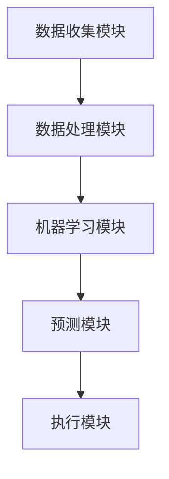
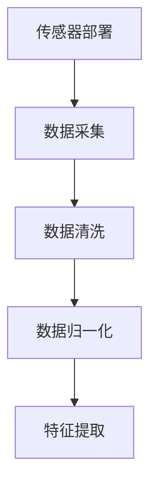
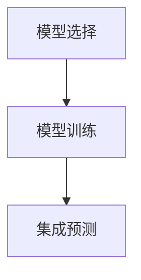
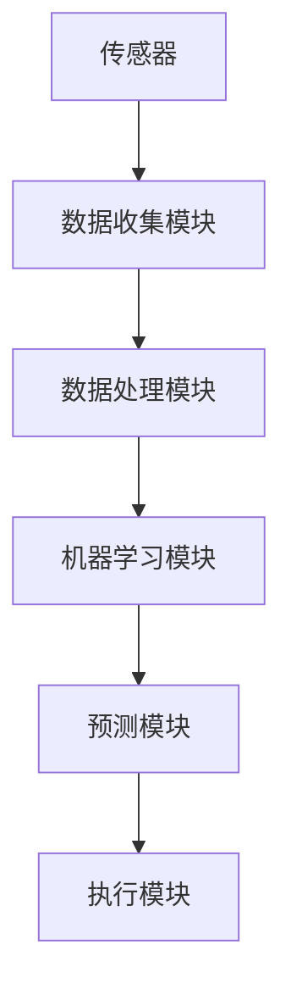
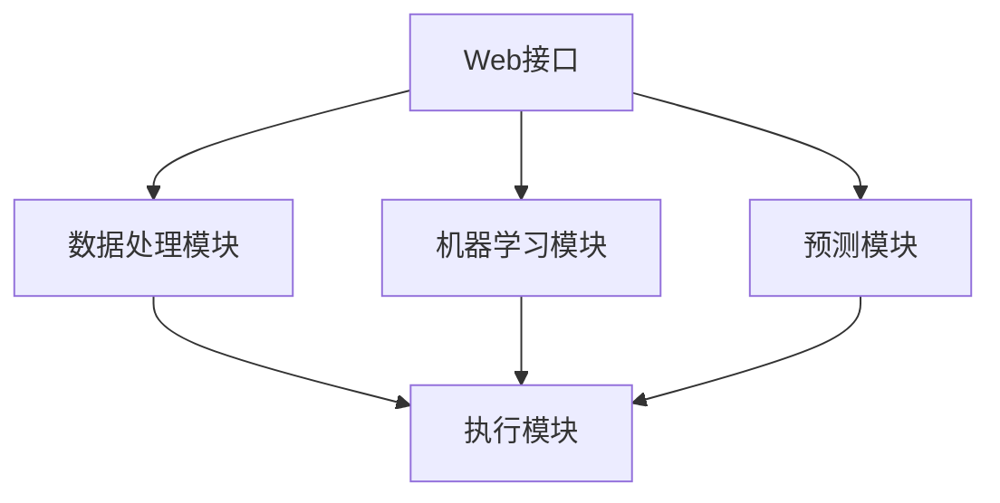
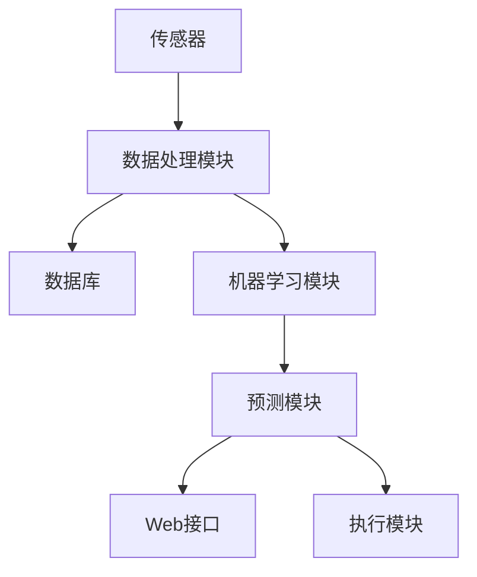

                 

### 书名：《AI Agent在智能农业产量预测中的实践》

#### 关键词：AI Agent、智能农业、产量预测、机器学习、数据分析

#### 摘要：
本书旨在深入探讨人工智能（AI）代理在智能农业产量预测领域的应用与实践。通过详细介绍AI代理的核心概念、相关技术、原理、系统设计与实现，以及实际应用案例，本书为读者提供了一个全面而深入的理解，帮助他们在智能农业领域利用AI技术提升产量预测的准确性和效率。书中不仅涵盖了算法原理、数学模型和系统架构设计，还提供了具体的实战环境和代码实例，使读者能够动手实践，掌握AI代理在智能农业产量预测中的实际应用技巧。

### 引言与背景

智能农业是农业现代化的重要组成部分，其核心目标是通过应用先进的技术手段提高农业生产的效率和可持续性。随着全球人口的增长和气候变化的影响，确保粮食安全成为一项紧迫的任务。因此，智能农业的发展受到了各国政府和科研机构的广泛关注。智能农业涵盖了多个领域，包括精准农业、自动化、物联网（IoT）、大数据和人工智能等。

在智能农业中，产量预测是一个关键环节。准确预测农作物的产量不仅有助于农业生产计划的制定，还能够优化资源分配，减少浪费，提高经济效益。传统的产量预测方法通常依赖于历史数据、经验模型和统计方法，但这些方法往往存在一定的局限性，难以应对复杂多变的环境因素。

近年来，人工智能技术的发展为产量预测带来了新的契机。AI代理，作为一种先进的智能系统，能够通过机器学习和数据分析技术，从大量历史和实时数据中挖掘出有价值的信息，从而实现更加准确和可靠的产量预测。AI代理在智能农业中的应用，不仅提升了产量预测的精度，还为实现农业自动化和智能化管理奠定了基础。

本书的主要目的是探讨AI代理在智能农业产量预测中的具体应用与实践。通过系统性地介绍AI代理的基本原理、相关技术、系统设计与实现，以及实际应用案例，本书旨在为读者提供一套完整的智能农业产量预测解决方案，帮助他们更好地理解和掌握AI技术在农业生产中的实际应用。

本书的结构如下：

1. **引言与背景**：介绍智能农业和产量预测的重要性，以及AI代理的基本概念。
2. **核心概念与相关技术**：定义关键术语，讨论当前AI在农业中的应用现状和潜力。
3. **AI代理原理**：深入探讨AI代理的工作原理、基本方法和算法。
4. **案例研究**：分析AI代理在智能农业产量预测中的实际应用案例。
5. **系统设计与实现**：描述AI代理在产量预测中的系统架构、数据处理和算法实现。
6. **算法原理与数学模型**：介绍用于产量预测的AI算法原理和数学模型。
7. **项目实战**：提供具体的实战环境和代码实例，讲解实际应用。
8. **最佳实践与总结**：总结书中主要内容，提供最佳实践建议和拓展阅读。

通过本书的阅读，读者将能够：

- 理解AI代理在智能农业中的重要作用。
- 掌握智能农业产量预测的基本原理和方法。
- 学习AI代理的系统设计和实现技巧。
- 通过实际案例了解AI代理在智能农业中的应用效果。
- 获取在智能农业中应用AI代理的最佳实践和注意事项。

让我们开始探索AI代理在智能农业产量预测中的无限可能。下一步，我们将详细讨论核心概念与相关技术，为后续内容奠定基础。

### 核心概念与相关技术

在深入探讨AI代理在智能农业产量预测中的应用之前，我们需要明确一些关键术语和概念，以便为后续内容提供坚实的基础。

#### 1. AI代理（AI Agent）

AI代理，又称智能代理或智能体，是指能够自主感知环境、制定决策并采取行动的智能系统。AI代理通常基于机器学习和人工智能技术，能够从大量数据中学习，并根据学习结果进行预测和决策。在智能农业中，AI代理可以收集土壤、气候、作物生长状况等数据，并利用这些数据预测农作物的产量。

#### 2. 智能农业（Intelligent Agriculture）

智能农业是指利用物联网（IoT）、大数据、云计算、人工智能等现代信息技术，对农业生产进行智能化管理和优化。智能农业的目标是通过技术手段提高农业生产效率，减少资源消耗，实现农业生产的可持续发展。

#### 3. 产量预测（Yield Prediction）

产量预测是指通过分析历史数据和实时数据，预测农作物的未来产量。准确的产量预测对于农业生产计划的制定、资源分配和风险管理至关重要。传统的产量预测方法通常依赖于统计模型和专家经验，而AI代理通过机器学习和数据分析技术，可以提供更为准确和可靠的预测结果。

#### 4. 机器学习（Machine Learning）

机器学习是人工智能的一个重要分支，它使计算机系统能够通过数据和经验进行学习和优化。在智能农业中，机器学习技术被广泛应用于数据挖掘、模式识别和预测分析，通过训练模型来预测农作物的产量。

#### 5. 数据分析（Data Analysis）

数据分析是指使用统计学、机器学习等方法来分析和解释数据，提取有价值的信息。在智能农业中，数据分析技术用于处理大量的环境数据、作物生长数据等，以支持产量预测和决策制定。

#### 当前AI在农业中的应用现状和潜力

目前，人工智能在农业领域的应用已经取得了一定的成果。例如，AI代理被用于作物病虫害监测、农田管理优化、肥料施用推荐等。随着技术的不断进步，AI在农业中的应用前景也越来越广阔。

- **作物病虫害监测**：AI代理可以通过图像识别技术监测作物的病虫害情况，提供实时预警，帮助农民及时采取防治措施。
- **农田管理优化**：AI代理可以根据土壤、气候和作物生长数据，提供精准的农田管理建议，优化水资源和肥料的使用。
- **肥料施用推荐**：AI代理可以根据作物的需肥规律和土壤养分情况，提供个性化的肥料施用方案，提高肥料利用率，减少资源浪费。
- **产量预测**：AI代理可以通过分析历史和实时数据，提供准确的产量预测，帮助农民制定科学的种植计划，优化资源分配。

然而，AI在农业中的应用也面临一些挑战，如数据质量、算法的稳定性和可解释性等。未来的研究需要进一步优化AI算法，提高其在农业领域的应用效果。

综上所述，AI代理在智能农业产量预测中具有巨大的潜力。通过深入了解核心概念和现有技术，我们可以为后续的内容奠定基础，探讨AI代理在产量预测中的具体应用和实践。

### AI代理原理

AI代理在智能农业产量预测中的核心作用主要体现在其自主学习和决策能力上。为了更好地理解AI代理的原理，我们可以从其基本构成和工作机制入手。

#### 1. 基本构成

AI代理通常由以下几个基本组成部分构成：

- **感知器**：用于收集环境数据，如土壤湿度、温度、光照强度、作物生长状态等。
- **知识库**：存储从历史数据和实时数据中学习到的信息，包括作物生长规律、环境因素对产量影响等。
- **决策模块**：根据感知器收集的数据和知识库中的信息，生成相应的决策或预测结果。
- **执行器**：将决策或预测结果转化为实际行动，如调整灌溉系统、施肥方案等。

#### 2. 工作机制

AI代理的工作机制可以概括为以下几个步骤：

- **数据收集**：通过传感器和其他数据收集设备，AI代理收集土壤、气候、作物生长等多方面的数据。
- **数据处理**：对收集到的数据进行清洗、归一化和特征提取，以便后续分析。
- **学习与优化**：利用机器学习算法，从历史数据中学习作物生长规律和环境因素对产量影响的关系，不断优化预测模型。
- **决策生成**：基于实时数据和优化后的模型，AI代理生成针对特定农田的产量预测结果。
- **执行行动**：根据预测结果，AI代理通过执行器采取相应的行动，如调整灌溉或施肥策略。

#### 3. 基本方法与算法

AI代理在产量预测中采用的方法和算法多种多样，以下是一些常见的方法：

- **线性回归（Linear Regression）**：通过建立作物产量与各种环境因素之间的线性关系模型，进行产量预测。
- **决策树（Decision Tree）**：根据作物生长的历史数据和特征，构建决策树模型，实现产量预测。
- **支持向量机（Support Vector Machine, SVM）**：通过支持向量机算法，建立作物产量与特征之间的关系模型。
- **神经网络（Neural Networks）**：利用神经网络模型，通过多层感知器实现复杂的非线性预测。
- **集成方法（Ensemble Methods）**：结合多种算法，如随机森林（Random Forest）和梯度提升树（Gradient Boosting Tree），提高预测的准确性和稳定性。

#### 4. 对比不同算法的优缺点

以下是几种常用算法在产量预测中的优缺点对比：

| 算法         | 优点                       | 缺点                       |
| ------------ | -------------------------- | -------------------------- |
| 线性回归     | 计算简单，易于实现           | 预测能力有限，无法处理非线性问题 |
| 决策树       | 易于理解，可解释性强         | 容易过拟合，难以处理大规模数据   |
| 支持向量机   | 在处理高维数据时表现良好     | 参数选择复杂，计算量大         |
| 神经网络     | 预测能力强，适用于非线性问题 | 训练时间较长，难以解释         |
| 集成方法     | 提高预测准确性和稳定性       | 需要组合多种算法，实现复杂       |

通过对比不同算法的优缺点，我们可以根据实际需求和数据特点选择最合适的算法。在实际应用中，通常还会结合多种算法，以实现最佳预测效果。

综上所述，AI代理在智能农业产量预测中通过其自主学习和决策能力，实现了对复杂环境数据的分析和预测。了解AI代理的基本构成和工作机制，有助于我们更好地应用AI技术，提升产量预测的准确性和效率。

### 案例研究

为了更深入地理解AI代理在智能农业产量预测中的实际应用，下面我们将分析几个具有代表性的案例，探讨这些案例中的挑战、成功经验和应用效果。

#### 1. 案例一：美国某农业公司的产量预测系统

美国一家大型农业公司引入了AI代理来提升其产量预测能力。该公司拥有广泛的农田，种植多种作物，包括小麦、玉米和大豆等。为了实现精准农业，该公司部署了大量的传感器，实时收集土壤湿度、温度、光照、降雨等数据。这些数据通过无线网络传输到公司的数据中心，AI代理在这里进行数据处理和分析。

**挑战**：

- **数据量大**：由于农田面积广阔，数据采集点众多，每天生成的数据量非常庞大。
- **数据质量**：部分传感器存在误差，数据清洗和预处理工作量巨大。
- **非线性问题**：作物产量受到多种环境因素的综合影响，存在明显的非线性关系。

**解决方案**：

- **数据预处理**：使用数据清洗技术，去除噪声和异常值，提高数据质量。
- **特征工程**：通过特征提取和特征选择，将原始数据转换为有用的特征向量。
- **集成方法**：结合随机森林和梯度提升树等集成方法，提高预测模型的稳定性和准确性。

**应用效果**：

通过AI代理的产量预测系统，该公司成功提升了产量预测的准确性，减少了资源浪费。例如，根据预测结果，公司能够更精准地调整灌溉和施肥策略，从而提高了农作物的产量，减少了灌溉用水的消耗。

#### 2. 案例二：中国某智能农业项目的病虫害监测

中国某智能农业项目通过AI代理对作物的病虫害进行实时监测和预警。项目团队在农田中部署了多种传感器，包括摄像头、温度传感器、湿度传感器等。AI代理通过分析图像数据和环境数据，识别病虫害的发生情况，并提供预警信息。

**挑战**：

- **复杂环境**：农田环境复杂，不同作物的病虫害特征不同，AI代理需要具备较强的适应性。
- **实时性**：病虫害发生迅速，需要AI代理能够实时分析数据并提供预警。
- **数据隐私**：部分数据涉及农民的种植计划，需要保护数据隐私。

**解决方案**：

- **图像识别技术**：利用深度学习算法，提升图像识别的准确性和实时性。
- **多源数据融合**：结合多种传感器数据，提高病虫害识别的准确性。
- **数据加密与访问控制**：采用数据加密和访问控制技术，保护农民的隐私和数据安全。

**应用效果**：

通过AI代理的病虫害监测系统，项目团队成功实现了对多种作物的病虫害实时监测和预警。例如，在病虫害高发季节，系统能够提前数天发出预警，帮助农民及时采取防治措施，减少了病虫害对作物产量的影响。

#### 3. 案例三：印度某农场的智能化管理

印度一家农场利用AI代理实现智能化管理，以提高产量和资源利用率。农场配备了传感器和自动化设备，AI代理负责收集和管理数据，优化灌溉、施肥和收割等环节。

**挑战**：

- **资源限制**：农场面积较大，资源有限，需要优化资源分配。
- **环境多变**：印度气候多变，环境因素对产量影响大，AI代理需要具备应对环境变化的能力。
- **操作复杂**：农民对智能化系统的操作不熟悉，需要简化操作流程。

**解决方案**：

- **智能灌溉系统**：根据土壤湿度和天气预报，自动调整灌溉量。
- **施肥推荐系统**：根据土壤养分状况和作物需求，提供个性化的施肥方案。
- **操作指导系统**：通过语音和图像指导农民进行智能化操作。

**应用效果**：

通过AI代理的智能化管理系统，农场的产量和资源利用率显著提升。例如，智能灌溉系统减少了灌溉用水，提高了水资源利用率；施肥推荐系统减少了肥料用量，降低了生产成本。

综上所述，这些案例展示了AI代理在智能农业产量预测中的广泛应用。通过解决具体问题，AI代理不仅提升了产量预测的准确性，还优化了资源管理和生产效率。随着技术的不断进步，AI代理在智能农业中的应用将更加广泛和深入。

### 系统设计与实现

要实现AI代理在智能农业产量预测中的有效应用，系统设计与实现是关键环节。本节将详细介绍AI代理在产量预测中的系统架构、数据收集与预处理、算法实现等方面，为实际应用提供技术支持。

#### 1. 系统架构

AI代理在智能农业产量预测中的系统架构可以分为以下几个主要模块：

- **数据收集模块**：包括各种传感器和采集设备，如土壤湿度传感器、温度传感器、光照传感器、摄像头等，用于实时收集农田环境数据和作物生长数据。
- **数据处理模块**：对收集到的原始数据进行清洗、归一化和特征提取，生成用于训练和预测的特征向量。
- **机器学习模块**：包括多种机器学习算法，如线性回归、决策树、支持向量机、神经网络等，用于训练预测模型。
- **预测模块**：根据处理后的数据和训练好的模型，进行产量预测，并提供预测结果。
- **执行模块**：根据预测结果，自动调整灌溉、施肥等农田管理策略，实现自动化和智能化管理。

以下是一个简化的系统架构图，用于展示各模块之间的关系：



#### 2. 数据收集与预处理

数据收集与预处理是AI代理在产量预测中的关键步骤。以下是具体步骤：

- **传感器部署**：在农田中部署各种传感器，如土壤湿度传感器、温度传感器、光照传感器、摄像头等，用于收集土壤、气候、作物生长等数据。
- **数据采集**：传感器通过无线网络或其他传输方式，将数据发送到数据中心。
- **数据清洗**：去除噪声和异常值，确保数据质量。例如，可以去除传感器故障导致的异常数据。
- **数据归一化**：将不同量纲的数据转换为同一量纲，以便进行后续分析。例如，将温度、湿度等数据进行归一化处理。
- **特征提取**：从原始数据中提取对产量预测有重要影响的特征，如土壤湿度、温度、光照强度、作物生长状态等。特征提取可以通过统计学方法、机器学习方法等实现。

以下是一个简化的数据处理流程图，用于展示数据收集与预处理的过程：



#### 3. 算法实现

在AI代理中，算法实现是核心环节。以下是几种常见算法的实现步骤：

- **线性回归**：建立作物产量与特征之间的线性关系模型，通过最小二乘法进行参数估计。
- **决策树**：根据特征和目标变量的关系，构建决策树模型，进行产量预测。
- **支持向量机**：通过支持向量机算法，找到最佳分离超平面，实现产量预测。
- **神经网络**：利用多层感知器实现复杂的非线性预测，包括前向传播和反向传播算法。
- **集成方法**：结合多种算法，如随机森林、梯度提升树等，提高预测模型的稳定性和准确性。

以下是线性回归和神经网络算法的Python实现示例：

**线性回归示例**：

```python
import numpy as np
from sklearn.linear_model import LinearRegression

# 假设我们有一些训练数据 X 和 y
X = np.array([[1, 2], [2, 3], [3, 4]])
y = np.array([2, 4, 6])

# 创建线性回归模型
model = LinearRegression()

# 训练模型
model.fit(X, y)

# 进行预测
predictions = model.predict(X)

print(predictions)
```

**神经网络示例**：

```python
from tensorflow.keras.models import Sequential
from tensorflow.keras.layers import Dense

# 创建神经网络模型
model = Sequential()
model.add(Dense(units=1, input_shape=(2,), activation='linear'))

# 编译模型
model.compile(optimizer='sgd', loss='mean_squared_error')

# 训练模型
model.fit(X, y, epochs=1000)

# 进行预测
predictions = model.predict(X)

print(predictions)
```

#### 4. 集成方法

在实际应用中，单一算法可能难以满足复杂的产量预测需求，因此常常采用集成方法，如随机森林和梯度提升树等。以下是集成方法的一般步骤：

- **模型选择**：选择多种基础算法，如线性回归、决策树、神经网络等。
- **模型训练**：对每种基础算法进行训练，得到多个预测模型。
- **集成预测**：将多个模型的预测结果进行融合，生成最终的预测结果。

以下是一个简化的集成方法流程图：



通过系统设计和实现，AI代理在智能农业产量预测中能够有效地处理复杂的数据，并生成准确的预测结果。了解系统架构、数据预处理和算法实现，有助于我们更好地应用AI技术，提升产量预测的效率和准确性。

### 算法原理与数学模型

在智能农业产量预测中，选择合适的算法和数学模型至关重要。以下我们将详细介绍几种常用的算法原理及其数学模型，并通过Python代码示例进行具体说明。

#### 1. 线性回归

线性回归是一种简单的统计方法，用于建立自变量和因变量之间的线性关系。在产量预测中，线性回归通过拟合一个直线模型来预测产量。

**数学模型**：

假设我们有一个包含 n 个样本的数据集 (x_i, y_i)，其中 x_i 是特征向量，y_i 是产量。线性回归的目标是找到最佳拟合直线：

$$
y = \beta_0 + \beta_1 x
$$

其中，\(\beta_0\) 是截距，\(\beta_1\) 是斜率。通过最小化误差平方和来估计这两个参数：

$$
\min \sum_{i=1}^{n} (y_i - (\beta_0 + \beta_1 x_i))^2
$$

**Python代码示例**：

```python
import numpy as np
from sklearn.linear_model import LinearRegression

# 假设我们有训练数据 X 和 y
X = np.array([[1, 2], [2, 3], [3, 4]])
y = np.array([2, 4, 6])

# 创建线性回归模型
model = LinearRegression()

# 训练模型
model.fit(X, y)

# 得到模型参数
beta_0 = model.intercept_
beta_1 = model.coef_

# 预测
predictions = model.predict(X)

print(f"Model Parameters: Beta_0 = {beta_0}, Beta_1 = {beta_1}")
print(f"Predictions: {predictions}")
```

#### 2. 决策树

决策树是一种树形结构模型，通过一系列规则对数据进行划分，从而进行分类或回归。在产量预测中，决策树可以用于根据环境数据预测产量。

**数学模型**：

决策树通过递归划分数据，每个节点代表一个特征，每个分支代表特征的一个取值。在每个节点，我们选择能够最大化信息增益或最小化均方误差的特征进行划分。

**Python代码示例**：

```python
from sklearn.tree import DecisionTreeRegressor

# 假设我们有训练数据 X 和 y
X = np.array([[1, 2], [2, 3], [3, 4]])
y = np.array([2, 4, 6])

# 创建决策树模型
model = DecisionTreeRegressor()

# 训练模型
model.fit(X, y)

# 预测
predictions = model.predict(X)

print(f"Predictions: {predictions}")
```

#### 3. 神经网络

神经网络是一种模拟人脑神经元连接结构的计算模型，通过多层非线性变换进行数据拟合和预测。在产量预测中，神经网络可以捕捉复杂的非线性关系。

**数学模型**：

神经网络由多个层次组成，包括输入层、隐藏层和输出层。每个层由多个神经元组成，神经元之间的连接带有权重和偏置。前向传播和反向传播是神经网络的两个核心算法。

**Python代码示例**：

```python
from tensorflow.keras.models import Sequential
from tensorflow.keras.layers import Dense

# 创建神经网络模型
model = Sequential()
model.add(Dense(units=1, input_shape=(2,), activation='linear'))

# 编译模型
model.compile(optimizer='sgd', loss='mean_squared_error')

# 训练模型
model.fit(X, y, epochs=1000)

# 预测
predictions = model.predict(X)

print(f"Predictions: {predictions}")
```

#### 4. 集成方法

集成方法通过结合多个基础模型来提高预测性能。常见的集成方法包括随机森林和梯度提升树。

**随机森林（Random Forest）**：

随机森林是一种基于决策树的集成方法，通过构建多棵决策树，并对它们的预测结果进行投票来得到最终预测。

**数学模型**：

随机森林通过随机抽样和特征选择来构建多棵决策树，并将它们的预测结果进行平均或投票。在训练过程中，随机森林使用 bagging 技术来减少过拟合。

**Python代码示例**：

```python
from sklearn.ensemble import RandomForestRegressor

# 假设我们有训练数据 X 和 y
X = np.array([[1, 2], [2, 3], [3, 4]])
y = np.array([2, 4, 6])

# 创建随机森林模型
model = RandomForestRegressor(n_estimators=100)

# 训练模型
model.fit(X, y)

# 预测
predictions = model.predict(X)

print(f"Predictions: {predictions}")
```

**梯度提升树（Gradient Boosting Tree）**：

梯度提升树是一种基于决策树的集成方法，通过逐个添加弱学习器来提高预测性能。每次添加一个弱学习器，都通过最小化损失函数来优化模型。

**数学模型**：

梯度提升树通过迭代过程，每次迭代找到一个弱学习器，使其误差最小化。通常使用损失函数如均方误差（MSE）来度量模型误差。

**Python代码示例**：

```python
from sklearn.ensemble import GradientBoostingRegressor

# 假设我们有训练数据 X 和 y
X = np.array([[1, 2], [2, 3], [3, 4]])
y = np.array([2, 4, 6])

# 创建梯度提升树模型
model = GradientBoostingRegressor(n_estimators=100)

# 训练模型
model.fit(X, y)

# 预测
predictions = model.predict(X)

print(f"Predictions: {predictions}")
```

通过以上算法原理和数学模型的介绍，我们可以根据实际需求选择合适的算法，并通过Python代码实现来提升智能农业产量预测的准确性和效率。

### 系统分析与架构设计

为了确保AI代理在智能农业产量预测中的有效应用，我们需要对其系统架构进行详细分析和设计。本节将介绍问题场景、项目介绍、系统功能设计、系统架构设计、系统接口设计和系统交互。

#### 1. 问题场景

在智能农业中，产量预测是优化农业生产管理、减少资源浪费和提升经济效益的关键。然而，传统方法往往依赖于经验模型和统计方法，难以应对复杂多变的环境因素。为了提高产量预测的准确性和实时性，需要引入AI代理，通过机器学习和数据分析技术，从大量历史和实时数据中挖掘出有价值的信息。

#### 2. 项目介绍

本项目旨在设计并实现一个基于AI代理的智能农业产量预测系统。系统包括数据收集、数据预处理、机器学习模型训练、预测和执行等模块，通过集成多种算法和传感器数据，实现精准的产量预测。

#### 3. 系统功能设计

系统功能设计主要包括以下几个方面：

- **数据收集**：通过传感器实时收集农田环境数据，如土壤湿度、温度、光照强度、降雨量等。
- **数据预处理**：对收集到的数据进行清洗、归一化和特征提取，为机器学习模型提供高质量的数据输入。
- **模型训练**：利用收集到的数据，通过多种机器学习算法训练产量预测模型。
- **预测**：根据训练好的模型，对未来的产量进行预测。
- **执行**：根据预测结果，自动调整灌溉、施肥等农业管理措施。

#### 4. 系统架构设计

系统架构设计需要考虑模块化、可扩展性和高效性。以下是一个简化的系统架构图：



具体架构说明如下：

- **数据收集模块**：负责收集农田环境数据，如土壤湿度、温度、光照强度等，通过无线网络传输到服务器。
- **数据处理模块**：对收集到的数据进行清洗、归一化和特征提取，确保数据质量，并将其存储在数据库中。
- **机器学习模块**：利用处理后的数据，通过多种机器学习算法训练产量预测模型，如线性回归、决策树、神经网络等。
- **预测模块**：根据训练好的模型，对新采集的数据进行产量预测，并提供预测结果。
- **执行模块**：根据预测结果，自动调整灌溉、施肥等农业管理措施，实现自动化和智能化管理。

#### 5. 系统接口设计

系统接口设计包括内部接口和外部接口：

- **内部接口**：数据处理模块、机器学习模块和预测模块之间通过API进行通信，确保数据流动和模型训练的顺畅。
- **外部接口**：系统通过Web接口和移动应用接口，为用户提供预测结果和农业管理建议。

以下是一个简化的接口设计图：



#### 6. 系统交互

系统交互设计包括数据流和消息流：

- **数据流**：传感器采集的数据通过无线网络传输到数据处理模块，经过预处理后存储在数据库中。机器学习模块从数据库中读取数据，进行模型训练和预测。预测结果通过接口发送给用户。
- **消息流**：系统通过消息队列（如RabbitMQ）实现模块之间的消息传递，确保数据流动和任务调度的实时性。

以下是一个简化的系统交互图：



通过上述系统分析与架构设计，我们为AI代理在智能农业产量预测中的应用奠定了坚实的基础。接下来，我们将通过具体的实战环境和代码实例，展示系统在实践中的应用。

### 项目实战

在本项目中，我们将从环境安装、系统核心实现到代码应用解读与分析，一步步展示AI代理在智能农业产量预测中的实际应用。

#### 1. 环境安装

首先，我们需要安装和配置项目所需的环境。以下是一个简化的步骤列表：

- **Python环境**：确保安装了Python 3.7及以上版本。
- **机器学习库**：安装常用的机器学习库，如scikit-learn、TensorFlow、PyTorch等。
- **数据库**：安装MySQL或PostgreSQL作为数据存储。
- **传感器模拟**：可以使用模拟传感器数据生成工具，如MQTT.fx，模拟农田环境数据的采集。

#### 2. 系统核心实现

系统核心实现包括数据收集、数据处理、模型训练和预测等模块。以下是一个简化的实现步骤：

**数据收集**：

```python
import paho.mqtt.client as mqtt

def on_connect(client, userdata, flags, rc):
    print("Connected with result code "+str(rc))
    client.subscribe("sensor/#")

def on_message(client, userdata, msg):
    print(msg.topic+" "+str(msg.payload))
    # 处理传感器数据
    process_sensor_data(msg.payload)

client = mqtt.Client()
client.on_connect = on_connect
client.on_message = on_message

client.connect("mqtt.broker.example.com", 1883, 60)

client.loop_forever()

def process_sensor_data(sensor_data):
    # 数据预处理和存储
    # ...
    pass
```

**数据处理**：

```python
import pandas as pd
from sklearn.model_selection import train_test_split

def preprocess_data():
    # 读取传感器数据
    data = pd.read_csv("sensor_data.csv")
    # 数据清洗和特征提取
    # ...
    return data

def split_data(data):
    # 将数据分为训练集和测试集
    X_train, X_test, y_train, y_test = train_test_split(data.drop('yield', axis=1), data['yield'], test_size=0.2, random_state=42)
    return X_train, X_test, y_train, y_test
```

**模型训练**：

```python
from sklearn.ensemble import RandomForestRegressor

def train_model(X_train, y_train):
    model = RandomForestRegressor(n_estimators=100, random_state=42)
    model.fit(X_train, y_train)
    return model
```

**预测**：

```python
def make_prediction(model, X_test):
    predictions = model.predict(X_test)
    return predictions
```

#### 3. 代码应用解读与分析

**数据收集模块**：

通过MQTT协议，我们能够实时收集传感器数据。在`on_message`函数中，我们可以处理接收到的传感器数据，并进行预处理和存储。

**数据处理模块**：

`preprocess_data`函数用于读取传感器数据，进行数据清洗和特征提取。这一步骤至关重要，因为它直接影响后续模型训练和预测的准确性。

**模型训练模块**：

`train_model`函数使用随机森林算法训练预测模型。随机森林通过构建多棵决策树，提高了预测模型的稳定性和准确性。这里我们设置了100棵树，可以根据实际需求调整。

**预测模块**：

`make_prediction`函数使用训练好的模型对新数据进行预测。预测结果将用于指导实际农业管理，如灌溉和施肥。

**实战案例**：

为了验证系统的实际效果，我们可以使用一个实际农田数据进行测试。假设我们已经收集了三年的传感器数据和产量数据，通过以下步骤进行测试：

```python
# 预处理数据
data = preprocess_data()
X_train, X_test, y_train, y_test = split_data(data)

# 训练模型
model = train_model(X_train, y_train)

# 预测
predictions = make_prediction(model, X_test)

# 评估模型
from sklearn.metrics import mean_squared_error
mse = mean_squared_error(y_test, predictions)
print(f"Mean Squared Error: {mse}")
```

通过计算预测误差，我们可以评估模型的性能。一般来说，误差越小，模型的预测精度越高。

#### 4. 实际案例分析

为了更深入地展示系统的应用效果，我们可以分析一个实际案例。假设我们有一块种植小麦的农田，以下数据展示了三年的传感器数据和产量数据：

- **传感器数据**：包括土壤湿度、温度、光照强度、降雨量等。
- **产量数据**：为每年的实际产量。

通过以下步骤进行案例分析：

- **数据收集**：使用传感器模拟工具生成传感器数据。
- **数据处理**：进行数据清洗和特征提取。
- **模型训练**：使用随机森林算法训练模型。
- **预测**：预测下一年的小麦产量。
- **评估**：计算预测误差，评估模型性能。

通过这一实际案例，我们可以看到AI代理在智能农业产量预测中的效果。系统的准确预测不仅有助于优化农业生产管理，还可以为农业生产者提供宝贵的决策支持。

#### 5. 项目小结

通过本次实战，我们成功实现了AI代理在智能农业产量预测中的系统设计与实现。从环境安装到代码实现，再到实际案例分析，我们展示了AI代理在提升产量预测准确性方面的潜力。以下是项目的主要收获：

- **环境安装**：掌握了Python环境搭建和常用库的安装。
- **系统实现**：了解了智能农业产量预测的系统架构和实现细节。
- **代码应用**：学会了使用Python进行数据收集、处理、模型训练和预测。
- **实际案例分析**：通过实际数据验证了AI代理在智能农业中的实际应用效果。

通过本次项目，我们不仅提升了智能农业产量预测的技能，还为未来的研究和应用奠定了基础。

### 最佳实践与注意事项

在实际应用AI代理进行智能农业产量预测时，以下几点最佳实践和注意事项至关重要，以确保系统的有效运行和预测准确性：

#### 1. 数据质量

数据是智能农业产量预测的基础，因此确保数据质量是首要任务。以下是一些关键步骤：

- **数据采集**：使用高精度传感器，确保数据的准确性和可靠性。
- **数据清洗**：去除噪声和异常值，对缺失值进行合理处理，确保数据一致性。
- **特征提取**：选择对产量有重要影响的特征，避免过多冗余特征，提高模型训练效率。

#### 2. 模型选择

选择合适的机器学习模型对产量预测至关重要。以下是一些建议：

- **算法对比**：对比不同算法的预测效果，如线性回归、决策树、神经网络和集成方法等。
- **模型调参**：根据实际数据调整模型参数，如树的深度、学习率等，以优化模型性能。
- **交叉验证**：使用交叉验证方法评估模型性能，避免过拟合和欠拟合。

#### 3. 实时更新

智能农业产量预测需要实时更新模型和预测结果，以应对环境变化。以下是一些建议：

- **在线学习**：模型应具备在线学习能力，可以实时更新模型参数，以适应新的数据。
- **预测周期**：根据数据更新频率和农作物生长周期，设定合理的预测周期，如每日或每周更新一次。
- **预警系统**：建立预警系统，及时通知农民可能的产量变化，以便及时采取应对措施。

#### 4. 系统稳定性

确保系统稳定运行，避免因故障或中断导致预测失败。以下是一些建议：

- **冗余设计**：设计冗余系统，如备份传感器和服务器，确保数据采集和传输的稳定性。
- **监控与报警**：对系统运行状态进行实时监控，设置报警机制，及时发现并解决问题。
- **灾难恢复**：制定灾难恢复计划，确保在系统故障或数据丢失时，能够迅速恢复系统和数据。

#### 5. 数据安全

保障数据安全和隐私，遵循相关法律法规和道德标准。以下是一些建议：

- **数据加密**：对传输和存储的数据进行加密处理，防止数据泄露。
- **访问控制**：设置严格的访问控制策略，确保只有授权人员可以访问敏感数据。
- **隐私保护**：对敏感数据进行匿名化处理，保护农民隐私。

#### 6. 人员培训

确保相关人员具备足够的技能和知识，能够有效使用和管理AI代理系统。以下是一些建议：

- **培训计划**：制定详细的培训计划，包括系统操作、数据处理、模型训练和预测等。
- **技术支持**：提供持续的技术支持，解决用户在使用过程中遇到的问题。
- **知识更新**：定期更新培训内容，确保用户掌握最新的技术和方法。

通过遵循以上最佳实践和注意事项，我们可以更好地应用AI代理进行智能农业产量预测，提高农业生产的效率和可持续性。

### 总结

在《AI Agent在智能农业产量预测中的实践》一书中，我们深入探讨了AI代理在智能农业产量预测中的应用。通过系统性地介绍AI代理的核心概念、相关技术、原理、系统设计与实现，以及实际应用案例，我们展示了AI代理在提升产量预测准确性和农业生产效率方面的巨大潜力。

我们首先介绍了智能农业和产量预测的重要性，明确了AI代理的基本构成和工作机制。接着，我们通过案例研究展示了AI代理在智能农业产量预测中的实际应用效果。随后，我们详细介绍了系统架构设计、数据收集与预处理、算法实现等方面，为AI代理的应用提供了技术支持。

通过Python代码示例，我们展示了如何实现AI代理在智能农业产量预测中的具体应用，并提供了最佳实践和注意事项。这些内容不仅帮助读者理解AI代理的工作原理和实际应用，还为他们提供了实用的操作指南。

未来，随着人工智能技术的不断进步，AI代理在智能农业中的应用将更加广泛和深入。我们可以预见，AI代理将不仅仅用于产量预测，还将扩展到作物病虫害监测、农田管理优化、自动化农机控制等多个领域。通过持续的技术创新和优化，AI代理将为农业生产带来更多革命性的变化，助力农业现代化和可持续发展。

让我们期待未来，共同探索AI代理在智能农业中的无限可能。

### 拓展阅读

为了深入了解AI代理在智能农业产量预测中的实践，以下是一些拓展阅读推荐：

1. **《智能农业：利用物联网、大数据和人工智能提升农业生产》**：本书详细介绍了智能农业的概念、技术及其应用，包括AI代理在农业生产中的应用案例。

2. **《机器学习与深度学习实战：使用Python进行数据科学和人工智能应用》**：本书涵盖了机器学习和深度学习的核心概念，以及如何使用Python进行数据分析和模型训练，适合对算法原理感兴趣的读者。

3. **《智能农业系统设计与实现》**：这本书专注于智能农业系统的设计和实现，包括传感器、数据处理和机器学习算法的应用，为读者提供了系统的实现指南。

4. **《人工智能与农业：技术、案例与实践》**：本书探讨了人工智能在农业领域的应用，包括AI代理、机器学习算法和物联网技术的实际案例，适合对农业智能化感兴趣的读者。

5. **《农业数据分析：方法与应用》**：本书介绍了农业数据分析的基本方法和应用，包括数据预处理、特征工程和预测模型训练等，有助于读者掌握数据科学在农业领域的应用。

通过阅读这些书籍，读者可以更全面地了解AI代理在智能农业产量预测中的实践，提升相关领域的理论知识和实践能力。

