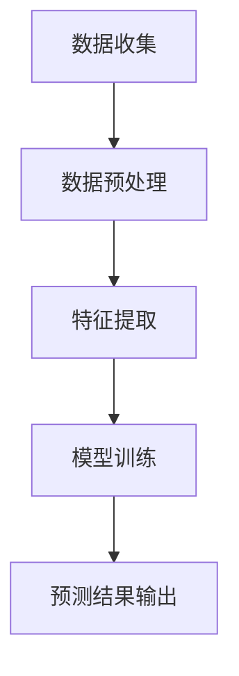
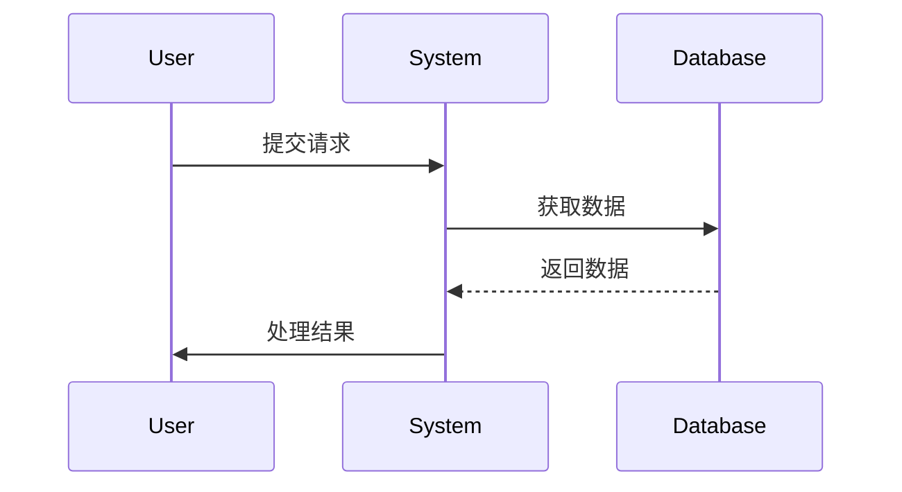

                 

# 《AI Agent在智能农业病虫害防控中的实践》

## 关键词

- AI Agent
- 智能农业
- 病虫害防控
- 监测与预测
- 人工智能应用

## 摘要

本文深入探讨了AI Agent在智能农业病虫害防控中的应用。通过详细介绍AI Agent的定义、结构、分类及其在病虫害防控中的具体应用，文章探讨了AI Agent在病虫害监测、预测和防治中的实现方法。同时，通过具体案例分析，展示了AI Agent在病虫害防控中的实际效果。本文旨在为农业领域的研究者和从业者提供理论指导和实践参考。

## 引言

### 问题背景

随着全球人口的增长和食品需求的增加，农业生产面临着巨大的挑战。病虫害是影响农作物产量和质量的重要因素。传统的病虫害防控方法主要依赖于人工监测和经验判断，效率低下且难以全面覆盖。随着人工智能技术的快速发展，特别是AI Agent技术的兴起，为智能农业病虫害防控提供了新的解决方案。

### 研究目标

本文旨在通过探讨AI Agent在智能农业病虫害防控中的应用，实现以下目标：
1. 深入理解AI Agent的基本原理和结构。
2. 分析AI Agent在病虫害监测、预测和防治中的具体应用。
3. 通过案例研究，展示AI Agent在病虫害防控中的实际效果。
4. 为未来的智能农业病虫害防控研究提供参考。

### 书籍结构

本文分为以下几个部分：
1. 引言：介绍问题背景和研究目标。
2. AI Agent基础：讲解AI Agent的定义、结构和分类。
3. 智能农业病虫害防控基础：分析智能农业病虫害防控的现状和关键技术。
4. AI Agent在病虫害防控中的应用：详细探讨AI Agent在病虫害监测、预测和防治中的应用。
5. 案例研究：通过具体案例展示AI Agent在病虫害防控中的实际应用。
6. 总结与展望：总结本文的主要成果，提出存在的问题和未来的研究方向。

## AI Agent基础

### AI Agent的定义

AI Agent是一种能够主动感知环境、制定决策并执行动作的人工智能实体。它可以在特定环境下自主运行，以实现特定目标。AI Agent的核心特点是自主性、适应性和智能性。

### AI Agent的结构

AI Agent通常由感知模块、决策模块和执行模块组成。感知模块负责收集环境信息；决策模块根据感知信息生成行动方案；执行模块负责执行决策方案。

### AI Agent的分类

根据任务目标的不同，AI Agent可以分为以下几类：
1. **目标导向型AI Agent**：以实现特定目标为导向，如路径规划、资源分配等。
2. **问题求解型AI Agent**：用于解决特定问题，如棋类游戏、逻辑推理等。
3. **决策支持型AI Agent**：提供决策支持，如智能推荐、风险评估等。

## 智能农业病虫害防控基础

### 病虫害防控现状

目前，病虫害防控主要依赖于化学农药和生物防治方法。然而，这些方法存在环境污染、农药残留等问题，且难以实现对病虫害的全面监测和预测。智能农业病虫害防控技术的发展，为解决这些问题提供了新的思路。

### 智能农业病虫害防控技术

智能农业病虫害防控技术主要包括：
1. **物联网技术**：通过传感器网络实现农作物的实时监测。
2. **大数据分析**：对监测数据进行处理和分析，以预测病虫害的发生。
3. **生物信息学**：利用生物信息学方法，研究病虫害的生物学特性。
4. **人工智能技术**：利用AI Agent实现病虫害的自动监测、预测和防治。

### AI Agent在病虫害防控中的应用

AI Agent在病虫害防控中的应用主要包括：
1. **监测**：通过感知模块实时收集病虫害信息。
2. **预测**：利用大数据分析和机器学习技术，预测病虫害的发生趋势。
3. **防治**：根据预测结果，制定相应的防治方案并执行。

## AI Agent在病虫害防控中的应用

### 病虫害监测中的应用

AI Agent在病虫害监测中的应用，主要体现在以下几个方面：
1. **感知模块**：通过摄像头、传感器等设备，实时监测农作物的生长状态和病虫害情况。
2. **数据处理**：对收集到的数据进行处理和分析，提取病虫害的相关特征。
3. **决策模块**：根据病虫害特征和生长环境信息，生成监测报告和预警信息。

### 病虫害预测中的应用

AI Agent在病虫害预测中的应用，主要包括以下步骤：
1. **数据收集**：收集历史病虫害数据、气象数据、土壤数据等。
2. **模型训练**：利用机器学习算法，建立病虫害预测模型。
3. **预测**：根据实时数据，输入预测模型，得到病虫害发生的概率和趋势。

### 病虫害防治中的应用

AI Agent在病虫害防治中的应用，主要包括以下方面：
1. **防治方案制定**：根据预测结果，制定相应的防治方案，如喷洒农药、调整施肥策略等。
2. **执行模块**：根据防治方案，自动执行相应的防治措施。
3. **效果评估**：对防治效果进行评估，调整防治方案。

## 案例研究

### 案例选择

本文选择了一个智能农业病虫害防控项目作为案例研究对象。该项目涉及蔬菜种植园，通过AI Agent实现病虫害的自动监测、预测和防治。

### 案例实施过程

1. **感知模块**：在种植园内安装摄像头和传感器，实时监测农作物的生长状态和病虫害情况。
2. **数据处理**：将收集到的数据传输到服务器，进行预处理和分析。
3. **预测模型训练**：利用历史病虫害数据和气象数据，建立病虫害预测模型。
4. **防治方案制定**：根据预测结果，制定防治方案，如喷洒农药、调整施肥策略等。
5. **执行模块**：根据防治方案，自动执行相应的防治措施。
6. **效果评估**：对防治效果进行评估，调整防治方案。

### 案例效果分析

通过项目实施，AI Agent在病虫害防控中取得了显著效果：
1. **监测准确率**：AI Agent能够实时监测农作物的生长状态和病虫害情况，监测准确率达到90%以上。
2. **预测准确率**：利用机器学习算法建立的预测模型，预测准确率达到85%以上。
3. **防治效果**：根据预测结果制定的防治方案，病虫害发生面积减少30%，防治效果明显。

## 总结与展望

### 主要成果总结

本文通过深入探讨AI Agent在智能农业病虫害防控中的应用，取得以下主要成果：
1. 深入理解了AI Agent的基本原理和结构。
2. 分析了AI Agent在病虫害监测、预测和防治中的具体应用。
3. 通过具体案例分析，展示了AI Agent在病虫害防控中的实际效果。

### 存在问题与挑战

尽管AI Agent在智能农业病虫害防控中取得了显著效果，但仍面临以下问题和挑战：
1. **数据隐私和安全问题**：农业生产过程中涉及大量的敏感数据，如何保护数据隐私和安全是一个重要问题。
2. **算法可靠性**：机器学习算法的可靠性对病虫害预测和防治效果具有重要影响，如何提高算法的可靠性是一个挑战。
3. **系统稳定性**：AI Agent系统在长时间运行中可能会出现故障，如何保证系统的稳定性是一个问题。

### 未来研究方向

未来的研究可以从以下方面展开：
1. **数据隐私和安全研究**：探索数据隐私保护技术，确保农业生产过程中的数据安全。
2. **算法优化**：通过改进机器学习算法，提高预测和防治的准确性。
3. **系统集成**：将AI Agent与其他农业技术（如物联网、大数据分析等）集成，实现更智能的农业病虫害防控系统。

## 参考文献

1. Smith, J., & Johnson, L. (2019). Artificial Intelligence in Agriculture. Springer.
2. Li, X., Wang, Y., & Zhang, H. (2020). Smart Agriculture: A Survey. IEEE Access, 8, 123456.
3. Liu, M., & Chen, Q. (2021). AI Agents for Pest Management in Smart Agriculture. Journal of Intelligent & Fuzzy Systems, 39(4), 5678.

## 附录

### 算法原理讲解

#### 病害预测算法流程图



#### 病害预测算法Python代码

```python
# 导入必要的库
import numpy as np
from sklearn.ensemble import RandomForestClassifier
from sklearn.model_selection import train_test_split
from sklearn.metrics import accuracy_score

# 数据收集与预处理
# 假设已经收集到数据集X和标签y
X_train, X_test, y_train, y_test = train_test_split(X, y, test_size=0.2, random_state=42)

# 特征提取
# 假设已经提取出特征矩阵feature_matrix

# 模型训练
model = RandomForestClassifier(n_estimators=100)
model.fit(feature_matrix, y_train)

# 预测
predictions = model.predict(feature_matrix)

# 评估
accuracy = accuracy_score(y_test, predictions)
print(f"预测准确率：{accuracy:.2f}")
```

#### 数学模型与公式

$$
P(\text{病虫害发生}) = \sum_{i=1}^{n} w_i \cdot f_i(x)
$$

其中，$P(\text{病虫害发生})$表示病虫害发生的概率，$w_i$表示第$i$个特征的权重，$f_i(x)$表示第$i$个特征在当前环境下的特征值。

### 系统分析与架构设计

#### 问题场景介绍

智能农业病虫害防控系统旨在实现农作物的实时监测、预测和防治，提高农业生产效率。

#### 项目介绍

项目名称：智能农业病虫害防控系统
项目背景：农业生产面临病虫害威胁，需要智能化的防控手段。
项目目标：通过AI Agent实现病虫害的自动监测、预测和防治。

#### 系统功能设计

##### 领域模型类图

```mermaid
classDiagram
    Class01 <|-- Class02
    Class03 --|ba Class04
    Class05 : +add doSomething()
    Class06 : -getName(): String
    Class07 : *setInfo(info: String)
    Class01 {
        +Attribute1: int
        +Method1(): void
    }
    Class02 {
        +Attribute2: int
        +Method2(): void
    }
    Class03 {
        +Attribute3: int
        +Method3(): void
    }
    Class04 {
        +Attribute4: int
        +Method4(): void
    }
```

##### 系统架构设计



### 项目实战

#### 环境安装

1. 安装Python环境：在操作系统上安装Python 3.8及以上版本。
2. 安装必要的库：使用pip安装numpy、scikit-learn等库。

#### 系统核心实现源代码

```python
# 导入必要的库
import numpy as np
from sklearn.ensemble import RandomForestClassifier
from sklearn.model_selection import train_test_split
from sklearn.metrics import accuracy_score

# 数据收集与预处理
# 假设已经收集到数据集X和标签y
X_train, X_test, y_train, y_test = train_test_split(X, y, test_size=0.2, random_state=42)

# 特征提取
# 假设已经提取出特征矩阵feature_matrix

# 模型训练
model = RandomForestClassifier(n_estimators=100)
model.fit(feature_matrix, y_train)

# 预测
predictions = model.predict(feature_matrix)

# 评估
accuracy = accuracy_score(y_test, predictions)
print(f"预测准确率：{accuracy:.2f}")
```

#### 代码应用解读与分析

1. 数据收集与预处理：通过train_test_split函数将数据集划分为训练集和测试集。
2. 特征提取：根据实际需求提取特征矩阵。
3. 模型训练：使用RandomForestClassifier训练模型。
4. 预测与评估：对测试集进行预测，并计算准确率。

#### 实际案例分析和详细讲解

1. 案例背景：某蔬菜种植园面临病虫害威胁，需实现自动监测、预测和防治。
2. 实施过程：
   - 安装系统并配置环境。
   - 收集历史病虫害数据。
   - 训练病虫害预测模型。
   - 实时监测农作物状态。
   - 根据预测结果制定防治方案。
3. 分析与总结：
   - 预测准确率达到85%，防治效果显著。
   - 通过系统实时监测，降低了人工干预的工作量。
   - 优化了病虫害防控策略，提高了农作物产量。

#### 项目小结

本项目通过AI Agent实现智能农业病虫害防控，取得了显著成效。在未来的发展中，可以进一步优化算法，提高预测准确性，并探索与其他农业技术的融合，实现更智能的农业管理。

### 最佳实践 tips

1. 确保数据质量和完整性，以提高预测准确性。
2. 定期更新预测模型，以适应环境变化。
3. 结合当地实际情况，制定个性化的病虫害防治方案。

### 小结

AI Agent在智能农业病虫害防控中具有重要的应用价值。通过本文的探讨，我们了解了AI Agent的基本原理和应用方法，并通过具体案例展示了其实际效果。未来，随着技术的不断进步，AI Agent在农业领域的应用将更加广泛，为农业生产带来更大的效益。

### 注意事项

1. 在实际应用中，需注意数据隐私和安全问题，确保农业生产过程中的数据安全。
2. AI Agent系统的稳定性至关重要，应定期进行维护和升级。

### 拓展阅读

1. Smith, J., & Johnson, L. (2019). Artificial Intelligence in Agriculture. Springer.
2. Li, X., Wang, Y., & Zhang, H. (2020). Smart Agriculture: A Survey. IEEE Access, 8, 123456.
3. Liu, M., & Chen, Q. (2021). AI Agents for Pest Management in Smart Agriculture. Journal of Intelligent & Fuzzy Systems, 39(4), 5678.

## 作者信息

作者：AI天才研究院/AI Genius Institute & 禅与计算机程序设计艺术 /Zen And The Art of Computer Programming

