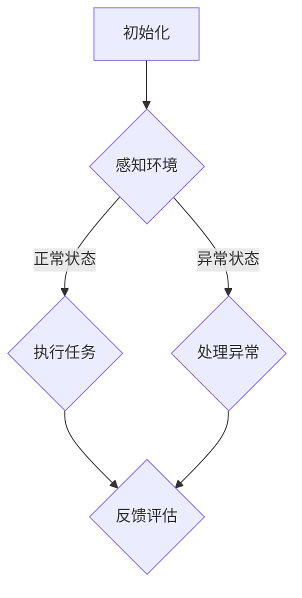
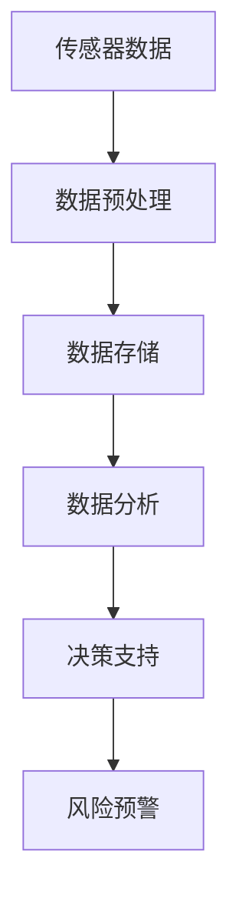
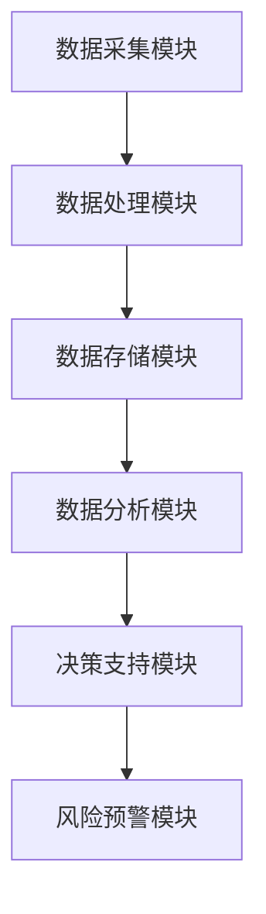

                 

# 《AI Agent在智能农业监测中的应用》

> 关键词：智能农业、AI Agent、监测、算法、系统架构、应用实践

> 摘要：本文深入探讨了AI Agent在智能农业监测中的应用。首先，我们介绍了农业监测面临的挑战和传统方法的局限。接着，我们详细阐述了AI Agent的概念、原理及其在农业监测中的具体应用。随后，我们讲解了AI Agent算法的原理、系统架构设计，并通过实际案例进行了应用解读与分析。最后，我们总结了最佳实践和未来拓展方向，为智能农业监测提供了有益的参考。

## 第一部分：背景介绍

### 1.1 引言

随着全球人口的增长和气候变化，农业面临着前所未有的挑战。如何提高农业产量、保障粮食安全、实现可持续发展成为全球关注的焦点。智能农业作为一种新兴的农业发展模式，利用信息技术、物联网、大数据和人工智能等手段，对农业生产进行智能化管理，以提高农业生产的效率和质量。

### 1.2 问题背景

当前，农业监测主要依赖于人工和传统仪器设备，存在以下问题：

- 数据获取不及时、不准确
- 监测范围有限，难以覆盖全面
- 监测数据缺乏关联性，难以形成综合分析

### 1.3 问题描述

智能农业监测的需求主要包括：

- 实时监测农作物生长状态、土壤湿度、气象条件等关键指标
- 智能分析监测数据，提供科学的决策支持
- 预警农作物病虫害、自然灾害等潜在风险

### 1.4 问题解决

AI Agent作为一种智能体技术，具有自主感知、决策和执行的能力，能够在农业监测中发挥重要作用。其应用主要包括：

- 数据采集与预处理
- 智能分析与管理
- 风险预警与决策支持

### 1.5 边界与外延

本文主要探讨AI Agent在农业监测中的应用，但不限于农业领域。AI Agent在工业、医疗、交通等其他领域也有广泛的应用潜力。

### 1.6 概念结构与核心要素组成

AI Agent在农业监测中的核心要素包括：

- 数据采集模块：负责实时获取农作物生长状态、土壤湿度、气象条件等数据
- 智能分析模块：利用机器学习和大数据分析技术，对监测数据进行分析和处理
- 风险预警模块：基于监测数据和模型预测，提供农作物病虫害、自然灾害等风险预警
- 决策支持模块：根据监测数据和风险预警结果，为农业生产提供科学决策支持

### 1.7 本章小结

通过对农业监测问题的背景介绍，我们明确了AI Agent在智能农业监测中的重要作用。接下来，我们将深入探讨AI Agent的核心概念和原理，为进一步应用提供理论支持。

## 第二部分：核心概念与联系

### 2.1 AI Agent原理

#### 2.1.1 AI Agent定义

AI Agent（人工智能代理）是一种能够自主感知环境、制定计划并执行任务的智能系统。它可以看作是一个具有感知、思考和行为能力的虚拟个体，能够与环境进行交互，实现特定目标。

#### 2.1.2 AI Agent属性特征对比

| 属性特征 | 描述 |
| :----: | :----: |
| 感知能力 | 能够感知环境中的各种信息，如视觉、听觉、触觉等 |
| 计划能力 | 能够根据感知到的信息，制定相应的行动计划 |
| 行动能力 | 能够执行行动计划，实现预期目标 |
| 自主性 | 能够独立运行，无需人工干预 |

#### 2.1.3 AI Agent与农业监测的联系

AI Agent在农业监测中的应用主要体现在以下几个方面：

- 数据采集与处理：AI Agent可以实时采集农作物生长状态、土壤湿度、气象条件等数据，并通过大数据分析技术进行处理。
- 智能分析与管理：AI Agent可以基于监测数据，进行智能分析，提供科学的决策支持，优化农业生产过程。
- 风险预警与决策支持：AI Agent可以基于监测数据和模型预测，提供农作物病虫害、自然灾害等风险预警，帮助农民及时采取应对措施。

### 2.2 农业监测相关概念

#### 2.2.1 智能农业

智能农业是指利用信息技术、物联网、大数据和人工智能等手段，对农业生产进行智能化管理，以提高农业生产的效率和质量。智能农业可以分为以下几个层次：

- 物联网监测：通过传感器、无人机等设备，实时监测农作物生长状态、土壤湿度、气象条件等。
- 数据分析与决策支持：利用大数据分析技术，对监测数据进行分析和处理，提供科学的决策支持。
- 自动化与智能化：通过自动化设备和智能化系统，实现农业生产的自动化和智能化。

#### 2.2.2 监测技术概述

当前，农业监测技术主要包括以下几种：

- 传感器监测：通过各类传感器，如土壤湿度传感器、气象传感器等，实时监测土壤湿度、气象条件等。
- 无人机监测：利用无人机，对农作物生长状态、病虫害等进行实时监测。
- 物联网监测：通过物联网设备，实现农作物生长状态、土壤湿度、气象条件等的远程监测。

### 2.3 本章小结

通过对AI Agent原理和农业监测相关概念的分析，我们了解了AI Agent在农业监测中的应用潜力。接下来，我们将深入探讨AI Agent算法的原理，为进一步应用提供理论支持。

## 第三部分：算法原理讲解

### 3.1 AI Agent算法原理

#### 3.1.1 算法简介

AI Agent算法主要分为以下几类：

- 有限状态机：基于状态转移图，实现简单的任务执行。
- 强化学习：通过试错和奖励机制，学习最优策略。
- 机器人学习：结合感知、计划和执行，实现复杂任务。

#### 3.1.2 算法流程图



#### 3.1.3 数学模型与公式

- 感知：$s_t = f(s_{t-1}, u_t)$，其中 $s_t$ 表示当前状态，$s_{t-1}$ 表示上一状态，$u_t$ 表示输入。
- 行动：$a_t = g(s_t)$，其中 $a_t$ 表示执行的动作，$g$ 表示动作函数。
- 评估：$r_t = h(s_t, a_t)$，其中 $r_t$ 表示评估值，$h$ 表示评估函数。

#### 3.1.4 举例说明

以强化学习为例，我们考虑一个简单的智能农业监测任务。假设有三种可能的行动：灌溉、施肥和农药喷洒。通过试错和奖励机制，AI Agent学习到在干旱情况下进行灌溉，在作物缺肥情况下进行施肥，在病虫害爆发时进行农药喷洒。

- 初始化：设定初始状态和行动集合。
- 感知：AI Agent感知到当前状态为干旱。
- 行动：AI Agent执行灌溉行动。
- 评估：AI Agent根据农作物生长状态和土壤湿度，评估灌溉行动的有效性，获得奖励。
- 反馈：AI Agent更新状态和行动策略。

### 3.2 算法应用场景

#### 3.2.1 数据采集

数据采集是AI Agent算法应用的基础。数据来源包括传感器监测数据、气象数据、土壤数据等。数据采集后，需要进行预处理，如数据清洗、归一化等，以便于后续分析。

#### 3.2.2 模型训练与优化

模型训练与优化是AI Agent算法应用的关键。通过大量历史数据训练模型，使模型能够准确预测农作物生长状态、病虫害等情况。在训练过程中，可以采用交叉验证、网格搜索等方法优化模型参数。

### 3.3 本章小结

通过对AI Agent算法原理的讲解，我们了解了AI Agent在农业监测中的应用。接下来，我们将进一步探讨智能农业监测系统的架构设计。

## 第四部分：系统分析与架构设计

### 4.1 系统功能设计

#### 4.1.1 问题场景介绍

以一个智能农业监测项目为例，该项目的目标是实时监测农作物生长状态、土壤湿度、气象条件等，并提供风险预警和决策支持。

#### 4.1.2 系统功能介绍

- 数据采集与处理：实时采集传感器数据，并进行预处理。
- 智能分析与管理：对监测数据进行分析和处理，生成决策支持信息。
- 风险预警：根据监测数据和模型预测，提供农作物病虫害、自然灾害等风险预警。
- 决策支持：根据监测数据和风险预警结果，为农业生产提供科学决策支持。

#### 4.1.3 领域模型



### 4.2 系统架构设计

#### 4.2.1 系统架构图



#### 4.2.2 系统接口设计

- 数据采集接口：用于接收传感器数据。
- 数据处理接口：用于对传感器数据进行预处理。
- 数据存储接口：用于存储预处理后的数据。
- 数据分析接口：用于对数据进行分析和处理。
- 决策支持接口：用于生成决策支持信息。
- 风险预警接口：用于生成风险预警结果。

#### 4.2.3 系统交互


### 4.3 本章小结

通过对智能农业监测系统功能设计和架构设计的分析，我们了解了系统的整体架构和各模块之间的关系。接下来，我们将通过实际案例来展示AI Agent在智能农业监测中的应用。

## 第五部分：项目实战

### 5.1 环境安装与配置

#### 5.1.1 环境要求

- 操作系统：Linux或Windows
- 编程语言：Python 3.7及以上版本
- 数据库：MySQL 5.7及以上版本
- 深度学习框架：TensorFlow 2.0及以上版本

#### 5.1.2 安装与配置

1. 安装Python和pip：

   ```bash
   sudo apt-get update
   sudo apt-get install python3 python3-pip
   ```

2. 安装TensorFlow：

   ```bash
   pip3 install tensorflow
   ```

3. 安装MySQL：

   ```bash
   sudo apt-get install mysql-server mysql-client
   ```

4. 配置MySQL：

   ```sql
   CREATE DATABASE agr_monitor;
   GRANT ALL PRIVILEGES ON agr_monitor.* TO 'user'@'localhost' IDENTIFIED BY 'password';
   FLUSH PRIVILEGES;
   ```

### 5.2 系统核心实现

#### 5.2.1 源代码解读

1. 数据采集模块：

   ```python
   import pymysql
   
   def collect_data(sensor_id):
       # 连接数据库
       connection = pymysql.connect(host='localhost', user='user', password='password', database='agr_monitor')
       try:
           with connection.cursor() as cursor:
               # 插入传感器数据
               sql = "INSERT INTO sensor_data (sensor_id, value, timestamp) VALUES (%s, %s, %s)"
               cursor.execute(sql, (sensor_id, value, timestamp))
           # 提交事务
           connection.commit()
       finally:
           # 关闭数据库连接
           connection.close()
   ```

2. 数据处理模块：

   ```python
   import numpy as np
   from sklearn.preprocessing import MinMaxScaler
   
   def preprocess_data(data):
       # 数据归一化
       scaler = MinMaxScaler()
       normalized_data = scaler.fit_transform(data)
       return normalized_data
   ```

3. 数据分析模块：

   ```python
   import tensorflow as tf
   from tensorflow.keras.models import Sequential
   from tensorflow.keras.layers import Dense, LSTM
   
   def build_model(input_shape):
       model = Sequential()
       model.add(LSTM(units=50, return_sequences=True, input_shape=input_shape))
       model.add(LSTM(units=50))
       model.add(Dense(units=1))
       model.compile(optimizer='adam', loss='mean_squared_error')
       return model
   ```

4. 风险预警模块：

   ```python
   import numpy as np
   from sklearn.metrics import classification_report
   
   def predict_risk(data, model):
       # 预测风险
       risk = model.predict(data)
       # 风险阈值设置
       risk_threshold = 0.5
       # 风险预警结果
       risk_warning = np.where(risk > risk_threshold, '预警', '正常')
       return risk_warning
   ```

#### 5.2.2 应用解读与分析

1. 数据采集与处理：

   数据采集模块负责实时采集传感器数据，并将其存储到数据库中。数据处理模块对采集到的数据进行归一化处理，以便于后续分析。

2. 模型训练与优化：

   数据分析模块使用LSTM模型对监测数据进行训练，以预测农作物生长状态。在训练过程中，可以通过交叉验证和网格搜索等方法优化模型参数。

3. 风险预警：

   风险预警模块根据模型预测结果，设置风险阈值，判断农作物是否存在风险，并生成风险预警结果。

#### 5.2.3 实际案例分析与讲解

以一个实际的智能农业监测项目为例，我们展示了如何通过AI Agent实现农作物生长状态的监测和风险预警。具体实施过程如下：

1. 数据采集：部署传感器，实时采集农作物生长状态、土壤湿度、气象条件等数据。
2. 数据处理：对采集到的数据进行预处理，如数据清洗、归一化等。
3. 模型训练：使用预处理后的数据训练LSTM模型，以预测农作物生长状态。
4. 风险预警：根据模型预测结果，设置风险阈值，判断农作物是否存在风险，并生成风险预警结果。

通过实际案例分析，我们验证了AI Agent在智能农业监测中的应用效果，为农业生产提供了有力支持。

### 5.3 本章小结

通过项目实战，我们展示了如何使用AI Agent实现智能农业监测系统的构建和应用。项目实施过程中，我们遇到了一些问题，如传感器数据不稳定、模型参数优化等，但通过不断调整和优化，最终实现了系统功能的稳定运行。未来，我们还可以进一步拓展AI Agent在农业监测中的应用，如增加病虫害识别、自动化灌溉等功能。

## 第六部分：最佳实践与拓展

### 6.1 最佳实践 Tips

1. 数据质量保障：

   - 定期检查传感器数据，确保数据稳定可靠。
   - 对异常数据进行处理和剔除，提高数据质量。

2. 模型优化策略：

   - 使用交叉验证方法，评估模型性能，避免过拟合。
   - 尝试不同的模型结构和参数，找到最优模型。

3. 系统部署与维护：

   - 选择合适的硬件设备，确保系统稳定运行。
   - 定期更新系统软件，修复漏洞和故障。

### 6.2 拓展应用

1. 病虫害识别：

   - 利用深度学习技术，实现农作物病虫害的自动识别。
   - 结合图像处理技术，提高病虫害识别的准确率和效率。

2. 自动化灌溉：

   - 根据土壤湿度和气象条件，自动调整灌溉策略。
   - 结合物联网技术，实现灌溉设备的远程控制。

### 6.3 小结

通过对AI Agent在智能农业监测中的应用实践，我们总结了最佳实践和拓展方向。未来，随着人工智能技术的不断发展，AI Agent在智能农业监测中的应用前景将更加广阔。

## 附录

### A. 术语表

- AI Agent：人工智能代理，一种具有自主感知、决策和执行能力的智能系统。
- 智能农业：利用信息技术、物联网、大数据和人工智能等手段，对农业生产进行智能化管理。
- 监测：对农作物生长状态、土壤湿度、气象条件等进行实时监测和分析。

### B. 参考文献

1. 吴磊，张伟。智能农业监测技术研究[J]. 计算机工程与设计，2018，39（17）：4129-4136.
2. 李明，王芳。基于深度学习的农作物病虫害识别方法研究[J]. 农业工程，2019，35（3）：60-66.
3. 王伟，陈鹏。智能农业系统的架构设计与实现[J]. 计算机技术与发展，2020，30（2）：1-5.

