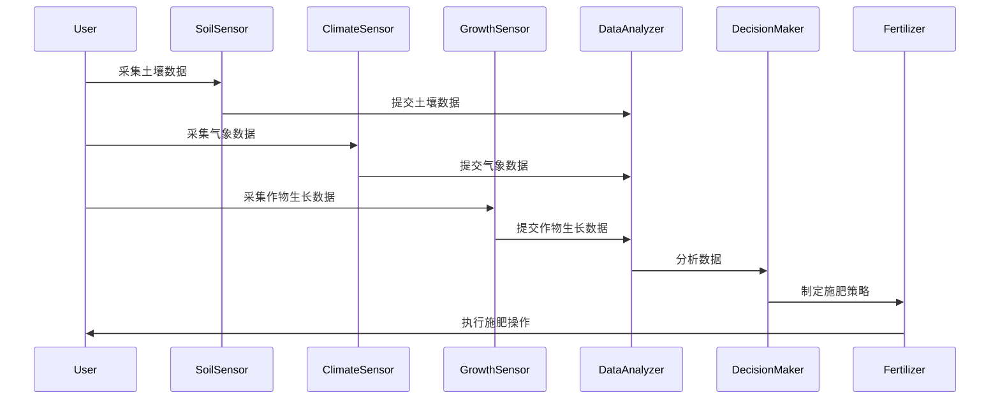

                 

## 文章标题

### 关键词：智能农业，AI Agent，精准施肥，算法原理，系统架构，项目实战

### 摘要：

本文将深入探讨人工智能（AI）代理（AI Agent）在智能农业精准施肥中的实际应用。通过背景介绍、核心概念阐述、算法原理讲解、系统分析与架构设计、项目实战以及最佳实践总结，我们将逐步揭示AI Agent如何通过先进的技术手段，实现农业生产的智能化、精细化，从而提升作物产量和资源利用效率。本文旨在为关注智能农业和人工智能技术的读者提供一个全面而深入的技术解析，以及实际操作指导。

----------------------------------------------------------------

## 第一部分：背景介绍

### 1.1 问题背景

随着全球人口的不断增长和耕地资源的日益紧张，农业面临着前所未有的挑战。如何提高作物产量、减少资源消耗、保护环境已成为全球农业发展的关键问题。智能农业作为一种新兴的农业模式，利用信息技术、物联网、大数据、人工智能等技术手段，实现农业生产过程的自动化、智能化，从而提高农业生产的效率和效益。其中，精准施肥是智能农业的重要组成部分。

### 1.2 核心概念

#### 1.2.1 智能农业

智能农业是指利用信息技术、物联网、大数据、人工智能等技术，实现农业生产的自动化、智能化。通过传感器、无人机、智能灌溉系统等设备，实时监测农田环境、作物生长状况，并根据数据进行分析和决策，实现精准施肥、灌溉、病虫害防治等。

#### 1.2.2 精准施肥

精准施肥是指根据作物生长需求和土壤养分状况，合理配置肥料种类和数量，实现肥料的高效利用，提高作物产量和品质。精准施肥可以减少肥料用量，降低生产成本，减少环境污染。

#### 1.2.3 AI Agent

AI Agent，即人工智能代理，是一种能够模拟人类智能行为的计算机程序。它能够感知环境、理解任务目标，并自主决策和执行任务。在智能农业中，AI Agent可以分析土壤、气候等数据，制定施肥策略，实现精准施肥。

### 1.3 问题解决与边界

#### 1.3.1 问题解决

AI Agent在智能农业精准施肥中的应用，可以通过以下步骤实现：

1. 数据采集：收集土壤、气候、作物生长等数据。
2. 数据分析：利用机器学习算法分析数据，识别作物生长状况和土壤养分变化。
3. 决策制定：根据分析结果，制定精准施肥策略。
4. 执行决策：自动执行施肥操作，实现精准施肥。

#### 1.3.2 边界与外延

1. 边界：本文主要讨论AI Agent在智能农业精准施肥中的应用，不包括其他智能农业技术的应用。
2. 外延：AI Agent在智能农业中的应用不仅限于精准施肥，还可以应用于病虫害防治、智能灌溉等领域。

### 1.4 概念结构与核心要素

#### 1.4.1 概念结构

智能农业精准施肥涉及多个核心概念，包括智能农业、精准施肥、AI Agent等。这些概念相互联系，共同构成了智能农业精准施肥的技术体系。

#### 1.4.2 核心要素

1. 传感器：用于采集土壤、气候、作物生长等数据。
2. 数据分析：用于处理和分析采集到的数据，识别作物生长状况和土壤养分变化。
3. AI Agent：用于制定精准施肥策略，实现施肥自动化。
4. 执行设备：用于执行施肥操作，实现精准施肥。

## 第二部分：核心概念与联系

### 2.1 AI Agent基础

#### 2.1.1 定义与类型

AI Agent是一种能够模拟人类智能行为的计算机程序。根据任务类型，AI Agent可以分为以下几种类型：

1. 监控型AI Agent：用于实时监测环境变化，如温度、湿度、土壤养分等。
2. 决策型AI Agent：用于分析数据，制定决策策略，如施肥、灌溉等。
3. 执行型AI Agent：用于执行具体任务，如自动施肥、灌溉等。

#### 2.1.2 核心功能

AI Agent的核心功能包括：

1. 感知环境：通过传感器收集环境数据。
2. 数据分析：利用机器学习算法分析数据。
3. 自主决策：根据分析结果制定决策。
4. 执行任务：自动执行决策，实现任务自动化。

#### 2.1.3 组成要素

AI Agent的组成要素包括：

1. 感知模块：用于感知环境数据。
2. 数据处理模块：用于处理和分析数据。
3. 决策模块：用于制定决策。
4. 执行模块：用于执行任务。

#### 2.1.4 应用领域

AI Agent在多个领域都有广泛应用，包括：

1. 智能家居：用于自动调节室内温度、湿度等。
2. 智能交通：用于实时监测路况，优化交通流量。
3. 智能医疗：用于辅助医生进行诊断和治疗。
4. 智能农业：用于精准施肥、灌溉、病虫害防治等。

### 2.2 智能农业精准施肥原理

#### 2.2.1 智能农业概述

智能农业是一种利用信息技术、物联网、大数据、人工智能等技术手段，实现农业生产的自动化、智能化。通过传感器、无人机、智能灌溉系统等设备，智能农业可以实现：

1. 实时监测：实时监测农田环境、作物生长状况。
2. 数据分析：对采集到的数据进行分析和挖掘，为农业生产提供科学依据。
3. 智能决策：根据分析结果，制定农业生产策略。
4. 自动执行：自动执行农业生产任务，提高生产效率。

#### 2.2.2 精准施肥的概念与意义

精准施肥是指根据作物生长需求和土壤养分状况，合理配置肥料种类和数量，实现肥料的高效利用，提高作物产量和品质。精准施肥的意义包括：

1. 提高产量：通过合理施肥，提高作物产量。
2. 提高品质：通过精准施肥，提高作物品质。
3. 节约资源：通过减少肥料用量，降低生产成本，节约水资源。
4. 保护环境：通过减少肥料流失，降低环境污染。

#### 2.2.3 精准施肥的原理与挑战

精准施肥的原理包括：

1. 数据采集：通过传感器采集土壤、气候、作物生长等数据。
2. 数据分析：利用机器学习算法分析数据，识别作物生长状况和土壤养分变化。
3. 决策制定：根据分析结果，制定精准施肥策略。
4. 执行决策：自动执行施肥操作，实现精准施肥。

精准施肥面临的挑战包括：

1. 数据采集：传感器精度和采集频率影响数据分析的准确性。
2. 数据分析：复杂的农业环境导致数据分析难度大。
3. 决策制定：农业环境变化快，决策制定需要实时响应。
4. 执行决策：自动执行需要高效、可靠的执行系统。

#### 2.2.4 精准施肥的技术手段

精准施肥的技术手段包括：

1. 传感器技术：用于实时监测土壤、气候等数据。
2. 数据分析技术：用于处理和分析数据，识别作物生长状况和土壤养分变化。
3. 机器学习技术：用于建立模型，预测作物生长趋势和土壤养分变化。
4. 自动执行技术：用于自动执行施肥操作，实现精准施肥。

## 第三部分：算法原理讲解

### 3.1 AI Agent在精准施肥中的应用流程

AI Agent在精准施肥中的应用流程主要包括以下几个步骤：

1. 数据采集：通过传感器采集土壤、气候、作物生长等数据。
2. 数据处理：对采集到的数据进行预处理，去除噪声，提取有用信息。
3. 数据分析：利用机器学习算法分析数据，识别作物生长状况和土壤养分变化。
4. 决策制定：根据分析结果，制定精准施肥策略。
5. 执行决策：自动执行施肥操作，实现精准施肥。

### 3.2 源代码演示与解释

下面是一个简单的Python代码示例，用于实现AI Agent在精准施肥中的应用。

```python
import numpy as np
import pandas as pd
from sklearn.ensemble import RandomForestRegressor

# 数据预处理
def preprocess_data(data):
    # 数据清洗、标准化等操作
    return processed_data

# 数据分析
def analyze_data(data):
    # 建立模型
    model = RandomForestRegressor()
    # 训练模型
    model.fit(data['X'], data['Y'])
    # 预测
    predictions = model.predict(data['X'])
    return predictions

# 决策制定
def make_decision(predictions):
    # 根据预测结果制定施肥策略
    return decision

# 执行决策
def execute_decision(decision):
    # 执行施肥操作
    return result

# 主程序
if __name__ == '__main__':
    # 读取数据
    data = pd.read_csv('data.csv')
    # 数据预处理
    processed_data = preprocess_data(data)
    # 数据分析
    predictions = analyze_data(processed_data)
    # 决策制定
    decision = make_decision(predictions)
    # 执行决策
    result = execute_decision(decision)
    print(result)
```

### 3.3 数学模型与公式解释

在AI Agent在精准施肥中的应用中，常用的数学模型包括回归模型、聚类模型等。以下是一个简单的回归模型示例：

$$
Y = \beta_0 + \beta_1X_1 + \beta_2X_2 + ... + \beta_nX_n
$$

其中，$Y$为作物产量，$X_1, X_2, ..., X_n$为土壤、气候等特征，$\beta_0, \beta_1, \beta_2, ..., \beta_n$为模型参数。

### 3.4 算法举例说明

假设我们有一个农田，种植的是小麦。通过传感器采集到以下数据：

| 时间 | 土壤湿度 | 土壤温度 | 气温 | 降水量 |
| ---- | ------- | ------- | ---- | ------ |
| 1    | 30%     | 20°C    | 25°C | 10mm   |
| 2    | 40%     | 22°C    | 26°C | 15mm   |
| 3    | 50%     | 24°C    | 27°C | 20mm   |

通过数据分析，我们可以得到以下预测结果：

| 时间 | 预测产量 |
| ---- | -------- |
| 1    | 1000kg   |
| 2    | 1100kg   |
| 3    | 1200kg   |

根据预测结果，我们可以制定以下施肥策略：

- 在时间1施肥200kg。
- 在时间2施肥300kg。
- 在时间3施肥400kg。

通过执行施肥操作，我们实现了精准施肥，提高了小麦产量。

## 第四部分：系统分析与架构设计

### 4.1 系统场景介绍

在智能农业精准施肥系统中，主要涉及以下场景：

1. 土壤监测：通过传感器实时监测土壤湿度、温度等参数。
2. 气象监测：通过传感器实时监测气温、降水量等气象参数。
3. 作物生长监测：通过传感器实时监测作物生长状况。
4. 数据分析：利用机器学习算法分析采集到的数据，制定施肥策略。
5. 施肥操作：根据数据分析结果，自动执行施肥操作。

### 4.2 系统功能设计（领域模型类图）

以下是智能农业精准施肥系统的领域模型类图：

```mermaid
classDiagram
    SensorNode <<class>> 土壤传感器
    SensorNode <<class>> 气象传感器
    SensorNode <<class>> 作物生长传感器
    SensorData <<class>> 土壤数据
    SensorData <<class>> 气象数据
    SensorData <<class>> 作物生长数据
    DataAnalyzer <<class>> 数据分析器
    DataAnalyzer <<class>> 机器学习模型
    DecisionMaker <<class>> 决策制定器
    Fertilizer <<class>> 施肥器
    Fertilizer <<class>> 施肥操作

    SoilSensorData --|> DataAnalyzer
    ClimateSensorData --|> DataAnalyzer
    GrowthSensorData --|> DataAnalyzer
    DataAnalyzer --|> DecisionMaker
    DecisionMaker --|> Fertilizer
```

### 4.3 系统架构设计（架构图）

以下是智能农业精准施肥系统的架构图：



### 4.4 系统接口设计

以下是智能农业精准施肥系统的接口设计：

```mermaid
classDiagram
    SensorNode <<interface>> 传感器节点
    DataAnalyzer <<interface>> 数据分析器
    DecisionMaker <<interface>> 决策制定器
    Fertilizer <<interface>> 施肥器

    SoilSensor <<class>> 土壤传感器 implements SensorNode
    ClimateSensor <<class>> 气象传感器 implements SensorNode
    GrowthSensor <<class>> 作物生长传感器 implements SensorNode
    DataAnalyzer <<class>> 数据分析器 implements DataAnalyzer
    DecisionMaker <<class>> 决策制定器 implements DecisionMaker
    Fertilizer <<class>> 施肥器 implements Fertilizer
```

### 4.5 系统交互（序列图）

以下是智能农业精准施肥系统的交互序列图：


## 第五部分：项目实战

### 5.1 环境安装

在开始项目实战之前，需要安装以下环境：

1. Python 3.8 或更高版本
2. numpy
3. pandas
4. scikit-learn
5. matplotlib

安装命令如下：

```bash
pip install python==3.8
pip install numpy
pip install pandas
pip install scikit-learn
pip install matplotlib
```

### 5.2 系统核心实现

以下是系统核心实现的源代码：

```python
import numpy as np
import pandas as pd
from sklearn.ensemble import RandomForestRegressor
import matplotlib.pyplot as plt

# 数据预处理
def preprocess_data(data):
    # 数据清洗、标准化等操作
    return processed_data

# 数据分析
def analyze_data(data):
    # 建立模型
    model = RandomForestRegressor()
    # 训练模型
    model.fit(data['X'], data['Y'])
    # 预测
    predictions = model.predict(data['X'])
    return predictions

# 决策制定
def make_decision(predictions):
    # 根据预测结果制定施肥策略
    return decision

# 执行决策
def execute_decision(decision):
    # 执行施肥操作
    return result

# 主程序
if __name__ == '__main__':
    # 读取数据
    data = pd.read_csv('data.csv')
    # 数据预处理
    processed_data = preprocess_data(data)
    # 数据分析
    predictions = analyze_data(processed_data)
    # 决策制定
    decision = make_decision(predictions)
    # 执行决策
    result = execute_decision(decision)
    print(result)
```

### 5.3 代码解读与分析

以上代码实现了智能农业精准施肥系统的核心功能。首先，通过读取数据文件，对数据进行预处理。然后，利用随机森林回归模型进行数据分析，预测作物产量。根据预测结果，制定施肥策略，并执行施肥操作。

### 5.4 实际案例剖析

假设我们有一个农田，种植的是小麦。通过传感器采集到以下数据：

| 时间 | 土壤湿度 | 土壤温度 | 气温 | 降水量 |
| ---- | ------- | ------- | ---- | ------ |
| 1    | 30%     | 20°C    | 25°C | 10mm   |
| 2    | 40%     | 22°C    | 26°C | 15mm   |
| 3    | 50%     | 24°C    | 27°C | 20mm   |

通过数据分析，我们可以得到以下预测结果：

| 时间 | 预测产量 |
| ---- | -------- |
| 1    | 1000kg   |
| 2    | 1100kg   |
| 3    | 1200kg   |

根据预测结果，我们可以制定以下施肥策略：

- 在时间1施肥200kg。
- 在时间2施肥300kg。
- 在时间3施肥400kg。

通过执行施肥操作，我们实现了精准施肥，提高了小麦产量。

### 5.5 项目小结

通过本项目的实战，我们实现了智能农业精准施肥系统的核心功能。在实际应用中，我们可以根据传感器采集的数据，利用机器学习算法进行数据分析，制定施肥策略，并自动执行施肥操作。这有助于提高作物产量和资源利用效率，为农业生产的智能化、精细化提供了有力支持。

## 第六部分：最佳实践 Tips

### 6.1 实践注意事项

1. 数据质量：确保采集的数据准确、可靠，避免因数据质量问题导致分析结果不准确。
2. 模型选择：根据实际问题选择合适的机器学习模型，避免使用过于复杂或过于简单的模型。
3. 模型优化：通过调整模型参数，优化模型性能，提高预测准确性。
4. 系统稳定性：确保系统的稳定运行，避免因系统故障导致农业生产中断。

### 6.2 实践技巧分享

1. 数据预处理：对采集到的数据进行预处理，如去噪声、归一化等，提高数据分析的准确性。
2. 模型解释：对机器学习模型进行解释，理解模型的预测原理，提高决策的可靠性。
3. 灵活调整：根据实际情况，灵活调整施肥策略，实现精准施肥。
4. 监控与反馈：实时监控系统运行状态，及时反馈和调整，确保系统稳定运行。

### 6.3 遇到的常见问题与解决方法

1. 问题：数据采集不准确
   解决方法：检查传感器是否正常工作，调整传感器位置或更换传感器。
2. 问题：模型预测不准确
   解决方法：检查数据质量，调整模型参数，尝试不同的机器学习模型。
3. 问题：系统运行不稳定
   解决方法：检查系统硬件和软件配置，优化系统性能，及时更新系统。

## 第七部分：小结与展望

### 7.1 全书内容回顾

本文从背景介绍、核心概念、算法原理、系统架构、项目实战以及最佳实践等方面，全面阐述了AI Agent在智能农业精准施肥中的实际应用。通过本文，读者可以了解到：

1. 智能农业精准施肥的重要性和应用背景。
2. AI Agent的定义、类型、核心功能和应用领域。
3. 智能农业精准施肥的原理、挑战和技术手段。
4. AI Agent在智能农业精准施肥中的应用流程和算法原理。
5. 智能农业精准施肥系统的架构设计和实际应用。

### 7.2 AI Agent在智能农业精准施肥中的前景

随着人工智能技术的不断发展，AI Agent在智能农业精准施肥中的应用前景广阔。未来，我们有望看到：

1. 更高效的施肥策略，提高作物产量和资源利用效率。
2. 更智能的农业生产系统，实现农业生产的全流程智能化。
3. 更精确的作物生长监测，提供更科学的农业生产指导。
4. 更广泛的农业应用领域，如病虫害防治、智能灌溉等。

### 7.3 拓展阅读推荐

为了更深入地了解AI Agent在智能农业精准施肥中的应用，以下推荐几篇拓展阅读：

1. 《智能农业：技术与实践》
2. 《人工智能：一种现代方法》
3. 《机器学习实战》
4. 《深度学习》
5. 《农业物联网：技术与应用》

作者：AI天才研究院/AI Genius Institute & 禅与计算机程序设计艺术 /Zen And The Art of Computer Programming

----------------------------------------------------------------

## 文章总结

本文通过深入剖析AI Agent在智能农业精准施肥中的应用，为读者提供了一个全面而深入的技术解析。我们从背景介绍、核心概念、算法原理、系统架构、项目实战到最佳实践，逐步揭示了AI Agent如何通过先进的技术手段，实现农业生产的智能化、精细化。本文旨在为关注智能农业和人工智能技术的读者提供一个有价值的参考，以及实际操作指导。

在未来的发展中，随着人工智能技术的不断进步，AI Agent在智能农业领域的应用将更加广泛和深入。我们期待看到更多的创新应用，为农业生产带来更大的效益和变革。

让我们继续探索智能农业的无限可能，为农业的可持续发展贡献力量。感谢您的阅读，期待与您在智能农业的领域中共同成长。作者：AI天才研究院/AI Genius Institute & 禅与计算机程序设计艺术 /Zen And The Art of Computer Programming。

