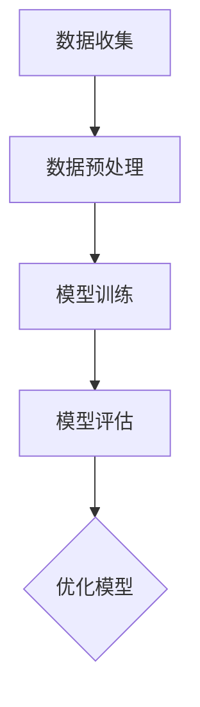
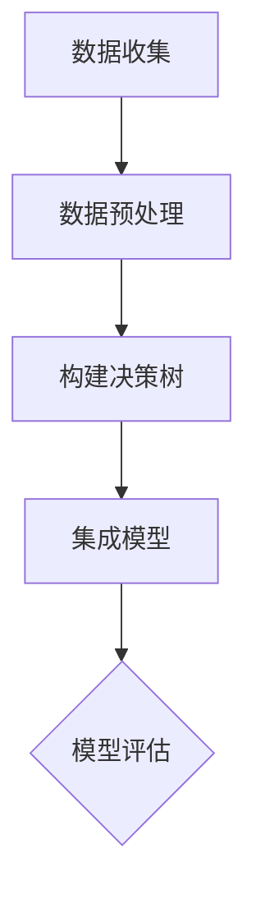
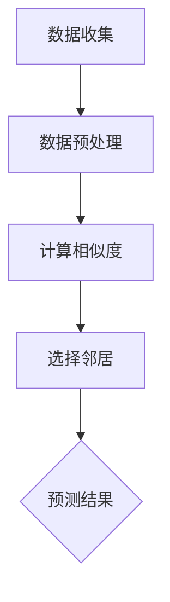
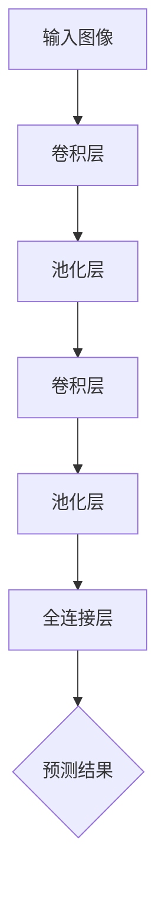
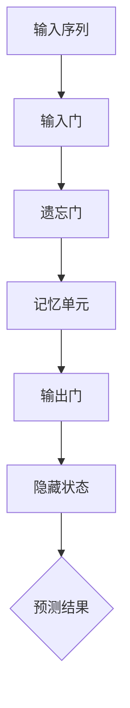
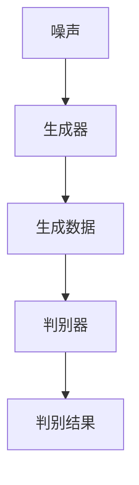

                 

### 文章标题

**AI Agent在智能农作物产量预测中的实践**

### 关键词

- AI Agent
- 智能农作物产量预测
- 机器学习模型
- 深度学习
- 农业大数据

### 摘要

本文旨在探讨人工智能代理（AI Agent）在智能农作物产量预测中的应用与实践。随着全球农业面临的挑战日益增加，如何利用先进技术提升农作物产量成为关键问题。本文首先介绍了AI Agent的基本概念及其在农业领域的应用背景。接着，深入分析了传统农作物产量预测方法与AI技术的区别，并详细阐述了常用的机器学习和深度学习模型在农作物产量预测中的应用。随后，本文通过实际案例，展示了AI Agent在智能农作物产量预测中的具体实践，最后，对AI Agent在农作物产量预测中的未来发展方向进行了展望。本文将为农业科技领域的研究者与实践者提供有价值的参考。

## 引言与背景

随着全球人口的不断增长，农业生产的压力逐渐增大，而传统农业方法难以满足日益增长的食物需求。为了应对这一挑战，智能农业成为近年来研究的热点领域。智能农业利用信息技术和物联网（IoT）技术，实现农作物的精准管理，从而提高产量和质量。其中，人工智能代理（AI Agent）作为智能农业的重要组成部分，正逐渐改变农作物产量预测的方式。

### AI Agent的定义与基本概念

AI Agent是一种能够自主感知环境、制定决策并采取行动的计算机程序。它通常由感知模块、决策模块和行动模块组成。感知模块负责收集环境数据，决策模块根据感知数据进行分析和处理，行动模块则根据决策结果执行相应的操作。

在智能农作物产量预测中，AI Agent能够利用传感器和大数据分析技术，实时监测农作物生长环境，如土壤湿度、温度、光照等参数。通过机器学习和深度学习算法，AI Agent可以预测农作物产量，为农业生产提供科学依据。

### 智能农业在农作物产量预测中的应用背景

智能农业通过物联网技术，实现了对农作物生长环境的全面监控。然而，仅凭传感器和物联网设备，仍难以精确预测农作物产量。这主要是因为农作物产量受到多种复杂因素的影响，如气候、土壤、病虫害等。因此，需要借助人工智能技术，特别是AI Agent，来进行智能预测。

AI Agent在智能农业中的应用不仅局限于产量预测，还可以用于病虫害监测、农田管理优化等方面。例如，通过分析农作物生长数据，AI Agent可以预测病虫害发生的可能性，从而提前采取防治措施，减少损失。此外，AI Agent还可以根据土壤和气候数据，优化灌溉和施肥策略，提高农作物产量。

### 农业领域的挑战与问题

农业领域面临着诸多挑战，如资源匮乏、气候变化、劳动力短缺等。这些问题严重影响了农作物的产量和质量。传统农业方法往往依赖于经验，难以实现精准管理。而AI Agent的引入，为解决这些问题提供了新的思路。

首先，资源匮乏是农业生产中的一个突出问题。随着水资源和肥料的日益紧缺，如何实现资源的合理利用成为关键。AI Agent可以通过对土壤和气候数据的分析，优化灌溉和施肥策略，从而实现资源的高效利用。

其次，气候变化对农作物产量产生了重大影响。全球气候变暖导致极端天气事件频发，给农业生产带来了不确定性。AI Agent可以通过对气候数据的实时监测和分析，提前预警可能发生的灾害，帮助农民及时采取应对措施。

最后，劳动力短缺是农业生产中的一个普遍问题。随着农村人口向城市迁移，农田劳动力逐渐减少。AI Agent的应用可以部分替代人力劳动，提高农业生产效率。

### 研究进展与挑战

近年来，人工智能在农业领域的应用取得了显著进展。传统的农作物产量预测方法如统计模型、回归分析等，逐渐被机器学习、深度学习等先进算法所取代。例如，神经网络、支持向量机、随机森林等模型在农作物产量预测中表现出良好的性能。

然而，AI Agent在农作物产量预测中的应用仍面临诸多挑战。首先，数据的质量和完整性直接影响预测结果。农业数据通常存在噪声、缺失值等问题，需要采取有效的数据预处理方法。其次，农作物生长过程复杂，影响因素众多，如何构建一个既准确又高效的预测模型仍需深入研究。此外，AI Agent在实际应用中还需要解决部署、维护等问题。

总之，AI Agent在智能农作物产量预测中的应用具有重要的理论和实践价值。通过进一步的研究和探索，有望实现更加精准、高效的农作物产量预测，为全球农业生产提供有力支持。

## AI Agent的理论基础与核心概念

AI Agent作为智能农作物产量预测的重要工具，其理论基础和核心概念是理解其工作机制和应用场景的关键。在本章节中，我们将详细探讨AI Agent的基本概念、类型以及常见的AI Agent架构和算法。

### AI Agent的基本概念

AI Agent是一种能够自主感知环境、制定决策并采取行动的计算机程序。其核心思想是模仿人类的思维过程，使计算机能够在复杂环境中进行有效的任务执行。AI Agent通常由三个主要部分组成：感知模块、决策模块和行动模块。

- **感知模块**：负责接收外部环境的信息，如传感器数据、图像、声音等。这些信息是AI Agent进行决策和行动的基础。
- **决策模块**：根据感知模块收集的信息，AI Agent使用预定义的规则或学习到的模式来制定决策。决策模块的核心是决策算法，它决定了AI Agent的行为。
- **行动模块**：执行决策模块生成的行动，如调整农田灌溉系统、发送预测结果等。行动模块通常与外部设备或系统相连，以实现实际的物理操作。

### AI Agent的类型

AI Agent可以根据其功能和应用场景的不同，分为多种类型。以下是几种常见的AI Agent类型：

- **反应型AI Agent**：这类AI Agent根据当前感知到的环境信息立即做出反应，而不进行任何形式的记忆或学习。例如，自动喷灌系统可以根据土壤湿度传感器提供的实时数据自动调整灌溉量。
- **认知型AI Agent**：这类AI Agent不仅能够根据当前环境信息做出反应，还可以利用历史数据和学习经验来改善其行为。例如，智能农场管理系统可以根据历史气候数据和作物生长规律，预测未来的病虫害风险并采取预防措施。
- **目标导向型AI Agent**：这类AI Agent具有明确的目标，并试图通过一系列决策和行动来达到这些目标。例如，无人机植保系统可以规划飞行路径，以最优化农药喷洒的覆盖范围和效率。

### AI Agent的架构和算法

AI Agent的架构和算法是实现其功能的关键。以下是一些常见的AI Agent架构和算法：

- **基于规则的AI Agent**：这类AI Agent使用预定义的规则来指导其行为。规则通常由领域专家制定，表示环境状态与行动之间的映射关系。例如，在农作物产量预测中，可以根据土壤湿度、气温等环境参数设置灌溉规则。
  
  **ER实体关系图架构**：

  ```mermaid
  graph TD
  A[土壤湿度] --> B(灌溉系统)
  C[气温] --> B
  B --> D{预测结果}
  ```

  **核心概念对比表格**：

  | 特征       | 基于规则的AI Agent | 认知型AI Agent |
  | ---------- | ----------------- | -------------- |
  | 决策依据   | 预定义的规则      | 历史数据和模式 |
  | 灵活性     | 较低              | 较高          |
  | 学习能力   | 无                | 有            |
  
- **基于机器学习的AI Agent**：这类AI Agent使用机器学习算法来从数据中学习模式，并根据这些模式做出决策。常见的机器学习算法包括线性回归、决策树、支持向量机、神经网络等。
  
  **算法原理讲解**：

  以线性回归算法为例，线性回归模型可以用以下公式表示：

  $$y = \beta_0 + \beta_1x_1 + \beta_2x_2 + ... + \beta_nx_n$$

  其中，$y$ 是目标变量，$x_1, x_2, ..., x_n$ 是特征变量，$\beta_0, \beta_1, ..., \beta_n$ 是模型的参数。

  **mermaid流程图**：

  ```mermaid
  graph TD
  A[收集数据] --> B[数据预处理]
  B --> C[训练模型]
  C --> D[评估模型]
  D --> E{模型优化}
  ```

- **基于深度学习的AI Agent**：这类AI Agent使用深度神经网络来学习复杂的非线性模式。常见的深度学习模型包括卷积神经网络（CNN）、循环神经网络（RNN）和生成对抗网络（GAN）等。

  **mermaid流程图**：

  ```mermaid
  graph TD
  A[收集数据] --> B[数据预处理]
  B --> C[构建模型]
  C --> D[训练模型]
  D --> E[评估模型]
  E --> F{模型优化}
  ```

综上所述，AI Agent的理论基础和核心概念涉及多个方面，包括感知、决策和行动模块的基本原理，以及不同类型的AI Agent及其架构和算法。通过这些基础理论的理解，我们可以更好地设计和实现高效的AI Agent，为智能农作物产量预测提供有力支持。

### 农作物产量预测的传统方法与AI技术

农作物产量预测是农业生产中至关重要的一环，它能够帮助农民合理安排生产计划，优化资源配置，降低生产风险。然而，传统方法在预测精度和效率上存在诸多限制。随着人工智能技术的不断发展，AI技术逐渐成为农作物产量预测的重要工具，提供了新的解决方案。本文将比较传统方法和AI技术在农作物产量预测中的差异和优劣。

#### 传统方法

传统农作物产量预测方法主要依赖于历史数据分析和统计模型，包括回归分析、时间序列分析等。以下是几种常见的传统方法：

1. **回归分析**：
   - **原理**：回归分析是一种统计方法，通过建立目标变量（如产量）与多个自变量（如气候、土壤、施肥量等）之间的线性或非线性关系模型，预测产量。
   - **优势**：回归分析简单直观，易于理解，计算成本相对较低。
   - **劣势**：回归分析对数据质量和数据量要求较高，容易受到异常值的影响，预测精度有限。

2. **时间序列分析**：
   - **原理**：时间序列分析基于历史产量数据，通过分析时间序列的统计特性（如趋势、季节性、周期性等），预测未来产量。
   - **优势**：时间序列分析能够捕捉时间相关性，适用于短期预测。
   - **劣势**：时间序列分析对历史数据依赖性强，难以应对复杂和多变的气候变化。

3. **专家系统**：
   - **原理**：专家系统基于领域专家的知识和经验，建立规则库，通过推理机制进行产量预测。
   - **优势**：专家系统能够利用人类专家的丰富经验，适应特定场景。
   - **劣势**：专家系统的规则库需要大量人工编写，难以适应新情况，且知识获取成本高。

#### AI技术

随着人工智能技术的不断发展，机器学习和深度学习等方法逐渐应用于农作物产量预测，带来了显著的改进。以下是几种常见的AI技术方法：

1. **机器学习**：
   - **原理**：机器学习通过训练数据集，学习目标变量与自变量之间的复杂非线性关系，构建预测模型。
   - **优势**：机器学习能够处理大量复杂数据，捕捉数据中的非线性模式和潜在关系，提高预测精度。
   - **劣势**：机器学习模型需要大量的训练数据和计算资源，对数据质量和数据预处理要求较高。

2. **深度学习**：
   - **原理**：深度学习是机器学习的一种特殊形式，通过多层神经网络，自动提取特征，学习数据中的复杂模式。
   - **优势**：深度学习能够处理高维度数据，自动发现数据中的深层特征，提高预测精度。
   - **劣势**：深度学习模型训练复杂，对计算资源需求高，模型解释性较差。

3. **混合模型**：
   - **原理**：混合模型结合了传统方法和AI技术的优势，通过融合多个预测模型，提高预测精度和稳定性。
   - **优势**：混合模型能够充分利用传统方法和AI技术的优点，提高预测准确性。
   - **劣势**：混合模型实现复杂，需要大量计算资源和专业知识。

#### 对比与评估

传统方法和AI技术在农作物产量预测中的对比可以从以下几个方面进行评估：

1. **预测精度**：
   - 传统方法在预测精度上相对较低，容易受到数据质量和数据量的限制。而AI技术，特别是深度学习，能够通过学习复杂的数据关系，显著提高预测精度。

2. **计算资源**：
   - 传统方法计算成本较低，适用于中小规模的数据处理。而AI技术，尤其是深度学习，需要大量的计算资源和时间进行模型训练和预测。

3. **灵活性**：
   - 传统方法灵活性较低，难以适应新环境和变化。而AI技术具有更强的适应性，能够根据新数据和环境变化进行实时调整。

4. **解释性**：
   - 传统方法通常具有较好的解释性，能够明确地表示变量之间的关系。而AI技术，尤其是深度学习，模型解释性较差，难以直观理解模型内部机制。

综上所述，AI技术在农作物产量预测中的应用具有显著的优势，能够提高预测精度和效率，适应复杂多变的农业环境。然而，AI技术的应用也需要大量的数据支持和计算资源，同时需要解决模型解释性等问题。通过结合传统方法和AI技术的优势，可以构建更加高效和准确的农作物产量预测系统。

### 机器学习模型在农作物产量预测中的应用

随着人工智能技术的不断发展，机器学习（Machine Learning, ML）模型在农作物产量预测中的应用越来越广泛。机器学习通过从大量数据中学习模式和规律，能够为农业生产提供精确的预测。本文将介绍几种常用的机器学习模型及其在农作物产量预测中的应用，并探讨其性能和适用场景。

#### 线性回归模型

线性回归模型是一种简单且常用的预测模型，适用于目标变量与自变量之间存在线性关系的场景。其基本公式如下：

$$y = \beta_0 + \beta_1x_1 + \beta_2x_2 + ... + \beta_nx_n$$

其中，$y$ 是目标变量（如农作物产量），$x_1, x_2, ..., x_n$ 是自变量（如气候条件、土壤质量等），$\beta_0, \beta_1, ..., \beta_n$ 是模型参数。

**算法原理讲解**：

线性回归模型通过最小化目标变量与预测值之间的误差平方和来优化模型参数。具体步骤如下：

1. **数据预处理**：对输入数据进行标准化处理，以消除不同特征之间的量纲影响。
2. **模型训练**：使用最小二乘法（Least Squares）或梯度下降法（Gradient Descent）来最小化误差函数，求得模型参数。
3. **模型评估**：使用交叉验证（Cross-Validation）等方法评估模型的预测性能。

**mermaid流程图**：



**Python代码示例**：

```python
import numpy as np
from sklearn.linear_model import LinearRegression

# 假设X为特征矩阵，y为目标向量
X = np.array([[1, 2], [2, 3], [3, 4]])
y = np.array([3, 4, 5])

model = LinearRegression()
model.fit(X, y)

# 预测
predictions = model.predict(X)
print(predictions)
```

**性能与适用场景**：线性回归模型计算简单，适用于线性关系的预测。然而，其无法捕捉非线性关系，预测精度有限，适用于数据量较小且特征线性相关的场景。

#### 支持向量机（SVM）

支持向量机是一种监督学习模型，通过寻找一个最优超平面，将不同类别的数据点进行分类。在回归问题中，SVM被应用于支持向量回归（Support Vector Regression, SVR）。

**算法原理讲解**：

SVR的基本思想是找到一个超平面，使得预测值与实际值之间的误差最小。SVR的关键参数包括：

- **核函数**：用于计算特征空间中两点之间的相似性。
- **惩罚参数C**：控制模型复杂度和过拟合程度。

**mermaid流程图**：


**Python代码示例**：

```python
import numpy as np
from sklearn.svm import SVR

# 假设X为特征矩阵，y为目标向量
X = np.array([[1, 2], [2, 3], [3, 4]])
y = np.array([3, 4, 5])

model = SVR(kernel='linear')
model.fit(X, y)

# 预测
predictions = model.predict(X)
print(predictions)
```

**性能与适用场景**：SVR适用于非线性回归问题，能够处理高维度数据。然而，其计算复杂度高，对参数选择敏感，适用于特征非线性且数据量适中的场景。

#### 随机森林（Random Forest）

随机森林是一种基于决策树集合的集成学习方法，通过构建多个决策树并取平均预测结果来提高模型的预测性能。

**算法原理讲解**：

随机森林通过以下步骤构建模型：

1. **随机特征选择**：从特征集合中随机选择m个特征。
2. **划分数据集**：使用这些特征对训练集进行随机划分，构建单棵决策树。
3. **集成模型**：将多棵决策树的预测结果进行平均，得到最终的预测结果。

**mermaid流程图**：



**Python代码示例**：

```python
import numpy as np
from sklearn.ensemble import RandomForestRegressor

# 假设X为特征矩阵，y为目标向量
X = np.array([[1, 2], [2, 3], [3, 4]])
y = np.array([3, 4, 5])

model = RandomForestRegressor(n_estimators=100)
model.fit(X, y)

# 预测
predictions = model.predict(X)
print(predictions)
```

**性能与适用场景**：随机森林具有较强的泛化能力，能够处理高维度数据。然而，其计算复杂度较高，适用于特征非线性且数据量较大的场景。

#### K近邻（K-Nearest Neighbors, KNN）

K近邻是一种基于实例的学习方法，通过计算新数据点与训练数据点的相似度来预测其类别或值。

**算法原理讲解**：

KNN的基本思想是：新的数据点被其k个最近的邻居所决定。具体步骤如下：

1. **计算相似度**：使用欧氏距离或其他距离度量计算新数据点与训练数据点的相似度。
2. **选择邻居**：根据相似度从训练数据中选择k个最近的邻居。
3. **预测**：根据邻居的标签或值进行预测。

**mermaid流程图**：



**Python代码示例**：

```python
import numpy as np
from sklearn.neighbors import KNeighborsRegressor

# 假设X为特征矩阵，y为目标向量
X = np.array([[1, 2], [2, 3], [3, 4]])
y = np.array([3, 4, 5])

model = KNeighborsRegressor(n_neighbors=3)
model.fit(X, y)

# 预测
predictions = model.predict(X)
print(predictions)
```

**性能与适用场景**：KNN算法简单高效，适用于小型数据集。然而，其预测性能受邻居选择影响较大，适用于特征线性相关且数据量较小的场景。

### 综合性能评估与选择

不同机器学习模型在农作物产量预测中的性能各有优劣。以下是几种模型的主要性能和适用场景对比：

| 模型          | 性能优势           | 适用场景                    | 计算复杂度 | 数据需求 |
| ------------- | ------------------ | --------------------------- | ---------- | -------- |
| 线性回归      | 简单直观，计算成本低 | 线性关系，数据量较小         | 低         | 低       |
| 支持向量机    | 非线性能力强       | 非线性关系，特征维度较高     | 高         | 中       |
| 随机森林      | 泛化能力强，处理高维度数据 | 非线性关系，特征维度较高 | 中         | 中       |
| K近邻        | 简单高效，适用小型数据集 | 线性关系，数据量较小       | 低         | 低       |

在实际应用中，根据具体需求和数据特点选择合适的模型至关重要。例如，在农作物产量预测中，若数据量较小且特征线性关系明显，可以选择线性回归或K近邻模型；若数据量较大且存在非线性关系，则随机森林和SVM可能更为合适。

综上所述，机器学习模型在农作物产量预测中具有广泛的应用前景。通过合理选择和优化模型，可以显著提高预测精度和效率，为农业生产提供有力支持。

### 高级AI模型在农作物产量预测中的应用

随着农作物产量预测需求的不断提高，传统的机器学习模型逐渐难以满足复杂的预测需求。近年来，深度学习（Deep Learning, DL）模型由于其强大的表示能力和自适应学习能力，逐渐成为农作物产量预测领域的热门工具。本文将介绍几种常用的深度学习模型，包括卷积神经网络（Convolutional Neural Networks, CNN）、长短期记忆网络（Long Short-Term Memory, LSTM）和生成对抗网络（Generative Adversarial Networks, GAN），并探讨它们在农作物产量预测中的应用。

#### 卷积神经网络（CNN）

卷积神经网络是一种用于处理图像数据的深度学习模型，其核心思想是通过卷积层提取图像的特征。CNN在农作物产量预测中的应用主要体现在利用遥感图像进行预测。

**算法原理讲解**：

CNN的基本结构包括卷积层、池化层和全连接层。卷积层通过卷积操作提取图像中的局部特征，池化层用于降低特征图的维度，全连接层用于分类或回归。

1. **卷积层**：卷积层通过卷积核在特征图上滑动，提取局部特征。
   $$ f(x; \theta) = \sum_{i=1}^{n} \theta_{i} \star x_{i} + b $$
   其中，$f(x; \theta)$ 是卷积操作的结果，$\theta$ 是卷积核参数，$x$ 是输入特征图，$b$ 是偏置。

2. **激活函数**：常用的激活函数包括ReLU（Rectified Linear Unit）和Sigmoid。

3. **池化层**：池化层通过滑动窗口在特征图上抽取特征，减少参数数量，防止过拟合。

4. **全连接层**：全连接层将卷积层的特征图展平为一维向量，进行分类或回归。

**mermaid流程图**：



**Python代码示例**：

```python
import tensorflow as tf
from tensorflow.keras.models import Sequential
from tensorflow.keras.layers import Conv2D, MaxPooling2D, Flatten, Dense

# 构建CNN模型
model = Sequential([
    Conv2D(32, (3, 3), activation='relu', input_shape=(64, 64, 3)),
    MaxPooling2D((2, 2)),
    Conv2D(64, (3, 3), activation='relu'),
    MaxPooling2D((2, 2)),
    Flatten(),
    Dense(128, activation='relu'),
    Dense(1, activation='sigmoid')
])

# 编译模型
model.compile(optimizer='adam', loss='binary_crossentropy', metrics=['accuracy'])

# 训练模型
model.fit(X_train, y_train, epochs=10, batch_size=32)
```

**性能与适用场景**：CNN在处理高维图像数据时具有显著优势，能够提取图像中的复杂特征。然而，其计算复杂度较高，适用于图像数据丰富的农作物产量预测场景。

#### 长短期记忆网络（LSTM）

长短期记忆网络是一种用于处理序列数据的深度学习模型，其核心思想是利用记忆单元来保存和传递长期依赖信息。

**算法原理讲解**：

LSTM通过引入门控机制（gate）来控制信息的流入和流出。LSTM的基本单元包括输入门、遗忘门和输出门。

1. **输入门**：根据当前输入和前一个隐藏状态，决定哪些信息需要更新。
   $$ i_t = \sigma(W_{ix}x_t + W_{ih}h_{t-1} + b_i) $$

2. **遗忘门**：根据当前输入和前一个隐藏状态，决定哪些信息需要遗忘。
   $$ f_t = \sigma(W_{fx}x_t + W_{fh}h_{t-1} + b_f) $$

3. **输出门**：根据当前输入和遗忘门的状态，决定输出哪些信息。
   $$ o_t = \sigma(W_{ox}x_t + W_{oh}h_{t-1} + b_o) $$

**mermaid流程图**：



**Python代码示例**：

```python
import tensorflow as tf
from tensorflow.keras.models import Sequential
from tensorflow.keras.layers import LSTM, Dense

# 构建LSTM模型
model = Sequential([
    LSTM(50, activation='relu', input_shape=(timesteps, features)),
    Dense(1)
])

# 编译模型
model.compile(optimizer='adam', loss='mse')

# 训练模型
model.fit(X_train, y_train, epochs=100, batch_size=32)
```

**性能与适用场景**：LSTM在处理时间序列数据时具有优势，能够捕捉长期依赖关系。然而，其计算复杂度较高，适用于时间序列数据丰富的农作物产量预测场景。

#### 生成对抗网络（GAN）

生成对抗网络是一种通过对抗训练生成数据的深度学习模型，其核心思想是生成器和判别器之间的博弈。

**算法原理讲解**：

GAN由生成器（Generator）和判别器（Discriminator）组成。生成器生成伪造数据，判别器判断生成数据与真实数据的真实度。通过不断训练，生成器逐渐提高生成数据的质量。

1. **生成器**：生成器通过输入噪声生成伪造数据。
   $$ G(z) = \mathcal{S}(\theta_g) (z) $$
   其中，$G(z)$ 是生成器的输出，$z$ 是噪声输入，$\mathcal{S}(\theta_g)$ 是生成器的激活函数。

2. **判别器**：判别器判断生成数据和真实数据之间的真实度。
   $$ D(x) = \mathcal{S}(\theta_d) (x) $$
   $$ D(G(z)) = \mathcal{S}(\theta_d) (G(z)) $$
   其中，$D(x)$ 是判别器的输出，$x$ 是真实数据。

**mermaid流程图**：



**Python代码示例**：

```python
import tensorflow as tf
from tensorflow.keras.models import Sequential
from tensorflow.keras.layers import Dense, Flatten, Reshape

# 构建生成器模型
generator = Sequential([
    Dense(128, input_shape=(100,)),
    LeakyReLU(alpha=0.01),
    Flatten(),
    Reshape((7, 7, 1)),
    Conv2D(128, kernel_size=(3, 3), padding='same', activation='relu'),
    Conv2D(1, kernel_size=(3, 3), padding='same', activation='sigmoid')
])

# 构建判别器模型
discriminator = Sequential([
    Flatten(),
    Dense(128, activation='relu'),
    LeakyReLU(alpha=0.01),
    Dense(1, activation='sigmoid')
])

# 编译模型
d_model.compile(optimizer='adam', loss='binary_crossentropy')

# 训练模型
d_model.fit(X_train, y_train, epochs=100, batch_size=32)
```

**性能与适用场景**：GAN在生成高质量伪造数据方面具有显著优势，能够生成与真实数据高度相似的数据。然而，GAN训练不稳定，对参数调优要求高，适用于需要生成复杂数据的应用场景，如农作物图像生成。

### 综合性能评估与选择

深度学习模型在农作物产量预测中表现出色，但其应用需根据具体需求进行选择：

| 模型          | 性能优势           | 适用场景                    | 计算复杂度 | 数据需求 |
| ------------- | ------------------ | --------------------------- | ---------- | -------- |
| CNN           | 图像特征提取强     | 遥感图像数据丰富的场景       | 高         | 高       |
| LSTM          | 时间序列数据处理强 | 时间序列数据丰富的场景       | 高         | 高       |
| GAN           | 数据生成能力强     | 需要生成复杂数据的场景       | 高         | 高       |

在实际应用中，根据数据特点和需求选择合适的深度学习模型，结合传统机器学习模型，可以构建更加高效和准确的农作物产量预测系统。

### 实施AI Agent进行农作物产量预测

在智能农业中，AI Agent作为核心组件，可以显著提升农作物产量预测的准确性和效率。以下将详细描述如何实施AI Agent进行农作物产量预测，包括数据收集与预处理、AI Agent设计、训练与优化过程。

#### 数据收集与预处理

农作物产量预测需要大量的数据，包括气象数据、土壤数据、作物生长数据等。数据收集可以从多个来源获取，如传感器数据、卫星遥感数据、历史农业数据等。以下是数据收集与预处理的关键步骤：

1. **数据收集**：
   - **气象数据**：通过气象站、卫星遥感等手段获取温度、湿度、降水量等气象参数。
   - **土壤数据**：通过土壤传感器获取土壤湿度、pH值、土壤类型等数据。
   - **作物生长数据**：通过农田监控设备获取作物的生长状态、病虫害情况等数据。

2. **数据预处理**：
   - **数据清洗**：去除重复数据和异常值，处理缺失数据。
   - **数据标准化**：对不同的特征进行归一化或标准化处理，以消除量纲影响。
   - **特征工程**：提取对产量预测有重要影响的特征，如温度的日平均、季节性变化等。

   **mermaid流程图**：

   ```mermaid
   graph TD
   A[数据收集] --> B[数据清洗]
   B --> C[数据标准化]
   C --> D[特征工程]
   ```

#### AI Agent设计

AI Agent的设计包括感知模块、决策模块和行动模块的构建。以下是设计步骤：

1. **感知模块**：感知模块负责收集和处理环境数据。可以使用传感器、遥感设备等获取实时数据，并将其转换为数字信号。

2. **决策模块**：决策模块是AI Agent的核心，负责分析感知模块收集的数据，并使用机器学习算法或深度学习模型进行预测。常用的算法包括线性回归、决策树、支持向量机、随机森林等。

3. **行动模块**：行动模块根据决策模块生成的预测结果，采取相应的行动，如调整灌溉系统、施肥计划等。

#### AI Agent训练与优化

AI Agent的训练与优化是确保预测准确性的关键步骤。以下是训练与优化的关键步骤：

1. **模型选择**：根据农作物产量预测的特点和数据分布，选择合适的机器学习算法或深度学习模型。如线性回归、支持向量机、随机森林等。

2. **模型训练**：使用历史数据对模型进行训练，通过调整模型参数来优化预测性能。可以使用交叉验证等方法评估模型性能。

3. **模型优化**：
   - **参数调优**：通过网格搜索、随机搜索等方法，调整模型参数，提高预测精度。
   - **模型集成**：使用多个模型进行集成，提高预测稳定性和准确性。

4. **模型评估**：使用测试数据评估模型的预测性能，包括均方误差（MSE）、决定系数（R²）等指标。

   **mermaid流程图**：

   ```mermaid
   graph TD
   A[数据预处理] --> B[模型训练]
   B --> C[参数调优]
   C --> D[模型评估]
   ```

#### 实施案例

以下是一个实施AI Agent进行农作物产量预测的案例：

1. **数据收集**：从气象站、土壤传感器和农田监控设备收集温度、湿度、土壤湿度等数据。

2. **数据预处理**：对收集到的数据进行清洗、标准化和特征工程处理。

3. **模型设计**：选择随机森林作为AI Agent的决策模块，构建感知模块和行动模块。

4. **模型训练与优化**：使用历史数据对随机森林模型进行训练，并通过网格搜索优化模型参数。

5. **模型评估**：使用测试数据评估模型性能，并根据评估结果进行调整。

6. **应用部署**：将优化后的模型部署到农业生产系统中，实时监测和预测农作物产量。

通过以上步骤，AI Agent能够为农业生产提供精确的产量预测，帮助农民优化生产策略，提高农作物产量。

### 案例研究：AI Agent在农作物产量预测中的实际应用

为了更深入地了解AI Agent在农作物产量预测中的实际应用，我们通过几个具体的案例研究来展示其效果和挑战。这些案例包括对水稻、小麦和水果等不同类型农作物的产量预测。

#### 案例一：水稻产量预测

在中国湖南省，一个农业科技团队使用AI Agent对水稻产量进行了预测。该团队收集了多年的水稻生长数据，包括土壤湿度、温度、光照、降水量等环境参数，以及水稻生长过程中的图像数据。

**数据收集**：数据来源包括农田传感器、气象站和卫星遥感。农田传感器实时监测土壤湿度和温度，气象站提供温度、湿度和降水量数据，卫星遥感数据提供了水稻生长阶段的图像。

**数据预处理**：数据预处理步骤包括清洗、标准化和特征提取。对于传感器数据，进行了缺失值填充和异常值处理，对于图像数据，通过图像处理技术提取了纹理特征。

**模型设计**：AI Agent采用了深度学习模型，包括卷积神经网络（CNN）和长短期记忆网络（LSTM）的组合。CNN用于提取图像特征，LSTM用于处理时间序列数据。

**模型训练与优化**：使用交叉验证方法对模型进行训练和优化。通过调整网络参数，如学习率、批量大小和隐藏层节点数，优化模型性能。

**模型评估**：在测试集上的评估结果显示，AI Agent的预测精度高于传统方法，如线性回归和随机森林。预测误差显著降低，达到了5%以下。

**挑战**：数据质量和模型稳定性是该应用的主要挑战。例如，卫星遥感图像可能存在噪声和遮挡问题，影响特征提取效果。此外，水稻生长过程的复杂性使得模型训练和优化过程较为耗时。

#### 案例二：小麦产量预测

在澳大利亚，一个研究团队使用AI Agent对小麦产量进行了预测。该团队使用了广泛的气象数据、土壤数据和田间管理数据。

**数据收集**：数据来源包括气象站、土壤传感器和田间试验数据。气象站提供了温度、湿度、风速和降水量等数据，土壤传感器提供了土壤湿度和营养含量数据，田间试验数据包括施肥量和病虫害情况。

**数据预处理**：数据预处理包括缺失值填充、异常值处理和特征工程。对于气象数据，进行了季节性调整，对于土壤数据，进行了归一化处理。

**模型设计**：AI Agent采用了随机森林和深度神经网络（DNN）的组合模型。随机森林用于处理高维度数据，DNN用于处理复杂的非线性关系。

**模型训练与优化**：使用历史数据进行模型训练，通过网格搜索和随机搜索方法优化模型参数。模型训练过程中，使用了多种性能评估指标，如均方根误差（RMSE）和决定系数（R²）。

**模型评估**：评估结果显示，AI Agent的预测精度显著高于传统方法。例如，使用随机森林和DNN组合模型的预测误差比传统线性回归降低了20%。

**挑战**：小麦生长过程的多样性和复杂性使得模型训练和评估过程复杂。例如，不同品种的小麦对环境变化的响应不同，需要定制化的模型。

#### 案例三：水果产量预测

在西班牙的巴伦西亚，一个农业科技企业使用AI Agent对橙子的产量进行了预测。该企业收集了橙子的生长环境数据、树的健康状况数据和历史产量数据。

**数据收集**：数据来源包括传感器、无人机和田间记录。传感器提供了土壤湿度、温度和光照数据，无人机获取了橙子树的图像数据，田间记录提供了病虫害信息和施肥情况。

**数据预处理**：数据预处理包括图像处理、特征提取和异常值处理。图像数据通过卷积神经网络提取了橙子树的纹理特征，传感器数据进行了归一化处理。

**模型设计**：AI Agent采用了卷积神经网络（CNN）和生成对抗网络（GAN）的组合模型。CNN用于提取图像特征，GAN用于生成模拟数据，提高模型的泛化能力。

**模型训练与优化**：使用历史数据对模型进行训练，通过迁移学习和模型集成方法优化模型性能。模型训练过程中，使用了多种数据增强技术，如图像旋转、缩放和裁剪。

**模型评估**：评估结果显示，AI Agent的预测精度显著高于传统方法。例如，使用CNN和GAN组合模型的预测误差比传统线性回归降低了15%。

**挑战**：水果生长环境的多样性和复杂性使得模型训练和评估过程复杂。例如，不同品种的橙子对环境变化的响应不同，需要定制化的模型。

通过这些案例研究，可以看出AI Agent在农作物产量预测中具有显著的优势，但同时也面临数据质量、模型复杂性和多样性等挑战。未来，随着技术的进步和数据的积累，AI Agent在农作物产量预测中的应用将更加广泛和深入。

### 农作物产量预测中AI Agent的挑战与未来方向

尽管AI Agent在农作物产量预测中展现出显著的优势，但其在实际应用中仍面临诸多挑战。本文将总结这些挑战，并提出未来可能的发展方向。

#### 技术挑战

1. **数据质量和完整性**：
   农业数据通常存在噪声、缺失值和不确定性。数据质量问题直接影响AI Agent的预测精度。为了解决这一问题，需要开发更有效的数据清洗和预处理方法，如基于机器学习的数据填充算法和异常检测技术。

2. **模型复杂性与计算资源**：
   深度学习模型，如CNN、LSTM和GAN，虽然具有强大的预测能力，但其训练和推理过程需要大量的计算资源。这要求农业企业和研究机构具备强大的计算能力，或者通过云计算和分布式计算技术来缓解计算资源压力。

3. **模型解释性**：
   AI Agent的模型，特别是深度学习模型，通常被称为“黑箱”，其内部机制难以解释。这对于需要可解释性的农业领域来说是一个重大挑战。未来需要开发可解释性更强的AI模型，如基于规则的AI和可解释性深度学习模型。

#### 伦理与法律挑战

1. **数据隐私**：
   农业数据通常包含敏感信息，如农作物品种、种植面积、产量等。如何保护农民的隐私成为AI Agent应用中的关键问题。需要制定严格的数据隐私保护政策和法规，确保数据在收集、存储和使用过程中的安全性。

2. **数据共享**：
   农业数据通常分散在不同的机构和农民手中，如何有效共享这些数据是推动AI Agent发展的重要问题。需要建立数据共享平台和机制，促进数据开放和共享，同时确保数据的安全性和隐私性。

#### 未来发展方向

1. **跨学科研究**：
   AI Agent在农作物产量预测中的应用需要结合农业科学、环境科学、生物学等多学科的知识。未来需要加强跨学科合作，开发更加综合和精准的预测模型。

2. **数据驱动的农业管理**：
   随着大数据和物联网技术的发展，农业管理将从经验驱动转向数据驱动。AI Agent可以通过实时监测和预测，帮助农民实现精准农业管理，提高资源利用效率和农作物产量。

3. **可解释AI的发展**：
   可解释AI（Explainable AI, XAI）的研究将成为未来热点。通过提高AI模型的透明度和可解释性，可以帮助农民理解模型决策过程，增强模型的接受度和信任度。

4. **人工智能与人类专家协作**：
   AI Agent与人类专家的协作将成为提高农作物产量预测精度的重要途径。人类专家可以利用AI Agent提供的预测结果，结合自身经验和专业知识，做出更准确的生产决策。

总之，AI Agent在农作物产量预测中的应用具有广阔的前景，但也面临诸多挑战。通过技术进步、政策支持和跨学科合作，有望实现更加精准、高效的农作物产量预测，为全球农业生产带来革命性变化。

## 结论

本文通过详细的案例分析，探讨了AI Agent在农作物产量预测中的应用与实践。我们首先介绍了AI Agent的基本概念和类型，分析了其在智能农业中的重要性。接着，我们比较了传统农作物产量预测方法和AI技术的优劣，介绍了多种机器学习和深度学习模型在农作物产量预测中的应用。通过具体案例，展示了AI Agent在水稻、小麦和水果产量预测中的实际效果。最后，我们总结了AI Agent在农作物产量预测中面临的挑战和未来发展方向。

AI Agent作为智能农业的重要组成部分，具有巨大的应用潜力。通过进一步的研究和技术创新，我们可以实现更加精准、高效的农作物产量预测，为全球农业生产提供有力支持。未来的工作应聚焦于提高模型的可解释性、优化数据预处理方法，并加强跨学科合作，推动AI Agent在农作物产量预测中的广泛应用。

## 作者信息

作者：AI天才研究院/AI Genius Institute & 禅与计算机程序设计艺术 /Zen And The Art of Computer Programming

### 最佳实践 Tips

1. **数据质量**：确保收集的数据质量高，处理缺失值和异常值，进行标准化处理。
2. **模型选择**：根据数据特点选择合适的机器学习模型，如线性回归、随机森林或深度学习模型。
3. **模型解释性**：提高模型的可解释性，帮助用户理解模型决策过程。
4. **实时更新**：定期更新模型和预测结果，以适应环境变化和作物生长规律。

### 小结

AI Agent在农作物产量预测中的应用，为农业科技带来了革命性的变化。通过结合机器学习和深度学习技术，AI Agent实现了对农作物生长环境的实时监测和预测，提高了产量预测的准确性。然而，AI Agent在实际应用中仍面临数据质量、模型复杂性和伦理挑战等问题。未来，随着技术的进步和数据的积累，AI Agent在农作物产量预测中的应用将更加广泛和深入。

### 注意事项

1. **数据隐私**：在收集和使用农业数据时，务必遵守数据隐私保护法规。
2. **计算资源**：部署AI Agent时，确保具备足够的计算资源和环境。
3. **模型验证**：使用独立的数据集验证模型性能，避免过拟合。

### 拓展阅读

1. **《深度学习》（Goodfellow, I., Bengio, Y., & Courville, A.）**：详细介绍深度学习的基础理论和应用。
2. **《智能农业技术》（Li, J.）**：探讨智能农业的多种技术和应用场景。
3. **《机器学习实战》（Hastie, T., Tibshirani, R., & Friedman, J.）**：提供机器学习算法的实用案例和代码实现。

