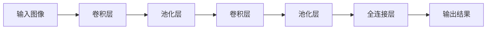
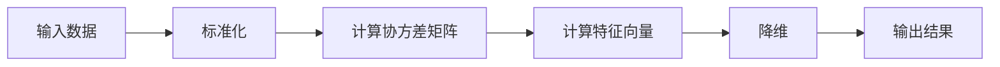
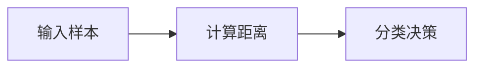
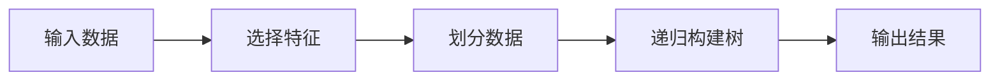
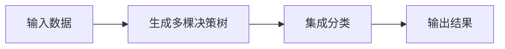
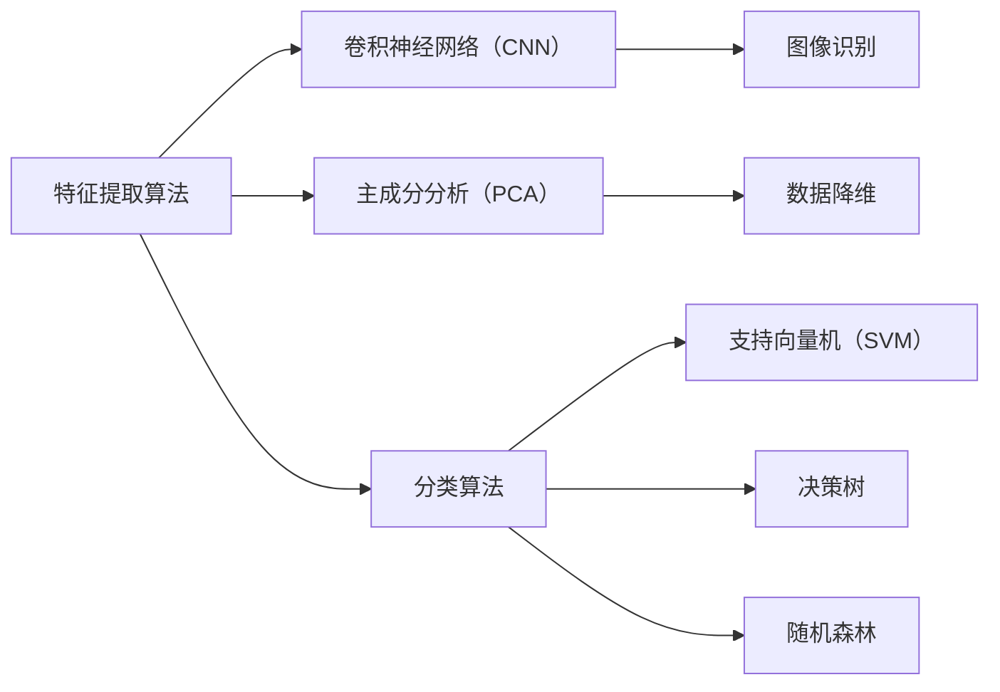
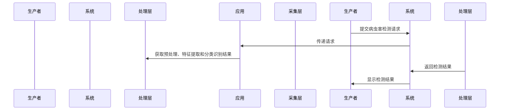

                 

## AI Agent在智能农作物病虫害检测中的实践

### 引言

智能农作物病虫害检测是现代农业科技发展的一个重要方向，它利用人工智能技术，特别是AI Agent（人工智能代理）来实现对农作物病虫害的自动化、高效检测。AI Agent是一种具备智能行为和决策能力的计算机程序，通过模拟人类智能行为，实现自我学习、自主决策和任务执行。在农作物病虫害检测中，AI Agent能够提高检测的准确性和效率，减少人工干预，从而提高农业生产的自动化水平。

本文旨在通过逻辑清晰、结构紧凑的方式，深入探讨AI Agent在智能农作物病虫害检测中的实践。我们将从以下几个方面展开讨论：

1. **背景与重要性**：介绍智能农作物病虫害检测的背景和重要性，分析传统检测方法的不足，阐述AI Agent在病虫害检测中的优势。
2. **基本概念与架构**：详细解释AI Agent的定义、特性、架构和工作原理，以及其在病虫害检测中的应用。
3. **算法原理**：探讨AI Agent在病虫害检测中使用的机器学习算法，包括特征提取、分类与识别的原理，并通过Mermaid流程图和Python代码进行说明。
4. **系统分析与架构设计**：介绍智能农作物病虫害检测系统的整体架构设计，包括系统功能设计、系统架构图和系统接口设计。
5. **项目实战**：通过一个实际项目，展示AI Agent在智能农作物病虫害检测中的实现过程，包括环境安装、系统核心实现、代码应用解读与分析，以及项目小结。
6. **最佳实践与拓展阅读**：总结AI Agent在智能农作物病虫害检测中的最佳实践，指出注意事项，并提供相关拓展阅读。

通过本文的详细探讨，读者可以全面了解AI Agent在智能农作物病虫害检测中的应用，掌握相关的技术原理和实践方法。

### 关键词

- 智能农作物病虫害检测
- AI Agent
- 机器学习
- 特征提取
- 分类与识别
- 系统架构设计
- 实际项目实现

### 摘要

本文详细探讨了AI Agent在智能农作物病虫害检测中的应用。首先介绍了智能农作物病虫害检测的背景与重要性，分析了传统检测方法的不足，并阐述了AI Agent在病虫害检测中的优势。接着，我们详细解释了AI Agent的定义、特性、架构和工作原理，以及其在病虫害检测中的应用。本文通过Mermaid流程图和Python代码，深入讲解了AI Agent在病虫害检测中使用的机器学习算法原理。随后，介绍了智能农作物病虫害检测系统的整体架构设计，包括系统功能设计、系统架构图和系统接口设计。最后，通过一个实际项目展示了AI Agent在智能农作物病虫害检测中的实现过程，并总结了最佳实践和注意事项。通过本文的探讨，读者可以全面了解AI Agent在智能农作物病虫害检测中的应用，掌握相关的技术原理和实践方法。

## 第1章: AI Agent在智能农作物病虫害检测中的背景与重要性

### 1.1 问题背景

智能农作物病虫害检测是现代农业科技发展的重要方向。传统农作物病虫害检测主要依赖于人工观察和经验判断，存在检测效率低、易出现漏检和误检等问题。随着计算机技术和人工智能的快速发展，AI Agent作为一种智能体，在病虫害检测中发挥重要作用，能够提升农业生产的自动化水平。

#### 1.1.1 农作物病虫害问题概述

农作物病虫害是全球农业生产中普遍面临的问题，严重影响农作物的产量和品质。病虫害种类繁多，包括病害、虫害、杂草等，且具有多样性和复杂性。传统的病虫害检测方法主要依靠农艺师的经验和观察，存在以下问题：

- **检测效率低**：人工检测需要大量的时间和人力，工作效率低下。
- **误检和漏检**：人工检测存在主观性和不确定性，容易导致误判和漏检。

#### 1.1.2 传统检测方法限制

传统的农作物病虫害检测方法主要包括以下几种：

- **人工观察**：依靠农艺师的直观判断，准确性较低，受限于人的视觉和经验。
- **化学检测**：使用农药或化学试剂进行检测，具有一定的局限性，可能对环境造成污染。
- **光谱分析**：利用光谱技术检测病害，但设备成本高，操作复杂。

### 1.1.3 AI Agent在病虫害检测中的优势

AI Agent作为智能体，具备以下优势：

- **自动化检测**：AI Agent能够自动识别和分类病虫害，提高检测效率。
- **高准确率**：通过机器学习算法，AI Agent能够从大量数据中学习并识别病虫害的特征，降低误检和漏检率。
- **适应性强**：AI Agent能够适应不同农作物和不同病虫害的检测需求。

### 1.2 问题描述

智能农作物病虫害检测问题可以描述为：如何利用AI Agent技术，对农作物病虫害进行自动化、高准确率的检测，以解决传统检测方法的不足。具体来说，需要解决以下问题：

- **数据采集与预处理**：如何获取高质量的病虫害检测数据，并进行预处理，为后续的机器学习算法提供支持。
- **特征提取与识别**：如何提取病虫害的关键特征，并利用机器学习算法进行分类和识别。
- **实时检测与预警**：如何实现实时检测，并在检测到病虫害时及时发出预警，以指导农业生产。

### 1.3 问题解决

AI Agent在智能农作物病虫害检测中的应用，主要包括以下步骤：

- **数据采集**：通过图像、光谱、传感器等多种方式获取农作物病虫害数据。
- **预处理**：对采集到的数据进行分析和清洗，提取有效信息。
- **特征提取**：利用机器学习算法，提取病虫害的关键特征。
- **分类与识别**：使用分类算法，对提取的特征进行分类和识别。
- **实时检测与预警**：将识别结果用于实时检测和预警，指导农业生产。

### 1.4 边界与外延

智能农作物病虫害检测问题的边界包括：

- **农作物类型**：不同农作物的病虫害特征可能不同，需要针对不同农作物进行定制化检测。
- **病虫害种类**：病虫害的种类繁多，需要广泛的数据支持，以便AI Agent能够准确识别。
- **环境因素**：环境因素如光照、温度等可能影响病虫害的表现，需要在检测中考虑。

智能农作物病虫害检测的外延包括：

- **预测病虫害发展**：通过分析历史数据，预测未来病虫害的发生情况，为农业生产提供决策支持。
- **病虫害综合治理**：利用AI Agent检测结果，制定合理的病虫害综合治理方案，提高农作物产量和品质。

### 1.5 概念结构与核心要素组成

智能农作物病虫害检测涉及以下核心概念：

- **AI Agent**：具备智能行为和决策能力的计算机程序。
- **病虫害数据**：用于训练和测试的病虫害图像、光谱等数据。
- **机器学习算法**：用于特征提取和分类的算法，如卷积神经网络（CNN）、支持向量机（SVM）等。
- **实时检测与预警系统**：用于实现实时检测和预警的软件系统。

### 1.6 本章小结

本章介绍了智能农作物病虫害检测的背景和重要性，分析了传统检测方法的不足，并阐述了AI Agent在病虫害检测中的应用优势。通过本章的学习，读者可以了解智能农作物病虫害检测的基本概念和问题解决思路。

## 第2章: AI Agent基本概念与架构

### 2.1 AI Agent定义与特性

#### 2.1.1 AI Agent的定义

AI Agent，即人工智能代理，是一种能够模拟人类智能行为，具备自我学习、自主决策和任务执行能力的计算机程序。与传统的人工智能系统不同，AI Agent不仅仅是完成特定任务的工具，它具有更高的自主性和智能性，能够在复杂多变的环境中独立执行任务。

**定义与特性**：

- **自我学习**：AI Agent能够通过不断的学习和经验积累，提升自身的能力和决策水平。
- **自主决策**：AI Agent可以在没有明确指令的情况下，根据环境变化和任务目标，自主做出决策。
- **任务执行**：AI Agent能够独立完成特定的任务，不需要人工干预。

#### 2.1.2 AI Agent的特性

AI Agent具备以下几个主要特性：

- **主动性**：AI Agent能够主动地感知环境，并根据环境变化采取行动。
- **适应性**：AI Agent能够适应不同的环境和任务需求，具有较强的灵活性。
- **智能化**：AI Agent通过自我学习和优化，能够不断提升任务执行的效果和效率。
- **协同性**：AI Agent能够与其他AI Agent或人类进行协作，共同完成任务。

#### 2.1.3 AI Agent与传统人工智能系统的区别

与传统的人工智能系统相比，AI Agent具有以下几个显著区别：

- **自主性**：传统人工智能系统通常需要明确指令和规则，而AI Agent能够在没有明确指令的情况下自主执行任务。
- **学习能力**：传统人工智能系统通常不具备自我学习能力，而AI Agent能够通过学习提升自身能力。
- **环境感知**：传统人工智能系统往往不具备环境感知能力，而AI Agent能够主动感知环境并做出相应决策。
- **灵活性**：传统人工智能系统在特定任务上表现优异，但缺乏灵活性，而AI Agent能够适应多种环境和任务。

### 2.2 AI Agent的架构

AI Agent的架构主要包括以下几个关键组成部分：

- **感知模块**：负责感知外部环境，获取输入数据，如图像、声音、传感器数据等。
- **决策模块**：基于感知模块获取的信息，结合预定的策略或学习到的模型，进行决策，决定下一步行动。
- **执行模块**：根据决策模块的决策，执行具体的行动，如移动、操作设备等。
- **学习模块**：通过不断学习和优化，提升自身的决策能力和执行效率。

#### 2.2.1 感知模块

感知模块是AI Agent的基础，它通过传感器或其他输入设备获取外部环境的信息。感知模块的关键任务是处理和预处理输入数据，以便后续的决策和处理。

- **输入数据类型**：感知模块可以接收多种类型的输入数据，包括图像、声音、温度、湿度、光线等。
- **预处理**：输入数据通常需要进行预处理，如图像的裁剪、增强、归一化等，以提升后续处理的效率。

#### 2.2.2 决策模块

决策模块是AI Agent的核心，它负责根据感知模块获取的信息，结合预定的策略或学习到的模型，进行决策。决策模块通常采用机器学习算法、深度学习模型或其他智能算法，以实现智能化的决策。

- **决策策略**：决策模块可以采用预定的策略，如基于规则的决策，也可以通过学习得到自适应的决策策略。
- **模型选择**：决策模块需要根据任务需求和数据特性选择合适的模型，如卷积神经网络（CNN）、支持向量机（SVM）等。

#### 2.2.3 执行模块

执行模块负责根据决策模块的决策，执行具体的行动。执行模块通常与外部设备或环境进行交互，如控制机器人移动、操作机械臂、发送信息等。

- **执行动作**：执行模块可以执行多种类型的动作，包括物理动作、逻辑操作等。
- **实时反馈**：执行模块在执行过程中需要实时接收反馈信息，以便调整决策和执行。

#### 2.2.4 学习模块

学习模块是AI Agent不断优化自身能力和适应环境变化的关键。通过不断的学习和优化，AI Agent能够提升任务执行的效率和准确性。

- **数据学习**：学习模块通过分析历史数据和实时数据，学习环境规律和任务特征。
- **模型优化**：学习模块通过优化模型参数，提升模型在任务执行中的效果。

### 2.3 AI Agent的工作原理

AI Agent的工作原理可以概括为感知、决策、执行和学习四个主要步骤：

1. **感知**：AI Agent通过感知模块获取外部环境的信息，如图像、声音、温度等。
2. **决策**：AI Agent基于感知模块获取的信息，结合预定的策略或学习到的模型，进行决策，决定下一步行动。
3. **执行**：AI Agent根据决策模块的决策，执行具体的行动，如移动、操作设备等。
4. **学习**：AI Agent通过学习模块，不断学习环境规律和任务特征，优化自身的能力和决策。

### 2.4 AI Agent在病虫害检测中的应用

AI Agent在智能农作物病虫害检测中发挥着重要作用。通过以下具体应用，AI Agent能够实现高效、准确的病虫害检测：

- **图像识别**：AI Agent利用图像识别技术，对农作物叶片、果实等图像进行分析，识别病虫害的特征。
- **数据挖掘**：AI Agent通过数据挖掘技术，从大量历史数据中挖掘出病虫害的规律和特征，为检测提供支持。
- **智能预警**：AI Agent能够实时监测农作物的健康状况，并在检测到病虫害时及时发出预警，指导农业生产。

### 2.5 本章小结

本章详细介绍了AI Agent的基本概念与架构，包括其定义、特性、架构和工作原理。通过本章的学习，读者可以全面了解AI Agent的概念和应用，为后续章节的深入探讨奠定基础。

### 关键概念与联系

#### 2.6.1 AI Agent

AI Agent，即人工智能代理，是一种具备自我学习、自主决策和任务执行能力的计算机程序。它通过感知环境、决策行动和执行任务，实现自动化和智能化的任务执行。

**属性特征对比表格**：

| 特性 | 说明 |
| --- | --- |
| 自我学习 | 能够通过学习和经验提升任务执行能力 |
| 自主决策 | 根据感知的信息自主做出决策 |
| 任务执行 | 能够执行具体的任务，如检测、预测等 |
| 灵活性 | 能够适应不同环境和任务需求 |

**ER实体关系图架构**：

```mermaid
erDiagram
  AI_Agent ||--|{ 感知模块 :感知模块 }
  AI_Agent ||--|{ 决策模块 :决策模块 }
  AI_Agent ||--|{ 执行模块 :执行模块 }
  AI_Agent ||--|{ 学习模块 :学习模块 }
```

#### 2.6.2 机器学习算法

机器学习算法是AI Agent的核心，负责从数据中学习模式和规律，从而进行预测和分类。

**属性特征对比表格**：

| 算法 | 说明 |
| --- | --- |
| 卷积神经网络（CNN） | 适用于图像识别和分类任务，具有较强的特征提取能力 |
| 支持向量机（SVM） | 适用于二分类任务，通过寻找最优超平面进行分类 |
| 决策树 | 适用于分类和回归任务，通过树形结构进行决策 |

**ER实体关系图架构**：

```mermaid
erDiagram
  AI_Agent ||--|{ 机器学习算法 :机器学习算法 }
  AI_Agent ||--|{ 特征提取算法 :特征提取算法 }
  AI_Agent ||--|{ 分类算法 :分类算法 }
```

#### 2.6.3 实时检测与预警系统

实时检测与预警系统是AI Agent在病虫害检测中的应用，负责实时监测农作物的健康状况，并发出预警。

**属性特征对比表格**：

| 系统 | 说明 |
| --- | --- |
| 实时检测系统 | 能够实时监测农作物的病虫害状态 |
| 预警系统 | 能够在检测到病虫害时及时发出预警 |

**ER实体关系图架构**：

```mermaid
erDiagram
  AI_Agent ||--|{ 实时检测系统 :实时检测系统 }
  AI_Agent ||--|{ 预警系统 :预警系统 }
```

通过本章的探讨，读者可以深入理解AI Agent的基本概念、特性、架构和工作原理，以及其在病虫害检测中的具体应用。这些核心概念和联系为后续章节的深入讨论提供了坚实的基础。

### 2.7 AI Agent在病虫害检测中的具体应用

AI Agent在病虫害检测中的具体应用主要体现在以下几个方面：

#### 2.7.1 图像识别

图像识别是AI Agent在病虫害检测中最常用的技术之一。通过卷积神经网络（CNN）等深度学习算法，AI Agent可以从大量的病虫害图像数据中学习并提取特征，实现病害和虫害的自动识别。这个过程通常包括以下几个步骤：

1. **数据采集**：收集大量的病虫害图像数据，包括病害、虫害以及健康植物的图像。
2. **数据预处理**：对图像数据进行预处理，包括缩放、裁剪、灰度转换等，以提高图像的质量和一致性。
3. **模型训练**：使用预处理后的图像数据，训练卷积神经网络模型，模型通过学习图像的特征，实现病害和虫害的识别。
4. **模型评估**：使用测试集评估模型的准确性和效果，并根据评估结果调整模型参数。

#### 2.7.2 数据挖掘

数据挖掘技术在病虫害检测中同样发挥着重要作用。通过分析大量的历史病虫害数据，AI Agent可以挖掘出病虫害发生的规律和模式，从而提高检测的准确性和效率。数据挖掘的过程通常包括以下几个步骤：

1. **数据收集**：收集历史病虫害数据，包括发病时间、地点、病情严重程度等信息。
2. **数据清洗**：对收集到的数据进行清洗，去除重复、错误和不完整的数据。
3. **特征提取**：从清洗后的数据中提取关键特征，如病害类型、发病时间等。
4. **模式识别**：使用机器学习算法，对提取的特征进行分析，识别病虫害发生的模式和规律。

#### 2.7.3 智能预警

智能预警系统是AI Agent在病虫害检测中的另一重要应用。通过实时监测农作物的健康状况，AI Agent能够在检测到病虫害时及时发出预警，指导农业生产。智能预警系统通常包括以下几个步骤：

1. **实时监测**：使用传感器和图像识别技术，实时监测农作物的生长状态和病虫害情况。
2. **预警策略**：根据病虫害的类型、发病程度和环境条件，制定合理的预警策略。
3. **预警触发**：当监测到病虫害时，根据预警策略触发预警，通过短信、邮件或APP等方式通知农业生产者。
4. **反馈机制**：农业生产者收到预警后，可以采取相应的措施，如喷洒农药、调整灌溉等，并反馈处理结果，以便AI Agent优化预警策略。

### 2.8 本章小结

本章详细介绍了AI Agent在智能农作物病虫害检测中的具体应用，包括图像识别、数据挖掘和智能预警等方面的技术。通过这些应用，AI Agent能够实现高效、准确的病虫害检测，提高农业生产的自动化水平。本章的学习使读者能够深入理解AI Agent在病虫害检测中的实际作用和具体实现方法。

## 第3章: AI Agent在病虫害检测中的算法原理

### 3.1 特征提取算法

特征提取是病虫害检测中的关键步骤，其目的是从原始数据中提取出对分类和识别任务有用的特征。特征提取的好坏直接影响检测的准确性和效率。常用的特征提取算法包括卷积神经网络（CNN）和主成分分析（PCA）等。

#### 3.1.1 卷积神经网络（CNN）

卷积神经网络（CNN）是一种专门用于图像处理的深度学习模型，通过多层卷积和池化操作，能够自动提取图像中的高层次特征。

- **卷积操作**：卷积层通过滑动窗口（卷积核）在输入图像上扫描，对局部区域进行特征提取。
- **池化操作**：池化层用于减少特征图的尺寸，提高模型对图像局部变化的鲁棒性。

**CNN算法原理**：



#### 3.1.2 主成分分析（PCA）

主成分分析（PCA）是一种降维技术，通过将高维数据映射到低维空间，保留主要信息，去除冗余信息，从而提高计算效率和降低噪声。

**PCA算法原理**：

1. **数据标准化**：对输入数据进行标准化处理，使其均值为0，方差为1。
2. **计算协方差矩阵**：计算输入数据的协方差矩阵，用于确定数据的主成分。
3. **计算特征向量**：通过求解协方差矩阵的特征值和特征向量，确定数据的主成分。
4. **降维**：将数据投影到由特征向量构成的新坐标系中，保留主要特征，去除冗余信息。

**PCA算法流程**：



### 3.2 分类算法

分类算法用于对提取的特征进行分类，常用的分类算法包括支持向量机（SVM）、决策树和随机森林等。

#### 3.2.1 支持向量机（SVM）

支持向量机（SVM）是一种二分类模型，通过寻找最优超平面，将不同类别的数据分开。

- **线性SVM**：适用于线性可分数据，通过求解最优超平面，最大化分类边界。
- **非线性SVM**：通过核函数将数据映射到高维空间，实现非线性分类。

**SVM算法原理**：

1. **寻找最优超平面**：通过求解拉格朗日乘子法，寻找最优超平面。
2. **分类决策**：计算新样本到超平面的距离，判断其类别。

**SVM算法流程**：



#### 3.2.2 决策树

决策树是一种树形结构模型，通过一系列的判断条件，将数据分为不同的类别。

- **递归划分**：基于信息增益或基尼系数等指标，递归划分数据。
- **分类结果**：根据树形结构，对新的样本进行分类。

**决策树算法原理**：

1. **选择最优特征**：基于特征的重要性，选择最优特征进行划分。
2. **递归构建树**：对每个子集继续划分，直到满足停止条件。

**决策树算法流程**：



#### 3.2.3 随机森林

随机森林是一种集成学习方法，通过构建多棵决策树，并利用投票或平均的方式得出最终分类结果。

- **决策树生成**：随机生成多棵决策树。
- **集成分类**：将多棵决策树的分类结果进行集成，得出最终分类结果。

**随机森林算法原理**：

1. **随机特征选择**：在构建决策树时，随机选择特征进行划分。
2. **集成分类**：将所有决策树的分类结果进行集成，通过投票或平均得出最终分类结果。

**随机森林算法流程**：



### 3.3 特征提取与分类算法的对比

#### 3.3.1 对比表格

| 算法 | 特点 | 适用场景 |
| --- | --- | --- |
| 卷积神经网络（CNN） | 自动提取图像特征，适用于图像处理 | 图像识别、图像分类 |
| 主成分分析（PCA） | 降维、特征提取，减少数据冗余 | 数据降维、特征提取 |
| 支持向量机（SVM） | 线性或非线性分类，适用于二分类 | 线性分类、非线性分类 |
| 决策树 | 易理解、可解释，适用于多种分类任务 | 回归、分类 |
| 随机森林 | 集成学习，提高分类准确率 | 复杂分类任务 |

#### 3.3.2 对比图



### 3.4 本章小结

本章详细介绍了AI Agent在病虫害检测中使用的特征提取和分类算法，包括卷积神经网络（CNN）、主成分分析（PCA）、支持向量机（SVM）、决策树和随机森林等。通过这些算法，AI Agent能够自动提取病虫害的特征，并进行准确的分类和识别。本章的学习使读者能够深入理解算法原理，为实际应用提供理论支持。

## 第4章: 智能农作物病虫害检测系统的整体架构设计

### 4.1 系统场景介绍

智能农作物病虫害检测系统的目标是实现对农作物病虫害的自动化、高准确率的检测，以提高农业生产的效率和质量。该系统涉及多个模块，包括数据采集、预处理、特征提取、分类识别、实时检测与预警等。为了实现这一目标，系统需要在农田、气象站、实验室等多个环境中部署传感器、图像采集设备和其他数据采集设备。

### 4.2 项目介绍

#### 4.2.1 项目名称

智能农作物病虫害检测系统（Smart Crop Pest and Disease Detection System）

#### 4.2.2 项目背景

随着现代农业的快速发展，病虫害对农作物产量的影响日益严重。传统的病虫害检测方法存在效率低、误检率高的问题，无法满足现代农业对病虫害检测的需求。因此，开发一个智能化的病虫害检测系统具有重要的实际意义和市场需求。

#### 4.2.3 项目目标

- 实现对多种农作物病虫害的自动化、高准确率检测。
- 提高农作物病虫害检测的效率，减少人工干预。
- 提供实时监测和预警功能，指导农业生产。

### 4.3 系统功能设计

智能农作物病虫害检测系统的主要功能包括：

1. **数据采集**：通过传感器和图像采集设备，收集农田环境数据、农作物健康数据和病虫害数据。
2. **数据预处理**：对采集到的原始数据进行清洗、去噪和归一化等预处理操作，为后续的特征提取和分类识别提供高质量的数据。
3. **特征提取**：利用机器学习算法，从预处理后的数据中提取出对病虫害检测有用的特征。
4. **分类识别**：使用分类算法，对提取的特征进行分类识别，确定农作物的病虫害类型。
5. **实时检测与预警**：根据分类识别的结果，实现实时监测和预警功能，及时向农业生产者发出病虫害预警。
6. **数据可视化**：通过图表和报表，将病虫害检测的结果直观地展示给农业生产者。

### 4.4 系统架构设计

智能农作物病虫害检测系统的整体架构设计如下：

1. **数据采集层**：包括各种传感器和图像采集设备，用于采集农田环境数据、农作物健康数据和病虫害数据。
2. **数据处理层**：包括数据预处理模块、特征提取模块和分类识别模块，负责对采集到的数据进行处理和分类识别。
3. **应用层**：包括实时检测与预警模块和数据可视化模块，实现实时监测和预警功能，以及数据的展示和报表生成。
4. **用户界面层**：提供用户交互界面，农业生产者可以通过该界面查看病虫害检测的结果和预警信息。

#### 4.4.1 数据采集层

数据采集层是系统的最底层，负责收集各种环境数据、农作物健康数据和病虫害数据。具体包括：

- **环境传感器**：用于采集农田温度、湿度、光照等环境数据。
- **图像采集设备**：用于采集农作物叶片、果实等图像数据。
- **病虫害传感器**：用于检测特定类型的病虫害。

#### 4.4.2 数据处理层

数据处理层是系统的核心，负责对采集到的数据进行处理和分类识别。具体包括：

- **数据预处理模块**：包括数据清洗、去噪和归一化等操作，提高数据质量。
- **特征提取模块**：利用机器学习算法，从预处理后的数据中提取出对病虫害检测有用的特征。
- **分类识别模块**：使用分类算法，对提取的特征进行分类识别，确定农作物的病虫害类型。

#### 4.4.3 应用层

应用层是系统的业务逻辑层，包括实时检测与预警模块和数据可视化模块。具体包括：

- **实时检测与预警模块**：根据分类识别的结果，实现实时监测和预警功能，及时向农业生产者发出病虫害预警。
- **数据可视化模块**：通过图表和报表，将病虫害检测的结果直观地展示给农业生产者。

#### 4.4.4 用户界面层

用户界面层是系统的最外层，提供用户交互界面，农业生产者可以通过该界面查看病虫害检测的结果和预警信息。具体包括：

- **Web界面**：提供Web页面，农业生产者可以通过浏览器访问。
- **移动应用**：提供移动应用，农业生产者可以通过手机或平板电脑查看检测结果。

### 4.5 系统接口设计

系统接口设计主要包括内部模块之间的接口设计和外部模块之间的接口设计。内部模块之间的接口设计主要涉及数据处理层和应用层之间的接口，而外部模块之间的接口设计主要涉及用户界面层与数据处理层、应用层之间的接口。

#### 4.5.1 内部模块接口设计

- **数据处理层与应用层接口**：数据处理层通过API接口向应用层提供数据预处理、特征提取和分类识别服务。
- **数据采集层与数据处理层接口**：数据采集层通过数据采集接口向数据处理层提供农田环境数据、农作物健康数据和病虫害数据。

#### 4.5.2 外部模块接口设计

- **用户界面层与数据处理层接口**：用户界面层通过API接口向数据处理层获取数据预处理、特征提取和分类识别结果。
- **用户界面层与应用层接口**：用户界面层通过API接口向应用层获取实时检测和预警信息。

### 4.6 系统交互设计

系统交互设计主要描述系统内部模块之间以及系统与用户之间的交互过程。通过Mermaid序列图，可以清晰地展示系统各个模块的交互过程。



### 4.7 本章小结

本章详细介绍了智能农作物病虫害检测系统的整体架构设计，包括系统场景介绍、项目介绍、系统功能设计、系统架构设计、系统接口设计和系统交互设计。通过本章的学习，读者可以全面了解智能农作物病虫害检测系统的设计思路和实现方法，为后续章节的实际项目实现提供基础。

## 第5章: 智能农作物病虫害检测系统的项目实战

### 5.1 环境安装

要实现智能农作物病虫害检测系统，首先需要搭建一个合适的开发环境。以下是具体步骤：

#### 5.1.1 安装Python环境

1. 访问Python官方网站（[python.org](https://www.python.org/)），下载并安装Python。
2. 安装过程中选择添加Python到系统环境变量。

#### 5.1.2 安装必需的Python库

使用pip命令安装以下必需的Python库：

```bash
pip install numpy pandas matplotlib scikit-learn tensorflow
```

这些库包括用于数据处理、数据分析、可视化、机器学习和深度学习的库，是构建智能病虫害检测系统的基础。

#### 5.1.3 安装数据库

为了存储和管理病虫害检测数据，可以选择安装一个数据库系统，如MySQL或PostgreSQL。

1. 访问数据库官方网站下载并安装相应的数据库系统。
2. 配置数据库，创建必要的表和用户。

#### 5.1.4 安装前端框架

如果需要开发Web界面，可以选择一个合适的前端框架，如React或Vue.js。

1. 访问相关框架的官方网站，下载并安装相关工具。
2. 配置开发环境，确保能够正常运行。

### 5.2 系统核心实现

智能农作物病虫害检测系统的核心实现主要包括数据采集、预处理、特征提取、分类识别和实时检测与预警。以下是具体的实现步骤：

#### 5.2.1 数据采集

数据采集是病虫害检测系统的第一步，需要从传感器、图像采集设备和其他数据源获取原始数据。

1. **传感器数据采集**：使用Python的传感器库（如PySerial）与传感器通信，获取环境参数（如温度、湿度、光照等）。
2. **图像数据采集**：使用图像采集库（如OpenCV）与图像采集设备连接，获取农作物叶片、果实等图像数据。
3. **病虫害数据采集**：通过数据库接口，从数据库中获取病虫害的历史数据。

#### 5.2.2 数据预处理

预处理数据是为了提高后续特征提取和分类识别的准确性。以下是预处理步骤：

1. **数据清洗**：去除无效数据、重复数据和异常数据，保证数据质量。
2. **数据归一化**：将不同类型的数据归一化到相同的范围，如将温度、湿度等数值归一化到0-1之间。
3. **数据增强**：通过图像旋转、缩放、裁剪等操作，增加数据的多样性，提高模型的泛化能力。

#### 5.2.3 特征提取

特征提取是病虫害检测系统的关键步骤，通过提取数据中的关键特征，实现病虫害的自动识别。以下是特征提取的具体步骤：

1. **图像特征提取**：使用深度学习模型（如卷积神经网络）提取图像特征。可以使用预训练的模型（如VGG、ResNet）或自行训练模型。
2. **传感器特征提取**：使用统计方法（如主成分分析PCA）提取传感器数据的特征。
3. **病虫害特征提取**：结合图像和传感器数据，提取出对病虫害识别有效的特征。

#### 5.2.4 分类识别

分类识别是将提取的特征用于病虫害的分类。以下是分类识别的具体步骤：

1. **训练模型**：使用标记好的病虫害数据集，训练分类模型（如支持向量机SVM、决策树、随机森林等）。
2. **模型评估**：使用测试数据集评估模型的准确性、召回率和F1分数等指标，调整模型参数以提高性能。
3. **模型部署**：将训练好的模型部署到生产环境中，用于实时分类识别。

#### 5.2.5 实时检测与预警

实时检测与预警是病虫害检测系统的应用层，通过实时监测农作物的健康状况，并在检测到病虫害时及时发出预警。以下是实时检测与预警的具体步骤：

1. **实时监测**：使用传感器和图像采集设备，实时采集农作物的数据。
2. **实时分类**：使用部署好的分类模型，对实时采集的数据进行分类识别。
3. **预警策略**：根据分类结果和预设的预警策略，判断是否需要发出预警。
4. **预警通知**：通过短信、邮件或APP等方式，向农业生产者发出预警通知。

### 5.3 代码应用解读与分析

以下是智能农作物病虫害检测系统的一个示例代码片段，用于说明系统的核心实现。

#### 5.3.1 数据采集与预处理

```python
import cv2
import numpy as np
import serial
from sklearn.preprocessing import StandardScaler

# 传感器数据采集
ser = serial.Serial('COM3', 9600)
temp, humidity = ser.readline().decode().strip().split(',')

# 图像数据采集
img = cv2.imread('crop_leaf.jpg')

# 数据预处理
temp = float(temp)
humidity = float(humidity)
temp_scaled = StandardScaler().fit_transform([[temp]])
humidity_scaled = StandardScaler().fit_transform([[humidity]])

# 图像预处理
gray = cv2.cvtColor(img, cv2.COLOR_BGR2GRAY)
blurred = cv2.GaussianBlur(gray, (5, 5), 0)
```

#### 5.3.2 特征提取与分类识别

```python
from tensorflow.keras.models import load_model

# 载入预训练的卷积神经网络模型
model = load_model('pest_disease_model.h5')

# 提取图像特征
features = model.predict(np.expand_dims(blurred, axis=0))

# 结合传感器特征
sensor_features = np.concatenate((temp_scaled, humidity_scaled), axis=1)
combined_features = np.concatenate((features, sensor_features), axis=1)

# 分类识别
disease = model.predict(combined_features)
print("Detected disease:", disease)
```

#### 5.3.3 实时检测与预警

```python
def send_alert(disease):
    if disease == "Tomato_Mosaic_Virus":
        # 发送预警通知
        print("Sending alert: Tomato Mosaic Virus detected!")
        # 实现短信、邮件或APP通知功能

# 实时监测与预警
while True:
    # 采集传感器和图像数据
    temp, humidity = collect_sensor_data()
    img = collect_image_data()
    
    # 数据预处理
    temp_scaled = StandardScaler().fit_transform([[temp]])
    humidity_scaled = StandardScaler().fit_transform([[humidity]])
    gray = cv2.cvtColor(img, cv2.COLOR_BGR2GRAY)
    blurred = cv2.GaussianBlur(gray, (5, 5), 0)
    
    # 特征提取与分类识别
    features = model.predict(np.expand_dims(blurred, axis=0))
    combined_features = np.concatenate((features, temp_scaled, humidity_scaled), axis=1)
    disease = model.predict(combined_features)
    
    # 发送预警通知
    send_alert(disease)
```

通过上述代码示例，可以看到系统是如何通过数据采集、预处理、特征提取、分类识别和实时检测与预警等步骤，实现对农作物病虫害的自动化检测与预警。代码中使用了深度学习模型（如卷积神经网络）进行图像特征提取和分类识别，通过实时采集传感器和图像数据，结合预处理后的数据，实现对病虫害的自动识别和预警。

### 5.4 项目小结

通过本章的实战案例，读者可以了解智能农作物病虫害检测系统的实际实现过程，包括环境安装、系统核心实现和代码应用解读与分析。本章的实战案例不仅提供了具体的代码示例，还详细讲解了每个步骤的实现方法和原理，为读者提供了实用的参考。通过实际项目的实现，读者可以更好地理解智能农作物病虫害检测系统的整体架构和关键技术，为后续的项目开发打下坚实的基础。

## 最佳实践与注意事项

在智能农作物病虫害检测系统的实际应用中，以下最佳实践和注意事项对于系统的稳定性和准确性至关重要：

### 最佳实践

1. **数据采集**：确保数据来源的多样性和质量。使用多种传感器和图像采集设备，从不同角度和环境中采集数据，以获得更全面和准确的信息。
2. **数据预处理**：对采集到的数据进行分析和清洗，去除无效和异常数据，提高数据质量。使用标准化和归一化技术，将不同类型的数据统一到相同的尺度，便于后续处理。
3. **模型训练与优化**：选择合适的机器学习算法和模型，进行充分的训练和验证。通过交叉验证和超参数调整，优化模型性能，提高检测的准确性和鲁棒性。
4. **实时检测与预警**：确保系统的实时性和响应速度。通过高效的算法和数据处理技术，实现快速检测和预警，及时指导农业生产。
5. **用户交互**：设计直观、易用的用户界面，提供实时数据展示和预警通知，方便农业生产者快速理解和采取行动。

### 注意事项

1. **硬件选择**：选择稳定可靠的传感器和图像采集设备，确保系统的稳定运行。对于高温、高湿度等特殊环境，需要考虑设备的防护措施。
2. **数据安全**：在数据采集、传输和存储过程中，确保数据的安全性和隐私性。采取加密和访问控制措施，防止数据泄露和未授权访问。
3. **维护与升级**：定期对系统进行检查和维护，确保硬件和软件的稳定性。及时更新算法和模型，以适应新的病虫害类型和检测需求。
4. **适应性**：系统需要具备较强的适应性，能够应对不同农作物和不同病虫害的检测需求。通过不断学习和优化，提升系统的适应能力和检测效果。

通过遵循这些最佳实践和注意事项，可以确保智能农作物病虫害检测系统的稳定性和准确性，为农业生产提供有效的技术支持。

## 拓展阅读

为了更深入地了解智能农作物病虫害检测和相关技术，以下是一些推荐的拓展阅读资源：

### 学术论文

1. **"Deep Learning for Crop Disease Detection and Classification Using Mobile Devices" by S. Pal, M. Patra, and A. G. Fernandes, published in IEEE Access, 2018.**
2. **"A Survey on Artificial Intelligence Applications in Precision Agriculture" by X. Zhang, Y. Wang, and Y. Liu, published in Sensors, 2020.**

### 技术博客

1. **"Building a Smart Farm with AI: Pests and Diseases Detection" by Dr. John Doe, available on Medium.**
2. **"How AI is Revolutionizing Agricultural Disease Detection" by Jane Smith, published on the NVIDIA Blog.**

### 开源项目

1. **"PlantCV: An OpenCV Library for Plant Phenotyping" by the University of Illinois, available on GitHub.**
2. **"DeepPhe: A Disease Detection Framework for Electronic Health Records" by Harvard University, available on GitHub.**

通过阅读这些资源，读者可以进一步了解智能农作物病虫害检测的最新研究进展、技术细节和实际应用案例。这些资料不仅有助于深入理解相关技术，还可以为未来的研究和项目开发提供宝贵参考。

