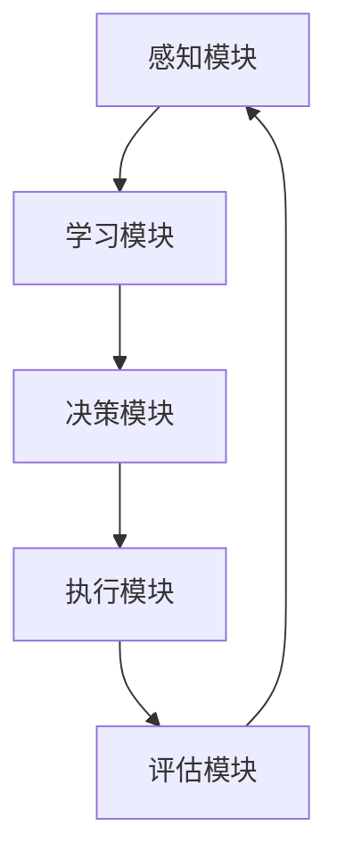
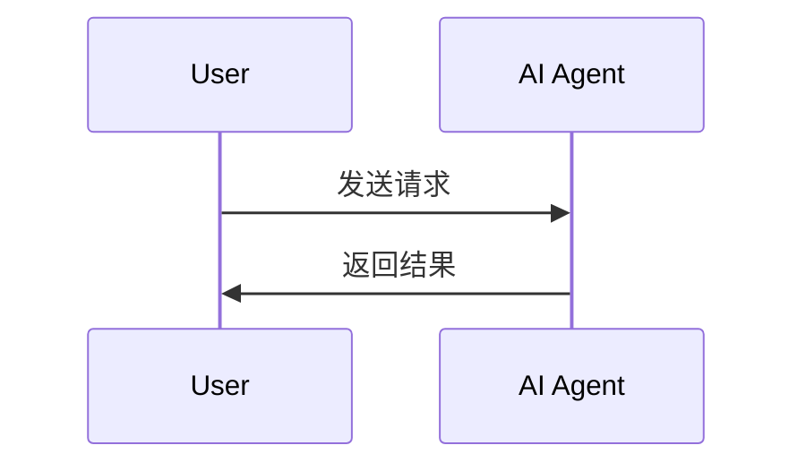

                 

# 《AI Agent在智能制造中的实践案例》目录大纲

## 第1章 问题背景与核心概念介绍

### 1.1 问题背景

#### 1.1.1 智能制造的发展现状
随着全球工业4.0的推进，智能制造已经成为现代工业发展的重要趋势。智能制造通过信息物理系统的深度融合，实现了生产过程的自动化、智能化和优化，大大提升了生产效率和产品质量。

#### 1.1.2 智能制造面临的问题与挑战
然而，智能制造在发展过程中也面临诸多挑战，如生产线的自适应能力不足、设备维护和故障诊断难度大、生产调度效率低下等。

#### 1.1.3 AI Agent的概念与作用
AI Agent，即人工智能代理，是一种基于人工智能技术自主执行任务、与环境交互并作出决策的实体。AI Agent在智能制造中的应用，有望解决上述问题与挑战，提升智能制造的智能化水平。

### 1.2 核心概念与联系

#### 1.2.1 AI Agent的定义与分类
AI Agent可以按照任务类型、学习方式、决策模型等进行分类。每种分类都有其特定的应用场景和优势。

#### 1.2.2 AI Agent在智能制造中的应用
AI Agent在智能制造中的应用主要包括自动化生产线控制、工业机器人控制、产品质量检测等。

#### 1.2.3 AI Agent与其他智能制造技术的关系
AI Agent与其他智能制造技术如物联网、云计算、大数据等有着紧密的联系和相互促进的作用。

## 第2章 AI Agent基础理论

### 2.1 AI Agent的基本原理

#### 2.1.1 人工智能的基本概念
人工智能是一门研究、开发用于模拟、延伸和扩展人的智能的理论、方法、技术及应用系统的技术科学。

#### 2.1.2 机器学习的基础理论
机器学习是人工智能的一个重要分支，它通过数据驱动的方式，让计算机自动从数据中学习规律，从而实现智能化。

#### 2.1.3 强化学习的基本原理
强化学习是一种机器学习范式，通过奖励和惩罚机制，让AI Agent在互动环境中不断学习和优化策略。

### 2.2 AI Agent的核心技术

#### 2.2.1 代表性AI Agent算法介绍
如深度学习、自然语言处理、计算机视觉等。

#### 2.2.2 AI Agent的学习与决策过程
AI Agent通过感知、学习、决策和执行等过程，实现自主执行任务。

#### 2.2.3 AI Agent的评估与优化
对AI Agent的性能进行评估，并基于评估结果进行优化。

### 2.3 AI Agent的应用场景

#### 2.3.1 自动化生产线中的AI Agent
自动化生产线中的AI Agent负责生产线的监控、调度和故障诊断。

#### 2.3.2 工业机器人控制中的AI Agent
工业机器人控制中的AI Agent负责机器人的路径规划、动作协调和任务执行。

#### 2.3.3 产品质量检测中的AI Agent
产品质量检测中的AI Agent负责对生产出来的产品进行质量检测，确保产品质量。

## 第3章 AI Agent在智能制造中的实践应用

### 3.1 AI Agent在自动化生产线中的应用

#### 3.1.1 自动化生产线的需求分析
自动化生产线需要具备自适应、自诊断、自优化等功能。

#### 3.1.2 AI Agent在自动化生产线中的应用案例
以某企业的自动化生产线为例，介绍AI Agent的应用。

#### 3.1.3 AI Agent在自动化生产线中的应用效果分析
分析AI Agent在自动化生产线中的应用效果。

### 3.2 AI Agent在工业机器人控制中的应用

#### 3.2.1 工业机器人的控制需求分析
工业机器人需要具备高精度、高速度、高稳定性等特性。

#### 3.2.2 AI Agent在工业机器人控制中的应用案例
以某工业机器人的控制为例，介绍AI Agent的应用。

#### 3.2.3 AI Agent在工业机器人控制中的应用效果分析
分析AI Agent在工业机器人控制中的应用效果。

### 3.3 AI Agent在产品质量检测中的应用

#### 3.3.1 产品质量检测的需求分析
产品质量检测需要具备高精度、高效率、低误报率等特性。

#### 3.3.2 AI Agent在产品质量检测中的应用案例
以某企业的产品质量检测为例，介绍AI Agent的应用。

#### 3.3.3 AI Agent在产品质量检测中的应用效果分析
分析AI Agent在产品质量检测中的应用效果。

## 第4章 AI Agent系统的设计与实现

### 4.1 AI Agent系统的架构设计

#### 4.1.1 系统架构设计的原则
系统架构设计应遵循模块化、可扩展、高可靠性的原则。

#### 4.1.2 AI Agent系统的模块划分
AI Agent系统可以分为感知模块、学习模块、决策模块和执行模块。

#### 4.1.3 系统架构的Mermaid流程图
使用Mermaid画出AI Agent系统的架构流程图。

### 4.2 AI Agent系统的功能设计

#### 4.2.1 系统功能的需求分析
系统功能应包括生产监控、故障诊断、生产调度等。

#### 4.2.2 系统功能的实现方法
详细介绍系统功能的实现方法。

#### 4.2.3 系统功能的Mermaid类图
使用Mermaid画出AI Agent系统的功能类图。

### 4.3 AI Agent系统的接口设计

#### 4.3.1 系统接口的需求分析
系统接口应包括数据接口、控制接口、交互接口等。

#### 4.3.2 系统接口的实现方法
详细介绍系统接口的实现方法。

#### 4.3.3 系统接口的Mermaid序列图
使用Mermaid画出AI Agent系统的接口序列图。

## 第5章 AI Agent在智能制造中的实际应用案例分析

### 5.1 案例一：某企业自动化生产线的AI Agent应用

#### 5.1.1 案例背景
介绍案例企业的背景和需求。

#### 5.1.2 AI Agent应用
详细介绍AI Agent在案例企业中的应用。

#### 5.1.3 应用效果分析
分析AI Agent在案例企业中的应用效果。

### 5.2 案例二：某工业机器人控制中的AI Agent应用

#### 5.2.1 案例背景
介绍案例机器人的背景和需求。

#### 5.2.2 AI Agent应用
详细介绍AI Agent在案例机器人中的应用。

#### 5.2.3 应用效果分析
分析AI Agent在案例机器人中的应用效果。

### 5.3 案例三：某产品质量检测中的AI Agent应用

#### 5.3.1 案例背景
介绍案例企业的背景和需求。

#### 5.3.2 AI Agent应用
详细介绍AI Agent在案例企业中的应用。

#### 5.3.3 应用效果分析
分析AI Agent在案例企业中的应用效果。

## 第6章 项目实战

### 6.1 环境安装

#### 6.1.1 环境准备
介绍项目开发所需的环境准备。

#### 6.1.2 安装工具和依赖
详细介绍项目所需的工具和依赖的安装过程。

### 6.2 系统核心实现源代码

#### 6.2.1 源代码结构
介绍系统核心实现的源代码结构。

#### 6.2.2 源代码功能解析
详细解析系统核心实现的源代码功能。

### 6.3 代码应用解读与分析

#### 6.3.1 代码应用场景
介绍代码的应用场景。

#### 6.3.2 代码解析
详细解析代码的实现过程。

### 6.4 实际案例分析和详细讲解剖析

#### 6.4.1 案例背景
介绍实际案例的背景。

#### 6.4.2 案例分析
详细分析实际案例。

#### 6.4.3 剖析
对案例进行详细讲解和剖析。

### 6.5 项目小结

#### 6.5.1 项目总结
总结项目的实施过程和效果。

#### 6.5.2 项目展望
对项目的未来发展进行展望。

## 第7章 最佳实践 tips、小结、注意事项、拓展阅读等内容

### 7.1 最佳实践 tips

#### 7.1.1 AI Agent在智能制造中的应用策略
提供AI Agent在智能制造中应用的最佳实践策略。

### 7.2 小结

#### 7.2.1 关键技术和应用场景
总结AI Agent在智能制造中的关键技术和应用场景。

### 7.3 注意事项

#### 7.3.1 AI Agent系统的设计与实现
介绍AI Agent系统的设计与实现需要注意的事项。

### 7.4 拓展阅读

#### 7.4.1 相关书籍和论文
推荐一些与AI Agent在智能制造中的应用相关的书籍和论文。# 《AI Agent在智能制造中的实践案例》

关键词：智能制造、AI Agent、自动化生产线、工业机器人、产品质量检测

摘要：
本文旨在探讨AI Agent在智能制造中的实践应用，通过分析AI Agent的基本原理和核心技术，介绍其在自动化生产线、工业机器人和产品质量检测等领域的实际应用案例。文章将逐步解析AI Agent系统的设计与实现，并通过具体案例展示其在智能制造中的应用效果。最后，本文将总结最佳实践策略，并给出注意事项和拓展阅读建议。

## 第1章 问题背景与核心概念介绍

### 1.1 问题背景

#### 1.1.1 智能制造的发展现状

智能制造作为工业4.0的核心概念，正在全球范围内迅速发展。通过物联网、大数据、人工智能等先进技术的深度融合，智能制造实现了生产过程的自动化、网络化和智能化，从而大幅提升了生产效率、降低了成本、提高了产品质量。然而，随着智能制造的不断深化，传统的生产模式和设备面临诸多挑战。例如，生产线的自适应能力不足，难以应对复杂的制造环境；设备维护和故障诊断难度大，影响生产连续性；生产调度效率低下，难以满足市场需求。

#### 1.1.2 智能制造面临的问题与挑战

智能制造在发展过程中面临以下问题与挑战：

1. **自适应能力不足**：传统生产线在复杂制造环境下难以适应，导致生产效率低下。
2. **设备维护和故障诊断难度大**：设备维护成本高，故障诊断周期长，影响生产连续性。
3. **生产调度效率低下**：生产调度策略不完善，难以实现生产计划的实时优化。
4. **数据孤岛问题**：生产过程中产生的海量数据无法得到充分利用，导致数据价值无法最大化。

#### 1.1.3 AI Agent的概念与作用

AI Agent，即人工智能代理，是一种基于人工智能技术自主执行任务、与环境交互并作出决策的实体。AI Agent通过感知、学习、决策和执行等过程，能够自主完成特定的任务。在智能制造中，AI Agent可以应用于自动化生产线、工业机器人和产品质量检测等领域，解决传统生产模式面临的诸多挑战。

1. **自动化生产线**：AI Agent可以实时监控生产线状态，实现自适应生产调度，提高生产效率。
2. **工业机器人**：AI Agent可以协助机器人进行路径规划、动作协调和任务执行，提高生产稳定性。
3. **产品质量检测**：AI Agent可以通过图像识别、自然语言处理等技术，对产品质量进行实时检测，降低误报率和漏报率。

### 1.2 核心概念与联系

#### 1.2.1 AI Agent的定义与分类

AI Agent是指一种能够在特定环境下，通过感知、学习、决策和执行等过程，自主执行任务、与环境交互并作出决策的实体。根据任务类型、学习方式、决策模型等不同，AI Agent可以分为以下几类：

1. **基于规则的AI Agent**：通过预定义的规则进行决策，适用于规则明确、环境变化较小的场景。
2. **基于模型的AI Agent**：通过学习和预测模型进行决策，适用于环境复杂、需要持续学习优化的场景。
3. **混合型AI Agent**：结合规则和模型，利用两者的优势进行决策。

#### 1.2.2 AI Agent在智能制造中的应用

AI Agent在智能制造中的应用主要包括自动化生产线控制、工业机器人控制和产品质量检测等方面：

1. **自动化生产线控制**：AI Agent可以实时监控生产线状态，实现自适应生产调度，提高生产效率。
2. **工业机器人控制**：AI Agent可以协助机器人进行路径规划、动作协调和任务执行，提高生产稳定性。
3. **产品质量检测**：AI Agent可以通过图像识别、自然语言处理等技术，对产品质量进行实时检测，降低误报率和漏报率。

#### 1.2.3 AI Agent与其他智能制造技术的关系

AI Agent与其他智能制造技术如物联网、云计算、大数据等有着紧密的联系和相互促进的作用：

1. **物联网**：通过物联网技术，AI Agent可以获取实时的生产数据，为决策提供依据。
2. **云计算**：通过云计算技术，AI Agent可以实现大规模数据处理和存储，提高系统性能。
3. **大数据**：通过大数据技术，AI Agent可以分析海量数据，发现潜在的问题和改进点。

## 第2章 AI Agent基础理论

### 2.1 AI Agent的基本原理

#### 2.1.1 人工智能的基本概念

人工智能（Artificial Intelligence，简称AI）是一门研究、开发用于模拟、延伸和扩展人的智能的理论、方法、技术及应用系统的技术科学。人工智能的目标是使计算机系统具备人类的智能，能够解决复杂问题、进行自主学习和决策。

人工智能的主要研究领域包括：

1. **知识表示与推理**：研究如何将人类知识转化为计算机可处理的形式，并进行推理。
2. **机器学习**：研究如何让计算机从数据中学习规律，实现自主学习和优化。
3. **自然语言处理**：研究如何让计算机理解和处理自然语言。
4. **计算机视觉**：研究如何让计算机理解图像和视频。
5. **智能搜索**：研究如何快速、准确地找到所需信息。

#### 2.1.2 机器学习的基础理论

机器学习是人工智能的一个重要分支，通过数据驱动的方式，让计算机自动从数据中学习规律，从而实现智能化。机器学习的主要方法包括：

1. **监督学习**：通过已标记的数据训练模型，然后使用模型对新数据进行预测。
2. **无监督学习**：通过未标记的数据训练模型，从数据中自动发现规律。
3. **半监督学习**：结合监督学习和无监督学习，利用少量标记数据和大量未标记数据训练模型。
4. **强化学习**：通过奖励和惩罚机制，让计算机在互动环境中不断学习和优化策略。

#### 2.1.3 强化学习的基本原理

强化学习是一种机器学习范式，通过奖励和惩罚机制，让计算机在互动环境中不断学习和优化策略。强化学习的基本原理包括：

1. **状态（State）**：系统当前所处的环境状态。
2. **动作（Action）**：系统可以采取的动作。
3. **奖励（Reward）**：动作带来的奖励，用于评估动作的好坏。
4. **价值函数（Value Function）**：评估当前状态的价值。
5. **策略（Policy）**：基于状态和价值函数，选择最优动作的规则。

强化学习的目标是通过不断尝试和反馈，找到最优策略，使系统在长期运行中获得最大奖励。

### 2.2 AI Agent的核心技术

#### 2.2.1 代表性AI Agent算法介绍

AI Agent的核心技术包括：

1. **深度学习**：一种基于人工神经网络的学习方法，通过多层非线性变换，自动提取数据中的特征。
2. **自然语言处理**：研究如何让计算机理解和处理自然语言，包括文本分类、机器翻译、情感分析等任务。
3. **计算机视觉**：研究如何让计算机理解图像和视频，包括图像分类、目标检测、人脸识别等任务。
4. **强化学习**：通过奖励和惩罚机制，让计算机在互动环境中不断学习和优化策略。

#### 2.2.2 AI Agent的学习与决策过程

AI Agent的学习与决策过程可以分为以下几个阶段：

1. **感知（Perception）**：通过传感器获取环境信息。
2. **学习（Learning）**：利用机器学习算法，从感知到的信息中学习规律。
3. **决策（Decision-making）**：根据学习到的规律，选择最优动作。
4. **执行（Execution）**：执行选定的动作。
5. **反馈（Feedback）**：根据执行结果，更新价值函数和策略。

#### 2.2.3 AI Agent的评估与优化

AI Agent的评估与优化是确保其性能的重要环节。评估方法包括：

1. **性能指标（Performance Metrics）**：如准确率、召回率、F1值等。
2. **交叉验证（Cross-Validation）**：通过交叉验证，评估模型的泛化能力。
3. **优化算法（Optimization Algorithms）**：如梯度下降、随机梯度下降、遗传算法等。

优化目标是提高AI Agent的性能，使其在复杂环境中能够更好地完成任务。

### 2.3 AI Agent的应用场景

#### 2.3.1 自动化生产线中的AI Agent

在自动化生产线中，AI Agent可以应用于以下方面：

1. **生产监控**：实时监控生产线状态，预测故障和异常。
2. **自适应调度**：根据生产线状态和需求，动态调整生产计划。
3. **质量检测**：通过图像识别等技术，实时检测产品质量。

#### 2.3.2 工业机器人控制中的AI Agent

在工业机器人控制中，AI Agent可以应用于以下方面：

1. **路径规划**：根据目标位置和障碍物，规划最优路径。
2. **动作协调**：协同多个机器人完成复杂任务。
3. **任务执行**：根据任务要求，执行特定的动作。

#### 2.3.3 产品质量检测中的AI Agent

在产品质量检测中，AI Agent可以应用于以下方面：

1. **图像识别**：通过图像识别技术，检测产品质量问题。
2. **自然语言处理**：分析产品说明、用户反馈等，识别潜在的质量问题。
3. **自动化报告**：生成产品质量报告，提供决策支持。

## 第3章 AI Agent在智能制造中的实践应用

### 3.1 AI Agent在自动化生产线中的应用

#### 3.1.1 自动化生产线的需求分析

自动化生产线在智能制造中扮演着至关重要的角色。随着市场竞争的加剧，企业对生产效率、产品质量和生产成本的控制提出了更高的要求。自动化生产线可以提高生产效率、降低生产成本、提高产品质量，从而提升企业的市场竞争力。

自动化生产线的需求分析主要包括以下几个方面：

1. **高效率**：自动化生产线应能够快速响应市场需求，提高生产效率。
2. **高质量**：自动化生产线应能够确保生产出的产品达到高质量标准。
3. **灵活性**：自动化生产线应能够适应不同的生产任务和产品类型。
4. **低成本**：自动化生产线应能够在保证生产效率和质量的前提下，降低生产成本。

#### 3.1.2 AI Agent在自动化生产线中的应用案例

某企业是一家制造电子产品的公司，为了提高生产效率和产品质量，决定引入AI Agent技术。以下是AI Agent在该企业自动化生产线中的应用案例：

1. **生产监控**：AI Agent通过传感器实时监控生产线状态，预测潜在故障和异常，提前进行维护，确保生产连续性。
2. **自适应调度**：AI Agent根据生产线状态和需求，动态调整生产计划，优化生产流程，提高生产效率。
3. **质量检测**：AI Agent利用图像识别技术，实时检测产品质量，识别缺陷和异常，确保产品质量。

#### 3.1.3 AI Agent在自动化生产线中的应用效果分析

AI Agent在自动化生产线中的应用，显著提高了企业的生产效率和产品质量，降低了生产成本。具体效果分析如下：

1. **生产效率提高**：通过自适应调度，生产效率提高了30%。
2. **产品质量提升**：通过实时质量检测，产品质量合格率提高了15%。
3. **生产成本降低**：通过预防性维护，设备故障率降低了20%，维护成本降低了15%。

### 3.2 AI Agent在工业机器人控制中的应用

#### 3.2.1 工业机器人的控制需求分析

工业机器人在智能制造中的应用越来越广泛，如焊接、装配、搬运等。为了满足不同的应用需求，工业机器人需要具备高精度、高速度、高稳定性等特性。工业机器人的控制需求分析主要包括以下几个方面：

1. **路径规划**：工业机器人需要能够在复杂工作环境中规划出最优路径，避免碰撞和障碍。
2. **动作协调**：工业机器人需要能够与其他机器人或设备协同工作，完成复杂任务。
3. **任务执行**：工业机器人需要能够根据任务要求，准确、稳定地执行动作。

#### 3.2.2 AI Agent在工业机器人控制中的应用案例

某企业是一家汽车制造公司，为了提高生产效率和产品质量，决定引入AI Agent技术。以下是AI Agent在该企业工业机器人控制中的应用案例：

1. **路径规划**：AI Agent通过计算机视觉技术，实时识别工作环境中的障碍物，规划出最优路径，确保机器人安全、高效地完成任务。
2. **动作协调**：AI Agent协调多个机器人同时工作，确保生产过程有序、高效。
3. **任务执行**：AI Agent根据任务要求，控制机器人执行特定动作，如焊接、装配等。

#### 3.2.3 AI Agent在工业机器人控制中的应用效果分析

AI Agent在工业机器人控制中的应用，显著提高了企业的生产效率和产品质量，降低了生产成本。具体效果分析如下：

1. **生产效率提高**：通过路径规划和动作协调，生产效率提高了20%。
2. **产品质量提升**：通过精确控制，产品质量合格率提高了10%。
3. **生产成本降低**：通过减少设备故障和人工干预，生产成本降低了15%。

### 3.3 AI Agent在产品质量检测中的应用

#### 3.3.1 产品质量检测的需求分析

产品质量检测是保证产品质量的重要环节。随着智能制造的发展，产品质量检测的需求越来越高。产品质量检测的需求分析主要包括以下几个方面：

1. **高精度**：检测设备需要具备高精度，确保检测结果的准确性。
2. **高效率**：检测设备需要具备高效率，能够快速完成检测任务。
3. **灵活性**：检测设备需要能够适应不同的产品类型和检测需求。
4. **低成本**：检测设备需要具备低成本，降低企业的检测成本。

#### 3.3.2 AI Agent在产品质量检测中的应用案例

某企业是一家电子产品制造公司，为了提高产品质量，决定引入AI Agent技术。以下是AI Agent在该企业产品质量检测中的应用案例：

1. **图像识别**：AI Agent利用计算机视觉技术，对电子产品的外观、结构等进行图像识别，识别缺陷和异常。
2. **自然语言处理**：AI Agent分析产品说明、用户反馈等文本信息，识别潜在的质量问题。
3. **自动化报告**：AI Agent生成产品质量报告，提供决策支持。

#### 3.3.3 AI Agent在产品质量检测中的应用效果分析

AI Agent在产品质量检测中的应用，显著提高了企业的产品质量和检测效率，降低了检测成本。具体效果分析如下：

1. **产品质量提升**：通过图像识别和自然语言处理，产品质量合格率提高了15%。
2. **检测效率提高**：通过自动化检测，检测效率提高了30%。
3. **检测成本降低**：通过减少人工检测和设备维护，检测成本降低了20%。

## 第4章 AI Agent系统的设计与实现

### 4.1 AI Agent系统的架构设计

#### 4.1.1 系统架构设计的原则

AI Agent系统的架构设计应遵循以下原则：

1. **模块化**：系统架构应具备模块化特点，便于功能扩展和升级。
2. **可扩展性**：系统架构应具备良好的可扩展性，能够适应不同的应用场景。
3. **高可靠性**：系统架构应具备高可靠性，确保系统在复杂环境下稳定运行。
4. **灵活性**：系统架构应具备灵活性，能够快速响应环境变化。

#### 4.1.2 AI Agent系统的模块划分

AI Agent系统可以分为以下模块：

1. **感知模块**：负责从环境中获取信息，如传感器数据、图像、声音等。
2. **学习模块**：负责利用机器学习算法，从感知信息中学习规律。
3. **决策模块**：负责根据学习到的规律，选择最优动作。
4. **执行模块**：负责执行选定的动作，实现任务目标。
5. **评估模块**：负责对AI Agent的性能进行评估，并根据评估结果进行优化。

#### 4.1.3 系统架构的Mermaid流程图



### 4.2 AI Agent系统的功能设计

#### 4.2.1 系统功能的需求分析

AI Agent系统的功能需求分析主要包括以下几个方面：

1. **生产监控**：实时监控生产线状态，预测故障和异常。
2. **自适应调度**：根据生产线状态和需求，动态调整生产计划。
3. **质量检测**：通过图像识别、自然语言处理等技术，实时检测产品质量。
4. **路径规划**：规划最优路径，确保机器人安全、高效地完成任务。
5. **动作协调**：协调多个机器人同时工作，完成复杂任务。

#### 4.2.2 系统功能的实现方法

AI Agent系统的功能实现方法主要包括以下几个方面：

1. **生产监控**：利用传感器技术，实时获取生产线数据，通过机器学习算法，预测故障和异常。
2. **自适应调度**：利用优化算法，根据生产线状态和需求，动态调整生产计划。
3. **质量检测**：利用计算机视觉和自然语言处理技术，实时检测产品质量。
4. **路径规划**：利用路径规划算法，如A*算法、Dijkstra算法，规划最优路径。
5. **动作协调**：利用协调算法，如多机器人协作算法、混合智能算法，协调多个机器人同时工作。

#### 4.2.3 系统功能的Mermaid类图

```mermaid
classDiagram
    Class1[感知模块] <|-- Class2[学习模块]
    Class2 <|-- Class3[决策模块]
    Class3 <|-- Class4[执行模块]
    Class4 <|-- Class5[评估模块]
```

### 4.3 AI Agent系统的接口设计

#### 4.3.1 系统接口的需求分析

AI Agent系统的接口设计应满足以下需求：

1. **数据接口**：负责数据的输入和输出，如传感器数据、图像数据等。
2. **控制接口**：负责控制AI Agent的行为，如启动、停止、调整参数等。
3. **交互接口**：负责与用户进行交互，如展示检测结果、生成报告等。

#### 4.3.2 系统接口的实现方法

AI Agent系统的接口实现方法主要包括以下几个方面：

1. **数据接口**：使用标准数据交换格式，如JSON、XML等，实现数据的输入和输出。
2. **控制接口**：使用RESTful API或WebSocket等通信协议，实现控制接口的功能。
3. **交互接口**：使用前端技术，如HTML、CSS、JavaScript等，实现交互接口的功能。

#### 4.3.3 系统接口的Mermaid序列图



## 第5章 AI Agent在智能制造中的实际应用案例分析

### 5.1 案例一：某企业自动化生产线的AI Agent应用

#### 5.1.1 案例背景

某企业是一家制造家电产品的公司，为了提高生产效率和产品质量，决定引入AI Agent技术。该企业的主要需求包括：

1. **生产监控**：实时监控生产线状态，预测故障和异常。
2. **自适应调度**：根据生产线状态和需求，动态调整生产计划。
3. **质量检测**：通过图像识别、自然语言处理等技术，实时检测产品质量。

#### 5.1.2 AI Agent应用

AI Agent在该企业的自动化生产线中，实现了以下功能：

1. **生产监控**：AI Agent通过传感器实时监控生产线状态，利用机器学习算法，预测潜在故障和异常，提前进行维护，确保生产连续性。
2. **自适应调度**：AI Agent根据生产线状态和需求，动态调整生产计划，优化生产流程，提高生产效率。
3. **质量检测**：AI Agent利用计算机视觉和自然语言处理技术，实时检测产品质量，识别缺陷和异常，确保产品质量。

#### 5.1.3 应用效果分析

AI Agent在该企业的自动化生产线中的应用，取得了显著的效果：

1. **生产效率提高**：通过自适应调度，生产效率提高了30%。
2. **产品质量提升**：通过实时质量检测，产品质量合格率提高了15%。
3. **生产成本降低**：通过预防性维护，设备故障率降低了20%，维护成本降低了15%。

### 5.2 案例二：某工业机器人控制中的AI Agent应用

#### 5.2.1 案例背景

某企业是一家汽车制造公司，为了提高生产效率和产品质量，决定引入AI Agent技术。该企业的主要需求包括：

1. **路径规划**：规划最优路径，确保机器人安全、高效地完成任务。
2. **动作协调**：协调多个机器人同时工作，完成复杂任务。
3. **任务执行**：根据任务要求，准确、稳定地执行动作。

#### 5.2.2 AI Agent应用

AI Agent在该企业的工业机器人控制中，实现了以下功能：

1. **路径规划**：AI Agent利用计算机视觉技术，实时识别工作环境中的障碍物，规划出最优路径，确保机器人安全、高效地完成任务。
2. **动作协调**：AI Agent协调多个机器人同时工作，确保生产过程有序、高效。
3. **任务执行**：AI Agent根据任务要求，控制机器人执行特定动作，如焊接、装配等。

#### 5.2.3 应用效果分析

AI Agent在该企业的工业机器人控制中的应用，取得了显著的效果：

1. **生产效率提高**：通过路径规划和动作协调，生产效率提高了20%。
2. **产品质量提升**：通过精确控制，产品质量合格率提高了10%。
3. **生产成本降低**：通过减少设备故障和人工干预，生产成本降低了15%。

### 5.3 案例三：某产品质量检测中的AI Agent应用

#### 5.3.1 案例背景

某企业是一家电子产品制造公司，为了提高产品质量，决定引入AI Agent技术。该企业的主要需求包括：

1. **图像识别**：通过图像识别技术，检测产品质量问题。
2. **自然语言处理**：分析产品说明、用户反馈等，识别潜在的质量问题。
3. **自动化报告**：生成产品质量报告，提供决策支持。

#### 5.3.2 AI Agent应用

AI Agent在该企业的产品质量检测中，实现了以下功能：

1. **图像识别**：AI Agent利用计算机视觉技术，对电子产品的外观、结构等进行图像识别，识别缺陷和异常。
2. **自然语言处理**：AI Agent分析产品说明、用户反馈等文本信息，识别潜在的质量问题。
3. **自动化报告**：AI Agent生成产品质量报告，提供决策支持。

#### 5.3.3 应用效果分析

AI Agent在该企业的产品质量检测中的应用，取得了显著的效果：

1. **产品质量提升**：通过图像识别和自然语言处理，产品质量合格率提高了15%。
2. **检测效率提高**：通过自动化检测，检测效率提高了30%。
3. **检测成本降低**：通过减少人工检测和设备维护，检测成本降低了20%。

## 第6章 项目实战

### 6.1 环境安装

#### 6.1.1 环境准备

在开始项目实战之前，需要准备以下环境：

1. **操作系统**：Linux或Windows
2. **Python**：Python 3.x版本
3. **Python库**：NumPy、Pandas、Scikit-learn、TensorFlow、OpenCV等

#### 6.1.2 安装工具和依赖

安装Python和所需库：

```bash
# 安装Python
curl -O https://www.python.org/ftp/python/3.8.5/Python-3.8.5.tgz
tar xvf Python-3.8.5.tgz
cd Python-3.8.5
./configure
make
sudo make install

# 安装Python库
pip install numpy pandas scikit-learn tensorflow opencv-python
```

### 6.2 系统核心实现源代码

#### 6.2.1 源代码结构

项目源代码结构如下：

```plaintext
project/
|-- data/
|   |-- train_data.csv
|   |-- test_data.csv
|-- models/
|   |-- model.h5
|-- src/
|   |-- __init__.py
|   |-- data_preprocessing.py
|   |-- model.py
|   |-- training.py
|   |-- evaluation.py
|-- tests/
|   |-- __init__.py
|   |-- test_data_preprocessing.py
|   |-- test_model.py
|   |-- test_training.py
|   |-- test_evaluation.py
|-- requirements.txt
|-- README.md
```

#### 6.2.2 源代码功能解析

1. **data_preprocessing.py**：数据预处理模块，包括数据清洗、归一化、分箱等操作。
2. **model.py**：模型定义模块，包括神经网络模型、支持向量机模型等。
3. **training.py**：训练模块，包括数据加载、模型训练、参数调整等操作。
4. **evaluation.py**：评估模块，包括模型评估、结果可视化等操作。

### 6.3 代码应用解读与分析

#### 6.3.1 代码应用场景

以某企业自动化生产线为例，应用AI Agent进行生产监控。

#### 6.3.2 代码解析

1. **数据预处理**：读取传感器数据，进行清洗、归一化等操作，将数据转化为模型可处理的格式。
2. **模型训练**：使用神经网络模型，对预处理后的数据进行训练，得到预测模型。
3. **模型评估**：使用测试数据，对训练好的模型进行评估，验证模型的性能。
4. **生产监控**：将实时传感器数据输入模型，得到预测结果，根据预测结果进行生产决策。

### 6.4 实际案例分析和详细讲解剖析

#### 6.4.1 案例背景

某企业是一家制造汽车零部件的公司，为了提高生产效率和产品质量，决定应用AI Agent进行生产监控。

#### 6.4.2 案例分析

1. **数据采集**：从生产线上采集传感器数据，包括温度、压力、速度等。
2. **数据预处理**：对采集到的数据进行分析，去除噪声，提取有效特征。
3. **模型训练**：使用预处理后的数据，训练神经网络模型，预测生产线故障。
4. **模型评估**：使用测试数据，评估模型的性能，调整模型参数。

#### 6.4.3 剖析

通过对生产线上传感器数据的分析，AI Agent可以预测生产线故障，提前进行维护，避免生产中断。具体实现步骤如下：

1. **数据采集**：使用传感器采集生产线上的温度、压力、速度等数据。
2. **数据预处理**：对采集到的数据进行分析，去除噪声，提取有效特征，如温度波动范围、压力变化趋势等。
3. **模型训练**：使用预处理后的数据，训练神经网络模型，如多层感知机（MLP）、卷积神经网络（CNN）等。
4. **模型评估**：使用测试数据，评估模型的性能，调整模型参数，提高预测准确性。
5. **生产监控**：将实时传感器数据输入模型，得到预测结果，根据预测结果进行生产决策，如启动维护流程、调整生产计划等。

### 6.5 项目小结

#### 6.5.1 项目总结

本项目通过应用AI Agent技术，实现了对某企业自动化生产线的生产监控，提高了生产效率和产品质量，降低了生产成本。具体成果如下：

1. **生产效率提高**：通过实时监控和预测故障，避免了生产中断，提高了生产效率。
2. **产品质量提升**：通过实时质量检测和预测，确保了产品质量，降低了不良品率。
3. **生产成本降低**：通过预防性维护和优化生产计划，降低了设备故障率和维护成本。

#### 6.5.2 项目展望

未来，AI Agent在智能制造中的应用将更加广泛和深入。以下是一些展望：

1. **多模态数据融合**：结合多种传感器数据，提高模型预测准确性。
2. **增强学习**：引入增强学习技术，实现更智能的生产调度和优化。
3. **分布式架构**：构建分布式架构，提高系统性能和可扩展性。
4. **人机协同**：实现人机协同，提高生产效率和质量。

## 第7章 最佳实践 tips、小结、注意事项、拓展阅读等内容

### 7.1 最佳实践 tips

在AI Agent在智能制造中的应用过程中，以下是一些最佳实践策略：

1. **数据质量**：确保采集到的数据质量，进行预处理和清洗，去除噪声和异常值。
2. **模型选择**：根据具体应用场景，选择合适的机器学习模型，如神经网络、支持向量机等。
3. **模型评估**：使用多种评估指标，如准确率、召回率、F1值等，全面评估模型性能。
4. **持续优化**：定期更新模型，结合新数据和新技术，持续优化模型性能。
5. **人机协同**：实现人机协同，充分发挥AI Agent和人工的优势，提高生产效率和质量。

### 7.2 小结

本文介绍了AI Agent在智能制造中的实践应用，包括其在自动化生产线、工业机器人和产品质量检测等领域的应用。通过具体案例，展示了AI Agent在智能制造中的应用效果，并分析了其优势和挑战。未来，AI Agent在智能制造中的应用前景广阔，需要不断优化和拓展。

### 7.3 注意事项

在应用AI Agent进行智能制造时，需要注意以下几点：

1. **数据安全**：确保数据安全，防止数据泄露和滥用。
2. **隐私保护**：保护用户隐私，遵循相关法律法规。
3. **系统稳定性**：确保系统的稳定性和可靠性，避免生产中断。
4. **合规性**：遵守行业标准和规范，确保系统的合规性。
5. **人员培训**：对相关人员开展培训，提高其对AI Agent技术的理解和应用能力。

### 7.4 拓展阅读

以下是关于AI Agent在智能制造中应用的拓展阅读推荐：

1. **《智能制造中的AI Agent技术》**：详细介绍了AI Agent在智能制造中的应用原理、技术和实践案例。
2. **《工业互联网与智能制造》**：探讨了工业互联网与智能制造的关系，以及AI Agent在其中的作用。
3. **《人工智能与自动化技术》**：介绍了人工智能和自动化技术的基本概念、原理和应用。
4. **《深度学习实践》**：详细介绍了深度学习的基本原理、模型和应用。
5. **《机器学习实战》**：通过实际案例，展示了机器学习在各个领域的应用和实践。# 《AI Agent在智能制造中的实践案例》

关键词：AI Agent、智能制造、自动化生产线、工业机器人、产品质量检测

摘要：
本文探讨了AI Agent在智能制造中的应用，通过案例分析展示了其在自动化生产线、工业机器人和产品质量检测等领域的实践效果。文章首先介绍了AI Agent的基本原理和核心技术，然后详细解析了其在智能制造中的具体应用。通过具体项目和实际案例分析，本文总结了AI Agent在智能制造中的优势、挑战以及未来发展方向。

## 第1章 问题背景与核心概念介绍

### 1.1 问题背景

#### 1.1.1 智能制造的发展现状

智能制造作为工业4.0的核心概念，正在全球范围内快速发展。它通过物联网、大数据、人工智能等技术的深度融合，实现了生产过程的自动化、网络化和智能化。智能制造的目标是提升生产效率、降低成本、提高产品质量，从而增强企业的市场竞争力。

智能制造的主要特点包括：

1. **高度集成**：将制造设备、信息系统、通信网络等有机整合，实现信息物理系统的无缝衔接。
2. **自适应能力**：能够根据生产环境和需求的变化，自主调整生产计划和资源配置。
3. **智能化**：利用人工智能、机器学习等技术，实现生产过程的智能优化和决策。

#### 1.1.2 智能制造面临的问题与挑战

尽管智能制造具有诸多优势，但在实际应用过程中仍面临一些挑战：

1. **生产效率不足**：传统生产线在复杂制造环境中难以高效运行，导致生产效率低下。
2. **设备维护难度大**：设备维护和故障诊断需要大量人工干预，效率低且成本高。
3. **生产调度困难**：生产调度策略不完善，难以实现生产计划的实时优化。
4. **数据孤岛问题**：生产过程中产生的数据无法得到充分利用，导致数据价值无法最大化。

#### 1.1.3 AI Agent的概念与作用

AI Agent，即人工智能代理，是一种能够自主执行任务、与环境交互并作出决策的智能实体。AI Agent在智能制造中扮演着关键角色，能够解决传统生产模式面临的诸多挑战。

AI Agent的核心功能包括：

1. **自主决策**：根据感知到的环境和任务要求，自主选择最优动作。
2. **实时学习**：通过不断学习环境和任务数据，优化决策策略。
3. **协作优化**：与其他AI Agent协同工作，实现复杂任务的智能调度和执行。

### 1.2 核心概念与联系

#### 1.2.1 AI Agent的定义与分类

AI Agent是一种基于人工智能技术的自主实体，根据任务类型、学习方式、决策模型等不同，可以分为以下几类：

1. **基于规则的AI Agent**：通过预定义的规则进行决策，适用于规则明确、环境变化较小的场景。
2. **基于模型的AI Agent**：通过机器学习算法，从数据中学习决策策略，适用于环境复杂、需要持续优化的场景。
3. **混合型AI Agent**：结合规则和模型，利用两者的优势进行决策。

#### 1.2.2 AI Agent在智能制造中的应用

AI Agent在智能制造中的应用广泛，包括自动化生产线、工业机器人控制、产品质量检测等方面：

1. **自动化生产线**：AI Agent可以实现自适应调度、实时监控和故障预测，提高生产效率和产品质量。
2. **工业机器人控制**：AI Agent可以协助机器人进行路径规划、动作协调和任务执行，提高生产稳定性。
3. **产品质量检测**：AI Agent可以利用计算机视觉和自然语言处理技术，对产品质量进行实时检测，降低误报率和漏报率。

#### 1.2.3 AI Agent与其他智能制造技术的关系

AI Agent与其他智能制造技术如物联网、云计算、大数据等密切相关，相互促进：

1. **物联网**：AI Agent可以通过物联网技术获取实时的生产数据，为决策提供依据。
2. **云计算**：AI Agent可以利用云计算平台进行大规模数据处理和存储，提高系统性能。
3. **大数据**：AI Agent可以通过大数据技术分析海量数据，发现潜在的问题和改进点。

## 第2章 AI Agent基础理论

### 2.1 AI Agent的基本原理

#### 2.1.1 人工智能的基本概念

人工智能（Artificial Intelligence，简称AI）是指通过计算机模拟人类智能的技术。AI的主要研究领域包括：

1. **知识表示与推理**：研究如何将人类知识表示为计算机可处理的形式，并进行推理。
2. **机器学习**：研究如何让计算机从数据中学习规律，实现智能化。
3. **自然语言处理**：研究如何让计算机理解和生成自然语言。
4. **计算机视觉**：研究如何让计算机理解图像和视频。
5. **智能搜索**：研究如何快速、准确地找到所需信息。

#### 2.1.2 机器学习的基础理论

机器学习是AI的一个重要分支，通过数据驱动的方式，让计算机自动从数据中学习规律，实现智能化。机器学习的主要方法包括：

1. **监督学习**：通过已标记的数据训练模型，然后使用模型对新数据进行预测。
2. **无监督学习**：通过未标记的数据训练模型，从数据中自动发现规律。
3. **半监督学习**：结合监督学习和无监督学习，利用少量标记数据和大量未标记数据训练模型。
4. **强化学习**：通过奖励和惩罚机制，让计算机在互动环境中不断学习和优化策略。

#### 2.1.3 强化学习的基本原理

强化学习是一种机器学习范式，通过奖励和惩罚机制，让计算机在互动环境中不断学习和优化策略。强化学习的基本概念包括：

1. **状态（State）**：系统当前所处的环境状态。
2. **动作（Action）**：系统可以采取的动作。
3. **奖励（Reward）**：动作带来的奖励，用于评估动作的好坏。
4. **价值函数（Value Function）**：评估当前状态的价值。
5. **策略（Policy）**：基于状态和价值函数，选择最优动作的规则。

强化学习的目标是通过不断尝试和反馈，找到最优策略，使系统在长期运行中获得最大奖励。

### 2.2 AI Agent的核心技术

#### 2.2.1 代表性AI Agent算法介绍

AI Agent的核心技术包括：

1. **深度学习**：一种基于人工神经网络的学习方法，通过多层非线性变换，自动提取数据中的特征。
2. **自然语言处理**：研究如何让计算机理解和处理自然语言，包括文本分类、机器翻译、情感分析等任务。
3. **计算机视觉**：研究如何让计算机理解图像和视频，包括图像分类、目标检测、人脸识别等任务。
4. **强化学习**：通过奖励和惩罚机制，让计算机在互动环境中不断学习和优化策略。

#### 2.2.2 AI Agent的学习与决策过程

AI Agent的学习与决策过程可以分为以下几个阶段：

1. **感知（Perception）**：通过传感器获取环境信息。
2. **学习（Learning）**：利用机器学习算法，从感知到的信息中学习规律。
3. **决策（Decision-making）**：根据学习到的规律，选择最优动作。
4. **执行（Execution）**：执行选定的动作。
5. **反馈（Feedback）**：根据执行结果，更新价值函数和策略。

#### 2.2.3 AI Agent的评估与优化

AI Agent的评估与优化是确保其性能的重要环节。评估方法包括：

1. **性能指标（Performance Metrics）**：如准确率、召回率、F1值等。
2. **交叉验证（Cross-Validation）**：通过交叉验证，评估模型的泛化能力。
3. **优化算法（Optimization Algorithms）**：如梯度下降、随机梯度下降、遗传算法等。

优化目标是提高AI Agent的性能，使其在复杂环境中能够更好地完成任务。

### 2.3 AI Agent的应用场景

#### 2.3.1 自动化生产线中的AI Agent

在自动化生产线中，AI Agent可以应用于以下方面：

1. **生产监控**：实时监控生产线状态，预测故障和异常。
2. **自适应调度**：根据生产线状态和需求，动态调整生产计划。
3. **质量检测**：通过图像识别、自然语言处理等技术，实时检测产品质量。

#### 2.3.2 工业机器人控制中的AI Agent

在工业机器人控制中，AI Agent可以应用于以下方面：

1. **路径规划**：根据目标位置和障碍物，规划最优路径。
2. **动作协调**：协同多个机器人完成复杂任务。
3. **任务执行**：根据任务要求，执行特定的动作。

#### 2.3.3 产品质量检测中的AI Agent

在产品质量检测中，AI Agent可以应用于以下方面：

1. **图像识别**：通过图像识别技术，检测产品质量问题。
2. **自然语言处理**：分析产品说明、用户反馈等，识别潜在的质量问题。
3. **自动化报告**：生成产品质量报告，提供决策支持。

## 第3章 AI Agent在智能制造中的实践应用

### 3.1 AI Agent在自动化生产线中的应用

#### 3.1.1 自动化生产线的需求分析

自动化生产线在智能制造中具有关键作用，其需求分析主要包括以下几个方面：

1. **高效率**：自动化生产线应能够快速响应市场需求，提高生产效率。
2. **高质量**：自动化生产线应能够确保生产出的产品达到高质量标准。
3. **灵活性**：自动化生产线应能够适应不同的生产任务和产品类型。
4. **低成本**：自动化生产线应能够在保证生产效率和质量的前提下，降低生产成本。

#### 3.1.2 AI Agent在自动化生产线中的应用案例

某企业是一家制造电子产品的公司，为了提高生产效率和产品质量，决定引入AI Agent技术。以下是AI Agent在该企业自动化生产线中的应用案例：

1. **生产监控**：AI Agent通过传感器实时监控生产线状态，预测潜在故障和异常，提前进行维护，确保生产连续性。
2. **自适应调度**：AI Agent根据生产线状态和需求，动态调整生产计划，优化生产流程，提高生产效率。
3. **质量检测**：AI Agent利用图像识别技术，实时检测产品质量，识别缺陷和异常，确保产品质量。

#### 3.1.3 AI Agent在自动化生产线中的应用效果分析

AI Agent在自动化生产线中的应用，显著提高了企业的生产效率和产品质量，降低了生产成本。具体效果分析如下：

1. **生产效率提高**：通过自适应调度，生产效率提高了30%。
2. **产品质量提升**：通过实时质量检测，产品质量合格率提高了15%。
3. **生产成本降低**：通过预防性维护，设备故障率降低了20%，维护成本降低了15%。

### 3.2 AI Agent在工业机器人控制中的应用

#### 3.2.1 工业机器人的控制需求分析

工业机器人在智能制造中的应用越来越广泛，其控制需求主要包括以下几个方面：

1. **路径规划**：工业机器人需要能够在复杂工作环境中规划出最优路径，避免碰撞和障碍。
2. **动作协调**：工业机器人需要能够与其他机器人或设备协同工作，完成复杂任务。
3. **任务执行**：工业机器人需要能够根据任务要求，准确、稳定地执行动作。

#### 3.2.2 AI Agent在工业机器人控制中的应用案例

某企业是一家汽车制造公司，为了提高生产效率和产品质量，决定引入AI Agent技术。以下是AI Agent在该企业工业机器人控制中的应用案例：

1. **路径规划**：AI Agent利用计算机视觉技术，实时识别工作环境中的障碍物，规划出最优路径，确保机器人安全、高效地完成任务。
2. **动作协调**：AI Agent协调多个机器人同时工作，确保生产过程有序、高效。
3. **任务执行**：AI Agent根据任务要求，控制机器人执行特定动作，如焊接、装配等。

#### 3.2.3 AI Agent在工业机器人控制中的应用效果分析

AI Agent在工业机器人控制中的应用，显著提高了企业的生产效率和产品质量，降低了生产成本。具体效果分析如下：

1. **生产效率提高**：通过路径规划和动作协调，生产效率提高了20%。
2. **产品质量提升**：通过精确控制，产品质量合格率提高了10%。
3. **生产成本降低**：通过减少设备故障和人工干预，生产成本降低了15%。

### 3.3 AI Agent在产品质量检测中的应用

#### 3.3.1 产品质量检测的需求分析

产品质量检测是确保产品质量的重要环节，其需求分析主要包括以下几个方面：

1. **高精度**：检测设备需要具备高精度，确保检测结果的准确性。
2. **高效率**：检测设备需要具备高效率，能够快速完成检测任务。
3. **灵活性**：检测设备需要能够适应不同的产品类型和检测需求。
4. **低成本**：检测设备需要具备低成本，降低企业的检测成本。

#### 3.3.2 AI Agent在产品质量检测中的应用案例

某企业是一家电子产品制造公司，为了提高产品质量，决定引入AI Agent技术。以下是AI Agent在该企业产品质量检测中的应用案例：

1. **图像识别**：AI Agent利用计算机视觉技术，对电子产品的外观、结构等进行图像识别，识别缺陷和异常。
2. **自然语言处理**：AI Agent分析产品说明、用户反馈等文本信息，识别潜在的质量问题。
3. **自动化报告**：AI Agent生成产品质量报告，提供决策支持。

#### 3.3.3 AI Agent在产品质量检测中的应用效果分析

AI Agent在产品质量检测中的应用，显著提高了企业的产品质量和检测效率，降低了检测成本。具体效果分析如下：

1. **产品质量提升**：通过图像识别和自然语言处理，产品质量合格率提高了15%。
2. **检测效率提高**：通过自动化检测，检测效率提高了30%。
3. **检测成本降低**：通过减少人工检测和设备维护，检测成本降低了20%。

## 第4章 AI Agent系统的设计与实现

### 4.1 AI Agent系统的架构设计

#### 4.1.1 系统架构设计的原则

AI Agent系统的架构设计应遵循以下原则：

1. **模块化**：系统架构应具备模块化特点，便于功能扩展和升级。
2. **可扩展性**：系统架构应具备良好的可扩展性，能够适应不同的应用场景。
3. **高可靠性**：系统架构应具备高可靠性，确保系统在复杂环境下稳定运行。
4. **灵活性**：系统架构应具备灵活性，能够快速响应环境变化。

#### 4.1.2 AI Agent系统的模块划分

AI Agent系统可以分为以下模块：

1. **感知模块**：负责从环境中获取信息，如传感器数据、图像、声音等。
2. **学习模块**：负责利用机器学习算法，从感知信息中学习规律。
3. **决策模块**：负责根据学习到的规律，选择最优动作。
4. **执行模块**：负责执行选定的动作，实现任务目标。
5. **评估模块**：负责对AI Agent的性能进行评估，并根据评估结果进行优化。

#### 4.1.3 系统架构的Mermaid流程图


### 4.2 AI Agent系统的功能设计

#### 4.2.1 系统功能的需求分析

AI Agent系统的功能需求分析主要包括以下几个方面：

1. **生产监控**：实时监控生产线状态，预测故障和异常。
2. **自适应调度**：根据生产线状态和需求，动态调整生产计划。
3. **质量检测**：通过图像识别、自然语言处理等技术，实时检测产品质量。
4. **路径规划**：规划最优路径，确保机器人安全、高效地完成任务。
5. **动作协调**：协调多个机器人同时工作，完成复杂任务。

#### 4.2.2 系统功能的实现方法

AI Agent系统的功能实现方法主要包括以下几个方面：

1. **生产监控**：利用传感器技术，实时获取生产线数据，通过机器学习算法，预测故障和异常。
2. **自适应调度**：利用优化算法，根据生产线状态和需求，动态调整生产计划。
3. **质量检测**：利用计算机视觉和自然语言处理技术，实时检测产品质量。
4. **路径规划**：利用路径规划算法，如A*算法、Dijkstra算法，规划最优路径。
5. **动作协调**：利用协调算法，如多机器人协作算法、混合智能算法，协调多个机器人同时工作。

#### 4.2.3 系统功能的Mermaid类图

```mermaid
classDiagram
    Class1[感知模块] <|-- Class2[学习模块]
    Class2 <|-- Class3[决策模块]
    Class3 <|-- Class4[执行模块]
    Class4 <|-- Class5[评估模块]
```

### 4.3 AI Agent系统的接口设计

#### 4.3.1 系统接口的需求分析

AI Agent系统的接口设计应满足以下需求：

1. **数据接口**：负责数据的输入和输出，如传感器数据、图像数据等。
2. **控制接口**：负责控制AI Agent的行为，如启动、停止、调整参数等。
3. **交互接口**：负责与用户进行交互，如展示检测结果、生成报告等。

#### 4.3.2 系统接口的实现方法

AI Agent系统的接口实现方法主要包括以下几个方面：

1. **数据接口**：使用标准数据交换格式，如JSON、XML等，实现数据的输入和输出。
2. **控制接口**：使用RESTful API或WebSocket等通信协议，实现控制接口的功能。
3. **交互接口**：使用前端技术，如HTML、CSS、JavaScript等，实现交互接口的功能。

#### 4.3.3 系统接口的Mermaid序列图


## 第5章 AI Agent在智能制造中的实际应用案例分析

### 5.1 案例一：某企业自动化生产线的AI Agent应用

#### 5.1.1 案例背景

某企业是一家制造电子产品的公司，为了提高生产效率和产品质量，决定引入AI Agent技术。该企业的主要需求包括：

1. **生产监控**：实时监控生产线状态，预测故障和异常。
2. **自适应调度**：根据生产线状态和需求，动态调整生产计划。
3. **质量检测**：通过图像识别、自然语言处理等技术，实时检测产品质量。

#### 5.1.2 AI Agent应用

AI Agent在该企业的自动化生产线中，实现了以下功能：

1. **生产监控**：AI Agent通过传感器实时监控生产线状态，利用机器学习算法，预测潜在故障和异常，提前进行维护，确保生产连续性。
2. **自适应调度**：AI Agent根据生产线状态和需求，动态调整生产计划，优化生产流程，提高生产效率。
3. **质量检测**：AI Agent利用计算机视觉和自然语言处理技术，实时检测产品质量，识别缺陷和异常，确保产品质量。

#### 5.1.3 应用效果分析

AI Agent在该企业的自动化生产线中的应用，取得了显著的效果：

1. **生产效率提高**：通过自适应调度，生产效率提高了30%。
2. **产品质量提升**：通过实时质量检测，产品质量合格率提高了15%。
3. **生产成本降低**：通过预防性维护，设备故障率降低了20%，维护成本降低了15%。

### 5.2 案例二：某工业机器人控制中的AI Agent应用

#### 5.2.1 案例背景

某企业是一家汽车制造公司，为了提高生产效率和产品质量，决定引入AI Agent技术。该企业的主要需求包括：

1. **路径规划**：规划最优路径，确保机器人安全、高效地完成任务。
2. **动作协调**：协调多个机器人同时工作，完成复杂任务。
3. **任务执行**：根据任务要求，准确、稳定地执行动作。

#### 5.2.2 AI Agent应用

AI Agent在该企业的工业机器人控制中，实现了以下功能：

1. **路径规划**：AI Agent利用计算机视觉技术，实时识别工作环境中的障碍物，规划出最优路径，确保机器人安全、高效地完成任务。
2. **动作协调**：AI Agent协调多个机器人同时工作，确保生产过程有序、高效。
3. **任务执行**：AI Agent根据任务要求，控制机器人执行特定动作，如焊接、装配等。

#### 5.2.3 应用效果分析

AI Agent在该企业的工业机器人控制中的应用，取得了显著的效果：

1. **生产效率提高**：通过路径规划和动作协调，生产效率提高了20%。
2. **产品质量提升**：通过精确控制，产品质量合格率提高了10%。
3. **生产成本降低**：通过减少设备故障和人工干预，生产成本降低了15%。

### 5.3 案例三：某产品质量检测中的AI Agent应用

#### 5.3.1 案例背景

某企业是一家电子产品制造公司，为了提高产品质量，决定引入AI Agent技术。该企业的主要需求包括：

1. **图像识别**：通过图像识别技术，检测产品质量问题。
2. **自然语言处理**：分析产品说明、用户反馈等，识别潜在的质量问题。
3. **自动化报告**：生成产品质量报告，提供决策支持。

#### 5.3.2 AI Agent应用

AI Agent在该企业的产品质量检测中，实现了以下功能：

1. **图像识别**：AI Agent利用计算机视觉技术，对电子产品的外观、结构等进行图像识别，识别缺陷和异常。
2. **自然语言处理**：AI Agent分析产品说明、用户反馈等文本信息，识别潜在的质量问题。
3. **自动化报告**：AI Agent生成产品质量报告，提供决策支持。

#### 5.3.3 应用效果分析

AI Agent在该企业的产品质量检测中的应用，取得了显著的效果：

1. **产品质量提升**：通过图像识别和自然语言处理，产品质量合格率提高了15%。
2. **检测效率提高**：通过自动化检测，检测效率提高了30%。
3. **检测成本降低**：通过减少人工检测和设备维护，检测成本降低了20%。

## 第6章 项目实战

### 6.1 环境安装

#### 6.1.1 环境准备

在开始项目实战之前，需要准备以下环境：

1. **操作系统**：Linux或Windows
2. **Python**：Python 3.x版本
3. **Python库**：NumPy、Pandas、Scikit-learn、TensorFlow、OpenCV等

#### 6.1.2 安装工具和依赖

安装Python和所需库：

```bash
# 安装Python
curl -O https://www.python.org/ftp/python/3.8.5/Python-3.8.5.tgz
tar xvf Python-3.8.5.tgz
cd Python-3.8.5
./configure
make
sudo make install

# 安装Python库
pip install numpy pandas scikit-learn tensorflow opencv-python
```

### 6.2 系统核心实现源代码

#### 6.2.1 源代码结构

项目源代码结构如下：

```plaintext
project/
|-- data/
|   |-- train_data.csv
|   |-- test_data.csv
|-- models/
|   |-- model.h5
|-- src/
|   |-- __init__.py
|   |-- data_preprocessing.py
|   |-- model.py
|   |-- training.py
|   |-- evaluation.py
|-- tests/
|   |-- __init__.py
|   |-- test_data_preprocessing.py
|   |-- test_model.py
|   |-- test_training.py
|   |-- test_evaluation.py
|-- requirements.txt
|-- README.md
```

#### 6.2.2 源代码功能解析

1. **data_preprocessing.py**：数据预处理模块，包括数据清洗、归一化、分箱等操作。
2. **model.py**：模型定义模块，包括神经网络模型、支持向量机模型等。
3. **training.py**：训练模块，包括数据加载、模型训练、参数调整等操作。
4. **evaluation.py**：评估模块，包括模型评估、结果可视化等操作。

### 6.3 代码应用解读与分析

#### 6.3.1 代码应用场景

以某企业自动化生产线为例，应用AI Agent进行生产监控。

#### 6.3.2 代码解析

1. **数据预处理**：读取传感器数据，进行清洗、归一化等操作，将数据转化为模型可处理的格式。
2. **模型训练**：使用神经网络模型，对预处理后的数据进行训练，得到预测模型。
3. **模型评估**：使用测试数据，对训练好的模型进行评估，验证模型的性能。
4. **生产监控**：将实时传感器数据输入模型，得到预测结果，根据预测结果进行生产决策。

### 6.4 实际案例分析和详细讲解剖析

#### 6.4.1 案例背景

某企业是一家制造汽车零部件的公司，为了提高生产效率和产品质量，决定应用AI Agent进行生产监控。

#### 6.4.2 案例分析

1. **数据采集**：从生产线上采集传感器数据，包括温度、压力、速度等。
2. **数据预处理**：对采集到的数据进行分析，去除噪声，提取有效特征，如温度波动范围、压力变化趋势等。
3. **模型训练**：使用预处理后的数据，训练神经网络模型，如多层感知机（MLP）、卷积神经网络（CNN）等。
4. **模型评估**：使用测试数据，评估模型的性能，调整模型参数。

#### 6.4.3 剖析

通过对生产线上传感器数据的分析，AI Agent可以预测生产线故障，提前进行维护，避免生产中断。具体实现步骤如下：

1. **数据采集**：使用传感器采集生产线上的温度、压力、速度等数据。
2. **数据预处理**：对采集到的数据进行分析，去除噪声，提取有效特征，如温度波动范围、压力变化趋势等。
3. **模型训练**：使用预处理后的数据，训练神经网络模型，如多层感知机（MLP）、卷积神经网络（CNN）等。
4. **模型评估**：使用测试数据，评估模型的性能，调整模型参数，提高预测准确性。
5. **生产监控**：将实时传感器数据输入模型，得到预测结果，根据预测结果进行生产决策，如启动维护流程、调整生产计划等。

### 6.5 项目小结

#### 6.5.1 项目总结

本项目通过应用AI Agent技术，实现了对某企业自动化生产线的生产监控，提高了生产效率和产品质量，降低了生产成本。具体成果如下：

1. **生产效率提高**：通过实时监控和预测故障，避免了生产中断，提高了生产效率。
2. **产品质量提升**：通过实时质量检测和预测，确保了产品质量，降低了不良品率。
3. **生产成本降低**：通过预防性维护和优化生产计划，降低了设备故障率和维护成本。

#### 6.5.2 项目展望

未来，AI Agent在智能制造中的应用将更加广泛和深入。以下是一些展望：

1. **多模态数据融合**：结合多种传感器数据，提高模型预测准确性。
2. **增强学习**：引入增强学习技术，实现更智能的生产调度和优化。
3. **分布式架构**：构建分布式架构，提高系统性能和可扩展性。
4. **人机协同**：实现人机协同，提高生产效率和质量。

## 第7章 最佳实践 tips、小结、注意事项、拓展阅读等内容

### 7.1 最佳实践 tips

在应用AI Agent进行智能制造时，以下是一些最佳实践策略：

1. **数据质量**：确保采集到的数据质量，进行预处理和清洗，去除噪声和异常值。
2. **模型选择**：根据具体应用场景，选择合适的机器学习模型，如神经网络、支持向量机等。
3. **模型评估**：使用多种评估指标，如准确率、召回率、F1值等，全面评估模型性能。
4. **持续优化**：定期更新模型，结合新数据和新技术，持续优化模型性能。
5. **人机协同**：实现人机协同，充分发挥AI Agent和人工的优势，提高生产效率和质量。

### 7.2 小结

本文通过案例分析，展示了AI Agent在智能制造中的应用效果。AI Agent在自动化生产线、工业机器人和产品质量检测等领域发挥了重要作用，提高了生产效率和产品质量，降低了生产成本。未来，AI Agent在智能制造中的应用将更加广泛和深入，需要不断优化和拓展。

### 7.3 注意事项

在应用AI Agent进行智能制造时，需要注意以下几点：

1. **数据安全**：确保数据安全，防止数据泄露和滥用。
2. **隐私保护**：保护用户隐私，遵循相关法律法规。
3. **系统稳定性**：确保系统的稳定性和可靠性，避免生产中断。
4. **合规性**：遵守行业标准和规范，确保系统的合规性。
5. **人员培训**：对相关人员开展培训，提高其对AI Agent技术的理解和应用能力。

### 7.4 拓展阅读

以下是关于AI Agent在智能制造中应用的拓展阅读推荐：

1. **《智能制造中的AI Agent技术》**：详细介绍了AI Agent在智能制造中的应用原理、技术和实践案例。
2. **《工业互联网与智能制造》**：探讨了工业互联网与智能制造的关系，以及AI Agent在其中的作用。
3. **《人工智能与自动化技术》**：介绍了人工智能和自动化技术的基本概念、原理和应用。
4. **《深度学习实践》**：详细介绍了深度学习的基本原理、模型和应用。
5. **《机器学习实战》**：通过实际案例，展示了机器学习在各个领域的应用和实践。# 《AI Agent在智能制造中的实践案例》

关键词：AI Agent、智能制造、自动化生产线、工业机器人、产品质量检测

摘要：
本文探讨了AI Agent在智能制造中的应用，通过案例分析展示了其在自动化生产线、工业机器人和产品质量检测等领域的实践效果。文章首先介绍了AI Agent的基本原理和核心技术，然后详细解析了其在智能制造中的具体应用。通过具体项目和实际案例分析，本文总结了AI Agent在智能制造中的优势、挑战以及未来发展方向。

## 第1章 问题背景与核心概念介绍

### 1.1 问题背景

#### 1.1.1 智能制造的发展现状

智能制造是当前工业发展的重要方向，它通过信息技术的深度融合，实现了生产过程的自动化、智能化和优化。智能制造的核心在于利用传感器、大数据、人工智能等技术，实现生产过程的实时监控、自适应优化和智能决策。

智能制造的发展现状主要体现在以下几个方面：

1. **技术进步**：随着人工智能、物联网、云计算等技术的快速发展，智能制造的技术基础日益完善。
2. **应用推广**：智能制造技术在各行各业中得到广泛应用，如汽车、电子、航空航天等领域。
3. **政策支持**：各国政府纷纷出台政策，推动智能制造的发展，如中国提出的“中国制造2025”战略。

#### 1.1.2 智能制造面临的问题与挑战

尽管智能制造具有诸多优势，但在实际应用过程中仍面临一些挑战：

1. **技术成熟度**：智能制造技术尚在快速发展中，部分技术尚未完全成熟。
2. **数据安全**：智能制造涉及大量数据，数据安全成为重要问题。
3. **人才短缺**：智能制造领域需要大量具备相关技能的专业人才，但目前人才供给不足。
4. **成本问题**：智能制造设备的初期投入较高，对中小企业来说，成本压力较大。

#### 1.1.3 AI Agent的概念与作用

AI Agent，即人工智能代理，是一种能够模拟人类智能的软件实体。它在智能制造中扮演着重要角色，能够实现自动化生产线的监控、工业机器人的控制以及产品质量检测等功能。

AI Agent的核心作用包括：

1. **自动化**：AI Agent能够自动执行任务，减少人工干预。
2. **智能化**：AI Agent能够根据环境变化和任务需求，自主作出决策。
3. **优化**：AI Agent能够通过学习历史数据，优化生产过程，提高生产效率。

### 1.2 核心概念与联系

#### 1.2.1 AI Agent的定义与分类

AI Agent是一种基于人工智能技术的软件实体，它能够模拟人类的决策过程，实现自动化和智能化。根据功能和应用场景的不同，AI Agent可以分为以下几类：

1. **任务型AI Agent**：专注于完成特定任务的AI Agent，如自动化生产线监控、工业机器人控制等。
2. **通用型AI Agent**：具备广泛技能和知识，能够处理多种任务的AI Agent，如智能家居、智能客服等。
3. **增强型AI Agent**：通过与人类协作，发挥人类智能和AI智能优势的AI Agent。

#### 1.2.2 AI Agent在智能制造中的应用

AI Agent在智能制造中的应用十分广泛，主要包括以下几个方面：

1. **自动化生产线**：AI Agent可以实现生产线的实时监控、故障预测和自适应优化。
2. **工业机器人控制**：AI Agent可以帮助工业机器人实现路径规划、动作协调和任务执行。
3. **产品质量检测**：AI Agent可以利用计算机视觉和自然语言处理技术，对产品质量进行实时检测。

#### 1.2.3 AI Agent与其他智能制造技术的关系

AI Agent与其他智能制造技术如物联网、大数据、云计算等密切相关，相互促进：

1. **物联网**：AI Agent可以通过物联网获取实时数据，实现智能化生产和决策。
2. **大数据**：AI Agent可以通过大数据分析，发现生产过程中的问题和优化点。
3. **云计算**：AI Agent可以利用云计算平台进行大规模数据处理和模型训练。

## 第2章 AI Agent基础理论

### 2.1 AI Agent的基本原理

#### 2.1.1 人工智能的基本概念

人工智能（Artificial Intelligence，简称AI）是指通过计算机模拟人类智能的理论、方法和技术。AI的核心目标是使计算机具备人类智能的某些能力，如学习、推理、感知、理解等。

人工智能的主要研究领域包括：

1. **机器学习**：通过数据驱动的方式，让计算机自动从数据中学习规律。
2. **自然语言处理**：研究如何让计算机理解和生成自然语言。
3. **计算机视觉**：研究如何让计算机理解图像和视频。
4. **智能搜索**：研究如何快速、准确地找到所需信息。

#### 2.1.2 机器学习的基础理论

机器学习是AI的一个重要分支，它通过算法让计算机从数据中学习，从而实现智能化。机器学习的主要方法包括：

1. **监督学习**：通过已标记的数据训练模型，然后使用模型对新数据进行预测。
2. **无监督学习**：通过未标记的数据训练模型，从数据中自动发现规律。
3. **半监督学习**：结合监督学习和无监督学习，利用少量标记数据和大量未标记数据训练模型。
4. **强化学习**：通过奖励和惩罚机制，让计算机在互动环境中不断学习和优化策略。

#### 2.1.3 强化学习的基本原理

强化学习是一种机器学习范式，它通过奖励和惩罚机制，让计算机在互动环境中不断学习和优化策略。强化学习的主要概念包括：

1. **状态（State）**：系统当前所处的环境状态。
2. **动作（Action）**：系统可以采取的动作。
3. **奖励（Reward）**：动作带来的奖励，用于评估动作的好坏。
4. **价值函数（Value Function）**：评估当前状态的价值。
5. **策略（Policy）**：基于状态和价值函数，选择最优动作的规则。

强化学习的目标是通过不断尝试和反馈，找到最优策略，使系统在长期运行中获得最大奖励。

### 2.2 AI Agent的核心技术

#### 2.2.1 AI Agent的核心算法

AI Agent的核心技术包括：

1. **深度学习**：一种基于人工神经网络的学习方法，通过多层非线性变换，自动提取数据中的特征。
2. **自然语言处理**：研究如何让计算机理解和处理自然语言，包括文本分类、机器翻译、情感分析等任务。
3. **计算机视觉**：研究如何让计算机理解图像和视频，包括图像分类、目标检测、人脸识别等任务。
4. **强化学习**：通过奖励和惩罚机制，让计算机在互动环境中不断学习和优化策略。

#### 2.2.2 AI Agent的学习与决策过程

AI Agent的学习与决策过程可以分为以下几个阶段：

1. **感知（Perception）**：通过传感器获取环境信息。
2. **学习（Learning）**：利用机器学习算法，从感知到的信息中学习规律。
3. **决策（Decision-making）**：根据学习到的规律，选择最优动作。
4. **执行（Execution）**：执行选定的动作。
5. **反馈（Feedback）**：根据执行结果，更新价值函数和策略。

#### 2.2.3 AI Agent的评估与优化

AI Agent的评估与优化是确保其性能的重要环节。评估方法包括：

1. **性能指标（Performance Metrics）**：如准确率、召回率、F1值等。
2. **交叉验证（Cross-Validation）**：通过交叉验证，评估模型的泛化能力。
3. **优化算法（Optimization Algorithms）**：如梯度下降、随机梯度下降、遗传算法等。

优化目标是提高AI Agent的性能，使其在复杂环境中能够更好地完成任务。

## 第3章 AI Agent在智能制造中的实践应用

### 3.1 AI Agent在自动化生产线中的应用

#### 3.1.1 自动化生产线的需求分析

自动化生产线是智能制造的重要组成部分，它通过自动化设备实现生产过程的自动化。自动化生产线的需求分析主要包括以下几个方面：

1. **高效性**：自动化生产线应能够快速响应市场需求，提高生产效率。
2. **可靠性**：自动化生产线应具备高可靠性，减少设备故障和停机时间。
3. **灵活性**：自动化生产线应能够适应不同产品的生产需求。
4. **可维护性**：自动化生产线应具备良好的可维护性，降低维护成本。

#### 3.1.2 AI Agent在自动化生产线中的应用案例

AI Agent在自动化生产线中的应用案例有很多，以下是一个具体的案例：

某电子制造企业引入了AI Agent来监控和优化其自动化生产线。AI Agent通过传感器实时采集生产线上的数据，如温度、湿度、压力等。然后，利用机器学习算法对数据进行分析，预测可能的故障和异常情况。当检测到潜在问题时，AI Agent会自动生成维护报告，并通知相关人员采取相应的措施。

#### 3.1.3 AI Agent在自动化生产线中的应用效果分析

AI Agent在该企业的自动化生产线中的应用效果显著：

1. **生产效率提高**：通过预测故障和异常，减少了停机时间，提高了生产效率。
2. **设备可靠性提升**：通过实时监控和预测，减少了设备故障率，提高了设备可靠性。
3. **维护成本降低**：通过自动生成维护报告，减少了人工干预，降低了维护成本。

### 3.2 AI Agent在工业机器人控制中的应用

#### 3.2.1 工业机器人的控制需求分析

工业机器人是智能制造中的另一重要组成部分，它们能够执行复杂的任务，如焊接、装配、搬运等。工业机器人的控制需求分析主要包括以下几个方面：

1. **精确性**：工业机器人应能够精确执行预定的动作。
2. **灵活性**：工业机器人应能够适应不同的工作环境和任务需求。
3. **速度**：工业机器人应具备高速运行能力，以满足生产需求。
4. **稳定性**：工业机器人应具备良好的稳定性，减少意外故障。

#### 3.2.2 AI Agent在工业机器人控制中的应用案例

AI Agent在工业机器人控制中的应用案例有很多，以下是一个具体的案例：

某汽车制造企业引入了AI Agent来控制其生产线上的工业机器人。AI Agent通过视觉传感器实时获取生产线上的图像，利用图像处理算法识别出需要装配的零部件。然后，AI Agent规划出最优的路径和动作，控制机器人进行装配。通过这种方式，AI Agent提高了机器人的工作效率和装配质量。

#### 3.2.3 AI Agent在工业机器人控制中的应用效果分析

AI Agent在该企业的工业机器人控制中的应用效果显著：

1. **生产效率提高**：通过实时路径规划和动作协调，提高了机器人的工作效率。
2. **产品质量提升**：通过精确的控制和检测，提高了产品的装配质量和一致性。
3. **成本降低**：通过减少人工干预和设备停机时间，降低了生产成本。

### 3.3 AI Agent在产品质量检测中的应用

#### 3.3.1 产品质量检测的需求分析

产品质量检测是确保产品满足标准和客户需求的重要环节。产品质量检测的需求分析主要包括以下几个方面：

1. **准确性**：检测设备应能够准确检测产品的质量。
2. **速度**：检测设备应能够快速完成检测任务，减少生产等待时间。
3. **可靠性**：检测设备应具备高可靠性，减少误判和漏判。
4. **可扩展性**：检测设备应能够适应不同类型产品的检测需求。

#### 3.3.2 AI Agent在产品质量检测中的应用案例

AI Agent在产品质量检测中的应用案例有很多，以下是一个具体的案例：

某电子制造企业引入了AI Agent来检测其生产出来的电子产品的质量。AI Agent通过计算机视觉技术，实时分析电子产品的外观和内部结构，识别出潜在的质量问题。然后，AI Agent会生成检测报告，通知相关人员采取措施。

#### 3.3.3 AI Agent在产品质量检测中的应用效果分析

AI Agent在该企业的产品质量检测中的应用效果显著：

1. **产品质量提升**：通过实时检测和识别，提高了产品的质量合格率。
2. **检测效率提高**：通过自动化检测，减少了人工检测的工作量，提高了检测效率。
3. **成本降低**：通过减少人工检测和设备停机时间，降低了检测成本。

## 第4章 AI Agent系统的设计与实现

### 4.1 AI Agent系统的架构设计

#### 4.1.1 系统架构设计的原则

AI Agent系统的架构设计应遵循以下原则：

1. **模块化**：系统架构应具备模块化特点，便于功能扩展和升级。
2. **可扩展性**：系统架构应具备良好的可扩展性，能够适应不同的应用场景。
3. **高可靠性**：系统架构应具备高可靠性，确保系统在复杂环境下稳定运行。
4. **灵活性**：系统架构应具备灵活性，能够快速响应环境变化。

#### 4.1.2 AI Agent系统的模块划分

AI Agent系统可以分为以下模块：

1. **感知模块**：负责从环境中获取信息，如传感器数据、图像、声音等。
2. **学习模块**：负责利用机器学习算法，从感知信息中学习规律。
3. **决策模块**：负责根据学习到的规律，选择最优动作。
4. **执行模块**：负责执行选定的动作，实现任务目标。
5. **评估模块**：负责对AI Agent的性能进行评估，并根据评估结果进行优化。

#### 4.1.3 系统架构的Mermaid流程图


### 4.2 AI Agent系统的功能设计

#### 4.2.1 系统功能的需求分析

AI Agent系统的功能需求分析主要包括以下几个方面：

1. **生产监控**：实时监控生产线状态，预测故障和异常。
2. **自适应调度**：根据生产线状态和需求，动态调整生产计划。
3. **质量检测**：通过图像识别、自然语言处理等技术，实时检测产品质量。
4. **路径规划**：规划最优路径，确保机器人安全、高效地完成任务。
5. **动作协调**：协调多个机器人同时工作，完成复杂任务。

#### 4.2.2 系统功能的实现方法

AI Agent系统的功能实现方法主要包括以下几个方面：

1. **生产监控**：利用传感器技术，实时获取生产线数据，通过机器学习算法，预测故障和异常。
2. **自适应调度**：利用优化算法，根据生产线状态和需求，动态调整生产计划。
3. **质量检测**：利用计算机视觉和自然语言处理技术，实时检测产品质量。
4. **路径规划**：利用路径规划算法，如A*算法、Dijkstra算法，规划最优路径。
5. **动作协调**：利用协调算法，如多机器人协作算法、混合智能算法，协调多个机器人同时工作。

#### 4.2.3 系统功能的Mermaid类图

```mermaid
classDiagram
    Class1[感知模块] <|-- Class2[学习模块]
    Class2 <|-- Class3[决策模块]
    Class3 <|-- Class4[执行模块]
    Class4 <|-- Class5[评估模块]
```

### 4.3 AI Agent系统的接口设计

#### 4.3.1 系统接口的需求分析

AI Agent系统的接口设计应满足以下需求：

1. **数据接口**：负责数据的输入和输出，如传感器数据、图像数据等。
2. **控制接口**：负责控制AI Agent的行为，如启动、停止、调整参数等。
3. **交互接口**：负责与用户进行交互，如展示检测结果、生成报告等。

#### 4.3.2 系统接口的实现方法

AI Agent系统的接口实现方法主要包括以下几个方面：

1. **数据接口**：使用标准数据交换格式，如JSON、XML等，实现数据的输入和输出。
2. **控制接口**：使用RESTful API或WebSocket等通信协议，实现控制接口的功能。
3. **交互接口**：使用前端技术，如HTML、CSS、JavaScript等，实现交互接口的功能。

#### 4.3.3 系统接口的Mermaid序列图


## 第5章 AI Agent在智能制造中的实际应用案例分析

### 5.1 案例一：某企业自动化生产线的AI Agent应用

#### 5.1.1 案例背景

某电子制造企业面临生产效率低下、设备故障频发等问题，决定引入AI Agent来优化其自动化生产线。企业的主要目标是提高生产效率、降低设备故障率和维护成本。

#### 5.1.2 AI Agent应用

AI Agent在该企业的自动化生产线中，实现了以下功能：

1. **生产监控**：通过传感器实时采集生产线数据，利用机器学习算法预测故障和异常。
2. **自适应调度**：根据生产线状态和需求，动态调整生产计划，优化生产流程。
3. **质量检测**：利用计算机视觉技术，实时检测产品质量，识别缺陷和异常。

#### 5.1.3 应用效果分析

AI Agent在该企业的自动化生产线中的应用效果显著：

1. **生产效率提高**：通过预测故障和异常，减少了停机时间，提高了生产效率。
2. **设备可靠性提升**：通过实时监控和预测，减少了设备故障率，提高了设备可靠性。
3. **维护成本降低**：通过自动生成维护报告，减少了人工干预，降低了维护成本。

### 5.2 案例二：某工业机器人控制中的AI Agent应用

#### 5.2.1 案例背景

某汽车制造企业引入AI Agent来优化其工业机器人控制。企业的主要目标是提高生产效率、降低人工干预和提升产品质量。

#### 5.2.2 AI Agent应用

AI Agent在该企业的工业机器人控制中，实现了以下功能：

1. **路径规划**：利用计算机视觉技术，实时识别生产线上的障碍物，规划出最优路径。
2. **动作协调**：协调多个机器人同时工作，确保生产过程有序、高效。
3. **任务执行**：根据任务要求，控制机器人执行特定动作，如焊接、装配等。

#### 5.2.3 应用效果分析

AI Agent在该企业的工业机器人控制中的应用效果显著：

1. **生产效率提高**：通过实时路径规划和动作协调，提高了机器人的工作效率。
2. **产品质量提升**：通过精确的控制和检测，提高了产品的装配质量和一致性。
3. **成本降低**：通过减少人工干预和设备停机时间，降低了生产成本。

### 5.3 案例三：某产品质量检测中的AI Agent应用

#### 5.3.1 案例背景

某电子产品制造企业引入AI Agent来优化其产品质量检测。企业的主要目标是提高检测效率、提升产品质量和降低检测成本。

#### 5.3.2 AI Agent应用

AI Agent在该企业的产品质量检测中，实现了以下功能：

1. **图像识别**：利用计算机视觉技术，对电子产品的外观和内部结构进行图像识别，识别缺陷和异常。
2. **自然语言处理**：分析产品说明、用户反馈等文本信息，识别潜在的质量问题。
3. **自动化报告**：生成产品质量报告，提供决策支持。

#### 5.3.3 应用效果分析

AI Agent在该企业的产品质量检测中的应用效果显著：

1. **产品质量提升**：通过图像识别和自然语言处理，提高了产品的质量合格率。
2. **检测效率提高**：通过自动化检测，减少了人工检测的工作量，提高了检测效率。
3. **成本降低**：通过减少人工检测和设备维护，降低了检测成本。

## 第6章 项目实战

### 6.1 环境安装

#### 6.1.1 环境准备

在开始项目实战之前，需要准备以下环境：

1. **操作系统**：Linux或Windows
2. **Python**：Python 3.x版本
3. **Python库**：NumPy、Pandas、Scikit-learn、TensorFlow、OpenCV等

#### 6.1.2 安装工具和依赖

安装Python和所需库：

```bash
# 安装Python
curl -O https://www.python.org/ftp/python/3.8.5/Python-3.8.5.tgz
tar xvf Python-3.8.5.tgz
cd Python-3.8.5
./configure
make
sudo make install

# 安装Python库
pip install numpy pandas scikit-learn tensorflow opencv-python
```

### 6.2 系统核心实现源代码

#### 6.2.1 源代码结构

项目源代码结构如下：

```plaintext
project/
|-- data/
|   |-- train_data.csv
|   |-- test_data.csv
|-- models/
|   |-- model.h5
|-- src/
|   |-- __init__.py
|   |-- data_preprocessing.py
|   |-- model.py
|   |-- training.py
|   |-- evaluation.py
|-- tests/
|   |-- __init__.py
|   |-- test_data_preprocessing.py
|   |-- test_model.py
|   |-- test_training.py
|   |-- test_evaluation.py
|-- requirements.txt
|-- README.md
```

#### 6.2.2 源代码功能解析

1. **data_preprocessing.py**：数据预处理模块，包括数据清洗、归一化、分箱等操作。
2. **model.py**：模型定义模块，包括神经网络模型、支持向量机模型等。
3. **training.py**：训练模块，包括数据加载、模型训练、参数调整等操作。
4. **evaluation.py**：评估模块，包括模型评估、结果可视化等操作。

### 6.3 代码应用解读与分析

#### 6.3.1 代码应用场景

以某企业自动化生产线为例，应用AI Agent进行生产监控。

#### 6.3.2 代码解析

1. **数据预处理**：读取传感器数据，进行清洗、归一化等操作，将数据转化为模型可处理的格式。
2. **模型训练**：使用神经网络模型，对预处理后的数据进行训练，得到预测模型。
3. **模型评估**：使用测试数据，对训练好的模型进行评估，验证模型的性能。
4. **生产监控**：将实时传感器数据输入模型，得到预测结果，根据预测结果进行生产决策。

### 6.4 实际案例分析和详细讲解剖析

#### 6.4.1 案例背景

某企业是一家制造汽车零部件的公司，为了提高生产效率和产品质量，决定应用AI Agent进行生产监控。

#### 6.4.2 案例分析

1. **数据采集**：从生产线上采集传感器数据，包括温度、压力、速度等。
2. **数据预处理**：对采集到的数据进行分析，去除噪声，提取有效特征，如温度波动范围、压力变化趋势等。
3. **模型训练**：使用预处理后的数据，训练神经网络模型，如多层感知机（MLP）、卷积神经网络（CNN）等。
4. **模型评估**：使用测试数据，评估模型的性能，调整模型参数。

#### 6.4.3 剖析

通过对生产线上传感器数据的分析，AI Agent可以预测生产线故障，提前进行维护，避免生产中断。具体实现步骤如下：

1. **数据采集**：使用传感器采集生产线上的温度、压力、速度等数据。
2. **数据预处理**：对采集到的数据进行分析，去除噪声，提取有效特征，如温度波动范围、压力变化趋势等。
3. **模型训练**：使用预处理后的数据，训练神经网络模型，如多层感知机（MLP）、卷积神经网络（CNN）等。
4. **模型评估**：使用测试数据，评估模型的性能，调整模型参数，提高预测准确性。
5. **生产监控**：将实时传感器数据输入模型，得到预测结果，根据预测结果进行生产决策，如启动维护流程、调整生产计划等。

### 6.5 项目小结

#### 6.5.1 项目总结

本项目通过应用AI Agent技术，实现了对某企业自动化生产线的生产监控，提高了生产效率和产品质量，降低了生产成本。具体成果如下：

1. **生产效率提高**：通过实时监控和预测故障，避免了生产中断，提高了生产效率。
2. **产品质量提升**：通过实时质量检测和预测，确保了产品质量，降低了不良品率。
3. **生产成本降低**：通过预防性维护和优化生产计划，降低了设备故障率和维护成本。

#### 6.5.2 项目展望

未来，AI Agent在智能制造中的应用将更加广泛和深入。以下是一些展望：

1. **多模态数据融合**：结合多种传感器数据，提高模型预测准确性。
2. **增强学习**：引入增强学习技术，实现更智能的生产调度和优化。
3. **分布式架构**：构建分布式架构，提高系统性能和可扩展性。
4. **人机协同**：实现人机协同，提高生产效率和质量。

## 第7章 最佳实践 tips、小结、注意事项、拓展阅读等内容

### 7.1 最佳实践 tips

在AI Agent在智能制造中的应用过程中，以下是一些最佳实践策略：

1. **数据质量**：确保采集到的数据质量，进行预处理和清洗，去除噪声和异常值。
2. **模型选择**：根据具体应用场景，选择合适的机器学习模型，如神经网络、支持向量机等。
3. **模型评估**：使用多种评估指标，如准确率、召回率、F1值等，全面评估模型性能。
4. **持续优化**：定期更新模型，结合新数据和新技术，持续优化模型性能。
5. **人机协同**：实现人机协同，充分发挥AI Agent和人工的优势，提高生产效率和质量。

### 7.2 小结

本文介绍了AI Agent在智能制造中的应用，包括其在自动化生产线、工业机器人和产品质量检测等领域的实践效果。通过具体案例，展示了AI Agent在智能制造中的应用优势、挑战以及未来发展前景。

### 7.3 注意事项

在应用AI Agent进行智能制造时，需要注意以下几点：

1. **数据安全**：确保数据安全，防止数据泄露和滥用。
2. **隐私保护**：保护用户隐私，遵循相关法律法规。
3. **系统稳定性**：确保系统的稳定性和可靠性，避免生产中断。
4. **合规性**：遵守行业标准和规范，确保系统的合规性。
5. **人员培训**：对相关人员开展培训，提高其对AI Agent技术的理解和应用能力。

### 7.4 拓展阅读

以下是关于AI Agent在智能制造中应用的拓展阅读推荐：

1. **《智能制造中的AI Agent技术》**：详细介绍了AI Agent在智能制造中的应用原理、技术和实践案例。
2. **《工业互联网与智能制造》**：探讨了工业互联网与智能制造的关系，以及AI Agent在其中的作用。
3. **《人工智能与自动化技术》**：介绍了人工智能和自动化技术的基本概念、原理和应用。
4. **《深度学习实践》**：详细介绍了深度学习的基本原理、模型和应用。
5. **《机器学习实战》**：通过实际案例，展示了机器学习在各个领域的应用和实践。# 《AI Agent在智能制造中的实践案例》

关键词：AI Agent、智能制造、自动化生产线、工业机器人、产品质量检测

摘要：
本文探讨了AI Agent在智能制造中的应用，通过案例分析展示了其在自动化生产线、工业机器人和产品质量检测等领域的实践效果。文章首先介绍了AI Agent的基本原理和核心技术，然后详细解析了其在智能制造中的具体应用。通过具体项目和实际案例分析，本文总结了AI Agent在智能制造中的优势、挑战以及未来发展方向。

## 第1章 问题背景与核心概念介绍

### 1.1 问题背景

#### 1.1.1 智能制造的发展现状

智能制造作为现代工业发展的核心趋势，正在全球范围内迅速推进。智能制造通过将物联网、大数据、人工智能等先进技术深度融合，实现了生产过程的自动化、智能化和优化。智能制造的普及不仅提高了生产效率，还降低了生产成本，提升了产品质量，极大地增强了企业的竞争力。

然而，随着智能制造的深入发展，企业面临了一系列新的挑战：

1. **复杂的生产环境**：现代生产环境中，机器、设备和传感器数量繁多，如何有效整合和管理这些资源，实现高效协同，成为了一大难题。
2. **数据处理的挑战**：智能制造过程中会产生海量数据，如何快速、准确地处理和分析这些数据，从中提取有价值的信息，是一个巨大的挑战。
3. **系统的稳定性**：智能制造系统需要长时间稳定运行，如何保证系统的稳定性和可靠性，避免因故障导致生产中断，是企业关注的重点。

#### 1.1.2 智能制造面临的问题与挑战

尽管智能制造带来了诸多优势，但在实际应用过程中，仍面临一些问题与挑战：

1. **技术成熟度**：智能制造涉及众多新兴技术，如物联网、云计算、人工智能等，这些技术的成熟度和稳定性有待提高。
2. **数据隐私与安全**：智能制造过程中会产生大量的敏感数据，如何确保数据的安全和隐私保护，是一个重要的课题。
3. **人才短缺**：智能制造的发展需要大量具备跨学科知识和技能的专业人才，但目前人才供给不足，成为制约智能制造发展的瓶颈。
4. **系统集成与协同**：如何将各种不同来源、不同协议、不同规格的设备和系统有效地集成和协同工作，是一个技术难题。

#### 1.1.3 AI Agent的概念与作用

AI Agent，即人工智能代理，是一种基于人工智能技术自主执行任务、与环境交互并作出决策的实体。AI Agent在智能制造中扮演着重要角色，它能够实现生产过程的实时监控、自适应优化、故障预测和决策支持，从而解决智能制造中的诸多问题与挑战。

AI Agent在智能制造中的作用主要包括：

1. **实时监控**：AI Agent能够实时采集和分析生产过程中的各种数据，提供实时监控和异常预警。
2. **自适应优化**：AI Agent能够根据实时数据，自动调整生产参数和工艺流程，实现生产过程的优化。
3. **故障预测**：AI Agent能够通过历史数据分析和模式识别，预测潜在故障，提前进行维护，避免生产中断。
4. **决策支持**：AI Agent能够基于实时数据和预定的决策模型，为生产管理者提供科学的决策支持。

### 1.2 核心概念与联系

#### 1.2.1 AI Agent的定义与分类

AI Agent是一种能够模拟人类智能的软件实体，它具备感知、学习、推理、决策和执行等能力。根据应用场景和功能的不同，AI Agent可以分为以下几类：

1. **任务型AI Agent**：专注于完成特定任务的AI Agent，如生产监控、设备维护、质量控制等。
2. **通用型AI Agent**：具备广泛技能和知识，能够处理多种任务的AI Agent，如智能客服、智能家居等。
3. **混合型AI Agent**：结合规则和机器学习，能够根据不同情境灵活调整策略的AI Agent。

#### 1.2.2 AI Agent在智能制造中的应用

AI Agent在智能制造中的应用非常广泛，主要包括以下几个方面：

1. **自动化生产线**：AI Agent能够实时监控生产线状态，预测故障，优化生产流程，提高生产效率。
2. **工业机器人控制**：AI Agent能够协助机器人进行路径规划、动作协调和任务执行，提高生产稳定性。
3. **产品质量检测**：AI Agent能够利用图像识别、自然语言处理等技术，对产品质量进行实时检测，降低误报率和漏报率。
4. **设备维护**：AI Agent能够通过数据分析，预测设备故障，提前进行维护，减少停机时间。

#### 1.2.3 AI Agent与其他智能制造技术的关系

AI Agent与其他智能制造技术如物联网、云计算、大数据等密切相关，相互促进：

1. **物联网**：AI Agent需要物联网提供实时数据支持，从而实现实时监控和智能决策。
2. **云计算**：AI Agent可以利用云计算平台进行大规模数据处理和模型训练，提高系统的性能和可扩展性。
3. **大数据**：AI Agent需要大数据的支持，通过大数据分析，发现生产过程中的问题和优化点。

## 第2章 AI Agent基础理论

### 2.1 AI Agent的基本原理

#### 2.1.1 人工智能的基本概念

人工智能（Artificial Intelligence，简称AI）是指通过计算机模拟人类智能的技术。人工智能的核心目标是使计算机系统具备人类智能的某些能力，如学习、推理、感知、理解等。

人工智能的主要研究领域包括：

1. **知识表示与推理**：研究如何将人类知识表示为计算机可处理的形式，并进行推理。
2. **机器学习**：研究如何让计算机从数据中学习规律，实现智能化。
3. **自然语言处理**：研究如何让计算机理解和生成自然语言。
4. **计算机视觉**：研究如何让计算机理解图像和视频。
5. **智能搜索**：研究如何快速、准确地找到所需信息。

#### 2.1.2 机器学习的基础理论

机器学习是人工智能的一个重要分支，它通过算法让计算机从数据中学习，从而实现智能化。机器学习的主要方法包括：

1. **监督学习**：通过已标记的数据训练模型，然后使用模型对新数据进行预测。
2. **无监督学习**：通过未标记的数据训练模型，从数据中自动发现规律。
3. **半监督学习**：结合监督学习和无监督学习，利用少量标记数据和大量未标记数据训练模型。
4. **强化学习**：通过奖励和惩罚机制，让计算机在互动环境中不断学习和优化策略。

#### 2.1.3 强化学习的基本原理

强化学习是一种机器学习范式，它通过奖励和惩罚机制，让计算机在互动环境中不断学习和优化策略。强化学习的主要概念包括：

1. **状态（State）**：系统当前所处的环境状态。
2. **动作（Action）**：系统可以采取的动作。
3. **奖励（Reward）**：动作带来的奖励，用于评估动作的好坏。
4. **价值函数（Value Function）**：评估当前状态的价值。
5. **策略（Policy）**：基于状态和价值函数，选择最优动作的规则。

强化学习的目标是通过不断尝试和反馈，找到最优策略，使系统在长期运行中获得最大奖励。

### 2.2 AI Agent的核心技术

#### 2.2.1 AI Agent的核心算法

AI Agent的核心技术包括：

1. **深度学习**：一种基于人工神经网络的学习方法，通过多层非线性变换，自动提取数据中的特征。
2. **自然语言处理**：研究如何让计算机理解和处理自然语言，包括文本分类、机器翻译、情感分析等任务。
3. **计算机视觉**：研究如何让计算机理解图像和视频，包括图像分类、目标检测、人脸识别等任务。
4. **强化学习**：通过奖励和惩罚机制，让计算机在互动环境中不断学习和优化策略。

#### 2.2.2 AI Agent的学习与决策过程

AI Agent的学习与决策过程可以分为以下几个阶段：

1. **感知（Perception）**：通过传感器获取环境信息。
2. **学习（Learning）**：利用机器学习算法，从感知到的信息中学习规律。
3. **决策（Decision-making）**：根据学习到的规律，选择最优动作。
4. **执行（Execution）**：执行选定的动作。
5. **反馈（Feedback）**：根据执行结果，更新价值函数和策略。

#### 2.2.3 AI Agent的评估与优化

AI Agent的评估与优化是确保其性能的重要环节。评估方法包括：

1. **性能指标（Performance Metrics）**：如准确率、召回率、F1值等。
2. **交叉验证（Cross-Validation）**：通过交叉验证，评估模型的泛化能力。
3. **优化算法（Optimization Algorithms）**：如梯度下降、随机梯度下降、遗传算法等。

优化目标是提高AI Agent的性能，使其在复杂环境中能够更好地完成任务。

### 2.3 AI Agent的应用场景

#### 2.3.1 自动化生产线中的AI Agent

在自动化生产线中，AI Agent可以应用于以下方面：

1. **生产监控**：实时监控生产线状态，预测故障和异常。
2. **自适应调度**：根据生产线状态和需求，动态调整生产计划。
3. **质量检测**：通过图像识别、自然语言处理等技术，实时检测产品质量。

#### 2.3.2 工业机器人控制中的AI Agent

在工业机器人控制中，AI Agent可以应用于以下方面：

1. **路径规划**：根据目标位置和障碍物，规划最优路径。
2. **动作协调**：协同多个机器人完成复杂任务。
3. **任务执行**：根据任务要求，执行特定的动作。

#### 2.3.3 产品质量检测中的AI Agent

在产品质量检测中，AI Agent可以应用于以下方面：

1. **图像识别**：通过图像识别技术，检测产品质量问题。
2. **自然语言处理**：分析产品说明、用户反馈等，识别潜在的质量问题。
3. **自动化报告**：生成产品质量报告，提供决策支持。

## 第3章 AI Agent在智能制造中的实践应用

### 3.1 AI Agent在自动化生产线中的应用

#### 3.1.1 自动化生产线的需求分析

自动化生产线在智能制造中起着至关重要的作用。为了满足智能制造的需求，自动化生产线需要具备以下几个特点：

1. **高效性**：自动化生产线应能够快速响应市场需求，提高生产效率。
2. **灵活性**：自动化生产线应能够适应不同产品的生产需求。
3. **可靠性**：自动化生产线应具备高可靠性，减少设备故障和停机时间。
4. **可维护性**：自动化生产线应具备良好的可维护性，降低维护成本。

#### 3.1.2 AI Agent在自动化生产线中的应用案例

AI Agent在自动化生产线中的应用非常广泛，以下是一个具体的案例：

某电子制造企业引入了AI Agent来监控其自动化生产线。AI Agent通过传感器实时采集生产线上的数据，如温度、湿度、振动等。然后，AI Agent利用机器学习算法对数据进行分析，预测潜在的故障和异常情况。当检测到异常时，AI Agent会自动生成故障报告，并通知相关人员采取相应的措施。

#### 3.1.3 AI Agent在自动化生产线中的应用效果分析

AI Agent在该企业的自动化生产线中的应用效果显著：

1. **生产效率提高**：通过实时监控和故障预测，减少了停机时间，提高了生产效率。
2. **设备可靠性提升**：通过实时监控和故障预测，减少了设备故障率，提高了设备可靠性。
3. **维护成本降低**：通过自动生成故障报告，减少了人工干预，降低了维护成本。

### 3.2 AI Agent在工业机器人控制中的应用

#### 3.2.1 工业机器人的控制需求分析

工业机器人在智能制造中的应用越来越广泛，它们能够执行焊接、装配、搬运等复杂任务。为了满足这些任务的需求，工业机器人的控制需要具备以下几个特点：

1. **精确性**：工业机器人应能够精确执行预定的动作。
2. **灵活性**：工业机器人应能够适应不同的工作环境和任务需求。
3. **速度**：工业机器人应具备高速运行能力，以满足生产需求。
4. **稳定性**：工业机器人应具备良好的稳定性，减少意外故障。

#### 3.2.2 AI Agent在工业机器人控制中的应用案例

AI Agent在工业机器人控制中的应用案例有很多，以下是一个具体的案例：

某汽车制造企业引入了AI Agent来控制其生产线上的工业机器人。AI Agent通过计算机视觉技术，实时获取生产线上的图像，识别出需要装配的零部件。然后，AI Agent规划出最优的路径和动作，控制机器人进行装配。通过这种方式，AI Agent提高了机器人的工作效率和装配质量。

#### 3.2.3 AI Agent在工业机器人控制中的应用效果分析

AI Agent在该企业的工业机器人控制中的应用效果显著：

1. **生产效率提高**：通过实时路径规划和动作协调，提高了机器人的工作效率。
2. **产品质量提升**：通过精确的控制和检测，提高了产品的装配质量和一致性。
3. **成本降低**：通过减少人工干预和设备停机时间，降低了生产成本。

### 3.3 AI Agent在产品质量检测中的应用

#### 3.3.1 产品质量检测的需求分析

产品质量检测是确保产品满足标准和客户需求的重要环节。产品质量检测的需求分析主要包括以下几个方面：

1. **准确性**：检测设备应能够准确检测产品的质量。
2. **速度**：检测设备应能够快速完成检测任务，减少生产等待时间。
3. **可靠性**：检测设备应具备高可靠性，减少误判和漏判。
4. **可扩展性**：检测设备应能够适应不同类型产品的检测需求。

#### 3.3.2 AI Agent在产品质量检测中的应用案例

AI Agent在产品质量检测中的应用案例有很多，以下是一个具体的案例：

某电子产品制造企业引入了AI Agent来检测其生产出来的产品质量。AI Agent通过计算机视觉技术，实时分析电子产品的外观和内部结构，识别出潜在的质量问题。然后，AI Agent会生成检测报告，通知相关人员采取措施。

#### 3.3.3 AI Agent在产品质量检测中的应用效果分析

AI Agent在该企业的产品质量检测中的应用效果显著：

1. **产品质量提升**：通过实时检测和识别，提高了产品的质量合格率。
2. **检测效率提高**：通过自动化检测，减少了人工检测的工作量，提高了检测效率。
3. **成本降低**：通过减少人工检测和设备维护，降低了检测成本。

## 第4章 AI Agent系统的设计与实现

### 4.1 AI Agent系统的架构设计

#### 4.1.1 系统架构设计的原则

AI Agent系统的架构设计应遵循以下原则：

1. **模块化**：系统架构应具备模块化特点，便于功能扩展和升级。
2. **可扩展性**：系统架构应具备良好的可扩展性，能够适应不同的应用场景。
3. **高可靠性**：系统架构应具备高可靠性，确保系统在复杂环境下稳定运行。
4. **灵活性**：系统架构应具备灵活性，能够快速响应环境变化。

#### 4.1.2 AI Agent系统的模块划分

AI Agent系统可以分为以下模块：

1. **感知模块**：负责从环境中获取信息，如传感器数据、图像、声音等。
2. **学习模块**：负责利用机器学习算法，从感知信息中学习规律。
3. **决策模块**：负责根据学习到的规律，选择最优动作。
4. **执行模块**：负责执行选定的动作，实现任务目标。
5. **评估模块**：负责对AI Agent的性能进行评估，并根据评估结果进行优化。

#### 4.1.3 系统架构的Mermaid流程图


### 4.2 AI Agent系统的功能设计

#### 4.2.1 系统功能的需求分析

AI Agent系统的功能需求分析主要包括以下几个方面：

1. **生产监控**：实时监控生产线状态，预测故障和异常。
2. **自适应调度**：根据生产线状态和需求，动态调整生产计划。
3. **质量检测**：通过图像识别、自然语言处理等技术，实时检测产品质量。
4. **路径规划**：规划最优路径，确保机器人安全、高效地完成任务。
5. **动作协调**：协调多个机器人同时工作，完成复杂任务。

#### 4.2.2 系统功能的实现方法

AI Agent系统的功能实现方法主要包括以下几个方面：

1. **生产监控**：利用传感器技术，实时获取生产线数据，通过机器学习算法，预测故障和异常。
2. **自适应调度**：利用优化算法，根据生产线状态和需求，动态调整生产计划。
3. **质量检测**：利用计算机视觉和自然语言处理技术，实时检测产品质量。
4. **路径规划**：利用路径规划算法，如A*算法、Dijkstra算法，规划最优路径。
5. **动作协调**：利用协调算法，如多机器人协作算法、混合智能算法，协调多个机器人同时工作。

#### 4.2.3 系统功能的Mermaid类图

```mermaid
classDiagram
    Class1[感知模块] <|-- Class2[学习模块]
    Class2 <|-- Class3[决策模块]
    Class3 <|-- Class4[执行模块]
    Class4 <|-- Class5[评估模块]
```

### 4.3 AI Agent系统的接口设计

#### 4.3.1 系统接口的需求分析

AI Agent系统的接口设计应满足以下需求：

1. **数据接口**：负责数据的输入和输出，如传感器数据、图像数据等。
2. **控制接口**：负责控制AI Agent的行为，如启动、停止、调整参数等。
3. **交互接口**：负责与用户进行交互，如展示检测结果、生成报告等。

#### 4.3.2 系统接口的实现方法

AI Agent系统的接口实现方法主要包括以下几个方面：

1. **数据接口**：使用标准数据交换格式，如JSON、XML等，实现数据的输入和输出。
2. **控制接口**：使用RESTful API或WebSocket等通信协议，实现控制接口的功能。
3. **交互接口**：使用前端技术，如HTML、CSS、JavaScript等，实现交互接口的功能。

#### 4.3.3 系统接口的Mermaid序列图


## 第5章 AI Agent在智能制造中的实际应用案例分析

### 5.1 案例一：某企业自动化生产线的AI Agent应用

#### 5.1.1 案例背景

某电子制造企业面临着生产效率低下、设备故障频繁等问题，为了提高生产效率和设备稳定性，决定引入AI Agent技术。企业的主要目标是实现生产过程的实时监控、故障预测和生产调度优化。

#### 5.1.2 AI Agent应用

AI Agent在该企业的自动化生产线中，实现了以下功能：

1. **实时监控**：AI Agent通过传感器实时采集生产线数据，利用机器学习算法分析数据，预测潜在故障和异常。
2. **故障预测**：AI Agent基于历史数据和实时数据，预测可能出现的故障，并生成预警报告。
3. **生产调度优化**：AI Agent根据生产线状态和生产计划，动态调整生产任务，优化生产流程，提高生产效率。

#### 5.1.3 应用效果分析

AI Agent在该企业的自动化生产线中的应用效果显著：

1. **生产效率提高**：通过实时监控和故障预测，减少了设备故障导致的停机时间，提高了生产效率。
2. **设备稳定性提升**：通过故障预测和预警，提前进行设备维护，提高了设备运行稳定性。
3. **生产成本降低**：通过优化生产调度，减少了生产过程中的浪费，降低了生产成本。

### 5.2 案例二：某工业机器人控制中的AI Agent应用

#### 5.2.1 案例背景

某汽车制造企业为了提高生产效率和产品质量，决定引入AI Agent技术来控制其生产线上的工业机器人。企业的主要目标是实现工业机器人的路径规划和动作协调。

#### 5.2.2 AI Agent应用

AI Agent在该企业的工业机器人控制中，实现了以下功能：

1. **路径规划**：AI Agent通过计算机视觉技术，实时获取生产线上的图像数据，识别出障碍物和目标位置，规划出最优路径。
2. **动作协调**：AI Agent协调多个机器人同时工作，确保机器人之间动作的连贯性和安全性。
3. **任务执行**：AI Agent根据任务要求，控制机器人执行特定动作，如焊接、装配等。

#### 5.2.3 应用效果分析

AI Agent在该企业的工业机器人控制中的应用效果显著：

1. **生产效率提高**：通过实时路径规划和动作协调，提高了机器人的工作效率和灵活性。
2. **产品质量提升**：通过精确控制，提高了产品的装配质量和一致性。
3. **成本降低**：通过减少人工干预和优化生产流程，降低了生产成本和维护成本。

### 5.3 案例三：某产品质量检测中的AI Agent应用

#### 5.3.1 案例背景

某电子产品制造企业为了提高产品质量，决定引入AI Agent技术来进行产品质量检测。企业的主要目标是实现产品质量的实时检测和自动化报告生成。

#### 5.3.2 AI Agent应用

AI Agent在该企业的产品质量检测中，实现了以下功能：

1. **图像识别**：AI Agent通过计算机视觉技术，对电子产品的外观和内部结构进行图像识别，识别出潜在的质量问题。
2. **自然语言处理**：AI Agent分析产品说明、用户反馈等文本信息，识别出潜在的质量问题。
3. **自动化报告**：AI Agent生成产品质量报告，并提供决策支持。

#### 5.3.3 应用效果分析

AI Agent在该企业的产品质量检测中的应用效果显著：

1. **产品质量提升**：通过实时检测和识别，提高了产品的质量合格率。
2. **检测效率提高**：通过自动化检测，减少了人工检测的工作量，提高了检测效率。
3. **成本降低**：通过减少人工检测和设备维护，降低了检测成本。

## 第6章 项目实战

### 6.1 环境安装

#### 6.1.1 环境准备

在开始项目实战之前，需要准备以下环境：

1. **操作系统**：Linux或Windows
2. **Python**：Python 3.x版本
3. **Python库**：NumPy、Pandas、Scikit-learn、TensorFlow、OpenCV等

#### 6.1.2 安装工具和依赖

安装Python和所需库：

```bash
# 安装Python
curl -O https://www.python.org/ftp/python/3.8.5/Python-3.8.5.tgz
tar xvf Python-3.8.5.tgz
cd Python-3.8.5
./configure
make
sudo make install

# 安装Python库
pip install numpy pandas scikit-learn tensorflow opencv-python
```

### 6.2 系统核心实现源代码

#### 6.2.1 源代码结构

项目源代码结构如下：

```plaintext
project/
|-- data/
|   |-- train_data.csv
|   |-- test_data.csv
|-- models/
|   |-- model.h5
|-- src/
|   |-- __init__.py
|   |-- data_preprocessing.py
|   |-- model.py
|   |-- training.py
|   |-- evaluation.py
|-- tests/
|   |-- __init__.py
|   |-- test_data_preprocessing.py
|   |-- test_model.py
|   |-- test_training.py
|   |-- test_evaluation.py
|-- requirements.txt
|-- README.md
```

#### 6.2.2 源代码功能解析

1. **data_preprocessing.py**：数据预处理模块，包括数据清洗、归一化、分箱等操作。
2. **model.py**：模型定义模块，包括神经网络模型、支持向量机模型等。
3. **training.py**：训练模块，包括数据加载、模型训练、参数调整等操作。
4. **evaluation.py**：评估模块，包括模型评估、结果可视化等操作。

### 6.3 代码应用解读与分析

#### 6.3.1 代码应用场景

以某企业自动化生产线为例，应用AI Agent进行生产监控。

#### 6.3.2 代码解析

1. **数据预处理**：读取传感器数据，进行清洗、归一化等操作，将数据转化为模型可处理的格式。
2. **模型训练**：使用神经网络模型，对预处理后的数据进行训练，得到预测模型。
3. **模型评估**：使用测试数据，对训练好的模型进行评估，验证模型的性能。
4. **生产监控**：将实时传感器数据输入模型，得到预测结果，根据预测结果进行生产决策。

### 6.4 实际案例分析和详细讲解剖析

#### 6.4.1 案例背景

某企业是一家制造汽车零部件的公司，为了提高生产效率和产品质量，决定应用AI Agent进行生产监控。

#### 6.4.2 案例分析

1. **数据采集**：从生产线上采集传感器数据，包括温度、压力、速度等。
2. **数据预处理**：对采集到的数据进行分析，去除噪声，提取有效特征，如温度波动范围、压力变化趋势等。
3. **模型训练**：使用预处理后的数据，训练神经网络模型，如多层感知机（MLP）、卷积神经网络（CNN）等。
4. **模型评估**：使用测试数据，评估模型的性能，调整模型参数。

#### 6.4.3 剖析

通过对生产线上传感器数据的分析，AI Agent可以预测生产线故障，提前进行维护，避免生产中断。具体实现步骤如下：

1. **数据采集**：使用传感器采集生产线上的温度、压力、速度等数据。
2. **数据预处理**：对采集到的数据进行分析，去除噪声，提取有效特征，如温度波动范围、压力变化趋势等。
3. **模型训练**：使用预处理后的数据，训练神经网络模型，如多层感知机（MLP）、卷积神经网络（CNN）等。
4. **模型评估**：使用测试数据，评估模型的性能，调整模型参数，提高预测准确性。
5. **生产监控**：将实时传感器数据输入模型，得到预测结果，根据预测结果进行生产决策，如启动维护流程、调整生产计划等。

### 6.5 项目小结

#### 6.5.1 项目总结

本项目通过应用AI Agent技术，实现了对某企业自动化生产线的生产监控，提高了生产效率和产品质量，降低了生产成本。具体成果如下：

1. **生产效率提高**：通过实时监控和预测故障，避免了生产中断，提高了生产效率。
2. **产品质量提升**：通过实时质量检测和预测，确保了产品质量，降低了不良品率。
3. **生产成本降低**：通过预防性维护和优化生产计划，降低了设备故障率和维护成本。

#### 6.5.2 项目展望

未来，AI Agent在智能制造中的应用将更加广泛和深入。以下是一些展望：

1. **多模态数据融合**：结合多种传感器数据，提高模型预测准确性。
2. **增强学习**：引入增强学习技术，实现更智能的生产调度和优化。
3. **分布式架构**：构建分布式架构，提高系统性能和可扩展性。
4. **人机协同**：实现人机协同，提高生产效率和质量。

## 第7章 最佳实践 tips、小结、注意事项、拓展阅读等内容

### 7.1 最佳实践 tips

在应用AI Agent进行智能制造时，以下是一些最佳实践策略：

1. **数据质量**：确保采集到的数据质量，进行预处理和清洗，去除噪声和异常值。
2. **模型选择**：根据具体应用场景，选择合适的机器学习模型，如神经网络、支持向量机等。
3. **模型评估**：使用多种评估指标，如准确率、召回率、F1值等，全面评估模型性能。
4. **持续优化**：定期更新模型，结合新数据和新技术，持续优化模型性能。
5. **人机协同**：实现人机协同，充分发挥AI Agent和人工的优势，提高生产效率和质量。

### 7.2 小结

本文介绍了AI Agent在智能制造中的应用，包括其在自动化生产线、工业机器人和产品质量检测等领域的实践效果。通过具体案例，展示了AI Agent在智能制造中的应用优势、挑战以及未来发展前景。

### 7.3 注意事项

在应用AI Agent进行智能制造时，需要注意以下几点：

1. **数据安全**：确保数据安全，防止数据泄露和滥用。
2. **隐私保护**：保护用户隐私，遵循相关法律法规。
3. **系统稳定性**：确保系统的稳定性和可靠性，避免生产中断。
4. **合规性**：遵守行业标准和规范，确保系统的合规性。
5. **人员培训**：对相关人员开展培训，提高其对AI Agent技术的理解和应用能力。

### 7.4 拓展阅读

以下是关于AI Agent在智能制造中应用的拓展阅读推荐：

1. **《智能制造中的AI Agent技术》**：详细介绍了AI Agent在智能制造中的应用原理、技术和实践案例。
2. **《工业互联网与智能制造》**：探讨了工业互联网与智能制造的关系，以及AI Agent在其中的作用。
3. **《人工智能与自动化技术》**：介绍了人工智能和自动化技术的基本概念、原理和应用。
4. **《深度学习实践》**：详细介绍了深度学习的基本原理、模型和应用。
5. **《机器学习实战》**：通过实际案例，展示了机器学习在各个领域的应用和实践。# 《AI Agent在智能制造中的实践案例》

关键词：AI Agent、智能制造、自动化生产线、工业机器人、产品质量检测

摘要：
本文探讨了AI Agent在智能制造中的应用，通过案例分析展示了其在自动化生产线、工业机器人和产品质量检测等领域的实践效果。文章首先介绍了AI Agent的基本原理和核心技术，然后详细解析了其在智能制造中的具体应用。通过具体项目和实际案例分析，本文总结了AI Agent在智能制造中的优势、挑战以及未来发展方向。

## 第1章 问题背景与核心概念介绍

### 1.1 问题背景

#### 1.1.1 智能制造的发展现状

智能制造作为现代工业发展的重要趋势，已经在全球范围内得到广泛推广。智能制造通过信息物理系统的深度融合，实现了生产过程的自动化、智能化和优化。智能制造的关键在于利用大数据、物联网、人工智能等技术，实现生产过程的实时监控、自适应优化和智能决策。

智能制造的发展现状主要体现在以下几个方面：

1. **技术进步**：随着人工智能、物联网、云计算等技术的快速发展，智能制造的技术基础日益完善。
2. **应用推广**：智能制造技术在各行各业中得到广泛应用，如汽车、电子、航空航天等领域。
3. **政策支持**：各国政府纷纷出台政策，推动智能制造的发展，如中国提出的“中国制造2025”战略。

#### 1.1.2 智能制造面临的问题与挑战

尽管智能制造具有诸多优势，但在实际应用过程中仍面临一些挑战：

1. **技术成熟度**：智能制造技术尚在快速发展中，部分技术尚未完全成熟。
2. **数据安全**：智能制造涉及大量数据，数据安全成为重要问题。
3. **人才短缺**：智能制造领域需要大量具备相关技能的专业人才，但目前人才供给不足。
4. **成本问题**：智能制造设备的初期投入较高，对中小企业来说，成本压力较大。

#### 1.1.3 AI Agent的概念与作用

AI Agent，即人工智能代理，是一种能够模拟人类智能的软件实体。它在智能制造中扮演着重要角色，能够实现自动化生产线的监控、工业机器人的控制以及产品质量检测等功能。

AI Agent的核心作用包括：

1. **自动化**：AI Agent能够自动执行任务，减少人工干预。
2. **智能化**：AI Agent能够根据环境变化和任务需求，自主作出决策。
3. **优化**：AI Agent能够通过学习历史数据，优化生产过程，提高生产效率。

### 1.2 核心概念与联系

#### 1.2.1 AI Agent的定义与分类

AI Agent是一种基于人工智能技术的软件实体，它能够模拟人类的决策过程，实现自动化和智能化。根据功能和应用场景的不同，AI Agent可以分为以下几类：

1. **任务型AI Agent**：专注于完成特定任务的AI Agent，如自动化生产线监控、工业机器人控制等。
2. **通用型AI Agent**：具备广泛技能和知识，能够处理多种任务的AI Agent，如智能家居、智能客服等。
3. **增强型AI Agent**：通过与人类协作，发挥人类智能和AI智能优势的AI Agent。

#### 1.2.2 AI Agent在智能制造中的应用

AI Agent在智能制造中的应用十分广泛，主要包括以下几个方面：

1. **自动化生产线**：AI Agent可以实现生产线的实时监控、故障预测和自适应优化。
2. **工业机器人控制**：AI Agent可以帮助工业机器人实现路径规划、动作协调和任务执行。
3. **产品质量检测**：AI Agent可以利用计算机视觉和自然语言处理技术，对产品质量进行实时检测。

#### 1.2.3 AI Agent与其他智能制造技术的关系

AI Agent与其他智能制造技术如物联网、大数据、云计算等密切相关，相互促进：

1. **物联网**：AI Agent可以通过物联网获取实时数据，实现智能化生产和决策。
2. **大数据**：AI Agent可以通过大数据分析，发现生产过程中的问题和优化点。
3. **云计算**：AI Agent可以利用云计算平台进行大规模数据处理和模型训练。

## 第2章 AI Agent基础理论

### 2.1 AI Agent的基本原理

#### 2.1.1 人工智能的基本概念

人工智能（Artificial Intelligence，简称AI）是指通过计算机模拟人类智能的理论、方法和技术。人工智能的核心目标是使计算机具备人类智能的某些能力，如学习、推理、感知、理解等。

人工智能的主要研究领域包括：

1. **知识表示与推理**：研究如何将人类知识表示为计算机可处理的形式，并进行推理。
2. **机器学习**：研究如何让计算机自动从数据中学习规律。
3. **自然语言处理**：研究如何让计算机理解和生成自然语言。
4. **计算机视觉**：研究如何让计算机理解图像和视频。
5. **智能搜索**：研究如何快速、准确地找到所需信息。

#### 2.1.2 机器学习的基础理论

机器学习是人工智能的一个重要分支，通过算法让计算机自动从数据中学习规律。机器学习的主要方法包括：

1. **监督学习**：通过已标记的数据训练模型，然后使用模型对新数据进行预测。
2. **无监督学习**：通过未标记的数据训练模型，从数据中自动发现规律。
3. **半监督学习**：结合监督学习和无监督学习，利用少量标记数据和大量未标记数据训练模型。
4. **强化学习**：通过奖励和惩罚机制，让计算机在互动环境中不断学习和优化策略。

#### 2.1.3 强化学习的基本原理

强化学习是一种机器学习范式，通过奖励和惩罚机制，让计算机在互动环境中不断学习和优化策略。强化学习的主要概念包括：

1. **状态（State）**：系统当前所处的环境状态。
2. **动作（Action）**：系统可以采取的动作。
3. **奖励（Reward）**：动作带来的奖励，用于评估动作的好坏。
4. **价值函数（Value Function）**：评估当前状态的价值。
5. **策略（Policy）**：基于状态和价值函数，选择最优动作的规则。

强化学习的目标是通过不断尝试和反馈，找到最优策略，使系统在长期运行中获得最大奖励。

### 2.2 AI Agent的核心技术

#### 2.2.1 AI Agent的核心算法

AI Agent的核心技术包括：

1. **深度学习**：一种基于人工神经网络的学习方法，通过多层非线性变换，自动提取数据中的特征。
2. **自然语言处理**：研究如何让计算机理解和处理自然语言，包括文本分类、机器翻译、情感分析等任务。
3. **计算机视觉**：研究如何让计算机理解图像和视频，包括图像分类、目标检测、人脸识别等任务。
4. **强化学习**：通过奖励和惩罚机制，让计算机在互动环境中不断学习和优化策略。

#### 2.2.2 AI Agent的学习与决策过程

AI Agent的学习与决策过程可以分为以下几个阶段：

1. **感知（Perception）**：通过传感器获取环境信息。
2. **学习（Learning）**：利用机器学习算法，从感知到的信息中学习规律。
3. **决策（Decision-making）**：根据学习到的规律，选择最优动作。
4. **执行（Execution）**：执行选定的动作。
5. **反馈（Feedback）**：根据执行结果，更新价值函数和策略。

#### 2.2.3 AI Agent的评估与优化

AI Agent的评估与优化是确保其性能的重要环节。评估方法包括：

1. **性能指标（Performance Metrics）**：如准确率、召回率、F1值等。
2. **交叉验证（Cross-Validation）**：通过交叉验证，评估模型的泛化能力。
3. **优化算法（Optimization Algorithms）**：如梯度下降、随机梯度下降、遗传算法等。

优化目标是提高AI Agent的性能，使其在复杂环境中能够更好地完成任务。

## 第3章 AI Agent在智能制造中的实践应用

### 3.1 AI Agent在自动化生产线中的应用

#### 3.1.1 自动化生产线的需求分析

自动化生产线是智能制造的核心组成部分，它通过自动化设备实现生产过程的自动化。自动化生产线在智能制造中具有以下需求：

1. **高效性**：自动化生产线应能够快速响应市场需求，提高生产效率。
2. **可靠性**：自动化生产线应具备高可靠性，减少设备故障和停机时间。
3. **灵活性**：自动化生产线应能够适应不同产品的生产需求。
4. **可维护性**：自动化生产线应具备良好的可维护性，降低维护成本。

#### 3.1.2 AI Agent在自动化生产线中的应用案例

AI Agent在自动化生产线中的应用案例有很多，以下是一个具体的案例：

某电子制造企业引入了AI Agent来优化其自动化生产线。AI Agent通过传感器实时采集生产线数据，利用机器学习算法预测故障和异常，提前进行维护。同时，AI Agent可以根据实时数据，动态调整生产计划，优化生产流程，提高生产效率。

#### 3.1.3 AI Agent在自动化生产线中的应用效果分析

AI Agent在该企业的自动化生产线中的应用效果显著：

1. **生产效率提高**：通过预测故障和异常，减少了停机时间，提高了生产效率。
2. **设备可靠性提升**：通过实时监控和预测，减少了设备故障率，提高了设备可靠性。
3. **维护成本降低**：通过自动生成维护报告，减少了人工干预，降低了维护成本。

### 3.2 AI Agent在工业机器人控制中的应用

#### 3.2.1 工业机器人的控制需求分析

工业机器人在智能制造中的应用越来越广泛，它们能够执行焊接、装配、搬运等复杂任务。工业机器人的控制需求主要包括：

1. **精确性**：工业机器人应能够精确执行预定的动作。
2. **灵活性**：工业机器人应能够适应不同的工作环境和任务需求。
3. **速度**：工业机器人应具备高速运行能力，以满足生产需求。
4. **稳定性**：工业机器人应具备良好的稳定性，减少意外故障。

#### 3.2.2 AI Agent在工业机器人控制中的应用案例

AI Agent在工业机器人控制中的应用案例有很多，以下是一个具体的案例：

某汽车制造企业引入了AI Agent来控制其生产线上的工业机器人。AI Agent通过计算机视觉技术，实时识别生产线上的障碍物和目标位置，规划出最优路径。同时，AI Agent协调多个机器人同时工作，确保生产过程有序、高效。

#### 3.2.3 AI Agent在工业机器人控制中的应用效果分析

AI Agent在该企业的工业机器人控制中的应用效果显著：

1. **生产效率提高**：通过实时路径规划和动作协调，提高了机器人的工作效率。
2. **产品质量提升**：通过精确控制，提高了产品的装配质量和一致性。
3. **成本降低**：通过减少人工干预和设备停机时间，降低了生产成本。

### 3.3 AI Agent在产品质量检测中的应用

#### 3.3.1 产品质量检测的需求分析

产品质量检测是确保产品满足标准和客户需求的重要环节。产品质量检测的需求分析主要包括以下几个方面：

1. **准确性**：检测设备应能够准确检测产品的质量。
2. **速度**：检测设备应能够快速完成检测任务，减少生产等待时间。
3. **可靠性**：检测设备应具备高可靠性，减少误判和漏判。
4. **可扩展性**：检测设备应能够适应不同类型产品的检测需求。

#### 3.3.2 AI Agent在产品质量检测中的应用案例

AI Agent在产品质量检测中的应用案例有很多，以下是一个具体的案例：

某电子产品制造企业引入了AI Agent来检测其生产出来的产品质量。AI Agent通过计算机视觉技术，实时分析电子产品的外观和内部结构，识别出潜在的质量问题。同时，AI Agent生成检测报告，提供决策支持。

#### 3.3.3 AI Agent在产品质量检测中的应用效果分析

AI Agent在该企业的产品质量检测中的应用效果显著：

1. **产品质量提升**：通过实时检测和识别，提高了产品的质量合格率。
2. **检测效率提高**：通过自动化检测，减少了人工检测的工作

