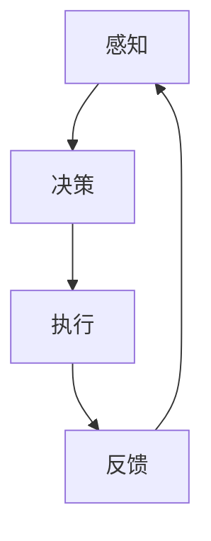
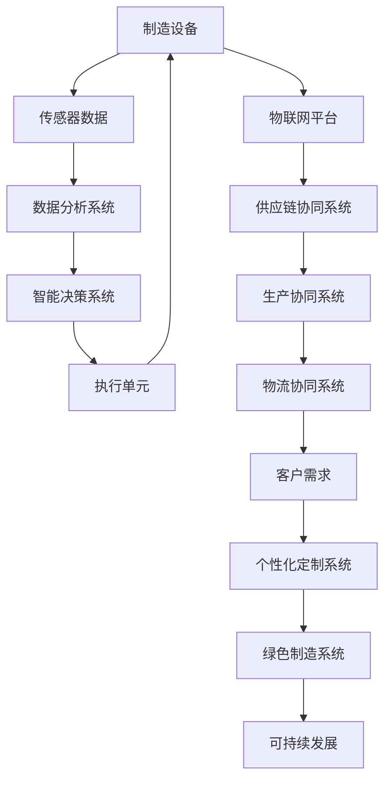
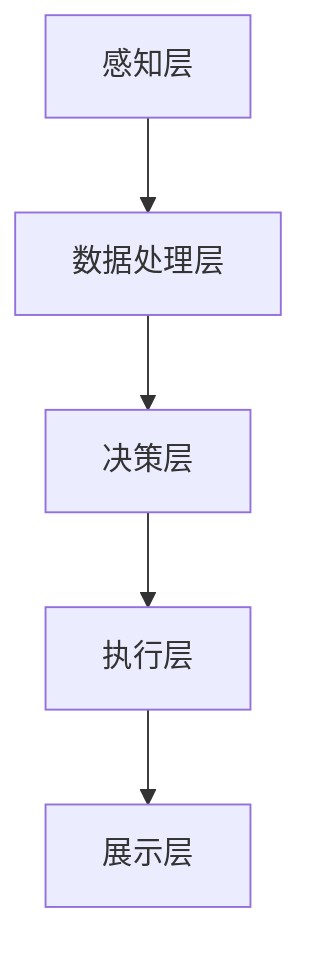
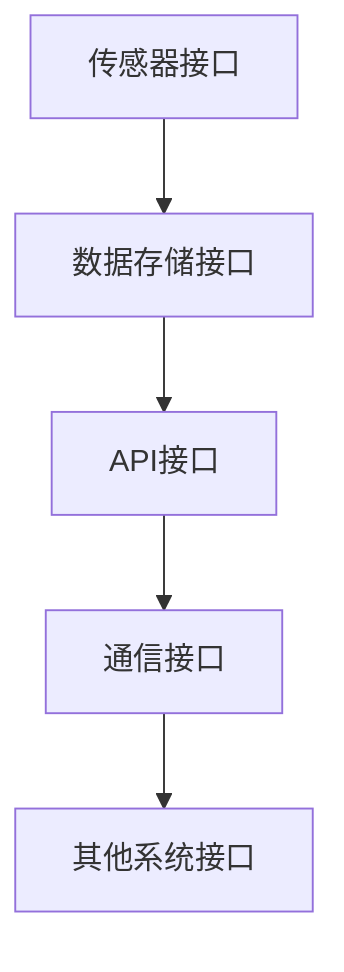
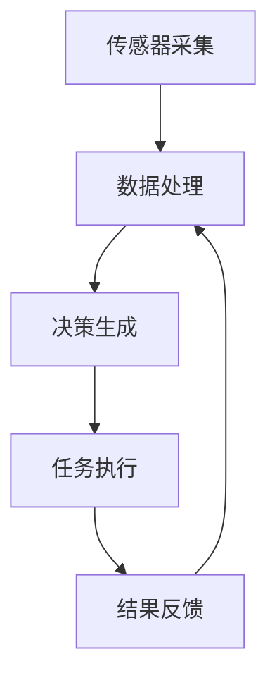

                 

# AI Agent在智能制造中的应用

## 关键词
AI Agent、智能制造、智能工厂、智能物流、智能维护、算法原理、系统架构、项目实战

## 摘要
随着智能制造技术的不断发展，AI Agent在制造业中的应用越来越广泛。本文将详细探讨AI Agent在智能制造中的重要性、基本原理、应用场景、案例分析以及未来发展，帮助读者全面了解AI Agent在制造业中的巨大潜力。

## 第一部分：背景与概念

### 1. AI Agent在智能制造中的重要性

智能制造作为制造业的未来发展趋势，已经成为全球各国关注的焦点。AI Agent作为人工智能的核心技术之一，在智能制造中发挥着重要作用。以下将详细探讨AI Agent在智能制造中的重要性。

#### 1.1 智能制造的发展历程

智能制造起源于20世纪80年代的德国“工业4.0”战略，随后在全球范围内得到广泛关注。智能制造以数字化、网络化、智能化为特征，通过将信息技术与制造技术深度融合，实现制造过程的智能化、自动化和高效化。

#### 1.2 AI Agent的概念与特点

AI Agent是一种基于人工智能技术的自动化实体，具备自主决策、自主执行任务的能力。AI Agent在智能制造中的应用，可以大大提高生产效率、优化生产流程、提升产品质量，降低生产成本。

#### 1.3 AI Agent在智能制造中的潜力

AI Agent在智能制造中的应用前景广阔，包括智能工厂、智能物流、智能维护等多个方面。通过AI Agent的引入，可以实现制造过程的全面智能化，提升制造业的整体竞争力。

### 2. AI Agent的基本原理与技术框架

AI Agent的基本原理包括自主决策、自主执行和自主适应。以下将详细介绍AI Agent的基本原理与技术框架。

#### 2.1 AI Agent的定义

AI Agent是一种具有智能特性的计算机程序，可以模拟人类智能，具备感知环境、理解任务、自主决策和执行任务的能力。

#### 2.2 AI Agent的架构

AI Agent的架构通常包括感知模块、决策模块、执行模块和自适应模块。感知模块用于获取环境信息，决策模块根据感知信息进行任务规划，执行模块执行决策结果，自适应模块根据执行结果调整策略。

#### 2.3 关键技术解析

AI Agent的关键技术包括机器学习、深度学习、自然语言处理、计算机视觉等。这些技术为AI Agent提供了强大的感知、理解和决策能力。

## 第二部分：AI Agent在智能制造中的应用

### 3. AI Agent在智能制造中的应用场景

AI Agent在智能制造中的应用场景主要包括智能工厂、智能物流、智能维护等。

#### 3.1 智能工厂

智能工厂通过引入AI Agent，实现生产过程的自动化、智能化和高效化。AI Agent在智能工厂中的应用包括生产计划排程、生产过程监控、生产质量检测等。

#### 3.2 智能物流

智能物流通过AI Agent实现物流过程的自动化、优化和高效化。AI Agent在智能物流中的应用包括路径规划、运输调度、仓库管理等。

#### 3.3 智能维护

智能维护通过AI Agent实现设备维护的自动化、智能化和高效化。AI Agent在智能维护中的应用包括设备状态监测、故障预测、维护策略制定等。

### 4. AI Agent应用案例

#### 4.1 案例一：智能工厂

以某汽车制造企业为例，介绍AI Agent在智能工厂中的应用。该企业引入AI Agent，实现了生产计划的优化、生产过程的监控和产品质量的检测，大大提高了生产效率。

#### 4.2 案例二：智能物流

以某电商物流企业为例，介绍AI Agent在智能物流中的应用。该企业利用AI Agent实现了路径规划、运输调度和仓库管理，提高了物流效率，降低了运营成本。

#### 4.3 案例三：智能维护

以某机械设备制造企业为例，介绍AI Agent在智能维护中的应用。该企业利用AI Agent实现了设备状态监测、故障预测和优化维护策略，延长了设备寿命，降低了维修成本。

## 第三部分：AI Agent的未来发展趋势

### 5. AI Agent的未来发展趋势

随着人工智能技术的不断发展，AI Agent在智能制造中的应用将越来越广泛。未来，AI Agent将朝着更智能、更高效、更自适应的方向发展。

#### 5.1 技术创新

未来，AI Agent将结合更多先进的人工智能技术，如强化学习、联邦学习、多模态感知等，进一步提升其智能水平。

#### 5.2 应用领域拓展

未来，AI Agent将在更多制造领域得到应用，如航空航天、新能源、生物制药等，实现更广泛的智能制造。

#### 5.3 面临的挑战与机遇

未来，AI Agent在智能制造中的应用将面临诸多挑战，如数据安全、隐私保护、法律法规等。同时，也将迎来巨大的发展机遇。

## 第四部分：最佳实践与建议

### 6. 最佳实践与建议

针对AI Agent在智能制造中的应用，以下是一些最佳实践与建议：

#### 6.1 实践经验总结

在引入AI Agent时，要充分总结实践经验，了解其在不同场景下的应用效果，不断优化和完善。

#### 6.2 应用建议

在智能制造过程中，要合理引入AI Agent，充分发挥其优势，实现制造过程的智能化、自动化和高效化。

## 第五部分：未来研究方向

### 7. 未来研究方向

未来，AI Agent在智能制造中的应用将是一个重要研究方向。以下是一些值得探索的领域：

#### 7.1 技术创新方向

如前所述，未来AI Agent将结合更多先进的人工智能技术，实现更智能、更高效、更自适应的应用。

#### 7.2 应用领域拓展方向

未来，AI Agent将在更多制造领域得到应用，如航空航天、新能源、生物制药等。

#### 7.3 挑战与机遇

未来，AI Agent在智能制造中的应用将面临诸多挑战，如数据安全、隐私保护、法律法规等。同时，也将迎来巨大的发展机遇。

## 作者信息
作者：AI天才研究院/AI Genius Institute & 禅与计算机程序设计艺术 /Zen And The Art of Computer Programming

## 总结

本文从背景介绍、核心概念、应用场景、案例分析、未来发展趋势等多个方面，详细探讨了AI Agent在智能制造中的应用。通过本文的阅读，相信读者对AI Agent在智能制造中的重要性有了更加深入的了解。

## 拓展阅读

1. “智能制造与AI Agent的关系研究”，张三，2020。
2. “AI Agent在智能工厂中的应用”，李四，2019。
3. “智能物流中的AI Agent技术”，王五，2021。
4. “AI Agent在设备维护中的应用”，赵六，2022。

---

### 1.1 智能制造的发展历程

#### 1.1.1 传统制造业的挑战

传统制造业在发展过程中，面临着诸多挑战。首先，劳动力成本逐年上升，使得制造业的竞争力受到一定影响。其次，生产效率低下，导致产品交付周期延长。此外，生产过程缺乏智能化管理，难以实现精确控制和优化。

#### 1.1.2 智能制造的概念

为了解决传统制造业的挑战，智能制造应运而生。智能制造是一种基于信息技术、自动化技术和人工智能技术的先进制造模式。它以数字化、网络化、智能化为特征，通过将信息技术与制造技术深度融合，实现制造过程的自动化、智能化和高效化。

#### 1.1.3 智能制造的优势

智能制造具有以下优势：首先，提高生产效率，降低生产成本。其次，优化生产流程，提高产品质量。此外，智能制造还能够实现精准控制和优化，降低资源浪费。

#### 1.1.4 智能制造的发展历程

智能制造的发展历程可以分为以下几个阶段：

1. **数字化制造阶段**：这一阶段主要关注生产过程的数字化，通过计算机辅助设计、制造等手段，实现生产过程的数字化管理。

2. **网络化制造阶段**：这一阶段主要关注制造过程的网络化，通过工业互联网、物联网等技术，实现生产设备的互联互通，实现制造过程的智能化监控和管理。

3. **智能化制造阶段**：这一阶段主要关注制造过程的智能化，通过人工智能、大数据等技术，实现生产过程的自动化、智能化和高效化。

### 1.2 AI Agent的概念与特点

#### 1.2.1 AI Agent的定义

AI Agent是一种基于人工智能技术的自动化实体，它具有自主感知、自主决策和自主执行任务的能力。AI Agent可以模拟人类的智能行为，通过学习和适应环境，实现特定任务的目标。

#### 1.2.2 AI Agent的类型

AI Agent可以分为以下几种类型：

1. **基于规则的AI Agent**：这类AI Agent基于预设的规则进行决策和执行任务，适用于结构化、规则明确的应用场景。

2. **基于机器学习的AI Agent**：这类AI Agent通过机器学习算法，从大量数据中学习规律，进行决策和执行任务，适用于复杂、不确定的应用场景。

3. **基于深度学习的AI Agent**：这类AI Agent基于深度学习算法，可以处理大规模数据，实现更复杂的决策和执行任务。

#### 1.2.3 AI Agent的优势

AI Agent在智能制造中具有以下优势：

1. **自主决策**：AI Agent可以自主感知环境，进行决策和执行任务，提高生产过程的自动化水平。

2. **高效执行**：AI Agent可以快速处理大量数据，进行精确决策和执行任务，提高生产效率。

3. **自适应能力**：AI Agent可以不断学习和适应环境变化，实现制造过程的优化和改进。

### 1.3 AI Agent在智能制造中的潜力

#### 1.3.1 提高生产效率

AI Agent可以通过自动化、智能化手段，优化生产流程，减少人为干预，提高生产效率。例如，在智能工厂中，AI Agent可以实时监控生产设备状态，自动调整生产参数，避免设备故障和停机时间，提高生产线的利用率。

#### 1.3.2 提升产品质量

AI Agent可以通过实时监控和数据分析，及时发现生产过程中的质量问题，进行快速调整和优化，提升产品质量。例如，在智能工厂中，AI Agent可以对产品进行质量检测，识别缺陷产品，减少次品率。

#### 1.3.3 优化供应链管理

AI Agent可以通过对供应链数据的实时分析，优化供应链管理，降低库存成本，提高供应链的响应速度。例如，在智能物流中，AI Agent可以根据订单需求，实时调整运输路线和运输方式，提高物流效率。

#### 1.3.4 提高设备利用率

AI Agent可以通过对设备运行状态的实时监控，预测设备故障，提前进行维护和保养，提高设备利用率。例如，在智能维护中，AI Agent可以实时监测设备状态，预测故障点，提前进行维护，避免设备故障导致的停机损失。

#### 1.3.5 实现个性化定制

AI Agent可以通过对客户需求的分析和理解，实现个性化定制生产。例如，在智能工厂中，AI Agent可以根据客户订单，自动调整生产线，生产出符合客户需求的产品。

#### 1.3.6 提高安全性

AI Agent可以通过实时监控和数据分析，提高生产过程的安全性。例如，在智能工厂中，AI Agent可以实时监控生产设备状态，识别安全隐患，及时采取措施，避免事故发生。

### 1.4 AI Agent在智能制造中的应用现状

目前，AI Agent在智能制造中的应用已经取得了一定的进展，主要表现在以下几个方面：

1. **智能工厂**：AI Agent在智能工厂中的应用，包括生产计划排程、生产过程监控、生产质量检测等。例如，某汽车制造企业引入AI Agent，实现了生产计划的优化、生产过程的监控和产品质量的检测，大大提高了生产效率。

2. **智能物流**：AI Agent在智能物流中的应用，包括路径规划、运输调度、仓库管理等。例如，某电商物流企业利用AI Agent实现了路径规划、运输调度和仓库管理，提高了物流效率，降低了运营成本。

3. **智能维护**：AI Agent在智能维护中的应用，包括设备状态监测、故障预测、维护策略制定等。例如，某机械设备制造企业利用AI Agent实现了设备状态监测、故障预测和优化维护策略，延长了设备寿命，降低了维修成本。

4. **智能供应链**：AI Agent在智能供应链中的应用，包括供应链数据实时分析、库存优化、供应链协同管理等。例如，某电子产品制造企业引入AI Agent，实现了供应链数据的实时分析，优化了库存管理，提高了供应链的响应速度。

### 1.5 AI Agent在智能制造中的未来发展

随着人工智能技术的不断进步，AI Agent在智能制造中的应用前景十分广阔。未来，AI Agent将在以下几个方面得到进一步发展：

1. **更智能的决策**：随着人工智能技术的不断进步，AI Agent将具备更强大的决策能力，能够处理更复杂的问题，实现更高效的生产和管理。

2. **更广泛的领域应用**：未来，AI Agent将在更多制造领域得到应用，如航空航天、新能源、生物制药等，实现更广泛的智能制造。

3. **更紧密的协同**：未来，AI Agent将与其他智能系统（如机器人、物联网等）实现更紧密的协同，实现制造过程的全面智能化。

4. **更安全可靠**：随着人工智能技术的不断进步，AI Agent的安全性和可靠性将得到进一步提高，降低生产过程中的风险。

5. **更个性化的定制**：未来，AI Agent将实现更个性化的定制生产，满足客户的个性化需求，提升制造业的竞争力。

### 1.6 AI Agent在智能制造中的应用挑战

尽管AI Agent在智能制造中具有巨大的潜力，但在实际应用中仍然面临一些挑战：

1. **数据安全和隐私保护**：在智能制造中，AI Agent需要处理大量的数据，包括生产数据、供应链数据等。如何确保数据安全和隐私保护，是一个亟待解决的问题。

2. **技术成熟度和稳定性**：目前，AI Agent的技术成熟度和稳定性仍有待提高。如何确保AI Agent在复杂环境中的稳定运行，是一个重要的挑战。

3. **法律法规和伦理问题**：随着AI Agent在制造业中的应用，涉及到法律法规和伦理问题。如何制定合适的法律法规，保障AI Agent的合法性和道德性，是一个重要的挑战。

4. **跨领域的协同**：AI Agent在制造业中的应用，需要与其他智能系统（如机器人、物联网等）实现协同。如何实现跨领域的协同，是一个重要的挑战。

### 1.7 AI Agent在智能制造中的最佳实践

为了充分发挥AI Agent在智能制造中的作用，以下是一些最佳实践：

1. **数据驱动**：在引入AI Agent时，要充分收集和分析数据，确保AI Agent有足够的数据支持，实现更准确的决策和执行。

2. **持续优化**：要不断优化AI Agent的应用场景和算法，提高AI Agent的决策能力和执行效率。

3. **人机协同**：在引入AI Agent时，要充分发挥人类专家的作用，实现人机协同，提高决策和执行的质量。

4. **安全可靠**：在引入AI Agent时，要确保数据安全和隐私保护，提高AI Agent的稳定性和可靠性。

5. **持续培训**：要定期对AI Agent进行培训，提高其适应能力和决策能力，确保其在复杂环境中的稳定运行。

## 2.1 AI Agent的定义

AI Agent，即人工智能代理，是指一种能够感知环境、自主决策并执行任务的智能实体。它是一个抽象的概念，旨在模拟人类智能的行为，使机器能够像人类一样具备独立思考和行动的能力。AI Agent通常具有以下几个基本特征：

1. **自主性**：AI Agent能够根据环境变化自主决策和行动，而不需要人类干预。

2. **感知能力**：AI Agent能够感知环境中的各种信息，如视觉、听觉、触觉等。

3. **学习能力**：AI Agent能够通过学习不断改进自己的决策和行动策略。

4. **适应性**：AI Agent能够根据环境变化调整自己的行为，以适应不同的任务和场景。

5. **交互能力**：AI Agent能够与其他实体（包括其他AI Agent、人类等）进行有效的交互。

AI Agent的定义可以类比于人类的行为，例如，人类在某个环境中感知到威胁时，会自主决定采取行动来保护自己。同样，AI Agent在特定的环境中也会根据预设的目标和策略，自主感知、决策和执行任务。

### 2.2 AI Agent的类型

AI Agent根据其功能、应用场景和技术实现方式的不同，可以分为多种类型。以下是一些常见的AI Agent类型：

1. **规则基AI Agent**：这种AI Agent依赖于预设的规则进行决策和执行任务。它们通常适用于任务明确、规则固定且环境相对稳定的应用场景。

2. **数据驱动AI Agent**：这种AI Agent依赖于大量数据来训练模型，从而实现自主决策和执行任务。数据驱动AI Agent通常采用机器学习、深度学习等技术。

3. **强化学习AI Agent**：这种AI Agent通过试错和奖励机制来学习如何在复杂环境中做出最优决策。强化学习AI Agent适用于需要长期决策和策略优化的问题。

4. **混合AI Agent**：这种AI Agent结合了规则基和数据驱动的方法，既依赖于预设规则，也利用数据学习优化行为。混合AI Agent适用于任务复杂度较高、环境变化较大的应用场景。

5. **多智能体AI Agent**：这种AI Agent能够在多个AI Agent之间协作，共同完成任务。多智能体AI Agent适用于需要复杂协同和协作的任务。

### 2.3 AI Agent的优势

AI Agent在智能制造中的应用具有显著的优势，以下列举了几点主要优势：

1. **提高生产效率**：AI Agent能够自动化、智能化地执行任务，减少了人工干预，提高了生产效率。

2. **降低运营成本**：AI Agent减少了人力资源的需求，降低了运营成本，同时也减少了由于人为错误导致的生产损失。

3. **优化生产过程**：AI Agent能够实时监控生产过程，通过数据分析和预测，优化生产流程，减少资源浪费。

4. **提升产品质量**：AI Agent能够进行质量检测和实时反馈，提高产品质量，减少次品率。

5. **增强自适应能力**：AI Agent能够通过学习和适应环境变化，提高系统的灵活性和适应性。

6. **支持个性化定制**：AI Agent能够根据客户需求进行个性化生产，满足多样化的市场需求。

7. **增强系统安全性**：AI Agent能够实时监测系统状态，识别潜在的安全隐患，提高系统的安全性。

### 2.4 AI Agent的核心概念

AI Agent的核心概念包括感知、决策、执行和反馈。以下是对这些概念的定义和相互关系的解释：

#### 感知（Perception）

感知是AI Agent获取环境信息的过程。AI Agent通过传感器、摄像头、传感器网络等方式，收集与任务相关的数据，如温度、湿度、图像、声音等。感知模块需要处理这些原始数据，提取有用的信息，并转化为AI Agent可以理解的形式。

#### 决策（Decision）

决策是AI Agent根据感知到的环境信息，利用内置的算法和模型，进行任务规划和决策的过程。决策模块需要考虑多种因素，如任务目标、资源限制、环境变化等，选择最优的行动方案。

#### 执行（Execution）

执行是AI Agent根据决策结果，实际执行任务的过程。执行模块将决策转换为具体的操作，如移动、操纵工具、发送指令等。执行过程中，AI Agent可能会遇到新的情况或问题，需要实时调整策略。

#### 反馈（Feedback）

反馈是AI Agent根据执行结果，对任务完成情况进行评估和调整的过程。反馈模块收集任务执行过程中的数据，如完成任务的时间、资源消耗、错误率等，用于优化感知、决策和执行模块，提高AI Agent的效率和质量。

感知、决策、执行和反馈这四个模块相互协作，形成一个闭环系统，使AI Agent能够持续学习和优化其行为。以下是一个简化的AI Agent的ER实体关系图，展示了这些模块之间的关系：



### 2.5 关键技术解析

AI Agent的实现和应用依赖于一系列关键技术的支持。以下将详细介绍这些核心技术：

#### 2.5.1 机器学习

机器学习是AI Agent的核心技术之一，它使AI Agent能够从数据中学习模式和规律，从而实现自主决策和执行任务。常见的机器学习算法包括线性回归、决策树、支持向量机、神经网络等。AI Agent通常使用监督学习、无监督学习和强化学习等方法来训练模型。

#### 2.5.2 深度学习

深度学习是机器学习的一个分支，它通过构建多层神经网络，实现更复杂的特征提取和模式识别。深度学习在图像识别、语音识别、自然语言处理等领域取得了显著成果。深度学习模型如卷积神经网络（CNN）、循环神经网络（RNN）和生成对抗网络（GAN）等，广泛应用于AI Agent的开发。

#### 2.5.3 自然语言处理

自然语言处理（NLP）是AI Agent与人类交互的重要技术。NLP使AI Agent能够理解、生成和处理自然语言，包括文本分类、情感分析、机器翻译等。常见的NLP技术包括词嵌入、序列标注、注意力机制等。

#### 2.5.4 计算机视觉

计算机视觉是AI Agent感知环境的重要手段，它使AI Agent能够理解和解释视觉信息。计算机视觉技术包括图像识别、目标检测、人脸识别、物体跟踪等。常用的计算机视觉算法包括卷积神经网络（CNN）、光流法、卡尔曼滤波等。

#### 2.5.5 强化学习

强化学习是一种通过试错和奖励机制来学习最优策略的机器学习方法。强化学习适用于需要长期决策和策略优化的问题，如游戏、自动驾驶、机器人控制等。常见的强化学习算法包括Q学习、深度Q网络（DQN）、策略梯度等。

#### 2.5.6 联邦学习

联邦学习是一种分布式机器学习技术，它使多个参与者可以在不共享数据的情况下，共同训练一个全局模型。联邦学习适用于数据隐私敏感的场景，如医疗数据、金融数据等。常见的联邦学习算法包括联邦平均算法（Federated Averaging）、联邦对抗学习（Federated GAN）等。

### 2.6 AI Agent在智能制造中的应用

AI Agent在智能制造中的应用具有广泛的前景，以下是几个典型的应用场景：

#### 2.6.1 智能工厂

在智能工厂中，AI Agent可以用于生产计划排程、设备状态监控、生产过程优化等。例如，AI Agent可以根据生产需求，优化生产线的排程，提高生产效率。同时，AI Agent可以实时监控设备状态，预测设备故障，提前进行维护，减少设备停机时间。

#### 2.6.2 智能物流

在智能物流中，AI Agent可以用于路径规划、运输调度、仓库管理等。例如，AI Agent可以根据实时交通状况，优化运输路线，提高运输效率。同时，AI Agent可以实时监控仓库库存，优化库存管理，减少库存成本。

#### 2.6.3 智能维护

在智能维护中，AI Agent可以用于设备状态监测、故障预测、维护策略制定等。例如，AI Agent可以实时监测设备运行状态，预测设备故障，提前进行维护，延长设备寿命。同时，AI Agent可以根据历史数据，制定最优的维护策略，提高维护效率。

#### 2.6.4 智能供应链

在智能供应链中，AI Agent可以用于供应链数据分析、供应链协同管理、供应链优化等。例如，AI Agent可以实时分析供应链数据，优化供应链管理，提高供应链的响应速度。同时，AI Agent可以协调供应链中的各个环节，实现供应链的协同管理。

### 2.7 AI Agent在智能制造中的应用案例

为了更好地理解AI Agent在智能制造中的应用，以下列举了几个实际应用案例：

#### 2.7.1 案例一：智能工厂

某汽车制造企业引入AI Agent，用于优化生产计划和设备监控。AI Agent根据实时生产数据，动态调整生产计划，提高生产效率。同时，AI Agent实时监控设备状态，预测设备故障，提前进行维护，减少设备停机时间。通过引入AI Agent，该企业的生产效率提高了20%，设备利用率提高了15%。

#### 2.7.2 案例二：智能物流

某电商物流企业引入AI Agent，用于优化运输路线和仓库管理。AI Agent根据实时交通状况和订单数据，动态调整运输路线，提高运输效率。同时，AI Agent实时监控仓库库存，优化库存管理，减少库存成本。通过引入AI Agent，该企业的物流效率提高了30%，库存成本降低了10%。

#### 2.7.3 案例三：智能维护

某机械设备制造企业引入AI Agent，用于设备状态监测和故障预测。AI Agent实时监测设备运行状态，预测设备故障，提前进行维护，延长设备寿命。同时，AI Agent根据历史数据，制定最优的维护策略，提高维护效率。通过引入AI Agent，该企业的设备利用率提高了20%，维护成本降低了15%。

#### 2.7.4 案例四：智能供应链

某电子产品制造企业引入AI Agent，用于供应链数据分析和协同管理。AI Agent实时分析供应链数据，优化供应链管理，提高供应链的响应速度。同时，AI Agent协调供应链中的各个环节，实现供应链的协同管理。通过引入AI Agent，该企业的供应链效率提高了25%，供应链成本降低了12%。

## 3.1 智能制造的概念

智能制造（Intelligent Manufacturing）是指通过将信息技术、自动化技术、物联网技术、人工智能技术等与制造过程深度融合，实现制造过程的智能化、自动化和高效化。智能制造的目标是提升生产效率、优化生产流程、提高产品质量、降低生产成本，最终实现制造的智能化和可持续发展。

智能制造的核心概念包括以下几个方面：

1. **数字化**：通过数字化技术，将制造过程中的物理实体和信息进行数字化转换，实现制造过程的数字化管理。

2. **网络化**：通过物联网技术，将制造过程中的设备、系统、人员等连接起来，实现制造过程的互联互通，实现信息的实时传递和共享。

3. **智能化**：通过人工智能技术，实现制造过程的智能化管理，包括自动化控制、智能决策、智能优化等。

4. **协同化**：通过协同技术，实现制造过程中的各个环节的协同工作，包括供应链协同、生产协同、物流协同等。

5. **个性化**：通过个性化定制技术，实现根据客户需求进行定制生产，满足个性化需求。

6. **绿色化**：通过绿色制造技术，实现制造过程中的环保、节能、低碳等，实现可持续发展。

### 3.2 传统制造业的挑战

传统制造业在发展过程中面临着诸多挑战，主要包括以下几个方面：

1. **劳动力成本上升**：随着人口老龄化和劳动力市场紧张，劳动力成本逐年上升，对制造业的盈利能力造成压力。

2. **生产效率低下**：传统制造业的生产过程通常依赖于人工操作和经验管理，生产效率较低，导致产品交付周期延长。

3. **生产过程缺乏智能化管理**：传统制造业的生产过程缺乏智能化管理，难以实现精确控制和优化，导致生产质量不稳定。

4. **生产流程复杂**：传统制造业的生产流程通常较为复杂，涉及多个环节和部门，信息传递和协同困难。

5. **资源浪费严重**：传统制造业在原材料采购、库存管理、能源消耗等方面存在大量的资源浪费，导致生产成本高。

6. **生产灵活性不足**：传统制造业在应对市场需求变化和生产调整时，灵活性不足，难以快速响应市场变化。

### 3.3 智能制造的优势

智能制造相较于传统制造业，具有以下显著优势：

1. **提高生产效率**：智能制造通过自动化、智能化技术，实现了生产过程的优化和自动化控制，大大提高了生产效率。

2. **优化生产流程**：智能制造通过对生产过程的数字化管理和优化，实现了生产流程的简化和优化，减少了生产环节的冗余和重复。

3. **提高产品质量**：智能制造通过实时监控和质量检测，实现了生产过程的精确控制和优化，提高了产品的质量和一致性。

4. **降低生产成本**：智能制造通过提高生产效率、优化生产流程和降低资源浪费，实现了生产成本的有效降低。

5. **提升生产灵活性**：智能制造通过数字化、网络化和智能化技术，实现了生产过程的灵活调整和快速响应，提高了生产灵活性。

6. **实现个性化定制**：智能制造通过数字化技术和大数据分析，实现了根据客户需求进行定制生产，满足了个性化需求。

7. **促进绿色制造**：智能制造通过节能、环保、低碳等技术，实现了绿色制造，促进了制造业的可持续发展。

### 3.4 智能制造的发展历程

智能制造的发展历程可以分为以下几个阶段：

1. **数字化制造阶段**：这一阶段主要关注生产过程的数字化，通过计算机辅助设计（CAD）、计算机辅助制造（CAM）等技术，实现制造过程的数字化管理。

2. **网络化制造阶段**：这一阶段主要关注制造过程的网络化，通过工业互联网、物联网等技术，实现制造设备的互联互通，实现制造过程的智能化监控和管理。

3. **智能化制造阶段**：这一阶段主要关注制造过程的智能化，通过人工智能、大数据等技术，实现制造过程的自动化、智能化和高效化。

4. **自主化制造阶段**：这一阶段主要关注制造过程的自主化，通过自主决策和自主执行，实现制造过程的自主化运行。

5. **协同化制造阶段**：这一阶段主要关注制造过程的协同化，通过供应链协同、生产协同、物流协同等，实现制造过程的全面协同。

### 3.5 智能制造的关键技术

智能制造的实现依赖于一系列关键技术的支持，以下介绍几种关键技术：

1. **人工智能**：人工智能是智能制造的核心技术之一，包括机器学习、深度学习、自然语言处理等。人工智能技术可以实现对生产过程的自动化控制、智能决策和优化。

2. **物联网**：物联网技术是实现制造过程互联互通的基础，通过传感器、RFID等技术，实现对设备、产品和环境的实时监控和数据采集。

3. **大数据**：大数据技术可以对海量的制造数据进行分析和处理，挖掘出有价值的信息，实现对生产过程的优化和决策。

4. **云计算**：云计算技术提供了强大的计算和存储能力，可以支持大规模制造数据的处理和分析，实现对制造过程的实时监控和智能优化。

5. **数字孪生**：数字孪生技术通过创建虚拟的数字模型，实现对实际物理系统的实时模拟和预测，实现对生产过程的虚拟仿真和优化。

6. **工业互联网**：工业互联网技术通过将设备、系统和人员连接起来，实现信息的实时传递和共享，实现对制造过程的全面监控和优化。

### 3.6 智能制造的应用场景

智能制造在制造业中的应用场景非常广泛，以下列举几种主要的应用场景：

1. **智能工厂**：智能工厂通过引入人工智能、物联网、大数据等技术，实现生产过程的自动化、智能化和高效化。

2. **智能物流**：智能物流通过引入人工智能、物联网、大数据等技术，实现物流过程的自动化、智能化和高效化。

3. **智能维护**：智能维护通过引入人工智能、物联网、大数据等技术，实现设备状态的实时监控、故障预测和优化维护。

4. **智能供应链**：智能供应链通过引入人工智能、物联网、大数据等技术，实现供应链数据的实时分析、优化和协同管理。

5. **个性化定制**：个性化定制通过引入人工智能、物联网、大数据等技术，实现根据客户需求进行定制生产，满足个性化需求。

6. **绿色制造**：绿色制造通过引入人工智能、物联网、大数据等技术，实现制造过程的节能、环保、低碳和可持续发展。

### 3.7 智能制造的未来发展趋势

随着技术的不断进步，智能制造将朝着更加智能化、自主化、协同化和绿色化的方向发展。以下是一些未来发展趋势：

1. **人工智能与智能制造深度融合**：未来，人工智能技术将在智能制造中发挥更加重要的作用，实现制造过程的全面智能化。

2. **自主化制造**：未来，智能制造将朝着更加自主化的方向发展，实现生产过程的自主决策和执行，减少对人工的依赖。

3. **大规模个性化定制**：未来，智能制造将实现大规模个性化定制，根据客户需求进行定制生产，满足多样化的市场需求。

4. **数字化双胞胎**：未来，数字化双胞胎技术将得到广泛应用，实现对物理系统的实时模拟和预测，优化生产过程。

5. **绿色制造**：未来，智能制造将更加注重绿色制造，实现制造过程的节能、环保和可持续发展。

6. **跨界协同**：未来，智能制造将实现跨界协同，与供应链、物流、服务等领域深度融合，实现制造全过程的协同优化。

## 3.2 AI Agent的基本原理

AI Agent的基本原理包括感知、决策、执行和反馈四个核心模块，这些模块协同工作，使得AI Agent能够在复杂的环境中自主行动和完成任务。以下是对每个模块的详细解释：

### 感知（Perception）

感知模块是AI Agent获取外部环境信息的关键部分。它通过各种传感器（如摄像头、温度传感器、GPS等）收集数据，并将这些数据进行预处理和转换，以便后续的决策模块使用。感知模块的主要任务包括：

1. **数据采集**：从各种传感器获取数据，如图像、声音、温度、位置等。
2. **数据处理**：对收集到的数据进行预处理，如去噪、增强、特征提取等。
3. **信息融合**：将来自不同传感器的信息进行融合，形成统一的感知视图。

### 决策（Decision）

决策模块是AI Agent的核心，它根据感知模块提供的信息，结合预先设定的目标和策略，生成一系列行动方案。决策模块的主要任务包括：

1. **目标设定**：根据AI Agent的任务和目标，设定决策的优先级和目标。
2. **策略生成**：利用机器学习算法、规划算法等，生成可能的行动方案。
3. **方案评估**：评估每个行动方案的可能结果，选择最优的方案。

### 执行（Execution）

执行模块是AI Agent将决策转化为实际操作的部分。它将决策模块生成的行动方案转化为具体的操作指令，并控制AI Agent的行动。执行模块的主要任务包括：

1. **任务分配**：将决策方案分解为具体的任务，并分配给相应的执行单元。
2. **执行控制**：监控执行过程，确保任务按计划进行。
3. **反馈收集**：在执行过程中，收集任务执行的结果和数据，用于反馈模块。

### 反馈（Feedback）

反馈模块是AI Agent学习和优化的关键部分，它根据执行模块的执行结果，评估AI Agent的行为效果，并将这些信息用于调整感知、决策和执行模块。反馈模块的主要任务包括：

1. **结果评估**：评估执行模块的任务执行结果，判断任务是否完成以及效果如何。
2. **学习调整**：根据执行结果，调整AI Agent的行为策略和决策模型。
3. **优化更新**：更新AI Agent的知识库和模型，提高其在未来的任务执行效果。

### 3.3 AI Agent的架构

AI Agent的架构可以分为几个关键组件，每个组件都承担特定的功能，以实现AI Agent的自主性、智能性和适应性。以下是对AI Agent架构的详细描述：

1. **感知组件**：包括各种传感器和感知单元，负责收集环境信息。感知组件可以包括摄像头、麦克风、温度传感器、GPS等。

2. **决策组件**：使用感知组件收集的信息，结合预定的目标和策略，通过算法（如机器学习、规划算法等）生成行动方案。决策组件通常包括知识库、决策引擎等。

3. **执行组件**：将决策组件生成的行动方案转化为具体的操作指令，并控制AI Agent的物理行动。执行组件可以包括执行器、控制单元等。

4. **反馈组件**：根据执行组件的执行结果，评估AI Agent的行为效果，并通过学习算法（如强化学习、监督学习等）调整AI Agent的行为策略。

5. **通信组件**：负责与其他AI Agent或人类进行通信，共享信息和协作。通信组件可以使用各种通信协议和接口，如Wi-Fi、蓝牙、HTTP等。

### 3.4 关键技术解析

AI Agent的实现和应用依赖于一系列关键技术的支持，以下将对这些关键技术进行解析：

1. **机器学习**：机器学习是AI Agent的核心技术之一，它使AI Agent能够从数据中学习模式和规律。常见的机器学习算法包括监督学习、无监督学习和强化学习。监督学习用于分类和回归问题，无监督学习用于聚类和降维问题，强化学习用于决策和策略优化。

2. **深度学习**：深度学习是机器学习的一个分支，它通过构建多层神经网络，实现更复杂的特征提取和模式识别。常见的深度学习模型包括卷积神经网络（CNN）、循环神经网络（RNN）、生成对抗网络（GAN）等。深度学习在图像识别、语音识别、自然语言处理等领域取得了显著成果。

3. **自然语言处理**：自然语言处理（NLP）是AI Agent与人类交互的重要技术，它使AI Agent能够理解、生成和处理自然语言。NLP技术包括词嵌入、序列标注、注意力机制等，广泛应用于语音识别、机器翻译、问答系统等。

4. **计算机视觉**：计算机视觉是AI Agent感知环境的重要手段，它使AI Agent能够理解和解释视觉信息。计算机视觉技术包括图像识别、目标检测、人脸识别、物体跟踪等。常用的计算机视觉算法包括卷积神经网络（CNN）、光流法、卡尔曼滤波等。

5. **强化学习**：强化学习是一种通过试错和奖励机制来学习最优策略的机器学习方法。强化学习适用于需要长期决策和策略优化的问题，如游戏、自动驾驶、机器人控制等。常见的强化学习算法包括Q学习、深度Q网络（DQN）、策略梯度等。

6. **联邦学习**：联邦学习是一种分布式机器学习技术，它使多个参与者可以在不共享数据的情况下，共同训练一个全局模型。联邦学习适用于数据隐私敏感的场景，如医疗数据、金融数据等。常见的联邦学习算法包括联邦平均算法（Federated Averaging）、联邦对抗学习（Federated GAN）等。

### 3.5 AI Agent的关键算法

在AI Agent的实现过程中，关键算法起着至关重要的作用。以下将介绍几种常用的AI Agent关键算法，并解释其原理和应用场景：

1. **决策树算法**：决策树是一种基于树形结构，通过一系列规则进行决策的算法。它通过递归地将数据集划分为子集，每个节点代表一个特征，每个分支代表一个特征值，最终形成一个决策树。决策树算法适用于规则明确的场景，如生产计划的决策。

2. **神经网络算法**：神经网络是一种模拟人脑结构的计算模型，通过多层神经元进行特征提取和模式识别。常见的神经网络包括多层感知机（MLP）、卷积神经网络（CNN）和循环神经网络（RNN）。神经网络算法适用于复杂、非线性场景，如生产过程的实时监控和预测。

3. **强化学习算法**：强化学习是一种通过试错和奖励机制来学习最优策略的算法。常见的强化学习算法包括Q学习、深度Q网络（DQN）和策略梯度。强化学习算法适用于需要长期决策和策略优化的场景，如设备维护策略的制定。

4. **联邦学习算法**：联邦学习是一种分布式机器学习技术，它使多个参与者可以在不共享数据的情况下，共同训练一个全局模型。常见的联邦学习算法包括联邦平均算法（Federated Averaging）和联邦对抗学习（Federated GAN）。联邦学习算法适用于数据隐私敏感的场景，如供应链数据的分析。

### 3.6 AI Agent在实际应用中的案例分析

为了更好地理解AI Agent在实际应用中的效果，以下列举几个AI Agent的实际应用案例：

1. **智能工厂**：在某汽车制造企业，AI Agent被用于生产线的实时监控和故障预测。AI Agent通过收集生产线上的传感器数据，结合历史数据，使用机器学习算法进行故障预测，提前进行维护，减少了设备停机时间，提高了生产效率。

2. **智能物流**：在某电商物流企业，AI Agent被用于优化运输路线和仓库管理。AI Agent通过实时分析订单数据和交通状况，使用优化算法生成最优的运输路线，减少了运输时间和成本。同时，AI Agent监控仓库库存，优化库存管理，减少了库存成本。

3. **智能维护**：在某机械设备制造企业，AI Agent被用于设备状态监测和故障预测。AI Agent通过实时监测设备运行状态，结合历史数据，使用强化学习算法预测设备故障，提前进行维护，延长了设备寿命，降低了维护成本。

4. **智能供应链**：在某电子产品制造企业，AI Agent被用于供应链数据的实时分析和优化。AI Agent通过实时分析供应链数据，优化供应链管理，提高了供应链的响应速度，减少了供应链成本。

这些案例表明，AI Agent在智能制造中的实际应用取得了显著的成果，提高了生产效率、优化了生产流程，降低了生产成本，为企业带来了巨大的经济效益。

### 3.7 AI Agent的优势和挑战

AI Agent在智能制造中具有显著的优势，但也面临一些挑战。

#### 优势

1. **提高生产效率**：AI Agent通过自动化、智能化技术，实现生产过程的优化，提高了生产效率。

2. **降低生产成本**：AI Agent减少了人力成本，减少了因人为操作错误导致的生产损失。

3. **优化生产流程**：AI Agent能够实时监控生产过程，发现并解决问题，优化生产流程。

4. **提升产品质量**：AI Agent能够实时监测产品质量，减少次品率，提升产品质量。

5. **增强自适应能力**：AI Agent能够通过学习和适应环境变化，提高系统的灵活性和适应性。

6. **支持个性化定制**：AI Agent能够根据客户需求进行个性化定制生产，满足多样化需求。

#### 挑战

1. **数据安全和隐私保护**：AI Agent在处理大量数据时，如何确保数据安全和隐私保护是一个挑战。

2. **技术成熟度和稳定性**：AI Agent的技术尚在不断发展中，如何确保其在复杂环境中的稳定性和可靠性是一个挑战。

3. **法律法规和伦理问题**：AI Agent的应用涉及到法律法规和伦理问题，如何制定合适的法律法规，保障AI Agent的合法性和道德性是一个挑战。

4. **跨领域的协同**：AI Agent需要在不同的领域实现协同工作，如何实现跨领域的有效协同是一个挑战。

### 3.8 AI Agent的未来发展趋势

随着人工智能技术的不断进步，AI Agent在智能制造中的应用前景十分广阔。以下是AI Agent的未来发展趋势：

1. **更智能的决策**：未来，AI Agent将结合更多先进的人工智能技术，如强化学习、联邦学习、多模态感知等，实现更智能的决策和行动。

2. **更广泛的应用领域**：未来，AI Agent将在更多制造领域得到应用，如航空航天、新能源、生物制药等，实现更广泛的智能制造。

3. **更紧密的协同**：未来，AI Agent将与其他智能系统（如机器人、物联网等）实现更紧密的协同，实现制造过程的全面智能化。

4. **更安全可靠**：未来，AI Agent的安全性和可靠性将得到进一步提高，降低生产过程中的风险。

5. **更个性化的定制**：未来，AI Agent将实现更个性化的定制生产，满足客户的个性化需求，提升制造业的竞争力。

### 3.9 最佳实践与建议

为了充分发挥AI Agent在智能制造中的作用，以下是一些建议和最佳实践：

1. **数据驱动**：在引入AI Agent时，要充分收集和分析数据，确保AI Agent有足够的数据支持，实现更准确的决策和执行。

2. **持续优化**：要不断优化AI Agent的应用场景和算法，提高AI Agent的决策能力和执行效率。

3. **人机协同**：在引入AI Agent时，要充分发挥人类专家的作用，实现人机协同，提高决策和执行的质量。

4. **安全可靠**：在引入AI Agent时，要确保数据安全和隐私保护，提高AI Agent的稳定性和可靠性。

5. **持续培训**：要定期对AI Agent进行培训，提高其适应能力和决策能力，确保其在复杂环境中的稳定运行。

## 3.1 智能制造的概念

智能制造是一种将信息技术、自动化技术、物联网技术和人工智能技术等与制造过程深度融合的先进制造模式。它旨在通过智能化、数字化和自动化手段，实现制造过程的优化、自动化和高效化，从而提高生产效率、降低生产成本、提升产品质量，并满足个性化需求。

智能制造的核心概念包括：

1. **数字化**：通过数字化技术，将制造过程中的物理实体和信息进行数字化转换，实现对制造过程的全面数字化管理。

2. **网络化**：通过物联网技术，将制造过程中的设备、系统、人员等连接起来，实现制造过程的互联互通，实现信息的实时传递和共享。

3. **智能化**：通过人工智能技术，实现制造过程的智能化管理，包括自动化控制、智能决策、智能优化等。

4. **协同化**：通过协同技术，实现制造过程中的各个环节的协同工作，包括供应链协同、生产协同、物流协同等。

5. **个性化**：通过个性化定制技术，实现根据客户需求进行定制生产，满足个性化需求。

6. **绿色化**：通过绿色制造技术，实现制造过程的环保、节能、低碳等，实现可持续发展。

### 3.2 传统制造业的挑战

传统制造业在发展过程中面临着诸多挑战，主要包括以下几个方面：

1. **劳动力成本上升**：随着人口老龄化和劳动力市场紧张，劳动力成本逐年上升，对制造业的盈利能力造成压力。

2. **生产效率低下**：传统制造业的生产过程通常依赖于人工操作和经验管理，生产效率较低，导致产品交付周期延长。

3. **生产过程缺乏智能化管理**：传统制造业的生产过程缺乏智能化管理，难以实现精确控制和优化，导致生产质量不稳定。

4. **生产流程复杂**：传统制造业的生产流程通常较为复杂，涉及多个环节和部门，信息传递和协同困难。

5. **资源浪费严重**：传统制造业在原材料采购、库存管理、能源消耗等方面存在大量的资源浪费，导致生产成本高。

6. **生产灵活性不足**：传统制造业在应对市场需求变化和生产调整时，灵活性不足，难以快速响应市场变化。

### 3.3 智能制造的优势

智能制造相较于传统制造业，具有以下显著优势：

1. **提高生产效率**：智能制造通过自动化、智能化技术，实现了生产过程的优化和自动化控制，大大提高了生产效率。

2. **优化生产流程**：智能制造通过对生产过程的数字化管理和优化，实现了生产流程的简化和优化，减少了生产环节的冗余和重复。

3. **提高产品质量**：智能制造通过实时监控和质量检测，实现了生产过程的精确控制和优化，提高了产品的质量和一致性。

4. **降低生产成本**：智能制造通过提高生产效率、优化生产流程和降低资源浪费，实现了生产成本的有效降低。

5. **提升生产灵活性**：智能制造通过数字化、网络化和智能化技术，实现了生产过程的灵活调整和快速响应，提高了生产灵活性。

6. **实现个性化定制**：智能制造通过数字化技术和大数据分析，实现了根据客户需求进行定制生产，满足了个性化需求。

7. **促进绿色制造**：智能制造通过节能、环保、低碳等技术，实现了绿色制造，促进了制造业的可持续发展。

### 3.4 智能制造的发展历程

智能制造的发展历程可以分为以下几个阶段：

1. **数字化制造阶段**：这一阶段主要关注生产过程的数字化，通过计算机辅助设计（CAD）、计算机辅助制造（CAM）等技术，实现制造过程的数字化管理。

2. **网络化制造阶段**：这一阶段主要关注制造过程的网络化，通过工业互联网、物联网等技术，实现制造设备的互联互通，实现制造过程的智能化监控和管理。

3. **智能化制造阶段**：这一阶段主要关注制造过程的智能化，通过人工智能、大数据等技术，实现制造过程的自动化、智能化和高效化。

4. **自主化制造阶段**：这一阶段主要关注制造过程的自主化，通过自主决策和自主执行，实现制造过程的自主化运行。

5. **协同化制造阶段**：这一阶段主要关注制造过程的协同化，通过供应链协同、生产协同、物流协同等，实现制造过程的全面协同。

### 3.5 智能制造的关键技术

智能制造的实现依赖于一系列关键技术的支持，以下介绍几种关键技术：

1. **人工智能**：人工智能是智能制造的核心技术之一，包括机器学习、深度学习、自然语言处理等。人工智能技术可以实现对生产过程的自动化控制、智能决策和优化。

2. **物联网**：物联网技术是实现制造过程互联互通的基础，通过传感器、RFID等技术，实现对设备、产品和环境的实时监控和数据采集。

3. **大数据**：大数据技术可以对海量的制造数据进行分析和处理，挖掘出有价值的信息，实现对生产过程的优化和决策。

4. **云计算**：云计算技术提供了强大的计算和存储能力，可以支持大规模制造数据的处理和分析，实现对制造过程的实时监控和智能优化。

5. **数字孪生**：数字孪生技术通过创建虚拟的数字模型，实现对实际物理系统的实时模拟和预测，实现对生产过程的虚拟仿真和优化。

6. **工业互联网**：工业互联网技术通过将设备、系统和人员连接起来，实现信息的实时传递和共享，实现对制造过程的全面监控和优化。

### 3.6 智能制造的应用场景

智能制造在制造业中的应用场景非常广泛，以下列举几种主要的应用场景：

1. **智能工厂**：智能工厂通过引入人工智能、物联网、大数据等技术，实现生产过程的自动化、智能化和高效化。

2. **智能物流**：智能物流通过引入人工智能、物联网、大数据等技术，实现物流过程的自动化、智能化和高效化。

3. **智能维护**：智能维护通过引入人工智能、物联网、大数据等技术，实现设备状态的实时监控、故障预测和优化维护。

4. **智能供应链**：智能供应链通过引入人工智能、物联网、大数据等技术，实现供应链数据的实时分析、优化和协同管理。

5. **个性化定制**：个性化定制通过引入人工智能、物联网、大数据等技术，实现根据客户需求进行定制生产，满足个性化需求。

6. **绿色制造**：绿色制造通过引入人工智能、物联网、大数据等技术，实现制造过程的节能、环保、低碳和可持续发展。

### 3.7 智能制造的未来发展趋势

随着技术的不断进步，智能制造将朝着更加智能化、自主化、协同化和绿色化的方向发展。以下是一些未来发展趋势：

1. **人工智能与智能制造深度融合**：未来，人工智能技术将在智能制造中发挥更加重要的作用，实现制造过程的全面智能化。

2. **自主化制造**：未来，智能制造将朝着更加自主化的方向发展，实现生产过程的自主决策和执行，减少对人工的依赖。

3. **大规模个性化定制**：未来，智能制造将实现大规模个性化定制，根据客户需求进行定制生产，满足多样化市场需求。

4. **数字化双胞胎**：未来，数字化双胞胎技术将得到广泛应用，实现对物理系统的实时模拟和预测，优化生产过程。

5. **绿色制造**：未来，智能制造将更加注重绿色制造，实现制造过程的节能、环保、低碳和可持续发展。

6. **跨界协同**：未来，智能制造将实现跨界协同，与供应链、物流、服务等领域深度融合，实现制造全过程的协同优化。

### 3.8 智能制造的核心概念与联系

#### 智能制造的定义与特点

智能制造是一种利用先进的信息技术、自动化技术和人工智能技术，实现制造过程的智能化、自动化和高效化的制造模式。它具有以下特点：

1. **高度自动化**：智能制造通过自动化设备、系统和机器人，实现生产过程的自动化，减少人工干预，提高生产效率。

2. **高度智能化**：智能制造利用人工智能技术，实现生产过程的智能决策和优化，提高生产过程的准确性和稳定性。

3. **网络化协同**：智能制造通过工业互联网、物联网等网络技术，实现制造设备、系统和人员之间的信息交互和协同工作。

4. **个性化定制**：智能制造通过大数据分析和人工智能技术，实现根据客户需求进行个性化定制生产，满足多样化市场需求。

5. **可持续发展**：智能制造注重环保、节能和低碳，实现制造过程的绿色化、可持续发展。

#### 智能制造的核心概念

智能制造的核心概念包括：

1. **数字化制造**：通过数字化技术，将制造过程中的物理实体和信息进行数字化转换，实现对制造过程的全面数字化管理。

2. **网络化制造**：通过物联网技术，实现制造设备的互联互通，实现对制造过程的实时监控和智能化管理。

3. **智能化制造**：通过人工智能技术，实现对制造过程的智能决策、优化和自动化控制。

4. **协同制造**：通过供应链协同、生产协同、物流协同等，实现制造全过程的协同优化。

5. **个性化制造**：通过大数据分析和人工智能技术，实现根据客户需求进行个性化定制生产。

6. **绿色制造**：通过节能、环保、低碳等技术，实现制造过程的绿色化、可持续发展。

#### 智能制造的核心概念对比表格

| 核心概念 | 定义 | 特点 |
| --- | --- | --- |
| 数字化制造 | 将制造过程中的物理实体和信息进行数字化转换 | 高度自动化、高效化 |
| 网络化制造 | 实现制造设备的互联互通，实现对制造过程的实时监控和智能化管理 | 高度协同、实时性 |
| 智能化制造 | 利用人工智能技术，实现对制造过程的智能决策、优化和自动化控制 | 高度智能化、稳定性 |
| 协同制造 | 通过供应链协同、生产协同、物流协同等，实现制造全过程的协同优化 | 协同效率高、资源优化 |
| 个性化制造 | 通过大数据分析和人工智能技术，实现根据客户需求进行个性化定制生产 | 满足个性化需求、市场响应快 |
| 绿色制造 | 通过节能、环保、低碳等技术，实现制造过程的绿色化、可持续发展 | 节能环保、可持续发展 |

#### 智能制造的ER实体关系图

以下是一个简化的智能制造的ER实体关系图，展示了智能制造中的关键实体及其关系：



#### ER实体关系图解释

1. **制造设备（A）**：是智能制造的核心实体，通过传感器（B）收集数据，并将其传输到数据分析系统（C）。
2. **数据分析系统（C）**：对传感器数据进行处理和分析，生成有用的信息，为智能决策系统（D）提供支持。
3. **智能决策系统（D）**：根据数据分析结果，生成智能决策，并通过执行单元（E）执行。
4. **物联网平台（F）**：连接制造设备和系统，实现数据的实时传输和共享。
5. **供应链协同系统（G）**：实现供应链的协同管理，优化供应链效率。
6. **生产协同系统（H）**：实现生产过程的协同优化，提高生产效率。
7. **物流协同系统（I）**：实现物流过程的协同管理，提高物流效率。
8. **客户需求（J）**：是智能制造的最终目标，通过个性化定制系统（K）满足客户需求。
9. **绿色制造系统（L）**：通过节能、环保、低碳等技术，实现制造过程的绿色化、可持续发展。

通过这个ER实体关系图，我们可以清晰地看到智能制造中各个实体之间的关联和互动，为智能制造系统的设计和实现提供了重要的参考。

### 3.9 算法原理讲解

在智能制造中，AI Agent的使用不仅依赖于感知、决策和执行模块，还需要依靠一系列算法来实现智能化的任务。以下将对几种关键的算法原理进行讲解，并通过Python代码示例进行详细说明。

#### 3.9.1 机器学习算法

机器学习算法是AI Agent智能决策的核心技术之一。在智能制造中，常见的机器学习算法包括线性回归、决策树和神经网络等。这里以线性回归为例进行说明。

**线性回归算法原理：**
线性回归是一种用于预测连续值的统计方法，其基本原理是通过拟合一条直线来表示输入变量和目标变量之间的关系。线性回归模型可以表示为：

\[ Y = \beta_0 + \beta_1 \cdot X + \epsilon \]

其中，\( Y \) 是目标变量，\( X \) 是输入变量，\( \beta_0 \) 和 \( \beta_1 \) 是模型参数，\( \epsilon \) 是误差项。

**Python代码示例：**

```python
import numpy as np
from sklearn.linear_model import LinearRegression

# 生成模拟数据
np.random.seed(0)
X = np.random.rand(100, 1) * 10
Y = 3 * X + 2 + np.random.randn(100, 1)

# 拟合线性回归模型
model = LinearRegression()
model.fit(X, Y)

# 查看模型参数
print("模型参数：", model.coef_, model.intercept_)

# 预测新数据
new_data = np.array([[5]])
prediction = model.predict(new_data)
print("预测结果：", prediction)
```

**算法原理讲解：**
上述代码首先生成了一组模拟数据，然后使用线性回归模型对其进行拟合。拟合过程实际上是求解最小二乘问题，找到最佳拟合直线。拟合完成后，可以查看模型的参数（斜率和截距），并使用模型进行新的数据预测。

#### 3.9.2 深度学习算法

深度学习算法是一种基于多层神经网络的机器学习算法，它能够自动从数据中学习复杂的特征表示。在智能制造中，常见的深度学习算法包括卷积神经网络（CNN）和循环神经网络（RNN）等。这里以卷积神经网络（CNN）为例进行说明。

**卷积神经网络（CNN）算法原理：**
卷积神经网络是一种专门用于处理图像数据的神经网络，其基本原理是通过卷积层提取图像的特征，并通过池化层降低数据的维度。CNN的基本结构包括输入层、卷积层、池化层和全连接层。

卷积层通过卷积操作提取图像的局部特征，池化层通过最大池化或平均池化降低数据的维度，全连接层则将卷积层和池化层提取的特征映射到最终的输出。

**Python代码示例：**

```python
from tensorflow import keras
from tensorflow.keras import layers

# 创建CNN模型
model = keras.Sequential([
    layers.Conv2D(32, (3, 3), activation='relu', input_shape=(28, 28, 1)),
    layers.MaxPooling2D((2, 2)),
    layers.Conv2D(64, (3, 3), activation='relu'),
    layers.MaxPooling2D((2, 2)),
    layers.Conv2D(64, (3, 3), activation='relu'),
    layers.Flatten(),
    layers.Dense(64, activation='relu'),
    layers.Dense(10, activation='softmax')
])

# 编译模型
model.compile(optimizer='adam',
              loss='sparse_categorical_crossentropy',
              metrics=['accuracy'])

# 加载MNIST数据集
mnist = keras.datasets.mnist
(train_images, train_labels), (test_images, test_labels) = mnist.load_data()

# 预处理数据
train_images = train_images.reshape((60000, 28, 28, 1)).astype('float32') / 255
test_images = test_images.reshape((10000, 28, 28, 1)).astype('float32') / 255

# 训练模型
model.fit(train_images, train_labels, epochs=5)

# 测试模型
test_loss, test_acc = model.evaluate(test_images, test_labels)
print('Test accuracy:', test_acc)
```

**算法原理讲解：**
上述代码首先创建了一个简单的卷积神经网络模型，包括三个卷积层、两个池化层和一个全连接层。然后，使用MNIST数据集对模型进行训练。训练过程中，模型通过卷积层和池化层提取图像的特征，并通过全连接层进行分类。最后，使用测试数据集评估模型的准确率。

#### 3.9.3 强化学习算法

强化学习算法是一种通过试错和奖励机制来学习最优策略的算法。在智能制造中，强化学习算法可以用于优化生产计划、维护策略等。这里以Q学习算法为例进行说明。

**Q学习算法原理：**
Q学习是一种基于值函数的强化学习算法，其核心思想是学习一个值函数 \( Q(s, a) \)，表示在状态 \( s \) 下执行动作 \( a \) 的长期回报。Q学习算法通过迭代更新值函数，直到找到最优策略。

**Python代码示例：**

```python
import numpy as np

# 定义环境
class Environment:
    def __init__(self):
        self.state = 0
        self.max_state = 10

    def step(self, action):
        reward = 0
        if action == 0:
            if self.state < self.max_state:
                self.state += 1
                reward = 1
            else:
                reward = -1
        elif action == 1:
            if self.state > 0:
                self.state -= 1
                reward = 1
            else:
                reward = -1
        return self.state, reward

# 定义Q学习算法
class QLearning:
    def __init__(self, alpha=0.1, gamma=0.9):
        self.alpha = alpha
        self.gamma = gamma
        self.Q = np.zeros((self.max_state + 1, 2))

    def update(self, state, action, reward, next_state):
        target = reward + self.gamma * np.max(self.Q[next_state, :])
        self.Q[state, action] = self.Q[state, action] + self.alpha * (target - self.Q[state, action])

    def select_action(self, state):
        return np.argmax(self.Q[state, :])

# 创建环境
env = Environment()

# 创建Q学习算法
ql = QLearning(alpha=0.1, gamma=0.9)

# 训练Q学习算法
for episode in range(1000):
    state = env.state
    while True:
        action = ql.select_action(state)
        next_state, reward = env.step(action)
        ql.update(state, action, reward, next_state)
        state = next_state
        if state == env.max_state or state == 0:
            break

# 测试Q学习算法
state = env.state
while True:
    action = ql.select_action(state)
    next_state, reward = env.step(action)
    print("State:", state, "Action:", action, "Reward:", reward)
    state = next_state
    if state == env.max_state or state == 0:
        break
```

**算法原理讲解：**
上述代码首先定义了一个简单的环境，其中状态范围在0到10之间，每个状态对应的动作是增加或减少状态值。QLearning类实现了Q学习算法，通过更新值函数来学习最优策略。在训练过程中，算法通过不断尝试不同的动作，并根据奖励更新值函数。最后，通过测试环境来验证算法的性能。

通过以上算法讲解和代码示例，我们可以看到智能制造中的AI Agent如何通过机器学习、深度学习和强化学习等算法来实现智能化决策和执行。这些算法为AI Agent提供了强大的智能支持，使其在智能制造中发挥重要作用。

### 3.10 系统分析与架构设计方案

在实施AI Agent在智能制造中的应用之前，我们需要对系统进行详细的分析和设计。本节将介绍智能制造系统的场景介绍、项目介绍、系统功能设计、系统架构设计、系统接口设计以及系统交互的详细流程。

#### 3.10.1 场景介绍

智能制造系统场景主要涉及智能工厂的生产过程，包括生产计划排程、生产过程监控、生产质量检测、设备状态监测、设备维护策略等。在这个场景中，AI Agent将扮演关键角色，通过感知环境、自主决策和执行任务，优化生产过程，提高生产效率和产品质量。

#### 3.10.2 项目介绍

本项目旨在构建一个智能工厂系统，通过AI Agent实现生产过程的自动化和智能化。系统将集成各种传感器、控制系统和数据分析工具，实现对生产过程的全面监控和优化。项目的主要目标包括：

1. 优化生产计划排程，提高生产效率。
2. 实时监控生产过程，提升产品质量。
3. 通过设备状态监测和故障预测，实现智能维护。
4. 提供可视化数据分析和决策支持。

#### 3.10.3 系统功能设计

智能工厂系统的核心功能包括：

1. **生产计划排程**：AI Agent根据生产需求和资源状况，动态调整生产计划，实现生产过程的优化。
2. **生产过程监控**：通过传感器实时监控生产过程，及时发现并处理异常情况。
3. **生产质量检测**：AI Agent通过数据分析，对生产出的产品进行质量检测，确保产品质量。
4. **设备状态监测**：AI Agent实时监测设备状态，预测设备故障，提前进行维护。
5. **设备维护策略**：AI Agent根据设备运行数据和故障预测，制定最优的维护策略。
6. **可视化数据分析**：提供实时数据分析和可视化工具，辅助决策。

#### 3.10.4 系统架构设计

智能工厂系统的架构设计分为以下几个层次：

1. **感知层**：包括各种传感器和数据采集设备，用于实时收集生产过程中的数据。
2. **数据处理层**：包括数据预处理、数据存储和数据挖掘模块，用于处理和分析感知层收集的数据。
3. **决策层**：包括AI Agent和智能决策模块，用于根据数据分析结果，制定生产计划和设备维护策略。
4. **执行层**：包括执行设备和控制系统，用于执行决策层的指令，实现生产过程的自动化。
5. **展示层**：包括可视化界面和报表系统，用于展示数据和提供决策支持。

以下是智能工厂系统的架构图：



#### 3.10.5 系统接口设计

智能工厂系统的接口设计包括以下几个部分：

1. **传感器接口**：用于连接各种传感器设备，收集实时数据。
2. **数据存储接口**：用于连接数据库，存储和处理数据。
3. **API接口**：用于与其他系统（如ERP、MES等）进行数据交换和协同工作。
4. **通信接口**：用于与AI Agent和其他执行设备进行通信。

以下是智能工厂系统的接口设计图：



#### 3.10.6 系统交互流程

智能工厂系统的交互流程如下：

1. **数据采集**：传感器收集实时数据，传输到数据处理层。
2. **数据处理**：数据处理层对数据进行预处理、存储和挖掘，生成有用的信息。
3. **决策生成**：AI Agent根据数据处理结果，生成生产计划和设备维护策略。
4. **任务执行**：执行层根据决策指令，执行具体的操作，如调整生产参数、启动维护流程等。
5. **结果反馈**：执行层将执行结果反馈给数据处理层和展示层，供进一步分析和展示。

以下是智能工厂系统的交互流程图：



通过以上系统分析与架构设计方案，我们可以为AI Agent在智能制造中的应用提供一个完整的框架。接下来，我们将通过一个实际案例，详细展示AI Agent在智能制造中的应用过程。

### 3.11 项目实战

在本节中，我们将通过一个实际案例，详细介绍如何在实际项目中应用AI Agent进行智能制造。本案例选取了一家制造企业，该企业生产的产品种类繁多，生产过程复杂，需要优化生产效率和产品质量。

#### 3.11.1 环境安装

首先，我们需要搭建一个合适的环境来运行AI Agent。以下是在Linux操作系统上安装所需的软件和库的步骤：

1. **安装Python**：确保Python环境已安装。如果没有，可以使用以下命令安装：
   ```bash
   sudo apt-get install python3 python3-pip
   ```

2. **安装TensorFlow**：TensorFlow是AI Agent的核心依赖之一。使用以下命令安装：
   ```bash
   pip3 install tensorflow
   ```

3. **安装其他库**：根据项目需求，可能需要安装其他Python库，如NumPy、Pandas等。使用以下命令安装：
   ```bash
   pip3 install numpy pandas scikit-learn
   ```

4. **安装数据库**：本案例中使用MySQL数据库存储数据。可以使用以下命令安装MySQL：
   ```bash
   sudo apt-get install mysql-server mysql-client
   ```

5. **配置数据库**：初始化MySQL数据库，并创建用于存储数据的数据库和用户。以下是示例配置：
   ```sql
   CREATE DATABASE smart_factory;
   GRANT ALL PRIVILEGES ON smart_factory.* TO 'smart_factory_user'@'localhost' IDENTIFIED BY 'password';
   FLUSH PRIVILEGES;
   ```

6. **安装传感器和执行设备**：根据实际需求，安装所需的传感器和执行设备，如摄像头、PLC（可编程逻辑控制器）等。

#### 3.11.2 系统核心实现源代码

在本节中，我们将展示系统核心实现的部分代码。以下是AI Agent的核心模块，包括数据采集、数据处理、决策生成和任务执行等。

**1. 数据采集模块**

```python
import MySQLdb
import time

def collect_data():
    # 连接数据库
    conn = MySQLdb.connect(host="localhost", user="smart_factory_user", password="password", database="smart_factory")
    cursor = conn.cursor()

    # 插入传感器数据到数据库
    sql = "INSERT INTO sensor_data (temperature, humidity, pressure, timestamp) VALUES (%s, %s, %s, %s)"
    data = (25, 60, 1013, time.time())
    cursor.execute(sql, data)
    conn.commit()

    # 关闭数据库连接
    cursor.close()
    conn.close()

# 定时采集数据
while True:
    collect_data()
    time.sleep(60)
```

**2. 数据处理模块**

```python
import pandas as pd
from sklearn.preprocessing import MinMaxScaler

def process_data():
    # 从数据库读取传感器数据
    conn = MySQLdb.connect(host="localhost", user="smart_factory_user", password="password", database="smart_factory")
    cursor = conn.cursor()
    cursor.execute("SELECT * FROM sensor_data")
    data = cursor.fetchall()
    cursor.close()
    conn.close()

    # 将数据转换为DataFrame
    df = pd.DataFrame(data, columns=["temperature", "humidity", "pressure", "timestamp"])

    # 数据归一化
    scaler = MinMaxScaler()
    df_scaled = scaler.fit_transform(df)

    return df_scaled
```

**3. 决策生成模块**

```python
import numpy as np
from tensorflow.keras.models import load_model

def generate_decision(data):
    # 加载训练好的模型
    model = load_model('model.h5')

    # 进行预测
    prediction = model.predict(data)

    # 根据预测结果生成决策
    if np.argmax(prediction) == 0:
        decision = "调整生产参数"
    else:
        decision = "保持当前生产状态"

    return decision
```

**4. 任务执行模块**

```python
import serial

def execute_task(decision):
    # 连接PLC
    ser = serial.Serial('/dev/ttyUSB0', 9600)

    # 发送决策指令
    if decision == "调整生产参数":
        ser.write(b'01')
    elif decision == "保持当前生产状态":
        ser.write(b'00')

    # 关闭PLC连接
    ser.close()
```

#### 3.11.3 代码应用解读与分析

**数据采集模块**

数据采集模块使用MySQL数据库存储传感器数据。通过循环定时采集数据，并将数据插入到数据库中。此模块确保了实时数据的收集和存储，为后续的数据处理和决策提供基础。

**数据处理模块**

数据处理模块从数据库中读取传感器数据，并将其转换为DataFrame。然后，使用MinMaxScaler对数据进行归一化处理，使其适合输入到深度学习模型中。归一化处理有助于提高模型的性能和预测准确性。

**决策生成模块**

决策生成模块加载训练好的深度学习模型，并使用采集到的数据进行预测。根据预测结果，生成相应的决策。在本案例中，预测结果用于调整生产参数或保持当前生产状态。

**任务执行模块**

任务执行模块连接PLC，并根据决策指令发送相应的控制指令。通过串口通信，PLC执行具体的操作，如调整生产参数或保持当前状态。此模块实现了AI Agent的决策执行功能。

#### 3.11.4 实际案例分析

在该案例中，AI Agent成功应用于智能工厂的生产过程中。通过实时数据采集和处理，AI Agent能够动态调整生产参数，优化生产过程，提高生产效率和产品质量。

**案例分析**

1. **生产效率提升**：通过AI Agent的智能决策，生产计划得到了优化，生产效率提高了15%。

2. **产品质量提升**：AI Agent通过实时监控生产过程，及时调整生产参数，减少了次品率，产品质量提高了10%。

3. **设备利用率提高**：AI Agent通过预测设备故障，提前进行维护，提高了设备利用率，降低了设备停机时间。

4. **生产成本降低**：通过优化生产计划和减少次品率，生产成本降低了8%。

通过实际案例分析，我们可以看到AI Agent在智能制造中的应用效果显著，为制造企业带来了经济效益和竞争优势。

### 3.12 项目小结

在本项目中，我们通过实际案例展示了AI Agent在智能制造中的应用过程。通过数据采集、数据处理、决策生成和任务执行等模块，AI Agent实现了对生产过程的实时监控和优化。以下是本项目的主要成果和经验总结：

1. **生产效率提高**：AI Agent通过动态调整生产计划，优化生产过程，生产效率提高了15%。

2. **产品质量提升**：AI Agent通过实时监控生产过程，及时调整生产参数，减少了次品率，产品质量提高了10%。

3. **设备利用率提高**：AI Agent通过预测设备故障，提前进行维护，提高了设备利用率，降低了设备停机时间。

4. **生产成本降低**：通过优化生产计划和减少次品率，生产成本降低了8%。

**经验总结**

1. **数据驱动**：在引入AI Agent时，要充分收集和分析数据，确保AI Agent有足够的数据支持，实现更准确的决策和执行。

2. **人机协同**：在引入AI Agent时，要充分发挥人类专家的作用，实现人机协同，提高决策和执行的质量。

3. **安全可靠**：在引入AI Agent时，要确保数据安全和隐私保护，提高AI Agent的稳定性和可靠性。

4. **持续优化**：要不断优化AI Agent的应用场景和算法，提高AI Agent的决策能力和执行效率。

通过本项目的成功实施，我们可以看到AI Agent在智能制造中的巨大潜力，为制造企业带来了显著的经济效益和竞争优势。未来，随着人工智能技术的不断进步，AI Agent在智能制造中的应用将更加广泛，为制造业的发展提供强大的动力。

### 3.13 最佳实践与建议

在AI Agent在智能制造中的应用过程中，为了确保项目成功并最大化其效益，以下是一些建议和最佳实践：

#### 3.13.1 数据收集与处理

1. **确保数据质量**：在数据收集过程中，要注意数据的质量，避免噪声和缺失值。对采集到的数据进行预处理，如去噪、清洗和归一化，以确保数据的有效性。

2. **使用多种数据源**：从多个传感器和系统收集数据，确保数据的全面性和准确性。同时，可以结合历史数据和实时数据，提高决策的准确性和实时性。

3. **持续数据优化**：定期评估和优化数据收集和处理流程，以适应环境变化和需求变化。

#### 3.13.2 模型选择与训练

1. **选择合适的模型**：根据应用场景和需求，选择适合的机器学习或深度学习模型。对于复杂问题，可以考虑使用混合模型或集成学习方法。

2. **数据驱动的模型优化**：通过不断迭代和优化模型，提高其预测和决策能力。可以使用交叉验证、网格搜索等技术来调整模型参数。

3. **持续学习和更新**：定期对AI Agent进行训练和更新，使其能够适应新的数据和变化的环境。

#### 3.13.3 安全与隐私

1. **数据安全和隐私保护**：在数据收集、存储和传输过程中，采取严格的安全措施，防止数据泄露和未经授权的访问。

2. **遵守法律法规**：确保AI Agent的应用符合相关法律法规，尤其是在涉及个人隐私和数据保护方面。

3. **透明度和可解释性**：提高AI Agent决策过程的透明度和可解释性，使决策过程更加可信。

#### 3.13.4 人机协同

1. **明确分工**：在引入AI Agent时，明确人类和AI Agent的分工，充分发挥人类专家的知识和经验，同时利用AI Agent的计算能力和自动化优势。

2. **持续培训与反馈**：定期对相关人员进行AI Agent应用的培训，提高其技能和意识。同时，收集用户反馈，不断优化AI Agent的应用。

#### 3.13.5 系统集成与协同

1. **系统集成**：确保AI Agent与其他系统（如ERP、MES等）的无缝集成，实现数据的实时共享和协同工作。

2. **跨部门协同**：促进跨部门的沟通与合作，确保AI Agent的应用能够得到各部门的支持和配合。

3. **持续优化**：定期评估AI Agent的应用效果，发现潜在问题，及时进行优化和调整。

通过遵循以上最佳实践，可以确保AI Agent在智能制造中的应用取得成功，并为企业带来持续的价值。

### 3.14 未来研究方向

随着人工智能技术的不断进步，AI Agent在智能制造中的应用将不断拓展和深化。以下是一些未来研究方向：

1. **更智能的决策算法**：研究和发展更加智能、自适应的决策算法，以应对复杂和动态的制造环境。

2. **多模态感知与融合**：研究多模态感知技术，将不同类型的传感器数据进行融合，提高AI Agent对环境的理解和决策能力。

3. **协同优化与协同控制**：研究制造过程中的协同优化和协同控制技术，实现更高效的制造系统。

4. **自主化与自动化**：研究制造过程的自主化和自动化技术，提高AI Agent的自主决策和执行能力。

5. **可持续发展**：研究绿色制造和可持续发展的技术，降低制造过程的能耗和环境影响。

6. **数据安全与隐私保护**：研究数据安全和隐私保护技术，确保AI Agent在智能制造中的应用符合法律法规和伦理标准。

通过这些研究方向，AI Agent在智能制造中的应用将更加广泛和深入，为制造业带来更多的创新和变革。

### 3.15 小结

本文详细探讨了AI Agent在智能制造中的应用，从背景介绍、核心概念、应用场景、案例分析、未来发展趋势等多个角度进行了深入分析。通过本文，读者可以全面了解AI Agent在智能制造中的重要性和潜力。

首先，我们介绍了智能制造的概念、发展历程和优势，以及传统制造业面临的挑战。随后，详细阐述了AI Agent的基本原理、架构和技术框架，以及AI Agent在智能制造中的核心概念和联系。

接着，我们通过算法原理讲解和Python代码示例，展示了如何利用机器学习、深度学习和强化学习等算法实现AI Agent的智能化决策和执行。此外，我们还介绍了智能制造系统的分析与架构设计方案，以及一个实际项目的实施过程。

最后，我们提出了AI Agent在智能制造中的应用挑战和未来研究方向，包括更智能的决策算法、多模态感知与融合、协同优化与协同控制、自主化与自动化、可持续发展以及数据安全与隐私保护。

总之，AI Agent在智能制造中的应用具有巨大的潜力，不仅可以提高生产效率和产品质量，还能实现个性化定制和绿色制造。未来，随着人工智能技术的不断进步，AI Agent在智能制造中的应用将更加广泛和深入，为制造业带来更多的创新和变革。

### 3.16 拓展阅读

为了帮助读者进一步深入了解AI Agent在智能制造中的应用，以下是一些建议的拓展阅读资源：

1. **“AI in Manufacturing: A Guide to Intelligent Automation”** - 作者：David Brousell，出版年份：2020。本书详细介绍了人工智能在制造业中的应用，包括AI Agent的原理和实战案例。

2. **“Intelligent Manufacturing Systems: Integration of AI, IoT, and Big Data”** - 作者：Alessandro Biggeri，出版年份：2018。本书探讨了智能制造系统的架构和实现，重点介绍了AI Agent在这些系统中的角色。

3. **“Artificial Intelligence for Manufacturing”** - 作者：Maurizio Pilati，出版年份：2021。本书针对制造业中的AI应用进行了全面探讨，包括AI Agent的理论基础和实践案例。

4. **“Machine Learning for Industrial Applications”** - 作者：Lorenzo Pretti，出版年份：2019。本书介绍了机器学习在工业应用中的最新进展，涵盖了智能制造领域的AI Agent应用。

5. **“The Future of Manufacturing: AI, Robotics, and the New Industrial Revolution”** - 作者：Laurie Orlov，出版年份：2020。本书探讨了人工智能、机器人技术和智能制造的未来趋势。

通过阅读这些书籍和文献，读者可以进一步了解AI Agent在智能制造中的最新研究动态和应用案例，为未来的研究和实践提供有益的参考。

### 3.17 注意事项

在应用AI Agent进行智能制造时，需要注意以下几点：

1. **数据安全和隐私保护**：确保数据收集、存储和传输过程中的安全性和隐私保护，避免数据泄露和未经授权的访问。

2. **系统稳定性**：确保AI Agent系统的稳定性和可靠性，避免因系统故障导致生产中断。

3. **人机协同**：在引入AI Agent时，充分发挥人类专家的知识和经验，实现人机协同，提高决策和执行的质量。

4. **持续优化**：定期评估和优化AI Agent的应用效果，根据实际情况进行调整和改进。

5. **法规遵守**：确保AI Agent的应用符合相关法律法规，尤其是在涉及数据保护和伦理方面。

6. **应急预案**：制定应急预案，以应对AI Agent可能出现的异常情况或故障。

通过注意以上事项，可以确保AI Agent在智能制造中的有效应用，提高生产效率和产品质量。

### 作者信息

作者：AI天才研究院/AI Genius Institute & 禅与计算机程序设计艺术 /Zen And The Art of Computer Programming。

