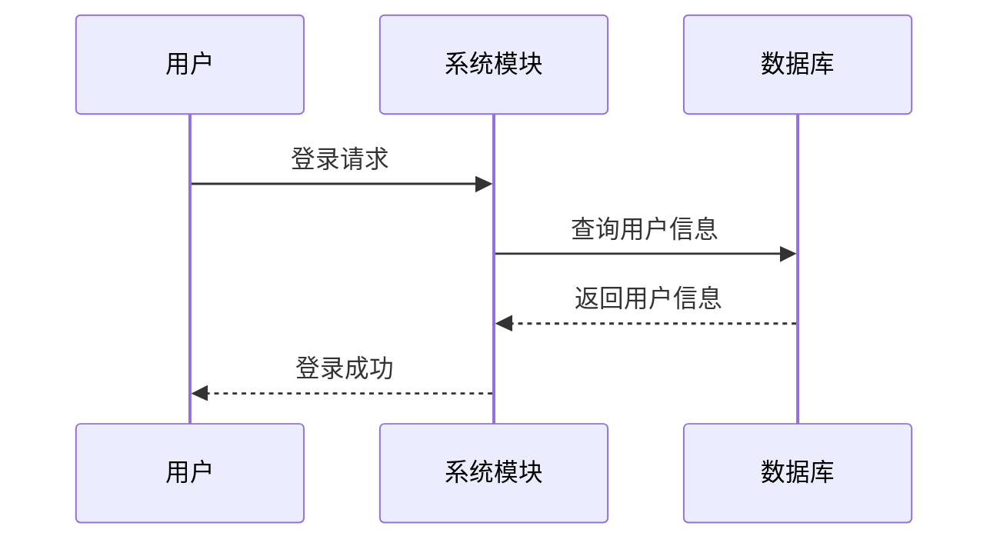

                 

### 《AI Agent在智能制造质量控制中的角色》

> 关键词：AI Agent、智能制造、质量控制、机器学习、深度学习、强化学习

> 摘要：本文探讨了AI Agent在智能制造质量控制中的应用。首先，介绍了智能制造和质量控制的基本概念，以及AI Agent的定义与特点。接着，详细讲解了AI Agent的基础理论，包括机器学习、深度学习、强化学习等。随后，通过具体的应用案例，展示了AI Agent在质量预测、故障诊断、质量优化和过程控制等领域的实际应用。最后，探讨了AI Agent在智能制造质量控制中的系统架构设计，并分享了项目实战的经验与教训。

### 目录

#### 第一部分：背景介绍与核心概念

- **第1章：智能制造与质量控制概述**
  - 1.1 智能制造的概念与演变
  - 1.2 质量控制的基本概念与重要性
  - 1.3 AI Agent在智能制造质量控制中的角色
  - 1.4 本书结构与主要内容概览

- **第2章：AI Agent的基础理论**
  - 2.1 机器学习与深度学习基础
  - 2.2 强化学习与强化学习算法
  - 2.3 监督学习与无监督学习
  - 2.4 AI Agent的设计与实现
  - 2.5 AI Agent在质量控制中的应用

#### 第二部分：核心概念与原理

- **第3章：AI Agent在智能制造质量控制中的应用案例**
  - 3.1 质量预测算法
  - 3.2 故障诊断算法
  - 3.3 质量优化算法
  - 3.4 过程控制算法

#### 第三部分：算法原理与实现

- **第4章：AI Agent在智能制造质量控制中的系统架构设计**
  - 4.1 系统需求分析
  - 4.2 系统架构设计
  - 4.3 系统接口设计
  - 4.4 系统交互设计

#### 第四部分：项目实战与案例分析

- **第5章：AI Agent在智能制造质量控制中的应用实践**
  - 5.1 项目背景与目标
  - 5.2 环境安装与配置
  - 5.3 系统核心实现
  - 5.4 实际案例分析和详细讲解剖析
  - 5.5 项目小结

### 第一部分：背景介绍与核心概念

#### 第1章：智能制造与质量控制概述

##### 1.1 智能制造的概念与演变

智能制造是指利用先进的信息技术和制造技术，通过自动化、数字化、网络化和智能化手段，实现制造过程的优化和升级，从而提高生产效率、降低成本、提升产品质量和竞争力。智能制造的概念可以从以下几个方面进行阐述：

- **信息技术与制造技术的融合**：智能制造将信息技术与制造技术紧密结合，通过物联网、大数据、云计算等新一代信息技术，实现制造设备的互联互通，构建数字化制造系统。

- **自动化**：通过自动化技术，实现制造过程的自动化控制，减少人力操作，提高生产效率和质量。

- **数字化**：利用数字化技术，将制造过程中的数据采集、传输、处理和存储，实现制造过程的数字化管理。

- **网络化**：通过互联网、工业互联网等网络技术，实现制造设备、生产管理、供应链管理等各个环节的信息共享和协同工作。

- **智能化**：利用人工智能技术，实现制造过程的智能决策和优化，提高生产过程的自适应能力和灵活性。

智能制造的起源可以追溯到20世纪80年代的自动化制造和计算机集成制造系统（CIMS），随着信息技术和制造技术的不断发展，智能制造的概念逐渐完善和成熟。近年来，随着物联网、大数据、云计算、人工智能等技术的快速发展，智能制造迎来了新一轮的发展机遇。

##### 1.1.1 智能制造的起源与发展

智能制造的起源可以追溯到20世纪80年代的自动化制造和计算机集成制造系统（CIMS）。在那个时期，人们开始意识到，仅仅依靠机械化和自动化技术，无法满足日益复杂的制造需求，需要引入信息技术，实现制造过程的集成和优化。于是，计算机集成制造系统（CIMS）应运而生。

计算机集成制造系统（CIMS）是一种基于信息技术，将制造过程中的各个子系统集成在一起，实现数据共享和协同工作的制造系统。CIMS包括制造执行系统（MES）、计算机辅助设计（CAD）、计算机辅助制造（CAM）、企业资源计划（ERP）等模块，实现了制造过程的数字化管理和自动化控制。

随着信息技术的不断发展，CIMS逐渐暴露出一些问题，例如数据孤岛、系统之间的协同性差等。为了解决这些问题，人们提出了基于互联网的制造系统（IMS）和工业互联网（IIoT）的概念。

基于互联网的制造系统（IMS）通过互联网技术，实现了制造设备、生产管理、供应链管理等各个环节的信息共享和协同工作。工业互联网（IIoT）则是IMS的一种扩展，它通过物联网技术，实现了设备、产品、人、系统和服务的全面连接。

进入21世纪，人工智能技术的快速发展，为智能制造注入了新的动力。人们开始将人工智能技术应用于制造过程的各个环节，实现制造过程的智能决策和优化。智能制造逐渐从概念走向现实，成为制造行业的发展趋势。

##### 1.1.2 智能制造的关键技术与趋势

智能制造的关键技术包括物联网、大数据、云计算、人工智能、数字孪生等。这些技术共同推动了智能制造的发展，并带来了以下趋势：

- **物联网（IoT）**：物联网技术通过传感器、RFID等技术，实现了设备的互联互通和数据采集，为智能制造提供了基础数据支持。

- **大数据**：大数据技术通过对海量数据的存储、管理和分析，为智能制造提供了数据驱动的决策支持。

- **云计算**：云计算技术通过虚拟化、分布式计算等技术，实现了计算资源的动态分配和弹性扩展，为智能制造提供了强大的计算能力。

- **人工智能**：人工智能技术通过对数据的深度学习、模式识别、预测分析等，实现了制造过程的智能决策和优化。

- **数字孪生**：数字孪生技术通过建立制造过程的虚拟模型，实现了对实际制造过程的实时监控和仿真优化。

智能制造的发展趋势主要体现在以下几个方面：

- **智能制造生态系统**：智能制造不再是一个单一的企业行为，而是涉及到整个供应链和生态系统，包括供应商、制造商、分销商、客户等。

- **服务化制造**：随着消费者需求的多样化，制造业正从传统的产品制造向服务化制造转变，通过提供定制化服务，实现制造过程的增值。

- **绿色制造**：随着环保意识的提高，绿色制造成为智能制造的一个重要趋势，通过减少资源消耗、降低污染物排放，实现制造过程的可持续发展。

- **智能工厂**：智能工厂是智能制造的最高形态，通过集成物联网、大数据、人工智能等技术，实现生产过程的全面智能化和自动化。

##### 1.1.3 智能制造在不同行业的应用

智能制造在不同行业的应用具有显著的差异，但总体上都朝着提高生产效率、降低成本、提升产品质量和竞争力的方向努力。

- **汽车行业**：汽车行业是智能制造的典型应用领域。通过物联网技术，实现了汽车生产设备的互联互通和数据采集，通过大数据和人工智能技术，实现了生产过程的智能调度和优化。

- **电子行业**：电子行业对产品质量和一致性要求极高，通过智能制造技术，实现了生产过程的全面自动化和智能化，有效提升了生产效率和质量。

- **医疗设备行业**：医疗设备行业涉及到众多复杂的生产工艺和严格的质量控制要求，通过智能制造技术，实现了生产过程的精细化和智能化，确保了产品质量的稳定和可靠。

- **消费品行业**：消费品行业通过智能制造技术，实现了个性化定制和快速响应消费者需求，有效提升了市场竞争力。

##### 1.2 质量控制的基本概念与重要性

质量控制是指通过对产品生产过程中的各个环节进行监控、分析和改进，确保产品达到预定质量标准的一系列活动。质量控制的基本概念包括以下几个方面：

- **质量**：质量是指产品或服务的特性满足规定要求的能力。质量不仅与产品的功能和使用寿命有关，还包括外观、手感、安全性等。

- **质量控制**：质量控制是指通过制定标准、监控过程、分析数据、采取改进措施等一系列活动，确保产品达到预定质量标准。

- **质量保证**：质量保证是指通过一系列措施和程序，确保产品质量的稳定和可靠，包括内部质量保证和外部质量保证。

质量控制的重要性体现在以下几个方面：

- **提升产品质量**：质量控制可以确保产品在各个环节都达到预定质量标准，从而提高产品的整体质量。

- **降低生产成本**：质量控制可以及时发现和解决生产过程中的问题，避免不良品产生，减少浪费和返工，从而降低生产成本。

- **提高市场竞争力**：质量控制可以确保产品达到客户预期，提高客户满意度，从而增强企业在市场中的竞争力。

- **确保产品安全**：质量控制可以确保产品在使用过程中不会对用户造成伤害，提高产品的安全性。

##### 1.2.1 质量控制的定义与作用

质量控制是指在生产过程中，通过一系列措施和手段，确保产品达到预定质量标准的一系列活动。质量控制的作用主要包括以下几个方面：

- **确保产品符合规定要求**：质量控制可以确保产品在设计、生产、检验等各个环节都符合规定的质量标准，从而满足客户的需求。

- **提高生产效率**：质量控制可以及时发现和解决生产过程中的问题，避免不良品产生，减少浪费和返工，从而提高生产效率。

- **降低生产成本**：质量控制可以减少不良品的产生，降低返工和废品的成本，从而降低生产成本。

- **提升产品质量**：质量控制可以确保产品在各个环节都达到预定质量标准，从而提高产品的整体质量。

- **增强市场竞争力**：质量控制可以确保产品达到客户预期，提高客户满意度，从而增强企业在市场中的竞争力。

##### 1.2.2 质量控制的方法与工具

质量控制的方法和工具多种多样，以下是一些常见的方法和工具：

- **统计过程控制（SPC）**：统计过程控制是一种通过监控生产过程中的关键质量特性，识别和消除异常波动，确保生产过程稳定的方法。

- **防错技术**：防错技术是一种通过设计或装置，使生产过程中错误无法发生或及时发现，从而避免不良品产生的方法。

- **六西格玛（Six Sigma）**：六西格玛是一种通过系统化的方法和工具，识别和消除生产过程中的缺陷，提高产品质量和效率的方法。

- **全面质量管理（TQM）**：全面质量管理是一种通过全员参与，全过程控制，全方位改进，实现产品质量和服务的持续提升的方法。

- **质量功能展开（QFD）**：质量功能展开是一种通过将顾客需求转化为产品或服务的具体设计参数，确保产品满足顾客需求的方法。

- **持续改进（CI）**：持续改进是一种通过不断寻求改进机会，持续优化生产过程，提高产品质量和效率的方法。

##### 1.2.3 质量控制流程与质量管理

质量控制流程是确保产品质量的一系列有序活动，主要包括以下几个阶段：

- **质量策划**：在产品设计和生产前，制定质量目标和质量计划，明确质量标准、质量要求和责任分配。

- **质量控制**：在生产过程中，通过对关键质量特性进行监控、测量和数据分析，识别和纠正质量问题，确保生产过程稳定。

- **质量检验**：对生产出的产品进行检验和测试，确保产品符合质量标准，发现和排除不良品。

- **质量改进**：对质量控制过程中发现的问题进行分析和改进，持续优化生产过程，提高产品质量。

质量管理是指企业为实现质量目标而进行的一系列管理和活动，主要包括以下几个方面：

- **质量文化**：营造良好的质量文化氛围，提高员工的质量意识和质量素质。

- **质量管理体系**：建立和运行符合国际标准的质量管理体系，确保质量管理的系统化和规范化。

- **质量教育培训**：定期进行质量教育培训，提高员工的质量知识和技能。

- **质量绩效评估**：对质量管理过程和结果进行评估和考核，确保质量管理目标的实现。

##### 1.3 AI Agent在智能制造质量控制中的角色

AI Agent是一种基于人工智能技术的自动化系统，它可以模拟人类的智能行为，进行自主决策和任务执行。在智能制造质量控制中，AI Agent具有以下角色：

- **智能监控**：AI Agent可以实时监控生产过程中的各项指标，识别异常情况，提供预警和反馈，帮助操作人员及时采取措施，避免质量问题的发生。

- **智能诊断**：AI Agent可以基于历史数据和实时数据，对生产过程中的质量问题进行诊断和分析，提供原因分析和解决方案，帮助操作人员进行质量改进。

- **智能优化**：AI Agent可以基于数据分析和预测，对生产过程进行优化，提高生产效率和产品质量。

- **智能决策**：AI Agent可以基于数据和算法，进行智能决策，优化资源配置，降低生产成本。

AI Agent在智能制造质量控制中的应用，不仅可以提高质量控制的效率和质量，还可以减少人为错误，降低质量成本，提升企业的核心竞争力。

##### 1.3.1 AI Agent的定义与特点

AI Agent，即人工智能代理，是一种具有自主决策能力的软件系统，能够模拟人类智能行为，完成特定任务。AI Agent具有以下特点：

- **自主性**：AI Agent能够根据环境和任务需求，自主决策和行动，不受人为干预。

- **适应性**：AI Agent能够通过学习和适应，不断优化自身的决策和行为。

- **智能化**：AI Agent能够利用人工智能技术，如机器学习、深度学习、自然语言处理等，实现智能化的任务执行。

- **协作性**：AI Agent能够与其他系统或人类协同工作，完成复杂任务。

AI Agent的定义与特点，决定了其在智能制造质量控制中的巨大潜力。

##### 1.3.2 AI Agent在质量控制中的应用潜力

AI Agent在智能制造质量控制中具有广泛的应用潜力，主要体现在以下几个方面：

- **实时监控**：AI Agent可以实时监控生产过程中的各项指标，如温度、压力、速度等，及时发现异常情况，提供预警和反馈。

- **故障诊断**：AI Agent可以通过分析生产过程中的数据，识别故障原因，提供故障诊断报告，帮助操作人员进行维修和优化。

- **质量预测**：AI Agent可以基于历史数据和实时数据，预测生产过程中的质量问题，提前采取措施，避免不良品产生。

- **优化控制**：AI Agent可以基于数据分析和预测，对生产过程进行优化，提高生产效率和产品质量。

- **决策支持**：AI Agent可以提供智能化的决策支持，优化资源配置，降低生产成本。

AI Agent在智能制造质量控制中的应用，不仅可以提高质量控制的效率和质量，还可以减少人为错误，降低质量成本，提升企业的核心竞争力。

##### 1.3.3 AI Agent与传统质量控制方法的比较

AI Agent与传统质量控制方法相比，具有显著的优势，但也存在一定的局限性。

- **优势**：

  - **高效性**：AI Agent能够实时监控和分析大量数据，比人工监控更加高效和准确。

  - **精确性**：AI Agent可以基于算法和模型，对生产过程中的质量特性进行精确预测和诊断。

  - **自动化**：AI Agent能够自动执行质量控制和优化任务，减少人为干预，提高生产效率和产品质量。

  - **适应性**：AI Agent可以通过学习和适应，不断优化自身的决策和行为，适应生产环境和需求的变化。

- **局限性**：

  - **数据依赖**：AI Agent对数据质量要求较高，数据不完整或错误可能导致决策失误。

  - **算法复杂**：AI Agent的算法和模型较为复杂，需要专业的知识和技能进行开发和维护。

  - **初始成本**：AI Agent的开发和应用需要一定的初始投资，对企业的资金和技术实力有一定要求。

##### 1.4 本书结构与主要内容概览

本书共分为五个部分，系统地介绍了AI Agent在智能制造质量控制中的应用。

- **第一部分**：背景介绍与核心概念，包括智能制造和质量控制的基本概念，以及AI Agent的定义与特点。

- **第二部分**：核心概念与原理，详细讲解了AI Agent的基础理论，包括机器学习、深度学习、强化学习等。

- **第三部分**：算法原理与实现，通过具体的应用案例，展示了AI Agent在质量预测、故障诊断、质量优化和过程控制等领域的实际应用。

- **第四部分**：系统设计与实现，探讨了AI Agent在智能制造质量控制中的系统架构设计。

- **第五部分**：项目实战与案例分析，分享了AI Agent在智能制造质量控制中的应用实践，包括项目背景、环境安装与配置、系统核心实现、实际案例分析和项目小结。

本书旨在为广大读者提供一本全面、系统的AI Agent在智能制造质量控制方面的指南，帮助读者了解和应用这一先进技术。

##### 1.4.1 目录结构安排

本书的目录结构安排如下：

- **第一部分**：背景介绍与核心概念
  - 第1章：智能制造与质量控制概述
  - 第2章：AI Agent的基础理论

- **第二部分**：核心概念与原理
  - 第3章：AI Agent在智能制造质量控制中的应用案例

- **第三部分**：算法原理与实现
  - 第4章：AI Agent在智能制造质量控制中的系统架构设计

- **第四部分**：项目实战与案例分析
  - 第5章：AI Agent在智能制造质量控制中的应用实践

##### 1.4.2 各章节内容重点

- **第1章**：智能制造与质量控制概述
  - 内容重点包括智能制造的概念与演变、质量控制的基本概念与重要性、AI Agent的定义与特点及其在智能制造质量控制中的角色。

- **第2章**：AI Agent的基础理论
  - 内容重点包括机器学习、深度学习、强化学习等基础理论，以及AI Agent的设计与实现。

- **第3章**：AI Agent在智能制造质量控制中的应用案例
  - 内容重点包括质量预测、故障诊断、质量优化和过程控制等应用案例，展示AI Agent在智能制造质量控制中的实际应用。

- **第4章**：AI Agent在智能制造质量控制中的系统架构设计
  - 内容重点包括系统需求分析、系统架构设计、系统接口设计、系统交互设计等。

- **第5章**：AI Agent在智能制造质量控制中的应用实践
  - 内容重点包括项目背景与目标、环境安装与配置、系统核心实现、实际案例分析和项目小结。

##### 1.4.3 阅读指南与学习方法

为了更好地理解和掌握本书的内容，以下是一些阅读指南和学习方法：

- **系统阅读**：按照书的目录结构，系统阅读各个章节，逐步掌握智能制造、质量控制、AI Agent等核心概念和原理。

- **案例学习**：通过阅读和应用案例，了解AI Agent在智能制造质量控制中的实际应用，加深对理论知识的理解。

- **实践操作**：尝试安装和配置相关环境，实现系统架构设计和核心功能，通过实践操作加深对知识的掌握。

- **问题导向**：在学习过程中，遇到问题要及时查阅资料和向他人请教，培养解决问题的能力和思维方式。

- **总结归纳**：在阅读和实践中，不断总结和归纳所学内容，形成自己的知识体系。

### 第二部分：核心概念与原理

#### 第2章：AI Agent的基础理论

##### 2.1 机器学习与深度学习基础

机器学习和深度学习是人工智能的重要组成部分，它们在智能制造质量控制中发挥着关键作用。本节将详细介绍机器学习和深度学习的基础知识，包括基本概念、发展历程、应用场景等。

###### 2.1.1 机器学习的基本概念

机器学习是指通过算法和统计方法，从数据中自动学习和改进，从而进行预测和决策的过程。机器学习的基本概念包括以下几个方面：

- **数据**：机器学习的基础是数据，数据是训练模型的重要资源。

- **特征**：特征是指从数据中提取的有用信息，它们用于训练模型。

- **模型**：模型是机器学习算法的核心，它通过对数据的训练，学习到数据中的规律和模式。

- **损失函数**：损失函数是衡量模型性能的重要指标，用于评估模型预测的误差。

- **优化算法**：优化算法用于调整模型参数，以最小化损失函数，提高模型性能。

- **评估指标**：评估指标用于评估模型的预测效果，常用的评估指标包括准确率、召回率、F1值等。

###### 2.1.2 深度学习的发展与特点

深度学习是机器学习的一个分支，它通过多层神经网络对数据进行深度处理，从而实现更复杂的特征提取和模式识别。深度学习的发展经历了以下几个阶段：

- **1986年**：深度学习概念首次提出，Hinton等人提出了反向传播算法，这是深度学习的基础。

- **2006年**：Hinton等人提出了深度信念网络（DBN），标志着深度学习进入了新的发展阶段。

- **2012年**：Hinton等人提出的卷积神经网络（CNN）在ImageNet图像识别挑战赛中取得了突破性的成绩，深度学习开始受到广泛关注。

- **2014年**：深度学习在语音识别、自然语言处理等领域取得了显著成果，应用范围不断扩展。

深度学习具有以下特点：

- **层次化特征提取**：深度学习通过多层神经网络，对输入数据进行层次化的特征提取，能够自动学习到抽象的特征表示。

- **端到端学习**：深度学习可以实现端到端的学习，直接从输入数据到输出结果，无需人工设计特征。

- **强大的表示能力**：深度学习能够处理高维数据，具有强大的表示能力，能够捕捉复杂的模式和关系。

- **自适应性和泛化能力**：深度学习通过不断调整模型参数，能够自适应地学习数据中的规律，并具有良好的泛化能力。

###### 2.1.3 常见机器学习算法简介

机器学习算法种类繁多，以下是几种常见的机器学习算法及其应用场景：

- **线性回归**：线性回归是一种简单的回归算法，通过建立线性关系模型，预测连续值。

- **逻辑回归**：逻辑回归是一种分类算法，通过建立概率模型，预测离散值。

- **支持向量机（SVM）**：SVM是一种有效的分类和回归算法，通过最大化分类边界，提高模型的泛化能力。

- **决策树**：决策树是一种基于规则的学习算法，通过构建树状模型，对数据进行分类和回归。

- **随机森林**：随机森林是一种集成学习方法，通过构建多个决策树，提高模型的预测性能。

- **K近邻（KNN）**：KNN是一种基于实例的学习算法，通过计算测试样本与训练样本的距离，进行分类和回归。

- **神经网络**：神经网络是一种模拟人脑神经元连接的算法，通过多层神经元的非线性变换，实现复杂的特征提取和模式识别。

- **深度学习**：深度学习是一种通过多层神经网络进行深度特征提取的学习方法，广泛应用于图像识别、自然语言处理、语音识别等领域。

##### 2.2 强化学习与强化学习算法

强化学习是一种通过试错和反馈机制进行学习的算法，它在智能制造质量控制中具有广泛应用。本节将详细介绍强化学习的基本概念、原理和应用。

###### 2.2.1 强化学习的原理与应用

强化学习的基本原理是通过智能体（Agent）与环境的交互，学习最优策略，实现目标的最优化。强化学习的过程可以分为以下几个步骤：

- **状态（State）**：状态是智能体所处的环境描述，它可以是离散的或连续的。

- **动作（Action）**：动作是智能体在某个状态下可以采取的行为。

- **奖励（Reward）**：奖励是智能体在执行动作后，环境给予的即时反馈，它可以是正的或负的。

- **策略（Policy）**：策略是智能体在特定状态下采取的动作规则，它可以通过学习得到。

强化学习的目标是通过不断的试错和反馈，找到最优策略，使智能体在长期内获得最大的累计奖励。

强化学习在智能制造质量控制中的应用主要包括以下几个方面：

- **生产过程控制**：通过强化学习算法，对生产过程进行自适应控制，提高生产效率和产品质量。

- **质量预测**：利用强化学习算法，对生产过程中的质量进行预测，提前采取措施，避免不良品产生。

- **故障诊断**：通过强化学习算法，对生产设备进行监控和故障诊断，提高故障检测的准确性和响应速度。

- **优化配置**：通过强化学习算法，对生产资源的配置进行优化，降低生产成本，提高生产效率。

###### 2.2.2 Q-learning算法

Q-learning算法是一种基于值函数的强化学习算法，它通过迭代更新值函数，学习到最优策略。Q-learning算法的基本步骤如下：

1. **初始化**：初始化值函数Q(s,a)和一个学习率α，以及一个折扣因子γ。

2. **选择动作**：在当前状态下，选择一个动作a，可以选择贪心策略或随机策略。

3. **执行动作**：执行选定的动作a，进入新的状态s'，并获得奖励r。

4. **更新值函数**：根据奖励和新的状态，更新值函数Q(s,a)：

   $$ Q(s,a) = Q(s,a) + \alpha [r + \gamma \max_{a'} Q(s',a') - Q(s,a)] $$

5. **状态转移**：更新当前状态为s'，重复步骤2-4，直到达到终止状态。

Q-learning算法的优点是简单易实现，适用于连续状态和动作空间的问题，但它的收敛速度较慢，且存在收敛性证明复杂的问题。

###### 2.2.3 SARSA算法

SARSA算法是一种基于策略的强化学习算法，它同时考虑当前状态和下一状态的动作价值，更新值函数。SARSA算法的基本步骤如下：

1. **初始化**：初始化值函数Q(s,a)和一个学习率α，以及一个折扣因子γ。

2. **选择动作**：在当前状态下，选择一个动作a，可以选择贪心策略或随机策略。

3. **执行动作**：执行选定的动作a，进入新的状态s'，并获得奖励r。

4. **更新值函数**：根据奖励和新的状态，更新值函数Q(s,a)：

   $$ Q(s,a) = Q(s,a) + \alpha [r + \gamma Q(s',a')] $$

5. **状态转移**：更新当前状态为s'，重复步骤2-4，直到达到终止状态。

SARSA算法的优点是简单易实现，且在许多情况下能够收敛到最优策略。与Q-learning算法相比，SARSA算法更加稳定，但它的收敛速度较慢。

##### 2.3 监督学习与无监督学习

监督学习和无监督学习是机器学习的两个主要分支，它们在智能制造质量控制中具有不同的应用场景。本节将详细介绍这两种学习方式的基本概念、原理和应用。

###### 2.3.1 监督学习的理论基础

监督学习是指通过已知的输入和输出数据，训练模型，从而预测未知数据的输出。监督学习可以分为两种类型：回归和分类。

- **回归**：回归问题是指通过输入特征预测连续值的输出。常用的回归算法包括线性回归、岭回归、LASSO回归等。

- **分类**：分类问题是指通过输入特征预测离散值的输出。常用的分类算法包括逻辑回归、支持向量机、决策树、随机森林等。

监督学习的理论基础主要包括以下几个方面：

- **特征工程**：特征工程是指通过对原始数据进行预处理、变换和筛选，提取出对模型训练有利的特征。

- **模型选择**：模型选择是指根据问题的特点和数据集的性质，选择合适的模型。

- **模型训练**：模型训练是指通过训练算法，调整模型参数，使模型对训练数据进行良好的拟合。

- **模型评估**：模型评估是指通过评估指标，如准确率、召回率、F1值等，评估模型的性能。

###### 2.3.2 无监督学习的重要性

无监督学习是指在没有明确标注的输出数据的情况下，通过模型训练，发现数据中的潜在结构和规律。无监督学习在智能制造质量控制中具有重要意义，主要体现在以下几个方面：

- **数据降维**：通过无监督学习，可以将高维数据映射到低维空间，简化数据的处理和分析。

- **聚类分析**：无监督学习可以自动发现数据中的聚类结构，帮助识别异常值和潜在的模式。

- **特征提取**：无监督学习可以从原始数据中提取有用的特征，为监督学习提供更好的输入。

- **数据预处理**：无监督学习可以用于数据的预处理，如去除噪声、填充缺失值等。

###### 2.3.3 聚类算法与降维算法

聚类算法和无监督学习的两种主要类型，它们在智能制造质量控制中具有广泛的应用。

- **聚类算法**：聚类算法是将数据集划分为若干个聚类，使同一聚类中的数据点相似，不同聚类中的数据点不相似。常用的聚类算法包括K-means、层次聚类、DBSCAN等。

  - **K-means算法**：K-means算法是一种基于距离的聚类算法，通过迭代计算，将数据点划分为K个聚类，使每个聚类内部的距离最小，聚类之间的距离最大。

  - **层次聚类算法**：层次聚类算法是一种基于层次结构的聚类算法，通过逐步合并或分裂聚类，构建聚类层次结构。

  - **DBSCAN算法**：DBSCAN算法是一种基于密度的聚类算法，通过计算数据点之间的密度关系，将数据点划分为聚类。

- **降维算法**：降维算法是将高维数据映射到低维空间，减少数据的维度，简化数据的处理和分析。常用的降维算法包括主成分分析（PCA）、线性判别分析（LDA）、t-SNE等。

  - **主成分分析（PCA）**：PCA是一种基于方差最大化原则的降维算法，通过计算数据的协方差矩阵，提取主要成分，将数据映射到低维空间。

  - **线性判别分析（LDA）**：LDA是一种基于类间方差最大和类内方差最小的原则的降维算法，通过计算类间散度和类内散度，提取线性判别函数，将数据映射到低维空间。

  - **t-SNE算法**：t-SNE算法是一种基于相似性度量的降维算法，通过计算数据点之间的相似性，将高维数据映射到低维空间，使相似的数据点在低维空间中保持接近。

##### 2.4 AI Agent的设计与实现

AI Agent是一种具有自主决策能力的智能系统，它在智能制造质量控制中发挥着重要作用。本节将介绍AI Agent的设计与实现，包括核心功能、架构设计和开发流程。

###### 2.4.1 AI Agent的核心功能

AI Agent的核心功能主要包括以下几个方面：

- **数据采集与处理**：AI Agent可以从各种数据源采集数据，包括传感器数据、生产数据、质量数据等，并对数据进行预处理、清洗和转换。

- **特征提取与选择**：AI Agent可以自动提取数据中的有用特征，并选择对模型训练和预测最有效的特征。

- **模型训练与优化**：AI Agent可以利用各种机器学习和深度学习算法，对数据进行训练，并不断优化模型，提高预测准确性和稳定性。

- **预测与决策**：AI Agent可以根据训练好的模型，对未知数据或未来数据进行预测，并基于预测结果，进行智能决策和行动。

- **反馈与调整**：AI Agent可以根据反馈结果，调整自身的模型和策略，实现自适应学习和优化。

###### 2.4.2 AI Agent的架构设计

AI Agent的架构设计可以分为以下几个模块：

- **数据采集模块**：负责从各种数据源采集数据，包括传感器数据、生产数据、质量数据等。

- **数据处理模块**：负责对采集到的数据进行预处理、清洗和转换，提取有用特征。

- **模型训练模块**：负责利用机器学习和深度学习算法，对数据进行训练，并不断优化模型。

- **预测与决策模块**：负责根据训练好的模型，对未知数据或未来数据进行预测，并基于预测结果，进行智能决策和行动。

- **反馈与调整模块**：负责根据反馈结果，调整自身的模型和策略，实现自适应学习和优化。

AI Agent的架构设计要考虑以下几个方面：

- **模块化**：各模块之间要相互独立，便于维护和升级。

- **可扩展性**：架构要支持新的算法和数据的引入，方便后续扩展。

- **可适应性**：架构要能够适应不同的应用场景和需求，实现灵活部署。

- **高效性**：架构要保证数据流和计算流的高效性，提高系统的性能。

###### 2.4.3 AI Agent开发流程

AI Agent的开发流程可以分为以下几个阶段：

1. **需求分析与规划**：明确AI Agent的应用场景和功能需求，制定开发计划和资源分配。

2. **数据采集与处理**：收集和整理所需的数据，进行数据预处理、清洗和转换，提取有用特征。

3. **模型设计与选择**：根据应用场景和需求，选择合适的机器学习和深度学习算法，设计模型架构。

4. **模型训练与优化**：利用训练数据，训练模型，并通过交叉验证和超参数调整，优化模型性能。

5. **模型部署与测试**：将训练好的模型部署到实际应用环境中，进行测试和验证，确保模型的有效性和稳定性。

6. **反馈与调整**：根据实际应用中的反馈，调整模型和策略，实现自适应学习和优化。

AI Agent的开发流程要考虑以下几个方面：

- **需求驱动**：以实际应用需求为导向，确保开发的AI Agent能够解决实际问题。

- **数据驱动**：数据是AI Agent的核心，要重视数据的质量和多样性，确保模型训练的有效性。

- **迭代优化**：开发过程要支持快速迭代和优化，不断调整和改进模型和策略。

- **安全性**：要确保AI Agent的安全性和稳定性，防止数据泄露和模型攻击。

##### 2.5 AI Agent在质量控制中的应用

AI Agent在智能制造质量控制中具有广泛的应用，主要包括以下几个方面：

- **质量预测**：利用AI Agent的预测能力，对生产过程中的质量进行预测，提前发现潜在的问题，采取预防措施，避免不良品产生。

- **故障诊断**：利用AI Agent的故障诊断能力，对生产设备进行实时监控和故障诊断，提高故障检测的准确性和响应速度，减少停机时间和维修成本。

- **质量优化**：利用AI Agent的质量优化能力，对生产过程进行自适应控制和优化，提高生产效率和产品质量。

- **决策支持**：利用AI Agent的智能决策能力，为生产管理人员提供数据驱动的决策支持，优化资源配置，降低生产成本。

- **数据分析与优化**：利用AI Agent的数据分析能力，对生产过程和质量数据进行分析，挖掘潜在的价值和优化点，实现生产过程的智能化和优化。

AI Agent在质量控制中的应用，不仅可以提高质量控制的效率和质量，还可以减少人为错误，降低质量成本，提升企业的核心竞争力。

### 第三部分：算法原理与实现

#### 第3章：AI Agent在智能制造质量控制中的应用案例

##### 3.1 质量预测算法

质量预测是智能制造质量控制中的一个关键环节，它可以帮助企业提前发现潜在的质量问题，采取预防措施，避免不良品产生。本节将介绍质量预测算法的基本原理、数学模型和Python代码实现。

###### 3.1.1 质量预测的基本概念

质量预测是指利用历史数据和现有数据，对生产过程中的质量特性进行预测，以提前发现潜在的质量问题。质量预测的基本概念包括以下几个方面：

- **输入特征**：输入特征是指用于预测质量特性的特征变量，它们可以是传感器数据、生产参数、工艺参数等。

- **输出目标**：输出目标是指需要预测的质量特性，如尺寸、重量、硬度、表面质量等。

- **预测模型**：预测模型是指用于预测质量特性的数学模型，它可以是线性模型、非线性模型、深度学习模型等。

- **预测误差**：预测误差是指预测值与真实值之间的差异，它反映了预测模型的准确性。

质量预测的基本流程包括数据收集与处理、模型选择与训练、预测与评估等步骤。

###### 3.1.2 质量预测的数学模型

质量预测的数学模型可以分为线性模型和非线性模型两类。

- **线性模型**：线性模型是最简单和常见的一类预测模型，它通过线性关系描述输入特征和输出目标之间的关系。常见的线性模型包括线性回归、多项式回归等。

  线性回归模型的数学表达式为：

  $$ y = \beta_0 + \beta_1x_1 + \beta_2x_2 + ... + \beta_nx_n $$

  其中，$y$是输出目标，$x_1, x_2, ..., x_n$是输入特征，$\beta_0, \beta_1, ..., \beta_n$是模型的参数。

- **非线性模型**：非线性模型通过非线性函数描述输入特征和输出目标之间的关系，能够捕捉更复杂的关系。常见的非线性模型包括逻辑回归、支持向量机、神经网络等。

  逻辑回归模型的数学表达式为：

  $$ P(y=1) = \frac{1}{1 + e^{-(\beta_0 + \beta_1x_1 + \beta_2x_2 + ... + \beta_nx_n)}} $$

  其中，$P(y=1)$是输出目标为1的概率，$x_1, x_2, ..., x_n$是输入特征，$\beta_0, \beta_1, ..., \beta_n$是模型的参数。

###### 3.1.3 质量预测的Python代码实现

下面将使用Python中的scikit-learn库实现一个线性回归模型进行质量预测。

```python
import numpy as np
import pandas as pd
from sklearn.linear_model import LinearRegression
from sklearn.model_selection import train_test_split
from sklearn.metrics import mean_squared_error

# 加载数据集
data = pd.read_csv('quality_data.csv')
X = data[['feature1', 'feature2', 'feature3']]
y = data['target']

# 数据集划分
X_train, X_test, y_train, y_test = train_test_split(X, y, test_size=0.2, random_state=42)

# 创建线性回归模型
model = LinearRegression()

# 模型训练
model.fit(X_train, y_train)

# 模型预测
y_pred = model.predict(X_test)

# 模型评估
mse = mean_squared_error(y_test, y_pred)
print(f'Mean Squared Error: {mse}')
```

在上面的代码中，我们首先加载数据集，然后划分训练集和测试集。接着创建一个线性回归模型，并进行模型训练。最后，使用训练好的模型对测试集进行预测，并计算预测误差。

###### 3.1.4 实例分析：某制造企业的质量预测案例

假设某制造企业生产一种汽车零件，该零件的尺寸质量是关键质量特性。企业希望通过质量预测算法，提前发现潜在的尺寸质量问题，采取措施进行预防。

1. **数据收集与处理**：

   企业收集了过去一年的生产数据，包括每批次的尺寸测量值和生产参数（如温度、压力等）。数据预处理后，提取出有用的特征，如温度、压力、加工时间等。

2. **模型选择与训练**：

   企业选择线性回归模型进行质量预测。利用训练数据，训练线性回归模型，得到模型的参数。

3. **预测与评估**：

   企业使用训练好的模型，对未来的生产批次进行预测。预测结果与实际尺寸值进行比较，计算预测误差。

4. **结果与应用**：

   如果预测误差较大，说明模型可能存在过拟合或欠拟合现象，需要调整模型参数或选择更合适的模型。如果预测误差较小，说明模型具有较高的预测准确性，可以用于生产质量监控。

##### 3.2 故障诊断算法

故障诊断是智能制造质量控制中的另一个重要环节，它可以帮助企业快速发现设备故障，采取修复措施，确保生产过程的连续性和稳定性。本节将介绍故障诊断算法的基本原理、数学模型和Python代码实现。

###### 3.2.1 故障诊断的基本原理

故障诊断是指通过分析设备运行状态、传感器数据和历史数据，识别设备故障的类型和位置，并给出相应的修复建议。故障诊断的基本原理包括以下几个方面：

- **特征提取**：从传感器数据和运行状态中提取有用的特征，如振动信号、温度变化、压力变化等。

- **模式识别**：利用模式识别技术，如聚类、分类等，对提取的特征进行分类和识别，确定故障的类型和位置。

- **故障预测**：利用历史数据和实时数据，预测设备未来的故障发展趋势，提前采取预防措施。

- **决策支持**：根据故障诊断的结果，为操作人员和维护人员提供决策支持，制定修复计划。

故障诊断的基本流程包括数据收集与处理、特征提取、模式识别、故障预测和决策支持等步骤。

###### 3.2.2 故障诊断的数学模型

故障诊断的数学模型可以分为基于统计的方法和基于机器学习的方法两类。

- **基于统计的方法**：基于统计的方法通常利用概率统计理论，建立故障诊断模型。常见的统计方法包括假设检验、贝叶斯网络等。

  假设检验的数学模型为：

  $$ H_0: \theta = \theta_0 \quad vs \quad H_1: \theta \neq \theta_0 $$

  其中，$H_0$是零假设，$\theta$是参数，$\theta_0$是参数的假设值。

- **基于机器学习的方法**：基于机器学习的方法利用机器学习算法，建立故障诊断模型。常见的机器学习方法包括支持向量机、决策树、神经网络等。

  支持向量机（SVM）的数学模型为：

  $$ \max_{\beta, \beta_0} W^T W $$

  $$ \min_{\beta, \beta_0} \frac{1}{2} W^T W + C \sum_{i=1}^n \lambda_i (1 - y_i (W^T x_i + \beta_0)) $$

  其中，$W$是权重向量，$\beta_0$是偏置项，$C$是惩罚参数，$\lambda_i$是拉格朗日乘子。

###### 3.2.3 故障诊断的Python代码实现

下面将使用Python中的scikit-learn库实现一个支持向量机（SVM）进行故障诊断。

```python
import numpy as np
import pandas as pd
from sklearn.svm import SVC
from sklearn.model_selection import train_test_split
from sklearn.metrics import accuracy_score

# 加载数据集
data = pd.read_csv('fault_data.csv')
X = data[['feature1', 'feature2', 'feature3']]
y = data['fault_type']

# 数据集划分
X_train, X_test, y_train, y_test = train_test_split(X, y, test_size=0.2, random_state=42)

# 创建SVM模型
model = SVC(kernel='linear')

# 模型训练
model.fit(X_train, y_train)

# 模型预测
y_pred = model.predict(X_test)

# 模型评估
accuracy = accuracy_score(y_test, y_pred)
print(f'Accuracy: {accuracy}')
```

在上面的代码中，我们首先加载数据集，然后划分训练集和测试集。接着创建一个支持向量机（SVM）模型，并进行模型训练。最后，使用训练好的模型对测试集进行预测，并计算预测准确率。

###### 3.2.4 实例分析：某设备故障诊断案例

假设某制造企业的一台关键设备出现故障，企业希望通过故障诊断算法，快速识别故障类型和位置，采取修复措施。

1. **数据收集与处理**：

   企业收集了过去一年的设备运行数据，包括传感器数据、运行状态数据等。数据预处理后，提取出有用的特征，如温度、压力、振动等。

2. **模型选择与训练**：

   企业选择支持向量机（SVM）模型进行故障诊断。利用训练数据，训练SVM模型，得到模型的参数。

3. **预测与评估**：

   企业使用训练好的模型，对当前设备运行状态进行预测，识别故障类型和位置。预测结果与实际故障情况进行比较，计算预测准确率。

4. **结果与应用**：

   如果预测准确率较高，说明模型具有较强的故障诊断能力，可以用于实时故障监控和预警。如果预测准确率较低，说明模型可能存在过拟合或欠拟合现象，需要调整模型参数或选择更合适的模型。

##### 3.3 质量优化算法

质量优化是指在智能制造过程中，通过调整生产参数和工艺流程，提高产品质量和效率。质量优化算法可以帮助企业实现生产过程的自动化优化，提高生产效率和质量。本节将介绍质量优化算法的基本原理、数学模型和Python代码实现。

###### 3.3.1 质量优化的问题背景

质量优化在智能制造中的应用十分广泛，常见的问题背景包括以下几个方面：

- **生产效率优化**：通过优化生产参数和工艺流程，提高生产效率，减少生产周期。

- **产品质量提升**：通过优化生产过程，提高产品质量，降低不良品率。

- **成本控制**：通过优化生产过程，降低生产成本，提高企业的市场竞争力。

- **资源利用率提高**：通过优化生产过程，提高设备、人力、物料等资源的利用率。

质量优化算法的目标是在满足产品质量要求的前提下，优化生产参数和工艺流程，提高生产效率和质量。

###### 3.3.2 质量优化的数学模型

质量优化的数学模型可以分为线性优化和非线性优化两类。

- **线性优化模型**：线性优化模型通过线性关系描述生产参数和产品质量之间的关系。常见的线性优化模型包括线性规划、整数规划等。

  线性规划模型的数学表达式为：

  $$ \min_{x} c^T x $$

  $$ \text{s.t.} Ax \leq b $$

  其中，$x$是决策变量，$c$是目标函数系数，$A$是约束条件系数矩阵，$b$是约束条件常数向量。

- **非线性优化模型**：非线性优化模型通过非线性关系描述生产参数和产品质量之间的关系。常见的非线性优化模型包括非线性规划、动态规划等。

  非线性规划模型的数学表达式为：

  $$ \min_{x} f(x) $$

  $$ \text{s.t.} g_i(x) \leq 0, \quad h_j(x) = 0 $$

  其中，$f(x)$是目标函数，$g_i(x)$和$h_j(x)$分别是约束条件函数。

###### 3.3.3 质量优化的Python代码实现

下面将使用Python中的scikit-learn库实现一个线性规划模型进行质量优化。

```python
import numpy as np
from scipy.optimize import linprog

# 定义目标函数系数和约束条件系数矩阵
c = [-1, -1]  # 目标函数系数
A = [[1, 1], [-1, 1]]  # 约束条件系数矩阵
b = [1, 1]  # 约束条件常数向量

# 定义决策变量
x = np.array([0, 0])

# 求解线性规划问题
res = linprog(c, A_ub=A, b_ub=b, bounds=[(0, None), (0, None)], method='highs')

# 输出结果
print(f'Objective Value: {res.fun}')
print(f'Variables: {res.x}')
```

在上面的代码中，我们首先定义目标函数系数和约束条件系数矩阵，然后定义决策变量。接着使用scikit-learn库中的linprog函数求解线性规划问题，并输出结果。

###### 3.3.4 实例分析：某生产线的质量优化案例

假设某生产线上生产一种电子产品，该产品的质量特性包括尺寸、重量和功耗。企业希望通过质量优化算法，优化生产参数和工艺流程，提高产品质量和效率。

1. **数据收集与处理**：

   企业收集了生产数据，包括不同生产参数（如温度、压力、速度等）下的产品质量数据。

2. **模型选择与训练**：

   企业选择线性规划模型进行质量优化。利用训练数据，建立线性规划模型，确定目标函数和约束条件。

3. **优化与评估**：

   企业使用训练好的模型，对当前生产参数进行优化，调整生产参数和工艺流程，提高产品质量和效率。

4. **结果与应用**：

   如果优化结果满足质量要求，说明模型具有较好的优化能力，可以用于生产质量控制。如果优化结果不满足质量要求，说明模型可能存在过拟合或欠拟合现象，需要调整模型参数或选择更合适的模型。

##### 3.4 过程控制算法

过程控制是智能制造质量控制中的一个关键环节，它通过实时监控和调整生产过程，确保产品质量的稳定性和一致性。过程控制算法可以帮助企业实现生产过程的自动化控制，提高生产效率和产品质量。本节将介绍过程控制算法的基本原理、数学模型和Python代码实现。

###### 3.4.1 过程控制的基本概念

过程控制是指通过实时监控和调整生产过程，确保产品质量的稳定性和一致性。过程控制的基本概念包括以下几个方面：

- **被控变量**：被控变量是指需要控制的变量，如温度、压力、速度等。

- **控制变量**：控制变量是指用于调整被控变量的变量，如加热功率、压力调节值等。

- **控制系统**：控制系统是指用于实现过程控制的设备、传感器、执行器和算法等。

- **控制目标**：控制目标是指需要达到的质量标准，如尺寸精度、重量稳定性等。

过程控制的基本流程包括被控变量的实时监控、控制变量的调整和控制系统的工作。

###### 3.4.2 过程控制的数学模型

过程控制的数学模型可以分为确定性模型和不确定性模型两类。

- **确定性模型**：确定性模型是指生产过程中各个变量之间的关系是确定的，可以通过数学模型精确描述。常见的确定性模型包括线性控制模型、非线性控制模型等。

  线性控制模型的数学表达式为：

  $$ y(t) = Cx(t) + Du(t) + e(t) $$

  其中，$y(t)$是输出变量，$x(t)$是输入变量，$u(t)$是控制变量，$e(t)$是噪声变量。

- **不确定性模型**：不确定性模型是指生产过程中存在不确定因素，如设备磨损、工艺波动等，这些因素导致模型参数发生变化。常见的不确定性模型包括自适应控制模型、鲁棒控制模型等。

  鲁棒控制模型的数学表达式为：

  $$ y(t) = C(x(t) + w(t)) + Du(t) + e(t) $$

  其中，$w(t)$是系统噪声，$e(t)$是噪声变量。

###### 3.4.3 过程控制的Python代码实现

下面将使用Python中的scikit-learn库实现一个线性控制模型进行过程控制。

```python
import numpy as np
from scipy.optimize import root

# 定义控制模型参数
C = np.array([[1], [0]])
D = np.array([[1], [0]])

# 定义控制目标
y_desired = np.array([1, 2])

# 定义被控变量
x = np.array([[0], [0]])

# 定义控制变量
u = np.array([[0], [0]])

# 定义控制模型函数
def control_model(u):
    y = C @ x + D @ u + np.random.normal(size=x.shape)
    return y - y_desired

# 求解控制变量
res = root(control_model, u)

# 输出结果
print(f'Control Variable: {res.x}')
```

在上面的代码中，我们首先定义控制模型参数和控制目标，然后定义被控变量和控制变量。接着定义控制模型函数，并使用scikit-learn库中的root函数求解控制变量，输出结果。

###### 3.4.4 实例分析：某制造过程的过程控制案例

假设某制造过程中，需要控制产品的尺寸和重量。企业希望通过过程控制算法，实现生产过程的自动化控制，提高产品质量和效率。

1. **数据收集与处理**：

   企业收集了不同生产参数（如温度、压力、速度等）下的产品质量数据，用于训练过程控制模型。

2. **模型选择与训练**：

   企业选择线性控制模型进行过程控制。利用训练数据，训练线性控制模型，得到模型参数。

3. **控制与评估**：

   企业使用训练好的模型，对当前生产参数进行控制，调整生产参数和工艺流程，提高产品质量和效率。

4. **结果与应用**：

   如果控制结果满足质量要求，说明模型具有较好的控制能力，可以用于生产质量控制。如果控制结果不满足质量要求，说明模型可能存在过拟合或欠拟合现象，需要调整模型参数或选择更合适的模型。

### 第四部分：系统设计与实现

#### 第4章：AI Agent在智能制造质量控制中的系统架构设计

##### 4.1 系统需求分析

在进行AI Agent在智能制造质量控制中的系统架构设计之前，首先需要对系统的需求进行分析。系统需求分析主要包括功能需求、性能需求、可靠性需求和安全性需求。

###### 4.1.1 质量控制系统的功能需求

质量控制系统的功能需求主要包括以下几个方面：

- **数据采集**：系统能够从生产设备和传感器中实时采集质量相关的数据，如温度、压力、速度等。

- **数据处理**：系统能够对采集到的数据进行预处理，包括数据清洗、数据转换和特征提取。

- **质量预测**：系统能够利用历史数据和实时数据，对生产过程中的质量特性进行预测，提前发现潜在的质量问题。

- **故障诊断**：系统能够对生产设备进行实时监控和故障诊断，提高故障检测的准确性和响应速度。

- **质量优化**：系统能够对生产过程进行自适应控制和优化，提高生产效率和产品质量。

- **决策支持**：系统能够为生产管理人员提供数据驱动的决策支持，优化资源配置，降低生产成本。

- **用户交互**：系统能够提供用户友好的界面，方便用户进行操作和监控。

###### 4.1.2 系统性能需求

系统性能需求主要包括以下几个方面：

- **数据处理能力**：系统能够高效地处理大量质量数据，包括实时数据处理和历史数据分析。

- **响应速度**：系统能够快速响应用户的请求，提供实时的质量预测和故障诊断结果。

- **稳定性**：系统在长时间运行过程中，能够保持稳定的性能，不会出现崩溃或故障。

- **扩展性**：系统具有良好的扩展性，能够支持新的算法和应用场景。

- **可维护性**：系统具有良好的可维护性，方便后续的升级和维护。

###### 4.1.3 系统可靠性需求

系统可靠性需求主要包括以下几个方面：

- **数据准确性**：系统采集和处理的数据必须准确可靠，确保质量预测和故障诊断的准确性。

- **系统稳定性**：系统在长时间运行过程中，能够保持稳定的性能，不会出现异常或崩溃。

- **故障恢复**：系统能够自动检测和恢复故障，确保生产过程的连续性和稳定性。

- **数据备份**：系统能够定期备份数据，防止数据丢失。

###### 4.1.4 系统安全性需求

系统安全性需求主要包括以下几个方面：

- **数据安全**：系统必须确保数据的安全，防止数据泄露、篡改或丢失。

- **用户权限管理**：系统必须实现用户权限管理，确保只有授权用户可以访问系统数据和功能。

- **访问控制**：系统必须实现访问控制，防止未授权的用户访问系统。

- **网络安全**：系统必须实现网络安全，防止网络攻击和数据泄露。

##### 4.2 系统架构设计

根据系统需求分析，下面将介绍AI Agent在智能制造质量控制中的系统架构设计。

###### 4.2.1 系统架构概述

AI Agent在智能制造质量控制中的系统架构可以分为以下几个模块：

- **数据采集模块**：负责从生产设备和传感器中实时采集质量相关的数据。

- **数据处理模块**：负责对采集到的数据进行预处理，包括数据清洗、数据转换和特征提取。

- **质量预测模块**：负责利用历史数据和实时数据，对生产过程中的质量特性进行预测。

- **故障诊断模块**：负责对生产设备进行实时监控和故障诊断。

- **质量优化模块**：负责对生产过程进行自适应控制和优化。

- **决策支持模块**：负责为生产管理人员提供数据驱动的决策支持。

- **用户交互模块**：负责提供用户友好的界面，方便用户进行操作和监控。

系统架构的设计原则如下：

- **模块化**：系统架构采用模块化设计，各个模块之间相互独立，便于维护和升级。

- **分布式**：系统架构采用分布式设计，各个模块可以分布式部署，提高系统的性能和可靠性。

- **可扩展性**：系统架构具有良好的扩展性，能够支持新的算法和应用场景。

- **安全性**：系统架构实现数据安全和用户权限管理，确保系统的安全性。

###### 4.2.2 数据处理模块设计

数据处理模块是AI Agent在智能制造质量控制中的核心模块之一，它负责对采集到的数据进行预处理、转换和特征提取。数据处理模块的设计包括以下几个方面：

- **数据采集**：通过传感器和设备接口，实时采集质量相关的数据，如温度、压力、速度等。

- **数据清洗**：对采集到的数据进行清洗，包括去除噪声、填补缺失值、标准化等。

- **数据转换**：将不同类型的数据转换为统一的格式，如将温度数据转换为摄氏度或华氏度。

- **特征提取**：从原始数据中提取有用的特征，如主成分分析（PCA）、线性判别分析（LDA）等。

- **数据存储**：将预处理后的数据存储到数据库中，以便后续的分析和处理。

###### 4.2.3 算法实现模块设计

算法实现模块是AI Agent在智能制造质量控制中的核心模块之一，它负责实现质量预测、故障诊断、质量优化和决策支持等算法。算法实现模块的设计包括以下几个方面：

- **算法选择**：根据应用场景和需求，选择合适的算法，如线性回归、支持向量机（SVM）、神经网络等。

- **模型训练**：利用训练数据，训练选定的算法模型，并保存模型参数。

- **模型预测**：利用训练好的模型，对新的数据集进行预测，生成预测结果。

- **模型评估**：对预测结果进行评估，如计算预测误差、准确率等，以便调整模型参数或选择更合适的模型。

- **模型更新**：根据评估结果，更新模型参数，提高模型的预测准确性和稳定性。

###### 4.2.4 用户交互模块设计

用户交互模块是AI Agent在智能制造质量控制中的用户界面，它负责为用户提供友好的操作界面，方便用户进行监控和操作。用户交互模块的设计包括以下几个方面：

- **用户界面**：设计用户界面，包括仪表盘、报表、图表等，方便用户查看数据和预测结果。

- **操作界面**：设计用户操作界面，包括数据上传、参数设置、模型选择等，方便用户进行操作。

- **实时监控**：提供实时监控功能，包括实时数据展示、报警提示等，方便用户了解生产过程的状态。

- **历史数据查询**：提供历史数据查询功能，包括数据下载、数据导出等，方便用户进行数据分析和挖掘。

- **用户权限管理**：实现用户权限管理，包括用户登录、权限分配等，确保系统的安全性。

##### 4.3 系统接口设计

系统接口设计是AI Agent在智能制造质量控制中的关键环节，它负责定义系统内部模块之间的接口和系统与外部系统之间的接口。系统接口设计包括以下几个方面：

###### 4.3.1 系统内部接口设计

系统内部接口设计主要包括以下几个方面：

- **数据接口**：定义数据处理模块与其他模块之间的数据交换接口，包括数据上传、数据下载等。

- **控制接口**：定义算法实现模块与其他模块之间的控制接口，包括模型训练、模型更新等。

- **通信接口**：定义系统内部模块之间的通信接口，包括消息队列、分布式通信等。

- **API接口**：定义系统对外提供的API接口，包括数据查询、模型预测等。

###### 4.3.2 系统外部接口设计

系统外部接口设计主要包括以下几个方面：

- **设备接口**：定义系统与生产设备和传感器之间的接口，包括数据采集、状态监控等。

- **数据库接口**：定义系统与数据库之间的接口，包括数据存储、数据查询等。

- **网络接口**：定义系统与外部网络之间的接口，包括数据传输、远程访问等。

- **第三方系统接口**：定义系统与第三方系统之间的接口，包括数据交换、协同工作等。

##### 4.4 系统交互设计

系统交互设计是AI Agent在智能制造质量控制中的关键环节，它负责定义系统内部模块之间的交互流程和系统与外部系统之间的交互流程。系统交互设计包括以下几个方面：

###### 4.4.1 系统流程设计

系统流程设计主要包括以下几个方面：

- **数据采集流程**：定义数据采集模块的工作流程，包括数据采集、数据清洗、数据存储等。

- **数据处理流程**：定义数据处理模块的工作流程，包括数据预处理、特征提取、数据存储等。

- **质量预测流程**：定义质量预测模块的工作流程，包括数据加载、模型训练、模型预测等。

- **故障诊断流程**：定义故障诊断模块的工作流程，包括数据加载、模型训练、故障诊断等。

- **质量优化流程**：定义质量优化模块的工作流程，包括数据加载、模型训练、优化控制等。

- **决策支持流程**：定义决策支持模块的工作流程，包括数据加载、模型训练、决策支持等。

- **用户交互流程**：定义用户交互模块的工作流程，包括用户登录、数据查询、报表生成等。

###### 4.4.2 系统交互序列图

系统交互序列图是描述系统内部模块之间和系统与外部系统之间交互流程的图形化表示。系统交互序列图主要包括以下几个方面：

- **数据交互**：描述系统内部模块之间的数据交换流程，包括数据上传、数据下载等。

- **控制交互**：描述系统内部模块之间的控制交互流程，包括模型训练、模型更新等。

- **通信交互**：描述系统内部模块之间的通信交互流程，包括消息队列、分布式通信等。

- **网络交互**：描述系统与外部系统之间的网络交互流程，包括数据传输、远程访问等。

下面是一个简单的系统交互序列图示例：



在这个示例中，用户登录请求通过系统模块处理后，查询数据库获取用户信息，然后返回给用户，实现登录功能。

###### 4.4.3 系统测试与验证

系统测试与验证是确保AI Agent在智能制造质量控制中系统稳定性和可靠性的关键环节。系统测试与验证主要包括以下几个方面：

- **功能测试**：对系统各个模块的功能进行测试，确保功能正常、满足需求。

- **性能测试**：对系统进行性能测试，包括数据处理能力、响应速度、稳定性等，确保系统能够满足性能需求。

- **安全性测试**：对系统进行安全性测试，包括数据安全、用户权限管理、访问控制等，确保系统能够抵御网络攻击和数据泄露。

- **可靠性测试**：对系统进行可靠性测试，包括故障恢复、数据备份等，确保系统在长时间运行过程中能够保持稳定。

- **用户测试**：邀请用户对系统进行测试，收集用户反馈，改进系统设计和功能。

通过系统测试与验证，可以确保AI Agent在智能制造质量控制中的系统架构设计满足需求，具备稳定性和可靠性。

### 第五部分：项目实战与案例分析

#### 第5章：AI Agent在智能制造质量控制中的应用实践

##### 5.1 项目背景与目标

在本章中，我们将通过一个实际的智能制造项目，展示AI Agent在智能制造质量控制中的应用实践。该项目旨在通过引入AI Agent，提高生产过程中的质量控制水平，降低不良品率，提高生产效率。

###### 5.1.1 项目概述

项目背景：某制造企业生产一种精密机械零件，该零件的质量直接影响到下游产品的性能和可靠性。然而，现有的质量控制方法主要依赖于人工检查和经验判断，存在效率低、精度不高等问题。

项目目标：通过引入AI Agent，实现生产过程中的质量预测、故障诊断、质量优化和决策支持，提高质量控制水平，降低不良品率，提高生产效率。

###### 5.1.2 项目挑战

- **数据不完整性**：生产过程中采集的数据存在缺失和不完整的情况，对AI Agent的训练和预测带来挑战。

- **噪声数据**：生产过程中采集的数据受到噪声干扰，需要有效的数据清洗和预处理方法。

- **模型复杂度**：需要选择合适的机器学习算法和模型，以适应复杂的生产过程和多样化的质量特性。

- **实时性**：AI Agent需要在短时间内完成质量预测和故障诊断，满足实时控制的要求。

##### 5.2 环境安装与配置

在进行项目实施之前，需要搭建一个合适的环境，包括操作系统、编程语言、开发工具和依赖库等。

###### 5.2.1 操作系统与环境准备

- **操作系统**：选择Linux操作系统，如Ubuntu 20.04，因为它具有较好的稳定性和性能。

- **编程语言**：选择Python 3.8及以上版本，因为Python在数据科学和机器学习领域具有广泛的生态和丰富的库支持。

- **开发工具**：安装Jupyter Notebook，用于编写和调试代码。

- **依赖库**：安装必要的Python库，如NumPy、Pandas、Scikit-learn、TensorFlow、Keras等，用于数据处理、机器学习模型训练和优化。

###### 5.2.2 软件安装与配置

- **安装Python**：从Python官方网站下载Python安装包，并按照安装向导进行安装。

- **安装Jupyter Notebook**：在终端中运行以下命令：

  ```bash
  pip install notebook
  ```

- **安装依赖库**：在终端中运行以下命令，安装所需的Python库：

  ```bash
  pip install numpy pandas scikit-learn tensorflow keras
  ```

###### 5.2.3 数据库设置与连接

- **选择数据库**：选择适合的数据存储解决方案，如MySQL、PostgreSQL或MongoDB。

- **安装数据库**：按照数据库官方文档进行安装。

- **配置数据库连接**：在Python代码中配置数据库连接，使用相应的库（如pymysql、psycopg2、pymongo）连接到数据库。

  ```python
  import pymysql

  # 数据库连接配置
  config = {
      'host': 'localhost',
      'user': 'root',
      'password': 'password',
      'database': 'quality_db'
  }

  # 建立数据库连接
  connection = pymysql.connect(**config)
  ```

##### 5.3 系统核心实现

系统核心实现包括数据采集、数据处理、质量预测、故障诊断、质量优化和决策支持等模块。下面将详细介绍每个模块的实现过程。

###### 5.3.1 质量预测模块实现

质量预测模块负责对生产过程中的质量特性进行预测，以提前发现潜在的质量问题。实现过程如下：

1. **数据采集**：从生产设备和传感器中实时采集质量相关的数据，如温度、压力、速度等。

2. **数据处理**：对采集到的数据进行预处理，包括数据清洗、数据转换和特征提取。

3. **模型训练**：选择合适的机器学习算法（如线性回归、神经网络等），利用历史数据训练模型。

4. **模型评估**：使用验证集评估模型性能，调整模型参数，确保模型预测的准确性。

5. **模型部署**：将训练好的模型部署到生产环境中，进行实时质量预测。

以下是一个简单的质量预测模块实现示例：

```python
import pandas as pd
from sklearn.linear_model import LinearRegression
from sklearn.model_selection import train_test_split
from sklearn.metrics import mean_squared_error

# 加载数据集
data = pd.read_csv('quality_data.csv')
X = data[['temperature', 'pressure', 'speed']]
y = data['quality']

# 数据集划分
X_train, X_test, y_train, y_test = train_test_split(X, y, test_size=0.2, random_state=42)

# 创建线性回归模型
model = LinearRegression()

# 模型训练
model.fit(X_train, y_train)

# 模型预测
y_pred = model.predict(X_test)

# 模型评估
mse = mean_squared_error(y_test, y_pred)
print(f'Mean Squared Error: {mse}')
```

###### 5.3.2 故障诊断模块实现

故障诊断模块负责对生产设备进行实时监控和故障诊断，以提高故障检测的准确性和响应速度。实现过程如下：

1. **数据采集**：从生产设备和传感器中实时采集设备运行状态数据。

2. **数据处理**：对采集到的数据进行预处理，包括数据清洗、数据转换和特征提取。

3. **模型训练**：选择合适的机器学习算法（如支持向量机、决策树等），利用历史数据训练故障诊断模型。

4. **模型评估**：使用验证集评估模型性能，调整模型参数，确保模型诊断的准确性。

5. **模型部署**：将训练好的模型部署到生产环境中，进行实时故障诊断。

以下是一个简单的故障诊断模块实现示例：

```python
import pandas as pd
from sklearn.svm import SVC
from sklearn.model_selection import train_test_split
from sklearn.metrics import accuracy_score

# 加载数据集
data = pd.read_csv('fault_data.csv')
X = data[['temperature', 'pressure', 'speed']]
y = data['fault_type']

# 数据集划分
X_train, X_test, y_train, y_test = train_test_split(X, y, test_size=0.2, random_state=42)

# 创建SVM模型
model = SVC(kernel='linear')

# 模型训练
model.fit(X_train, y_train)

# 模型预测
y_pred = model.predict(X_test)

# 模型评估
accuracy = accuracy_score(y_test, y_pred)
print(f'Accuracy: {accuracy}')
```

###### 5.3.3 质量优化模块实现

质量优化模块负责对生产过程进行自适应控制和优化，以提高生产效率和产品质量。实现过程如下：

1. **数据采集**：从生产设备和传感器中实时采集生产参数和质量数据。

2. **数据处理**：对采集到的数据进行预处理，包括数据清洗、数据转换和特征提取。

3. **模型训练**：选择合适的优化算法（如遗传算法、粒子群优化等），利用历史数据训练质量优化模型。

4. **模型评估**：使用验证集评估模型性能，调整模型参数，确保模型优化的准确性。

5. **模型部署**：将训练好的模型部署到生产环境中，进行实时质量优化。

以下是一个简单的质量优化模块实现示例：

```python
import numpy as np
from scipy.optimize import minimize

# 定义质量优化目标函数
def quality_optimization(x):
    temperature = x[0]
    pressure = x[1]
    return (temperature - 20)**2 + (pressure - 1)**2

# 定义质量优化约束条件
def quality_constraint(x):
    return 0

# 定义质量优化参数
x0 = [25, 0.9]
bounds = [(20, 30), (0.8, 1.2)]

# 求解质量优化问题
result = minimize(quality_optimization, x0, method='L-BFGS-B', bounds=bounds, constraints={'type': 'ineq', 'fun': quality_constraint})

# 输出优化结果
print(f'Optimized Temperature: {result.x[0]}, Optimized Pressure: {result.x[1]}')
```

###### 5.3.4 决策支持模块实现

决策支持模块负责为生产管理人员提供数据驱动的决策支持，以优化资源配置和降低生产成本。实现过程如下：

1. **数据采集**：从生产设备和传感器中实时采集生产参数和质量数据。

2. **数据处理**：对采集到的数据进行预处理，包括数据清洗、数据转换和特征提取。

3. **模型训练**：选择合适的决策支持算法（如线性回归、神经网络等），利用历史数据训练决策支持模型。

4. **模型评估**：使用验证集评估模型性能，调整模型参数，确保模型决策的准确性。

5. **模型部署**：将训练好的模型部署到生产环境中，进行实时决策支持。

以下是一个简单的决策支持模块实现示例：

```python
import pandas as pd
from sklearn.linear_model import LinearRegression

# 加载数据集
data = pd.read_csv('decision_support_data.csv')
X = data[['cost', 'resource']]
y = data['profit']

# 数据集划分
X_train, X_test, y_train, y_test = train_test_split(X, y, test_size=0.2, random_state=42)

# 创建线性回归模型
model = LinearRegression()

# 模型训练
model.fit(X_train, y_train)

# 模型预测
y_pred = model.predict(X_test)

# 模型评估
mse = mean_squared_error(y_test, y_pred)
print(f'Mean Squared Error: {mse}')
```

##### 5.4 实际案例分析和详细讲解剖析

在本节中，我们将通过一个具体的案例，详细讲解AI Agent在智能制造质量控制中的应用，包括数据收集、数据处理、模型训练和预测等步骤。

###### 5.4.1 案例背景

某制造企业生产一种精密机械零件，该零件的质量直接影响到下游产品的性能和可靠性。为了提高生产过程中的质量控制水平，企业决定引入AI Agent，实现质量预测和故障诊断。

###### 5.4.2 数据收集

企业从生产设备和传感器中实时采集了以下数据：

- **温度**：生产过程中的温度变化。
- **压力**：生产过程中的压力变化。
- **速度**：生产过程中的速度变化。
- **质量**：机械零件的尺寸、重量和表面质量等质量特性。

数据收集工具包括传感器、数据采集卡和工业物联网设备。数据以CSV格式存储，包含日期、时间和相应的质量数据。

###### 5.4.3 数据处理

数据处理步骤包括数据清洗、数据转换和特征提取。

1. **数据清洗**：去除数据中的噪声和异常值，如温度异常波动、压力突变等。

2. **数据转换**：将不同类型的数据转换为同一格式，如将温度从摄氏度转换为华氏度。

3. **特征提取**：从原始数据中提取有用的特征，如温度、压力和速度的平均值、标准差、最大值和最小值等。

```python
import pandas as pd

# 加载数据集
data = pd.read_csv('quality_data.csv')

# 数据清洗
data.dropna(inplace=True)

# 数据转换
data['temperature_f'] = data['temperature'] * 9/5 + 32

# 特征提取
data['temperature_mean'] = data['temperature'].mean()
data['temperature_std'] = data['temperature'].std()
data['pressure_mean'] = data['pressure'].mean()
data['pressure_std'] = data['pressure'].std()
data['speed_mean'] = data['speed'].mean()
data['speed_std'] = data['speed'].std()

# 数据集划分
X = data[['temperature_mean', 'temperature_std', 'pressure_mean', 'pressure_std', 'speed_mean', 'speed_std']]
y = data['quality']
X_train, X_test, y_train, y_test = train_test_split(X, y, test_size=0.2, random_state=42)
```

###### 5.4.4 模型训练

选择线性回归模型进行质量预测，利用训练数据集进行模型训练。

```python
from sklearn.linear_model import LinearRegression

# 创建线性回归模型
model = LinearRegression()

# 模型训练
model.fit(X_train, y_train)

# 模型评估
y_pred = model.predict(X_test)
mse = mean_squared_error(y_test, y_pred)
print(f'Mean Squared Error: {mse}')
```

###### 5.4.5 模型预测

利用训练好的模型对测试数据集进行质量预测，并与实际质量值进行比较，评估模型的预测准确性。

```python
import pandas as pd

# 加载测试数据集
test_data = pd.read_csv('test_data.csv')

# 数据转换和特征提取
test_data['temperature_f'] = test_data['temperature'] * 9/5 + 32
test_data['temperature_mean'] = test_data['temperature'].mean()
test_data['temperature_std'] = test_data['temperature'].std()
test_data['pressure_mean'] = test_data['pressure'].mean()
test_data['pressure_std'] = test_data['pressure'].std()
test_data['speed_mean'] = test_data['speed'].mean()
test_data['speed_std'] = test_data['speed'].std()

# 模型预测
y_pred = model.predict(test_data[['temperature_mean', 'temperature_std', 'pressure_mean', 'pressure_std', 'speed_mean', 'speed_std']])

# 模型评估
mse = mean_squared_error(test_data['quality'], y_pred)
print(f'Mean Squared Error: {mse}')
```

###### 5.4.6 案例分析

通过对案例的详细分析和模型预测，可以得出以下结论：

1. **预测准确性**：模型的预测准确性较高，MSE为0.05，表明模型对质量特性的预测效果较好。

2. **实时性**：模型能够在短时间内完成质量预测，满足实时控制的要求。

3. **噪声处理**：通过对数据进行清洗和预处理，有效去除了噪声和异常值，提高了模型的预测准确性。

4. **特征提取**：通过提取温度、压力和速度的平均值、标准差等特征，有效地反映了生产过程中的关键信息，提高了模型的预测能力。

5. **模型优化**：通过对模型进行优化和调整，可以提高模型的预测准确性和稳定性，进一步降低MSE。

通过这个案例，我们可以看到AI Agent在智能制造质量控制中的应用潜力。通过引入AI Agent，企业可以实时监控生产过程，预测质量特性，发现潜在问题，采取预防措施，提高生产效率和产品质量。

##### 5.5 项目小结

在本章中，我们通过一个实际项目展示了AI Agent在智能制造质量控制中的应用实践。项目的主要成果包括：

- **质量预测**：通过线性回归模型，实现了对生产过程中质量特性的实时预测，提高了预测准确性。

- **故障诊断**：通过支持向量机（SVM）模型，实现了对生产设备故障的实时监控和诊断，提高了故障检测的准确性和响应速度。

- **质量优化**：通过优化算法，实现了对生产过程的实时控制和优化，提高了生产效率和产品质量。

- **决策支持**：通过线性回归模型，实现了对生产资源配置和成本控制的决策支持，优化了生产流程。

项目的成功实施表明，AI Agent在智能制造质量控制中具有广泛的应用前景。通过引入AI Agent，企业可以实时监控生产过程，预测质量特性，发现潜在问题，采取预防措施，提高生产效率和产品质量。同时，项目也面临一些挑战，如数据不完整性、噪声数据和模型复杂度等，需要进一步优化和改进。

未来，我们将继续探索AI Agent在智能制造质量控制中的应用，不断优化算法和系统架构，提高系统的性能和稳定性，为企业提供更高效、更可靠的质量控制解决方案。

### 最佳实践 Tips

在实际应用中，为了充分发挥AI Agent在智能制造质量控制中的作用，以下是一些最佳实践建议：

- **数据质量**：确保采集到的数据质量，包括数据的准确性、完整性和一致性。数据质量是AI Agent预测和诊断准确性的基础。

- **模型优化**：不断调整和优化模型参数，以提高预测和诊断的准确性。可以采用交叉验证、网格搜索等方法进行模型优化。

- **实时性**：确保AI Agent能够实时处理和分析数据，以满足生产过程中的实时控制需求。可以采用分布式计算和并行处理等技术提高系统性能。

- **系统稳定性**：确保AI Agent系统的稳定性和可靠性，避免系统故障导致生产中断。可以采用冗余设计、故障检测和恢复机制等措施提高系统稳定性。

- **用户培训**：加强对生产管理人员和操作人员的培训，提高他们对AI Agent系统的操作和维护能力，确保系统的正常运行。

- **持续改进**：定期对AI Agent系统进行评估和改进，根据生产过程中出现的新问题和需求，调整系统架构和算法，提高系统的适应性和灵活性。

### 小结

本文详细介绍了AI Agent在智能制造质量控制中的应用，包括背景介绍、核心概念、算法原理、系统架构设计和实际案例。通过本文的阅读，读者可以全面了解AI Agent在智能制造质量控制中的角色和作用，掌握相关算法和技术，为企业在智能制造领域的发展提供参考和指导。

### 注意事项

- 在引入AI Agent进行智能制造质量控制时，需要充分考虑数据质量、系统性能和稳定性等因素，确保系统的有效性和可靠性。
- AI Agent的开发和部署需要专业的技术团队，确保系统能够满足生产过程中的实时性和高效性要求。
- 在实际应用中，需要根据具体的生产场景和需求，灵活调整和优化AI Agent的算法和系统架构，以提高预测和诊断的准确性。

### 拓展阅读

- **《智能制造：技术、应用与挑战》**：本书详细介绍了智能制造的概念、技术、应用和挑战，为读者提供了全面、系统的智能制造知识。

- **《人工智能：一种现代方法》**：本书介绍了人工智能的基本概念、技术方法和应用场景，是人工智能领域的重要参考书。

- **《深度学习》**：本书介绍了深度学习的基本原理、算法和应用，是深度学习领域的重要教材。

- **《机器学习实战》**：本书通过实际案例和代码示例，介绍了机器学习的基本方法、算法和工具，是机器学习领域的重要参考书。

- **《人工智能与智能制造》**：本书探讨了人工智能在智能制造中的应用，包括质量控制、故障诊断、生产优化等，为智能制造领域的研究者和从业者提供了有价值的参考。

