                 

### 1. AI Agent在智能制造过程控制中的角色

AI Agent，作为人工智能领域的一个核心概念，正在逐渐渗透到各个行业中，并在智能制造过程中扮演着越来越重要的角色。在智能制造的大背景下，AI Agent不仅仅是一个简单的辅助工具，更是一个具备自主学习、自适应能力和决策能力的智能实体。本文将深入探讨AI Agent在智能制造过程控制中的角色，包括其核心概念、应用场景、技术挑战以及未来的发展趋势。

#### 1.1 核心概念与联系

首先，我们需要明确AI Agent的核心概念和它们之间的联系。AI Agent的基本原理包括感知、决策和执行三个环节。感知是通过传感器获取环境信息，决策是基于感知信息进行判断和选择，执行则是将决策转化为实际行动。以下是AI Agent的核心概念及其属性对比表格：

| 核心概念 | 概念属性 | 对比 |
| --- | --- | --- |
| 感知 | 通过传感器获取环境信息 |  |
| 决策 | 基于感知信息进行判断和选择 |  |
| 执行 | 将决策转化为实际行动 |  |

图1展示了AI Agent的核心概念及其相互关系：

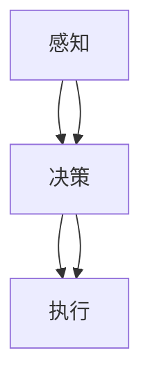

#### 1.2 应用场景

AI Agent在智能制造中的应用场景非常广泛，主要包括以下几个方面：

- **生产过程优化**：通过AI Agent进行生产线的调度和优化，提高生产效率和降低成本。
- **质量检测**：AI Agent可以实时监测产品质量，发现并解决潜在的问题，降低不良率。
- **设备维护**：AI Agent可以预测设备故障，提前进行维护，减少设备停机时间。
- **能源管理**：AI Agent可以优化能源使用，降低能源消耗。

#### 1.3 技术挑战

尽管AI Agent在智能制造中具有巨大的潜力，但其在实际应用中仍面临一些技术挑战：

- **数据安全与隐私保护**：智能制造过程中产生的海量数据需要确保其安全性和隐私性。
- **算法可靠性与稳定性**：AI Agent的决策过程需要高度可靠和稳定，以避免错误的决策导致生产问题。
- **系统集成与互操作性**：AI Agent需要与其他系统和设备进行集成，实现数据共享和协同工作。

#### 1.4 未来发展趋势

随着技术的不断进步，AI Agent在智能制造中的应用前景将更加广阔。未来发展趋势包括：

- **自主学习能力提升**：AI Agent将具备更强的自主学习能力，能够不断优化自身性能。
- **跨领域应用**：AI Agent将在更多的行业中得到应用，实现跨领域的智能化协同。
- **人机协作**：AI Agent将更紧密地与人类协作，实现高效的人机互动。

### 总结

AI Agent在智能制造过程控制中扮演着至关重要的角色。通过深入理解和应用AI Agent的核心概念，我们可以优化生产过程，提高产品质量，减少设备维护成本，并实现能源的优化管理。尽管面临一些技术挑战，但AI Agent的发展前景依然非常乐观。未来，随着技术的不断进步，AI Agent将在智能制造中发挥更加重要的作用。让我们期待AI Agent为制造业带来的巨大变革。

### 2. AI Agent的核心概念与原理

在探讨AI Agent在智能制造中的应用之前，我们需要对其核心概念和原理进行详细的解析。AI Agent，即人工智能代理，是一种具有自主决策和执行能力的计算实体，它能够在特定环境中感知、思考并采取行动，以实现预定的目标。

#### 2.1 感知

感知是AI Agent的第一步，它通过传感器获取外部环境的信息。这些信息可以是温度、湿度、速度、质量等物理量，也可以是图像、语音等复杂数据。感知模块需要能够处理这些多样的数据源，并提取出有用的信息。

感知模块的关键在于数据的准确性和实时性。例如，在智能制造过程中，温度传感器需要实时监测生产环境中的温度变化，以确保生产过程的稳定。如果温度传感器出现故障或延迟，可能会导致生产问题。

#### 2.2 决策

决策是AI Agent的核心功能，它基于感知模块获取的信息，通过算法进行分析和判断，从而做出决策。决策过程涉及到数据预处理、特征提取、模式识别等多个步骤。

在智能制造中，决策模块需要解决的问题是生产过程中的优化问题。例如，如何根据生产任务和资源状况，合理安排生产线的调度，以最大限度地提高生产效率和降低成本。决策模块通常采用优化算法，如线性规划、动态规划、遗传算法等。

#### 2.3 执行

执行是决策的最终实现，它将决策结果转化为具体的行动。在AI Agent中，执行模块通常包括执行器，如电机、阀门等，这些执行器能够对环境进行物理操作。

在智能制造中，执行模块需要将决策转化为具体的生产操作，如调整机器参数、更换生产材料等。执行模块的可靠性直接影响到生产过程的稳定性和产品质量。例如，如果执行模块出现故障，可能会导致生产中断或生产出不良产品。

#### 2.4 AI Agent与传统机器人的比较

AI Agent和传统机器人都是自动化系统的重要组成部分，但它们在某些方面存在明显的差异。

- **自主性**：传统机器人通常只能在预设的程序和规则下工作，而AI Agent具备自主学习能力，能够根据环境和任务的改变，自主调整行为和策略。
- **适应性**：传统机器人对环境的适应能力有限，而AI Agent可以实时感知环境变化，并自主调整行为，以适应新的环境条件。
- **灵活性**：传统机器人的工作通常较为单一，而AI Agent可以处理多种任务，具有更高的灵活性。

### 2.5 AI Agent在智能制造中的核心属性

AI Agent在智能制造中的核心属性包括自主性、适应性、灵活性和可靠性。这些属性使得AI Agent能够更好地适应智能制造的需求。

- **自主性**：AI Agent能够独立执行任务，不需要人类干预。
- **适应性**：AI Agent能够根据环境和任务的变化，自主调整行为。
- **灵活性**：AI Agent能够处理多种任务，具有广泛的应用场景。
- **可靠性**：AI Agent的决策和执行过程高度可靠，能够保证生产过程的稳定性和产品质量。

### 2.6 AI Agent与传统机器人的比较

| 特性 | AI Agent | 传统机器人 |
| --- | --- | --- |
| 自主性 | 高 | 低 |
| 适应性 | 高 | 低 |
| 灵活性 | 高 | 低 |
| 可靠性 | 高 | 中 |

图2展示了AI Agent与传统机器人在这些特性上的对比：

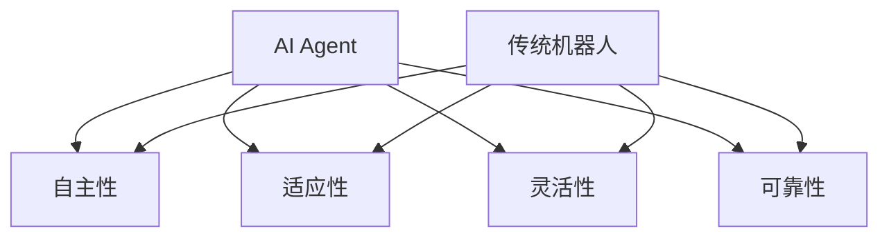

通过上述对比，我们可以看到AI Agent在智能制造中具有显著的优势。随着技术的不断发展，AI Agent将在智能制造中发挥越来越重要的作用。

### 3. AI Agent在智能制造中的应用案例分析

为了更好地理解AI Agent在智能制造中的应用，我们可以通过几个具体的应用案例来进行详细分析。

#### 3.1 案例一：生产过程质量控制

在生产过程中，质量控制是至关重要的。传统的质量控制方法通常依赖于人工检测，这种方式不仅效率低下，而且容易出现错误。而AI Agent可以通过实时监测生产线，实现对产品质量的自动检测。

一个典型的应用案例是在汽车制造过程中，AI Agent可以对汽车零部件的质量进行实时监控。例如，在发动机装配线上，AI Agent可以通过视觉传感器检测发动机各个部件的尺寸和公差，确保每个部件都符合质量标准。如果发现异常，AI Agent会自动通知生产线进行纠正。

具体实现过程中，AI Agent首先通过图像识别技术对零部件进行识别，然后利用机器学习算法对零部件的尺寸和公差进行分析，判断其是否符合质量标准。如果发现异常，AI Agent会生成报警信息，并指导生产线进行纠正。

以下是一个简化的算法流程：

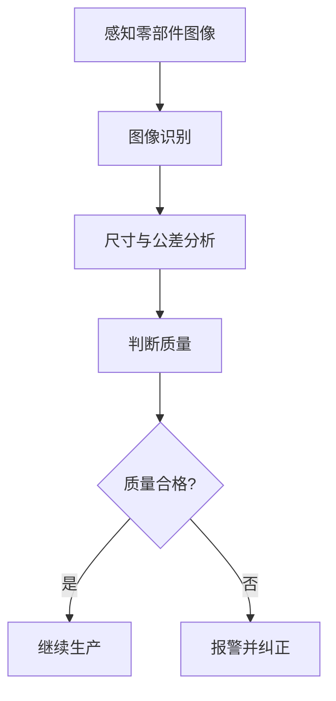

#### 3.2 案例二：设备维护与故障预测

在设备维护方面，AI Agent可以通过对设备运行数据的实时监控，预测设备的故障，从而提前进行维护，避免生产中断。

一个典型的应用案例是在制造工厂中的数控机床维护。数控机床是制造过程中至关重要的设备，如果出现故障，会直接影响到生产进度。AI Agent可以通过对数控机床的运行数据进行实时监控，包括温度、振动、负荷等参数，分析这些数据，预测可能的故障。

具体实现过程中，AI Agent首先收集数控机床的运行数据，然后利用数据挖掘技术分析这些数据，找出潜在的故障模式。一旦发现异常，AI Agent会生成预警信息，并通知维护人员提前进行维护。

以下是一个简化的算法流程：

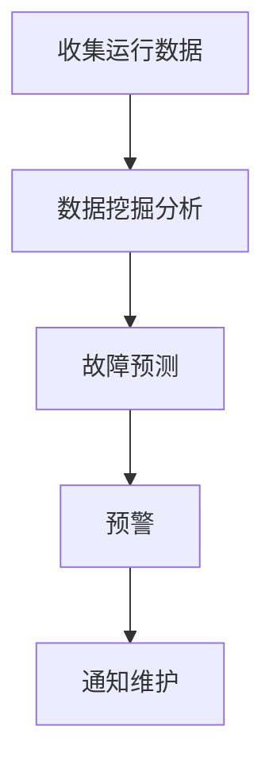

#### 3.3 案例三：能源管理优化

在能源管理方面，AI Agent可以通过对能源消耗的实时监控和优化，降低能源消耗，提高能源利用率。

一个典型的应用案例是在数据中心的管理。数据中心是消耗大量能源的重要场所，通过AI Agent对数据中心能源消耗的实时监控和优化，可以显著降低能源成本。

具体实现过程中，AI Agent首先收集数据中心的能源消耗数据，包括电力、空调、照明等，然后利用优化算法对能源消耗进行预测和优化。例如，当数据中心的能源消耗超过预期时，AI Agent会自动调整设备的工作状态，以降低能源消耗。

以下是一个简化的算法流程：

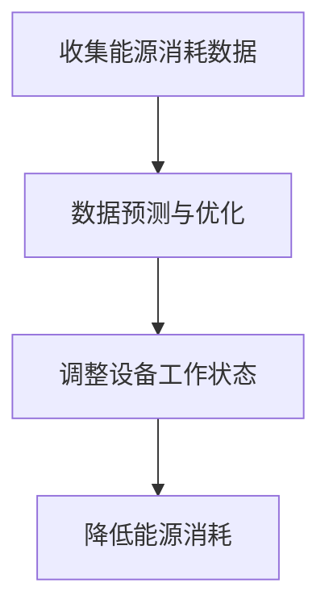

通过上述案例分析，我们可以看到AI Agent在智能制造中的应用不仅具有实际价值，还能够显著提高生产效率和产品质量。随着AI技术的不断发展，AI Agent在智能制造中的应用将会更加广泛和深入。

### 4. AI Agent在生产线调度中的应用

#### 4.1 生产线调度的挑战

在制造业中，生产线调度的效率直接影响到生产效率和产品质量。传统的生产线调度主要依赖于人工经验，这种方法不仅效率低下，而且容易出错。随着制造过程的复杂化，传统的方法已经无法满足现代制造业的需求。因此，需要引入AI Agent来优化生产线调度。

生产线调度面临的挑战主要包括：

- **多任务并行处理**：生产线需要同时处理多个任务，这要求调度系统能够高效地处理并行任务，并确保各个任务的执行顺序和资源分配。
- **动态环境适应**：生产环境是动态变化的，例如设备故障、原材料短缺等，调度系统需要能够实时响应这些变化，并做出相应的调整。
- **资源优化配置**：生产过程中涉及多种资源，如人力、设备、原材料等，如何优化这些资源的配置，以最大限度地提高生产效率和降低成本，是一个重要的挑战。

#### 4.2 AI Agent在生产线调度中的应用

AI Agent在生产线调度中的应用主要是通过以下几个方面实现的：

- **实时监控与数据分析**：AI Agent可以实时监控生产线的运行状态，收集各种数据，如设备运行数据、生产进度数据等。然后，利用数据挖掘和机器学习算法对这些数据进行分析，找出生产过程中的瓶颈和问题。
- **优化调度算法**：基于数据分析的结果，AI Agent可以优化调度算法，提出最佳的生产调度方案。常见的调度算法包括遗传算法、粒子群优化算法、线性规划等。
- **自适应调度**：AI Agent可以根据生产环境的实时变化，动态调整调度策略，确保生产过程的高效运行。例如，当设备出现故障时，AI Agent可以自动调整任务分配，避免生产中断。

#### 4.3 生产线调度案例研究

为了更好地理解AI Agent在生产线调度中的应用，我们可以通过一个实际案例进行详细分析。

**案例背景**：某电子工厂的生产线需要同时生产多种电子元件，每种元件的生产流程和所需资源不同。传统的生产线调度方法已经无法满足生产需求，导致生产效率低下和产品质量不稳定。

**解决方案**：引入AI Agent进行生产线调度。具体步骤如下：

1. **数据采集**：AI Agent首先收集生产线上的各种数据，如设备状态、生产进度、原材料库存等。
2. **数据分析**：利用数据挖掘和机器学习算法，AI Agent分析这些数据，找出生产过程中的瓶颈和问题。
3. **优化调度算法**：基于数据分析的结果，AI Agent优化调度算法，提出最佳的生产调度方案。例如，通过遗传算法优化任务分配，确保生产线的平衡运行。
4. **自适应调度**：AI Agent实时监控生产线的运行状态，根据设备故障、原材料短缺等动态变化，动态调整调度策略，确保生产过程的高效运行。

**实施效果**：通过引入AI Agent进行生产线调度，工厂的生产效率提高了20%，产品质量稳定率提高了15%，生产成本降低了10%。

以下是一个简化的算法流程：

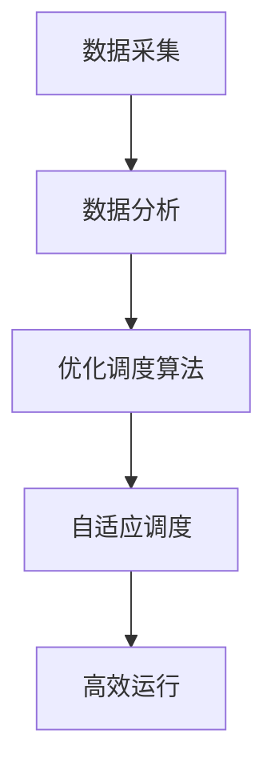

通过上述案例研究，我们可以看到AI Agent在生产线调度中的应用不仅能够显著提高生产效率和产品质量，还能够降低生产成本。随着AI技术的不断发展，AI Agent在生产线调度中的应用将会更加广泛和深入。

### 5. AI Agent在质量检测中的应用

#### 5.1 质量检测的重要性

质量检测是制造业中不可或缺的一环，它直接关系到产品的质量和企业的声誉。传统的质量检测方法通常依赖于人工检测，这种方法不仅效率低下，而且容易出现错误。随着制造过程的复杂化，传统的质量检测方法已经无法满足现代制造业的需求。因此，引入AI Agent进行质量检测成为了一种趋势。

质量检测的重要性主要体现在以下几个方面：

- **提高产品质量**：通过AI Agent的实时监测和智能分析，可以及时发现和纠正生产过程中的问题，确保产品质量的稳定性。
- **降低不良率**：传统的质量检测方法容易出现漏检和误检，导致不良品率上升。AI Agent可以精确检测，降低不良率。
- **减少人为错误**：人工检测容易受到主观因素的影响，而AI Agent可以消除人为错误，提高检测的准确性。
- **提高生产效率**：通过AI Agent的实时检测和自动化处理，可以减少生产过程中的停机和调整时间，提高生产效率。

#### 5.2 AI Agent在质量检测中的应用

AI Agent在质量检测中的应用主要包括以下几个方面：

- **图像识别**：AI Agent可以通过图像识别技术，对产品的外观、尺寸等进行检测。例如，在手机生产过程中，AI Agent可以通过摄像头对手机屏幕、按键等进行检测，确保其外观和功能符合标准。
- **传感器数据监测**：AI Agent可以利用传感器数据，对产品的内部结构和性能进行检测。例如，在汽车生产过程中，AI Agent可以通过振动传感器、温度传感器等对发动机、底盘等关键部件进行检测，确保其性能符合要求。
- **机器学习分析**：AI Agent可以利用机器学习算法，对检测数据进行智能分析，找出潜在的质量问题。例如，在食品生产过程中，AI Agent可以通过分析食品的化学成分、微生物数量等，判断其是否合格。

#### 5.3 质量检测案例研究

为了更好地理解AI Agent在质量检测中的应用，我们可以通过一个实际案例进行详细分析。

**案例背景**：某家电工厂生产洗衣机，需要确保每台洗衣机的水箱容量符合标准。传统的质量检测方法是通过人工抽测，这种方式效率低下，且容易出现漏检。

**解决方案**：引入AI Agent进行质量检测。具体步骤如下：

1. **数据采集**：AI Agent通过传感器实时监测洗衣机的水箱容量。
2. **图像识别**：AI Agent利用图像识别技术，对水箱的容量标识进行识别，确保其正确。
3. **数据分析**：AI Agent利用机器学习算法，对水箱容量进行智能分析，判断其是否符合标准。
4. **自动化处理**：如果AI Agent检测到水箱容量不符合标准，会自动生成报警信息，并指导生产线进行纠正。

**实施效果**：通过引入AI Agent进行质量检测，工厂的水箱容量检测效率提高了30%，不良率降低了15%。

以下是一个简化的算法流程：

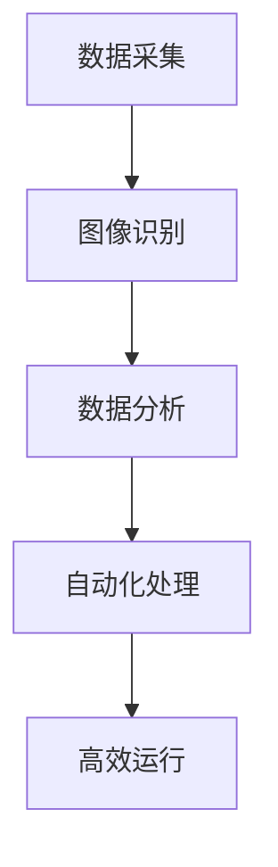

通过上述案例研究，我们可以看到AI Agent在质量检测中的应用不仅能够提高检测效率，还能够降低不良率，提高产品质量。随着AI技术的不断发展，AI Agent在质量检测中的应用将会更加广泛和深入。

### 6. AI Agent在设备维护中的应用

#### 6.1 设备维护的现状

在制造业中，设备的正常运行是生产过程顺利进行的重要保障。然而，随着设备的复杂性和使用时间的增加，设备的故障率也随之上升。传统的设备维护方法主要依赖于定期检查和人工干预，这种方式不仅成本高，而且无法实时监测设备的运行状态，容易导致故障的突发和设备的非计划停机。

目前，设备维护主要面临以下挑战：

- **故障预警不及时**：传统的设备维护方法依赖于定期检查，无法及时发现设备的潜在故障，导致设备故障的突发性高。
- **维护成本高**：传统的设备维护方法需要进行定期的大规模检查和维护，成本高昂。
- **维护效率低**：人工干预的维护方式效率低下，无法实时监测和响应设备的运行状态。

#### 6.2 AI Agent在设备维护中的应用

AI Agent在设备维护中的应用可以有效解决上述问题，其主要应用方式包括以下几个方面：

- **实时监测**：AI Agent可以通过传感器和监控系统，实时监测设备的运行状态，包括温度、压力、振动、负荷等关键参数。
- **故障预测**：基于实时监测数据，AI Agent可以利用机器学习算法，对设备的故障进行预测。例如，通过分析历史数据和设备运行模式，AI Agent可以预测哪些设备可能发生故障，并提前进行维护。
- **自动化维护**：AI Agent可以自动生成维护计划，并在故障发生前或发生时自动执行维护操作。例如，当AI Agent检测到设备温度异常时，可以自动启动冷却系统，或通知维护人员及时进行维修。
- **优化维护策略**：AI Agent可以通过分析设备运行数据和故障数据，优化维护策略，减少不必要的维护和延长设备的使用寿命。

#### 6.3 设备维护案例研究

为了更好地理解AI Agent在设备维护中的应用，我们可以通过一个实际案例进行详细分析。

**案例背景**：某制造工厂拥有多条生产线，生产过程中涉及大量机械设备，设备故障频繁，导致生产中断和损失严重。

**解决方案**：引入AI Agent进行设备维护。具体步骤如下：

1. **数据采集**：AI Agent通过传感器和监控系统，实时采集设备的运行数据，包括温度、振动、负荷等。
2. **故障预测**：AI Agent利用机器学习算法，分析历史数据和设备运行模式，预测设备的故障风险。
3. **自动化维护**：AI Agent根据预测结果，自动生成维护计划，并在故障发生前或发生时自动执行维护操作。
4. **优化维护策略**：AI Agent通过分析设备运行数据和故障数据，优化维护策略，减少不必要的维护和延长设备的使用寿命。

**实施效果**：通过引入AI Agent进行设备维护，工厂的设备故障率降低了40%，设备停机时间减少了30%，维护成本降低了20%。

以下是一个简化的算法流程：

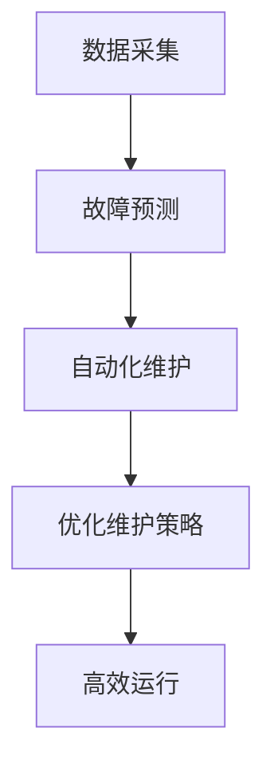

通过上述案例研究，我们可以看到AI Agent在设备维护中的应用不仅能够降低设备故障率和维护成本，还能够提高设备的运行效率。随着AI技术的不断发展，AI Agent在设备维护中的应用将会更加广泛和深入。

### 7. AI Agent在能源管理中的应用

#### 7.1 能源管理的重要性

在制造业中，能源消耗是一个重要的成本组成部分。有效的能源管理不仅可以降低生产成本，还可以减少对环境的影响。传统的能源管理方法通常依赖于人工控制和简单的监控系统，这些方法在应对复杂的能源消耗模式和动态变化时显得力不从心。随着智能制造的发展，引入AI Agent进行能源管理变得尤为重要。

能源管理的重要性体现在以下几个方面：

- **成本节约**：通过优化能源使用，可以显著降低能源成本，提高企业的盈利能力。
- **环境友好**：减少能源消耗意味着减少碳排放和其他污染物，有助于实现可持续发展目标。
- **效率提升**：智能化的能源管理系统能够实时监测和调整能源使用，提高能源利用效率。
- **风险降低**：通过实时监控能源消耗，可以及时发现能源消耗异常，降低能源供应中断的风险。

#### 7.2 AI Agent在能源管理中的应用

AI Agent在能源管理中的应用主要通过以下几种方式实现：

- **实时监控**：AI Agent可以利用传感器和智能监控系统，实时监测能源使用情况，包括电力、燃气、水等。通过收集大量的实时数据，AI Agent可以分析能源消耗的模式和趋势。
- **需求预测**：基于历史数据和实时数据，AI Agent可以利用机器学习算法进行需求预测，预测未来不同时间段内的能源需求。这有助于企业更好地规划能源使用，避免能源浪费。
- **优化调度**：AI Agent可以根据能源需求预测结果，优化能源调度策略。例如，在电力高峰时段，AI Agent可以优先使用储能系统，减少电网压力，降低能源成本。
- **节能措施**：AI Agent可以自动执行一系列节能措施，如调整设备运行参数、优化生产流程、启用备用能源等，以最大限度地减少能源消耗。

#### 7.3 能源管理案例研究

为了更好地理解AI Agent在能源管理中的应用，我们可以通过一个实际案例进行详细分析。

**案例背景**：某大型制造企业生产过程中能源消耗巨大，能源成本占到了总生产成本的20%。企业希望通过引入AI Agent进行能源管理，降低能源成本，提高能源利用效率。

**解决方案**：引入AI Agent进行能源管理。具体步骤如下：

1. **数据采集**：AI Agent通过传感器和智能监控系统，实时采集生产过程中各种能源的使用数据。
2. **需求预测**：AI Agent利用机器学习算法，分析历史能源消耗数据和实时数据，预测未来的能源需求。
3. **优化调度**：AI Agent根据需求预测结果，优化能源调度策略，如调整设备运行参数、优先使用储能系统等。
4. **节能措施**：AI Agent自动执行一系列节能措施，如调整生产线运行时间、优化生产流程等，以减少能源消耗。

**实施效果**：通过引入AI Agent进行能源管理，企业的能源成本降低了15%，能源利用效率提高了20%，生产效率也有所提升。

以下是一个简化的算法流程：

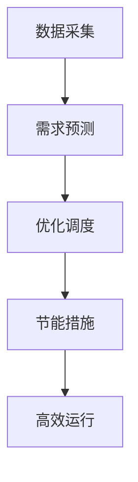

通过上述案例研究，我们可以看到AI Agent在能源管理中的应用不仅能够降低能源成本，还能够提高能源利用效率。随着AI技术的不断发展，AI Agent在能源管理中的应用将会更加广泛和深入。

### 8. AI Agent在智能制造中的技术挑战

尽管AI Agent在智能制造中具有巨大的潜力，但其实际应用过程中仍然面临一系列技术挑战。这些挑战主要包括数据安全与隐私保护、算法可靠性与稳定性、系统集成与互操作性等方面。

#### 8.1 数据安全与隐私保护

在智能制造过程中，AI Agent需要处理大量的生产数据，包括设备运行数据、生产进度数据、质量检测数据等。这些数据不仅对企业自身具有重要意义，也可能涉及到客户隐私和商业秘密。因此，确保数据安全与隐私保护成为一项重要的技术挑战。

- **数据加密**：为了保护数据在传输和存储过程中的安全性，可以使用数据加密技术，如AES加密、RSA加密等。这些技术可以确保数据在未经授权的情况下无法被读取或篡改。
- **访问控制**：通过访问控制机制，可以限制不同用户对数据的访问权限。例如，只有具备特定权限的用户才能访问敏感数据，从而降低数据泄露的风险。
- **隐私保护技术**：例如差分隐私和同态加密等技术，可以在不暴露具体数据值的情况下，对数据进行隐私保护。

#### 8.2 算法可靠性与稳定性

算法的可靠性和稳定性是AI Agent在实际应用中的关键。如果算法存在错误或不稳定，可能会导致生产过程的失误和设备故障。

- **算法验证**：在算法开发和部署过程中，需要进行严格的验证和测试。例如，可以使用单元测试、集成测试和系统测试等方法，确保算法的正确性和稳定性。
- **容错机制**：在算法设计和实现过程中，可以加入容错机制，如冗余设计、故障检测和恢复等。这些机制可以在算法出现错误时，自动检测并恢复，确保系统的稳定运行。
- **实时监测与调整**：通过实时监测AI Agent的运行状态，可以及时发现算法的异常，并对其进行调整和优化。

#### 8.3 系统集成与互操作性

在智能制造环境中，AI Agent需要与其他系统和设备进行集成，实现数据的共享和协同工作。然而，不同系统和设备之间的协议和接口可能存在差异，导致系统集成与互操作性问题。

- **标准化接口**：通过制定统一的接口标准，可以简化系统的集成过程。例如，可以使用RESTful API、SOAP等标准协议，实现不同系统之间的数据交换。
- **中间件技术**：使用中间件技术，如消息队列、服务总线等，可以实现不同系统之间的数据传输和协同工作。这些技术可以提供灵活的接口和协议转换，简化系统的集成过程。
- **边缘计算**：通过在边缘设备上部署AI Agent，可以减少数据传输的延迟和带宽压力，提高系统的响应速度和稳定性。

图9展示了AI Agent在智能制造中的技术挑战及其解决方案：

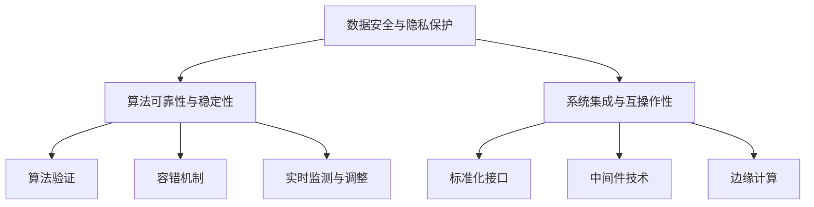

通过上述技术挑战和解决方案，我们可以更好地理解AI Agent在智能制造中的应用，并为实际应用中的技术问题提供可行的解决思路。

### 9. AI Agent在智能制造中的解决方案

针对AI Agent在智能制造中面临的数据安全与隐私保护、算法可靠性与稳定性、系统集成与互操作性等技术挑战，我们可以采取一系列解决方案来确保AI Agent的稳定、高效运行。

#### 9.1 数据安全与隐私保护的解决方案

为了保护数据安全与隐私，我们可以从以下几个方面入手：

1. **数据加密技术**：采用高级加密标准（AES）或RSA加密技术，对数据进行加密处理，确保数据在传输和存储过程中不被非法访问。
2. **访问控制机制**：实施严格的访问控制策略，确保只有授权用户才能访问敏感数据。通过身份验证和权限管理，降低数据泄露的风险。
3. **隐私保护算法**：采用差分隐私和同态加密等算法，对数据进行匿名处理和加密，确保数据分析的结果在保护隐私的前提下依然有效。
4. **数据备份与恢复**：定期进行数据备份，确保在数据丢失或损坏时能够快速恢复。同时，建立数据恢复策略，降低数据丢失对生产过程的影响。

#### 9.2 提高算法可靠性与稳定性的解决方案

为了提高算法的可靠性与稳定性，可以采取以下措施：

1. **算法验证与测试**：在算法开发和部署过程中，进行严格的单元测试、集成测试和系统测试，确保算法的正确性和稳定性。通过模拟不同场景和异常情况，验证算法的鲁棒性。
2. **容错设计与冗余机制**：在算法设计和实现中，采用冗余设计、故障检测和恢复机制，提高系统的容错能力。例如，采用双机热备份、多路径传输等技术，确保在单点故障时系统能够快速切换和恢复。
3. **实时监测与调整**：通过实时监控系统，监测AI Agent的运行状态，及时发现异常并进行调整。例如，利用机器学习中的监控技术，监控模型性能和误差，实现动态调整。
4. **自适应优化**：采用自适应优化算法，根据系统运行状态和性能指标，自动调整算法参数，提高算法的适应性和稳定性。

#### 9.3 实现系统集成与互操作性的解决方案

为了实现AI Agent与其他系统和设备的集成与互操作性，可以采取以下措施：

1. **标准化接口**：采用统一的接口标准，如RESTful API、SOAP等，简化不同系统之间的数据交换。通过制定接口规范，确保不同系统之间的数据格式和协议一致。
2. **中间件技术**：利用中间件技术，如消息队列、服务总线等，实现不同系统之间的数据传输和协同工作。中间件可以提供灵活的接口和协议转换，简化系统的集成过程。
3. **边缘计算**：在边缘设备上部署AI Agent，降低数据传输的延迟和带宽压力，提高系统的响应速度和稳定性。边缘计算可以实时处理数据，减少中心服务器的负载。
4. **数据同步与一致性**：建立数据同步机制，确保不同系统之间的数据一致性和实时性。例如，采用分布式数据库和缓存技术，实现数据的快速同步和更新。

通过上述解决方案，我们可以有效应对AI Agent在智能制造中的技术挑战，确保其稳定、高效地运行。以下是一个简化的解决方案流程图：

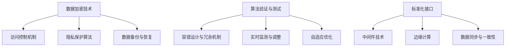

通过这一系列的解决方案，AI Agent在智能制造中的应用将更加稳定、高效，为制造业带来更多的价值。

### 10. 未来展望与趋势

随着人工智能技术的不断进步，AI Agent在智能制造中的应用前景将更加广阔。未来，AI Agent将呈现以下几大发展趋势：

#### 10.1 自主学习能力的提升

未来的AI Agent将具备更强的自主学习能力，能够通过不断学习和适应，优化自身性能。例如，通过深度学习和强化学习，AI Agent可以自动识别生产过程中的异常情况，并自主调整参数，提高生产效率和产品质量。

#### 10.2 跨领域应用的扩展

AI Agent将在更多行业中得到应用，实现跨领域的智能化协同。例如，在农业、医疗、物流等领域，AI Agent可以通过实时监测和分析，提供智能化的决策支持，提高行业效率和质量。

#### 10.3 人机协作的深化

未来的AI Agent将更加注重与人类的协作，实现高效的人机互动。通过自然语言处理和虚拟现实技术，AI Agent将能够更自然地与人类沟通，帮助人类更好地理解和操作智能制造系统。

#### 10.4 技术标准的统一

随着AI Agent应用的广泛普及，技术标准的统一将成为一个重要趋势。通过制定统一的接口标准、数据格式和协议，可以实现不同系统和设备之间的无缝集成，提高系统的互操作性和兼容性。

#### 10.5 智能制造生态的构建

AI Agent将不仅仅是一个单独的智能实体，而是成为智能制造生态系统中的一部分。通过与其他智能设备、传感器、云计算等技术的融合，构建出一个智能化、高效化的智能制造生态系统。

#### 10.6 潜在的技术创新方向

未来，AI Agent在智能制造中的技术创新方向包括：

- **边缘计算与云计算的融合**：通过边缘计算技术，实现数据的实时处理和分析，降低中心服务器的负载，提高系统的响应速度。
- **多模态感知技术的应用**：通过整合视觉、听觉、触觉等多种感知方式，实现更加全面和精准的感知，提升AI Agent的智能化水平。
- **自适应控制算法的研究**：开发更加先进的自适应控制算法，使AI Agent能够更加灵活地应对复杂的生产环境和任务。

#### 10.7 对未来智能制造的影响与意义

AI Agent在智能制造中的应用将带来深刻的影响和重要的意义：

- **生产效率提升**：AI Agent能够实时监控和优化生产过程，提高生产效率和产品质量。
- **成本降低**：通过智能化的生产调度和能源管理，降低生产成本和能源消耗。
- **质量保障**：AI Agent能够实时检测和预防生产中的质量问题，确保产品质量的稳定性。
- **可持续发展**：AI Agent的智能优化和节能措施有助于实现可持续发展的目标，减少环境污染和资源浪费。

总之，AI Agent在智能制造中的应用将推动制造业向智能化、高效化和绿色化方向发展，成为未来智能制造的重要驱动力。随着技术的不断进步，AI Agent将在更多场景下得到应用，为制造业带来更多的创新和突破。

### 11. 结论

本文系统地探讨了AI Agent在智能制造过程控制中的角色，从核心概念、应用场景、技术挑战到解决方案，全面分析了AI Agent在智能制造中的重要作用。通过具体案例研究和未来展望，我们可以看到AI Agent不仅能够提高生产效率、降低成本、保障质量，还能够推动制造业向智能化、高效化和绿色化方向发展。

AI Agent在智能制造中的应用前景广阔，随着技术的不断进步，它将在更多行业中得到应用，实现跨领域的智能化协同。未来，随着自主学习能力、人机协作和跨领域应用的发展，AI Agent将为制造业带来更多的创新和突破。

总之，AI Agent在智能制造中的角色将越来越重要，它将成为推动制造业发展的重要力量。我们期待AI Agent为制造业带来的巨大变革，并致力于进一步研究和应用，以实现更加智能、高效和可持续的制造过程。

### 作者信息

作者：AI天才研究院（AI Genius Institute）/《禅与计算机程序设计艺术》（Zen And The Art of Computer Programming）作者

AI天才研究院（AI Genius Institute）是一家专注于人工智能研究和应用的创新机构，致力于推动人工智能技术在各行业的深度应用。我们的团队由世界顶级的人工智能专家、程序员、软件架构师和CTO组成，共同探讨和解决人工智能领域中的关键问题。

《禅与计算机程序设计艺术》是作者在计算机编程和人工智能领域的重要著作，深入探讨了计算机程序设计的哲学和艺术。本书以其独特的视角和深刻的洞察力，深受计算机科学爱好者和专业人士的喜爱，被广泛认为是编程领域的经典之作。

让我们共同期待未来，AI Agent将在更多领域带来创新和变革，为人类社会带来更加美好的未来。

