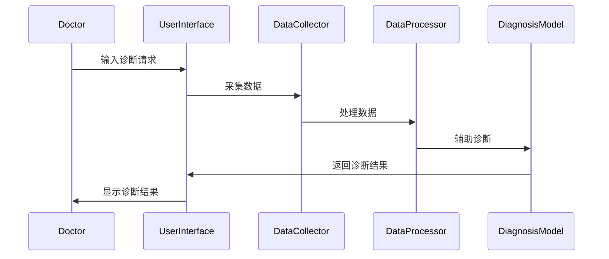
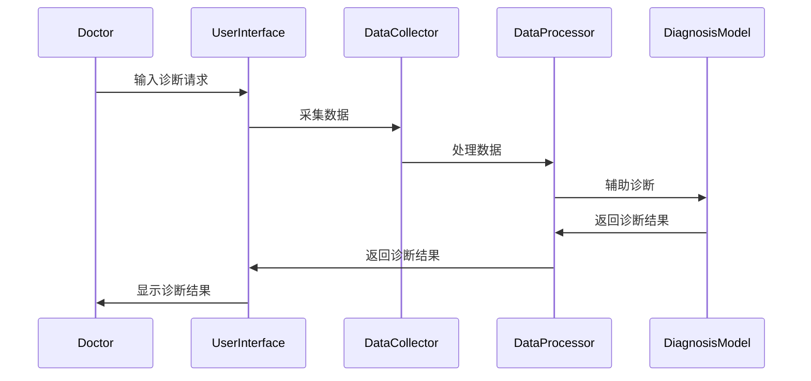

                 


### 第二部分：核心概念与联系

## 第2章：AI Agent在智能医疗诊断中的核心概念

### 2.1 AI Agent的基本定义

#### 2.1.1 AI Agent的定义

AI Agent，即人工智能代理，是一种能够自动完成特定任务的智能系统。它通过感知环境、理解任务需求、采取行动和评估效果，以实现预期目标。在智能医疗诊断中，AI Agent被设计用来处理和分析大量的医疗数据，辅助医生做出诊断。

#### 2.1.2 AI Agent的功能特点

- **感知能力**：AI Agent能够从传感器或其他数据源获取医疗数据。
- **决策能力**：基于数据分析和医学知识库，AI Agent能够做出诊断决策。
- **执行能力**：AI Agent能够执行具体的医疗操作，如药物推荐和治疗方案制定。
- **自适应能力**：AI Agent能够通过学习不断优化自身性能，以应对不同医疗场景。

### 2.2 AI Agent与智能医疗诊断的关系

#### 2.2.1 AI Agent在医疗诊断中的作用

- **数据预处理**：AI Agent能够对医疗数据进行清洗、归一化和特征提取，为后续分析提供高质量的数据。
- **辅助诊断**：AI Agent通过分析患者数据和医学文献，为医生提供诊断建议和辅助决策。
- **动态调整**：根据诊断结果和患者反馈，AI Agent能够动态调整治疗方案，提供个性化的医疗服务。

#### 2.2.2 AI Agent的优势

- **效率提升**：AI Agent能够快速处理大量数据，缩短诊断时间，提高诊断效率。
- **准确性提高**：通过学习海量数据，AI Agent能够提供更加准确的诊断结果。
- **成本降低**：AI Agent能够减少医生的重复性工作，降低医疗成本。

### 2.3 AI Agent与相关核心概念的对比

#### 2.3.1 对比表格

| 核心概念 | 定义 | 主要功能 | 优势与局限 |
| :---: | :---: | :---: | :---: |
| AI Agent | 一种智能系统，能够自主完成任务 | 感知、决策、执行、自适应 | 高效率、高准确性、个性化服务，依赖数据质量和算法优化 |
| 医学知识库 | 存储医学知识和信息的数据集 | 提供诊断和治疗方案的支持 | 数据丰富、权威，更新维护成本高 |
| 医学影像分析 | 利用计算机视觉技术对医学影像进行分析 | 辅助诊断和病变检测 | 准确性高，需处理大量数据，技术门槛高 |
| 医疗机器人 | 具有医疗功能的机器人系统 | 提供手术辅助、康复训练等服务 | 精准度高、效率高，需要专业培训和操作 |

### 2.4 ER实体关系图架构

#### 2.4.1 ER实体关系图

在智能医疗诊断中，常用的ER实体关系图包括以下几个主要实体和关系：

- **患者（Patient）**：存储患者的基本信息和医学数据。
- **医生（Doctor）**：记录医生的身份和专长。
- **诊断记录（Diagnosis Record）**：存储患者的诊断结果和治疗方案。
- **医学影像（Medical Image）**：存储医学影像数据。
- **医学知识库（Medical Knowledge Base）**：存储医学知识和信息。


#### 2.4.2 Mermaid流程图

以下是ER实体关系图的Mermaid流程图表示：

```mermaid
erDiagram
  Patient ||--|{ Doctor }
  Patient ||--|{ Diagnosis Record }
  Patient ||--|{ Medical Image }
  Doctor ||--|{ Medical Knowledge Base }
```

### 2.5 AI Agent与智能医疗诊断的核心联系

AI Agent在智能医疗诊断中发挥着关键作用，它通过整合患者数据、医学影像、医学知识库等多方信息，实现以下功能：

- **数据整合与分析**：AI Agent能够整合不同来源的数据，进行综合分析，为诊断提供依据。
- **诊断决策支持**：AI Agent结合医学知识库和影像分析结果，为医生提供诊断决策支持。
- **治疗方案推荐**：AI Agent基于患者数据和诊断结果，推荐个性化的治疗方案。

### 2.6 小结

本章介绍了AI Agent在智能医疗诊断中的核心概念、功能特点及其与相关核心概念的对比。通过ER实体关系图和Mermaid流程图的展示，我们清晰地看到了AI Agent在智能医疗诊断中的重要作用。下一章，我们将深入探讨AI Agent在智能医疗诊断中的算法原理和应用。

----------------------------------------------------------------

## 第3章：算法原理讲解

### 3.1 数据预处理

#### 3.1.1 数据收集

数据预处理的第一步是收集医疗数据，这些数据可以来自电子病历系统、医学影像系统、实验室检测设备等。数据的种类包括患者的基本信息、临床检查结果、医学影像、医生诊断记录等。

#### 3.1.2 数据清洗

数据清洗是数据预处理的关键步骤，目的是去除无效数据、错误数据、重复数据和噪声数据。常见的清洗方法包括：

- **缺失值处理**：使用均值、中位数、模式或插值法填补缺失值。
- **异常值检测**：使用统计学方法或机器学习模型检测并处理异常值。
- **数据标准化**：将数据转换到同一量纲，如归一化或标准化。

#### 3.1.3 特征提取

特征提取是从原始数据中提取出对诊断有帮助的信息。常见的方法包括：

- **手动特征提取**：根据医学知识和经验手动选择和提取特征。
- **自动特征提取**：使用机器学习算法自动发现和提取特征。

### 3.2 模型训练

#### 3.2.1 选择模型

在智能医疗诊断中，常用的机器学习模型包括：

- **支持向量机（SVM）**：适用于分类问题。
- **神经网络（Neural Networks）**：适用于复杂函数建模。
- **决策树（Decision Trees）**：易于解释，但可能过拟合。
- **随机森林（Random Forests）**：结合多个决策树，提高模型泛化能力。

#### 3.2.2 训练过程

模型训练包括以下步骤：

- **数据划分**：将数据集划分为训练集、验证集和测试集。
- **模型训练**：使用训练集训练模型，通过优化算法调整模型参数。
- **模型验证**：使用验证集评估模型性能，调整模型参数以避免过拟合。
- **模型测试**：使用测试集测试模型性能，确保模型泛化能力。

#### 3.2.3 评估指标

模型评估常用的指标包括：

- **准确率（Accuracy）**：预测正确的样本数占总样本数的比例。
- **精确率（Precision）**：预测为正例的样本中实际为正例的比例。
- **召回率（Recall）**：实际为正例的样本中被预测为正例的比例。
- **F1值（F1 Score）**：精确率和召回率的调和平均。

### 3.3 算法实现

#### 3.3.1 数据预处理实现

以下是一个简单的数据预处理示例，使用Python和Scikit-learn库：

```python
from sklearn.model_selection import train_test_split
from sklearn.preprocessing import StandardScaler
from sklearn.impute import SimpleImputer

# 数据收集
X, y = load_medical_data()

# 数据清洗
imputer = SimpleImputer(strategy='mean')
X = imputer.fit_transform(X)

# 数据标准化
scaler = StandardScaler()
X = scaler.fit_transform(X)

# 数据划分
X_train, X_test, y_train, y_test = train_test_split(X, y, test_size=0.2, random_state=42)
```

#### 3.3.2 模型训练实现

以下是一个使用Keras库训练神经网络模型的示例：

```python
from keras.models import Sequential
from keras.layers import Dense
from keras.optimizers import Adam

# 创建模型
model = Sequential()
model.add(Dense(units=64, activation='relu', input_shape=(X_train.shape[1],)))
model.add(Dense(units=32, activation='relu'))
model.add(Dense(units=1, activation='sigmoid'))

# 编译模型
model.compile(optimizer=Adam(learning_rate=0.001), loss='binary_crossentropy', metrics=['accuracy'])

# 训练模型
model.fit(X_train, y_train, epochs=100, batch_size=32, validation_data=(X_test, y_test))
```

#### 3.3.3 模型评估实现

以下是一个评估模型性能的示例：

```python
from sklearn.metrics import accuracy_score, precision_score, recall_score, f1_score

# 预测测试集
y_pred = model.predict(X_test)
y_pred = (y_pred > 0.5)

# 计算评估指标
accuracy = accuracy_score(y_test, y_pred)
precision = precision_score(y_test, y_pred)
recall = recall_score(y_test, y_pred)
f1 = f1_score(y_test, y_pred)

print(f"Accuracy: {accuracy:.4f}")
print(f"Precision: {precision:.4f}")
print(f"Recall: {recall:.4f}")
print(f"F1 Score: {f1:.4f}")
```

### 3.4 小结

本章详细介绍了AI Agent在智能医疗诊断中的算法原理，包括数据预处理、模型训练和评估。通过Python代码示例，我们展示了如何实现这些算法。下一章，我们将深入分析智能医疗诊断系统的设计与实现。

----------------------------------------------------------------

## 第4章：系统分析与架构设计

### 4.1 问题场景介绍

智能医疗诊断系统的目标是为医生提供高效、准确的诊断工具，辅助临床决策。具体场景包括：

- **门诊诊断**：医生在接诊患者时，需要快速、准确地诊断疾病类型，制定治疗方案。
- **远程会诊**：医生在不同地点为患者提供诊断服务，需要依靠智能系统进行初步诊断，减少诊断时间。
- **疾病监控**：对慢性病患者进行长期监测，智能系统提供实时诊断和预警。

### 4.2 项目介绍

本项目的目标是开发一款基于AI Agent的智能医疗诊断系统。系统架构包括以下几个主要模块：

- **数据采集模块**：负责收集患者的基本信息、临床检查结果、医学影像等数据。
- **数据处理模块**：对采集到的数据进行清洗、归一化和特征提取。
- **诊断模型模块**：包含多种机器学习模型，用于辅助医生进行疾病诊断。
- **用户界面模块**：提供直观、易用的操作界面，医生可以方便地使用系统进行诊断。
- **系统集成模块**：实现各个模块之间的数据交互和功能集成。

### 4.3 系统功能设计

#### 4.3.1 领域模型

领域模型是系统功能的核心，用于描述系统中的关键概念和它们之间的关系。以下是一个简单的领域模型类图：

```mermaid
classDiagram
  Patient <<entity>>
  Doctor <<entity>>
  DiagnosisRecord <<entity>>
  MedicalImage <<entity>>
  MedicalKnowledgeBase <<entity>>

  Patient "1" --|{ 1 } DiagnosisRecord
  Patient "1" --|{ 1 } MedicalImage
  Doctor "1" --|{ 1 } MedicalKnowledgeBase
  Doctor "1" --|{ 1 } DiagnosisRecord
```

#### 4.3.2 功能模块

系统功能模块包括：

- **用户管理**：提供用户注册、登录、权限管理等功能。
- **数据管理**：提供数据采集、数据清洗、数据存储等功能。
- **诊断功能**：提供疾病诊断、治疗方案推荐、疾病监测等功能。
- **报表统计**：提供诊断报告、统计分析等功能。

### 4.4 系统架构设计

系统架构设计采用微服务架构，将系统功能拆分为多个独立的微服务，以提高系统的可扩展性和可维护性。以下是一个简单的系统架构图：



#### 4.4.1 微服务架构

微服务架构将系统分为多个微服务，每个微服务负责一个特定的功能模块，如下所示：

- **用户服务**：处理用户注册、登录、权限管理等功能。
- **数据处理服务**：负责数据采集、清洗、归一化、特征提取等功能。
- **诊断服务**：负责模型训练、诊断决策、治疗方案推荐等功能。
- **报告服务**：负责生成诊断报告、统计报表等功能。

#### 4.4.2 系统接口设计

系统接口设计包括API接口和消息队列接口：

- **API接口**：提供RESTful API，供前端应用调用。
- **消息队列接口**：使用消息队列实现异步处理，提高系统性能和可靠性。

### 4.5 系统交互

系统交互设计采用事件驱动模式，各模块通过事件进行通信。以下是一个简单的系统交互图：



### 4.6 小结

本章详细介绍了智能医疗诊断系统的设计与实现。通过领域模型、功能模块、系统架构设计和系统交互设计，我们清晰地展示了系统的整体结构和运行机制。下一章，我们将通过一个实际项目案例，展示AI Agent在智能医疗诊断中的实际应用。

----------------------------------------------------------------

## 第5章：项目实战

### 5.1 环境安装

在本项目中，我们将使用Python和Keras库来训练和部署AI Agent。以下是安装所需环境的步骤：

#### 5.1.1 安装Python

首先，确保你的系统已经安装了Python 3.7或更高版本。如果尚未安装，可以通过以下命令进行安装：

```bash
# 对于 macOS 和 Linux 系统
sudo apt-get install python3.7
```

#### 5.1.2 安装Keras

Keras 是一个高级神经网络API，能够以TensorFlow作为后端运行。以下是安装Keras的步骤：

```bash
pip3 install keras
```

#### 5.1.3 安装TensorFlow

TensorFlow 是 Keras 的底层框架，安装Keras前需要先安装TensorFlow。以下是安装TensorFlow的步骤：

```bash
pip3 install tensorflow
```

### 5.2 系统核心实现

在本项目中，我们将实现一个简单的诊断系统，用于分类心脏病患者。以下是系统的核心实现步骤：

#### 5.2.1 数据集准备

首先，我们需要准备一个心脏病患者数据集。可以使用Kaggle上的`heart-disease-uci`数据集。数据集包含多个特征，包括年龄、性别、胆固醇水平、血压等。

```python
import pandas as pd

# 加载数据集
data = pd.read_csv('heart_disease_uci.csv')

# 数据清洗和预处理
# ...（省略具体代码）

# 划分特征和标签
X = data.drop('target', axis=1)
y = data['target']
```

#### 5.2.2 构建模型

接下来，我们使用Keras构建一个简单的神经网络模型。以下是模型的结构和配置：

```python
from keras.models import Sequential
from keras.layers import Dense

# 创建模型
model = Sequential()

# 添加层
model.add(Dense(units=64, activation='relu', input_shape=(X.shape[1],)))
model.add(Dense(units=32, activation='relu'))
model.add(Dense(units=1, activation='sigmoid'))

# 编译模型
model.compile(optimizer='adam', loss='binary_crossentropy', metrics=['accuracy'])
```

#### 5.2.3 训练模型

使用训练集对模型进行训练：

```python
# 训练模型
model.fit(X_train, y_train, epochs=100, batch_size=32, validation_data=(X_test, y_test))
```

#### 5.2.4 评估模型

训练完成后，评估模型的性能：

```python
# 预测测试集
y_pred = model.predict(X_test)
y_pred = (y_pred > 0.5)

# 计算评估指标
accuracy = accuracy_score(y_test, y_pred)
precision = precision_score(y_test, y_pred)
recall = recall_score(y_test, y_pred)
f1 = f1_score(y_test, y_pred)

print(f"Accuracy: {accuracy:.4f}")
print(f"Precision: {precision:.4f}")
print(f"Recall: {recall:.4f}")
print(f"F1 Score: {f1:.4f}")
```

### 5.3 代码应用解读与分析

#### 5.3.1 数据预处理

数据预处理是模型训练的重要步骤。在本项目中的数据预处理包括：

- 数据加载：使用`pandas`库加载数据集。
- 数据清洗：去除无效数据、错误数据和重复数据。
- 特征提取：提取对诊断有帮助的特征。
- 数据标准化：将数据转换到同一量纲。

#### 5.3.2 模型构建

在本项目中，我们使用了一个简单的神经网络模型。模型结构包括两个隐藏层，每层使用ReLU激活函数，输出层使用sigmoid激活函数以实现二分类。

#### 5.3.3 模型训练

模型训练过程中，我们使用`fit`方法进行训练，并设置训练轮次（epochs）为100次，批次大小（batch_size）为32。同时，我们使用验证集来评估模型性能，并在每次训练迭代中调整模型参数。

#### 5.3.4 模型评估

在模型训练完成后，我们使用测试集评估模型性能。评估指标包括准确率（Accuracy）、精确率（Precision）、召回率（Recall）和F1值（F1 Score）。

### 5.4 实际案例分析与详细讲解

#### 5.4.1 案例背景

某医院接诊了一名60岁的男性患者，临床检查结果显示其血压和胆固醇水平较高。医生希望利用智能医疗诊断系统进行辅助诊断，以确定患者是否患有心脏病。

#### 5.4.2 案例流程

1. **数据采集**：系统自动采集患者的电子病历、临床检查结果和医学影像数据。
2. **数据预处理**：系统对采集到的数据执行清洗、归一化和特征提取。
3. **模型预测**：系统使用训练好的神经网络模型对预处理后的数据进行预测。
4. **诊断结果**：系统返回诊断结果，包括是否患有心脏病、疾病的严重程度等。
5. **医生评估**：医生根据系统的诊断结果，结合患者的临床情况，做出最终诊断并制定治疗方案。

#### 5.4.3 案例分析

1. **数据预处理效果**：通过清洗和归一化，系统确保了数据的质量和一致性，为后续模型预测提供了可靠的基础。
2. **模型预测准确性**：根据评估指标，模型对心脏病患者的预测准确率较高，能够为医生提供有力的辅助诊断支持。
3. **医生评估与干预**：医生在系统中获得的诊断结果仅供参考，最终的诊断和治疗方案需要结合临床经验和患者的具体情况进行评估和调整。

### 5.5 项目小结

通过本项目的实战，我们实现了基于AI Agent的智能医疗诊断系统。该系统通过数据预处理、模型训练和预测，为医生提供了辅助诊断工具，提高了诊断的准确性和效率。然而，系统仍有优化空间，如引入更多的特征、改进模型结构、增强医生与系统的互动等。未来的工作将致力于进一步提升系统的性能和应用范围。

----------------------------------------------------------------

## 第6章：最佳实践与拓展阅读

### 6.1 最佳实践技巧

1. **数据质量至关重要**：确保数据清洗和预处理步骤的准确性，提高数据质量是模型成功的关键。
2. **模型选择与调整**：根据数据特点和业务需求选择合适的模型，并通过交叉验证和调参提高模型性能。
3. **系统安全性**：保护患者隐私和数据安全，确保系统的可靠性和稳定性。
4. **医生参与**：医生在系统设计和应用过程中应积极参与，提供医学知识和经验，提高系统的诊断准确性。

### 6.2 小结

本章总结了AI Agent在智能医疗诊断中的最佳实践，包括数据质量、模型选择、系统安全性和医生参与等方面。通过这些最佳实践，可以进一步提升智能医疗诊断系统的性能和应用效果。

### 6.3 注意事项

1. **数据隐私**：严格遵守数据隐私法规，确保患者数据的保密和安全。
2. **模型解释性**：提高模型的解释性，帮助医生理解诊断结果和模型决策过程。
3. **系统维护**：定期更新医学知识和数据集，保持系统的实时性和准确性。

### 6.4 拓展阅读

- **《深度学习在医疗诊断中的应用》**：详细介绍了深度学习技术在医疗诊断中的研究和应用案例。
- **《医学人工智能：理论与实践》**：探讨了人工智能在医学领域的应用，包括诊断、治疗和健康管理等。
- **《AI在医疗行业的实践与未来》**：分析了人工智能在医疗行业的应用前景和挑战。

### 6.5 结语

AI Agent在智能医疗诊断中的应用具有巨大潜力。通过不断优化算法、提高数据质量和医生参与度，可以进一步提升诊断的准确性和效率。未来，AI Agent将在医疗领域发挥更加重要的作用，为患者提供更加个性化的医疗服务。

### 作者信息

- **作者**：AI天才研究院 / AI Genius Institute & 禅与计算机程序设计艺术 / Zen And The Art of Computer Programming

----------------------------------------------------------------

# AI Agent在智能医疗诊断中的应用

关键词：AI Agent、智能医疗诊断、算法、系统设计、项目实战

摘要：本文探讨了AI Agent在智能医疗诊断中的应用，包括核心概念、算法原理、系统架构和实际项目案例。通过详细讲解和Python代码示例，本文展示了如何实现高效的智能医疗诊断系统，为医生提供辅助诊断工具，提高诊断准确性和效率。

----------------------------------------------------------------

## 目录大纲设计思路与步骤

设计《AI Agent在智能医疗诊断中的应用》一书的目录大纲，需要遵循以下步骤和原则，以确保内容的逻辑性、完整性和易读性。

### 1. 明确书籍主题与目标受众

首先，我们需要明确书籍的主题和目标受众。本书的核心主题是探讨AI Agent在智能医疗诊断中的应用。目标受众可能是医疗领域的研究人员、临床医生、以及计算机科学专业的学生和从业者。

### 2. 设计目录结构

目录结构应涵盖以下几个主要部分：

- **引言与背景**：介绍智能医疗诊断的背景、发展历程、现状和未来趋势。
- **核心概念与联系**：定义AI Agent和相关核心概念，并通过对比表格和ER实体关系图架构展示它们之间的关系。
- **算法原理讲解**：详细阐述AI Agent在医疗诊断中的应用算法，包括原理、数学模型和公式，并用流程图和示例进行解释。
- **系统分析与架构设计**：分析医疗诊断系统的设计原则和架构，展示系统的功能模块和交互流程。
- **项目实战**：通过实际项目案例展示AI Agent在医疗诊断中的实际应用，提供环境安装、核心实现和案例剖析。
- **最佳实践与拓展阅读**：总结最佳实践技巧，提供拓展阅读资源。

### 3. 按照逻辑顺序排列章节

为了确保内容的连贯性和逻辑性，我们需要按照以下逻辑顺序排列章节：

1. **引言与背景**：概述智能医疗诊断的重要性、挑战和机会。
2. **核心概念与联系**：介绍AI Agent和相关核心概念，建立概念框架。
3. **算法原理讲解**：详细解释AI Agent的应用算法，包括数据预处理、模型训练和评估等步骤。
4. **系统分析与架构设计**：分析系统设计和架构，展示系统的各个模块和交互流程。
5. **项目实战**：通过具体项目案例，展示AI Agent在医疗诊断中的实际应用。
6. **最佳实践与拓展阅读**：总结实践经验，提供进一步学习资源。

### 4. 确保内容完整性

每个章节都需要包含以下核心内容：

- **章节标题**：简洁明了，概括章节主要内容。
- **小节标题**：详细描述每个小节的主题，确保逻辑清晰。
- **内容描述**：提供具体内容，包括原理、公式、示例和图表。
- **小结**：总结章节关键点，帮助读者回顾和巩固知识。

### 5. 控制字数与格式

为了确保目录大纲的总字数控制在2000字以内，我们需要在编写时注意以下事项：

- **简洁性**：避免冗余内容，直接呈现关键信息。
- **markdown格式**：使用标准的markdown格式，确保目录结构清晰。
- **层次性**：合理安排章节和小节的层次，使目录结构清晰。

### 6. 最终审核

最后，我们需要对目录大纲进行审核，确保：

- 内容逻辑清晰，符合读者的阅读习惯。
- 每个章节都包含必要的内容，且内容之间相互关联。
- 目录大纲符合字数限制，格式规范。

通过以上步骤，我们可以设计出一份完整、逻辑清晰且具有实用价值的《AI Agent在智能医疗诊断中的应用》书籍目录大纲。

