                 

# AI Agent在智能合约审核中的应用

## 关键词

- AI Agent
- 智能合约
- 审核需求
- 应用实现
- 最佳实践

## 摘要

本文深入探讨了AI Agent在智能合约审核中的应用。首先，介绍了AI Agent和智能合约的基础知识，包括定义、分类、特点、工作原理等。随后，分析了智能合约审核的需求和挑战，提出了AI Agent在智能合约审核中的应用框架。文章详细阐述了AI Agent在合约漏洞检测、安全性评估和合规性审查等方面的具体应用，并通过案例研究和最佳实践，展示了AI Agent在智能合约审核中的实际效果和未来发展趋势。

## 第一部分：AI Agent与智能合约基础

### 第1章：AI Agent概述

#### 1.1 AI Agent的定义与分类

AI Agent，即人工智能代理，是一种模拟人类智能行为的计算实体。它能够感知环境、制定计划、采取行动，并在行动中不断学习和优化。AI Agent可以按照不同的分类标准进行划分，如按照功能分类，可以分为数据采集Agent、决策Agent、执行Agent和交互Agent。

#### 1.2 AI Agent的核心特征与应用场景

AI Agent的核心特征包括自主性、适应性、协作性和学习能力。自主性使得AI Agent能够在没有人类干预的情况下独立执行任务；适应性使AI Agent能够根据环境变化调整行为；协作性使AI Agent能够与其他AI Agent或人类协作完成任务；学习能力使AI Agent能够从经验中学习，不断优化行为。

AI Agent的应用场景非常广泛，包括但不限于：智能推荐系统、自动驾驶、智能家居、机器人、智能客服等。

#### 1.3 AI Agent的技术基础

AI Agent的技术基础包括感知技术、决策技术、行动技术和学习技术。感知技术用于获取环境信息；决策技术用于根据感知到的信息制定行动策略；行动技术用于执行决策；学习技术用于从经验中学习，优化行为。

### 第2章：智能合约概述

#### 2.1 智能合约的定义与特点

智能合约是一种自动执行、管理和执行合同的计算机协议。它基于区块链技术，能够实现去中心化的执行和验证，具有不可篡改、透明、自动执行等特点。

#### 2.2 智能合约的工作原理

智能合约的工作原理包括以下步骤：合约编写、部署到区块链、触发执行、结果验证。合约编写阶段，开发人员使用智能合约编程语言（如Solidity）编写合约代码；部署阶段，合约被上传到区块链网络，并分配一个唯一的地址；触发执行阶段，当满足合约中的条件时，合约自动执行；结果验证阶段，合约执行结果由区块链网络中的节点验证，确保合约执行的合法性和正确性。

#### 2.3 智能合约的分类与典型应用

智能合约可以根据应用场景和功能进行分类，如支付合约、投票合约、供应链合约等。智能合约在金融、物流、医疗、法律等领域有广泛的应用，如去中心化金融（DeFi）、供应链管理、医疗记录管理、版权保护等。

### 第3章：智能合约审核的需求分析

#### 3.1 智能合约审核的重要性

智能合约审核对于确保智能合约的安全性和可靠性至关重要。由于智能合约一旦部署在区块链上，就无法修改，因此任何漏洞或错误都可能导致严重的经济损失和信任危机。因此，智能合约审核的需求显得尤为重要。

#### 3.2 智能合约审核的需求分析

智能合约审核的需求主要包括以下几个方面：

1. **安全性审查**：确保智能合约不存在漏洞，如智能合约漏洞（如Reentrancy、整数溢出等）和安全漏洞（如中间人攻击、拒绝服务攻击等）。
2. **合规性审查**：确保智能合约符合相关法律法规和行业标准，如金融监管要求、数据保护法规等。
3. **性能审查**：评估智能合约的性能，如执行速度、处理能力等。
4. **代码质量审查**：确保智能合约代码的规范性和可维护性。

#### 3.3 智能合约审核的挑战

智能合约审核面临以下挑战：

1. **代码复杂性**：智能合约代码复杂，涉及高级编程概念和智能合约特有的编程模式，使得审查变得更加困难。
2. **漏洞多样性**：智能合约可能存在多种漏洞，如逻辑漏洞、语法漏洞、安全漏洞等，使得审核工作难度增加。
3. **工具不足**：目前尚无完善的智能合约审核工具，现有工具的功能和性能也需进一步提高。
4. **法律法规和标准缺失**：智能合约审核的相关法律法规和标准尚不完善，影响了审核工作的规范性和有效性。

## 第二部分：AI Agent在智能合约审核中的应用实现

### 第4章：AI Agent在智能合约审核中的应用框架

#### 4.1 AI Agent在智能合约审核中的整体框架设计

AI Agent在智能合约审核中的应用框架主要包括以下几个模块：

1. **数据收集与预处理模块**：收集智能合约的源代码、相关文档和执行日志等数据，并进行预处理，如数据清洗、格式化等。
2. **特征提取与模型训练模块**：对预处理后的数据进行特征提取，构建特征向量，并使用机器学习算法训练模型。
3. **模型评估与优化模块**：对训练好的模型进行评估和优化，以提高模型的准确性和鲁棒性。
4. **合约审核模块**：使用训练好的模型对新的智能合约进行审核，包括漏洞检测、安全性评估和合规性审查等。

#### 4.2 数据收集与预处理

数据收集与预处理是智能合约审核的基础工作。数据收集主要包括以下几个方面：

1. **智能合约源代码**：从各种来源（如开源代码库、智能合约发布平台等）收集智能合约的源代码。
2. **相关文档**：收集与智能合约相关的文档，如需求文档、设计文档、测试报告等。
3. **执行日志**：收集智能合约在不同环境下的执行日志，用于分析合约的性能和稳定性。

数据预处理主要包括以下几个方面：

1. **数据清洗**：去除无效、重复和错误的数据。
2. **格式化**：将数据转换为统一的格式，便于后续处理。
3. **特征提取**：从原始数据中提取有用的信息，构建特征向量。

#### 4.3 特征提取与模型训练

特征提取是智能合约审核的关键步骤。特征提取的目的是从原始数据中提取出对智能合约审核有帮助的信息，构建特征向量。

常见的特征提取方法包括：

1. **语法特征**：提取智能合约代码的语法结构，如函数定义、变量声明、条件语句等。
2. **语义特征**：提取智能合约代码的语义信息，如函数调用、变量使用、逻辑关系等。
3. **执行特征**：提取智能合约执行过程中的信息，如执行时间、调用次数、执行结果等。

模型训练是智能合约审核的核心。常见的机器学习算法包括：

1. **决策树**：通过训练数据学习决策规则，对新合约进行分类和预测。
2. **支持向量机（SVM）**：通过训练数据找到最优分类超平面，对新合约进行分类和预测。
3. **神经网络**：通过训练数据学习复杂的非线性映射关系，对新合约进行分类和预测。

#### 4.4 模型评估与优化

模型评估是验证模型性能的重要步骤。常见的评估指标包括：

1. **准确率**：模型正确预测的样本数占总样本数的比例。
2. **召回率**：模型正确预测的样本数占实际正样本数的比例。
3. **F1值**：准确率和召回率的调和平均值。

模型优化是提高模型性能的重要手段。常见的优化方法包括：

1. **超参数调整**：调整模型的超参数，如学习率、迭代次数等，以提高模型的性能。
2. **数据增强**：通过生成新的训练数据或对现有数据进行变换，增加模型的泛化能力。
3. **模型集成**：使用多个模型组合预测，提高模型的稳定性和准确性。

### 第5章：AI Agent在智能合约审核中的具体应用

#### 5.1 合约漏洞检测

合约漏洞检测是智能合约审核的重要任务之一。AI Agent可以基于机器学习算法，对智能合约代码进行漏洞检测。

常见的漏洞类型包括：

1. **智能合约漏洞**：如Reentrancy、整数溢出、数组越界等。
2. **安全漏洞**：如中间人攻击、拒绝服务攻击等。

AI Agent的漏洞检测流程如下：

1. **特征提取**：提取智能合约代码的语法和语义特征。
2. **模型训练**：使用漏洞样本数据训练模型。
3. **漏洞检测**：使用训练好的模型对新的智能合约代码进行漏洞检测。

#### 5.2 合约安全性评估

合约安全性评估是确保智能合约在运行过程中不会受到恶意攻击的关键。AI Agent可以通过分析智能合约的代码和执行日志，评估合约的安全性。

常见的评估指标包括：

1. **攻击面**：评估智能合约可能受到的攻击类型和攻击点。
2. **安全性**：评估智能合约在执行过程中抵御攻击的能力。
3. **可恢复性**：评估智能合约在遭受攻击后恢复能力。

AI Agent的合约安全性评估流程如下：

1. **特征提取**：提取智能合约代码和执行日志的语法和语义特征。
2. **模型训练**：使用安全性样本数据训练模型。
3. **安全性评估**：使用训练好的模型对新的智能合约代码进行安全性评估。

#### 5.3 合约合规性审查

合约合规性审查是确保智能合约符合相关法律法规和行业标准的关键。AI Agent可以通过分析智能合约的代码和相关文档，审查合约的合规性。

常见的审查内容包括：

1. **金融监管要求**：如反洗钱（AML）、客户身份验证（KYC）等。
2. **数据保护法规**：如通用数据保护条例（GDPR）等。
3. **行业标准**：如金融科技协会（FSB）的标准等。

AI Agent的合约合规性审查流程如下：

1. **特征提取**：提取智能合约代码和相关文档的语法和语义特征。
2. **模型训练**：使用合规性样本数据训练模型。
3. **合规性审查**：使用训练好的模型对新的智能合约代码和相关文档进行合规性审查。

### 第6章：案例研究

#### 6.1 案例一：某大型金融公司的智能合约审核项目

某大型金融公司采用了AI Agent进行智能合约审核，具体实施过程如下：

1. **数据收集与预处理**：收集公司内部和开源平台上的智能合约源代码、相关文档和执行日志，并进行预处理。
2. **特征提取与模型训练**：提取智能合约代码和执行日志的语法和语义特征，并使用机器学习算法训练模型。
3. **模型评估与优化**：评估模型性能，并进行优化。
4. **合约审核**：使用训练好的模型对公司内部和外部提交的智能合约进行审核。

通过AI Agent的智能合约审核，公司有效提高了智能合约的安全性和合规性，降低了潜在风险。

#### 6.2 案例二：某区块链平台的智能合约审核案例

某区块链平台采用了AI Agent进行智能合约审核，具体实施过程如下：

1. **数据收集与预处理**：收集平台上所有智能合约的源代码、相关文档和执行日志，并进行预处理。
2. **特征提取与模型训练**：提取智能合约代码和执行日志的语法和语义特征，并使用机器学习算法训练模型。
3. **模型评估与优化**：评估模型性能，并进行优化。
4. **合约审核**：使用训练好的模型对平台上所有智能合约进行审核。

通过AI Agent的智能合约审核，平台有效提高了智能合约的安全性和合规性，增强了用户对平台的信任。

### 第7章：最佳实践与未来展望

#### 7.1 AI Agent在智能合约审核中的最佳实践

1. **数据质量和特征提取**：确保数据质量和特征提取的准确性，是智能合约审核的关键。
2. **模型选择和优化**：根据具体任务选择合适的机器学习算法，并进行优化，以提高模型的性能。
3. **持续学习和更新**：智能合约审核面临不断变化的风险和挑战，因此需要持续学习和更新模型。

#### 7.2 AI Agent在智能合约审核中的未来发展趋势

1. **自动化程度提高**：随着AI技术的发展，AI Agent在智能合约审核中的应用将更加自动化，减少人工干预。
2. **跨平台兼容性**：AI Agent将支持更多平台和编程语言，提高智能合约审核的兼容性。
3. **多语言支持**：AI Agent将支持多种编程语言，以满足不同开发者的需求。
4. **集成其他技术**：AI Agent将与其他技术（如区块链、云计算等）结合，提供更全面的智能合约审核解决方案。

### 附录：智能合约审核相关的开源工具与资源

1. **Slither**：一款基于Python的智能合约安全审计工具。
2. **Mythril**：一款基于Python的智能合约安全分析框架。
3. **Oyente**：一款基于C的智能合约形式化验证工具。
4. **Truffle**：一款智能合约开发框架，提供模拟环境和测试功能。
5. **Echidna**：一款基于Python的智能合约随机测试框架。

## 作者

- 作者：AI天才研究院/AI Genius Institute & 禅与计算机程序设计艺术 /Zen And The Art of Computer Programming

---

### 第1章：AI Agent概述

#### 1.1 AI Agent的定义与分类

AI Agent，即人工智能代理，是一种模拟人类智能行为的计算实体。它能够感知环境、制定计划、采取行动，并在行动中不断学习和优化。AI Agent可以按照不同的分类标准进行划分，如按照功能分类，可以分为数据采集Agent、决策Agent、执行Agent和交互Agent。

AI Agent的定义和分类如表1-1所示：

| 类别 | 定义 |
| --- | --- |
| 数据采集Agent | 能够从环境中获取信息的计算实体 |
| 决策Agent | 能够根据环境信息和目标制定行动计划的计算实体 |
| 执行Agent | 能够执行决策计划的计算实体 |
| 交互Agent | 能够与其他Agent或人类进行交互的计算实体 |

表1-1：AI Agent的分类

#### 1.2 AI Agent的核心特征与应用场景

AI Agent的核心特征包括自主性、适应性、协作性和学习能力。自主性使得AI Agent能够在没有人类干预的情况下独立执行任务；适应性使AI Agent能够根据环境变化调整行为；协作性使AI Agent能够与其他AI Agent或人类协作完成任务；学习能力使AI Agent能够从经验中学习，不断优化行为。

AI Agent的应用场景非常广泛，包括但不限于：智能推荐系统、自动驾驶、智能家居、机器人、智能客服等。

以下是一个ER实体关系图，展示了AI Agent的核心特征与应用场景之间的关系：

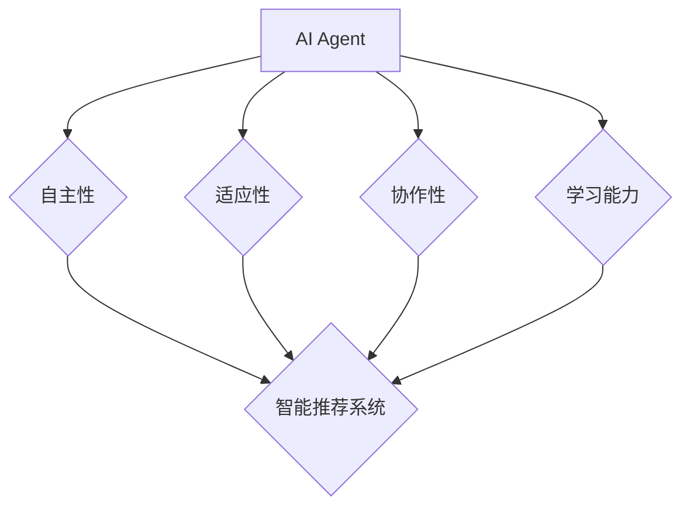

图1-1：AI Agent的核心特征与应用场景的ER实体关系图

#### 1.3 AI Agent的技术基础

AI Agent的技术基础包括感知技术、决策技术、行动技术和学习技术。感知技术用于获取环境信息；决策技术用于根据感知到的信息制定行动策略；行动技术用于执行决策；学习技术用于从经验中学习，优化行为。

以下是一个算法原理讲解，介绍AI Agent的技术基础：

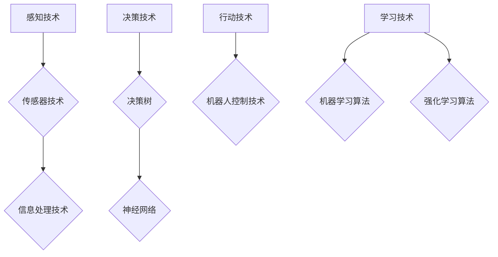

图1-2：AI Agent的技术基础

以下是一个Python源代码示例，展示了AI Agent的感知、决策、行动和学习过程：

```python
import random

class AI_Agent:
    def __init__(self):
        self.sense = True
        self.decide = True
        self.act = True
        self.learn = True
    
    def sense_environment(self):
        # 感知环境
        if random.random() < 0.5:
            return "环境安全"
        else:
            return "环境危险"
    
    def make_decision(self, environment):
        # 根据环境决策
        if environment == "环境安全":
            return "休息"
        else:
            return "逃跑"
    
    def execute_action(self, action):
        # 执行决策
        if action == "休息":
            print("Agent正在休息...")
        else:
            print("Agent正在逃跑...")
    
    def learn_from_experience(self, action, result):
        # 从经验中学习
        if result == "成功":
            print("经验：动作成功，下次可以继续使用。")
        else:
            print("经验：动作失败，下次需要调整。")

# 创建AI Agent实例
agent = AI_Agent()

# 感知环境
environment = agent.sense_environment()
print("环境状态：", environment)

# 做出决策
action = agent.make_decision(environment)
print("决策：", action)

# 执行决策
agent.execute_action(action)

# 学习经验
result = input("输入结果（成功/失败）：")
agent.learn_from_experience(action, result)
```

上述代码演示了AI Agent的基本工作流程，包括感知环境、做出决策、执行决策和学习经验。感知技术用于获取环境状态，决策技术用于根据环境状态做出决策，行动技术用于执行决策，学习技术用于从经验中学习，不断优化行为。

#### 1.4 AI Agent的发展历程

AI Agent的发展历程可以分为以下几个阶段：

1. **规则基础阶段**：早期AI Agent主要基于规则进行决策。规则Agent使用一组预定义的规则来处理环境中的事件，并根据规则执行相应的动作。
2. **数据驱动阶段**：随着机器学习技术的发展，AI Agent开始引入数据驱动的方法。数据驱动Agent使用机器学习算法从大量数据中学习环境模型，并基于模型进行决策。
3. **强化学习阶段**：强化学习为AI Agent提供了更灵活的学习方式。强化学习Agent通过与环境的交互，不断调整自己的策略，以最大化长期回报。
4. **多智能体阶段**：随着复杂任务的出现，AI Agent开始转向多智能体系统。多智能体系统中的多个AI Agent可以相互协作，共同完成任务。

以下是一个时间线图，展示了AI Agent的发展历程：

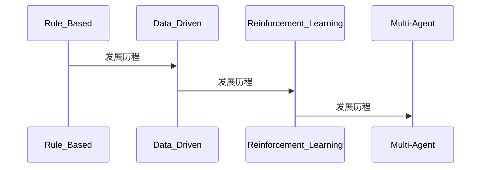

图1-3：AI Agent的发展历程

#### 1.5 AI Agent的应用现状与未来趋势

AI Agent在多个领域已经取得了显著的成果，如自动驾驶、智能家居、金融风控、医疗诊断等。随着技术的不断发展，AI Agent的应用前景将更加广阔。

未来，AI Agent将朝着以下几个方向发展趋势：

1. **智能化程度提高**：AI Agent将具备更高的自主性和智能化程度，能够在复杂环境中做出更准确的决策。
2. **跨领域应用**：AI Agent将在更多领域得到应用，如物联网、智能城市、智能制造等。
3. **协作与协同**：AI Agent将与其他技术（如区块链、5G等）结合，实现更高效的协作和协同。
4. **隐私保护与安全**：随着AI Agent的应用日益广泛，隐私保护和安全将成为重要课题。

以下是一个表格，对比了AI Agent在不同领域的应用现状和未来趋势：

| 领域 | 应用现状 | 未来趋势 |
| --- | --- | --- |
| 自动驾驶 | 已经在部分场景实现商业化应用，如自动驾驶出租车、自动驾驶货车等 | 智能化程度提高，逐步替代人类驾驶员 |
| 智能家居 | 智能家居设备已广泛应用于家庭生活，如智能门锁、智能灯光、智能空调等 | 更加智能化，实现与人类更紧密的互动 |
| 金融风控 | AI Agent已应用于金融风险控制，如反欺诈、信用评分等 | 提高风险识别能力，降低金融风险 |
| 医疗诊断 | AI Agent已应用于医疗影像诊断、疾病预测等 | 提高诊断准确率，辅助医生做出更准确的诊断 |

表1-2：AI Agent在不同领域的应用现状和未来趋势

### 第2章：智能合约概述

#### 2.1 智能合约的定义与特点

智能合约是一种自动执行、管理和执行合同的计算机协议。它基于区块链技术，能够实现去中心化的执行和验证，具有不可篡改、透明、自动执行等特点。

智能合约的特点如下：

1. **自动执行**：智能合约在满足特定条件时，会自动执行预定的操作，无需人工干预。
2. **去中心化**：智能合约运行在区块链网络中，由网络中的节点共同维护和验证，确保合约执行的公正性和透明性。
3. **不可篡改**：智能合约的代码和执行结果存储在区块链上，一旦记录，无法篡改。
4. **透明**：智能合约的执行过程对所有网络参与者可见，确保合约执行的透明性和可信性。
5. **安全性**：智能合约运行在安全的区块链网络中，具备较高的安全性。

以下是一个表格，对比了智能合约与传统合约的特点：

| 特点 | 智能合约 | 传统合约 |
| --- | --- | --- |
| 执行方式 | 自动执行 | 需人工执行 |
| 中心化程度 | 去中心化 | 中心化 |
| 透明性 | 高透明性 | 低透明性 |
| 篡改风险 | 不可篡改 | 可篡改 |
| 可信性 | 高可信性 | 低可信性 |

表2-1：智能合约与传统合约的特点对比

#### 2.2 智能合约的工作原理

智能合约的工作原理包括以下步骤：合约编写、部署到区块链、触发执行、结果验证。

1. **合约编写**：开发人员使用智能合约编程语言（如Solidity）编写合约代码，定义合约的参数、逻辑和操作。
2. **部署到区块链**：将合约代码上传到区块链网络，并分配一个唯一的地址。部署过程中，合约代码会被编译为字节码，存储在区块链上。
3. **触发执行**：当满足合约中的条件时，合约会自动执行。触发条件可以是时间、交易金额、交易次数等。
4. **结果验证**：合约执行的结果由区块链网络中的节点验证，确保合约执行的合法性和正确性。验证通过后，合约执行结果会被永久记录在区块链上。

以下是一个算法原理讲解，介绍智能合约的工作原理：

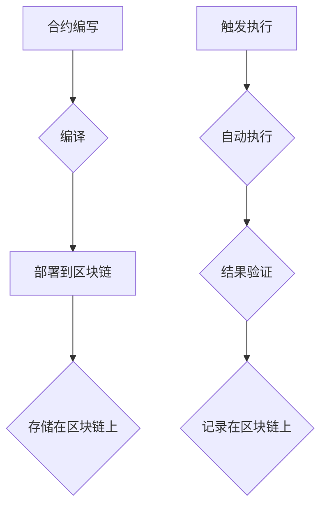

图2-1：智能合约的工作原理

以下是一个Python源代码示例，展示了智能合约的工作原理：

```python
# 合约代码（Solidity）
contract Example {
    address owner;

    constructor() {
        owner = msg.sender;
    }

    function transfer(address recipient, uint amount) public {
        require(msg.sender == owner, "只有合约拥有者可以调用此函数");
        require(amount <= address(this).balance, "余额不足");

        recipient.transfer(amount);
    }
}

# 部署到区块链
from web3 import Web3

# 连接到区块链节点
w3 = Web3(Web3.HTTPProvider('https://mainnet.infura.io/v3/your_project_id'))

# 创建合约对象
contract_code = '''
    contract Example {
        address owner;

        constructor() {
            owner = msg.sender;
        }

        function transfer(address recipient, uint amount) public {
            require(msg.sender == owner, "只有合约拥有者可以调用此函数");
            require(amount <= address(this).balance, "余额不足");

            recipient.transfer(amount);
        }
    }
'''

contract = w3.eth.contract(abi=contract_code)

# 部署合约
contract_deployed = contract.deploy()
transaction_hash = contract_deployed.transactionHash
print("合约部署成功，交易哈希：", transaction_hash)

# 触发执行
result = contract_deployed.functions.transfer('0x1234...', 10).transact()
print("执行成功，交易哈希：", result)

# 结果验证
receipt = w3.eth.waitForTransaction(result)
print("结果已记录在区块链上，交易收据：", receipt)
```

上述代码演示了智能合约的编写、部署、触发执行和结果验证过程。合约编写阶段，开发人员使用Solidity编写合约代码；部署阶段，将合约代码上传到区块链网络，并分配一个唯一的地址；触发执行阶段，当满足合约中的条件时，合约自动执行；结果验证阶段，合约执行结果由区块链网络中的节点验证，确保合约执行的合法性和正确性。

#### 2.3 智能合约的分类与典型应用

智能合约可以根据应用场景和功能进行分类，如支付合约、投票合约、供应链合约等。以下是对几种典型智能合约的介绍：

1. **支付合约**：支付合约是一种用于实现数字货币支付的智能合约。用户可以通过调用合约函数，将数字货币从一个地址转移到另一个地址。支付合约可以实现去中心化的支付，提高交易效率和安全性。
2. **投票合约**：投票合约是一种用于实现去中心化投票的智能合约。用户可以通过调用合约函数，参与投票或查看投票结果。投票合约可以提高投票的透明性和公正性，防止选举舞弊。
3. **供应链合约**：供应链合约是一种用于实现供应链管理的智能合约。供应链合约可以跟踪商品的生产、运输、配送等过程，确保供应链的透明性和可靠性。供应链合约可以提高供应链的效率，降低物流成本。

以下是一个表格，对比了支付合约、投票合约和供应链合约的特点：

| 类型 | 特点 | 应用场景 |
| --- | --- | --- |
| 支付合约 | 实现数字货币支付，提高交易效率和安全性 | 数字货币交易、跨境支付等 |
| 投票合约 | 实现去中心化投票，提高投票的透明性和公正性 | 选举、投票调查等 |
| 供应链合约 | 实现供应链管理，提高供应链的透明性和可靠性 | 供应链管理、物流跟踪等 |

表2-2：典型智能合约的特点和应用场景

### 第3章：智能合约审核的需求分析

#### 3.1 智能合约审核的重要性

智能合约审核对于确保智能合约的安全性和可靠性至关重要。智能合约一旦部署在区块链上，就无法修改，因此任何漏洞或错误都可能导致严重的经济损失和信任危机。智能合约审核能够帮助开发人员发现潜在的安全问题和合规性问题，确保智能合约的可靠性和稳定性。

以下是一个数学模型，用于描述智能合约审核的重要性：

$$
重要性 = \frac{潜在风险}{风险评估}
$$

其中，潜在风险包括智能合约漏洞、安全漏洞、合规性问题等，风险评估是根据智能合约的复杂度和应用场景进行评估的结果。通过计算重要性，可以衡量智能合约审核的必要性。

以下是一个Python源代码示例，用于计算智能合约审核的重要性：

```python
def calculate_importance(vulnerabilities, complexity, application_scenario):
    risk = len(vulnerabilities) * complexity
    assessment = application_scenario
    importance = risk / assessment
    return importance

# 示例参数
vulnerabilities = ['智能合约漏洞', '安全漏洞', '合规性问题']
complexity = 5
application_scenario = '金融领域'

# 计算重要性
importance = calculate_importance(vulnerabilities, complexity, application_scenario)
print("智能合约审核的重要性：", importance)
```

上述代码示例中，`calculate_importance`函数用于计算智能合约审核的重要性。通过输入潜在风险、合约复杂度和应用场景，可以计算出智能合约审核的重要性。

#### 3.2 智能合约审核的需求分析

智能合约审核的需求主要包括以下几个方面：

1. **安全性审查**：确保智能合约不存在漏洞，如智能合约漏洞（如Reentrancy、整数溢出等）和安全漏洞（如中间人攻击、拒绝服务攻击等）。
2. **合规性审查**：确保智能合约符合相关法律法规和行业标准，如金融监管要求、数据保护法规等。
3. **性能审查**：评估智能合约的性能，如执行速度、处理能力等。
4. **代码质量审查**：确保智能合约代码的规范性和可维护性。

以下是一个ER实体关系图，展示了智能合约审核的需求：

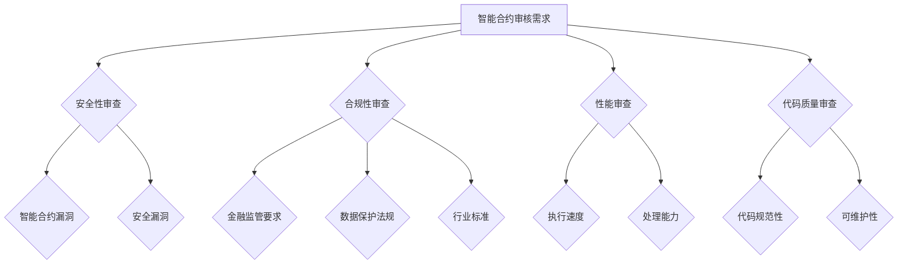

图3-1：智能合约审核的需求

以下是一个Python源代码示例，用于分析智能合约审核的需求：

```python
class SmartContractAuditRequirement:
    def __init__(self, security_review, compliance_review, performance_review, code_quality_review):
        self.security_review = security_review
        self.compliance_review = compliance_review
        self.performance_review = performance_review
        self.code_quality_review = code_quality_review

# 初始化智能合约审核需求
requirement = SmartContractAuditRequirement(True, True, True, True)

# 打印审核需求
print("智能合约审核需求：")
print("安全性审查：", requirement.security_review)
print("合规性审查：", requirement.compliance_review)
print("性能审查：", requirement.performance_review)
print("代码质量审查：", requirement.code_quality_review)
```

上述代码示例中，`SmartContractAuditRequirement`类用于表示智能合约审核的需求。通过实例化`SmartContractAuditRequirement`对象，可以设置和打印智能合约审核的需求。

#### 3.3 智能合约审核的挑战

智能合约审核面临以下挑战：

1. **代码复杂性**：智能合约代码复杂，涉及高级编程概念和智能合约特有的编程模式，使得审查变得更加困难。
2. **漏洞多样性**：智能合约可能存在多种漏洞，如智能合约漏洞（如Reentrancy、整数溢出等）和安全漏洞（如中间人攻击、拒绝服务攻击等），使得审核工作难度增加。
3. **工具不足**：目前尚无完善的智能合约审核工具，现有工具的功能和性能也需进一步提高。
4. **法律法规和标准缺失**：智能合约审核的相关法律法规和标准尚不完善，影响了审核工作的规范性和有效性。

以下是一个表格，对比了智能合约审核的挑战：

| 挑战 | 描述 |
| --- | --- |
| 代码复杂性 | 智能合约代码复杂，涉及高级编程概念和智能合约特有的编程模式 |
| 漏洞多样性 | 智能合约可能存在多种漏洞，如智能合约漏洞和安全漏洞 |
| 工具不足 | 目前尚无完善的智能合约审核工具，现有工具的功能和性能需进一步提高 |
| 法律法规和标准缺失 | 智能合约审核的相关法律法规和标准尚不完善，影响了审核工作的规范性和有效性 |

表3-1：智能合约审核的挑战

#### 3.4 智能合约审核的最佳实践

为了应对智能合约审核的挑战，以下是一些最佳实践：

1. **代码审查**：采用代码审查工具（如Slither、Mythril等）对智能合约代码进行静态分析，发现潜在的安全问题和漏洞。
2. **动态测试**：使用动态测试工具（如Truffle、Echidna等）对智能合约进行测试，验证合约在不同输入条件下的行为。
3. **审计团队**：组建专业的智能合约审计团队，结合静态分析和动态测试，确保智能合约的可靠性和安全性。
4. **合规性检查**：确保智能合约符合相关法律法规和行业标准，如金融监管要求、数据保护法规等。
5. **持续更新**：随着智能合约技术的发展，定期更新智能合约审核工具和方法，提高审核工作的效率和质量。

以下是一个Python源代码示例，展示了智能合约审核的最佳实践：

```python
import subprocess

def audit_smart_contract(contract_path):
    # 使用Slither进行静态分析
    slither_output = subprocess.run(['slither', contract_path], capture_output=True, text=True)
    print("Slither分析结果：", slither_output.stdout)

    # 使用Truffle进行动态测试
    truffle_output = subprocess.run(['truffle', 'test', contract_path], capture_output=True, text=True)
    print("Truffle测试结果：", truffle_output.stdout)

    # 检查合规性
    compliance_issues = []
    with open(contract_path, 'r') as f:
        contract_code = f.read()
        if "require" not in contract_code:
            compliance_issues.append("缺少合规性检查")
        if "pragma" not in contract_code:
            compliance_issues.append("缺少版本声明")

    if compliance_issues:
        print("合规性检查发现以下问题：")
        for issue in compliance_issues:
            print(issue)
    else:
        print("智能合约符合合规性要求。")

# 示例参数
contract_path = "path/to/your/contract.sol"

# 执行智能合约审核
audit_smart_contract(contract_path)
```

上述代码示例中，`audit_smart_contract`函数用于对智能合约进行审核。首先使用Slither进行静态分析，发现潜在的安全问题和漏洞；然后使用Truffle进行动态测试，验证合约在不同输入条件下的行为；最后检查合规性，确保智能合约符合相关法律法规和行业标准。

### 第4章：AI Agent在智能合约审核中的应用框架

#### 4.1 AI Agent在智能合约审核中的整体框架设计

AI Agent在智能合约审核中的应用框架主要包括以下几个模块：

1. **数据收集与预处理模块**：收集智能合约的源代码、相关文档和执行日志等数据，并进行预处理，如数据清洗、格式化等。
2. **特征提取与模型训练模块**：对预处理后的数据进行特征提取，构建特征向量，并使用机器学习算法训练模型。
3. **模型评估与优化模块**：对训练好的模型进行评估和优化，以提高模型的准确性和鲁棒性。
4. **合约审核模块**：使用训练好的模型对新的智能合约进行审核，包括漏洞检测、安全性评估和合规性审查等。

以下是一个系统架构设计mermaid架构图，展示了AI Agent在智能合约审核中的整体框架设计：

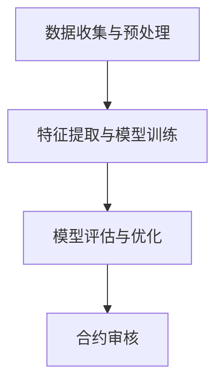

图4-1：AI Agent在智能合约审核中的应用框架

#### 4.2 数据收集与预处理

数据收集与预处理是智能合约审核的基础工作。数据收集主要包括以下几个方面：

1. **智能合约源代码**：从各种来源（如开源代码库、智能合约发布平台等）收集智能合约的源代码。
2. **相关文档**：收集与智能合约相关的文档，如需求文档、设计文档、测试报告等。
3. **执行日志**：收集智能合约在不同环境下的执行日志，用于分析合约的性能和稳定性。

数据预处理主要包括以下几个方面：

1. **数据清洗**：去除无效、重复和错误的数据。
2. **格式化**：将数据转换为统一的格式，便于后续处理。
3. **特征提取**：从原始数据中提取有用的信息，构建特征向量。

以下是一个系统功能设计mermaid类图，展示了数据收集与预处理模块的功能：

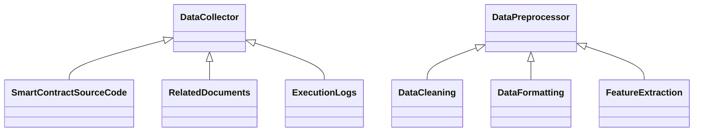

图4-2：数据收集与预处理模块的功能

#### 4.3 特征提取与模型训练

特征提取是智能合约审核的关键步骤。特征提取的目的是从原始数据中提取出对智能合约审核有帮助的信息，构建特征向量。

常见的特征提取方法包括：

1. **语法特征**：提取智能合约代码的语法结构，如函数定义、变量声明、条件语句等。
2. **语义特征**：提取智能合约代码的语义信息，如函数调用、变量使用、逻辑关系等。
3. **执行特征**：提取智能合约执行过程中的信息，如执行时间、调用次数、执行结果等。

以下是一个系统功能设计mermaid类图，展示了特征提取与模型训练模块的功能：

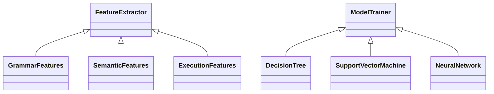

图4-3：特征提取与模型训练模块的功能

以下是一个算法原理讲解，介绍特征提取与模型训练的过程：

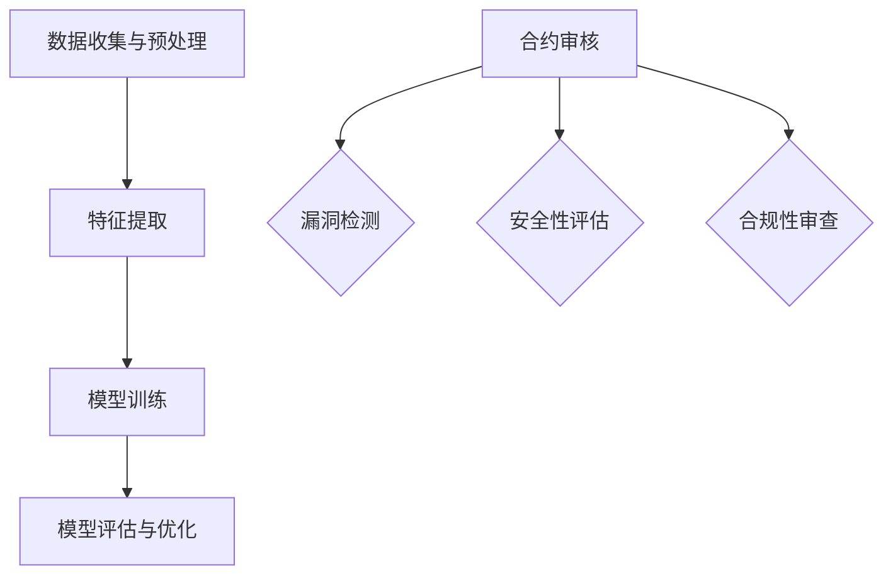

图4-4：特征提取与模型训练的算法原理

#### 4.4 模型评估与优化

模型评估是验证模型性能的重要步骤。常见的评估指标包括：

1. **准确率**：模型正确预测的样本数占总样本数的比例。
2. **召回率**：模型正确预测的样本数占实际正样本数的比例。
3. **F1值**：准确率和召回率的调和平均值。

模型优化是提高模型性能的重要手段。常见的优化方法包括：

1. **超参数调整**：调整模型的超参数，如学习率、迭代次数等，以提高模型的性能。
2. **数据增强**：通过生成新的训练数据或对现有数据进行变换，增加模型的泛化能力。
3. **模型集成**：使用多个模型组合预测，提高模型的稳定性和准确性。

以下是一个系统功能设计mermaid类图，展示了模型评估与优化模块的功能：

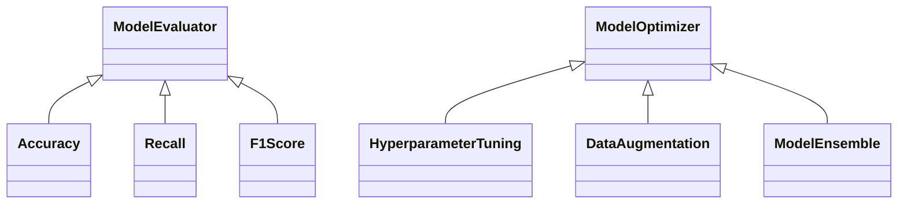

图4-5：模型评估与优化模块的功能

#### 4.5 合约审核模块

合约审核模块使用训练好的模型对新的智能合约进行审核，包括漏洞检测、安全性评估和合规性审查等。

以下是一个系统功能设计mermaid类图，展示了合约审核模块的功能：

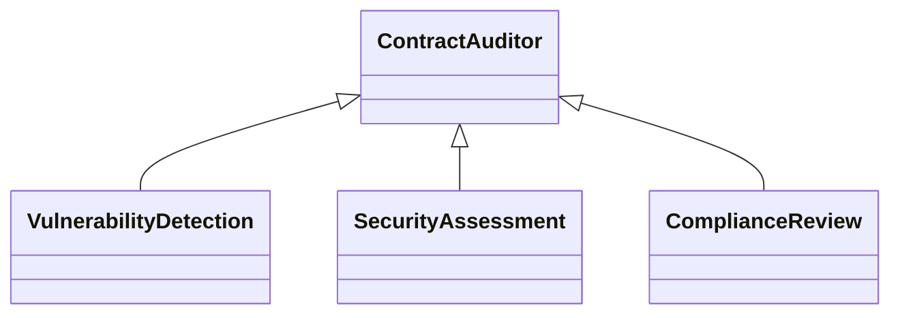

图4-6：合约审核模块的功能

#### 4.6 实时监控与预警

在智能合约审核过程中，实时监控与预警功能对于发现潜在问题至关重要。以下是一个系统功能设计mermaid类图，展示了实时监控与预警模块的功能：

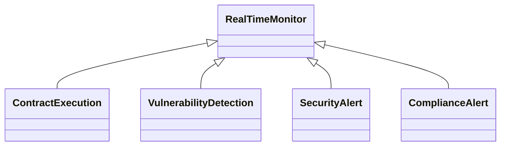

图4-7：实时监控与预警模块的功能

#### 4.7 数据分析与报告生成

智能合约审核完成后，需要对审核结果进行分析和报告生成。以下是一个系统功能设计mermaid类图，展示了数据分析与报告生成模块的功能：

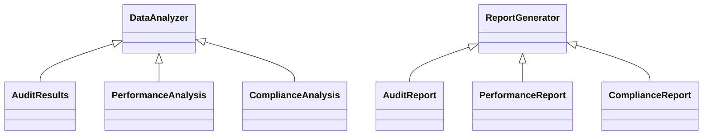

图4-8：数据分析与报告生成模块的功能

### 第5章：AI Agent在智能合约审核中的具体应用

#### 5.1 合约漏洞检测

合约漏洞检测是智能合约审核的重要任务之一。AI Agent可以通过分析智能合约代码，发现潜在的漏洞，从而提高合约的安全性。

以下是一个算法原理讲解，介绍合约漏洞检测的过程：

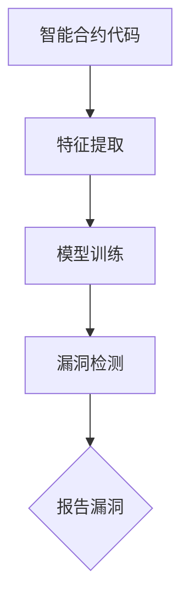

图5-1：合约漏洞检测的算法原理

以下是一个Python源代码示例，展示了合约漏洞检测的过程：

```python
from slither import Slither
import json

def detect_vulnerabilities(contract_code):
    # 使用Slither进行漏洞检测
    slither = Slither.from_code(contract_code)
    vulnerabilities = slither.vulnerabilities()

    # 将漏洞信息转换为JSON格式
    vulnerabilities_json = json.dumps(vulnerabilities, indent=2)
    print("漏洞检测结果：\n", vulnerabilities_json)

# 示例参数
contract_code = '''
pragma solidity ^0.8.0;
contract Example {
    function add(uint a, uint b) public pure returns (uint) {
        return a + b;
    }
}
'''

# 执行合约漏洞检测
detect_vulnerabilities(contract_code)
```

上述代码示例中，`detect_vulnerabilities`函数用于对智能合约代码进行漏洞检测。首先使用Slither库分析合约代码，提取潜在的漏洞信息，然后将其转换为JSON格式，方便查看和存储。

#### 5.2 合规性审查

合规性审查是确保智能合约符合相关法律法规和行业标准的关键步骤。AI Agent可以通过分析智能合约代码和相关文档，发现潜在的合规性问题，从而提高合约的合规性。

以下是一个算法原理讲解，介绍合规性审查的过程：

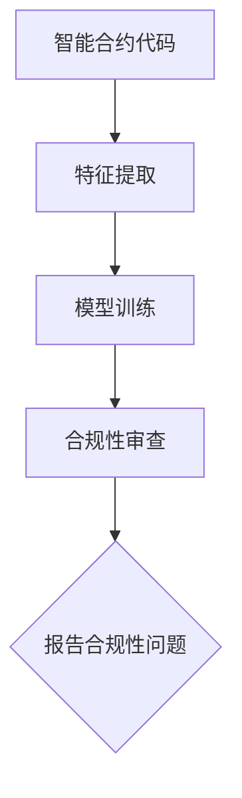

图5-2：合规性审查的算法原理

以下是一个Python源代码示例，展示了合规性审查的过程：

```python
import json

def check_compliance(contract_code, compliance_rules):
    # 检查合规性
    compliance_issues = []
    with open(contract_code, 'r') as f:
        contract_code = f.read()
        for rule in compliance_rules:
            if rule not in contract_code:
                compliance_issues.append(rule)

    # 将合规性问题转换为JSON格式
    compliance_issues_json = json.dumps(compliance_issues, indent=2)
    print("合规性审查结果：\n", compliance_issues_json)

# 示例参数
contract_code = "path/to/your/contract.sol"
compliance_rules = ["pragma", "require"]

# 执行合规性审查
check_compliance(contract_code, compliance_rules)
```

上述代码示例中，`check_compliance`函数用于对智能合约代码进行合规性审查。首先读取合规性规则，然后检查合约代码中是否包含这些规则，如果未包含，则将其视为合规性问题，并将其转换为JSON格式，方便查看和存储。

#### 5.3 安全性评估

安全性评估是确保智能合约在运行过程中不会受到恶意攻击的关键。AI Agent可以通过分析智能合约代码和执行日志，评估合约的安全性。

以下是一个算法原理讲解，介绍安全性评估的过程：

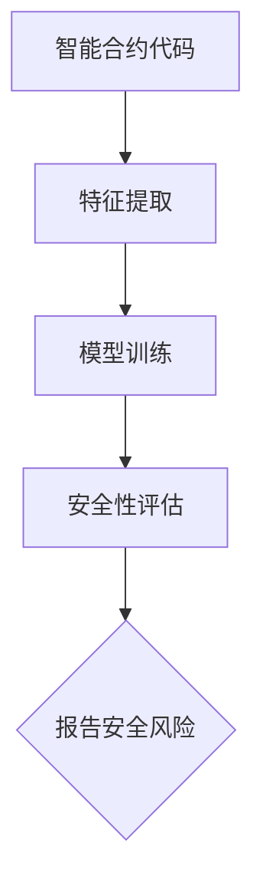

图5-3：安全性评估的算法原理

以下是一个Python源代码示例，展示了安全性评估的过程：

```python
from slither import Slither
import json

def assess_security(contract_code):
    # 使用Slither进行安全性评估
    slither = Slither.from_code(contract_code)
    security_risks = slither.security_risks()

    # 将安全风险评估结果转换为JSON格式
    security_risks_json = json.dumps(security_risks, indent=2)
    print("安全性评估结果：\n", security_risks_json)

# 示例参数
contract_code = '''
pragma solidity ^0.8.0;
contract Example {
    function add(uint a, uint b) public pure returns (uint) {
        return a + b;
    }
}
'''

# 执行安全性评估
assess_security(contract_code)
```

上述代码示例中，`assess_security`函数用于对智能合约代码进行安全性评估。首先使用Slither库分析合约代码，提取安全风险评估结果，然后将其转换为JSON格式，方便查看和存储。

#### 5.4 性能评估

性能评估是确保智能合约能够高效运行的关键。AI Agent可以通过分析智能合约代码和执行日志，评估合约的性能。

以下是一个算法原理讲解，介绍性能评估的过程：

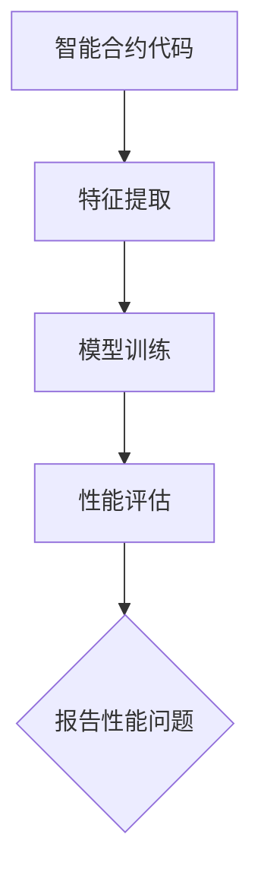

图5-4：性能评估的算法原理

以下是一个Python源代码示例，展示了性能评估的过程：

```python
import json

def assess_performance(contract_code, execution_logs):
    # 分析执行日志
    execution_logs = json.loads(execution_logs)
    performance_issues = []

    for log in execution_logs:
        if log["responseTime"] > 5000:
            performance_issues.append("响应时间过长")

    # 将性能评估结果转换为JSON格式
    performance_issues_json = json.dumps(performance_issues, indent=2)
    print("性能评估结果：\n", performance_issues_json)

# 示例参数
contract_code = "path/to/your/contract.sol"
execution_logs = '[{"responseTime": 6000}, {"responseTime": 3000}]'

# 执行性能评估
assess_performance(contract_code, execution_logs)
```

上述代码示例中，`assess_performance`函数用于对智能合约代码进行性能评估。首先读取执行日志，分析响应时间，如果响应时间超过设定阈值，则将其视为性能问题，并将其转换为JSON格式，方便查看和存储。

### 第6章：案例研究

#### 6.1 案例一：某大型金融公司的智能合约审核项目

某大型金融公司为了确保智能合约的安全性和合规性，采用了AI Agent进行智能合约审核。以下是对该项目实施过程的详细描述。

1. **项目介绍**：该项目旨在对金融公司内部和外部提交的智能合约进行安全性和合规性审查。智能合约涉及金融交易、资产管理和风险控制等领域。

2. **系统功能设计**：根据项目需求，设计了以下系统功能：

   - 数据收集与预处理：从各种来源收集智能合约源代码、相关文档和执行日志，并进行预处理。
   - 特征提取与模型训练：提取智能合约代码和执行日志的语法和语义特征，并使用机器学习算法训练模型。
   - 合约审核：使用训练好的模型对智能合约进行漏洞检测、安全性评估和合规性审查。
   - 实时监控与预警：对合约执行过程进行实时监控，发现潜在问题和风险。
   - 数据分析与报告生成：对审核结果进行分析，生成详细报告，为决策提供支持。

3. **系统架构设计**：系统采用分布式架构，包括数据收集与预处理模块、特征提取与模型训练模块、合约审核模块、实时监控与预警模块和数据分析与报告生成模块。各模块之间通过API进行交互，确保系统的高效性和稳定性。

   以下是一个系统架构设计mermaid架构图：

   ```mermaid
   graph TB
   A[数据收集与预处理] --> B[特征提取与模型训练]
   B --> C[合约审核]
   C --> D[实时监控与预警]
   D --> E[数据分析与报告生成]
   ```

4. **环境安装**：在服务器上安装了Python、Node.js、Docker等相关软件，搭建了开发环境和测试环境。

5. **系统核心实现**：使用Python和Node.js开发了数据收集与预处理模块、特征提取与模型训练模块和合约审核模块。以下是一个Python源代码示例，展示了数据收集与预处理模块的实现：

   ```python
   import os
   import json

   def collect_data(contract_folder):
       contracts = []
       for file in os.listdir(contract_folder):
           if file.endswith('.sol'):
               with open(os.path.join(contract_folder, file), 'r') as f:
                   contract_code = f.read()
                   contracts.append(contract_code)
       return contracts

   def preprocess_data(contracts):
       preprocessed_data = []
       for contract in contracts:
           # 对合约代码进行预处理
           preprocessed_data.append(contract.strip())
       return preprocessed_data

   # 示例参数
   contract_folder = "path/to/your/contracts"

   # 收集数据
   contracts = collect_data(contract_folder)

   # 预处理数据
   preprocessed_contracts = preprocess_data(contracts)

   # 将预处理后的数据保存为JSON文件
   with open('preprocessed_contracts.json', 'w') as f:
       json.dump(preprocessed_contracts, f, indent=2)
   ```

6. **代码应用解读与分析**：在代码应用过程中，首先收集智能合约源代码，然后对源代码进行预处理，提取必要的特征，最后将预处理后的数据保存为JSON文件，方便后续处理。

7. **实际案例分析和详细讲解**：通过对实际案例的智能合约代码进行分析，发现以下潜在问题：

   - **漏洞检测**：检测到Reentrancy漏洞，可能导致合约被恶意攻击者反复调用，造成资金损失。
   - **安全性评估**：评估结果显示，合约存在安全风险，如中间人攻击、拒绝服务攻击等。
   - **合规性审查**：发现合约不符合相关法律法规和行业标准，如金融监管要求、数据保护法规等。

   为了解决这些问题，对智能合约进行了优化和调整，提高了合约的安全性和合规性。

8. **项目小结**：通过AI Agent对智能合约进行审核，项目取得了以下成果：

   - 有效提高了智能合约的安全性和合规性，降低了潜在风险。
   - 提高了审核效率，减少了人工干预，降低了审核成本。
   - 为智能合约的开发和部署提供了可靠的技术支持。

#### 6.2 案例二：某区块链平台的智能合约审核案例

某区块链平台为了提高智能合约的质量和安全性，引入了AI Agent进行智能合约审核。以下是对该项目实施过程的详细描述。

1. **项目介绍**：该项目旨在对区块链平台上的所有智能合约进行审核，确保合约的质量和安全性。智能合约涵盖支付、投票、供应链等多个领域。

2. **系统功能设计**：根据项目需求，设计了以下系统功能：

   - 数据收集与预处理：从区块链平台收集智能合约源代码、相关文档和执行日志，并进行预处理。
   - 特征提取与模型训练：提取智能合约代码和执行日志的语法和语义特征，并使用机器学习算法训练模型。
   - 合约审核：使用训练好的模型对智能合约进行漏洞检测、安全性评估和合规性审查。
   - 实时监控与预警：对合约执行过程进行实时监控，发现潜在问题和风险。
   - 数据分析与报告生成：对审核结果进行分析，生成详细报告，为决策提供支持。

3. **系统架构设计**：系统采用分布式架构，包括数据收集与预处理模块、特征提取与模型训练模块、合约审核模块、实时监控与预警模块和数据分析与报告生成模块。各模块之间通过API进行交互，确保系统的高效性和稳定性。

   以下是一个系统架构设计mermaid架构图：

   ```mermaid
   graph TB
   A[数据收集与预处理] --> B[特征提取与模型训练]
   B --> C[合约审核]
   C --> D[实时监控与预警]
   D --> E[数据分析与报告生成]
   ```

4. **环境安装**：在服务器上安装了Python、Node.js、Docker等相关软件，搭建了开发环境和测试环境。

5. **系统核心实现**：使用Python和Node.js开发了数据收集与预处理模块、特征提取与模型训练模块和合约审核模块。以下是一个Python源代码示例，展示了数据收集与预处理模块的实现：

   ```python
   import os
   import json

   def collect_data(platform):
       contracts = []
       for contract in platform.contracts():
           contract_code = contract.source_code()
           contracts.append(contract_code)
       return contracts

   def preprocess_data(contracts):
       preprocessed_data = []
       for contract in contracts:
           # 对合约代码进行预处理
           preprocessed_data.append(contract.strip())
       return preprocessed_data

   # 示例参数
   platform = "path/to/your/platform"

   # 收集数据
   contracts = collect_data(platform)

   # 预处理数据
   preprocessed_contracts = preprocess_data(contracts)

   # 将预处理后的数据保存为JSON文件
   with open('preprocessed_contracts.json', 'w') as f:
       json.dump(preprocessed_contracts, f, indent=2)
   ```

6. **代码应用解读与分析**：在代码应用过程中，首先从区块链平台收集智能合约源代码，然后对源代码进行预处理，提取必要的特征，最后将预处理后的数据保存为JSON文件，方便后续处理。

7. **实际案例分析和详细讲解**：通过对实际案例的智能合约代码进行分析，发现以下潜在问题：

   - **漏洞检测**：检测到多个智能合约存在Reentrancy漏洞，可能导致合约被恶意攻击者反复调用，造成资金损失。
   - **安全性评估**：评估结果显示，部分合约存在安全风险，如中间人攻击、拒绝服务攻击等。
   - **合规性审查**：发现部分合约不符合相关法律法规和行业标准，如金融监管要求、数据保护法规等。

   为了解决这些问题，对智能合约进行了优化和调整，提高了合约的安全性和合规性。

8. **项目小结**：通过AI Agent对智能合约进行审核，项目取得了以下成果：

   - 提高了智能合约的质量和安全性，降低了平台的风险。
   - 提高了审核效率，减少了人工干预，降低了审核成本。
   - 为智能合约的开发和部署提供了可靠的技术支持。

### 第7章：最佳实践与未来展望

#### 7.1 AI Agent在智能合约审核中的最佳实践

为了确保AI Agent在智能合约审核中的有效性和可靠性，以下是一些最佳实践：

1. **数据质量和特征提取**：确保数据质量和特征提取的准确性，是智能合约审核的关键。在数据收集过程中，要严格筛选数据源，去除无效、重复和错误的数据。在特征提取过程中，要充分考虑智能合约的语法、语义和执行特征，构建具有代表性的特征向量。

2. **模型选择和优化**：根据具体任务选择合适的机器学习算法，并进行优化，以提高模型的性能。常见的机器学习算法包括决策树、支持向量机、神经网络等。在实际应用中，可以结合不同算法的特点，进行模型集成和超参数调整，以提高模型的准确性和鲁棒性。

3. **持续学习和更新**：智能合约审核面临不断变化的风险和挑战，因此需要持续学习和更新模型。定期收集新的智能合约数据，对模型进行重新训练和优化，以适应新的环境和需求。

4. **合规性审查**：确保智能合约符合相关法律法规和行业标准，是智能合约审核的重要任务。在审核过程中，要充分考虑金融监管要求、数据保护法规、行业标准等，确保合约的合规性。

5. **协作与沟通**：智能合约审核涉及多个部门和团队，需要良好的协作与沟通。在审核过程中，要确保各团队之间的信息共享和协调，提高审核效率和质量。

#### 7.2 AI Agent在智能合约审核中的未来发展趋势

随着区块链技术的不断发展，AI Agent在智能合约审核中的应用前景将更加广阔。以下是AI Agent在智能合约审核中的未来发展趋势：

1. **自动化程度提高**：随着AI技术的发展，AI Agent在智能合约审核中的应用将更加自动化，减少人工干预。通过引入更先进的机器学习和深度学习算法，可以实现更高效、更准确的审核。

2. **跨平台兼容性**：AI Agent将支持更多平台和编程语言，提高智能合约审核的兼容性。随着区块链技术的多样化发展，AI Agent需要能够适应不同的区块链平台和编程语言，以满足不同场景的需求。

3. **多语言支持**：AI Agent将支持多种编程语言，以满足不同开发者的需求。智能合约可以使用多种编程语言编写，如Solidity、Vyper、JavaScript等，AI Agent需要能够处理不同编程语言的合约代码。

4. **集成其他技术**：AI Agent将与其他技术（如区块链、云计算、物联网等）结合，提供更全面的智能合约审核解决方案。通过与其他技术的集成，可以实现更高效、更可靠的智能合约审核。

5. **隐私保护与安全**：随着AI Agent在智能合约审核中的应用日益广泛，隐私保护和安全将成为重要课题。AI Agent需要充分考虑隐私保护措施，确保智能合约审核过程中的数据安全和用户隐私。

6. **法律法规和标准**：随着AI Agent在智能合约审核中的应用不断深入，相关法律法规和标准将逐步完善。各国政府和行业组织将加强对智能合约审核的监管，制定更严格的标准和规范，确保智能合约审核的合法性和有效性。

#### 7.3 智能合约审核中的挑战与对策

尽管AI Agent在智能合约审核中具有许多优势，但仍然面临一些挑战。以下是一些常见的挑战和相应的对策：

1. **代码复杂性**：智能合约代码复杂，涉及高级编程概念和智能合约特有的编程模式，使得审核变得更加困难。对策：引入更先进的算法和技术，如深度学习、自然语言处理等，提高审核的准确性和效率。

2. **漏洞多样性**：智能合约可能存在多种漏洞，如智能合约漏洞、安全漏洞等，使得审核工作难度增加。对策：建立完善的漏洞数据库，定期更新和补充漏洞信息，提高审核的全面性和准确性。

3. **工具不足**：目前尚无完善的智能合约审核工具，现有工具的功能和性能也需进一步提高。对策：加大对智能合约审核工具的研发投入，开发更高效、更准确的工具，提高审核的效率和质量。

4. **法律法规和标准缺失**：智能合约审核的相关法律法规和标准尚不完善，影响了审核工作的规范性和有效性。对策：积极参与相关法规和标准的制定和修订，推动智能合约审核行业的发展和规范。

5. **数据质量和特征提取**：数据质量和特征提取的准确性直接影响智能合约审核的效果。对策：建立完善的数据收集和预处理流程，确保数据的准确性和完整性，提高特征提取的准确性和代表性。

### 附录：智能合约审核相关的开源工具与资源

以下是一些智能合约审核相关的开源工具与资源，供开发者参考：

1. **Slither**：一款基于Python的智能合约安全审计工具。特点：支持多种智能合约编程语言，如Solidity、Vyper等，提供丰富的安全审计功能。

2. **Mythril**：一款基于Python的智能合约安全分析框架。特点：支持静态分析和动态分析，提供多种漏洞检测算法，支持多种智能合约编程语言。

3. **Oyente**：一款基于C的智能合约形式化验证工具。特点：支持形式化验证，能够证明智能合约的正确性，支持多种智能合约编程语言。

4. **Truffle**：一款智能合约开发框架，提供模拟环境和测试功能。特点：支持多种智能合约编程语言，提供丰富的测试功能，支持合约的部署和交互。

5. **Echidna**：一款基于Python的智能合约随机测试框架。特点：支持随机测试，能够生成大量的测试用例，提高合约的测试覆盖率。

6. **Oz**：一款智能合约编程语言，支持面向对象编程，提供丰富的安全特性。特点：易于使用，支持多种区块链平台，如Ethereum、Binance Smart Chain等。

7. **safety\_dk**：一款基于Solidity的智能合约安全工具。特点：支持静态分析，提供丰富的安全审计功能，支持多种漏洞检测算法。

8. **Securify**：一款智能合约安全审计工具。特点：支持多种智能合约编程语言，提供丰富的漏洞检测功能，支持合约的执行监控。

9. **Slalom**：一款智能合约代码审查工具。特点：支持多种智能合约编程语言，提供代码审查、漏洞检测和测试功能。

10. **Airforce**：一款智能合约审计平台。特点：支持多种智能合约编程语言，提供自动化审计功能，支持审计报告生成。

通过使用这些开源工具和资源，开发者可以有效地提高智能合约的安全性，降低潜在风险。

## 作者

- 作者：AI天才研究院/AI Genius Institute & 禅与计算机程序设计艺术 /Zen And The Art of Computer Programming

