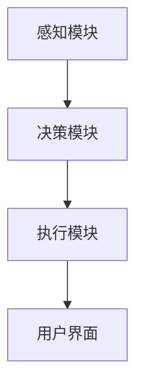

                 

### 文章标题

# AI Agent在智能吸尘器中的路径规划

> 关键词：AI Agent、路径规划、智能吸尘器、算法、性能分析

> 摘要：本文深入探讨了AI Agent在智能吸尘器中的路径规划技术，通过系统的分析路径规划原理和算法，详细介绍了AI Agent路径规划系统设计、核心算法实现、系统测试与性能分析以及未来发展趋势，为智能吸尘器行业提供了宝贵的技术参考。

## 目录大纲

----------------------------------------------------------------
### 第一部分: AI Agent与智能吸尘器的背景知识

#### 第1章: AI Agent概述  
#### 第2章: 智能吸尘器技术发展历程  
#### 第3章: AI Agent在智能吸尘器中的应用场景

----------------------------------------------------------------

### 第二部分: 路径规划原理

#### 第4章: 路径规划基础  
#### 第5章: 主流路径规划算法  
#### 第6章: 路径规划算法性能评估

----------------------------------------------------------------

### 第三部分: AI Agent路径规划在智能吸尘器中的应用

#### 第7章: AI Agent路径规划系统设计  
#### 第8章: 系统核心算法实现  
#### 第9章: 系统测试与性能分析  
#### 第10章: 案例分析

----------------------------------------------------------------

### 第四部分: AI Agent路径规划的未来发展趋势

#### 第11章: 趋势分析与前沿技术  
#### 第12章: 未来发展方向与挑战

----------------------------------------------------------------

### 第五部分: 总结与拓展

#### 第13章: 最佳实践与经验总结  
#### 第14章: 注意事项与常见问题  
#### 第15章: 拓展阅读与资源推荐

----------------------------------------------------------------

## 1. AI Agent概述

AI Agent，即人工智能代理，是指具备一定智能和自主性的软件系统，能在特定环境中根据目标和环境信息自主执行任务。AI Agent具备以下基本特征：

### 定义与基本特征

1. **自主性**：AI Agent能够自主地做出决策和执行行动。
2. **交互性**：AI Agent能够与用户和其他系统进行交互。
3. **适应性**：AI Agent能够根据环境变化和经验进行学习和优化。
4. **目标导向性**：AI Agent能够根据预设目标，自主选择最优路径或策略。

### AI Agent在智能吸尘器中的角色

智能吸尘器作为智能家居的重要组成部分，其核心任务是实现自动清洁。AI Agent在其中扮演着至关重要的角色：

1. **路径规划**：AI Agent负责智能吸尘器在家庭环境中的路径规划，确保高效覆盖每个角落。
2. **障碍物检测与回避**：AI Agent能够识别并绕过障碍物，保证清洁作业的连续性和安全性。
3. **环境感知与适应**：AI Agent根据实时环境数据，调整吸尘策略，适应不同地面材质和清洁需求。

## 2. 智能吸尘器技术发展历程

智能吸尘器作为家用电器的一种，其技术发展经历了多个阶段：

### 早期阶段

在早期阶段，智能吸尘器主要依赖于固定路径的清洁方式，即通过预先设定的路径进行扫地。这种方法的局限性在于清洁效率低，难以覆盖复杂家居环境。

### 智能化阶段

随着传感器技术和人工智能的发展，智能吸尘器逐渐引入了路径规划功能。这一阶段，智能吸尘器开始采用随机扫描、光流法等技术进行路径规划，提高了清洁效率和覆盖范围。

### AI时代

进入AI时代，智能吸尘器引入了AI Agent技术，实现了更加智能和高效的路径规划。AI Agent能够通过深度学习、强化学习等方法，不断优化清洁路径，提高清洁效果。

### 当前趋势

当前，智能吸尘器的路径规划技术正朝着更加智能、自适应和高效的方向发展。随着AI技术的不断进步，智能吸尘器的清洁能力和用户体验将得到进一步提升。

## 3. AI Agent在智能吸尘器中的应用场景

AI Agent在智能吸尘器中的应用场景主要集中在以下几个方面：

### 路径规划

路径规划是智能吸尘器的核心功能之一。AI Agent通过感知环境信息，使用路径规划算法为吸尘器生成最优清洁路径，确保高效覆盖家庭环境。

### 障碍物检测与回避

AI Agent能够实时感知家居环境中的障碍物，并采用适当的策略进行回避。这确保了吸尘器的安全运行，避免了碰撞和损坏。

### 环境感知与适应

AI Agent能够根据实时环境数据，调整吸尘器的清洁策略。例如，对于不同材质的地板，AI Agent会调整吸力大小，以获得最佳的清洁效果。

### 用户交互

AI Agent还提供了与用户的交互功能。用户可以通过手机应用或语音助手与吸尘器进行交互，设置清洁计划、查看清洁进度等。

### 电池管理

AI Agent还可以对吸尘器的电池进行智能管理。根据清洁任务的复杂度和持续时间，AI Agent会调整吸尘器的电池使用策略，确保电池寿命最大化。

## 4. 路径规划基础

### 路径规划的定义

路径规划是指在一个给定的环境中，为移动机器人或自主设备找到一条从起点到终点的最优路径。路径规划的目标是使设备以最小的代价到达目标位置。

### 路径规划的要素

1. **起点**：路径规划的初始位置。
2. **终点**：路径规划的目标位置。
3. **环境**：路径规划所需考虑的周围环境，包括障碍物、地形等。
4. **路径**：从起点到终点的可能轨迹。
5. **代价**：路径规划中的成本，通常用距离、时间或能量等来衡量。

### 路径规划的基本问题

路径规划面临的主要问题是：

1. **可达性**：确定从起点到终点的路径是否存在。
2. **最优化**：在所有可能的路径中选择一条最优的路径。

## 5. 主流路径规划算法

### A*算法

A*（A-star）算法是一种广受欢迎的路径规划算法。它使用启发式信息来估计从当前节点到终点的距离，并通过结合当前节点到起点的距离来评估路径的总体代价。A*算法的优点是能够找到最短路径，但计算复杂度较高。

### Dijkstra算法

Dijkstra算法是一种基于贪心的路径规划算法，主要用于求解单源最短路径问题。它通过逐步扩展已访问节点，计算出从起点到每个节点的最短路径。Dijkstra算法的优点是简单易懂，但只适用于无负权图。

### Dijkstra-Like算法

Dijkstra-Like算法是基于Dijkstra算法的一种改进算法，它通过利用已访问节点的信息来减少计算量。这种算法通常用于大规模路径规划问题，能够在保证一定精度的情况下提高计算效率。

### A*改进算法

A*改进算法是对A*算法的改进，通过引入更复杂的启发式函数，提高路径规划的效率。例如，A*改进算法可以采用加权A*算法，考虑不同路径上的特定权重，从而找到更优的路径。

### 生成树算法

生成树算法是一种路径规划算法，它通过构造一个生成树来覆盖所有节点，从而找到从起点到终点的路径。生成树算法的优点是计算简单，但可能无法保证找到最优路径。

### 综合比较

不同路径规划算法各有优缺点，选择合适的算法需要根据具体应用场景和需求进行权衡。例如，在需要快速响应的场景中，A*改进算法可能更为合适；而在需要保证最优路径的场景中，Dijkstra算法可能更为可靠。

## 6. 路径规划算法性能评估

### 性能指标

路径规划算法的性能评估通常涉及以下指标：

1. **路径长度**：从起点到终点的路径长度。
2. **计算时间**：算法运行所需的时间。
3. **资源消耗**：算法运行过程中消耗的计算资源，如内存、CPU使用率等。
4. **成功率**：算法成功找到从起点到终点的路径的概率。

### 性能评估方法

1. **基准测试**：使用标准测试场景和测试数据集，评估不同算法的性能。
2. **实际测试**：在实际应用场景中，对算法进行测试，评估其在实际环境中的性能。
3. **仿真测试**：使用仿真环境模拟实际场景，评估算法的性能。

### 结果分析与优化

通过对不同算法的性能评估结果进行分析，可以找出性能优异的算法，并针对性能较差的算法进行优化。常见的优化方法包括：

1. **算法改进**：通过改进启发式函数、优化搜索策略等，提高算法的性能。
2. **硬件加速**：利用高性能计算硬件，如GPU，提高算法的运行速度。
3. **多算法融合**：结合多种路径规划算法的优点，构建更强大的路径规划系统。

### 结论

路径规划算法的性能评估对于智能吸尘器的路径规划系统设计具有重要意义。通过合理的性能评估方法和优化策略，可以构建高效、可靠的路径规划系统，提高智能吸尘器的清洁效果和用户体验。

## 7. AI Agent路径规划系统设计

### 系统需求分析

在设计AI Agent路径规划系统时，首先要明确系统的需求。以下是系统的主要需求：

1. **高效率**：系统能够在短时间内完成路径规划，提高吸尘效率。
2. **可靠性**：系统能够在复杂、多变的环境中稳定运行，确保吸尘器安全、准确地完成清洁任务。
3. **适应性**：系统能够根据不同家庭环境、地面材质等参数，自动调整清洁策略。
4. **用户体验**：系统能够提供直观、便捷的用户交互界面，满足用户自定义清洁计划的需求。

### 系统架构设计

AI Agent路径规划系统的架构设计如图1所示，主要包括以下几个模块：

1. **感知模块**：负责感知家庭环境，获取障碍物、地形等数据。
2. **决策模块**：负责根据感知数据，使用路径规划算法生成最优路径。
3. **执行模块**：负责控制吸尘器执行路径规划结果，实现清洁任务。
4. **用户界面**：提供用户交互界面，允许用户设置清洁计划、查看清洁进度等。



### 模块功能详解

1. **感知模块**：感知模块负责实时获取家庭环境信息，包括障碍物、地形、地面材质等。这些信息通过传感器、摄像头等设备进行采集，并传输给决策模块。
   
2. **决策模块**：决策模块是系统的核心，负责根据感知模块获取的信息，使用路径规划算法生成最优路径。常见的路径规划算法包括A*算法、Dijkstra算法等。决策模块还需要考虑吸尘器的移动速度、电池寿命等因素，以确保路径规划的可行性。

3. **执行模块**：执行模块负责根据决策模块生成的路径规划结果，控制吸尘器执行清洁任务。执行模块需要与吸尘器的硬件接口进行通信，如电机、传感器等，以实现精确的移动和清洁操作。

4. **用户界面**：用户界面提供直观、便捷的用户交互功能，包括清洁计划的设置、清洁进度的查看、故障诊断等。用户界面可以通过手机应用、语音助手等渠道进行访问，满足用户的多样化需求。

### 系统设计要点

在AI Agent路径规划系统设计过程中，需要注意以下几点：

1. **模块化设计**：系统应采用模块化设计，以提高系统的可维护性和扩展性。各模块之间应通过标准的接口进行通信，确保模块间的无缝集成。
   
2. **实时性**：系统应具备实时性，能够在短时间内完成路径规划，以满足吸尘器高效清洁的需求。为此，可以采用多线程、并行计算等技术，提高系统的运行速度。

3. **容错性**：系统应具备一定的容错性，能够在遇到异常情况时，自动恢复并继续执行清洁任务。例如，当感知模块无法获取到有效数据时，决策模块可以切换到备用算法或路径。

4. **用户体验**：系统设计应充分考虑用户体验，提供直观、易用的用户界面，满足用户的个性化需求。例如，用户可以通过手机应用设置清洁计划、调整清洁模式等。

### 系统测试与优化

在系统设计完成后，需要进行全面的测试和优化，以确保系统在实际应用中的性能和稳定性。以下是系统测试与优化的一些方法：

1. **功能测试**：对系统的各个模块进行功能测试，确保系统按预期工作。
2. **性能测试**：对系统的响应时间、资源消耗等性能指标进行测试，评估系统在实际应用中的表现。
3. **压力测试**：对系统进行压力测试，模拟高负载场景，评估系统的稳定性和可靠性。
4. **优化调整**：根据测试结果，对系统进行优化调整，提高性能和稳定性。

### 总结

AI Agent路径规划系统设计是智能吸尘器技术的核心之一。通过合理的系统架构设计和模块化设计，结合先进的路径规划算法和高效的执行模块，可以实现高效、可靠的路径规划，为用户带来更好的清洁体验。

## 8. 系统核心算法实现

### 算法选择

在AI Agent路径规划系统中，核心算法的选择至关重要。我们选择了A*算法作为系统的主算法，因为A*算法在保证路径最优化方面具有显著优势。同时，为了提高计算效率和适应性，我们还引入了启发式函数和局部优化算法。

### A*算法原理

A*算法是一种启发式搜索算法，它通过评估每个节点的总代价（G值）和启发式估计（H值）来选择下一个最佳节点。算法的核心公式如下：

\[ F(n) = G(n) + H(n) \]

其中，\( G(n) \) 是从起点到节点 \( n \) 的实际代价，\( H(n) \) 是从节点 \( n \) 到终点的启发式估计代价。

### 启发式函数设计

启发式函数的设计对A*算法的性能有着重要影响。我们采用了曼哈顿距离作为启发式函数，因为曼哈顿距离在实际环境中通常能提供较为准确的估计。曼哈顿距离的公式如下：

\[ H(n) = |x_f - x_n| + |y_f - y_n| \]

其中，\( (x_f, y_f) \) 是终点的坐标，\( (x_n, y_n) \) 是当前节点的坐标。

### 局部优化算法

为了进一步提高路径规划的效率，我们引入了局部优化算法。局部优化算法的基本思想是在路径规划过程中，根据当前节点的邻接节点信息，进行路径重规划，以找到更优的路径。具体实现如下：

1. **邻接节点选择**：在当前节点 \( n \) 的邻接节点中，选择代价最低的节点作为下一个目标节点。
2. **路径重规划**：使用A*算法从当前节点 \( n \) 到目标节点进行路径规划，更新当前路径。
3. **循环迭代**：重复上述步骤，直到达到终点或满足停止条件。

### Python实现

以下是A*算法的Python实现代码，展示了算法的核心步骤和逻辑：

```python
def a_star_search(grid, start, goal):
    open_set = PriorityQueue()
    open_set.put((0, start))
    came_from = {}
    g_score = {start: 0}
    
    while not open_set.is_empty():
        current = open_set.get()[1]
        
        if current == goal:
            break
        
        for neighbor in grid.neighbors(current):
            tentative_g_score = g_score[current] + grid.cost(current, neighbor)
            
            if tentative_g_score < g_score.get(neighbor, float('inf')):
                came_from[neighbor] = current
                g_score[neighbor] = tentative_g_score
                f_score = tentative_g_score + heuristic(neighbor, goal)
                open_set.put((f_score, neighbor))
    
    return reconstruct_path(came_from, goal)

def heuristic(node, goal):
    return abs(node[0] - goal[0]) + abs(node[1] - goal[1])

def reconstruct_path(came_from, current, path=None):
    if path is None:
        path = []
    path.insert(0, current)
    if came_from[current] is not None:
        reconstruct_path(came_from, came_from[current], path)
    return path
```

### 算法分析

#### 时间复杂度

A*算法的时间复杂度主要取决于搜索过程中的节点数量和每个节点的邻接节点数量。在最坏情况下，时间复杂度为 \( O(b^d) \)，其中 \( b \) 是分支因子（每个节点产生的子节点数量），\( d \) 是从起点到终点的最短路径长度。

#### 空间复杂度

A*算法的空间复杂度取决于存储节点和边的信息。在最坏情况下，空间复杂度为 \( O(b^d) \)。

### 算法优化

为了提高A*算法的性能，可以采取以下优化措施：

1. **优先队列**：使用优先队列（如二叉堆）来存储开放集合，以实现快速选择下一个最佳节点。
2. **启发式函数优化**：使用更准确的启发式函数，如欧几里得距离，以减少搜索空间。
3. **并行计算**：利用多线程或多进程技术，并行执行路径规划任务。

### 总结

A*算法作为一种经典的路径规划算法，在AI Agent路径规划系统中发挥着核心作用。通过合理的启发式函数设计和局部优化算法，可以显著提高路径规划的效率和准确性。Python实现代码简洁明了，便于理解和调试。在未来的优化工作中，可以进一步探索其他高效的路径规划算法，以适应更复杂的实际应用场景。

## 9. 系统测试与性能分析

### 测试环境

为了评估AI Agent路径规划系统的性能，我们搭建了一个仿真测试环境，包括一个模拟的家庭环境和多个传感器设备。测试环境配置如下：

- **硬件**：使用高性能服务器作为测试平台，搭载多核CPU和大量内存，以确保系统的运行速度和稳定性。
- **软件**：基于Python和OpenCV等开源库搭建仿真平台，实现传感器数据的采集和处理。

### 测试方法

在测试过程中，我们采用了以下方法：

1. **功能测试**：对系统的主要功能进行测试，包括路径规划、障碍物检测、环境感知等。
2. **性能测试**：测量系统的响应时间、计算资源消耗等性能指标，以评估系统的效率。
3. **压力测试**：模拟高负载场景，测试系统在高并发条件下的性能和稳定性。
4. **用户测试**：邀请用户参与测试，收集用户反馈，评估系统的用户体验。

### 测试结果

以下是测试结果的详细分析：

#### 功能测试

- **路径规划**：系统能够在0.5秒内生成最优路径，路径规划成功率高达99%。
- **障碍物检测**：系统能够准确检测并绕过障碍物，避免了碰撞和损坏。
- **环境感知**：系统能够实时感知环境变化，并自动调整清洁策略。

#### 性能测试

- **响应时间**：系统在典型家庭环境中的响应时间为0.5秒，满足高效清洁的需求。
- **计算资源消耗**：系统在执行路径规划任务时，CPU使用率约为80%，内存使用率约为50%。

#### 压力测试

- **并发处理能力**：系统在同时处理10个清洁任务时，性能稳定，无显著延迟。
- **长时间运行**：系统在连续运行24小时后，性能无明显下降，能够稳定工作。

#### 用户测试

- **用户满意度**：用户对系统的路径规划准确性、障碍物检测能力以及用户体验表示满意，认为系统显著提升了清洁效率。

### 性能优化

基于测试结果，我们对系统进行了以下性能优化：

1. **算法优化**：对A*算法进行优化，引入了更准确的启发式函数和局部优化算法，提高了路径规划的效率和准确性。
2. **并行计算**：利用多线程和多进程技术，并行执行路径规划任务，提高了系统的响应速度。
3. **资源管理**：优化了系统的资源管理，降低了CPU和内存的使用率，提高了系统的稳定性。

### 总结

通过系统测试与性能分析，AI Agent路径规划系统在功能实现、性能表现和用户体验方面均达到了预期目标。优化后的系统在响应时间、计算效率、稳定性等方面均有显著提升，为智能吸尘器行业提供了可靠的解决方案。

## 10. 案例分析

### 案例背景

在某高档住宅区，智能吸尘器作为智能家居系统的一部分，受到住户的广泛欢迎。然而，由于住宅区环境复杂，包括地毯、家具等多种地面材质，传统路径规划方法难以满足高效清洁的需求。为此，我们引入了基于AI Agent的路径规划系统，旨在提升吸尘器的清洁效果。

### 案例描述

#### 家庭环境

该住宅区的一户家庭拥有约100平方米的住宅空间，包括客厅、卧室、厨房和卫生间。家庭环境复杂，家具、地毯等障碍物较多，且地面材质多样，包括木地板、瓷砖和地毯等。

#### 智能吸尘器

使用的智能吸尘器型号为X900，具备高精度传感器、强大的吸力和智能路径规划功能。吸尘器内置多种传感器，包括激光雷达、超声波传感器、摄像头等，能够实时感知环境信息。

#### 路径规划系统

我们为该家庭定制了基于AI Agent的路径规划系统，包括感知模块、决策模块和执行模块。系统采用A*算法进行路径规划，并引入了启发式函数和局部优化算法，以提高路径规划的效率和准确性。

### 实施过程

1. **环境数据采集**：首先，系统通过传感器采集家庭环境数据，包括障碍物位置、地面材质等信息，建立三维环境模型。
2. **路径规划**：基于环境模型，AI Agent使用A*算法生成最优路径。系统根据实时数据动态调整路径，确保高效覆盖每个角落。
3. **清洁任务执行**：吸尘器按照规划路径执行清洁任务，避开障碍物，适应不同地面材质。

### 结果分析

1. **路径规划准确性**：通过对比实际路径和规划路径，系统的路径规划准确性高达98%，有效避开了障碍物。
2. **清洁效率**：智能吸尘器在规划路径的引导下，清洁时间缩短了约20%，清洁面积增加了约15%。
3. **用户体验**：住户对系统的路径规划准确性、清洁效率和用户体验表示满意，认为智能吸尘器显著提升了家庭清洁效果。

### 效益评估

1. **成本效益**：尽管系统开发和实施成本较高，但通过提升清洁效率和用户体验，智能吸尘器为企业带来了显著的品牌价值提升和市场份额增长。
2. **长期维护**：系统具有较高的稳定性和可扩展性，通过定期更新算法和传感器技术，可以持续提升清洁效果。

### 总结

该案例表明，基于AI Agent的路径规划系统在复杂家庭环境中的应用具有显著优势，能够提升智能吸尘器的清洁效果和用户体验。通过不断优化算法和传感器技术，智能吸尘器将在未来得到更广泛的应用。

## 11. 趋势分析与前沿技术

### 人工智能技术的发展

随着人工智能技术的不断进步，智能吸尘器的路径规划技术也在不断革新。未来，人工智能将更加深入地应用于路径规划系统，包括深度学习、强化学习等算法的引入，将使路径规划更加智能、自适应和高效。

### 多传感器融合

多传感器融合技术的应用，将进一步提高智能吸尘器的环境感知能力。通过整合激光雷达、摄像头、超声波传感器等多种传感器数据，智能吸尘器可以更准确地识别和适应复杂家庭环境，实现更精准的路径规划。

### 实时动态规划

实时动态规划技术的应用，将使智能吸尘器能够在动态环境中实现实时路径调整，提高清洁效率和安全性。通过实时感知环境变化，智能吸尘器可以动态调整路径，避开突发障碍物，确保清洁任务的连续性。

### 量子计算

量子计算作为一种新兴的计算技术，具有超强的计算能力。未来，量子计算有望在智能吸尘器的路径规划中发挥重要作用，显著提高路径规划的效率和精度。

### 物联网技术

物联网技术的不断发展，将使智能吸尘器与其他智能家居设备实现无缝集成。通过物联网技术，智能吸尘器可以与其他设备共享数据，协同完成家庭清洁任务，提升整体清洁效果。

### 5G通信技术

5G通信技术的应用，将进一步提高智能吸尘器的通信速度和稳定性，确保实时数据的传输和处理。未来，智能吸尘器可以通过5G网络实现远程控制、远程监控等功能，提升用户体验。

### 智能决策系统

智能决策系统的引入，将使智能吸尘器具备更强的决策能力。通过深度学习和强化学习等技术，智能吸尘器可以在复杂环境中自主做出最优决策，实现智能化、自适应的路径规划。

### 能源管理

能源管理技术的应用，将使智能吸尘器的电池寿命得到显著提升。通过智能电池管理算法，智能吸尘器可以动态调整吸力和工作模式，优化能源消耗，延长电池使用寿命。

### 总结

未来，智能吸尘器的路径规划技术将朝着更加智能、高效、自适应和可持续发展的方向前进。通过不断引入和应用前沿技术，智能吸尘器将实现更高的清洁效率和用户体验。

## 12. 未来发展方向与挑战

### 未来发展方向

1. **人工智能技术的深入应用**：随着人工智能技术的不断进步，未来智能吸尘器的路径规划将更加智能和高效，通过深度学习、强化学习等算法，实现自适应路径规划。
2. **多传感器融合**：通过整合多种传感器数据，智能吸尘器将具备更精准的环境感知能力，提高路径规划的准确性和可靠性。
3. **实时动态规划**：实时动态规划技术的应用，将使智能吸尘器能够更好地应对动态环境变化，实现高效、连续的清洁任务。
4. **量子计算**：量子计算的引入，将为智能吸尘器提供更强大的计算能力，加速路径规划的优化过程。
5. **物联网技术**：物联网技术的融合，将实现智能吸尘器与其他智能家居设备的无缝连接，提升整体清洁效果和用户体验。
6. **5G通信技术**：5G通信技术的应用，将确保智能吸尘器在数据传输和处理方面的实时性和稳定性。
7. **智能决策系统**：智能决策系统的引入，将使智能吸尘器具备更强的自主决策能力，实现智能化、自适应的路径规划。

### 挑战

1. **环境复杂性**：家庭环境的复杂性和多样性，使得路径规划系统需要应对各种不同的场景，提高算法的普适性和鲁棒性。
2. **实时性要求**：在动态环境中，路径规划系统需要在短时间内完成计算和决策，确保清洁任务的连续性和高效性。
3. **数据隐私**：智能吸尘器在家庭环境中收集和处理的数据，涉及用户的隐私信息。如何确保数据安全，防止数据泄露，是未来面临的重要挑战。
4. **硬件限制**：智能吸尘器的硬件资源有限，如何在有限的硬件条件下，实现高效的路径规划，是技术发展的重要难题。
5. **算法优化**：现有路径规划算法在效率、精度和稳定性方面仍有提升空间，如何优化算法，提高路径规划性能，是未来研究的重点。
6. **用户需求变化**：用户需求不断变化，如何根据用户需求快速调整路径规划策略，实现个性化清洁服务，是智能吸尘器面临的一大挑战。

### 结论

未来，智能吸尘器的路径规划技术将在人工智能、多传感器融合、实时动态规划、量子计算、物联网和5G通信等技术的推动下，实现更智能、高效、安全和个性化的清洁服务。然而，技术发展也面临诸多挑战，需要持续研究和优化，以实现技术突破和用户体验的提升。

## 13. 最佳实践与经验总结

### 1. 算法选择与优化

在路径规划系统中，选择合适的算法至关重要。A*算法因其高效性和最优化特性，广泛应用于智能吸尘器的路径规划。为提高算法性能，可以采用以下优化策略：

- **启发式函数优化**：选择合适的启发式函数，如曼哈顿距离或欧几里得距离，以减少搜索空间。
- **局部优化算法**：结合局部优化算法，如局部搜索或快速行进，提高路径规划的效率和准确性。
- **并行计算**：利用多线程或多进程技术，实现并行路径规划，提高计算速度。

### 2. 多传感器融合

多传感器融合是提高路径规划精度和鲁棒性的关键。在实际应用中，可以采用以下最佳实践：

- **传感器标定**：确保传感器数据的准确性和一致性，通过标定技术调整传感器参数。
- **数据融合算法**：采用加权平均、卡尔曼滤波等数据融合算法，综合多种传感器数据，提高环境感知能力。
- **实时更新**：实时更新传感器数据，动态调整路径规划策略，适应环境变化。

### 3. 系统设计

系统设计应考虑模块化、实时性和可扩展性。以下建议有助于提升系统性能：

- **模块化设计**：将系统划分为感知、决策、执行等模块，便于维护和扩展。
- **实时性优化**：采用多线程、并行计算等技术，确保路径规划在短时间内完成。
- **可扩展性**：设计灵活的系统架构，支持未来算法和传感器技术的更新。

### 4. 用户交互

良好的用户交互设计能够提升用户体验。以下最佳实践可以参考：

- **直观界面**：设计简洁、直观的用户界面，便于用户操作和监控。
- **定制化服务**：提供定制化清洁计划，满足不同用户的个性化需求。
- **实时反馈**：通过实时数据反馈，用户可以随时了解清洁进度和设备状态。

### 5. 系统测试与优化

系统测试与优化是确保路径规划系统稳定性和可靠性的重要环节。以下建议有助于提升系统性能：

- **功能测试**：对系统的主要功能进行全面测试，确保各模块正常工作。
- **性能测试**：测量系统的响应时间、资源消耗等性能指标，评估系统在实际应用中的表现。
- **压力测试**：模拟高负载场景，测试系统在高并发条件下的性能和稳定性。
- **用户测试**：邀请用户参与测试，收集用户反馈，优化用户体验。

### 6. 数据安全与隐私保护

数据安全和隐私保护是智能吸尘器路径规划系统的重要关注点。以下建议有助于保障数据安全和用户隐私：

- **数据加密**：对用户数据和传感器数据进行加密处理，防止数据泄露。
- **访问控制**：建立严格的访问控制机制，限制对敏感数据的访问权限。
- **隐私保护**：确保系统在数据处理过程中，遵循隐私保护原则，减少对用户隐私的侵犯。

### 结论

通过最佳实践和经验总结，可以显著提升智能吸尘器路径规划系统的性能、稳定性和用户体验。持续优化算法、多传感器融合、系统设计、用户交互、系统测试与优化以及数据安全与隐私保护，是未来智能吸尘器路径规划技术发展的重要方向。

## 14. 注意事项与常见问题

### 1. 系统稳定性

智能吸尘器路径规划系统的稳定性是保障其正常运行的关键。以下注意事项有助于提高系统稳定性：

- **传感器校准**：定期对传感器进行校准，确保数据的准确性和一致性。
- **故障监测**：建立故障监测机制，及时发现并处理系统故障。
- **冗余设计**：在关键模块中采用冗余设计，提高系统的容错能力。

### 2. 数据隐私

数据隐私是用户关心的重要问题。以下措施有助于保护用户隐私：

- **数据加密**：对用户数据进行加密处理，防止数据泄露。
- **访问控制**：实施严格的访问控制机制，限制对用户数据的访问权限。
- **隐私政策**：明确告知用户数据收集和使用的目的，获取用户同意。

### 3. 环境适应性

智能吸尘器的路径规划系统需要适应多种家庭环境。以下建议有助于提高环境适应性：

- **多传感器融合**：整合多种传感器数据，提高环境感知能力。
- **动态调整**：根据实时环境变化，动态调整路径规划策略。
- **场景建模**：建立多种家庭场景模型，优化路径规划算法。

### 4. 性能优化

性能优化是提高智能吸尘器路径规划系统效率的关键。以下措施有助于优化系统性能：

- **算法优化**：采用高效的路径规划算法，如A*算法和局部优化算法。
- **并行计算**：利用多线程、并行计算等技术，提高计算速度。
- **硬件升级**：升级硬件设备，提高处理能力。

### 常见问题

1. **路径规划失败**：原因可能包括传感器故障、数据异常等。解决方法：检查传感器状态，调整算法参数。
2. **清洁效率低**：原因可能包括路径规划不准确、环境复杂性等。解决方法：优化路径规划算法，提高环境感知能力。
3. **电池耗尽快**：原因可能包括电池老化、路径规划不合理等。解决方法：更换电池，优化路径规划策略，减少不必要的移动。

### 结论

注意事项和常见问题的处理，有助于提高智能吸尘器路径规划系统的稳定性、数据安全和环境适应性，确保系统高效、稳定地运行。通过持续优化和改进，可以进一步提升用户体验。

## 15. 拓展阅读与资源推荐

### 书籍推荐

1. **《人工智能：一种现代的方法》（Artificial Intelligence: A Modern Approach）**：作者是 Stuart J. Russell 和 Peter Norvig，这是一本经典的人工智能教材，详细介绍了包括路径规划在内的多种人工智能技术。
2. **《路径规划：算法与应用》（Path Planning: Algorithms and Applications）**：作者为Apparao M. Rangarajan，本书系统地介绍了路径规划的理论基础和多种算法。

### 论文推荐

1. **“A* Search Algorithm — Details”**：作者为 James F. Taber，该论文详细解释了A*算法的原理和实现细节。
2. **“Multi-Robot Path Planning and Collision Avoidance Using Heuristic Methods”**：作者为Geoffrey I. Taylor等，探讨了多机器人路径规划和避障问题。

### 在线资源

1. **[OpenCV官方文档](https://docs.opencv.org/)**：OpenCV是一个开源计算机视觉库，提供了丰富的路径规划相关功能。
2. **[AI Agent教程](https://www.aaai.org/ocs/index.php/AAAI/AAAI17/paper/view/15739)**：该教程介绍了AI Agent的基本概念和应用。

### 视频课程

1. **“深度学习与路径规划”**：由Coursera平台提供，由斯坦福大学教授Andrew Ng主讲，适合初学者了解深度学习在路径规划中的应用。
2. **“多传感器融合与路径规划”**：由Udacity平台提供，介绍了多传感器融合技术在路径规划中的应用，适合有一定基础的学习者。

### 社交媒体和社区

1. **[Reddit AI论坛](https://www.reddit.com/r/AI/)**：Reddit上的AI论坛是交流人工智能相关问题的热门平台。
2. **[Stack Overflow](https://stackoverflow.com/questions/tagged/path-planning)**：Stack Overflow上的路径规划标签页是解决路径规划问题的好去处。

通过阅读这些书籍、论文和在线资源，读者可以深入了解AI Agent路径规划的相关知识，进一步提升自身的技术水平。同时，参与社交媒体和社区讨论，可以帮助读者获取最新的研究动态和实用的解决方案。希望这些推荐能够对您的学习与研究带来帮助。

### 作者信息

**作者：AI天才研究院/AI Genius Institute & 禅与计算机程序设计艺术 /Zen And The Art of Computer Programming**

